# Análisis Descriptivo

A continuación, se realizará una revisión descriptiva de los precios del bitcoin desde el 1 de enero de 2018 al 27 de abril de 2025, en este capítulo se mostrará por medio de gráficos la estacionalidad, tendencia y otras características de la serie de tiempo.

Dentro de este análisis descriptivo se validará algunas medias móviles y el movimiento de los retornos de los precios diarios del bitcoin.


``` r
#install.packages("quantmod")
#install.packages("zoo")
#install.packages("forecast")
library(quantmod)
```

```
## Loading required package: xts
```

```
## Loading required package: zoo
```

```
## 
## Attaching package: 'zoo'
```

```
## The following objects are masked from 'package:base':
## 
##     as.Date, as.Date.numeric
```

```
## Loading required package: TTR
```

```
## Registered S3 method overwritten by 'quantmod':
##   method            from
##   as.zoo.data.frame zoo
```

``` r
library(zoo)
library(ggplot2)
library(dplyr)
```

```
## 
## ######################### Warning from 'xts' package ##########################
## #                                                                             #
## # The dplyr lag() function breaks how base R's lag() function is supposed to  #
## # work, which breaks lag(my_xts). Calls to lag(my_xts) that you type or       #
## # source() into this session won't work correctly.                            #
## #                                                                             #
## # Use stats::lag() to make sure you're not using dplyr::lag(), or you can add #
## # conflictRules('dplyr', exclude = 'lag') to your .Rprofile to stop           #
## # dplyr from breaking base R's lag() function.                                #
## #                                                                             #
## # Code in packages is not affected. It's protected by R's namespace mechanism #
## # Set `options(xts.warn_dplyr_breaks_lag = FALSE)` to suppress this warning.  #
## #                                                                             #
## ###############################################################################
```

```
## 
## Attaching package: 'dplyr'
```

```
## The following objects are masked from 'package:xts':
## 
##     first, last
```

```
## The following objects are masked from 'package:stats':
## 
##     filter, lag
```

```
## The following objects are masked from 'package:base':
## 
##     intersect, setdiff, setequal, union
```

``` r
library(lubridate)
```

```
## 
## Attaching package: 'lubridate'
```

```
## The following objects are masked from 'package:base':
## 
##     date, intersect, setdiff, union
```

``` r
library(viridis)
```

```
## Loading required package: viridisLite
```

``` r
library(ggExtra)
library(tidyr)
library(plotly)
```

```
## 
## Attaching package: 'plotly'
```

```
## The following object is masked from 'package:ggplot2':
## 
##     last_plot
```

```
## The following object is masked from 'package:stats':
## 
##     filter
```

```
## The following object is masked from 'package:graphics':
## 
##     layout
```

``` r
library(hrbrthemes)
library(forecast)
```


``` r
# Descargar datos de Yahoo Finance
getSymbols("BTC-USD",
           src = "yahoo",
           from = "2018-01-01",
           to = "2025-04-27",#Sys.Date(),
           periodicity = "daily")
```

```
## [1] "BTC-USD"
```

``` r
# Convertir el objeto descargado a 'zoo'
btc_zoo <- as.zoo(`BTC-USD`)

# Ver las primeras filas
tail(btc_zoo)
```

```
##            BTC-USD.Open BTC-USD.High BTC-USD.Low BTC-USD.Close BTC-USD.Volume
## 2025-04-22     87521.88     93817.38    87084.53      93441.89    55899038456
## 2025-04-23     93427.59     94535.73    91962.96      93699.11    41719568821
## 2025-04-24     93692.40     94016.20    91696.71      93943.80    31483175315
## 2025-04-25     93954.25     95768.39    92898.59      94720.50    40915232364
## 2025-04-26     94714.65     95251.36    93927.25      94646.93    17612825123
## 2025-04-27     94660.91     95301.20    93665.40      93754.84    18090367764
##            BTC-USD.Adjusted
## 2025-04-22         93441.89
## 2025-04-23         93699.11
## 2025-04-24         93943.80
## 2025-04-25         94720.50
## 2025-04-26         94646.93
## 2025-04-27         93754.84
```
**1. Graficos de precios HLOC**


``` r
tc_df <- data.frame(date = index(btc_zoo), coredata(btc_zoo))

# Gráfico de Open
ggplot(tc_df, aes(x = date, y = BTC.USD.Open)) +
  geom_line(color = "blue") +
  labs(title = "Precio de Apertura (Open) - BTC/USD",
       x = "Fecha",
       y = "Precio (USD)") +
  theme_minimal()
```

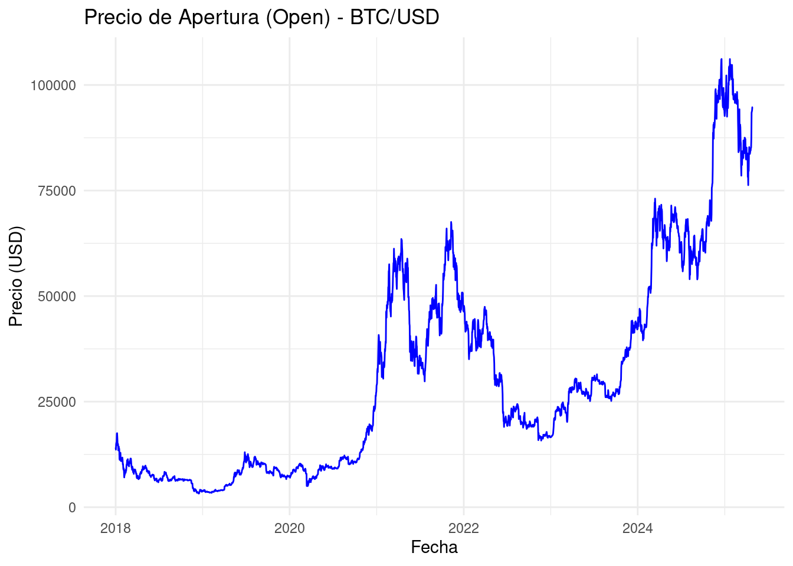

``` r
# Gráfico de High
ggplot(tc_df, aes(x = date, y = BTC.USD.High)) +
  geom_line(color = "green") +
  labs(title = "Precio más Alto (High) - BTC/USD",
       x = "Fecha",
       y = "Precio (USD)") +
  theme_minimal()
```

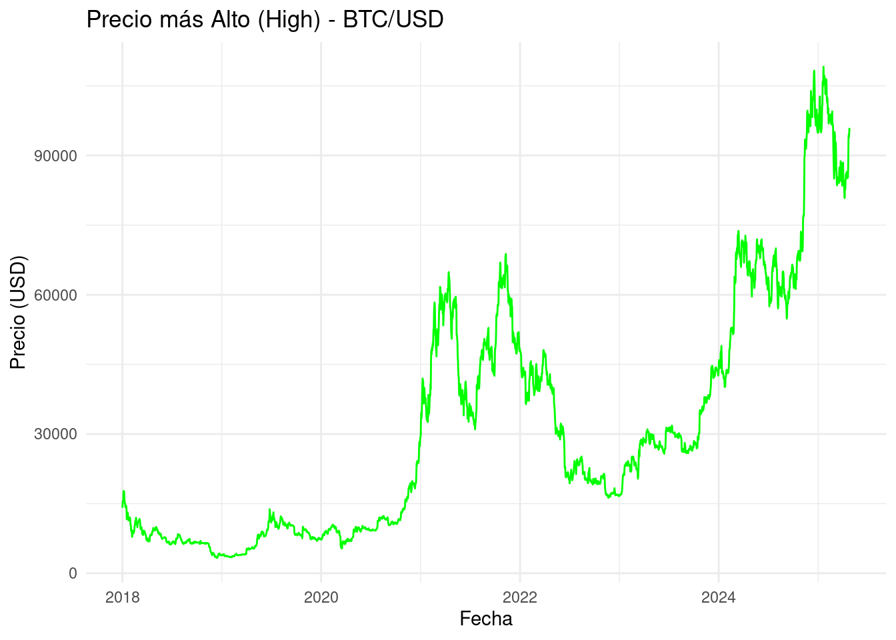

``` r
# gráfico de Low
ggplot(tc_df, aes(x = date, y = BTC.USD.Low)) +
  geom_line(color = "red") +
  labs(title = "Precio más Bajo (Low) - BTC/USD",
       x = "Fecha",
       y = "Precio (USD)") +
  theme_minimal()
```

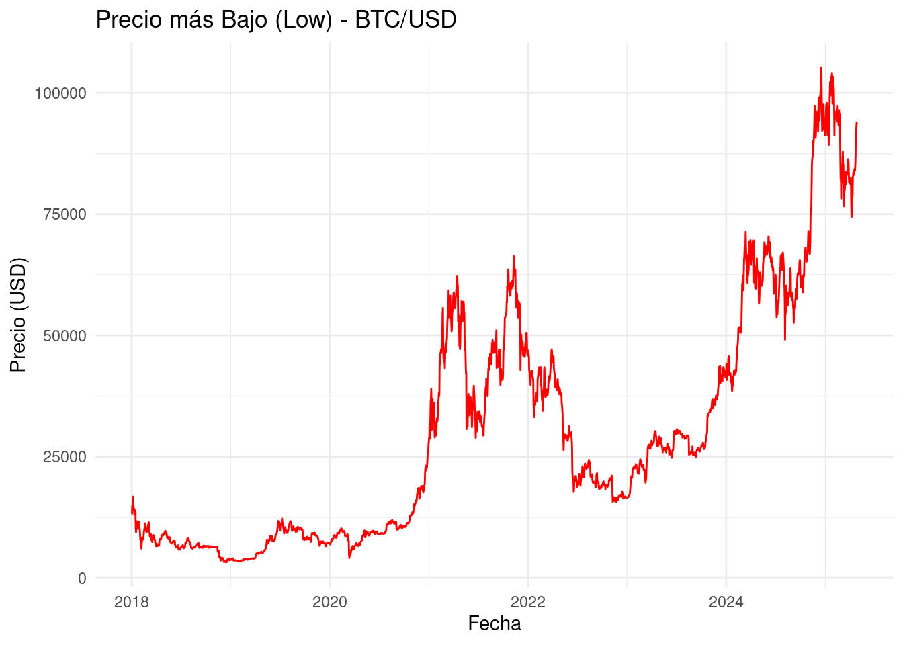

``` r
# Gráfico de Close
ggplot(tc_df, aes(x = date, y = BTC.USD.Close)) +
  geom_line(color = "purple") +
  labs(title = "Precio de Cierre (Close) - BTC/USD",
       x = "Fecha",
       y = "Precio (USD)") +
  theme_minimal()
```

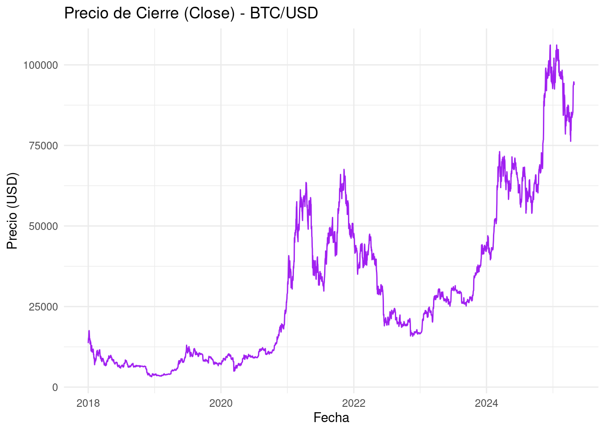

**2. Grafico de seasonal**


``` r
# Extraemos la serie de precios de cierre
btc_close <- tc_df$BTC.USD.Close

# Convertir a objeto de serie de tiempo (ts)
# Frecuencia = 365 asumiendo datos diarios
btc_close_ts <- ts(btc_close, start = c(2018, 1), frequency = 365)
```


``` r
ggseasonplot(btc_close_ts, year.labels = TRUE) +
  ggtitle("Seasonal Plot - BTC/USD Close Price")
```

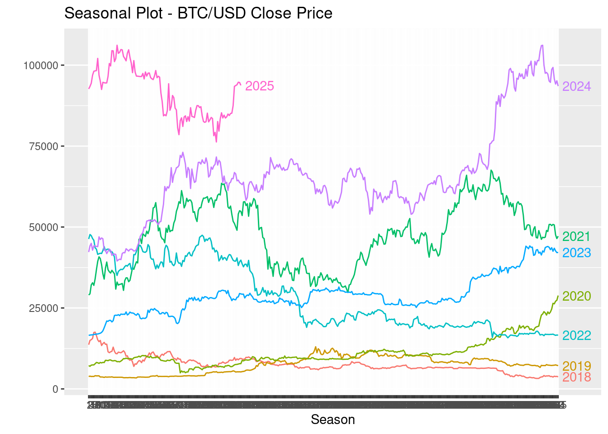
**3. Grafico de subserie**

``` r
ggsubseriesplot(btc_close_ts) +
  ggtitle("Subseries Plot - BTC/USD Close Price")
```

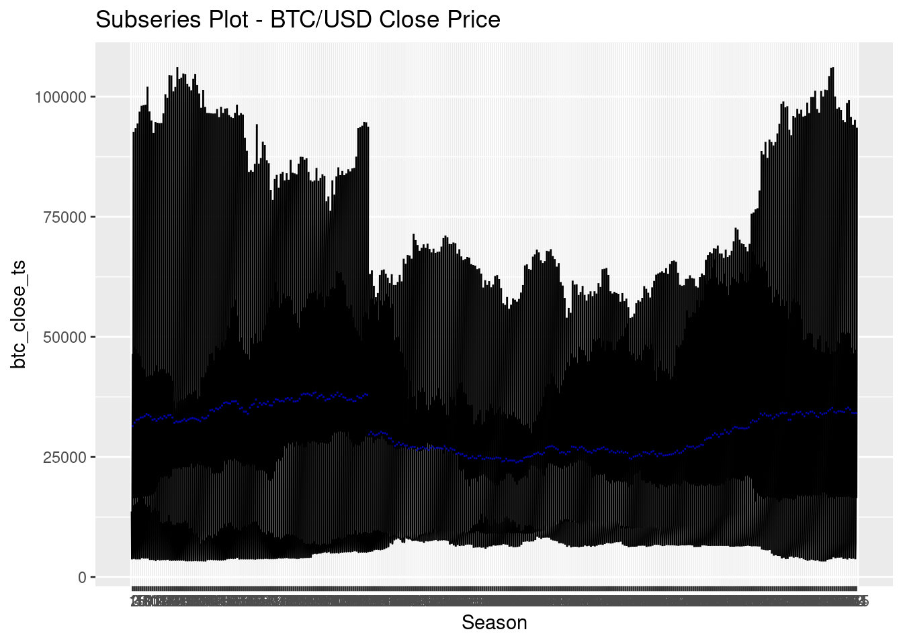

**4. Grafico de autocorrelación**


``` r
ggAcf(btc_close_ts) +
  ggtitle("ACF - BTC/USD Close Price")
```

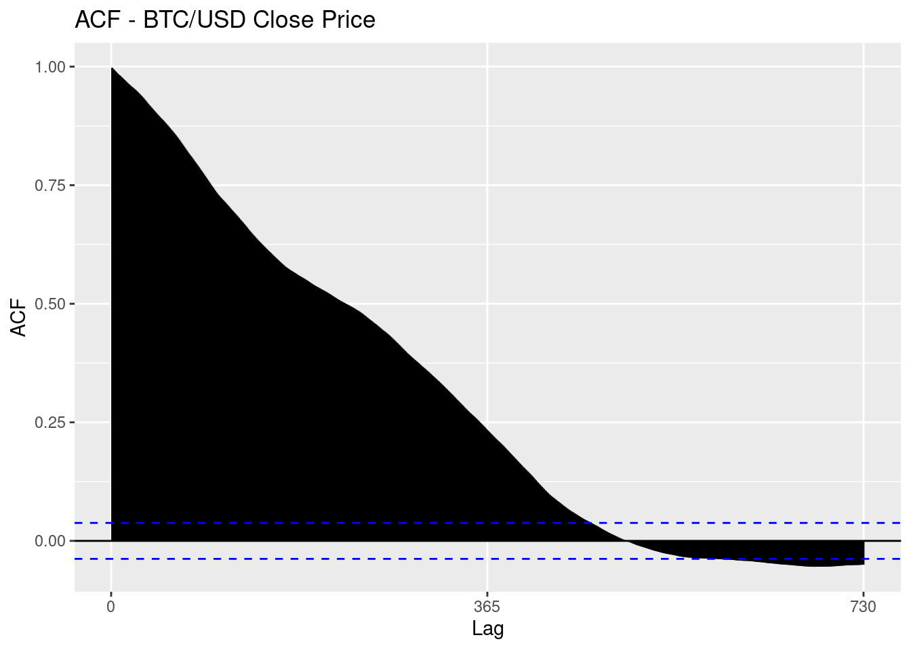

**5. Grafico de descomposición de la serie de tiempo**


``` r
# Descomposición
btc_close_decomp <- decompose(btc_close_ts)

# Graficar la descomposición
plot(btc_close_decomp)
```

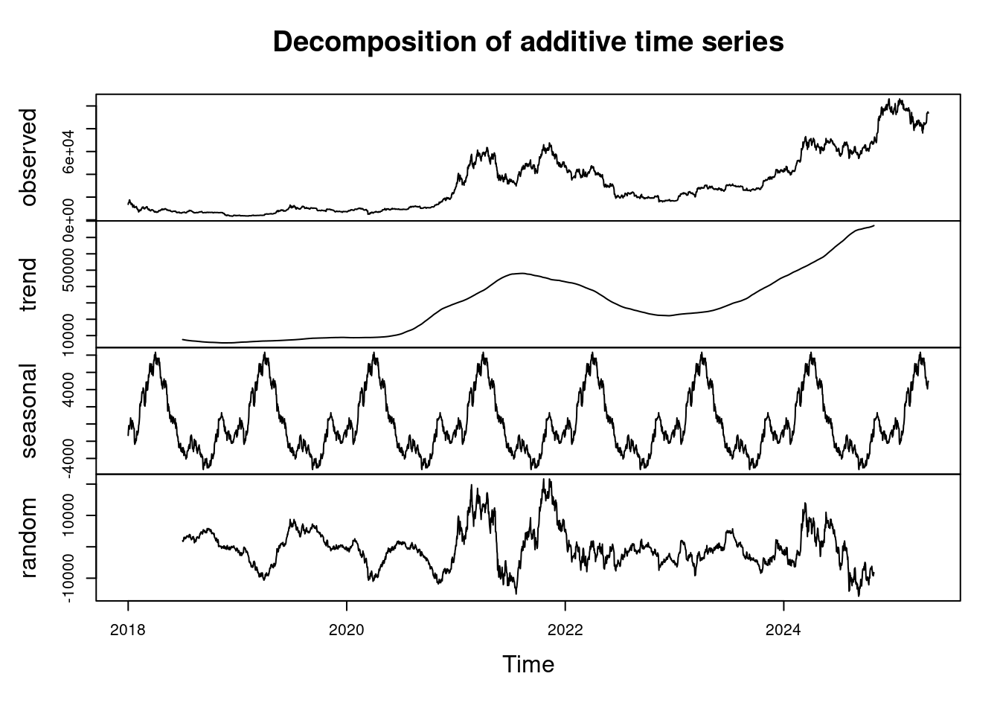

**6. Grafica de retraso**


``` r
# Desplazamiento de 5 periodos atrás
btc_close_lag5 <- stats::lag(btc_close_ts, k = -5)

# Graficar el backshift
plot(btc_close_lag5, main = "Backshift de 5 periodos - BTC/USD Close",
     ylab = "Precio (USD)", xlab = "Fecha", col = "blue")
lines(btc_close_ts, col = "gray")  # Opcional: agregar la serie original en gris
legend("topleft", legend = c("Backshift (Lag 5)", "Original"), col = c("blue", "gray"), lty = 1)
```

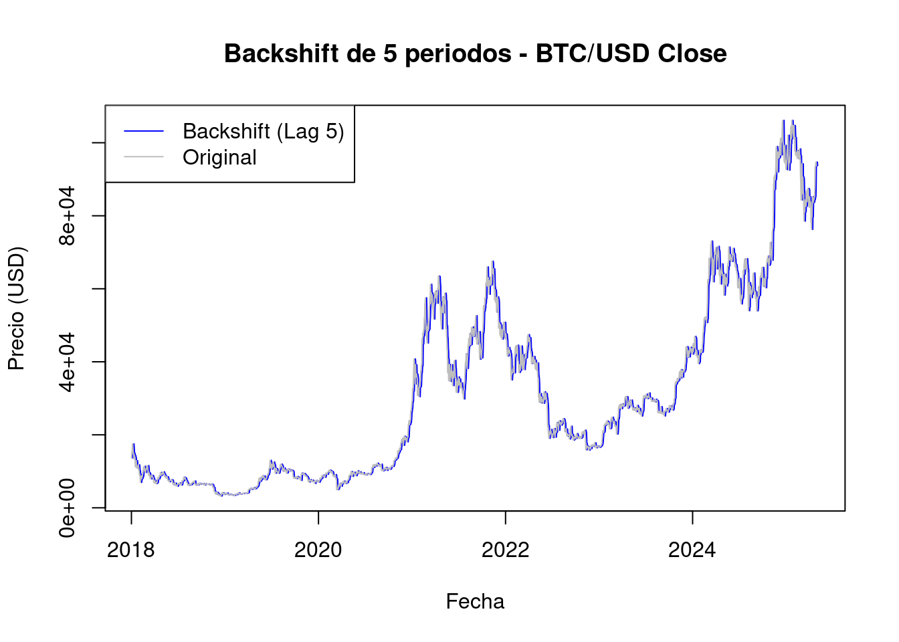

**7. Grafico de diferenciación**


``` r
# Diferencia de la serie
btc_close_diff <- diff(btc_close_ts)

# Graficar la serie diferenciada
plot(btc_close_diff, main = "Diferencia de 1 periodo - BTC/USD Close",
     ylab = "Cambio en Precio (USD)", xlab = "Fecha", col = "red")
abline(h = 0, lty = 2, col = "black")  
```

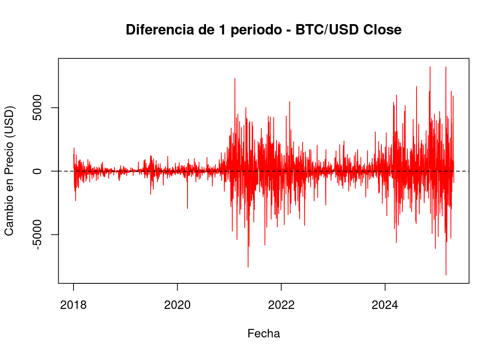

**8. Grafico de medias moviles**


``` r
# Media móvil de 5 periodos
ma_5 <- rollmean(btc_close_ts, k = 5, fill = NA, align = "right")

# Media móvil de 10 periodos
ma_10 <- rollmean(btc_close_ts, k = 10, fill = NA, align = "right")
```

``` r
# Grafica
plot(btc_close_ts, main = "BTC/USD Close con Medias Móviles (5 y 10 periodos)",
     ylab = "Precio (USD)", xlab = "Fecha", col = "black", lwd = 1)

lines(ma_5, col = "blue", lwd = 2)
lines(ma_10, col = "red", lwd = 2)

legend("topleft",
       legend = c("Precio Cierre", "Media Móvil 5", "Media Móvil 10"),
       col = c("black", "blue", "red"),
       lty = 1,
       lwd = 2)
```

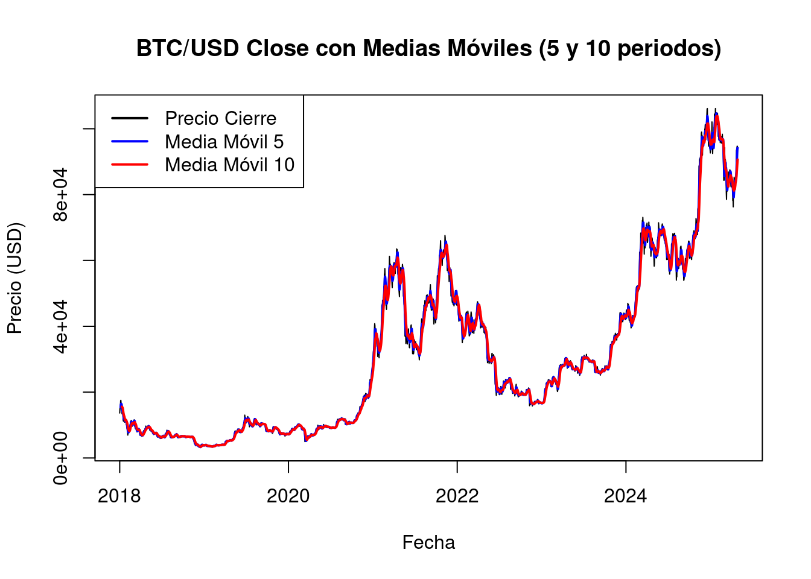

**9. Grafico de precios y medias moviles interactivo **


``` r
tc_df <- tc_df %>%
  mutate(
    MA5 = rollmean(BTC.USD.Close, k = 5, fill = NA, align = "right"),
    MA10 = rollmean(BTC.USD.Close, k = 10, fill = NA, align = "right")
  )

# Crear gráfico
p <- tc_df %>%
  ggplot(aes(x = date)) +
  
  # Área del precio de cierre
  geom_area(aes(y = BTC.USD.Close), fill = "#69b3a2", alpha = 0.3) +
  geom_line(aes(y = BTC.USD.Close, color = "Precio Cierre"), size = 1) +
  
  # Línea MA5
  geom_line(aes(y = MA5, color = "Media Móvil 5"), size = 0.8) +
  
  # Línea MA10
  geom_line(aes(y = MA10, color = "Media Móvil 10"), size = 0.8) +
  
  ylab("Precio BTC/USD ($)") +
  xlab("Fecha") +
  ggtitle("Precio de Bitcoin con Medias Móviles (5 y 10 periodos)") +
  theme_ipsum() +
  scale_color_manual(values = c(
    "Precio Cierre" = "#69b3a2",
    "Media Móvil 5" = "blue",
    "Media Móvil 10" = "red"
  ))
```

```
## Warning: Using `size` aesthetic for lines was deprecated in ggplot2 3.4.0.
## ℹ Please use `linewidth` instead.
## This warning is displayed once every 8 hours.
## Call `lifecycle::last_lifecycle_warnings()` to see where this warning was
## generated.
```

``` r
# Hacer el gráfico interactivo
p <- ggplotly(p)

# Mostrar
p
```

```{=html}
<div class="plotly html-widget html-fill-item" id="htmlwidget-34644d8b9f98331cc516" style="width:672px;height:480px;"></div>
<script type="application/json" data-for="htmlwidget-34644d8b9f98331cc516">{"x":{"data":[{"x":[17531.666666666668,17532,17532.333333333332,17532.666666666668,17533,17533.333333333332,17533.666666666668,17534,17534.333333333332,17534.666666666668,17535,17535.333333333332,17535.666666666668,17536,17536.333333333332,17536.666666666668,17537,17537.333333333332,17537.666666666668,17538,17538.333333333332,17538.666666666668,17539,17539.333333333332,17539.666666666668,17540,17540.333333333332,17540.666666666668,17541,17541.333333333332,17541.666666666668,17542,17542.333333333332,17542.666666666668,17543,17543.333333333332,17543.666666666668,17544,17544.333333333332,17544.666666666668,17545,17545.333333333332,17545.666666666668,17546,17546.333333333332,17546.666666666668,17547,17547.333333333332,17547.666666666668,17548,17548.333333333332,17548.666666666668,17549,17549.333333333332,17549.666666666668,17550,17550.333333333332,17550.666666666668,17551,17551.333333333332,17551.666666666668,17552,17552.333333333332,17552.666666666668,17553,17553.333333333332,17553.666666666668,17554,17554.333333333332,17554.666666666668,17555,17555.333333333332,17555.666666666668,17556,17556.333333333332,17556.666666666668,17557,17557.333333333332,17557.666666666668,17558,17558.333333333332,17558.666666666668,17559,17559.333333333332,17559.666666666668,17560,17560.333333333332,17560.666666666668,17561,17561.333333333332,17561.666666666668,17562,17562.333333333332,17562.666666666668,17563,17563.333333333332,17563.666666666668,17564,17564.333333333332,17564.666666666668,17565,17565.333333333332,17565.666666666668,17566,17566.333333333332,17566.666666666668,17567,17567.333333333332,17567.666666666668,17568,17568.333333333332,17568.666666666668,17569,17569.333333333332,17569.666666666668,17570,17570.333333333332,17570.666666666668,17571,17571.333333333332,17571.666666666668,17572,17572.333333333332,17572.666666666668,17573,17573.333333333332,17573.666666666668,17574,17574.333333333332,17574.666666666668,17575,17575.333333333332,17575.666666666668,17576,17576.333333333332,17576.666666666668,17577,17577.333333333332,17577.666666666668,17578,17578.333333333332,17578.666666666668,17579,17579.333333333332,17579.666666666668,17580,17580.333333333332,17580.666666666668,17581,17581.333333333332,17581.666666666668,17582,17582.333333333332,17582.666666666668,17583,17583.333333333332,17583.666666666668,17584,17584.333333333332,17584.666666666668,17585,17585.333333333332,17585.666666666668,17586,17586.333333333332,17586.666666666668,17587,17587.333333333332,17587.666666666668,17588,17588.333333333332,17588.666666666668,17589,17589.333333333332,17589.666666666668,17590,17590.333333333332,17590.666666666668,17591,17591.333333333332,17591.666666666668,17592,17592.333333333332,17592.666666666668,17593,17593.333333333332,17593.666666666668,17594,17594.333333333332,17594.666666666668,17595,17595.333333333332,17595.666666666668,17596,17596.333333333332,17596.666666666668,17597,17597.333333333332,17597.666666666668,17598,17598.333333333332,17598.666666666668,17599,17599.333333333332,17599.666666666668,17600,17600.333333333332,17600.666666666668,17601,17601.333333333332,17601.666666666668,17602,17602.333333333332,17602.666666666668,17603,17603.333333333332,17603.666666666668,17604,17604.333333333332,17604.666666666668,17605,17605.333333333332,17605.666666666668,17606,17606.333333333332,17606.666666666668,17607,17607.333333333332,17607.666666666668,17608,17608.333333333332,17608.666666666668,17609,17609.333333333332,17609.666666666668,17610,17610.333333333332,17610.666666666668,17611,17611.333333333332,17611.666666666668,17612,17612.333333333332,17612.666666666668,17613,17613.333333333332,17613.666666666668,17614,17614.333333333332,17614.666666666668,17615,17615.333333333332,17615.666666666668,17616,17616.333333333332,17616.666666666668,17617,17617.333333333332,17617.666666666668,17618,17618.333333333332,17618.666666666668,17619,17619.333333333332,17619.666666666668,17620,17620.333333333332,17620.666666666668,17621,17621.333333333332,17621.666666666668,17622,17622.333333333332,17622.666666666668,17623,17623.333333333332,17623.666666666668,17624,17624.333333333332,17624.666666666668,17625,17625.333333333332,17625.666666666668,17626,17626.333333333332,17626.666666666668,17627,17627.333333333332,17627.666666666668,17628,17628.333333333332,17628.666666666668,17629,17629.333333333332,17629.666666666668,17630,17630.333333333332,17630.666666666668,17631,17631.333333333332,17631.666666666668,17632,17632.333333333332,17632.666666666668,17633,17633.333333333332,17633.666666666668,17634,17634.333333333332,17634.666666666668,17635,17635.333333333332,17635.666666666668,17636,17636.333333333332,17636.666666666668,17637,17637.333333333332,17637.666666666668,17638,17638.333333333332,17638.666666666668,17639,17639.333333333332,17639.666666666668,17640,17640.333333333332,17640.666666666668,17641,17641.333333333332,17641.666666666668,17642,17642.333333333332,17642.666666666668,17643,17643.333333333332,17643.666666666668,17644,17644.333333333332,17644.666666666668,17645,17645.333333333332,17645.666666666668,17646,17646.333333333332,17646.666666666668,17647,17647.333333333332,17647.666666666668,17648,17648.333333333332,17648.666666666668,17649,17649.333333333332,17649.666666666668,17650,17650.333333333332,17650.666666666668,17651,17651.333333333332,17651.666666666668,17652,17652.333333333332,17652.666666666668,17653,17653.333333333332,17653.666666666668,17654,17654.333333333332,17654.666666666668,17655,17655.333333333332,17655.666666666668,17656,17656.333333333332,17656.666666666668,17657,17657.333333333332,17657.666666666668,17658,17658.333333333332,17658.666666666668,17659,17659.333333333332,17659.666666666668,17660,17660.333333333332,17660.666666666668,17661,17661.333333333332,17661.666666666668,17662,17662.333333333332,17662.666666666668,17663,17663.333333333332,17663.666666666668,17664,17664.333333333332,17664.666666666668,17665,17665.333333333332,17665.666666666668,17666,17666.333333333332,17666.666666666668,17667,17667.333333333332,17667.666666666668,17668,17668.333333333332,17668.666666666668,17669,17669.333333333332,17669.666666666668,17670,17670.333333333332,17670.666666666668,17671,17671.333333333332,17671.666666666668,17672,17672.333333333332,17672.666666666668,17673,17673.333333333332,17673.666666666668,17674,17674.333333333332,17674.666666666668,17675,17675.333333333332,17675.666666666668,17676,17676.333333333332,17676.666666666668,17677,17677.333333333332,17677.666666666668,17678,17678.333333333332,17678.666666666668,17679,17679.333333333332,17679.666666666668,17680,17680.333333333332,17680.666666666668,17681,17681.333333333332,17681.666666666668,17682,17682.333333333332,17682.666666666668,17683,17683.333333333332,17683.666666666668,17684,17684.333333333332,17684.666666666668,17685,17685.333333333332,17685.666666666668,17686,17686.333333333332,17686.666666666668,17687,17687.333333333332,17687.666666666668,17688,17688.333333333332,17688.666666666668,17689,17689.333333333332,17689.666666666668,17690,17690.333333333332,17690.666666666668,17691,17691.333333333332,17691.666666666668,17692,17692.333333333332,17692.666666666668,17693,17693.333333333332,17693.666666666668,17694,17694.333333333332,17694.666666666668,17695,17695.333333333332,17695.666666666668,17696,17696.333333333332,17696.666666666668,17697,17697.333333333332,17697.666666666668,17698,17698.333333333332,17698.666666666668,17699,17699.333333333332,17699.666666666668,17700,17700.333333333332,17700.666666666668,17701,17701.333333333332,17701.666666666668,17702,17702.333333333332,17702.666666666668,17703,17703.333333333332,17703.666666666668,17704,17704.333333333332,17704.666666666668,17705,17705.333333333332,17705.666666666668,17706,17706.333333333332,17706.666666666668,17707,17707.333333333332,17707.666666666668,17708,17708.333333333332,17708.666666666668,17709,17709.333333333332,17709.666666666668,17710,17710.333333333332,17710.666666666668,17711,17711.333333333332,17711.666666666668,17712,17712.333333333332,17712.666666666668,17713,17713.333333333332,17713.666666666668,17714,17714.333333333332,17714.666666666668,17715,17715.333333333332,17715.666666666668,17716,17716.333333333332,17716.666666666668,17717,17717.333333333332,17717.666666666668,17718,17718.333333333332,17718.666666666668,17719,17719.333333333332,17719.666666666668,17720,17720.333333333332,17720.666666666668,17721,17721.333333333332,17721.666666666668,17722,17722.333333333332,17722.666666666668,17723,17723.333333333332,17723.666666666668,17724,17724.333333333332,17724.666666666668,17725,17725.333333333332,17725.666666666668,17726,17726.333333333332,17726.666666666668,17727,17727.333333333332,17727.666666666668,17728,17728.333333333332,17728.666666666668,17729,17729.333333333332,17729.666666666668,17730,17730.333333333332,17730.666666666668,17731,17731.333333333332,17731.666666666668,17732,17732.333333333332,17732.666666666668,17733,17733.333333333332,17733.666666666668,17734,17734.333333333332,17734.666666666668,17735,17735.333333333332,17735.666666666668,17736,17736.333333333332,17736.666666666668,17737,17737.333333333332,17737.666666666668,17738,17738.333333333332,17738.666666666668,17739,17739.333333333332,17739.666666666668,17740,17740.333333333332,17740.666666666668,17741,17741.333333333332,17741.666666666668,17742,17742.333333333332,17742.666666666668,17743,17743.333333333332,17743.666666666668,17744,17744.333333333332,17744.666666666668,17745,17745.333333333332,17745.666666666668,17746,17746.333333333332,17746.666666666668,17747,17747.333333333332,17747.666666666668,17748,17748.333333333332,17748.666666666668,17749,17749.333333333332,17749.666666666668,17750,17750.333333333332,17750.666666666668,17751,17751.333333333332,17751.666666666668,17752,17752.333333333332,17752.666666666668,17753,17753.333333333332,17753.666666666668,17754,17754.333333333332,17754.666666666668,17755,17755.333333333332,17755.666666666668,17756,17756.333333333332,17756.666666666668,17757,17757.333333333332,17757.666666666668,17758,17758.333333333332,17758.666666666668,17759,17759.333333333332,17759.666666666668,17760,17760.333333333332,17760.666666666668,17761,17761.333333333332,17761.666666666668,17762,17762.333333333332,17762.666666666668,17763,17763.333333333332,17763.666666666668,17764,17764.333333333332,17764.666666666668,17765,17765.333333333332,17765.666666666668,17766,17766.333333333332,17766.666666666668,17767,17767.333333333332,17767.666666666668,17768,17768.333333333332,17768.666666666668,17769,17769.333333333332,17769.666666666668,17770,17770.333333333332,17770.666666666668,17771,17771.333333333332,17771.666666666668,17772,17772.333333333332,17772.666666666668,17773,17773.333333333332,17773.666666666668,17774,17774.333333333332,17774.666666666668,17775,17775.333333333332,17775.666666666668,17776,17776.333333333332,17776.666666666668,17777,17777.333333333332,17777.666666666668,17778,17778.333333333332,17778.666666666668,17779,17779.333333333332,17779.666666666668,17780,17780.333333333332,17780.666666666668,17781,17781.333333333332,17781.666666666668,17782,17782.333333333332,17782.666666666668,17783,17783.333333333332,17783.666666666668,17784,17784.333333333332,17784.666666666668,17785,17785.333333333332,17785.666666666668,17786,17786.333333333332,17786.666666666668,17787,17787.333333333332,17787.666666666668,17788,17788.333333333332,17788.666666666668,17789,17789.333333333332,17789.666666666668,17790,17790.333333333332,17790.666666666668,17791,17791.333333333332,17791.666666666668,17792,17792.333333333332,17792.666666666668,17793,17793.333333333332,17793.666666666668,17794,17794.333333333332,17794.666666666668,17795,17795.333333333332,17795.666666666668,17796,17796.333333333332,17796.666666666668,17797,17797.333333333332,17797.666666666668,17798,17798.333333333332,17798.666666666668,17799,17799.333333333332,17799.666666666668,17800,17800.333333333332,17800.666666666668,17801,17801.333333333332,17801.666666666668,17802,17802.333333333332,17802.666666666668,17803,17803.333333333332,17803.666666666668,17804,17804.333333333332,17804.666666666668,17805,17805.333333333332,17805.666666666668,17806,17806.333333333332,17806.666666666668,17807,17807.333333333332,17807.666666666668,17808,17808.333333333332,17808.666666666668,17809,17809.333333333332,17809.666666666668,17810,17810.333333333332,17810.666666666668,17811,17811.333333333332,17811.666666666668,17812,17812.333333333332,17812.666666666668,17813,17813.333333333332,17813.666666666668,17814,17814.333333333332,17814.666666666668,17815,17815.333333333332,17815.666666666668,17816,17816.333333333332,17816.666666666668,17817,17817.333333333332,17817.666666666668,17818,17818.333333333332,17818.666666666668,17819,17819.333333333332,17819.666666666668,17820,17820.333333333332,17820.666666666668,17821,17821.333333333332,17821.666666666668,17822,17822.333333333332,17822.666666666668,17823,17823.333333333332,17823.666666666668,17824,17824.333333333332,17824.666666666668,17825,17825.333333333332,17825.666666666668,17826,17826.333333333332,17826.666666666668,17827,17827.333333333332,17827.666666666668,17828,17828.333333333332,17828.666666666668,17829,17829.333333333332,17829.666666666668,17830,17830.333333333332,17830.666666666668,17831,17831.333333333332,17831.666666666668,17832,17832.333333333332,17832.666666666668,17833,17833.333333333332,17833.666666666668,17834,17834.333333333332,17834.666666666668,17835,17835.333333333332,17835.666666666668,17836,17836.333333333332,17836.666666666668,17837,17837.333333333332,17837.666666666668,17838,17838.333333333332,17838.666666666668,17839,17839.333333333332,17839.666666666668,17840,17840.333333333332,17840.666666666668,17841,17841.333333333332,17841.666666666668,17842,17842.333333333332,17842.666666666668,17843,17843.333333333332,17843.666666666668,17844,17844.333333333332,17844.666666666668,17845,17845.333333333332,17845.666666666668,17846,17846.333333333332,17846.666666666668,17847,17847.333333333332,17847.666666666668,17848,17848.333333333332,17848.666666666668,17849,17849.333333333332,17849.666666666668,17850,17850.333333333332,17850.666666666668,17851,17851.333333333332,17851.666666666668,17852,17852.333333333332,17852.666666666668,17853,17853.333333333332,17853.666666666668,17854,17854.333333333332,17854.666666666668,17855,17855.333333333332,17855.666666666668,17856,17856.333333333332,17856.666666666668,17857,17857.333333333332,17857.666666666668,17858,17858.333333333332,17858.666666666668,17859,17859.333333333332,17859.666666666668,17860,17860.333333333332,17860.666666666668,17861,17861.333333333332,17861.666666666668,17862,17862.333333333332,17862.666666666668,17863,17863.333333333332,17863.666666666668,17864,17864.333333333332,17864.666666666668,17865,17865.333333333332,17865.666666666668,17866,17866.333333333332,17866.666666666668,17867,17867.333333333332,17867.666666666668,17868,17868.333333333332,17868.666666666668,17869,17869.333333333332,17869.666666666668,17870,17870.333333333332,17870.666666666668,17871,17871.333333333332,17871.666666666668,17872,17872.333333333332,17872.666666666668,17873,17873.333333333332,17873.666666666668,17874,17874.333333333332,17874.666666666668,17875,17875.333333333332,17875.666666666668,17876,17876.333333333332,17876.666666666668,17877,17877.333333333332,17877.666666666668,17878,17878.333333333332,17878.666666666668,17879,17879.333333333332,17879.666666666668,17880,17880.333333333332,17880.666666666668,17881,17881.333333333332,17881.666666666668,17882,17882.333333333332,17882.666666666668,17883,17883.333333333332,17883.666666666668,17884,17884.333333333332,17884.666666666668,17885,17885.333333333332,17885.666666666668,17886,17886.333333333332,17886.666666666668,17887,17887.333333333332,17887.666666666668,17888,17888.333333333332,17888.666666666668,17889,17889.333333333332,17889.666666666668,17890,17890.333333333332,17890.666666666668,17891,17891.333333333332,17891.666666666668,17892,17892.333333333332,17892.666666666668,17893,17893.333333333332,17893.666666666668,17894,17894.333333333332,17894.666666666668,17895,17895.333333333332,17895.666666666668,17896,17896.333333333332,17896.666666666668,17897,17897.333333333332,17897.666666666668,17898,17898.333333333332,17898.666666666668,17899,17899.333333333332,17899.666666666668,17900,17900.333333333332,17900.666666666668,17901,17901.333333333332,17901.666666666668,17902,17902.333333333332,17902.666666666668,17903,17903.333333333332,17903.666666666668,17904,17904.333333333332,17904.666666666668,17905,17905.333333333332,17905.666666666668,17906,17906.333333333332,17906.666666666668,17907,17907.333333333332,17907.666666666668,17908,17908.333333333332,17908.666666666668,17909,17909.333333333332,17909.666666666668,17910,17910.333333333332,17910.666666666668,17911,17911.333333333332,17911.666666666668,17912,17912.333333333332,17912.666666666668,17913,17913.333333333332,17913.666666666668,17914,17914.333333333332,17914.666666666668,17915,17915.333333333332,17915.666666666668,17916,17916.333333333332,17916.666666666668,17917,17917.333333333332,17917.666666666668,17918,17918.333333333332,17918.666666666668,17919,17919.333333333332,17919.666666666668,17920,17920.333333333332,17920.666666666668,17921,17921.333333333332,17921.666666666668,17922,17922.333333333332,17922.666666666668,17923,17923.333333333332,17923.666666666668,17924,17924.333333333332,17924.666666666668,17925,17925.333333333332,17925.666666666668,17926,17926.333333333332,17926.666666666668,17927,17927.333333333332,17927.666666666668,17928,17928.333333333332,17928.666666666668,17929,17929.333333333332,17929.666666666668,17930,17930.333333333332,17930.666666666668,17931,17931.333333333332,17931.666666666668,17932,17932.333333333332,17932.666666666668,17933,17933.333333333332,17933.666666666668,17934,17934.333333333332,17934.666666666668,17935,17935.333333333332,17935.666666666668,17936,17936.333333333332,17936.666666666668,17937,17937.333333333332,17937.666666666668,17938,17938.333333333332,17938.666666666668,17939,17939.333333333332,17939.666666666668,17940,17940.333333333332,17940.666666666668,17941,17941.333333333332,17941.666666666668,17942,17942.333333333332,17942.666666666668,17943,17943.333333333332,17943.666666666668,17944,17944.333333333332,17944.666666666668,17945,17945.333333333332,17945.666666666668,17946,17946.333333333332,17946.666666666668,17947,17947.333333333332,17947.666666666668,17948,17948.333333333332,17948.666666666668,17949,17949.333333333332,17949.666666666668,17950,17950.333333333332,17950.666666666668,17951,17951.333333333332,17951.666666666668,17952,17952.333333333332,17952.666666666668,17953,17953.333333333332,17953.666666666668,17954,17954.333333333332,17954.666666666668,17955,17955.333333333332,17955.666666666668,17956,17956.333333333332,17956.666666666668,17957,17957.333333333332,17957.666666666668,17958,17958.333333333332,17958.666666666668,17959,17959.333333333332,17959.666666666668,17960,17960.333333333332,17960.666666666668,17961,17961.333333333332,17961.666666666668,17962,17962.333333333332,17962.666666666668,17963,17963.333333333332,17963.666666666668,17964,17964.333333333332,17964.666666666668,17965,17965.333333333332,17965.666666666668,17966,17966.333333333332,17966.666666666668,17967,17967.333333333332,17967.666666666668,17968,17968.333333333332,17968.666666666668,17969,17969.333333333332,17969.666666666668,17970,17970.333333333332,17970.666666666668,17971,17971.333333333332,17971.666666666668,17972,17972.333333333332,17972.666666666668,17973,17973.333333333332,17973.666666666668,17974,17974.333333333332,17974.666666666668,17975,17975.333333333332,17975.666666666668,17976,17976.333333333332,17976.666666666668,17977,17977.333333333332,17977.666666666668,17978,17978.333333333332,17978.666666666668,17979,17979.333333333332,17979.666666666668,17980,17980.333333333332,17980.666666666668,17981,17981.333333333332,17981.666666666668,17982,17982.333333333332,17982.666666666668,17983,17983.333333333332,17983.666666666668,17984,17984.333333333332,17984.666666666668,17985,17985.333333333332,17985.666666666668,17986,17986.333333333332,17986.666666666668,17987,17987.333333333332,17987.666666666668,17988,17988.333333333332,17988.666666666668,17989,17989.333333333332,17989.666666666668,17990,17990.333333333332,17990.666666666668,17991,17991.333333333332,17991.666666666668,17992,17992.333333333332,17992.666666666668,17993,17993.333333333332,17993.666666666668,17994,17994.333333333332,17994.666666666668,17995,17995.333333333332,17995.666666666668,17996,17996.333333333332,17996.666666666668,17997,17997.333333333332,17997.666666666668,17998,17998.333333333332,17998.666666666668,17999,17999.333333333332,17999.666666666668,18000,18000.333333333332,18000.666666666668,18001,18001.333333333332,18001.666666666668,18002,18002.333333333332,18002.666666666668,18003,18003.333333333332,18003.666666666668,18004,18004.333333333332,18004.666666666668,18005,18005.333333333332,18005.666666666668,18006,18006.333333333332,18006.666666666668,18007,18007.333333333332,18007.666666666668,18008,18008.333333333332,18008.666666666668,18009,18009.333333333332,18009.666666666668,18010,18010.333333333332,18010.666666666668,18011,18011.333333333332,18011.666666666668,18012,18012.333333333332,18012.666666666668,18013,18013.333333333332,18013.666666666668,18014,18014.333333333332,18014.666666666668,18015,18015.333333333332,18015.666666666668,18016,18016.333333333332,18016.666666666668,18017,18017.333333333332,18017.666666666668,18018,18018.333333333332,18018.666666666668,18019,18019.333333333332,18019.666666666668,18020,18020.333333333332,18020.666666666668,18021,18021.333333333332,18021.666666666668,18022,18022.333333333332,18022.666666666668,18023,18023.333333333332,18023.666666666668,18024,18024.333333333332,18024.666666666668,18025,18025.333333333332,18025.666666666668,18026,18026.333333333332,18026.666666666668,18027,18027.333333333332,18027.666666666668,18028,18028.333333333332,18028.666666666668,18029,18029.333333333332,18029.666666666668,18030,18030.333333333332,18030.666666666668,18031,18031.333333333332,18031.666666666668,18032,18032.333333333332,18032.666666666668,18033,18033.333333333332,18033.666666666668,18034,18034.333333333332,18034.666666666668,18035,18035.333333333332,18035.666666666668,18036,18036.333333333332,18036.666666666668,18037,18037.333333333332,18037.666666666668,18038,18038.333333333332,18038.666666666668,18039,18039.333333333332,18039.666666666668,18040,18040.333333333332,18040.666666666668,18041,18041.333333333332,18041.666666666668,18042,18042.333333333332,18042.666666666668,18043,18043.333333333332,18043.666666666668,18044,18044.333333333332,18044.666666666668,18045,18045.333333333332,18045.666666666668,18046,18046.333333333332,18046.666666666668,18047,18047.333333333332,18047.666666666668,18048,18048.333333333332,18048.666666666668,18049,18049.333333333332,18049.666666666668,18050,18050.333333333332,18050.666666666668,18051,18051.333333333332,18051.666666666668,18052,18052.333333333332,18052.666666666668,18053,18053.333333333332,18053.666666666668,18054,18054.333333333332,18054.666666666668,18055,18055.333333333332,18055.666666666668,18056,18056.333333333332,18056.666666666668,18057,18057.333333333332,18057.666666666668,18058,18058.333333333332,18058.666666666668,18059,18059.333333333332,18059.666666666668,18060,18060.333333333332,18060.666666666668,18061,18061.333333333332,18061.666666666668,18062,18062.333333333332,18062.666666666668,18063,18063.333333333332,18063.666666666668,18064,18064.333333333332,18064.666666666668,18065,18065.333333333332,18065.666666666668,18066,18066.333333333332,18066.666666666668,18067,18067.333333333332,18067.666666666668,18068,18068.333333333332,18068.666666666668,18069,18069.333333333332,18069.666666666668,18070,18070.333333333332,18070.666666666668,18071,18071.333333333332,18071.666666666668,18072,18072.333333333332,18072.666666666668,18073,18073.333333333332,18073.666666666668,18074,18074.333333333332,18074.666666666668,18075,18075.333333333332,18075.666666666668,18076,18076.333333333332,18076.666666666668,18077,18077.333333333332,18077.666666666668,18078,18078.333333333332,18078.666666666668,18079,18079.333333333332,18079.666666666668,18080,18080.333333333332,18080.666666666668,18081,18081.333333333332,18081.666666666668,18082,18082.333333333332,18082.666666666668,18083,18083.333333333332,18083.666666666668,18084,18084.333333333332,18084.666666666668,18085,18085.333333333332,18085.666666666668,18086,18086.333333333332,18086.666666666668,18087,18087.333333333332,18087.666666666668,18088,18088.333333333332,18088.666666666668,18089,18089.333333333332,18089.666666666668,18090,18090.333333333332,18090.666666666668,18091,18091.333333333332,18091.666666666668,18092,18092.333333333332,18092.666666666668,18093,18093.333333333332,18093.666666666668,18094,18094.333333333332,18094.666666666668,18095,18095.333333333332,18095.666666666668,18096,18096.333333333332,18096.666666666668,18097,18097.333333333332,18097.666666666668,18098,18098.333333333332,18098.666666666668,18099,18099.333333333332,18099.666666666668,18100,18100.333333333332,18100.666666666668,18101,18101.333333333332,18101.666666666668,18102,18102.333333333332,18102.666666666668,18103,18103.333333333332,18103.666666666668,18104,18104.333333333332,18104.666666666668,18105,18105.333333333332,18105.666666666668,18106,18106.333333333332,18106.666666666668,18107,18107.333333333332,18107.666666666668,18108,18108.333333333332,18108.666666666668,18109,18109.333333333332,18109.666666666668,18110,18110.333333333332,18110.666666666668,18111,18111.333333333332,18111.666666666668,18112,18112.333333333332,18112.666666666668,18113,18113.333333333332,18113.666666666668,18114,18114.333333333332,18114.666666666668,18115,18115.333333333332,18115.666666666668,18116,18116.333333333332,18116.666666666668,18117,18117.333333333332,18117.666666666668,18118,18118.333333333332,18118.666666666668,18119,18119.333333333332,18119.666666666668,18120,18120.333333333332,18120.666666666668,18121,18121.333333333332,18121.666666666668,18122,18122.333333333332,18122.666666666668,18123,18123.333333333332,18123.666666666668,18124,18124.333333333332,18124.666666666668,18125,18125.333333333332,18125.666666666668,18126,18126.333333333332,18126.666666666668,18127,18127.333333333332,18127.666666666668,18128,18128.333333333332,18128.666666666668,18129,18129.333333333332,18129.666666666668,18130,18130.333333333332,18130.666666666668,18131,18131.333333333332,18131.666666666668,18132,18132.333333333332,18132.666666666668,18133,18133.333333333332,18133.666666666668,18134,18134.333333333332,18134.666666666668,18135,18135.333333333332,18135.666666666668,18136,18136.333333333332,18136.666666666668,18137,18137.333333333332,18137.666666666668,18138,18138.333333333332,18138.666666666668,18139,18139.333333333332,18139.666666666668,18140,18140.333333333332,18140.666666666668,18141,18141.333333333332,18141.666666666668,18142,18142.333333333332,18142.666666666668,18143,18143.333333333332,18143.666666666668,18144,18144.333333333332,18144.666666666668,18145,18145.333333333332,18145.666666666668,18146,18146.333333333332,18146.666666666668,18147,18147.333333333332,18147.666666666668,18148,18148.333333333332,18148.666666666668,18149,18149.333333333332,18149.666666666668,18150,18150.333333333332,18150.666666666668,18151,18151.333333333332,18151.666666666668,18152,18152.333333333332,18152.666666666668,18153,18153.333333333332,18153.666666666668,18154,18154.333333333332,18154.666666666668,18155,18155.333333333332,18155.666666666668,18156,18156.333333333332,18156.666666666668,18157,18157.333333333332,18157.666666666668,18158,18158.333333333332,18158.666666666668,18159,18159.333333333332,18159.666666666668,18160,18160.333333333332,18160.666666666668,18161,18161.333333333332,18161.666666666668,18162,18162.333333333332,18162.666666666668,18163,18163.333333333332,18163.666666666668,18164,18164.333333333332,18164.666666666668,18165,18165.333333333332,18165.666666666668,18166,18166.333333333332,18166.666666666668,18167,18167.333333333332,18167.666666666668,18168,18168.333333333332,18168.666666666668,18169,18169.333333333332,18169.666666666668,18170,18170.333333333332,18170.666666666668,18171,18171.333333333332,18171.666666666668,18172,18172.333333333332,18172.666666666668,18173,18173.333333333332,18173.666666666668,18174,18174.333333333332,18174.666666666668,18175,18175.333333333332,18175.666666666668,18176,18176.333333333332,18176.666666666668,18177,18177.333333333332,18177.666666666668,18178,18178.333333333332,18178.666666666668,18179,18179.333333333332,18179.666666666668,18180,18180.333333333332,18180.666666666668,18181,18181.333333333332,18181.666666666668,18182,18182.333333333332,18182.666666666668,18183,18183.333333333332,18183.666666666668,18184,18184.333333333332,18184.666666666668,18185,18185.333333333332,18185.666666666668,18186,18186.333333333332,18186.666666666668,18187,18187.333333333332,18187.666666666668,18188,18188.333333333332,18188.666666666668,18189,18189.333333333332,18189.666666666668,18190,18190.333333333332,18190.666666666668,18191,18191.333333333332,18191.666666666668,18192,18192.333333333332,18192.666666666668,18193,18193.333333333332,18193.666666666668,18194,18194.333333333332,18194.666666666668,18195,18195.333333333332,18195.666666666668,18196,18196.333333333332,18196.666666666668,18197,18197.333333333332,18197.666666666668,18198,18198.333333333332,18198.666666666668,18199,18199.333333333332,18199.666666666668,18200,18200.333333333332,18200.666666666668,18201,18201.333333333332,18201.666666666668,18202,18202.333333333332,18202.666666666668,18203,18203.333333333332,18203.666666666668,18204,18204.333333333332,18204.666666666668,18205,18205.333333333332,18205.666666666668,18206,18206.333333333332,18206.666666666668,18207,18207.333333333332,18207.666666666668,18208,18208.333333333332,18208.666666666668,18209,18209.333333333332,18209.666666666668,18210,18210.333333333332,18210.666666666668,18211,18211.333333333332,18211.666666666668,18212,18212.333333333332,18212.666666666668,18213,18213.333333333332,18213.666666666668,18214,18214.333333333332,18214.666666666668,18215,18215.333333333332,18215.666666666668,18216,18216.333333333332,18216.666666666668,18217,18217.333333333332,18217.666666666668,18218,18218.333333333332,18218.666666666668,18219,18219.333333333332,18219.666666666668,18220,18220.333333333332,18220.666666666668,18221,18221.333333333332,18221.666666666668,18222,18222.333333333332,18222.666666666668,18223,18223.333333333332,18223.666666666668,18224,18224.333333333332,18224.666666666668,18225,18225.333333333332,18225.666666666668,18226,18226.333333333332,18226.666666666668,18227,18227.333333333332,18227.666666666668,18228,18228.333333333332,18228.666666666668,18229,18229.333333333332,18229.666666666668,18230,18230.333333333332,18230.666666666668,18231,18231.333333333332,18231.666666666668,18232,18232.333333333332,18232.666666666668,18233,18233.333333333332,18233.666666666668,18234,18234.333333333332,18234.666666666668,18235,18235.333333333332,18235.666666666668,18236,18236.333333333332,18236.666666666668,18237,18237.333333333332,18237.666666666668,18238,18238.333333333332,18238.666666666668,18239,18239.333333333332,18239.666666666668,18240,18240.333333333332,18240.666666666668,18241,18241.333333333332,18241.666666666668,18242,18242.333333333332,18242.666666666668,18243,18243.333333333332,18243.666666666668,18244,18244.333333333332,18244.666666666668,18245,18245.333333333332,18245.666666666668,18246,18246.333333333332,18246.666666666668,18247,18247.333333333332,18247.666666666668,18248,18248.333333333332,18248.666666666668,18249,18249.333333333332,18249.666666666668,18250,18250.333333333332,18250.666666666668,18251,18251.333333333332,18251.666666666668,18252,18252.333333333332,18252.666666666668,18253,18253.333333333332,18253.666666666668,18254,18254.333333333332,18254.666666666668,18255,18255.333333333332,18255.666666666668,18256,18256.333333333332,18256.666666666668,18257,18257.333333333332,18257.666666666668,18258,18258.333333333332,18258.666666666668,18259,18259.333333333332,18259.666666666668,18260,18260.333333333332,18260.666666666668,18261,18261.333333333332,18261.666666666668,18262,18262.333333333332,18262.666666666668,18263,18263.333333333332,18263.666666666668,18264,18264.333333333332,18264.666666666668,18265,18265.333333333332,18265.666666666668,18266,18266.333333333332,18266.666666666668,18267,18267.333333333332,18267.666666666668,18268,18268.333333333332,18268.666666666668,18269,18269.333333333332,18269.666666666668,18270,18270.333333333332,18270.666666666668,18271,18271.333333333332,18271.666666666668,18272,18272.333333333332,18272.666666666668,18273,18273.333333333332,18273.666666666668,18274,18274.333333333332,18274.666666666668,18275,18275.333333333332,18275.666666666668,18276,18276.333333333332,18276.666666666668,18277,18277.333333333332,18277.666666666668,18278,18278.333333333332,18278.666666666668,18279,18279.333333333332,18279.666666666668,18280,18280.333333333332,18280.666666666668,18281,18281.333333333332,18281.666666666668,18282,18282.333333333332,18282.666666666668,18283,18283.333333333332,18283.666666666668,18284,18284.333333333332,18284.666666666668,18285,18285.333333333332,18285.666666666668,18286,18286.333333333332,18286.666666666668,18287,18287.333333333332,18287.666666666668,18288,18288.333333333332,18288.666666666668,18289,18289.333333333332,18289.666666666668,18290,18290.333333333332,18290.666666666668,18291,18291.333333333332,18291.666666666668,18292,18292.333333333332,18292.666666666668,18293,18293.333333333332,18293.666666666668,18294,18294.333333333332,18294.666666666668,18295,18295.333333333332,18295.666666666668,18296,18296.333333333332,18296.666666666668,18297,18297.333333333332,18297.666666666668,18298,18298.333333333332,18298.666666666668,18299,18299.333333333332,18299.666666666668,18300,18300.333333333332,18300.666666666668,18301,18301.333333333332,18301.666666666668,18302,18302.333333333332,18302.666666666668,18303,18303.333333333332,18303.666666666668,18304,18304.333333333332,18304.666666666668,18305,18305.333333333332,18305.666666666668,18306,18306.333333333332,18306.666666666668,18307,18307.333333333332,18307.666666666668,18308,18308.333333333332,18308.666666666668,18309,18309.333333333332,18309.666666666668,18310,18310.333333333332,18310.666666666668,18311,18311.333333333332,18311.666666666668,18312,18312.333333333332,18312.666666666668,18313,18313.333333333332,18313.666666666668,18314,18314.333333333332,18314.666666666668,18315,18315.333333333332,18315.666666666668,18316,18316.333333333332,18316.666666666668,18317,18317.333333333332,18317.666666666668,18318,18318.333333333332,18318.666666666668,18319,18319.333333333332,18319.666666666668,18320,18320.333333333332,18320.666666666668,18321,18321.333333333332,18321.666666666668,18322,18322.333333333332,18322.666666666668,18323,18323.333333333332,18323.666666666668,18324,18324.333333333332,18324.666666666668,18325,18325.333333333332,18325.666666666668,18326,18326.333333333332,18326.666666666668,18327,18327.333333333332,18327.666666666668,18328,18328.333333333332,18328.666666666668,18329,18329.333333333332,18329.666666666668,18330,18330.333333333332,18330.666666666668,18331,18331.333333333332,18331.666666666668,18332,18332.333333333332,18332.666666666668,18333,18333.333333333332,18333.666666666668,18334,18334.333333333332,18334.666666666668,18335,18335.333333333332,18335.666666666668,18336,18336.333333333332,18336.666666666668,18337,18337.333333333332,18337.666666666668,18338,18338.333333333332,18338.666666666668,18339,18339.333333333332,18339.666666666668,18340,18340.333333333332,18340.666666666668,18341,18341.333333333332,18341.666666666668,18342,18342.333333333332,18342.666666666668,18343,18343.333333333332,18343.666666666668,18344,18344.333333333332,18344.666666666668,18345,18345.333333333332,18345.666666666668,18346,18346.333333333332,18346.666666666668,18347,18347.333333333332,18347.666666666668,18348,18348.333333333332,18348.666666666668,18349,18349.333333333332,18349.666666666668,18350,18350.333333333332,18350.666666666668,18351,18351.333333333332,18351.666666666668,18352,18352.333333333332,18352.666666666668,18353,18353.333333333332,18353.666666666668,18354,18354.333333333332,18354.666666666668,18355,18355.333333333332,18355.666666666668,18356,18356.333333333332,18356.666666666668,18357,18357.333333333332,18357.666666666668,18358,18358.333333333332,18358.666666666668,18359,18359.333333333332,18359.666666666668,18360,18360.333333333332,18360.666666666668,18361,18361.333333333332,18361.666666666668,18362,18362.333333333332,18362.666666666668,18363,18363.333333333332,18363.666666666668,18364,18364.333333333332,18364.666666666668,18365,18365.333333333332,18365.666666666668,18366,18366.333333333332,18366.666666666668,18367,18367.333333333332,18367.666666666668,18368,18368.333333333332,18368.666666666668,18369,18369.333333333332,18369.666666666668,18370,18370.333333333332,18370.666666666668,18371,18371.333333333332,18371.666666666668,18372,18372.333333333332,18372.666666666668,18373,18373.333333333332,18373.666666666668,18374,18374.333333333332,18374.666666666668,18375,18375.333333333332,18375.666666666668,18376,18376.333333333332,18376.666666666668,18377,18377.333333333332,18377.666666666668,18378,18378.333333333332,18378.666666666668,18379,18379.333333333332,18379.666666666668,18380,18380.333333333332,18380.666666666668,18381,18381.333333333332,18381.666666666668,18382,18382.333333333332,18382.666666666668,18383,18383.333333333332,18383.666666666668,18384,18384.333333333332,18384.666666666668,18385,18385.333333333332,18385.666666666668,18386,18386.333333333332,18386.666666666668,18387,18387.333333333332,18387.666666666668,18388,18388.333333333332,18388.666666666668,18389,18389.333333333332,18389.666666666668,18390,18390.333333333332,18390.666666666668,18391,18391.333333333332,18391.666666666668,18392,18392.333333333332,18392.666666666668,18393,18393.333333333332,18393.666666666668,18394,18394.333333333332,18394.666666666668,18395,18395.333333333332,18395.666666666668,18396,18396.333333333332,18396.666666666668,18397,18397.333333333332,18397.666666666668,18398,18398.333333333332,18398.666666666668,18399,18399.333333333332,18399.666666666668,18400,18400.333333333332,18400.666666666668,18401,18401.333333333332,18401.666666666668,18402,18402.333333333332,18402.666666666668,18403,18403.333333333332,18403.666666666668,18404,18404.333333333332,18404.666666666668,18405,18405.333333333332,18405.666666666668,18406,18406.333333333332,18406.666666666668,18407,18407.333333333332,18407.666666666668,18408,18408.333333333332,18408.666666666668,18409,18409.333333333332,18409.666666666668,18410,18410.333333333332,18410.666666666668,18411,18411.333333333332,18411.666666666668,18412,18412.333333333332,18412.666666666668,18413,18413.333333333332,18413.666666666668,18414,18414.333333333332,18414.666666666668,18415,18415.333333333332,18415.666666666668,18416,18416.333333333332,18416.666666666668,18417,18417.333333333332,18417.666666666668,18418,18418.333333333332,18418.666666666668,18419,18419.333333333332,18419.666666666668,18420,18420.333333333332,18420.666666666668,18421,18421.333333333332,18421.666666666668,18422,18422.333333333332,18422.666666666668,18423,18423.333333333332,18423.666666666668,18424,18424.333333333332,18424.666666666668,18425,18425.333333333332,18425.666666666668,18426,18426.333333333332,18426.666666666668,18427,18427.333333333332,18427.666666666668,18428,18428.333333333332,18428.666666666668,18429,18429.333333333332,18429.666666666668,18430,18430.333333333332,18430.666666666668,18431,18431.333333333332,18431.666666666668,18432,18432.333333333332,18432.666666666668,18433,18433.333333333332,18433.666666666668,18434,18434.333333333332,18434.666666666668,18435,18435.333333333332,18435.666666666668,18436,18436.333333333332,18436.666666666668,18437,18437.333333333332,18437.666666666668,18438,18438.333333333332,18438.666666666668,18439,18439.333333333332,18439.666666666668,18440,18440.333333333332,18440.666666666668,18441,18441.333333333332,18441.666666666668,18442,18442.333333333332,18442.666666666668,18443,18443.333333333332,18443.666666666668,18444,18444.333333333332,18444.666666666668,18445,18445.333333333332,18445.666666666668,18446,18446.333333333332,18446.666666666668,18447,18447.333333333332,18447.666666666668,18448,18448.333333333332,18448.666666666668,18449,18449.333333333332,18449.666666666668,18450,18450.333333333332,18450.666666666668,18451,18451.333333333332,18451.666666666668,18452,18452.333333333332,18452.666666666668,18453,18453.333333333332,18453.666666666668,18454,18454.333333333332,18454.666666666668,18455,18455.333333333332,18455.666666666668,18456,18456.333333333332,18456.666666666668,18457,18457.333333333332,18457.666666666668,18458,18458.333333333332,18458.666666666668,18459,18459.333333333332,18459.666666666668,18460,18460.333333333332,18460.666666666668,18461,18461.333333333332,18461.666666666668,18462,18462.333333333332,18462.666666666668,18463,18463.333333333332,18463.666666666668,18464,18464.333333333332,18464.666666666668,18465,18465.333333333332,18465.666666666668,18466,18466.333333333332,18466.666666666668,18467,18467.333333333332,18467.666666666668,18468,18468.333333333332,18468.666666666668,18469,18469.333333333332,18469.666666666668,18470,18470.333333333332,18470.666666666668,18471,18471.333333333332,18471.666666666668,18472,18472.333333333332,18472.666666666668,18473,18473.333333333332,18473.666666666668,18474,18474.333333333332,18474.666666666668,18475,18475.333333333332,18475.666666666668,18476,18476.333333333332,18476.666666666668,18477,18477.333333333332,18477.666666666668,18478,18478.333333333332,18478.666666666668,18479,18479.333333333332,18479.666666666668,18480,18480.333333333332,18480.666666666668,18481,18481.333333333332,18481.666666666668,18482,18482.333333333332,18482.666666666668,18483,18483.333333333332,18483.666666666668,18484,18484.333333333332,18484.666666666668,18485,18485.333333333332,18485.666666666668,18486,18486.333333333332,18486.666666666668,18487,18487.333333333332,18487.666666666668,18488,18488.333333333332,18488.666666666668,18489,18489.333333333332,18489.666666666668,18490,18490.333333333332,18490.666666666668,18491,18491.333333333332,18491.666666666668,18492,18492.333333333332,18492.666666666668,18493,18493.333333333332,18493.666666666668,18494,18494.333333333332,18494.666666666668,18495,18495.333333333332,18495.666666666668,18496,18496.333333333332,18496.666666666668,18497,18497.333333333332,18497.666666666668,18498,18498.333333333332,18498.666666666668,18499,18499.333333333332,18499.666666666668,18500,18500.333333333332,18500.666666666668,18501,18501.333333333332,18501.666666666668,18502,18502.333333333332,18502.666666666668,18503,18503.333333333332,18503.666666666668,18504,18504.333333333332,18504.666666666668,18505,18505.333333333332,18505.666666666668,18506,18506.333333333332,18506.666666666668,18507,18507.333333333332,18507.666666666668,18508,18508.333333333332,18508.666666666668,18509,18509.333333333332,18509.666666666668,18510,18510.333333333332,18510.666666666668,18511,18511.333333333332,18511.666666666668,18512,18512.333333333332,18512.666666666668,18513,18513.333333333332,18513.666666666668,18514,18514.333333333332,18514.666666666668,18515,18515.333333333332,18515.666666666668,18516,18516.333333333332,18516.666666666668,18517,18517.333333333332,18517.666666666668,18518,18518.333333333332,18518.666666666668,18519,18519.333333333332,18519.666666666668,18520,18520.333333333332,18520.666666666668,18521,18521.333333333332,18521.666666666668,18522,18522.333333333332,18522.666666666668,18523,18523.333333333332,18523.666666666668,18524,18524.333333333332,18524.666666666668,18525,18525.333333333332,18525.666666666668,18526,18526.333333333332,18526.666666666668,18527,18527.333333333332,18527.666666666668,18528,18528.333333333332,18528.666666666668,18529,18529.333333333332,18529.666666666668,18530,18530.333333333332,18530.666666666668,18531,18531.333333333332,18531.666666666668,18532,18532.333333333332,18532.666666666668,18533,18533.333333333332,18533.666666666668,18534,18534.333333333332,18534.666666666668,18535,18535.333333333332,18535.666666666668,18536,18536.333333333332,18536.666666666668,18537,18537.333333333332,18537.666666666668,18538,18538.333333333332,18538.666666666668,18539,18539.333333333332,18539.666666666668,18540,18540.333333333332,18540.666666666668,18541,18541.333333333332,18541.666666666668,18542,18542.333333333332,18542.666666666668,18543,18543.333333333332,18543.666666666668,18544,18544.333333333332,18544.666666666668,18545,18545.333333333332,18545.666666666668,18546,18546.333333333332,18546.666666666668,18547,18547.333333333332,18547.666666666668,18548,18548.333333333332,18548.666666666668,18549,18549.333333333332,18549.666666666668,18550,18550.333333333332,18550.666666666668,18551,18551.333333333332,18551.666666666668,18552,18552.333333333332,18552.666666666668,18553,18553.333333333332,18553.666666666668,18554,18554.333333333332,18554.666666666668,18555,18555.333333333332,18555.666666666668,18556,18556.333333333332,18556.666666666668,18557,18557.333333333332,18557.666666666668,18558,18558.333333333332,18558.666666666668,18559,18559.333333333332,18559.666666666668,18560,18560.333333333332,18560.666666666668,18561,18561.333333333332,18561.666666666668,18562,18562.333333333332,18562.666666666668,18563,18563.333333333332,18563.666666666668,18564,18564.333333333332,18564.666666666668,18565,18565.333333333332,18565.666666666668,18566,18566.333333333332,18566.666666666668,18567,18567.333333333332,18567.666666666668,18568,18568.333333333332,18568.666666666668,18569,18569.333333333332,18569.666666666668,18570,18570.333333333332,18570.666666666668,18571,18571.333333333332,18571.666666666668,18572,18572.333333333332,18572.666666666668,18573,18573.333333333332,18573.666666666668,18574,18574.333333333332,18574.666666666668,18575,18575.333333333332,18575.666666666668,18576,18576.333333333332,18576.666666666668,18577,18577.333333333332,18577.666666666668,18578,18578.333333333332,18578.666666666668,18579,18579.333333333332,18579.666666666668,18580,18580.333333333332,18580.666666666668,18581,18581.333333333332,18581.666666666668,18582,18582.333333333332,18582.666666666668,18583,18583.333333333332,18583.666666666668,18584,18584.333333333332,18584.666666666668,18585,18585.333333333332,18585.666666666668,18586,18586.333333333332,18586.666666666668,18587,18587.333333333332,18587.666666666668,18588,18588.333333333332,18588.666666666668,18589,18589.333333333332,18589.666666666668,18590,18590.333333333332,18590.666666666668,18591,18591.333333333332,18591.666666666668,18592,18592.333333333332,18592.666666666668,18593,18593.333333333332,18593.666666666668,18594,18594.333333333332,18594.666666666668,18595,18595.333333333332,18595.666666666668,18596,18596.333333333332,18596.666666666668,18597,18597.333333333332,18597.666666666668,18598,18598.333333333332,18598.666666666668,18599,18599.333333333332,18599.666666666668,18600,18600.333333333332,18600.666666666668,18601,18601.333333333332,18601.666666666668,18602,18602.333333333332,18602.666666666668,18603,18603.333333333332,18603.666666666668,18604,18604.333333333332,18604.666666666668,18605,18605.333333333332,18605.666666666668,18606,18606.333333333332,18606.666666666668,18607,18607.333333333332,18607.666666666668,18608,18608.333333333332,18608.666666666668,18609,18609.333333333332,18609.666666666668,18610,18610.333333333332,18610.666666666668,18611,18611.333333333332,18611.666666666668,18612,18612.333333333332,18612.666666666668,18613,18613.333333333332,18613.666666666668,18614,18614.333333333332,18614.666666666668,18615,18615.333333333332,18615.666666666668,18616,18616.333333333332,18616.666666666668,18617,18617.333333333332,18617.666666666668,18618,18618.333333333332,18618.666666666668,18619,18619.333333333332,18619.666666666668,18620,18620.333333333332,18620.666666666668,18621,18621.333333333332,18621.666666666668,18622,18622.333333333332,18622.666666666668,18623,18623.333333333332,18623.666666666668,18624,18624.333333333332,18624.666666666668,18625,18625.333333333332,18625.666666666668,18626,18626.333333333332,18626.666666666668,18627,18627.333333333332,18627.666666666668,18628,18628.333333333332,18628.666666666668,18629,18629.333333333332,18629.666666666668,18630,18630.333333333332,18630.666666666668,18631,18631.333333333332,18631.666666666668,18632,18632.333333333332,18632.666666666668,18633,18633.333333333332,18633.666666666668,18634,18634.333333333332,18634.666666666668,18635,18635.333333333332,18635.666666666668,18636,18636.333333333332,18636.666666666668,18637,18637.333333333332,18637.666666666668,18638,18638.333333333332,18638.666666666668,18639,18639.333333333332,18639.666666666668,18640,18640.333333333332,18640.666666666668,18641,18641.333333333332,18641.666666666668,18642,18642.333333333332,18642.666666666668,18643,18643.333333333332,18643.666666666668,18644,18644.333333333332,18644.666666666668,18645,18645.333333333332,18645.666666666668,18646,18646.333333333332,18646.666666666668,18647,18647.333333333332,18647.666666666668,18648,18648.333333333332,18648.666666666668,18649,18649.333333333332,18649.666666666668,18650,18650.333333333332,18650.666666666668,18651,18651.333333333332,18651.666666666668,18652,18652.333333333332,18652.666666666668,18653,18653.333333333332,18653.666666666668,18654,18654.333333333332,18654.666666666668,18655,18655.333333333332,18655.666666666668,18656,18656.333333333332,18656.666666666668,18657,18657.333333333332,18657.666666666668,18658,18658.333333333332,18658.666666666668,18659,18659.333333333332,18659.666666666668,18660,18660.333333333332,18660.666666666668,18661,18661.333333333332,18661.666666666668,18662,18662.333333333332,18662.666666666668,18663,18663.333333333332,18663.666666666668,18664,18664.333333333332,18664.666666666668,18665,18665.333333333332,18665.666666666668,18666,18666.333333333332,18666.666666666668,18667,18667.333333333332,18667.666666666668,18668,18668.333333333332,18668.666666666668,18669,18669.333333333332,18669.666666666668,18670,18670.333333333332,18670.666666666668,18671,18671.333333333332,18671.666666666668,18672,18672.333333333332,18672.666666666668,18673,18673.333333333332,18673.666666666668,18674,18674.333333333332,18674.666666666668,18675,18675.333333333332,18675.666666666668,18676,18676.333333333332,18676.666666666668,18677,18677.333333333332,18677.666666666668,18678,18678.333333333332,18678.666666666668,18679,18679.333333333332,18679.666666666668,18680,18680.333333333332,18680.666666666668,18681,18681.333333333332,18681.666666666668,18682,18682.333333333332,18682.666666666668,18683,18683.333333333332,18683.666666666668,18684,18684.333333333332,18684.666666666668,18685,18685.333333333332,18685.666666666668,18686,18686.333333333332,18686.666666666668,18687,18687.333333333332,18687.666666666668,18688,18688.333333333332,18688.666666666668,18689,18689.333333333332,18689.666666666668,18690,18690.333333333332,18690.666666666668,18691,18691.333333333332,18691.666666666668,18692,18692.333333333332,18692.666666666668,18693,18693.333333333332,18693.666666666668,18694,18694.333333333332,18694.666666666668,18695,18695.333333333332,18695.666666666668,18696,18696.333333333332,18696.666666666668,18697,18697.333333333332,18697.666666666668,18698,18698.333333333332,18698.666666666668,18699,18699.333333333332,18699.666666666668,18700,18700.333333333332,18700.666666666668,18701,18701.333333333332,18701.666666666668,18702,18702.333333333332,18702.666666666668,18703,18703.333333333332,18703.666666666668,18704,18704.333333333332,18704.666666666668,18705,18705.333333333332,18705.666666666668,18706,18706.333333333332,18706.666666666668,18707,18707.333333333332,18707.666666666668,18708,18708.333333333332,18708.666666666668,18709,18709.333333333332,18709.666666666668,18710,18710.333333333332,18710.666666666668,18711,18711.333333333332,18711.666666666668,18712,18712.333333333332,18712.666666666668,18713,18713.333333333332,18713.666666666668,18714,18714.333333333332,18714.666666666668,18715,18715.333333333332,18715.666666666668,18716,18716.333333333332,18716.666666666668,18717,18717.333333333332,18717.666666666668,18718,18718.333333333332,18718.666666666668,18719,18719.333333333332,18719.666666666668,18720,18720.333333333332,18720.666666666668,18721,18721.333333333332,18721.666666666668,18722,18722.333333333332,18722.666666666668,18723,18723.333333333332,18723.666666666668,18724,18724.333333333332,18724.666666666668,18725,18725.333333333332,18725.666666666668,18726,18726.333333333332,18726.666666666668,18727,18727.333333333332,18727.666666666668,18728,18728.333333333332,18728.666666666668,18729,18729.333333333332,18729.666666666668,18730,18730.333333333332,18730.666666666668,18731,18731.333333333332,18731.666666666668,18732,18732.333333333332,18732.666666666668,18733,18733.333333333332,18733.666666666668,18734,18734.333333333332,18734.666666666668,18735,18735.333333333332,18735.666666666668,18736,18736.333333333332,18736.666666666668,18737,18737.333333333332,18737.666666666668,18738,18738.333333333332,18738.666666666668,18739,18739.333333333332,18739.666666666668,18740,18740.333333333332,18740.666666666668,18741,18741.333333333332,18741.666666666668,18742,18742.333333333332,18742.666666666668,18743,18743.333333333332,18743.666666666668,18744,18744.333333333332,18744.666666666668,18745,18745.333333333332,18745.666666666668,18746,18746.333333333332,18746.666666666668,18747,18747.333333333332,18747.666666666668,18748,18748.333333333332,18748.666666666668,18749,18749.333333333332,18749.666666666668,18750,18750.333333333332,18750.666666666668,18751,18751.333333333332,18751.666666666668,18752,18752.333333333332,18752.666666666668,18753,18753.333333333332,18753.666666666668,18754,18754.333333333332,18754.666666666668,18755,18755.333333333332,18755.666666666668,18756,18756.333333333332,18756.666666666668,18757,18757.333333333332,18757.666666666668,18758,18758.333333333332,18758.666666666668,18759,18759.333333333332,18759.666666666668,18760,18760.333333333332,18760.666666666668,18761,18761.333333333332,18761.666666666668,18762,18762.333333333332,18762.666666666668,18763,18763.333333333332,18763.666666666668,18764,18764.333333333332,18764.666666666668,18765,18765.333333333332,18765.666666666668,18766,18766.333333333332,18766.666666666668,18767,18767.333333333332,18767.666666666668,18768,18768.333333333332,18768.666666666668,18769,18769.333333333332,18769.666666666668,18770,18770.333333333332,18770.666666666668,18771,18771.333333333332,18771.666666666668,18772,18772.333333333332,18772.666666666668,18773,18773.333333333332,18773.666666666668,18774,18774.333333333332,18774.666666666668,18775,18775.333333333332,18775.666666666668,18776,18776.333333333332,18776.666666666668,18777,18777.333333333332,18777.666666666668,18778,18778.333333333332,18778.666666666668,18779,18779.333333333332,18779.666666666668,18780,18780.333333333332,18780.666666666668,18781,18781.333333333332,18781.666666666668,18782,18782.333333333332,18782.666666666668,18783,18783.333333333332,18783.666666666668,18784,18784.333333333332,18784.666666666668,18785,18785.333333333332,18785.666666666668,18786,18786.333333333332,18786.666666666668,18787,18787.333333333332,18787.666666666668,18788,18788.333333333332,18788.666666666668,18789,18789.333333333332,18789.666666666668,18790,18790.333333333332,18790.666666666668,18791,18791.333333333332,18791.666666666668,18792,18792.333333333332,18792.666666666668,18793,18793.333333333332,18793.666666666668,18794,18794.333333333332,18794.666666666668,18795,18795.333333333332,18795.666666666668,18796,18796.333333333332,18796.666666666668,18797,18797.333333333332,18797.666666666668,18798,18798.333333333332,18798.666666666668,18799,18799.333333333332,18799.666666666668,18800,18800.333333333332,18800.666666666668,18801,18801.333333333332,18801.666666666668,18802,18802.333333333332,18802.666666666668,18803,18803.333333333332,18803.666666666668,18804,18804.333333333332,18804.666666666668,18805,18805.333333333332,18805.666666666668,18806,18806.333333333332,18806.666666666668,18807,18807.333333333332,18807.666666666668,18808,18808.333333333332,18808.666666666668,18809,18809.333333333332,18809.666666666668,18810,18810.333333333332,18810.666666666668,18811,18811.333333333332,18811.666666666668,18812,18812.333333333332,18812.666666666668,18813,18813.333333333332,18813.666666666668,18814,18814.333333333332,18814.666666666668,18815,18815.333333333332,18815.666666666668,18816,18816.333333333332,18816.666666666668,18817,18817.333333333332,18817.666666666668,18818,18818.333333333332,18818.666666666668,18819,18819.333333333332,18819.666666666668,18820,18820.333333333332,18820.666666666668,18821,18821.333333333332,18821.666666666668,18822,18822.333333333332,18822.666666666668,18823,18823.333333333332,18823.666666666668,18824,18824.333333333332,18824.666666666668,18825,18825.333333333332,18825.666666666668,18826,18826.333333333332,18826.666666666668,18827,18827.333333333332,18827.666666666668,18828,18828.333333333332,18828.666666666668,18829,18829.333333333332,18829.666666666668,18830,18830.333333333332,18830.666666666668,18831,18831.333333333332,18831.666666666668,18832,18832.333333333332,18832.666666666668,18833,18833.333333333332,18833.666666666668,18834,18834.333333333332,18834.666666666668,18835,18835.333333333332,18835.666666666668,18836,18836.333333333332,18836.666666666668,18837,18837.333333333332,18837.666666666668,18838,18838.333333333332,18838.666666666668,18839,18839.333333333332,18839.666666666668,18840,18840.333333333332,18840.666666666668,18841,18841.333333333332,18841.666666666668,18842,18842.333333333332,18842.666666666668,18843,18843.333333333332,18843.666666666668,18844,18844.333333333332,18844.666666666668,18845,18845.333333333332,18845.666666666668,18846,18846.333333333332,18846.666666666668,18847,18847.333333333332,18847.666666666668,18848,18848.333333333332,18848.666666666668,18849,18849.333333333332,18849.666666666668,18850,18850.333333333332,18850.666666666668,18851,18851.333333333332,18851.666666666668,18852,18852.333333333332,18852.666666666668,18853,18853.333333333332,18853.666666666668,18854,18854.333333333332,18854.666666666668,18855,18855.333333333332,18855.666666666668,18856,18856.333333333332,18856.666666666668,18857,18857.333333333332,18857.666666666668,18858,18858.333333333332,18858.666666666668,18859,18859.333333333332,18859.666666666668,18860,18860.333333333332,18860.666666666668,18861,18861.333333333332,18861.666666666668,18862,18862.333333333332,18862.666666666668,18863,18863.333333333332,18863.666666666668,18864,18864.333333333332,18864.666666666668,18865,18865.333333333332,18865.666666666668,18866,18866.333333333332,18866.666666666668,18867,18867.333333333332,18867.666666666668,18868,18868.333333333332,18868.666666666668,18869,18869.333333333332,18869.666666666668,18870,18870.333333333332,18870.666666666668,18871,18871.333333333332,18871.666666666668,18872,18872.333333333332,18872.666666666668,18873,18873.333333333332,18873.666666666668,18874,18874.333333333332,18874.666666666668,18875,18875.333333333332,18875.666666666668,18876,18876.333333333332,18876.666666666668,18877,18877.333333333332,18877.666666666668,18878,18878.333333333332,18878.666666666668,18879,18879.333333333332,18879.666666666668,18880,18880.333333333332,18880.666666666668,18881,18881.333333333332,18881.666666666668,18882,18882.333333333332,18882.666666666668,18883,18883.333333333332,18883.666666666668,18884,18884.333333333332,18884.666666666668,18885,18885.333333333332,18885.666666666668,18886,18886.333333333332,18886.666666666668,18887,18887.333333333332,18887.666666666668,18888,18888.333333333332,18888.666666666668,18889,18889.333333333332,18889.666666666668,18890,18890.333333333332,18890.666666666668,18891,18891.333333333332,18891.666666666668,18892,18892.333333333332,18892.666666666668,18893,18893.333333333332,18893.666666666668,18894,18894.333333333332,18894.666666666668,18895,18895.333333333332,18895.666666666668,18896,18896.333333333332,18896.666666666668,18897,18897.333333333332,18897.666666666668,18898,18898.333333333332,18898.666666666668,18899,18899.333333333332,18899.666666666668,18900,18900.333333333332,18900.666666666668,18901,18901.333333333332,18901.666666666668,18902,18902.333333333332,18902.666666666668,18903,18903.333333333332,18903.666666666668,18904,18904.333333333332,18904.666666666668,18905,18905.333333333332,18905.666666666668,18906,18906.333333333332,18906.666666666668,18907,18907.333333333332,18907.666666666668,18908,18908.333333333332,18908.666666666668,18909,18909.333333333332,18909.666666666668,18910,18910.333333333332,18910.666666666668,18911,18911.333333333332,18911.666666666668,18912,18912.333333333332,18912.666666666668,18913,18913.333333333332,18913.666666666668,18914,18914.333333333332,18914.666666666668,18915,18915.333333333332,18915.666666666668,18916,18916.333333333332,18916.666666666668,18917,18917.333333333332,18917.666666666668,18918,18918.333333333332,18918.666666666668,18919,18919.333333333332,18919.666666666668,18920,18920.333333333332,18920.666666666668,18921,18921.333333333332,18921.666666666668,18922,18922.333333333332,18922.666666666668,18923,18923.333333333332,18923.666666666668,18924,18924.333333333332,18924.666666666668,18925,18925.333333333332,18925.666666666668,18926,18926.333333333332,18926.666666666668,18927,18927.333333333332,18927.666666666668,18928,18928.333333333332,18928.666666666668,18929,18929.333333333332,18929.666666666668,18930,18930.333333333332,18930.666666666668,18931,18931.333333333332,18931.666666666668,18932,18932.333333333332,18932.666666666668,18933,18933.333333333332,18933.666666666668,18934,18934.333333333332,18934.666666666668,18935,18935.333333333332,18935.666666666668,18936,18936.333333333332,18936.666666666668,18937,18937.333333333332,18937.666666666668,18938,18938.333333333332,18938.666666666668,18939,18939.333333333332,18939.666666666668,18940,18940.333333333332,18940.666666666668,18941,18941.333333333332,18941.666666666668,18942,18942.333333333332,18942.666666666668,18943,18943.333333333332,18943.666666666668,18944,18944.333333333332,18944.666666666668,18945,18945.333333333332,18945.666666666668,18946,18946.333333333332,18946.666666666668,18947,18947.333333333332,18947.666666666668,18948,18948.333333333332,18948.666666666668,18949,18949.333333333332,18949.666666666668,18950,18950.333333333332,18950.666666666668,18951,18951.333333333332,18951.666666666668,18952,18952.333333333332,18952.666666666668,18953,18953.333333333332,18953.666666666668,18954,18954.333333333332,18954.666666666668,18955,18955.333333333332,18955.666666666668,18956,18956.333333333332,18956.666666666668,18957,18957.333333333332,18957.666666666668,18958,18958.333333333332,18958.666666666668,18959,18959.333333333332,18959.666666666668,18960,18960.333333333332,18960.666666666668,18961,18961.333333333332,18961.666666666668,18962,18962.333333333332,18962.666666666668,18963,18963.333333333332,18963.666666666668,18964,18964.333333333332,18964.666666666668,18965,18965.333333333332,18965.666666666668,18966,18966.333333333332,18966.666666666668,18967,18967.333333333332,18967.666666666668,18968,18968.333333333332,18968.666666666668,18969,18969.333333333332,18969.666666666668,18970,18970.333333333332,18970.666666666668,18971,18971.333333333332,18971.666666666668,18972,18972.333333333332,18972.666666666668,18973,18973.333333333332,18973.666666666668,18974,18974.333333333332,18974.666666666668,18975,18975.333333333332,18975.666666666668,18976,18976.333333333332,18976.666666666668,18977,18977.333333333332,18977.666666666668,18978,18978.333333333332,18978.666666666668,18979,18979.333333333332,18979.666666666668,18980,18980.333333333332,18980.666666666668,18981,18981.333333333332,18981.666666666668,18982,18982.333333333332,18982.666666666668,18983,18983.333333333332,18983.666666666668,18984,18984.333333333332,18984.666666666668,18985,18985.333333333332,18985.666666666668,18986,18986.333333333332,18986.666666666668,18987,18987.333333333332,18987.666666666668,18988,18988.333333333332,18988.666666666668,18989,18989.333333333332,18989.666666666668,18990,18990.333333333332,18990.666666666668,18991,18991.333333333332,18991.666666666668,18992,18992.333333333332,18992.666666666668,18993,18993.333333333332,18993.666666666668,18994,18994.333333333332,18994.666666666668,18995,18995.333333333332,18995.666666666668,18996,18996.333333333332,18996.666666666668,18997,18997.333333333332,18997.666666666668,18998,18998.333333333332,18998.666666666668,18999,18999.333333333332,18999.666666666668,19000,19000.333333333332,19000.666666666668,19001,19001.333333333332,19001.666666666668,19002,19002.333333333332,19002.666666666668,19003,19003.333333333332,19003.666666666668,19004,19004.333333333332,19004.666666666668,19005,19005.333333333332,19005.666666666668,19006,19006.333333333332,19006.666666666668,19007,19007.333333333332,19007.666666666668,19008,19008.333333333332,19008.666666666668,19009,19009.333333333332,19009.666666666668,19010,19010.333333333332,19010.666666666668,19011,19011.333333333332,19011.666666666668,19012,19012.333333333332,19012.666666666668,19013,19013.333333333332,19013.666666666668,19014,19014.333333333332,19014.666666666668,19015,19015.333333333332,19015.666666666668,19016,19016.333333333332,19016.666666666668,19017,19017.333333333332,19017.666666666668,19018,19018.333333333332,19018.666666666668,19019,19019.333333333332,19019.666666666668,19020,19020.333333333332,19020.666666666668,19021,19021.333333333332,19021.666666666668,19022,19022.333333333332,19022.666666666668,19023,19023.333333333332,19023.666666666668,19024,19024.333333333332,19024.666666666668,19025,19025.333333333332,19025.666666666668,19026,19026.333333333332,19026.666666666668,19027,19027.333333333332,19027.666666666668,19028,19028.333333333332,19028.666666666668,19029,19029.333333333332,19029.666666666668,19030,19030.333333333332,19030.666666666668,19031,19031.333333333332,19031.666666666668,19032,19032.333333333332,19032.666666666668,19033,19033.333333333332,19033.666666666668,19034,19034.333333333332,19034.666666666668,19035,19035.333333333332,19035.666666666668,19036,19036.333333333332,19036.666666666668,19037,19037.333333333332,19037.666666666668,19038,19038.333333333332,19038.666666666668,19039,19039.333333333332,19039.666666666668,19040,19040.333333333332,19040.666666666668,19041,19041.333333333332,19041.666666666668,19042,19042.333333333332,19042.666666666668,19043,19043.333333333332,19043.666666666668,19044,19044.333333333332,19044.666666666668,19045,19045.333333333332,19045.666666666668,19046,19046.333333333332,19046.666666666668,19047,19047.333333333332,19047.666666666668,19048,19048.333333333332,19048.666666666668,19049,19049.333333333332,19049.666666666668,19050,19050.333333333332,19050.666666666668,19051,19051.333333333332,19051.666666666668,19052,19052.333333333332,19052.666666666668,19053,19053.333333333332,19053.666666666668,19054,19054.333333333332,19054.666666666668,19055,19055.333333333332,19055.666666666668,19056,19056.333333333332,19056.666666666668,19057,19057.333333333332,19057.666666666668,19058,19058.333333333332,19058.666666666668,19059,19059.333333333332,19059.666666666668,19060,19060.333333333332,19060.666666666668,19061,19061.333333333332,19061.666666666668,19062,19062.333333333332,19062.666666666668,19063,19063.333333333332,19063.666666666668,19064,19064.333333333332,19064.666666666668,19065,19065.333333333332,19065.666666666668,19066,19066.333333333332,19066.666666666668,19067,19067.333333333332,19067.666666666668,19068,19068.333333333332,19068.666666666668,19069,19069.333333333332,19069.666666666668,19070,19070.333333333332,19070.666666666668,19071,19071.333333333332,19071.666666666668,19072,19072.333333333332,19072.666666666668,19073,19073.333333333332,19073.666666666668,19074,19074.333333333332,19074.666666666668,19075,19075.333333333332,19075.666666666668,19076,19076.333333333332,19076.666666666668,19077,19077.333333333332,19077.666666666668,19078,19078.333333333332,19078.666666666668,19079,19079.333333333332,19079.666666666668,19080,19080.333333333332,19080.666666666668,19081,19081.333333333332,19081.666666666668,19082,19082.333333333332,19082.666666666668,19083,19083.333333333332,19083.666666666668,19084,19084.333333333332,19084.666666666668,19085,19085.333333333332,19085.666666666668,19086,19086.333333333332,19086.666666666668,19087,19087.333333333332,19087.666666666668,19088,19088.333333333332,19088.666666666668,19089,19089.333333333332,19089.666666666668,19090,19090.333333333332,19090.666666666668,19091,19091.333333333332,19091.666666666668,19092,19092.333333333332,19092.666666666668,19093,19093.333333333332,19093.666666666668,19094,19094.333333333332,19094.666666666668,19095,19095.333333333332,19095.666666666668,19096,19096.333333333332,19096.666666666668,19097,19097.333333333332,19097.666666666668,19098,19098.333333333332,19098.666666666668,19099,19099.333333333332,19099.666666666668,19100,19100.333333333332,19100.666666666668,19101,19101.333333333332,19101.666666666668,19102,19102.333333333332,19102.666666666668,19103,19103.333333333332,19103.666666666668,19104,19104.333333333332,19104.666666666668,19105,19105.333333333332,19105.666666666668,19106,19106.333333333332,19106.666666666668,19107,19107.333333333332,19107.666666666668,19108,19108.333333333332,19108.666666666668,19109,19109.333333333332,19109.666666666668,19110,19110.333333333332,19110.666666666668,19111,19111.333333333332,19111.666666666668,19112,19112.333333333332,19112.666666666668,19113,19113.333333333332,19113.666666666668,19114,19114.333333333332,19114.666666666668,19115,19115.333333333332,19115.666666666668,19116,19116.333333333332,19116.666666666668,19117,19117.333333333332,19117.666666666668,19118,19118.333333333332,19118.666666666668,19119,19119.333333333332,19119.666666666668,19120,19120.333333333332,19120.666666666668,19121,19121.333333333332,19121.666666666668,19122,19122.333333333332,19122.666666666668,19123,19123.333333333332,19123.666666666668,19124,19124.333333333332,19124.666666666668,19125,19125.333333333332,19125.666666666668,19126,19126.333333333332,19126.666666666668,19127,19127.333333333332,19127.666666666668,19128,19128.333333333332,19128.666666666668,19129,19129.333333333332,19129.666666666668,19130,19130.333333333332,19130.666666666668,19131,19131.333333333332,19131.666666666668,19132,19132.333333333332,19132.666666666668,19133,19133.333333333332,19133.666666666668,19134,19134.333333333332,19134.666666666668,19135,19135.333333333332,19135.666666666668,19136,19136.333333333332,19136.666666666668,19137,19137.333333333332,19137.666666666668,19138,19138.333333333332,19138.666666666668,19139,19139.333333333332,19139.666666666668,19140,19140.333333333332,19140.666666666668,19141,19141.333333333332,19141.666666666668,19142,19142.333333333332,19142.666666666668,19143,19143.333333333332,19143.666666666668,19144,19144.333333333332,19144.666666666668,19145,19145.333333333332,19145.666666666668,19146,19146.333333333332,19146.666666666668,19147,19147.333333333332,19147.666666666668,19148,19148.333333333332,19148.666666666668,19149,19149.333333333332,19149.666666666668,19150,19150.333333333332,19150.666666666668,19151,19151.333333333332,19151.666666666668,19152,19152.333333333332,19152.666666666668,19153,19153.333333333332,19153.666666666668,19154,19154.333333333332,19154.666666666668,19155,19155.333333333332,19155.666666666668,19156,19156.333333333332,19156.666666666668,19157,19157.333333333332,19157.666666666668,19158,19158.333333333332,19158.666666666668,19159,19159.333333333332,19159.666666666668,19160,19160.333333333332,19160.666666666668,19161,19161.333333333332,19161.666666666668,19162,19162.333333333332,19162.666666666668,19163,19163.333333333332,19163.666666666668,19164,19164.333333333332,19164.666666666668,19165,19165.333333333332,19165.666666666668,19166,19166.333333333332,19166.666666666668,19167,19167.333333333332,19167.666666666668,19168,19168.333333333332,19168.666666666668,19169,19169.333333333332,19169.666666666668,19170,19170.333333333332,19170.666666666668,19171,19171.333333333332,19171.666666666668,19172,19172.333333333332,19172.666666666668,19173,19173.333333333332,19173.666666666668,19174,19174.333333333332,19174.666666666668,19175,19175.333333333332,19175.666666666668,19176,19176.333333333332,19176.666666666668,19177,19177.333333333332,19177.666666666668,19178,19178.333333333332,19178.666666666668,19179,19179.333333333332,19179.666666666668,19180,19180.333333333332,19180.666666666668,19181,19181.333333333332,19181.666666666668,19182,19182.333333333332,19182.666666666668,19183,19183.333333333332,19183.666666666668,19184,19184.333333333332,19184.666666666668,19185,19185.333333333332,19185.666666666668,19186,19186.333333333332,19186.666666666668,19187,19187.333333333332,19187.666666666668,19188,19188.333333333332,19188.666666666668,19189,19189.333333333332,19189.666666666668,19190,19190.333333333332,19190.666666666668,19191,19191.333333333332,19191.666666666668,19192,19192.333333333332,19192.666666666668,19193,19193.333333333332,19193.666666666668,19194,19194.333333333332,19194.666666666668,19195,19195.333333333332,19195.666666666668,19196,19196.333333333332,19196.666666666668,19197,19197.333333333332,19197.666666666668,19198,19198.333333333332,19198.666666666668,19199,19199.333333333332,19199.666666666668,19200,19200.333333333332,19200.666666666668,19201,19201.333333333332,19201.666666666668,19202,19202.333333333332,19202.666666666668,19203,19203.333333333332,19203.666666666668,19204,19204.333333333332,19204.666666666668,19205,19205.333333333332,19205.666666666668,19206,19206.333333333332,19206.666666666668,19207,19207.333333333332,19207.666666666668,19208,19208.333333333332,19208.666666666668,19209,19209.333333333332,19209.666666666668,19210,19210.333333333332,19210.666666666668,19211,19211.333333333332,19211.666666666668,19212,19212.333333333332,19212.666666666668,19213,19213.333333333332,19213.666666666668,19214,19214.333333333332,19214.666666666668,19215,19215.333333333332,19215.666666666668,19216,19216.333333333332,19216.666666666668,19217,19217.333333333332,19217.666666666668,19218,19218.333333333332,19218.666666666668,19219,19219.333333333332,19219.666666666668,19220,19220.333333333332,19220.666666666668,19221,19221.333333333332,19221.666666666668,19222,19222.333333333332,19222.666666666668,19223,19223.333333333332,19223.666666666668,19224,19224.333333333332,19224.666666666668,19225,19225.333333333332,19225.666666666668,19226,19226.333333333332,19226.666666666668,19227,19227.333333333332,19227.666666666668,19228,19228.333333333332,19228.666666666668,19229,19229.333333333332,19229.666666666668,19230,19230.333333333332,19230.666666666668,19231,19231.333333333332,19231.666666666668,19232,19232.333333333332,19232.666666666668,19233,19233.333333333332,19233.666666666668,19234,19234.333333333332,19234.666666666668,19235,19235.333333333332,19235.666666666668,19236,19236.333333333332,19236.666666666668,19237,19237.333333333332,19237.666666666668,19238,19238.333333333332,19238.666666666668,19239,19239.333333333332,19239.666666666668,19240,19240.333333333332,19240.666666666668,19241,19241.333333333332,19241.666666666668,19242,19242.333333333332,19242.666666666668,19243,19243.333333333332,19243.666666666668,19244,19244.333333333332,19244.666666666668,19245,19245.333333333332,19245.666666666668,19246,19246.333333333332,19246.666666666668,19247,19247.333333333332,19247.666666666668,19248,19248.333333333332,19248.666666666668,19249,19249.333333333332,19249.666666666668,19250,19250.333333333332,19250.666666666668,19251,19251.333333333332,19251.666666666668,19252,19252.333333333332,19252.666666666668,19253,19253.333333333332,19253.666666666668,19254,19254.333333333332,19254.666666666668,19255,19255.333333333332,19255.666666666668,19256,19256.333333333332,19256.666666666668,19257,19257.333333333332,19257.666666666668,19258,19258.333333333332,19258.666666666668,19259,19259.333333333332,19259.666666666668,19260,19260.333333333332,19260.666666666668,19261,19261.333333333332,19261.666666666668,19262,19262.333333333332,19262.666666666668,19263,19263.333333333332,19263.666666666668,19264,19264.333333333332,19264.666666666668,19265,19265.333333333332,19265.666666666668,19266,19266.333333333332,19266.666666666668,19267,19267.333333333332,19267.666666666668,19268,19268.333333333332,19268.666666666668,19269,19269.333333333332,19269.666666666668,19270,19270.333333333332,19270.666666666668,19271,19271.333333333332,19271.666666666668,19272,19272.333333333332,19272.666666666668,19273,19273.333333333332,19273.666666666668,19274,19274.333333333332,19274.666666666668,19275,19275.333333333332,19275.666666666668,19276,19276.333333333332,19276.666666666668,19277,19277.333333333332,19277.666666666668,19278,19278.333333333332,19278.666666666668,19279,19279.333333333332,19279.666666666668,19280,19280.333333333332,19280.666666666668,19281,19281.333333333332,19281.666666666668,19282,19282.333333333332,19282.666666666668,19283,19283.333333333332,19283.666666666668,19284,19284.333333333332,19284.666666666668,19285,19285.333333333332,19285.666666666668,19286,19286.333333333332,19286.666666666668,19287,19287.333333333332,19287.666666666668,19288,19288.333333333332,19288.666666666668,19289,19289.333333333332,19289.666666666668,19290,19290.333333333332,19290.666666666668,19291,19291.333333333332,19291.666666666668,19292,19292.333333333332,19292.666666666668,19293,19293.333333333332,19293.666666666668,19294,19294.333333333332,19294.666666666668,19295,19295.333333333332,19295.666666666668,19296,19296.333333333332,19296.666666666668,19297,19297.333333333332,19297.666666666668,19298,19298.333333333332,19298.666666666668,19299,19299.333333333332,19299.666666666668,19300,19300.333333333332,19300.666666666668,19301,19301.333333333332,19301.666666666668,19302,19302.333333333332,19302.666666666668,19303,19303.333333333332,19303.666666666668,19304,19304.333333333332,19304.666666666668,19305,19305.333333333332,19305.666666666668,19306,19306.333333333332,19306.666666666668,19307,19307.333333333332,19307.666666666668,19308,19308.333333333332,19308.666666666668,19309,19309.333333333332,19309.666666666668,19310,19310.333333333332,19310.666666666668,19311,19311.333333333332,19311.666666666668,19312,19312.333333333332,19312.666666666668,19313,19313.333333333332,19313.666666666668,19314,19314.333333333332,19314.666666666668,19315,19315.333333333332,19315.666666666668,19316,19316.333333333332,19316.666666666668,19317,19317.333333333332,19317.666666666668,19318,19318.333333333332,19318.666666666668,19319,19319.333333333332,19319.666666666668,19320,19320.333333333332,19320.666666666668,19321,19321.333333333332,19321.666666666668,19322,19322.333333333332,19322.666666666668,19323,19323.333333333332,19323.666666666668,19324,19324.333333333332,19324.666666666668,19325,19325.333333333332,19325.666666666668,19326,19326.333333333332,19326.666666666668,19327,19327.333333333332,19327.666666666668,19328,19328.333333333332,19328.666666666668,19329,19329.333333333332,19329.666666666668,19330,19330.333333333332,19330.666666666668,19331,19331.333333333332,19331.666666666668,19332,19332.333333333332,19332.666666666668,19333,19333.333333333332,19333.666666666668,19334,19334.333333333332,19334.666666666668,19335,19335.333333333332,19335.666666666668,19336,19336.333333333332,19336.666666666668,19337,19337.333333333332,19337.666666666668,19338,19338.333333333332,19338.666666666668,19339,19339.333333333332,19339.666666666668,19340,19340.333333333332,19340.666666666668,19341,19341.333333333332,19341.666666666668,19342,19342.333333333332,19342.666666666668,19343,19343.333333333332,19343.666666666668,19344,19344.333333333332,19344.666666666668,19345,19345.333333333332,19345.666666666668,19346,19346.333333333332,19346.666666666668,19347,19347.333333333332,19347.666666666668,19348,19348.333333333332,19348.666666666668,19349,19349.333333333332,19349.666666666668,19350,19350.333333333332,19350.666666666668,19351,19351.333333333332,19351.666666666668,19352,19352.333333333332,19352.666666666668,19353,19353.333333333332,19353.666666666668,19354,19354.333333333332,19354.666666666668,19355,19355.333333333332,19355.666666666668,19356,19356.333333333332,19356.666666666668,19357,19357.333333333332,19357.666666666668,19358,19358.333333333332,19358.666666666668,19359,19359.333333333332,19359.666666666668,19360,19360.333333333332,19360.666666666668,19361,19361.333333333332,19361.666666666668,19362,19362.333333333332,19362.666666666668,19363,19363.333333333332,19363.666666666668,19364,19364.333333333332,19364.666666666668,19365,19365.333333333332,19365.666666666668,19366,19366.333333333332,19366.666666666668,19367,19367.333333333332,19367.666666666668,19368,19368.333333333332,19368.666666666668,19369,19369.333333333332,19369.666666666668,19370,19370.333333333332,19370.666666666668,19371,19371.333333333332,19371.666666666668,19372,19372.333333333332,19372.666666666668,19373,19373.333333333332,19373.666666666668,19374,19374.333333333332,19374.666666666668,19375,19375.333333333332,19375.666666666668,19376,19376.333333333332,19376.666666666668,19377,19377.333333333332,19377.666666666668,19378,19378.333333333332,19378.666666666668,19379,19379.333333333332,19379.666666666668,19380,19380.333333333332,19380.666666666668,19381,19381.333333333332,19381.666666666668,19382,19382.333333333332,19382.666666666668,19383,19383.333333333332,19383.666666666668,19384,19384.333333333332,19384.666666666668,19385,19385.333333333332,19385.666666666668,19386,19386.333333333332,19386.666666666668,19387,19387.333333333332,19387.666666666668,19388,19388.333333333332,19388.666666666668,19389,19389.333333333332,19389.666666666668,19390,19390.333333333332,19390.666666666668,19391,19391.333333333332,19391.666666666668,19392,19392.333333333332,19392.666666666668,19393,19393.333333333332,19393.666666666668,19394,19394.333333333332,19394.666666666668,19395,19395.333333333332,19395.666666666668,19396,19396.333333333332,19396.666666666668,19397,19397.333333333332,19397.666666666668,19398,19398.333333333332,19398.666666666668,19399,19399.333333333332,19399.666666666668,19400,19400.333333333332,19400.666666666668,19401,19401.333333333332,19401.666666666668,19402,19402.333333333332,19402.666666666668,19403,19403.333333333332,19403.666666666668,19404,19404.333333333332,19404.666666666668,19405,19405.333333333332,19405.666666666668,19406,19406.333333333332,19406.666666666668,19407,19407.333333333332,19407.666666666668,19408,19408.333333333332,19408.666666666668,19409,19409.333333333332,19409.666666666668,19410,19410.333333333332,19410.666666666668,19411,19411.333333333332,19411.666666666668,19412,19412.333333333332,19412.666666666668,19413,19413.333333333332,19413.666666666668,19414,19414.333333333332,19414.666666666668,19415,19415.333333333332,19415.666666666668,19416,19416.333333333332,19416.666666666668,19417,19417.333333333332,19417.666666666668,19418,19418.333333333332,19418.666666666668,19419,19419.333333333332,19419.666666666668,19420,19420.333333333332,19420.666666666668,19421,19421.333333333332,19421.666666666668,19422,19422.333333333332,19422.666666666668,19423,19423.333333333332,19423.666666666668,19424,19424.333333333332,19424.666666666668,19425,19425.333333333332,19425.666666666668,19426,19426.333333333332,19426.666666666668,19427,19427.333333333332,19427.666666666668,19428,19428.333333333332,19428.666666666668,19429,19429.333333333332,19429.666666666668,19430,19430.333333333332,19430.666666666668,19431,19431.333333333332,19431.666666666668,19432,19432.333333333332,19432.666666666668,19433,19433.333333333332,19433.666666666668,19434,19434.333333333332,19434.666666666668,19435,19435.333333333332,19435.666666666668,19436,19436.333333333332,19436.666666666668,19437,19437.333333333332,19437.666666666668,19438,19438.333333333332,19438.666666666668,19439,19439.333333333332,19439.666666666668,19440,19440.333333333332,19440.666666666668,19441,19441.333333333332,19441.666666666668,19442,19442.333333333332,19442.666666666668,19443,19443.333333333332,19443.666666666668,19444,19444.333333333332,19444.666666666668,19445,19445.333333333332,19445.666666666668,19446,19446.333333333332,19446.666666666668,19447,19447.333333333332,19447.666666666668,19448,19448.333333333332,19448.666666666668,19449,19449.333333333332,19449.666666666668,19450,19450.333333333332,19450.666666666668,19451,19451.333333333332,19451.666666666668,19452,19452.333333333332,19452.666666666668,19453,19453.333333333332,19453.666666666668,19454,19454.333333333332,19454.666666666668,19455,19455.333333333332,19455.666666666668,19456,19456.333333333332,19456.666666666668,19457,19457.333333333332,19457.666666666668,19458,19458.333333333332,19458.666666666668,19459,19459.333333333332,19459.666666666668,19460,19460.333333333332,19460.666666666668,19461,19461.333333333332,19461.666666666668,19462,19462.333333333332,19462.666666666668,19463,19463.333333333332,19463.666666666668,19464,19464.333333333332,19464.666666666668,19465,19465.333333333332,19465.666666666668,19466,19466.333333333332,19466.666666666668,19467,19467.333333333332,19467.666666666668,19468,19468.333333333332,19468.666666666668,19469,19469.333333333332,19469.666666666668,19470,19470.333333333332,19470.666666666668,19471,19471.333333333332,19471.666666666668,19472,19472.333333333332,19472.666666666668,19473,19473.333333333332,19473.666666666668,19474,19474.333333333332,19474.666666666668,19475,19475.333333333332,19475.666666666668,19476,19476.333333333332,19476.666666666668,19477,19477.333333333332,19477.666666666668,19478,19478.333333333332,19478.666666666668,19479,19479.333333333332,19479.666666666668,19480,19480.333333333332,19480.666666666668,19481,19481.333333333332,19481.666666666668,19482,19482.333333333332,19482.666666666668,19483,19483.333333333332,19483.666666666668,19484,19484.333333333332,19484.666666666668,19485,19485.333333333332,19485.666666666668,19486,19486.333333333332,19486.666666666668,19487,19487.333333333332,19487.666666666668,19488,19488.333333333332,19488.666666666668,19489,19489.333333333332,19489.666666666668,19490,19490.333333333332,19490.666666666668,19491,19491.333333333332,19491.666666666668,19492,19492.333333333332,19492.666666666668,19493,19493.333333333332,19493.666666666668,19494,19494.333333333332,19494.666666666668,19495,19495.333333333332,19495.666666666668,19496,19496.333333333332,19496.666666666668,19497,19497.333333333332,19497.666666666668,19498,19498.333333333332,19498.666666666668,19499,19499.333333333332,19499.666666666668,19500,19500.333333333332,19500.666666666668,19501,19501.333333333332,19501.666666666668,19502,19502.333333333332,19502.666666666668,19503,19503.333333333332,19503.666666666668,19504,19504.333333333332,19504.666666666668,19505,19505.333333333332,19505.666666666668,19506,19506.333333333332,19506.666666666668,19507,19507.333333333332,19507.666666666668,19508,19508.333333333332,19508.666666666668,19509,19509.333333333332,19509.666666666668,19510,19510.333333333332,19510.666666666668,19511,19511.333333333332,19511.666666666668,19512,19512.333333333332,19512.666666666668,19513,19513.333333333332,19513.666666666668,19514,19514.333333333332,19514.666666666668,19515,19515.333333333332,19515.666666666668,19516,19516.333333333332,19516.666666666668,19517,19517.333333333332,19517.666666666668,19518,19518.333333333332,19518.666666666668,19519,19519.333333333332,19519.666666666668,19520,19520.333333333332,19520.666666666668,19521,19521.333333333332,19521.666666666668,19522,19522.333333333332,19522.666666666668,19523,19523.333333333332,19523.666666666668,19524,19524.333333333332,19524.666666666668,19525,19525.333333333332,19525.666666666668,19526,19526.333333333332,19526.666666666668,19527,19527.333333333332,19527.666666666668,19528,19528.333333333332,19528.666666666668,19529,19529.333333333332,19529.666666666668,19530,19530.333333333332,19530.666666666668,19531,19531.333333333332,19531.666666666668,19532,19532.333333333332,19532.666666666668,19533,19533.333333333332,19533.666666666668,19534,19534.333333333332,19534.666666666668,19535,19535.333333333332,19535.666666666668,19536,19536.333333333332,19536.666666666668,19537,19537.333333333332,19537.666666666668,19538,19538.333333333332,19538.666666666668,19539,19539.333333333332,19539.666666666668,19540,19540.333333333332,19540.666666666668,19541,19541.333333333332,19541.666666666668,19542,19542.333333333332,19542.666666666668,19543,19543.333333333332,19543.666666666668,19544,19544.333333333332,19544.666666666668,19545,19545.333333333332,19545.666666666668,19546,19546.333333333332,19546.666666666668,19547,19547.333333333332,19547.666666666668,19548,19548.333333333332,19548.666666666668,19549,19549.333333333332,19549.666666666668,19550,19550.333333333332,19550.666666666668,19551,19551.333333333332,19551.666666666668,19552,19552.333333333332,19552.666666666668,19553,19553.333333333332,19553.666666666668,19554,19554.333333333332,19554.666666666668,19555,19555.333333333332,19555.666666666668,19556,19556.333333333332,19556.666666666668,19557,19557.333333333332,19557.666666666668,19558,19558.333333333332,19558.666666666668,19559,19559.333333333332,19559.666666666668,19560,19560.333333333332,19560.666666666668,19561,19561.333333333332,19561.666666666668,19562,19562.333333333332,19562.666666666668,19563,19563.333333333332,19563.666666666668,19564,19564.333333333332,19564.666666666668,19565,19565.333333333332,19565.666666666668,19566,19566.333333333332,19566.666666666668,19567,19567.333333333332,19567.666666666668,19568,19568.333333333332,19568.666666666668,19569,19569.333333333332,19569.666666666668,19570,19570.333333333332,19570.666666666668,19571,19571.333333333332,19571.666666666668,19572,19572.333333333332,19572.666666666668,19573,19573.333333333332,19573.666666666668,19574,19574.333333333332,19574.666666666668,19575,19575.333333333332,19575.666666666668,19576,19576.333333333332,19576.666666666668,19577,19577.333333333332,19577.666666666668,19578,19578.333333333332,19578.666666666668,19579,19579.333333333332,19579.666666666668,19580,19580.333333333332,19580.666666666668,19581,19581.333333333332,19581.666666666668,19582,19582.333333333332,19582.666666666668,19583,19583.333333333332,19583.666666666668,19584,19584.333333333332,19584.666666666668,19585,19585.333333333332,19585.666666666668,19586,19586.333333333332,19586.666666666668,19587,19587.333333333332,19587.666666666668,19588,19588.333333333332,19588.666666666668,19589,19589.333333333332,19589.666666666668,19590,19590.333333333332,19590.666666666668,19591,19591.333333333332,19591.666666666668,19592,19592.333333333332,19592.666666666668,19593,19593.333333333332,19593.666666666668,19594,19594.333333333332,19594.666666666668,19595,19595.333333333332,19595.666666666668,19596,19596.333333333332,19596.666666666668,19597,19597.333333333332,19597.666666666668,19598,19598.333333333332,19598.666666666668,19599,19599.333333333332,19599.666666666668,19600,19600.333333333332,19600.666666666668,19601,19601.333333333332,19601.666666666668,19602,19602.333333333332,19602.666666666668,19603,19603.333333333332,19603.666666666668,19604,19604.333333333332,19604.666666666668,19605,19605.333333333332,19605.666666666668,19606,19606.333333333332,19606.666666666668,19607,19607.333333333332,19607.666666666668,19608,19608.333333333332,19608.666666666668,19609,19609.333333333332,19609.666666666668,19610,19610.333333333332,19610.666666666668,19611,19611.333333333332,19611.666666666668,19612,19612.333333333332,19612.666666666668,19613,19613.333333333332,19613.666666666668,19614,19614.333333333332,19614.666666666668,19615,19615.333333333332,19615.666666666668,19616,19616.333333333332,19616.666666666668,19617,19617.333333333332,19617.666666666668,19618,19618.333333333332,19618.666666666668,19619,19619.333333333332,19619.666666666668,19620,19620.333333333332,19620.666666666668,19621,19621.333333333332,19621.666666666668,19622,19622.333333333332,19622.666666666668,19623,19623.333333333332,19623.666666666668,19624,19624.333333333332,19624.666666666668,19625,19625.333333333332,19625.666666666668,19626,19626.333333333332,19626.666666666668,19627,19627.333333333332,19627.666666666668,19628,19628.333333333332,19628.666666666668,19629,19629.333333333332,19629.666666666668,19630,19630.333333333332,19630.666666666668,19631,19631.333333333332,19631.666666666668,19632,19632.333333333332,19632.666666666668,19633,19633.333333333332,19633.666666666668,19634,19634.333333333332,19634.666666666668,19635,19635.333333333332,19635.666666666668,19636,19636.333333333332,19636.666666666668,19637,19637.333333333332,19637.666666666668,19638,19638.333333333332,19638.666666666668,19639,19639.333333333332,19639.666666666668,19640,19640.333333333332,19640.666666666668,19641,19641.333333333332,19641.666666666668,19642,19642.333333333332,19642.666666666668,19643,19643.333333333332,19643.666666666668,19644,19644.333333333332,19644.666666666668,19645,19645.333333333332,19645.666666666668,19646,19646.333333333332,19646.666666666668,19647,19647.333333333332,19647.666666666668,19648,19648.333333333332,19648.666666666668,19649,19649.333333333332,19649.666666666668,19650,19650.333333333332,19650.666666666668,19651,19651.333333333332,19651.666666666668,19652,19652.333333333332,19652.666666666668,19653,19653.333333333332,19653.666666666668,19654,19654.333333333332,19654.666666666668,19655,19655.333333333332,19655.666666666668,19656,19656.333333333332,19656.666666666668,19657,19657.333333333332,19657.666666666668,19658,19658.333333333332,19658.666666666668,19659,19659.333333333332,19659.666666666668,19660,19660.333333333332,19660.666666666668,19661,19661.333333333332,19661.666666666668,19662,19662.333333333332,19662.666666666668,19663,19663.333333333332,19663.666666666668,19664,19664.333333333332,19664.666666666668,19665,19665.333333333332,19665.666666666668,19666,19666.333333333332,19666.666666666668,19667,19667.333333333332,19667.666666666668,19668,19668.333333333332,19668.666666666668,19669,19669.333333333332,19669.666666666668,19670,19670.333333333332,19670.666666666668,19671,19671.333333333332,19671.666666666668,19672,19672.333333333332,19672.666666666668,19673,19673.333333333332,19673.666666666668,19674,19674.333333333332,19674.666666666668,19675,19675.333333333332,19675.666666666668,19676,19676.333333333332,19676.666666666668,19677,19677.333333333332,19677.666666666668,19678,19678.333333333332,19678.666666666668,19679,19679.333333333332,19679.666666666668,19680,19680.333333333332,19680.666666666668,19681,19681.333333333332,19681.666666666668,19682,19682.333333333332,19682.666666666668,19683,19683.333333333332,19683.666666666668,19684,19684.333333333332,19684.666666666668,19685,19685.333333333332,19685.666666666668,19686,19686.333333333332,19686.666666666668,19687,19687.333333333332,19687.666666666668,19688,19688.333333333332,19688.666666666668,19689,19689.333333333332,19689.666666666668,19690,19690.333333333332,19690.666666666668,19691,19691.333333333332,19691.666666666668,19692,19692.333333333332,19692.666666666668,19693,19693.333333333332,19693.666666666668,19694,19694.333333333332,19694.666666666668,19695,19695.333333333332,19695.666666666668,19696,19696.333333333332,19696.666666666668,19697,19697.333333333332,19697.666666666668,19698,19698.333333333332,19698.666666666668,19699,19699.333333333332,19699.666666666668,19700,19700.333333333332,19700.666666666668,19701,19701.333333333332,19701.666666666668,19702,19702.333333333332,19702.666666666668,19703,19703.333333333332,19703.666666666668,19704,19704.333333333332,19704.666666666668,19705,19705.333333333332,19705.666666666668,19706,19706.333333333332,19706.666666666668,19707,19707.333333333332,19707.666666666668,19708,19708.333333333332,19708.666666666668,19709,19709.333333333332,19709.666666666668,19710,19710.333333333332,19710.666666666668,19711,19711.333333333332,19711.666666666668,19712,19712.333333333332,19712.666666666668,19713,19713.333333333332,19713.666666666668,19714,19714.333333333332,19714.666666666668,19715,19715.333333333332,19715.666666666668,19716,19716.333333333332,19716.666666666668,19717,19717.333333333332,19717.666666666668,19718,19718.333333333332,19718.666666666668,19719,19719.333333333332,19719.666666666668,19720,19720.333333333332,19720.666666666668,19721,19721.333333333332,19721.666666666668,19722,19722.333333333332,19722.666666666668,19723,19723.333333333332,19723.666666666668,19724,19724.333333333332,19724.666666666668,19725,19725.333333333332,19725.666666666668,19726,19726.333333333332,19726.666666666668,19727,19727.333333333332,19727.666666666668,19728,19728.333333333332,19728.666666666668,19729,19729.333333333332,19729.666666666668,19730,19730.333333333332,19730.666666666668,19731,19731.333333333332,19731.666666666668,19732,19732.333333333332,19732.666666666668,19733,19733.333333333332,19733.666666666668,19734,19734.333333333332,19734.666666666668,19735,19735.333333333332,19735.666666666668,19736,19736.333333333332,19736.666666666668,19737,19737.333333333332,19737.666666666668,19738,19738.333333333332,19738.666666666668,19739,19739.333333333332,19739.666666666668,19740,19740.333333333332,19740.666666666668,19741,19741.333333333332,19741.666666666668,19742,19742.333333333332,19742.666666666668,19743,19743.333333333332,19743.666666666668,19744,19744.333333333332,19744.666666666668,19745,19745.333333333332,19745.666666666668,19746,19746.333333333332,19746.666666666668,19747,19747.333333333332,19747.666666666668,19748,19748.333333333332,19748.666666666668,19749,19749.333333333332,19749.666666666668,19750,19750.333333333332,19750.666666666668,19751,19751.333333333332,19751.666666666668,19752,19752.333333333332,19752.666666666668,19753,19753.333333333332,19753.666666666668,19754,19754.333333333332,19754.666666666668,19755,19755.333333333332,19755.666666666668,19756,19756.333333333332,19756.666666666668,19757,19757.333333333332,19757.666666666668,19758,19758.333333333332,19758.666666666668,19759,19759.333333333332,19759.666666666668,19760,19760.333333333332,19760.666666666668,19761,19761.333333333332,19761.666666666668,19762,19762.333333333332,19762.666666666668,19763,19763.333333333332,19763.666666666668,19764,19764.333333333332,19764.666666666668,19765,19765.333333333332,19765.666666666668,19766,19766.333333333332,19766.666666666668,19767,19767.333333333332,19767.666666666668,19768,19768.333333333332,19768.666666666668,19769,19769.333333333332,19769.666666666668,19770,19770.333333333332,19770.666666666668,19771,19771.333333333332,19771.666666666668,19772,19772.333333333332,19772.666666666668,19773,19773.333333333332,19773.666666666668,19774,19774.333333333332,19774.666666666668,19775,19775.333333333332,19775.666666666668,19776,19776.333333333332,19776.666666666668,19777,19777.333333333332,19777.666666666668,19778,19778.333333333332,19778.666666666668,19779,19779.333333333332,19779.666666666668,19780,19780.333333333332,19780.666666666668,19781,19781.333333333332,19781.666666666668,19782,19782.333333333332,19782.666666666668,19783,19783.333333333332,19783.666666666668,19784,19784.333333333332,19784.666666666668,19785,19785.333333333332,19785.666666666668,19786,19786.333333333332,19786.666666666668,19787,19787.333333333332,19787.666666666668,19788,19788.333333333332,19788.666666666668,19789,19789.333333333332,19789.666666666668,19790,19790.333333333332,19790.666666666668,19791,19791.333333333332,19791.666666666668,19792,19792.333333333332,19792.666666666668,19793,19793.333333333332,19793.666666666668,19794,19794.333333333332,19794.666666666668,19795,19795.333333333332,19795.666666666668,19796,19796.333333333332,19796.666666666668,19797,19797.333333333332,19797.666666666668,19798,19798.333333333332,19798.666666666668,19799,19799.333333333332,19799.666666666668,19800,19800.333333333332,19800.666666666668,19801,19801.333333333332,19801.666666666668,19802,19802.333333333332,19802.666666666668,19803,19803.333333333332,19803.666666666668,19804,19804.333333333332,19804.666666666668,19805,19805.333333333332,19805.666666666668,19806,19806.333333333332,19806.666666666668,19807,19807.333333333332,19807.666666666668,19808,19808.333333333332,19808.666666666668,19809,19809.333333333332,19809.666666666668,19810,19810.333333333332,19810.666666666668,19811,19811.333333333332,19811.666666666668,19812,19812.333333333332,19812.666666666668,19813,19813.333333333332,19813.666666666668,19814,19814.333333333332,19814.666666666668,19815,19815.333333333332,19815.666666666668,19816,19816.333333333332,19816.666666666668,19817,19817.333333333332,19817.666666666668,19818,19818.333333333332,19818.666666666668,19819,19819.333333333332,19819.666666666668,19820,19820.333333333332,19820.666666666668,19821,19821.333333333332,19821.666666666668,19822,19822.333333333332,19822.666666666668,19823,19823.333333333332,19823.666666666668,19824,19824.333333333332,19824.666666666668,19825,19825.333333333332,19825.666666666668,19826,19826.333333333332,19826.666666666668,19827,19827.333333333332,19827.666666666668,19828,19828.333333333332,19828.666666666668,19829,19829.333333333332,19829.666666666668,19830,19830.333333333332,19830.666666666668,19831,19831.333333333332,19831.666666666668,19832,19832.333333333332,19832.666666666668,19833,19833.333333333332,19833.666666666668,19834,19834.333333333332,19834.666666666668,19835,19835.333333333332,19835.666666666668,19836,19836.333333333332,19836.666666666668,19837,19837.333333333332,19837.666666666668,19838,19838.333333333332,19838.666666666668,19839,19839.333333333332,19839.666666666668,19840,19840.333333333332,19840.666666666668,19841,19841.333333333332,19841.666666666668,19842,19842.333333333332,19842.666666666668,19843,19843.333333333332,19843.666666666668,19844,19844.333333333332,19844.666666666668,19845,19845.333333333332,19845.666666666668,19846,19846.333333333332,19846.666666666668,19847,19847.333333333332,19847.666666666668,19848,19848.333333333332,19848.666666666668,19849,19849.333333333332,19849.666666666668,19850,19850.333333333332,19850.666666666668,19851,19851.333333333332,19851.666666666668,19852,19852.333333333332,19852.666666666668,19853,19853.333333333332,19853.666666666668,19854,19854.333333333332,19854.666666666668,19855,19855.333333333332,19855.666666666668,19856,19856.333333333332,19856.666666666668,19857,19857.333333333332,19857.666666666668,19858,19858.333333333332,19858.666666666668,19859,19859.333333333332,19859.666666666668,19860,19860.333333333332,19860.666666666668,19861,19861.333333333332,19861.666666666668,19862,19862.333333333332,19862.666666666668,19863,19863.333333333332,19863.666666666668,19864,19864.333333333332,19864.666666666668,19865,19865.333333333332,19865.666666666668,19866,19866.333333333332,19866.666666666668,19867,19867.333333333332,19867.666666666668,19868,19868.333333333332,19868.666666666668,19869,19869.333333333332,19869.666666666668,19870,19870.333333333332,19870.666666666668,19871,19871.333333333332,19871.666666666668,19872,19872.333333333332,19872.666666666668,19873,19873.333333333332,19873.666666666668,19874,19874.333333333332,19874.666666666668,19875,19875.333333333332,19875.666666666668,19876,19876.333333333332,19876.666666666668,19877,19877.333333333332,19877.666666666668,19878,19878.333333333332,19878.666666666668,19879,19879.333333333332,19879.666666666668,19880,19880.333333333332,19880.666666666668,19881,19881.333333333332,19881.666666666668,19882,19882.333333333332,19882.666666666668,19883,19883.333333333332,19883.666666666668,19884,19884.333333333332,19884.666666666668,19885,19885.333333333332,19885.666666666668,19886,19886.333333333332,19886.666666666668,19887,19887.333333333332,19887.666666666668,19888,19888.333333333332,19888.666666666668,19889,19889.333333333332,19889.666666666668,19890,19890.333333333332,19890.666666666668,19891,19891.333333333332,19891.666666666668,19892,19892.333333333332,19892.666666666668,19893,19893.333333333332,19893.666666666668,19894,19894.333333333332,19894.666666666668,19895,19895.333333333332,19895.666666666668,19896,19896.333333333332,19896.666666666668,19897,19897.333333333332,19897.666666666668,19898,19898.333333333332,19898.666666666668,19899,19899.333333333332,19899.666666666668,19900,19900.333333333332,19900.666666666668,19901,19901.333333333332,19901.666666666668,19902,19902.333333333332,19902.666666666668,19903,19903.333333333332,19903.666666666668,19904,19904.333333333332,19904.666666666668,19905,19905.333333333332,19905.666666666668,19906,19906.333333333332,19906.666666666668,19907,19907.333333333332,19907.666666666668,19908,19908.333333333332,19908.666666666668,19909,19909.333333333332,19909.666666666668,19910,19910.333333333332,19910.666666666668,19911,19911.333333333332,19911.666666666668,19912,19912.333333333332,19912.666666666668,19913,19913.333333333332,19913.666666666668,19914,19914.333333333332,19914.666666666668,19915,19915.333333333332,19915.666666666668,19916,19916.333333333332,19916.666666666668,19917,19917.333333333332,19917.666666666668,19918,19918.333333333332,19918.666666666668,19919,19919.333333333332,19919.666666666668,19920,19920.333333333332,19920.666666666668,19921,19921.333333333332,19921.666666666668,19922,19922.333333333332,19922.666666666668,19923,19923.333333333332,19923.666666666668,19924,19924.333333333332,19924.666666666668,19925,19925.333333333332,19925.666666666668,19926,19926.333333333332,19926.666666666668,19927,19927.333333333332,19927.666666666668,19928,19928.333333333332,19928.666666666668,19929,19929.333333333332,19929.666666666668,19930,19930.333333333332,19930.666666666668,19931,19931.333333333332,19931.666666666668,19932,19932.333333333332,19932.666666666668,19933,19933.333333333332,19933.666666666668,19934,19934.333333333332,19934.666666666668,19935,19935.333333333332,19935.666666666668,19936,19936.333333333332,19936.666666666668,19937,19937.333333333332,19937.666666666668,19938,19938.333333333332,19938.666666666668,19939,19939.333333333332,19939.666666666668,19940,19940.333333333332,19940.666666666668,19941,19941.333333333332,19941.666666666668,19942,19942.333333333332,19942.666666666668,19943,19943.333333333332,19943.666666666668,19944,19944.333333333332,19944.666666666668,19945,19945.333333333332,19945.666666666668,19946,19946.333333333332,19946.666666666668,19947,19947.333333333332,19947.666666666668,19948,19948.333333333332,19948.666666666668,19949,19949.333333333332,19949.666666666668,19950,19950.333333333332,19950.666666666668,19951,19951.333333333332,19951.666666666668,19952,19952.333333333332,19952.666666666668,19953,19953.333333333332,19953.666666666668,19954,19954.333333333332,19954.666666666668,19955,19955.333333333332,19955.666666666668,19956,19956.333333333332,19956.666666666668,19957,19957.333333333332,19957.666666666668,19958,19958.333333333332,19958.666666666668,19959,19959.333333333332,19959.666666666668,19960,19960.333333333332,19960.666666666668,19961,19961.333333333332,19961.666666666668,19962,19962.333333333332,19962.666666666668,19963,19963.333333333332,19963.666666666668,19964,19964.333333333332,19964.666666666668,19965,19965.333333333332,19965.666666666668,19966,19966.333333333332,19966.666666666668,19967,19967.333333333332,19967.666666666668,19968,19968.333333333332,19968.666666666668,19969,19969.333333333332,19969.666666666668,19970,19970.333333333332,19970.666666666668,19971,19971.333333333332,19971.666666666668,19972,19972.333333333332,19972.666666666668,19973,19973.333333333332,19973.666666666668,19974,19974.333333333332,19974.666666666668,19975,19975.333333333332,19975.666666666668,19976,19976.333333333332,19976.666666666668,19977,19977.333333333332,19977.666666666668,19978,19978.333333333332,19978.666666666668,19979,19979.333333333332,19979.666666666668,19980,19980.333333333332,19980.666666666668,19981,19981.333333333332,19981.666666666668,19982,19982.333333333332,19982.666666666668,19983,19983.333333333332,19983.666666666668,19984,19984.333333333332,19984.666666666668,19985,19985.333333333332,19985.666666666668,19986,19986.333333333332,19986.666666666668,19987,19987.333333333332,19987.666666666668,19988,19988.333333333332,19988.666666666668,19989,19989.333333333332,19989.666666666668,19990,19990.333333333332,19990.666666666668,19991,19991.333333333332,19991.666666666668,19992,19992.333333333332,19992.666666666668,19993,19993.333333333332,19993.666666666668,19994,19994.333333333332,19994.666666666668,19995,19995.333333333332,19995.666666666668,19996,19996.333333333332,19996.666666666668,19997,19997.333333333332,19997.666666666668,19998,19998.333333333332,19998.666666666668,19999,19999.333333333332,19999.666666666668,20000,20000.333333333332,20000.666666666668,20001,20001.333333333332,20001.666666666668,20002,20002.333333333332,20002.666666666668,20003,20003.333333333332,20003.666666666668,20004,20004.333333333332,20004.666666666668,20005,20005.333333333332,20005.666666666668,20006,20006.333333333332,20006.666666666668,20007,20007.333333333332,20007.666666666668,20008,20008.333333333332,20008.666666666668,20009,20009.333333333332,20009.666666666668,20010,20010.333333333332,20010.666666666668,20011,20011.333333333332,20011.666666666668,20012,20012.333333333332,20012.666666666668,20013,20013.333333333332,20013.666666666668,20014,20014.333333333332,20014.666666666668,20015,20015.333333333332,20015.666666666668,20016,20016.333333333332,20016.666666666668,20017,20017.333333333332,20017.666666666668,20018,20018.333333333332,20018.666666666668,20019,20019.333333333332,20019.666666666668,20020,20020.333333333332,20020.666666666668,20021,20021.333333333332,20021.666666666668,20022,20022.333333333332,20022.666666666668,20023,20023.333333333332,20023.666666666668,20024,20024.333333333332,20024.666666666668,20025,20025.333333333332,20025.666666666668,20026,20026.333333333332,20026.666666666668,20027,20027.333333333332,20027.666666666668,20028,20028.333333333332,20028.666666666668,20029,20029.333333333332,20029.666666666668,20030,20030.333333333332,20030.666666666668,20031,20031.333333333332,20031.666666666668,20032,20032.333333333332,20032.666666666668,20033,20033.333333333332,20033.666666666668,20034,20034.333333333332,20034.666666666668,20035,20035.333333333332,20035.666666666668,20036,20036.333333333332,20036.666666666668,20037,20037.333333333332,20037.666666666668,20038,20038.333333333332,20038.666666666668,20039,20039.333333333332,20039.666666666668,20040,20040.333333333332,20040.666666666668,20041,20041.333333333332,20041.666666666668,20042,20042.333333333332,20042.666666666668,20043,20043.333333333332,20043.666666666668,20044,20044.333333333332,20044.666666666668,20045,20045.333333333332,20045.666666666668,20046,20046.333333333332,20046.666666666668,20047,20047.333333333332,20047.666666666668,20048,20048.333333333332,20048.666666666668,20049,20049.333333333332,20049.666666666668,20050,20050.333333333332,20050.666666666668,20051,20051.333333333332,20051.666666666668,20052,20052.333333333332,20052.666666666668,20053,20053.333333333332,20053.666666666668,20054,20054.333333333332,20054.666666666668,20055,20055.333333333332,20055.666666666668,20056,20056.333333333332,20056.666666666668,20057,20057.333333333332,20057.666666666668,20058,20058.333333333332,20058.666666666668,20059,20059.333333333332,20059.666666666668,20060,20060.333333333332,20060.666666666668,20061,20061.333333333332,20061.666666666668,20062,20062.333333333332,20062.666666666668,20063,20063.333333333332,20063.666666666668,20064,20064.333333333332,20064.666666666668,20065,20065.333333333332,20065.666666666668,20066,20066.333333333332,20066.666666666668,20067,20067.333333333332,20067.666666666668,20068,20068.333333333332,20068.666666666668,20069,20069.333333333332,20069.666666666668,20070,20070.333333333332,20070.666666666668,20071,20071.333333333332,20071.666666666668,20072,20072.333333333332,20072.666666666668,20073,20073.333333333332,20073.666666666668,20074,20074.333333333332,20074.666666666668,20075,20075.333333333332,20075.666666666668,20076,20076.333333333332,20076.666666666668,20077,20077.333333333332,20077.666666666668,20078,20078.333333333332,20078.666666666668,20079,20079.333333333332,20079.666666666668,20080,20080.333333333332,20080.666666666668,20081,20081.333333333332,20081.666666666668,20082,20082.333333333332,20082.666666666668,20083,20083.333333333332,20083.666666666668,20084,20084.333333333332,20084.666666666668,20085,20085.333333333332,20085.666666666668,20086,20086.333333333332,20086.666666666668,20087,20087.333333333332,20087.666666666668,20088,20088.333333333332,20088.666666666668,20089,20089.333333333332,20089.666666666668,20090,20090.333333333332,20090.666666666668,20091,20091.333333333332,20091.666666666668,20092,20092.333333333332,20092.666666666668,20093,20093.333333333332,20093.666666666668,20094,20094.333333333332,20094.666666666668,20095,20095.333333333332,20095.666666666668,20096,20096.333333333332,20096.666666666668,20097,20097.333333333332,20097.666666666668,20098,20098.333333333332,20098.666666666668,20099,20099.333333333332,20099.666666666668,20100,20100.333333333332,20100.666666666668,20101,20101.333333333332,20101.666666666668,20102,20102.333333333332,20102.666666666668,20103,20103.333333333332,20103.666666666668,20104,20104.333333333332,20104.666666666668,20105,20105.333333333332,20105.666666666668,20106,20106.333333333332,20106.666666666668,20107,20107.333333333332,20107.666666666668,20108,20108.333333333332,20108.666666666668,20109,20109.333333333332,20109.666666666668,20110,20110.333333333332,20110.666666666668,20111,20111.333333333332,20111.666666666668,20112,20112.333333333332,20112.666666666668,20113,20113.333333333332,20113.666666666668,20114,20114.333333333332,20114.666666666668,20115,20115.333333333332,20115.666666666668,20116,20116.333333333332,20116.666666666668,20117,20117.333333333332,20117.666666666668,20118,20118.333333333332,20118.666666666668,20119,20119.333333333332,20119.666666666668,20120,20120.333333333332,20120.666666666668,20121,20121.333333333332,20121.666666666668,20122,20122.333333333332,20122.666666666668,20123,20123.333333333332,20123.666666666668,20124,20124.333333333332,20124.666666666668,20125,20125.333333333332,20125.666666666668,20126,20126.333333333332,20126.666666666668,20127,20127.333333333332,20127.666666666668,20128,20128.333333333332,20128.666666666668,20129,20129.333333333332,20129.666666666668,20130,20130.333333333332,20130.666666666668,20131,20131.333333333332,20131.666666666668,20132,20132.333333333332,20132.666666666668,20133,20133.333333333332,20133.666666666668,20134,20134.333333333332,20134.666666666668,20135,20135.333333333332,20135.666666666668,20136,20136.333333333332,20136.666666666668,20137,20137.333333333332,20137.666666666668,20138,20138.333333333332,20138.666666666668,20139,20139.333333333332,20139.666666666668,20140,20140.333333333332,20140.666666666668,20141,20141.333333333332,20141.666666666668,20142,20142.333333333332,20142.666666666668,20143,20143.333333333332,20143.666666666668,20144,20144.333333333332,20144.666666666668,20145,20145.333333333332,20145.666666666668,20146,20146.333333333332,20146.666666666668,20147,20147.333333333332,20147.666666666668,20148,20148.333333333332,20148.666666666668,20149,20149.333333333332,20149.666666666668,20150,20150.333333333332,20150.666666666668,20151,20151.333333333332,20151.666666666668,20152,20152.333333333332,20152.666666666668,20153,20153.333333333332,20153.666666666668,20154,20154.333333333332,20154.666666666668,20155,20155.333333333332,20155.666666666668,20156,20156.333333333332,20156.666666666668,20157,20157.333333333332,20157.666666666668,20158,20158.333333333332,20158.666666666668,20159,20159.333333333332,20159.666666666668,20160,20160.333333333332,20160.666666666668,20161,20161.333333333332,20161.666666666668,20162,20162.333333333332,20162.666666666668,20163,20163.333333333332,20163.666666666668,20164,20164.333333333332,20164.666666666668,20165,20165.333333333332,20165.666666666668,20166,20166.333333333332,20166.666666666668,20167,20167.333333333332,20167.666666666668,20168,20168.333333333332,20168.666666666668,20169,20169.333333333332,20169.666666666668,20170,20170.333333333332,20170.666666666668,20171,20171.333333333332,20171.666666666668,20172,20172.333333333332,20172.666666666668,20173,20173.333333333332,20173.666666666668,20174,20174.333333333332,20174.666666666668,20175,20175.333333333332,20175.666666666668,20176,20176.333333333332,20176.666666666668,20177,20177.333333333332,20177.666666666668,20178,20178.333333333332,20178.666666666668,20179,20179.333333333332,20179.666666666668,20180,20180.333333333332,20180.666666666668,20181,20181.333333333332,20181.666666666668,20182,20182.333333333332,20182.666666666668,20183,20183.333333333332,20183.666666666668,20184,20184.333333333332,20184.666666666668,20185,20185.333333333332,20185.666666666668,20186,20186.333333333332,20186.666666666668,20187,20187.333333333332,20187.666666666668,20188,20188.333333333332,20188.666666666668,20189,20189.333333333332,20189.666666666668,20190,20190.333333333332,20190.666666666668,20191,20191.333333333332,20191.666666666668,20192,20192.333333333332,20192.666666666668,20193,20193.333333333332,20193.666666666668,20194,20194.333333333332,20194.666666666668,20195,20195.333333333332,20195.666666666668,20196,20196.333333333332,20196.666666666668,20197,20197.333333333332,20197.666666666668,20198,20198.333333333332,20198.666666666668,20199,20199.333333333332,20199.666666666668,20200,20200.333333333332,20200.666666666668,20201,20201.333333333332,20201.666666666668,20202,20202.333333333332,20202.666666666668,20203,20203.333333333332,20203.666666666668,20204,20204.333333333332,20204.666666666668,20205,20205.333333333332,20205.333333333332,20205.333333333332,20205,20204.666666666668,20204.333333333332,20204,20203.666666666668,20203.333333333332,20203,20202.666666666668,20202.333333333332,20202,20201.666666666668,20201.333333333332,20201,20200.666666666668,20200.333333333332,20200,20199.666666666668,20199.333333333332,20199,20198.666666666668,20198.333333333332,20198,20197.666666666668,20197.333333333332,20197,20196.666666666668,20196.333333333332,20196,20195.666666666668,20195.333333333332,20195,20194.666666666668,20194.333333333332,20194,20193.666666666668,20193.333333333332,20193,20192.666666666668,20192.333333333332,20192,20191.666666666668,20191.333333333332,20191,20190.666666666668,20190.333333333332,20190,20189.666666666668,20189.333333333332,20189,20188.666666666668,20188.333333333332,20188,20187.666666666668,20187.333333333332,20187,20186.666666666668,20186.333333333332,20186,20185.666666666668,20185.333333333332,20185,20184.666666666668,20184.333333333332,20184,20183.666666666668,20183.333333333332,20183,20182.666666666668,20182.333333333332,20182,20181.666666666668,20181.333333333332,20181,20180.666666666668,20180.333333333332,20180,20179.666666666668,20179.333333333332,20179,20178.666666666668,20178.333333333332,20178,20177.666666666668,20177.333333333332,20177,20176.666666666668,20176.333333333332,20176,20175.666666666668,20175.333333333332,20175,20174.666666666668,20174.333333333332,20174,20173.666666666668,20173.333333333332,20173,20172.666666666668,20172.333333333332,20172,20171.666666666668,20171.333333333332,20171,20170.666666666668,20170.333333333332,20170,20169.666666666668,20169.333333333332,20169,20168.666666666668,20168.333333333332,20168,20167.666666666668,20167.333333333332,20167,20166.666666666668,20166.333333333332,20166,20165.666666666668,20165.333333333332,20165,20164.666666666668,20164.333333333332,20164,20163.666666666668,20163.333333333332,20163,20162.666666666668,20162.333333333332,20162,20161.666666666668,20161.333333333332,20161,20160.666666666668,20160.333333333332,20160,20159.666666666668,20159.333333333332,20159,20158.666666666668,20158.333333333332,20158,20157.666666666668,20157.333333333332,20157,20156.666666666668,20156.333333333332,20156,20155.666666666668,20155.333333333332,20155,20154.666666666668,20154.333333333332,20154,20153.666666666668,20153.333333333332,20153,20152.666666666668,20152.333333333332,20152,20151.666666666668,20151.333333333332,20151,20150.666666666668,20150.333333333332,20150,20149.666666666668,20149.333333333332,20149,20148.666666666668,20148.333333333332,20148,20147.666666666668,20147.333333333332,20147,20146.666666666668,20146.333333333332,20146,20145.666666666668,20145.333333333332,20145,20144.666666666668,20144.333333333332,20144,20143.666666666668,20143.333333333332,20143,20142.666666666668,20142.333333333332,20142,20141.666666666668,20141.333333333332,20141,20140.666666666668,20140.333333333332,20140,20139.666666666668,20139.333333333332,20139,20138.666666666668,20138.333333333332,20138,20137.666666666668,20137.333333333332,20137,20136.666666666668,20136.333333333332,20136,20135.666666666668,20135.333333333332,20135,20134.666666666668,20134.333333333332,20134,20133.666666666668,20133.333333333332,20133,20132.666666666668,20132.333333333332,20132,20131.666666666668,20131.333333333332,20131,20130.666666666668,20130.333333333332,20130,20129.666666666668,20129.333333333332,20129,20128.666666666668,20128.333333333332,20128,20127.666666666668,20127.333333333332,20127,20126.666666666668,20126.333333333332,20126,20125.666666666668,20125.333333333332,20125,20124.666666666668,20124.333333333332,20124,20123.666666666668,20123.333333333332,20123,20122.666666666668,20122.333333333332,20122,20121.666666666668,20121.333333333332,20121,20120.666666666668,20120.333333333332,20120,20119.666666666668,20119.333333333332,20119,20118.666666666668,20118.333333333332,20118,20117.666666666668,20117.333333333332,20117,20116.666666666668,20116.333333333332,20116,20115.666666666668,20115.333333333332,20115,20114.666666666668,20114.333333333332,20114,20113.666666666668,20113.333333333332,20113,20112.666666666668,20112.333333333332,20112,20111.666666666668,20111.333333333332,20111,20110.666666666668,20110.333333333332,20110,20109.666666666668,20109.333333333332,20109,20108.666666666668,20108.333333333332,20108,20107.666666666668,20107.333333333332,20107,20106.666666666668,20106.333333333332,20106,20105.666666666668,20105.333333333332,20105,20104.666666666668,20104.333333333332,20104,20103.666666666668,20103.333333333332,20103,20102.666666666668,20102.333333333332,20102,20101.666666666668,20101.333333333332,20101,20100.666666666668,20100.333333333332,20100,20099.666666666668,20099.333333333332,20099,20098.666666666668,20098.333333333332,20098,20097.666666666668,20097.333333333332,20097,20096.666666666668,20096.333333333332,20096,20095.666666666668,20095.333333333332,20095,20094.666666666668,20094.333333333332,20094,20093.666666666668,20093.333333333332,20093,20092.666666666668,20092.333333333332,20092,20091.666666666668,20091.333333333332,20091,20090.666666666668,20090.333333333332,20090,20089.666666666668,20089.333333333332,20089,20088.666666666668,20088.333333333332,20088,20087.666666666668,20087.333333333332,20087,20086.666666666668,20086.333333333332,20086,20085.666666666668,20085.333333333332,20085,20084.666666666668,20084.333333333332,20084,20083.666666666668,20083.333333333332,20083,20082.666666666668,20082.333333333332,20082,20081.666666666668,20081.333333333332,20081,20080.666666666668,20080.333333333332,20080,20079.666666666668,20079.333333333332,20079,20078.666666666668,20078.333333333332,20078,20077.666666666668,20077.333333333332,20077,20076.666666666668,20076.333333333332,20076,20075.666666666668,20075.333333333332,20075,20074.666666666668,20074.333333333332,20074,20073.666666666668,20073.333333333332,20073,20072.666666666668,20072.333333333332,20072,20071.666666666668,20071.333333333332,20071,20070.666666666668,20070.333333333332,20070,20069.666666666668,20069.333333333332,20069,20068.666666666668,20068.333333333332,20068,20067.666666666668,20067.333333333332,20067,20066.666666666668,20066.333333333332,20066,20065.666666666668,20065.333333333332,20065,20064.666666666668,20064.333333333332,20064,20063.666666666668,20063.333333333332,20063,20062.666666666668,20062.333333333332,20062,20061.666666666668,20061.333333333332,20061,20060.666666666668,20060.333333333332,20060,20059.666666666668,20059.333333333332,20059,20058.666666666668,20058.333333333332,20058,20057.666666666668,20057.333333333332,20057,20056.666666666668,20056.333333333332,20056,20055.666666666668,20055.333333333332,20055,20054.666666666668,20054.333333333332,20054,20053.666666666668,20053.333333333332,20053,20052.666666666668,20052.333333333332,20052,20051.666666666668,20051.333333333332,20051,20050.666666666668,20050.333333333332,20050,20049.666666666668,20049.333333333332,20049,20048.666666666668,20048.333333333332,20048,20047.666666666668,20047.333333333332,20047,20046.666666666668,20046.333333333332,20046,20045.666666666668,20045.333333333332,20045,20044.666666666668,20044.333333333332,20044,20043.666666666668,20043.333333333332,20043,20042.666666666668,20042.333333333332,20042,20041.666666666668,20041.333333333332,20041,20040.666666666668,20040.333333333332,20040,20039.666666666668,20039.333333333332,20039,20038.666666666668,20038.333333333332,20038,20037.666666666668,20037.333333333332,20037,20036.666666666668,20036.333333333332,20036,20035.666666666668,20035.333333333332,20035,20034.666666666668,20034.333333333332,20034,20033.666666666668,20033.333333333332,20033,20032.666666666668,20032.333333333332,20032,20031.666666666668,20031.333333333332,20031,20030.666666666668,20030.333333333332,20030,20029.666666666668,20029.333333333332,20029,20028.666666666668,20028.333333333332,20028,20027.666666666668,20027.333333333332,20027,20026.666666666668,20026.333333333332,20026,20025.666666666668,20025.333333333332,20025,20024.666666666668,20024.333333333332,20024,20023.666666666668,20023.333333333332,20023,20022.666666666668,20022.333333333332,20022,20021.666666666668,20021.333333333332,20021,20020.666666666668,20020.333333333332,20020,20019.666666666668,20019.333333333332,20019,20018.666666666668,20018.333333333332,20018,20017.666666666668,20017.333333333332,20017,20016.666666666668,20016.333333333332,20016,20015.666666666668,20015.333333333332,20015,20014.666666666668,20014.333333333332,20014,20013.666666666668,20013.333333333332,20013,20012.666666666668,20012.333333333332,20012,20011.666666666668,20011.333333333332,20011,20010.666666666668,20010.333333333332,20010,20009.666666666668,20009.333333333332,20009,20008.666666666668,20008.333333333332,20008,20007.666666666668,20007.333333333332,20007,20006.666666666668,20006.333333333332,20006,20005.666666666668,20005.333333333332,20005,20004.666666666668,20004.333333333332,20004,20003.666666666668,20003.333333333332,20003,20002.666666666668,20002.333333333332,20002,20001.666666666668,20001.333333333332,20001,20000.666666666668,20000.333333333332,20000,19999.666666666668,19999.333333333332,19999,19998.666666666668,19998.333333333332,19998,19997.666666666668,19997.333333333332,19997,19996.666666666668,19996.333333333332,19996,19995.666666666668,19995.333333333332,19995,19994.666666666668,19994.333333333332,19994,19993.666666666668,19993.333333333332,19993,19992.666666666668,19992.333333333332,19992,19991.666666666668,19991.333333333332,19991,19990.666666666668,19990.333333333332,19990,19989.666666666668,19989.333333333332,19989,19988.666666666668,19988.333333333332,19988,19987.666666666668,19987.333333333332,19987,19986.666666666668,19986.333333333332,19986,19985.666666666668,19985.333333333332,19985,19984.666666666668,19984.333333333332,19984,19983.666666666668,19983.333333333332,19983,19982.666666666668,19982.333333333332,19982,19981.666666666668,19981.333333333332,19981,19980.666666666668,19980.333333333332,19980,19979.666666666668,19979.333333333332,19979,19978.666666666668,19978.333333333332,19978,19977.666666666668,19977.333333333332,19977,19976.666666666668,19976.333333333332,19976,19975.666666666668,19975.333333333332,19975,19974.666666666668,19974.333333333332,19974,19973.666666666668,19973.333333333332,19973,19972.666666666668,19972.333333333332,19972,19971.666666666668,19971.333333333332,19971,19970.666666666668,19970.333333333332,19970,19969.666666666668,19969.333333333332,19969,19968.666666666668,19968.333333333332,19968,19967.666666666668,19967.333333333332,19967,19966.666666666668,19966.333333333332,19966,19965.666666666668,19965.333333333332,19965,19964.666666666668,19964.333333333332,19964,19963.666666666668,19963.333333333332,19963,19962.666666666668,19962.333333333332,19962,19961.666666666668,19961.333333333332,19961,19960.666666666668,19960.333333333332,19960,19959.666666666668,19959.333333333332,19959,19958.666666666668,19958.333333333332,19958,19957.666666666668,19957.333333333332,19957,19956.666666666668,19956.333333333332,19956,19955.666666666668,19955.333333333332,19955,19954.666666666668,19954.333333333332,19954,19953.666666666668,19953.333333333332,19953,19952.666666666668,19952.333333333332,19952,19951.666666666668,19951.333333333332,19951,19950.666666666668,19950.333333333332,19950,19949.666666666668,19949.333333333332,19949,19948.666666666668,19948.333333333332,19948,19947.666666666668,19947.333333333332,19947,19946.666666666668,19946.333333333332,19946,19945.666666666668,19945.333333333332,19945,19944.666666666668,19944.333333333332,19944,19943.666666666668,19943.333333333332,19943,19942.666666666668,19942.333333333332,19942,19941.666666666668,19941.333333333332,19941,19940.666666666668,19940.333333333332,19940,19939.666666666668,19939.333333333332,19939,19938.666666666668,19938.333333333332,19938,19937.666666666668,19937.333333333332,19937,19936.666666666668,19936.333333333332,19936,19935.666666666668,19935.333333333332,19935,19934.666666666668,19934.333333333332,19934,19933.666666666668,19933.333333333332,19933,19932.666666666668,19932.333333333332,19932,19931.666666666668,19931.333333333332,19931,19930.666666666668,19930.333333333332,19930,19929.666666666668,19929.333333333332,19929,19928.666666666668,19928.333333333332,19928,19927.666666666668,19927.333333333332,19927,19926.666666666668,19926.333333333332,19926,19925.666666666668,19925.333333333332,19925,19924.666666666668,19924.333333333332,19924,19923.666666666668,19923.333333333332,19923,19922.666666666668,19922.333333333332,19922,19921.666666666668,19921.333333333332,19921,19920.666666666668,19920.333333333332,19920,19919.666666666668,19919.333333333332,19919,19918.666666666668,19918.333333333332,19918,19917.666666666668,19917.333333333332,19917,19916.666666666668,19916.333333333332,19916,19915.666666666668,19915.333333333332,19915,19914.666666666668,19914.333333333332,19914,19913.666666666668,19913.333333333332,19913,19912.666666666668,19912.333333333332,19912,19911.666666666668,19911.333333333332,19911,19910.666666666668,19910.333333333332,19910,19909.666666666668,19909.333333333332,19909,19908.666666666668,19908.333333333332,19908,19907.666666666668,19907.333333333332,19907,19906.666666666668,19906.333333333332,19906,19905.666666666668,19905.333333333332,19905,19904.666666666668,19904.333333333332,19904,19903.666666666668,19903.333333333332,19903,19902.666666666668,19902.333333333332,19902,19901.666666666668,19901.333333333332,19901,19900.666666666668,19900.333333333332,19900,19899.666666666668,19899.333333333332,19899,19898.666666666668,19898.333333333332,19898,19897.666666666668,19897.333333333332,19897,19896.666666666668,19896.333333333332,19896,19895.666666666668,19895.333333333332,19895,19894.666666666668,19894.333333333332,19894,19893.666666666668,19893.333333333332,19893,19892.666666666668,19892.333333333332,19892,19891.666666666668,19891.333333333332,19891,19890.666666666668,19890.333333333332,19890,19889.666666666668,19889.333333333332,19889,19888.666666666668,19888.333333333332,19888,19887.666666666668,19887.333333333332,19887,19886.666666666668,19886.333333333332,19886,19885.666666666668,19885.333333333332,19885,19884.666666666668,19884.333333333332,19884,19883.666666666668,19883.333333333332,19883,19882.666666666668,19882.333333333332,19882,19881.666666666668,19881.333333333332,19881,19880.666666666668,19880.333333333332,19880,19879.666666666668,19879.333333333332,19879,19878.666666666668,19878.333333333332,19878,19877.666666666668,19877.333333333332,19877,19876.666666666668,19876.333333333332,19876,19875.666666666668,19875.333333333332,19875,19874.666666666668,19874.333333333332,19874,19873.666666666668,19873.333333333332,19873,19872.666666666668,19872.333333333332,19872,19871.666666666668,19871.333333333332,19871,19870.666666666668,19870.333333333332,19870,19869.666666666668,19869.333333333332,19869,19868.666666666668,19868.333333333332,19868,19867.666666666668,19867.333333333332,19867,19866.666666666668,19866.333333333332,19866,19865.666666666668,19865.333333333332,19865,19864.666666666668,19864.333333333332,19864,19863.666666666668,19863.333333333332,19863,19862.666666666668,19862.333333333332,19862,19861.666666666668,19861.333333333332,19861,19860.666666666668,19860.333333333332,19860,19859.666666666668,19859.333333333332,19859,19858.666666666668,19858.333333333332,19858,19857.666666666668,19857.333333333332,19857,19856.666666666668,19856.333333333332,19856,19855.666666666668,19855.333333333332,19855,19854.666666666668,19854.333333333332,19854,19853.666666666668,19853.333333333332,19853,19852.666666666668,19852.333333333332,19852,19851.666666666668,19851.333333333332,19851,19850.666666666668,19850.333333333332,19850,19849.666666666668,19849.333333333332,19849,19848.666666666668,19848.333333333332,19848,19847.666666666668,19847.333333333332,19847,19846.666666666668,19846.333333333332,19846,19845.666666666668,19845.333333333332,19845,19844.666666666668,19844.333333333332,19844,19843.666666666668,19843.333333333332,19843,19842.666666666668,19842.333333333332,19842,19841.666666666668,19841.333333333332,19841,19840.666666666668,19840.333333333332,19840,19839.666666666668,19839.333333333332,19839,19838.666666666668,19838.333333333332,19838,19837.666666666668,19837.333333333332,19837,19836.666666666668,19836.333333333332,19836,19835.666666666668,19835.333333333332,19835,19834.666666666668,19834.333333333332,19834,19833.666666666668,19833.333333333332,19833,19832.666666666668,19832.333333333332,19832,19831.666666666668,19831.333333333332,19831,19830.666666666668,19830.333333333332,19830,19829.666666666668,19829.333333333332,19829,19828.666666666668,19828.333333333332,19828,19827.666666666668,19827.333333333332,19827,19826.666666666668,19826.333333333332,19826,19825.666666666668,19825.333333333332,19825,19824.666666666668,19824.333333333332,19824,19823.666666666668,19823.333333333332,19823,19822.666666666668,19822.333333333332,19822,19821.666666666668,19821.333333333332,19821,19820.666666666668,19820.333333333332,19820,19819.666666666668,19819.333333333332,19819,19818.666666666668,19818.333333333332,19818,19817.666666666668,19817.333333333332,19817,19816.666666666668,19816.333333333332,19816,19815.666666666668,19815.333333333332,19815,19814.666666666668,19814.333333333332,19814,19813.666666666668,19813.333333333332,19813,19812.666666666668,19812.333333333332,19812,19811.666666666668,19811.333333333332,19811,19810.666666666668,19810.333333333332,19810,19809.666666666668,19809.333333333332,19809,19808.666666666668,19808.333333333332,19808,19807.666666666668,19807.333333333332,19807,19806.666666666668,19806.333333333332,19806,19805.666666666668,19805.333333333332,19805,19804.666666666668,19804.333333333332,19804,19803.666666666668,19803.333333333332,19803,19802.666666666668,19802.333333333332,19802,19801.666666666668,19801.333333333332,19801,19800.666666666668,19800.333333333332,19800,19799.666666666668,19799.333333333332,19799,19798.666666666668,19798.333333333332,19798,19797.666666666668,19797.333333333332,19797,19796.666666666668,19796.333333333332,19796,19795.666666666668,19795.333333333332,19795,19794.666666666668,19794.333333333332,19794,19793.666666666668,19793.333333333332,19793,19792.666666666668,19792.333333333332,19792,19791.666666666668,19791.333333333332,19791,19790.666666666668,19790.333333333332,19790,19789.666666666668,19789.333333333332,19789,19788.666666666668,19788.333333333332,19788,19787.666666666668,19787.333333333332,19787,19786.666666666668,19786.333333333332,19786,19785.666666666668,19785.333333333332,19785,19784.666666666668,19784.333333333332,19784,19783.666666666668,19783.333333333332,19783,19782.666666666668,19782.333333333332,19782,19781.666666666668,19781.333333333332,19781,19780.666666666668,19780.333333333332,19780,19779.666666666668,19779.333333333332,19779,19778.666666666668,19778.333333333332,19778,19777.666666666668,19777.333333333332,19777,19776.666666666668,19776.333333333332,19776,19775.666666666668,19775.333333333332,19775,19774.666666666668,19774.333333333332,19774,19773.666666666668,19773.333333333332,19773,19772.666666666668,19772.333333333332,19772,19771.666666666668,19771.333333333332,19771,19770.666666666668,19770.333333333332,19770,19769.666666666668,19769.333333333332,19769,19768.666666666668,19768.333333333332,19768,19767.666666666668,19767.333333333332,19767,19766.666666666668,19766.333333333332,19766,19765.666666666668,19765.333333333332,19765,19764.666666666668,19764.333333333332,19764,19763.666666666668,19763.333333333332,19763,19762.666666666668,19762.333333333332,19762,19761.666666666668,19761.333333333332,19761,19760.666666666668,19760.333333333332,19760,19759.666666666668,19759.333333333332,19759,19758.666666666668,19758.333333333332,19758,19757.666666666668,19757.333333333332,19757,19756.666666666668,19756.333333333332,19756,19755.666666666668,19755.333333333332,19755,19754.666666666668,19754.333333333332,19754,19753.666666666668,19753.333333333332,19753,19752.666666666668,19752.333333333332,19752,19751.666666666668,19751.333333333332,19751,19750.666666666668,19750.333333333332,19750,19749.666666666668,19749.333333333332,19749,19748.666666666668,19748.333333333332,19748,19747.666666666668,19747.333333333332,19747,19746.666666666668,19746.333333333332,19746,19745.666666666668,19745.333333333332,19745,19744.666666666668,19744.333333333332,19744,19743.666666666668,19743.333333333332,19743,19742.666666666668,19742.333333333332,19742,19741.666666666668,19741.333333333332,19741,19740.666666666668,19740.333333333332,19740,19739.666666666668,19739.333333333332,19739,19738.666666666668,19738.333333333332,19738,19737.666666666668,19737.333333333332,19737,19736.666666666668,19736.333333333332,19736,19735.666666666668,19735.333333333332,19735,19734.666666666668,19734.333333333332,19734,19733.666666666668,19733.333333333332,19733,19732.666666666668,19732.333333333332,19732,19731.666666666668,19731.333333333332,19731,19730.666666666668,19730.333333333332,19730,19729.666666666668,19729.333333333332,19729,19728.666666666668,19728.333333333332,19728,19727.666666666668,19727.333333333332,19727,19726.666666666668,19726.333333333332,19726,19725.666666666668,19725.333333333332,19725,19724.666666666668,19724.333333333332,19724,19723.666666666668,19723.333333333332,19723,19722.666666666668,19722.333333333332,19722,19721.666666666668,19721.333333333332,19721,19720.666666666668,19720.333333333332,19720,19719.666666666668,19719.333333333332,19719,19718.666666666668,19718.333333333332,19718,19717.666666666668,19717.333333333332,19717,19716.666666666668,19716.333333333332,19716,19715.666666666668,19715.333333333332,19715,19714.666666666668,19714.333333333332,19714,19713.666666666668,19713.333333333332,19713,19712.666666666668,19712.333333333332,19712,19711.666666666668,19711.333333333332,19711,19710.666666666668,19710.333333333332,19710,19709.666666666668,19709.333333333332,19709,19708.666666666668,19708.333333333332,19708,19707.666666666668,19707.333333333332,19707,19706.666666666668,19706.333333333332,19706,19705.666666666668,19705.333333333332,19705,19704.666666666668,19704.333333333332,19704,19703.666666666668,19703.333333333332,19703,19702.666666666668,19702.333333333332,19702,19701.666666666668,19701.333333333332,19701,19700.666666666668,19700.333333333332,19700,19699.666666666668,19699.333333333332,19699,19698.666666666668,19698.333333333332,19698,19697.666666666668,19697.333333333332,19697,19696.666666666668,19696.333333333332,19696,19695.666666666668,19695.333333333332,19695,19694.666666666668,19694.333333333332,19694,19693.666666666668,19693.333333333332,19693,19692.666666666668,19692.333333333332,19692,19691.666666666668,19691.333333333332,19691,19690.666666666668,19690.333333333332,19690,19689.666666666668,19689.333333333332,19689,19688.666666666668,19688.333333333332,19688,19687.666666666668,19687.333333333332,19687,19686.666666666668,19686.333333333332,19686,19685.666666666668,19685.333333333332,19685,19684.666666666668,19684.333333333332,19684,19683.666666666668,19683.333333333332,19683,19682.666666666668,19682.333333333332,19682,19681.666666666668,19681.333333333332,19681,19680.666666666668,19680.333333333332,19680,19679.666666666668,19679.333333333332,19679,19678.666666666668,19678.333333333332,19678,19677.666666666668,19677.333333333332,19677,19676.666666666668,19676.333333333332,19676,19675.666666666668,19675.333333333332,19675,19674.666666666668,19674.333333333332,19674,19673.666666666668,19673.333333333332,19673,19672.666666666668,19672.333333333332,19672,19671.666666666668,19671.333333333332,19671,19670.666666666668,19670.333333333332,19670,19669.666666666668,19669.333333333332,19669,19668.666666666668,19668.333333333332,19668,19667.666666666668,19667.333333333332,19667,19666.666666666668,19666.333333333332,19666,19665.666666666668,19665.333333333332,19665,19664.666666666668,19664.333333333332,19664,19663.666666666668,19663.333333333332,19663,19662.666666666668,19662.333333333332,19662,19661.666666666668,19661.333333333332,19661,19660.666666666668,19660.333333333332,19660,19659.666666666668,19659.333333333332,19659,19658.666666666668,19658.333333333332,19658,19657.666666666668,19657.333333333332,19657,19656.666666666668,19656.333333333332,19656,19655.666666666668,19655.333333333332,19655,19654.666666666668,19654.333333333332,19654,19653.666666666668,19653.333333333332,19653,19652.666666666668,19652.333333333332,19652,19651.666666666668,19651.333333333332,19651,19650.666666666668,19650.333333333332,19650,19649.666666666668,19649.333333333332,19649,19648.666666666668,19648.333333333332,19648,19647.666666666668,19647.333333333332,19647,19646.666666666668,19646.333333333332,19646,19645.666666666668,19645.333333333332,19645,19644.666666666668,19644.333333333332,19644,19643.666666666668,19643.333333333332,19643,19642.666666666668,19642.333333333332,19642,19641.666666666668,19641.333333333332,19641,19640.666666666668,19640.333333333332,19640,19639.666666666668,19639.333333333332,19639,19638.666666666668,19638.333333333332,19638,19637.666666666668,19637.333333333332,19637,19636.666666666668,19636.333333333332,19636,19635.666666666668,19635.333333333332,19635,19634.666666666668,19634.333333333332,19634,19633.666666666668,19633.333333333332,19633,19632.666666666668,19632.333333333332,19632,19631.666666666668,19631.333333333332,19631,19630.666666666668,19630.333333333332,19630,19629.666666666668,19629.333333333332,19629,19628.666666666668,19628.333333333332,19628,19627.666666666668,19627.333333333332,19627,19626.666666666668,19626.333333333332,19626,19625.666666666668,19625.333333333332,19625,19624.666666666668,19624.333333333332,19624,19623.666666666668,19623.333333333332,19623,19622.666666666668,19622.333333333332,19622,19621.666666666668,19621.333333333332,19621,19620.666666666668,19620.333333333332,19620,19619.666666666668,19619.333333333332,19619,19618.666666666668,19618.333333333332,19618,19617.666666666668,19617.333333333332,19617,19616.666666666668,19616.333333333332,19616,19615.666666666668,19615.333333333332,19615,19614.666666666668,19614.333333333332,19614,19613.666666666668,19613.333333333332,19613,19612.666666666668,19612.333333333332,19612,19611.666666666668,19611.333333333332,19611,19610.666666666668,19610.333333333332,19610,19609.666666666668,19609.333333333332,19609,19608.666666666668,19608.333333333332,19608,19607.666666666668,19607.333333333332,19607,19606.666666666668,19606.333333333332,19606,19605.666666666668,19605.333333333332,19605,19604.666666666668,19604.333333333332,19604,19603.666666666668,19603.333333333332,19603,19602.666666666668,19602.333333333332,19602,19601.666666666668,19601.333333333332,19601,19600.666666666668,19600.333333333332,19600,19599.666666666668,19599.333333333332,19599,19598.666666666668,19598.333333333332,19598,19597.666666666668,19597.333333333332,19597,19596.666666666668,19596.333333333332,19596,19595.666666666668,19595.333333333332,19595,19594.666666666668,19594.333333333332,19594,19593.666666666668,19593.333333333332,19593,19592.666666666668,19592.333333333332,19592,19591.666666666668,19591.333333333332,19591,19590.666666666668,19590.333333333332,19590,19589.666666666668,19589.333333333332,19589,19588.666666666668,19588.333333333332,19588,19587.666666666668,19587.333333333332,19587,19586.666666666668,19586.333333333332,19586,19585.666666666668,19585.333333333332,19585,19584.666666666668,19584.333333333332,19584,19583.666666666668,19583.333333333332,19583,19582.666666666668,19582.333333333332,19582,19581.666666666668,19581.333333333332,19581,19580.666666666668,19580.333333333332,19580,19579.666666666668,19579.333333333332,19579,19578.666666666668,19578.333333333332,19578,19577.666666666668,19577.333333333332,19577,19576.666666666668,19576.333333333332,19576,19575.666666666668,19575.333333333332,19575,19574.666666666668,19574.333333333332,19574,19573.666666666668,19573.333333333332,19573,19572.666666666668,19572.333333333332,19572,19571.666666666668,19571.333333333332,19571,19570.666666666668,19570.333333333332,19570,19569.666666666668,19569.333333333332,19569,19568.666666666668,19568.333333333332,19568,19567.666666666668,19567.333333333332,19567,19566.666666666668,19566.333333333332,19566,19565.666666666668,19565.333333333332,19565,19564.666666666668,19564.333333333332,19564,19563.666666666668,19563.333333333332,19563,19562.666666666668,19562.333333333332,19562,19561.666666666668,19561.333333333332,19561,19560.666666666668,19560.333333333332,19560,19559.666666666668,19559.333333333332,19559,19558.666666666668,19558.333333333332,19558,19557.666666666668,19557.333333333332,19557,19556.666666666668,19556.333333333332,19556,19555.666666666668,19555.333333333332,19555,19554.666666666668,19554.333333333332,19554,19553.666666666668,19553.333333333332,19553,19552.666666666668,19552.333333333332,19552,19551.666666666668,19551.333333333332,19551,19550.666666666668,19550.333333333332,19550,19549.666666666668,19549.333333333332,19549,19548.666666666668,19548.333333333332,19548,19547.666666666668,19547.333333333332,19547,19546.666666666668,19546.333333333332,19546,19545.666666666668,19545.333333333332,19545,19544.666666666668,19544.333333333332,19544,19543.666666666668,19543.333333333332,19543,19542.666666666668,19542.333333333332,19542,19541.666666666668,19541.333333333332,19541,19540.666666666668,19540.333333333332,19540,19539.666666666668,19539.333333333332,19539,19538.666666666668,19538.333333333332,19538,19537.666666666668,19537.333333333332,19537,19536.666666666668,19536.333333333332,19536,19535.666666666668,19535.333333333332,19535,19534.666666666668,19534.333333333332,19534,19533.666666666668,19533.333333333332,19533,19532.666666666668,19532.333333333332,19532,19531.666666666668,19531.333333333332,19531,19530.666666666668,19530.333333333332,19530,19529.666666666668,19529.333333333332,19529,19528.666666666668,19528.333333333332,19528,19527.666666666668,19527.333333333332,19527,19526.666666666668,19526.333333333332,19526,19525.666666666668,19525.333333333332,19525,19524.666666666668,19524.333333333332,19524,19523.666666666668,19523.333333333332,19523,19522.666666666668,19522.333333333332,19522,19521.666666666668,19521.333333333332,19521,19520.666666666668,19520.333333333332,19520,19519.666666666668,19519.333333333332,19519,19518.666666666668,19518.333333333332,19518,19517.666666666668,19517.333333333332,19517,19516.666666666668,19516.333333333332,19516,19515.666666666668,19515.333333333332,19515,19514.666666666668,19514.333333333332,19514,19513.666666666668,19513.333333333332,19513,19512.666666666668,19512.333333333332,19512,19511.666666666668,19511.333333333332,19511,19510.666666666668,19510.333333333332,19510,19509.666666666668,19509.333333333332,19509,19508.666666666668,19508.333333333332,19508,19507.666666666668,19507.333333333332,19507,19506.666666666668,19506.333333333332,19506,19505.666666666668,19505.333333333332,19505,19504.666666666668,19504.333333333332,19504,19503.666666666668,19503.333333333332,19503,19502.666666666668,19502.333333333332,19502,19501.666666666668,19501.333333333332,19501,19500.666666666668,19500.333333333332,19500,19499.666666666668,19499.333333333332,19499,19498.666666666668,19498.333333333332,19498,19497.666666666668,19497.333333333332,19497,19496.666666666668,19496.333333333332,19496,19495.666666666668,19495.333333333332,19495,19494.666666666668,19494.333333333332,19494,19493.666666666668,19493.333333333332,19493,19492.666666666668,19492.333333333332,19492,19491.666666666668,19491.333333333332,19491,19490.666666666668,19490.333333333332,19490,19489.666666666668,19489.333333333332,19489,19488.666666666668,19488.333333333332,19488,19487.666666666668,19487.333333333332,19487,19486.666666666668,19486.333333333332,19486,19485.666666666668,19485.333333333332,19485,19484.666666666668,19484.333333333332,19484,19483.666666666668,19483.333333333332,19483,19482.666666666668,19482.333333333332,19482,19481.666666666668,19481.333333333332,19481,19480.666666666668,19480.333333333332,19480,19479.666666666668,19479.333333333332,19479,19478.666666666668,19478.333333333332,19478,19477.666666666668,19477.333333333332,19477,19476.666666666668,19476.333333333332,19476,19475.666666666668,19475.333333333332,19475,19474.666666666668,19474.333333333332,19474,19473.666666666668,19473.333333333332,19473,19472.666666666668,19472.333333333332,19472,19471.666666666668,19471.333333333332,19471,19470.666666666668,19470.333333333332,19470,19469.666666666668,19469.333333333332,19469,19468.666666666668,19468.333333333332,19468,19467.666666666668,19467.333333333332,19467,19466.666666666668,19466.333333333332,19466,19465.666666666668,19465.333333333332,19465,19464.666666666668,19464.333333333332,19464,19463.666666666668,19463.333333333332,19463,19462.666666666668,19462.333333333332,19462,19461.666666666668,19461.333333333332,19461,19460.666666666668,19460.333333333332,19460,19459.666666666668,19459.333333333332,19459,19458.666666666668,19458.333333333332,19458,19457.666666666668,19457.333333333332,19457,19456.666666666668,19456.333333333332,19456,19455.666666666668,19455.333333333332,19455,19454.666666666668,19454.333333333332,19454,19453.666666666668,19453.333333333332,19453,19452.666666666668,19452.333333333332,19452,19451.666666666668,19451.333333333332,19451,19450.666666666668,19450.333333333332,19450,19449.666666666668,19449.333333333332,19449,19448.666666666668,19448.333333333332,19448,19447.666666666668,19447.333333333332,19447,19446.666666666668,19446.333333333332,19446,19445.666666666668,19445.333333333332,19445,19444.666666666668,19444.333333333332,19444,19443.666666666668,19443.333333333332,19443,19442.666666666668,19442.333333333332,19442,19441.666666666668,19441.333333333332,19441,19440.666666666668,19440.333333333332,19440,19439.666666666668,19439.333333333332,19439,19438.666666666668,19438.333333333332,19438,19437.666666666668,19437.333333333332,19437,19436.666666666668,19436.333333333332,19436,19435.666666666668,19435.333333333332,19435,19434.666666666668,19434.333333333332,19434,19433.666666666668,19433.333333333332,19433,19432.666666666668,19432.333333333332,19432,19431.666666666668,19431.333333333332,19431,19430.666666666668,19430.333333333332,19430,19429.666666666668,19429.333333333332,19429,19428.666666666668,19428.333333333332,19428,19427.666666666668,19427.333333333332,19427,19426.666666666668,19426.333333333332,19426,19425.666666666668,19425.333333333332,19425,19424.666666666668,19424.333333333332,19424,19423.666666666668,19423.333333333332,19423,19422.666666666668,19422.333333333332,19422,19421.666666666668,19421.333333333332,19421,19420.666666666668,19420.333333333332,19420,19419.666666666668,19419.333333333332,19419,19418.666666666668,19418.333333333332,19418,19417.666666666668,19417.333333333332,19417,19416.666666666668,19416.333333333332,19416,19415.666666666668,19415.333333333332,19415,19414.666666666668,19414.333333333332,19414,19413.666666666668,19413.333333333332,19413,19412.666666666668,19412.333333333332,19412,19411.666666666668,19411.333333333332,19411,19410.666666666668,19410.333333333332,19410,19409.666666666668,19409.333333333332,19409,19408.666666666668,19408.333333333332,19408,19407.666666666668,19407.333333333332,19407,19406.666666666668,19406.333333333332,19406,19405.666666666668,19405.333333333332,19405,19404.666666666668,19404.333333333332,19404,19403.666666666668,19403.333333333332,19403,19402.666666666668,19402.333333333332,19402,19401.666666666668,19401.333333333332,19401,19400.666666666668,19400.333333333332,19400,19399.666666666668,19399.333333333332,19399,19398.666666666668,19398.333333333332,19398,19397.666666666668,19397.333333333332,19397,19396.666666666668,19396.333333333332,19396,19395.666666666668,19395.333333333332,19395,19394.666666666668,19394.333333333332,19394,19393.666666666668,19393.333333333332,19393,19392.666666666668,19392.333333333332,19392,19391.666666666668,19391.333333333332,19391,19390.666666666668,19390.333333333332,19390,19389.666666666668,19389.333333333332,19389,19388.666666666668,19388.333333333332,19388,19387.666666666668,19387.333333333332,19387,19386.666666666668,19386.333333333332,19386,19385.666666666668,19385.333333333332,19385,19384.666666666668,19384.333333333332,19384,19383.666666666668,19383.333333333332,19383,19382.666666666668,19382.333333333332,19382,19381.666666666668,19381.333333333332,19381,19380.666666666668,19380.333333333332,19380,19379.666666666668,19379.333333333332,19379,19378.666666666668,19378.333333333332,19378,19377.666666666668,19377.333333333332,19377,19376.666666666668,19376.333333333332,19376,19375.666666666668,19375.333333333332,19375,19374.666666666668,19374.333333333332,19374,19373.666666666668,19373.333333333332,19373,19372.666666666668,19372.333333333332,19372,19371.666666666668,19371.333333333332,19371,19370.666666666668,19370.333333333332,19370,19369.666666666668,19369.333333333332,19369,19368.666666666668,19368.333333333332,19368,19367.666666666668,19367.333333333332,19367,19366.666666666668,19366.333333333332,19366,19365.666666666668,19365.333333333332,19365,19364.666666666668,19364.333333333332,19364,19363.666666666668,19363.333333333332,19363,19362.666666666668,19362.333333333332,19362,19361.666666666668,19361.333333333332,19361,19360.666666666668,19360.333333333332,19360,19359.666666666668,19359.333333333332,19359,19358.666666666668,19358.333333333332,19358,19357.666666666668,19357.333333333332,19357,19356.666666666668,19356.333333333332,19356,19355.666666666668,19355.333333333332,19355,19354.666666666668,19354.333333333332,19354,19353.666666666668,19353.333333333332,19353,19352.666666666668,19352.333333333332,19352,19351.666666666668,19351.333333333332,19351,19350.666666666668,19350.333333333332,19350,19349.666666666668,19349.333333333332,19349,19348.666666666668,19348.333333333332,19348,19347.666666666668,19347.333333333332,19347,19346.666666666668,19346.333333333332,19346,19345.666666666668,19345.333333333332,19345,19344.666666666668,19344.333333333332,19344,19343.666666666668,19343.333333333332,19343,19342.666666666668,19342.333333333332,19342,19341.666666666668,19341.333333333332,19341,19340.666666666668,19340.333333333332,19340,19339.666666666668,19339.333333333332,19339,19338.666666666668,19338.333333333332,19338,19337.666666666668,19337.333333333332,19337,19336.666666666668,19336.333333333332,19336,19335.666666666668,19335.333333333332,19335,19334.666666666668,19334.333333333332,19334,19333.666666666668,19333.333333333332,19333,19332.666666666668,19332.333333333332,19332,19331.666666666668,19331.333333333332,19331,19330.666666666668,19330.333333333332,19330,19329.666666666668,19329.333333333332,19329,19328.666666666668,19328.333333333332,19328,19327.666666666668,19327.333333333332,19327,19326.666666666668,19326.333333333332,19326,19325.666666666668,19325.333333333332,19325,19324.666666666668,19324.333333333332,19324,19323.666666666668,19323.333333333332,19323,19322.666666666668,19322.333333333332,19322,19321.666666666668,19321.333333333332,19321,19320.666666666668,19320.333333333332,19320,19319.666666666668,19319.333333333332,19319,19318.666666666668,19318.333333333332,19318,19317.666666666668,19317.333333333332,19317,19316.666666666668,19316.333333333332,19316,19315.666666666668,19315.333333333332,19315,19314.666666666668,19314.333333333332,19314,19313.666666666668,19313.333333333332,19313,19312.666666666668,19312.333333333332,19312,19311.666666666668,19311.333333333332,19311,19310.666666666668,19310.333333333332,19310,19309.666666666668,19309.333333333332,19309,19308.666666666668,19308.333333333332,19308,19307.666666666668,19307.333333333332,19307,19306.666666666668,19306.333333333332,19306,19305.666666666668,19305.333333333332,19305,19304.666666666668,19304.333333333332,19304,19303.666666666668,19303.333333333332,19303,19302.666666666668,19302.333333333332,19302,19301.666666666668,19301.333333333332,19301,19300.666666666668,19300.333333333332,19300,19299.666666666668,19299.333333333332,19299,19298.666666666668,19298.333333333332,19298,19297.666666666668,19297.333333333332,19297,19296.666666666668,19296.333333333332,19296,19295.666666666668,19295.333333333332,19295,19294.666666666668,19294.333333333332,19294,19293.666666666668,19293.333333333332,19293,19292.666666666668,19292.333333333332,19292,19291.666666666668,19291.333333333332,19291,19290.666666666668,19290.333333333332,19290,19289.666666666668,19289.333333333332,19289,19288.666666666668,19288.333333333332,19288,19287.666666666668,19287.333333333332,19287,19286.666666666668,19286.333333333332,19286,19285.666666666668,19285.333333333332,19285,19284.666666666668,19284.333333333332,19284,19283.666666666668,19283.333333333332,19283,19282.666666666668,19282.333333333332,19282,19281.666666666668,19281.333333333332,19281,19280.666666666668,19280.333333333332,19280,19279.666666666668,19279.333333333332,19279,19278.666666666668,19278.333333333332,19278,19277.666666666668,19277.333333333332,19277,19276.666666666668,19276.333333333332,19276,19275.666666666668,19275.333333333332,19275,19274.666666666668,19274.333333333332,19274,19273.666666666668,19273.333333333332,19273,19272.666666666668,19272.333333333332,19272,19271.666666666668,19271.333333333332,19271,19270.666666666668,19270.333333333332,19270,19269.666666666668,19269.333333333332,19269,19268.666666666668,19268.333333333332,19268,19267.666666666668,19267.333333333332,19267,19266.666666666668,19266.333333333332,19266,19265.666666666668,19265.333333333332,19265,19264.666666666668,19264.333333333332,19264,19263.666666666668,19263.333333333332,19263,19262.666666666668,19262.333333333332,19262,19261.666666666668,19261.333333333332,19261,19260.666666666668,19260.333333333332,19260,19259.666666666668,19259.333333333332,19259,19258.666666666668,19258.333333333332,19258,19257.666666666668,19257.333333333332,19257,19256.666666666668,19256.333333333332,19256,19255.666666666668,19255.333333333332,19255,19254.666666666668,19254.333333333332,19254,19253.666666666668,19253.333333333332,19253,19252.666666666668,19252.333333333332,19252,19251.666666666668,19251.333333333332,19251,19250.666666666668,19250.333333333332,19250,19249.666666666668,19249.333333333332,19249,19248.666666666668,19248.333333333332,19248,19247.666666666668,19247.333333333332,19247,19246.666666666668,19246.333333333332,19246,19245.666666666668,19245.333333333332,19245,19244.666666666668,19244.333333333332,19244,19243.666666666668,19243.333333333332,19243,19242.666666666668,19242.333333333332,19242,19241.666666666668,19241.333333333332,19241,19240.666666666668,19240.333333333332,19240,19239.666666666668,19239.333333333332,19239,19238.666666666668,19238.333333333332,19238,19237.666666666668,19237.333333333332,19237,19236.666666666668,19236.333333333332,19236,19235.666666666668,19235.333333333332,19235,19234.666666666668,19234.333333333332,19234,19233.666666666668,19233.333333333332,19233,19232.666666666668,19232.333333333332,19232,19231.666666666668,19231.333333333332,19231,19230.666666666668,19230.333333333332,19230,19229.666666666668,19229.333333333332,19229,19228.666666666668,19228.333333333332,19228,19227.666666666668,19227.333333333332,19227,19226.666666666668,19226.333333333332,19226,19225.666666666668,19225.333333333332,19225,19224.666666666668,19224.333333333332,19224,19223.666666666668,19223.333333333332,19223,19222.666666666668,19222.333333333332,19222,19221.666666666668,19221.333333333332,19221,19220.666666666668,19220.333333333332,19220,19219.666666666668,19219.333333333332,19219,19218.666666666668,19218.333333333332,19218,19217.666666666668,19217.333333333332,19217,19216.666666666668,19216.333333333332,19216,19215.666666666668,19215.333333333332,19215,19214.666666666668,19214.333333333332,19214,19213.666666666668,19213.333333333332,19213,19212.666666666668,19212.333333333332,19212,19211.666666666668,19211.333333333332,19211,19210.666666666668,19210.333333333332,19210,19209.666666666668,19209.333333333332,19209,19208.666666666668,19208.333333333332,19208,19207.666666666668,19207.333333333332,19207,19206.666666666668,19206.333333333332,19206,19205.666666666668,19205.333333333332,19205,19204.666666666668,19204.333333333332,19204,19203.666666666668,19203.333333333332,19203,19202.666666666668,19202.333333333332,19202,19201.666666666668,19201.333333333332,19201,19200.666666666668,19200.333333333332,19200,19199.666666666668,19199.333333333332,19199,19198.666666666668,19198.333333333332,19198,19197.666666666668,19197.333333333332,19197,19196.666666666668,19196.333333333332,19196,19195.666666666668,19195.333333333332,19195,19194.666666666668,19194.333333333332,19194,19193.666666666668,19193.333333333332,19193,19192.666666666668,19192.333333333332,19192,19191.666666666668,19191.333333333332,19191,19190.666666666668,19190.333333333332,19190,19189.666666666668,19189.333333333332,19189,19188.666666666668,19188.333333333332,19188,19187.666666666668,19187.333333333332,19187,19186.666666666668,19186.333333333332,19186,19185.666666666668,19185.333333333332,19185,19184.666666666668,19184.333333333332,19184,19183.666666666668,19183.333333333332,19183,19182.666666666668,19182.333333333332,19182,19181.666666666668,19181.333333333332,19181,19180.666666666668,19180.333333333332,19180,19179.666666666668,19179.333333333332,19179,19178.666666666668,19178.333333333332,19178,19177.666666666668,19177.333333333332,19177,19176.666666666668,19176.333333333332,19176,19175.666666666668,19175.333333333332,19175,19174.666666666668,19174.333333333332,19174,19173.666666666668,19173.333333333332,19173,19172.666666666668,19172.333333333332,19172,19171.666666666668,19171.333333333332,19171,19170.666666666668,19170.333333333332,19170,19169.666666666668,19169.333333333332,19169,19168.666666666668,19168.333333333332,19168,19167.666666666668,19167.333333333332,19167,19166.666666666668,19166.333333333332,19166,19165.666666666668,19165.333333333332,19165,19164.666666666668,19164.333333333332,19164,19163.666666666668,19163.333333333332,19163,19162.666666666668,19162.333333333332,19162,19161.666666666668,19161.333333333332,19161,19160.666666666668,19160.333333333332,19160,19159.666666666668,19159.333333333332,19159,19158.666666666668,19158.333333333332,19158,19157.666666666668,19157.333333333332,19157,19156.666666666668,19156.333333333332,19156,19155.666666666668,19155.333333333332,19155,19154.666666666668,19154.333333333332,19154,19153.666666666668,19153.333333333332,19153,19152.666666666668,19152.333333333332,19152,19151.666666666668,19151.333333333332,19151,19150.666666666668,19150.333333333332,19150,19149.666666666668,19149.333333333332,19149,19148.666666666668,19148.333333333332,19148,19147.666666666668,19147.333333333332,19147,19146.666666666668,19146.333333333332,19146,19145.666666666668,19145.333333333332,19145,19144.666666666668,19144.333333333332,19144,19143.666666666668,19143.333333333332,19143,19142.666666666668,19142.333333333332,19142,19141.666666666668,19141.333333333332,19141,19140.666666666668,19140.333333333332,19140,19139.666666666668,19139.333333333332,19139,19138.666666666668,19138.333333333332,19138,19137.666666666668,19137.333333333332,19137,19136.666666666668,19136.333333333332,19136,19135.666666666668,19135.333333333332,19135,19134.666666666668,19134.333333333332,19134,19133.666666666668,19133.333333333332,19133,19132.666666666668,19132.333333333332,19132,19131.666666666668,19131.333333333332,19131,19130.666666666668,19130.333333333332,19130,19129.666666666668,19129.333333333332,19129,19128.666666666668,19128.333333333332,19128,19127.666666666668,19127.333333333332,19127,19126.666666666668,19126.333333333332,19126,19125.666666666668,19125.333333333332,19125,19124.666666666668,19124.333333333332,19124,19123.666666666668,19123.333333333332,19123,19122.666666666668,19122.333333333332,19122,19121.666666666668,19121.333333333332,19121,19120.666666666668,19120.333333333332,19120,19119.666666666668,19119.333333333332,19119,19118.666666666668,19118.333333333332,19118,19117.666666666668,19117.333333333332,19117,19116.666666666668,19116.333333333332,19116,19115.666666666668,19115.333333333332,19115,19114.666666666668,19114.333333333332,19114,19113.666666666668,19113.333333333332,19113,19112.666666666668,19112.333333333332,19112,19111.666666666668,19111.333333333332,19111,19110.666666666668,19110.333333333332,19110,19109.666666666668,19109.333333333332,19109,19108.666666666668,19108.333333333332,19108,19107.666666666668,19107.333333333332,19107,19106.666666666668,19106.333333333332,19106,19105.666666666668,19105.333333333332,19105,19104.666666666668,19104.333333333332,19104,19103.666666666668,19103.333333333332,19103,19102.666666666668,19102.333333333332,19102,19101.666666666668,19101.333333333332,19101,19100.666666666668,19100.333333333332,19100,19099.666666666668,19099.333333333332,19099,19098.666666666668,19098.333333333332,19098,19097.666666666668,19097.333333333332,19097,19096.666666666668,19096.333333333332,19096,19095.666666666668,19095.333333333332,19095,19094.666666666668,19094.333333333332,19094,19093.666666666668,19093.333333333332,19093,19092.666666666668,19092.333333333332,19092,19091.666666666668,19091.333333333332,19091,19090.666666666668,19090.333333333332,19090,19089.666666666668,19089.333333333332,19089,19088.666666666668,19088.333333333332,19088,19087.666666666668,19087.333333333332,19087,19086.666666666668,19086.333333333332,19086,19085.666666666668,19085.333333333332,19085,19084.666666666668,19084.333333333332,19084,19083.666666666668,19083.333333333332,19083,19082.666666666668,19082.333333333332,19082,19081.666666666668,19081.333333333332,19081,19080.666666666668,19080.333333333332,19080,19079.666666666668,19079.333333333332,19079,19078.666666666668,19078.333333333332,19078,19077.666666666668,19077.333333333332,19077,19076.666666666668,19076.333333333332,19076,19075.666666666668,19075.333333333332,19075,19074.666666666668,19074.333333333332,19074,19073.666666666668,19073.333333333332,19073,19072.666666666668,19072.333333333332,19072,19071.666666666668,19071.333333333332,19071,19070.666666666668,19070.333333333332,19070,19069.666666666668,19069.333333333332,19069,19068.666666666668,19068.333333333332,19068,19067.666666666668,19067.333333333332,19067,19066.666666666668,19066.333333333332,19066,19065.666666666668,19065.333333333332,19065,19064.666666666668,19064.333333333332,19064,19063.666666666668,19063.333333333332,19063,19062.666666666668,19062.333333333332,19062,19061.666666666668,19061.333333333332,19061,19060.666666666668,19060.333333333332,19060,19059.666666666668,19059.333333333332,19059,19058.666666666668,19058.333333333332,19058,19057.666666666668,19057.333333333332,19057,19056.666666666668,19056.333333333332,19056,19055.666666666668,19055.333333333332,19055,19054.666666666668,19054.333333333332,19054,19053.666666666668,19053.333333333332,19053,19052.666666666668,19052.333333333332,19052,19051.666666666668,19051.333333333332,19051,19050.666666666668,19050.333333333332,19050,19049.666666666668,19049.333333333332,19049,19048.666666666668,19048.333333333332,19048,19047.666666666668,19047.333333333332,19047,19046.666666666668,19046.333333333332,19046,19045.666666666668,19045.333333333332,19045,19044.666666666668,19044.333333333332,19044,19043.666666666668,19043.333333333332,19043,19042.666666666668,19042.333333333332,19042,19041.666666666668,19041.333333333332,19041,19040.666666666668,19040.333333333332,19040,19039.666666666668,19039.333333333332,19039,19038.666666666668,19038.333333333332,19038,19037.666666666668,19037.333333333332,19037,19036.666666666668,19036.333333333332,19036,19035.666666666668,19035.333333333332,19035,19034.666666666668,19034.333333333332,19034,19033.666666666668,19033.333333333332,19033,19032.666666666668,19032.333333333332,19032,19031.666666666668,19031.333333333332,19031,19030.666666666668,19030.333333333332,19030,19029.666666666668,19029.333333333332,19029,19028.666666666668,19028.333333333332,19028,19027.666666666668,19027.333333333332,19027,19026.666666666668,19026.333333333332,19026,19025.666666666668,19025.333333333332,19025,19024.666666666668,19024.333333333332,19024,19023.666666666668,19023.333333333332,19023,19022.666666666668,19022.333333333332,19022,19021.666666666668,19021.333333333332,19021,19020.666666666668,19020.333333333332,19020,19019.666666666668,19019.333333333332,19019,19018.666666666668,19018.333333333332,19018,19017.666666666668,19017.333333333332,19017,19016.666666666668,19016.333333333332,19016,19015.666666666668,19015.333333333332,19015,19014.666666666668,19014.333333333332,19014,19013.666666666668,19013.333333333332,19013,19012.666666666668,19012.333333333332,19012,19011.666666666668,19011.333333333332,19011,19010.666666666668,19010.333333333332,19010,19009.666666666668,19009.333333333332,19009,19008.666666666668,19008.333333333332,19008,19007.666666666668,19007.333333333332,19007,19006.666666666668,19006.333333333332,19006,19005.666666666668,19005.333333333332,19005,19004.666666666668,19004.333333333332,19004,19003.666666666668,19003.333333333332,19003,19002.666666666668,19002.333333333332,19002,19001.666666666668,19001.333333333332,19001,19000.666666666668,19000.333333333332,19000,18999.666666666668,18999.333333333332,18999,18998.666666666668,18998.333333333332,18998,18997.666666666668,18997.333333333332,18997,18996.666666666668,18996.333333333332,18996,18995.666666666668,18995.333333333332,18995,18994.666666666668,18994.333333333332,18994,18993.666666666668,18993.333333333332,18993,18992.666666666668,18992.333333333332,18992,18991.666666666668,18991.333333333332,18991,18990.666666666668,18990.333333333332,18990,18989.666666666668,18989.333333333332,18989,18988.666666666668,18988.333333333332,18988,18987.666666666668,18987.333333333332,18987,18986.666666666668,18986.333333333332,18986,18985.666666666668,18985.333333333332,18985,18984.666666666668,18984.333333333332,18984,18983.666666666668,18983.333333333332,18983,18982.666666666668,18982.333333333332,18982,18981.666666666668,18981.333333333332,18981,18980.666666666668,18980.333333333332,18980,18979.666666666668,18979.333333333332,18979,18978.666666666668,18978.333333333332,18978,18977.666666666668,18977.333333333332,18977,18976.666666666668,18976.333333333332,18976,18975.666666666668,18975.333333333332,18975,18974.666666666668,18974.333333333332,18974,18973.666666666668,18973.333333333332,18973,18972.666666666668,18972.333333333332,18972,18971.666666666668,18971.333333333332,18971,18970.666666666668,18970.333333333332,18970,18969.666666666668,18969.333333333332,18969,18968.666666666668,18968.333333333332,18968,18967.666666666668,18967.333333333332,18967,18966.666666666668,18966.333333333332,18966,18965.666666666668,18965.333333333332,18965,18964.666666666668,18964.333333333332,18964,18963.666666666668,18963.333333333332,18963,18962.666666666668,18962.333333333332,18962,18961.666666666668,18961.333333333332,18961,18960.666666666668,18960.333333333332,18960,18959.666666666668,18959.333333333332,18959,18958.666666666668,18958.333333333332,18958,18957.666666666668,18957.333333333332,18957,18956.666666666668,18956.333333333332,18956,18955.666666666668,18955.333333333332,18955,18954.666666666668,18954.333333333332,18954,18953.666666666668,18953.333333333332,18953,18952.666666666668,18952.333333333332,18952,18951.666666666668,18951.333333333332,18951,18950.666666666668,18950.333333333332,18950,18949.666666666668,18949.333333333332,18949,18948.666666666668,18948.333333333332,18948,18947.666666666668,18947.333333333332,18947,18946.666666666668,18946.333333333332,18946,18945.666666666668,18945.333333333332,18945,18944.666666666668,18944.333333333332,18944,18943.666666666668,18943.333333333332,18943,18942.666666666668,18942.333333333332,18942,18941.666666666668,18941.333333333332,18941,18940.666666666668,18940.333333333332,18940,18939.666666666668,18939.333333333332,18939,18938.666666666668,18938.333333333332,18938,18937.666666666668,18937.333333333332,18937,18936.666666666668,18936.333333333332,18936,18935.666666666668,18935.333333333332,18935,18934.666666666668,18934.333333333332,18934,18933.666666666668,18933.333333333332,18933,18932.666666666668,18932.333333333332,18932,18931.666666666668,18931.333333333332,18931,18930.666666666668,18930.333333333332,18930,18929.666666666668,18929.333333333332,18929,18928.666666666668,18928.333333333332,18928,18927.666666666668,18927.333333333332,18927,18926.666666666668,18926.333333333332,18926,18925.666666666668,18925.333333333332,18925,18924.666666666668,18924.333333333332,18924,18923.666666666668,18923.333333333332,18923,18922.666666666668,18922.333333333332,18922,18921.666666666668,18921.333333333332,18921,18920.666666666668,18920.333333333332,18920,18919.666666666668,18919.333333333332,18919,18918.666666666668,18918.333333333332,18918,18917.666666666668,18917.333333333332,18917,18916.666666666668,18916.333333333332,18916,18915.666666666668,18915.333333333332,18915,18914.666666666668,18914.333333333332,18914,18913.666666666668,18913.333333333332,18913,18912.666666666668,18912.333333333332,18912,18911.666666666668,18911.333333333332,18911,18910.666666666668,18910.333333333332,18910,18909.666666666668,18909.333333333332,18909,18908.666666666668,18908.333333333332,18908,18907.666666666668,18907.333333333332,18907,18906.666666666668,18906.333333333332,18906,18905.666666666668,18905.333333333332,18905,18904.666666666668,18904.333333333332,18904,18903.666666666668,18903.333333333332,18903,18902.666666666668,18902.333333333332,18902,18901.666666666668,18901.333333333332,18901,18900.666666666668,18900.333333333332,18900,18899.666666666668,18899.333333333332,18899,18898.666666666668,18898.333333333332,18898,18897.666666666668,18897.333333333332,18897,18896.666666666668,18896.333333333332,18896,18895.666666666668,18895.333333333332,18895,18894.666666666668,18894.333333333332,18894,18893.666666666668,18893.333333333332,18893,18892.666666666668,18892.333333333332,18892,18891.666666666668,18891.333333333332,18891,18890.666666666668,18890.333333333332,18890,18889.666666666668,18889.333333333332,18889,18888.666666666668,18888.333333333332,18888,18887.666666666668,18887.333333333332,18887,18886.666666666668,18886.333333333332,18886,18885.666666666668,18885.333333333332,18885,18884.666666666668,18884.333333333332,18884,18883.666666666668,18883.333333333332,18883,18882.666666666668,18882.333333333332,18882,18881.666666666668,18881.333333333332,18881,18880.666666666668,18880.333333333332,18880,18879.666666666668,18879.333333333332,18879,18878.666666666668,18878.333333333332,18878,18877.666666666668,18877.333333333332,18877,18876.666666666668,18876.333333333332,18876,18875.666666666668,18875.333333333332,18875,18874.666666666668,18874.333333333332,18874,18873.666666666668,18873.333333333332,18873,18872.666666666668,18872.333333333332,18872,18871.666666666668,18871.333333333332,18871,18870.666666666668,18870.333333333332,18870,18869.666666666668,18869.333333333332,18869,18868.666666666668,18868.333333333332,18868,18867.666666666668,18867.333333333332,18867,18866.666666666668,18866.333333333332,18866,18865.666666666668,18865.333333333332,18865,18864.666666666668,18864.333333333332,18864,18863.666666666668,18863.333333333332,18863,18862.666666666668,18862.333333333332,18862,18861.666666666668,18861.333333333332,18861,18860.666666666668,18860.333333333332,18860,18859.666666666668,18859.333333333332,18859,18858.666666666668,18858.333333333332,18858,18857.666666666668,18857.333333333332,18857,18856.666666666668,18856.333333333332,18856,18855.666666666668,18855.333333333332,18855,18854.666666666668,18854.333333333332,18854,18853.666666666668,18853.333333333332,18853,18852.666666666668,18852.333333333332,18852,18851.666666666668,18851.333333333332,18851,18850.666666666668,18850.333333333332,18850,18849.666666666668,18849.333333333332,18849,18848.666666666668,18848.333333333332,18848,18847.666666666668,18847.333333333332,18847,18846.666666666668,18846.333333333332,18846,18845.666666666668,18845.333333333332,18845,18844.666666666668,18844.333333333332,18844,18843.666666666668,18843.333333333332,18843,18842.666666666668,18842.333333333332,18842,18841.666666666668,18841.333333333332,18841,18840.666666666668,18840.333333333332,18840,18839.666666666668,18839.333333333332,18839,18838.666666666668,18838.333333333332,18838,18837.666666666668,18837.333333333332,18837,18836.666666666668,18836.333333333332,18836,18835.666666666668,18835.333333333332,18835,18834.666666666668,18834.333333333332,18834,18833.666666666668,18833.333333333332,18833,18832.666666666668,18832.333333333332,18832,18831.666666666668,18831.333333333332,18831,18830.666666666668,18830.333333333332,18830,18829.666666666668,18829.333333333332,18829,18828.666666666668,18828.333333333332,18828,18827.666666666668,18827.333333333332,18827,18826.666666666668,18826.333333333332,18826,18825.666666666668,18825.333333333332,18825,18824.666666666668,18824.333333333332,18824,18823.666666666668,18823.333333333332,18823,18822.666666666668,18822.333333333332,18822,18821.666666666668,18821.333333333332,18821,18820.666666666668,18820.333333333332,18820,18819.666666666668,18819.333333333332,18819,18818.666666666668,18818.333333333332,18818,18817.666666666668,18817.333333333332,18817,18816.666666666668,18816.333333333332,18816,18815.666666666668,18815.333333333332,18815,18814.666666666668,18814.333333333332,18814,18813.666666666668,18813.333333333332,18813,18812.666666666668,18812.333333333332,18812,18811.666666666668,18811.333333333332,18811,18810.666666666668,18810.333333333332,18810,18809.666666666668,18809.333333333332,18809,18808.666666666668,18808.333333333332,18808,18807.666666666668,18807.333333333332,18807,18806.666666666668,18806.333333333332,18806,18805.666666666668,18805.333333333332,18805,18804.666666666668,18804.333333333332,18804,18803.666666666668,18803.333333333332,18803,18802.666666666668,18802.333333333332,18802,18801.666666666668,18801.333333333332,18801,18800.666666666668,18800.333333333332,18800,18799.666666666668,18799.333333333332,18799,18798.666666666668,18798.333333333332,18798,18797.666666666668,18797.333333333332,18797,18796.666666666668,18796.333333333332,18796,18795.666666666668,18795.333333333332,18795,18794.666666666668,18794.333333333332,18794,18793.666666666668,18793.333333333332,18793,18792.666666666668,18792.333333333332,18792,18791.666666666668,18791.333333333332,18791,18790.666666666668,18790.333333333332,18790,18789.666666666668,18789.333333333332,18789,18788.666666666668,18788.333333333332,18788,18787.666666666668,18787.333333333332,18787,18786.666666666668,18786.333333333332,18786,18785.666666666668,18785.333333333332,18785,18784.666666666668,18784.333333333332,18784,18783.666666666668,18783.333333333332,18783,18782.666666666668,18782.333333333332,18782,18781.666666666668,18781.333333333332,18781,18780.666666666668,18780.333333333332,18780,18779.666666666668,18779.333333333332,18779,18778.666666666668,18778.333333333332,18778,18777.666666666668,18777.333333333332,18777,18776.666666666668,18776.333333333332,18776,18775.666666666668,18775.333333333332,18775,18774.666666666668,18774.333333333332,18774,18773.666666666668,18773.333333333332,18773,18772.666666666668,18772.333333333332,18772,18771.666666666668,18771.333333333332,18771,18770.666666666668,18770.333333333332,18770,18769.666666666668,18769.333333333332,18769,18768.666666666668,18768.333333333332,18768,18767.666666666668,18767.333333333332,18767,18766.666666666668,18766.333333333332,18766,18765.666666666668,18765.333333333332,18765,18764.666666666668,18764.333333333332,18764,18763.666666666668,18763.333333333332,18763,18762.666666666668,18762.333333333332,18762,18761.666666666668,18761.333333333332,18761,18760.666666666668,18760.333333333332,18760,18759.666666666668,18759.333333333332,18759,18758.666666666668,18758.333333333332,18758,18757.666666666668,18757.333333333332,18757,18756.666666666668,18756.333333333332,18756,18755.666666666668,18755.333333333332,18755,18754.666666666668,18754.333333333332,18754,18753.666666666668,18753.333333333332,18753,18752.666666666668,18752.333333333332,18752,18751.666666666668,18751.333333333332,18751,18750.666666666668,18750.333333333332,18750,18749.666666666668,18749.333333333332,18749,18748.666666666668,18748.333333333332,18748,18747.666666666668,18747.333333333332,18747,18746.666666666668,18746.333333333332,18746,18745.666666666668,18745.333333333332,18745,18744.666666666668,18744.333333333332,18744,18743.666666666668,18743.333333333332,18743,18742.666666666668,18742.333333333332,18742,18741.666666666668,18741.333333333332,18741,18740.666666666668,18740.333333333332,18740,18739.666666666668,18739.333333333332,18739,18738.666666666668,18738.333333333332,18738,18737.666666666668,18737.333333333332,18737,18736.666666666668,18736.333333333332,18736,18735.666666666668,18735.333333333332,18735,18734.666666666668,18734.333333333332,18734,18733.666666666668,18733.333333333332,18733,18732.666666666668,18732.333333333332,18732,18731.666666666668,18731.333333333332,18731,18730.666666666668,18730.333333333332,18730,18729.666666666668,18729.333333333332,18729,18728.666666666668,18728.333333333332,18728,18727.666666666668,18727.333333333332,18727,18726.666666666668,18726.333333333332,18726,18725.666666666668,18725.333333333332,18725,18724.666666666668,18724.333333333332,18724,18723.666666666668,18723.333333333332,18723,18722.666666666668,18722.333333333332,18722,18721.666666666668,18721.333333333332,18721,18720.666666666668,18720.333333333332,18720,18719.666666666668,18719.333333333332,18719,18718.666666666668,18718.333333333332,18718,18717.666666666668,18717.333333333332,18717,18716.666666666668,18716.333333333332,18716,18715.666666666668,18715.333333333332,18715,18714.666666666668,18714.333333333332,18714,18713.666666666668,18713.333333333332,18713,18712.666666666668,18712.333333333332,18712,18711.666666666668,18711.333333333332,18711,18710.666666666668,18710.333333333332,18710,18709.666666666668,18709.333333333332,18709,18708.666666666668,18708.333333333332,18708,18707.666666666668,18707.333333333332,18707,18706.666666666668,18706.333333333332,18706,18705.666666666668,18705.333333333332,18705,18704.666666666668,18704.333333333332,18704,18703.666666666668,18703.333333333332,18703,18702.666666666668,18702.333333333332,18702,18701.666666666668,18701.333333333332,18701,18700.666666666668,18700.333333333332,18700,18699.666666666668,18699.333333333332,18699,18698.666666666668,18698.333333333332,18698,18697.666666666668,18697.333333333332,18697,18696.666666666668,18696.333333333332,18696,18695.666666666668,18695.333333333332,18695,18694.666666666668,18694.333333333332,18694,18693.666666666668,18693.333333333332,18693,18692.666666666668,18692.333333333332,18692,18691.666666666668,18691.333333333332,18691,18690.666666666668,18690.333333333332,18690,18689.666666666668,18689.333333333332,18689,18688.666666666668,18688.333333333332,18688,18687.666666666668,18687.333333333332,18687,18686.666666666668,18686.333333333332,18686,18685.666666666668,18685.333333333332,18685,18684.666666666668,18684.333333333332,18684,18683.666666666668,18683.333333333332,18683,18682.666666666668,18682.333333333332,18682,18681.666666666668,18681.333333333332,18681,18680.666666666668,18680.333333333332,18680,18679.666666666668,18679.333333333332,18679,18678.666666666668,18678.333333333332,18678,18677.666666666668,18677.333333333332,18677,18676.666666666668,18676.333333333332,18676,18675.666666666668,18675.333333333332,18675,18674.666666666668,18674.333333333332,18674,18673.666666666668,18673.333333333332,18673,18672.666666666668,18672.333333333332,18672,18671.666666666668,18671.333333333332,18671,18670.666666666668,18670.333333333332,18670,18669.666666666668,18669.333333333332,18669,18668.666666666668,18668.333333333332,18668,18667.666666666668,18667.333333333332,18667,18666.666666666668,18666.333333333332,18666,18665.666666666668,18665.333333333332,18665,18664.666666666668,18664.333333333332,18664,18663.666666666668,18663.333333333332,18663,18662.666666666668,18662.333333333332,18662,18661.666666666668,18661.333333333332,18661,18660.666666666668,18660.333333333332,18660,18659.666666666668,18659.333333333332,18659,18658.666666666668,18658.333333333332,18658,18657.666666666668,18657.333333333332,18657,18656.666666666668,18656.333333333332,18656,18655.666666666668,18655.333333333332,18655,18654.666666666668,18654.333333333332,18654,18653.666666666668,18653.333333333332,18653,18652.666666666668,18652.333333333332,18652,18651.666666666668,18651.333333333332,18651,18650.666666666668,18650.333333333332,18650,18649.666666666668,18649.333333333332,18649,18648.666666666668,18648.333333333332,18648,18647.666666666668,18647.333333333332,18647,18646.666666666668,18646.333333333332,18646,18645.666666666668,18645.333333333332,18645,18644.666666666668,18644.333333333332,18644,18643.666666666668,18643.333333333332,18643,18642.666666666668,18642.333333333332,18642,18641.666666666668,18641.333333333332,18641,18640.666666666668,18640.333333333332,18640,18639.666666666668,18639.333333333332,18639,18638.666666666668,18638.333333333332,18638,18637.666666666668,18637.333333333332,18637,18636.666666666668,18636.333333333332,18636,18635.666666666668,18635.333333333332,18635,18634.666666666668,18634.333333333332,18634,18633.666666666668,18633.333333333332,18633,18632.666666666668,18632.333333333332,18632,18631.666666666668,18631.333333333332,18631,18630.666666666668,18630.333333333332,18630,18629.666666666668,18629.333333333332,18629,18628.666666666668,18628.333333333332,18628,18627.666666666668,18627.333333333332,18627,18626.666666666668,18626.333333333332,18626,18625.666666666668,18625.333333333332,18625,18624.666666666668,18624.333333333332,18624,18623.666666666668,18623.333333333332,18623,18622.666666666668,18622.333333333332,18622,18621.666666666668,18621.333333333332,18621,18620.666666666668,18620.333333333332,18620,18619.666666666668,18619.333333333332,18619,18618.666666666668,18618.333333333332,18618,18617.666666666668,18617.333333333332,18617,18616.666666666668,18616.333333333332,18616,18615.666666666668,18615.333333333332,18615,18614.666666666668,18614.333333333332,18614,18613.666666666668,18613.333333333332,18613,18612.666666666668,18612.333333333332,18612,18611.666666666668,18611.333333333332,18611,18610.666666666668,18610.333333333332,18610,18609.666666666668,18609.333333333332,18609,18608.666666666668,18608.333333333332,18608,18607.666666666668,18607.333333333332,18607,18606.666666666668,18606.333333333332,18606,18605.666666666668,18605.333333333332,18605,18604.666666666668,18604.333333333332,18604,18603.666666666668,18603.333333333332,18603,18602.666666666668,18602.333333333332,18602,18601.666666666668,18601.333333333332,18601,18600.666666666668,18600.333333333332,18600,18599.666666666668,18599.333333333332,18599,18598.666666666668,18598.333333333332,18598,18597.666666666668,18597.333333333332,18597,18596.666666666668,18596.333333333332,18596,18595.666666666668,18595.333333333332,18595,18594.666666666668,18594.333333333332,18594,18593.666666666668,18593.333333333332,18593,18592.666666666668,18592.333333333332,18592,18591.666666666668,18591.333333333332,18591,18590.666666666668,18590.333333333332,18590,18589.666666666668,18589.333333333332,18589,18588.666666666668,18588.333333333332,18588,18587.666666666668,18587.333333333332,18587,18586.666666666668,18586.333333333332,18586,18585.666666666668,18585.333333333332,18585,18584.666666666668,18584.333333333332,18584,18583.666666666668,18583.333333333332,18583,18582.666666666668,18582.333333333332,18582,18581.666666666668,18581.333333333332,18581,18580.666666666668,18580.333333333332,18580,18579.666666666668,18579.333333333332,18579,18578.666666666668,18578.333333333332,18578,18577.666666666668,18577.333333333332,18577,18576.666666666668,18576.333333333332,18576,18575.666666666668,18575.333333333332,18575,18574.666666666668,18574.333333333332,18574,18573.666666666668,18573.333333333332,18573,18572.666666666668,18572.333333333332,18572,18571.666666666668,18571.333333333332,18571,18570.666666666668,18570.333333333332,18570,18569.666666666668,18569.333333333332,18569,18568.666666666668,18568.333333333332,18568,18567.666666666668,18567.333333333332,18567,18566.666666666668,18566.333333333332,18566,18565.666666666668,18565.333333333332,18565,18564.666666666668,18564.333333333332,18564,18563.666666666668,18563.333333333332,18563,18562.666666666668,18562.333333333332,18562,18561.666666666668,18561.333333333332,18561,18560.666666666668,18560.333333333332,18560,18559.666666666668,18559.333333333332,18559,18558.666666666668,18558.333333333332,18558,18557.666666666668,18557.333333333332,18557,18556.666666666668,18556.333333333332,18556,18555.666666666668,18555.333333333332,18555,18554.666666666668,18554.333333333332,18554,18553.666666666668,18553.333333333332,18553,18552.666666666668,18552.333333333332,18552,18551.666666666668,18551.333333333332,18551,18550.666666666668,18550.333333333332,18550,18549.666666666668,18549.333333333332,18549,18548.666666666668,18548.333333333332,18548,18547.666666666668,18547.333333333332,18547,18546.666666666668,18546.333333333332,18546,18545.666666666668,18545.333333333332,18545,18544.666666666668,18544.333333333332,18544,18543.666666666668,18543.333333333332,18543,18542.666666666668,18542.333333333332,18542,18541.666666666668,18541.333333333332,18541,18540.666666666668,18540.333333333332,18540,18539.666666666668,18539.333333333332,18539,18538.666666666668,18538.333333333332,18538,18537.666666666668,18537.333333333332,18537,18536.666666666668,18536.333333333332,18536,18535.666666666668,18535.333333333332,18535,18534.666666666668,18534.333333333332,18534,18533.666666666668,18533.333333333332,18533,18532.666666666668,18532.333333333332,18532,18531.666666666668,18531.333333333332,18531,18530.666666666668,18530.333333333332,18530,18529.666666666668,18529.333333333332,18529,18528.666666666668,18528.333333333332,18528,18527.666666666668,18527.333333333332,18527,18526.666666666668,18526.333333333332,18526,18525.666666666668,18525.333333333332,18525,18524.666666666668,18524.333333333332,18524,18523.666666666668,18523.333333333332,18523,18522.666666666668,18522.333333333332,18522,18521.666666666668,18521.333333333332,18521,18520.666666666668,18520.333333333332,18520,18519.666666666668,18519.333333333332,18519,18518.666666666668,18518.333333333332,18518,18517.666666666668,18517.333333333332,18517,18516.666666666668,18516.333333333332,18516,18515.666666666668,18515.333333333332,18515,18514.666666666668,18514.333333333332,18514,18513.666666666668,18513.333333333332,18513,18512.666666666668,18512.333333333332,18512,18511.666666666668,18511.333333333332,18511,18510.666666666668,18510.333333333332,18510,18509.666666666668,18509.333333333332,18509,18508.666666666668,18508.333333333332,18508,18507.666666666668,18507.333333333332,18507,18506.666666666668,18506.333333333332,18506,18505.666666666668,18505.333333333332,18505,18504.666666666668,18504.333333333332,18504,18503.666666666668,18503.333333333332,18503,18502.666666666668,18502.333333333332,18502,18501.666666666668,18501.333333333332,18501,18500.666666666668,18500.333333333332,18500,18499.666666666668,18499.333333333332,18499,18498.666666666668,18498.333333333332,18498,18497.666666666668,18497.333333333332,18497,18496.666666666668,18496.333333333332,18496,18495.666666666668,18495.333333333332,18495,18494.666666666668,18494.333333333332,18494,18493.666666666668,18493.333333333332,18493,18492.666666666668,18492.333333333332,18492,18491.666666666668,18491.333333333332,18491,18490.666666666668,18490.333333333332,18490,18489.666666666668,18489.333333333332,18489,18488.666666666668,18488.333333333332,18488,18487.666666666668,18487.333333333332,18487,18486.666666666668,18486.333333333332,18486,18485.666666666668,18485.333333333332,18485,18484.666666666668,18484.333333333332,18484,18483.666666666668,18483.333333333332,18483,18482.666666666668,18482.333333333332,18482,18481.666666666668,18481.333333333332,18481,18480.666666666668,18480.333333333332,18480,18479.666666666668,18479.333333333332,18479,18478.666666666668,18478.333333333332,18478,18477.666666666668,18477.333333333332,18477,18476.666666666668,18476.333333333332,18476,18475.666666666668,18475.333333333332,18475,18474.666666666668,18474.333333333332,18474,18473.666666666668,18473.333333333332,18473,18472.666666666668,18472.333333333332,18472,18471.666666666668,18471.333333333332,18471,18470.666666666668,18470.333333333332,18470,18469.666666666668,18469.333333333332,18469,18468.666666666668,18468.333333333332,18468,18467.666666666668,18467.333333333332,18467,18466.666666666668,18466.333333333332,18466,18465.666666666668,18465.333333333332,18465,18464.666666666668,18464.333333333332,18464,18463.666666666668,18463.333333333332,18463,18462.666666666668,18462.333333333332,18462,18461.666666666668,18461.333333333332,18461,18460.666666666668,18460.333333333332,18460,18459.666666666668,18459.333333333332,18459,18458.666666666668,18458.333333333332,18458,18457.666666666668,18457.333333333332,18457,18456.666666666668,18456.333333333332,18456,18455.666666666668,18455.333333333332,18455,18454.666666666668,18454.333333333332,18454,18453.666666666668,18453.333333333332,18453,18452.666666666668,18452.333333333332,18452,18451.666666666668,18451.333333333332,18451,18450.666666666668,18450.333333333332,18450,18449.666666666668,18449.333333333332,18449,18448.666666666668,18448.333333333332,18448,18447.666666666668,18447.333333333332,18447,18446.666666666668,18446.333333333332,18446,18445.666666666668,18445.333333333332,18445,18444.666666666668,18444.333333333332,18444,18443.666666666668,18443.333333333332,18443,18442.666666666668,18442.333333333332,18442,18441.666666666668,18441.333333333332,18441,18440.666666666668,18440.333333333332,18440,18439.666666666668,18439.333333333332,18439,18438.666666666668,18438.333333333332,18438,18437.666666666668,18437.333333333332,18437,18436.666666666668,18436.333333333332,18436,18435.666666666668,18435.333333333332,18435,18434.666666666668,18434.333333333332,18434,18433.666666666668,18433.333333333332,18433,18432.666666666668,18432.333333333332,18432,18431.666666666668,18431.333333333332,18431,18430.666666666668,18430.333333333332,18430,18429.666666666668,18429.333333333332,18429,18428.666666666668,18428.333333333332,18428,18427.666666666668,18427.333333333332,18427,18426.666666666668,18426.333333333332,18426,18425.666666666668,18425.333333333332,18425,18424.666666666668,18424.333333333332,18424,18423.666666666668,18423.333333333332,18423,18422.666666666668,18422.333333333332,18422,18421.666666666668,18421.333333333332,18421,18420.666666666668,18420.333333333332,18420,18419.666666666668,18419.333333333332,18419,18418.666666666668,18418.333333333332,18418,18417.666666666668,18417.333333333332,18417,18416.666666666668,18416.333333333332,18416,18415.666666666668,18415.333333333332,18415,18414.666666666668,18414.333333333332,18414,18413.666666666668,18413.333333333332,18413,18412.666666666668,18412.333333333332,18412,18411.666666666668,18411.333333333332,18411,18410.666666666668,18410.333333333332,18410,18409.666666666668,18409.333333333332,18409,18408.666666666668,18408.333333333332,18408,18407.666666666668,18407.333333333332,18407,18406.666666666668,18406.333333333332,18406,18405.666666666668,18405.333333333332,18405,18404.666666666668,18404.333333333332,18404,18403.666666666668,18403.333333333332,18403,18402.666666666668,18402.333333333332,18402,18401.666666666668,18401.333333333332,18401,18400.666666666668,18400.333333333332,18400,18399.666666666668,18399.333333333332,18399,18398.666666666668,18398.333333333332,18398,18397.666666666668,18397.333333333332,18397,18396.666666666668,18396.333333333332,18396,18395.666666666668,18395.333333333332,18395,18394.666666666668,18394.333333333332,18394,18393.666666666668,18393.333333333332,18393,18392.666666666668,18392.333333333332,18392,18391.666666666668,18391.333333333332,18391,18390.666666666668,18390.333333333332,18390,18389.666666666668,18389.333333333332,18389,18388.666666666668,18388.333333333332,18388,18387.666666666668,18387.333333333332,18387,18386.666666666668,18386.333333333332,18386,18385.666666666668,18385.333333333332,18385,18384.666666666668,18384.333333333332,18384,18383.666666666668,18383.333333333332,18383,18382.666666666668,18382.333333333332,18382,18381.666666666668,18381.333333333332,18381,18380.666666666668,18380.333333333332,18380,18379.666666666668,18379.333333333332,18379,18378.666666666668,18378.333333333332,18378,18377.666666666668,18377.333333333332,18377,18376.666666666668,18376.333333333332,18376,18375.666666666668,18375.333333333332,18375,18374.666666666668,18374.333333333332,18374,18373.666666666668,18373.333333333332,18373,18372.666666666668,18372.333333333332,18372,18371.666666666668,18371.333333333332,18371,18370.666666666668,18370.333333333332,18370,18369.666666666668,18369.333333333332,18369,18368.666666666668,18368.333333333332,18368,18367.666666666668,18367.333333333332,18367,18366.666666666668,18366.333333333332,18366,18365.666666666668,18365.333333333332,18365,18364.666666666668,18364.333333333332,18364,18363.666666666668,18363.333333333332,18363,18362.666666666668,18362.333333333332,18362,18361.666666666668,18361.333333333332,18361,18360.666666666668,18360.333333333332,18360,18359.666666666668,18359.333333333332,18359,18358.666666666668,18358.333333333332,18358,18357.666666666668,18357.333333333332,18357,18356.666666666668,18356.333333333332,18356,18355.666666666668,18355.333333333332,18355,18354.666666666668,18354.333333333332,18354,18353.666666666668,18353.333333333332,18353,18352.666666666668,18352.333333333332,18352,18351.666666666668,18351.333333333332,18351,18350.666666666668,18350.333333333332,18350,18349.666666666668,18349.333333333332,18349,18348.666666666668,18348.333333333332,18348,18347.666666666668,18347.333333333332,18347,18346.666666666668,18346.333333333332,18346,18345.666666666668,18345.333333333332,18345,18344.666666666668,18344.333333333332,18344,18343.666666666668,18343.333333333332,18343,18342.666666666668,18342.333333333332,18342,18341.666666666668,18341.333333333332,18341,18340.666666666668,18340.333333333332,18340,18339.666666666668,18339.333333333332,18339,18338.666666666668,18338.333333333332,18338,18337.666666666668,18337.333333333332,18337,18336.666666666668,18336.333333333332,18336,18335.666666666668,18335.333333333332,18335,18334.666666666668,18334.333333333332,18334,18333.666666666668,18333.333333333332,18333,18332.666666666668,18332.333333333332,18332,18331.666666666668,18331.333333333332,18331,18330.666666666668,18330.333333333332,18330,18329.666666666668,18329.333333333332,18329,18328.666666666668,18328.333333333332,18328,18327.666666666668,18327.333333333332,18327,18326.666666666668,18326.333333333332,18326,18325.666666666668,18325.333333333332,18325,18324.666666666668,18324.333333333332,18324,18323.666666666668,18323.333333333332,18323,18322.666666666668,18322.333333333332,18322,18321.666666666668,18321.333333333332,18321,18320.666666666668,18320.333333333332,18320,18319.666666666668,18319.333333333332,18319,18318.666666666668,18318.333333333332,18318,18317.666666666668,18317.333333333332,18317,18316.666666666668,18316.333333333332,18316,18315.666666666668,18315.333333333332,18315,18314.666666666668,18314.333333333332,18314,18313.666666666668,18313.333333333332,18313,18312.666666666668,18312.333333333332,18312,18311.666666666668,18311.333333333332,18311,18310.666666666668,18310.333333333332,18310,18309.666666666668,18309.333333333332,18309,18308.666666666668,18308.333333333332,18308,18307.666666666668,18307.333333333332,18307,18306.666666666668,18306.333333333332,18306,18305.666666666668,18305.333333333332,18305,18304.666666666668,18304.333333333332,18304,18303.666666666668,18303.333333333332,18303,18302.666666666668,18302.333333333332,18302,18301.666666666668,18301.333333333332,18301,18300.666666666668,18300.333333333332,18300,18299.666666666668,18299.333333333332,18299,18298.666666666668,18298.333333333332,18298,18297.666666666668,18297.333333333332,18297,18296.666666666668,18296.333333333332,18296,18295.666666666668,18295.333333333332,18295,18294.666666666668,18294.333333333332,18294,18293.666666666668,18293.333333333332,18293,18292.666666666668,18292.333333333332,18292,18291.666666666668,18291.333333333332,18291,18290.666666666668,18290.333333333332,18290,18289.666666666668,18289.333333333332,18289,18288.666666666668,18288.333333333332,18288,18287.666666666668,18287.333333333332,18287,18286.666666666668,18286.333333333332,18286,18285.666666666668,18285.333333333332,18285,18284.666666666668,18284.333333333332,18284,18283.666666666668,18283.333333333332,18283,18282.666666666668,18282.333333333332,18282,18281.666666666668,18281.333333333332,18281,18280.666666666668,18280.333333333332,18280,18279.666666666668,18279.333333333332,18279,18278.666666666668,18278.333333333332,18278,18277.666666666668,18277.333333333332,18277,18276.666666666668,18276.333333333332,18276,18275.666666666668,18275.333333333332,18275,18274.666666666668,18274.333333333332,18274,18273.666666666668,18273.333333333332,18273,18272.666666666668,18272.333333333332,18272,18271.666666666668,18271.333333333332,18271,18270.666666666668,18270.333333333332,18270,18269.666666666668,18269.333333333332,18269,18268.666666666668,18268.333333333332,18268,18267.666666666668,18267.333333333332,18267,18266.666666666668,18266.333333333332,18266,18265.666666666668,18265.333333333332,18265,18264.666666666668,18264.333333333332,18264,18263.666666666668,18263.333333333332,18263,18262.666666666668,18262.333333333332,18262,18261.666666666668,18261.333333333332,18261,18260.666666666668,18260.333333333332,18260,18259.666666666668,18259.333333333332,18259,18258.666666666668,18258.333333333332,18258,18257.666666666668,18257.333333333332,18257,18256.666666666668,18256.333333333332,18256,18255.666666666668,18255.333333333332,18255,18254.666666666668,18254.333333333332,18254,18253.666666666668,18253.333333333332,18253,18252.666666666668,18252.333333333332,18252,18251.666666666668,18251.333333333332,18251,18250.666666666668,18250.333333333332,18250,18249.666666666668,18249.333333333332,18249,18248.666666666668,18248.333333333332,18248,18247.666666666668,18247.333333333332,18247,18246.666666666668,18246.333333333332,18246,18245.666666666668,18245.333333333332,18245,18244.666666666668,18244.333333333332,18244,18243.666666666668,18243.333333333332,18243,18242.666666666668,18242.333333333332,18242,18241.666666666668,18241.333333333332,18241,18240.666666666668,18240.333333333332,18240,18239.666666666668,18239.333333333332,18239,18238.666666666668,18238.333333333332,18238,18237.666666666668,18237.333333333332,18237,18236.666666666668,18236.333333333332,18236,18235.666666666668,18235.333333333332,18235,18234.666666666668,18234.333333333332,18234,18233.666666666668,18233.333333333332,18233,18232.666666666668,18232.333333333332,18232,18231.666666666668,18231.333333333332,18231,18230.666666666668,18230.333333333332,18230,18229.666666666668,18229.333333333332,18229,18228.666666666668,18228.333333333332,18228,18227.666666666668,18227.333333333332,18227,18226.666666666668,18226.333333333332,18226,18225.666666666668,18225.333333333332,18225,18224.666666666668,18224.333333333332,18224,18223.666666666668,18223.333333333332,18223,18222.666666666668,18222.333333333332,18222,18221.666666666668,18221.333333333332,18221,18220.666666666668,18220.333333333332,18220,18219.666666666668,18219.333333333332,18219,18218.666666666668,18218.333333333332,18218,18217.666666666668,18217.333333333332,18217,18216.666666666668,18216.333333333332,18216,18215.666666666668,18215.333333333332,18215,18214.666666666668,18214.333333333332,18214,18213.666666666668,18213.333333333332,18213,18212.666666666668,18212.333333333332,18212,18211.666666666668,18211.333333333332,18211,18210.666666666668,18210.333333333332,18210,18209.666666666668,18209.333333333332,18209,18208.666666666668,18208.333333333332,18208,18207.666666666668,18207.333333333332,18207,18206.666666666668,18206.333333333332,18206,18205.666666666668,18205.333333333332,18205,18204.666666666668,18204.333333333332,18204,18203.666666666668,18203.333333333332,18203,18202.666666666668,18202.333333333332,18202,18201.666666666668,18201.333333333332,18201,18200.666666666668,18200.333333333332,18200,18199.666666666668,18199.333333333332,18199,18198.666666666668,18198.333333333332,18198,18197.666666666668,18197.333333333332,18197,18196.666666666668,18196.333333333332,18196,18195.666666666668,18195.333333333332,18195,18194.666666666668,18194.333333333332,18194,18193.666666666668,18193.333333333332,18193,18192.666666666668,18192.333333333332,18192,18191.666666666668,18191.333333333332,18191,18190.666666666668,18190.333333333332,18190,18189.666666666668,18189.333333333332,18189,18188.666666666668,18188.333333333332,18188,18187.666666666668,18187.333333333332,18187,18186.666666666668,18186.333333333332,18186,18185.666666666668,18185.333333333332,18185,18184.666666666668,18184.333333333332,18184,18183.666666666668,18183.333333333332,18183,18182.666666666668,18182.333333333332,18182,18181.666666666668,18181.333333333332,18181,18180.666666666668,18180.333333333332,18180,18179.666666666668,18179.333333333332,18179,18178.666666666668,18178.333333333332,18178,18177.666666666668,18177.333333333332,18177,18176.666666666668,18176.333333333332,18176,18175.666666666668,18175.333333333332,18175,18174.666666666668,18174.333333333332,18174,18173.666666666668,18173.333333333332,18173,18172.666666666668,18172.333333333332,18172,18171.666666666668,18171.333333333332,18171,18170.666666666668,18170.333333333332,18170,18169.666666666668,18169.333333333332,18169,18168.666666666668,18168.333333333332,18168,18167.666666666668,18167.333333333332,18167,18166.666666666668,18166.333333333332,18166,18165.666666666668,18165.333333333332,18165,18164.666666666668,18164.333333333332,18164,18163.666666666668,18163.333333333332,18163,18162.666666666668,18162.333333333332,18162,18161.666666666668,18161.333333333332,18161,18160.666666666668,18160.333333333332,18160,18159.666666666668,18159.333333333332,18159,18158.666666666668,18158.333333333332,18158,18157.666666666668,18157.333333333332,18157,18156.666666666668,18156.333333333332,18156,18155.666666666668,18155.333333333332,18155,18154.666666666668,18154.333333333332,18154,18153.666666666668,18153.333333333332,18153,18152.666666666668,18152.333333333332,18152,18151.666666666668,18151.333333333332,18151,18150.666666666668,18150.333333333332,18150,18149.666666666668,18149.333333333332,18149,18148.666666666668,18148.333333333332,18148,18147.666666666668,18147.333333333332,18147,18146.666666666668,18146.333333333332,18146,18145.666666666668,18145.333333333332,18145,18144.666666666668,18144.333333333332,18144,18143.666666666668,18143.333333333332,18143,18142.666666666668,18142.333333333332,18142,18141.666666666668,18141.333333333332,18141,18140.666666666668,18140.333333333332,18140,18139.666666666668,18139.333333333332,18139,18138.666666666668,18138.333333333332,18138,18137.666666666668,18137.333333333332,18137,18136.666666666668,18136.333333333332,18136,18135.666666666668,18135.333333333332,18135,18134.666666666668,18134.333333333332,18134,18133.666666666668,18133.333333333332,18133,18132.666666666668,18132.333333333332,18132,18131.666666666668,18131.333333333332,18131,18130.666666666668,18130.333333333332,18130,18129.666666666668,18129.333333333332,18129,18128.666666666668,18128.333333333332,18128,18127.666666666668,18127.333333333332,18127,18126.666666666668,18126.333333333332,18126,18125.666666666668,18125.333333333332,18125,18124.666666666668,18124.333333333332,18124,18123.666666666668,18123.333333333332,18123,18122.666666666668,18122.333333333332,18122,18121.666666666668,18121.333333333332,18121,18120.666666666668,18120.333333333332,18120,18119.666666666668,18119.333333333332,18119,18118.666666666668,18118.333333333332,18118,18117.666666666668,18117.333333333332,18117,18116.666666666668,18116.333333333332,18116,18115.666666666668,18115.333333333332,18115,18114.666666666668,18114.333333333332,18114,18113.666666666668,18113.333333333332,18113,18112.666666666668,18112.333333333332,18112,18111.666666666668,18111.333333333332,18111,18110.666666666668,18110.333333333332,18110,18109.666666666668,18109.333333333332,18109,18108.666666666668,18108.333333333332,18108,18107.666666666668,18107.333333333332,18107,18106.666666666668,18106.333333333332,18106,18105.666666666668,18105.333333333332,18105,18104.666666666668,18104.333333333332,18104,18103.666666666668,18103.333333333332,18103,18102.666666666668,18102.333333333332,18102,18101.666666666668,18101.333333333332,18101,18100.666666666668,18100.333333333332,18100,18099.666666666668,18099.333333333332,18099,18098.666666666668,18098.333333333332,18098,18097.666666666668,18097.333333333332,18097,18096.666666666668,18096.333333333332,18096,18095.666666666668,18095.333333333332,18095,18094.666666666668,18094.333333333332,18094,18093.666666666668,18093.333333333332,18093,18092.666666666668,18092.333333333332,18092,18091.666666666668,18091.333333333332,18091,18090.666666666668,18090.333333333332,18090,18089.666666666668,18089.333333333332,18089,18088.666666666668,18088.333333333332,18088,18087.666666666668,18087.333333333332,18087,18086.666666666668,18086.333333333332,18086,18085.666666666668,18085.333333333332,18085,18084.666666666668,18084.333333333332,18084,18083.666666666668,18083.333333333332,18083,18082.666666666668,18082.333333333332,18082,18081.666666666668,18081.333333333332,18081,18080.666666666668,18080.333333333332,18080,18079.666666666668,18079.333333333332,18079,18078.666666666668,18078.333333333332,18078,18077.666666666668,18077.333333333332,18077,18076.666666666668,18076.333333333332,18076,18075.666666666668,18075.333333333332,18075,18074.666666666668,18074.333333333332,18074,18073.666666666668,18073.333333333332,18073,18072.666666666668,18072.333333333332,18072,18071.666666666668,18071.333333333332,18071,18070.666666666668,18070.333333333332,18070,18069.666666666668,18069.333333333332,18069,18068.666666666668,18068.333333333332,18068,18067.666666666668,18067.333333333332,18067,18066.666666666668,18066.333333333332,18066,18065.666666666668,18065.333333333332,18065,18064.666666666668,18064.333333333332,18064,18063.666666666668,18063.333333333332,18063,18062.666666666668,18062.333333333332,18062,18061.666666666668,18061.333333333332,18061,18060.666666666668,18060.333333333332,18060,18059.666666666668,18059.333333333332,18059,18058.666666666668,18058.333333333332,18058,18057.666666666668,18057.333333333332,18057,18056.666666666668,18056.333333333332,18056,18055.666666666668,18055.333333333332,18055,18054.666666666668,18054.333333333332,18054,18053.666666666668,18053.333333333332,18053,18052.666666666668,18052.333333333332,18052,18051.666666666668,18051.333333333332,18051,18050.666666666668,18050.333333333332,18050,18049.666666666668,18049.333333333332,18049,18048.666666666668,18048.333333333332,18048,18047.666666666668,18047.333333333332,18047,18046.666666666668,18046.333333333332,18046,18045.666666666668,18045.333333333332,18045,18044.666666666668,18044.333333333332,18044,18043.666666666668,18043.333333333332,18043,18042.666666666668,18042.333333333332,18042,18041.666666666668,18041.333333333332,18041,18040.666666666668,18040.333333333332,18040,18039.666666666668,18039.333333333332,18039,18038.666666666668,18038.333333333332,18038,18037.666666666668,18037.333333333332,18037,18036.666666666668,18036.333333333332,18036,18035.666666666668,18035.333333333332,18035,18034.666666666668,18034.333333333332,18034,18033.666666666668,18033.333333333332,18033,18032.666666666668,18032.333333333332,18032,18031.666666666668,18031.333333333332,18031,18030.666666666668,18030.333333333332,18030,18029.666666666668,18029.333333333332,18029,18028.666666666668,18028.333333333332,18028,18027.666666666668,18027.333333333332,18027,18026.666666666668,18026.333333333332,18026,18025.666666666668,18025.333333333332,18025,18024.666666666668,18024.333333333332,18024,18023.666666666668,18023.333333333332,18023,18022.666666666668,18022.333333333332,18022,18021.666666666668,18021.333333333332,18021,18020.666666666668,18020.333333333332,18020,18019.666666666668,18019.333333333332,18019,18018.666666666668,18018.333333333332,18018,18017.666666666668,18017.333333333332,18017,18016.666666666668,18016.333333333332,18016,18015.666666666668,18015.333333333332,18015,18014.666666666668,18014.333333333332,18014,18013.666666666668,18013.333333333332,18013,18012.666666666668,18012.333333333332,18012,18011.666666666668,18011.333333333332,18011,18010.666666666668,18010.333333333332,18010,18009.666666666668,18009.333333333332,18009,18008.666666666668,18008.333333333332,18008,18007.666666666668,18007.333333333332,18007,18006.666666666668,18006.333333333332,18006,18005.666666666668,18005.333333333332,18005,18004.666666666668,18004.333333333332,18004,18003.666666666668,18003.333333333332,18003,18002.666666666668,18002.333333333332,18002,18001.666666666668,18001.333333333332,18001,18000.666666666668,18000.333333333332,18000,17999.666666666668,17999.333333333332,17999,17998.666666666668,17998.333333333332,17998,17997.666666666668,17997.333333333332,17997,17996.666666666668,17996.333333333332,17996,17995.666666666668,17995.333333333332,17995,17994.666666666668,17994.333333333332,17994,17993.666666666668,17993.333333333332,17993,17992.666666666668,17992.333333333332,17992,17991.666666666668,17991.333333333332,17991,17990.666666666668,17990.333333333332,17990,17989.666666666668,17989.333333333332,17989,17988.666666666668,17988.333333333332,17988,17987.666666666668,17987.333333333332,17987,17986.666666666668,17986.333333333332,17986,17985.666666666668,17985.333333333332,17985,17984.666666666668,17984.333333333332,17984,17983.666666666668,17983.333333333332,17983,17982.666666666668,17982.333333333332,17982,17981.666666666668,17981.333333333332,17981,17980.666666666668,17980.333333333332,17980,17979.666666666668,17979.333333333332,17979,17978.666666666668,17978.333333333332,17978,17977.666666666668,17977.333333333332,17977,17976.666666666668,17976.333333333332,17976,17975.666666666668,17975.333333333332,17975,17974.666666666668,17974.333333333332,17974,17973.666666666668,17973.333333333332,17973,17972.666666666668,17972.333333333332,17972,17971.666666666668,17971.333333333332,17971,17970.666666666668,17970.333333333332,17970,17969.666666666668,17969.333333333332,17969,17968.666666666668,17968.333333333332,17968,17967.666666666668,17967.333333333332,17967,17966.666666666668,17966.333333333332,17966,17965.666666666668,17965.333333333332,17965,17964.666666666668,17964.333333333332,17964,17963.666666666668,17963.333333333332,17963,17962.666666666668,17962.333333333332,17962,17961.666666666668,17961.333333333332,17961,17960.666666666668,17960.333333333332,17960,17959.666666666668,17959.333333333332,17959,17958.666666666668,17958.333333333332,17958,17957.666666666668,17957.333333333332,17957,17956.666666666668,17956.333333333332,17956,17955.666666666668,17955.333333333332,17955,17954.666666666668,17954.333333333332,17954,17953.666666666668,17953.333333333332,17953,17952.666666666668,17952.333333333332,17952,17951.666666666668,17951.333333333332,17951,17950.666666666668,17950.333333333332,17950,17949.666666666668,17949.333333333332,17949,17948.666666666668,17948.333333333332,17948,17947.666666666668,17947.333333333332,17947,17946.666666666668,17946.333333333332,17946,17945.666666666668,17945.333333333332,17945,17944.666666666668,17944.333333333332,17944,17943.666666666668,17943.333333333332,17943,17942.666666666668,17942.333333333332,17942,17941.666666666668,17941.333333333332,17941,17940.666666666668,17940.333333333332,17940,17939.666666666668,17939.333333333332,17939,17938.666666666668,17938.333333333332,17938,17937.666666666668,17937.333333333332,17937,17936.666666666668,17936.333333333332,17936,17935.666666666668,17935.333333333332,17935,17934.666666666668,17934.333333333332,17934,17933.666666666668,17933.333333333332,17933,17932.666666666668,17932.333333333332,17932,17931.666666666668,17931.333333333332,17931,17930.666666666668,17930.333333333332,17930,17929.666666666668,17929.333333333332,17929,17928.666666666668,17928.333333333332,17928,17927.666666666668,17927.333333333332,17927,17926.666666666668,17926.333333333332,17926,17925.666666666668,17925.333333333332,17925,17924.666666666668,17924.333333333332,17924,17923.666666666668,17923.333333333332,17923,17922.666666666668,17922.333333333332,17922,17921.666666666668,17921.333333333332,17921,17920.666666666668,17920.333333333332,17920,17919.666666666668,17919.333333333332,17919,17918.666666666668,17918.333333333332,17918,17917.666666666668,17917.333333333332,17917,17916.666666666668,17916.333333333332,17916,17915.666666666668,17915.333333333332,17915,17914.666666666668,17914.333333333332,17914,17913.666666666668,17913.333333333332,17913,17912.666666666668,17912.333333333332,17912,17911.666666666668,17911.333333333332,17911,17910.666666666668,17910.333333333332,17910,17909.666666666668,17909.333333333332,17909,17908.666666666668,17908.333333333332,17908,17907.666666666668,17907.333333333332,17907,17906.666666666668,17906.333333333332,17906,17905.666666666668,17905.333333333332,17905,17904.666666666668,17904.333333333332,17904,17903.666666666668,17903.333333333332,17903,17902.666666666668,17902.333333333332,17902,17901.666666666668,17901.333333333332,17901,17900.666666666668,17900.333333333332,17900,17899.666666666668,17899.333333333332,17899,17898.666666666668,17898.333333333332,17898,17897.666666666668,17897.333333333332,17897,17896.666666666668,17896.333333333332,17896,17895.666666666668,17895.333333333332,17895,17894.666666666668,17894.333333333332,17894,17893.666666666668,17893.333333333332,17893,17892.666666666668,17892.333333333332,17892,17891.666666666668,17891.333333333332,17891,17890.666666666668,17890.333333333332,17890,17889.666666666668,17889.333333333332,17889,17888.666666666668,17888.333333333332,17888,17887.666666666668,17887.333333333332,17887,17886.666666666668,17886.333333333332,17886,17885.666666666668,17885.333333333332,17885,17884.666666666668,17884.333333333332,17884,17883.666666666668,17883.333333333332,17883,17882.666666666668,17882.333333333332,17882,17881.666666666668,17881.333333333332,17881,17880.666666666668,17880.333333333332,17880,17879.666666666668,17879.333333333332,17879,17878.666666666668,17878.333333333332,17878,17877.666666666668,17877.333333333332,17877,17876.666666666668,17876.333333333332,17876,17875.666666666668,17875.333333333332,17875,17874.666666666668,17874.333333333332,17874,17873.666666666668,17873.333333333332,17873,17872.666666666668,17872.333333333332,17872,17871.666666666668,17871.333333333332,17871,17870.666666666668,17870.333333333332,17870,17869.666666666668,17869.333333333332,17869,17868.666666666668,17868.333333333332,17868,17867.666666666668,17867.333333333332,17867,17866.666666666668,17866.333333333332,17866,17865.666666666668,17865.333333333332,17865,17864.666666666668,17864.333333333332,17864,17863.666666666668,17863.333333333332,17863,17862.666666666668,17862.333333333332,17862,17861.666666666668,17861.333333333332,17861,17860.666666666668,17860.333333333332,17860,17859.666666666668,17859.333333333332,17859,17858.666666666668,17858.333333333332,17858,17857.666666666668,17857.333333333332,17857,17856.666666666668,17856.333333333332,17856,17855.666666666668,17855.333333333332,17855,17854.666666666668,17854.333333333332,17854,17853.666666666668,17853.333333333332,17853,17852.666666666668,17852.333333333332,17852,17851.666666666668,17851.333333333332,17851,17850.666666666668,17850.333333333332,17850,17849.666666666668,17849.333333333332,17849,17848.666666666668,17848.333333333332,17848,17847.666666666668,17847.333333333332,17847,17846.666666666668,17846.333333333332,17846,17845.666666666668,17845.333333333332,17845,17844.666666666668,17844.333333333332,17844,17843.666666666668,17843.333333333332,17843,17842.666666666668,17842.333333333332,17842,17841.666666666668,17841.333333333332,17841,17840.666666666668,17840.333333333332,17840,17839.666666666668,17839.333333333332,17839,17838.666666666668,17838.333333333332,17838,17837.666666666668,17837.333333333332,17837,17836.666666666668,17836.333333333332,17836,17835.666666666668,17835.333333333332,17835,17834.666666666668,17834.333333333332,17834,17833.666666666668,17833.333333333332,17833,17832.666666666668,17832.333333333332,17832,17831.666666666668,17831.333333333332,17831,17830.666666666668,17830.333333333332,17830,17829.666666666668,17829.333333333332,17829,17828.666666666668,17828.333333333332,17828,17827.666666666668,17827.333333333332,17827,17826.666666666668,17826.333333333332,17826,17825.666666666668,17825.333333333332,17825,17824.666666666668,17824.333333333332,17824,17823.666666666668,17823.333333333332,17823,17822.666666666668,17822.333333333332,17822,17821.666666666668,17821.333333333332,17821,17820.666666666668,17820.333333333332,17820,17819.666666666668,17819.333333333332,17819,17818.666666666668,17818.333333333332,17818,17817.666666666668,17817.333333333332,17817,17816.666666666668,17816.333333333332,17816,17815.666666666668,17815.333333333332,17815,17814.666666666668,17814.333333333332,17814,17813.666666666668,17813.333333333332,17813,17812.666666666668,17812.333333333332,17812,17811.666666666668,17811.333333333332,17811,17810.666666666668,17810.333333333332,17810,17809.666666666668,17809.333333333332,17809,17808.666666666668,17808.333333333332,17808,17807.666666666668,17807.333333333332,17807,17806.666666666668,17806.333333333332,17806,17805.666666666668,17805.333333333332,17805,17804.666666666668,17804.333333333332,17804,17803.666666666668,17803.333333333332,17803,17802.666666666668,17802.333333333332,17802,17801.666666666668,17801.333333333332,17801,17800.666666666668,17800.333333333332,17800,17799.666666666668,17799.333333333332,17799,17798.666666666668,17798.333333333332,17798,17797.666666666668,17797.333333333332,17797,17796.666666666668,17796.333333333332,17796,17795.666666666668,17795.333333333332,17795,17794.666666666668,17794.333333333332,17794,17793.666666666668,17793.333333333332,17793,17792.666666666668,17792.333333333332,17792,17791.666666666668,17791.333333333332,17791,17790.666666666668,17790.333333333332,17790,17789.666666666668,17789.333333333332,17789,17788.666666666668,17788.333333333332,17788,17787.666666666668,17787.333333333332,17787,17786.666666666668,17786.333333333332,17786,17785.666666666668,17785.333333333332,17785,17784.666666666668,17784.333333333332,17784,17783.666666666668,17783.333333333332,17783,17782.666666666668,17782.333333333332,17782,17781.666666666668,17781.333333333332,17781,17780.666666666668,17780.333333333332,17780,17779.666666666668,17779.333333333332,17779,17778.666666666668,17778.333333333332,17778,17777.666666666668,17777.333333333332,17777,17776.666666666668,17776.333333333332,17776,17775.666666666668,17775.333333333332,17775,17774.666666666668,17774.333333333332,17774,17773.666666666668,17773.333333333332,17773,17772.666666666668,17772.333333333332,17772,17771.666666666668,17771.333333333332,17771,17770.666666666668,17770.333333333332,17770,17769.666666666668,17769.333333333332,17769,17768.666666666668,17768.333333333332,17768,17767.666666666668,17767.333333333332,17767,17766.666666666668,17766.333333333332,17766,17765.666666666668,17765.333333333332,17765,17764.666666666668,17764.333333333332,17764,17763.666666666668,17763.333333333332,17763,17762.666666666668,17762.333333333332,17762,17761.666666666668,17761.333333333332,17761,17760.666666666668,17760.333333333332,17760,17759.666666666668,17759.333333333332,17759,17758.666666666668,17758.333333333332,17758,17757.666666666668,17757.333333333332,17757,17756.666666666668,17756.333333333332,17756,17755.666666666668,17755.333333333332,17755,17754.666666666668,17754.333333333332,17754,17753.666666666668,17753.333333333332,17753,17752.666666666668,17752.333333333332,17752,17751.666666666668,17751.333333333332,17751,17750.666666666668,17750.333333333332,17750,17749.666666666668,17749.333333333332,17749,17748.666666666668,17748.333333333332,17748,17747.666666666668,17747.333333333332,17747,17746.666666666668,17746.333333333332,17746,17745.666666666668,17745.333333333332,17745,17744.666666666668,17744.333333333332,17744,17743.666666666668,17743.333333333332,17743,17742.666666666668,17742.333333333332,17742,17741.666666666668,17741.333333333332,17741,17740.666666666668,17740.333333333332,17740,17739.666666666668,17739.333333333332,17739,17738.666666666668,17738.333333333332,17738,17737.666666666668,17737.333333333332,17737,17736.666666666668,17736.333333333332,17736,17735.666666666668,17735.333333333332,17735,17734.666666666668,17734.333333333332,17734,17733.666666666668,17733.333333333332,17733,17732.666666666668,17732.333333333332,17732,17731.666666666668,17731.333333333332,17731,17730.666666666668,17730.333333333332,17730,17729.666666666668,17729.333333333332,17729,17728.666666666668,17728.333333333332,17728,17727.666666666668,17727.333333333332,17727,17726.666666666668,17726.333333333332,17726,17725.666666666668,17725.333333333332,17725,17724.666666666668,17724.333333333332,17724,17723.666666666668,17723.333333333332,17723,17722.666666666668,17722.333333333332,17722,17721.666666666668,17721.333333333332,17721,17720.666666666668,17720.333333333332,17720,17719.666666666668,17719.333333333332,17719,17718.666666666668,17718.333333333332,17718,17717.666666666668,17717.333333333332,17717,17716.666666666668,17716.333333333332,17716,17715.666666666668,17715.333333333332,17715,17714.666666666668,17714.333333333332,17714,17713.666666666668,17713.333333333332,17713,17712.666666666668,17712.333333333332,17712,17711.666666666668,17711.333333333332,17711,17710.666666666668,17710.333333333332,17710,17709.666666666668,17709.333333333332,17709,17708.666666666668,17708.333333333332,17708,17707.666666666668,17707.333333333332,17707,17706.666666666668,17706.333333333332,17706,17705.666666666668,17705.333333333332,17705,17704.666666666668,17704.333333333332,17704,17703.666666666668,17703.333333333332,17703,17702.666666666668,17702.333333333332,17702,17701.666666666668,17701.333333333332,17701,17700.666666666668,17700.333333333332,17700,17699.666666666668,17699.333333333332,17699,17698.666666666668,17698.333333333332,17698,17697.666666666668,17697.333333333332,17697,17696.666666666668,17696.333333333332,17696,17695.666666666668,17695.333333333332,17695,17694.666666666668,17694.333333333332,17694,17693.666666666668,17693.333333333332,17693,17692.666666666668,17692.333333333332,17692,17691.666666666668,17691.333333333332,17691,17690.666666666668,17690.333333333332,17690,17689.666666666668,17689.333333333332,17689,17688.666666666668,17688.333333333332,17688,17687.666666666668,17687.333333333332,17687,17686.666666666668,17686.333333333332,17686,17685.666666666668,17685.333333333332,17685,17684.666666666668,17684.333333333332,17684,17683.666666666668,17683.333333333332,17683,17682.666666666668,17682.333333333332,17682,17681.666666666668,17681.333333333332,17681,17680.666666666668,17680.333333333332,17680,17679.666666666668,17679.333333333332,17679,17678.666666666668,17678.333333333332,17678,17677.666666666668,17677.333333333332,17677,17676.666666666668,17676.333333333332,17676,17675.666666666668,17675.333333333332,17675,17674.666666666668,17674.333333333332,17674,17673.666666666668,17673.333333333332,17673,17672.666666666668,17672.333333333332,17672,17671.666666666668,17671.333333333332,17671,17670.666666666668,17670.333333333332,17670,17669.666666666668,17669.333333333332,17669,17668.666666666668,17668.333333333332,17668,17667.666666666668,17667.333333333332,17667,17666.666666666668,17666.333333333332,17666,17665.666666666668,17665.333333333332,17665,17664.666666666668,17664.333333333332,17664,17663.666666666668,17663.333333333332,17663,17662.666666666668,17662.333333333332,17662,17661.666666666668,17661.333333333332,17661,17660.666666666668,17660.333333333332,17660,17659.666666666668,17659.333333333332,17659,17658.666666666668,17658.333333333332,17658,17657.666666666668,17657.333333333332,17657,17656.666666666668,17656.333333333332,17656,17655.666666666668,17655.333333333332,17655,17654.666666666668,17654.333333333332,17654,17653.666666666668,17653.333333333332,17653,17652.666666666668,17652.333333333332,17652,17651.666666666668,17651.333333333332,17651,17650.666666666668,17650.333333333332,17650,17649.666666666668,17649.333333333332,17649,17648.666666666668,17648.333333333332,17648,17647.666666666668,17647.333333333332,17647,17646.666666666668,17646.333333333332,17646,17645.666666666668,17645.333333333332,17645,17644.666666666668,17644.333333333332,17644,17643.666666666668,17643.333333333332,17643,17642.666666666668,17642.333333333332,17642,17641.666666666668,17641.333333333332,17641,17640.666666666668,17640.333333333332,17640,17639.666666666668,17639.333333333332,17639,17638.666666666668,17638.333333333332,17638,17637.666666666668,17637.333333333332,17637,17636.666666666668,17636.333333333332,17636,17635.666666666668,17635.333333333332,17635,17634.666666666668,17634.333333333332,17634,17633.666666666668,17633.333333333332,17633,17632.666666666668,17632.333333333332,17632,17631.666666666668,17631.333333333332,17631,17630.666666666668,17630.333333333332,17630,17629.666666666668,17629.333333333332,17629,17628.666666666668,17628.333333333332,17628,17627.666666666668,17627.333333333332,17627,17626.666666666668,17626.333333333332,17626,17625.666666666668,17625.333333333332,17625,17624.666666666668,17624.333333333332,17624,17623.666666666668,17623.333333333332,17623,17622.666666666668,17622.333333333332,17622,17621.666666666668,17621.333333333332,17621,17620.666666666668,17620.333333333332,17620,17619.666666666668,17619.333333333332,17619,17618.666666666668,17618.333333333332,17618,17617.666666666668,17617.333333333332,17617,17616.666666666668,17616.333333333332,17616,17615.666666666668,17615.333333333332,17615,17614.666666666668,17614.333333333332,17614,17613.666666666668,17613.333333333332,17613,17612.666666666668,17612.333333333332,17612,17611.666666666668,17611.333333333332,17611,17610.666666666668,17610.333333333332,17610,17609.666666666668,17609.333333333332,17609,17608.666666666668,17608.333333333332,17608,17607.666666666668,17607.333333333332,17607,17606.666666666668,17606.333333333332,17606,17605.666666666668,17605.333333333332,17605,17604.666666666668,17604.333333333332,17604,17603.666666666668,17603.333333333332,17603,17602.666666666668,17602.333333333332,17602,17601.666666666668,17601.333333333332,17601,17600.666666666668,17600.333333333332,17600,17599.666666666668,17599.333333333332,17599,17598.666666666668,17598.333333333332,17598,17597.666666666668,17597.333333333332,17597,17596.666666666668,17596.333333333332,17596,17595.666666666668,17595.333333333332,17595,17594.666666666668,17594.333333333332,17594,17593.666666666668,17593.333333333332,17593,17592.666666666668,17592.333333333332,17592,17591.666666666668,17591.333333333332,17591,17590.666666666668,17590.333333333332,17590,17589.666666666668,17589.333333333332,17589,17588.666666666668,17588.333333333332,17588,17587.666666666668,17587.333333333332,17587,17586.666666666668,17586.333333333332,17586,17585.666666666668,17585.333333333332,17585,17584.666666666668,17584.333333333332,17584,17583.666666666668,17583.333333333332,17583,17582.666666666668,17582.333333333332,17582,17581.666666666668,17581.333333333332,17581,17580.666666666668,17580.333333333332,17580,17579.666666666668,17579.333333333332,17579,17578.666666666668,17578.333333333332,17578,17577.666666666668,17577.333333333332,17577,17576.666666666668,17576.333333333332,17576,17575.666666666668,17575.333333333332,17575,17574.666666666668,17574.333333333332,17574,17573.666666666668,17573.333333333332,17573,17572.666666666668,17572.333333333332,17572,17571.666666666668,17571.333333333332,17571,17570.666666666668,17570.333333333332,17570,17569.666666666668,17569.333333333332,17569,17568.666666666668,17568.333333333332,17568,17567.666666666668,17567.333333333332,17567,17566.666666666668,17566.333333333332,17566,17565.666666666668,17565.333333333332,17565,17564.666666666668,17564.333333333332,17564,17563.666666666668,17563.333333333332,17563,17562.666666666668,17562.333333333332,17562,17561.666666666668,17561.333333333332,17561,17560.666666666668,17560.333333333332,17560,17559.666666666668,17559.333333333332,17559,17558.666666666668,17558.333333333332,17558,17557.666666666668,17557.333333333332,17557,17556.666666666668,17556.333333333332,17556,17555.666666666668,17555.333333333332,17555,17554.666666666668,17554.333333333332,17554,17553.666666666668,17553.333333333332,17553,17552.666666666668,17552.333333333332,17552,17551.666666666668,17551.333333333332,17551,17550.666666666668,17550.333333333332,17550,17549.666666666668,17549.333333333332,17549,17548.666666666668,17548.333333333332,17548,17547.666666666668,17547.333333333332,17547,17546.666666666668,17546.333333333332,17546,17545.666666666668,17545.333333333332,17545,17544.666666666668,17544.333333333332,17544,17543.666666666668,17543.333333333332,17543,17542.666666666668,17542.333333333332,17542,17541.666666666668,17541.333333333332,17541,17540.666666666668,17540.333333333332,17540,17539.666666666668,17539.333333333332,17539,17538.666666666668,17538.333333333332,17538,17537.666666666668,17537.333333333332,17537,17536.666666666668,17536.333333333332,17536,17535.666666666668,17535.333333333332,17535,17534.666666666668,17534.333333333332,17534,17533.666666666668,17533.333333333332,17533,17532.666666666668,17532.333333333332,17532,17531.666666666668,17531.666666666668],"y":[0,0,0,0,0,0,0,0,0,0,0,0,0,0,0,0,0,0,0,0,0,0,0,0,0,0,0,0,0,0,0,0,0,0,0,0,0,0,0,0,0,0,0,0,0,0,0,0,0,0,0,0,0,0,0,0,0,0,0,0,0,0,0,0,0,0,0,0,0,0,0,0,0,0,0,0,0,0,0,0,0,0,0,0,0,0,0,0,0,0,0,0,0,0,0,0,0,0,0,0,0,0,0,0,0,0,0,0,0,0,0,0,0,0,0,0,0,0,0,0,0,0,0,0,0,0,0,0,0,0,0,0,0,0,0,0,0,0,0,0,0,0,0,0,0,0,0,0,0,0,0,0,0,0,0,0,0,0,0,0,0,0,0,0,0,0,0,0,0,0,0,0,0,0,0,0,0,0,0,0,0,0,0,0,0,0,0,0,0,0,0,0,0,0,0,0,0,0,0,0,0,0,0,0,0,0,0,0,0,0,0,0,0,0,0,0,0,0,0,0,0,0,0,0,0,0,0,0,0,0,0,0,0,0,0,0,0,0,0,0,0,0,0,0,0,0,0,0,0,0,0,0,0,0,0,0,0,0,0,0,0,0,0,0,0,0,0,0,0,0,0,0,0,0,0,0,0,0,0,0,0,0,0,0,0,0,0,0,0,0,0,0,0,0,0,0,0,0,0,0,0,0,0,0,0,0,0,0,0,0,0,0,0,0,0,0,0,0,0,0,0,0,0,0,0,0,0,0,0,0,0,0,0,0,0,0,0,0,0,0,0,0,0,0,0,0,0,0,0,0,0,0,0,0,0,0,0,0,0,0,0,0,0,0,0,0,0,0,0,0,0,0,0,0,0,0,0,0,0,0,0,0,0,0,0,0,0,0,0,0,0,0,0,0,0,0,0,0,0,0,0,0,0,0,0,0,0,0,0,0,0,0,0,0,0,0,0,0,0,0,0,0,0,0,0,0,0,0,0,0,0,0,0,0,0,0,0,0,0,0,0,0,0,0,0,0,0,0,0,0,0,0,0,0,0,0,0,0,0,0,0,0,0,0,0,0,0,0,0,0,0,0,0,0,0,0,0,0,0,0,0,0,0,0,0,0,0,0,0,0,0,0,0,0,0,0,0,0,0,0,0,0,0,0,0,0,0,0,0,0,0,0,0,0,0,0,0,0,0,0,0,0,0,0,0,0,0,0,0,0,0,0,0,0,0,0,0,0,0,0,0,0,0,0,0,0,0,0,0,0,0,0,0,0,0,0,0,0,0,0,0,0,0,0,0,0,0,0,0,0,0,0,0,0,0,0,0,0,0,0,0,0,0,0,0,0,0,0,0,0,0,0,0,0,0,0,0,0,0,0,0,0,0,0,0,0,0,0,0,0,0,0,0,0,0,0,0,0,0,0,0,0,0,0,0,0,0,0,0,0,0,0,0,0,0,0,0,0,0,0,0,0,0,0,0,0,0,0,0,0,0,0,0,0,0,0,0,0,0,0,0,0,0,0,0,0,0,0,0,0,0,0,0,0,0,0,0,0,0,0,0,0,0,0,0,0,0,0,0,0,0,0,0,0,0,0,0,0,0,0,0,0,0,0,0,0,0,0,0,0,0,0,0,0,0,0,0,0,0,0,0,0,0,0,0,0,0,0,0,0,0,0,0,0,0,0,0,0,0,0,0,0,0,0,0,0,0,0,0,0,0,0,0,0,0,0,0,0,0,0,0,0,0,0,0,0,0,0,0,0,0,0,0,0,0,0,0,0,0,0,0,0,0,0,0,0,0,0,0,0,0,0,0,0,0,0,0,0,0,0,0,0,0,0,0,0,0,0,0,0,0,0,0,0,0,0,0,0,0,0,0,0,0,0,0,0,0,0,0,0,0,0,0,0,0,0,0,0,0,0,0,0,0,0,0,0,0,0,0,0,0,0,0,0,0,0,0,0,0,0,0,0,0,0,0,0,0,0,0,0,0,0,0,0,0,0,0,0,0,0,0,0,0,0,0,0,0,0,0,0,0,0,0,0,0,0,0,0,0,0,0,0,0,0,0,0,0,0,0,0,0,0,0,0,0,0,0,0,0,0,0,0,0,0,0,0,0,0,0,0,0,0,0,0,0,0,0,0,0,0,0,0,0,0,0,0,0,0,0,0,0,0,0,0,0,0,0,0,0,0,0,0,0,0,0,0,0,0,0,0,0,0,0,0,0,0,0,0,0,0,0,0,0,0,0,0,0,0,0,0,0,0,0,0,0,0,0,0,0,0,0,0,0,0,0,0,0,0,0,0,0,0,0,0,0,0,0,0,0,0,0,0,0,0,0,0,0,0,0,0,0,0,0,0,0,0,0,0,0,0,0,0,0,0,0,0,0,0,0,0,0,0,0,0,0,0,0,0,0,0,0,0,0,0,0,0,0,0,0,0,0,0,0,0,0,0,0,0,0,0,0,0,0,0,0,0,0,0,0,0,0,0,0,0,0,0,0,0,0,0,0,0,0,0,0,0,0,0,0,0,0,0,0,0,0,0,0,0,0,0,0,0,0,0,0,0,0,0,0,0,0,0,0,0,0,0,0,0,0,0,0,0,0,0,0,0,0,0,0,0,0,0,0,0,0,0,0,0,0,0,0,0,0,0,0,0,0,0,0,0,0,0,0,0,0,0,0,0,0,0,0,0,0,0,0,0,0,0,0,0,0,0,0,0,0,0,0,0,0,0,0,0,0,0,0,0,0,0,0,0,0,0,0,0,0,0,0,0,0,0,0,0,0,0,0,0,0,0,0,0,0,0,0,0,0,0,0,0,0,0,0,0,0,0,0,0,0,0,0,0,0,0,0,0,0,0,0,0,0,0,0,0,0,0,0,0,0,0,0,0,0,0,0,0,0,0,0,0,0,0,0,0,0,0,0,0,0,0,0,0,0,0,0,0,0,0,0,0,0,0,0,0,0,0,0,0,0,0,0,0,0,0,0,0,0,0,0,0,0,0,0,0,0,0,0,0,0,0,0,0,0,0,0,0,0,0,0,0,0,0,0,0,0,0,0,0,0,0,0,0,0,0,0,0,0,0,0,0,0,0,0,0,0,0,0,0,0,0,0,0,0,0,0,0,0,0,0,0,0,0,0,0,0,0,0,0,0,0,0,0,0,0,0,0,0,0,0,0,0,0,0,0,0,0,0,0,0,0,0,0,0,0,0,0,0,0,0,0,0,0,0,0,0,0,0,0,0,0,0,0,0,0,0,0,0,0,0,0,0,0,0,0,0,0,0,0,0,0,0,0,0,0,0,0,0,0,0,0,0,0,0,0,0,0,0,0,0,0,0,0,0,0,0,0,0,0,0,0,0,0,0,0,0,0,0,0,0,0,0,0,0,0,0,0,0,0,0,0,0,0,0,0,0,0,0,0,0,0,0,0,0,0,0,0,0,0,0,0,0,0,0,0,0,0,0,0,0,0,0,0,0,0,0,0,0,0,0,0,0,0,0,0,0,0,0,0,0,0,0,0,0,0,0,0,0,0,0,0,0,0,0,0,0,0,0,0,0,0,0,0,0,0,0,0,0,0,0,0,0,0,0,0,0,0,0,0,0,0,0,0,0,0,0,0,0,0,0,0,0,0,0,0,0,0,0,0,0,0,0,0,0,0,0,0,0,0,0,0,0,0,0,0,0,0,0,0,0,0,0,0,0,0,0,0,0,0,0,0,0,0,0,0,0,0,0,0,0,0,0,0,0,0,0,0,0,0,0,0,0,0,0,0,0,0,0,0,0,0,0,0,0,0,0,0,0,0,0,0,0,0,0,0,0,0,0,0,0,0,0,0,0,0,0,0,0,0,0,0,0,0,0,0,0,0,0,0,0,0,0,0,0,0,0,0,0,0,0,0,0,0,0,0,0,0,0,0,0,0,0,0,0,0,0,0,0,0,0,0,0,0,0,0,0,0,0,0,0,0,0,0,0,0,0,0,0,0,0,0,0,0,0,0,0,0,0,0,0,0,0,0,0,0,0,0,0,0,0,0,0,0,0,0,0,0,0,0,0,0,0,0,0,0,0,0,0,0,0,0,0,0,0,0,0,0,0,0,0,0,0,0,0,0,0,0,0,0,0,0,0,0,0,0,0,0,0,0,0,0,0,0,0,0,0,0,0,0,0,0,0,0,0,0,0,0,0,0,0,0,0,0,0,0,0,0,0,0,0,0,0,0,0,0,0,0,0,0,0,0,0,0,0,0,0,0,0,0,0,0,0,0,0,0,0,0,0,0,0,0,0,0,0,0,0,0,0,0,0,0,0,0,0,0,0,0,0,0,0,0,0,0,0,0,0,0,0,0,0,0,0,0,0,0,0,0,0,0,0,0,0,0,0,0,0,0,0,0,0,0,0,0,0,0,0,0,0,0,0,0,0,0,0,0,0,0,0,0,0,0,0,0,0,0,0,0,0,0,0,0,0,0,0,0,0,0,0,0,0,0,0,0,0,0,0,0,0,0,0,0,0,0,0,0,0,0,0,0,0,0,0,0,0,0,0,0,0,0,0,0,0,0,0,0,0,0,0,0,0,0,0,0,0,0,0,0,0,0,0,0,0,0,0,0,0,0,0,0,0,0,0,0,0,0,0,0,0,0,0,0,0,0,0,0,0,0,0,0,0,0,0,0,0,0,0,0,0,0,0,0,0,0,0,0,0,0,0,0,0,0,0,0,0,0,0,0,0,0,0,0,0,0,0,0,0,0,0,0,0,0,0,0,0,0,0,0,0,0,0,0,0,0,0,0,0,0,0,0,0,0,0,0,0,0,0,0,0,0,0,0,0,0,0,0,0,0,0,0,0,0,0,0,0,0,0,0,0,0,0,0,0,0,0,0,0,0,0,0,0,0,0,0,0,0,0,0,0,0,0,0,0,0,0,0,0,0,0,0,0,0,0,0,0,0,0,0,0,0,0,0,0,0,0,0,0,0,0,0,0,0,0,0,0,0,0,0,0,0,0,0,0,0,0,0,0,0,0,0,0,0,0,0,0,0,0,0,0,0,0,0,0,0,0,0,0,0,0,0,0,0,0,0,0,0,0,0,0,0,0,0,0,0,0,0,0,0,0,0,0,0,0,0,0,0,0,0,0,0,0,0,0,0,0,0,0,0,0,0,0,0,0,0,0,0,0,0,0,0,0,0,0,0,0,0,0,0,0,0,0,0,0,0,0,0,0,0,0,0,0,0,0,0,0,0,0,0,0,0,0,0,0,0,0,0,0,0,0,0,0,0,0,0,0,0,0,0,0,0,0,0,0,0,0,0,0,0,0,0,0,0,0,0,0,0,0,0,0,0,0,0,0,0,0,0,0,0,0,0,0,0,0,0,0,0,0,0,0,0,0,0,0,0,0,0,0,0,0,0,0,0,0,0,0,0,0,0,0,0,0,0,0,0,0,0,0,0,0,0,0,0,0,0,0,0,0,0,0,0,0,0,0,0,0,0,0,0,0,0,0,0,0,0,0,0,0,0,0,0,0,0,0,0,0,0,0,0,0,0,0,0,0,0,0,0,0,0,0,0,0,0,0,0,0,0,0,0,0,0,0,0,0,0,0,0,0,0,0,0,0,0,0,0,0,0,0,0,0,0,0,0,0,0,0,0,0,0,0,0,0,0,0,0,0,0,0,0,0,0,0,0,0,0,0,0,0,0,0,0,0,0,0,0,0,0,0,0,0,0,0,0,0,0,0,0,0,0,0,0,0,0,0,0,0,0,0,0,0,0,0,0,0,0,0,0,0,0,0,0,0,0,0,0,0,0,0,0,0,0,0,0,0,0,0,0,0,0,0,0,0,0,0,0,0,0,0,0,0,0,0,0,0,0,0,0,0,0,0,0,0,0,0,0,0,0,0,0,0,0,0,0,0,0,0,0,0,0,0,0,0,0,0,0,0,0,0,0,0,0,0,0,0,0,0,0,0,0,0,0,0,0,0,0,0,0,0,0,0,0,0,0,0,0,0,0,0,0,0,0,0,0,0,0,0,0,0,0,0,0,0,0,0,0,0,0,0,0,0,0,0,0,0,0,0,0,0,0,0,0,0,0,0,0,0,0,0,0,0,0,0,0,0,0,0,0,0,0,0,0,0,0,0,0,0,0,0,0,0,0,0,0,0,0,0,0,0,0,0,0,0,0,0,0,0,0,0,0,0,0,0,0,0,0,0,0,0,0,0,0,0,0,0,0,0,0,0,0,0,0,0,0,0,0,0,0,0,0,0,0,0,0,0,0,0,0,0,0,0,0,0,0,0,0,0,0,0,0,0,0,0,0,0,0,0,0,0,0,0,0,0,0,0,0,0,0,0,0,0,0,0,0,0,0,0,0,0,0,0,0,0,0,0,0,0,0,0,0,0,0,0,0,0,0,0,0,0,0,0,0,0,0,0,0,0,0,0,0,0,0,0,0,0,0,0,0,0,0,0,0,0,0,0,0,0,0,0,0,0,0,0,0,0,0,0,0,0,0,0,0,0,0,0,0,0,0,0,0,0,0,0,0,0,0,0,0,0,0,0,0,0,0,0,0,0,0,0,0,0,0,0,0,0,0,0,0,0,0,0,0,0,0,0,0,0,0,0,0,0,0,0,0,0,0,0,0,0,0,0,0,0,0,0,0,0,0,0,0,0,0,0,0,0,0,0,0,0,0,0,0,0,0,0,0,0,0,0,0,0,0,0,0,0,0,0,0,0,0,0,0,0,0,0,0,0,0,0,0,0,0,0,0,0,0,0,0,0,0,0,0,0,0,0,0,0,0,0,0,0,0,0,0,0,0,0,0,0,0,0,0,0,0,0,0,0,0,0,0,0,0,0,0,0,0,0,0,0,0,0,0,0,0,0,0,0,0,0,0,0,0,0,0,0,0,0,0,0,0,0,0,0,0,0,0,0,0,0,0,0,0,0,0,0,0,0,0,0,0,0,0,0,0,0,0,0,0,0,0,0,0,0,0,0,0,0,0,0,0,0,0,0,0,0,0,0,0,0,0,0,0,0,0,0,0,0,0,0,0,0,0,0,0,0,0,0,0,0,0,0,0,0,0,0,0,0,0,0,0,0,0,0,0,0,0,0,0,0,0,0,0,0,0,0,0,0,0,0,0,0,0,0,0,0,0,0,0,0,0,0,0,0,0,0,0,0,0,0,0,0,0,0,0,0,0,0,0,0,0,0,0,0,0,0,0,0,0,0,0,0,0,0,0,0,0,0,0,0,0,0,0,0,0,0,0,0,0,0,0,0,0,0,0,0,0,0,0,0,0,0,0,0,0,0,0,0,0,0,0,0,0,0,0,0,0,0,0,0,0,0,0,0,0,0,0,0,0,0,0,0,0,0,0,0,0,0,0,0,0,0,0,0,0,0,0,0,0,0,0,0,0,0,0,0,0,0,0,0,0,0,0,0,0,0,0,0,0,0,0,0,0,0,0,0,0,0,0,0,0,0,0,0,0,0,0,0,0,0,0,0,0,0,0,0,0,0,0,0,0,0,0,0,0,0,0,0,0,0,0,0,0,0,0,0,0,0,0,0,0,0,0,0,0,0,0,0,0,0,0,0,0,0,0,0,0,0,0,0,0,0,0,0,0,0,0,0,0,0,0,0,0,0,0,0,0,0,0,0,0,0,0,0,0,0,0,0,0,0,0,0,0,0,0,0,0,0,0,0,0,0,0,0,0,0,0,0,0,0,0,0,0,0,0,0,0,0,0,0,0,0,0,0,0,0,0,0,0,0,0,0,0,0,0,0,0,0,0,0,0,0,0,0,0,0,0,0,0,0,0,0,0,0,0,0,0,0,0,0,0,0,0,0,0,0,0,0,0,0,0,0,0,0,0,0,0,0,0,0,0,0,0,0,0,0,0,0,0,0,0,0,0,0,0,0,0,0,0,0,0,0,0,0,0,0,0,0,0,0,0,0,0,0,0,0,0,0,0,0,0,0,0,0,0,0,0,0,0,0,0,0,0,0,0,0,0,0,0,0,0,0,0,0,0,0,0,0,0,0,0,0,0,0,0,0,0,0,0,0,0,0,0,0,0,0,0,0,0,0,0,0,0,0,0,0,0,0,0,0,0,0,0,0,0,0,0,0,0,0,0,0,0,0,0,0,0,0,0,0,0,0,0,0,0,0,0,0,0,0,0,0,0,0,0,0,0,0,0,0,0,0,0,0,0,0,0,0,0,0,0,0,0,0,0,0,0,0,0,0,0,0,0,0,0,0,0,0,0,0,0,0,0,0,0,0,0,0,0,0,0,0,0,0,0,0,0,0,0,0,0,0,0,0,0,0,0,0,0,0,0,0,0,0,0,0,0,0,0,0,0,0,0,0,0,0,0,0,0,0,0,0,0,0,0,0,0,0,0,0,0,0,0,0,0,0,0,0,0,0,0,0,0,0,0,0,0,0,0,0,0,0,0,0,0,0,0,0,0,0,0,0,0,0,0,0,0,0,0,0,0,0,0,0,0,0,0,0,0,0,0,0,0,0,0,0,0,0,0,0,0,0,0,0,0,0,0,0,0,0,0,0,0,0,0,0,0,0,0,0,0,0,0,0,0,0,0,0,0,0,0,0,0,0,0,0,0,0,0,0,0,0,0,0,0,0,0,0,0,0,0,0,0,0,0,0,0,0,0,0,0,0,0,0,0,0,0,0,0,0,0,0,0,0,0,0,0,0,0,0,0,0,0,0,0,0,0,0,0,0,0,0,0,0,0,0,0,0,0,0,0,0,0,0,0,0,0,0,0,0,0,0,0,0,0,0,0,0,0,0,0,0,0,0,0,0,0,0,0,0,0,0,0,0,0,0,0,0,0,0,0,0,0,0,0,0,0,0,0,0,0,0,0,0,0,0,0,0,0,0,0,0,0,0,0,0,0,0,0,0,0,0,0,0,0,0,0,0,0,0,0,0,0,0,0,0,0,0,0,0,0,0,0,0,0,0,0,0,0,0,0,0,0,0,0,0,0,0,0,0,0,0,0,0,0,0,0,0,0,0,0,0,0,0,0,0,0,0,0,0,0,0,0,0,0,0,0,0,0,0,0,0,0,0,0,0,0,0,0,0,0,0,0,0,0,0,0,0,0,0,0,0,0,0,0,0,0,0,0,0,0,0,0,0,0,0,0,0,0,0,0,0,0,0,0,0,0,0,0,0,0,0,0,0,0,0,0,0,0,0,0,0,0,0,0,0,0,0,0,0,0,0,0,0,0,0,0,0,0,0,0,0,0,0,0,0,0,0,0,0,0,0,0,0,0,0,0,0,0,0,0,0,0,0,0,0,0,0,0,0,0,0,0,0,0,0,0,0,0,0,0,0,0,0,0,0,0,0,0,0,0,0,0,0,0,0,0,0,0,0,0,0,0,0,0,0,0,0,0,0,0,0,0,0,0,0,0,0,0,0,0,0,0,0,0,0,0,0,0,0,0,0,0,0,0,0,0,0,0,0,0,0,0,0,0,0,0,0,0,0,0,0,0,0,0,0,0,0,0,0,0,0,0,0,0,0,0,0,0,0,0,0,0,0,0,0,0,0,0,0,0,0,0,0,0,0,0,0,0,0,0,0,0,0,0,0,0,0,0,0,0,0,0,0,0,0,0,0,0,0,0,0,0,0,0,0,0,0,0,0,0,0,0,0,0,0,0,0,0,0,0,0,0,0,0,0,0,0,0,0,0,0,0,0,0,0,0,0,0,0,0,0,0,0,0,0,0,0,0,0,0,0,0,0,0,0,0,0,0,0,0,0,0,0,0,0,0,0,0,0,0,0,0,0,0,0,0,0,0,0,0,0,0,0,0,0,0,0,0,0,0,0,0,0,0,0,0,0,0,0,0,0,0,0,0,0,0,0,0,0,0,0,0,0,0,0,0,0,0,0,0,0,0,0,0,0,0,0,0,0,0,0,0,0,0,0,0,0,0,0,0,0,0,0,0,0,0,0,0,0,0,0,0,0,0,0,0,0,0,0,0,0,0,0,0,0,0,0,0,0,0,0,0,0,0,0,0,0,0,0,0,0,0,0,0,0,0,0,0,0,0,0,0,0,0,0,0,0,0,0,0,0,0,0,0,0,0,0,0,0,0,0,0,0,0,0,0,0,0,0,0,0,0,0,0,0,0,0,0,0,0,0,0,0,0,0,0,0,0,0,0,0,0,0,0,0,0,0,0,0,0,0,0,0,0,0,0,0,0,0,0,0,0,0,0,0,0,0,0,0,0,0,0,0,0,0,0,0,0,0,0,0,0,0,0,0,0,0,0,0,0,0,0,0,0,0,0,0,0,0,0,0,0,0,0,0,0,0,0,0,0,0,0,0,0,0,0,0,0,0,0,0,0,0,0,0,0,0,0,0,0,0,0,0,0,0,0,0,0,0,0,0,0,0,0,0,0,0,0,0,0,0,0,0,0,0,0,0,0,0,0,0,0,0,0,0,0,0,0,0,0,0,0,0,0,0,0,0,0,0,0,0,0,0,0,0,0,0,0,0,0,0,0,0,0,0,0,0,0,0,0,0,0,0,0,0,0,0,0,0,0,0,0,0,0,0,0,0,0,0,0,0,0,0,0,0,0,0,0,0,0,0,0,0,0,0,0,0,0,0,0,0,0,0,0,0,0,0,0,0,0,0,0,0,0,0,0,0,0,0,0,0,0,0,0,0,0,0,0,0,0,0,0,0,0,0,0,0,0,0,0,0,0,0,0,0,0,0,0,0,0,0,0,0,0,0,0,0,0,0,0,0,0,0,0,0,0,0,0,0,0,0,0,0,0,0,0,0,0,0,0,0,0,0,0,0,0,0,0,0,0,0,0,0,0,0,0,0,0,0,0,0,0,0,0,0,0,0,0,0,0,0,0,0,0,0,0,0,0,0,0,0,0,0,0,0,0,0,0,0,0,0,0,0,0,0,0,0,0,0,0,0,0,0,0,0,0,0,0,0,0,0,0,0,0,0,0,0,0,0,0,0,0,0,0,0,0,0,0,0,0,0,0,0,0,0,0,0,0,0,0,0,0,0,0,0,0,0,0,0,0,0,0,0,0,0,0,0,0,0,0,0,0,0,0,0,0,0,0,0,0,0,0,0,0,0,0,0,0,0,0,0,0,0,0,0,0,0,0,0,0,0,0,0,0,0,0,0,0,0,0,0,0,0,0,0,0,0,0,0,0,0,0,0,0,0,0,0,0,0,0,0,0,0,0,0,0,0,0,0,0,0,0,0,0,0,0,0,0,0,0,0,0,0,0,0,0,0,0,0,0,0,0,0,0,0,0,0,0,0,0,0,0,0,0,0,0,0,0,0,0,0,0,0,0,0,0,0,0,0,0,0,0,0,0,0,0,0,0,0,0,0,0,0,0,0,0,0,0,0,0,0,0,0,0,0,0,0,0,0,0,0,0,0,0,0,0,0,0,0,0,0,0,0,0,0,0,0,0,0,0,0,0,0,0,0,0,0,0,0,0,0,0,0,0,0,0,0,0,0,0,0,0,0,0,0,0,0,0,0,0,0,0,0,0,0,0,0,0,0,0,0,0,0,0,0,0,0,0,0,0,0,0,0,0,0,0,0,0,0,0,0,0,0,0,0,0,0,0,0,0,0,0,0,0,0,0,0,0,0,0,0,0,0,0,0,0,0,0,0,0,0,0,0,0,0,0,0,0,0,0,0,0,0,0,0,0,0,0,0,0,0,0,0,0,0,0,0,0,0,0,0,0,0,0,0,0,0,0,0,0,0,0,0,0,0,0,0,0,0,0,0,0,0,0,0,0,0,0,0,0,0,0,0,0,0,0,0,0,0,0,0,0,0,0,0,0,0,0,0,0,0,0,0,0,0,0,0,0,0,0,0,0,0,0,0,0,0,0,0,0,0,0,0,0,0,0,0,0,0,0,0,0,0,0,0,0,0,0,0,0,0,0,0,0,0,0,0,0,0,0,0,0,0,0,0,0,0,0,0,0,0,0,0,0,0,0,0,0,0,0,0,0,0,0,0,0,0,0,0,0,0,0,0,0,0,0,0,0,0,0,0,0,0,0,0,0,0,0,0,0,0,0,0,0,0,0,0,0,0,0,0,0,0,0,0,0,0,0,0,0,0,0,0,0,0,0,0,0,0,0,0,0,0,0,0,0,0,0,0,0,0,0,0,0,0,0,0,0,0,0,0,0,0,0,0,0,0,0,0,0,0,0,0,0,0,0,0,0,0,0,0,0,0,0,0,0,0,0,0,0,0,0,0,0,0,0,0,0,0,0,0,0,0,0,0,0,0,0,0,0,0,0,0,0,0,0,0,0,0,0,0,0,0,0,0,0,0,0,0,0,0,0,0,0,0,0,0,0,0,0,0,0,0,0,0,0,0,0,0,0,0,0,0,0,0,0,0,0,0,0,0,0,0,0,0,0,0,0,0,0,0,0,0,0,0,0,0,0,0,0,0,0,0,0,0,0,0,0,0,0,0,0,0,0,0,0,0,0,0,0,0,0,0,0,0,0,0,0,0,0,0,0,0,0,0,0,0,0,0,0,0,0,0,0,0,0,0,0,0,0,0,0,0,0,0,0,0,0,0,0,0,0,0,0,0,0,0,0,0,0,0,0,0,0,0,0,0,0,0,0,0,0,0,0,0,0,0,0,0,0,0,0,0,0,0,0,0,0,0,0,0,0,0,0,0,0,0,0,0,0,0,0,0,0,0,0,0,0,0,0,0,0,0,0,0,0,0,0,0,0,0,0,0,0,0,0,0,0,0,0,0,0,0,0,0,0,0,0,0,0,0,0,0,0,0,0,0,0,0,0,0,0,0,0,0,0,0,0,0,0,0,0,0,0,0,0,0,0,0,0,0,0,0,0,0,0,0,0,0,0,0,0,0,0,0,0,0,0,0,0,0,0,0,0,0,0,0,0,0,0,0,0,0,0,0,0,0,0,0,0,0,0,0,0,0,0,0,0,0,0,0,0,0,0,0,0,0,0,0,0,0,0,0,0,0,0,0,0,0,0,0,0,0,0,0,0,0,0,0,0,0,0,0,0,0,0,0,0,0,0,0,0,0,0,0,0,0,0,0,0,0,0,0,0,0,0,0,0,0,0,0,0,0,0,0,0,0,0,0,0,0,0,0,0,0,0,0,0,0,0,0,0,0,0,0,0,0,0,0,0,0,0,0,0,0,0,0,0,0,0,0,0,0,0,0,0,0,0,0,0,0,0,0,0,0,0,0,0,0,0,0,0,0,0,0,0,0,0,0,0,0,0,0,0,0,0,0,0,0,0,0,0,0,0,0,0,0,0,0,0,0,0,0,0,0,0,0,0,0,0,0,0,0,0,0,0,0,0,0,0,0,0,0,0,0,0,0,0,0,0,0,0,0,0,0,0,0,0,0,0,0,0,0,0,0,0,0,0,0,0,0,0,0,0,0,0,0,0,0,0,0,0,0,0,0,0,0,0,0,0,0,0,0,0,0,0,0,0,0,0,0,0,0,0,0,0,0,0,0,0,0,0,0,0,0,0,0,0,0,0,0,0,0,0,0,0,0,0,0,0,0,0,0,0,0,0,0,0,0,0,0,0,0,0,0,0,0,0,0,0,0,0,0,0,0,0,0,0,0,0,0,0,0,0,0,0,0,0,0,0,0,0,0,0,0,0,0,0,0,0,0,0,0,0,0,0,0,0,0,0,0,0,0,0,0,0,0,0,0,0,0,0,0,0,0,0,0,0,0,0,0,0,0,0,0,0,0,0,0,0,0,0,0,0,0,0,0,0,0,0,0,0,0,0,0,0,0,0,0,0,0,0,0,0,0,0,0,0,0,0,0,0,0,0,0,0,0,0,0,0,0,0,0,0,0,0,0,0,0,0,0,0,0,0,0,0,0,0,0,0,0,0,0,0,0,0,0,0,0,0,0,0,0,0,0,0,0,0,0,0,0,0,0,0,0,0,0,0,0,0,0,0,0,0,0,0,0,0,0,0,0,0,0,0,0,0,0,0,0,0,0,0,0,0,0,0,0,0,0,0,0,0,0,0,0,0,0,0,0,0,0,0,0,0,0,0,0,0,0,0,0,0,0,0,0,0,0,0,0,0,0,0,0,0,0,0,0,0,0,0,0,0,0,0,0,0,0,0,0,0,0,0,0,0,0,0,0,0,0,0,0,0,0,0,0,0,0,0,0,0,0,0,0,0,0,0,0,0,0,0,0,0,0,0,0,0,0,0,0,0,0,0,0,0,0,0,0,0,0,0,0,0,0,0,0,0,0,0,0,0,0,0,0,0,0,0,0,0,0,0,0,0,0,0,0,0,0,0,0,0,0,0,0,0,0,0,0,0,0,0,0,0,0,0,0,0,0,0,0,0,0,0,0,0,0,0,0,0,0,0,0,0,0,0,0,0,0,0,0,0,0,0,0,0,0,0,0,0,0,0,0,0,0,0,0,0,0,0,0,0,0,0,0,0,0,0,0,0,0,0,0,0,0,0,0,0,0,0,0,0,0,0,0,0,0,0,0,0,0,0,0,0,0,0,0,0,0,0,0,0,0,0,0,0,0,0,0,0,0,0,0,0,0,0,0,0,0,0,0,0,0,0,0,0,0,0,0,0,0,0,0,0,0,0,0,0,0,0,0,0,0,0,0,0,0,0,0,0,0,0,0,0,0,0,0,0,0,0,0,0,0,0,0,0,0,0,0,0,0,0,0,0,0,0,0,0,0,0,0,0,0,0,0,0,0,0,0,0,0,0,0,0,0,0,0,0,0,0,0,0,0,0,0,0,0,0,0,0,0,0,0,0,0,0,0,0,0,0,0,0,0,0,0,0,0,0,0,0,0,0,0,0,0,0,0,0,0,0,0,0,0,0,0,0,0,0,0,0,0,0,0,0,0,0,0,0,0,0,0,0,0,0,0,0,0,0,0,0,0,0,0,0,0,0,0,0,0,0,0,0,0,0,0,0,0,0,0,0,0,0,0,0,0,0,0,0,0,0,0,0,0,0,0,0,0,0,0,0,0,0,0,0,0,0,0,0,0,0,0,0,0,0,0,0,0,0,0,0,0,0,0,0,0,0,0,0,0,0,0,0,0,0,0,0,0,0,0,0,0,0,0,0,0,0,0,0,0,0,0,0,0,0,0,0,0,0,0,0,0,0,0,0,0,0,0,0,0,0,0,0,0,0,0,0,0,0,0,0,0,0,0,0,0,0,0,0,0,0,0,0,0,0,0,0,0,0,0,0,0,0,0,0,0,0,0,0,0,0,0,0,0,0,0,0,0,0,0,0,0,0,0,0,0,0,0,0,0,0,0,0,0,0,0,0,0,0,0,0,0,0,0,0,0,0,0,0,0,0,0,0,0,0,0,0,0,0,0,0,0,0,0,0,0,0,0,0,0,0,0,0,0,0,0,0,0,0,0,0,0,0,0,0,0,0,0,0,0,0,0,0,0,0,0,0,0,0,0,0,0,0,0,0,0,0,0,0,0,0,0,0,0,0,0,0,0,0,0,0,0,0,0,0,0,0,0,0,0,0,0,0,0,0,0,0,0,0,0,0,0,0,0,0,0,0,0,0,0,0,0,0,0,0,0,0,0,0,0,0,0,0,0,0,0,0,0,0,0,0,0,0,0,0,0,0,0,0,0,0,0,0,0,0,0,0,0,0,0,0,0,0,0,0,0,0,0,0,0,0,0,0,0,0,0,0,0,0,0,0,0,0,0,0,0,0,0,0,0,0,0,0,0,0,0,0,0,0,0,0,0,0,0,0,0,0,0,0,0,0,0,0,0,0,0,0,0,0,0,0,0,0,0,0,0,0,0,0,0,0,0,0,0,0,0,0,0,0,0,0,0,0,0,0,0,0,0,0,0,0,0,0,0,0,0,0,0,0,0,0,0,0,0,0,0,0,0,0,0,0,0,0,0,0,0,0,0,0,0,0,0,0,0,0,0,0,0,0,0,0,0,0,0,0,0,0,0,0,0,0,0,0,0,0,0,0,0,0,0,0,0,0,0,0,0,0,0,0,0,0,0,0,0,0,0,0,0,0,0,0,0,0,0,0,0,0,0,0,0,0,0,0,0,0,0,0,0,0,0,0,0,0,0,0,0,0,0,0,0,0,0,0,0,0,0,0,0,0,0,0,0,0,0,0,0,0,0,0,0,0,0,0,0,0,0,0,0,0,0,0,0,0,0,0,0,0,0,0,0,0,0,0,0,0,0,0,0,0,0,0,0,0,0,0,0,0,0,0,0,0,0,0,0,0,0,0,0,0,0,0,0,0,0,0,0,0,0,0,0,0,0,0,0,0,0,0,0,0,0,0,0,0,0,0,0,0,0,0,0,0,0,0,0,0,0,0,0,0,0,0,0,0,0,0,0,0,0,0,0,0,0,0,0,0,0,0,0,0,0,0,0,0,0,0,0,0,0,0,0,0,0,0,0,0,0,0,0,0,0,0,0,0,0,0,0,0,0,0,0,0,0,0,0,0,0,0,0,0,0,0,0,0,0,0,0,0,0,0,0,0,0,0,0,0,0,0,0,0,0,0,0,0,0,0,0,0,0,0,0,0,0,0,0,0,0,0,0,0,0,0,0,0,0,0,0,0,0,0,0,0,0,0,0,0,0,0,0,0,0,0,0,0,0,0,0,0,0,0,0,0,0,0,0,0,0,0,0,0,0,0,0,0,0,0,0,0,0,0,0,0,0,0,0,0,0,0,0,0,0,0,0,0,0,0,0,0,0,0,0,0,0,0,0,0,0,0,0,0,0,0,0,0,0,0,0,0,0,0,0,0,0,0,0,0,0,0,0,0,0,0,0,0,0,0,0,0,0,0,0,0,0,0,0,0,0,0,0,0,0,0,0,0,0,0,0,0,0,0,0,0,0,0,0,0,0,0,0,0,0,0,0,0,0,0,0,0,0,0,0,0,0,0,0,0,0,0,0,0,0,0,0,0,0,0,0,0,0,0,0,0,0,0,0,0,0,0,0,0,0,0,0,0,0,0,0,0,0,0,0,0,0,0,0,0,0,0,0,0,0,0,0,0,0,0,0,0,0,0,0,0,0,0,0,0,0,0,0,0,0,0,0,0,0,0,0,0,0,0,0,0,0,0,0,0,0,0,0,0,0,0,0,0,0,0,0,0,0,0,0,0,0,0,0,0,0,0,0,0,0,0,0,0,0,0,0,0,0,0,0,0,0,0,0,0,0,0,0,0,0,0,0,0,0,0,0,0,0,0,0,0,0,0,0,0,0,0,0,0,0,0,0,0,0,0,0,0,0,0,0,0,0,0,0,0,0,0,0,0,0,0,0,0,0,0,0,0,0,0,0,0,0,0,0,0,0,0,0,0,0,0,0,0,0,0,0,0,0,0,0,0,0,0,0,0,0,0,0,0,0,0,0,0,0,0,0,0,0,0,0,0,0,0,0,0,0,0,0,0,0,0,0,0,0,0,0,0,0,0,0,0,0,0,0,0,0,0,0,0,0,0,0,0,0,0,0,0,0,0,0,0,0,0,0,0,0,0,0,0,0,0,0,0,0,0,0,0,0,0,0,0,0,0,0,0,0,0,0,0,0,0,0,0,0,0,0,0,0,0,0,0,0,0,0,0,0,0,0,0,0,0,0,0,0,0,0,0,0,0,0,0,0,0,0,0,0,0,0,0,0,0,0,0,0,0,0,0,0,0,0,0,0,0,0,0,0,0,0,0,0,0,0,0,0,0,0,0,0,0,0,0,0,0,0,0,0,0,0,0,0,0,0,0,0,0,0,0,0,0,0,0,0,0,0,0,0,0,0,0,0,0,0,0,0,0,0,0,0,0,0,0,0,0,0,0,0,0,0,0,0,0,0,0,0,0,0,0,0,0,0,0,0,0,0,0,0,0,0,0,0,0,0,0,0,0,0,0,0,0,0,0,0,0,0,0,0,0,0,0,0,0,0,0,0,0,0,0,0,0,0,0,0,0,0,0,0,0,0,0,0,0,0,0,0,0,0,0,0,0,0,0,0,0,0,0,0,0,0,0,0,0,0,0,0,0,0,0,0,0,0,0,0,0,0,0,0,0,0,0,0,0,0,0,0,0,0,0,0,0,0,0,0,0,93754.84375,94052.20572916558,94349.56770833442,94646.9296875,94671.453124999913,94695.976562500087,94720.5,94461.598958334274,94202.697916665726,93943.796875,93862.234375000291,93780.671874999709,93699.109375,93613.369791666977,93527.630208333023,93441.890625,91467.562500007189,89493.234374992811,87518.90625,86737.372395836181,85955.838541663819,85174.3046875,85137.341145833474,85100.377604166526,85063.4140625,84859.210937500742,84655.007812499258,84450.8046875,84599.119791666133,84747.434895833867,84895.75,84608.455729167705,84321.161458332295,84033.8671875,83912.242187500437,83790.617187499563,83668.9921875,83960.124999998938,84251.257812501062,84542.390625,84256.585937501033,83970.781249998967,83684.9765625,84219.020833331393,84753.065104168607,85287.109375,84659.684895835613,84032.260416664387,83404.8359375,82145.270833337912,80885.705729162088,79626.140625,80608.744791663092,81591.348958336908,82573.953125,80473.286458340968,78372.619791659032,76271.953125,77259.747395829734,78247.541666670266,79235.3359375,78895.052083334565,78554.768229165435,78214.484375,79977.921874993583,81741.359375006417,83504.796875,83617.79947916625,83730.80208333375,83843.8046875,83596.812500000902,83349.820312499098,83102.828125,82897.122395834085,82691.416666665915,82485.7109375,83380.197916663412,84274.684895836588,85169.171875,84295.752604169844,83422.333333330156,82548.9140625,82477.45052083359,82405.98697916641,82334.5234375,82422.21093749968,82509.89843750032,82597.5859375,83182.773437497875,83767.960937502125,84353.1484375,85294.466145829909,86235.783854170091,87177.1015625,87085.028645833663,86992.955729166337,86900.8828125,87091.156249999302,87281.429687500698,87471.703125,87480.773437499971,87489.843750000029,87498.9140625,87017.401041668418,86535.888020831582,86054.375,85313.744791669364,84573.114583330636,83832.484375,83902.73697916641,83972.98958333359,84043.2421875,84084.559895833183,84125.877604166817,84167.1953125,85062.872395830069,85958.549479169931,86854.2265625,85475.651041671677,84097.075520828323,82718.5,83170.895833331684,83623.291666668316,84075.6875,83577.020833335147,83078.354166664853,82579.6875,83167.494791664532,83755.302083335468,84343.109375,84218.440104167123,84093.770833332877,83969.1015625,83001.635416670193,82034.169270829807,81066.703125,81951.921874996784,82837.140625003216,83722.359375,83435.643229167705,83148.927083332295,82862.2109375,81418.807291671925,79975.403645828075,78532,79221.679687497497,79911.359375002503,80601.0390625,82452.223958326605,84303.408854173395,86154.59375,86350.619791665958,86546.645833334042,86742.671875,87815.690104162757,88888.708333337243,89961.7265625,90182.338541665871,90402.950520834129,90623.5625,89489.773437504118,88355.984374995882,87222.1953125,86836.687500001397,86451.179687498603,86065.671875,88793.231770823404,91520.791666676596,94248.3515625,91509.539062509968,88770.726562490032,86031.9140625,85478.945312502008,84925.976562497992,84373.0078125,84483.414062499593,84593.820312500407,84704.2265625,84585.158854167094,84466.091145832906,84347.0234375,85810.072916661346,87273.122395838654,88736.171875,89630.17187499674,90524.17187500326,91418.171875,93036.75520832745,94655.33854167255,96273.921875,96375.200520832965,96476.479166667035,96577.7578125,96427.020833333881,96276.283854166119,96125.546875,96861.677083330651,97597.807291669349,98333.9375,97767.828125002066,97201.718749997934,96635.609375,96270.255208334667,95904.901041665333,95539.546875,95617.492187499724,95695.437500000276,95773.3828125,95907.26562499952,96041.14843750048,96175.03125,96643.471354164969,97111.911458335031,97580.3515625,97556.557291666759,97532.763020833241,97508.96875,97213.934895834405,96918.901041665595,96623.8671875,97044.531249998472,97465.195312501528,97885.859375,97173.049479169262,96460.239583330738,95747.4296875,96310.804687497948,96874.179687502052,97437.5546875,97125.067708334464,96812.580729165536,96500.09375,96494.213541666686,96488.333333333314,96482.453125,96497.99739583327,96513.54166666673,96529.0859375,96550.489583333256,96571.893229166744,96593.296875,96600.679687499971,96608.062500000029,96615.4453125,97034.236979165144,97453.028645834856,97871.8203125,99049.687499995722,100227.55468750428,101405.421875,100166.60677083784,98927.79166666216,97688.9765625,98677.953124996406,99666.929687503594,100655.90625,101238.94531249788,101821.98437500212,102405.0234375,103181.78385416383,103958.54427083617,104735.3046875,104391.27343750125,104047.24218749875,103703.2109375,102912.96614583621,102122.72135416379,101332.4765625,101584.21354166575,101835.95052083425,102087.6875,102285.95833333262,102484.22916666738,102682.5,103359.88281249754,104037.26562500246,104714.6484375,104749.59374999987,104784.53906250013,104819.484375,104533.04687500105,104246.60937499895,103960.171875,103857.80468750038,103755.43749999962,103653.0703125,104484.13541666364,105315.20052083636,106146.265625,104769.73177083833,103393.19791666167,102016.6640625,101707.64583333446,101398.62760416554,101089.609375,102195.76302082931,103301.91666667069,104408.0703125,104426.05989583327,104444.04947916673,104462.0390625,102893.66145833903,101325.28385416097,99756.90625,100006.1015624991,100255.2968750009,100504.4921875,99181.010416671488,97857.528645828512,96534.046875,95861.539062502445,95189.031249997555,94516.5234375,94507.161458333372,94497.799479166628,94488.4375,94514.489583333241,94540.541666666759,94566.59375,94611.54687499984,94656.50000000016,94701.453125,93962.315104169349,93223.177083330651,92484.0390625,93337.200520830229,94190.361979169771,95043.5234375,95669.916666664387,96296.309895835613,96922.703125,98641.164062493743,100359.62500000626,102078.0859375,100823.71093750457,99569.335937495431,98314.9609375,98288.71614583343,98262.47135416657,98236.2265625,98193.294270833489,98150.361979166511,98107.4296875,97700.578125001484,97293.726562498516,96886.875,96064.502604169655,95242.130208330345,94419.7578125,94089.572916667865,93759.388020832135,93429.203125,93167.205729167617,92905.208333332383,92643.2109375,92938.882812498923,93234.554687501077,93530.2265625,94074.794270831349,94619.361979168651,95163.9296875,94830.906250001208,94497.882812498792,94164.859375,94708.411458331349,95251.963541668651,95795.515625,96963.408854162422,98131.302083337578,99299.1953125,99091.494791667428,98883.794270832572,98676.09375,97346.143229171503,96016.192708328497,94686.2421875,94825.807291666162,94965.372395833838,95104.9375,95811.533854164096,96518.130208335904,97224.7265625,97401.794270832688,97578.861979167312,97755.9296875,97667.604166666992,97579.278645833008,97490.953125,98341.1484374969,99191.3437500031,100041.5390625,102074.55989582594,104107.58072917406,106140.6015625,106103.64062500013,106066.67968749987,106029.71875,105452.7109375021,104875.7031249979,104298.6953125,103323.45312500355,102348.21093749645,101372.96875,101401.73177083323,101430.49479166677,101459.2578125,100987.17187500172,100515.08593749828,100043,100419.67708333196,100796.35416666804,101173.03125,99673.830729172114,98174.630208327886,96675.4296875,96927.859374999083,97180.289062500917,97432.71875,98700.484374995387,99968.250000004613,101236.015625,100798.45572916826,100360.89583333174,99923.3359375,99922.4609375,99921.5859375,99920.7109375,98811.664062504031,97702.617187495969,96593.5703125,97318.557291664023,98043.544270835977,98768.53125,97846.408854170018,96924.286458329982,96002.1640625,95956.544270833503,95910.924479166497,95865.3046875,96336.799479164954,96808.294270835046,97279.7890625,97002.877604167676,96725.966145832324,96449.0546875,96786.544270832106,97124.033854167894,97461.5234375,96858.505208335526,96255.486979164474,95652.46875,95755.822916666293,95859.177083333707,95962.53125,94636.79427083816,93311.05729166184,91985.3203125,92357.645833331975,92729.971354168025,93102.296875,94739.471354160705,96376.645833339295,98013.8203125,97934.97395833362,97856.12760416638,97777.28125,98184.075520831859,98590.869791668141,98997.6640625,98833.351562500597,98669.039062499403,98504.7265625,97116.315104171721,95727.903645828279,94339.4921875,93674.257812502416,93009.023437497584,92343.7890625,91743.406250002183,91143.023437497817,90542.640625,90310.377604167516,90078.114583332484,89845.8515625,90083.393229165798,90320.934895834202,90558.4765625,90727.653645832717,90896.830729167283,91066.0078125,89794.148437504628,88522.289062495372,87250.4296875,88361.674479162626,89472.919270837374,90584.1640625,89708.046875003187,88831.929687496813,87955.8125,88204.369791665769,88452.927083334231,88701.484375,85959.052083343311,83216.619791656689,80474.1875,79242.414062504482,78010.640624995518,76778.8671875,76701.070312500276,76623.273437499724,76545.4765625,76331.937500000771,76118.398437499229,75904.859375,75816.26562500032,75727.67187499968,75639.078125,73545.906250007611,71452.734374992389,69359.5625,68843.544270835206,68327.526041664794,67811.5078125,68121.377604165536,68431.247395834464,68741.1171875,68923.835937499331,69106.554687500669,69289.2734375,69353.671874999767,69418.070312500233,69482.46875,69726.708333332441,69970.947916667559,70215.1875,70923.304687497424,71631.421875002576,72339.5390625,72466.523437499534,72593.507812500466,72720.4921875,71782.914062503405,70845.335937496595,69907.7578125,69248.27083333573,68588.78385416427,67929.296875,67624.429687501106,67319.562499998894,67014.6953125,66890.601562500451,66766.507812499549,66642.4140625,67148.627604164823,67654.841145835177,68161.0546875,67584.768229168767,67008.481770831233,66432.1953125,66741.932291665536,67051.669270834464,67361.40625,67363.554687499985,67365.703125000015,67367.8515625,67912.468749998021,68457.085937501979,69001.703125,68788.713541667443,68575.723958332557,68362.734375,68381.41927083327,68400.10416666673,68418.7890625,68079.138020834565,67739.486979165435,67399.8359375,67470.796874999738,67541.757812500262,67612.71875,67422.182291667355,67231.645833332645,67041.109375,66709.447916667879,66377.786458332121,66046.125,64981.208333337207,63916.291666662793,62851.375,62965.257812499585,63079.140625000415,63193.0234375,62943.712239584238,62694.401041665762,62445.08984375,61721.559895835962,60998.029947914038,60274.5,60377.033854166293,60479.567708333707,60582.1015625,61098.723958331451,61615.346354168549,62131.96875,62166.865885416541,62201.763020833459,62236.66015625,62430.757812499294,62624.855468750706,62818.953125,62575.951822917552,62332.950520832448,62089.94921875,62082.458333333358,62074.967447916642,62067.4765625,61631.45182291825,61195.42708333175,60759.40234375,60717.196614583489,60674.990885416511,60632.78515625,60700.859374999753,60768.933593750247,60837.0078125,61667.838541663645,62498.669270836355,63329.5,64098.101562497206,64866.703125002794,65635.3046875,65719.419270833023,65803.533854166977,65887.6484375,65855.320312500116,65822.992187499884,65790.6640625,65587.449218750742,65384.234374999258,65181.01953125,64501.727864585802,63822.436197914198,63143.14453125,63529.419270831931,63915.694010418069,64301.96875,63977.912760417843,63653.856770832157,63329.80078125,63436.104166666279,63542.407552083721,63648.7109375,63564.087239583641,63479.463541666359,63394.83984375,63327.552083333576,63260.264322916424,63192.9765625,63108.80338541697,63024.63020833303,62940.45703125,62510.197916668229,62079.938802081771,61649.6796875,61202.63281250163,60755.58593749837,60308.5390625,59603.195312502568,58897.851562497432,58192.5078125,58522.617187498799,58852.726562501201,59182.8359375,59456.930989582339,59731.026041667661,60005.12109375,60193.847656249316,60382.574218750684,60571.30078125,59756.537760419633,58941.774739580367,58127.01171875,57865.731770834282,57604.451822915718,57343.171875,57445.018229166293,57546.864583333707,57648.7109375,57438.9856770841,57229.2604166659,57019.53515625,56293.545572919305,55567.555989580695,54841.56640625,54607.606770834187,54373.647135415813,54139.6875,54076.042968750233,54012.398437499767,53948.75390625,54685.998697913987,55423.243489586013,56160.48828125,56764.171874997803,57367.855468752197,57971.5390625,57791.367187500655,57611.195312499345,57431.0234375,57991.509114581291,58551.994791668709,59112.48046875,58516.816406252168,57921.152343747832,57325.48828125,57873.624999998006,58421.761718751994,58969.8984375,59019.757812499818,59069.617187500182,59119.4765625,59209.044270833008,59298.611979166992,59388.1796875,59267.994791667101,59147.809895832899,59027.625,59186.460937499425,59345.296875000575,59504.1328125,60629.641927079239,61755.151041670761,62880.66015625,63364.954427081575,63849.248697918425,64333.54296875,64282.026041666853,64230.509114583147,64178.9921875,64150.779947916766,64122.567708333234,64094.35546875,62856.875000004504,61619.394531245496,60381.9140625,60646.33984374904,60910.76562500096,61175.19140625,60454.391927085955,59733.592447914045,59012.79296875,59173.013020832754,59333.233072917246,59493.453125,59156.957031251222,58820.460937498778,58483.96484375,58815.634114582128,59147.303385417872,59478.97265625,59284.016927084042,59089.061197915958,58894.10546875,58449.436197918287,58004.766927081713,57560.09765625,57952.488281248574,58344.878906251426,58737.26953125,59361.368489581066,59985.467447918934,60609.56640625,60191.216145834856,59772.865885415144,59354.515625,59142.838541667435,58931.161458332565,58719.484375,59461.593749997301,60203.703125002699,60945.8125,60923.912760416744,60902.013020833256,60880.11328125,61156.78776041566,61433.46223958434,61710.13671875,59482.578125008105,57255.019531241895,55027.4609375,55363.079427082113,55698.697916667887,56034.31640625,55353.363281252474,54672.410156247526,53991.45703125,55366.63020832833,56741.80338542167,58116.9765625,58971.348958330222,59825.721354169778,60680.09375,60925.084635415777,61170.075520834223,61415.06640625,62729.21093749522,64043.35546875478,65357.5,65111.416666667559,64865.333333332441,64619.25,65146.505208331415,65673.760416668578,66201.015625,66407.315104165915,66613.614583334085,66819.9140625,67298.565104164925,67777.216145835075,68255.8671875,68108.356770833867,67960.846354166133,67813.3359375,67846.244791666541,67879.153645833459,67912.0625,67200.450520835919,66488.838541664081,65777.2265625,65642.195312500495,65507.164062499505,65372.1328125,65557.312499999331,65742.492187500669,65927.671875,66480.197916664663,67032.723958335337,67585.25,67775.007812499316,67964.765625000684,68154.5234375,67824.231770834536,67493.940104165464,67163.6484375,67012.484375000553,66861.320312499447,66710.15625,65798.126302086646,64886.096354163346,63974.06640625,64022.308593749825,64070.550781250175,64118.79296875,64444.91145833215,64771.02994791785,65097.1484375,65021.483072916941,64945.817708333059,64870.15234375,63509.365885421619,62148.579427078381,60787.79296875,60269.179687501884,59750.566406248116,59231.953125,58787.790364584951,58343.627604165049,57899.46484375,57714.614583334005,57529.764322915995,57344.9140625,57477.44140624952,57609.96875000048,57742.49609375,57831.40624999968,57920.31640625032,58009.2265625,57574.516927084915,57139.807291665085,56705.09765625,56419.768229167705,56134.438802082295,55849.109375,56667.252604163688,57485.395833336312,58303.5390625,57756.484375001994,57209.429687498006,56662.375,56767.484374999614,56872.593750000386,56977.703125,58043.109374996122,59108.515625003878,60173.921875,60792.286458331087,61410.65104166892,62029.015625,62303.337239582339,62577.658854167661,62851.98046875,62794.084635416875,62736.188802083125,62678.29296875,62081.321614585504,61484.350260414496,60887.37890625,60698.29817708402,60509.21744791598,60320.13671875,60748.358072915107,61176.579427084893,61604.80078125,61340.29296875096,61075.78515624904,60811.27734375,61142.398437498792,61473.519531251208,61804.640625,61295.56510416852,60786.48958333148,60277.4140625,61245.208333329814,62213.002604170186,63180.796875,63538.057291665369,63895.317708334631,64252.578125,64200.451822916853,64148.325520833147,64096.19921875,64340.351562499112,64584.503906250888,64828.65625,64872.536458333176,64916.416666666824,64960.296875,65020.446614583117,65080.596354166883,65140.74609375,65590.596354165027,66040.446614584973,66490.296875,66539.880208333154,66589.463541666846,66639.046875,66489.69791666721,66340.34895833279,66191,66131.031250000218,66071.062499999782,66011.09375,66259.528645832426,66507.963541667574,66756.3984375,67251.328124998196,67746.257812501804,68241.1875,67938.135416667763,67635.083333332237,67332.03125,68058.781249997352,68785.531250002648,69512.28125,69557.518229166497,69602.755208333503,69647.9921875,69533.91927083375,69419.84635416625,69305.7734375,69318.044270833285,69330.315104166715,69342.5859375,69814.111979164954,70285.638020835046,70757.1640625,70865.716145832936,70974.268229167064,71082.8203125,70911.135416667297,70739.450520832703,70567.765625,69980.104166668811,69392.442708331189,68804.78125,68453.721354167938,68102.661458332062,67751.6015625,67736.713541666715,67721.825520833285,67706.9375,67635.096354166933,67563.255208333067,67491.4140625,67782.606770832281,68073.799479167719,68364.9921875,68102.692708334289,67840.393229165711,67578.09375,67817.468749999127,68056.843750000873,68296.21875,68662.330729165333,69028.442708334667,69394.5546875,69102.401041667734,68810.247395832266,68518.09375,68767.377604165755,69016.661458334245,69265.9453125,69019.330729167559,68772.716145832441,68526.1015625,68327.255208334056,68128.408854165944,67929.5625,68327.153645831888,68724.744791668112,69122.3359375,69460.401041665435,69798.466145834565,70136.53125,70573.752604165071,71010.973958334929,71448.1953125,69724.9192708396,68001.6432291604,66278.3671875,66499.1796874992,66719.9921875008,66940.8046875,66977.828124999869,67014.851562500131,67051.875,66445.11067708554,65838.34635416446,65231.58203125,65576.885416665406,65922.188802084594,66267.4921875,64695.924479172383,63124.356770827617,61552.7890625,62002.342447915034,62451.895833334966,62901.44921875,62417.097656251761,61932.746093748239,61448.39453125,61230.166666667457,61011.938802082543,60793.7109375,60793.399739583336,60793.088541666664,60792.77734375,61545.171874997264,62297.566406252736,63049.9609375,62429.287760418927,61808.614583331073,61187.94140625,61570.233072915275,61952.524739584725,62334.81640625,62610.527343748996,62886.238281251004,63161.94921875,63451.677083332281,63741.404947917719,64031.1328125,63984.579427083503,63938.026041666497,63891.47265625,63557.593750001215,63223.714843748785,62889.8359375,61634.368489587898,60378.901041662102,59123.43359375,58833.626302084391,58543.819010415609,58254.01171875,59048.292968747111,59842.574218752889,60636.85546875,61704.944010412779,62773.032552087221,63841.12109375,63598.490885417552,63355.860677082448,63113.23046875,63215.200520832965,63317.170572917035,63419.140625,63531.200520832928,63643.260416667072,63755.3203125,63997.44921874912,64239.57812500088,64481.70703125,64413.437500000247,64345.167968749753,64276.8984375,64987.023437497417,65697.14843750259,66407.2734375,66550.742187499476,66694.210937500524,66837.6796875,66200.667968752314,65563.656249997686,64926.64453125,64949.243489583248,64971.842447916752,64994.44140625,64610.817708334725,64227.194010415275,63843.5703125,63733.298177083736,63623.026041666264,63512.75390625,62767.399739586042,62022.045572913958,61276.69140625,62121.748697913594,62966.805989586406,63811.86328125,63683.312500000466,63554.761718749534,63426.2109375,64197.049479163863,64967.888020836137,65738.7265625,65099.641927085657,64460.557291664343,63821.47265625,64946.270833329239,66071.069010420761,67195.8671875,68150.781249996522,69105.695312503478,70060.609375,70236.36718749936,70412.12500000064,70587.8828125,70104.927083335089,69621.971354164911,69139.015625,69969.796874996973,70800.578125003027,71631.359375,70875.091145836079,70118.822916663921,69362.5546875,69207.072916667239,69051.591145832761,68896.109375,68543.286458334624,68190.463541665376,67837.640625,68061.374999999185,68285.109375000815,68508.84375,67666.166666669727,66823.489583330273,65980.8125,65802.865885417312,65624.919270832688,65446.97265625,66865.364583328177,68283.756510421823,69702.1484375,70245.981770831349,70789.815104168651,71333.6484375,70770.867187502052,70208.085937497948,69645.3046875,69727.812499999694,69810.320312500306,69892.828125,70176.869791665638,70460.911458334362,70744.953125,70315.0833333349,69885.2135416651,69455.34375,69632.841145832688,69810.338541667312,69987.8359375,69978.161458333372,69968.486979166628,69958.8125,69050.598958336632,68142.385416663368,67234.171875,66176.848958337185,65119.526041662823,64062.203125,63967.722656250342,63873.242187499658,63778.76171875,64349.638020831255,64920.514322918745,65491.390625,66298.817708330389,67106.244791669611,67913.671875,65913.372395840604,63913.072916659388,61912.7734375,63791.380208326496,65669.986979173496,67548.59375,67829.27083333231,68109.94791666769,68390.625,67365.455729170397,66340.286458329603,65315.1171875,66678.002604161709,68040.888020838291,69403.7734375,70068.046874997584,70732.320312502416,71396.59375,71958.895833331291,72521.197916668709,73083.5,72549.42968750195,72015.35937499805,71481.2890625,71695.494791665886,71909.700520834114,72123.90625,71089.200520837097,70054.494791662903,69019.7890625,68846.153645833969,68672.518229166031,68498.8828125,68432.619791666904,68366.356770833096,68300.09375,67841.890625001673,67383.687499998327,66925.484375,66652.591145834333,66379.697916665667,66106.8046875,65338.269531252794,64569.734374997206,63801.19921875,65310.937499994507,66820.675781255486,68330.4140625,66609.3997395896,64888.385416660407,63167.37109375,62788.196614584711,62409.022135415289,62029.84765625,62166.776041666169,62303.704427083831,62440.6328125,62026.54947916817,61612.46614583183,61198.3828125,61633.851562498414,62069.320312501586,62504.7890625,60698.31640625657,58891.84374999343,57085.37109375,56231.048177086443,55376.725260413557,54522.40234375,53592.680989586719,52662.959635413281,51733.23828125,51679.192708333532,51625.147135416468,51571.1015625,51291.384114584354,51011.666666665646,50731.94921875,50922.957031249302,51113.964843750698,51304.97265625,51483.041666666017,51661.110677083983,51839.1796875,51987.744791666126,52136.309895833874,52284.875,52116.298177083947,51947.721354166053,51779.14453125,51893.61197916625,52008.07942708375,52122.546875,51969.36328125056,51816.17968749944,51662.99609375,51828.731770832732,51994.467447917268,52160.203125,52086.320312500269,52012.437499999731,51938.5546875,51901.268229166802,51863.981770833198,51826.6953125,51131.944010419196,50437.192708330804,49742.44140625,49814.368489583074,49886.295572916926,49958.22265625,49403.454427085351,48848.686197914649,48293.91796875,48119.704427083969,47945.490885416031,47771.27734375,47563.251302084092,47355.225260415908,47147.19921875,46531.988281252241,45916.777343747759,45301.56640625,44973.785156251193,44646.003906248807,44318.22265625,43907.039062501499,43495.855468748501,43084.671875,42942.670572917181,42800.669270832819,42658.66796875,42633.639322916759,42608.610677083241,42583.58203125,42719.804687499505,42856.027343750495,42992.25,43056.786458333096,43121.322916666904,43185.859375,43149.164062500131,43112.468749999869,43075.7734375,42911.384114583932,42746.994791666068,42582.60546875,42705.94010416622,42829.27473958378,42952.609375,43064.488281249593,43176.367187500407,43288.24609375,42870.695312501521,42453.144531248479,42035.59375,42063.747395833234,42091.901041666766,42120.0546875,42018.9934895837,41917.9322916663,41816.87109375,41189.183593752285,40561.496093747715,39933.80859375,39981.563802083161,40029.319010416839,40077.07421875,39999.899739583612,39922.725260416388,39845.55078125,39732.822916667079,39620.095052082921,39507.3671875,40186.839843747526,40866.312500002474,41545.78515625,41585.718749999854,41625.652343750146,41665.5859375,41649.859375000058,41634.132812499942,41618.40625,41499.623697917101,41380.841145832899,41262.05859375,41755.589843748203,42249.121093751797,42742.65234375,42880.083333332834,43017.514322917166,43154.9453125,42940.619791667443,42726.294270832557,42511.96875,42273.402343750866,42034.835937499134,41796.26953125,42144.973958332062,42493.678385417938,42842.3828125,42845.977864583321,42849.572916666679,42853.16796875,44024.973958329072,45196.779947920928,46368.5859375,46454.983072916351,46541.380208333649,46627.77734375,46465.095052083925,46302.412760416075,46139.73046875,46416.65494791566,46693.57942708434,46970.50390625,45961.368489587003,44952.233072912997,43943.09765625,43958.463541666613,43973.829427083387,43989.1953125,44047.027343749789,44104.859375000211,44162.69140625,44168.434895833314,44174.178385416686,44179.921875,43736.00651041828,43292.09114583172,42848.17578125,43551.44010416411,44254.70442708589,44957.96875,44694.423177084289,44430.877604165711,44167.33203125,43533.283854168971,42899.235677081029,42265.1875,42229.092447916795,42192.997395833205,42156.90234375,42137.735677083401,42118.569010416599,42099.40234375,42275.553385416024,42451.704427083976,42627.85546875,42899.522135415682,43171.188802084318,43442.85546875,43135.37109375112,42827.88671874888,42520.40234375,42884.648437498676,43248.894531251324,43613.140625,43414.132812500728,43215.124999999272,43016.1171875,43257.259114582455,43498.401041667545,43739.54296875,43825.662760416351,43911.782552083649,43997.90234375,43954.985677083489,43912.069010416511,43869.15234375,43796.851562500262,43724.550781249738,43652.25,43191.675781251673,42731.101562498327,42270.52734375,42388.197916666235,42505.868489583765,42623.5390625,42203.914062501528,41784.289062498472,41364.6640625,41656.481770832273,41948.299479167727,42240.1171875,42136.664062500378,42033.210937499622,41929.7578125,42294.496093748676,42659.234375001324,43023.97265625,42979.56250000016,42935.15234374984,42890.7421875,42410.56901041841,41930.39583333159,41450.22265625,41381.425781250247,41312.628906249753,41243.83203125,42089.121093746922,42934.410156253078,43779.69921875,43761.794270833401,43743.889322916599,43725.984375,43872.856770832797,44019.729166667203,44166.6015625,43875.289062501062,43583.976562498938,43292.6640625,43443.924479166119,43595.184895833881,43746.4453125,43857.846354166264,43969.247395833736,44080.6484375,43380.464843752547,42680.281249997453,41980.09765625,41312.861979169094,40645.626302080906,39978.390625,39811.037760417275,39643.684895832725,39476.33203125,39213.804687500953,38951.277343749047,38688.75,38363.415364584514,38038.080729165486,37712.74609375,37761.328124999825,37809.910156250175,37858.4921875,37849.356770833365,37840.221354166635,37831.0859375,37638.779947917363,37446.473958332637,37254.16796875,37329.152343749731,37404.136718750269,37479.12109375,37585.011718749614,37690.902343750386,37796.79296875,37771.289062500095,37745.785156249905,37720.28125,37576.727864583852,37433.174479166148,37289.62109375,37337.194010416497,37384.766927083503,37432.33984375,36892.830729168629,36353.321614581371,35813.8125,36368.194010414649,36922.575520835351,37476.95703125,37446.820312500109,37416.683593749891,37386.546875,37119.598958334303,36852.651041665697,36585.703125,36589.363281249985,36593.023437500015,36596.68359375,36449.378906250538,36302.074218749462,36154.76953125,36730.04036458124,37305.31119791876,37880.58203125,37099.601562502838,36318.621093747162,35537.640625,35859.212239582164,36180.783854167836,36502.35546875,36686.410156249331,36870.464843750669,37054.51953125,37082.363281249898,37110.207031250102,37138.05078125,37196.690104166453,37255.329427083547,37313.96875,37107.020833334085,36900.072916665915,36693.125,36347.175781251259,36001.226562498741,35655.27734375,35584.705729166926,35514.134114583074,35443.5625,35308.165364583823,35172.768229166177,35037.37109375,35041.36588541665,35045.36067708335,35049.35546875,35060.302083333292,35071.248697916708,35082.1953125,34965.571614583758,34848.947916666242,34732.32421875,34800.963541666417,34869.602864583583,34938.2421875,35104.579427082732,35270.916666667268,35437.25390625,35180.763020834267,34924.272135415733,34667.78125,34612.641927083532,34557.502604166468,34502.36328125,34514.402343749956,34526.441406250044,34538.48046875,34388.845052083874,34239.209635416126,34089.57421875,34029.649739583554,33969.725260416446,33909.80078125,33992.083333333037,34074.365885416963,34156.6484375,34272.039062499578,34387.429687500422,34502.8203125,34302.389322917399,34101.958333332601,33901.52734375,33629.763020834325,33357.998697915675,33086.234375,32055.455078128751,31024.675781246249,29993.896484375,29968.735026041759,29943.573567708241,29918.412109375,29839.924479166952,29761.436848958048,29682.94921875,29361.9016927095,29040.8541666655,28719.806640625,28589.318359375473,28458.830078124527,28328.341796875,28357.477213541562,28386.612630208438,28415.748046875,28450.320963541541,28484.893880208459,28519.466796875,28066.195312501648,27612.923828123352,27159.65234375,27060.337239583696,26961.022135416304,26861.70703125,26861.9296875,26862.15234375,26862.375,26827.182942708463,26791.990885416537,26756.798828125,26795.639322916526,26834.479817708474,26873.3203125,27045.886718749371,27218.453125000629,27391.01953125,27455.238932291431,27519.458333333569,27583.677734375,27700.815104166242,27817.952473958758,27935.08984375,27946.33984374996,27957.58984375004,27968.83984375,27961.425781250025,27954.011718749975,27946.59765625,27769.702473958976,27592.807291666024,27415.912109375,27543.73958333287,27671.56705729213,27799.39453125,27676.255859375447,27553.117187499553,27429.978515625,27463.580729166544,27497.182942708456,27530.78515625,27681.773437499451,27832.761718750549,27983.75,27645.138671876233,27306.527343748767,26967.916015625,26949.184244791733,26930.452473958267,26911.720703125,26948.329427083201,26984.938151041799,27021.546875,26798.603515625811,26575.660156249189,26352.716796875,26307.561197916832,26262.405598958168,26217.25,26244.32682291657,26271.40364583343,26298.48046875,26284.595703125051,26270.710937499949,26256.826171875,26364.347656249607,26471.869140625393,26579.390625,26579.449869791668,26579.509114583332,26579.568359375,26575.589843750015,26571.611328124985,26567.6328125,26755.757812499316,26943.882812500684,27132.0078125,27158.37760416657,27184.74739583343,27211.1171875,27058.838541667221,26906.559895832779,26754.28125,26680.916666666933,26607.552083333067,26534.1875,26545.552083333292,26556.916666666708,26568.28125,26581.751953124953,26595.222656250047,26608.693359375,26585.686848958416,26562.680338541584,26539.673828125,26435.890625000378,26332.107421874622,26228.32421875,26096.66406250048,25965.00390624952,25833.34375,25609.780598959147,25386.217447915853,25162.654296875,25385.845052082521,25609.035807292479,25832.2265625,25853.376953124924,25874.527343750076,25895.677734375,25899.003255208321,25902.328776041679,25905.654296875,26017.167968749593,26128.681640625407,26240.1953125,26077.875651042257,25915.555989582743,25753.236328125,25762.151692708299,25771.067057291701,25779.982421875,25790.793619791628,25801.604817708372,25812.416015625,25864.799479166475,25917.182942708525,25969.56640625,25935.977213541788,25902.388020833212,25868.798828125,25846.107421875084,25823.416015624916,25800.724609375,25844.307291666508,25887.889973958492,25931.47265625,26386.736979165009,26842.001302084991,27297.265625,27440.641276041144,27584.016927083856,27727.392578125,27186.978515626965,26646.564453123035,26106.150390625,26100.664713541686,26095.179036458314,26089.693359375,26062.61653645843,26035.53971354157,26008.462890625,26021.531249999953,26034.599609375047,26047.66796875,26085.902994791526,26124.138020833474,26162.373046875,26252.128906249673,26341.884765625327,26431.640625,26298.312500000484,26164.984374999516,26031.65625,26062.484374999887,26093.312500000113,26124.140625,26145.95507812492,26167.76953125008,26189.583984375,26158.457682291781,26127.331380208219,26096.205078125,26080.65559895839,26065.10611979161,26049.556640625,26254.554687499254,26459.552734375746,26664.55078125,27343.62695312253,28022.70312500247,28701.779296875,28857.968749999432,29014.158203125568,29170.34765625,29249.712890624713,29329.078125000287,29408.443359375,29366.600260416821,29324.757161458179,29282.9140625,29327.264322916504,29371.614583333496,29415.96484375,29409.88151041669,29403.79817708331,29397.71484375,29408.340494791628,29418.966145833372,29429.591796875,29473.559244791508,29517.526692708492,29561.494140625,29629.493489583085,29697.492838541915,29765.4921875,29570.520833334042,29375.549479165958,29180.578125,29134.337239583503,29088.096354166497,29041.85546875,29041.945963541668,29042.036458333332,29042.126953125,29052.781901041628,29063.436848958372,29074.091796875,29108.954427083205,29143.817057291795,29178.6796875,29169.772786458365,29160.865885416635,29151.958984375,29326.550130207699,29501.141276042301,29675.732421875,29527.192057292206,29378.651692707794,29230.111328125,29245.177083333278,29260.242838541722,29275.30859375,29302.511718749902,29329.714843750098,29356.91796875,29344.360677083379,29331.803385416621,29319.24609375,29283.060546875131,29246.874999999869,29210.689453125,29258.783854166493,29306.878255208507,29354.97265625,29312.445312500156,29269.917968749844,29227.390625,29210.565755208394,29193.740885416606,29176.916015625,29479.457031248898,29781.998046876102,30084.5390625,29980.293619792046,29876.048177082954,29771.802734375,29817.449869791501,29863.097005208499,29908.744140625,29869.83463541681,29830.92513020819,29792.015625,29832.651692708187,29873.287760416813,29913.923828125,29894.803385416737,29875.682942708263,29856.5625,29953.004557291315,30049.446614583685,30145.888671875,30180.303385416541,30214.718098958459,30249.1328125,30264.690755208278,30280.248697916722,30295.806640625,30308.560546874953,30321.314453125047,30334.068359375,30714.728515623614,31095.388671876386,31476.048828125,31114.581380209649,30753.113932290351,30391.646484375,30468.081380208056,30544.516276041944,30620.951171875,30552.124348958583,30483.297526041417,30414.470703125,30333.391927083627,30252.313151041373,30171.234375,30211.669921874854,30252.105468750146,30292.541015625,30309.115885416606,30325.690755208394,30342.265625,30197.95638020886,30053.64713541614,29909.337890625,30110.947265624265,30312.556640625735,30514.166015625,30601.971354166348,30689.776692708652,30777.58203125,30903.867838541206,31030.153645833794,31156.439453125,30977.882812500651,30799.326171874349,30620.76953125,30610.539062500036,30600.308593749964,30590.078125,30552.469401041802,30514.860677083198,30477.251953125,30466.618489583372,30455.985026041628,30445.3515625,30325.649739583769,30205.947916666231,30086.24609375,30286.885416665937,30487.524739584063,30688.1640625,30549.152994792174,30410.141927082826,30271.130859375,30340.841145833081,30410.551432291919,30480.26171875,30503.072916666584,30525.884114583416,30548.6953125,30597.61979166649,30646.54427083351,30695.46875,30434.40625000095,30173.34374999905,29912.28125,29950.619791666526,29988.958333333474,30027.296875,29460.694010418727,28894.091145831273,28327.48828125,27835.335286460126,27343.182291664878,26851.029296875,26679.423828125626,26507.818359374374,26336.212890625,26394.367187499789,26452.521484375211,26510.67578125,26449.604817708554,26388.533854166446,26327.462890625,26077.106770834245,25826.750651040755,25576.39453125,25425.821614583881,25275.248697916119,25124.67578125,25389.360026040704,25654.044270834296,25918.728515625,25913.319010416686,25907.909505208314,25902.5,25915.055989583288,25927.611979166712,25940.16796875,25910.525390625109,25880.882812499891,25851.240234375,26060.951822915904,26270.663411459096,26480.375,26489.655598958299,26498.936197916701,26508.216796875,26454.143880208529,26400.070963541471,26345.998046875,26643.593098957252,26941.188151042748,27238.783203125,26745.888020835126,26252.992838539874,25760.09765625,26213.087239581684,26666.076822918316,27119.06640625,27104.420572916719,27089.774739583281,27075.12890625,27133.282552083121,27191.436197916879,27249.58984375,27106.384114583856,26963.178385416144,26819.97265625,26953.201171874516,27086.429687500484,27219.658203125,27380.555338541082,27541.452473958918,27702.349609375,27716.861328124945,27731.373046875055,27745.884765625,27859.138671874589,27972.392578125411,28085.646484375,27679.882161459809,27274.117838540191,26868.353515625,26818.666015625182,26768.978515624818,26719.291015625,26638.263020833627,26557.235026041373,26476.20703125,26429.077473958503,26381.947916666497,26334.818359375,26631.787760415587,26928.757161459413,27225.7265625,27100.910156250455,26976.093749999545,26851.27734375,26818.793619791784,26786.309895833216,26753.826171875,26879.079427082877,27004.332682292123,27129.5859375,27049.766927083623,26969.947916666377,26890.12890625,26870.822265625069,26851.515624999931,26832.208984375,27021.073567707645,27209.938151042355,27398.802734375,27278.085286458772,27157.367838541228,27036.650390625,27088.664713541479,27140.679036458521,27192.693359375,27105.341796875317,27017.990234374683,26930.638671875,26881.785156250178,26832.931640624822,26784.078125,26791.048828124975,26798.019531250025,26804.990234375,26870.256510416428,26935.522786458572,27000.7890625,27207.777994790915,27414.766927084085,27621.755859375,27634.095703124956,27646.435546875044,27658.775390625,27670.608072916624,27682.440755208376,27694.2734375,27947.841796874076,28201.410156250924,28454.978515625,28604.860026041122,28754.741536458878,28904.623046875,29114.543619790904,29324.464192709096,29534.384765625,29305.493489584165,29076.602213540835,28847.7109375,28900.576822916475,28953.442708333525,29006.30859375,28897.718098958729,28789.127604166271,28680.537109375,28484.214192709049,28287.891276040951,28091.568359375,28483.981119790238,28876.393880209762,29268.806640625,29262.03385416669,29255.26106770831,29248.48828125,29279.079427083223,29309.670572916777,29340.26171875,29384.770182291504,29429.278645833496,29473.787109375,29123.425130209609,28773.063151040391,28422.701171875,28384.333333333474,28345.965494791526,28307.59765625,28046.845052084282,27786.092447915718,27525.33984375,27547.354817708252,27569.369791666748,27591.384765625,27666.756510416391,27742.128255208609,27817.5,27637.303385417323,27457.106770832677,27276.91015625,27599.936197915493,27922.962239584507,28245.98828125,28438.218749999302,28630.449218750698,28822.6796875,29347.637369789758,29872.595052085242,30397.552734375,30080.050130209489,29762.547526040511,29445.044921875,29735.148437498945,30025.251953126055,30315.35546875,30316.402343749996,30317.449218750004,30318.49609375,30374.230468749796,30429.964843750204,30485.69921875,30456.821614583438,30427.944010416562,30399.06640625,30312.395182291981,30225.723958333019,30139.052734375,30171.054687499884,30203.056640625116,30235.05859375,30041.032552084038,29847.006510415962,29652.98046875,29213.003906251601,28773.027343748399,28333.05078125,28204.632161458801,28076.213541666199,27947.794921875,27940.483072916693,27933.171223958307,27925.859375,27965.28645833319,28004.71354166681,28044.140625,28088.755208333172,28133.369791666828,28177.984375,28174.686197916679,28171.388020833321,28168.08984375,28042.133463542126,27916.177083332874,27790.220703125,27926.583333332837,28062.945963542163,28199.30859375,28269.884114583077,28340.459635416923,28411.03515625,28433.518229166584,28456.001302083416,28478.484375,28330.177083333874,28181.869791666126,28033.5625,28138.522135416286,28243.481770833714,28348.44140625,27988.33789062631,27628.23437499869,27268.130859375,27225.383463541821,27182.636067708179,27139.888671875,27424.702473957299,27709.516276042701,27994.330078125,27827.789062500608,27661.248046874392,27494.70703125,27494.233072916668,27493.759114583332,27493.28515625,27773.514322915646,28053.743489584354,28333.97265625,27991.79427083458,27649.61588541542,27307.4375,27596.897135415613,27886.356770834387,28175.81640625,28039.623046875495,27903.429687499505,27767.236328125,27857.716145833005,27948.195963541995,28038.67578125,27681.076822917967,27323.477864582033,26965.87890625,27118.562499999443,27271.246093750557,27423.9296875,26633.549479169542,25843.169270830458,25052.7890625,24827.179687500822,24601.570312499178,24375.9609375,24499.332031249553,24622.703125000447,24746.07421875,24563.227213542334,24380.380208332666,24197.533203125,23519.671875002467,22841.810546872533,22163.94921875,21653.436197918523,21142.923177081477,20632.41015625,20484.021484375538,20335.632812499462,20187.244140625,20245.836588541453,20304.429036458547,20363.021484375,20814.707682290024,21266.393880209976,21718.080078125,21885.309895832725,22052.539713542275,22219.76953125,22289.765624999745,22359.761718750255,22429.7578125,22431.676432291661,22433.595052083339,22435.513671875,22408.125651041766,22380.737630208234,22353.349609375,22356.459635416657,22359.569661458343,22362.6796875,22733.608723956982,23104.537760418018,23475.466796875,23532.494791666461,23589.522786458539,23646.55078125,23480.15169270894,23313.75260416606,23147.353515625,23272.526041666209,23397.698567708791,23522.87109375,23535.651692708288,23548.432291666712,23561.212890625,23432.600260417134,23303.987630207866,23175.375,23182.958984374971,23190.542968750029,23198.126953125,23447.915364582426,23697.703776042574,23947.4921875,24027.942708333041,24108.393229166959,24188.84375,24271.347005208034,24353.850260416966,24436.353515625,24567.285156249523,24698.216796875477,24829.1484375,24661.97981770894,24494.81119791606,24327.642578125,24432.187499999618,24536.732421875382,24641.27734375,24616.052083333427,24590.826822916573,24565.6015625,24251.55924479281,23937.51692708219,23623.474609375,23851.597005207503,24079.719401042497,24307.841796875,23612.162760419196,22916.483723955804,22220.8046875,22083.236979167166,21945.669270832834,21808.1015625,21801.468750000025,21794.835937499975,21788.203125,21815.760416666566,21843.317708333434,21870.875,21797.644531250266,21724.414062499734,21651.18359375,21707.135416666464,21763.087239583536,21819.0390625,22192.492187498643,22565.945312501357,22939.3984375,23047.695963541271,23155.993489583729,23264.291015625,23096.230468750611,22928.169921874389,22760.109375,22825.294921874764,22890.480468750236,22955.666015625,23081.059895832877,23206.453776042123,23331.84765625,23371.005859374858,23410.164062500142,23449.322265625,23456.838541666639,23464.354817708361,23471.87109375,23555.837239583027,23639.803385416973,23723.76953125,23528.940755209042,23334.111979165958,23139.283203125,23039.568359375364,22939.853515624636,22840.138671875,23151.614583332201,23463.090494792799,23774.56640625,23526.740885417566,23278.915364582434,23031.08984375,23046.96940104161,23062.84895833339,23078.728515625,23063.41145833339,23048.09440104161,23032.77734375,23061.13802083323,23089.49869791677,23117.859375,22957.395833333918,22796.932291666082,22636.46875,22735.789713541304,22835.110677083696,22934.431640625,22863.093098958594,22791.754557291406,22720.416015625,22739.485677083263,22758.555338541737,22777.625,22743.934244791788,22710.243489583212,22676.552734375,22146.632812501928,21616.712890623072,21086.79296875,20954.122395833816,20821.451822916184,20688.78125,20846.360677082761,21003.940104167239,21161.51953125,21164.223958333325,21166.928385416675,21169.6328125,21073.354817708685,20977.076822916315,20880.798828125,20912.632161458219,20944.465494791781,20976.298828125,20620.723958334627,20265.149088540373,19909.57421875,19562.912109376262,19216.249999998738,18869.587890625,18558.024088542799,18246.460286457201,17934.896484375,17772.028645833925,17609.160807291075,17446.29296875,17363.046875000302,17279.800781249698,17196.5546875,17161.417968750127,17126.281249999873,17091.14453125,17045.789062500164,17000.433593749836,16955.078125,16954.041666666672,16953.005208333328,16951.96875,16913.557942708474,16875.147135416526,16836.736328125,16845.570312499967,16854.404296875033,16863.23828125,16802.111328125222,16740.984374999778,16679.857421875,16682.728515624989,16685.599609375011,16688.470703125,16667.340494791744,16646.210286458256,16625.080078125,16599.218750000095,16573.357421874905,16547.49609375,16565.859374999935,16584.222656250065,16602.5859375,16615.837890624953,16629.089843750047,16642.341796875,16612.418619791777,16582.495442708223,16552.572265625,16607.4394531248,16662.3066406252,16717.173828125,16784.71744791642,16852.26106770858,16919.8046875,16893.865234375095,16867.925781249905,16841.986328125,16843.909505208325,16845.832682291675,16847.755859375,16830.821614583394,16813.887369791606,16796.953125,16808.082682291628,16819.212239583372,16830.341796875,16826.072916666682,16821.804036458318,16817.53515625,16847.124999999891,16876.714843750109,16906.3046875,16750.7630208339,16595.2213541661,16439.6796875,16545.778645832946,16651.877604167054,16757.9765625,16770.348307291621,16782.720052083379,16795.091796875,16745.889322916846,16696.686848958154,16647.484375,16886.611328124131,17125.738281250869,17364.865234375,17515.126953124454,17665.388671875546,17815.650390625,17804.206380208376,17792.762369791624,17781.318359375,17589.691406250698,17398.064453124302,17206.4375,17172.356119791792,17138.274739583208,17104.193359375,17112.370442708303,17120.547526041697,17128.724609375,17130.200520833328,17131.676432291672,17133.15234375,17166.593098958212,17200.033854166788,17233.474609375,17105.025390625466,16976.576171874534,16848.126953125,16928.585937499709,17009.044921875291,17089.50390625,17051.277994791806,17013.052083333194,16974.826171875,17026.712890624811,17078.599609375189,17130.486328125,17056.402994791937,16982.319661458063,16908.236328125,16968.37760416645,17028.51888020855,17088.66015625,17048.151041666813,17007.641927083187,16967.1328125,17034.277343749756,17101.421875000244,17168.56640625,16927.371744792545,16686.177083332455,16444.982421875,16369.095703125276,16293.208984374724,16217.322265625,16293.090494791391,16368.858723958609,16444.626953125,16451.178385416642,16457.729817708358,16464.28125,16483.468098958263,16502.654947916737,16521.841796875,16549.382812499898,16576.923828125102,16604.46484375,16606.545572916661,16608.626302083339,16610.70703125,16470.394531250509,16330.082031249489,16189.76953125,16055.607747396321,15921.445963541179,15787.2841796875,15955.466796874389,16123.649414063111,16291.83203125,16431.736979166159,16571.641927083841,16711.546875,16706.957031250018,16702.367187499982,16697.77734375,16694.357421875011,16690.937499999989,16687.517578125,16681.491536458354,16675.465494791646,16669.439453125,16741.164062499738,16812.888671875262,16884.61328125,16795.808593750324,16707.003906249676,16618.19921875,16529.921223958656,16441.643229166344,16353.365234375,16501.972005207794,16650.578776042206,16799.185546875,16877.554687499716,16955.923828125284,17034.29296875,17218.452473957663,17402.611979167337,17586.771484375,17018.107747397902,16449.444010414598,15880.7802734375,16767.610677080105,17654.441080732395,18541.271484375,19228.453124997501,19915.634765627499,20602.81640625,20710.706380207939,20818.596354167061,20926.486328125,21045.221354166235,21163.956380208765,21282.69140625,21237.537760416832,21192.384114583168,21147.23046875,20834.816406251135,20522.402343748865,20209.98828125,20193.160156250062,20176.332031249938,20159.50390625,20268.093749999603,20376.683593750397,20485.2734375,20488.773437499985,20492.273437500015,20495.7734375,20542.383463541497,20588.993489583503,20635.603515625,20696.561197916446,20757.518880208554,20818.4765625,20744.101562500269,20669.726562499731,20595.3515625,20492.179687500375,20389.007812499625,20285.8359375,20447.371093749411,20608.906250000589,20770.44140625,20545.580078125819,20320.718749999181,20095.857421875,19845.762369792577,19595.667317707423,19345.572265625,19419.384114583067,19493.195963541933,19567.0078125,19447.401692708769,19327.795572916231,19208.189453125,19196.282552083376,19184.375651041624,19172.46875,19132.892578125146,19093.316406249854,19053.740234375,19082.338541666562,19110.936848958438,19139.53515625,19204.495442708096,19269.455729166904,19334.416015625,19406.529947916406,19478.643880208594,19550.7578125,19456.536458333678,19362.315104166322,19268.09375,19201.274088541908,19134.454427083092,19067.634765625,19106.975260416522,19146.315755208478,19185.65625,19251.405598958096,19317.154947916904,19382.904296875,19307.751302083605,19232.598307291395,19157.4453125,19122.102864583463,19086.760416666537,19051.41796875,19081.440104166559,19111.462239583441,19141.484375,19243.131510416297,19344.778645833703,19446.42578125,19436.473307291704,19426.520833333296,19416.568359375,19459.995442708176,19503.422526041824,19546.849609375,19683.047526041169,19819.245442708831,19955.443359375,20023.867838541417,20092.292317708583,20160.716796875,20219.425781249785,20278.134765625215,20336.84375,20099.089192709198,19861.334635415802,19623.580078125,19430.42252604237,19237.26497395763,19044.107421875,19133.436848958008,19222.766276041992,19312.095703125,19351.993489583187,19391.891276041813,19431.7890625,19478.876302083161,19525.963541666839,19573.05078125,19524.274088541843,19475.497395833157,19426.720703125,19321.329427083718,19215.938151041282,19110.546875,19147.921874999865,19185.296875000135,19222.671875,19082.480468750509,18942.289062499491,18802.09765625,18847.069010416504,18892.040364583496,18937.01171875,19057.220703124563,19177.429687500437,19297.638671875,19336.276041666526,19374.913411458474,19413.55078125,19124.833984376051,18836.117187498949,18547.400390625,18661.863281249585,18776.326171875415,18890.7890625,19108.569010415875,19326.348958334125,19544.12890625,19502.587890625153,19461.046874999847,19419.505859375,19655.529296874141,19891.552734375859,20127.576171875,20009.245442708765,19890.914713541235,19772.583984375,19748.792968750087,19725.001953124913,19701.2109375,19881.170572916013,20061.130208333987,20241.08984375,20259.628906249931,20278.167968750069,20296.70703125,20987.954427080818,21679.201822919182,22370.44921875,22170.051432292395,21969.653645832605,21769.255859375,21739.683593750109,21710.111328124891,21680.5390625,21580.743489583696,21480.947916666304,21381.15234375,20697.379557294153,20013.606770830847,19329.833984375,19316.664062500047,19303.494140624953,19290.32421875,19139.438802083881,18988.553385416119,18837.66796875,19162.569010415486,19487.470052084514,19812.37109375,19870.485026041457,19928.598958333543,19986.712890625,19935.171223958521,19883.629557291479,19832.087890625,19877.982421874833,19923.876953125167,19969.771484375,20022.227864583143,20074.684244791857,20127.140625,20101.348307291759,20075.555989583241,20049.763671875,19965.445312500306,19881.126953124694,19796.80859375,19963.870442707725,20130.932291667275,20297.994140625,20070.934244792494,19843.874348957506,19616.814453125,19758.455729166151,19900.097005208849,20041.73828125,20114.498697916402,20187.259114583598,20260.01953125,20706.981119790042,21153.942708334958,21600.904296875,21532.276041666915,21463.647786458085,21395.01953125,21439.375651041504,21483.731770833496,21528.087890625,21485.027994791824,21441.968098958176,21398.908203125,21443.979166666504,21489.050130208496,21534.12109375,21411.434244792112,21288.747395832888,21166.060546875,21069.891276042017,20973.722005207983,20877.552734375,21655.947916663834,22434.343098961166,23212.73828125,23253.824869791519,23294.911458333481,23335.998046875,23518.42903645767,23700.86002604233,23883.291015625,23967.851562499691,24052.412109375309,24136.97265625,24197.759765624778,24258.546875000222,24319.333984375,24354.245442708205,24389.156901041795,24424.068359375,24416.985026041693,24409.901692708307,24402.818359375,24254.388671875538,24105.958984374462,23957.529296875,23954.233723958347,23950.938151041653,23947.642578125,23686.534505209282,23425.426432290718,23164.318359375,23379.37434895755,23594.43033854245,23809.486328125,23598.287760417435,23387.089192707565,23175.890625,23104.353515625262,23032.816406249738,22961.279296875,23070.624348957936,23179.969401042064,23289.314453125,23069.861979167465,22850.409505207535,22630.95703125,22702.807291666406,22774.657552083594,22846.5078125,22890.377604166508,22934.247395833492,22978.1171875,23090.144531249593,23202.171875000407,23314.19921875,23321.764973958307,23329.330729166693,23336.896484375,23443.333333332946,23549.770182292054,23656.20703125,23705.682291666486,23755.157552083514,23804.6328125,23817.717447916621,23830.802083333379,23843.88671875,23539.440755209442,23234.994791665558,22930.548828125,22366.950520835384,21803.352213539616,21239.75390625,21280.402994791519,21321.052083333481,21361.701171875,21777.522135415154,22193.343098959846,22609.1640625,22561.268880208507,22513.373697916493,22465.478515625,22548.645182291366,22631.811848958634,22714.978515625,22864.861979166122,23014.745442708878,23164.62890625,23186.996744791584,23209.364583333416,23231.732421875,23284.299479166475,23336.866536458525,23389.43359375,23088.185546876095,22786.937499998905,22485.689453125,21916.907552085402,21348.125651039598,20779.34375,20916.334635416169,21053.325520833831,21190.31640625,21072.320312500429,20954.324218749571,20836.328125,20747.525390625324,20658.722656249676,20569.919921875,20450.638020833769,20331.356119791231,20212.07421875,19916.020833334409,19619.967447915591,19323.9140625,19539.461588540882,19755.009114584118,19970.556640625,20267.18749999892,20563.81835937608,20860.44921875,21104.368489582444,21348.287760417556,21592.20703125,21638.510416666497,21684.813802083503,21731.1171875,21699.940755208449,21668.764322916551,21637.587890625,21274.473958334653,20911.360026040347,20548.24609375,20428.869140625433,20309.492187499567,20190.115234375,20203.830729166617,20217.546223958383,20231.26171875,19919.866536459467,19608.471354165533,19297.076171875,19278.802734375065,19260.529296874935,19242.255859375,19251.292968749967,19260.330078125033,19269.3671875,19441.15364583271,19612.94010416729,19784.7265625,19891.158854166279,19997.591145833721,20104.0234375,20162.893880208117,20221.764322916883,20280.634765625,20432.249348957783,20583.863932292217,20735.478515625,20832.750651041311,20930.022786458689,21027.294921875,21185.642578124425,21343.990234375575,21502.337890625,21412.110677083663,21321.883463541337,21231.65625,21183.063151041843,21134.470052083157,21085.876953125,20719.594401042999,20353.311848957001,19987.029296875,20228.218749999123,20469.408203125877,20710.59765625,20673.577473958467,20636.557291666533,20599.537109375,20584.115234375055,20568.693359374945,20553.271484375,20041.395182293531,19529.518880206469,19017.642578125,19502.255859373236,19986.869140626764,20471.482421875,20441.538411458441,20411.594401041559,20381.650390625,21112.046874997344,21842.443359377656,22572.83984375,22450.824218750444,22328.808593749556,22206.79296875,22300.324869791326,22393.856770833674,22487.388671875,23912.475260411484,25337.561848963516,26762.6484375,27295.369140623061,27828.089843751939,28360.810546875,28601.808593749123,28842.806640625877,29083.8046875,29426.53580729042,29769.26692708458,30111.998046875,30146.117187499876,30180.236328125124,30214.35546875,30528.063151040526,30841.770833334474,31155.478515625,31227.209635416406,31298.940755208594,31370.671875,30882.668619793443,30394.665364581557,29906.662109375,29882.079427083423,29857.496744791577,29832.9140625,29790.072916666824,29747.231770833176,29704.390625,29958.75651041574,30213.12239583426,30467.48828125,30244.685546875811,30021.882812499189,29799.080078125,30463.490234372584,31127.900390627416,31792.310546875,31770.337239583412,31748.363932291588,31726.390625,30966.246093752765,30206.101562497235,29445.95703125,29235.6048177091,29025.2526041659,28814.900390625,28752.458333333561,28690.016276041439,28627.57421875,28840.791015624225,29054.007812500775,29267.224609375,29365.603515624643,29463.982421875357,29562.361328125,29593.436197916555,29624.511067708445,29655.5859375,29470.027343750677,29284.468749999323,29098.91015625,29507.180989581848,29915.451822918152,30323.72265625,30026.557291667748,29729.391927082252,29432.2265625,29355.06445312528,29277.90234374972,29200.740234375,29571.938151040315,29943.136067709685,30314.333984375,29782.979817710268,29251.625651039732,28720.271484375,29288.800130206266,29857.328776043734,30425.857421875,30238.210937500684,30050.564453124316,29862.91796875,30343.649739581586,30824.381510418414,31305.11328125,30903.830729168127,30502.548177081873,30101.265625,29828.544921875993,29555.824218749007,29283.103515625,29204.652994791952,29126.202473958048,29047.751953125,29010.619791666802,28973.487630208198,28936.35546875,29631.872395830804,30327.389322919196,31022.90625,30780.92187500088,30538.93749999912,30296.953125,31551.057291662102,32805.161458337898,34059.265625,34540.161458331582,35021.057291668418,35501.953125,35681.609374999345,35861.265625000655,36040.921875,36218.994791666017,36397.067708333983,36575.140625,37616.217447912881,38657.294270837119,39698.37109375,39049.065104169029,38399.759114580971,37750.453125,38010.078124999054,38269.703125000946,38529.328125,38509.250000000073,38489.171874999927,38469.09375,38217.687500000917,37966.281249999083,37714.875,38013.191406248916,38311.507812501084,38609.82421875,38997.825520831924,39385.826822918076,39773.828125,39596.259114583976,39418.690104166024,39241.12109375,38866.567708334696,38492.014322915304,38117.4609375,38897.743489580498,39678.026041669502,40458.30859375,40128.636718751201,39798.964843748799,39469.29296875,39475.105468749978,39480.917968750022,39486.73046875,39571.260416666359,39655.790364583641,39740.3203125,40002.667968749047,40265.015625000953,40527.36328125,40809.701822915638,41092.040364584362,41374.37890625,41417.169270833176,41459.959635416824,41502.75,41277.238281250822,41051.726562499178,40826.21484375,40456.460937501346,40086.707031248654,39716.953125,39952.796874999141,40188.640625000859,40424.484375,40467.477864583176,40510.471354166824,40553.46484375,40347.481770834085,40141.498697915915,39935.515625,40345.920572915173,40756.325520834827,41166.73046875,40820.214843751259,40473.699218748741,40127.18359375,39925.423177084071,39723.662760415929,39521.90234375,40417.158854163412,41312.415364586588,42207.671875,42399.160156249302,42590.648437500698,42782.13671875,42617.312500000597,42452.488281249403,42287.6640625,42693.058593748523,43098.453125001477,43503.84765625,43404.811197917028,43305.774739582972,43206.73828125,43989.822916663819,44772.907552086181,45555.9921875,45911.553385415376,46267.114583334624,46622.67578125,46566.305989583539,46509.936197916461,46453.56640625,46258.694010417377,46063.821614582623,45868.94921875,46006.514322916169,46144.079427083831,46281.64453125,46033.988281250902,45786.332031249098,45538.67578125,46046.671874998152,46554.667968751848,47062.6640625,47197.019531249513,47331.375000000487,47465.73046875,47353.154947917079,47240.579427082921,47128.00390625,47025.500000000371,46922.996093749629,46820.4921875,46047.270833336144,45274.049479163856,44500.828125,44450.128906250182,44399.429687499818,44348.73046875,44219.464843750473,44090.199218749527,43960.93359375,43604.941406251295,43248.949218748705,42892.95703125,42714.907552083983,42536.858072916017,42358.80859375,41931.87109375155,41504.93359374845,41077.99609375,41134.605468749796,41191.214843750204,41247.82421875,41562.100260415522,41876.376302084478,42190.65234375,42060.820312500473,41930.988281249527,41801.15625,41517.897135417697,41234.638020832303,40951.37890625,41015.562499999767,41079.746093750233,41143.9296875,40542.21484375219,39940.49999999781,39338.78515625,39448.108072916271,39557.430989583729,39666.75390625,39061.057291668869,38455.360677081131,37849.6640625,38201.113281248719,38552.562500001281,38904.01171875,38867.665364583467,38831.319010416533,38794.97265625,39009.135416665886,39223.298177084114,39437.4609375,40285.949218746915,41134.437500003085,41982.92578125,40901.040364587272,39819.154947912728,38737.26953125,38512.192708334151,38287.115885415849,38062.0390625,38181.354166666235,38300.669270833765,38419.984375,38746.851562498814,39073.718750001186,39400.5859375,39312.92578125032,39225.26562499968,39137.60546875,40242.333333329312,41347.061197920688,42451.7890625,42942.565104164882,43433.341145835118,43924.1171875,44067.623697916148,44211.130208333852,44354.63671875,43967.502604168076,43580.368489581924,43193.234375,41365.41796875665,39537.60156249335,37709.78515625,38174.906249998305,38640.027343751695,39105.1484375,39141.505208333198,39177.861979166802,39214.21875,38920.348958334405,38626.479166665595,38332.609375,37987.263020834587,37641.916666665413,37296.5703125,37626.389322915464,37956.208333334536,38286.02734375,37882.44531250147,37478.86328124853,37075.28125,37527.313802081691,37979.346354168309,38431.37890625,38994.97135416462,39558.56380208538,40122.15625,40091.763020833445,40061.369791666555,40030.9765625,40199.988281249382,40369.000000000618,40538.01171875,41679.294270829181,42820.576822920819,43961.859375,44166.307291665922,44370.755208334078,44575.203125,43912.441406252408,43249.679687497592,42586.91796875,42457.117187500473,42327.316406249527,42197.515625,42213.166666666613,42228.817708333387,42244.46875,42298.958333333132,42353.447916666868,42407.9375,42793.66276041526,43179.38802083474,43565.11328125,43823.007812499061,44080.902343750939,44338.796875,44265.346354166933,44191.895833333067,44118.4453125,44025.725260417006,43933.005208332994,43840.28515625,43364.334635418396,42888.384114581604,42412.43359375,42088.677083334514,41764.920572915486,41441.1640625,41461.067708333263,41480.971354166737,41500.875,40052.117187505268,38603.359374994732,37154.6015625,37087.395833333576,37020.190104166424,36952.984375,37549.74739583116,38146.51041666884,38743.2734375,38656.557291666984,38569.841145833016,38483.125,38294.617187500684,38106.109374999316,37917.6015625,37991.127604166402,38064.653645833598,38138.1796875,38020.230468750429,37902.281249999571,37784.33203125,37568.966145834114,37353.600260415886,37138.234375,37042.863281250349,36947.492187499651,36852.12109375,36886.082031249876,36920.042968750124,36954.00390625,36854.111979167028,36754.220052082972,36654.328125,36528.486979167123,36402.645833332877,36276.8046875,35861.286458334842,35445.768229165158,35030.25,35505.938802081604,35981.627604168396,36457.31640625,37865.016927078213,39272.717447921787,40680.41796875,41035.054687498712,41389.691406251288,41744.328125,41954.763020832565,42165.197916667435,42375.6328125,42333.938802083489,42292.244791666511,42250.55078125,42538.326822915617,42826.102864584383,43113.87890625,43135.052083333256,43156.225260416744,43177.3984375,43151.498697916759,43125.598958333241,43099.69921875,42930.322916667283,42760.946614582717,42591.5703125,43044.08072916502,43496.59114583498,43949.1015625,43544.686197918141,43140.270833331859,42735.85546875,42430.990885417777,42126.126302082223,41821.26171875,41851.374999999891,41881.488281250109,41911.6015625,41852.381510416883,41793.161458333117,41733.94140625,41675.261718750211,41616.582031249789,41557.90234375,42092.244791664722,42626.587239585278,43160.9296875,43296.954427082841,43432.979166667159,43569.00390625,44345.194010413841,45121.384114586159,45897.57421875,46084.421874999323,46271.269531250677,46458.1171875,46753.817708332259,47049.518229167741,47345.21875,47459.083333332921,47572.947916667079,47686.8125,47226.690104168338,46766.567708331662,46306.4453125,46597.005208332273,46887.565104167727,47178.125,46933.653645834223,46689.182291665777,46444.7109375,46826.092447915282,47207.473958334718,47588.85546875,48606.042968746297,49623.230468753703,50640.41796875,50696.783854166461,50753.149739583539,50809.515625,50682.96354166713,50556.41145833287,50429.859375,50560.638020832856,50691.416666667144,50822.1953125,50809.643229166715,50797.091145833285,50784.5390625,50065.863281252612,49347.187499997388,48628.51171875,48731.212239582957,48833.912760417043,48936.61328125,48251.167968752496,47565.722656247504,46880.27734375,46822.523437500211,46764.769531249789,46707.015625,46754.269531249825,46801.523437500175,46848.77734375,46633.23307291745,46417.68880208255,46202.14453125,46689.904947914889,47177.665364585111,47665.42578125,48075.858072915173,48486.290364584827,48896.72265625,48135.359375002772,47373.996093747228,46612.6328125,46654.248697916519,46695.864583333481,46737.48046875,47857.765624995925,48978.050781254075,50098.3359375,49853.059895834223,49607.783854165777,49362.5078125,48656.106770835904,47949.705729164096,47243.3046875,47386.243489582812,47529.182291667188,47672.12109375,48616.34635416323,49560.57161458677,50504.796875,50569.893229166431,50634.989583333569,50700.0859375,50660.93229166681,50621.77864583319,50582.625,50178.032552084806,49773.440104165194,49368.84765625,49312.799479166868,49256.751302083132,49200.703125,50666.550781244667,52132.398437505333,53598.24609375,54558.102864579843,55517.959635420157,56477.81640625,56728.486979165755,56979.157552084245,57229.828125,57155.027343750269,57080.226562499731,57005.42578125,57272.472656249025,57539.519531250975,57806.56640625,57620.529947917341,57434.493489582659,57248.45703125,56437.330729169618,55626.204427080382,54815.078125,54399.973958334842,53984.869791665158,53569.765625,54804.736979162175,56039.708333337825,57274.6796875,56943.261718751208,56611.843749998792,56280.42578125,56709.975260415107,57139.524739584893,57569.07421875,57142.479166668221,56715.884114581779,56289.2890625,57103.018229163703,57916.747395836297,58730.4765625,59052.716145832164,59374.955729167836,59697.1953125,59171.322916668578,58645.450520831422,58119.578125,57727.097656251426,57334.617187498574,56942.13671875,58084.095052079181,59226.053385420819,60368.01171875,60299.089843750247,60230.167968749753,60161.24609375,61293.454427079218,62425.662760420782,63557.87109375,64194.19401041435,64830.51692708565,65466.83984375,65134.402343751208,64801.964843748792,64469.52734375,64364.99869791705,64260.47005208295,64155.94140625,64420.614583332368,64685.287760417632,64949.9609375,64965.050781249942,64980.140625000058,64995.23046875,65654.09635416427,66312.96223958573,66971.828125,67170.161458332615,67368.494791667385,67566.828125,66153.54817708848,64740.268229161527,63326.98828125,62727.152343752183,62127.316406247817,61527.48046875,61393.545572917152,61259.610677082848,61125.67578125,61234.527343749607,61343.378906250393,61452.23046875,61958.169270831495,62464.108072918505,62970.046875,63055.498697916359,63140.950520833641,63226.40234375,62485.736979169364,61745.071614580636,61004.40625,61109.256510416286,61214.106770833714,61318.95703125,61508.915364582645,61698.873697917355,61888.83203125,62001.876302082921,62114.920572917079,62227.96484375,61692.688802085278,61157.412760414722,60622.13671875,59908.886718752598,59195.636718747402,58482.38671875,59109.522135414387,59736.657552085613,60363.79296875,61255.803385413419,62147.813802086581,63039.82421875,62336.828125002561,61633.832031247439,60930.8359375,61085.096354166104,61239.356770833896,61393.6171875,61159.833333334187,60926.049479165813,60692.265625,61198.234374998159,61704.203125001841,62210.171875,63471.059895828745,64731.947916671255,65992.8359375,65415.888020835431,64838.940104164569,64261.9921875,63516.687500002714,62771.382812497286,62026.078125,61868.591145833903,61711.104166666097,61553.6171875,61333.138020834136,61112.658854165864,60892.1796875,61126.102864582484,61360.026041667516,61593.94921875,60169.807291671845,58745.665364578155,57321.5234375,57348.048177083234,57374.572916666766,57401.09765625,56947.75130208498,56494.40494791502,56041.05859375,56522.302083331582,57003.545572918418,57484.7890625,56580.38541666996,55675.98177083004,54771.578125,54837.126302083096,54902.674479166904,54968.22265625,54634.764322917879,54301.305989582121,53967.84765625,53913.893229166861,53859.938802083139,53805.984375,54324.472656248116,54842.960937501884,55361.44921875,54079.236979171328,52797.024739578672,51514.8125,50714.17578125291,49913.53906249709,49112.90234375,48808.585937501106,48504.269531248894,48199.953125,48037.131510417261,47874.309895832739,47711.48828125,47846.639322916177,47981.790364583823,48116.94140625,46674.925781255246,45232.910156244754,43790.89453125,43048.717447919364,42306.540364580636,41564.36328125,41387.756510417312,41211.149739582688,41034.54296875,41434.938802081873,41835.334635418127,42235.73046875,42559.999999998821,42884.269531251179,43208.5390625,43044.557291667261,42880.575520832739,42716.59375,42757.645833333183,42798.697916666817,42839.75,43524.865885414176,44209.981770835824,44895.09765625,44454.901041668265,44014.704427081735,43574.5078125,42614.230468753492,41653.953124996508,40693.67578125,41410.384114580724,42127.092447919276,42843.80078125,44315.940104161309,45788.079427088691,47260.21875,47599.600260415435,47938.981770834565,48278.36328125,47941.415364584558,47604.467447915442,47267.51953125,47439.46614583271,47611.41276041729,47783.359375,47914.35546874952,48045.35156250048,48176.34765625,47815.062500001317,47453.777343748683,47092.4921875,46382.686197919247,45672.880208330753,44963.07421875,45329.805989581997,45696.537760418003,46063.26953125,45775.998697917712,45488.727864582288,45201.45703125,45095.60807291705,44989.75911458295,44883.91015625,45386.414062498174,45888.917968751826,46391.421875,46291.4114583337,46191.4010416663,46091.390625,46331.303385415791,46571.216145834209,46811.12890625,48751.930989576271,50692.733072923729,52633.53515625,52340.16015625107,52046.78515624893,51753.41015625,51150.481770835526,50547.553385414474,49944.625,49971.54166666657,49998.45833333343,50025.375,49792.824218750844,49560.273437499156,49327.72265625,49167.490885417246,49007.259114582754,48847.02734375,48286.914062502037,47726.800781247963,47166.6875,47129.453125000138,47092.218749999862,47054.984375,47646.600260414518,48238.216145835482,48829.83203125,48854.022135416577,48878.212239583423,48902.40234375,48954.490885416475,49006.579427083525,49058.66796875,48353.184895835897,47647.701822914103,46942.21875,47615.075520830884,48287.932291669116,48960.7890625,48542.565104168185,48124.341145831815,47706.1171875,48319.460937497766,48932.804687502234,49546.1484375,49471.316406250269,49396.484374999731,49321.65234375,49182.932291667174,49044.212239582826,48905.4921875,49050.05338541614,49194.61458333386,49339.17578125,48465.309895836515,47591.444010413485,46717.578125,46078.781250002321,45439.984374997679,44801.1875,44765.911458333459,44730.635416666541,44695.359375,45131.734374998414,45568.109375001586,46004.484375,46351.990885415406,46699.497395834594,47047.00390625,47063.651041666606,47080.298177083394,47096.9453125,47329.070312499156,47561.195312500844,47793.3203125,46671.643229170746,45549.966145829254,44428.2890625,44816.738281248588,45205.187500001412,45593.63671875,45590.768229166679,45587.899739583321,45585.03125,45845.154947915718,46105.278645834282,46365.40234375,45509.640625003114,44653.878906246886,43798.1171875,44050.678385415747,44303.239583334253,44555.80078125,43976.033854168774,43396.266927081226,42816.5,42167.518229169029,41518.536458330971,40869.5546875,40495.537760418025,40121.520833331975,39747.50390625,39215.996093751935,38684.488281248065,38152.98046875,38502.635416665391,38852.290364584602,39201.9453125,39459.595052082397,39717.244791667603,39974.89453125,40525.328124997999,41075.761718752001,41626.1953125,41829.312499999258,42032.429687500742,42235.546875,41493.171875002699,40750.796874997301,40008.421875,40004.250000000015,40000.078124999985,39995.90625,39799.584635417377,39603.263020832623,39406.94140625,38717.139322919174,38027.337239580826,37337.53515625,36675.085937502408,36012.636718747592,35350.1875,34997.606770834616,34645.026041665384,34292.4453125,34055.480468750859,33818.515624999141,33581.55078125,33158.735677084871,32735.920572915129,32313.10546875,32245.634765625244,32178.164062499756,32110.693359375,31342.911458336126,30575.129557288874,29807.34765625,30144.175781248774,30481.003906251226,30817.83203125,31144.158203123814,31470.484375001186,31796.810546875,31708.89648437532,31620.98242187468,31533.068359375,31495.89192708347,31458.71549479153,31421.5390625,31541.269531249563,31661.000000000437,31780.73046875,32127.936197915402,32475.141927084598,32822.34765625,32782.240234375146,32742.132812499854,32702.025390625,32853.299479166119,33004.573567708881,33155.84765625,33517.294270832019,33878.740885417981,34240.1875,34000.298177084209,33760.408854165791,33520.51953125,33613.016927082994,33705.514322917006,33798.01171875,33491.131510417785,33184.251302082215,32877.37109375,33203.35677083215,33529.34244791785,33855.328125,33981.95052083287,34108.57291666713,34235.1953125,34072.131510417261,33909.067708332739,33746.00390625,34259.92968749813,34773.85546875187,35287.78125,35081.369791667421,34874.958333332579,34668.546875,34411.380208334267,34154.213541665733,33897.046875,33788.736979167057,33680.427083332943,33572.1171875,34061.690104164889,34551.263020835111,35040.8359375,35316.483072915667,35592.130208334333,35867.77734375,35389.963541668403,34912.149739581597,34434.3359375,34506.105468749738,34577.875000000262,34649.64453125,33828.522135419655,33007.399739580345,32186.27734375,32003.444661458998,31820.611979166002,31637.779296875,32645.998697912997,33654.218098962003,34662.4375,34349.300781251142,34036.164062498858,33723.02734375,33317.238281251477,32911.449218748523,32505.66015625,32229.337890626004,31953.015624998996,31676.693359375,33017.227864578454,34357.762369796546,35698.296875,35670.82161458343,35643.34635416657,35615.87109375,35672.996093749789,35730.121093750211,35787.24609375,36542.665364580585,37298.084635419415,38053.50390625,38151.356770832979,38249.209635417021,38347.0625,39033.464843747504,39719.867187502496,40406.26953125,40343.671875000226,40281.074218749774,40218.4765625,39844.937500001361,39471.398437498639,39097.859375,37916.0781250043,36734.2968749957,35552.515625,36146.476562497839,36740.437500002161,37334.3984375,37123.7981770841,36913.1979166659,36702.59765625,36916.772135415886,37130.946614584114,37345.12109375,36054.291666671365,34763.462239578635,33472.6328125,33501.990885416562,33531.348958333438,33560.70703125,34327.930989580542,35095.154947919458,35862.37890625,35758.904947917043,35655.430989582957,35551.95703125,35999.440104165042,36446.923177084958,36894.40625,37665.859374997191,38437.312500002809,39208.765625,38664.236979168651,38119.708333331349,37575.1796875,37278.428385417748,36981.677083332252,36684.92578125,36900.902343749214,37116.878906250786,37332.85546875,36781.279947918672,36229.704427081328,35678.12890625,35324.108072917952,34970.087239582048,34616.06640625,34976.579427082019,35337.092447917981,35697.60546875,36610.726562496675,37523.847656253325,38436.96875,38722.712239582295,39008.455729167705,39294.19921875,38996.873697917748,38699.548177082252,38402.22265625,38503.4752604163,38604.7278645837,38705.98046875,37394.180989588109,36082.381510411891,34770.58203125,35692.598958329982,36614.615885420018,37536.6328125,37459.319010416948,37382.005208333052,37304.69140625,38464.040364579116,39623.389322920884,40782.73828125,39522.639322921248,38262.540364578752,37002.44140625,38971.428385409505,40940.415364590495,42909.40234375,43118.772135415908,43328.141927084092,43537.51171875,44510.360677079792,45483.209635420208,46456.05859375,46557.434895832965,46658.811197917035,46760.1875,47800.303385412881,48840.419270837119,49880.53515625,49825.753906250196,49770.972656249804,49716.19140625,49527.639322917355,49339.087239582645,49150.53515625,51668.548177074175,54186.561197925825,56704.57421875,56422.981770834354,56141.389322915646,55859.796875,56650.636718747126,57441.476562502874,58232.31640625,58422.803385415973,58613.290364584027,58803.77734375,58321.319010418425,57838.860677081575,57356.40234375,57036.440104167828,56716.477864582172,56396.515625,56739.013020832084,57081.510416667916,57424.0078125,56060.518229171626,54697.028645828374,53333.5390625,54622.457031245314,55911.375000004686,57200.29296875,57010.554687500691,56820.816406249309,56631.078125,57030.069010415216,57429.059895834784,57828.05078125,57802.092447916759,57776.134114583241,57750.17578125,56351.820312505086,54953.464843744914,53555.109375,53978.307291665129,54401.505208334871,54824.703125,54894.174479166417,54963.645833333583,55033.1171875,54695.99609375123,54358.87499999877,54021.75390625,52349.253906256083,50676.753906243917,49004.25390625,49353.124999998734,49701.996093751266,50050.8671875,50398.46223958207,50746.05729166793,51093.65234375,51316.526041665857,51539.399739584143,51762.2734375,52476.878906247402,53191.484375002598,53906.08984375,54761.736979163557,55617.384114586443,56473.03125,56223.442708334238,55973.854166665762,55724.265625,55888.238281249403,56052.210937500597,56216.18359375,57705.395833327915,59194.608072922085,60683.8203125,60980.143229165587,61276.466145834413,61572.7890625,62153.196614581218,62733.604166668782,63314.01171875,63245.906250000247,63177.800781249753,63109.6953125,63240.94921874952,63372.20312500048,63503.45703125,62300.122395837709,61096.787760412291,59893.453125,59997.290364582957,60101.127604167043,60204.96484375,60067.721354167166,59930.477864582834,59793.234375,59277.157552085213,58761.080729164787,58245.00390625,58271.320312499905,58297.636718750095,58323.953125,57565.614583336093,56807.276041663907,56048.9375,56763.411458330731,57477.885416669269,58192.359375,58480.865885415617,58769.372395834383,59057.87890625,58958.104166667028,58858.329427082972,58758.5546875,58373.666666668069,57988.778645831931,57603.890625,58197.364583331175,58790.838541668825,59384.3125,59288.144531250349,59191.976562499651,59095.80859375,59036.816406250211,58977.824218749789,58918.83203125,58918.451822916672,58918.071614583328,58917.69140625,58528.527343751419,58139.363281248581,57750.19921875,57150.381510418847,56550.563802081153,55950.74609375,55958.334635416642,55965.923177083358,55973.51171875,55694.778645834347,55416.045572915653,55137.3125,53992.928385420833,52848.544270829167,51704.16015625,52060.861979165369,52417.563802084631,52774.265625,53429.158854164285,54084.052083335715,54738.9453125,54669.011718750255,54599.078124999745,54529.14453125,55527.236979163034,56525.329427086966,57523.421875,57786.829427082375,58050.236979167625,58313.64453125,58324.647135416628,58335.649739583372,58346.65234375,58184.075520833925,58021.498697916075,57858.921875,58196.24609374877,58533.57031250123,58870.89453125,58182.230468752503,57493.566406247497,56804.90234375,56505.667968751091,56206.433593748909,55907.19921875,57038.904947912553,58170.610677087454,59302.31640625,59949.239583330978,60596.162760419022,61243.0859375,59939.420572921408,58635.755208328592,57332.08984375,57489.766927082761,57647.444010417239,57805.12109375,57206.264322918847,56607.407552081153,56008.55078125,55613.739583334769,55218.928385415231,54824.1171875,53964.919270836457,53105.721354163543,52246.5234375,51899.91276041793,51553.30208333207,51206.69140625,50441.921875002779,49677.152343747221,48912.3828125,48917.356770833314,48922.330729166686,48927.3046875,48805.25911458378,48683.21354166622,48561.16796875,49220.192708330935,49879.217447919065,50538.2421875,49818.490885419284,49098.739583330716,48378.98828125,48796.406249998479,49213.824218751521,49631.2421875,48133.41796875545,46635.59374999455,45137.76953125,45487.997395832062,45838.225260417938,46188.453125,46238.889322916482,46289.325520833518,46339.76171875,46591.124999999083,46842.488281250917,47093.8515625,47964.345052080163,48834.838541669837,49705.33203125,49411.696614584398,49118.061197915602,48824.42578125,50618.723958326809,52413.022135423191,54207.3203125,55318.195312495962,56429.070312504038,57539.9453125,57059.80338541841,56579.66145833159,56099.51953125,56029.057291666926,55958.595052083074,55888.1328125,54485.354166671772,53082.575520828228,51679.796875,51836.200520832761,51992.604166667239,52149.0078125,51165.962239586908,50182.916666663092,49199.87109375,48781.600260418185,48363.329427081815,47945.05859375,48202.468749999061,48459.878906250939,48717.2890625,48180.031250001957,47642.773437498043,47105.515625,47238.627604166184,47371.739583333816,47504.8515625,47639.678385416177,47774.505208333823,47909.33203125,46912.282552086959,45915.233072913041,44918.18359375,45439.157552081437,45960.131510418563,46481.10546875,46386.225260417013,46291.345052082987,46196.46484375,43765.457031258848,41334.449218741152,38903.44140625,39024.298177082892,39145.154947917108,39266.01171875,38892.110677084696,38518.209635415304,38144.30859375,37738.227864584813,37332.147135415187,36926.06640625,37108.074218749338,37290.082031250662,37472.08984375,36818.156250002379,36164.222656247621,35510.2890625,34852.584635419058,34194.880208330942,33537.17578125,33396.236979167181,33255.298177082819,33114.359375,33499.414062498596,33884.468750001404,34269.5234375,34285.144531249942,34300.765625000058,34316.38671875,34032.957031251033,33749.527343748967,33466.09765625,32454.914062503678,31443.730468746322,30432.546875,31144.981119789074,31857.415364585926,32569.849609375,32502.03059895858,32434.21158854142,32366.392578125,32340.721354166759,32315.050130208241,32289.37890625,32215.466796875269,32141.554687499731,32067.642578125,32380.348958332197,32693.055338542803,33005.76171875,32279.074218752645,31552.386718747355,30825.69921875,32399.716145827606,33973.73307292239,35547.75,35721.768229166031,35895.786458333969,36069.8046875,36256.561197915988,36443.317708334012,36630.07421875,36350.475260417683,36070.876302082317,35791.27734375,35920.231770832863,36049.186197917137,36178.140625,36393.882812499214,36609.625000000786,36825.3671875,37612.687499997133,38400.007812502867,39187.328125,38563.67187500227,37940.01562499773,37316.359375,36185.226562504118,35054.093749995882,33922.9609375,34470.859374998006,35018.757812501994,35566.65625,36496.584635413281,37426.513020836719,38356.44140625,38989.143229164365,39621.845052085635,40254.546875,40435.567708332674,40616.588541667326,40797.609375,40322.08723958506,39846.56510416494,39371.04296875,38522.149739586421,37673.256510413579,36824.36328125,35880.385416670098,34936.407552079902,33992.4296875,33318.924479169116,32645.419270830884,31971.9140625,32241.95052083235,32511.98697916765,32782.0234375,32563.771484375793,32345.519531249207,32127.267578125,31209.56250000334,30291.85742187166,29374.15234375,29250.008463542119,29125.864583332881,29001.720703125,28948.131510416861,28894.542317708139,28840.953125,28348.114583335126,27855.276041664874,27362.4375,27269.894531250338,27177.351562499662,27084.80859375,26813.970703125986,26543.132812499014,26272.294921875,26327.2089843748,26382.1230468752,26437.037109375,25846.288411460482,25255.539713539518,24664.791015625,24355.17708333446,24045.56315104054,23735.94921875,23571.081380208932,23406.213541666068,23241.345703125,23421.906901041009,23602.468098958991,23783.029296875,23456.380208334522,23129.731119790478,22803.08203125,23027.819661457517,23252.557291667483,23477.294921875,23608.140624999523,23738.986328125477,23869.83203125,23625.875000000888,23381.917968749112,23137.9609375,23027.027994792072,22916.095052082928,22805.162109375,22306.973958335147,21808.785807289853,21310.59765625,20679.423828127296,20048.249999997704,19417.076171875,19360.265625000207,19303.455078124793,19246.64453125,19211.890625000127,19177.136718749873,19142.3828125,19029.473958333743,18916.565104166257,18803.65625,18555.405598959238,18307.154947915762,18058.904296875,18127.600260416417,18196.296223958583,18264.9921875,18361.300130207983,18457.608072917017,18553.916015625,18476.325520833616,18398.735026041384,18321.14453125,18611.306640623945,18901.468750001055,19191.630859375,19242.794270833147,19293.957682291853,19345.12109375,19281.490885416897,19217.860677083103,19154.23046875,19002.742187500549,18851.253906249451,18699.765625,18948.30989583243,19196.85416666757,19445.3984375,19363.962890625295,19282.527343749705,19201.091796875,19068.393880208816,18935.695963541184,18802.998046875,19077.277343749003,19351.556640625997,19625.8359375,19143.052083335089,18660.268229164911,18177.484375,18024.127604167224,17870.770833332776,17717.4140625,17514.410156250739,17311.406249999261,17108.40234375,17122.475911458281,17136.549479166719,17150.623046875,17677.789062498083,18204.955078126917,18732.12109375,18857.235677082877,18982.350260417123,19107.46484375,18859.683593750902,18611.902343749098,18364.12109375,18366.081380208325,18368.041666666675,18370.001953125,18460.745442708005,18551.488932291995,18642.232421875,18635.259765625025,18628.287109374975,18621.314453125,18353.239583334307,18085.164713540693,17817.08984375,17812.728515625015,17808.367187499985,17804.005859375,17751.139322916861,17698.272786458139,17645.40625,17335.641276042792,17025.876302082208,16716.111328125,16462.603515625924,16209.095703124078,15955.587890625,15993.104817708198,16030.621744791802,16068.138671875,16151.361979166364,16234.585286458636,16317.80859375,16303.986979166717,16290.165364583283,16276.34375,16084.675781250697,15893.007812499303,15701.33984375,15564.527343750498,15427.714843749502,15290.90234375,15304.706705729117,15318.511067708383,15332.3154296875,15381.399414062322,15430.483398437678,15479.5673828125,15264.296223959116,15049.025065103384,14833.75390625,15077.796223957446,15321.838541667554,15565.880859375,15570.53678385415,15575.19270833335,15579.8486328125,15097.80143229342,14615.75423176908,14133.70703125,14072.571614583556,14011.436197916444,13950.30078125,13817.030273437986,13683.759765624514,13550.4892578125,13612.695963541441,13674.902669271059,13737.109375,13751.737955729113,13766.366536458387,13780.9951171875,13702.837565104452,13624.680013020548,13546.5224609375,13510.309244791799,13474.096028645701,13437.8828125,13382.350260416868,13326.817708333132,13271.28515625,13398.929687499536,13526.574218750464,13654.21875,13461.228515625702,13268.238281249298,13075.248046875,13060.556640625053,13045.865234374947,13031.173828125,13056.803385416573,13082.432942708427,13108.0625,13049.221354166881,12990.380208333119,12931.5390625,12942.989908854124,12954.440755208376,12965.8916015625,12918.490885416839,12871.090169270661,12823.689453125,12521.237955730267,12218.786458332233,11916.3349609375,11858.235677083545,11800.136393228955,11742.037109375,11655.811197916981,11569.585286458019,11483.359375,11441.606770833485,11399.854166666515,11358.1015625,11346.108723958378,11334.115885416622,11322.123046875,11379.865234374791,11437.607421875209,11495.349609375,11473.402018229246,11451.454427083254,11429.5068359375,11428.304361979172,11427.101888020828,11425.8994140625,11469.054036458176,11512.208658854324,11555.36328125,11498.302734375207,11441.242187499793,11384.181640625,11354.908203125107,11325.634765624893,11296.361328125,11219.060221354448,11141.759114583052,11064.4580078125,11014.86718750018,10965.27636718732,10915.685546875,10833.446614583632,10751.207682291368,10668.96875,10647.447916666744,10625.927083333256,10604.40625,10667.384114583105,10730.361979166895,10793.33984375,10752.087565104317,10710.835286458183,10669.5830078125,10629.498372395979,10589.413736979021,10549.3291015625,10558.210937499967,10567.092773437533,10575.974609375,10590.467122395781,10604.959635416719,10619.4521484375,10674.465169270634,10729.478190104366,10784.4912109375,10804.541015624927,10824.590820312573,10844.640625,10799.644531250164,10754.648437499836,10709.65234375,10731.524739583254,10753.397135416746,10775.26953125,10767.087565104197,10758.905598958303,10750.7236328125,10731.388020833403,10712.052408854097,10692.716796875,10715.166666666584,10737.616536458416,10760.06640625,10588.77311197979,10417.47981770771,10246.1865234375,10343.611002603811,10441.035481771189,10538.4599609375,10513.059895833425,10487.659830729075,10462.259765625,10620.930338541089,10779.600911458911,10938.271484375,10990.296549478977,11042.321614583523,11094.3466796875,11044.426432291848,10994.506184895652,10944.5859375,10946.054036458328,10947.522135416672,10948.990234375,10957.628580729135,10966.266927083365,10974.9052734375,10915.587239583549,10856.269205728951,10796.951171875,10758.246744791808,10719.542317708192,10680.837890625,10561.810546875433,10442.783203124567,10323.755859375,10363.227539062356,10402.699218750144,10442.1708984375,10428.418945312551,10414.666992187449,10400.9150390625,10388.322916666713,10375.730794270787,10363.138671875,10322.875000000147,10282.611328124853,10242.34765625,10205.403971354301,10168.460286458199,10131.5166015625,10210.865559895545,10290.214518229455,10369.5634765625,10339.826171875107,10310.088867187393,10280.3515625,10243.423502604301,10206.495442708199,10169.5673828125,10283.649414062085,10397.731445312915,10511.8134765625,10422.974609375324,10334.135742187176,10245.296875,10634.875976561083,11024.455078126417,11414.0341796875,11599.515624999325,11784.997070313175,11970.478515625,11873.925781250351,11777.373046874649,11680.8203125,11691.048828124964,11701.277343750036,11711.505859375,11643.292317708581,11575.078776041419,11506.865234375,11518.74348958329,11530.62174479171,11542.5,11469.465820312766,11396.431640624734,11323.3974609375,11378.386067708134,11433.374674479366,11488.36328125,11447.620442708481,11406.877604166519,11366.134765625,11502.288411457837,11638.442057292163,11774.595703125,11738.013020833467,11701.430338541533,11664.84765625,11670.50683593748,11676.16601562502,11681.8251953125,11652.046549479275,11622.267903645725,11592.4892578125,11687.783528645487,11783.077799479513,11878.3720703125,11838.342447916812,11798.312825520688,11758.283203125,11835.933268228884,11913.583333333616,11991.2333984375,12078.956380208014,12166.679361979486,12254.40234375,12133.869466146272,12013.336588541228,11892.8037109375,11883.768554687533,11874.733398437467,11865.6982421875,11833.422526041784,11801.146809895716,11768.87109375,11773.959960937482,11779.048828125018,11784.1376953125,11717.736653646074,11651.335611978926,11584.9345703125,11526.798177083545,11468.661783853955,11410.525390625,11566.3873697911,11722.2493489589,11878.111328125,11810.653971354412,11743.196614583088,11675.7392578125,11701.841471354071,11727.943684895929,11754.0458984375,11703.188151041852,11652.330403645648,11601.47265625,11660.906249999784,11720.339843750216,11779.7734375,11768.85644531254,11757.93945312496,11747.0224609375,11566.645833333989,11386.269205728511,11205.892578125,11219.377929687451,11232.863281250049,11246.3486328125,11182.103841146067,11117.859049478933,11053.6142578125,11288.940429686643,11524.266601563357,11759.5927734375,11614.217447917195,11468.842122395305,11323.466796875,11252.715820312758,11181.964843749742,11111.2138671875,11107.631835937513,11104.049804687487,11100.4677734375,11037.919596354393,10975.371419270607,10912.8232421875,10938.839843749905,10964.856445312595,10990.873046875,10628.971028647149,10267.069010415351,9905.1669921875,9829.1490885419425,9753.1311848955575,9677.11328125,9630.3730468751692,9583.6328124998308,9536.892578125,9551.6191406249472,9566.3457031250528,9581.072265625,9562.5026041667334,9543.9329427082666,9525.36328125,9475.2047526043498,9425.0462239581502,9374.8876953125,9304.6689453127547,9234.4501953122453,9164.2314453125,9171.4267578124745,9178.6220703125255,9185.8173828125,9176.8916015625327,9167.9658203124673,9159.0400390625,9156.4908854166752,9153.9417317708248,9151.392578125,9145.0042317708558,9138.6158854166442,9132.2275390625,9152.4306640624272,9172.6337890625728,9192.8369140625,9209.6292317707721,9226.4215494792279,9243.2138671875,9243.3473307291661,9243.4807942708339,9243.6142578125,9254.57617187496,9265.53808593754,9276.5,9264.4488932292097,9252.3977864582903,9240.3466796875,9253.1669921874527,9265.9873046875473,9278.8076171875,9278.5276692708339,9278.2477213541661,9277.9677734375,9328.0895182289842,9378.2112630210158,9428.3330078125,9369.6477864585468,9310.9625651039532,9252.27734375,9293.3430989581848,9334.4088541668152,9375.474609375,9274.9638671878656,9174.4531249996344,9073.9423828125,9093.4576822915951,9112.9729817709049,9132.48828125,9117.4267578125546,9102.3652343749454,9087.3037109375,9099.3391927082903,9111.3746744792097,9123.41015625,9158.3818359373727,9193.3535156251273,9228.3251953125,9198.214518229277,9168.103841145723,9137.9931640625,9155.6136067707685,9173.2340494792315,9190.8544921875,9175.0970052083903,9159.3395182291097,9143.58203125,9110.8515625001182,9078.1210937498818,9045.390625,9084.5664062498581,9123.7421875001419,9162.91796875,9196.8831380207102,9230.8483072917898,9264.8134765625,9281.07910156244,9297.34472656256,9313.6103515625,9418.9596354162841,9524.3089192712159,9629.658203125,9636.0113932291442,9642.3645833333558,9648.7177734375,9533.6884765629184,9418.6591796870816,9303.6298828125,9313.2001953124654,9322.7705078125346,9332.3408203125,9317.5667317708867,9302.7926432291133,9288.0185546875,9329.2926432290169,9370.5667317709831,9411.8408203125,9434.6455078124163,9457.4501953125837,9480.2548828125,9499.5113932290969,9518.7679036459031,9538.0244140625,9508.9169921876055,9479.8095703123945,9450.7021484375,9429.3974609375782,9408.0927734374218,9386.7880859375,9416.2845052082266,9445.7809244792734,9475.27734375,9477.1328124999927,9478.9882812500073,9480.84375,9427.8229166668589,9374.8020833331411,9321.78125,9504.5524088535021,9687.3235677089979,9870.0947265625,9845.296549479257,9820.498372395743,9795.7001953125,9787.6298828125291,9779.5595703124709,9771.4892578125,9767.2770182291824,9763.0647786458176,9758.8525390625,9723.7949218751273,9688.7373046873727,9653.6796875,9657.6308593749854,9661.5820312500146,9665.533203125,9710.5677083331702,9755.6022135418298,9800.63671875,9752.6637369793407,9704.6907552081593,9656.7177734375,9614.4130859376546,9572.1083984373454,9529.8037109375,9742.2919921867269,9954.7802734382731,10167.2685546875,9931.8652343758567,9696.4619140616433,9461.05859375,9540.843749999709,9620.628906250291,9700.4140625,9613.3173828128165,9526.2207031246835,9439.1240234375,9467.9996744790624,9496.8753255209376,9525.7509765625,9410.8398437504184,9295.9287109370816,9181.017578125,9065.6959635420862,8950.3743489579138,8835.052734375,8859.0133463540787,8882.9739583334213,8906.9345703125,8868.0791015626419,8829.2236328123581,8790.3681640625,8930.0078124994925,9069.6474609380075,9209.287109375,9200.3837890625327,9191.4804687499673,9182.5771484375,9148.9720052084558,9115.3668619790442,9081.76171875,9228.8349609369652,9375.9082031255348,9522.9814453125,9591.6669921872508,9660.3525390627492,9729.0380859375,9728.2171223958358,9727.3961588541642,9726.5751953125,9707.9632161459012,9689.3512369790988,9670.7392578125,9572.8307291670226,9474.9222005204774,9377.013671875,9360.7415364583921,9344.4694010416079,9328.197265625,9463.3720703120089,9598.5468750004911,9733.7216796875,9579.1435546880621,9424.5654296869379,9269.9873046875,9114.8173828130639,8959.6474609369361,8804.4775390625,8736.9169921877456,8669.3564453122544,8601.7958984375,8653.3408203123126,8704.8857421876874,8756.4306640625,9035.585937498985,9314.741210938515,9593.896484375,9676.819661458032,9759.742838541968,9842.666015625,9878.9501953123672,9915.2343750001328,9951.5185546875,9723.9329427091616,9496.3473307283384,9268.76171875,9180.197916666988,9091.634114583012,9003.0703125,8972.9316406251091,8942.7929687498909,8912.654296875,8907.5924479166843,8902.5305989583157,8897.46875,8927.844726562389,8958.220703125111,8988.5966796875,8947.319986979317,8906.043294270683,8864.7666015625,8796.0289713544171,8727.2913411455829,8658.5537109375,8706.0485026039933,8753.5432942710067,8801.0380859375,8469.7115885428721,8138.3850911446279,7807.05859375,7803.2394205729306,7799.4202473958194,7795.60107421875,7757.023111979307,7718.445149739443,7679.8671875,7643.2234700522167,7606.5797526040333,7569.93603515625,7563.5909830729397,7557.2459309895603,7550.90087890625,7510.5087890626473,7470.1166992186027,7429.724609375,7325.5522460941293,7221.3798828121207,7117.20751953125,7038.2460937502874,6959.2846679684626,6880.3232421875,6880.8683268229142,6881.4134114583358,6881.95849609375,6984.4472656246271,7086.9360351566229,7189.4248046875,7212.1715494790842,7234.9182942709158,7257.6650390625,7203.8382161460295,7150.0113932289705,7096.1845703125,7103.0577799478915,7109.9309895833585,7116.80419921875,6958.5727539068257,6800.3413085931743,6642.10986328125,6708.8824869789241,6775.6551106773259,6842.427734375,6843.2976888020803,6844.1676432291697,6845.03759765625,6887.0556640623472,6929.0737304689028,6971.091796875,6933.7555338543025,6896.4192708331975,6859.0830078125,6861.2197265624918,6863.3564453125082,6865.4931640625,7011.0252278640537,7156.5572916671963,7302.08935546875,7312.7591145832948,7323.4288736979552,7334.0986328125,7281.537272135608,7228.975911458142,7176.41455078125,7208.2034505207175,7239.9923502605325,7271.78125,7111.563964844333,6951.346679686917,6791.12939453125,6816.5953776040742,6842.0613606771758,6867.52734375,6822.8139648439128,6778.1005859373372,6733.38720703125,6753.4663085936772,6773.5454101563228,6793.62451171875,6731.3417968752265,6669.0590820310235,6606.7763671875,6550.7324218752037,6494.6884765622963,6438.64453125,6435.7102864583439,6432.7760416666561,6429.841796875,6260.5755208339488,6091.3092447910512,5922.04296875,6028.7599283850286,6135.4768880212214,6242.19384765625,6318.0620117184744,6393.9301757815256,6469.79833984375,6552.0123697913677,6634.2263997398823,6716.4404296875,6704.6479492187927,6692.8554687499573,6681.06298828125,6698.9765624999345,6716.8901367188155,6734.8037109375,6628.6407877608026,6522.4778645829474,6416.31494140625,6220.9615885423773,6025.6082356763727,5830.2548828125,5948.5253906245698,6066.7958984379302,6185.06640625,6189.6370442708167,6194.2076822916833,6198.7783203125,6196.2498372395921,6193.7213541666579,6191.19287109375,5873.608072917822,5556.023274738428,5238.4384765625,5234.1687825520985,5229.8990885416515,5225.62939453125,5155.2462565106725,5084.8631184893275,5014.47998046875,5140.4249674474586,5266.3699544275414,5392.31494140625,5328.3320312502328,5264.3491210935172,5200.3662109375,5321.4798177078928,5442.5934244796072,5563.70703125,5366.0673828132194,5168.4277343742806,4970.7880859375,5951.0021158818508,6931.2161458368992,7911.43017578125,7910.8632812500018,7910.2963867187482,7909.7294921875,7914.3678385416497,7919.0061848958503,7923.64453125,7985.1350911456093,8046.6256510418907,8108.1162109375,8375.3955078115268,8642.6748046884732,8909.9541015625,8980.8180338539096,9051.6819661460904,9122.5458984375,9107.9514973958867,9093.3570963541133,9078.7626953125,8970.9238281253929,8863.0849609371071,8755.24609375,8766.09277343746,8776.93945312504,8787.7861328125,8815.0807291665678,8842.3753255209322,8869.669921875,8767.2646484378729,8664.8593749996271,8562.4541015625,8574.8056640624545,8587.1572265625455,8599.5087890625,8623.8242187499109,8648.1396484375891,8672.455078125,8709.8014322915315,8747.1477864584685,8784.494140625,8796.5035807291224,8808.5130208333776,8820.5224609375,8994.2499999993688,9167.9775390631312,9341.705078125,9444.5283203121253,9547.3515625003747,9650.1748046875,9741.6217447913332,9833.0686848961668,9924.515625,9837.4042968753165,9750.2929687496835,9663.181640625,9670.9348958333048,9678.6881510416952,9686.44140625,9660.4527994792606,9634.4641927082394,9608.4755859375,9616.7792968749691,9625.0830078125309,9633.38671875,9802.9231770827173,9972.4596354172827,10141.99609375,9991.3782552088815,9840.7604166661185,9690.142578125,9771.5729166663696,9853.0032552086304,9934.43359375,9919.4306640625546,9904.4277343749454,9889.4248046875,10030.321940103655,10171.219075521345,10312.1162109375,10279.537434895952,10246.958658854048,10214.3798828125,10251.604817708198,10288.829752604302,10326.0546875,10286.78190104181,10247.50911458319,10208.236328125,10091.027994792094,9973.8196614579065,9856.611328125,9943.2988281246853,10029.986328125315,10116.673828125,10032.822265625306,9948.9707031246944,9865.119140625,9842.0605468750837,9819.0019531249163,9795.943359375,9773.8961588542461,9751.8489583332539,9729.8017578125,9691.009114583474,9652.216471354026,9613.423828125,9469.2701822921917,9325.1165364578083,9180.962890625,9218.4824218748636,9256.0019531251364,9293.521484375,9310.4694010416042,9327.4173177083958,9344.365234375,9360.5351562499418,9376.7050781250582,9392.875,9378.7597656250509,9364.6445312499491,9350.529296875,9403.3505859373072,9456.1718750001928,9508.9931640625,9444.8720703127328,9380.7509765622672,9316.6298828125,9330.616536458283,9344.603190104217,9358.58984375,9208.9996744797099,9059.4095052077882,8909.8193359375,8805.4895833337123,8701.1598307287877,8596.830078125,8520.5026041669444,8444.1751302080556,8367.84765625,8393.7099609374054,8419.5722656250946,8445.4345703125,8432.4615885417134,8419.4886067707866,8406.515625,8497.9690755205011,8589.4225260419989,8680.8759765625,8702.5488281249218,8724.2216796875782,8745.89453125,8716.4772135417734,8687.0598958332266,8657.642578125,8673.8434244791079,8690.0442708333921,8706.2451171875,8785.0996093747126,8863.9541015627874,8942.80859375,8938.2184244791843,8933.6282552083157,8929.0380859375,8860.6207682294153,8792.2034505205847,8723.7861328125,8751.5276692707321,8779.2692057292679,8807.0107421875,8813.9287109374745,8820.8466796875255,8827.7646484375,8599.9078776049955,8372.0511067700045,8144.1943359375,8160.2942708332748,8176.3942057292252,8192.494140625,8140.8419596356043,8089.1897786456457,8037.53759765625,8080.5431315102605,8123.5486653647395,8166.55419921875,8070.7265625003483,7974.8989257809017,7879.0712890625,7946.0017903643402,8012.9322916669098,8079.86279296875,8107.8059895832321,8135.7491861980179,8163.6923828125,8032.2013346358954,7900.7102864578546,7769.21923828125,7649.9186197921008,7530.6180013016492,7411.3173828125,7411.0971679687509,7410.8769531249991,7410.65673828125,7388.7325846354961,7366.8084309895039,7344.88427734375,7225.0795898441856,7105.2749023433144,6985.47021484375,7057.0382486976559,7128.6062825523441,7200.17431640625,7197.9825846354242,7195.7908528645758,7193.59912109375,7226.731119791546,7259.863118489704,7292.9951171875,7336.2143554685927,7379.4335937501573,7422.65283203125,7387.7652994792934,7352.8777669269566,7317.990234375,7308.6896158854506,7299.3889973957994,7290.08837890625,7273.0478515625618,7256.0073242186882,7238.966796875,7251.0297851562063,7263.0927734375437,7275.15576171875,7290.9479166666097,7306.7400716146412,7322.5322265625,7333.564290364543,7344.596354166707,7355.62841796875,7407.6152343748108,7459.6020507814392,7511.5888671875,7404.7788085941384,7297.9687499996116,7191.15869140625,7200.3779296874663,7209.5971679687837,7218.81640625,7213.4923502604361,7208.1682942708139,7202.84423828125,7227.49707031241,7252.14990234384,7276.802734375,7064.7068684903552,6852.6110026033948,6640.51513671875,6737.8369140621462,6835.1586914066038,6932.48046875,7005.7542317705665,7079.0279947919335,7152.3017578125,7143.0924479167006,7133.8831380207994,7124.673828125,7173.0107421873245,7221.3476562501755,7269.6845703125,7260.8344726562818,7251.9843749999682,7243.13427734375,7234.5652669271149,7225.9962565103851,7217.42724609375,7237.6580403645094,7257.8888346354906,7278.11962890625,7319.0462239581848,7359.9728190105652,7400.8994140625,7455.3813476560517,7509.8632812501983,7564.34521484375,7561.6427408854261,7558.9402669270739,7556.23779296875,7553.1573893229279,7550.0769856770721,7546.99658203125,7514.1002604167861,7481.2039388019639,7448.3076171875,7382.8833007814883,7317.4589843747617,7252.03466796875,7274.7382812499172,7297.4418945313328,7320.1455078125,7320.7597656249982,7321.3740234375018,7321.98828125,7356.0896809894593,7390.1910807292907,7424.29248046875,7472.7382812498236,7521.1840820314264,7569.6298828125,7633.5011393226841,7697.3723958335659,7761.24365234375,7661.864420573278,7562.485188801722,7463.10595703125,7485.9584960936672,7508.8110351563328,7531.66357421875,7427.2327473962132,7322.8019205725368,7218.37109375,7194.2919921875873,7170.2128906249127,7146.1337890625,7113.3948567709522,7080.6559244790478,7047.9169921875,7164.5436197912422,7281.1702473962578,7397.796875,7364.0571289063728,7330.3173828123772,7296.57763671875,7411.9684244787468,7527.3592122400032,7642.75,7770.9226888016174,7899.0953776046326,8027.26806640625,8086.8938802081166,8146.5196940106334,8206.1455078125,8240.5257161457084,8274.9059244792916,8309.2861328125,8398.8492838538405,8488.4124348961595,8577.9755859375,8568.9039713541988,8559.8323567708012,8550.7607421875,8531.1712239584049,8511.5817057290951,8491.9921875,8564.0263671872381,8636.0605468752619,8708.0947265625,8741.484049479046,8774.873372395954,8808.2626953125,8810.729166666657,8813.195638020843,8815.662109375,8796.370768229237,8777.079427083263,8757.7880859375,8857.0341796871398,8956.2802734378602,9055.5263671875,8974.8782552086268,8894.2301432288732,8813.58203125,8810.6816406250109,8807.7812499999891,8804.880859375,8959.1077473952719,9113.3346354172281,9267.5615234375,9298.6676432290533,9329.7737630209467,9360.8798828125,9354.7623697916897,9348.6448567708103,9342.52734375,9365.8889973957484,9389.2506510417516,9412.6123046875,9353.5263671877146,9294.4404296872854,9235.3544921875,9265.1422526040587,9294.9300130209413,9324.7177734375,9303.5133463542443,9282.3089192707557,9261.1044921875,9240.5979817709085,9220.0914713540915,9199.5849609375,9201.6321614583267,9203.6793619791733,9205.7265625,9279.7135416663968,9353.7005208336032,9427.6875,9370.5078125002074,9313.3281249997926,9256.1484375,9354.6705729163077,9453.1927083336923,9551.71484375,9449.467447917039,9347.220052082961,9244.97265625,9050.2151692715415,8855.4576822909585,8660.7001953125,8271.6297200534991,7882.5592447902509,7493.48876953125,7500.5498046874745,7507.6108398437755,7514.671875,7702.515624999317,7890.359375000683,8078.203125,8133.375651041466,8188.548177083534,8243.720703125,8236.5065104166933,8229.2923177083067,8222.078125,8144.2389322919498,8066.3997395830502,7988.560546875,7983.4428710937682,7978.3251953124818,7973.20751953125,8016.7753906248417,8060.3432617189083,8103.9111328125,8085.1163736979852,8066.3216145832648,8047.52685546875,8100.140950520642,8152.755045573108,8205.369140625,8261.8082682289605,8318.2473958335395,8374.6865234375,8356.7929687500655,8338.8994140624345,8321.005859375,8326.1891276041479,8331.3723958333521,8336.5556640625,8331.6227213541843,8326.6897786458157,8321.7568359375,8409.9957682288459,8498.2347005211541,8586.4736328125,8589.5624999999891,8592.6513671875109,8595.740234375,8473.4212239587778,8351.1022135412222,8228.783203125,8234.39648437498,8240.00976562502,8245.623046875,8159.8006184898959,8073.9781901038541,7988.15576171875,8042.6040039060517,8097.0522460939483,8151.50048828125,8169.6468098957675,8187.7931315104825,8205.939453125,8223.9570312499345,8241.9746093750655,8259.9921875,8304.342122395672,8348.692057291828,8393.0419921875,8376.453450520894,8359.864908854106,8343.2763671875,8326.806966145894,8310.337565104106,8293.8681640625,8230.6406250002292,8167.4130859372699,8104.185546875,8151.4287109373281,8198.671875000171,8245.9150390625,8247.8919270833267,8249.8688151041733,8251.845703125,8207.553059895994,8163.260416666506,8118.9677734375,8241.6429036453865,8364.3180338546135,8486.9931640625,8531.5175781248381,8576.0419921876619,8620.56640625,8990.1523437486558,9359.7382812513442,9729.32421875,9843.0136718745871,9956.7031250004129,10070.392578125,10053.500651041728,10036.608723958272,10019.716796875,10073.691731770637,10127.666666666863,10181.6416015625,10209.899414062396,10238.157226562604,10266.4150390625,10243.692708333416,10220.970377604084,10198.248046875,10212.589518229115,10226.930989583385,10241.2724609375,10253.112955729124,10264.953450520876,10276.7939453125,10300.433593749915,10324.073242187585,10347.712890625,10351.158203124987,10354.603515625013,10358.048828125,10358.881510416664,10359.714192708336,10360.546875,10377.073567708274,10393.600260416726,10410.126953125,10332.875325521114,10255.623697916386,10178.3720703125,10157.573242187576,10136.774414062424,10115.9755859375,10188.9752604164,10261.9749348961,10334.974609375,10370.408528645705,10405.842447916795,10441.2763671875,10466.602539062407,10491.928710937593,10517.2548828125,10462.604166666866,10407.953450520634,10353.302734375,10427.379557291397,10501.456380208603,10575.533203125,10581.853190104144,10588.173177083356,10594.4931640625,10604.175455729131,10613.857747395869,10623.5400390625,10531.280273437837,10439.020507812163,10346.7607421875,10150.497395834047,9954.234049478453,9757.970703125,9715.5351562501546,9673.0996093748454,9630.6640625,9619.83398437504,9609.00390624996,9598.173828125,9568.8492838542734,9539.5247395832266,9510.2001953125,9591.6077473955374,9673.0152994794626,9754.4228515625,9898.115234374478,10041.807617188022,10185.5,10247.273437499774,10309.046875000226,10370.8203125,10293.386067708616,10215.951822916384,10138.517578125,10145.665364583307,10152.813151041693,10159.9609375,10242.6289062497,10325.2968750003,10407.96484375,10315.661783854503,10223.358723957997,10131.0556640625,10133.387044270825,10135.718424479175,10138.0498046875,10346.444010415909,10554.838216146591,10763.232421875,10814.172851562314,10865.113281250186,10916.0537109375,10725.972656250691,10535.891601561809,10345.810546875,10307.788411458472,10269.766276041528,10231.744140625,10279.275716145661,10326.807291666839,10374.3388671875,10353.407877604242,10332.476888020758,10311.5458984375,10224.931966146149,10138.318033853851,10051.7041015625,10333.07942708231,10614.45475260519,10895.830078125,11058.092122395243,11220.354166667257,11382.6162109375,11429.603841145663,11476.591471354337,11523.5791015625,11467.060872396039,11410.542643228961,11354.0244140625,11523.661783853549,11693.299153646451,11862.9365234375,11897.426757812374,11931.916992187626,11966.4072265625,11958.261067708363,11950.114908854137,11941.96875,11787.36881510473,11632.76888020777,11478.1689453125,11587.330403645436,11696.491861979564,11805.6533203125,11527.163736980179,11248.674153644821,10970.1845703125,10920.698567708514,10871.212565103986,10821.7265625,10720.542643229535,10619.358723957965,10518.1748046875,10478.672851562644,10439.170898437356,10399.6689453125,10294.988606771214,10190.308268228786,10085.6279296875,9926.2265625005803,9766.8251953119197,9607.423828125,9577.9977213542734,9548.5716145832266,9519.1455078125,9530.38378906246,9541.62207031254,9552.8603515625,9527.799479166757,9502.738606770743,9477.677734375,9608.5530598953574,9739.4283854171426,9870.3037109375,9884.149739583283,9897.995768229217,9911.841796875,9878.536458333454,9845.231119791546,9811.92578125,9841.5397135415587,9871.1536458334413,9900.767578125,10048.213867186963,10195.660156250537,10343.1064453125,10428.439453124689,10513.772460937811,10599.10546875,10655.116861978962,10711.128255208538,10767.1396484375,10688.33723958362,10609.53483072888,10530.732421875,10575.982421874836,10621.232421875164,10666.482421875,10342.255859376179,10018.029296873821,9693.802734375,9621.7490234377619,9549.6953124997381,9477.6416015625,9950.124348956615,10422.607096355885,10895.08984375,10682.079427084109,10469.069010415891,10256.05859375,10634.832031248621,11013.605468751379,11392.37890625,11533.581380207819,11674.783854167181,11815.986328125,11663.544921875555,11511.103515624445,11358.662109375,11624.612304686532,11890.562500000968,12156.5126953125,12295.612630207826,12434.712565104674,12573.8125,12477.861002604515,12381.909505207985,12285.9580078125,12007.587565105179,11729.217122394821,11450.8466796875,11370.081380208627,11289.316080728873,11208.55078125,11131.853841146112,11055.156901041388,10978.4599609375,11057.452473958047,11136.444986979453,11215.4375,11464.048177082428,11712.658854167572,11961.26953125,11574.738932293072,11188.208333331928,10801.677734375,10728.830078125266,10655.982421874734,10583.134765625,10661.141601562216,10739.148437500284,10817.1552734375,11197.893880206948,11578.632486980552,11959.37109375,12108.691406249456,12258.011718750544,12407.33203125,11999.156901043152,11590.981770831848,11182.806640625,11793.948242185277,12405.089843752223,13016.2314453125,12607.79329427232,12199.35514322768,11790.9169921875,11530.97884114678,11271.04069010322,11011.1025390625,10959.192057291855,10907.281575520645,10855.37109375,10804.144531250186,10752.917968749814,10701.69140625,10515.979817709009,10330.268229165991,10144.556640625,9938.7578125007494,9732.9589843742506,9527.16015625,9442.6139322919735,9358.0677083330265,9273.521484375,9209.6018880210668,9145.6822916664332,9081.7626953125,9161.2926432288768,9240.8225911461232,9320.3525390625,9211.7311197920626,9103.1097005204374,8994.48828125,8942.4505208335231,8890.4127604164769,8838.375,8790.1943359376746,8742.0136718748254,8693.8330078125,8539.5299479172281,8385.2268880202719,8230.923828125,8202.5683593751037,8174.2128906248972,8145.857421875,8073.1430664065147,8000.4287109372353,7927.71435546875,7951.9194335936618,7976.1245117188382,8000.32958984375,7896.2454427087123,7792.1612955725377,7688.0771484375,7776.7607421871771,7865.4443359378229,7954.1279296875,7984.0690104165578,8014.0100911459422,8043.951171875,7969.9752604169362,7895.9993489580638,7822.0234375,7822.7594401041642,7823.4954427083358,7824.2314453125,7785.4112955730579,7746.5911458331921,7707.77099609375,7874.8457031243925,8041.9204101568575,8208.9951171875,8386.9827473951864,8564.9703776048136,8742.9580078125,8683.3108723960504,8623.6637369789496,8564.0166015625,8567.5117187499873,8571.0068359375127,8574.501953125,8489.4921875003092,8404.4824218746908,8319.47265625,8432.810872395421,8546.149088542079,8659.4873046875,8679.6455078124272,8699.8037109375728,8719.9619140625,8748.5673828123963,8777.1728515626037,8805.7783203125,8761.5908203126601,8717.4033203123399,8673.2158203125,8466.3251953132531,8259.4345703117469,8052.5439453125,8030.8198242188291,8009.0957031249209,7987.37158203125,7952.1966145834613,7917.0216471352887,7881.8466796875,7814.5865885419116,7747.3264973955884,7680.06640625,7774.4868164059062,7868.9072265628438,7963.32763671875,7968.3214518228988,7973.3152669271012,7978.30908203125,8051.4358723955675,8124.5626627606825,8197.689453125,7888.8623046886232,7580.0351562488768,7271.2080078125,7295.4371744790787,7319.6663411459213,7343.8955078125,7524.2333984368443,7704.5712890631557,7884.9091796875,7991.6621093746116,8098.4150390628884,8205.16796875,8134.9173177085886,8064.6666666664114,7994.416015625,7934.5823567710513,7874.7486979164487,7814.9150390625,7534.0672200531053,7253.2194010406447,6972.37158203125,7049.8382161455511,7127.3048502606989,7204.771484375,6929.4640299489183,6654.1565755198317,6378.84912109375,6310.7423502606644,6242.6355794268356,6174.52880859375,6110.5050455731498,6046.4812825518502,5982.45751953125,5931.4721679689355,5880.4868164060645,5829.50146484375,5801.936686198017,5774.371907551983,5746.80712890625,5763.1075846353569,5779.4080403646431,5795.70849609375,5807.5281575520403,5819.3478190104597,5831.16748046875,5810.2081705729925,5789.2488606770066,5768.28955078125,5680.6209309899023,5592.9523111975977,5505.28369140625,5471.0882161459576,5436.8927408852924,5402.697265625,5385.3736979167297,5368.0501302082703,5350.7265625,5316.2685546876255,5281.8105468748745,5247.3525390625,5259.9480794270376,5272.5436197917124,5285.13916015625,5279.523111979187,5273.907063802063,5268.291015625,5271.9767252604033,5275.6624348958467,5279.34814453125,5256.4039713542497,5233.4597981770003,5210.515625,5295.2993164059417,5380.0830078128083,5464.86669921875,5500.698567708203,5536.530436198047,5572.3623046875,5514.6966145835431,5457.0309244789569,5399.365234375,5371.0872395834358,5342.8092447915642,5314.53125,5322.3162434895548,5330.1012369791952,5337.88623046875,5326.5283203125409,5315.1704101562091,5303.8125,5302.0035807291733,5300.1946614583267,5298.3857421875,5282.9031575521394,5267.4205729166106,5251.93798828125,5246.47851562502,5241.01904296873,5235.5595703125,5179.4091796877046,5123.2587890622954,5067.1083984375,5100.6463216144612,5134.1842447917888,5167.72216796875,5144.0102539063364,5120.2983398436636,5096.58642578125,5094.2373046875082,5091.8881835937418,5089.5390625,5081.188639322947,5072.838216145803,5064.48779296875,5151.1757812496844,5237.8637695315656,5324.5517578125,5284.6873372397285,5244.8229166665215,5204.95849609375,5233.2293294269803,5261.5001627605197,5289.77099609375,5259.479654948027,5229.188313801973,5198.89697265625,5152.5371093751683,5106.1772460935817,5059.8173828125,5052.1053059896112,5044.3932291666388,5036.68115234375,4998.7203776043052,4960.7596028644448,4922.798828125,4939.5398763020221,4956.2809244792279,4973.02197265625,4941.9739583334467,4910.9259440103033,4879.8779296875,4639.3129882821249,4398.7480468741251,4158.18310546875,4140.5901692708976,4122.9972330728524,4105.404296875,4105.8229166666652,4106.2415364583348,4106.66015625,4103.898274739593,4101.136393229157,4098.37451171875,4088.618733723994,4078.862955729131,4069.107177734375,4075.0935058593532,4081.0798339843968,4087.066162109375,4053.0710449219987,4019.0759277342513,3985.080810546875,3977.7440592448183,3970.4073079426817,3963.070556640625,3982.7697753905531,4002.4689941406969,4022.168212890625,4026.7209472656086,4031.2736816406414,4035.826416015625,4031.8736979166811,4027.9209798176939,4023.96826171875,4025.7544759114517,4027.5406901041733,4029.326904296875,4048.710042317638,4068.093180338612,4087.476318359375,4082.0476074218946,4076.6188964843554,4071.190185546875,4058.2958984375468,4045.4016113280782,4032.50732421875,4030.0812174479256,4027.6551106770744,4025.22900390625,4033.0612792968464,4040.8935546875286,4048.725830078125,4019.4542643230234,3990.1826985676016,3960.9111328125,3948.7304687500441,3936.5498046874559,3924.369140625,3918.4851888021049,3912.6012369791451,3906.71728515625,3907.5302734374968,3908.3432617187532,3909.15625,3907.8465983072965,3906.5369466145785,3905.227294921875,3920.6848144530686,3936.1423339844314,3951.599853515625,3955.5044759114439,3959.4090983073061,3963.313720703125,3942.586344401117,3921.858968098883,3901.131591796875,3904.5825195312373,3908.0334472656377,3911.484375,3908.9704589843841,3906.4565429687409,3903.942626953125,3901.4200846354261,3898.8975423176989,3896.375,3851.4357096355802,3806.4964192706698,3761.55712890625,3790.0966796873963,3818.6362304688537,3847.17578125,3852.9222005208126,3858.6686197916874,3864.4150390625,3862.8046061197974,3861.1941731770776,3859.583740234375,3857.9842936197974,3856.3848470052026,3854.785400390625,3853.539388020838,3852.293375651037,3851.04736328125,3852.1508789062459,3853.2543945312541,3854.35791015625,3863.8040364582989,3873.2501627604511,3882.6962890625,3858.6066894532128,3834.5170898436622,3810.427490234375,3921.1272786454306,4031.8270670576944,4142.52685546875,4096.8601074220414,4051.193359374834,4005.526611328125,3988.3904622396458,3971.2543131509792,3954.1181640625,3969.3522949218195,3984.5864257813055,3999.820556640625,3982.2451985677721,3964.6698404947279,3947.094482421875,3936.6344401042047,3926.1743977864203,3915.71435546875,3835.0882975263348,3754.4622395830402,3673.836181640625,3659.1533203125532,3644.4704589843218,3629.78759765625,3626.7953287760524,3623.8030598958226,3620.810791015625,3619.500813802088,3618.190836588537,3616.880859375,3621.9440917968564,3627.0073242187686,3632.070556640625,3639.2232259114321,3646.3758951823179,3653.528564453125,3651.8292643229229,3650.1299641927021,3648.4306640625,3662.3498535155745,3676.2690429688005,3690.188232421875,3683.8600260416897,3677.5318196614353,3671.20361328125,3669.729166666672,3668.254720052078,3666.7802734375,3577.6774088544907,3488.5745442705093,3399.4716796875,3404.2370605468577,3409.0024414062673,3413.767822265625,3431.2976888020194,3448.8275553386056,3466.357421875,3463.9562988281336,3461.5551757812414,3459.154052734375,3460.7738444010356,3462.3936360677144,3464.013427734375,3483.0292154947224,3502.0450032552776,3521.060791015625,3510.0222981771235,3498.9838053385015,3487.9453125,3477.8944498698283,3467.8435872395467,3457.792724609375,3467.2556966145489,3476.7186686198261,3486.181640625,3473.4934082031714,3460.8051757812036,3448.116943359375,3455.5614420572647,3463.0059407552353,3470.450439453125,3508.2888997394457,3546.1273600261793,3583.9658203125,3590.1306966145607,3596.2955729166893,3602.46044921875,3601.5622558593782,3600.6640624999968,3599.765869140625,3600.1324055989571,3600.4989420572929,3600.865478515625,3595.6180013021026,3590.3705240885224,3585.123046875,3591.6077473958098,3598.0924479166902,3604.5771484375,3595.0622558594096,3585.5473632812154,3576.032470703125,3584.3595377603865,3592.6866048177385,3601.013671875,3643.5319010415119,3686.0501302084881,3728.568359375,3704.992024739669,3681.415690104081,3657.83935546875,3664.747558593725,3671.655761718775,3678.56396484375,3670.7115885416952,3662.8592122395548,3655.0068359375,3646.896321614613,3638.785807291637,3630.67529296875,3655.8009440103251,3680.9265950521749,3706.05224609375,3655.0192057293525,3603.9861653643975,3552.953125,3589.0690917967436,3625.1850585938814,3661.301025390625,3669.9891764322601,3678.6773274739899,3687.365478515625,3684.5518391927185,3681.7381998697815,3678.924560546875,3797.715169270401,3916.505777995224,4035.29638671875,4033.8135579427139,4032.3307291666611,4030.847900390625,4028.9813639322983,4027.1148274739517,4025.248291015625,4042.3763834634792,4059.5044759115208,4076.632568359375,3999.4865722659056,3922.3405761715944,3845.194580078125,3849.36889648436,3853.54321289064,3857.717529296875,3850.725423177109,3843.733317057266,3836.7412109375,3872.2972819009124,3907.8533528647126,3943.409423828125,3910.1129557292879,3876.8164876300871,3843.52001953125,3809.9134928386638,3776.3069661457112,3742.700439453125,3783.7845052081839,3824.8685709636911,3865.95263671875,3850.7713216146385,3835.5900065103615,3820.40869140625,3854.912027994666,3889.415364583459,3923.918701171875,3834.2236328128265,3744.5285644527985,3654.83349609375,3722.3215332028794,3789.8095703127456,3857.297607421875,3843.3619791667174,3829.4263509114076,3815.49072265625,3903.1935221350977,3990.8963216149023,4078.59912109375,4052.0594889323884,4025.5198567707366,3998.980224609375,4004.0476888020648,4009.1151529948102,4014.1826171875,3974.9696451824343,3935.7566731769407,3896.543701171875,3975.8429361976282,4055.1421712242468,4134.44140625,4004.9444986983876,3875.4475911453624,3745.95068359375,3729.320149739644,3712.689615885356,3696.05908203125,3645.9943033855989,3595.9295247394011,3545.86474609375,3448.1895345055636,3350.5143229163114,3252.839111328125,3247.4799804687696,3242.1208496093554,3236.76171875,3238.6694335937432,3240.5771484375068,3242.48486328125,3266.2156575519971,3289.9464518230029,3313.67724609375,3371.4348958331234,3429.1925455731266,3486.9501953125,3466.1628417969505,3445.3754882811745,3424.588134765625,3450.6107584634469,3476.6333821615531,3502.656005859375,3539.8487955727815,3577.0415852865935,3614.234375,3568.1944986980843,3522.1546223956657,3476.11474609375,3457.3889160156932,3438.6630859374318,3419.937255859375,3453.6587727863357,3487.3802897136643,3521.101806640625,3598.7328287757591,3676.3638509117409,3753.994873046875,3821.6278483070455,3889.2608235679545,3956.893798828125,3935.9728190104929,3915.0518391926321,3894.130859375,3976.0465494788687,4057.9622395836313,4139.8779296875,4164.809244791576,4189.740559895924,4214.671875,4148.8707682294062,4083.0696614580938,4017.2685546875,4104.4612630205165,4191.6539713544835,4278.8466796875,4271.7044270833594,4264.5621744791406,4257.419921875,4111.8532714849043,3966.2866210932202,3820.719970703125,3806.856608072967,3792.993245442658,3779.1298828125,3856.0765787757618,3933.0232747398632,4009.969970703125,3966.8999837241149,3923.8299967446351,3880.760009765625,4036.2099609369343,4191.6599121099407,4347.10986328125,4353.3865559895603,4359.6632486979397,4365.93994140625,4444.6832682288805,4523.4265950523695,4602.169921875,4552.0699869793489,4501.9700520831511,4451.8701171875,4591.7434895828246,4731.6168619796754,4871.490234375,5122.1735026032547,5372.8567708342453,5623.5400390625,5600.4700520834176,5577.4000651040824,5554.330078125,5561.4033203124745,5568.4765625000255,5575.5498046875,5599.7097981769957,5623.8697916667543,5648.02978515625,5678.1365559894739,5708.2433268230261,5738.35009765625,5945.39680989508,6152.44352213617,6359.490234375,6363.4168294270694,6367.3434244791806,6371.27001953125,6384.6033528645348,6397.9366861979652,6411.27001953125,6410.5867513020858,6409.9034830729142,6409.22021484375,6401.3535156250282,6393.4868164062218,6385.6201171875,6408.3201497395012,6431.0201822917488,6453.72021484375,6479.1935221353242,6504.6668294271758,6530.14013671875,6507.0966796875837,6484.0532226561663,6461.009765625,6447.22656250005,6433.44335937495,6419.66015625,6405.1500651042197,6390.6399739582803,6376.1298828125,6371.1731770833512,6366.2164713541488,6361.259765625,6370.3198242187173,6379.3798828125327,6388.43994140625,6384.8865559895967,6381.3331705729033,6377.77978515625,6357.7231445313228,6337.6665039061772,6317.60986328125,6323.1632486978961,6328.7166341146039,6334.27001953125,6333.7233072916688,6333.1765950520812,6332.6298828125,6383.8833007810636,6435.1367187501864,6486.39013671875,6484.3867187500073,6482.3833007812427,6480.3798828125,6478.5032552083403,6476.6266276041597,6474.75,6475.2633463541652,6475.7766927083348,6476.2900390625,6482.8066406249764,6489.3232421875236,6495.83984375,6489.1399739583576,6482.4401041666424,6475.740234375,6479.5468749999864,6483.3535156250136,6487.16015625,6485.5568033854224,6483.9534505208276,6482.35009765625,6484.6300455729088,6486.9099934895912,6489.18994140625,6481.2633463541952,6473.3367513020548,6465.41015625,6469.1767578124864,6472.9433593750136,6476.7099609375,6499.2833658853342,6521.8567708334158,6544.43017578125,6561.6567382811872,6578.8833007813128,6596.10986328125,6596.253255208333,6596.396647135417,6596.5400390625,6494.6700846357871,6392.8001302079629,6290.93017578125,6289.2835286458394,6287.6368815104106,6285.990234375,6282.1868489583476,6278.3834635416524,6274.580078125,6268.4667968750218,6262.3535156249782,6256.240234375,6366.0034179683507,6475.7666015628993,6585.52978515625,6604.5665690103478,6623.6033528646522,6642.64013671875,6645.8367513020721,6649.0333658854279,6652.22998046875,6635.8033854167261,6619.3767903645239,6602.9501953125,6598.0701497396012,6593.1901041666488,6588.31005859375,6599.7000325520421,6611.0900065104579,6622.47998046875,6607.2166341146385,6591.9532877603615,6576.68994140625,6551.9899088542561,6527.2898763019939,6502.58984375,6520.4265950520185,6538.2633463542315,6556.10009765625,6567.2734374999591,6578.4467773437909,6589.6201171875,6601.6000976562063,6613.5800781250437,6625.56005859375,6617.6933593750282,6609.8266601562218,6601.9599609375,6616.0166015624491,6630.0732421875509,6644.1298828125,6655.0032552082939,6665.8766276042061,6676.75,6616.1666666668871,6555.5833333331129,6495,6478.8234049479752,6462.6468098957748,6446.47021484375,6496.116861978986,6545.763509114764,6595.41015625,6633.8167317706939,6672.2233072918061,6710.6298828125,6714.4132486979033,6718.1966145833467,6721.97998046875,6726.3033854166506,6730.6267903645994,6734.9501953125,6663.190104166928,6591.430013020572,6519.669921875,6479.2932942709804,6438.9166666665196,6398.5400390625,6389.4599609375327,6380.3798828124673,6371.2998046875,6341.2666015626091,6311.2333984373909,6281.2001953125,6359.8601888017974,6438.5201822919526,6517.18017578125,6525.8535156249682,6534.5268554687818,6543.2001953125,6533.0367838542033,6522.8733723957967,6512.7099609375,6514.2433268229115,6515.7766927083385,6517.31005859375,6462.139973958534,6406.969889322716,6351.7998046875,6341.5999348958703,6331.4000651041297,6321.2001953125,6324.033528645823,6326.866861979177,6329.7001953125,6320.0867513021185,6310.4733072916315,6300.85986328125,6275.8999023438409,6250.9399414061591,6225.97998046875,6306.3432617184581,6386.7065429690419,6467.06982421875,6487.7698567707585,6508.4698893229915,6529.169921875,6617.0566406246799,6704.9433593753201,6792.830078125,6982.4401041659767,7172.0501302090233,7361.66015625,7327.7934570313728,7293.9267578123772,7260.06005859375,7264.2801106770676,7268.5001627604324,7272.72021484375,7246.2301432292634,7219.7400716144866,7193.25,7141.3600260418552,7089.4700520831448,7037.580078125,7017.7967122396549,6998.0133463540951,6978.22998046875,7001.2067057290833,7024.1834309896667,7047.16015625,7063.5333658853569,7079.9065755208931,7096.27978515625,7025.7332356773404,6955.1866861976596,6884.64013671875,6825.5133463543816,6766.3865559893684,6707.259765625,6725.9031575520157,6744.5465494792343,6763.18994140625,6748.7799479167188,6734.3699544270312,6719.9599609375,6658.2666015627246,6596.5732421872754,6534.8798828125,6482.1565755210249,6429.4332682289751,6376.7099609375,6414.0598958331975,6451.4098307293025,6488.759765625,6428.6831054689683,6368.6064453122817,6308.52978515625,6374.3764648435108,6440.2231445314892,6506.06982421875,6478.6331380209331,6451.1964518228169,6423.759765625,6476.0498046873099,6528.3398437501901,6580.6298828125,6498.6632486982153,6416.6966145830347,6334.72998046875,6325.9933268229488,6317.2566731770512,6308.52001953125,6272.2500000001319,6235.9799804686181,6199.7099609375,6232.3299153644648,6264.9498697917852,6297.56982421875,6305.943196614553,6314.316569010447,6322.68994140625,6313.7032877604497,6304.7166341145503,6295.72998046875,6258.7233072918016,6221.7166341144484,6184.7099609375,6312.5499674474513,6440.3899739587987,6568.22998046875,6480.7532552086514,6393.2765299475986,6305.7998046875,6454.906575520291,6604.013346354709,6753.1201171875,6819.346679687259,6885.573242187741,6951.7998046875,6990.6931966144421,7029.5865885418079,7068.47998046875,7056.6033528646267,7044.7267252603733,7032.85009765625,7166.6967773432634,7300.5434570317366,7434.39013671875,7478.643391926922,7522.896647135578,7567.14990234375,7586.40332031243,7605.65673828132,7624.91015625,7676.7534179685617,7728.5966796876883,7780.43994140625,7913.7866210932652,8047.1333007817348,8180.47998046875,8193.1399739582866,8205.7999674479634,8218.4599609375,8209.6901041666988,8200.9202473958012,8192.150390625,8183.1035156250327,8174.0566406249673,8165.009765625,8093.8665364585922,8022.7233072914078,7951.580078125,8028.1834309893047,8104.7867838544453,8181.39013671875,8262.3499348955393,8343.3097330732107,8424.26953125,8186.549641927948,7948.829752603302,7711.10986328125,7613.5699869795217,7516.0301106767283,7418.490234375,7418.7568359374991,7419.0234375000009,7419.2900390625,7397.5699869792461,7375.8499348957539,7354.1298828125,7391.7065429686136,7429.2832031251364,7466.85986328125,7434.8331705730334,7402.8064778644666,7370.77978515625,7354.199869791727,7337.619954427023,7321.0400390625,7127.9433593757021,6934.8466796867979,6741.75,6614.3800455733799,6487.0100911453701,6359.64013671875,6331.8001302084349,6303.9601236978151,6276.1201171875,6263.4300130208794,6250.7399088541206,6238.0498046875,6234.9698893229279,6231.8899739583221,6228.81005859375,6284.1100260414651,6339.4099934897849,6394.7099609375,6373.1233723959122,6351.5367838540878,6329.9501953125,6467.2167968745007,6604.4833984379993,6741.75,6752.4599609374609,6763.1699218750391,6773.8798828125,6801.563313801983,6829.246744791767,6856.93017578125,6795.7867838543889,6734.6433919268611,6673.5,6662.0467122396249,6650.5934244791251,6639.14013671875,6625.276692708384,6611.413248697866,6597.5498046875,6574.8964843750828,6552.2431640624172,6529.58984375,6557.7866210936472,6585.9833984376028,6614.18017578125,6538.0600585940265,6461.9399414059735,6385.81982421875,6391.8798828124782,6397.9399414062718,6404,6342.0999348960586,6280.1998697914414,6218.2998046875,6113.346516927465,6008.393229166285,5903.43994140625,5988.0032552080256,6072.5665690107244,6157.1298828125,6135.9765625000773,6114.8232421874227,6093.669921875,6145.5066731768948,6197.3434244793552,6249.18017578125,6223.8634440105088,6198.5467122394912,6173.22998046875,6169.6466471354297,6166.0633138020703,6162.47998046875,6136.2166341146785,6109.9532877603215,6083.68994140625,6299.0400390617169,6514.3901367195331,6729.740234375,6745.3434244791097,6760.9466145833903,6776.5498046875,6774.3465169270912,6772.1432291666588,6769.93994140625,6758.2332356771258,6746.5265299478742,6734.81982421875,6656.3032226565356,6577.7866210934644,6499.27001953125,6516.2333984374382,6533.1967773438118,6550.16015625,6518.9667968751137,6487.7734374998863,6456.580078125,6529.5034179684844,6602.4267578127656,6675.35009765625,6566.8666992191447,6458.3833007808553,6349.89990234375,6427.3865559893011,6504.8732096356989,6582.35986328125,6690.5465494787732,6798.7332356774768,6906.919921875,6866.6199544272304,6826.3199869790196,6786.02001953125,7034.6733398428451,7283.3266601571549,7531.97998046875,7562.9599609373872,7593.9399414063628,7624.919921875,7642.6933593749354,7660.4667968750646,7678.240234375,7670.1534830729461,7662.0667317708039,7653.97998046875,7647.2399088541915,7640.4998372395585,7633.759765625,7593.9965820313946,7554.2333984373554,7514.47021484375,7583.0634765622508,7651.6567382814992,7720.25,7694.6500651042597,7669.0501302082403,7643.4501953125,7609.4501953126237,7575.4501953123763,7541.4501953125,7525.6901041667243,7509.9300130207757,7494.169921875,7464.9532877605234,7435.7366536457266,7406.52001953125,7428.543294270753,7450.566569010497,7472.58984375,7360.3899739587414,7248.1901041662586,7135.990234375,7213.400227864302,7290.810221354448,7368.22021484375,7364.1067708333485,7359.9933268229015,7355.8798828125,7397.299967447766,7438.720052083484,7480.14013671875,7515.873372395703,7551.606608073047,7587.33984375,7577.4998372396194,7567.6598307291306,7557.81982421875,7719.1398111973294,7880.4597981776706,8041.77978515625,8167.5166015620425,8293.2534179692066,8418.990234375,8450.4101562498854,8481.8300781251146,8513.25,8424.5598958336559,8335.8697916663441,8247.1796875,8248.4430338541624,8249.7063802083376,8250.9697265625,8198.7530924481071,8146.5364583331429,8094.31982421875,8185.8232421871671,8277.3266601565829,8368.830078125,8416.0133463539951,8463.1966145835049,8510.3798828125,8579.1832682289169,8647.9866536460831,8716.7900390625,8719.1735026041588,8721.5569661458412,8723.9404296875,8650.9235026044316,8577.9065755205684,8504.8896484375,8483.7565104167443,8462.6233723957557,8441.490234375,8642.3069661451027,8843.1236979173973,9043.9404296875,9137.686848957992,9231.433268229508,9325.1796875,9295.0598958334431,9264.9401041665569,9234.8203125,9280.8834635414987,9326.9466145835013,9373.009765625,9466.939778645492,9560.869791667008,9654.7998046875,9722.5833333330866,9790.3668619794134,9858.150390625,9805.6868489585249,9753.2233072914751,9700.759765625,9715.1266276041151,9729.4934895833849,9743.8603515625,9574.5468750006166,9405.2333984368834,9235.919921875,9196.9498697918079,9157.9798177081921,9119.009765625,9159.5231119790187,9200.0364583334813,9240.5498046875,9300.0598958331175,9359.5699869793825,9419.080078125,9395.5468750000855,9372.0136718749145,9348.48046875,9228.0035807296044,9107.5266927078956,8987.0498046875,9085.2031249996435,9183.3564453128565,9281.509765625,9136.2532552088614,8990.9967447911386,8845.740234375,9129.6601562489668,9413.5800781260332,9697.5,9441.9599609384295,9186.4199218740705,8930.8798828125,8888.0732421876564,8845.2666015623436,8802.4599609375,8833.4999999998872,8864.5400390626128,8895.580078125,8878.9967447917261,8862.4134114582739,8845.830078125,8661.9899088548354,8478.1497395826646,8294.3095703125,8250.6796875001583,8207.0498046873417,8163.419921875,8076.3098958336504,7989.1998697913496,7902.08984375,7954.2832031248099,8006.4765625001901,8058.669921875,8148.8167317705056,8238.9635416669953,8329.1103515625,8214.8203125004165,8100.5302734370844,7986.240234375,7956.1468098959431,7926.0533854165569,7895.9599609375,7893.7233072916752,7891.4866536458248,7889.25,7582.2732747406999,7275.2965494780501,6968.31982421875,6923.7998046876619,6879.2797851560881,6834.759765625,6813.4165039063273,6792.0732421874227,6770.72998046875,6854.9933268226105,6939.2566731773895,7023.52001953125,6986.0432942709695,6948.5665690102805,6911.08984375,6819.4998372399168,6727.9098307288332,6636.31982421875,6694.7032877602041,6753.0867513022959,6811.47021484375,6825.5934244791151,6839.7166341146349,6853.83984375,7054.5965169263527,7255.3531901048973,7456.10986328125,7332.0065104171181,7207.9031575516319,7083.7998046875,7003.9431966148741,6924.0865885413759,6844.22998046875,6887.3299153644266,6930.4298502605734,6973.52978515625,6945.859863281351,6918.189941406149,6890.52001953125,6982.2467447913332,7073.9734700524168,7165.7001953125,7428.6267903636272,7691.5533854176228,7954.47998046875,7914.0000000001473,7873.5200195311027,7833.0400390625,7958.4934895828774,8083.9469401046226,8209.400390625,8304.8603515621526,8400.3203125003474,8495.7802734375,8553.2268880206248,8610.6735026043752,8668.1201171875,8738.6201171872435,8809.1201171877565,8879.6201171875,8829.2366536460158,8778.8531901039842,8728.4697265625,8795.4065755205902,8862.3434244794098,8929.2802734375,8924.0100911458521,8918.7399088541479,8913.4697265625,8819.1966145836759,8724.9235026038241,8630.650390625,8494.9934895838269,8359.3365885411731,8223.6796875,8121.413085937872,8019.146484374628,7916.8798828125,8057.3697916661558,8197.8597005213451,8338.349609375,8325.8531901042115,8313.3567708332885,8300.8603515625,8290.5100911458703,8280.1598307291297,8269.8095703125,8578.1562499988777,8886.5029296886223,9194.849609375,9198.2731119791533,9201.6966145833467,9205.1201171875,9329.623372395381,9454.126627604619,9578.6298828125,9341.0865885425301,9103.5432942699699,8866,9023.1832682285949,9180.3665364589051,9337.5498046875,9356.7031249999309,9375.8564453125691,9395.009765625,9585.1966145826409,9775.3834635423591,9965.5703125,10237.013671874012,10508.457031250988,10779.900390625,11044.366861978204,11308.833333334296,11573.2998046875,11553.066406250073,11532.833007812427,11512.599609375,11504.966471354195,11497.333333333305,11489.7001953125,11355.266927083823,11220.833658853677,11086.400390625,11041.266927083498,10996.133463541502,10951,10766.633463542337,10582.266927082663,10397.900390625,10507.13346354127,10616.36653645873,10725.599609375,10605.966471354603,10486.333333332897,10366.7001953125,10132.710286459185,9898.7203776033148,9664.73046875,9714.1770833331539,9763.6236979168461,9813.0703125,9975.7467447910749,10138.423177083925,10301.099609375,10202.399739583692,10103.699869791308,10005,10233.466796874169,10461.933593750831,10690.400390625,10928.166992186634,11165.933593750866,11403.7001953125,11344.233398437716,11284.766601562284,11225.2998046875,11000.799804688317,10776.299804686683,10551.7998046875,10738.76660156182,10925.73339843818,11112.7001953125,10819.7669270844,10526.8336588531,10233.900390625,10211.400390625082,10188.900390624918,10166.400390625,9942.476888021647,9718.5533854158512,9494.6298828125,9195.8564453135878,8897.0830078114122,8598.3095703125,8707.7298177079356,8817.1500651045644,8926.5703125,8661.0369466155498,8395.5035807282002,8129.97021484375,8293.9469401035694,8457.9236653651806,8621.900390625,8660.2604166665278,8698.6204427084722,8736.98046875,8579.850260417239,8422.720052082761,8265.58984375,8050.8264973966143,7836.0631510408857,7621.2998046875,7665.533203124839,7709.766601562661,7754,7487.7566731780516,7221.5133463531984,6955.27001953125,7395.8499348942305,7836.4298502620195,8277.009765625,8576.3098958322444,8875.6100260427556,9174.91015625,9060.1901041670844,8945.4700520829156,8830.75,8944.013346353755,9057.276692708745,9170.5400390625,9520.7265624987267,9870.9130859387733,10221.099609375,10182.83300781264,10144.56640624986,10106.2998046875,10502.999999998558,10899.700195313942,11296.400390625,11459.700195311905,11623.000000000595,11786.2998046875,11671.099934896252,11555.900065103748,11440.7001953125,11350.933593750327,11261.166992187173,11171.400390625,11200.733723958227,11230.067057291773,11259.400390625,11292.733723958212,11326.067057291788,11359.400390625,11195.733723958929,11032.067057291071,10868.400390625,10889.400390624924,10910.400390625076,10931.400390625,11154.300130207523,11377.199869792477,11600.099609375,12033.133138019259,12466.166666668241,12899.2001953125,12468.600260418234,12038.000325519266,11607.400390625,11563.233723958494,11519.067057291506,11474.900390625,11379.466796875347,11284.033203124653,11188.599609375,11289.2330729163,11389.8665364587,11490.5,12266.933268226341,13043.366536461159,13819.7998046875,13803.866536458392,13787.933268229108,13772,13968.066731770121,14164.133463542379,14360.2001953125,14233.666666667126,14107.133138020374,13980.599609375,13788.999674479865,13597.399739582635,13405.7998046875,13928.299804685599,14450.799804689401,14973.2998046875,14847.333333333792,14721.366861978708,14595.400390625,14786.966796874303,14978.533203125697,15170.099609375,15605.932942706748,16041.766276043252,16477.599609375,16827.399739582062,17177.199869792938,17527,17494.500000000116,17461.999999999884,17429.5,16819.400065106387,16209.300130206113,15599.2001953125,15466.466796875482,15333.733398437018,15201,15128.033203125266,15055.066406249734,14982.099609375,14540.466471355774,14098.833333331726,13657.2001953125,0,0],"text":"date: 2018-01-01<br />BTC.USD.Close: 13657.2","type":"scatter","mode":"lines","line":{"width":1.8897637795275593,"color":"transparent","dash":"solid"},"fill":"toself","fillcolor":"rgba(105,179,162,0.3)","hoveron":"points","showlegend":false,"xaxis":"x","yaxis":"y","hoverinfo":"text","frame":null},{"x":[17532,17533,17534,17535,17536,17537,17538,17539,17540,17541,17542,17543,17544,17545,17546,17547,17548,17549,17550,17551,17552,17553,17554,17555,17556,17557,17558,17559,17560,17561,17562,17563,17564,17565,17566,17567,17568,17569,17570,17571,17572,17573,17574,17575,17576,17577,17578,17579,17580,17581,17582,17583,17584,17585,17586,17587,17588,17589,17590,17591,17592,17593,17594,17595,17596,17597,17598,17599,17600,17601,17602,17603,17604,17605,17606,17607,17608,17609,17610,17611,17612,17613,17614,17615,17616,17617,17618,17619,17620,17621,17622,17623,17624,17625,17626,17627,17628,17629,17630,17631,17632,17633,17634,17635,17636,17637,17638,17639,17640,17641,17642,17643,17644,17645,17646,17647,17648,17649,17650,17651,17652,17653,17654,17655,17656,17657,17658,17659,17660,17661,17662,17663,17664,17665,17666,17667,17668,17669,17670,17671,17672,17673,17674,17675,17676,17677,17678,17679,17680,17681,17682,17683,17684,17685,17686,17687,17688,17689,17690,17691,17692,17693,17694,17695,17696,17697,17698,17699,17700,17701,17702,17703,17704,17705,17706,17707,17708,17709,17710,17711,17712,17713,17714,17715,17716,17717,17718,17719,17720,17721,17722,17723,17724,17725,17726,17727,17728,17729,17730,17731,17732,17733,17734,17735,17736,17737,17738,17739,17740,17741,17742,17743,17744,17745,17746,17747,17748,17749,17750,17751,17752,17753,17754,17755,17756,17757,17758,17759,17760,17761,17762,17763,17764,17765,17766,17767,17768,17769,17770,17771,17772,17773,17774,17775,17776,17777,17778,17779,17780,17781,17782,17783,17784,17785,17786,17787,17788,17789,17790,17791,17792,17793,17794,17795,17796,17797,17798,17799,17800,17801,17802,17803,17804,17805,17806,17807,17808,17809,17810,17811,17812,17813,17814,17815,17816,17817,17818,17819,17820,17821,17822,17823,17824,17825,17826,17827,17828,17829,17830,17831,17832,17833,17834,17835,17836,17837,17838,17839,17840,17841,17842,17843,17844,17845,17846,17847,17848,17849,17850,17851,17852,17853,17854,17855,17856,17857,17858,17859,17860,17861,17862,17863,17864,17865,17866,17867,17868,17869,17870,17871,17872,17873,17874,17875,17876,17877,17878,17879,17880,17881,17882,17883,17884,17885,17886,17887,17888,17889,17890,17891,17892,17893,17894,17895,17896,17897,17898,17899,17900,17901,17902,17903,17904,17905,17906,17907,17908,17909,17910,17911,17912,17913,17914,17915,17916,17917,17918,17919,17920,17921,17922,17923,17924,17925,17926,17927,17928,17929,17930,17931,17932,17933,17934,17935,17936,17937,17938,17939,17940,17941,17942,17943,17944,17945,17946,17947,17948,17949,17950,17951,17952,17953,17954,17955,17956,17957,17958,17959,17960,17961,17962,17963,17964,17965,17966,17967,17968,17969,17970,17971,17972,17973,17974,17975,17976,17977,17978,17979,17980,17981,17982,17983,17984,17985,17986,17987,17988,17989,17990,17991,17992,17993,17994,17995,17996,17997,17998,17999,18000,18001,18002,18003,18004,18005,18006,18007,18008,18009,18010,18011,18012,18013,18014,18015,18016,18017,18018,18019,18020,18021,18022,18023,18024,18025,18026,18027,18028,18029,18030,18031,18032,18033,18034,18035,18036,18037,18038,18039,18040,18041,18042,18043,18044,18045,18046,18047,18048,18049,18050,18051,18052,18053,18054,18055,18056,18057,18058,18059,18060,18061,18062,18063,18064,18065,18066,18067,18068,18069,18070,18071,18072,18073,18074,18075,18076,18077,18078,18079,18080,18081,18082,18083,18084,18085,18086,18087,18088,18089,18090,18091,18092,18093,18094,18095,18096,18097,18098,18099,18100,18101,18102,18103,18104,18105,18106,18107,18108,18109,18110,18111,18112,18113,18114,18115,18116,18117,18118,18119,18120,18121,18122,18123,18124,18125,18126,18127,18128,18129,18130,18131,18132,18133,18134,18135,18136,18137,18138,18139,18140,18141,18142,18143,18144,18145,18146,18147,18148,18149,18150,18151,18152,18153,18154,18155,18156,18157,18158,18159,18160,18161,18162,18163,18164,18165,18166,18167,18168,18169,18170,18171,18172,18173,18174,18175,18176,18177,18178,18179,18180,18181,18182,18183,18184,18185,18186,18187,18188,18189,18190,18191,18192,18193,18194,18195,18196,18197,18198,18199,18200,18201,18202,18203,18204,18205,18206,18207,18208,18209,18210,18211,18212,18213,18214,18215,18216,18217,18218,18219,18220,18221,18222,18223,18224,18225,18226,18227,18228,18229,18230,18231,18232,18233,18234,18235,18236,18237,18238,18239,18240,18241,18242,18243,18244,18245,18246,18247,18248,18249,18250,18251,18252,18253,18254,18255,18256,18257,18258,18259,18260,18261,18262,18263,18264,18265,18266,18267,18268,18269,18270,18271,18272,18273,18274,18275,18276,18277,18278,18279,18280,18281,18282,18283,18284,18285,18286,18287,18288,18289,18290,18291,18292,18293,18294,18295,18296,18297,18298,18299,18300,18301,18302,18303,18304,18305,18306,18307,18308,18309,18310,18311,18312,18313,18314,18315,18316,18317,18318,18319,18320,18321,18322,18323,18324,18325,18326,18327,18328,18329,18330,18331,18332,18333,18334,18335,18336,18337,18338,18339,18340,18341,18342,18343,18344,18345,18346,18347,18348,18349,18350,18351,18352,18353,18354,18355,18356,18357,18358,18359,18360,18361,18362,18363,18364,18365,18366,18367,18368,18369,18370,18371,18372,18373,18374,18375,18376,18377,18378,18379,18380,18381,18382,18383,18384,18385,18386,18387,18388,18389,18390,18391,18392,18393,18394,18395,18396,18397,18398,18399,18400,18401,18402,18403,18404,18405,18406,18407,18408,18409,18410,18411,18412,18413,18414,18415,18416,18417,18418,18419,18420,18421,18422,18423,18424,18425,18426,18427,18428,18429,18430,18431,18432,18433,18434,18435,18436,18437,18438,18439,18440,18441,18442,18443,18444,18445,18446,18447,18448,18449,18450,18451,18452,18453,18454,18455,18456,18457,18458,18459,18460,18461,18462,18463,18464,18465,18466,18467,18468,18469,18470,18471,18472,18473,18474,18475,18476,18477,18478,18479,18480,18481,18482,18483,18484,18485,18486,18487,18488,18489,18490,18491,18492,18493,18494,18495,18496,18497,18498,18499,18500,18501,18502,18503,18504,18505,18506,18507,18508,18509,18510,18511,18512,18513,18514,18515,18516,18517,18518,18519,18520,18521,18522,18523,18524,18525,18526,18527,18528,18529,18530,18531,18532,18533,18534,18535,18536,18537,18538,18539,18540,18541,18542,18543,18544,18545,18546,18547,18548,18549,18550,18551,18552,18553,18554,18555,18556,18557,18558,18559,18560,18561,18562,18563,18564,18565,18566,18567,18568,18569,18570,18571,18572,18573,18574,18575,18576,18577,18578,18579,18580,18581,18582,18583,18584,18585,18586,18587,18588,18589,18590,18591,18592,18593,18594,18595,18596,18597,18598,18599,18600,18601,18602,18603,18604,18605,18606,18607,18608,18609,18610,18611,18612,18613,18614,18615,18616,18617,18618,18619,18620,18621,18622,18623,18624,18625,18626,18627,18628,18629,18630,18631,18632,18633,18634,18635,18636,18637,18638,18639,18640,18641,18642,18643,18644,18645,18646,18647,18648,18649,18650,18651,18652,18653,18654,18655,18656,18657,18658,18659,18660,18661,18662,18663,18664,18665,18666,18667,18668,18669,18670,18671,18672,18673,18674,18675,18676,18677,18678,18679,18680,18681,18682,18683,18684,18685,18686,18687,18688,18689,18690,18691,18692,18693,18694,18695,18696,18697,18698,18699,18700,18701,18702,18703,18704,18705,18706,18707,18708,18709,18710,18711,18712,18713,18714,18715,18716,18717,18718,18719,18720,18721,18722,18723,18724,18725,18726,18727,18728,18729,18730,18731,18732,18733,18734,18735,18736,18737,18738,18739,18740,18741,18742,18743,18744,18745,18746,18747,18748,18749,18750,18751,18752,18753,18754,18755,18756,18757,18758,18759,18760,18761,18762,18763,18764,18765,18766,18767,18768,18769,18770,18771,18772,18773,18774,18775,18776,18777,18778,18779,18780,18781,18782,18783,18784,18785,18786,18787,18788,18789,18790,18791,18792,18793,18794,18795,18796,18797,18798,18799,18800,18801,18802,18803,18804,18805,18806,18807,18808,18809,18810,18811,18812,18813,18814,18815,18816,18817,18818,18819,18820,18821,18822,18823,18824,18825,18826,18827,18828,18829,18830,18831,18832,18833,18834,18835,18836,18837,18838,18839,18840,18841,18842,18843,18844,18845,18846,18847,18848,18849,18850,18851,18852,18853,18854,18855,18856,18857,18858,18859,18860,18861,18862,18863,18864,18865,18866,18867,18868,18869,18870,18871,18872,18873,18874,18875,18876,18877,18878,18879,18880,18881,18882,18883,18884,18885,18886,18887,18888,18889,18890,18891,18892,18893,18894,18895,18896,18897,18898,18899,18900,18901,18902,18903,18904,18905,18906,18907,18908,18909,18910,18911,18912,18913,18914,18915,18916,18917,18918,18919,18920,18921,18922,18923,18924,18925,18926,18927,18928,18929,18930,18931,18932,18933,18934,18935,18936,18937,18938,18939,18940,18941,18942,18943,18944,18945,18946,18947,18948,18949,18950,18951,18952,18953,18954,18955,18956,18957,18958,18959,18960,18961,18962,18963,18964,18965,18966,18967,18968,18969,18970,18971,18972,18973,18974,18975,18976,18977,18978,18979,18980,18981,18982,18983,18984,18985,18986,18987,18988,18989,18990,18991,18992,18993,18994,18995,18996,18997,18998,18999,19000,19001,19002,19003,19004,19005,19006,19007,19008,19009,19010,19011,19012,19013,19014,19015,19016,19017,19018,19019,19020,19021,19022,19023,19024,19025,19026,19027,19028,19029,19030,19031,19032,19033,19034,19035,19036,19037,19038,19039,19040,19041,19042,19043,19044,19045,19046,19047,19048,19049,19050,19051,19052,19053,19054,19055,19056,19057,19058,19059,19060,19061,19062,19063,19064,19065,19066,19067,19068,19069,19070,19071,19072,19073,19074,19075,19076,19077,19078,19079,19080,19081,19082,19083,19084,19085,19086,19087,19088,19089,19090,19091,19092,19093,19094,19095,19096,19097,19098,19099,19100,19101,19102,19103,19104,19105,19106,19107,19108,19109,19110,19111,19112,19113,19114,19115,19116,19117,19118,19119,19120,19121,19122,19123,19124,19125,19126,19127,19128,19129,19130,19131,19132,19133,19134,19135,19136,19137,19138,19139,19140,19141,19142,19143,19144,19145,19146,19147,19148,19149,19150,19151,19152,19153,19154,19155,19156,19157,19158,19159,19160,19161,19162,19163,19164,19165,19166,19167,19168,19169,19170,19171,19172,19173,19174,19175,19176,19177,19178,19179,19180,19181,19182,19183,19184,19185,19186,19187,19188,19189,19190,19191,19192,19193,19194,19195,19196,19197,19198,19199,19200,19201,19202,19203,19204,19205,19206,19207,19208,19209,19210,19211,19212,19213,19214,19215,19216,19217,19218,19219,19220,19221,19222,19223,19224,19225,19226,19227,19228,19229,19230,19231,19232,19233,19234,19235,19236,19237,19238,19239,19240,19241,19242,19243,19244,19245,19246,19247,19248,19249,19250,19251,19252,19253,19254,19255,19256,19257,19258,19259,19260,19261,19262,19263,19264,19265,19266,19267,19268,19269,19270,19271,19272,19273,19274,19275,19276,19277,19278,19279,19280,19281,19282,19283,19284,19285,19286,19287,19288,19289,19290,19291,19292,19293,19294,19295,19296,19297,19298,19299,19300,19301,19302,19303,19304,19305,19306,19307,19308,19309,19310,19311,19312,19313,19314,19315,19316,19317,19318,19319,19320,19321,19322,19323,19324,19325,19326,19327,19328,19329,19330,19331,19332,19333,19334,19335,19336,19337,19338,19339,19340,19341,19342,19343,19344,19345,19346,19347,19348,19349,19350,19351,19352,19353,19354,19355,19356,19357,19358,19359,19360,19361,19362,19363,19364,19365,19366,19367,19368,19369,19370,19371,19372,19373,19374,19375,19376,19377,19378,19379,19380,19381,19382,19383,19384,19385,19386,19387,19388,19389,19390,19391,19392,19393,19394,19395,19396,19397,19398,19399,19400,19401,19402,19403,19404,19405,19406,19407,19408,19409,19410,19411,19412,19413,19414,19415,19416,19417,19418,19419,19420,19421,19422,19423,19424,19425,19426,19427,19428,19429,19430,19431,19432,19433,19434,19435,19436,19437,19438,19439,19440,19441,19442,19443,19444,19445,19446,19447,19448,19449,19450,19451,19452,19453,19454,19455,19456,19457,19458,19459,19460,19461,19462,19463,19464,19465,19466,19467,19468,19469,19470,19471,19472,19473,19474,19475,19476,19477,19478,19479,19480,19481,19482,19483,19484,19485,19486,19487,19488,19489,19490,19491,19492,19493,19494,19495,19496,19497,19498,19499,19500,19501,19502,19503,19504,19505,19506,19507,19508,19509,19510,19511,19512,19513,19514,19515,19516,19517,19518,19519,19520,19521,19522,19523,19524,19525,19526,19527,19528,19529,19530,19531,19532,19533,19534,19535,19536,19537,19538,19539,19540,19541,19542,19543,19544,19545,19546,19547,19548,19549,19550,19551,19552,19553,19554,19555,19556,19557,19558,19559,19560,19561,19562,19563,19564,19565,19566,19567,19568,19569,19570,19571,19572,19573,19574,19575,19576,19577,19578,19579,19580,19581,19582,19583,19584,19585,19586,19587,19588,19589,19590,19591,19592,19593,19594,19595,19596,19597,19598,19599,19600,19601,19602,19603,19604,19605,19606,19607,19608,19609,19610,19611,19612,19613,19614,19615,19616,19617,19618,19619,19620,19621,19622,19623,19624,19625,19626,19627,19628,19629,19630,19631,19632,19633,19634,19635,19636,19637,19638,19639,19640,19641,19642,19643,19644,19645,19646,19647,19648,19649,19650,19651,19652,19653,19654,19655,19656,19657,19658,19659,19660,19661,19662,19663,19664,19665,19666,19667,19668,19669,19670,19671,19672,19673,19674,19675,19676,19677,19678,19679,19680,19681,19682,19683,19684,19685,19686,19687,19688,19689,19690,19691,19692,19693,19694,19695,19696,19697,19698,19699,19700,19701,19702,19703,19704,19705,19706,19707,19708,19709,19710,19711,19712,19713,19714,19715,19716,19717,19718,19719,19720,19721,19722,19723,19724,19725,19726,19727,19728,19729,19730,19731,19732,19733,19734,19735,19736,19737,19738,19739,19740,19741,19742,19743,19744,19745,19746,19747,19748,19749,19750,19751,19752,19753,19754,19755,19756,19757,19758,19759,19760,19761,19762,19763,19764,19765,19766,19767,19768,19769,19770,19771,19772,19773,19774,19775,19776,19777,19778,19779,19780,19781,19782,19783,19784,19785,19786,19787,19788,19789,19790,19791,19792,19793,19794,19795,19796,19797,19798,19799,19800,19801,19802,19803,19804,19805,19806,19807,19808,19809,19810,19811,19812,19813,19814,19815,19816,19817,19818,19819,19820,19821,19822,19823,19824,19825,19826,19827,19828,19829,19830,19831,19832,19833,19834,19835,19836,19837,19838,19839,19840,19841,19842,19843,19844,19845,19846,19847,19848,19849,19850,19851,19852,19853,19854,19855,19856,19857,19858,19859,19860,19861,19862,19863,19864,19865,19866,19867,19868,19869,19870,19871,19872,19873,19874,19875,19876,19877,19878,19879,19880,19881,19882,19883,19884,19885,19886,19887,19888,19889,19890,19891,19892,19893,19894,19895,19896,19897,19898,19899,19900,19901,19902,19903,19904,19905,19906,19907,19908,19909,19910,19911,19912,19913,19914,19915,19916,19917,19918,19919,19920,19921,19922,19923,19924,19925,19926,19927,19928,19929,19930,19931,19932,19933,19934,19935,19936,19937,19938,19939,19940,19941,19942,19943,19944,19945,19946,19947,19948,19949,19950,19951,19952,19953,19954,19955,19956,19957,19958,19959,19960,19961,19962,19963,19964,19965,19966,19967,19968,19969,19970,19971,19972,19973,19974,19975,19976,19977,19978,19979,19980,19981,19982,19983,19984,19985,19986,19987,19988,19989,19990,19991,19992,19993,19994,19995,19996,19997,19998,19999,20000,20001,20002,20003,20004,20005,20006,20007,20008,20009,20010,20011,20012,20013,20014,20015,20016,20017,20018,20019,20020,20021,20022,20023,20024,20025,20026,20027,20028,20029,20030,20031,20032,20033,20034,20035,20036,20037,20038,20039,20040,20041,20042,20043,20044,20045,20046,20047,20048,20049,20050,20051,20052,20053,20054,20055,20056,20057,20058,20059,20060,20061,20062,20063,20064,20065,20066,20067,20068,20069,20070,20071,20072,20073,20074,20075,20076,20077,20078,20079,20080,20081,20082,20083,20084,20085,20086,20087,20088,20089,20090,20091,20092,20093,20094,20095,20096,20097,20098,20099,20100,20101,20102,20103,20104,20105,20106,20107,20108,20109,20110,20111,20112,20113,20114,20115,20116,20117,20118,20119,20120,20121,20122,20123,20124,20125,20126,20127,20128,20129,20130,20131,20132,20133,20134,20135,20136,20137,20138,20139,20140,20141,20142,20143,20144,20145,20146,20147,20148,20149,20150,20151,20152,20153,20154,20155,20156,20157,20158,20159,20160,20161,20162,20163,20164,20165,20166,20167,20168,20169,20170,20171,20172,20173,20174,20175,20176,20177,20178,20179,20180,20181,20182,20183,20184,20185,20186,20187,20188,20189,20190,20191,20192,20193,20194,20195,20196,20197,20198,20199,20200,20201,20202,20203,20204,20205],"y":[13657.2001953125,14982.099609375,15201,15599.2001953125,17429.5,17527,16477.599609375,15170.099609375,14595.400390625,14973.2998046875,13405.7998046875,13980.599609375,14360.2001953125,13772,13819.7998046875,11490.5,11188.599609375,11474.900390625,11607.400390625,12899.2001953125,11600.099609375,10931.400390625,10868.400390625,11359.400390625,11259.400390625,11171.400390625,11440.7001953125,11786.2998046875,11296.400390625,10106.2998046875,10221.099609375,9170.5400390625,8830.75,9174.91015625,8277.009765625,6955.27001953125,7754,7621.2998046875,8265.58984375,8736.98046875,8621.900390625,8129.97021484375,8926.5703125,8598.3095703125,9494.6298828125,10166.400390625,10233.900390625,11112.7001953125,10551.7998046875,11225.2998046875,11403.7001953125,10690.400390625,10005,10301.099609375,9813.0703125,9664.73046875,10366.7001953125,10725.599609375,10397.900390625,10951,11086.400390625,11489.7001953125,11512.599609375,11573.2998046875,10779.900390625,9965.5703125,9395.009765625,9337.5498046875,8866,9578.6298828125,9205.1201171875,9194.849609375,8269.8095703125,8300.8603515625,8338.349609375,7916.8798828125,8223.6796875,8630.650390625,8913.4697265625,8929.2802734375,8728.4697265625,8879.6201171875,8668.1201171875,8495.7802734375,8209.400390625,7833.0400390625,7954.47998046875,7165.7001953125,6890.52001953125,6973.52978515625,6844.22998046875,7083.7998046875,7456.10986328125,6853.83984375,6811.47021484375,6636.31982421875,6911.08984375,7023.52001953125,6770.72998046875,6834.759765625,6968.31982421875,7889.25,7895.9599609375,7986.240234375,8329.1103515625,8058.669921875,7902.08984375,8163.419921875,8294.3095703125,8845.830078125,8895.580078125,8802.4599609375,8930.8798828125,9697.5,8845.740234375,9281.509765625,8987.0498046875,9348.48046875,9419.080078125,9240.5498046875,9119.009765625,9235.919921875,9743.8603515625,9700.759765625,9858.150390625,9654.7998046875,9373.009765625,9234.8203125,9325.1796875,9043.9404296875,8441.490234375,8504.8896484375,8723.9404296875,8716.7900390625,8510.3798828125,8368.830078125,8094.31982421875,8250.9697265625,8247.1796875,8513.25,8418.990234375,8041.77978515625,7557.81982421875,7587.33984375,7480.14013671875,7355.8798828125,7368.22021484375,7135.990234375,7472.58984375,7406.52001953125,7494.169921875,7541.4501953125,7643.4501953125,7720.25,7514.47021484375,7633.759765625,7653.97998046875,7678.240234375,7624.919921875,7531.97998046875,6786.02001953125,6906.919921875,6582.35986328125,6349.89990234375,6675.35009765625,6456.580078125,6550.16015625,6499.27001953125,6734.81982421875,6769.93994140625,6776.5498046875,6729.740234375,6083.68994140625,6162.47998046875,6173.22998046875,6249.18017578125,6093.669921875,6157.1298828125,5903.43994140625,6218.2998046875,6404,6385.81982421875,6614.18017578125,6529.58984375,6597.5498046875,6639.14013671875,6673.5,6856.93017578125,6773.8798828125,6741.75,6329.9501953125,6394.7099609375,6228.81005859375,6238.0498046875,6276.1201171875,6359.64013671875,6741.75,7321.0400390625,7370.77978515625,7466.85986328125,7354.1298828125,7419.2900390625,7418.490234375,7711.10986328125,8424.26953125,8181.39013671875,7951.580078125,8165.009765625,8192.150390625,8218.4599609375,8180.47998046875,7780.43994140625,7624.91015625,7567.14990234375,7434.39013671875,7032.85009765625,7068.47998046875,6951.7998046875,6753.1201171875,6305.7998046875,6568.22998046875,6184.7099609375,6295.72998046875,6322.68994140625,6297.56982421875,6199.7099609375,6308.52001953125,6334.72998046875,6580.6298828125,6423.759765625,6506.06982421875,6308.52978515625,6488.759765625,6376.7099609375,6534.8798828125,6719.9599609375,6763.18994140625,6707.259765625,6884.64013671875,7096.27978515625,7047.16015625,6978.22998046875,7037.580078125,7193.25,7272.72021484375,7260.06005859375,7361.66015625,6792.830078125,6529.169921875,6467.06982421875,6225.97998046875,6300.85986328125,6329.7001953125,6321.2001953125,6351.7998046875,6517.31005859375,6512.7099609375,6543.2001953125,6517.18017578125,6281.2001953125,6371.2998046875,6398.5400390625,6519.669921875,6734.9501953125,6721.97998046875,6710.6298828125,6595.41015625,6446.47021484375,6495,6676.75,6644.1298828125,6601.9599609375,6625.56005859375,6589.6201171875,6556.10009765625,6502.58984375,6576.68994140625,6622.47998046875,6588.31005859375,6602.9501953125,6652.22998046875,6642.64013671875,6585.52978515625,6256.240234375,6274.580078125,6285.990234375,6290.93017578125,6596.5400390625,6596.10986328125,6544.43017578125,6476.7099609375,6465.41015625,6489.18994140625,6482.35009765625,6487.16015625,6475.740234375,6495.83984375,6476.2900390625,6474.75,6480.3798828125,6486.39013671875,6332.6298828125,6334.27001953125,6317.60986328125,6377.77978515625,6388.43994140625,6361.259765625,6376.1298828125,6419.66015625,6461.009765625,6530.14013671875,6453.72021484375,6385.6201171875,6409.22021484375,6411.27001953125,6371.27001953125,6359.490234375,5738.35009765625,5648.02978515625,5575.5498046875,5554.330078125,5623.5400390625,4871.490234375,4451.8701171875,4602.169921875,4365.93994140625,4347.10986328125,3880.760009765625,4009.969970703125,3779.1298828125,3820.719970703125,4257.419921875,4278.8466796875,4017.2685546875,4214.671875,4139.8779296875,3894.130859375,3956.893798828125,3753.994873046875,3521.101806640625,3419.937255859375,3476.11474609375,3614.234375,3502.656005859375,3424.588134765625,3486.9501953125,3313.67724609375,3242.48486328125,3236.76171875,3252.839111328125,3545.86474609375,3696.05908203125,3745.95068359375,4134.44140625,3896.543701171875,4014.1826171875,3998.980224609375,4078.59912109375,3815.49072265625,3857.297607421875,3654.83349609375,3923.918701171875,3820.40869140625,3865.95263671875,3742.700439453125,3843.52001953125,3943.409423828125,3836.7412109375,3857.717529296875,3845.194580078125,4076.632568359375,4025.248291015625,4030.847900390625,4035.29638671875,3678.924560546875,3687.365478515625,3661.301025390625,3552.953125,3706.05224609375,3630.67529296875,3655.0068359375,3678.56396484375,3657.83935546875,3728.568359375,3601.013671875,3576.032470703125,3604.5771484375,3585.123046875,3600.865478515625,3599.765869140625,3602.46044921875,3583.9658203125,3470.450439453125,3448.116943359375,3486.181640625,3457.792724609375,3487.9453125,3521.060791015625,3464.013427734375,3459.154052734375,3466.357421875,3413.767822265625,3399.4716796875,3666.7802734375,3671.20361328125,3690.188232421875,3648.4306640625,3653.528564453125,3632.070556640625,3616.880859375,3620.810791015625,3629.78759765625,3673.836181640625,3915.71435546875,3947.094482421875,3999.820556640625,3954.1181640625,4005.526611328125,4142.52685546875,3810.427490234375,3882.6962890625,3854.35791015625,3851.04736328125,3854.785400390625,3859.583740234375,3864.4150390625,3847.17578125,3761.55712890625,3896.375,3903.942626953125,3911.484375,3901.131591796875,3963.313720703125,3951.599853515625,3905.227294921875,3909.15625,3906.71728515625,3924.369140625,3960.9111328125,4048.725830078125,4025.22900390625,4032.50732421875,4071.190185546875,4087.476318359375,4029.326904296875,4023.96826171875,4035.826416015625,4022.168212890625,3963.070556640625,3985.080810546875,4087.066162109375,4069.107177734375,4098.37451171875,4106.66015625,4105.404296875,4158.18310546875,4879.8779296875,4973.02197265625,4922.798828125,5036.68115234375,5059.8173828125,5198.89697265625,5289.77099609375,5204.95849609375,5324.5517578125,5064.48779296875,5089.5390625,5096.58642578125,5167.72216796875,5067.1083984375,5235.5595703125,5251.93798828125,5298.3857421875,5303.8125,5337.88623046875,5314.53125,5399.365234375,5572.3623046875,5464.86669921875,5210.515625,5279.34814453125,5268.291015625,5285.13916015625,5247.3525390625,5350.7265625,5402.697265625,5505.28369140625,5768.28955078125,5831.16748046875,5795.70849609375,5746.80712890625,5829.50146484375,5982.45751953125,6174.52880859375,6378.84912109375,7204.771484375,6972.37158203125,7814.9150390625,7994.416015625,8205.16796875,7884.9091796875,7343.8955078125,7271.2080078125,8197.689453125,7978.30908203125,7963.32763671875,7680.06640625,7881.8466796875,7987.37158203125,8052.5439453125,8673.2158203125,8805.7783203125,8719.9619140625,8659.4873046875,8319.47265625,8574.501953125,8564.0166015625,8742.9580078125,8208.9951171875,7707.77099609375,7824.2314453125,7822.0234375,8043.951171875,7954.1279296875,7688.0771484375,8000.32958984375,7927.71435546875,8145.857421875,8230.923828125,8693.8330078125,8838.375,8994.48828125,9320.3525390625,9081.7626953125,9273.521484375,9527.16015625,10144.556640625,10701.69140625,10855.37109375,11011.1025390625,11790.9169921875,13016.2314453125,11182.806640625,12407.33203125,11959.37109375,10817.1552734375,10583.134765625,10801.677734375,11961.26953125,11215.4375,10978.4599609375,11208.55078125,11450.8466796875,12285.9580078125,12573.8125,12156.5126953125,11358.662109375,11815.986328125,11392.37890625,10256.05859375,10895.08984375,9477.6416015625,9693.802734375,10666.482421875,10530.732421875,10767.1396484375,10599.10546875,10343.1064453125,9900.767578125,9811.92578125,9911.841796875,9870.3037109375,9477.677734375,9552.8603515625,9519.1455078125,9607.423828125,10085.6279296875,10399.6689453125,10518.1748046875,10821.7265625,10970.1845703125,11805.6533203125,11478.1689453125,11941.96875,11966.4072265625,11862.9365234375,11354.0244140625,11523.5791015625,11382.6162109375,10895.830078125,10051.7041015625,10311.5458984375,10374.3388671875,10231.744140625,10345.810546875,10916.0537109375,10763.232421875,10138.0498046875,10131.0556640625,10407.96484375,10159.9609375,10138.517578125,10370.8203125,10185.5,9754.4228515625,9510.2001953125,9598.173828125,9630.6640625,9757.970703125,10346.7607421875,10623.5400390625,10594.4931640625,10575.533203125,10353.302734375,10517.2548828125,10441.2763671875,10334.974609375,10115.9755859375,10178.3720703125,10410.126953125,10360.546875,10358.048828125,10347.712890625,10276.7939453125,10241.2724609375,10198.248046875,10266.4150390625,10181.6416015625,10019.716796875,10070.392578125,9729.32421875,8620.56640625,8486.9931640625,8118.9677734375,8251.845703125,8245.9150390625,8104.185546875,8293.8681640625,8343.2763671875,8393.0419921875,8259.9921875,8205.939453125,8151.50048828125,7988.15576171875,8245.623046875,8228.783203125,8595.740234375,8586.4736328125,8321.7568359375,8336.5556640625,8321.005859375,8374.6865234375,8205.369140625,8047.52685546875,8103.9111328125,7973.20751953125,7988.560546875,8222.078125,8243.720703125,8078.203125,7514.671875,7493.48876953125,8660.7001953125,9244.97265625,9551.71484375,9256.1484375,9427.6875,9205.7265625,9199.5849609375,9261.1044921875,9324.7177734375,9235.3544921875,9412.6123046875,9342.52734375,9360.8798828125,9267.5615234375,8804.880859375,8813.58203125,9055.5263671875,8757.7880859375,8815.662109375,8808.2626953125,8708.0947265625,8491.9921875,8550.7607421875,8577.9755859375,8309.2861328125,8206.1455078125,8027.26806640625,7642.75,7296.57763671875,7397.796875,7047.9169921875,7146.1337890625,7218.37109375,7531.66357421875,7463.10595703125,7761.24365234375,7569.6298828125,7424.29248046875,7321.98828125,7320.1455078125,7252.03466796875,7448.3076171875,7546.99658203125,7556.23779296875,7564.34521484375,7400.8994140625,7278.11962890625,7217.42724609375,7243.13427734375,7269.6845703125,7124.673828125,7152.3017578125,6932.48046875,6640.51513671875,7276.802734375,7202.84423828125,7218.81640625,7191.15869140625,7511.5888671875,7355.62841796875,7322.5322265625,7275.15576171875,7238.966796875,7290.08837890625,7317.990234375,7422.65283203125,7292.9951171875,7193.59912109375,7200.17431640625,6985.47021484375,7344.88427734375,7410.65673828125,7411.3173828125,7769.21923828125,8163.6923828125,8079.86279296875,7879.0712890625,8166.55419921875,8037.53759765625,8192.494140625,8144.1943359375,8827.7646484375,8807.0107421875,8723.7861328125,8929.0380859375,8942.80859375,8706.2451171875,8657.642578125,8745.89453125,8680.8759765625,8406.515625,8445.4345703125,8367.84765625,8596.830078125,8909.8193359375,9358.58984375,9316.6298828125,9508.9931640625,9350.529296875,9392.875,9344.365234375,9293.521484375,9180.962890625,9613.423828125,9729.8017578125,9795.943359375,9865.119140625,10116.673828125,9856.611328125,10208.236328125,10326.0546875,10214.3798828125,10312.1162109375,9889.4248046875,9934.43359375,9690.142578125,10141.99609375,9633.38671875,9608.4755859375,9686.44140625,9663.181640625,9924.515625,9650.1748046875,9341.705078125,8820.5224609375,8784.494140625,8672.455078125,8599.5087890625,8562.4541015625,8869.669921875,8787.7861328125,8755.24609375,9078.7626953125,9122.5458984375,8909.9541015625,8108.1162109375,7923.64453125,7909.7294921875,7911.43017578125,4970.7880859375,5563.70703125,5200.3662109375,5392.31494140625,5014.47998046875,5225.62939453125,5238.4384765625,6191.19287109375,6198.7783203125,6185.06640625,5830.2548828125,6416.31494140625,6734.8037109375,6681.06298828125,6716.4404296875,6469.79833984375,6242.19384765625,5922.04296875,6429.841796875,6438.64453125,6606.7763671875,6793.62451171875,6733.38720703125,6867.52734375,6791.12939453125,7271.78125,7176.41455078125,7334.0986328125,7302.08935546875,6865.4931640625,6859.0830078125,6971.091796875,6845.03759765625,6842.427734375,6642.10986328125,7116.80419921875,7096.1845703125,7257.6650390625,7189.4248046875,6881.95849609375,6880.3232421875,7117.20751953125,7429.724609375,7550.90087890625,7569.93603515625,7679.8671875,7795.60107421875,7807.05859375,8801.0380859375,8658.5537109375,8864.7666015625,8988.5966796875,8897.46875,8912.654296875,9003.0703125,9268.76171875,9951.5185546875,9842.666015625,9593.896484375,8756.4306640625,8601.7958984375,8804.4775390625,9269.9873046875,9733.7216796875,9328.197265625,9377.013671875,9670.7392578125,9726.5751953125,9729.0380859375,9522.9814453125,9081.76171875,9182.5771484375,9209.287109375,8790.3681640625,8906.9345703125,8835.052734375,9181.017578125,9525.7509765625,9439.1240234375,9700.4140625,9461.05859375,10167.2685546875,9529.8037109375,9656.7177734375,9800.63671875,9665.533203125,9653.6796875,9758.8525390625,9771.4892578125,9795.7001953125,9870.0947265625,9321.78125,9480.84375,9475.27734375,9386.7880859375,9450.7021484375,9538.0244140625,9480.2548828125,9411.8408203125,9288.0185546875,9332.3408203125,9303.6298828125,9648.7177734375,9629.658203125,9313.6103515625,9264.8134765625,9162.91796875,9045.390625,9143.58203125,9190.8544921875,9137.9931640625,9228.3251953125,9123.41015625,9087.3037109375,9132.48828125,9073.9423828125,9375.474609375,9252.27734375,9428.3330078125,9277.9677734375,9278.8076171875,9240.3466796875,9276.5,9243.6142578125,9243.2138671875,9192.8369140625,9132.2275390625,9151.392578125,9159.0400390625,9185.8173828125,9164.2314453125,9374.8876953125,9525.36328125,9581.072265625,9536.892578125,9677.11328125,9905.1669921875,10990.873046875,10912.8232421875,11100.4677734375,11111.2138671875,11323.466796875,11759.5927734375,11053.6142578125,11246.3486328125,11205.892578125,11747.0224609375,11779.7734375,11601.47265625,11754.0458984375,11675.7392578125,11878.111328125,11410.525390625,11584.9345703125,11784.1376953125,11768.87109375,11865.6982421875,11892.8037109375,12254.40234375,11991.2333984375,11758.283203125,11878.3720703125,11592.4892578125,11681.8251953125,11664.84765625,11774.595703125,11366.134765625,11488.36328125,11323.3974609375,11542.5,11506.865234375,11711.505859375,11680.8203125,11970.478515625,11414.0341796875,10245.296875,10511.8134765625,10169.5673828125,10280.3515625,10369.5634765625,10131.5166015625,10242.34765625,10363.138671875,10400.9150390625,10442.1708984375,10323.755859375,10680.837890625,10796.951171875,10974.9052734375,10948.990234375,10944.5859375,11094.3466796875,10938.271484375,10462.259765625,10538.4599609375,10246.1865234375,10760.06640625,10692.716796875,10750.7236328125,10775.26953125,10709.65234375,10844.640625,10784.4912109375,10619.4521484375,10575.974609375,10549.3291015625,10669.5830078125,10793.33984375,10604.40625,10668.96875,10915.685546875,11064.4580078125,11296.361328125,11384.181640625,11555.36328125,11425.8994140625,11429.5068359375,11495.349609375,11322.123046875,11358.1015625,11483.359375,11742.037109375,11916.3349609375,12823.689453125,12965.8916015625,12931.5390625,13108.0625,13031.173828125,13075.248046875,13654.21875,13271.28515625,13437.8828125,13546.5224609375,13780.9951171875,13737.109375,13550.4892578125,13950.30078125,14133.70703125,15579.8486328125,15565.880859375,14833.75390625,15479.5673828125,15332.3154296875,15290.90234375,15701.33984375,16276.34375,16317.80859375,16068.138671875,15955.587890625,16716.111328125,17645.40625,17804.005859375,17817.08984375,18621.314453125,18642.232421875,18370.001953125,18364.12109375,19107.46484375,18732.12109375,17150.623046875,17108.40234375,17717.4140625,18177.484375,19625.8359375,18802.998046875,19201.091796875,19445.3984375,18699.765625,19154.23046875,19345.12109375,19191.630859375,18321.14453125,18553.916015625,18264.9921875,18058.904296875,18803.65625,19142.3828125,19246.64453125,19417.076171875,21310.59765625,22805.162109375,23137.9609375,23869.83203125,23477.294921875,22803.08203125,23783.029296875,23241.345703125,23735.94921875,24664.791015625,26437.037109375,26272.294921875,27084.80859375,27362.4375,28840.953125,29001.720703125,29374.15234375,32127.267578125,32782.0234375,31971.9140625,33992.4296875,36824.36328125,39371.04296875,40797.609375,40254.546875,38356.44140625,35566.65625,33922.9609375,37316.359375,39187.328125,36825.3671875,36178.140625,35791.27734375,36630.07421875,36069.8046875,35547.75,30825.69921875,33005.76171875,32067.642578125,32289.37890625,32366.392578125,32569.849609375,30432.546875,33466.09765625,34316.38671875,34269.5234375,33114.359375,33537.17578125,35510.2890625,37472.08984375,36926.06640625,38144.30859375,39266.01171875,38903.44140625,46196.46484375,46481.10546875,44918.18359375,47909.33203125,47504.8515625,47105.515625,48717.2890625,47945.05859375,49199.87109375,52149.0078125,51679.796875,55888.1328125,56099.51953125,57539.9453125,54207.3203125,48824.42578125,49705.33203125,47093.8515625,46339.76171875,46188.453125,45137.76953125,49631.2421875,48378.98828125,50538.2421875,48561.16796875,48927.3046875,48912.3828125,51206.69140625,52246.5234375,54824.1171875,56008.55078125,57805.12109375,57332.08984375,61243.0859375,59302.31640625,55907.19921875,56804.90234375,58870.89453125,57858.921875,58346.65234375,58313.64453125,57523.421875,54529.14453125,54738.9453125,52774.265625,51704.16015625,55137.3125,55973.51171875,55950.74609375,57750.19921875,58917.69140625,58918.83203125,59095.80859375,59384.3125,57603.890625,58758.5546875,59057.87890625,58192.359375,56048.9375,58323.953125,58245.00390625,59793.234375,60204.96484375,59893.453125,63503.45703125,63109.6953125,63314.01171875,61572.7890625,60683.8203125,56216.18359375,55724.265625,56473.03125,53906.08984375,51762.2734375,51093.65234375,50050.8671875,49004.25390625,54021.75390625,55033.1171875,54824.703125,53555.109375,57750.17578125,57828.05078125,56631.078125,57200.29296875,53333.5390625,57424.0078125,56396.515625,57356.40234375,58803.77734375,58232.31640625,55859.796875,56704.57421875,49150.53515625,49716.19140625,49880.53515625,46760.1875,46456.05859375,43537.51171875,42909.40234375,37002.44140625,40782.73828125,37304.69140625,37536.6328125,34770.58203125,38705.98046875,38402.22265625,39294.19921875,38436.96875,35697.60546875,34616.06640625,35678.12890625,37332.85546875,36684.92578125,37575.1796875,39208.765625,36894.40625,35551.95703125,35862.37890625,33560.70703125,33472.6328125,37345.12109375,36702.59765625,37334.3984375,35552.515625,39097.859375,40218.4765625,40406.26953125,38347.0625,38053.50390625,35787.24609375,35615.87109375,35698.296875,31676.693359375,32505.66015625,33723.02734375,34662.4375,31637.779296875,32186.27734375,34649.64453125,34434.3359375,35867.77734375,35040.8359375,33572.1171875,33897.046875,34668.546875,35287.78125,33746.00390625,34235.1953125,33855.328125,32877.37109375,33798.01171875,33520.51953125,34240.1875,33155.84765625,32702.025390625,32822.34765625,31780.73046875,31421.5390625,31533.068359375,31796.810546875,30817.83203125,29807.34765625,32110.693359375,32313.10546875,33581.55078125,34292.4453125,35350.1875,37337.53515625,39406.94140625,39995.90625,40008.421875,42235.546875,41626.1953125,39974.89453125,39201.9453125,38152.98046875,39747.50390625,40869.5546875,42816.5,44555.80078125,43798.1171875,46365.40234375,45585.03125,45593.63671875,44428.2890625,47793.3203125,47096.9453125,47047.00390625,46004.484375,44695.359375,44801.1875,46717.578125,49339.17578125,48905.4921875,49321.65234375,49546.1484375,47706.1171875,48960.7890625,46942.21875,49058.66796875,48902.40234375,48829.83203125,47054.984375,47166.6875,48847.02734375,49327.72265625,50025.375,49944.625,51753.41015625,52633.53515625,46811.12890625,46091.390625,46391.421875,44883.91015625,45201.45703125,46063.26953125,44963.07421875,47092.4921875,48176.34765625,47783.359375,47267.51953125,48278.36328125,47260.21875,42843.80078125,40693.67578125,43574.5078125,44895.09765625,42839.75,42716.59375,43208.5390625,42235.73046875,41034.54296875,41564.36328125,43790.89453125,48116.94140625,47711.48828125,48199.953125,49112.90234375,51514.8125,55361.44921875,53805.984375,53967.84765625,54968.22265625,54771.578125,57484.7890625,56041.05859375,57401.09765625,57321.5234375,61593.94921875,60892.1796875,61553.6171875,62026.078125,64261.9921875,65992.8359375,62210.171875,60692.265625,61393.6171875,60930.8359375,63039.82421875,60363.79296875,58482.38671875,60622.13671875,62227.96484375,61888.83203125,61318.95703125,61004.40625,63226.40234375,62970.046875,61452.23046875,61125.67578125,61527.48046875,63326.98828125,67566.828125,66971.828125,64995.23046875,64949.9609375,64155.94140625,64469.52734375,65466.83984375,63557.87109375,60161.24609375,60368.01171875,56942.13671875,58119.578125,59697.1953125,58730.4765625,56289.2890625,57569.07421875,56280.42578125,57274.6796875,53569.765625,54815.078125,57248.45703125,57806.56640625,57005.42578125,57229.828125,56477.81640625,53598.24609375,49200.703125,49368.84765625,50582.625,50700.0859375,50504.796875,47672.12109375,47243.3046875,49362.5078125,50098.3359375,46737.48046875,46612.6328125,48896.72265625,47665.42578125,46202.14453125,46848.77734375,46707.015625,46880.27734375,48936.61328125,48628.51171875,50784.5390625,50822.1953125,50429.859375,50809.515625,50640.41796875,47588.85546875,46444.7109375,47178.125,46306.4453125,47686.8125,47345.21875,46458.1171875,45897.57421875,43569.00390625,43160.9296875,41557.90234375,41733.94140625,41911.6015625,41821.26171875,42735.85546875,43949.1015625,42591.5703125,43099.69921875,43177.3984375,43113.87890625,42250.55078125,42375.6328125,41744.328125,40680.41796875,36457.31640625,35030.25,36276.8046875,36654.328125,36954.00390625,36852.12109375,37138.234375,37784.33203125,38138.1796875,37917.6015625,38483.125,38743.2734375,36952.984375,37154.6015625,41500.875,41441.1640625,42412.43359375,43840.28515625,44118.4453125,44338.796875,43565.11328125,42407.9375,42244.46875,42197.515625,42586.91796875,44575.203125,43961.859375,40538.01171875,40030.9765625,40122.15625,38431.37890625,37075.28125,38286.02734375,37296.5703125,38332.609375,39214.21875,39105.1484375,37709.78515625,43193.234375,44354.63671875,43924.1171875,42451.7890625,39137.60546875,39400.5859375,38419.984375,38062.0390625,38737.26953125,41982.92578125,39437.4609375,38794.97265625,38904.01171875,37849.6640625,39666.75390625,39338.78515625,41143.9296875,40951.37890625,41801.15625,42190.65234375,41247.82421875,41077.99609375,42358.80859375,42892.95703125,43960.93359375,44348.73046875,44500.828125,46820.4921875,47128.00390625,47465.73046875,47062.6640625,45538.67578125,46281.64453125,45868.94921875,46453.56640625,46622.67578125,45555.9921875,43206.73828125,43503.84765625,42287.6640625,42782.13671875,42207.671875,39521.90234375,40127.18359375,41166.73046875,39935.515625,40553.46484375,40424.484375,39716.953125,40826.21484375,41502.75,41374.37890625,40527.36328125,39740.3203125,39486.73046875,39469.29296875,40458.30859375,38117.4609375,39241.12109375,39773.828125,38609.82421875,37714.875,38469.09375,38529.328125,37750.453125,39698.37109375,36575.140625,36040.921875,35501.953125,34059.265625,30296.953125,31022.90625,28936.35546875,29047.751953125,29283.103515625,30101.265625,31305.11328125,29862.91796875,30425.857421875,28720.271484375,30314.333984375,29200.740234375,29432.2265625,30323.72265625,29098.91015625,29655.5859375,29562.361328125,29267.224609375,28627.57421875,28814.900390625,29445.95703125,31726.390625,31792.310546875,29799.080078125,30467.48828125,29704.390625,29832.9140625,29906.662109375,31370.671875,31155.478515625,30214.35546875,30111.998046875,29083.8046875,28360.810546875,26762.6484375,22487.388671875,22206.79296875,22572.83984375,20381.650390625,20471.482421875,19017.642578125,20553.271484375,20599.537109375,20710.59765625,19987.029296875,21085.876953125,21231.65625,21502.337890625,21027.294921875,20735.478515625,20280.634765625,20104.0234375,19784.7265625,19269.3671875,19242.255859375,19297.076171875,20231.26171875,20190.115234375,20548.24609375,21637.587890625,21731.1171875,21592.20703125,20860.44921875,19970.556640625,19323.9140625,20212.07421875,20569.919921875,20836.328125,21190.31640625,20779.34375,22485.689453125,23389.43359375,23231.732421875,23164.62890625,22714.978515625,22465.478515625,22609.1640625,21361.701171875,21239.75390625,22930.548828125,23843.88671875,23804.6328125,23656.20703125,23336.896484375,23314.19921875,22978.1171875,22846.5078125,22630.95703125,23289.314453125,22961.279296875,23175.890625,23809.486328125,23164.318359375,23947.642578125,23957.529296875,24402.818359375,24424.068359375,24319.333984375,24136.97265625,23883.291015625,23335.998046875,23212.73828125,20877.552734375,21166.060546875,21534.12109375,21398.908203125,21528.087890625,21395.01953125,21600.904296875,20260.01953125,20041.73828125,19616.814453125,20297.994140625,19796.80859375,20049.763671875,20127.140625,19969.771484375,19832.087890625,19986.712890625,19812.37109375,18837.66796875,19290.32421875,19329.833984375,21381.15234375,21680.5390625,21769.255859375,22370.44921875,20296.70703125,20241.08984375,19701.2109375,19772.583984375,20127.576171875,19419.505859375,19544.12890625,18890.7890625,18547.400390625,19413.55078125,19297.638671875,18937.01171875,18802.09765625,19222.671875,19110.546875,19426.720703125,19573.05078125,19431.7890625,19312.095703125,19044.107421875,19623.580078125,20336.84375,20160.716796875,19955.443359375,19546.849609375,19416.568359375,19446.42578125,19141.484375,19051.41796875,19157.4453125,19382.904296875,19185.65625,19067.634765625,19268.09375,19550.7578125,19334.416015625,19139.53515625,19053.740234375,19172.46875,19208.189453125,19567.0078125,19345.572265625,20095.857421875,20770.44140625,20285.8359375,20595.3515625,20818.4765625,20635.603515625,20495.7734375,20485.2734375,20159.50390625,20209.98828125,21147.23046875,21282.69140625,20926.486328125,20602.81640625,18541.271484375,15880.7802734375,17586.771484375,17034.29296875,16799.185546875,16353.365234375,16618.19921875,16884.61328125,16669.439453125,16687.517578125,16697.77734375,16711.546875,16291.83203125,15787.2841796875,16189.76953125,16610.70703125,16604.46484375,16521.841796875,16464.28125,16444.626953125,16217.322265625,16444.982421875,17168.56640625,16967.1328125,17088.66015625,16908.236328125,17130.486328125,16974.826171875,17089.50390625,16848.126953125,17233.474609375,17133.15234375,17128.724609375,17104.193359375,17206.4375,17781.318359375,17815.650390625,17364.865234375,16647.484375,16795.091796875,16757.9765625,16439.6796875,16906.3046875,16817.53515625,16830.341796875,16796.953125,16847.755859375,16841.986328125,16919.8046875,16717.173828125,16552.572265625,16642.341796875,16602.5859375,16547.49609375,16625.080078125,16688.470703125,16679.857421875,16863.23828125,16836.736328125,16951.96875,16955.078125,17091.14453125,17196.5546875,17446.29296875,17934.896484375,18869.587890625,19909.57421875,20976.298828125,20880.798828125,21169.6328125,21161.51953125,20688.78125,21086.79296875,22676.552734375,22777.625,22720.416015625,22934.431640625,22636.46875,23117.859375,23032.77734375,23078.728515625,23031.08984375,23774.56640625,22840.138671875,23139.283203125,23723.76953125,23471.87109375,23449.322265625,23331.84765625,22955.666015625,22760.109375,23264.291015625,22939.3984375,21819.0390625,21651.18359375,21870.875,21788.203125,21808.1015625,22220.8046875,24307.841796875,23623.474609375,24565.6015625,24641.27734375,24327.642578125,24829.1484375,24436.353515625,24188.84375,23947.4921875,23198.126953125,23175.375,23561.212890625,23522.87109375,23147.353515625,23646.55078125,23475.466796875,22362.6796875,22353.349609375,22435.513671875,22429.7578125,22219.76953125,21718.080078125,20363.021484375,20187.244140625,20632.41015625,22163.94921875,24197.533203125,24746.07421875,24375.9609375,25052.7890625,27423.9296875,26965.87890625,28038.67578125,27767.236328125,28175.81640625,27307.4375,28333.97265625,27493.28515625,27494.70703125,27994.330078125,27139.888671875,27268.130859375,28348.44140625,28033.5625,28478.484375,28411.03515625,28199.30859375,27790.220703125,28168.08984375,28177.984375,28044.140625,27925.859375,27947.794921875,28333.05078125,29652.98046875,30235.05859375,30139.052734375,30399.06640625,30485.69921875,30318.49609375,30315.35546875,29445.044921875,30397.552734375,28822.6796875,28245.98828125,27276.91015625,27817.5,27591.384765625,27525.33984375,28307.59765625,28422.701171875,29473.787109375,29340.26171875,29248.48828125,29268.806640625,28091.568359375,28680.537109375,29006.30859375,28847.7109375,29534.384765625,28904.623046875,28454.978515625,27694.2734375,27658.775390625,27621.755859375,27000.7890625,26804.990234375,26784.078125,26930.638671875,27192.693359375,27036.650390625,27398.802734375,26832.208984375,26890.12890625,27129.5859375,26753.826171875,26851.27734375,27225.7265625,26334.818359375,26476.20703125,26719.291015625,26868.353515625,28085.646484375,27745.884765625,27702.349609375,27219.658203125,26819.97265625,27249.58984375,27075.12890625,27119.06640625,25760.09765625,27238.783203125,26345.998046875,26508.216796875,26480.375,25851.240234375,25940.16796875,25902.5,25918.728515625,25124.67578125,25576.39453125,26327.462890625,26510.67578125,26336.212890625,26851.029296875,28327.48828125,30027.296875,29912.28125,30695.46875,30548.6953125,30480.26171875,30271.130859375,30688.1640625,30086.24609375,30445.3515625,30477.251953125,30590.078125,30620.76953125,31156.439453125,30777.58203125,30514.166015625,29909.337890625,30342.265625,30292.541015625,30171.234375,30414.470703125,30620.951171875,30391.646484375,31476.048828125,30334.068359375,30295.806640625,30249.1328125,30145.888671875,29856.5625,29913.923828125,29792.015625,29908.744140625,29771.802734375,30084.5390625,29176.916015625,29227.390625,29354.97265625,29210.689453125,29319.24609375,29356.91796875,29275.30859375,29230.111328125,29675.732421875,29151.958984375,29178.6796875,29074.091796875,29042.126953125,29041.85546875,29180.578125,29765.4921875,29561.494140625,29429.591796875,29397.71484375,29415.96484375,29282.9140625,29408.443359375,29170.34765625,28701.779296875,26664.55078125,26049.556640625,26096.205078125,26189.583984375,26124.140625,26031.65625,26431.640625,26162.373046875,26047.66796875,26008.462890625,26089.693359375,26106.150390625,27727.392578125,27297.265625,25931.47265625,25800.724609375,25868.798828125,25969.56640625,25812.416015625,25779.982421875,25753.236328125,26240.1953125,25905.654296875,25895.677734375,25832.2265625,25162.654296875,25833.34375,26228.32421875,26539.673828125,26608.693359375,26568.28125,26534.1875,26754.28125,27211.1171875,27132.0078125,26567.6328125,26579.568359375,26579.390625,26256.826171875,26298.48046875,26217.25,26352.716796875,27021.546875,26911.720703125,26967.916015625,27983.75,27530.78515625,27429.978515625,27799.39453125,27415.912109375,27946.59765625,27968.83984375,27935.08984375,27583.677734375,27391.01953125,26873.3203125,26756.798828125,26862.375,26861.70703125,27159.65234375,28519.466796875,28415.748046875,28328.341796875,28719.806640625,29682.94921875,29918.412109375,29993.896484375,33086.234375,33901.52734375,34502.8203125,34156.6484375,33909.80078125,34089.57421875,34538.48046875,34502.36328125,34667.78125,35437.25390625,34938.2421875,34732.32421875,35082.1953125,35049.35546875,35037.37109375,35443.5625,35655.27734375,36693.125,37313.96875,37138.05078125,37054.51953125,36502.35546875,35537.640625,37880.58203125,36154.76953125,36596.68359375,36585.703125,37386.546875,37476.95703125,35813.8125,37432.33984375,37289.62109375,37720.28125,37796.79296875,37479.12109375,37254.16796875,37831.0859375,37858.4921875,37712.74609375,38688.75,39476.33203125,39978.390625,41980.09765625,44080.6484375,43746.4453125,43292.6640625,44166.6015625,43725.984375,43779.69921875,41243.83203125,41450.22265625,42890.7421875,43023.97265625,41929.7578125,42240.1171875,41364.6640625,42623.5390625,42270.52734375,43652.25,43869.15234375,43997.90234375,43739.54296875,43016.1171875,43613.140625,42520.40234375,43442.85546875,42627.85546875,42099.40234375,42156.90234375,42265.1875,44167.33203125,44957.96875,42848.17578125,44179.921875,44162.69140625,43989.1953125,43943.09765625,46970.50390625,46139.73046875,46627.77734375,46368.5859375,42853.16796875,42842.3828125,41796.26953125,42511.96875,43154.9453125,42742.65234375,41262.05859375,41618.40625,41665.5859375,41545.78515625,39507.3671875,39845.55078125,40077.07421875,39933.80859375,41816.87109375,42120.0546875,42035.59375,43288.24609375,42952.609375,42582.60546875,43075.7734375,43185.859375,42992.25,42583.58203125,42658.66796875,43084.671875,44318.22265625,45301.56640625,47147.19921875,47771.27734375,48293.91796875,49958.22265625,49742.44140625,51826.6953125,51938.5546875,52160.203125,51662.99609375,52122.546875,51779.14453125,52284.875,51839.1796875,51304.97265625,50731.94921875,51571.1015625,51733.23828125,54522.40234375,57085.37109375,62504.7890625,61198.3828125,62440.6328125,62029.84765625,63167.37109375,68330.4140625,63801.19921875,66106.8046875,66925.484375,68300.09375,68498.8828125,69019.7890625,72123.90625,71481.2890625,73083.5,71396.59375,69403.7734375,65315.1171875,68390.625,67548.59375,61912.7734375,67913.671875,65491.390625,63778.76171875,64062.203125,67234.171875,69958.8125,69987.8359375,69455.34375,70744.953125,69892.828125,69645.3046875,71333.6484375,69702.1484375,65446.97265625,65980.8125,68508.84375,67837.640625,68896.109375,69362.5546875,71631.359375,69139.015625,70587.8828125,70060.609375,67195.8671875,63821.47265625,65738.7265625,63426.2109375,63811.86328125,61276.69140625,63512.75390625,63843.5703125,64994.44140625,64926.64453125,66837.6796875,66407.2734375,64276.8984375,64481.70703125,63755.3203125,63419.140625,63113.23046875,63841.12109375,60636.85546875,58254.01171875,59123.43359375,62889.8359375,63891.47265625,64031.1328125,63161.94921875,62334.81640625,61187.94140625,63049.9609375,60792.77734375,60793.7109375,61448.39453125,62901.44921875,61552.7890625,66267.4921875,65231.58203125,67051.875,66940.8046875,66278.3671875,71448.1953125,70136.53125,69122.3359375,67929.5625,68526.1015625,69265.9453125,68518.09375,69394.5546875,68296.21875,67578.09375,68364.9921875,67491.4140625,67706.9375,67751.6015625,68804.78125,70567.765625,71082.8203125,70757.1640625,69342.5859375,69305.7734375,69647.9921875,69512.28125,67332.03125,68241.1875,66756.3984375,66011.09375,66191,66639.046875,66490.296875,65140.74609375,64960.296875,64828.65625,64096.19921875,64252.578125,63180.796875,60277.4140625,61804.640625,60811.27734375,61604.80078125,60320.13671875,60887.37890625,62678.29296875,62851.98046875,62029.015625,60173.921875,56977.703125,56662.375,58303.5390625,55849.109375,56705.09765625,58009.2265625,57742.49609375,57344.9140625,57899.46484375,59231.953125,60787.79296875,64870.15234375,65097.1484375,64118.79296875,63974.06640625,66710.15625,67163.6484375,68154.5234375,67585.25,65927.671875,65372.1328125,65777.2265625,67912.0625,67813.3359375,68255.8671875,66819.9140625,66201.015625,64619.25,65357.5,61415.06640625,60680.09375,58116.9765625,53991.45703125,56034.31640625,55027.4609375,61710.13671875,60880.11328125,60945.8125,58719.484375,59354.515625,60609.56640625,58737.26953125,57560.09765625,58894.10546875,59478.97265625,58483.96484375,59493.453125,59012.79296875,61175.19140625,60381.9140625,64094.35546875,64178.9921875,64333.54296875,62880.66015625,59504.1328125,59027.625,59388.1796875,59119.4765625,58969.8984375,57325.48828125,59112.48046875,57431.0234375,57971.5390625,56160.48828125,53948.75390625,54139.6875,54841.56640625,57019.53515625,57648.7109375,57343.171875,58127.01171875,60571.30078125,60005.12109375,59182.8359375,58192.5078125,60308.5390625,61649.6796875,62940.45703125,63192.9765625,63394.83984375,63648.7109375,63329.80078125,64301.96875,63143.14453125,65181.01953125,65790.6640625,65887.6484375,65635.3046875,63329.5,60837.0078125,60632.78515625,60759.40234375,62067.4765625,62089.94921875,62818.953125,62236.66015625,62131.96875,60582.1015625,60274.5,62445.08984375,63193.0234375,62851.375,66046.125,67041.109375,67612.71875,67399.8359375,68418.7890625,68362.734375,69001.703125,67367.8515625,67361.40625,66432.1953125,68161.0546875,66642.4140625,67014.6953125,67929.296875,69907.7578125,72720.4921875,72339.5390625,70215.1875,69482.46875,69289.2734375,68741.1171875,67811.5078125,69359.5625,75639.078125,75904.859375,76545.4765625,76778.8671875,80474.1875,88701.484375,87955.8125,90584.1640625,87250.4296875,91066.0078125,90558.4765625,89845.8515625,90542.640625,92343.7890625,94339.4921875,98504.7265625,98997.6640625,97777.28125,98013.8203125,93102.296875,91985.3203125,95962.53125,95652.46875,97461.5234375,96449.0546875,97279.7890625,95865.3046875,96002.1640625,98768.53125,96593.5703125,99920.7109375,99923.3359375,101236.015625,97432.71875,96675.4296875,101173.03125,100043,101459.2578125,101372.96875,104298.6953125,106029.71875,106140.6015625,100041.5390625,97490.953125,97755.9296875,97224.7265625,95104.9375,94686.2421875,98676.09375,99299.1953125,95795.515625,94164.859375,95163.9296875,93530.2265625,92643.2109375,93429.203125,94419.7578125,96886.875,98107.4296875,98236.2265625,98314.9609375,102078.0859375,96922.703125,95043.5234375,92484.0390625,94701.453125,94566.59375,94488.4375,94516.5234375,96534.046875,100504.4921875,99756.90625,104462.0390625,104408.0703125,101089.609375,102016.6640625,106146.265625,103653.0703125,103960.171875,104819.484375,104714.6484375,102682.5,102087.6875,101332.4765625,103703.2109375,104735.3046875,102405.0234375,100655.90625,97688.9765625,101405.421875,97871.8203125,96615.4453125,96593.296875,96529.0859375,96482.453125,96500.09375,97437.5546875,95747.4296875,97885.859375,96623.8671875,97508.96875,97580.3515625,96175.03125,95773.3828125,95539.546875,96635.609375,98333.9375,96125.546875,96577.7578125,96273.921875,91418.171875,88736.171875,84347.0234375,84704.2265625,84373.0078125,86031.9140625,94248.3515625,86065.671875,87222.1953125,90623.5625,89961.7265625,86742.671875,86154.59375,80601.0390625,78532,82862.2109375,83722.359375,81066.703125,83969.1015625,84343.109375,82579.6875,84075.6875,82718.5,86854.2265625,84167.1953125,84043.2421875,83832.484375,86054.375,87498.9140625,87471.703125,86900.8828125,87177.1015625,84353.1484375,82597.5859375,82334.5234375,82548.9140625,85169.171875,82485.7109375,83102.828125,83843.8046875,83504.796875,78214.484375,79235.3359375,76271.953125,82573.953125,79626.140625,83404.8359375,85287.109375,83684.9765625,84542.390625,83668.9921875,84033.8671875,84895.75,84450.8046875,85063.4140625,85174.3046875,87518.90625,93441.890625,93699.109375,93943.796875,94720.5,94646.9296875,93754.84375],"text":["date: 2018-01-01<br />BTC.USD.Close:  13657.200<br />colour: Precio Cierre","date: 2018-01-02<br />BTC.USD.Close:  14982.100<br />colour: Precio Cierre","date: 2018-01-03<br />BTC.USD.Close:  15201.000<br />colour: Precio Cierre","date: 2018-01-04<br />BTC.USD.Close:  15599.200<br />colour: Precio Cierre","date: 2018-01-05<br />BTC.USD.Close:  17429.500<br />colour: Precio Cierre","date: 2018-01-06<br />BTC.USD.Close:  17527.000<br />colour: Precio Cierre","date: 2018-01-07<br />BTC.USD.Close:  16477.600<br />colour: Precio Cierre","date: 2018-01-08<br />BTC.USD.Close:  15170.100<br />colour: Precio Cierre","date: 2018-01-09<br />BTC.USD.Close:  14595.400<br />colour: Precio Cierre","date: 2018-01-10<br />BTC.USD.Close:  14973.300<br />colour: Precio Cierre","date: 2018-01-11<br />BTC.USD.Close:  13405.800<br />colour: Precio Cierre","date: 2018-01-12<br />BTC.USD.Close:  13980.600<br />colour: Precio Cierre","date: 2018-01-13<br />BTC.USD.Close:  14360.200<br />colour: Precio Cierre","date: 2018-01-14<br />BTC.USD.Close:  13772.000<br />colour: Precio Cierre","date: 2018-01-15<br />BTC.USD.Close:  13819.800<br />colour: Precio Cierre","date: 2018-01-16<br />BTC.USD.Close:  11490.500<br />colour: Precio Cierre","date: 2018-01-17<br />BTC.USD.Close:  11188.600<br />colour: Precio Cierre","date: 2018-01-18<br />BTC.USD.Close:  11474.900<br />colour: Precio Cierre","date: 2018-01-19<br />BTC.USD.Close:  11607.400<br />colour: Precio Cierre","date: 2018-01-20<br />BTC.USD.Close:  12899.200<br />colour: Precio Cierre","date: 2018-01-21<br />BTC.USD.Close:  11600.100<br />colour: Precio Cierre","date: 2018-01-22<br />BTC.USD.Close:  10931.400<br />colour: Precio Cierre","date: 2018-01-23<br />BTC.USD.Close:  10868.400<br />colour: Precio Cierre","date: 2018-01-24<br />BTC.USD.Close:  11359.400<br />colour: Precio Cierre","date: 2018-01-25<br />BTC.USD.Close:  11259.400<br />colour: Precio Cierre","date: 2018-01-26<br />BTC.USD.Close:  11171.400<br />colour: Precio Cierre","date: 2018-01-27<br />BTC.USD.Close:  11440.700<br />colour: Precio Cierre","date: 2018-01-28<br />BTC.USD.Close:  11786.300<br />colour: Precio Cierre","date: 2018-01-29<br />BTC.USD.Close:  11296.400<br />colour: Precio Cierre","date: 2018-01-30<br />BTC.USD.Close:  10106.300<br />colour: Precio Cierre","date: 2018-01-31<br />BTC.USD.Close:  10221.100<br />colour: Precio Cierre","date: 2018-02-01<br />BTC.USD.Close:   9170.540<br />colour: Precio Cierre","date: 2018-02-02<br />BTC.USD.Close:   8830.750<br />colour: Precio Cierre","date: 2018-02-03<br />BTC.USD.Close:   9174.910<br />colour: Precio Cierre","date: 2018-02-04<br />BTC.USD.Close:   8277.010<br />colour: Precio Cierre","date: 2018-02-05<br />BTC.USD.Close:   6955.270<br />colour: Precio Cierre","date: 2018-02-06<br />BTC.USD.Close:   7754.000<br />colour: Precio Cierre","date: 2018-02-07<br />BTC.USD.Close:   7621.300<br />colour: Precio Cierre","date: 2018-02-08<br />BTC.USD.Close:   8265.590<br />colour: Precio Cierre","date: 2018-02-09<br />BTC.USD.Close:   8736.980<br />colour: Precio Cierre","date: 2018-02-10<br />BTC.USD.Close:   8621.900<br />colour: Precio Cierre","date: 2018-02-11<br />BTC.USD.Close:   8129.970<br />colour: Precio Cierre","date: 2018-02-12<br />BTC.USD.Close:   8926.570<br />colour: Precio Cierre","date: 2018-02-13<br />BTC.USD.Close:   8598.310<br />colour: Precio Cierre","date: 2018-02-14<br />BTC.USD.Close:   9494.630<br />colour: Precio Cierre","date: 2018-02-15<br />BTC.USD.Close:  10166.400<br />colour: Precio Cierre","date: 2018-02-16<br />BTC.USD.Close:  10233.900<br />colour: Precio Cierre","date: 2018-02-17<br />BTC.USD.Close:  11112.700<br />colour: Precio Cierre","date: 2018-02-18<br />BTC.USD.Close:  10551.800<br />colour: Precio Cierre","date: 2018-02-19<br />BTC.USD.Close:  11225.300<br />colour: Precio Cierre","date: 2018-02-20<br />BTC.USD.Close:  11403.700<br />colour: Precio Cierre","date: 2018-02-21<br />BTC.USD.Close:  10690.400<br />colour: Precio Cierre","date: 2018-02-22<br />BTC.USD.Close:  10005.000<br />colour: Precio Cierre","date: 2018-02-23<br />BTC.USD.Close:  10301.100<br />colour: Precio Cierre","date: 2018-02-24<br />BTC.USD.Close:   9813.070<br />colour: Precio Cierre","date: 2018-02-25<br />BTC.USD.Close:   9664.730<br />colour: Precio Cierre","date: 2018-02-26<br />BTC.USD.Close:  10366.700<br />colour: Precio Cierre","date: 2018-02-27<br />BTC.USD.Close:  10725.600<br />colour: Precio Cierre","date: 2018-02-28<br />BTC.USD.Close:  10397.900<br />colour: Precio Cierre","date: 2018-03-01<br />BTC.USD.Close:  10951.000<br />colour: Precio Cierre","date: 2018-03-02<br />BTC.USD.Close:  11086.400<br />colour: Precio Cierre","date: 2018-03-03<br />BTC.USD.Close:  11489.700<br />colour: Precio Cierre","date: 2018-03-04<br />BTC.USD.Close:  11512.600<br />colour: Precio Cierre","date: 2018-03-05<br />BTC.USD.Close:  11573.300<br />colour: Precio Cierre","date: 2018-03-06<br />BTC.USD.Close:  10779.900<br />colour: Precio Cierre","date: 2018-03-07<br />BTC.USD.Close:   9965.570<br />colour: Precio Cierre","date: 2018-03-08<br />BTC.USD.Close:   9395.010<br />colour: Precio Cierre","date: 2018-03-09<br />BTC.USD.Close:   9337.550<br />colour: Precio Cierre","date: 2018-03-10<br />BTC.USD.Close:   8866.000<br />colour: Precio Cierre","date: 2018-03-11<br />BTC.USD.Close:   9578.630<br />colour: Precio Cierre","date: 2018-03-12<br />BTC.USD.Close:   9205.120<br />colour: Precio Cierre","date: 2018-03-13<br />BTC.USD.Close:   9194.850<br />colour: Precio Cierre","date: 2018-03-14<br />BTC.USD.Close:   8269.810<br />colour: Precio Cierre","date: 2018-03-15<br />BTC.USD.Close:   8300.860<br />colour: Precio Cierre","date: 2018-03-16<br />BTC.USD.Close:   8338.350<br />colour: Precio Cierre","date: 2018-03-17<br />BTC.USD.Close:   7916.880<br />colour: Precio Cierre","date: 2018-03-18<br />BTC.USD.Close:   8223.680<br />colour: Precio Cierre","date: 2018-03-19<br />BTC.USD.Close:   8630.650<br />colour: Precio Cierre","date: 2018-03-20<br />BTC.USD.Close:   8913.470<br />colour: Precio Cierre","date: 2018-03-21<br />BTC.USD.Close:   8929.280<br />colour: Precio Cierre","date: 2018-03-22<br />BTC.USD.Close:   8728.470<br />colour: Precio Cierre","date: 2018-03-23<br />BTC.USD.Close:   8879.620<br />colour: Precio Cierre","date: 2018-03-24<br />BTC.USD.Close:   8668.120<br />colour: Precio Cierre","date: 2018-03-25<br />BTC.USD.Close:   8495.780<br />colour: Precio Cierre","date: 2018-03-26<br />BTC.USD.Close:   8209.400<br />colour: Precio Cierre","date: 2018-03-27<br />BTC.USD.Close:   7833.040<br />colour: Precio Cierre","date: 2018-03-28<br />BTC.USD.Close:   7954.480<br />colour: Precio Cierre","date: 2018-03-29<br />BTC.USD.Close:   7165.700<br />colour: Precio Cierre","date: 2018-03-30<br />BTC.USD.Close:   6890.520<br />colour: Precio Cierre","date: 2018-03-31<br />BTC.USD.Close:   6973.530<br />colour: Precio Cierre","date: 2018-04-01<br />BTC.USD.Close:   6844.230<br />colour: Precio Cierre","date: 2018-04-02<br />BTC.USD.Close:   7083.800<br />colour: Precio Cierre","date: 2018-04-03<br />BTC.USD.Close:   7456.110<br />colour: Precio Cierre","date: 2018-04-04<br />BTC.USD.Close:   6853.840<br />colour: Precio Cierre","date: 2018-04-05<br />BTC.USD.Close:   6811.470<br />colour: Precio Cierre","date: 2018-04-06<br />BTC.USD.Close:   6636.320<br />colour: Precio Cierre","date: 2018-04-07<br />BTC.USD.Close:   6911.090<br />colour: Precio Cierre","date: 2018-04-08<br />BTC.USD.Close:   7023.520<br />colour: Precio Cierre","date: 2018-04-09<br />BTC.USD.Close:   6770.730<br />colour: Precio Cierre","date: 2018-04-10<br />BTC.USD.Close:   6834.760<br />colour: Precio Cierre","date: 2018-04-11<br />BTC.USD.Close:   6968.320<br />colour: Precio Cierre","date: 2018-04-12<br />BTC.USD.Close:   7889.250<br />colour: Precio Cierre","date: 2018-04-13<br />BTC.USD.Close:   7895.960<br />colour: Precio Cierre","date: 2018-04-14<br />BTC.USD.Close:   7986.240<br />colour: Precio Cierre","date: 2018-04-15<br />BTC.USD.Close:   8329.110<br />colour: Precio Cierre","date: 2018-04-16<br />BTC.USD.Close:   8058.670<br />colour: Precio Cierre","date: 2018-04-17<br />BTC.USD.Close:   7902.090<br />colour: Precio Cierre","date: 2018-04-18<br />BTC.USD.Close:   8163.420<br />colour: Precio Cierre","date: 2018-04-19<br />BTC.USD.Close:   8294.310<br />colour: Precio Cierre","date: 2018-04-20<br />BTC.USD.Close:   8845.830<br />colour: Precio Cierre","date: 2018-04-21<br />BTC.USD.Close:   8895.580<br />colour: Precio Cierre","date: 2018-04-22<br />BTC.USD.Close:   8802.460<br />colour: Precio Cierre","date: 2018-04-23<br />BTC.USD.Close:   8930.880<br />colour: Precio Cierre","date: 2018-04-24<br />BTC.USD.Close:   9697.500<br />colour: Precio Cierre","date: 2018-04-25<br />BTC.USD.Close:   8845.740<br />colour: Precio Cierre","date: 2018-04-26<br />BTC.USD.Close:   9281.510<br />colour: Precio Cierre","date: 2018-04-27<br />BTC.USD.Close:   8987.050<br />colour: Precio Cierre","date: 2018-04-28<br />BTC.USD.Close:   9348.480<br />colour: Precio Cierre","date: 2018-04-29<br />BTC.USD.Close:   9419.080<br />colour: Precio Cierre","date: 2018-04-30<br />BTC.USD.Close:   9240.550<br />colour: Precio Cierre","date: 2018-05-01<br />BTC.USD.Close:   9119.010<br />colour: Precio Cierre","date: 2018-05-02<br />BTC.USD.Close:   9235.920<br />colour: Precio Cierre","date: 2018-05-03<br />BTC.USD.Close:   9743.860<br />colour: Precio Cierre","date: 2018-05-04<br />BTC.USD.Close:   9700.760<br />colour: Precio Cierre","date: 2018-05-05<br />BTC.USD.Close:   9858.150<br />colour: Precio Cierre","date: 2018-05-06<br />BTC.USD.Close:   9654.800<br />colour: Precio Cierre","date: 2018-05-07<br />BTC.USD.Close:   9373.010<br />colour: Precio Cierre","date: 2018-05-08<br />BTC.USD.Close:   9234.820<br />colour: Precio Cierre","date: 2018-05-09<br />BTC.USD.Close:   9325.180<br />colour: Precio Cierre","date: 2018-05-10<br />BTC.USD.Close:   9043.940<br />colour: Precio Cierre","date: 2018-05-11<br />BTC.USD.Close:   8441.490<br />colour: Precio Cierre","date: 2018-05-12<br />BTC.USD.Close:   8504.890<br />colour: Precio Cierre","date: 2018-05-13<br />BTC.USD.Close:   8723.940<br />colour: Precio Cierre","date: 2018-05-14<br />BTC.USD.Close:   8716.790<br />colour: Precio Cierre","date: 2018-05-15<br />BTC.USD.Close:   8510.380<br />colour: Precio Cierre","date: 2018-05-16<br />BTC.USD.Close:   8368.830<br />colour: Precio Cierre","date: 2018-05-17<br />BTC.USD.Close:   8094.320<br />colour: Precio Cierre","date: 2018-05-18<br />BTC.USD.Close:   8250.970<br />colour: Precio Cierre","date: 2018-05-19<br />BTC.USD.Close:   8247.180<br />colour: Precio Cierre","date: 2018-05-20<br />BTC.USD.Close:   8513.250<br />colour: Precio Cierre","date: 2018-05-21<br />BTC.USD.Close:   8418.990<br />colour: Precio Cierre","date: 2018-05-22<br />BTC.USD.Close:   8041.780<br />colour: Precio Cierre","date: 2018-05-23<br />BTC.USD.Close:   7557.820<br />colour: Precio Cierre","date: 2018-05-24<br />BTC.USD.Close:   7587.340<br />colour: Precio Cierre","date: 2018-05-25<br />BTC.USD.Close:   7480.140<br />colour: Precio Cierre","date: 2018-05-26<br />BTC.USD.Close:   7355.880<br />colour: Precio Cierre","date: 2018-05-27<br />BTC.USD.Close:   7368.220<br />colour: Precio Cierre","date: 2018-05-28<br />BTC.USD.Close:   7135.990<br />colour: Precio Cierre","date: 2018-05-29<br />BTC.USD.Close:   7472.590<br />colour: Precio Cierre","date: 2018-05-30<br />BTC.USD.Close:   7406.520<br />colour: Precio Cierre","date: 2018-05-31<br />BTC.USD.Close:   7494.170<br />colour: Precio Cierre","date: 2018-06-01<br />BTC.USD.Close:   7541.450<br />colour: Precio Cierre","date: 2018-06-02<br />BTC.USD.Close:   7643.450<br />colour: Precio Cierre","date: 2018-06-03<br />BTC.USD.Close:   7720.250<br />colour: Precio Cierre","date: 2018-06-04<br />BTC.USD.Close:   7514.470<br />colour: Precio Cierre","date: 2018-06-05<br />BTC.USD.Close:   7633.760<br />colour: Precio Cierre","date: 2018-06-06<br />BTC.USD.Close:   7653.980<br />colour: Precio Cierre","date: 2018-06-07<br />BTC.USD.Close:   7678.240<br />colour: Precio Cierre","date: 2018-06-08<br />BTC.USD.Close:   7624.920<br />colour: Precio Cierre","date: 2018-06-09<br />BTC.USD.Close:   7531.980<br />colour: Precio Cierre","date: 2018-06-10<br />BTC.USD.Close:   6786.020<br />colour: Precio Cierre","date: 2018-06-11<br />BTC.USD.Close:   6906.920<br />colour: Precio Cierre","date: 2018-06-12<br />BTC.USD.Close:   6582.360<br />colour: Precio Cierre","date: 2018-06-13<br />BTC.USD.Close:   6349.900<br />colour: Precio Cierre","date: 2018-06-14<br />BTC.USD.Close:   6675.350<br />colour: Precio Cierre","date: 2018-06-15<br />BTC.USD.Close:   6456.580<br />colour: Precio Cierre","date: 2018-06-16<br />BTC.USD.Close:   6550.160<br />colour: Precio Cierre","date: 2018-06-17<br />BTC.USD.Close:   6499.270<br />colour: Precio Cierre","date: 2018-06-18<br />BTC.USD.Close:   6734.820<br />colour: Precio Cierre","date: 2018-06-19<br />BTC.USD.Close:   6769.940<br />colour: Precio Cierre","date: 2018-06-20<br />BTC.USD.Close:   6776.550<br />colour: Precio Cierre","date: 2018-06-21<br />BTC.USD.Close:   6729.740<br />colour: Precio Cierre","date: 2018-06-22<br />BTC.USD.Close:   6083.690<br />colour: Precio Cierre","date: 2018-06-23<br />BTC.USD.Close:   6162.480<br />colour: Precio Cierre","date: 2018-06-24<br />BTC.USD.Close:   6173.230<br />colour: Precio Cierre","date: 2018-06-25<br />BTC.USD.Close:   6249.180<br />colour: Precio Cierre","date: 2018-06-26<br />BTC.USD.Close:   6093.670<br />colour: Precio Cierre","date: 2018-06-27<br />BTC.USD.Close:   6157.130<br />colour: Precio Cierre","date: 2018-06-28<br />BTC.USD.Close:   5903.440<br />colour: Precio Cierre","date: 2018-06-29<br />BTC.USD.Close:   6218.300<br />colour: Precio Cierre","date: 2018-06-30<br />BTC.USD.Close:   6404.000<br />colour: Precio Cierre","date: 2018-07-01<br />BTC.USD.Close:   6385.820<br />colour: Precio Cierre","date: 2018-07-02<br />BTC.USD.Close:   6614.180<br />colour: Precio Cierre","date: 2018-07-03<br />BTC.USD.Close:   6529.590<br />colour: Precio Cierre","date: 2018-07-04<br />BTC.USD.Close:   6597.550<br />colour: Precio Cierre","date: 2018-07-05<br />BTC.USD.Close:   6639.140<br />colour: Precio Cierre","date: 2018-07-06<br />BTC.USD.Close:   6673.500<br />colour: Precio Cierre","date: 2018-07-07<br />BTC.USD.Close:   6856.930<br />colour: Precio Cierre","date: 2018-07-08<br />BTC.USD.Close:   6773.880<br />colour: Precio Cierre","date: 2018-07-09<br />BTC.USD.Close:   6741.750<br />colour: Precio Cierre","date: 2018-07-10<br />BTC.USD.Close:   6329.950<br />colour: Precio Cierre","date: 2018-07-11<br />BTC.USD.Close:   6394.710<br />colour: Precio Cierre","date: 2018-07-12<br />BTC.USD.Close:   6228.810<br />colour: Precio Cierre","date: 2018-07-13<br />BTC.USD.Close:   6238.050<br />colour: Precio Cierre","date: 2018-07-14<br />BTC.USD.Close:   6276.120<br />colour: Precio Cierre","date: 2018-07-15<br />BTC.USD.Close:   6359.640<br />colour: Precio Cierre","date: 2018-07-16<br />BTC.USD.Close:   6741.750<br />colour: Precio Cierre","date: 2018-07-17<br />BTC.USD.Close:   7321.040<br />colour: Precio Cierre","date: 2018-07-18<br />BTC.USD.Close:   7370.780<br />colour: Precio Cierre","date: 2018-07-19<br />BTC.USD.Close:   7466.860<br />colour: Precio Cierre","date: 2018-07-20<br />BTC.USD.Close:   7354.130<br />colour: Precio Cierre","date: 2018-07-21<br />BTC.USD.Close:   7419.290<br />colour: Precio Cierre","date: 2018-07-22<br />BTC.USD.Close:   7418.490<br />colour: Precio Cierre","date: 2018-07-23<br />BTC.USD.Close:   7711.110<br />colour: Precio Cierre","date: 2018-07-24<br />BTC.USD.Close:   8424.270<br />colour: Precio Cierre","date: 2018-07-25<br />BTC.USD.Close:   8181.390<br />colour: Precio Cierre","date: 2018-07-26<br />BTC.USD.Close:   7951.580<br />colour: Precio Cierre","date: 2018-07-27<br />BTC.USD.Close:   8165.010<br />colour: Precio Cierre","date: 2018-07-28<br />BTC.USD.Close:   8192.150<br />colour: Precio Cierre","date: 2018-07-29<br />BTC.USD.Close:   8218.460<br />colour: Precio Cierre","date: 2018-07-30<br />BTC.USD.Close:   8180.480<br />colour: Precio Cierre","date: 2018-07-31<br />BTC.USD.Close:   7780.440<br />colour: Precio Cierre","date: 2018-08-01<br />BTC.USD.Close:   7624.910<br />colour: Precio Cierre","date: 2018-08-02<br />BTC.USD.Close:   7567.150<br />colour: Precio Cierre","date: 2018-08-03<br />BTC.USD.Close:   7434.390<br />colour: Precio Cierre","date: 2018-08-04<br />BTC.USD.Close:   7032.850<br />colour: Precio Cierre","date: 2018-08-05<br />BTC.USD.Close:   7068.480<br />colour: Precio Cierre","date: 2018-08-06<br />BTC.USD.Close:   6951.800<br />colour: Precio Cierre","date: 2018-08-07<br />BTC.USD.Close:   6753.120<br />colour: Precio Cierre","date: 2018-08-08<br />BTC.USD.Close:   6305.800<br />colour: Precio Cierre","date: 2018-08-09<br />BTC.USD.Close:   6568.230<br />colour: Precio Cierre","date: 2018-08-10<br />BTC.USD.Close:   6184.710<br />colour: Precio Cierre","date: 2018-08-11<br />BTC.USD.Close:   6295.730<br />colour: Precio Cierre","date: 2018-08-12<br />BTC.USD.Close:   6322.690<br />colour: Precio Cierre","date: 2018-08-13<br />BTC.USD.Close:   6297.570<br />colour: Precio Cierre","date: 2018-08-14<br />BTC.USD.Close:   6199.710<br />colour: Precio Cierre","date: 2018-08-15<br />BTC.USD.Close:   6308.520<br />colour: Precio Cierre","date: 2018-08-16<br />BTC.USD.Close:   6334.730<br />colour: Precio Cierre","date: 2018-08-17<br />BTC.USD.Close:   6580.630<br />colour: Precio Cierre","date: 2018-08-18<br />BTC.USD.Close:   6423.760<br />colour: Precio Cierre","date: 2018-08-19<br />BTC.USD.Close:   6506.070<br />colour: Precio Cierre","date: 2018-08-20<br />BTC.USD.Close:   6308.530<br />colour: Precio Cierre","date: 2018-08-21<br />BTC.USD.Close:   6488.760<br />colour: Precio Cierre","date: 2018-08-22<br />BTC.USD.Close:   6376.710<br />colour: Precio Cierre","date: 2018-08-23<br />BTC.USD.Close:   6534.880<br />colour: Precio Cierre","date: 2018-08-24<br />BTC.USD.Close:   6719.960<br />colour: Precio Cierre","date: 2018-08-25<br />BTC.USD.Close:   6763.190<br />colour: Precio Cierre","date: 2018-08-26<br />BTC.USD.Close:   6707.260<br />colour: Precio Cierre","date: 2018-08-27<br />BTC.USD.Close:   6884.640<br />colour: Precio Cierre","date: 2018-08-28<br />BTC.USD.Close:   7096.280<br />colour: Precio Cierre","date: 2018-08-29<br />BTC.USD.Close:   7047.160<br />colour: Precio Cierre","date: 2018-08-30<br />BTC.USD.Close:   6978.230<br />colour: Precio Cierre","date: 2018-08-31<br />BTC.USD.Close:   7037.580<br />colour: Precio Cierre","date: 2018-09-01<br />BTC.USD.Close:   7193.250<br />colour: Precio Cierre","date: 2018-09-02<br />BTC.USD.Close:   7272.720<br />colour: Precio Cierre","date: 2018-09-03<br />BTC.USD.Close:   7260.060<br />colour: Precio Cierre","date: 2018-09-04<br />BTC.USD.Close:   7361.660<br />colour: Precio Cierre","date: 2018-09-05<br />BTC.USD.Close:   6792.830<br />colour: Precio Cierre","date: 2018-09-06<br />BTC.USD.Close:   6529.170<br />colour: Precio Cierre","date: 2018-09-07<br />BTC.USD.Close:   6467.070<br />colour: Precio Cierre","date: 2018-09-08<br />BTC.USD.Close:   6225.980<br />colour: Precio Cierre","date: 2018-09-09<br />BTC.USD.Close:   6300.860<br />colour: Precio Cierre","date: 2018-09-10<br />BTC.USD.Close:   6329.700<br />colour: Precio Cierre","date: 2018-09-11<br />BTC.USD.Close:   6321.200<br />colour: Precio Cierre","date: 2018-09-12<br />BTC.USD.Close:   6351.800<br />colour: Precio Cierre","date: 2018-09-13<br />BTC.USD.Close:   6517.310<br />colour: Precio Cierre","date: 2018-09-14<br />BTC.USD.Close:   6512.710<br />colour: Precio Cierre","date: 2018-09-15<br />BTC.USD.Close:   6543.200<br />colour: Precio Cierre","date: 2018-09-16<br />BTC.USD.Close:   6517.180<br />colour: Precio Cierre","date: 2018-09-17<br />BTC.USD.Close:   6281.200<br />colour: Precio Cierre","date: 2018-09-18<br />BTC.USD.Close:   6371.300<br />colour: Precio Cierre","date: 2018-09-19<br />BTC.USD.Close:   6398.540<br />colour: Precio Cierre","date: 2018-09-20<br />BTC.USD.Close:   6519.670<br />colour: Precio Cierre","date: 2018-09-21<br />BTC.USD.Close:   6734.950<br />colour: Precio Cierre","date: 2018-09-22<br />BTC.USD.Close:   6721.980<br />colour: Precio Cierre","date: 2018-09-23<br />BTC.USD.Close:   6710.630<br />colour: Precio Cierre","date: 2018-09-24<br />BTC.USD.Close:   6595.410<br />colour: Precio Cierre","date: 2018-09-25<br />BTC.USD.Close:   6446.470<br />colour: Precio Cierre","date: 2018-09-26<br />BTC.USD.Close:   6495.000<br />colour: Precio Cierre","date: 2018-09-27<br />BTC.USD.Close:   6676.750<br />colour: Precio Cierre","date: 2018-09-28<br />BTC.USD.Close:   6644.130<br />colour: Precio Cierre","date: 2018-09-29<br />BTC.USD.Close:   6601.960<br />colour: Precio Cierre","date: 2018-09-30<br />BTC.USD.Close:   6625.560<br />colour: Precio Cierre","date: 2018-10-01<br />BTC.USD.Close:   6589.620<br />colour: Precio Cierre","date: 2018-10-02<br />BTC.USD.Close:   6556.100<br />colour: Precio Cierre","date: 2018-10-03<br />BTC.USD.Close:   6502.590<br />colour: Precio Cierre","date: 2018-10-04<br />BTC.USD.Close:   6576.690<br />colour: Precio Cierre","date: 2018-10-05<br />BTC.USD.Close:   6622.480<br />colour: Precio Cierre","date: 2018-10-06<br />BTC.USD.Close:   6588.310<br />colour: Precio Cierre","date: 2018-10-07<br />BTC.USD.Close:   6602.950<br />colour: Precio Cierre","date: 2018-10-08<br />BTC.USD.Close:   6652.230<br />colour: Precio Cierre","date: 2018-10-09<br />BTC.USD.Close:   6642.640<br />colour: Precio Cierre","date: 2018-10-10<br />BTC.USD.Close:   6585.530<br />colour: Precio Cierre","date: 2018-10-11<br />BTC.USD.Close:   6256.240<br />colour: Precio Cierre","date: 2018-10-12<br />BTC.USD.Close:   6274.580<br />colour: Precio Cierre","date: 2018-10-13<br />BTC.USD.Close:   6285.990<br />colour: Precio Cierre","date: 2018-10-14<br />BTC.USD.Close:   6290.930<br />colour: Precio Cierre","date: 2018-10-15<br />BTC.USD.Close:   6596.540<br />colour: Precio Cierre","date: 2018-10-16<br />BTC.USD.Close:   6596.110<br />colour: Precio Cierre","date: 2018-10-17<br />BTC.USD.Close:   6544.430<br />colour: Precio Cierre","date: 2018-10-18<br />BTC.USD.Close:   6476.710<br />colour: Precio Cierre","date: 2018-10-19<br />BTC.USD.Close:   6465.410<br />colour: Precio Cierre","date: 2018-10-20<br />BTC.USD.Close:   6489.190<br />colour: Precio Cierre","date: 2018-10-21<br />BTC.USD.Close:   6482.350<br />colour: Precio Cierre","date: 2018-10-22<br />BTC.USD.Close:   6487.160<br />colour: Precio Cierre","date: 2018-10-23<br />BTC.USD.Close:   6475.740<br />colour: Precio Cierre","date: 2018-10-24<br />BTC.USD.Close:   6495.840<br />colour: Precio Cierre","date: 2018-10-25<br />BTC.USD.Close:   6476.290<br />colour: Precio Cierre","date: 2018-10-26<br />BTC.USD.Close:   6474.750<br />colour: Precio Cierre","date: 2018-10-27<br />BTC.USD.Close:   6480.380<br />colour: Precio Cierre","date: 2018-10-28<br />BTC.USD.Close:   6486.390<br />colour: Precio Cierre","date: 2018-10-29<br />BTC.USD.Close:   6332.630<br />colour: Precio Cierre","date: 2018-10-30<br />BTC.USD.Close:   6334.270<br />colour: Precio Cierre","date: 2018-10-31<br />BTC.USD.Close:   6317.610<br />colour: Precio Cierre","date: 2018-11-01<br />BTC.USD.Close:   6377.780<br />colour: Precio Cierre","date: 2018-11-02<br />BTC.USD.Close:   6388.440<br />colour: Precio Cierre","date: 2018-11-03<br />BTC.USD.Close:   6361.260<br />colour: Precio Cierre","date: 2018-11-04<br />BTC.USD.Close:   6376.130<br />colour: Precio Cierre","date: 2018-11-05<br />BTC.USD.Close:   6419.660<br />colour: Precio Cierre","date: 2018-11-06<br />BTC.USD.Close:   6461.010<br />colour: Precio Cierre","date: 2018-11-07<br />BTC.USD.Close:   6530.140<br />colour: Precio Cierre","date: 2018-11-08<br />BTC.USD.Close:   6453.720<br />colour: Precio Cierre","date: 2018-11-09<br />BTC.USD.Close:   6385.620<br />colour: Precio Cierre","date: 2018-11-10<br />BTC.USD.Close:   6409.220<br />colour: Precio Cierre","date: 2018-11-11<br />BTC.USD.Close:   6411.270<br />colour: Precio Cierre","date: 2018-11-12<br />BTC.USD.Close:   6371.270<br />colour: Precio Cierre","date: 2018-11-13<br />BTC.USD.Close:   6359.490<br />colour: Precio Cierre","date: 2018-11-14<br />BTC.USD.Close:   5738.350<br />colour: Precio Cierre","date: 2018-11-15<br />BTC.USD.Close:   5648.030<br />colour: Precio Cierre","date: 2018-11-16<br />BTC.USD.Close:   5575.550<br />colour: Precio Cierre","date: 2018-11-17<br />BTC.USD.Close:   5554.330<br />colour: Precio Cierre","date: 2018-11-18<br />BTC.USD.Close:   5623.540<br />colour: Precio Cierre","date: 2018-11-19<br />BTC.USD.Close:   4871.490<br />colour: Precio Cierre","date: 2018-11-20<br />BTC.USD.Close:   4451.870<br />colour: Precio Cierre","date: 2018-11-21<br />BTC.USD.Close:   4602.170<br />colour: Precio Cierre","date: 2018-11-22<br />BTC.USD.Close:   4365.940<br />colour: Precio Cierre","date: 2018-11-23<br />BTC.USD.Close:   4347.110<br />colour: Precio Cierre","date: 2018-11-24<br />BTC.USD.Close:   3880.760<br />colour: Precio Cierre","date: 2018-11-25<br />BTC.USD.Close:   4009.970<br />colour: Precio Cierre","date: 2018-11-26<br />BTC.USD.Close:   3779.130<br />colour: Precio Cierre","date: 2018-11-27<br />BTC.USD.Close:   3820.720<br />colour: Precio Cierre","date: 2018-11-28<br />BTC.USD.Close:   4257.420<br />colour: Precio Cierre","date: 2018-11-29<br />BTC.USD.Close:   4278.847<br />colour: Precio Cierre","date: 2018-11-30<br />BTC.USD.Close:   4017.269<br />colour: Precio Cierre","date: 2018-12-01<br />BTC.USD.Close:   4214.672<br />colour: Precio Cierre","date: 2018-12-02<br />BTC.USD.Close:   4139.878<br />colour: Precio Cierre","date: 2018-12-03<br />BTC.USD.Close:   3894.131<br />colour: Precio Cierre","date: 2018-12-04<br />BTC.USD.Close:   3956.894<br />colour: Precio Cierre","date: 2018-12-05<br />BTC.USD.Close:   3753.995<br />colour: Precio Cierre","date: 2018-12-06<br />BTC.USD.Close:   3521.102<br />colour: Precio Cierre","date: 2018-12-07<br />BTC.USD.Close:   3419.937<br />colour: Precio Cierre","date: 2018-12-08<br />BTC.USD.Close:   3476.115<br />colour: Precio Cierre","date: 2018-12-09<br />BTC.USD.Close:   3614.234<br />colour: Precio Cierre","date: 2018-12-10<br />BTC.USD.Close:   3502.656<br />colour: Precio Cierre","date: 2018-12-11<br />BTC.USD.Close:   3424.588<br />colour: Precio Cierre","date: 2018-12-12<br />BTC.USD.Close:   3486.950<br />colour: Precio Cierre","date: 2018-12-13<br />BTC.USD.Close:   3313.677<br />colour: Precio Cierre","date: 2018-12-14<br />BTC.USD.Close:   3242.485<br />colour: Precio Cierre","date: 2018-12-15<br />BTC.USD.Close:   3236.762<br />colour: Precio Cierre","date: 2018-12-16<br />BTC.USD.Close:   3252.839<br />colour: Precio Cierre","date: 2018-12-17<br />BTC.USD.Close:   3545.865<br />colour: Precio Cierre","date: 2018-12-18<br />BTC.USD.Close:   3696.059<br />colour: Precio Cierre","date: 2018-12-19<br />BTC.USD.Close:   3745.951<br />colour: Precio Cierre","date: 2018-12-20<br />BTC.USD.Close:   4134.441<br />colour: Precio Cierre","date: 2018-12-21<br />BTC.USD.Close:   3896.544<br />colour: Precio Cierre","date: 2018-12-22<br />BTC.USD.Close:   4014.183<br />colour: Precio Cierre","date: 2018-12-23<br />BTC.USD.Close:   3998.980<br />colour: Precio Cierre","date: 2018-12-24<br />BTC.USD.Close:   4078.599<br />colour: Precio Cierre","date: 2018-12-25<br />BTC.USD.Close:   3815.491<br />colour: Precio Cierre","date: 2018-12-26<br />BTC.USD.Close:   3857.298<br />colour: Precio Cierre","date: 2018-12-27<br />BTC.USD.Close:   3654.833<br />colour: Precio Cierre","date: 2018-12-28<br />BTC.USD.Close:   3923.919<br />colour: Precio Cierre","date: 2018-12-29<br />BTC.USD.Close:   3820.409<br />colour: Precio Cierre","date: 2018-12-30<br />BTC.USD.Close:   3865.953<br />colour: Precio Cierre","date: 2018-12-31<br />BTC.USD.Close:   3742.700<br />colour: Precio Cierre","date: 2019-01-01<br />BTC.USD.Close:   3843.520<br />colour: Precio Cierre","date: 2019-01-02<br />BTC.USD.Close:   3943.409<br />colour: Precio Cierre","date: 2019-01-03<br />BTC.USD.Close:   3836.741<br />colour: Precio Cierre","date: 2019-01-04<br />BTC.USD.Close:   3857.718<br />colour: Precio Cierre","date: 2019-01-05<br />BTC.USD.Close:   3845.195<br />colour: Precio Cierre","date: 2019-01-06<br />BTC.USD.Close:   4076.633<br />colour: Precio Cierre","date: 2019-01-07<br />BTC.USD.Close:   4025.248<br />colour: Precio Cierre","date: 2019-01-08<br />BTC.USD.Close:   4030.848<br />colour: Precio Cierre","date: 2019-01-09<br />BTC.USD.Close:   4035.296<br />colour: Precio Cierre","date: 2019-01-10<br />BTC.USD.Close:   3678.925<br />colour: Precio Cierre","date: 2019-01-11<br />BTC.USD.Close:   3687.365<br />colour: Precio Cierre","date: 2019-01-12<br />BTC.USD.Close:   3661.301<br />colour: Precio Cierre","date: 2019-01-13<br />BTC.USD.Close:   3552.953<br />colour: Precio Cierre","date: 2019-01-14<br />BTC.USD.Close:   3706.052<br />colour: Precio Cierre","date: 2019-01-15<br />BTC.USD.Close:   3630.675<br />colour: Precio Cierre","date: 2019-01-16<br />BTC.USD.Close:   3655.007<br />colour: Precio Cierre","date: 2019-01-17<br />BTC.USD.Close:   3678.564<br />colour: Precio Cierre","date: 2019-01-18<br />BTC.USD.Close:   3657.839<br />colour: Precio Cierre","date: 2019-01-19<br />BTC.USD.Close:   3728.568<br />colour: Precio Cierre","date: 2019-01-20<br />BTC.USD.Close:   3601.014<br />colour: Precio Cierre","date: 2019-01-21<br />BTC.USD.Close:   3576.032<br />colour: Precio Cierre","date: 2019-01-22<br />BTC.USD.Close:   3604.577<br />colour: Precio Cierre","date: 2019-01-23<br />BTC.USD.Close:   3585.123<br />colour: Precio Cierre","date: 2019-01-24<br />BTC.USD.Close:   3600.865<br />colour: Precio Cierre","date: 2019-01-25<br />BTC.USD.Close:   3599.766<br />colour: Precio Cierre","date: 2019-01-26<br />BTC.USD.Close:   3602.460<br />colour: Precio Cierre","date: 2019-01-27<br />BTC.USD.Close:   3583.966<br />colour: Precio Cierre","date: 2019-01-28<br />BTC.USD.Close:   3470.450<br />colour: Precio Cierre","date: 2019-01-29<br />BTC.USD.Close:   3448.117<br />colour: Precio Cierre","date: 2019-01-30<br />BTC.USD.Close:   3486.182<br />colour: Precio Cierre","date: 2019-01-31<br />BTC.USD.Close:   3457.793<br />colour: Precio Cierre","date: 2019-02-01<br />BTC.USD.Close:   3487.945<br />colour: Precio Cierre","date: 2019-02-02<br />BTC.USD.Close:   3521.061<br />colour: Precio Cierre","date: 2019-02-03<br />BTC.USD.Close:   3464.013<br />colour: Precio Cierre","date: 2019-02-04<br />BTC.USD.Close:   3459.154<br />colour: Precio Cierre","date: 2019-02-05<br />BTC.USD.Close:   3466.357<br />colour: Precio Cierre","date: 2019-02-06<br />BTC.USD.Close:   3413.768<br />colour: Precio Cierre","date: 2019-02-07<br />BTC.USD.Close:   3399.472<br />colour: Precio Cierre","date: 2019-02-08<br />BTC.USD.Close:   3666.780<br />colour: Precio Cierre","date: 2019-02-09<br />BTC.USD.Close:   3671.204<br />colour: Precio Cierre","date: 2019-02-10<br />BTC.USD.Close:   3690.188<br />colour: Precio Cierre","date: 2019-02-11<br />BTC.USD.Close:   3648.431<br />colour: Precio Cierre","date: 2019-02-12<br />BTC.USD.Close:   3653.529<br />colour: Precio Cierre","date: 2019-02-13<br />BTC.USD.Close:   3632.071<br />colour: Precio Cierre","date: 2019-02-14<br />BTC.USD.Close:   3616.881<br />colour: Precio Cierre","date: 2019-02-15<br />BTC.USD.Close:   3620.811<br />colour: Precio Cierre","date: 2019-02-16<br />BTC.USD.Close:   3629.788<br />colour: Precio Cierre","date: 2019-02-17<br />BTC.USD.Close:   3673.836<br />colour: Precio Cierre","date: 2019-02-18<br />BTC.USD.Close:   3915.714<br />colour: Precio Cierre","date: 2019-02-19<br />BTC.USD.Close:   3947.094<br />colour: Precio Cierre","date: 2019-02-20<br />BTC.USD.Close:   3999.821<br />colour: Precio Cierre","date: 2019-02-21<br />BTC.USD.Close:   3954.118<br />colour: Precio Cierre","date: 2019-02-22<br />BTC.USD.Close:   4005.527<br />colour: Precio Cierre","date: 2019-02-23<br />BTC.USD.Close:   4142.527<br />colour: Precio Cierre","date: 2019-02-24<br />BTC.USD.Close:   3810.427<br />colour: Precio Cierre","date: 2019-02-25<br />BTC.USD.Close:   3882.696<br />colour: Precio Cierre","date: 2019-02-26<br />BTC.USD.Close:   3854.358<br />colour: Precio Cierre","date: 2019-02-27<br />BTC.USD.Close:   3851.047<br />colour: Precio Cierre","date: 2019-02-28<br />BTC.USD.Close:   3854.785<br />colour: Precio Cierre","date: 2019-03-01<br />BTC.USD.Close:   3859.584<br />colour: Precio Cierre","date: 2019-03-02<br />BTC.USD.Close:   3864.415<br />colour: Precio Cierre","date: 2019-03-03<br />BTC.USD.Close:   3847.176<br />colour: Precio Cierre","date: 2019-03-04<br />BTC.USD.Close:   3761.557<br />colour: Precio Cierre","date: 2019-03-05<br />BTC.USD.Close:   3896.375<br />colour: Precio Cierre","date: 2019-03-06<br />BTC.USD.Close:   3903.943<br />colour: Precio Cierre","date: 2019-03-07<br />BTC.USD.Close:   3911.484<br />colour: Precio Cierre","date: 2019-03-08<br />BTC.USD.Close:   3901.132<br />colour: Precio Cierre","date: 2019-03-09<br />BTC.USD.Close:   3963.314<br />colour: Precio Cierre","date: 2019-03-10<br />BTC.USD.Close:   3951.600<br />colour: Precio Cierre","date: 2019-03-11<br />BTC.USD.Close:   3905.227<br />colour: Precio Cierre","date: 2019-03-12<br />BTC.USD.Close:   3909.156<br />colour: Precio Cierre","date: 2019-03-13<br />BTC.USD.Close:   3906.717<br />colour: Precio Cierre","date: 2019-03-14<br />BTC.USD.Close:   3924.369<br />colour: Precio Cierre","date: 2019-03-15<br />BTC.USD.Close:   3960.911<br />colour: Precio Cierre","date: 2019-03-16<br />BTC.USD.Close:   4048.726<br />colour: Precio Cierre","date: 2019-03-17<br />BTC.USD.Close:   4025.229<br />colour: Precio Cierre","date: 2019-03-18<br />BTC.USD.Close:   4032.507<br />colour: Precio Cierre","date: 2019-03-19<br />BTC.USD.Close:   4071.190<br />colour: Precio Cierre","date: 2019-03-20<br />BTC.USD.Close:   4087.476<br />colour: Precio Cierre","date: 2019-03-21<br />BTC.USD.Close:   4029.327<br />colour: Precio Cierre","date: 2019-03-22<br />BTC.USD.Close:   4023.968<br />colour: Precio Cierre","date: 2019-03-23<br />BTC.USD.Close:   4035.826<br />colour: Precio Cierre","date: 2019-03-24<br />BTC.USD.Close:   4022.168<br />colour: Precio Cierre","date: 2019-03-25<br />BTC.USD.Close:   3963.071<br />colour: Precio Cierre","date: 2019-03-26<br />BTC.USD.Close:   3985.081<br />colour: Precio Cierre","date: 2019-03-27<br />BTC.USD.Close:   4087.066<br />colour: Precio Cierre","date: 2019-03-28<br />BTC.USD.Close:   4069.107<br />colour: Precio Cierre","date: 2019-03-29<br />BTC.USD.Close:   4098.375<br />colour: Precio Cierre","date: 2019-03-30<br />BTC.USD.Close:   4106.660<br />colour: Precio Cierre","date: 2019-03-31<br />BTC.USD.Close:   4105.404<br />colour: Precio Cierre","date: 2019-04-01<br />BTC.USD.Close:   4158.183<br />colour: Precio Cierre","date: 2019-04-02<br />BTC.USD.Close:   4879.878<br />colour: Precio Cierre","date: 2019-04-03<br />BTC.USD.Close:   4973.022<br />colour: Precio Cierre","date: 2019-04-04<br />BTC.USD.Close:   4922.799<br />colour: Precio Cierre","date: 2019-04-05<br />BTC.USD.Close:   5036.681<br />colour: Precio Cierre","date: 2019-04-06<br />BTC.USD.Close:   5059.817<br />colour: Precio Cierre","date: 2019-04-07<br />BTC.USD.Close:   5198.897<br />colour: Precio Cierre","date: 2019-04-08<br />BTC.USD.Close:   5289.771<br />colour: Precio Cierre","date: 2019-04-09<br />BTC.USD.Close:   5204.958<br />colour: Precio Cierre","date: 2019-04-10<br />BTC.USD.Close:   5324.552<br />colour: Precio Cierre","date: 2019-04-11<br />BTC.USD.Close:   5064.488<br />colour: Precio Cierre","date: 2019-04-12<br />BTC.USD.Close:   5089.539<br />colour: Precio Cierre","date: 2019-04-13<br />BTC.USD.Close:   5096.586<br />colour: Precio Cierre","date: 2019-04-14<br />BTC.USD.Close:   5167.722<br />colour: Precio Cierre","date: 2019-04-15<br />BTC.USD.Close:   5067.108<br />colour: Precio Cierre","date: 2019-04-16<br />BTC.USD.Close:   5235.560<br />colour: Precio Cierre","date: 2019-04-17<br />BTC.USD.Close:   5251.938<br />colour: Precio Cierre","date: 2019-04-18<br />BTC.USD.Close:   5298.386<br />colour: Precio Cierre","date: 2019-04-19<br />BTC.USD.Close:   5303.812<br />colour: Precio Cierre","date: 2019-04-20<br />BTC.USD.Close:   5337.886<br />colour: Precio Cierre","date: 2019-04-21<br />BTC.USD.Close:   5314.531<br />colour: Precio Cierre","date: 2019-04-22<br />BTC.USD.Close:   5399.365<br />colour: Precio Cierre","date: 2019-04-23<br />BTC.USD.Close:   5572.362<br />colour: Precio Cierre","date: 2019-04-24<br />BTC.USD.Close:   5464.867<br />colour: Precio Cierre","date: 2019-04-25<br />BTC.USD.Close:   5210.516<br />colour: Precio Cierre","date: 2019-04-26<br />BTC.USD.Close:   5279.348<br />colour: Precio Cierre","date: 2019-04-27<br />BTC.USD.Close:   5268.291<br />colour: Precio Cierre","date: 2019-04-28<br />BTC.USD.Close:   5285.139<br />colour: Precio Cierre","date: 2019-04-29<br />BTC.USD.Close:   5247.353<br />colour: Precio Cierre","date: 2019-04-30<br />BTC.USD.Close:   5350.727<br />colour: Precio Cierre","date: 2019-05-01<br />BTC.USD.Close:   5402.697<br />colour: Precio Cierre","date: 2019-05-02<br />BTC.USD.Close:   5505.284<br />colour: Precio Cierre","date: 2019-05-03<br />BTC.USD.Close:   5768.290<br />colour: Precio Cierre","date: 2019-05-04<br />BTC.USD.Close:   5831.167<br />colour: Precio Cierre","date: 2019-05-05<br />BTC.USD.Close:   5795.708<br />colour: Precio Cierre","date: 2019-05-06<br />BTC.USD.Close:   5746.807<br />colour: Precio Cierre","date: 2019-05-07<br />BTC.USD.Close:   5829.501<br />colour: Precio Cierre","date: 2019-05-08<br />BTC.USD.Close:   5982.458<br />colour: Precio Cierre","date: 2019-05-09<br />BTC.USD.Close:   6174.529<br />colour: Precio Cierre","date: 2019-05-10<br />BTC.USD.Close:   6378.849<br />colour: Precio Cierre","date: 2019-05-11<br />BTC.USD.Close:   7204.771<br />colour: Precio Cierre","date: 2019-05-12<br />BTC.USD.Close:   6972.372<br />colour: Precio Cierre","date: 2019-05-13<br />BTC.USD.Close:   7814.915<br />colour: Precio Cierre","date: 2019-05-14<br />BTC.USD.Close:   7994.416<br />colour: Precio Cierre","date: 2019-05-15<br />BTC.USD.Close:   8205.168<br />colour: Precio Cierre","date: 2019-05-16<br />BTC.USD.Close:   7884.909<br />colour: Precio Cierre","date: 2019-05-17<br />BTC.USD.Close:   7343.896<br />colour: Precio Cierre","date: 2019-05-18<br />BTC.USD.Close:   7271.208<br />colour: Precio Cierre","date: 2019-05-19<br />BTC.USD.Close:   8197.689<br />colour: Precio Cierre","date: 2019-05-20<br />BTC.USD.Close:   7978.309<br />colour: Precio Cierre","date: 2019-05-21<br />BTC.USD.Close:   7963.328<br />colour: Precio Cierre","date: 2019-05-22<br />BTC.USD.Close:   7680.066<br />colour: Precio Cierre","date: 2019-05-23<br />BTC.USD.Close:   7881.847<br />colour: Precio Cierre","date: 2019-05-24<br />BTC.USD.Close:   7987.372<br />colour: Precio Cierre","date: 2019-05-25<br />BTC.USD.Close:   8052.544<br />colour: Precio Cierre","date: 2019-05-26<br />BTC.USD.Close:   8673.216<br />colour: Precio Cierre","date: 2019-05-27<br />BTC.USD.Close:   8805.778<br />colour: Precio Cierre","date: 2019-05-28<br />BTC.USD.Close:   8719.962<br />colour: Precio Cierre","date: 2019-05-29<br />BTC.USD.Close:   8659.487<br />colour: Precio Cierre","date: 2019-05-30<br />BTC.USD.Close:   8319.473<br />colour: Precio Cierre","date: 2019-05-31<br />BTC.USD.Close:   8574.502<br />colour: Precio Cierre","date: 2019-06-01<br />BTC.USD.Close:   8564.017<br />colour: Precio Cierre","date: 2019-06-02<br />BTC.USD.Close:   8742.958<br />colour: Precio Cierre","date: 2019-06-03<br />BTC.USD.Close:   8208.995<br />colour: Precio Cierre","date: 2019-06-04<br />BTC.USD.Close:   7707.771<br />colour: Precio Cierre","date: 2019-06-05<br />BTC.USD.Close:   7824.231<br />colour: Precio Cierre","date: 2019-06-06<br />BTC.USD.Close:   7822.023<br />colour: Precio Cierre","date: 2019-06-07<br />BTC.USD.Close:   8043.951<br />colour: Precio Cierre","date: 2019-06-08<br />BTC.USD.Close:   7954.128<br />colour: Precio Cierre","date: 2019-06-09<br />BTC.USD.Close:   7688.077<br />colour: Precio Cierre","date: 2019-06-10<br />BTC.USD.Close:   8000.330<br />colour: Precio Cierre","date: 2019-06-11<br />BTC.USD.Close:   7927.714<br />colour: Precio Cierre","date: 2019-06-12<br />BTC.USD.Close:   8145.857<br />colour: Precio Cierre","date: 2019-06-13<br />BTC.USD.Close:   8230.924<br />colour: Precio Cierre","date: 2019-06-14<br />BTC.USD.Close:   8693.833<br />colour: Precio Cierre","date: 2019-06-15<br />BTC.USD.Close:   8838.375<br />colour: Precio Cierre","date: 2019-06-16<br />BTC.USD.Close:   8994.488<br />colour: Precio Cierre","date: 2019-06-17<br />BTC.USD.Close:   9320.353<br />colour: Precio Cierre","date: 2019-06-18<br />BTC.USD.Close:   9081.763<br />colour: Precio Cierre","date: 2019-06-19<br />BTC.USD.Close:   9273.521<br />colour: Precio Cierre","date: 2019-06-20<br />BTC.USD.Close:   9527.160<br />colour: Precio Cierre","date: 2019-06-21<br />BTC.USD.Close:  10144.557<br />colour: Precio Cierre","date: 2019-06-22<br />BTC.USD.Close:  10701.691<br />colour: Precio Cierre","date: 2019-06-23<br />BTC.USD.Close:  10855.371<br />colour: Precio Cierre","date: 2019-06-24<br />BTC.USD.Close:  11011.103<br />colour: Precio Cierre","date: 2019-06-25<br />BTC.USD.Close:  11790.917<br />colour: Precio Cierre","date: 2019-06-26<br />BTC.USD.Close:  13016.231<br />colour: Precio Cierre","date: 2019-06-27<br />BTC.USD.Close:  11182.807<br />colour: Precio Cierre","date: 2019-06-28<br />BTC.USD.Close:  12407.332<br />colour: Precio Cierre","date: 2019-06-29<br />BTC.USD.Close:  11959.371<br />colour: Precio Cierre","date: 2019-06-30<br />BTC.USD.Close:  10817.155<br />colour: Precio Cierre","date: 2019-07-01<br />BTC.USD.Close:  10583.135<br />colour: Precio Cierre","date: 2019-07-02<br />BTC.USD.Close:  10801.678<br />colour: Precio Cierre","date: 2019-07-03<br />BTC.USD.Close:  11961.270<br />colour: Precio Cierre","date: 2019-07-04<br />BTC.USD.Close:  11215.438<br />colour: Precio Cierre","date: 2019-07-05<br />BTC.USD.Close:  10978.460<br />colour: Precio Cierre","date: 2019-07-06<br />BTC.USD.Close:  11208.551<br />colour: Precio Cierre","date: 2019-07-07<br />BTC.USD.Close:  11450.847<br />colour: Precio Cierre","date: 2019-07-08<br />BTC.USD.Close:  12285.958<br />colour: Precio Cierre","date: 2019-07-09<br />BTC.USD.Close:  12573.812<br />colour: Precio Cierre","date: 2019-07-10<br />BTC.USD.Close:  12156.513<br />colour: Precio Cierre","date: 2019-07-11<br />BTC.USD.Close:  11358.662<br />colour: Precio Cierre","date: 2019-07-12<br />BTC.USD.Close:  11815.986<br />colour: Precio Cierre","date: 2019-07-13<br />BTC.USD.Close:  11392.379<br />colour: Precio Cierre","date: 2019-07-14<br />BTC.USD.Close:  10256.059<br />colour: Precio Cierre","date: 2019-07-15<br />BTC.USD.Close:  10895.090<br />colour: Precio Cierre","date: 2019-07-16<br />BTC.USD.Close:   9477.642<br />colour: Precio Cierre","date: 2019-07-17<br />BTC.USD.Close:   9693.803<br />colour: Precio Cierre","date: 2019-07-18<br />BTC.USD.Close:  10666.482<br />colour: Precio Cierre","date: 2019-07-19<br />BTC.USD.Close:  10530.732<br />colour: Precio Cierre","date: 2019-07-20<br />BTC.USD.Close:  10767.140<br />colour: Precio Cierre","date: 2019-07-21<br />BTC.USD.Close:  10599.105<br />colour: Precio Cierre","date: 2019-07-22<br />BTC.USD.Close:  10343.106<br />colour: Precio Cierre","date: 2019-07-23<br />BTC.USD.Close:   9900.768<br />colour: Precio Cierre","date: 2019-07-24<br />BTC.USD.Close:   9811.926<br />colour: Precio Cierre","date: 2019-07-25<br />BTC.USD.Close:   9911.842<br />colour: Precio Cierre","date: 2019-07-26<br />BTC.USD.Close:   9870.304<br />colour: Precio Cierre","date: 2019-07-27<br />BTC.USD.Close:   9477.678<br />colour: Precio Cierre","date: 2019-07-28<br />BTC.USD.Close:   9552.860<br />colour: Precio Cierre","date: 2019-07-29<br />BTC.USD.Close:   9519.146<br />colour: Precio Cierre","date: 2019-07-30<br />BTC.USD.Close:   9607.424<br />colour: Precio Cierre","date: 2019-07-31<br />BTC.USD.Close:  10085.628<br />colour: Precio Cierre","date: 2019-08-01<br />BTC.USD.Close:  10399.669<br />colour: Precio Cierre","date: 2019-08-02<br />BTC.USD.Close:  10518.175<br />colour: Precio Cierre","date: 2019-08-03<br />BTC.USD.Close:  10821.727<br />colour: Precio Cierre","date: 2019-08-04<br />BTC.USD.Close:  10970.185<br />colour: Precio Cierre","date: 2019-08-05<br />BTC.USD.Close:  11805.653<br />colour: Precio Cierre","date: 2019-08-06<br />BTC.USD.Close:  11478.169<br />colour: Precio Cierre","date: 2019-08-07<br />BTC.USD.Close:  11941.969<br />colour: Precio Cierre","date: 2019-08-08<br />BTC.USD.Close:  11966.407<br />colour: Precio Cierre","date: 2019-08-09<br />BTC.USD.Close:  11862.937<br />colour: Precio Cierre","date: 2019-08-10<br />BTC.USD.Close:  11354.024<br />colour: Precio Cierre","date: 2019-08-11<br />BTC.USD.Close:  11523.579<br />colour: Precio Cierre","date: 2019-08-12<br />BTC.USD.Close:  11382.616<br />colour: Precio Cierre","date: 2019-08-13<br />BTC.USD.Close:  10895.830<br />colour: Precio Cierre","date: 2019-08-14<br />BTC.USD.Close:  10051.704<br />colour: Precio Cierre","date: 2019-08-15<br />BTC.USD.Close:  10311.546<br />colour: Precio Cierre","date: 2019-08-16<br />BTC.USD.Close:  10374.339<br />colour: Precio Cierre","date: 2019-08-17<br />BTC.USD.Close:  10231.744<br />colour: Precio Cierre","date: 2019-08-18<br />BTC.USD.Close:  10345.811<br />colour: Precio Cierre","date: 2019-08-19<br />BTC.USD.Close:  10916.054<br />colour: Precio Cierre","date: 2019-08-20<br />BTC.USD.Close:  10763.232<br />colour: Precio Cierre","date: 2019-08-21<br />BTC.USD.Close:  10138.050<br />colour: Precio Cierre","date: 2019-08-22<br />BTC.USD.Close:  10131.056<br />colour: Precio Cierre","date: 2019-08-23<br />BTC.USD.Close:  10407.965<br />colour: Precio Cierre","date: 2019-08-24<br />BTC.USD.Close:  10159.961<br />colour: Precio Cierre","date: 2019-08-25<br />BTC.USD.Close:  10138.518<br />colour: Precio Cierre","date: 2019-08-26<br />BTC.USD.Close:  10370.820<br />colour: Precio Cierre","date: 2019-08-27<br />BTC.USD.Close:  10185.500<br />colour: Precio Cierre","date: 2019-08-28<br />BTC.USD.Close:   9754.423<br />colour: Precio Cierre","date: 2019-08-29<br />BTC.USD.Close:   9510.200<br />colour: Precio Cierre","date: 2019-08-30<br />BTC.USD.Close:   9598.174<br />colour: Precio Cierre","date: 2019-08-31<br />BTC.USD.Close:   9630.664<br />colour: Precio Cierre","date: 2019-09-01<br />BTC.USD.Close:   9757.971<br />colour: Precio Cierre","date: 2019-09-02<br />BTC.USD.Close:  10346.761<br />colour: Precio Cierre","date: 2019-09-03<br />BTC.USD.Close:  10623.540<br />colour: Precio Cierre","date: 2019-09-04<br />BTC.USD.Close:  10594.493<br />colour: Precio Cierre","date: 2019-09-05<br />BTC.USD.Close:  10575.533<br />colour: Precio Cierre","date: 2019-09-06<br />BTC.USD.Close:  10353.303<br />colour: Precio Cierre","date: 2019-09-07<br />BTC.USD.Close:  10517.255<br />colour: Precio Cierre","date: 2019-09-08<br />BTC.USD.Close:  10441.276<br />colour: Precio Cierre","date: 2019-09-09<br />BTC.USD.Close:  10334.975<br />colour: Precio Cierre","date: 2019-09-10<br />BTC.USD.Close:  10115.976<br />colour: Precio Cierre","date: 2019-09-11<br />BTC.USD.Close:  10178.372<br />colour: Precio Cierre","date: 2019-09-12<br />BTC.USD.Close:  10410.127<br />colour: Precio Cierre","date: 2019-09-13<br />BTC.USD.Close:  10360.547<br />colour: Precio Cierre","date: 2019-09-14<br />BTC.USD.Close:  10358.049<br />colour: Precio Cierre","date: 2019-09-15<br />BTC.USD.Close:  10347.713<br />colour: Precio Cierre","date: 2019-09-16<br />BTC.USD.Close:  10276.794<br />colour: Precio Cierre","date: 2019-09-17<br />BTC.USD.Close:  10241.272<br />colour: Precio Cierre","date: 2019-09-18<br />BTC.USD.Close:  10198.248<br />colour: Precio Cierre","date: 2019-09-19<br />BTC.USD.Close:  10266.415<br />colour: Precio Cierre","date: 2019-09-20<br />BTC.USD.Close:  10181.642<br />colour: Precio Cierre","date: 2019-09-21<br />BTC.USD.Close:  10019.717<br />colour: Precio Cierre","date: 2019-09-22<br />BTC.USD.Close:  10070.393<br />colour: Precio Cierre","date: 2019-09-23<br />BTC.USD.Close:   9729.324<br />colour: Precio Cierre","date: 2019-09-24<br />BTC.USD.Close:   8620.566<br />colour: Precio Cierre","date: 2019-09-25<br />BTC.USD.Close:   8486.993<br />colour: Precio Cierre","date: 2019-09-26<br />BTC.USD.Close:   8118.968<br />colour: Precio Cierre","date: 2019-09-27<br />BTC.USD.Close:   8251.846<br />colour: Precio Cierre","date: 2019-09-28<br />BTC.USD.Close:   8245.915<br />colour: Precio Cierre","date: 2019-09-29<br />BTC.USD.Close:   8104.186<br />colour: Precio Cierre","date: 2019-09-30<br />BTC.USD.Close:   8293.868<br />colour: Precio Cierre","date: 2019-10-01<br />BTC.USD.Close:   8343.276<br />colour: Precio Cierre","date: 2019-10-02<br />BTC.USD.Close:   8393.042<br />colour: Precio Cierre","date: 2019-10-03<br />BTC.USD.Close:   8259.992<br />colour: Precio Cierre","date: 2019-10-04<br />BTC.USD.Close:   8205.939<br />colour: Precio Cierre","date: 2019-10-05<br />BTC.USD.Close:   8151.500<br />colour: Precio Cierre","date: 2019-10-06<br />BTC.USD.Close:   7988.156<br />colour: Precio Cierre","date: 2019-10-07<br />BTC.USD.Close:   8245.623<br />colour: Precio Cierre","date: 2019-10-08<br />BTC.USD.Close:   8228.783<br />colour: Precio Cierre","date: 2019-10-09<br />BTC.USD.Close:   8595.740<br />colour: Precio Cierre","date: 2019-10-10<br />BTC.USD.Close:   8586.474<br />colour: Precio Cierre","date: 2019-10-11<br />BTC.USD.Close:   8321.757<br />colour: Precio Cierre","date: 2019-10-12<br />BTC.USD.Close:   8336.556<br />colour: Precio Cierre","date: 2019-10-13<br />BTC.USD.Close:   8321.006<br />colour: Precio Cierre","date: 2019-10-14<br />BTC.USD.Close:   8374.687<br />colour: Precio Cierre","date: 2019-10-15<br />BTC.USD.Close:   8205.369<br />colour: Precio Cierre","date: 2019-10-16<br />BTC.USD.Close:   8047.527<br />colour: Precio Cierre","date: 2019-10-17<br />BTC.USD.Close:   8103.911<br />colour: Precio Cierre","date: 2019-10-18<br />BTC.USD.Close:   7973.208<br />colour: Precio Cierre","date: 2019-10-19<br />BTC.USD.Close:   7988.561<br />colour: Precio Cierre","date: 2019-10-20<br />BTC.USD.Close:   8222.078<br />colour: Precio Cierre","date: 2019-10-21<br />BTC.USD.Close:   8243.721<br />colour: Precio Cierre","date: 2019-10-22<br />BTC.USD.Close:   8078.203<br />colour: Precio Cierre","date: 2019-10-23<br />BTC.USD.Close:   7514.672<br />colour: Precio Cierre","date: 2019-10-24<br />BTC.USD.Close:   7493.489<br />colour: Precio Cierre","date: 2019-10-25<br />BTC.USD.Close:   8660.700<br />colour: Precio Cierre","date: 2019-10-26<br />BTC.USD.Close:   9244.973<br />colour: Precio Cierre","date: 2019-10-27<br />BTC.USD.Close:   9551.715<br />colour: Precio Cierre","date: 2019-10-28<br />BTC.USD.Close:   9256.148<br />colour: Precio Cierre","date: 2019-10-29<br />BTC.USD.Close:   9427.688<br />colour: Precio Cierre","date: 2019-10-30<br />BTC.USD.Close:   9205.727<br />colour: Precio Cierre","date: 2019-10-31<br />BTC.USD.Close:   9199.585<br />colour: Precio Cierre","date: 2019-11-01<br />BTC.USD.Close:   9261.104<br />colour: Precio Cierre","date: 2019-11-02<br />BTC.USD.Close:   9324.718<br />colour: Precio Cierre","date: 2019-11-03<br />BTC.USD.Close:   9235.354<br />colour: Precio Cierre","date: 2019-11-04<br />BTC.USD.Close:   9412.612<br />colour: Precio Cierre","date: 2019-11-05<br />BTC.USD.Close:   9342.527<br />colour: Precio Cierre","date: 2019-11-06<br />BTC.USD.Close:   9360.880<br />colour: Precio Cierre","date: 2019-11-07<br />BTC.USD.Close:   9267.562<br />colour: Precio Cierre","date: 2019-11-08<br />BTC.USD.Close:   8804.881<br />colour: Precio Cierre","date: 2019-11-09<br />BTC.USD.Close:   8813.582<br />colour: Precio Cierre","date: 2019-11-10<br />BTC.USD.Close:   9055.526<br />colour: Precio Cierre","date: 2019-11-11<br />BTC.USD.Close:   8757.788<br />colour: Precio Cierre","date: 2019-11-12<br />BTC.USD.Close:   8815.662<br />colour: Precio Cierre","date: 2019-11-13<br />BTC.USD.Close:   8808.263<br />colour: Precio Cierre","date: 2019-11-14<br />BTC.USD.Close:   8708.095<br />colour: Precio Cierre","date: 2019-11-15<br />BTC.USD.Close:   8491.992<br />colour: Precio Cierre","date: 2019-11-16<br />BTC.USD.Close:   8550.761<br />colour: Precio Cierre","date: 2019-11-17<br />BTC.USD.Close:   8577.976<br />colour: Precio Cierre","date: 2019-11-18<br />BTC.USD.Close:   8309.286<br />colour: Precio Cierre","date: 2019-11-19<br />BTC.USD.Close:   8206.146<br />colour: Precio Cierre","date: 2019-11-20<br />BTC.USD.Close:   8027.268<br />colour: Precio Cierre","date: 2019-11-21<br />BTC.USD.Close:   7642.750<br />colour: Precio Cierre","date: 2019-11-22<br />BTC.USD.Close:   7296.578<br />colour: Precio Cierre","date: 2019-11-23<br />BTC.USD.Close:   7397.797<br />colour: Precio Cierre","date: 2019-11-24<br />BTC.USD.Close:   7047.917<br />colour: Precio Cierre","date: 2019-11-25<br />BTC.USD.Close:   7146.134<br />colour: Precio Cierre","date: 2019-11-26<br />BTC.USD.Close:   7218.371<br />colour: Precio Cierre","date: 2019-11-27<br />BTC.USD.Close:   7531.664<br />colour: Precio Cierre","date: 2019-11-28<br />BTC.USD.Close:   7463.106<br />colour: Precio Cierre","date: 2019-11-29<br />BTC.USD.Close:   7761.244<br />colour: Precio Cierre","date: 2019-11-30<br />BTC.USD.Close:   7569.630<br />colour: Precio Cierre","date: 2019-12-01<br />BTC.USD.Close:   7424.292<br />colour: Precio Cierre","date: 2019-12-02<br />BTC.USD.Close:   7321.988<br />colour: Precio Cierre","date: 2019-12-03<br />BTC.USD.Close:   7320.146<br />colour: Precio Cierre","date: 2019-12-04<br />BTC.USD.Close:   7252.035<br />colour: Precio Cierre","date: 2019-12-05<br />BTC.USD.Close:   7448.308<br />colour: Precio Cierre","date: 2019-12-06<br />BTC.USD.Close:   7546.997<br />colour: Precio Cierre","date: 2019-12-07<br />BTC.USD.Close:   7556.238<br />colour: Precio Cierre","date: 2019-12-08<br />BTC.USD.Close:   7564.345<br />colour: Precio Cierre","date: 2019-12-09<br />BTC.USD.Close:   7400.899<br />colour: Precio Cierre","date: 2019-12-10<br />BTC.USD.Close:   7278.120<br />colour: Precio Cierre","date: 2019-12-11<br />BTC.USD.Close:   7217.427<br />colour: Precio Cierre","date: 2019-12-12<br />BTC.USD.Close:   7243.134<br />colour: Precio Cierre","date: 2019-12-13<br />BTC.USD.Close:   7269.685<br />colour: Precio Cierre","date: 2019-12-14<br />BTC.USD.Close:   7124.674<br />colour: Precio Cierre","date: 2019-12-15<br />BTC.USD.Close:   7152.302<br />colour: Precio Cierre","date: 2019-12-16<br />BTC.USD.Close:   6932.480<br />colour: Precio Cierre","date: 2019-12-17<br />BTC.USD.Close:   6640.515<br />colour: Precio Cierre","date: 2019-12-18<br />BTC.USD.Close:   7276.803<br />colour: Precio Cierre","date: 2019-12-19<br />BTC.USD.Close:   7202.844<br />colour: Precio Cierre","date: 2019-12-20<br />BTC.USD.Close:   7218.816<br />colour: Precio Cierre","date: 2019-12-21<br />BTC.USD.Close:   7191.159<br />colour: Precio Cierre","date: 2019-12-22<br />BTC.USD.Close:   7511.589<br />colour: Precio Cierre","date: 2019-12-23<br />BTC.USD.Close:   7355.628<br />colour: Precio Cierre","date: 2019-12-24<br />BTC.USD.Close:   7322.532<br />colour: Precio Cierre","date: 2019-12-25<br />BTC.USD.Close:   7275.156<br />colour: Precio Cierre","date: 2019-12-26<br />BTC.USD.Close:   7238.967<br />colour: Precio Cierre","date: 2019-12-27<br />BTC.USD.Close:   7290.088<br />colour: Precio Cierre","date: 2019-12-28<br />BTC.USD.Close:   7317.990<br />colour: Precio Cierre","date: 2019-12-29<br />BTC.USD.Close:   7422.653<br />colour: Precio Cierre","date: 2019-12-30<br />BTC.USD.Close:   7292.995<br />colour: Precio Cierre","date: 2019-12-31<br />BTC.USD.Close:   7193.599<br />colour: Precio Cierre","date: 2020-01-01<br />BTC.USD.Close:   7200.174<br />colour: Precio Cierre","date: 2020-01-02<br />BTC.USD.Close:   6985.470<br />colour: Precio Cierre","date: 2020-01-03<br />BTC.USD.Close:   7344.884<br />colour: Precio Cierre","date: 2020-01-04<br />BTC.USD.Close:   7410.657<br />colour: Precio Cierre","date: 2020-01-05<br />BTC.USD.Close:   7411.317<br />colour: Precio Cierre","date: 2020-01-06<br />BTC.USD.Close:   7769.219<br />colour: Precio Cierre","date: 2020-01-07<br />BTC.USD.Close:   8163.692<br />colour: Precio Cierre","date: 2020-01-08<br />BTC.USD.Close:   8079.863<br />colour: Precio Cierre","date: 2020-01-09<br />BTC.USD.Close:   7879.071<br />colour: Precio Cierre","date: 2020-01-10<br />BTC.USD.Close:   8166.554<br />colour: Precio Cierre","date: 2020-01-11<br />BTC.USD.Close:   8037.538<br />colour: Precio Cierre","date: 2020-01-12<br />BTC.USD.Close:   8192.494<br />colour: Precio Cierre","date: 2020-01-13<br />BTC.USD.Close:   8144.194<br />colour: Precio Cierre","date: 2020-01-14<br />BTC.USD.Close:   8827.765<br />colour: Precio Cierre","date: 2020-01-15<br />BTC.USD.Close:   8807.011<br />colour: Precio Cierre","date: 2020-01-16<br />BTC.USD.Close:   8723.786<br />colour: Precio Cierre","date: 2020-01-17<br />BTC.USD.Close:   8929.038<br />colour: Precio Cierre","date: 2020-01-18<br />BTC.USD.Close:   8942.809<br />colour: Precio Cierre","date: 2020-01-19<br />BTC.USD.Close:   8706.245<br />colour: Precio Cierre","date: 2020-01-20<br />BTC.USD.Close:   8657.643<br />colour: Precio Cierre","date: 2020-01-21<br />BTC.USD.Close:   8745.895<br />colour: Precio Cierre","date: 2020-01-22<br />BTC.USD.Close:   8680.876<br />colour: Precio Cierre","date: 2020-01-23<br />BTC.USD.Close:   8406.516<br />colour: Precio Cierre","date: 2020-01-24<br />BTC.USD.Close:   8445.435<br />colour: Precio Cierre","date: 2020-01-25<br />BTC.USD.Close:   8367.848<br />colour: Precio Cierre","date: 2020-01-26<br />BTC.USD.Close:   8596.830<br />colour: Precio Cierre","date: 2020-01-27<br />BTC.USD.Close:   8909.819<br />colour: Precio Cierre","date: 2020-01-28<br />BTC.USD.Close:   9358.590<br />colour: Precio Cierre","date: 2020-01-29<br />BTC.USD.Close:   9316.630<br />colour: Precio Cierre","date: 2020-01-30<br />BTC.USD.Close:   9508.993<br />colour: Precio Cierre","date: 2020-01-31<br />BTC.USD.Close:   9350.529<br />colour: Precio Cierre","date: 2020-02-01<br />BTC.USD.Close:   9392.875<br />colour: Precio Cierre","date: 2020-02-02<br />BTC.USD.Close:   9344.365<br />colour: Precio Cierre","date: 2020-02-03<br />BTC.USD.Close:   9293.521<br />colour: Precio Cierre","date: 2020-02-04<br />BTC.USD.Close:   9180.963<br />colour: Precio Cierre","date: 2020-02-05<br />BTC.USD.Close:   9613.424<br />colour: Precio Cierre","date: 2020-02-06<br />BTC.USD.Close:   9729.802<br />colour: Precio Cierre","date: 2020-02-07<br />BTC.USD.Close:   9795.943<br />colour: Precio Cierre","date: 2020-02-08<br />BTC.USD.Close:   9865.119<br />colour: Precio Cierre","date: 2020-02-09<br />BTC.USD.Close:  10116.674<br />colour: Precio Cierre","date: 2020-02-10<br />BTC.USD.Close:   9856.611<br />colour: Precio Cierre","date: 2020-02-11<br />BTC.USD.Close:  10208.236<br />colour: Precio Cierre","date: 2020-02-12<br />BTC.USD.Close:  10326.055<br />colour: Precio Cierre","date: 2020-02-13<br />BTC.USD.Close:  10214.380<br />colour: Precio Cierre","date: 2020-02-14<br />BTC.USD.Close:  10312.116<br />colour: Precio Cierre","date: 2020-02-15<br />BTC.USD.Close:   9889.425<br />colour: Precio Cierre","date: 2020-02-16<br />BTC.USD.Close:   9934.434<br />colour: Precio Cierre","date: 2020-02-17<br />BTC.USD.Close:   9690.143<br />colour: Precio Cierre","date: 2020-02-18<br />BTC.USD.Close:  10141.996<br />colour: Precio Cierre","date: 2020-02-19<br />BTC.USD.Close:   9633.387<br />colour: Precio Cierre","date: 2020-02-20<br />BTC.USD.Close:   9608.476<br />colour: Precio Cierre","date: 2020-02-21<br />BTC.USD.Close:   9686.441<br />colour: Precio Cierre","date: 2020-02-22<br />BTC.USD.Close:   9663.182<br />colour: Precio Cierre","date: 2020-02-23<br />BTC.USD.Close:   9924.516<br />colour: Precio Cierre","date: 2020-02-24<br />BTC.USD.Close:   9650.175<br />colour: Precio Cierre","date: 2020-02-25<br />BTC.USD.Close:   9341.705<br />colour: Precio Cierre","date: 2020-02-26<br />BTC.USD.Close:   8820.522<br />colour: Precio Cierre","date: 2020-02-27<br />BTC.USD.Close:   8784.494<br />colour: Precio Cierre","date: 2020-02-28<br />BTC.USD.Close:   8672.455<br />colour: Precio Cierre","date: 2020-02-29<br />BTC.USD.Close:   8599.509<br />colour: Precio Cierre","date: 2020-03-01<br />BTC.USD.Close:   8562.454<br />colour: Precio Cierre","date: 2020-03-02<br />BTC.USD.Close:   8869.670<br />colour: Precio Cierre","date: 2020-03-03<br />BTC.USD.Close:   8787.786<br />colour: Precio Cierre","date: 2020-03-04<br />BTC.USD.Close:   8755.246<br />colour: Precio Cierre","date: 2020-03-05<br />BTC.USD.Close:   9078.763<br />colour: Precio Cierre","date: 2020-03-06<br />BTC.USD.Close:   9122.546<br />colour: Precio Cierre","date: 2020-03-07<br />BTC.USD.Close:   8909.954<br />colour: Precio Cierre","date: 2020-03-08<br />BTC.USD.Close:   8108.116<br />colour: Precio Cierre","date: 2020-03-09<br />BTC.USD.Close:   7923.645<br />colour: Precio Cierre","date: 2020-03-10<br />BTC.USD.Close:   7909.729<br />colour: Precio Cierre","date: 2020-03-11<br />BTC.USD.Close:   7911.430<br />colour: Precio Cierre","date: 2020-03-12<br />BTC.USD.Close:   4970.788<br />colour: Precio Cierre","date: 2020-03-13<br />BTC.USD.Close:   5563.707<br />colour: Precio Cierre","date: 2020-03-14<br />BTC.USD.Close:   5200.366<br />colour: Precio Cierre","date: 2020-03-15<br />BTC.USD.Close:   5392.315<br />colour: Precio Cierre","date: 2020-03-16<br />BTC.USD.Close:   5014.480<br />colour: Precio Cierre","date: 2020-03-17<br />BTC.USD.Close:   5225.629<br />colour: Precio Cierre","date: 2020-03-18<br />BTC.USD.Close:   5238.438<br />colour: Precio Cierre","date: 2020-03-19<br />BTC.USD.Close:   6191.193<br />colour: Precio Cierre","date: 2020-03-20<br />BTC.USD.Close:   6198.778<br />colour: Precio Cierre","date: 2020-03-21<br />BTC.USD.Close:   6185.066<br />colour: Precio Cierre","date: 2020-03-22<br />BTC.USD.Close:   5830.255<br />colour: Precio Cierre","date: 2020-03-23<br />BTC.USD.Close:   6416.315<br />colour: Precio Cierre","date: 2020-03-24<br />BTC.USD.Close:   6734.804<br />colour: Precio Cierre","date: 2020-03-25<br />BTC.USD.Close:   6681.063<br />colour: Precio Cierre","date: 2020-03-26<br />BTC.USD.Close:   6716.440<br />colour: Precio Cierre","date: 2020-03-27<br />BTC.USD.Close:   6469.798<br />colour: Precio Cierre","date: 2020-03-28<br />BTC.USD.Close:   6242.194<br />colour: Precio Cierre","date: 2020-03-29<br />BTC.USD.Close:   5922.043<br />colour: Precio Cierre","date: 2020-03-30<br />BTC.USD.Close:   6429.842<br />colour: Precio Cierre","date: 2020-03-31<br />BTC.USD.Close:   6438.645<br />colour: Precio Cierre","date: 2020-04-01<br />BTC.USD.Close:   6606.776<br />colour: Precio Cierre","date: 2020-04-02<br />BTC.USD.Close:   6793.625<br />colour: Precio Cierre","date: 2020-04-03<br />BTC.USD.Close:   6733.387<br />colour: Precio Cierre","date: 2020-04-04<br />BTC.USD.Close:   6867.527<br />colour: Precio Cierre","date: 2020-04-05<br />BTC.USD.Close:   6791.129<br />colour: Precio Cierre","date: 2020-04-06<br />BTC.USD.Close:   7271.781<br />colour: Precio Cierre","date: 2020-04-07<br />BTC.USD.Close:   7176.415<br />colour: Precio Cierre","date: 2020-04-08<br />BTC.USD.Close:   7334.099<br />colour: Precio Cierre","date: 2020-04-09<br />BTC.USD.Close:   7302.089<br />colour: Precio Cierre","date: 2020-04-10<br />BTC.USD.Close:   6865.493<br />colour: Precio Cierre","date: 2020-04-11<br />BTC.USD.Close:   6859.083<br />colour: Precio Cierre","date: 2020-04-12<br />BTC.USD.Close:   6971.092<br />colour: Precio Cierre","date: 2020-04-13<br />BTC.USD.Close:   6845.038<br />colour: Precio Cierre","date: 2020-04-14<br />BTC.USD.Close:   6842.428<br />colour: Precio Cierre","date: 2020-04-15<br />BTC.USD.Close:   6642.110<br />colour: Precio Cierre","date: 2020-04-16<br />BTC.USD.Close:   7116.804<br />colour: Precio Cierre","date: 2020-04-17<br />BTC.USD.Close:   7096.185<br />colour: Precio Cierre","date: 2020-04-18<br />BTC.USD.Close:   7257.665<br />colour: Precio Cierre","date: 2020-04-19<br />BTC.USD.Close:   7189.425<br />colour: Precio Cierre","date: 2020-04-20<br />BTC.USD.Close:   6881.958<br />colour: Precio Cierre","date: 2020-04-21<br />BTC.USD.Close:   6880.323<br />colour: Precio Cierre","date: 2020-04-22<br />BTC.USD.Close:   7117.208<br />colour: Precio Cierre","date: 2020-04-23<br />BTC.USD.Close:   7429.725<br />colour: Precio Cierre","date: 2020-04-24<br />BTC.USD.Close:   7550.901<br />colour: Precio Cierre","date: 2020-04-25<br />BTC.USD.Close:   7569.936<br />colour: Precio Cierre","date: 2020-04-26<br />BTC.USD.Close:   7679.867<br />colour: Precio Cierre","date: 2020-04-27<br />BTC.USD.Close:   7795.601<br />colour: Precio Cierre","date: 2020-04-28<br />BTC.USD.Close:   7807.059<br />colour: Precio Cierre","date: 2020-04-29<br />BTC.USD.Close:   8801.038<br />colour: Precio Cierre","date: 2020-04-30<br />BTC.USD.Close:   8658.554<br />colour: Precio Cierre","date: 2020-05-01<br />BTC.USD.Close:   8864.767<br />colour: Precio Cierre","date: 2020-05-02<br />BTC.USD.Close:   8988.597<br />colour: Precio Cierre","date: 2020-05-03<br />BTC.USD.Close:   8897.469<br />colour: Precio Cierre","date: 2020-05-04<br />BTC.USD.Close:   8912.654<br />colour: Precio Cierre","date: 2020-05-05<br />BTC.USD.Close:   9003.070<br />colour: Precio Cierre","date: 2020-05-06<br />BTC.USD.Close:   9268.762<br />colour: Precio Cierre","date: 2020-05-07<br />BTC.USD.Close:   9951.519<br />colour: Precio Cierre","date: 2020-05-08<br />BTC.USD.Close:   9842.666<br />colour: Precio Cierre","date: 2020-05-09<br />BTC.USD.Close:   9593.896<br />colour: Precio Cierre","date: 2020-05-10<br />BTC.USD.Close:   8756.431<br />colour: Precio Cierre","date: 2020-05-11<br />BTC.USD.Close:   8601.796<br />colour: Precio Cierre","date: 2020-05-12<br />BTC.USD.Close:   8804.478<br />colour: Precio Cierre","date: 2020-05-13<br />BTC.USD.Close:   9269.987<br />colour: Precio Cierre","date: 2020-05-14<br />BTC.USD.Close:   9733.722<br />colour: Precio Cierre","date: 2020-05-15<br />BTC.USD.Close:   9328.197<br />colour: Precio Cierre","date: 2020-05-16<br />BTC.USD.Close:   9377.014<br />colour: Precio Cierre","date: 2020-05-17<br />BTC.USD.Close:   9670.739<br />colour: Precio Cierre","date: 2020-05-18<br />BTC.USD.Close:   9726.575<br />colour: Precio Cierre","date: 2020-05-19<br />BTC.USD.Close:   9729.038<br />colour: Precio Cierre","date: 2020-05-20<br />BTC.USD.Close:   9522.981<br />colour: Precio Cierre","date: 2020-05-21<br />BTC.USD.Close:   9081.762<br />colour: Precio Cierre","date: 2020-05-22<br />BTC.USD.Close:   9182.577<br />colour: Precio Cierre","date: 2020-05-23<br />BTC.USD.Close:   9209.287<br />colour: Precio Cierre","date: 2020-05-24<br />BTC.USD.Close:   8790.368<br />colour: Precio Cierre","date: 2020-05-25<br />BTC.USD.Close:   8906.935<br />colour: Precio Cierre","date: 2020-05-26<br />BTC.USD.Close:   8835.053<br />colour: Precio Cierre","date: 2020-05-27<br />BTC.USD.Close:   9181.018<br />colour: Precio Cierre","date: 2020-05-28<br />BTC.USD.Close:   9525.751<br />colour: Precio Cierre","date: 2020-05-29<br />BTC.USD.Close:   9439.124<br />colour: Precio Cierre","date: 2020-05-30<br />BTC.USD.Close:   9700.414<br />colour: Precio Cierre","date: 2020-05-31<br />BTC.USD.Close:   9461.059<br />colour: Precio Cierre","date: 2020-06-01<br />BTC.USD.Close:  10167.269<br />colour: Precio Cierre","date: 2020-06-02<br />BTC.USD.Close:   9529.804<br />colour: Precio Cierre","date: 2020-06-03<br />BTC.USD.Close:   9656.718<br />colour: Precio Cierre","date: 2020-06-04<br />BTC.USD.Close:   9800.637<br />colour: Precio Cierre","date: 2020-06-05<br />BTC.USD.Close:   9665.533<br />colour: Precio Cierre","date: 2020-06-06<br />BTC.USD.Close:   9653.680<br />colour: Precio Cierre","date: 2020-06-07<br />BTC.USD.Close:   9758.853<br />colour: Precio Cierre","date: 2020-06-08<br />BTC.USD.Close:   9771.489<br />colour: Precio Cierre","date: 2020-06-09<br />BTC.USD.Close:   9795.700<br />colour: Precio Cierre","date: 2020-06-10<br />BTC.USD.Close:   9870.095<br />colour: Precio Cierre","date: 2020-06-11<br />BTC.USD.Close:   9321.781<br />colour: Precio Cierre","date: 2020-06-12<br />BTC.USD.Close:   9480.844<br />colour: Precio Cierre","date: 2020-06-13<br />BTC.USD.Close:   9475.277<br />colour: Precio Cierre","date: 2020-06-14<br />BTC.USD.Close:   9386.788<br />colour: Precio Cierre","date: 2020-06-15<br />BTC.USD.Close:   9450.702<br />colour: Precio Cierre","date: 2020-06-16<br />BTC.USD.Close:   9538.024<br />colour: Precio Cierre","date: 2020-06-17<br />BTC.USD.Close:   9480.255<br />colour: Precio Cierre","date: 2020-06-18<br />BTC.USD.Close:   9411.841<br />colour: Precio Cierre","date: 2020-06-19<br />BTC.USD.Close:   9288.019<br />colour: Precio Cierre","date: 2020-06-20<br />BTC.USD.Close:   9332.341<br />colour: Precio Cierre","date: 2020-06-21<br />BTC.USD.Close:   9303.630<br />colour: Precio Cierre","date: 2020-06-22<br />BTC.USD.Close:   9648.718<br />colour: Precio Cierre","date: 2020-06-23<br />BTC.USD.Close:   9629.658<br />colour: Precio Cierre","date: 2020-06-24<br />BTC.USD.Close:   9313.610<br />colour: Precio Cierre","date: 2020-06-25<br />BTC.USD.Close:   9264.813<br />colour: Precio Cierre","date: 2020-06-26<br />BTC.USD.Close:   9162.918<br />colour: Precio Cierre","date: 2020-06-27<br />BTC.USD.Close:   9045.391<br />colour: Precio Cierre","date: 2020-06-28<br />BTC.USD.Close:   9143.582<br />colour: Precio Cierre","date: 2020-06-29<br />BTC.USD.Close:   9190.854<br />colour: Precio Cierre","date: 2020-06-30<br />BTC.USD.Close:   9137.993<br />colour: Precio Cierre","date: 2020-07-01<br />BTC.USD.Close:   9228.325<br />colour: Precio Cierre","date: 2020-07-02<br />BTC.USD.Close:   9123.410<br />colour: Precio Cierre","date: 2020-07-03<br />BTC.USD.Close:   9087.304<br />colour: Precio Cierre","date: 2020-07-04<br />BTC.USD.Close:   9132.488<br />colour: Precio Cierre","date: 2020-07-05<br />BTC.USD.Close:   9073.942<br />colour: Precio Cierre","date: 2020-07-06<br />BTC.USD.Close:   9375.475<br />colour: Precio Cierre","date: 2020-07-07<br />BTC.USD.Close:   9252.277<br />colour: Precio Cierre","date: 2020-07-08<br />BTC.USD.Close:   9428.333<br />colour: Precio Cierre","date: 2020-07-09<br />BTC.USD.Close:   9277.968<br />colour: Precio Cierre","date: 2020-07-10<br />BTC.USD.Close:   9278.808<br />colour: Precio Cierre","date: 2020-07-11<br />BTC.USD.Close:   9240.347<br />colour: Precio Cierre","date: 2020-07-12<br />BTC.USD.Close:   9276.500<br />colour: Precio Cierre","date: 2020-07-13<br />BTC.USD.Close:   9243.614<br />colour: Precio Cierre","date: 2020-07-14<br />BTC.USD.Close:   9243.214<br />colour: Precio Cierre","date: 2020-07-15<br />BTC.USD.Close:   9192.837<br />colour: Precio Cierre","date: 2020-07-16<br />BTC.USD.Close:   9132.228<br />colour: Precio Cierre","date: 2020-07-17<br />BTC.USD.Close:   9151.393<br />colour: Precio Cierre","date: 2020-07-18<br />BTC.USD.Close:   9159.040<br />colour: Precio Cierre","date: 2020-07-19<br />BTC.USD.Close:   9185.817<br />colour: Precio Cierre","date: 2020-07-20<br />BTC.USD.Close:   9164.231<br />colour: Precio Cierre","date: 2020-07-21<br />BTC.USD.Close:   9374.888<br />colour: Precio Cierre","date: 2020-07-22<br />BTC.USD.Close:   9525.363<br />colour: Precio Cierre","date: 2020-07-23<br />BTC.USD.Close:   9581.072<br />colour: Precio Cierre","date: 2020-07-24<br />BTC.USD.Close:   9536.893<br />colour: Precio Cierre","date: 2020-07-25<br />BTC.USD.Close:   9677.113<br />colour: Precio Cierre","date: 2020-07-26<br />BTC.USD.Close:   9905.167<br />colour: Precio Cierre","date: 2020-07-27<br />BTC.USD.Close:  10990.873<br />colour: Precio Cierre","date: 2020-07-28<br />BTC.USD.Close:  10912.823<br />colour: Precio Cierre","date: 2020-07-29<br />BTC.USD.Close:  11100.468<br />colour: Precio Cierre","date: 2020-07-30<br />BTC.USD.Close:  11111.214<br />colour: Precio Cierre","date: 2020-07-31<br />BTC.USD.Close:  11323.467<br />colour: Precio Cierre","date: 2020-08-01<br />BTC.USD.Close:  11759.593<br />colour: Precio Cierre","date: 2020-08-02<br />BTC.USD.Close:  11053.614<br />colour: Precio Cierre","date: 2020-08-03<br />BTC.USD.Close:  11246.349<br />colour: Precio Cierre","date: 2020-08-04<br />BTC.USD.Close:  11205.893<br />colour: Precio Cierre","date: 2020-08-05<br />BTC.USD.Close:  11747.022<br />colour: Precio Cierre","date: 2020-08-06<br />BTC.USD.Close:  11779.773<br />colour: Precio Cierre","date: 2020-08-07<br />BTC.USD.Close:  11601.473<br />colour: Precio Cierre","date: 2020-08-08<br />BTC.USD.Close:  11754.046<br />colour: Precio Cierre","date: 2020-08-09<br />BTC.USD.Close:  11675.739<br />colour: Precio Cierre","date: 2020-08-10<br />BTC.USD.Close:  11878.111<br />colour: Precio Cierre","date: 2020-08-11<br />BTC.USD.Close:  11410.525<br />colour: Precio Cierre","date: 2020-08-12<br />BTC.USD.Close:  11584.935<br />colour: Precio Cierre","date: 2020-08-13<br />BTC.USD.Close:  11784.138<br />colour: Precio Cierre","date: 2020-08-14<br />BTC.USD.Close:  11768.871<br />colour: Precio Cierre","date: 2020-08-15<br />BTC.USD.Close:  11865.698<br />colour: Precio Cierre","date: 2020-08-16<br />BTC.USD.Close:  11892.804<br />colour: Precio Cierre","date: 2020-08-17<br />BTC.USD.Close:  12254.402<br />colour: Precio Cierre","date: 2020-08-18<br />BTC.USD.Close:  11991.233<br />colour: Precio Cierre","date: 2020-08-19<br />BTC.USD.Close:  11758.283<br />colour: Precio Cierre","date: 2020-08-20<br />BTC.USD.Close:  11878.372<br />colour: Precio Cierre","date: 2020-08-21<br />BTC.USD.Close:  11592.489<br />colour: Precio Cierre","date: 2020-08-22<br />BTC.USD.Close:  11681.825<br />colour: Precio Cierre","date: 2020-08-23<br />BTC.USD.Close:  11664.848<br />colour: Precio Cierre","date: 2020-08-24<br />BTC.USD.Close:  11774.596<br />colour: Precio Cierre","date: 2020-08-25<br />BTC.USD.Close:  11366.135<br />colour: Precio Cierre","date: 2020-08-26<br />BTC.USD.Close:  11488.363<br />colour: Precio Cierre","date: 2020-08-27<br />BTC.USD.Close:  11323.397<br />colour: Precio Cierre","date: 2020-08-28<br />BTC.USD.Close:  11542.500<br />colour: Precio Cierre","date: 2020-08-29<br />BTC.USD.Close:  11506.865<br />colour: Precio Cierre","date: 2020-08-30<br />BTC.USD.Close:  11711.506<br />colour: Precio Cierre","date: 2020-08-31<br />BTC.USD.Close:  11680.820<br />colour: Precio Cierre","date: 2020-09-01<br />BTC.USD.Close:  11970.479<br />colour: Precio Cierre","date: 2020-09-02<br />BTC.USD.Close:  11414.034<br />colour: Precio Cierre","date: 2020-09-03<br />BTC.USD.Close:  10245.297<br />colour: Precio Cierre","date: 2020-09-04<br />BTC.USD.Close:  10511.813<br />colour: Precio Cierre","date: 2020-09-05<br />BTC.USD.Close:  10169.567<br />colour: Precio Cierre","date: 2020-09-06<br />BTC.USD.Close:  10280.352<br />colour: Precio Cierre","date: 2020-09-07<br />BTC.USD.Close:  10369.563<br />colour: Precio Cierre","date: 2020-09-08<br />BTC.USD.Close:  10131.517<br />colour: Precio Cierre","date: 2020-09-09<br />BTC.USD.Close:  10242.348<br />colour: Precio Cierre","date: 2020-09-10<br />BTC.USD.Close:  10363.139<br />colour: Precio Cierre","date: 2020-09-11<br />BTC.USD.Close:  10400.915<br />colour: Precio Cierre","date: 2020-09-12<br />BTC.USD.Close:  10442.171<br />colour: Precio Cierre","date: 2020-09-13<br />BTC.USD.Close:  10323.756<br />colour: Precio Cierre","date: 2020-09-14<br />BTC.USD.Close:  10680.838<br />colour: Precio Cierre","date: 2020-09-15<br />BTC.USD.Close:  10796.951<br />colour: Precio Cierre","date: 2020-09-16<br />BTC.USD.Close:  10974.905<br />colour: Precio Cierre","date: 2020-09-17<br />BTC.USD.Close:  10948.990<br />colour: Precio Cierre","date: 2020-09-18<br />BTC.USD.Close:  10944.586<br />colour: Precio Cierre","date: 2020-09-19<br />BTC.USD.Close:  11094.347<br />colour: Precio Cierre","date: 2020-09-20<br />BTC.USD.Close:  10938.271<br />colour: Precio Cierre","date: 2020-09-21<br />BTC.USD.Close:  10462.260<br />colour: Precio Cierre","date: 2020-09-22<br />BTC.USD.Close:  10538.460<br />colour: Precio Cierre","date: 2020-09-23<br />BTC.USD.Close:  10246.187<br />colour: Precio Cierre","date: 2020-09-24<br />BTC.USD.Close:  10760.066<br />colour: Precio Cierre","date: 2020-09-25<br />BTC.USD.Close:  10692.717<br />colour: Precio Cierre","date: 2020-09-26<br />BTC.USD.Close:  10750.724<br />colour: Precio Cierre","date: 2020-09-27<br />BTC.USD.Close:  10775.270<br />colour: Precio Cierre","date: 2020-09-28<br />BTC.USD.Close:  10709.652<br />colour: Precio Cierre","date: 2020-09-29<br />BTC.USD.Close:  10844.641<br />colour: Precio Cierre","date: 2020-09-30<br />BTC.USD.Close:  10784.491<br />colour: Precio Cierre","date: 2020-10-01<br />BTC.USD.Close:  10619.452<br />colour: Precio Cierre","date: 2020-10-02<br />BTC.USD.Close:  10575.975<br />colour: Precio Cierre","date: 2020-10-03<br />BTC.USD.Close:  10549.329<br />colour: Precio Cierre","date: 2020-10-04<br />BTC.USD.Close:  10669.583<br />colour: Precio Cierre","date: 2020-10-05<br />BTC.USD.Close:  10793.340<br />colour: Precio Cierre","date: 2020-10-06<br />BTC.USD.Close:  10604.406<br />colour: Precio Cierre","date: 2020-10-07<br />BTC.USD.Close:  10668.969<br />colour: Precio Cierre","date: 2020-10-08<br />BTC.USD.Close:  10915.686<br />colour: Precio Cierre","date: 2020-10-09<br />BTC.USD.Close:  11064.458<br />colour: Precio Cierre","date: 2020-10-10<br />BTC.USD.Close:  11296.361<br />colour: Precio Cierre","date: 2020-10-11<br />BTC.USD.Close:  11384.182<br />colour: Precio Cierre","date: 2020-10-12<br />BTC.USD.Close:  11555.363<br />colour: Precio Cierre","date: 2020-10-13<br />BTC.USD.Close:  11425.899<br />colour: Precio Cierre","date: 2020-10-14<br />BTC.USD.Close:  11429.507<br />colour: Precio Cierre","date: 2020-10-15<br />BTC.USD.Close:  11495.350<br />colour: Precio Cierre","date: 2020-10-16<br />BTC.USD.Close:  11322.123<br />colour: Precio Cierre","date: 2020-10-17<br />BTC.USD.Close:  11358.102<br />colour: Precio Cierre","date: 2020-10-18<br />BTC.USD.Close:  11483.359<br />colour: Precio Cierre","date: 2020-10-19<br />BTC.USD.Close:  11742.037<br />colour: Precio Cierre","date: 2020-10-20<br />BTC.USD.Close:  11916.335<br />colour: Precio Cierre","date: 2020-10-21<br />BTC.USD.Close:  12823.689<br />colour: Precio Cierre","date: 2020-10-22<br />BTC.USD.Close:  12965.892<br />colour: Precio Cierre","date: 2020-10-23<br />BTC.USD.Close:  12931.539<br />colour: Precio Cierre","date: 2020-10-24<br />BTC.USD.Close:  13108.062<br />colour: Precio Cierre","date: 2020-10-25<br />BTC.USD.Close:  13031.174<br />colour: Precio Cierre","date: 2020-10-26<br />BTC.USD.Close:  13075.248<br />colour: Precio Cierre","date: 2020-10-27<br />BTC.USD.Close:  13654.219<br />colour: Precio Cierre","date: 2020-10-28<br />BTC.USD.Close:  13271.285<br />colour: Precio Cierre","date: 2020-10-29<br />BTC.USD.Close:  13437.883<br />colour: Precio Cierre","date: 2020-10-30<br />BTC.USD.Close:  13546.522<br />colour: Precio Cierre","date: 2020-10-31<br />BTC.USD.Close:  13780.995<br />colour: Precio Cierre","date: 2020-11-01<br />BTC.USD.Close:  13737.109<br />colour: Precio Cierre","date: 2020-11-02<br />BTC.USD.Close:  13550.489<br />colour: Precio Cierre","date: 2020-11-03<br />BTC.USD.Close:  13950.301<br />colour: Precio Cierre","date: 2020-11-04<br />BTC.USD.Close:  14133.707<br />colour: Precio Cierre","date: 2020-11-05<br />BTC.USD.Close:  15579.849<br />colour: Precio Cierre","date: 2020-11-06<br />BTC.USD.Close:  15565.881<br />colour: Precio Cierre","date: 2020-11-07<br />BTC.USD.Close:  14833.754<br />colour: Precio Cierre","date: 2020-11-08<br />BTC.USD.Close:  15479.567<br />colour: Precio Cierre","date: 2020-11-09<br />BTC.USD.Close:  15332.315<br />colour: Precio Cierre","date: 2020-11-10<br />BTC.USD.Close:  15290.902<br />colour: Precio Cierre","date: 2020-11-11<br />BTC.USD.Close:  15701.340<br />colour: Precio Cierre","date: 2020-11-12<br />BTC.USD.Close:  16276.344<br />colour: Precio Cierre","date: 2020-11-13<br />BTC.USD.Close:  16317.809<br />colour: Precio Cierre","date: 2020-11-14<br />BTC.USD.Close:  16068.139<br />colour: Precio Cierre","date: 2020-11-15<br />BTC.USD.Close:  15955.588<br />colour: Precio Cierre","date: 2020-11-16<br />BTC.USD.Close:  16716.111<br />colour: Precio Cierre","date: 2020-11-17<br />BTC.USD.Close:  17645.406<br />colour: Precio Cierre","date: 2020-11-18<br />BTC.USD.Close:  17804.006<br />colour: Precio Cierre","date: 2020-11-19<br />BTC.USD.Close:  17817.090<br />colour: Precio Cierre","date: 2020-11-20<br />BTC.USD.Close:  18621.314<br />colour: Precio Cierre","date: 2020-11-21<br />BTC.USD.Close:  18642.232<br />colour: Precio Cierre","date: 2020-11-22<br />BTC.USD.Close:  18370.002<br />colour: Precio Cierre","date: 2020-11-23<br />BTC.USD.Close:  18364.121<br />colour: Precio Cierre","date: 2020-11-24<br />BTC.USD.Close:  19107.465<br />colour: Precio Cierre","date: 2020-11-25<br />BTC.USD.Close:  18732.121<br />colour: Precio Cierre","date: 2020-11-26<br />BTC.USD.Close:  17150.623<br />colour: Precio Cierre","date: 2020-11-27<br />BTC.USD.Close:  17108.402<br />colour: Precio Cierre","date: 2020-11-28<br />BTC.USD.Close:  17717.414<br />colour: Precio Cierre","date: 2020-11-29<br />BTC.USD.Close:  18177.484<br />colour: Precio Cierre","date: 2020-11-30<br />BTC.USD.Close:  19625.836<br />colour: Precio Cierre","date: 2020-12-01<br />BTC.USD.Close:  18802.998<br />colour: Precio Cierre","date: 2020-12-02<br />BTC.USD.Close:  19201.092<br />colour: Precio Cierre","date: 2020-12-03<br />BTC.USD.Close:  19445.398<br />colour: Precio Cierre","date: 2020-12-04<br />BTC.USD.Close:  18699.766<br />colour: Precio Cierre","date: 2020-12-05<br />BTC.USD.Close:  19154.230<br />colour: Precio Cierre","date: 2020-12-06<br />BTC.USD.Close:  19345.121<br />colour: Precio Cierre","date: 2020-12-07<br />BTC.USD.Close:  19191.631<br />colour: Precio Cierre","date: 2020-12-08<br />BTC.USD.Close:  18321.145<br />colour: Precio Cierre","date: 2020-12-09<br />BTC.USD.Close:  18553.916<br />colour: Precio Cierre","date: 2020-12-10<br />BTC.USD.Close:  18264.992<br />colour: Precio Cierre","date: 2020-12-11<br />BTC.USD.Close:  18058.904<br />colour: Precio Cierre","date: 2020-12-12<br />BTC.USD.Close:  18803.656<br />colour: Precio Cierre","date: 2020-12-13<br />BTC.USD.Close:  19142.383<br />colour: Precio Cierre","date: 2020-12-14<br />BTC.USD.Close:  19246.645<br />colour: Precio Cierre","date: 2020-12-15<br />BTC.USD.Close:  19417.076<br />colour: Precio Cierre","date: 2020-12-16<br />BTC.USD.Close:  21310.598<br />colour: Precio Cierre","date: 2020-12-17<br />BTC.USD.Close:  22805.162<br />colour: Precio Cierre","date: 2020-12-18<br />BTC.USD.Close:  23137.961<br />colour: Precio Cierre","date: 2020-12-19<br />BTC.USD.Close:  23869.832<br />colour: Precio Cierre","date: 2020-12-20<br />BTC.USD.Close:  23477.295<br />colour: Precio Cierre","date: 2020-12-21<br />BTC.USD.Close:  22803.082<br />colour: Precio Cierre","date: 2020-12-22<br />BTC.USD.Close:  23783.029<br />colour: Precio Cierre","date: 2020-12-23<br />BTC.USD.Close:  23241.346<br />colour: Precio Cierre","date: 2020-12-24<br />BTC.USD.Close:  23735.949<br />colour: Precio Cierre","date: 2020-12-25<br />BTC.USD.Close:  24664.791<br />colour: Precio Cierre","date: 2020-12-26<br />BTC.USD.Close:  26437.037<br />colour: Precio Cierre","date: 2020-12-27<br />BTC.USD.Close:  26272.295<br />colour: Precio Cierre","date: 2020-12-28<br />BTC.USD.Close:  27084.809<br />colour: Precio Cierre","date: 2020-12-29<br />BTC.USD.Close:  27362.438<br />colour: Precio Cierre","date: 2020-12-30<br />BTC.USD.Close:  28840.953<br />colour: Precio Cierre","date: 2020-12-31<br />BTC.USD.Close:  29001.721<br />colour: Precio Cierre","date: 2021-01-01<br />BTC.USD.Close:  29374.152<br />colour: Precio Cierre","date: 2021-01-02<br />BTC.USD.Close:  32127.268<br />colour: Precio Cierre","date: 2021-01-03<br />BTC.USD.Close:  32782.023<br />colour: Precio Cierre","date: 2021-01-04<br />BTC.USD.Close:  31971.914<br />colour: Precio Cierre","date: 2021-01-05<br />BTC.USD.Close:  33992.430<br />colour: Precio Cierre","date: 2021-01-06<br />BTC.USD.Close:  36824.363<br />colour: Precio Cierre","date: 2021-01-07<br />BTC.USD.Close:  39371.043<br />colour: Precio Cierre","date: 2021-01-08<br />BTC.USD.Close:  40797.609<br />colour: Precio Cierre","date: 2021-01-09<br />BTC.USD.Close:  40254.547<br />colour: Precio Cierre","date: 2021-01-10<br />BTC.USD.Close:  38356.441<br />colour: Precio Cierre","date: 2021-01-11<br />BTC.USD.Close:  35566.656<br />colour: Precio Cierre","date: 2021-01-12<br />BTC.USD.Close:  33922.961<br />colour: Precio Cierre","date: 2021-01-13<br />BTC.USD.Close:  37316.359<br />colour: Precio Cierre","date: 2021-01-14<br />BTC.USD.Close:  39187.328<br />colour: Precio Cierre","date: 2021-01-15<br />BTC.USD.Close:  36825.367<br />colour: Precio Cierre","date: 2021-01-16<br />BTC.USD.Close:  36178.141<br />colour: Precio Cierre","date: 2021-01-17<br />BTC.USD.Close:  35791.277<br />colour: Precio Cierre","date: 2021-01-18<br />BTC.USD.Close:  36630.074<br />colour: Precio Cierre","date: 2021-01-19<br />BTC.USD.Close:  36069.805<br />colour: Precio Cierre","date: 2021-01-20<br />BTC.USD.Close:  35547.750<br />colour: Precio Cierre","date: 2021-01-21<br />BTC.USD.Close:  30825.699<br />colour: Precio Cierre","date: 2021-01-22<br />BTC.USD.Close:  33005.762<br />colour: Precio Cierre","date: 2021-01-23<br />BTC.USD.Close:  32067.643<br />colour: Precio Cierre","date: 2021-01-24<br />BTC.USD.Close:  32289.379<br />colour: Precio Cierre","date: 2021-01-25<br />BTC.USD.Close:  32366.393<br />colour: Precio Cierre","date: 2021-01-26<br />BTC.USD.Close:  32569.850<br />colour: Precio Cierre","date: 2021-01-27<br />BTC.USD.Close:  30432.547<br />colour: Precio Cierre","date: 2021-01-28<br />BTC.USD.Close:  33466.098<br />colour: Precio Cierre","date: 2021-01-29<br />BTC.USD.Close:  34316.387<br />colour: Precio Cierre","date: 2021-01-30<br />BTC.USD.Close:  34269.523<br />colour: Precio Cierre","date: 2021-01-31<br />BTC.USD.Close:  33114.359<br />colour: Precio Cierre","date: 2021-02-01<br />BTC.USD.Close:  33537.176<br />colour: Precio Cierre","date: 2021-02-02<br />BTC.USD.Close:  35510.289<br />colour: Precio Cierre","date: 2021-02-03<br />BTC.USD.Close:  37472.090<br />colour: Precio Cierre","date: 2021-02-04<br />BTC.USD.Close:  36926.066<br />colour: Precio Cierre","date: 2021-02-05<br />BTC.USD.Close:  38144.309<br />colour: Precio Cierre","date: 2021-02-06<br />BTC.USD.Close:  39266.012<br />colour: Precio Cierre","date: 2021-02-07<br />BTC.USD.Close:  38903.441<br />colour: Precio Cierre","date: 2021-02-08<br />BTC.USD.Close:  46196.465<br />colour: Precio Cierre","date: 2021-02-09<br />BTC.USD.Close:  46481.105<br />colour: Precio Cierre","date: 2021-02-10<br />BTC.USD.Close:  44918.184<br />colour: Precio Cierre","date: 2021-02-11<br />BTC.USD.Close:  47909.332<br />colour: Precio Cierre","date: 2021-02-12<br />BTC.USD.Close:  47504.852<br />colour: Precio Cierre","date: 2021-02-13<br />BTC.USD.Close:  47105.516<br />colour: Precio Cierre","date: 2021-02-14<br />BTC.USD.Close:  48717.289<br />colour: Precio Cierre","date: 2021-02-15<br />BTC.USD.Close:  47945.059<br />colour: Precio Cierre","date: 2021-02-16<br />BTC.USD.Close:  49199.871<br />colour: Precio Cierre","date: 2021-02-17<br />BTC.USD.Close:  52149.008<br />colour: Precio Cierre","date: 2021-02-18<br />BTC.USD.Close:  51679.797<br />colour: Precio Cierre","date: 2021-02-19<br />BTC.USD.Close:  55888.133<br />colour: Precio Cierre","date: 2021-02-20<br />BTC.USD.Close:  56099.520<br />colour: Precio Cierre","date: 2021-02-21<br />BTC.USD.Close:  57539.945<br />colour: Precio Cierre","date: 2021-02-22<br />BTC.USD.Close:  54207.320<br />colour: Precio Cierre","date: 2021-02-23<br />BTC.USD.Close:  48824.426<br />colour: Precio Cierre","date: 2021-02-24<br />BTC.USD.Close:  49705.332<br />colour: Precio Cierre","date: 2021-02-25<br />BTC.USD.Close:  47093.852<br />colour: Precio Cierre","date: 2021-02-26<br />BTC.USD.Close:  46339.762<br />colour: Precio Cierre","date: 2021-02-27<br />BTC.USD.Close:  46188.453<br />colour: Precio Cierre","date: 2021-02-28<br />BTC.USD.Close:  45137.770<br />colour: Precio Cierre","date: 2021-03-01<br />BTC.USD.Close:  49631.242<br />colour: Precio Cierre","date: 2021-03-02<br />BTC.USD.Close:  48378.988<br />colour: Precio Cierre","date: 2021-03-03<br />BTC.USD.Close:  50538.242<br />colour: Precio Cierre","date: 2021-03-04<br />BTC.USD.Close:  48561.168<br />colour: Precio Cierre","date: 2021-03-05<br />BTC.USD.Close:  48927.305<br />colour: Precio Cierre","date: 2021-03-06<br />BTC.USD.Close:  48912.383<br />colour: Precio Cierre","date: 2021-03-07<br />BTC.USD.Close:  51206.691<br />colour: Precio Cierre","date: 2021-03-08<br />BTC.USD.Close:  52246.523<br />colour: Precio Cierre","date: 2021-03-09<br />BTC.USD.Close:  54824.117<br />colour: Precio Cierre","date: 2021-03-10<br />BTC.USD.Close:  56008.551<br />colour: Precio Cierre","date: 2021-03-11<br />BTC.USD.Close:  57805.121<br />colour: Precio Cierre","date: 2021-03-12<br />BTC.USD.Close:  57332.090<br />colour: Precio Cierre","date: 2021-03-13<br />BTC.USD.Close:  61243.086<br />colour: Precio Cierre","date: 2021-03-14<br />BTC.USD.Close:  59302.316<br />colour: Precio Cierre","date: 2021-03-15<br />BTC.USD.Close:  55907.199<br />colour: Precio Cierre","date: 2021-03-16<br />BTC.USD.Close:  56804.902<br />colour: Precio Cierre","date: 2021-03-17<br />BTC.USD.Close:  58870.895<br />colour: Precio Cierre","date: 2021-03-18<br />BTC.USD.Close:  57858.922<br />colour: Precio Cierre","date: 2021-03-19<br />BTC.USD.Close:  58346.652<br />colour: Precio Cierre","date: 2021-03-20<br />BTC.USD.Close:  58313.645<br />colour: Precio Cierre","date: 2021-03-21<br />BTC.USD.Close:  57523.422<br />colour: Precio Cierre","date: 2021-03-22<br />BTC.USD.Close:  54529.145<br />colour: Precio Cierre","date: 2021-03-23<br />BTC.USD.Close:  54738.945<br />colour: Precio Cierre","date: 2021-03-24<br />BTC.USD.Close:  52774.266<br />colour: Precio Cierre","date: 2021-03-25<br />BTC.USD.Close:  51704.160<br />colour: Precio Cierre","date: 2021-03-26<br />BTC.USD.Close:  55137.312<br />colour: Precio Cierre","date: 2021-03-27<br />BTC.USD.Close:  55973.512<br />colour: Precio Cierre","date: 2021-03-28<br />BTC.USD.Close:  55950.746<br />colour: Precio Cierre","date: 2021-03-29<br />BTC.USD.Close:  57750.199<br />colour: Precio Cierre","date: 2021-03-30<br />BTC.USD.Close:  58917.691<br />colour: Precio Cierre","date: 2021-03-31<br />BTC.USD.Close:  58918.832<br />colour: Precio Cierre","date: 2021-04-01<br />BTC.USD.Close:  59095.809<br />colour: Precio Cierre","date: 2021-04-02<br />BTC.USD.Close:  59384.312<br />colour: Precio Cierre","date: 2021-04-03<br />BTC.USD.Close:  57603.891<br />colour: Precio Cierre","date: 2021-04-04<br />BTC.USD.Close:  58758.555<br />colour: Precio Cierre","date: 2021-04-05<br />BTC.USD.Close:  59057.879<br />colour: Precio Cierre","date: 2021-04-06<br />BTC.USD.Close:  58192.359<br />colour: Precio Cierre","date: 2021-04-07<br />BTC.USD.Close:  56048.938<br />colour: Precio Cierre","date: 2021-04-08<br />BTC.USD.Close:  58323.953<br />colour: Precio Cierre","date: 2021-04-09<br />BTC.USD.Close:  58245.004<br />colour: Precio Cierre","date: 2021-04-10<br />BTC.USD.Close:  59793.234<br />colour: Precio Cierre","date: 2021-04-11<br />BTC.USD.Close:  60204.965<br />colour: Precio Cierre","date: 2021-04-12<br />BTC.USD.Close:  59893.453<br />colour: Precio Cierre","date: 2021-04-13<br />BTC.USD.Close:  63503.457<br />colour: Precio Cierre","date: 2021-04-14<br />BTC.USD.Close:  63109.695<br />colour: Precio Cierre","date: 2021-04-15<br />BTC.USD.Close:  63314.012<br />colour: Precio Cierre","date: 2021-04-16<br />BTC.USD.Close:  61572.789<br />colour: Precio Cierre","date: 2021-04-17<br />BTC.USD.Close:  60683.820<br />colour: Precio Cierre","date: 2021-04-18<br />BTC.USD.Close:  56216.184<br />colour: Precio Cierre","date: 2021-04-19<br />BTC.USD.Close:  55724.266<br />colour: Precio Cierre","date: 2021-04-20<br />BTC.USD.Close:  56473.031<br />colour: Precio Cierre","date: 2021-04-21<br />BTC.USD.Close:  53906.090<br />colour: Precio Cierre","date: 2021-04-22<br />BTC.USD.Close:  51762.273<br />colour: Precio Cierre","date: 2021-04-23<br />BTC.USD.Close:  51093.652<br />colour: Precio Cierre","date: 2021-04-24<br />BTC.USD.Close:  50050.867<br />colour: Precio Cierre","date: 2021-04-25<br />BTC.USD.Close:  49004.254<br />colour: Precio Cierre","date: 2021-04-26<br />BTC.USD.Close:  54021.754<br />colour: Precio Cierre","date: 2021-04-27<br />BTC.USD.Close:  55033.117<br />colour: Precio Cierre","date: 2021-04-28<br />BTC.USD.Close:  54824.703<br />colour: Precio Cierre","date: 2021-04-29<br />BTC.USD.Close:  53555.109<br />colour: Precio Cierre","date: 2021-04-30<br />BTC.USD.Close:  57750.176<br />colour: Precio Cierre","date: 2021-05-01<br />BTC.USD.Close:  57828.051<br />colour: Precio Cierre","date: 2021-05-02<br />BTC.USD.Close:  56631.078<br />colour: Precio Cierre","date: 2021-05-03<br />BTC.USD.Close:  57200.293<br />colour: Precio Cierre","date: 2021-05-04<br />BTC.USD.Close:  53333.539<br />colour: Precio Cierre","date: 2021-05-05<br />BTC.USD.Close:  57424.008<br />colour: Precio Cierre","date: 2021-05-06<br />BTC.USD.Close:  56396.516<br />colour: Precio Cierre","date: 2021-05-07<br />BTC.USD.Close:  57356.402<br />colour: Precio Cierre","date: 2021-05-08<br />BTC.USD.Close:  58803.777<br />colour: Precio Cierre","date: 2021-05-09<br />BTC.USD.Close:  58232.316<br />colour: Precio Cierre","date: 2021-05-10<br />BTC.USD.Close:  55859.797<br />colour: Precio Cierre","date: 2021-05-11<br />BTC.USD.Close:  56704.574<br />colour: Precio Cierre","date: 2021-05-12<br />BTC.USD.Close:  49150.535<br />colour: Precio Cierre","date: 2021-05-13<br />BTC.USD.Close:  49716.191<br />colour: Precio Cierre","date: 2021-05-14<br />BTC.USD.Close:  49880.535<br />colour: Precio Cierre","date: 2021-05-15<br />BTC.USD.Close:  46760.188<br />colour: Precio Cierre","date: 2021-05-16<br />BTC.USD.Close:  46456.059<br />colour: Precio Cierre","date: 2021-05-17<br />BTC.USD.Close:  43537.512<br />colour: Precio Cierre","date: 2021-05-18<br />BTC.USD.Close:  42909.402<br />colour: Precio Cierre","date: 2021-05-19<br />BTC.USD.Close:  37002.441<br />colour: Precio Cierre","date: 2021-05-20<br />BTC.USD.Close:  40782.738<br />colour: Precio Cierre","date: 2021-05-21<br />BTC.USD.Close:  37304.691<br />colour: Precio Cierre","date: 2021-05-22<br />BTC.USD.Close:  37536.633<br />colour: Precio Cierre","date: 2021-05-23<br />BTC.USD.Close:  34770.582<br />colour: Precio Cierre","date: 2021-05-24<br />BTC.USD.Close:  38705.980<br />colour: Precio Cierre","date: 2021-05-25<br />BTC.USD.Close:  38402.223<br />colour: Precio Cierre","date: 2021-05-26<br />BTC.USD.Close:  39294.199<br />colour: Precio Cierre","date: 2021-05-27<br />BTC.USD.Close:  38436.969<br />colour: Precio Cierre","date: 2021-05-28<br />BTC.USD.Close:  35697.605<br />colour: Precio Cierre","date: 2021-05-29<br />BTC.USD.Close:  34616.066<br />colour: Precio Cierre","date: 2021-05-30<br />BTC.USD.Close:  35678.129<br />colour: Precio Cierre","date: 2021-05-31<br />BTC.USD.Close:  37332.855<br />colour: Precio Cierre","date: 2021-06-01<br />BTC.USD.Close:  36684.926<br />colour: Precio Cierre","date: 2021-06-02<br />BTC.USD.Close:  37575.180<br />colour: Precio Cierre","date: 2021-06-03<br />BTC.USD.Close:  39208.766<br />colour: Precio Cierre","date: 2021-06-04<br />BTC.USD.Close:  36894.406<br />colour: Precio Cierre","date: 2021-06-05<br />BTC.USD.Close:  35551.957<br />colour: Precio Cierre","date: 2021-06-06<br />BTC.USD.Close:  35862.379<br />colour: Precio Cierre","date: 2021-06-07<br />BTC.USD.Close:  33560.707<br />colour: Precio Cierre","date: 2021-06-08<br />BTC.USD.Close:  33472.633<br />colour: Precio Cierre","date: 2021-06-09<br />BTC.USD.Close:  37345.121<br />colour: Precio Cierre","date: 2021-06-10<br />BTC.USD.Close:  36702.598<br />colour: Precio Cierre","date: 2021-06-11<br />BTC.USD.Close:  37334.398<br />colour: Precio Cierre","date: 2021-06-12<br />BTC.USD.Close:  35552.516<br />colour: Precio Cierre","date: 2021-06-13<br />BTC.USD.Close:  39097.859<br />colour: Precio Cierre","date: 2021-06-14<br />BTC.USD.Close:  40218.477<br />colour: Precio Cierre","date: 2021-06-15<br />BTC.USD.Close:  40406.270<br />colour: Precio Cierre","date: 2021-06-16<br />BTC.USD.Close:  38347.062<br />colour: Precio Cierre","date: 2021-06-17<br />BTC.USD.Close:  38053.504<br />colour: Precio Cierre","date: 2021-06-18<br />BTC.USD.Close:  35787.246<br />colour: Precio Cierre","date: 2021-06-19<br />BTC.USD.Close:  35615.871<br />colour: Precio Cierre","date: 2021-06-20<br />BTC.USD.Close:  35698.297<br />colour: Precio Cierre","date: 2021-06-21<br />BTC.USD.Close:  31676.693<br />colour: Precio Cierre","date: 2021-06-22<br />BTC.USD.Close:  32505.660<br />colour: Precio Cierre","date: 2021-06-23<br />BTC.USD.Close:  33723.027<br />colour: Precio Cierre","date: 2021-06-24<br />BTC.USD.Close:  34662.438<br />colour: Precio Cierre","date: 2021-06-25<br />BTC.USD.Close:  31637.779<br />colour: Precio Cierre","date: 2021-06-26<br />BTC.USD.Close:  32186.277<br />colour: Precio Cierre","date: 2021-06-27<br />BTC.USD.Close:  34649.645<br />colour: Precio Cierre","date: 2021-06-28<br />BTC.USD.Close:  34434.336<br />colour: Precio Cierre","date: 2021-06-29<br />BTC.USD.Close:  35867.777<br />colour: Precio Cierre","date: 2021-06-30<br />BTC.USD.Close:  35040.836<br />colour: Precio Cierre","date: 2021-07-01<br />BTC.USD.Close:  33572.117<br />colour: Precio Cierre","date: 2021-07-02<br />BTC.USD.Close:  33897.047<br />colour: Precio Cierre","date: 2021-07-03<br />BTC.USD.Close:  34668.547<br />colour: Precio Cierre","date: 2021-07-04<br />BTC.USD.Close:  35287.781<br />colour: Precio Cierre","date: 2021-07-05<br />BTC.USD.Close:  33746.004<br />colour: Precio Cierre","date: 2021-07-06<br />BTC.USD.Close:  34235.195<br />colour: Precio Cierre","date: 2021-07-07<br />BTC.USD.Close:  33855.328<br />colour: Precio Cierre","date: 2021-07-08<br />BTC.USD.Close:  32877.371<br />colour: Precio Cierre","date: 2021-07-09<br />BTC.USD.Close:  33798.012<br />colour: Precio Cierre","date: 2021-07-10<br />BTC.USD.Close:  33520.520<br />colour: Precio Cierre","date: 2021-07-11<br />BTC.USD.Close:  34240.188<br />colour: Precio Cierre","date: 2021-07-12<br />BTC.USD.Close:  33155.848<br />colour: Precio Cierre","date: 2021-07-13<br />BTC.USD.Close:  32702.025<br />colour: Precio Cierre","date: 2021-07-14<br />BTC.USD.Close:  32822.348<br />colour: Precio Cierre","date: 2021-07-15<br />BTC.USD.Close:  31780.730<br />colour: Precio Cierre","date: 2021-07-16<br />BTC.USD.Close:  31421.539<br />colour: Precio Cierre","date: 2021-07-17<br />BTC.USD.Close:  31533.068<br />colour: Precio Cierre","date: 2021-07-18<br />BTC.USD.Close:  31796.811<br />colour: Precio Cierre","date: 2021-07-19<br />BTC.USD.Close:  30817.832<br />colour: Precio Cierre","date: 2021-07-20<br />BTC.USD.Close:  29807.348<br />colour: Precio Cierre","date: 2021-07-21<br />BTC.USD.Close:  32110.693<br />colour: Precio Cierre","date: 2021-07-22<br />BTC.USD.Close:  32313.105<br />colour: Precio Cierre","date: 2021-07-23<br />BTC.USD.Close:  33581.551<br />colour: Precio Cierre","date: 2021-07-24<br />BTC.USD.Close:  34292.445<br />colour: Precio Cierre","date: 2021-07-25<br />BTC.USD.Close:  35350.188<br />colour: Precio Cierre","date: 2021-07-26<br />BTC.USD.Close:  37337.535<br />colour: Precio Cierre","date: 2021-07-27<br />BTC.USD.Close:  39406.941<br />colour: Precio Cierre","date: 2021-07-28<br />BTC.USD.Close:  39995.906<br />colour: Precio Cierre","date: 2021-07-29<br />BTC.USD.Close:  40008.422<br />colour: Precio Cierre","date: 2021-07-30<br />BTC.USD.Close:  42235.547<br />colour: Precio Cierre","date: 2021-07-31<br />BTC.USD.Close:  41626.195<br />colour: Precio Cierre","date: 2021-08-01<br />BTC.USD.Close:  39974.895<br />colour: Precio Cierre","date: 2021-08-02<br />BTC.USD.Close:  39201.945<br />colour: Precio Cierre","date: 2021-08-03<br />BTC.USD.Close:  38152.980<br />colour: Precio Cierre","date: 2021-08-04<br />BTC.USD.Close:  39747.504<br />colour: Precio Cierre","date: 2021-08-05<br />BTC.USD.Close:  40869.555<br />colour: Precio Cierre","date: 2021-08-06<br />BTC.USD.Close:  42816.500<br />colour: Precio Cierre","date: 2021-08-07<br />BTC.USD.Close:  44555.801<br />colour: Precio Cierre","date: 2021-08-08<br />BTC.USD.Close:  43798.117<br />colour: Precio Cierre","date: 2021-08-09<br />BTC.USD.Close:  46365.402<br />colour: Precio Cierre","date: 2021-08-10<br />BTC.USD.Close:  45585.031<br />colour: Precio Cierre","date: 2021-08-11<br />BTC.USD.Close:  45593.637<br />colour: Precio Cierre","date: 2021-08-12<br />BTC.USD.Close:  44428.289<br />colour: Precio Cierre","date: 2021-08-13<br />BTC.USD.Close:  47793.320<br />colour: Precio Cierre","date: 2021-08-14<br />BTC.USD.Close:  47096.945<br />colour: Precio Cierre","date: 2021-08-15<br />BTC.USD.Close:  47047.004<br />colour: Precio Cierre","date: 2021-08-16<br />BTC.USD.Close:  46004.484<br />colour: Precio Cierre","date: 2021-08-17<br />BTC.USD.Close:  44695.359<br />colour: Precio Cierre","date: 2021-08-18<br />BTC.USD.Close:  44801.188<br />colour: Precio Cierre","date: 2021-08-19<br />BTC.USD.Close:  46717.578<br />colour: Precio Cierre","date: 2021-08-20<br />BTC.USD.Close:  49339.176<br />colour: Precio Cierre","date: 2021-08-21<br />BTC.USD.Close:  48905.492<br />colour: Precio Cierre","date: 2021-08-22<br />BTC.USD.Close:  49321.652<br />colour: Precio Cierre","date: 2021-08-23<br />BTC.USD.Close:  49546.148<br />colour: Precio Cierre","date: 2021-08-24<br />BTC.USD.Close:  47706.117<br />colour: Precio Cierre","date: 2021-08-25<br />BTC.USD.Close:  48960.789<br />colour: Precio Cierre","date: 2021-08-26<br />BTC.USD.Close:  46942.219<br />colour: Precio Cierre","date: 2021-08-27<br />BTC.USD.Close:  49058.668<br />colour: Precio Cierre","date: 2021-08-28<br />BTC.USD.Close:  48902.402<br />colour: Precio Cierre","date: 2021-08-29<br />BTC.USD.Close:  48829.832<br />colour: Precio Cierre","date: 2021-08-30<br />BTC.USD.Close:  47054.984<br />colour: Precio Cierre","date: 2021-08-31<br />BTC.USD.Close:  47166.688<br />colour: Precio Cierre","date: 2021-09-01<br />BTC.USD.Close:  48847.027<br />colour: Precio Cierre","date: 2021-09-02<br />BTC.USD.Close:  49327.723<br />colour: Precio Cierre","date: 2021-09-03<br />BTC.USD.Close:  50025.375<br />colour: Precio Cierre","date: 2021-09-04<br />BTC.USD.Close:  49944.625<br />colour: Precio Cierre","date: 2021-09-05<br />BTC.USD.Close:  51753.410<br />colour: Precio Cierre","date: 2021-09-06<br />BTC.USD.Close:  52633.535<br />colour: Precio Cierre","date: 2021-09-07<br />BTC.USD.Close:  46811.129<br />colour: Precio Cierre","date: 2021-09-08<br />BTC.USD.Close:  46091.391<br />colour: Precio Cierre","date: 2021-09-09<br />BTC.USD.Close:  46391.422<br />colour: Precio Cierre","date: 2021-09-10<br />BTC.USD.Close:  44883.910<br />colour: Precio Cierre","date: 2021-09-11<br />BTC.USD.Close:  45201.457<br />colour: Precio Cierre","date: 2021-09-12<br />BTC.USD.Close:  46063.270<br />colour: Precio Cierre","date: 2021-09-13<br />BTC.USD.Close:  44963.074<br />colour: Precio Cierre","date: 2021-09-14<br />BTC.USD.Close:  47092.492<br />colour: Precio Cierre","date: 2021-09-15<br />BTC.USD.Close:  48176.348<br />colour: Precio Cierre","date: 2021-09-16<br />BTC.USD.Close:  47783.359<br />colour: Precio Cierre","date: 2021-09-17<br />BTC.USD.Close:  47267.520<br />colour: Precio Cierre","date: 2021-09-18<br />BTC.USD.Close:  48278.363<br />colour: Precio Cierre","date: 2021-09-19<br />BTC.USD.Close:  47260.219<br />colour: Precio Cierre","date: 2021-09-20<br />BTC.USD.Close:  42843.801<br />colour: Precio Cierre","date: 2021-09-21<br />BTC.USD.Close:  40693.676<br />colour: Precio Cierre","date: 2021-09-22<br />BTC.USD.Close:  43574.508<br />colour: Precio Cierre","date: 2021-09-23<br />BTC.USD.Close:  44895.098<br />colour: Precio Cierre","date: 2021-09-24<br />BTC.USD.Close:  42839.750<br />colour: Precio Cierre","date: 2021-09-25<br />BTC.USD.Close:  42716.594<br />colour: Precio Cierre","date: 2021-09-26<br />BTC.USD.Close:  43208.539<br />colour: Precio Cierre","date: 2021-09-27<br />BTC.USD.Close:  42235.730<br />colour: Precio Cierre","date: 2021-09-28<br />BTC.USD.Close:  41034.543<br />colour: Precio Cierre","date: 2021-09-29<br />BTC.USD.Close:  41564.363<br />colour: Precio Cierre","date: 2021-09-30<br />BTC.USD.Close:  43790.895<br />colour: Precio Cierre","date: 2021-10-01<br />BTC.USD.Close:  48116.941<br />colour: Precio Cierre","date: 2021-10-02<br />BTC.USD.Close:  47711.488<br />colour: Precio Cierre","date: 2021-10-03<br />BTC.USD.Close:  48199.953<br />colour: Precio Cierre","date: 2021-10-04<br />BTC.USD.Close:  49112.902<br />colour: Precio Cierre","date: 2021-10-05<br />BTC.USD.Close:  51514.812<br />colour: Precio Cierre","date: 2021-10-06<br />BTC.USD.Close:  55361.449<br />colour: Precio Cierre","date: 2021-10-07<br />BTC.USD.Close:  53805.984<br />colour: Precio Cierre","date: 2021-10-08<br />BTC.USD.Close:  53967.848<br />colour: Precio Cierre","date: 2021-10-09<br />BTC.USD.Close:  54968.223<br />colour: Precio Cierre","date: 2021-10-10<br />BTC.USD.Close:  54771.578<br />colour: Precio Cierre","date: 2021-10-11<br />BTC.USD.Close:  57484.789<br />colour: Precio Cierre","date: 2021-10-12<br />BTC.USD.Close:  56041.059<br />colour: Precio Cierre","date: 2021-10-13<br />BTC.USD.Close:  57401.098<br />colour: Precio Cierre","date: 2021-10-14<br />BTC.USD.Close:  57321.523<br />colour: Precio Cierre","date: 2021-10-15<br />BTC.USD.Close:  61593.949<br />colour: Precio Cierre","date: 2021-10-16<br />BTC.USD.Close:  60892.180<br />colour: Precio Cierre","date: 2021-10-17<br />BTC.USD.Close:  61553.617<br />colour: Precio Cierre","date: 2021-10-18<br />BTC.USD.Close:  62026.078<br />colour: Precio Cierre","date: 2021-10-19<br />BTC.USD.Close:  64261.992<br />colour: Precio Cierre","date: 2021-10-20<br />BTC.USD.Close:  65992.836<br />colour: Precio Cierre","date: 2021-10-21<br />BTC.USD.Close:  62210.172<br />colour: Precio Cierre","date: 2021-10-22<br />BTC.USD.Close:  60692.266<br />colour: Precio Cierre","date: 2021-10-23<br />BTC.USD.Close:  61393.617<br />colour: Precio Cierre","date: 2021-10-24<br />BTC.USD.Close:  60930.836<br />colour: Precio Cierre","date: 2021-10-25<br />BTC.USD.Close:  63039.824<br />colour: Precio Cierre","date: 2021-10-26<br />BTC.USD.Close:  60363.793<br />colour: Precio Cierre","date: 2021-10-27<br />BTC.USD.Close:  58482.387<br />colour: Precio Cierre","date: 2021-10-28<br />BTC.USD.Close:  60622.137<br />colour: Precio Cierre","date: 2021-10-29<br />BTC.USD.Close:  62227.965<br />colour: Precio Cierre","date: 2021-10-30<br />BTC.USD.Close:  61888.832<br />colour: Precio Cierre","date: 2021-10-31<br />BTC.USD.Close:  61318.957<br />colour: Precio Cierre","date: 2021-11-01<br />BTC.USD.Close:  61004.406<br />colour: Precio Cierre","date: 2021-11-02<br />BTC.USD.Close:  63226.402<br />colour: Precio Cierre","date: 2021-11-03<br />BTC.USD.Close:  62970.047<br />colour: Precio Cierre","date: 2021-11-04<br />BTC.USD.Close:  61452.230<br />colour: Precio Cierre","date: 2021-11-05<br />BTC.USD.Close:  61125.676<br />colour: Precio Cierre","date: 2021-11-06<br />BTC.USD.Close:  61527.480<br />colour: Precio Cierre","date: 2021-11-07<br />BTC.USD.Close:  63326.988<br />colour: Precio Cierre","date: 2021-11-08<br />BTC.USD.Close:  67566.828<br />colour: Precio Cierre","date: 2021-11-09<br />BTC.USD.Close:  66971.828<br />colour: Precio Cierre","date: 2021-11-10<br />BTC.USD.Close:  64995.230<br />colour: Precio Cierre","date: 2021-11-11<br />BTC.USD.Close:  64949.961<br />colour: Precio Cierre","date: 2021-11-12<br />BTC.USD.Close:  64155.941<br />colour: Precio Cierre","date: 2021-11-13<br />BTC.USD.Close:  64469.527<br />colour: Precio Cierre","date: 2021-11-14<br />BTC.USD.Close:  65466.840<br />colour: Precio Cierre","date: 2021-11-15<br />BTC.USD.Close:  63557.871<br />colour: Precio Cierre","date: 2021-11-16<br />BTC.USD.Close:  60161.246<br />colour: Precio Cierre","date: 2021-11-17<br />BTC.USD.Close:  60368.012<br />colour: Precio Cierre","date: 2021-11-18<br />BTC.USD.Close:  56942.137<br />colour: Precio Cierre","date: 2021-11-19<br />BTC.USD.Close:  58119.578<br />colour: Precio Cierre","date: 2021-11-20<br />BTC.USD.Close:  59697.195<br />colour: Precio Cierre","date: 2021-11-21<br />BTC.USD.Close:  58730.477<br />colour: Precio Cierre","date: 2021-11-22<br />BTC.USD.Close:  56289.289<br />colour: Precio Cierre","date: 2021-11-23<br />BTC.USD.Close:  57569.074<br />colour: Precio Cierre","date: 2021-11-24<br />BTC.USD.Close:  56280.426<br />colour: Precio Cierre","date: 2021-11-25<br />BTC.USD.Close:  57274.680<br />colour: Precio Cierre","date: 2021-11-26<br />BTC.USD.Close:  53569.766<br />colour: Precio Cierre","date: 2021-11-27<br />BTC.USD.Close:  54815.078<br />colour: Precio Cierre","date: 2021-11-28<br />BTC.USD.Close:  57248.457<br />colour: Precio Cierre","date: 2021-11-29<br />BTC.USD.Close:  57806.566<br />colour: Precio Cierre","date: 2021-11-30<br />BTC.USD.Close:  57005.426<br />colour: Precio Cierre","date: 2021-12-01<br />BTC.USD.Close:  57229.828<br />colour: Precio Cierre","date: 2021-12-02<br />BTC.USD.Close:  56477.816<br />colour: Precio Cierre","date: 2021-12-03<br />BTC.USD.Close:  53598.246<br />colour: Precio Cierre","date: 2021-12-04<br />BTC.USD.Close:  49200.703<br />colour: Precio Cierre","date: 2021-12-05<br />BTC.USD.Close:  49368.848<br />colour: Precio Cierre","date: 2021-12-06<br />BTC.USD.Close:  50582.625<br />colour: Precio Cierre","date: 2021-12-07<br />BTC.USD.Close:  50700.086<br />colour: Precio Cierre","date: 2021-12-08<br />BTC.USD.Close:  50504.797<br />colour: Precio Cierre","date: 2021-12-09<br />BTC.USD.Close:  47672.121<br />colour: Precio Cierre","date: 2021-12-10<br />BTC.USD.Close:  47243.305<br />colour: Precio Cierre","date: 2021-12-11<br />BTC.USD.Close:  49362.508<br />colour: Precio Cierre","date: 2021-12-12<br />BTC.USD.Close:  50098.336<br />colour: Precio Cierre","date: 2021-12-13<br />BTC.USD.Close:  46737.480<br />colour: Precio Cierre","date: 2021-12-14<br />BTC.USD.Close:  46612.633<br />colour: Precio Cierre","date: 2021-12-15<br />BTC.USD.Close:  48896.723<br />colour: Precio Cierre","date: 2021-12-16<br />BTC.USD.Close:  47665.426<br />colour: Precio Cierre","date: 2021-12-17<br />BTC.USD.Close:  46202.145<br />colour: Precio Cierre","date: 2021-12-18<br />BTC.USD.Close:  46848.777<br />colour: Precio Cierre","date: 2021-12-19<br />BTC.USD.Close:  46707.016<br />colour: Precio Cierre","date: 2021-12-20<br />BTC.USD.Close:  46880.277<br />colour: Precio Cierre","date: 2021-12-21<br />BTC.USD.Close:  48936.613<br />colour: Precio Cierre","date: 2021-12-22<br />BTC.USD.Close:  48628.512<br />colour: Precio Cierre","date: 2021-12-23<br />BTC.USD.Close:  50784.539<br />colour: Precio Cierre","date: 2021-12-24<br />BTC.USD.Close:  50822.195<br />colour: Precio Cierre","date: 2021-12-25<br />BTC.USD.Close:  50429.859<br />colour: Precio Cierre","date: 2021-12-26<br />BTC.USD.Close:  50809.516<br />colour: Precio Cierre","date: 2021-12-27<br />BTC.USD.Close:  50640.418<br />colour: Precio Cierre","date: 2021-12-28<br />BTC.USD.Close:  47588.855<br />colour: Precio Cierre","date: 2021-12-29<br />BTC.USD.Close:  46444.711<br />colour: Precio Cierre","date: 2021-12-30<br />BTC.USD.Close:  47178.125<br />colour: Precio Cierre","date: 2021-12-31<br />BTC.USD.Close:  46306.445<br />colour: Precio Cierre","date: 2022-01-01<br />BTC.USD.Close:  47686.812<br />colour: Precio Cierre","date: 2022-01-02<br />BTC.USD.Close:  47345.219<br />colour: Precio Cierre","date: 2022-01-03<br />BTC.USD.Close:  46458.117<br />colour: Precio Cierre","date: 2022-01-04<br />BTC.USD.Close:  45897.574<br />colour: Precio Cierre","date: 2022-01-05<br />BTC.USD.Close:  43569.004<br />colour: Precio Cierre","date: 2022-01-06<br />BTC.USD.Close:  43160.930<br />colour: Precio Cierre","date: 2022-01-07<br />BTC.USD.Close:  41557.902<br />colour: Precio Cierre","date: 2022-01-08<br />BTC.USD.Close:  41733.941<br />colour: Precio Cierre","date: 2022-01-09<br />BTC.USD.Close:  41911.602<br />colour: Precio Cierre","date: 2022-01-10<br />BTC.USD.Close:  41821.262<br />colour: Precio Cierre","date: 2022-01-11<br />BTC.USD.Close:  42735.855<br />colour: Precio Cierre","date: 2022-01-12<br />BTC.USD.Close:  43949.102<br />colour: Precio Cierre","date: 2022-01-13<br />BTC.USD.Close:  42591.570<br />colour: Precio Cierre","date: 2022-01-14<br />BTC.USD.Close:  43099.699<br />colour: Precio Cierre","date: 2022-01-15<br />BTC.USD.Close:  43177.398<br />colour: Precio Cierre","date: 2022-01-16<br />BTC.USD.Close:  43113.879<br />colour: Precio Cierre","date: 2022-01-17<br />BTC.USD.Close:  42250.551<br />colour: Precio Cierre","date: 2022-01-18<br />BTC.USD.Close:  42375.633<br />colour: Precio Cierre","date: 2022-01-19<br />BTC.USD.Close:  41744.328<br />colour: Precio Cierre","date: 2022-01-20<br />BTC.USD.Close:  40680.418<br />colour: Precio Cierre","date: 2022-01-21<br />BTC.USD.Close:  36457.316<br />colour: Precio Cierre","date: 2022-01-22<br />BTC.USD.Close:  35030.250<br />colour: Precio Cierre","date: 2022-01-23<br />BTC.USD.Close:  36276.805<br />colour: Precio Cierre","date: 2022-01-24<br />BTC.USD.Close:  36654.328<br />colour: Precio Cierre","date: 2022-01-25<br />BTC.USD.Close:  36954.004<br />colour: Precio Cierre","date: 2022-01-26<br />BTC.USD.Close:  36852.121<br />colour: Precio Cierre","date: 2022-01-27<br />BTC.USD.Close:  37138.234<br />colour: Precio Cierre","date: 2022-01-28<br />BTC.USD.Close:  37784.332<br />colour: Precio Cierre","date: 2022-01-29<br />BTC.USD.Close:  38138.180<br />colour: Precio Cierre","date: 2022-01-30<br />BTC.USD.Close:  37917.602<br />colour: Precio Cierre","date: 2022-01-31<br />BTC.USD.Close:  38483.125<br />colour: Precio Cierre","date: 2022-02-01<br />BTC.USD.Close:  38743.273<br />colour: Precio Cierre","date: 2022-02-02<br />BTC.USD.Close:  36952.984<br />colour: Precio Cierre","date: 2022-02-03<br />BTC.USD.Close:  37154.602<br />colour: Precio Cierre","date: 2022-02-04<br />BTC.USD.Close:  41500.875<br />colour: Precio Cierre","date: 2022-02-05<br />BTC.USD.Close:  41441.164<br />colour: Precio Cierre","date: 2022-02-06<br />BTC.USD.Close:  42412.434<br />colour: Precio Cierre","date: 2022-02-07<br />BTC.USD.Close:  43840.285<br />colour: Precio Cierre","date: 2022-02-08<br />BTC.USD.Close:  44118.445<br />colour: Precio Cierre","date: 2022-02-09<br />BTC.USD.Close:  44338.797<br />colour: Precio Cierre","date: 2022-02-10<br />BTC.USD.Close:  43565.113<br />colour: Precio Cierre","date: 2022-02-11<br />BTC.USD.Close:  42407.938<br />colour: Precio Cierre","date: 2022-02-12<br />BTC.USD.Close:  42244.469<br />colour: Precio Cierre","date: 2022-02-13<br />BTC.USD.Close:  42197.516<br />colour: Precio Cierre","date: 2022-02-14<br />BTC.USD.Close:  42586.918<br />colour: Precio Cierre","date: 2022-02-15<br />BTC.USD.Close:  44575.203<br />colour: Precio Cierre","date: 2022-02-16<br />BTC.USD.Close:  43961.859<br />colour: Precio Cierre","date: 2022-02-17<br />BTC.USD.Close:  40538.012<br />colour: Precio Cierre","date: 2022-02-18<br />BTC.USD.Close:  40030.977<br />colour: Precio Cierre","date: 2022-02-19<br />BTC.USD.Close:  40122.156<br />colour: Precio Cierre","date: 2022-02-20<br />BTC.USD.Close:  38431.379<br />colour: Precio Cierre","date: 2022-02-21<br />BTC.USD.Close:  37075.281<br />colour: Precio Cierre","date: 2022-02-22<br />BTC.USD.Close:  38286.027<br />colour: Precio Cierre","date: 2022-02-23<br />BTC.USD.Close:  37296.570<br />colour: Precio Cierre","date: 2022-02-24<br />BTC.USD.Close:  38332.609<br />colour: Precio Cierre","date: 2022-02-25<br />BTC.USD.Close:  39214.219<br />colour: Precio Cierre","date: 2022-02-26<br />BTC.USD.Close:  39105.148<br />colour: Precio Cierre","date: 2022-02-27<br />BTC.USD.Close:  37709.785<br />colour: Precio Cierre","date: 2022-02-28<br />BTC.USD.Close:  43193.234<br />colour: Precio Cierre","date: 2022-03-01<br />BTC.USD.Close:  44354.637<br />colour: Precio Cierre","date: 2022-03-02<br />BTC.USD.Close:  43924.117<br />colour: Precio Cierre","date: 2022-03-03<br />BTC.USD.Close:  42451.789<br />colour: Precio Cierre","date: 2022-03-04<br />BTC.USD.Close:  39137.605<br />colour: Precio Cierre","date: 2022-03-05<br />BTC.USD.Close:  39400.586<br />colour: Precio Cierre","date: 2022-03-06<br />BTC.USD.Close:  38419.984<br />colour: Precio Cierre","date: 2022-03-07<br />BTC.USD.Close:  38062.039<br />colour: Precio Cierre","date: 2022-03-08<br />BTC.USD.Close:  38737.270<br />colour: Precio Cierre","date: 2022-03-09<br />BTC.USD.Close:  41982.926<br />colour: Precio Cierre","date: 2022-03-10<br />BTC.USD.Close:  39437.461<br />colour: Precio Cierre","date: 2022-03-11<br />BTC.USD.Close:  38794.973<br />colour: Precio Cierre","date: 2022-03-12<br />BTC.USD.Close:  38904.012<br />colour: Precio Cierre","date: 2022-03-13<br />BTC.USD.Close:  37849.664<br />colour: Precio Cierre","date: 2022-03-14<br />BTC.USD.Close:  39666.754<br />colour: Precio Cierre","date: 2022-03-15<br />BTC.USD.Close:  39338.785<br />colour: Precio Cierre","date: 2022-03-16<br />BTC.USD.Close:  41143.930<br />colour: Precio Cierre","date: 2022-03-17<br />BTC.USD.Close:  40951.379<br />colour: Precio Cierre","date: 2022-03-18<br />BTC.USD.Close:  41801.156<br />colour: Precio Cierre","date: 2022-03-19<br />BTC.USD.Close:  42190.652<br />colour: Precio Cierre","date: 2022-03-20<br />BTC.USD.Close:  41247.824<br />colour: Precio Cierre","date: 2022-03-21<br />BTC.USD.Close:  41077.996<br />colour: Precio Cierre","date: 2022-03-22<br />BTC.USD.Close:  42358.809<br />colour: Precio Cierre","date: 2022-03-23<br />BTC.USD.Close:  42892.957<br />colour: Precio Cierre","date: 2022-03-24<br />BTC.USD.Close:  43960.934<br />colour: Precio Cierre","date: 2022-03-25<br />BTC.USD.Close:  44348.730<br />colour: Precio Cierre","date: 2022-03-26<br />BTC.USD.Close:  44500.828<br />colour: Precio Cierre","date: 2022-03-27<br />BTC.USD.Close:  46820.492<br />colour: Precio Cierre","date: 2022-03-28<br />BTC.USD.Close:  47128.004<br />colour: Precio Cierre","date: 2022-03-29<br />BTC.USD.Close:  47465.730<br />colour: Precio Cierre","date: 2022-03-30<br />BTC.USD.Close:  47062.664<br />colour: Precio Cierre","date: 2022-03-31<br />BTC.USD.Close:  45538.676<br />colour: Precio Cierre","date: 2022-04-01<br />BTC.USD.Close:  46281.645<br />colour: Precio Cierre","date: 2022-04-02<br />BTC.USD.Close:  45868.949<br />colour: Precio Cierre","date: 2022-04-03<br />BTC.USD.Close:  46453.566<br />colour: Precio Cierre","date: 2022-04-04<br />BTC.USD.Close:  46622.676<br />colour: Precio Cierre","date: 2022-04-05<br />BTC.USD.Close:  45555.992<br />colour: Precio Cierre","date: 2022-04-06<br />BTC.USD.Close:  43206.738<br />colour: Precio Cierre","date: 2022-04-07<br />BTC.USD.Close:  43503.848<br />colour: Precio Cierre","date: 2022-04-08<br />BTC.USD.Close:  42287.664<br />colour: Precio Cierre","date: 2022-04-09<br />BTC.USD.Close:  42782.137<br />colour: Precio Cierre","date: 2022-04-10<br />BTC.USD.Close:  42207.672<br />colour: Precio Cierre","date: 2022-04-11<br />BTC.USD.Close:  39521.902<br />colour: Precio Cierre","date: 2022-04-12<br />BTC.USD.Close:  40127.184<br />colour: Precio Cierre","date: 2022-04-13<br />BTC.USD.Close:  41166.730<br />colour: Precio Cierre","date: 2022-04-14<br />BTC.USD.Close:  39935.516<br />colour: Precio Cierre","date: 2022-04-15<br />BTC.USD.Close:  40553.465<br />colour: Precio Cierre","date: 2022-04-16<br />BTC.USD.Close:  40424.484<br />colour: Precio Cierre","date: 2022-04-17<br />BTC.USD.Close:  39716.953<br />colour: Precio Cierre","date: 2022-04-18<br />BTC.USD.Close:  40826.215<br />colour: Precio Cierre","date: 2022-04-19<br />BTC.USD.Close:  41502.750<br />colour: Precio Cierre","date: 2022-04-20<br />BTC.USD.Close:  41374.379<br />colour: Precio Cierre","date: 2022-04-21<br />BTC.USD.Close:  40527.363<br />colour: Precio Cierre","date: 2022-04-22<br />BTC.USD.Close:  39740.320<br />colour: Precio Cierre","date: 2022-04-23<br />BTC.USD.Close:  39486.730<br />colour: Precio Cierre","date: 2022-04-24<br />BTC.USD.Close:  39469.293<br />colour: Precio Cierre","date: 2022-04-25<br />BTC.USD.Close:  40458.309<br />colour: Precio Cierre","date: 2022-04-26<br />BTC.USD.Close:  38117.461<br />colour: Precio Cierre","date: 2022-04-27<br />BTC.USD.Close:  39241.121<br />colour: Precio Cierre","date: 2022-04-28<br />BTC.USD.Close:  39773.828<br />colour: Precio Cierre","date: 2022-04-29<br />BTC.USD.Close:  38609.824<br />colour: Precio Cierre","date: 2022-04-30<br />BTC.USD.Close:  37714.875<br />colour: Precio Cierre","date: 2022-05-01<br />BTC.USD.Close:  38469.094<br />colour: Precio Cierre","date: 2022-05-02<br />BTC.USD.Close:  38529.328<br />colour: Precio Cierre","date: 2022-05-03<br />BTC.USD.Close:  37750.453<br />colour: Precio Cierre","date: 2022-05-04<br />BTC.USD.Close:  39698.371<br />colour: Precio Cierre","date: 2022-05-05<br />BTC.USD.Close:  36575.141<br />colour: Precio Cierre","date: 2022-05-06<br />BTC.USD.Close:  36040.922<br />colour: Precio Cierre","date: 2022-05-07<br />BTC.USD.Close:  35501.953<br />colour: Precio Cierre","date: 2022-05-08<br />BTC.USD.Close:  34059.266<br />colour: Precio Cierre","date: 2022-05-09<br />BTC.USD.Close:  30296.953<br />colour: Precio Cierre","date: 2022-05-10<br />BTC.USD.Close:  31022.906<br />colour: Precio Cierre","date: 2022-05-11<br />BTC.USD.Close:  28936.355<br />colour: Precio Cierre","date: 2022-05-12<br />BTC.USD.Close:  29047.752<br />colour: Precio Cierre","date: 2022-05-13<br />BTC.USD.Close:  29283.104<br />colour: Precio Cierre","date: 2022-05-14<br />BTC.USD.Close:  30101.266<br />colour: Precio Cierre","date: 2022-05-15<br />BTC.USD.Close:  31305.113<br />colour: Precio Cierre","date: 2022-05-16<br />BTC.USD.Close:  29862.918<br />colour: Precio Cierre","date: 2022-05-17<br />BTC.USD.Close:  30425.857<br />colour: Precio Cierre","date: 2022-05-18<br />BTC.USD.Close:  28720.271<br />colour: Precio Cierre","date: 2022-05-19<br />BTC.USD.Close:  30314.334<br />colour: Precio Cierre","date: 2022-05-20<br />BTC.USD.Close:  29200.740<br />colour: Precio Cierre","date: 2022-05-21<br />BTC.USD.Close:  29432.227<br />colour: Precio Cierre","date: 2022-05-22<br />BTC.USD.Close:  30323.723<br />colour: Precio Cierre","date: 2022-05-23<br />BTC.USD.Close:  29098.910<br />colour: Precio Cierre","date: 2022-05-24<br />BTC.USD.Close:  29655.586<br />colour: Precio Cierre","date: 2022-05-25<br />BTC.USD.Close:  29562.361<br />colour: Precio Cierre","date: 2022-05-26<br />BTC.USD.Close:  29267.225<br />colour: Precio Cierre","date: 2022-05-27<br />BTC.USD.Close:  28627.574<br />colour: Precio Cierre","date: 2022-05-28<br />BTC.USD.Close:  28814.900<br />colour: Precio Cierre","date: 2022-05-29<br />BTC.USD.Close:  29445.957<br />colour: Precio Cierre","date: 2022-05-30<br />BTC.USD.Close:  31726.391<br />colour: Precio Cierre","date: 2022-05-31<br />BTC.USD.Close:  31792.311<br />colour: Precio Cierre","date: 2022-06-01<br />BTC.USD.Close:  29799.080<br />colour: Precio Cierre","date: 2022-06-02<br />BTC.USD.Close:  30467.488<br />colour: Precio Cierre","date: 2022-06-03<br />BTC.USD.Close:  29704.391<br />colour: Precio Cierre","date: 2022-06-04<br />BTC.USD.Close:  29832.914<br />colour: Precio Cierre","date: 2022-06-05<br />BTC.USD.Close:  29906.662<br />colour: Precio Cierre","date: 2022-06-06<br />BTC.USD.Close:  31370.672<br />colour: Precio Cierre","date: 2022-06-07<br />BTC.USD.Close:  31155.479<br />colour: Precio Cierre","date: 2022-06-08<br />BTC.USD.Close:  30214.355<br />colour: Precio Cierre","date: 2022-06-09<br />BTC.USD.Close:  30111.998<br />colour: Precio Cierre","date: 2022-06-10<br />BTC.USD.Close:  29083.805<br />colour: Precio Cierre","date: 2022-06-11<br />BTC.USD.Close:  28360.811<br />colour: Precio Cierre","date: 2022-06-12<br />BTC.USD.Close:  26762.648<br />colour: Precio Cierre","date: 2022-06-13<br />BTC.USD.Close:  22487.389<br />colour: Precio Cierre","date: 2022-06-14<br />BTC.USD.Close:  22206.793<br />colour: Precio Cierre","date: 2022-06-15<br />BTC.USD.Close:  22572.840<br />colour: Precio Cierre","date: 2022-06-16<br />BTC.USD.Close:  20381.650<br />colour: Precio Cierre","date: 2022-06-17<br />BTC.USD.Close:  20471.482<br />colour: Precio Cierre","date: 2022-06-18<br />BTC.USD.Close:  19017.643<br />colour: Precio Cierre","date: 2022-06-19<br />BTC.USD.Close:  20553.271<br />colour: Precio Cierre","date: 2022-06-20<br />BTC.USD.Close:  20599.537<br />colour: Precio Cierre","date: 2022-06-21<br />BTC.USD.Close:  20710.598<br />colour: Precio Cierre","date: 2022-06-22<br />BTC.USD.Close:  19987.029<br />colour: Precio Cierre","date: 2022-06-23<br />BTC.USD.Close:  21085.877<br />colour: Precio Cierre","date: 2022-06-24<br />BTC.USD.Close:  21231.656<br />colour: Precio Cierre","date: 2022-06-25<br />BTC.USD.Close:  21502.338<br />colour: Precio Cierre","date: 2022-06-26<br />BTC.USD.Close:  21027.295<br />colour: Precio Cierre","date: 2022-06-27<br />BTC.USD.Close:  20735.479<br />colour: Precio Cierre","date: 2022-06-28<br />BTC.USD.Close:  20280.635<br />colour: Precio Cierre","date: 2022-06-29<br />BTC.USD.Close:  20104.023<br />colour: Precio Cierre","date: 2022-06-30<br />BTC.USD.Close:  19784.727<br />colour: Precio Cierre","date: 2022-07-01<br />BTC.USD.Close:  19269.367<br />colour: Precio Cierre","date: 2022-07-02<br />BTC.USD.Close:  19242.256<br />colour: Precio Cierre","date: 2022-07-03<br />BTC.USD.Close:  19297.076<br />colour: Precio Cierre","date: 2022-07-04<br />BTC.USD.Close:  20231.262<br />colour: Precio Cierre","date: 2022-07-05<br />BTC.USD.Close:  20190.115<br />colour: Precio Cierre","date: 2022-07-06<br />BTC.USD.Close:  20548.246<br />colour: Precio Cierre","date: 2022-07-07<br />BTC.USD.Close:  21637.588<br />colour: Precio Cierre","date: 2022-07-08<br />BTC.USD.Close:  21731.117<br />colour: Precio Cierre","date: 2022-07-09<br />BTC.USD.Close:  21592.207<br />colour: Precio Cierre","date: 2022-07-10<br />BTC.USD.Close:  20860.449<br />colour: Precio Cierre","date: 2022-07-11<br />BTC.USD.Close:  19970.557<br />colour: Precio Cierre","date: 2022-07-12<br />BTC.USD.Close:  19323.914<br />colour: Precio Cierre","date: 2022-07-13<br />BTC.USD.Close:  20212.074<br />colour: Precio Cierre","date: 2022-07-14<br />BTC.USD.Close:  20569.920<br />colour: Precio Cierre","date: 2022-07-15<br />BTC.USD.Close:  20836.328<br />colour: Precio Cierre","date: 2022-07-16<br />BTC.USD.Close:  21190.316<br />colour: Precio Cierre","date: 2022-07-17<br />BTC.USD.Close:  20779.344<br />colour: Precio Cierre","date: 2022-07-18<br />BTC.USD.Close:  22485.689<br />colour: Precio Cierre","date: 2022-07-19<br />BTC.USD.Close:  23389.434<br />colour: Precio Cierre","date: 2022-07-20<br />BTC.USD.Close:  23231.732<br />colour: Precio Cierre","date: 2022-07-21<br />BTC.USD.Close:  23164.629<br />colour: Precio Cierre","date: 2022-07-22<br />BTC.USD.Close:  22714.979<br />colour: Precio Cierre","date: 2022-07-23<br />BTC.USD.Close:  22465.479<br />colour: Precio Cierre","date: 2022-07-24<br />BTC.USD.Close:  22609.164<br />colour: Precio Cierre","date: 2022-07-25<br />BTC.USD.Close:  21361.701<br />colour: Precio Cierre","date: 2022-07-26<br />BTC.USD.Close:  21239.754<br />colour: Precio Cierre","date: 2022-07-27<br />BTC.USD.Close:  22930.549<br />colour: Precio Cierre","date: 2022-07-28<br />BTC.USD.Close:  23843.887<br />colour: Precio Cierre","date: 2022-07-29<br />BTC.USD.Close:  23804.633<br />colour: Precio Cierre","date: 2022-07-30<br />BTC.USD.Close:  23656.207<br />colour: Precio Cierre","date: 2022-07-31<br />BTC.USD.Close:  23336.896<br />colour: Precio Cierre","date: 2022-08-01<br />BTC.USD.Close:  23314.199<br />colour: Precio Cierre","date: 2022-08-02<br />BTC.USD.Close:  22978.117<br />colour: Precio Cierre","date: 2022-08-03<br />BTC.USD.Close:  22846.508<br />colour: Precio Cierre","date: 2022-08-04<br />BTC.USD.Close:  22630.957<br />colour: Precio Cierre","date: 2022-08-05<br />BTC.USD.Close:  23289.314<br />colour: Precio Cierre","date: 2022-08-06<br />BTC.USD.Close:  22961.279<br />colour: Precio Cierre","date: 2022-08-07<br />BTC.USD.Close:  23175.891<br />colour: Precio Cierre","date: 2022-08-08<br />BTC.USD.Close:  23809.486<br />colour: Precio Cierre","date: 2022-08-09<br />BTC.USD.Close:  23164.318<br />colour: Precio Cierre","date: 2022-08-10<br />BTC.USD.Close:  23947.643<br />colour: Precio Cierre","date: 2022-08-11<br />BTC.USD.Close:  23957.529<br />colour: Precio Cierre","date: 2022-08-12<br />BTC.USD.Close:  24402.818<br />colour: Precio Cierre","date: 2022-08-13<br />BTC.USD.Close:  24424.068<br />colour: Precio Cierre","date: 2022-08-14<br />BTC.USD.Close:  24319.334<br />colour: Precio Cierre","date: 2022-08-15<br />BTC.USD.Close:  24136.973<br />colour: Precio Cierre","date: 2022-08-16<br />BTC.USD.Close:  23883.291<br />colour: Precio Cierre","date: 2022-08-17<br />BTC.USD.Close:  23335.998<br />colour: Precio Cierre","date: 2022-08-18<br />BTC.USD.Close:  23212.738<br />colour: Precio Cierre","date: 2022-08-19<br />BTC.USD.Close:  20877.553<br />colour: Precio Cierre","date: 2022-08-20<br />BTC.USD.Close:  21166.061<br />colour: Precio Cierre","date: 2022-08-21<br />BTC.USD.Close:  21534.121<br />colour: Precio Cierre","date: 2022-08-22<br />BTC.USD.Close:  21398.908<br />colour: Precio Cierre","date: 2022-08-23<br />BTC.USD.Close:  21528.088<br />colour: Precio Cierre","date: 2022-08-24<br />BTC.USD.Close:  21395.020<br />colour: Precio Cierre","date: 2022-08-25<br />BTC.USD.Close:  21600.904<br />colour: Precio Cierre","date: 2022-08-26<br />BTC.USD.Close:  20260.020<br />colour: Precio Cierre","date: 2022-08-27<br />BTC.USD.Close:  20041.738<br />colour: Precio Cierre","date: 2022-08-28<br />BTC.USD.Close:  19616.814<br />colour: Precio Cierre","date: 2022-08-29<br />BTC.USD.Close:  20297.994<br />colour: Precio Cierre","date: 2022-08-30<br />BTC.USD.Close:  19796.809<br />colour: Precio Cierre","date: 2022-08-31<br />BTC.USD.Close:  20049.764<br />colour: Precio Cierre","date: 2022-09-01<br />BTC.USD.Close:  20127.141<br />colour: Precio Cierre","date: 2022-09-02<br />BTC.USD.Close:  19969.771<br />colour: Precio Cierre","date: 2022-09-03<br />BTC.USD.Close:  19832.088<br />colour: Precio Cierre","date: 2022-09-04<br />BTC.USD.Close:  19986.713<br />colour: Precio Cierre","date: 2022-09-05<br />BTC.USD.Close:  19812.371<br />colour: Precio Cierre","date: 2022-09-06<br />BTC.USD.Close:  18837.668<br />colour: Precio Cierre","date: 2022-09-07<br />BTC.USD.Close:  19290.324<br />colour: Precio Cierre","date: 2022-09-08<br />BTC.USD.Close:  19329.834<br />colour: Precio Cierre","date: 2022-09-09<br />BTC.USD.Close:  21381.152<br />colour: Precio Cierre","date: 2022-09-10<br />BTC.USD.Close:  21680.539<br />colour: Precio Cierre","date: 2022-09-11<br />BTC.USD.Close:  21769.256<br />colour: Precio Cierre","date: 2022-09-12<br />BTC.USD.Close:  22370.449<br />colour: Precio Cierre","date: 2022-09-13<br />BTC.USD.Close:  20296.707<br />colour: Precio Cierre","date: 2022-09-14<br />BTC.USD.Close:  20241.090<br />colour: Precio Cierre","date: 2022-09-15<br />BTC.USD.Close:  19701.211<br />colour: Precio Cierre","date: 2022-09-16<br />BTC.USD.Close:  19772.584<br />colour: Precio Cierre","date: 2022-09-17<br />BTC.USD.Close:  20127.576<br />colour: Precio Cierre","date: 2022-09-18<br />BTC.USD.Close:  19419.506<br />colour: Precio Cierre","date: 2022-09-19<br />BTC.USD.Close:  19544.129<br />colour: Precio Cierre","date: 2022-09-20<br />BTC.USD.Close:  18890.789<br />colour: Precio Cierre","date: 2022-09-21<br />BTC.USD.Close:  18547.400<br />colour: Precio Cierre","date: 2022-09-22<br />BTC.USD.Close:  19413.551<br />colour: Precio Cierre","date: 2022-09-23<br />BTC.USD.Close:  19297.639<br />colour: Precio Cierre","date: 2022-09-24<br />BTC.USD.Close:  18937.012<br />colour: Precio Cierre","date: 2022-09-25<br />BTC.USD.Close:  18802.098<br />colour: Precio Cierre","date: 2022-09-26<br />BTC.USD.Close:  19222.672<br />colour: Precio Cierre","date: 2022-09-27<br />BTC.USD.Close:  19110.547<br />colour: Precio Cierre","date: 2022-09-28<br />BTC.USD.Close:  19426.721<br />colour: Precio Cierre","date: 2022-09-29<br />BTC.USD.Close:  19573.051<br />colour: Precio Cierre","date: 2022-09-30<br />BTC.USD.Close:  19431.789<br />colour: Precio Cierre","date: 2022-10-01<br />BTC.USD.Close:  19312.096<br />colour: Precio Cierre","date: 2022-10-02<br />BTC.USD.Close:  19044.107<br />colour: Precio Cierre","date: 2022-10-03<br />BTC.USD.Close:  19623.580<br />colour: Precio Cierre","date: 2022-10-04<br />BTC.USD.Close:  20336.844<br />colour: Precio Cierre","date: 2022-10-05<br />BTC.USD.Close:  20160.717<br />colour: Precio Cierre","date: 2022-10-06<br />BTC.USD.Close:  19955.443<br />colour: Precio Cierre","date: 2022-10-07<br />BTC.USD.Close:  19546.850<br />colour: Precio Cierre","date: 2022-10-08<br />BTC.USD.Close:  19416.568<br />colour: Precio Cierre","date: 2022-10-09<br />BTC.USD.Close:  19446.426<br />colour: Precio Cierre","date: 2022-10-10<br />BTC.USD.Close:  19141.484<br />colour: Precio Cierre","date: 2022-10-11<br />BTC.USD.Close:  19051.418<br />colour: Precio Cierre","date: 2022-10-12<br />BTC.USD.Close:  19157.445<br />colour: Precio Cierre","date: 2022-10-13<br />BTC.USD.Close:  19382.904<br />colour: Precio Cierre","date: 2022-10-14<br />BTC.USD.Close:  19185.656<br />colour: Precio Cierre","date: 2022-10-15<br />BTC.USD.Close:  19067.635<br />colour: Precio Cierre","date: 2022-10-16<br />BTC.USD.Close:  19268.094<br />colour: Precio Cierre","date: 2022-10-17<br />BTC.USD.Close:  19550.758<br />colour: Precio Cierre","date: 2022-10-18<br />BTC.USD.Close:  19334.416<br />colour: Precio Cierre","date: 2022-10-19<br />BTC.USD.Close:  19139.535<br />colour: Precio Cierre","date: 2022-10-20<br />BTC.USD.Close:  19053.740<br />colour: Precio Cierre","date: 2022-10-21<br />BTC.USD.Close:  19172.469<br />colour: Precio Cierre","date: 2022-10-22<br />BTC.USD.Close:  19208.189<br />colour: Precio Cierre","date: 2022-10-23<br />BTC.USD.Close:  19567.008<br />colour: Precio Cierre","date: 2022-10-24<br />BTC.USD.Close:  19345.572<br />colour: Precio Cierre","date: 2022-10-25<br />BTC.USD.Close:  20095.857<br />colour: Precio Cierre","date: 2022-10-26<br />BTC.USD.Close:  20770.441<br />colour: Precio Cierre","date: 2022-10-27<br />BTC.USD.Close:  20285.836<br />colour: Precio Cierre","date: 2022-10-28<br />BTC.USD.Close:  20595.352<br />colour: Precio Cierre","date: 2022-10-29<br />BTC.USD.Close:  20818.477<br />colour: Precio Cierre","date: 2022-10-30<br />BTC.USD.Close:  20635.604<br />colour: Precio Cierre","date: 2022-10-31<br />BTC.USD.Close:  20495.773<br />colour: Precio Cierre","date: 2022-11-01<br />BTC.USD.Close:  20485.273<br />colour: Precio Cierre","date: 2022-11-02<br />BTC.USD.Close:  20159.504<br />colour: Precio Cierre","date: 2022-11-03<br />BTC.USD.Close:  20209.988<br />colour: Precio Cierre","date: 2022-11-04<br />BTC.USD.Close:  21147.230<br />colour: Precio Cierre","date: 2022-11-05<br />BTC.USD.Close:  21282.691<br />colour: Precio Cierre","date: 2022-11-06<br />BTC.USD.Close:  20926.486<br />colour: Precio Cierre","date: 2022-11-07<br />BTC.USD.Close:  20602.816<br />colour: Precio Cierre","date: 2022-11-08<br />BTC.USD.Close:  18541.271<br />colour: Precio Cierre","date: 2022-11-09<br />BTC.USD.Close:  15880.780<br />colour: Precio Cierre","date: 2022-11-10<br />BTC.USD.Close:  17586.771<br />colour: Precio Cierre","date: 2022-11-11<br />BTC.USD.Close:  17034.293<br />colour: Precio Cierre","date: 2022-11-12<br />BTC.USD.Close:  16799.186<br />colour: Precio Cierre","date: 2022-11-13<br />BTC.USD.Close:  16353.365<br />colour: Precio Cierre","date: 2022-11-14<br />BTC.USD.Close:  16618.199<br />colour: Precio Cierre","date: 2022-11-15<br />BTC.USD.Close:  16884.613<br />colour: Precio Cierre","date: 2022-11-16<br />BTC.USD.Close:  16669.439<br />colour: Precio Cierre","date: 2022-11-17<br />BTC.USD.Close:  16687.518<br />colour: Precio Cierre","date: 2022-11-18<br />BTC.USD.Close:  16697.777<br />colour: Precio Cierre","date: 2022-11-19<br />BTC.USD.Close:  16711.547<br />colour: Precio Cierre","date: 2022-11-20<br />BTC.USD.Close:  16291.832<br />colour: Precio Cierre","date: 2022-11-21<br />BTC.USD.Close:  15787.284<br />colour: Precio Cierre","date: 2022-11-22<br />BTC.USD.Close:  16189.770<br />colour: Precio Cierre","date: 2022-11-23<br />BTC.USD.Close:  16610.707<br />colour: Precio Cierre","date: 2022-11-24<br />BTC.USD.Close:  16604.465<br />colour: Precio Cierre","date: 2022-11-25<br />BTC.USD.Close:  16521.842<br />colour: Precio Cierre","date: 2022-11-26<br />BTC.USD.Close:  16464.281<br />colour: Precio Cierre","date: 2022-11-27<br />BTC.USD.Close:  16444.627<br />colour: Precio Cierre","date: 2022-11-28<br />BTC.USD.Close:  16217.322<br />colour: Precio Cierre","date: 2022-11-29<br />BTC.USD.Close:  16444.982<br />colour: Precio Cierre","date: 2022-11-30<br />BTC.USD.Close:  17168.566<br />colour: Precio Cierre","date: 2022-12-01<br />BTC.USD.Close:  16967.133<br />colour: Precio Cierre","date: 2022-12-02<br />BTC.USD.Close:  17088.660<br />colour: Precio Cierre","date: 2022-12-03<br />BTC.USD.Close:  16908.236<br />colour: Precio Cierre","date: 2022-12-04<br />BTC.USD.Close:  17130.486<br />colour: Precio Cierre","date: 2022-12-05<br />BTC.USD.Close:  16974.826<br />colour: Precio Cierre","date: 2022-12-06<br />BTC.USD.Close:  17089.504<br />colour: Precio Cierre","date: 2022-12-07<br />BTC.USD.Close:  16848.127<br />colour: Precio Cierre","date: 2022-12-08<br />BTC.USD.Close:  17233.475<br />colour: Precio Cierre","date: 2022-12-09<br />BTC.USD.Close:  17133.152<br />colour: Precio Cierre","date: 2022-12-10<br />BTC.USD.Close:  17128.725<br />colour: Precio Cierre","date: 2022-12-11<br />BTC.USD.Close:  17104.193<br />colour: Precio Cierre","date: 2022-12-12<br />BTC.USD.Close:  17206.438<br />colour: Precio Cierre","date: 2022-12-13<br />BTC.USD.Close:  17781.318<br />colour: Precio Cierre","date: 2022-12-14<br />BTC.USD.Close:  17815.650<br />colour: Precio Cierre","date: 2022-12-15<br />BTC.USD.Close:  17364.865<br />colour: Precio Cierre","date: 2022-12-16<br />BTC.USD.Close:  16647.484<br />colour: Precio Cierre","date: 2022-12-17<br />BTC.USD.Close:  16795.092<br />colour: Precio Cierre","date: 2022-12-18<br />BTC.USD.Close:  16757.977<br />colour: Precio Cierre","date: 2022-12-19<br />BTC.USD.Close:  16439.680<br />colour: Precio Cierre","date: 2022-12-20<br />BTC.USD.Close:  16906.305<br />colour: Precio Cierre","date: 2022-12-21<br />BTC.USD.Close:  16817.535<br />colour: Precio Cierre","date: 2022-12-22<br />BTC.USD.Close:  16830.342<br />colour: Precio Cierre","date: 2022-12-23<br />BTC.USD.Close:  16796.953<br />colour: Precio Cierre","date: 2022-12-24<br />BTC.USD.Close:  16847.756<br />colour: Precio Cierre","date: 2022-12-25<br />BTC.USD.Close:  16841.986<br />colour: Precio Cierre","date: 2022-12-26<br />BTC.USD.Close:  16919.805<br />colour: Precio Cierre","date: 2022-12-27<br />BTC.USD.Close:  16717.174<br />colour: Precio Cierre","date: 2022-12-28<br />BTC.USD.Close:  16552.572<br />colour: Precio Cierre","date: 2022-12-29<br />BTC.USD.Close:  16642.342<br />colour: Precio Cierre","date: 2022-12-30<br />BTC.USD.Close:  16602.586<br />colour: Precio Cierre","date: 2022-12-31<br />BTC.USD.Close:  16547.496<br />colour: Precio Cierre","date: 2023-01-01<br />BTC.USD.Close:  16625.080<br />colour: Precio Cierre","date: 2023-01-02<br />BTC.USD.Close:  16688.471<br />colour: Precio Cierre","date: 2023-01-03<br />BTC.USD.Close:  16679.857<br />colour: Precio Cierre","date: 2023-01-04<br />BTC.USD.Close:  16863.238<br />colour: Precio Cierre","date: 2023-01-05<br />BTC.USD.Close:  16836.736<br />colour: Precio Cierre","date: 2023-01-06<br />BTC.USD.Close:  16951.969<br />colour: Precio Cierre","date: 2023-01-07<br />BTC.USD.Close:  16955.078<br />colour: Precio Cierre","date: 2023-01-08<br />BTC.USD.Close:  17091.145<br />colour: Precio Cierre","date: 2023-01-09<br />BTC.USD.Close:  17196.555<br />colour: Precio Cierre","date: 2023-01-10<br />BTC.USD.Close:  17446.293<br />colour: Precio Cierre","date: 2023-01-11<br />BTC.USD.Close:  17934.896<br />colour: Precio Cierre","date: 2023-01-12<br />BTC.USD.Close:  18869.588<br />colour: Precio Cierre","date: 2023-01-13<br />BTC.USD.Close:  19909.574<br />colour: Precio Cierre","date: 2023-01-14<br />BTC.USD.Close:  20976.299<br />colour: Precio Cierre","date: 2023-01-15<br />BTC.USD.Close:  20880.799<br />colour: Precio Cierre","date: 2023-01-16<br />BTC.USD.Close:  21169.633<br />colour: Precio Cierre","date: 2023-01-17<br />BTC.USD.Close:  21161.520<br />colour: Precio Cierre","date: 2023-01-18<br />BTC.USD.Close:  20688.781<br />colour: Precio Cierre","date: 2023-01-19<br />BTC.USD.Close:  21086.793<br />colour: Precio Cierre","date: 2023-01-20<br />BTC.USD.Close:  22676.553<br />colour: Precio Cierre","date: 2023-01-21<br />BTC.USD.Close:  22777.625<br />colour: Precio Cierre","date: 2023-01-22<br />BTC.USD.Close:  22720.416<br />colour: Precio Cierre","date: 2023-01-23<br />BTC.USD.Close:  22934.432<br />colour: Precio Cierre","date: 2023-01-24<br />BTC.USD.Close:  22636.469<br />colour: Precio Cierre","date: 2023-01-25<br />BTC.USD.Close:  23117.859<br />colour: Precio Cierre","date: 2023-01-26<br />BTC.USD.Close:  23032.777<br />colour: Precio Cierre","date: 2023-01-27<br />BTC.USD.Close:  23078.729<br />colour: Precio Cierre","date: 2023-01-28<br />BTC.USD.Close:  23031.090<br />colour: Precio Cierre","date: 2023-01-29<br />BTC.USD.Close:  23774.566<br />colour: Precio Cierre","date: 2023-01-30<br />BTC.USD.Close:  22840.139<br />colour: Precio Cierre","date: 2023-01-31<br />BTC.USD.Close:  23139.283<br />colour: Precio Cierre","date: 2023-02-01<br />BTC.USD.Close:  23723.770<br />colour: Precio Cierre","date: 2023-02-02<br />BTC.USD.Close:  23471.871<br />colour: Precio Cierre","date: 2023-02-03<br />BTC.USD.Close:  23449.322<br />colour: Precio Cierre","date: 2023-02-04<br />BTC.USD.Close:  23331.848<br />colour: Precio Cierre","date: 2023-02-05<br />BTC.USD.Close:  22955.666<br />colour: Precio Cierre","date: 2023-02-06<br />BTC.USD.Close:  22760.109<br />colour: Precio Cierre","date: 2023-02-07<br />BTC.USD.Close:  23264.291<br />colour: Precio Cierre","date: 2023-02-08<br />BTC.USD.Close:  22939.398<br />colour: Precio Cierre","date: 2023-02-09<br />BTC.USD.Close:  21819.039<br />colour: Precio Cierre","date: 2023-02-10<br />BTC.USD.Close:  21651.184<br />colour: Precio Cierre","date: 2023-02-11<br />BTC.USD.Close:  21870.875<br />colour: Precio Cierre","date: 2023-02-12<br />BTC.USD.Close:  21788.203<br />colour: Precio Cierre","date: 2023-02-13<br />BTC.USD.Close:  21808.102<br />colour: Precio Cierre","date: 2023-02-14<br />BTC.USD.Close:  22220.805<br />colour: Precio Cierre","date: 2023-02-15<br />BTC.USD.Close:  24307.842<br />colour: Precio Cierre","date: 2023-02-16<br />BTC.USD.Close:  23623.475<br />colour: Precio Cierre","date: 2023-02-17<br />BTC.USD.Close:  24565.602<br />colour: Precio Cierre","date: 2023-02-18<br />BTC.USD.Close:  24641.277<br />colour: Precio Cierre","date: 2023-02-19<br />BTC.USD.Close:  24327.643<br />colour: Precio Cierre","date: 2023-02-20<br />BTC.USD.Close:  24829.148<br />colour: Precio Cierre","date: 2023-02-21<br />BTC.USD.Close:  24436.354<br />colour: Precio Cierre","date: 2023-02-22<br />BTC.USD.Close:  24188.844<br />colour: Precio Cierre","date: 2023-02-23<br />BTC.USD.Close:  23947.492<br />colour: Precio Cierre","date: 2023-02-24<br />BTC.USD.Close:  23198.127<br />colour: Precio Cierre","date: 2023-02-25<br />BTC.USD.Close:  23175.375<br />colour: Precio Cierre","date: 2023-02-26<br />BTC.USD.Close:  23561.213<br />colour: Precio Cierre","date: 2023-02-27<br />BTC.USD.Close:  23522.871<br />colour: Precio Cierre","date: 2023-02-28<br />BTC.USD.Close:  23147.354<br />colour: Precio Cierre","date: 2023-03-01<br />BTC.USD.Close:  23646.551<br />colour: Precio Cierre","date: 2023-03-02<br />BTC.USD.Close:  23475.467<br />colour: Precio Cierre","date: 2023-03-03<br />BTC.USD.Close:  22362.680<br />colour: Precio Cierre","date: 2023-03-04<br />BTC.USD.Close:  22353.350<br />colour: Precio Cierre","date: 2023-03-05<br />BTC.USD.Close:  22435.514<br />colour: Precio Cierre","date: 2023-03-06<br />BTC.USD.Close:  22429.758<br />colour: Precio Cierre","date: 2023-03-07<br />BTC.USD.Close:  22219.770<br />colour: Precio Cierre","date: 2023-03-08<br />BTC.USD.Close:  21718.080<br />colour: Precio Cierre","date: 2023-03-09<br />BTC.USD.Close:  20363.021<br />colour: Precio Cierre","date: 2023-03-10<br />BTC.USD.Close:  20187.244<br />colour: Precio Cierre","date: 2023-03-11<br />BTC.USD.Close:  20632.410<br />colour: Precio Cierre","date: 2023-03-12<br />BTC.USD.Close:  22163.949<br />colour: Precio Cierre","date: 2023-03-13<br />BTC.USD.Close:  24197.533<br />colour: Precio Cierre","date: 2023-03-14<br />BTC.USD.Close:  24746.074<br />colour: Precio Cierre","date: 2023-03-15<br />BTC.USD.Close:  24375.961<br />colour: Precio Cierre","date: 2023-03-16<br />BTC.USD.Close:  25052.789<br />colour: Precio Cierre","date: 2023-03-17<br />BTC.USD.Close:  27423.930<br />colour: Precio Cierre","date: 2023-03-18<br />BTC.USD.Close:  26965.879<br />colour: Precio Cierre","date: 2023-03-19<br />BTC.USD.Close:  28038.676<br />colour: Precio Cierre","date: 2023-03-20<br />BTC.USD.Close:  27767.236<br />colour: Precio Cierre","date: 2023-03-21<br />BTC.USD.Close:  28175.816<br />colour: Precio Cierre","date: 2023-03-22<br />BTC.USD.Close:  27307.438<br />colour: Precio Cierre","date: 2023-03-23<br />BTC.USD.Close:  28333.973<br />colour: Precio Cierre","date: 2023-03-24<br />BTC.USD.Close:  27493.285<br />colour: Precio Cierre","date: 2023-03-25<br />BTC.USD.Close:  27494.707<br />colour: Precio Cierre","date: 2023-03-26<br />BTC.USD.Close:  27994.330<br />colour: Precio Cierre","date: 2023-03-27<br />BTC.USD.Close:  27139.889<br />colour: Precio Cierre","date: 2023-03-28<br />BTC.USD.Close:  27268.131<br />colour: Precio Cierre","date: 2023-03-29<br />BTC.USD.Close:  28348.441<br />colour: Precio Cierre","date: 2023-03-30<br />BTC.USD.Close:  28033.562<br />colour: Precio Cierre","date: 2023-03-31<br />BTC.USD.Close:  28478.484<br />colour: Precio Cierre","date: 2023-04-01<br />BTC.USD.Close:  28411.035<br />colour: Precio Cierre","date: 2023-04-02<br />BTC.USD.Close:  28199.309<br />colour: Precio Cierre","date: 2023-04-03<br />BTC.USD.Close:  27790.221<br />colour: Precio Cierre","date: 2023-04-04<br />BTC.USD.Close:  28168.090<br />colour: Precio Cierre","date: 2023-04-05<br />BTC.USD.Close:  28177.984<br />colour: Precio Cierre","date: 2023-04-06<br />BTC.USD.Close:  28044.141<br />colour: Precio Cierre","date: 2023-04-07<br />BTC.USD.Close:  27925.859<br />colour: Precio Cierre","date: 2023-04-08<br />BTC.USD.Close:  27947.795<br />colour: Precio Cierre","date: 2023-04-09<br />BTC.USD.Close:  28333.051<br />colour: Precio Cierre","date: 2023-04-10<br />BTC.USD.Close:  29652.980<br />colour: Precio Cierre","date: 2023-04-11<br />BTC.USD.Close:  30235.059<br />colour: Precio Cierre","date: 2023-04-12<br />BTC.USD.Close:  30139.053<br />colour: Precio Cierre","date: 2023-04-13<br />BTC.USD.Close:  30399.066<br />colour: Precio Cierre","date: 2023-04-14<br />BTC.USD.Close:  30485.699<br />colour: Precio Cierre","date: 2023-04-15<br />BTC.USD.Close:  30318.496<br />colour: Precio Cierre","date: 2023-04-16<br />BTC.USD.Close:  30315.355<br />colour: Precio Cierre","date: 2023-04-17<br />BTC.USD.Close:  29445.045<br />colour: Precio Cierre","date: 2023-04-18<br />BTC.USD.Close:  30397.553<br />colour: Precio Cierre","date: 2023-04-19<br />BTC.USD.Close:  28822.680<br />colour: Precio Cierre","date: 2023-04-20<br />BTC.USD.Close:  28245.988<br />colour: Precio Cierre","date: 2023-04-21<br />BTC.USD.Close:  27276.910<br />colour: Precio Cierre","date: 2023-04-22<br />BTC.USD.Close:  27817.500<br />colour: Precio Cierre","date: 2023-04-23<br />BTC.USD.Close:  27591.385<br />colour: Precio Cierre","date: 2023-04-24<br />BTC.USD.Close:  27525.340<br />colour: Precio Cierre","date: 2023-04-25<br />BTC.USD.Close:  28307.598<br />colour: Precio Cierre","date: 2023-04-26<br />BTC.USD.Close:  28422.701<br />colour: Precio Cierre","date: 2023-04-27<br />BTC.USD.Close:  29473.787<br />colour: Precio Cierre","date: 2023-04-28<br />BTC.USD.Close:  29340.262<br />colour: Precio Cierre","date: 2023-04-29<br />BTC.USD.Close:  29248.488<br />colour: Precio Cierre","date: 2023-04-30<br />BTC.USD.Close:  29268.807<br />colour: Precio Cierre","date: 2023-05-01<br />BTC.USD.Close:  28091.568<br />colour: Precio Cierre","date: 2023-05-02<br />BTC.USD.Close:  28680.537<br />colour: Precio Cierre","date: 2023-05-03<br />BTC.USD.Close:  29006.309<br />colour: Precio Cierre","date: 2023-05-04<br />BTC.USD.Close:  28847.711<br />colour: Precio Cierre","date: 2023-05-05<br />BTC.USD.Close:  29534.385<br />colour: Precio Cierre","date: 2023-05-06<br />BTC.USD.Close:  28904.623<br />colour: Precio Cierre","date: 2023-05-07<br />BTC.USD.Close:  28454.979<br />colour: Precio Cierre","date: 2023-05-08<br />BTC.USD.Close:  27694.273<br />colour: Precio Cierre","date: 2023-05-09<br />BTC.USD.Close:  27658.775<br />colour: Precio Cierre","date: 2023-05-10<br />BTC.USD.Close:  27621.756<br />colour: Precio Cierre","date: 2023-05-11<br />BTC.USD.Close:  27000.789<br />colour: Precio Cierre","date: 2023-05-12<br />BTC.USD.Close:  26804.990<br />colour: Precio Cierre","date: 2023-05-13<br />BTC.USD.Close:  26784.078<br />colour: Precio Cierre","date: 2023-05-14<br />BTC.USD.Close:  26930.639<br />colour: Precio Cierre","date: 2023-05-15<br />BTC.USD.Close:  27192.693<br />colour: Precio Cierre","date: 2023-05-16<br />BTC.USD.Close:  27036.650<br />colour: Precio Cierre","date: 2023-05-17<br />BTC.USD.Close:  27398.803<br />colour: Precio Cierre","date: 2023-05-18<br />BTC.USD.Close:  26832.209<br />colour: Precio Cierre","date: 2023-05-19<br />BTC.USD.Close:  26890.129<br />colour: Precio Cierre","date: 2023-05-20<br />BTC.USD.Close:  27129.586<br />colour: Precio Cierre","date: 2023-05-21<br />BTC.USD.Close:  26753.826<br />colour: Precio Cierre","date: 2023-05-22<br />BTC.USD.Close:  26851.277<br />colour: Precio Cierre","date: 2023-05-23<br />BTC.USD.Close:  27225.727<br />colour: Precio Cierre","date: 2023-05-24<br />BTC.USD.Close:  26334.818<br />colour: Precio Cierre","date: 2023-05-25<br />BTC.USD.Close:  26476.207<br />colour: Precio Cierre","date: 2023-05-26<br />BTC.USD.Close:  26719.291<br />colour: Precio Cierre","date: 2023-05-27<br />BTC.USD.Close:  26868.354<br />colour: Precio Cierre","date: 2023-05-28<br />BTC.USD.Close:  28085.646<br />colour: Precio Cierre","date: 2023-05-29<br />BTC.USD.Close:  27745.885<br />colour: Precio Cierre","date: 2023-05-30<br />BTC.USD.Close:  27702.350<br />colour: Precio Cierre","date: 2023-05-31<br />BTC.USD.Close:  27219.658<br />colour: Precio Cierre","date: 2023-06-01<br />BTC.USD.Close:  26819.973<br />colour: Precio Cierre","date: 2023-06-02<br />BTC.USD.Close:  27249.590<br />colour: Precio Cierre","date: 2023-06-03<br />BTC.USD.Close:  27075.129<br />colour: Precio Cierre","date: 2023-06-04<br />BTC.USD.Close:  27119.066<br />colour: Precio Cierre","date: 2023-06-05<br />BTC.USD.Close:  25760.098<br />colour: Precio Cierre","date: 2023-06-06<br />BTC.USD.Close:  27238.783<br />colour: Precio Cierre","date: 2023-06-07<br />BTC.USD.Close:  26345.998<br />colour: Precio Cierre","date: 2023-06-08<br />BTC.USD.Close:  26508.217<br />colour: Precio Cierre","date: 2023-06-09<br />BTC.USD.Close:  26480.375<br />colour: Precio Cierre","date: 2023-06-10<br />BTC.USD.Close:  25851.240<br />colour: Precio Cierre","date: 2023-06-11<br />BTC.USD.Close:  25940.168<br />colour: Precio Cierre","date: 2023-06-12<br />BTC.USD.Close:  25902.500<br />colour: Precio Cierre","date: 2023-06-13<br />BTC.USD.Close:  25918.729<br />colour: Precio Cierre","date: 2023-06-14<br />BTC.USD.Close:  25124.676<br />colour: Precio Cierre","date: 2023-06-15<br />BTC.USD.Close:  25576.395<br />colour: Precio Cierre","date: 2023-06-16<br />BTC.USD.Close:  26327.463<br />colour: Precio Cierre","date: 2023-06-17<br />BTC.USD.Close:  26510.676<br />colour: Precio Cierre","date: 2023-06-18<br />BTC.USD.Close:  26336.213<br />colour: Precio Cierre","date: 2023-06-19<br />BTC.USD.Close:  26851.029<br />colour: Precio Cierre","date: 2023-06-20<br />BTC.USD.Close:  28327.488<br />colour: Precio Cierre","date: 2023-06-21<br />BTC.USD.Close:  30027.297<br />colour: Precio Cierre","date: 2023-06-22<br />BTC.USD.Close:  29912.281<br />colour: Precio Cierre","date: 2023-06-23<br />BTC.USD.Close:  30695.469<br />colour: Precio Cierre","date: 2023-06-24<br />BTC.USD.Close:  30548.695<br />colour: Precio Cierre","date: 2023-06-25<br />BTC.USD.Close:  30480.262<br />colour: Precio Cierre","date: 2023-06-26<br />BTC.USD.Close:  30271.131<br />colour: Precio Cierre","date: 2023-06-27<br />BTC.USD.Close:  30688.164<br />colour: Precio Cierre","date: 2023-06-28<br />BTC.USD.Close:  30086.246<br />colour: Precio Cierre","date: 2023-06-29<br />BTC.USD.Close:  30445.352<br />colour: Precio Cierre","date: 2023-06-30<br />BTC.USD.Close:  30477.252<br />colour: Precio Cierre","date: 2023-07-01<br />BTC.USD.Close:  30590.078<br />colour: Precio Cierre","date: 2023-07-02<br />BTC.USD.Close:  30620.770<br />colour: Precio Cierre","date: 2023-07-03<br />BTC.USD.Close:  31156.439<br />colour: Precio Cierre","date: 2023-07-04<br />BTC.USD.Close:  30777.582<br />colour: Precio Cierre","date: 2023-07-05<br />BTC.USD.Close:  30514.166<br />colour: Precio Cierre","date: 2023-07-06<br />BTC.USD.Close:  29909.338<br />colour: Precio Cierre","date: 2023-07-07<br />BTC.USD.Close:  30342.266<br />colour: Precio Cierre","date: 2023-07-08<br />BTC.USD.Close:  30292.541<br />colour: Precio Cierre","date: 2023-07-09<br />BTC.USD.Close:  30171.234<br />colour: Precio Cierre","date: 2023-07-10<br />BTC.USD.Close:  30414.471<br />colour: Precio Cierre","date: 2023-07-11<br />BTC.USD.Close:  30620.951<br />colour: Precio Cierre","date: 2023-07-12<br />BTC.USD.Close:  30391.646<br />colour: Precio Cierre","date: 2023-07-13<br />BTC.USD.Close:  31476.049<br />colour: Precio Cierre","date: 2023-07-14<br />BTC.USD.Close:  30334.068<br />colour: Precio Cierre","date: 2023-07-15<br />BTC.USD.Close:  30295.807<br />colour: Precio Cierre","date: 2023-07-16<br />BTC.USD.Close:  30249.133<br />colour: Precio Cierre","date: 2023-07-17<br />BTC.USD.Close:  30145.889<br />colour: Precio Cierre","date: 2023-07-18<br />BTC.USD.Close:  29856.562<br />colour: Precio Cierre","date: 2023-07-19<br />BTC.USD.Close:  29913.924<br />colour: Precio Cierre","date: 2023-07-20<br />BTC.USD.Close:  29792.016<br />colour: Precio Cierre","date: 2023-07-21<br />BTC.USD.Close:  29908.744<br />colour: Precio Cierre","date: 2023-07-22<br />BTC.USD.Close:  29771.803<br />colour: Precio Cierre","date: 2023-07-23<br />BTC.USD.Close:  30084.539<br />colour: Precio Cierre","date: 2023-07-24<br />BTC.USD.Close:  29176.916<br />colour: Precio Cierre","date: 2023-07-25<br />BTC.USD.Close:  29227.391<br />colour: Precio Cierre","date: 2023-07-26<br />BTC.USD.Close:  29354.973<br />colour: Precio Cierre","date: 2023-07-27<br />BTC.USD.Close:  29210.689<br />colour: Precio Cierre","date: 2023-07-28<br />BTC.USD.Close:  29319.246<br />colour: Precio Cierre","date: 2023-07-29<br />BTC.USD.Close:  29356.918<br />colour: Precio Cierre","date: 2023-07-30<br />BTC.USD.Close:  29275.309<br />colour: Precio Cierre","date: 2023-07-31<br />BTC.USD.Close:  29230.111<br />colour: Precio Cierre","date: 2023-08-01<br />BTC.USD.Close:  29675.732<br />colour: Precio Cierre","date: 2023-08-02<br />BTC.USD.Close:  29151.959<br />colour: Precio Cierre","date: 2023-08-03<br />BTC.USD.Close:  29178.680<br />colour: Precio Cierre","date: 2023-08-04<br />BTC.USD.Close:  29074.092<br />colour: Precio Cierre","date: 2023-08-05<br />BTC.USD.Close:  29042.127<br />colour: Precio Cierre","date: 2023-08-06<br />BTC.USD.Close:  29041.855<br />colour: Precio Cierre","date: 2023-08-07<br />BTC.USD.Close:  29180.578<br />colour: Precio Cierre","date: 2023-08-08<br />BTC.USD.Close:  29765.492<br />colour: Precio Cierre","date: 2023-08-09<br />BTC.USD.Close:  29561.494<br />colour: Precio Cierre","date: 2023-08-10<br />BTC.USD.Close:  29429.592<br />colour: Precio Cierre","date: 2023-08-11<br />BTC.USD.Close:  29397.715<br />colour: Precio Cierre","date: 2023-08-12<br />BTC.USD.Close:  29415.965<br />colour: Precio Cierre","date: 2023-08-13<br />BTC.USD.Close:  29282.914<br />colour: Precio Cierre","date: 2023-08-14<br />BTC.USD.Close:  29408.443<br />colour: Precio Cierre","date: 2023-08-15<br />BTC.USD.Close:  29170.348<br />colour: Precio Cierre","date: 2023-08-16<br />BTC.USD.Close:  28701.779<br />colour: Precio Cierre","date: 2023-08-17<br />BTC.USD.Close:  26664.551<br />colour: Precio Cierre","date: 2023-08-18<br />BTC.USD.Close:  26049.557<br />colour: Precio Cierre","date: 2023-08-19<br />BTC.USD.Close:  26096.205<br />colour: Precio Cierre","date: 2023-08-20<br />BTC.USD.Close:  26189.584<br />colour: Precio Cierre","date: 2023-08-21<br />BTC.USD.Close:  26124.141<br />colour: Precio Cierre","date: 2023-08-22<br />BTC.USD.Close:  26031.656<br />colour: Precio Cierre","date: 2023-08-23<br />BTC.USD.Close:  26431.641<br />colour: Precio Cierre","date: 2023-08-24<br />BTC.USD.Close:  26162.373<br />colour: Precio Cierre","date: 2023-08-25<br />BTC.USD.Close:  26047.668<br />colour: Precio Cierre","date: 2023-08-26<br />BTC.USD.Close:  26008.463<br />colour: Precio Cierre","date: 2023-08-27<br />BTC.USD.Close:  26089.693<br />colour: Precio Cierre","date: 2023-08-28<br />BTC.USD.Close:  26106.150<br />colour: Precio Cierre","date: 2023-08-29<br />BTC.USD.Close:  27727.393<br />colour: Precio Cierre","date: 2023-08-30<br />BTC.USD.Close:  27297.266<br />colour: Precio Cierre","date: 2023-08-31<br />BTC.USD.Close:  25931.473<br />colour: Precio Cierre","date: 2023-09-01<br />BTC.USD.Close:  25800.725<br />colour: Precio Cierre","date: 2023-09-02<br />BTC.USD.Close:  25868.799<br />colour: Precio Cierre","date: 2023-09-03<br />BTC.USD.Close:  25969.566<br />colour: Precio Cierre","date: 2023-09-04<br />BTC.USD.Close:  25812.416<br />colour: Precio Cierre","date: 2023-09-05<br />BTC.USD.Close:  25779.982<br />colour: Precio Cierre","date: 2023-09-06<br />BTC.USD.Close:  25753.236<br />colour: Precio Cierre","date: 2023-09-07<br />BTC.USD.Close:  26240.195<br />colour: Precio Cierre","date: 2023-09-08<br />BTC.USD.Close:  25905.654<br />colour: Precio Cierre","date: 2023-09-09<br />BTC.USD.Close:  25895.678<br />colour: Precio Cierre","date: 2023-09-10<br />BTC.USD.Close:  25832.227<br />colour: Precio Cierre","date: 2023-09-11<br />BTC.USD.Close:  25162.654<br />colour: Precio Cierre","date: 2023-09-12<br />BTC.USD.Close:  25833.344<br />colour: Precio Cierre","date: 2023-09-13<br />BTC.USD.Close:  26228.324<br />colour: Precio Cierre","date: 2023-09-14<br />BTC.USD.Close:  26539.674<br />colour: Precio Cierre","date: 2023-09-15<br />BTC.USD.Close:  26608.693<br />colour: Precio Cierre","date: 2023-09-16<br />BTC.USD.Close:  26568.281<br />colour: Precio Cierre","date: 2023-09-17<br />BTC.USD.Close:  26534.188<br />colour: Precio Cierre","date: 2023-09-18<br />BTC.USD.Close:  26754.281<br />colour: Precio Cierre","date: 2023-09-19<br />BTC.USD.Close:  27211.117<br />colour: Precio Cierre","date: 2023-09-20<br />BTC.USD.Close:  27132.008<br />colour: Precio Cierre","date: 2023-09-21<br />BTC.USD.Close:  26567.633<br />colour: Precio Cierre","date: 2023-09-22<br />BTC.USD.Close:  26579.568<br />colour: Precio Cierre","date: 2023-09-23<br />BTC.USD.Close:  26579.391<br />colour: Precio Cierre","date: 2023-09-24<br />BTC.USD.Close:  26256.826<br />colour: Precio Cierre","date: 2023-09-25<br />BTC.USD.Close:  26298.480<br />colour: Precio Cierre","date: 2023-09-26<br />BTC.USD.Close:  26217.250<br />colour: Precio Cierre","date: 2023-09-27<br />BTC.USD.Close:  26352.717<br />colour: Precio Cierre","date: 2023-09-28<br />BTC.USD.Close:  27021.547<br />colour: Precio Cierre","date: 2023-09-29<br />BTC.USD.Close:  26911.721<br />colour: Precio Cierre","date: 2023-09-30<br />BTC.USD.Close:  26967.916<br />colour: Precio Cierre","date: 2023-10-01<br />BTC.USD.Close:  27983.750<br />colour: Precio Cierre","date: 2023-10-02<br />BTC.USD.Close:  27530.785<br />colour: Precio Cierre","date: 2023-10-03<br />BTC.USD.Close:  27429.979<br />colour: Precio Cierre","date: 2023-10-04<br />BTC.USD.Close:  27799.395<br />colour: Precio Cierre","date: 2023-10-05<br />BTC.USD.Close:  27415.912<br />colour: Precio Cierre","date: 2023-10-06<br />BTC.USD.Close:  27946.598<br />colour: Precio Cierre","date: 2023-10-07<br />BTC.USD.Close:  27968.840<br />colour: Precio Cierre","date: 2023-10-08<br />BTC.USD.Close:  27935.090<br />colour: Precio Cierre","date: 2023-10-09<br />BTC.USD.Close:  27583.678<br />colour: Precio Cierre","date: 2023-10-10<br />BTC.USD.Close:  27391.020<br />colour: Precio Cierre","date: 2023-10-11<br />BTC.USD.Close:  26873.320<br />colour: Precio Cierre","date: 2023-10-12<br />BTC.USD.Close:  26756.799<br />colour: Precio Cierre","date: 2023-10-13<br />BTC.USD.Close:  26862.375<br />colour: Precio Cierre","date: 2023-10-14<br />BTC.USD.Close:  26861.707<br />colour: Precio Cierre","date: 2023-10-15<br />BTC.USD.Close:  27159.652<br />colour: Precio Cierre","date: 2023-10-16<br />BTC.USD.Close:  28519.467<br />colour: Precio Cierre","date: 2023-10-17<br />BTC.USD.Close:  28415.748<br />colour: Precio Cierre","date: 2023-10-18<br />BTC.USD.Close:  28328.342<br />colour: Precio Cierre","date: 2023-10-19<br />BTC.USD.Close:  28719.807<br />colour: Precio Cierre","date: 2023-10-20<br />BTC.USD.Close:  29682.949<br />colour: Precio Cierre","date: 2023-10-21<br />BTC.USD.Close:  29918.412<br />colour: Precio Cierre","date: 2023-10-22<br />BTC.USD.Close:  29993.896<br />colour: Precio Cierre","date: 2023-10-23<br />BTC.USD.Close:  33086.234<br />colour: Precio Cierre","date: 2023-10-24<br />BTC.USD.Close:  33901.527<br />colour: Precio Cierre","date: 2023-10-25<br />BTC.USD.Close:  34502.820<br />colour: Precio Cierre","date: 2023-10-26<br />BTC.USD.Close:  34156.648<br />colour: Precio Cierre","date: 2023-10-27<br />BTC.USD.Close:  33909.801<br />colour: Precio Cierre","date: 2023-10-28<br />BTC.USD.Close:  34089.574<br />colour: Precio Cierre","date: 2023-10-29<br />BTC.USD.Close:  34538.480<br />colour: Precio Cierre","date: 2023-10-30<br />BTC.USD.Close:  34502.363<br />colour: Precio Cierre","date: 2023-10-31<br />BTC.USD.Close:  34667.781<br />colour: Precio Cierre","date: 2023-11-01<br />BTC.USD.Close:  35437.254<br />colour: Precio Cierre","date: 2023-11-02<br />BTC.USD.Close:  34938.242<br />colour: Precio Cierre","date: 2023-11-03<br />BTC.USD.Close:  34732.324<br />colour: Precio Cierre","date: 2023-11-04<br />BTC.USD.Close:  35082.195<br />colour: Precio Cierre","date: 2023-11-05<br />BTC.USD.Close:  35049.355<br />colour: Precio Cierre","date: 2023-11-06<br />BTC.USD.Close:  35037.371<br />colour: Precio Cierre","date: 2023-11-07<br />BTC.USD.Close:  35443.562<br />colour: Precio Cierre","date: 2023-11-08<br />BTC.USD.Close:  35655.277<br />colour: Precio Cierre","date: 2023-11-09<br />BTC.USD.Close:  36693.125<br />colour: Precio Cierre","date: 2023-11-10<br />BTC.USD.Close:  37313.969<br />colour: Precio Cierre","date: 2023-11-11<br />BTC.USD.Close:  37138.051<br />colour: Precio Cierre","date: 2023-11-12<br />BTC.USD.Close:  37054.520<br />colour: Precio Cierre","date: 2023-11-13<br />BTC.USD.Close:  36502.355<br />colour: Precio Cierre","date: 2023-11-14<br />BTC.USD.Close:  35537.641<br />colour: Precio Cierre","date: 2023-11-15<br />BTC.USD.Close:  37880.582<br />colour: Precio Cierre","date: 2023-11-16<br />BTC.USD.Close:  36154.770<br />colour: Precio Cierre","date: 2023-11-17<br />BTC.USD.Close:  36596.684<br />colour: Precio Cierre","date: 2023-11-18<br />BTC.USD.Close:  36585.703<br />colour: Precio Cierre","date: 2023-11-19<br />BTC.USD.Close:  37386.547<br />colour: Precio Cierre","date: 2023-11-20<br />BTC.USD.Close:  37476.957<br />colour: Precio Cierre","date: 2023-11-21<br />BTC.USD.Close:  35813.812<br />colour: Precio Cierre","date: 2023-11-22<br />BTC.USD.Close:  37432.340<br />colour: Precio Cierre","date: 2023-11-23<br />BTC.USD.Close:  37289.621<br />colour: Precio Cierre","date: 2023-11-24<br />BTC.USD.Close:  37720.281<br />colour: Precio Cierre","date: 2023-11-25<br />BTC.USD.Close:  37796.793<br />colour: Precio Cierre","date: 2023-11-26<br />BTC.USD.Close:  37479.121<br />colour: Precio Cierre","date: 2023-11-27<br />BTC.USD.Close:  37254.168<br />colour: Precio Cierre","date: 2023-11-28<br />BTC.USD.Close:  37831.086<br />colour: Precio Cierre","date: 2023-11-29<br />BTC.USD.Close:  37858.492<br />colour: Precio Cierre","date: 2023-11-30<br />BTC.USD.Close:  37712.746<br />colour: Precio Cierre","date: 2023-12-01<br />BTC.USD.Close:  38688.750<br />colour: Precio Cierre","date: 2023-12-02<br />BTC.USD.Close:  39476.332<br />colour: Precio Cierre","date: 2023-12-03<br />BTC.USD.Close:  39978.391<br />colour: Precio Cierre","date: 2023-12-04<br />BTC.USD.Close:  41980.098<br />colour: Precio Cierre","date: 2023-12-05<br />BTC.USD.Close:  44080.648<br />colour: Precio Cierre","date: 2023-12-06<br />BTC.USD.Close:  43746.445<br />colour: Precio Cierre","date: 2023-12-07<br />BTC.USD.Close:  43292.664<br />colour: Precio Cierre","date: 2023-12-08<br />BTC.USD.Close:  44166.602<br />colour: Precio Cierre","date: 2023-12-09<br />BTC.USD.Close:  43725.984<br />colour: Precio Cierre","date: 2023-12-10<br />BTC.USD.Close:  43779.699<br />colour: Precio Cierre","date: 2023-12-11<br />BTC.USD.Close:  41243.832<br />colour: Precio Cierre","date: 2023-12-12<br />BTC.USD.Close:  41450.223<br />colour: Precio Cierre","date: 2023-12-13<br />BTC.USD.Close:  42890.742<br />colour: Precio Cierre","date: 2023-12-14<br />BTC.USD.Close:  43023.973<br />colour: Precio Cierre","date: 2023-12-15<br />BTC.USD.Close:  41929.758<br />colour: Precio Cierre","date: 2023-12-16<br />BTC.USD.Close:  42240.117<br />colour: Precio Cierre","date: 2023-12-17<br />BTC.USD.Close:  41364.664<br />colour: Precio Cierre","date: 2023-12-18<br />BTC.USD.Close:  42623.539<br />colour: Precio Cierre","date: 2023-12-19<br />BTC.USD.Close:  42270.527<br />colour: Precio Cierre","date: 2023-12-20<br />BTC.USD.Close:  43652.250<br />colour: Precio Cierre","date: 2023-12-21<br />BTC.USD.Close:  43869.152<br />colour: Precio Cierre","date: 2023-12-22<br />BTC.USD.Close:  43997.902<br />colour: Precio Cierre","date: 2023-12-23<br />BTC.USD.Close:  43739.543<br />colour: Precio Cierre","date: 2023-12-24<br />BTC.USD.Close:  43016.117<br />colour: Precio Cierre","date: 2023-12-25<br />BTC.USD.Close:  43613.141<br />colour: Precio Cierre","date: 2023-12-26<br />BTC.USD.Close:  42520.402<br />colour: Precio Cierre","date: 2023-12-27<br />BTC.USD.Close:  43442.855<br />colour: Precio Cierre","date: 2023-12-28<br />BTC.USD.Close:  42627.855<br />colour: Precio Cierre","date: 2023-12-29<br />BTC.USD.Close:  42099.402<br />colour: Precio Cierre","date: 2023-12-30<br />BTC.USD.Close:  42156.902<br />colour: Precio Cierre","date: 2023-12-31<br />BTC.USD.Close:  42265.188<br />colour: Precio Cierre","date: 2024-01-01<br />BTC.USD.Close:  44167.332<br />colour: Precio Cierre","date: 2024-01-02<br />BTC.USD.Close:  44957.969<br />colour: Precio Cierre","date: 2024-01-03<br />BTC.USD.Close:  42848.176<br />colour: Precio Cierre","date: 2024-01-04<br />BTC.USD.Close:  44179.922<br />colour: Precio Cierre","date: 2024-01-05<br />BTC.USD.Close:  44162.691<br />colour: Precio Cierre","date: 2024-01-06<br />BTC.USD.Close:  43989.195<br />colour: Precio Cierre","date: 2024-01-07<br />BTC.USD.Close:  43943.098<br />colour: Precio Cierre","date: 2024-01-08<br />BTC.USD.Close:  46970.504<br />colour: Precio Cierre","date: 2024-01-09<br />BTC.USD.Close:  46139.730<br />colour: Precio Cierre","date: 2024-01-10<br />BTC.USD.Close:  46627.777<br />colour: Precio Cierre","date: 2024-01-11<br />BTC.USD.Close:  46368.586<br />colour: Precio Cierre","date: 2024-01-12<br />BTC.USD.Close:  42853.168<br />colour: Precio Cierre","date: 2024-01-13<br />BTC.USD.Close:  42842.383<br />colour: Precio Cierre","date: 2024-01-14<br />BTC.USD.Close:  41796.270<br />colour: Precio Cierre","date: 2024-01-15<br />BTC.USD.Close:  42511.969<br />colour: Precio Cierre","date: 2024-01-16<br />BTC.USD.Close:  43154.945<br />colour: Precio Cierre","date: 2024-01-17<br />BTC.USD.Close:  42742.652<br />colour: Precio Cierre","date: 2024-01-18<br />BTC.USD.Close:  41262.059<br />colour: Precio Cierre","date: 2024-01-19<br />BTC.USD.Close:  41618.406<br />colour: Precio Cierre","date: 2024-01-20<br />BTC.USD.Close:  41665.586<br />colour: Precio Cierre","date: 2024-01-21<br />BTC.USD.Close:  41545.785<br />colour: Precio Cierre","date: 2024-01-22<br />BTC.USD.Close:  39507.367<br />colour: Precio Cierre","date: 2024-01-23<br />BTC.USD.Close:  39845.551<br />colour: Precio Cierre","date: 2024-01-24<br />BTC.USD.Close:  40077.074<br />colour: Precio Cierre","date: 2024-01-25<br />BTC.USD.Close:  39933.809<br />colour: Precio Cierre","date: 2024-01-26<br />BTC.USD.Close:  41816.871<br />colour: Precio Cierre","date: 2024-01-27<br />BTC.USD.Close:  42120.055<br />colour: Precio Cierre","date: 2024-01-28<br />BTC.USD.Close:  42035.594<br />colour: Precio Cierre","date: 2024-01-29<br />BTC.USD.Close:  43288.246<br />colour: Precio Cierre","date: 2024-01-30<br />BTC.USD.Close:  42952.609<br />colour: Precio Cierre","date: 2024-01-31<br />BTC.USD.Close:  42582.605<br />colour: Precio Cierre","date: 2024-02-01<br />BTC.USD.Close:  43075.773<br />colour: Precio Cierre","date: 2024-02-02<br />BTC.USD.Close:  43185.859<br />colour: Precio Cierre","date: 2024-02-03<br />BTC.USD.Close:  42992.250<br />colour: Precio Cierre","date: 2024-02-04<br />BTC.USD.Close:  42583.582<br />colour: Precio Cierre","date: 2024-02-05<br />BTC.USD.Close:  42658.668<br />colour: Precio Cierre","date: 2024-02-06<br />BTC.USD.Close:  43084.672<br />colour: Precio Cierre","date: 2024-02-07<br />BTC.USD.Close:  44318.223<br />colour: Precio Cierre","date: 2024-02-08<br />BTC.USD.Close:  45301.566<br />colour: Precio Cierre","date: 2024-02-09<br />BTC.USD.Close:  47147.199<br />colour: Precio Cierre","date: 2024-02-10<br />BTC.USD.Close:  47771.277<br />colour: Precio Cierre","date: 2024-02-11<br />BTC.USD.Close:  48293.918<br />colour: Precio Cierre","date: 2024-02-12<br />BTC.USD.Close:  49958.223<br />colour: Precio Cierre","date: 2024-02-13<br />BTC.USD.Close:  49742.441<br />colour: Precio Cierre","date: 2024-02-14<br />BTC.USD.Close:  51826.695<br />colour: Precio Cierre","date: 2024-02-15<br />BTC.USD.Close:  51938.555<br />colour: Precio Cierre","date: 2024-02-16<br />BTC.USD.Close:  52160.203<br />colour: Precio Cierre","date: 2024-02-17<br />BTC.USD.Close:  51662.996<br />colour: Precio Cierre","date: 2024-02-18<br />BTC.USD.Close:  52122.547<br />colour: Precio Cierre","date: 2024-02-19<br />BTC.USD.Close:  51779.145<br />colour: Precio Cierre","date: 2024-02-20<br />BTC.USD.Close:  52284.875<br />colour: Precio Cierre","date: 2024-02-21<br />BTC.USD.Close:  51839.180<br />colour: Precio Cierre","date: 2024-02-22<br />BTC.USD.Close:  51304.973<br />colour: Precio Cierre","date: 2024-02-23<br />BTC.USD.Close:  50731.949<br />colour: Precio Cierre","date: 2024-02-24<br />BTC.USD.Close:  51571.102<br />colour: Precio Cierre","date: 2024-02-25<br />BTC.USD.Close:  51733.238<br />colour: Precio Cierre","date: 2024-02-26<br />BTC.USD.Close:  54522.402<br />colour: Precio Cierre","date: 2024-02-27<br />BTC.USD.Close:  57085.371<br />colour: Precio Cierre","date: 2024-02-28<br />BTC.USD.Close:  62504.789<br />colour: Precio Cierre","date: 2024-02-29<br />BTC.USD.Close:  61198.383<br />colour: Precio Cierre","date: 2024-03-01<br />BTC.USD.Close:  62440.633<br />colour: Precio Cierre","date: 2024-03-02<br />BTC.USD.Close:  62029.848<br />colour: Precio Cierre","date: 2024-03-03<br />BTC.USD.Close:  63167.371<br />colour: Precio Cierre","date: 2024-03-04<br />BTC.USD.Close:  68330.414<br />colour: Precio Cierre","date: 2024-03-05<br />BTC.USD.Close:  63801.199<br />colour: Precio Cierre","date: 2024-03-06<br />BTC.USD.Close:  66106.805<br />colour: Precio Cierre","date: 2024-03-07<br />BTC.USD.Close:  66925.484<br />colour: Precio Cierre","date: 2024-03-08<br />BTC.USD.Close:  68300.094<br />colour: Precio Cierre","date: 2024-03-09<br />BTC.USD.Close:  68498.883<br />colour: Precio Cierre","date: 2024-03-10<br />BTC.USD.Close:  69019.789<br />colour: Precio Cierre","date: 2024-03-11<br />BTC.USD.Close:  72123.906<br />colour: Precio Cierre","date: 2024-03-12<br />BTC.USD.Close:  71481.289<br />colour: Precio Cierre","date: 2024-03-13<br />BTC.USD.Close:  73083.500<br />colour: Precio Cierre","date: 2024-03-14<br />BTC.USD.Close:  71396.594<br />colour: Precio Cierre","date: 2024-03-15<br />BTC.USD.Close:  69403.773<br />colour: Precio Cierre","date: 2024-03-16<br />BTC.USD.Close:  65315.117<br />colour: Precio Cierre","date: 2024-03-17<br />BTC.USD.Close:  68390.625<br />colour: Precio Cierre","date: 2024-03-18<br />BTC.USD.Close:  67548.594<br />colour: Precio Cierre","date: 2024-03-19<br />BTC.USD.Close:  61912.773<br />colour: Precio Cierre","date: 2024-03-20<br />BTC.USD.Close:  67913.672<br />colour: Precio Cierre","date: 2024-03-21<br />BTC.USD.Close:  65491.391<br />colour: Precio Cierre","date: 2024-03-22<br />BTC.USD.Close:  63778.762<br />colour: Precio Cierre","date: 2024-03-23<br />BTC.USD.Close:  64062.203<br />colour: Precio Cierre","date: 2024-03-24<br />BTC.USD.Close:  67234.172<br />colour: Precio Cierre","date: 2024-03-25<br />BTC.USD.Close:  69958.812<br />colour: Precio Cierre","date: 2024-03-26<br />BTC.USD.Close:  69987.836<br />colour: Precio Cierre","date: 2024-03-27<br />BTC.USD.Close:  69455.344<br />colour: Precio Cierre","date: 2024-03-28<br />BTC.USD.Close:  70744.953<br />colour: Precio Cierre","date: 2024-03-29<br />BTC.USD.Close:  69892.828<br />colour: Precio Cierre","date: 2024-03-30<br />BTC.USD.Close:  69645.305<br />colour: Precio Cierre","date: 2024-03-31<br />BTC.USD.Close:  71333.648<br />colour: Precio Cierre","date: 2024-04-01<br />BTC.USD.Close:  69702.148<br />colour: Precio Cierre","date: 2024-04-02<br />BTC.USD.Close:  65446.973<br />colour: Precio Cierre","date: 2024-04-03<br />BTC.USD.Close:  65980.812<br />colour: Precio Cierre","date: 2024-04-04<br />BTC.USD.Close:  68508.844<br />colour: Precio Cierre","date: 2024-04-05<br />BTC.USD.Close:  67837.641<br />colour: Precio Cierre","date: 2024-04-06<br />BTC.USD.Close:  68896.109<br />colour: Precio Cierre","date: 2024-04-07<br />BTC.USD.Close:  69362.555<br />colour: Precio Cierre","date: 2024-04-08<br />BTC.USD.Close:  71631.359<br />colour: Precio Cierre","date: 2024-04-09<br />BTC.USD.Close:  69139.016<br />colour: Precio Cierre","date: 2024-04-10<br />BTC.USD.Close:  70587.883<br />colour: Precio Cierre","date: 2024-04-11<br />BTC.USD.Close:  70060.609<br />colour: Precio Cierre","date: 2024-04-12<br />BTC.USD.Close:  67195.867<br />colour: Precio Cierre","date: 2024-04-13<br />BTC.USD.Close:  63821.473<br />colour: Precio Cierre","date: 2024-04-14<br />BTC.USD.Close:  65738.727<br />colour: Precio Cierre","date: 2024-04-15<br />BTC.USD.Close:  63426.211<br />colour: Precio Cierre","date: 2024-04-16<br />BTC.USD.Close:  63811.863<br />colour: Precio Cierre","date: 2024-04-17<br />BTC.USD.Close:  61276.691<br />colour: Precio Cierre","date: 2024-04-18<br />BTC.USD.Close:  63512.754<br />colour: Precio Cierre","date: 2024-04-19<br />BTC.USD.Close:  63843.570<br />colour: Precio Cierre","date: 2024-04-20<br />BTC.USD.Close:  64994.441<br />colour: Precio Cierre","date: 2024-04-21<br />BTC.USD.Close:  64926.645<br />colour: Precio Cierre","date: 2024-04-22<br />BTC.USD.Close:  66837.680<br />colour: Precio Cierre","date: 2024-04-23<br />BTC.USD.Close:  66407.273<br />colour: Precio Cierre","date: 2024-04-24<br />BTC.USD.Close:  64276.898<br />colour: Precio Cierre","date: 2024-04-25<br />BTC.USD.Close:  64481.707<br />colour: Precio Cierre","date: 2024-04-26<br />BTC.USD.Close:  63755.320<br />colour: Precio Cierre","date: 2024-04-27<br />BTC.USD.Close:  63419.141<br />colour: Precio Cierre","date: 2024-04-28<br />BTC.USD.Close:  63113.230<br />colour: Precio Cierre","date: 2024-04-29<br />BTC.USD.Close:  63841.121<br />colour: Precio Cierre","date: 2024-04-30<br />BTC.USD.Close:  60636.855<br />colour: Precio Cierre","date: 2024-05-01<br />BTC.USD.Close:  58254.012<br />colour: Precio Cierre","date: 2024-05-02<br />BTC.USD.Close:  59123.434<br />colour: Precio Cierre","date: 2024-05-03<br />BTC.USD.Close:  62889.836<br />colour: Precio Cierre","date: 2024-05-04<br />BTC.USD.Close:  63891.473<br />colour: Precio Cierre","date: 2024-05-05<br />BTC.USD.Close:  64031.133<br />colour: Precio Cierre","date: 2024-05-06<br />BTC.USD.Close:  63161.949<br />colour: Precio Cierre","date: 2024-05-07<br />BTC.USD.Close:  62334.816<br />colour: Precio Cierre","date: 2024-05-08<br />BTC.USD.Close:  61187.941<br />colour: Precio Cierre","date: 2024-05-09<br />BTC.USD.Close:  63049.961<br />colour: Precio Cierre","date: 2024-05-10<br />BTC.USD.Close:  60792.777<br />colour: Precio Cierre","date: 2024-05-11<br />BTC.USD.Close:  60793.711<br />colour: Precio Cierre","date: 2024-05-12<br />BTC.USD.Close:  61448.395<br />colour: Precio Cierre","date: 2024-05-13<br />BTC.USD.Close:  62901.449<br />colour: Precio Cierre","date: 2024-05-14<br />BTC.USD.Close:  61552.789<br />colour: Precio Cierre","date: 2024-05-15<br />BTC.USD.Close:  66267.492<br />colour: Precio Cierre","date: 2024-05-16<br />BTC.USD.Close:  65231.582<br />colour: Precio Cierre","date: 2024-05-17<br />BTC.USD.Close:  67051.875<br />colour: Precio Cierre","date: 2024-05-18<br />BTC.USD.Close:  66940.805<br />colour: Precio Cierre","date: 2024-05-19<br />BTC.USD.Close:  66278.367<br />colour: Precio Cierre","date: 2024-05-20<br />BTC.USD.Close:  71448.195<br />colour: Precio Cierre","date: 2024-05-21<br />BTC.USD.Close:  70136.531<br />colour: Precio Cierre","date: 2024-05-22<br />BTC.USD.Close:  69122.336<br />colour: Precio Cierre","date: 2024-05-23<br />BTC.USD.Close:  67929.562<br />colour: Precio Cierre","date: 2024-05-24<br />BTC.USD.Close:  68526.102<br />colour: Precio Cierre","date: 2024-05-25<br />BTC.USD.Close:  69265.945<br />colour: Precio Cierre","date: 2024-05-26<br />BTC.USD.Close:  68518.094<br />colour: Precio Cierre","date: 2024-05-27<br />BTC.USD.Close:  69394.555<br />colour: Precio Cierre","date: 2024-05-28<br />BTC.USD.Close:  68296.219<br />colour: Precio Cierre","date: 2024-05-29<br />BTC.USD.Close:  67578.094<br />colour: Precio Cierre","date: 2024-05-30<br />BTC.USD.Close:  68364.992<br />colour: Precio Cierre","date: 2024-05-31<br />BTC.USD.Close:  67491.414<br />colour: Precio Cierre","date: 2024-06-01<br />BTC.USD.Close:  67706.938<br />colour: Precio Cierre","date: 2024-06-02<br />BTC.USD.Close:  67751.602<br />colour: Precio Cierre","date: 2024-06-03<br />BTC.USD.Close:  68804.781<br />colour: Precio Cierre","date: 2024-06-04<br />BTC.USD.Close:  70567.766<br />colour: Precio Cierre","date: 2024-06-05<br />BTC.USD.Close:  71082.820<br />colour: Precio Cierre","date: 2024-06-06<br />BTC.USD.Close:  70757.164<br />colour: Precio Cierre","date: 2024-06-07<br />BTC.USD.Close:  69342.586<br />colour: Precio Cierre","date: 2024-06-08<br />BTC.USD.Close:  69305.773<br />colour: Precio Cierre","date: 2024-06-09<br />BTC.USD.Close:  69647.992<br />colour: Precio Cierre","date: 2024-06-10<br />BTC.USD.Close:  69512.281<br />colour: Precio Cierre","date: 2024-06-11<br />BTC.USD.Close:  67332.031<br />colour: Precio Cierre","date: 2024-06-12<br />BTC.USD.Close:  68241.188<br />colour: Precio Cierre","date: 2024-06-13<br />BTC.USD.Close:  66756.398<br />colour: Precio Cierre","date: 2024-06-14<br />BTC.USD.Close:  66011.094<br />colour: Precio Cierre","date: 2024-06-15<br />BTC.USD.Close:  66191.000<br />colour: Precio Cierre","date: 2024-06-16<br />BTC.USD.Close:  66639.047<br />colour: Precio Cierre","date: 2024-06-17<br />BTC.USD.Close:  66490.297<br />colour: Precio Cierre","date: 2024-06-18<br />BTC.USD.Close:  65140.746<br />colour: Precio Cierre","date: 2024-06-19<br />BTC.USD.Close:  64960.297<br />colour: Precio Cierre","date: 2024-06-20<br />BTC.USD.Close:  64828.656<br />colour: Precio Cierre","date: 2024-06-21<br />BTC.USD.Close:  64096.199<br />colour: Precio Cierre","date: 2024-06-22<br />BTC.USD.Close:  64252.578<br />colour: Precio Cierre","date: 2024-06-23<br />BTC.USD.Close:  63180.797<br />colour: Precio Cierre","date: 2024-06-24<br />BTC.USD.Close:  60277.414<br />colour: Precio Cierre","date: 2024-06-25<br />BTC.USD.Close:  61804.641<br />colour: Precio Cierre","date: 2024-06-26<br />BTC.USD.Close:  60811.277<br />colour: Precio Cierre","date: 2024-06-27<br />BTC.USD.Close:  61604.801<br />colour: Precio Cierre","date: 2024-06-28<br />BTC.USD.Close:  60320.137<br />colour: Precio Cierre","date: 2024-06-29<br />BTC.USD.Close:  60887.379<br />colour: Precio Cierre","date: 2024-06-30<br />BTC.USD.Close:  62678.293<br />colour: Precio Cierre","date: 2024-07-01<br />BTC.USD.Close:  62851.980<br />colour: Precio Cierre","date: 2024-07-02<br />BTC.USD.Close:  62029.016<br />colour: Precio Cierre","date: 2024-07-03<br />BTC.USD.Close:  60173.922<br />colour: Precio Cierre","date: 2024-07-04<br />BTC.USD.Close:  56977.703<br />colour: Precio Cierre","date: 2024-07-05<br />BTC.USD.Close:  56662.375<br />colour: Precio Cierre","date: 2024-07-06<br />BTC.USD.Close:  58303.539<br />colour: Precio Cierre","date: 2024-07-07<br />BTC.USD.Close:  55849.109<br />colour: Precio Cierre","date: 2024-07-08<br />BTC.USD.Close:  56705.098<br />colour: Precio Cierre","date: 2024-07-09<br />BTC.USD.Close:  58009.227<br />colour: Precio Cierre","date: 2024-07-10<br />BTC.USD.Close:  57742.496<br />colour: Precio Cierre","date: 2024-07-11<br />BTC.USD.Close:  57344.914<br />colour: Precio Cierre","date: 2024-07-12<br />BTC.USD.Close:  57899.465<br />colour: Precio Cierre","date: 2024-07-13<br />BTC.USD.Close:  59231.953<br />colour: Precio Cierre","date: 2024-07-14<br />BTC.USD.Close:  60787.793<br />colour: Precio Cierre","date: 2024-07-15<br />BTC.USD.Close:  64870.152<br />colour: Precio Cierre","date: 2024-07-16<br />BTC.USD.Close:  65097.148<br />colour: Precio Cierre","date: 2024-07-17<br />BTC.USD.Close:  64118.793<br />colour: Precio Cierre","date: 2024-07-18<br />BTC.USD.Close:  63974.066<br />colour: Precio Cierre","date: 2024-07-19<br />BTC.USD.Close:  66710.156<br />colour: Precio Cierre","date: 2024-07-20<br />BTC.USD.Close:  67163.648<br />colour: Precio Cierre","date: 2024-07-21<br />BTC.USD.Close:  68154.523<br />colour: Precio Cierre","date: 2024-07-22<br />BTC.USD.Close:  67585.250<br />colour: Precio Cierre","date: 2024-07-23<br />BTC.USD.Close:  65927.672<br />colour: Precio Cierre","date: 2024-07-24<br />BTC.USD.Close:  65372.133<br />colour: Precio Cierre","date: 2024-07-25<br />BTC.USD.Close:  65777.227<br />colour: Precio Cierre","date: 2024-07-26<br />BTC.USD.Close:  67912.062<br />colour: Precio Cierre","date: 2024-07-27<br />BTC.USD.Close:  67813.336<br />colour: Precio Cierre","date: 2024-07-28<br />BTC.USD.Close:  68255.867<br />colour: Precio Cierre","date: 2024-07-29<br />BTC.USD.Close:  66819.914<br />colour: Precio Cierre","date: 2024-07-30<br />BTC.USD.Close:  66201.016<br />colour: Precio Cierre","date: 2024-07-31<br />BTC.USD.Close:  64619.250<br />colour: Precio Cierre","date: 2024-08-01<br />BTC.USD.Close:  65357.500<br />colour: Precio Cierre","date: 2024-08-02<br />BTC.USD.Close:  61415.066<br />colour: Precio Cierre","date: 2024-08-03<br />BTC.USD.Close:  60680.094<br />colour: Precio Cierre","date: 2024-08-04<br />BTC.USD.Close:  58116.977<br />colour: Precio Cierre","date: 2024-08-05<br />BTC.USD.Close:  53991.457<br />colour: Precio Cierre","date: 2024-08-06<br />BTC.USD.Close:  56034.316<br />colour: Precio Cierre","date: 2024-08-07<br />BTC.USD.Close:  55027.461<br />colour: Precio Cierre","date: 2024-08-08<br />BTC.USD.Close:  61710.137<br />colour: Precio Cierre","date: 2024-08-09<br />BTC.USD.Close:  60880.113<br />colour: Precio Cierre","date: 2024-08-10<br />BTC.USD.Close:  60945.812<br />colour: Precio Cierre","date: 2024-08-11<br />BTC.USD.Close:  58719.484<br />colour: Precio Cierre","date: 2024-08-12<br />BTC.USD.Close:  59354.516<br />colour: Precio Cierre","date: 2024-08-13<br />BTC.USD.Close:  60609.566<br />colour: Precio Cierre","date: 2024-08-14<br />BTC.USD.Close:  58737.270<br />colour: Precio Cierre","date: 2024-08-15<br />BTC.USD.Close:  57560.098<br />colour: Precio Cierre","date: 2024-08-16<br />BTC.USD.Close:  58894.105<br />colour: Precio Cierre","date: 2024-08-17<br />BTC.USD.Close:  59478.973<br />colour: Precio Cierre","date: 2024-08-18<br />BTC.USD.Close:  58483.965<br />colour: Precio Cierre","date: 2024-08-19<br />BTC.USD.Close:  59493.453<br />colour: Precio Cierre","date: 2024-08-20<br />BTC.USD.Close:  59012.793<br />colour: Precio Cierre","date: 2024-08-21<br />BTC.USD.Close:  61175.191<br />colour: Precio Cierre","date: 2024-08-22<br />BTC.USD.Close:  60381.914<br />colour: Precio Cierre","date: 2024-08-23<br />BTC.USD.Close:  64094.355<br />colour: Precio Cierre","date: 2024-08-24<br />BTC.USD.Close:  64178.992<br />colour: Precio Cierre","date: 2024-08-25<br />BTC.USD.Close:  64333.543<br />colour: Precio Cierre","date: 2024-08-26<br />BTC.USD.Close:  62880.660<br />colour: Precio Cierre","date: 2024-08-27<br />BTC.USD.Close:  59504.133<br />colour: Precio Cierre","date: 2024-08-28<br />BTC.USD.Close:  59027.625<br />colour: Precio Cierre","date: 2024-08-29<br />BTC.USD.Close:  59388.180<br />colour: Precio Cierre","date: 2024-08-30<br />BTC.USD.Close:  59119.477<br />colour: Precio Cierre","date: 2024-08-31<br />BTC.USD.Close:  58969.898<br />colour: Precio Cierre","date: 2024-09-01<br />BTC.USD.Close:  57325.488<br />colour: Precio Cierre","date: 2024-09-02<br />BTC.USD.Close:  59112.480<br />colour: Precio Cierre","date: 2024-09-03<br />BTC.USD.Close:  57431.023<br />colour: Precio Cierre","date: 2024-09-04<br />BTC.USD.Close:  57971.539<br />colour: Precio Cierre","date: 2024-09-05<br />BTC.USD.Close:  56160.488<br />colour: Precio Cierre","date: 2024-09-06<br />BTC.USD.Close:  53948.754<br />colour: Precio Cierre","date: 2024-09-07<br />BTC.USD.Close:  54139.688<br />colour: Precio Cierre","date: 2024-09-08<br />BTC.USD.Close:  54841.566<br />colour: Precio Cierre","date: 2024-09-09<br />BTC.USD.Close:  57019.535<br />colour: Precio Cierre","date: 2024-09-10<br />BTC.USD.Close:  57648.711<br />colour: Precio Cierre","date: 2024-09-11<br />BTC.USD.Close:  57343.172<br />colour: Precio Cierre","date: 2024-09-12<br />BTC.USD.Close:  58127.012<br />colour: Precio Cierre","date: 2024-09-13<br />BTC.USD.Close:  60571.301<br />colour: Precio Cierre","date: 2024-09-14<br />BTC.USD.Close:  60005.121<br />colour: Precio Cierre","date: 2024-09-15<br />BTC.USD.Close:  59182.836<br />colour: Precio Cierre","date: 2024-09-16<br />BTC.USD.Close:  58192.508<br />colour: Precio Cierre","date: 2024-09-17<br />BTC.USD.Close:  60308.539<br />colour: Precio Cierre","date: 2024-09-18<br />BTC.USD.Close:  61649.680<br />colour: Precio Cierre","date: 2024-09-19<br />BTC.USD.Close:  62940.457<br />colour: Precio Cierre","date: 2024-09-20<br />BTC.USD.Close:  63192.977<br />colour: Precio Cierre","date: 2024-09-21<br />BTC.USD.Close:  63394.840<br />colour: Precio Cierre","date: 2024-09-22<br />BTC.USD.Close:  63648.711<br />colour: Precio Cierre","date: 2024-09-23<br />BTC.USD.Close:  63329.801<br />colour: Precio Cierre","date: 2024-09-24<br />BTC.USD.Close:  64301.969<br />colour: Precio Cierre","date: 2024-09-25<br />BTC.USD.Close:  63143.145<br />colour: Precio Cierre","date: 2024-09-26<br />BTC.USD.Close:  65181.020<br />colour: Precio Cierre","date: 2024-09-27<br />BTC.USD.Close:  65790.664<br />colour: Precio Cierre","date: 2024-09-28<br />BTC.USD.Close:  65887.648<br />colour: Precio Cierre","date: 2024-09-29<br />BTC.USD.Close:  65635.305<br />colour: Precio Cierre","date: 2024-09-30<br />BTC.USD.Close:  63329.500<br />colour: Precio Cierre","date: 2024-10-01<br />BTC.USD.Close:  60837.008<br />colour: Precio Cierre","date: 2024-10-02<br />BTC.USD.Close:  60632.785<br />colour: Precio Cierre","date: 2024-10-03<br />BTC.USD.Close:  60759.402<br />colour: Precio Cierre","date: 2024-10-04<br />BTC.USD.Close:  62067.477<br />colour: Precio Cierre","date: 2024-10-05<br />BTC.USD.Close:  62089.949<br />colour: Precio Cierre","date: 2024-10-06<br />BTC.USD.Close:  62818.953<br />colour: Precio Cierre","date: 2024-10-07<br />BTC.USD.Close:  62236.660<br />colour: Precio Cierre","date: 2024-10-08<br />BTC.USD.Close:  62131.969<br />colour: Precio Cierre","date: 2024-10-09<br />BTC.USD.Close:  60582.102<br />colour: Precio Cierre","date: 2024-10-10<br />BTC.USD.Close:  60274.500<br />colour: Precio Cierre","date: 2024-10-11<br />BTC.USD.Close:  62445.090<br />colour: Precio Cierre","date: 2024-10-12<br />BTC.USD.Close:  63193.023<br />colour: Precio Cierre","date: 2024-10-13<br />BTC.USD.Close:  62851.375<br />colour: Precio Cierre","date: 2024-10-14<br />BTC.USD.Close:  66046.125<br />colour: Precio Cierre","date: 2024-10-15<br />BTC.USD.Close:  67041.109<br />colour: Precio Cierre","date: 2024-10-16<br />BTC.USD.Close:  67612.719<br />colour: Precio Cierre","date: 2024-10-17<br />BTC.USD.Close:  67399.836<br />colour: Precio Cierre","date: 2024-10-18<br />BTC.USD.Close:  68418.789<br />colour: Precio Cierre","date: 2024-10-19<br />BTC.USD.Close:  68362.734<br />colour: Precio Cierre","date: 2024-10-20<br />BTC.USD.Close:  69001.703<br />colour: Precio Cierre","date: 2024-10-21<br />BTC.USD.Close:  67367.852<br />colour: Precio Cierre","date: 2024-10-22<br />BTC.USD.Close:  67361.406<br />colour: Precio Cierre","date: 2024-10-23<br />BTC.USD.Close:  66432.195<br />colour: Precio Cierre","date: 2024-10-24<br />BTC.USD.Close:  68161.055<br />colour: Precio Cierre","date: 2024-10-25<br />BTC.USD.Close:  66642.414<br />colour: Precio Cierre","date: 2024-10-26<br />BTC.USD.Close:  67014.695<br />colour: Precio Cierre","date: 2024-10-27<br />BTC.USD.Close:  67929.297<br />colour: Precio Cierre","date: 2024-10-28<br />BTC.USD.Close:  69907.758<br />colour: Precio Cierre","date: 2024-10-29<br />BTC.USD.Close:  72720.492<br />colour: Precio Cierre","date: 2024-10-30<br />BTC.USD.Close:  72339.539<br />colour: Precio Cierre","date: 2024-10-31<br />BTC.USD.Close:  70215.188<br />colour: Precio Cierre","date: 2024-11-01<br />BTC.USD.Close:  69482.469<br />colour: Precio Cierre","date: 2024-11-02<br />BTC.USD.Close:  69289.273<br />colour: Precio Cierre","date: 2024-11-03<br />BTC.USD.Close:  68741.117<br />colour: Precio Cierre","date: 2024-11-04<br />BTC.USD.Close:  67811.508<br />colour: Precio Cierre","date: 2024-11-05<br />BTC.USD.Close:  69359.562<br />colour: Precio Cierre","date: 2024-11-06<br />BTC.USD.Close:  75639.078<br />colour: Precio Cierre","date: 2024-11-07<br />BTC.USD.Close:  75904.859<br />colour: Precio Cierre","date: 2024-11-08<br />BTC.USD.Close:  76545.477<br />colour: Precio Cierre","date: 2024-11-09<br />BTC.USD.Close:  76778.867<br />colour: Precio Cierre","date: 2024-11-10<br />BTC.USD.Close:  80474.188<br />colour: Precio Cierre","date: 2024-11-11<br />BTC.USD.Close:  88701.484<br />colour: Precio Cierre","date: 2024-11-12<br />BTC.USD.Close:  87955.812<br />colour: Precio Cierre","date: 2024-11-13<br />BTC.USD.Close:  90584.164<br />colour: Precio Cierre","date: 2024-11-14<br />BTC.USD.Close:  87250.430<br />colour: Precio Cierre","date: 2024-11-15<br />BTC.USD.Close:  91066.008<br />colour: Precio Cierre","date: 2024-11-16<br />BTC.USD.Close:  90558.477<br />colour: Precio Cierre","date: 2024-11-17<br />BTC.USD.Close:  89845.852<br />colour: Precio Cierre","date: 2024-11-18<br />BTC.USD.Close:  90542.641<br />colour: Precio Cierre","date: 2024-11-19<br />BTC.USD.Close:  92343.789<br />colour: Precio Cierre","date: 2024-11-20<br />BTC.USD.Close:  94339.492<br />colour: Precio Cierre","date: 2024-11-21<br />BTC.USD.Close:  98504.727<br />colour: Precio Cierre","date: 2024-11-22<br />BTC.USD.Close:  98997.664<br />colour: Precio Cierre","date: 2024-11-23<br />BTC.USD.Close:  97777.281<br />colour: Precio Cierre","date: 2024-11-24<br />BTC.USD.Close:  98013.820<br />colour: Precio Cierre","date: 2024-11-25<br />BTC.USD.Close:  93102.297<br />colour: Precio Cierre","date: 2024-11-26<br />BTC.USD.Close:  91985.320<br />colour: Precio Cierre","date: 2024-11-27<br />BTC.USD.Close:  95962.531<br />colour: Precio Cierre","date: 2024-11-28<br />BTC.USD.Close:  95652.469<br />colour: Precio Cierre","date: 2024-11-29<br />BTC.USD.Close:  97461.523<br />colour: Precio Cierre","date: 2024-11-30<br />BTC.USD.Close:  96449.055<br />colour: Precio Cierre","date: 2024-12-01<br />BTC.USD.Close:  97279.789<br />colour: Precio Cierre","date: 2024-12-02<br />BTC.USD.Close:  95865.305<br />colour: Precio Cierre","date: 2024-12-03<br />BTC.USD.Close:  96002.164<br />colour: Precio Cierre","date: 2024-12-04<br />BTC.USD.Close:  98768.531<br />colour: Precio Cierre","date: 2024-12-05<br />BTC.USD.Close:  96593.570<br />colour: Precio Cierre","date: 2024-12-06<br />BTC.USD.Close:  99920.711<br />colour: Precio Cierre","date: 2024-12-07<br />BTC.USD.Close:  99923.336<br />colour: Precio Cierre","date: 2024-12-08<br />BTC.USD.Close: 101236.016<br />colour: Precio Cierre","date: 2024-12-09<br />BTC.USD.Close:  97432.719<br />colour: Precio Cierre","date: 2024-12-10<br />BTC.USD.Close:  96675.430<br />colour: Precio Cierre","date: 2024-12-11<br />BTC.USD.Close: 101173.031<br />colour: Precio Cierre","date: 2024-12-12<br />BTC.USD.Close: 100043.000<br />colour: Precio Cierre","date: 2024-12-13<br />BTC.USD.Close: 101459.258<br />colour: Precio Cierre","date: 2024-12-14<br />BTC.USD.Close: 101372.969<br />colour: Precio Cierre","date: 2024-12-15<br />BTC.USD.Close: 104298.695<br />colour: Precio Cierre","date: 2024-12-16<br />BTC.USD.Close: 106029.719<br />colour: Precio Cierre","date: 2024-12-17<br />BTC.USD.Close: 106140.602<br />colour: Precio Cierre","date: 2024-12-18<br />BTC.USD.Close: 100041.539<br />colour: Precio Cierre","date: 2024-12-19<br />BTC.USD.Close:  97490.953<br />colour: Precio Cierre","date: 2024-12-20<br />BTC.USD.Close:  97755.930<br />colour: Precio Cierre","date: 2024-12-21<br />BTC.USD.Close:  97224.727<br />colour: Precio Cierre","date: 2024-12-22<br />BTC.USD.Close:  95104.938<br />colour: Precio Cierre","date: 2024-12-23<br />BTC.USD.Close:  94686.242<br />colour: Precio Cierre","date: 2024-12-24<br />BTC.USD.Close:  98676.094<br />colour: Precio Cierre","date: 2024-12-25<br />BTC.USD.Close:  99299.195<br />colour: Precio Cierre","date: 2024-12-26<br />BTC.USD.Close:  95795.516<br />colour: Precio Cierre","date: 2024-12-27<br />BTC.USD.Close:  94164.859<br />colour: Precio Cierre","date: 2024-12-28<br />BTC.USD.Close:  95163.930<br />colour: Precio Cierre","date: 2024-12-29<br />BTC.USD.Close:  93530.227<br />colour: Precio Cierre","date: 2024-12-30<br />BTC.USD.Close:  92643.211<br />colour: Precio Cierre","date: 2024-12-31<br />BTC.USD.Close:  93429.203<br />colour: Precio Cierre","date: 2025-01-01<br />BTC.USD.Close:  94419.758<br />colour: Precio Cierre","date: 2025-01-02<br />BTC.USD.Close:  96886.875<br />colour: Precio Cierre","date: 2025-01-03<br />BTC.USD.Close:  98107.430<br />colour: Precio Cierre","date: 2025-01-04<br />BTC.USD.Close:  98236.227<br />colour: Precio Cierre","date: 2025-01-05<br />BTC.USD.Close:  98314.961<br />colour: Precio Cierre","date: 2025-01-06<br />BTC.USD.Close: 102078.086<br />colour: Precio Cierre","date: 2025-01-07<br />BTC.USD.Close:  96922.703<br />colour: Precio Cierre","date: 2025-01-08<br />BTC.USD.Close:  95043.523<br />colour: Precio Cierre","date: 2025-01-09<br />BTC.USD.Close:  92484.039<br />colour: Precio Cierre","date: 2025-01-10<br />BTC.USD.Close:  94701.453<br />colour: Precio Cierre","date: 2025-01-11<br />BTC.USD.Close:  94566.594<br />colour: Precio Cierre","date: 2025-01-12<br />BTC.USD.Close:  94488.438<br />colour: Precio Cierre","date: 2025-01-13<br />BTC.USD.Close:  94516.523<br />colour: Precio Cierre","date: 2025-01-14<br />BTC.USD.Close:  96534.047<br />colour: Precio Cierre","date: 2025-01-15<br />BTC.USD.Close: 100504.492<br />colour: Precio Cierre","date: 2025-01-16<br />BTC.USD.Close:  99756.906<br />colour: Precio Cierre","date: 2025-01-17<br />BTC.USD.Close: 104462.039<br />colour: Precio Cierre","date: 2025-01-18<br />BTC.USD.Close: 104408.070<br />colour: Precio Cierre","date: 2025-01-19<br />BTC.USD.Close: 101089.609<br />colour: Precio Cierre","date: 2025-01-20<br />BTC.USD.Close: 102016.664<br />colour: Precio Cierre","date: 2025-01-21<br />BTC.USD.Close: 106146.266<br />colour: Precio Cierre","date: 2025-01-22<br />BTC.USD.Close: 103653.070<br />colour: Precio Cierre","date: 2025-01-23<br />BTC.USD.Close: 103960.172<br />colour: Precio Cierre","date: 2025-01-24<br />BTC.USD.Close: 104819.484<br />colour: Precio Cierre","date: 2025-01-25<br />BTC.USD.Close: 104714.648<br />colour: Precio Cierre","date: 2025-01-26<br />BTC.USD.Close: 102682.500<br />colour: Precio Cierre","date: 2025-01-27<br />BTC.USD.Close: 102087.688<br />colour: Precio Cierre","date: 2025-01-28<br />BTC.USD.Close: 101332.477<br />colour: Precio Cierre","date: 2025-01-29<br />BTC.USD.Close: 103703.211<br />colour: Precio Cierre","date: 2025-01-30<br />BTC.USD.Close: 104735.305<br />colour: Precio Cierre","date: 2025-01-31<br />BTC.USD.Close: 102405.023<br />colour: Precio Cierre","date: 2025-02-01<br />BTC.USD.Close: 100655.906<br />colour: Precio Cierre","date: 2025-02-02<br />BTC.USD.Close:  97688.977<br />colour: Precio Cierre","date: 2025-02-03<br />BTC.USD.Close: 101405.422<br />colour: Precio Cierre","date: 2025-02-04<br />BTC.USD.Close:  97871.820<br />colour: Precio Cierre","date: 2025-02-05<br />BTC.USD.Close:  96615.445<br />colour: Precio Cierre","date: 2025-02-06<br />BTC.USD.Close:  96593.297<br />colour: Precio Cierre","date: 2025-02-07<br />BTC.USD.Close:  96529.086<br />colour: Precio Cierre","date: 2025-02-08<br />BTC.USD.Close:  96482.453<br />colour: Precio Cierre","date: 2025-02-09<br />BTC.USD.Close:  96500.094<br />colour: Precio Cierre","date: 2025-02-10<br />BTC.USD.Close:  97437.555<br />colour: Precio Cierre","date: 2025-02-11<br />BTC.USD.Close:  95747.430<br />colour: Precio Cierre","date: 2025-02-12<br />BTC.USD.Close:  97885.859<br />colour: Precio Cierre","date: 2025-02-13<br />BTC.USD.Close:  96623.867<br />colour: Precio Cierre","date: 2025-02-14<br />BTC.USD.Close:  97508.969<br />colour: Precio Cierre","date: 2025-02-15<br />BTC.USD.Close:  97580.352<br />colour: Precio Cierre","date: 2025-02-16<br />BTC.USD.Close:  96175.031<br />colour: Precio Cierre","date: 2025-02-17<br />BTC.USD.Close:  95773.383<br />colour: Precio Cierre","date: 2025-02-18<br />BTC.USD.Close:  95539.547<br />colour: Precio Cierre","date: 2025-02-19<br />BTC.USD.Close:  96635.609<br />colour: Precio Cierre","date: 2025-02-20<br />BTC.USD.Close:  98333.938<br />colour: Precio Cierre","date: 2025-02-21<br />BTC.USD.Close:  96125.547<br />colour: Precio Cierre","date: 2025-02-22<br />BTC.USD.Close:  96577.758<br />colour: Precio Cierre","date: 2025-02-23<br />BTC.USD.Close:  96273.922<br />colour: Precio Cierre","date: 2025-02-24<br />BTC.USD.Close:  91418.172<br />colour: Precio Cierre","date: 2025-02-25<br />BTC.USD.Close:  88736.172<br />colour: Precio Cierre","date: 2025-02-26<br />BTC.USD.Close:  84347.023<br />colour: Precio Cierre","date: 2025-02-27<br />BTC.USD.Close:  84704.227<br />colour: Precio Cierre","date: 2025-02-28<br />BTC.USD.Close:  84373.008<br />colour: Precio Cierre","date: 2025-03-01<br />BTC.USD.Close:  86031.914<br />colour: Precio Cierre","date: 2025-03-02<br />BTC.USD.Close:  94248.352<br />colour: Precio Cierre","date: 2025-03-03<br />BTC.USD.Close:  86065.672<br />colour: Precio Cierre","date: 2025-03-04<br />BTC.USD.Close:  87222.195<br />colour: Precio Cierre","date: 2025-03-05<br />BTC.USD.Close:  90623.562<br />colour: Precio Cierre","date: 2025-03-06<br />BTC.USD.Close:  89961.727<br />colour: Precio Cierre","date: 2025-03-07<br />BTC.USD.Close:  86742.672<br />colour: Precio Cierre","date: 2025-03-08<br />BTC.USD.Close:  86154.594<br />colour: Precio Cierre","date: 2025-03-09<br />BTC.USD.Close:  80601.039<br />colour: Precio Cierre","date: 2025-03-10<br />BTC.USD.Close:  78532.000<br />colour: Precio Cierre","date: 2025-03-11<br />BTC.USD.Close:  82862.211<br />colour: Precio Cierre","date: 2025-03-12<br />BTC.USD.Close:  83722.359<br />colour: Precio Cierre","date: 2025-03-13<br />BTC.USD.Close:  81066.703<br />colour: Precio Cierre","date: 2025-03-14<br />BTC.USD.Close:  83969.102<br />colour: Precio Cierre","date: 2025-03-15<br />BTC.USD.Close:  84343.109<br />colour: Precio Cierre","date: 2025-03-16<br />BTC.USD.Close:  82579.688<br />colour: Precio Cierre","date: 2025-03-17<br />BTC.USD.Close:  84075.688<br />colour: Precio Cierre","date: 2025-03-18<br />BTC.USD.Close:  82718.500<br />colour: Precio Cierre","date: 2025-03-19<br />BTC.USD.Close:  86854.227<br />colour: Precio Cierre","date: 2025-03-20<br />BTC.USD.Close:  84167.195<br />colour: Precio Cierre","date: 2025-03-21<br />BTC.USD.Close:  84043.242<br />colour: Precio Cierre","date: 2025-03-22<br />BTC.USD.Close:  83832.484<br />colour: Precio Cierre","date: 2025-03-23<br />BTC.USD.Close:  86054.375<br />colour: Precio Cierre","date: 2025-03-24<br />BTC.USD.Close:  87498.914<br />colour: Precio Cierre","date: 2025-03-25<br />BTC.USD.Close:  87471.703<br />colour: Precio Cierre","date: 2025-03-26<br />BTC.USD.Close:  86900.883<br />colour: Precio Cierre","date: 2025-03-27<br />BTC.USD.Close:  87177.102<br />colour: Precio Cierre","date: 2025-03-28<br />BTC.USD.Close:  84353.148<br />colour: Precio Cierre","date: 2025-03-29<br />BTC.USD.Close:  82597.586<br />colour: Precio Cierre","date: 2025-03-30<br />BTC.USD.Close:  82334.523<br />colour: Precio Cierre","date: 2025-03-31<br />BTC.USD.Close:  82548.914<br />colour: Precio Cierre","date: 2025-04-01<br />BTC.USD.Close:  85169.172<br />colour: Precio Cierre","date: 2025-04-02<br />BTC.USD.Close:  82485.711<br />colour: Precio Cierre","date: 2025-04-03<br />BTC.USD.Close:  83102.828<br />colour: Precio Cierre","date: 2025-04-04<br />BTC.USD.Close:  83843.805<br />colour: Precio Cierre","date: 2025-04-05<br />BTC.USD.Close:  83504.797<br />colour: Precio Cierre","date: 2025-04-06<br />BTC.USD.Close:  78214.484<br />colour: Precio Cierre","date: 2025-04-07<br />BTC.USD.Close:  79235.336<br />colour: Precio Cierre","date: 2025-04-08<br />BTC.USD.Close:  76271.953<br />colour: Precio Cierre","date: 2025-04-09<br />BTC.USD.Close:  82573.953<br />colour: Precio Cierre","date: 2025-04-10<br />BTC.USD.Close:  79626.141<br />colour: Precio Cierre","date: 2025-04-11<br />BTC.USD.Close:  83404.836<br />colour: Precio Cierre","date: 2025-04-12<br />BTC.USD.Close:  85287.109<br />colour: Precio Cierre","date: 2025-04-13<br />BTC.USD.Close:  83684.977<br />colour: Precio Cierre","date: 2025-04-14<br />BTC.USD.Close:  84542.391<br />colour: Precio Cierre","date: 2025-04-15<br />BTC.USD.Close:  83668.992<br />colour: Precio Cierre","date: 2025-04-16<br />BTC.USD.Close:  84033.867<br />colour: Precio Cierre","date: 2025-04-17<br />BTC.USD.Close:  84895.750<br />colour: Precio Cierre","date: 2025-04-18<br />BTC.USD.Close:  84450.805<br />colour: Precio Cierre","date: 2025-04-19<br />BTC.USD.Close:  85063.414<br />colour: Precio Cierre","date: 2025-04-20<br />BTC.USD.Close:  85174.305<br />colour: Precio Cierre","date: 2025-04-21<br />BTC.USD.Close:  87518.906<br />colour: Precio Cierre","date: 2025-04-22<br />BTC.USD.Close:  93441.891<br />colour: Precio Cierre","date: 2025-04-23<br />BTC.USD.Close:  93699.109<br />colour: Precio Cierre","date: 2025-04-24<br />BTC.USD.Close:  93943.797<br />colour: Precio Cierre","date: 2025-04-25<br />BTC.USD.Close:  94720.500<br />colour: Precio Cierre","date: 2025-04-26<br />BTC.USD.Close:  94646.930<br />colour: Precio Cierre","date: 2025-04-27<br />BTC.USD.Close:  93754.844<br />colour: Precio Cierre"],"type":"scatter","mode":"lines","line":{"width":3.7795275590551185,"color":"rgba(105,179,162,1)","dash":"solid"},"hoveron":"points","name":"Precio Cierre","legendgroup":"Precio Cierre","showlegend":true,"xaxis":"x","yaxis":"y","hoverinfo":"text","frame":null},{"x":[17532,17533,17534,17535,17536,17537,17538,17539,17540,17541,17542,17543,17544,17545,17546,17547,17548,17549,17550,17551,17552,17553,17554,17555,17556,17557,17558,17559,17560,17561,17562,17563,17564,17565,17566,17567,17568,17569,17570,17571,17572,17573,17574,17575,17576,17577,17578,17579,17580,17581,17582,17583,17584,17585,17586,17587,17588,17589,17590,17591,17592,17593,17594,17595,17596,17597,17598,17599,17600,17601,17602,17603,17604,17605,17606,17607,17608,17609,17610,17611,17612,17613,17614,17615,17616,17617,17618,17619,17620,17621,17622,17623,17624,17625,17626,17627,17628,17629,17630,17631,17632,17633,17634,17635,17636,17637,17638,17639,17640,17641,17642,17643,17644,17645,17646,17647,17648,17649,17650,17651,17652,17653,17654,17655,17656,17657,17658,17659,17660,17661,17662,17663,17664,17665,17666,17667,17668,17669,17670,17671,17672,17673,17674,17675,17676,17677,17678,17679,17680,17681,17682,17683,17684,17685,17686,17687,17688,17689,17690,17691,17692,17693,17694,17695,17696,17697,17698,17699,17700,17701,17702,17703,17704,17705,17706,17707,17708,17709,17710,17711,17712,17713,17714,17715,17716,17717,17718,17719,17720,17721,17722,17723,17724,17725,17726,17727,17728,17729,17730,17731,17732,17733,17734,17735,17736,17737,17738,17739,17740,17741,17742,17743,17744,17745,17746,17747,17748,17749,17750,17751,17752,17753,17754,17755,17756,17757,17758,17759,17760,17761,17762,17763,17764,17765,17766,17767,17768,17769,17770,17771,17772,17773,17774,17775,17776,17777,17778,17779,17780,17781,17782,17783,17784,17785,17786,17787,17788,17789,17790,17791,17792,17793,17794,17795,17796,17797,17798,17799,17800,17801,17802,17803,17804,17805,17806,17807,17808,17809,17810,17811,17812,17813,17814,17815,17816,17817,17818,17819,17820,17821,17822,17823,17824,17825,17826,17827,17828,17829,17830,17831,17832,17833,17834,17835,17836,17837,17838,17839,17840,17841,17842,17843,17844,17845,17846,17847,17848,17849,17850,17851,17852,17853,17854,17855,17856,17857,17858,17859,17860,17861,17862,17863,17864,17865,17866,17867,17868,17869,17870,17871,17872,17873,17874,17875,17876,17877,17878,17879,17880,17881,17882,17883,17884,17885,17886,17887,17888,17889,17890,17891,17892,17893,17894,17895,17896,17897,17898,17899,17900,17901,17902,17903,17904,17905,17906,17907,17908,17909,17910,17911,17912,17913,17914,17915,17916,17917,17918,17919,17920,17921,17922,17923,17924,17925,17926,17927,17928,17929,17930,17931,17932,17933,17934,17935,17936,17937,17938,17939,17940,17941,17942,17943,17944,17945,17946,17947,17948,17949,17950,17951,17952,17953,17954,17955,17956,17957,17958,17959,17960,17961,17962,17963,17964,17965,17966,17967,17968,17969,17970,17971,17972,17973,17974,17975,17976,17977,17978,17979,17980,17981,17982,17983,17984,17985,17986,17987,17988,17989,17990,17991,17992,17993,17994,17995,17996,17997,17998,17999,18000,18001,18002,18003,18004,18005,18006,18007,18008,18009,18010,18011,18012,18013,18014,18015,18016,18017,18018,18019,18020,18021,18022,18023,18024,18025,18026,18027,18028,18029,18030,18031,18032,18033,18034,18035,18036,18037,18038,18039,18040,18041,18042,18043,18044,18045,18046,18047,18048,18049,18050,18051,18052,18053,18054,18055,18056,18057,18058,18059,18060,18061,18062,18063,18064,18065,18066,18067,18068,18069,18070,18071,18072,18073,18074,18075,18076,18077,18078,18079,18080,18081,18082,18083,18084,18085,18086,18087,18088,18089,18090,18091,18092,18093,18094,18095,18096,18097,18098,18099,18100,18101,18102,18103,18104,18105,18106,18107,18108,18109,18110,18111,18112,18113,18114,18115,18116,18117,18118,18119,18120,18121,18122,18123,18124,18125,18126,18127,18128,18129,18130,18131,18132,18133,18134,18135,18136,18137,18138,18139,18140,18141,18142,18143,18144,18145,18146,18147,18148,18149,18150,18151,18152,18153,18154,18155,18156,18157,18158,18159,18160,18161,18162,18163,18164,18165,18166,18167,18168,18169,18170,18171,18172,18173,18174,18175,18176,18177,18178,18179,18180,18181,18182,18183,18184,18185,18186,18187,18188,18189,18190,18191,18192,18193,18194,18195,18196,18197,18198,18199,18200,18201,18202,18203,18204,18205,18206,18207,18208,18209,18210,18211,18212,18213,18214,18215,18216,18217,18218,18219,18220,18221,18222,18223,18224,18225,18226,18227,18228,18229,18230,18231,18232,18233,18234,18235,18236,18237,18238,18239,18240,18241,18242,18243,18244,18245,18246,18247,18248,18249,18250,18251,18252,18253,18254,18255,18256,18257,18258,18259,18260,18261,18262,18263,18264,18265,18266,18267,18268,18269,18270,18271,18272,18273,18274,18275,18276,18277,18278,18279,18280,18281,18282,18283,18284,18285,18286,18287,18288,18289,18290,18291,18292,18293,18294,18295,18296,18297,18298,18299,18300,18301,18302,18303,18304,18305,18306,18307,18308,18309,18310,18311,18312,18313,18314,18315,18316,18317,18318,18319,18320,18321,18322,18323,18324,18325,18326,18327,18328,18329,18330,18331,18332,18333,18334,18335,18336,18337,18338,18339,18340,18341,18342,18343,18344,18345,18346,18347,18348,18349,18350,18351,18352,18353,18354,18355,18356,18357,18358,18359,18360,18361,18362,18363,18364,18365,18366,18367,18368,18369,18370,18371,18372,18373,18374,18375,18376,18377,18378,18379,18380,18381,18382,18383,18384,18385,18386,18387,18388,18389,18390,18391,18392,18393,18394,18395,18396,18397,18398,18399,18400,18401,18402,18403,18404,18405,18406,18407,18408,18409,18410,18411,18412,18413,18414,18415,18416,18417,18418,18419,18420,18421,18422,18423,18424,18425,18426,18427,18428,18429,18430,18431,18432,18433,18434,18435,18436,18437,18438,18439,18440,18441,18442,18443,18444,18445,18446,18447,18448,18449,18450,18451,18452,18453,18454,18455,18456,18457,18458,18459,18460,18461,18462,18463,18464,18465,18466,18467,18468,18469,18470,18471,18472,18473,18474,18475,18476,18477,18478,18479,18480,18481,18482,18483,18484,18485,18486,18487,18488,18489,18490,18491,18492,18493,18494,18495,18496,18497,18498,18499,18500,18501,18502,18503,18504,18505,18506,18507,18508,18509,18510,18511,18512,18513,18514,18515,18516,18517,18518,18519,18520,18521,18522,18523,18524,18525,18526,18527,18528,18529,18530,18531,18532,18533,18534,18535,18536,18537,18538,18539,18540,18541,18542,18543,18544,18545,18546,18547,18548,18549,18550,18551,18552,18553,18554,18555,18556,18557,18558,18559,18560,18561,18562,18563,18564,18565,18566,18567,18568,18569,18570,18571,18572,18573,18574,18575,18576,18577,18578,18579,18580,18581,18582,18583,18584,18585,18586,18587,18588,18589,18590,18591,18592,18593,18594,18595,18596,18597,18598,18599,18600,18601,18602,18603,18604,18605,18606,18607,18608,18609,18610,18611,18612,18613,18614,18615,18616,18617,18618,18619,18620,18621,18622,18623,18624,18625,18626,18627,18628,18629,18630,18631,18632,18633,18634,18635,18636,18637,18638,18639,18640,18641,18642,18643,18644,18645,18646,18647,18648,18649,18650,18651,18652,18653,18654,18655,18656,18657,18658,18659,18660,18661,18662,18663,18664,18665,18666,18667,18668,18669,18670,18671,18672,18673,18674,18675,18676,18677,18678,18679,18680,18681,18682,18683,18684,18685,18686,18687,18688,18689,18690,18691,18692,18693,18694,18695,18696,18697,18698,18699,18700,18701,18702,18703,18704,18705,18706,18707,18708,18709,18710,18711,18712,18713,18714,18715,18716,18717,18718,18719,18720,18721,18722,18723,18724,18725,18726,18727,18728,18729,18730,18731,18732,18733,18734,18735,18736,18737,18738,18739,18740,18741,18742,18743,18744,18745,18746,18747,18748,18749,18750,18751,18752,18753,18754,18755,18756,18757,18758,18759,18760,18761,18762,18763,18764,18765,18766,18767,18768,18769,18770,18771,18772,18773,18774,18775,18776,18777,18778,18779,18780,18781,18782,18783,18784,18785,18786,18787,18788,18789,18790,18791,18792,18793,18794,18795,18796,18797,18798,18799,18800,18801,18802,18803,18804,18805,18806,18807,18808,18809,18810,18811,18812,18813,18814,18815,18816,18817,18818,18819,18820,18821,18822,18823,18824,18825,18826,18827,18828,18829,18830,18831,18832,18833,18834,18835,18836,18837,18838,18839,18840,18841,18842,18843,18844,18845,18846,18847,18848,18849,18850,18851,18852,18853,18854,18855,18856,18857,18858,18859,18860,18861,18862,18863,18864,18865,18866,18867,18868,18869,18870,18871,18872,18873,18874,18875,18876,18877,18878,18879,18880,18881,18882,18883,18884,18885,18886,18887,18888,18889,18890,18891,18892,18893,18894,18895,18896,18897,18898,18899,18900,18901,18902,18903,18904,18905,18906,18907,18908,18909,18910,18911,18912,18913,18914,18915,18916,18917,18918,18919,18920,18921,18922,18923,18924,18925,18926,18927,18928,18929,18930,18931,18932,18933,18934,18935,18936,18937,18938,18939,18940,18941,18942,18943,18944,18945,18946,18947,18948,18949,18950,18951,18952,18953,18954,18955,18956,18957,18958,18959,18960,18961,18962,18963,18964,18965,18966,18967,18968,18969,18970,18971,18972,18973,18974,18975,18976,18977,18978,18979,18980,18981,18982,18983,18984,18985,18986,18987,18988,18989,18990,18991,18992,18993,18994,18995,18996,18997,18998,18999,19000,19001,19002,19003,19004,19005,19006,19007,19008,19009,19010,19011,19012,19013,19014,19015,19016,19017,19018,19019,19020,19021,19022,19023,19024,19025,19026,19027,19028,19029,19030,19031,19032,19033,19034,19035,19036,19037,19038,19039,19040,19041,19042,19043,19044,19045,19046,19047,19048,19049,19050,19051,19052,19053,19054,19055,19056,19057,19058,19059,19060,19061,19062,19063,19064,19065,19066,19067,19068,19069,19070,19071,19072,19073,19074,19075,19076,19077,19078,19079,19080,19081,19082,19083,19084,19085,19086,19087,19088,19089,19090,19091,19092,19093,19094,19095,19096,19097,19098,19099,19100,19101,19102,19103,19104,19105,19106,19107,19108,19109,19110,19111,19112,19113,19114,19115,19116,19117,19118,19119,19120,19121,19122,19123,19124,19125,19126,19127,19128,19129,19130,19131,19132,19133,19134,19135,19136,19137,19138,19139,19140,19141,19142,19143,19144,19145,19146,19147,19148,19149,19150,19151,19152,19153,19154,19155,19156,19157,19158,19159,19160,19161,19162,19163,19164,19165,19166,19167,19168,19169,19170,19171,19172,19173,19174,19175,19176,19177,19178,19179,19180,19181,19182,19183,19184,19185,19186,19187,19188,19189,19190,19191,19192,19193,19194,19195,19196,19197,19198,19199,19200,19201,19202,19203,19204,19205,19206,19207,19208,19209,19210,19211,19212,19213,19214,19215,19216,19217,19218,19219,19220,19221,19222,19223,19224,19225,19226,19227,19228,19229,19230,19231,19232,19233,19234,19235,19236,19237,19238,19239,19240,19241,19242,19243,19244,19245,19246,19247,19248,19249,19250,19251,19252,19253,19254,19255,19256,19257,19258,19259,19260,19261,19262,19263,19264,19265,19266,19267,19268,19269,19270,19271,19272,19273,19274,19275,19276,19277,19278,19279,19280,19281,19282,19283,19284,19285,19286,19287,19288,19289,19290,19291,19292,19293,19294,19295,19296,19297,19298,19299,19300,19301,19302,19303,19304,19305,19306,19307,19308,19309,19310,19311,19312,19313,19314,19315,19316,19317,19318,19319,19320,19321,19322,19323,19324,19325,19326,19327,19328,19329,19330,19331,19332,19333,19334,19335,19336,19337,19338,19339,19340,19341,19342,19343,19344,19345,19346,19347,19348,19349,19350,19351,19352,19353,19354,19355,19356,19357,19358,19359,19360,19361,19362,19363,19364,19365,19366,19367,19368,19369,19370,19371,19372,19373,19374,19375,19376,19377,19378,19379,19380,19381,19382,19383,19384,19385,19386,19387,19388,19389,19390,19391,19392,19393,19394,19395,19396,19397,19398,19399,19400,19401,19402,19403,19404,19405,19406,19407,19408,19409,19410,19411,19412,19413,19414,19415,19416,19417,19418,19419,19420,19421,19422,19423,19424,19425,19426,19427,19428,19429,19430,19431,19432,19433,19434,19435,19436,19437,19438,19439,19440,19441,19442,19443,19444,19445,19446,19447,19448,19449,19450,19451,19452,19453,19454,19455,19456,19457,19458,19459,19460,19461,19462,19463,19464,19465,19466,19467,19468,19469,19470,19471,19472,19473,19474,19475,19476,19477,19478,19479,19480,19481,19482,19483,19484,19485,19486,19487,19488,19489,19490,19491,19492,19493,19494,19495,19496,19497,19498,19499,19500,19501,19502,19503,19504,19505,19506,19507,19508,19509,19510,19511,19512,19513,19514,19515,19516,19517,19518,19519,19520,19521,19522,19523,19524,19525,19526,19527,19528,19529,19530,19531,19532,19533,19534,19535,19536,19537,19538,19539,19540,19541,19542,19543,19544,19545,19546,19547,19548,19549,19550,19551,19552,19553,19554,19555,19556,19557,19558,19559,19560,19561,19562,19563,19564,19565,19566,19567,19568,19569,19570,19571,19572,19573,19574,19575,19576,19577,19578,19579,19580,19581,19582,19583,19584,19585,19586,19587,19588,19589,19590,19591,19592,19593,19594,19595,19596,19597,19598,19599,19600,19601,19602,19603,19604,19605,19606,19607,19608,19609,19610,19611,19612,19613,19614,19615,19616,19617,19618,19619,19620,19621,19622,19623,19624,19625,19626,19627,19628,19629,19630,19631,19632,19633,19634,19635,19636,19637,19638,19639,19640,19641,19642,19643,19644,19645,19646,19647,19648,19649,19650,19651,19652,19653,19654,19655,19656,19657,19658,19659,19660,19661,19662,19663,19664,19665,19666,19667,19668,19669,19670,19671,19672,19673,19674,19675,19676,19677,19678,19679,19680,19681,19682,19683,19684,19685,19686,19687,19688,19689,19690,19691,19692,19693,19694,19695,19696,19697,19698,19699,19700,19701,19702,19703,19704,19705,19706,19707,19708,19709,19710,19711,19712,19713,19714,19715,19716,19717,19718,19719,19720,19721,19722,19723,19724,19725,19726,19727,19728,19729,19730,19731,19732,19733,19734,19735,19736,19737,19738,19739,19740,19741,19742,19743,19744,19745,19746,19747,19748,19749,19750,19751,19752,19753,19754,19755,19756,19757,19758,19759,19760,19761,19762,19763,19764,19765,19766,19767,19768,19769,19770,19771,19772,19773,19774,19775,19776,19777,19778,19779,19780,19781,19782,19783,19784,19785,19786,19787,19788,19789,19790,19791,19792,19793,19794,19795,19796,19797,19798,19799,19800,19801,19802,19803,19804,19805,19806,19807,19808,19809,19810,19811,19812,19813,19814,19815,19816,19817,19818,19819,19820,19821,19822,19823,19824,19825,19826,19827,19828,19829,19830,19831,19832,19833,19834,19835,19836,19837,19838,19839,19840,19841,19842,19843,19844,19845,19846,19847,19848,19849,19850,19851,19852,19853,19854,19855,19856,19857,19858,19859,19860,19861,19862,19863,19864,19865,19866,19867,19868,19869,19870,19871,19872,19873,19874,19875,19876,19877,19878,19879,19880,19881,19882,19883,19884,19885,19886,19887,19888,19889,19890,19891,19892,19893,19894,19895,19896,19897,19898,19899,19900,19901,19902,19903,19904,19905,19906,19907,19908,19909,19910,19911,19912,19913,19914,19915,19916,19917,19918,19919,19920,19921,19922,19923,19924,19925,19926,19927,19928,19929,19930,19931,19932,19933,19934,19935,19936,19937,19938,19939,19940,19941,19942,19943,19944,19945,19946,19947,19948,19949,19950,19951,19952,19953,19954,19955,19956,19957,19958,19959,19960,19961,19962,19963,19964,19965,19966,19967,19968,19969,19970,19971,19972,19973,19974,19975,19976,19977,19978,19979,19980,19981,19982,19983,19984,19985,19986,19987,19988,19989,19990,19991,19992,19993,19994,19995,19996,19997,19998,19999,20000,20001,20002,20003,20004,20005,20006,20007,20008,20009,20010,20011,20012,20013,20014,20015,20016,20017,20018,20019,20020,20021,20022,20023,20024,20025,20026,20027,20028,20029,20030,20031,20032,20033,20034,20035,20036,20037,20038,20039,20040,20041,20042,20043,20044,20045,20046,20047,20048,20049,20050,20051,20052,20053,20054,20055,20056,20057,20058,20059,20060,20061,20062,20063,20064,20065,20066,20067,20068,20069,20070,20071,20072,20073,20074,20075,20076,20077,20078,20079,20080,20081,20082,20083,20084,20085,20086,20087,20088,20089,20090,20091,20092,20093,20094,20095,20096,20097,20098,20099,20100,20101,20102,20103,20104,20105,20106,20107,20108,20109,20110,20111,20112,20113,20114,20115,20116,20117,20118,20119,20120,20121,20122,20123,20124,20125,20126,20127,20128,20129,20130,20131,20132,20133,20134,20135,20136,20137,20138,20139,20140,20141,20142,20143,20144,20145,20146,20147,20148,20149,20150,20151,20152,20153,20154,20155,20156,20157,20158,20159,20160,20161,20162,20163,20164,20165,20166,20167,20168,20169,20170,20171,20172,20173,20174,20175,20176,20177,20178,20179,20180,20181,20182,20183,20184,20185,20186,20187,20188,20189,20190,20191,20192,20193,20194,20195,20196,20197,20198,20199,20200,20201,20202,20203,20204,20205],"y":[null,null,null,null,15373.799999999999,16147.759960937499,16446.859960937501,16440.679882812499,16239.919921875,15748.679882812499,14924.43984375,14425.039843750001,14263.0599609375,14098.3798828125,13867.679882812499,13484.619921875001,12926.219921874999,12349.159960937501,11916.240039062501,11732.1201171875,11754.0400390625,11702.6001953125,11581.3001953125,11531.7001953125,11203.740234375,11118.000390625,11219.8603515625,11403.440234375001,11390.840234375,11160.2201171875,10970.159960937501,10516.1279296875,9925.0179687500004,9500.7199218749993,9134.8619140624996,8481.6959960937493,8198.3879882812507,7956.4979492187504,7774.6338867187496,7866.6280273437496,8199.9541015625,8275.1481445312493,8536.2022460937496,8602.7461914062496,8754.2760742187493,9063.1760742187507,9483.9621093749993,9921.1880859374996,10311.8861328125,10658.0201171875,10905.480078125,10996.780078125001,10775.240039062501,10725.1,10442.654101562501,10094.860156250001,10030.1201171875,10174.240039062501,10193.6001953125,10421.1861328125,10705.5201171875,10930.1201171875,11087.5201171875,11322.6,11288.380078124999,11064.214062499999,10645.2759765625,10210.266015625,9668.8060546875004,9428.5519531249993,9276.4619140625,9236.4298828124993,9022.8818359375,8909.8539062500004,8661.7978515625,8404.1498046875004,8209.9158203125007,8282.083984375,8404.6058593750004,8522.7919921875,8685.1099609374996,8816.2980468749993,8823.7919921875,8740.2541015624993,8596.2781250000007,8417.1921875000007,8232.1641601562496,7931.68017578125,7610.6281250000002,7363.4540039062504,7165.6919921874996,6991.5559570312498,7049.6378906250002,7042.3018554687496,7009.8899414062498,6968.3079101562498,6933.7659179687498,6847.2479492187504,6830.6259765625,6835.2838867187502,6901.6838867187498,7097.31591796875,7271.8039062500002,7514.9059570312502,7813.7760742187502,8031.8460937500004,8034.4140625,8087.9060546874998,8149.5199218750004,8252.8638671874996,8420.2458984375007,8600.3199218749996,8753.8119140625004,9034.4500000000007,9034.4320312500004,9111.6179687500007,9148.5359375000007,9232.0560546875004,9176.3720703125,9255.333984375,9222.833984375,9272.6080078124996,9351.6839843750004,9408.0199218750004,9531.5400390625,9638.6980468750007,9666.1160156250007,9564.3080078125004,9489.1919921874996,9326.3500000000004,9083.6880859374996,8910.0640624999996,8807.8880859375004,8686.2101562499993,8579.498046875,8564.9660156249993,8482.85205078125,8388.2579101562496,8294.3358398437504,8294.9098632812493,8304.94189453125,8294.4338867187507,8155.8039062500002,8023.8359375,7817.2139648437496,7604.5918945312496,7469.8799804687496,7385.5140625000004,7362.5640624999996,7347.8400390625002,7375.498046875,7410.14404296875,7511.6360351562498,7561.1680664062496,7582.7581054687498,7610.6760742187498,7633.1820312500004,7640.1400390625004,7621.0740234374998,7624.5759765624998,7455.0280273437502,7305.6160156249998,7086.43994140625,6831.4359375000004,6660.1099609374996,6594.2219726562498,6522.8700195312504,6506.2520507812496,6583.2360351562502,6602.1540039062502,6666.14794921875,6702.06396484375,6618.9479492187502,6504.47998046875,6385.1379882812498,6279.6640625,6152.4499999999998,6167.1379882812498,6115.3299804687504,6124.3439453125002,6155.3079101562498,6213.7378906249996,6305.14794921875,6430.3779296875,6506.2279296875004,6553.2559570312496,6610.7919921875,6659.3419921875002,6708.1999999999998,6737.0400390625,6675.2020507812504,6619.4440429687502,6493.8200195312502,6386.6540039062502,6293.5280273437502,6299.4660156250002,6368.8740234375,6587.3200195312502,6813.8660156249998,7052.0139648437498,7250.9119140624998,7386.419921875,7405.9099609374998,7473.9759765625004,7665.4579101562504,7830.9099609374998,7937.3679687499998,8086.671875,8182.8799804687496,8141.7180664062498,8141.5360351562504,8107.3080078125004,7999.2880859375,7874.2879882812504,7717.4740234375004,7487.9480468749998,7345.5560546875004,7210.9339843750004,7048.1280273437496,6822.4099609374998,6729.4859374999996,6552.73193359375,6421.5179687500004,6335.4319335937498,6333.7859374999998,6260.0819335937504,6284.8439453125002,6292.6439453125004,6344.23193359375,6369.4699218750002,6430.7418945312502,6430.7438476562502,6461.5498046875,6420.7658203125002,6442.9898437499996,6485.7678710937498,6576.6999023437502,6620.39990234375,6721.9859374999996,6834.2659179687498,6899.7059570312504,6942.7139648437496,7008.7780273437502,7070.5,7105.7880859375,7148.3680664062504,7225.0541015625004,7176.1041015624996,7043.2880859375,6882.1580078124998,6675.3419921875002,6463.1819335937498,6370.5559570312498,6328.9620117187496,6305.9080078124998,6364.1740234375002,6406.5440429687496,6449.2440429687504,6488.4400390624996,6474.3201171874998,6445.1180664062504,6422.2840820312504,6417.5780273437504,6461.1320312500002,6549.2879882812504,6617.1540039062502,6656.5280273437502,6641.8880859375004,6593.8980468749996,6584.85205078125,6571.5520507812498,6572.8620117187502,6608.6799804687498,6627.60400390625,6603.4740234375004,6575.166015625,6570.1120117187502,6569.4959960937504,6569.2339843749996,6578.60400390625,6608.5320312499998,6621.7220703125004,6614.33203125,6547.9180664062496,6482.2440429687504,6408.99609375,6338.6541015624998,6340.8561523437502,6408.830078125,6462.8000976562498,6500.9440429687502,6535.8400390625002,6514.3700195312504,6491.6180664062504,6480.1640625,6479.9701171875004,6486.0560546875004,6483.47607421875,6481.9560546875,6480.6000000000004,6482.72998046875,6450.0879882812496,6421.6839843750004,6390.2559570312496,6369.7359374999996,6350.1458984375004,6355.8718749999998,6364.2438476562502,6384.6539062499996,6401.2999023437496,6429.6399414062498,6448.1320312500002,6450.0300781249998,6447.9420898437502,6437.994140625,6406.2201171875004,6387.3741210937496,6257.9201171875002,6105.6820312500004,5938.5379882812504,5775.1499999999996,5627.9599609375,5454.5879882812496,5215.3560546874996,5020.6800781250004,4783.0020507812496,4527.7160156250002,4329.5699707031254,4241.18994140625,4076.5819335937499,3967.5379394531251,3949.5999511718751,4029.21728515625,4030.677001953125,4117.785400390625,4181.6169921874998,4108.9591796875002,4044.568603515625,3991.9138671874998,3853.1998535156249,3709.2117187499998,3625.6084960937501,3557.0766113281252,3506.808837890625,3487.506103515625,3500.90869140625,3468.4211914062498,3394.0712890625,3340.8924316406251,3306.5426269531249,3318.3255371093751,3394.8019042968749,3495.4950683593752,3675.031005859375,3803.7719238281252,3897.4354980468752,3958.0197265625002,4024.5494140625001,3960.75927734375,3952.9100585937499,3881.0402343750002,3866.0279296875001,3814.3898437500002,3824.4822265624998,3801.5627929687498,3839.3000976562498,3843.1982421875,3846.4647460937499,3844.8177246093751,3865.3165527343749,3911.9390625000001,3928.3068359375002,3967.128173828125,4002.6439453124999,3969.3899414062498,3891.5365234374999,3818.7470703125,3723.1681152343749,3657.3192871093752,3647.66943359375,3641.1977050781252,3644.6502929687499,3665.6275390625001,3670.1307617187499,3664.1984375000002,3648.403564453125,3633.606201171875,3619.0629394531252,3593.5223632812499,3593.2728027343751,3598.5583984374998,3594.4361328125001,3571.5016113281249,3540.951904296875,3518.2350585937502,3489.301513671875,3470.097412109375,3480.219482421875,3483.3987792968751,3477.9932617187501,3479.7062011718749,3464.8707031250001,3440.5528808593749,3481.1062499999998,3523.5161621093748,3568.2823242187501,3615.2148925781248,3666.0262695312499,3659.0843261718751,3648.2197753906248,3634.3442871093748,3630.6156738281252,3634.6771972656252,3691.4059570312502,3757.4486816406252,3833.2506347656249,3898.1167480468748,3964.454833984375,4009.8173339843752,3982.4839355468748,3959.05908203125,3939.1070312500001,3908.211181640625,3850.6628906249998,3860.494140625,3856.837890625,3855.4014648437501,3837.50341796875,3845.8213378906248,3854.693115234375,3864.1069824218748,3874.8981445312502,3915.2494628906252,3926.29443359375,3926.5513671875001,3926.0857421874998,3927.202880859375,3919.4139648437499,3921.2762207031251,3949.9759277343751,3973.1904785156248,3998.3484863281251,4027.7126953124998,4053.0257324218751,4049.1459472656252,4048.893798828125,4049.5576171875,4039.7532226562498,4014.8720703125,4006.0228515624999,4018.6424316406251,4025.298583984375,4040.5398437499998,4069.2577636718752,4093.3224609375002,4107.5458496093752,4269.6999999999998,4444.6294921874996,4607.8572265624998,4794.1125976562498,4974.439453125,5038.2432617187496,5101.5930664062498,5158.0249999999996,5215.59912109375,5216.533203125,5194.66162109375,5156.0247070312498,5148.5774414062498,5097.0887695312504,5131.3031250000004,5163.7829101562502,5204.1427734375002,5231.36083984375,5285.5164062499998,5301.3107421875002,5330.7961914062498,5385.5915039062502,5417.8023437499996,5392.3282226562496,5385.2916015624996,5359.0767578124996,5301.6321289062498,5258.1292968750004,5286.1714843749996,5310.84130859375,5358.2398437499996,5454.8699218749998,5571.6329101562496,5660.6292968750004,5729.4512695312496,5794.2948242187504,5837.12841796875,5905.8006835937504,6022.4288085937496,6314.0216796875002,6542.595703125,6909.0872070312498,7273.0646484375002,7638.3284179687498,7774.35595703125,7848.6607421874996,7739.9193359375004,7780.5740234374998,7735.2022460937496,7750.8859375000002,7818.1201171875,7940.2478515624998,7898.1842773437502,7913.03125,8055.0088867187496,8280.1512695312504,8447.7743164062504,8582.1974609374993,8635.5832031249993,8615.8404296874996,8567.4880859375007,8572.0873046875004,8481.9888671874996,8359.6485351562496,8209.5944335937493,8061.19580078125,7921.3944335937504,7870.4209960937496,7866.4822265624998,7901.7018554687502,7922.8400390625002,7943.2212890624996,7998.5804687500004,8199.7316406249993,8367.3407226562504,8580.6955078124993,8815.5945312500007,8985.7623046874996,9101.7000000000007,9239.45703125,9469.470703125,9745.7384765624993,10100.460156249999,10447.976367187501,10900.727734374999,11475.062695312499,11571.2857421875,11881.677929687499,12071.331640625,11876.579296874999,11389.9599609375,11313.734179687501,11224.521679687499,11075.7349609375,11107.995898437501,11233.0791015625,11362.912890625001,11427.8505859375,11699.525585937499,11935.1361328125,11965.158398437499,12038.186328125001,11859.470507812501,11395.919726562501,11143.63515625,10767.4310546875,10342.994335937499,10197.8150390625,10252.749804687501,10227.159765625,10451.4525390625,10581.313281250001,10428.1703125,10284.408984375001,10113.349414062501,9967.5890624999993,9794.5033203125004,9724.921875,9666.3658203124996,9605.4822265625007,9648.5470703124993,9832.9453125,10026.008203125,10286.5244140625,10559.0765625,10903.081640625,11118.781640625,11403.5404296875,11632.4765625,11811.026953125,11720.701171875,11729.783203125,11617.9126953125,11403.797265625,11041.55078125,10833.055078125,10603.20703125,10373.0326171875,10263.0287109375,10435.898632812499,10526.2359375,10478.978125,10458.8404296875,10471.271289062501,10320.052734375,10195.109765625,10241.663867187501,10252.552734375,10121.8443359375,9991.8921874999996,9883.8234374999993,9735.7921874999993,9650.2863281249993,9768.75390625,9991.421875,10190.685742187499,10379.6595703125,10498.7259765625,10532.8248046875,10496.3720703125,10444.468359375,10352.556835937499,10317.570703125,10296.1451171875,10279.999218749999,10284.614062500001,10330.9615234375,10350.6458984375,10316.875,10284.415234374999,10266.0884765625,10232.874218749999,10181.458789062501,10147.2828125,10053.498046875,9724.3283203124993,9385.3986328124993,9005.2488281250007,8641.5394531250004,8344.8576171874993,8241.5814453125004,8202.9564453125004,8247.8181640625007,8276.0574218750007,8278.8728515625007,8299.2236328125,8270.7500976562496,8199.7259765625004,8170.2421875,8164.0003906250004,8241.9605468749996,8328.9551757812496,8395.6753906249996,8413.8619140624996,8432.3064453125007,8388.095703125,8311.8748046875007,8257.02880859375,8210.4999023437504,8140.9402343749998,8063.7150390625002,8067.0568359375002,8106.2956054687502,8101.1540039062502,8009.4468749999996,7910.4325195312504,7998.1569335937502,8198.4073242187496,8493.1096679687507,8841.4049804687493,9228.2447265624996,9337.25,9328.1724609374996,9270.0503906249996,9283.7642578124996,9245.2976562500007,9286.6748046875,9315.2632812499996,9335.2183593749996,9323.787109375,9237.6923828125,9117.8863281249996,9060.4861328125007,8939.8677734374996,8849.4878906249996,8850.1642578124993,8829.0667968750004,8716.3599609374996,8674.9544921875004,8627.4171874999993,8527.6218750000007,8427.2320312499996,8334.2872070312496,8152.68505859375,7896.4054687500002,7714.1076171875002,7482.4619140625,7306.2350585937502,7221.3592773437504,7268.37646484375,7281.4382812499998,7424.1036132812496,7508.8028320312496,7549.9871093749998,7508.0520507812498,7479.4599609375,7377.6181640625,7353.3537109375002,7377.89453125,7424.7444335937498,7473.5843750000004,7503.3573242187504,7469.3197265625004,7403.4058593749996,7340.78515625,7281.85302734375,7226.60791015625,7201.4443359375,7144.4549804687504,7023.93115234375,7025.3547851562498,7040.9888671874996,7054.2917968749998,7106.0274414062496,7280.2421875,7296.00732421875,7319.9449218749996,7331.2127929687504,7340.7744140625,7296.4743164062502,7288.9466796875004,7308.9708007812496,7312.5386718749996,7303.4651367187498,7285.4823242187504,7218.9783203124998,7203.4246093749998,7226.9569335937504,7270.5005859374996,7384.3095703125,7619.9540039062504,7766.94970703125,7860.6326171874998,8011.6799804687498,8065.3436523437504,8071.10400390625,8083.9703124999996,8273.708984375,8401.80029296875,8539.0499999999993,8686.3587890625004,8846.0816406249996,8821.7777343750004,8791.9041015625007,8796.3257812499996,8746.693359375,8639.4347656249993,8587.2726562499993,8529.3136718749993,8499.5007812500007,8545.2894531250004,8735.7042968749993,8909.943359375,9138.1724609374996,9288.9123046874993,9385.5234375,9382.6785156250007,9378.0568359374993,9312.4507812499996,9365.0296875000004,9432.4150390625,9522.7306640624993,9637.0501953125004,9824.1923828125,9872.8298828125007,9968.5167968749993,10074.5390625,10144.3912109375,10183.479687499999,10190.0423828125,10135.2818359375,10008.099414062501,9993.6226562499996,9857.8767578125007,9801.6869140625004,9752.0884765624996,9746.6962890625,9703.2001953125,9706.5578124999993,9653.2037109374996,9480.0199218750004,9304.2824218749993,9053.8703124999993,8843.7371093750007,8687.8869140624993,8697.7164062499996,8698.3748046875007,8714.9330078125004,8810.7837890624996,8922.8021484375004,8930.8589843749996,8794.9249999999993,8628.6046874999993,8394.7980468749993,8152.5749023437502,7364.74169921875,6855.85986328125,6311.2041992187496,5807.7212890624996,5228.3312500000002,5279.2995117187502,5214.2458007812502,5412.4111328125,5573.7038085937502,5807.8210937499998,5928.7461914062496,6164.3214843750002,6273.0436523437502,6369.5005859374996,6475.775390625,6603.68408203125,6568.85986328125,6406.3077148437496,6356.0634765625,6300.5042968750004,6327.89990234375,6438.18603515625,6600.4548828124998,6687.9919921874998,6758.4889648437502,6891.4899414062502,6968.0479492187496,7088.1902343749998,7175.1026367187496,7189.9753906249998,7107.4357421875002,7066.3711914062496,6968.5589843750004,6876.6266601562502,6831.9499999999998,6883.4942382812496,6908.5127929687496,6991.0382812500002,7060.4376953125002,7108.4074218750002,7061.1112304687504,7065.3158203125004,7099.7277343750002,7172.02294921875,7309.6184570312498,7469.5272460937504,7605.2059570312504,7680.6727539062504,7930.7001953125,8148.4237304687504,8385.4036132812507,8624.0027343750007,8842.0847656250007,8864.4080078125007,8933.3113281250007,9014.1103515625,9206.6947265625004,9395.7341796875007,9531.9826171874993,9482.6546875000004,9349.2615234375007,9119.8533203125007,9005.3175781249993,9033.2826171875004,9147.6359374999993,9302.6794921875007,9475.9318359374993,9567.2494140625004,9566.3126953124993,9605.26953125,9546.2191406250004,9448.5867187500007,9345.1291015624993,9157.3951171874996,9034.1857421874993,8984.8439453124993,8984.5320312500007,9047.8248046874996,9177.5759765625007,9336.2718750000004,9461.4730468750004,9658.7232421874996,9659.5337890624996,9703.0525390625007,9723.0970703125004,9763.9919921875007,9661.2742187500007,9707.083984375,9730.0382812499993,9729.0509765624993,9769.9632812500004,9703.5835937499996,9647.9818359375004,9588.7394531249993,9506.95703125,9423.0785156250004,9466.3271484375,9466.2093750000004,9453.5220703124996,9433.7681640624996,9410.0958984374993,9363.2169921874993,9396.9095703125004,9440.4730468750004,9445.5914062499996,9432.0859375,9403.9435546874993,9283.2781250000007,9186.0628906250004,9161.51171875,9136.1476562499993,9149.2291015624996,9164.8330078125,9153.5773437499993,9141.9041015625007,9129.0939453124993,9158.5238281250004,9184.2972656250004,9252.5031249999993,9281.5990234375004,9322.5720703125007,9295.5464843749996,9300.3910156250004,9263.447265625,9256.4964843750004,9239.3023437499996,9217.6785156250007,9192.6570312500007,9175.7421875,9164.2628906249993,9158.5417968750007,9207.0738281249996,9281.8679687500007,9366.2744140625,9436.4894531249993,9539.0658203125004,9645.1216796874996,9938.2236328125,10204.573828125,10517.288867187501,10804.108984375,11087.7689453125,11241.512890624999,11269.671093749999,11298.847265625,11317.783007812501,11402.494140625,11406.5302734375,11516.101953125,11617.641406250001,11711.6107421875,11737.828515625,11663.97890625,11660.6712890625,11666.689648437499,11685.316015625,11682.8333984375,11779.2890625,11913.1826171875,11954.601757812499,11952.484179687501,11955.0189453125,11894.9560546875,11780.440624999999,11715.1634765625,11718.425976562499,11615.978515625,11595.1533203125,11523.4677734375,11498.998242187499,11445.4521484375,11514.5263671875,11553.017773437499,11682.433984375,11656.7408203125,11404.4271484375,11164.488671875,10862.238085937501,10524.212695312501,10315.318554687499,10292.5625,10238.6693359375,10277.383593750001,10301.496289062499,10316.017773437499,10354.465625000001,10442.163671875,10528.926171875,10643.72421875,10745.088085937499,10869.254101562499,10951.955859375001,10980.219921874999,10877.6908203125,10795.584765625001,10655.9048828125,10589.048828125,10539.937890625,10597.630664062501,10644.992578125,10737.685742187499,10754.6005859375,10772.95546875,10746.701171875,10706.8421875,10674.777539062499,10639.766015625,10641.5357421875,10638.526562499999,10657.125390625,10730.396679687499,10809.3716796875,10909.9759765625,11065.9310546875,11243.2099609375,11345.252734375001,11418.262500000001,11458.06015625,11445.6484375,11406.196093750001,11417.6880859375,11480.194140625001,11564.3912109375,11864.7044921875,12186.262500000001,12475.8984375,12749.103515625,12972.0712890625,13022.383007812499,13160.0484375,13227.99765625,13293.961718750001,13397.031445312499,13538.180859374999,13554.758984374999,13610.599804687499,13713.0833984375,13830.520312500001,14190.291015625,14556.0453125,14812.6982421875,15118.551562500001,15358.273242187501,15300.483984375,15327.57578125,15616.09375,15783.741992187501,15930.906640625,16063.84375,16266.798046874999,16540.610546874999,16837.849999999999,17187.640234375001,17720.785546874999,18106.009765625,18250.928906249999,18362.951953125001,18621.026953125001,18643.188281250001,18344.866406249999,18092.546484375001,17963.205078125,17777.208984375,17955.951953125001,18286.426953124999,18704.96484375,19050.561718749999,19155.017968749999,19060.696875000001,19169.121484374999,19167.229296875001,18942.378515625001,18913.208593750001,18735.360937500001,18478.117578124999,18400.522656249999,18564.770312500001,18703.316015625001,18933.732812499999,19584.071484374999,20384.372656250001,21183.48828125,22108.125781250001,22920.169531250001,23218.666406249999,23414.239843750001,23434.916796875001,23408.140234375001,23645.639453125001,24372.430468750001,24870.283593749999,25638.976171875001,26364.273828124999,27199.506249999999,27712.442968750001,28332.814453125,29341.306250000001,30425.223437500001,31051.415625000001,32049.557421875001,33539.599609375,34988.354687500003,36591.471875000003,38247.998437499999,39120.80078125,38869.259375000001,37779.642968749999,37083.392968749999,36869.94921875,36563.734375,36686.03125,37059.694531250003,36922.4375,36298.932812500003,36043.409375000003,34972.921093750003,34415.817968750001,33503.331640625001,32747.246484374999,32110.974999999999,32459.805078124999,31945.162109375,32224.853125000001,32630.254687500001,33010.880859375,33119.782812500001,33740.708593750001,34149.546875,34780.6875,35311.99609375,36317.985937500001,37463.753125000003,38142.383593749997,39887.258593749997,41798.266406249997,43153.041406249999,44881.705468749999,46601.987500000003,46783.797656249997,47231.034375000003,47836.409375000003,48094.517187500001,49023.348437499997,49938.204687500001,51372.373437499999,53003.265625,54671.280468750003,55082.942968750001,54511.868750000001,53275.30859375,51474.175000000003,49234.138281250001,47630.364843750001,46893.033593749999,46878.215624999997,47135.242968749997,47974.939062500001,48449.482031250001,49207.389062499999,49063.6171875,49629.157812500001,49970.814062500001,51223.403906250001,52639.653124999997,54418.200781250001,55643.280468750003,57442.592968750003,58338.232812499999,58317.962500000001,58117.918749999997,58425.6796875,57748.846875000003,57557.714062500003,58039.003125000003,58182.70703125,57314.357031250001,56690.361718749999,55575.884375000001,54253.987500000003,53776.765625,54065.639062499999,54307.999218750003,55303.185937499999,56745.892187500001,57502.196093749997,58126.655468750003,58813.368750000001,58784.107031250001,58752.279687499999,58780.089062500003,58599.399218749997,57932.32421875,58076.336718749997,57973.626562500001,58120.697656249999,58523.21875,59292.121874999997,60328.022656250003,61300.9609375,62005.116406250003,62278.681250000001,62436.754687499997,60979.300000000003,59502.214062500003,58134.017968749999,56600.678124999999,54816.368750000001,53791.862500000003,52657.182812500003,51163.427343750001,51186.560156250001,51840.728906249999,52586.939062500001,53287.787499999999,55036.971875000003,55798.231249999997,56117.823437500003,56592.94140625,56548.627343749999,56483.393750000003,56197.086718749997,56342.151562500003,56662.848437499997,57642.603906249999,57329.76171875,57391.373437499999,55750.199999999997,53932.682812500003,52262.326562499999,50442.404687499999,48392.701562499999,47270.096875000003,45908.739062499997,43333.120312500003,42137.630468750001,40307.357031250001,39107.181250000001,37479.417187500003,37820.125,37344.021874999999,37741.923437500001,37921.990624999999,38107.395312499997,37289.412499999999,36744.59375,36352.324999999997,36001.916406249999,36377.431250000001,37295.971093749999,37539.2265625,37183.046875,37018.537499999999,36215.642968749999,35068.416406249999,35158.559374999997,35388.6875,35683.091406250001,36081.453125,37206.498437499999,37781.169531250001,38521.903906250001,38724.436718750003,39224.634375000001,38562.51171875,37641.990624999999,36700.396093750001,35366.322265625,34256.753515625001,33843.909765625001,33653.223046874999,32841.119531249999,32943.036328125003,33371.833203125003,33514.094921875003,33755.162890624997,34435.774218749997,34712.942187499997,34562.422656249997,34609.264843750003,34493.265625,34234.299218749999,34366.914843749997,34358.571093749997,34000.3359375,33702.382031250003,33657.28515625,33658.283593749999,33518.387499999997,33483.318359375,33288.185546875,32940.227734375003,32376.498046875,32051.942187500001,31870.899218750001,31469.99609375,31075.319531249999,31213.150390625,31369.157812500001,31726.105859374999,32421.028515624999,33529.596484374997,34574.96484375,35993.732031250001,37276.603125000001,38419.798437500001,39796.870312500003,40654.602343749997,40768.192968750001,40609.400781249999,40238.3125,39740.703906249997,39589.375781249997,40157.696875000001,41228.467968750003,42357.495312500003,43681.074999999997,44624.170312499999,45179.59765625,45154.095312500001,45953.135937500003,46099.444531250003,46391.839062500003,46474.008593749997,46527.422656249997,45928.99609375,45853.122656250001,46311.557031249999,46891.758593749997,47817.017187500001,48766.009375000001,48963.717187499999,48888.039843749997,48495.385156249999,48442.788281250003,48314.0390625,48538.782031249997,48157.62109375,48202.514843750003,48160.186718750003,48245.250781249997,48484.359375,49062.287499999999,49979.632031250003,50736.93359375,50233.614843750001,49446.817968750001,48736.177343750001,47362.27734375,45875.861718749999,45726.289843749997,45500.626562500001,45640.840624999997,46299.328125,46815.708593750001,47056.55859375,47719.616406250003,47753.161718750001,46686.65234375,45268.715624999997,44530.11328125,43853.460156250003,42969.366406250003,42943.925000000003,43446.897656250003,43179.142187500001,42407.03125,42151.953906249997,42366.814062500001,43348.494531249999,44443.646093750001,45876.728125000001,47386.435937499999,48931.219531249997,50380.12109375,51599.020312499997,52752.599218750001,53923.663281250003,54575.016406249997,54999.684374999997,55446.69921875,56133.349218750001,56604.009375000001,57968.483593750003,58649.961718749997,59752.473437499997,60677.469531249997,62065.563281249997,62945.340624999997,63208.939062500001,63036.668749999997,62910.176562499997,62243.9453125,61653.342968750003,61284.067187499997,60842.091406250001,60687.795312499999,60947.221093749999,60717.022656250003,60908.055468749997,61412.459374999999,61933.3125,62081.728906249999,61994.408593749999,61955.752343749999,62060.3671875,62080.484375,62999.840624999997,64103.760156249999,64877.671093750003,65562.167187500003,65727.957812499997,65108.497656250001,64807.5,64520.028124999997,63562.28515625,62804.69921875,61299.221093749999,59829.768750000003,59057.633593749997,58771.479687500003,57955.735156249997,58081.122656250001,57713.292187500003,57228.7890625,56196.646874999999,55901.8046875,55837.681250000001,56142.909375000003,56089.05859375,56821.071093749997,57153.618750000001,56423.576562499999,54702.403906250001,53175.088281249999,51845.647656250003,50690.1015625,50071.411718750001,49765.6953125,49340.586718749997,49096.563281249997,48976.213281249999,48222.75,48010.852343749997,48341.535937499997,48002.119531249999,47222.881249999999,47245.140625,47264.017187500001,46860.728125000001,47114.965624999997,47600.239062499997,48387.391406249997,49210.427343750001,49920.34375,50294.924218749999,50697.305468749997,50058.168749999997,49182.671875,48532.324999999997,47631.7109375,47040.989843750001,46992.262499999997,46994.943749999999,46738.833593750001,46191.345312500001,45286.168749999997,44128.705468749999,43183.870312500003,42386.67578125,42037.127343749999,41952.112500000003,42430.352343749997,42601.878125000003,42839.497656250001,43110.724999999999,43186.329687500001,42846.619531249999,42803.432031249999,42532.357812499999,42032.961718749997,40701.649218749997,39257.589062500003,38037.823437500003,37019.823437500003,36274.540625000001,36353.501562500001,36775.098437499997,37076.603906249999,37373.374218750003,37566.09375,37892.294531250001,38213.302343750001,38047.032812500001,37850.317187499997,38566.971875000003,39158.579687500001,39892.411718750001,41269.871874999997,42662.640625,43230.224999999999,43655.014843750003,43654.115624999999,43334.952343750003,42950.766406249997,42600.390625,42802.408593749999,43113.192968750001,42771.901562500003,42338.59375,41845.641406249997,40616.876562500001,39239.560937499999,38789.1640625,38242.282812500001,37884.373437499999,38040.94140625,38446.914843749997,38331.666406249999,39510.999218750003,40715.404687499999,41657.384375000001,42326.712500000001,42612.276562500003,41853.746874999997,40666.81640625,39494.400781249999,38751.496874999997,39320.560937499999,39327.935937499999,39402.93359375,39571.328125,39393.807031249999,38930.572656249999,38910.837500000001,39380.62890625,39790.102343749997,40580.400781249999,41085.180468749997,41466.98828125,41453.801562499997,41735.287499999999,41953.647656250003,42307.703906249997,42927.885156249999,43612.451562499999,44504.788281250003,45351.797656249997,46052.757031250003,46595.543749999997,46803.11328125,46695.34375,46443.532812500001,46241.099999999999,46153.102343749997,46156.565625000003,45541.584374999999,45068.564062500001,44235.383593749997,43467.275781249999,42797.611718749999,42060.64453125,41385.311718750003,41161.125,40591.80078125,40260.959374999999,40441.475781250003,40359.4296875,40291.326562499999,40604.7734375,40768.956250000003,40789.532031249997,40794.205468749999,40526.30859375,40119.6171875,39936.403124999997,39454.422656249997,39354.582812499997,39412.002343749999,39240.108593750003,38691.421875,38761.748437499999,38619.389843750003,38214.71484375,38432.424218749999,38204.477343749997,37718.842968750003,37113.367968749997,36375.130468750001,34494.846875000003,33384.400000000001,31963.486718749999,30672.646484375,29717.4140625,29678.276562499999,29734.717968749999,29920.030468749999,30195.651562499999,30083.085156249999,30125.698828125001,29704.82421875,29618.685937499999,29598.258984374999,29673.986718749999,29542.237109375001,29614.561328125001,29581.560937499999,29242.331249999999,29185.529296875,29143.603515625,29576.409374999999,30081.426562500001,30315.727734374999,30646.245312499999,30697.932031249999,30319.236718749999,29942.107031250001,30256.425390625001,30394.0234375,30496.016406250001,30551.833203124999,30387.26171875,29785.289453124999,28906.723437500001,27361.330078125,25780.2890625,24478.096093749999,22882.264062499999,21624.030859375001,20930.081640625001,20599.377343749999,20204.716796875,20270.506249999999,20173.615624999999,20587.262500000001,20722.939453125,20903.499609375001,20966.839062499999,21116.528906250001,20955.48046875,20729.953906250001,20386.431640625,20034.846093749999,19736.201562499999,19539.489843750001,19564.9375,19646.015234375001,19901.791015625,20380.857421875,20867.665625000001,21139.854687499999,21273.921484375001,21158.383593750001,20695.648828124999,20391.840234374999,20187.3828125,20182.55859375,20426.510546875001,20717.596484375001,21172.319531249999,21736.222265625001,22215.303124999999,22610.165625000001,22997.292578125001,22993.250390624999,22837.196484374999,22463.190234375001,22078.215234374999,22121.329296874999,22397.010937499999,22636.104687499999,23095.005859375,23514.434375000001,23591.164453124999,23418.010546875001,23226.385546875001,23021.335546875001,23011.819140625001,22941.235156250001,22980.789843750001,23173.385546875001,23280.057812499999,23411.723437500001,23610.973437500001,23856.358984375001,23979.275390625,24210.278515624999,24248.14453125,24233.296875,24019.932812499999,23777.666796875001,23089.310546875,22495.128124999999,22025.294140624999,21637.876171874999,21300.946093750001,21404.439453125,21491.408203125,21236.587890625,20965.153906250001,20582.899218750001,20363.494140625,20002.674999999999,19960.623828125001,19977.704296874999,20048.295703125001,19955.114453124999,19993.095312500001,19945.616796875001,19687.722265625001,19551.832812500001,19451.382031249999,19730.269921874999,20103.903515624999,20690.221093749999,21306.24609375,21499.620703125001,21271.608203125001,20875.742578124999,20476.408203125,20027.833593750001,19852.393359375001,19713.001171874999,19550.916796875001,19305.880078124999,19163.075000000001,19138.701562499999,19017.278125000001,18999.539843750001,19134.594140624999,19073.993359374999,19099.809765624999,19227.017578125,19352.955859375001,19370.840625000001,19357.552734375,19396.924609375001,19549.683203125001,19695.46875,19824.138281250001,19924.686718749999,19883.284374999999,19705.200781250001,19501.354296875001,19320.549218749999,19242.668359374999,19235.935546875,19183.781640624999,19169.01171875,19212.346874999999,19291.009375000001,19281.311718749999,19272.087500000001,19269.30859375,19250.18359375,19181.669921875,19228.188281250001,19269.395703124999,19477.819140625001,19797.413671875001,20012.942968750001,20218.611718749999,20513.192578124999,20621.141796874999,20566.208203124999,20606.095703125,20518.926171874999,20397.228515625,20499.553906249999,20656.9375,20745.180078124999,20833.842578125001,20500.099218750001,19446.809179687501,18707.625195312499,17929.1865234375,17168.460351562499,16730.879101562499,16878.362890625001,16737.931250000001,16664.960546875001,16642.626953125,16711.509375000001,16730.178906249999,16611.622656250001,16435.191601562499,16335.6419921875,16318.2279296875,16296.8115234375,16342.8134765625,16478.212890625,16529.184375000001,16450.507421875001,16418.610937500001,16547.955859375001,16648.526171875001,16777.332812500001,16915.515625,17052.616406249999,17013.868359374999,17038.342578125001,16990.235937500001,17055.283593749999,17055.816796874999,17086.596484375001,17089.534374999999,17161.196484374999,17270.765234375001,17407.264843749999,17454.492968750001,17363.151171875001,17280.882031249999,17076.213671875001,16801.01953125,16709.307421875001,16743.317578124999,16750.367578124999,16758.162890625001,16839.778125000001,16826.914453124999,16847.368359374999,16824.734765624999,16775.858593749999,16734.775781249999,16686.895703124999,16612.433984374999,16594.015234375001,16621.194921875001,16628.698046875001,16680.828515624999,16738.676562500001,16804.054296875001,16857.375781250001,16939.633203124999,17006.296484375001,17128.207812500001,17324.793359374999,17707.6953125,18271.381249999999,19027.330078125,19714.231250000001,20361.178515625001,20819.564843749999,20975.40625,20997.505078124999,21356.655859375001,21678.254296874999,21990.033593749999,22439.163671875001,22749.098828124999,22837.360156250001,22888.390625,22960.053124999999,22979.384765625,23207.004296874999,23151.460156249999,23172.761328125001,23301.76953125,23389.92578125,23324.876953125,23423.21875,23386.495312499999,23193.763281250001,23152.247265624999,23050.262500000001,22747.700781250001,22486.804296875001,22308.957421874999,22013.739843750001,21787.48046875,21867.833593750001,22399.165234374999,22749.685156250001,23305.164843750001,23871.799999999999,24293.167578125001,24397.428906249999,24560.004687500001,24484.653125000001,24345.896093750001,24119.992968750001,23789.23828125,23614.210156249999,23481.015625,23320.987890625001,23410.672656250001,23470.691015625001,23230.984375,22997.080078125,22854.712109374999,22611.353515625,22360.214062499999,22231.294140624999,21833.228515625,21383.574609374999,21024.105078125001,21012.941015625001,21508.831640625001,22385.442187500001,23223.185546875,24107.261328125001,25159.257421875001,25712.926562500001,26371.446875000001,27049.701953125001,27674.307421875001,27651.008984374999,27924.627734375001,27815.549609375001,27761.043750000001,27724.746484374999,27691.236718749999,27478.068359375,27649.099609375,27756.870703125001,27853.701562499999,28107.930859374999,28294.166406249999,28182.522265625001,28209.427734375,28149.327734375001,28075.948828125001,28021.258984374999,28052.773828124999,28085.766015624999,28380.765234375001,28818.948828125001,29261.587500000001,29751.841796875,30182.371484374999,30315.474609375,30331.533984375001,30192.732421875,30192.4296875,29859.825781250001,29445.32421875,28837.635156249999,28512.126171874999,27950.892578125,27691.424609375001,27703.746484374999,27932.904687499999,28264.162109375,28613.9375,28958.567187500001,29150.808984374999,29084.582421874999,28925.932421875001,28859.141796874999,28778.986328125,28832.101953124999,28994.712890625,28949.601171875001,28687.194140625001,28449.407031250001,28066.881249999999,27686.114453124999,27356.116796875001,27174.077734375001,27028.450390624999,26942.637890624999,26949.810156250001,27068.572656249999,27078.198828125001,27070.096874999999,27057.475390625001,27000.910546874999,26891.405468749999,26970.108984375001,26859.046875,26728.37109375,26721.464062499999,26724.879296874999,26896.86328125,27179.076562499999,27424.305078124999,27524.378515625001,27514.702343749999,27347.491015625001,27213.33984375,27096.683203125001,26804.771093750001,26888.533203125,26707.814843749999,26594.432421875001,26466.694140625001,26484.922656250001,26225.199609374999,26136.5,26018.602343750001,25747.462500000001,25692.493359374999,25769.952343749999,25891.587500000001,25975.084374999999,26320.355078125001,26870.573828125001,27610.540625000001,28290.861718749999,29162.712890625,29902.24609375,30332.80078125,30381.567578124999,30536.744140625,30414.899609374999,30394.230859374999,30393.62890625,30457.418359374999,30443.939453125,30657.978125000001,30724.424218749999,30731.807031249999,30595.658984375001,30539.958203124999,30367.178515625001,30245.908984375001,30225.969921874999,30368.292578125001,30378.168750000001,30614.870312499999,30647.437109375001,30623.704296874999,30549.340625000001,30500.189062500001,30176.291796875001,30092.262890624999,29991.504687500001,29923.426953124999,29848.609765624999,29894.205078125,29746.803515625001,29633.878515625001,29523.124218749999,29410.901562499999,29257.842968749999,29293.843359375001,29303.426953124999,29278.454687500001,29371.463281249999,29338.005859375,29302.358203125001,29262.114843750001,29224.517968749999,29097.742578124999,29103.466406250001,29220.828906250001,29318.309375000001,29395.802343750001,29466.974218750001,29514.051562500001,29417.535937500001,29386.92578125,29335.076953125001,29195.889843749999,28645.607031250001,27998.935546875,27336.487890625001,26740.335156249999,26224.807421875001,26098.228515625,26174.645312500001,26187.87890625,26159.495703125001,26136.360156250001,26147.967578125001,26082.869531249999,26395.873437499999,26645.79296875,26630.394921874999,26572.601171875001,26525.130859375,26173.565624999999,25876.595703125,25846.297656250001,25836.799999999999,25911.079296874999,25898.296875,25914.94921875,25925.398046875001,25807.281640624999,25725.911328124999,25790.4453125,25919.244531249999,26074.537890625001,26355.663281249999,26495.83203125,26601.0234375,26735.312109375001,26839.974999999999,26839.845312500001,26848.921484375001,26813.943359375,26623.085156249999,26456.379687500001,26386.303124999999,26340.932812499999,26429.364062500001,26560.342968749999,26694.230078125001,27047.530078125001,27283.143749999999,27364.830078125,27542.364843750001,27631.964062499999,27624.533593749999,27712.14453125,27813.166796875001,27770.0234375,27765.044921875,27550.389453125001,27307.981250000001,27093.438281250001,26949.044140624999,26902.770703124999,27232,27563.789843750001,27856.983203125001,28228.603125000001,28733.262500000001,29013.051562500001,29328.681250000001,30280.259765625,31316.603906249999,32280.578125,33128.225390624997,33911.40625,34112.07421875,34239.46484375,34239.373437499999,34341.599999999999,34647.090624999997,34816.82421875,34855.592968750003,34971.559374999997,35047.874218750003,34967.897656250003,35068.961718749997,35253.552343750001,35575.73828125,36028.660937499997,36448.796875,36770.98828125,36940.403906250001,36709.307031249999,36822.629687499997,36625.973437499997,36534.40625,36551.075781250001,36920.857031250001,36840.132031250003,36771.940625000003,36939.071875000001,37079.85546875,37146.602343749997,37210.569531250003,37543.631249999999,37507.996874999997,37616.289843749997,37643.932031249999,37627.122656250001,37869.048437500001,38313.481249999997,38742.942187499997,39567.263281250001,40840.84375,41852.3828125,42615.649218749997,43453.291406249999,43802.46875,43742.278906250001,43241.756249999999,42873.267968749999,42618.096093749999,42477.693749999999,42107.705468749999,42306.962500000001,42289.850781250003,42236.41015625,42085.721093749999,42430.219531249997,42756.026562500003,43282.674218749999,43505.875,43654.992968749997,43647.171093750003,43377.421093750003,43266.411718750001,43044.07421875,42860.731249999997,42569.483593750003,42518.440625000003,42663.3359375,43129.358593750003,43279.11328125,43683.717187499999,44063.217968750003,44027.590624999997,43824.616406250003,44649.08203125,45041.043749999997,45534.060937499999,46009.939062500001,45791.953125,44966.328906249997,44097.63671875,43274.474999999999,42631.746874999997,42609.643750000003,42293.578906249997,42258.006249999999,42088.729687500003,41766.897656250003,41119.840624999997,40836.5390625,40528.272656250003,40181.917187500003,40236.134375000001,40758.671875,41196.680468749997,41838.914843749997,42442.675000000003,42595.821875000001,42786.965624999997,43017.018750000003,42957.819531250003,42884.014062499999,42899.2265625,42901.006249999999,43127.478906249999,43589.342187499999,44502.065625000003,45524.587500000001,46566.436718750003,47694.436718750003,48582.611718749999,49518.510937500003,50351.966406250001,51125.223437499997,51466.178124999999,51942.19921875,51932.689062500001,52001.953125,51937.748437499999,51866.143750000003,51588.024218749997,51546.415625000001,51436.088281249999,51972.732812499999,53128.8125,55483.380468750001,57408.836718749997,59550.315625000003,61051.8046875,62268.204687500001,63433.329687500001,63953.892968749999,64687.127343749999,65666.254687499997,66692.799218750006,66726.492968749997,67770.2109375,68973.631250000006,69884.792187500003,70841.473437499997,71421.015625,71497.8125,70136.0546875,69517.921875,68410.940625000003,66514.176562499997,66216.15625,66251.410937499997,65329.038281250003,64631.760156249999,65696.039843749997,66105.067968749994,67004.357031249994,68139.673437499994,69476.223437499997,70007.954687499994,69945.253125000003,70214.415624999994,70263.776562500003,69204.180468749997,68421.77734375,68194.485156249997,67495.283593750006,67334.075781249994,68117.192187499997,69247.301562499997,69373.3359375,69923.384374999994,70156.284375000003,69722.946874999994,68160.969531249997,67480.911718749994,66048.577343750003,64798.828125,63614.992968749997,63553.249218750003,63174.217968750003,63487.864062499997,63710.8203125,64823.017968749999,65401.921875,65488.587500000001,65386.040625000001,65151.775781249999,64468.067968750001,63809.259375000001,63722.103906249999,62953.133593749997,61852.871874999997,60993.73046875,60949.051562499997,60959.121874999997,61637.977343749997,62619.564843749999,63261.841406250001,62921.462500000001,62753.16015625,62105.489062499997,61631.841406250001,61454.557031249999,61797.258593749997,61497.82421875,62592.767187500001,63480.341406250001,64601.037499999999,65408.908593749999,66354.024218749997,67390.164843749997,68371.154687500006,68785.246874999997,68982.998437500006,69432.545312500006,68996.095312499994,68672.407812499994,68726.8515625,68800.182812500003,68610.581250000003,68430.390625,68225.0546875,67887.53125,67778.607812500006,68023.9453125,68464.5,69182.78125,69792.826562500006,70111.0234375,70211.221875000003,70027.267187499994,69713.159375000003,69028.1328125,68807.853124999994,68297.978124999994,67570.598437499997,66906.342187500006,66767.745312500003,66417.567187499997,66094.436718750003,65884.27734375,65611.80859375,65103.239062499997,64655.6953125,64263.705468749999,63327.12890625,62722.325781250001,62065.341406250001,61535.785937499997,60963.653906250001,61085.646874999999,61260.377343749999,61668.517968749999,61753.360937500001,61724.117968749997,60942.182812500003,59738.999218750003,58829.310937499999,57593.329687500001,56899.564843749999,57105.869531249999,57321.893750000003,57130.168749999997,57540.239843750001,58045.610937500001,58601.32421875,60026.85546875,61577.302343750001,62821.16796875,63769.590624999997,64954.063281249997,65412.762499999997,66024.237500000003,66717.528906249994,67108.25,66840.645312499997,66563.360937499994,66514.868749999994,66560.485937499994,67026.125,67315.681249999994,67400.439062499994,66741.876562499994,66250.709375000006,64882.549218749999,63654.585156250003,62037.77734375,59912.21875,58047.58203125,56770.060937499999,56976.069531250003,57528.696875000001,58919.567968750001,59456.6015625,60322.012499999997,60101.8984375,59673.329687500001,58996.186718750003,59031.110937500001,59056.002343749999,58630.882031250003,58782.118750000001,59072.657812500001,59528.875,59709.463281249999,60831.541406249999,61768.649218749997,62832.799218749999,63173.892968749999,62998.336718749997,61984.990624999999,61026.828125,59984.014843750003,59201.862500000003,58766.133593749997,58783.104687500003,58391.673437500001,58162.0859375,57600.203906249997,56924.857031250001,55930.298437500001,55412.407031249997,55222.006249999999,55519.650781249999,56198.534375000003,56995.999218750003,58141.946093749997,58739.063281249997,59045.888281250001,59215.755468750001,59652.060937499999,59867.736718749999,60454.803906250003,61256.83203125,62297.298437500001,62965.332812499997,63301.357031250001,63573.659375000003,63563.692968750001,63920.928906250003,64349.319531250003,64860.889062499999,65127.556250000001,65164.827343750003,64296.025000000001,63264.44921875,62238.800000000003,61525.234375,61277.32421875,61673.713281249999,61994.48828125,62269.001562500001,61971.926562499997,61608.836718749997,61534.064062500001,61725.336718749997,61869.217968750003,62962.022656250003,64315.344531249997,65348.870312500003,66190.232812500006,67303.715624999997,67767.037500000006,68159.15625,68110.182812500003,68102.496874999997,67705.178125000006,67664.842187500006,67192.984375,67122.353124999994,67235.931249999994,67931.043749999997,68842.931249999994,69982.356249999997,70622.454687499994,70933.089062500003,70809.392187499994,70013.517187499994,69107.910937499997,68936.785937499997,70168.107812500006,71491.225000000006,73052.096875000003,74845.568750000006,77068.493749999994,79680.975000000006,82091.165624999994,84898.903124999997,86993.215624999997,89111.579687499994,89482.978124999994,89860.985937499994,89852.681249999994,90871.353124999994,91526.050000000003,93115.300000000003,94945.662500000006,96392.590624999997,97526.596875000003,97279.157812499994,95975.276562500003,95368.25,94943.287500000006,94832.828125,95502.1796875,96561.073437500003,96541.628125000003,96611.567187499997,96872.96875,96901.871874999997,97430.056249999994,98241.662500000006,99288.432812500003,99021.270312499997,99037.642187499994,99288.106249999997,99312.0390625,99356.6875,100144.7375,101669.390625,102640.72812499999,103860.24843750001,103576.70468749999,102800.3015625,101491.74843750001,99730.75,97523.6171875,96452.557812500003,96689.5859375,96998.239062499997,96712.396875000006,96524.381250000006,96619.918749999997,95590.745312500003,94259.548437499994,93786.285937499997,93837.265625,94181.854687500003,95097.295312500006,96215.8984375,97193.050000000003,98724.715624999997,98731.881250000006,98119.100000000006,96968.662500000006,96245.9609375,94743.662500000006,94256.809374999997,94151.409375000003,94961.410937499997,96122.018750000003,97160.081250000003,99154.801562499997,101133.11093749999,102044.2234375,102346.65781249999,103624.52968750001,103462.73593749999,103373.15625,104119.13125000001,104658.72812499999,103965.97500000001,103652.8984375,103127.359375,102904.1046875,102908.23593749999,102852.74062500001,102566.38437499999,101837.684375,101378.12656249999,100005.4296875,98847.514062500006,98034.9921875,97803.014062500006,96818.420312500006,96544.074999999997,96708.496874999997,96539.323437500003,96810.678125000006,96838.9609375,97040.735937499994,97069.295312500006,97154.815625000003,96732.3203125,96515.456250000003,96340.784375000003,96491.501562499994,96481.604687500003,96642.479687500003,96789.354687500003,95745.8671875,93826.314062499994,91470.609375,89095.903124999997,86715.720312499994,85638.46875,86740.904687500006,87084.634374999994,87588.228124999994,88838.339062500003,89624.301562499997,88123.165624999994,88140.949999999997,86816.71875,84398.40625,82978.503125000003,82374.440625000003,81356.862500000003,82030.475000000006,83192.696874999994,83136.192187499997,83206.857812500006,83537.217187500006,84114.2421875,84079.059374999997,84371.770312499997,84323.129687499997,84990.3046875,85119.2421875,85780.143750000003,86351.671875,87020.595312499994,86680.350000000006,85700.084375000006,84672.6484375,83802.254687499997,83400.668749999997,83027.181249999994,83128.229687500003,83430.0859375,83621.262499999997,82230.324999999997,81580.25,80214.074999999997,79960.104687500003,79184.373437500006,80222.443750000006,81432.798437499994,82915.403124999997,83309.090624999997,84117.660937499997,84243.467187500006,84165.1953125,84318.360937499994,84422.565625000003,84723.628125000003,85420.635937500003,87129.864062499997,88979.524999999994,90755.6015625,92664.840624999997,94090.4453125,94153.035937499997],"text":["date: 2018-01-01<br />MA5:         NA<br />colour: Media Móvil 5","date: 2018-01-02<br />MA5:         NA<br />colour: Media Móvil 5","date: 2018-01-03<br />MA5:         NA<br />colour: Media Móvil 5","date: 2018-01-04<br />MA5:         NA<br />colour: Media Móvil 5","date: 2018-01-05<br />MA5:  15373.800<br />colour: Media Móvil 5","date: 2018-01-06<br />MA5:  16147.760<br />colour: Media Móvil 5","date: 2018-01-07<br />MA5:  16446.860<br />colour: Media Móvil 5","date: 2018-01-08<br />MA5:  16440.680<br />colour: Media Móvil 5","date: 2018-01-09<br />MA5:  16239.920<br />colour: Media Móvil 5","date: 2018-01-10<br />MA5:  15748.680<br />colour: Media Móvil 5","date: 2018-01-11<br />MA5:  14924.440<br />colour: Media Móvil 5","date: 2018-01-12<br />MA5:  14425.040<br />colour: Media Móvil 5","date: 2018-01-13<br />MA5:  14263.060<br />colour: Media Móvil 5","date: 2018-01-14<br />MA5:  14098.380<br />colour: Media Móvil 5","date: 2018-01-15<br />MA5:  13867.680<br />colour: Media Móvil 5","date: 2018-01-16<br />MA5:  13484.620<br />colour: Media Móvil 5","date: 2018-01-17<br />MA5:  12926.220<br />colour: Media Móvil 5","date: 2018-01-18<br />MA5:  12349.160<br />colour: Media Móvil 5","date: 2018-01-19<br />MA5:  11916.240<br />colour: Media Móvil 5","date: 2018-01-20<br />MA5:  11732.120<br />colour: Media Móvil 5","date: 2018-01-21<br />MA5:  11754.040<br />colour: Media Móvil 5","date: 2018-01-22<br />MA5:  11702.600<br />colour: Media Móvil 5","date: 2018-01-23<br />MA5:  11581.300<br />colour: Media Móvil 5","date: 2018-01-24<br />MA5:  11531.700<br />colour: Media Móvil 5","date: 2018-01-25<br />MA5:  11203.740<br />colour: Media Móvil 5","date: 2018-01-26<br />MA5:  11118.000<br />colour: Media Móvil 5","date: 2018-01-27<br />MA5:  11219.860<br />colour: Media Móvil 5","date: 2018-01-28<br />MA5:  11403.440<br />colour: Media Móvil 5","date: 2018-01-29<br />MA5:  11390.840<br />colour: Media Móvil 5","date: 2018-01-30<br />MA5:  11160.220<br />colour: Media Móvil 5","date: 2018-01-31<br />MA5:  10970.160<br />colour: Media Móvil 5","date: 2018-02-01<br />MA5:  10516.128<br />colour: Media Móvil 5","date: 2018-02-02<br />MA5:   9925.018<br />colour: Media Móvil 5","date: 2018-02-03<br />MA5:   9500.720<br />colour: Media Móvil 5","date: 2018-02-04<br />MA5:   9134.862<br />colour: Media Móvil 5","date: 2018-02-05<br />MA5:   8481.696<br />colour: Media Móvil 5","date: 2018-02-06<br />MA5:   8198.388<br />colour: Media Móvil 5","date: 2018-02-07<br />MA5:   7956.498<br />colour: Media Móvil 5","date: 2018-02-08<br />MA5:   7774.634<br />colour: Media Móvil 5","date: 2018-02-09<br />MA5:   7866.628<br />colour: Media Móvil 5","date: 2018-02-10<br />MA5:   8199.954<br />colour: Media Móvil 5","date: 2018-02-11<br />MA5:   8275.148<br />colour: Media Móvil 5","date: 2018-02-12<br />MA5:   8536.202<br />colour: Media Móvil 5","date: 2018-02-13<br />MA5:   8602.746<br />colour: Media Móvil 5","date: 2018-02-14<br />MA5:   8754.276<br />colour: Media Móvil 5","date: 2018-02-15<br />MA5:   9063.176<br />colour: Media Móvil 5","date: 2018-02-16<br />MA5:   9483.962<br />colour: Media Móvil 5","date: 2018-02-17<br />MA5:   9921.188<br />colour: Media Móvil 5","date: 2018-02-18<br />MA5:  10311.886<br />colour: Media Móvil 5","date: 2018-02-19<br />MA5:  10658.020<br />colour: Media Móvil 5","date: 2018-02-20<br />MA5:  10905.480<br />colour: Media Móvil 5","date: 2018-02-21<br />MA5:  10996.780<br />colour: Media Móvil 5","date: 2018-02-22<br />MA5:  10775.240<br />colour: Media Móvil 5","date: 2018-02-23<br />MA5:  10725.100<br />colour: Media Móvil 5","date: 2018-02-24<br />MA5:  10442.654<br />colour: Media Móvil 5","date: 2018-02-25<br />MA5:  10094.860<br />colour: Media Móvil 5","date: 2018-02-26<br />MA5:  10030.120<br />colour: Media Móvil 5","date: 2018-02-27<br />MA5:  10174.240<br />colour: Media Móvil 5","date: 2018-02-28<br />MA5:  10193.600<br />colour: Media Móvil 5","date: 2018-03-01<br />MA5:  10421.186<br />colour: Media Móvil 5","date: 2018-03-02<br />MA5:  10705.520<br />colour: Media Móvil 5","date: 2018-03-03<br />MA5:  10930.120<br />colour: Media Móvil 5","date: 2018-03-04<br />MA5:  11087.520<br />colour: Media Móvil 5","date: 2018-03-05<br />MA5:  11322.600<br />colour: Media Móvil 5","date: 2018-03-06<br />MA5:  11288.380<br />colour: Media Móvil 5","date: 2018-03-07<br />MA5:  11064.214<br />colour: Media Móvil 5","date: 2018-03-08<br />MA5:  10645.276<br />colour: Media Móvil 5","date: 2018-03-09<br />MA5:  10210.266<br />colour: Media Móvil 5","date: 2018-03-10<br />MA5:   9668.806<br />colour: Media Móvil 5","date: 2018-03-11<br />MA5:   9428.552<br />colour: Media Móvil 5","date: 2018-03-12<br />MA5:   9276.462<br />colour: Media Móvil 5","date: 2018-03-13<br />MA5:   9236.430<br />colour: Media Móvil 5","date: 2018-03-14<br />MA5:   9022.882<br />colour: Media Móvil 5","date: 2018-03-15<br />MA5:   8909.854<br />colour: Media Móvil 5","date: 2018-03-16<br />MA5:   8661.798<br />colour: Media Móvil 5","date: 2018-03-17<br />MA5:   8404.150<br />colour: Media Móvil 5","date: 2018-03-18<br />MA5:   8209.916<br />colour: Media Móvil 5","date: 2018-03-19<br />MA5:   8282.084<br />colour: Media Móvil 5","date: 2018-03-20<br />MA5:   8404.606<br />colour: Media Móvil 5","date: 2018-03-21<br />MA5:   8522.792<br />colour: Media Móvil 5","date: 2018-03-22<br />MA5:   8685.110<br />colour: Media Móvil 5","date: 2018-03-23<br />MA5:   8816.298<br />colour: Media Móvil 5","date: 2018-03-24<br />MA5:   8823.792<br />colour: Media Móvil 5","date: 2018-03-25<br />MA5:   8740.254<br />colour: Media Móvil 5","date: 2018-03-26<br />MA5:   8596.278<br />colour: Media Móvil 5","date: 2018-03-27<br />MA5:   8417.192<br />colour: Media Móvil 5","date: 2018-03-28<br />MA5:   8232.164<br />colour: Media Móvil 5","date: 2018-03-29<br />MA5:   7931.680<br />colour: Media Móvil 5","date: 2018-03-30<br />MA5:   7610.628<br />colour: Media Móvil 5","date: 2018-03-31<br />MA5:   7363.454<br />colour: Media Móvil 5","date: 2018-04-01<br />MA5:   7165.692<br />colour: Media Móvil 5","date: 2018-04-02<br />MA5:   6991.556<br />colour: Media Móvil 5","date: 2018-04-03<br />MA5:   7049.638<br />colour: Media Móvil 5","date: 2018-04-04<br />MA5:   7042.302<br />colour: Media Móvil 5","date: 2018-04-05<br />MA5:   7009.890<br />colour: Media Móvil 5","date: 2018-04-06<br />MA5:   6968.308<br />colour: Media Móvil 5","date: 2018-04-07<br />MA5:   6933.766<br />colour: Media Móvil 5","date: 2018-04-08<br />MA5:   6847.248<br />colour: Media Móvil 5","date: 2018-04-09<br />MA5:   6830.626<br />colour: Media Móvil 5","date: 2018-04-10<br />MA5:   6835.284<br />colour: Media Móvil 5","date: 2018-04-11<br />MA5:   6901.684<br />colour: Media Móvil 5","date: 2018-04-12<br />MA5:   7097.316<br />colour: Media Móvil 5","date: 2018-04-13<br />MA5:   7271.804<br />colour: Media Móvil 5","date: 2018-04-14<br />MA5:   7514.906<br />colour: Media Móvil 5","date: 2018-04-15<br />MA5:   7813.776<br />colour: Media Móvil 5","date: 2018-04-16<br />MA5:   8031.846<br />colour: Media Móvil 5","date: 2018-04-17<br />MA5:   8034.414<br />colour: Media Móvil 5","date: 2018-04-18<br />MA5:   8087.906<br />colour: Media Móvil 5","date: 2018-04-19<br />MA5:   8149.520<br />colour: Media Móvil 5","date: 2018-04-20<br />MA5:   8252.864<br />colour: Media Móvil 5","date: 2018-04-21<br />MA5:   8420.246<br />colour: Media Móvil 5","date: 2018-04-22<br />MA5:   8600.320<br />colour: Media Móvil 5","date: 2018-04-23<br />MA5:   8753.812<br />colour: Media Móvil 5","date: 2018-04-24<br />MA5:   9034.450<br />colour: Media Móvil 5","date: 2018-04-25<br />MA5:   9034.432<br />colour: Media Móvil 5","date: 2018-04-26<br />MA5:   9111.618<br />colour: Media Móvil 5","date: 2018-04-27<br />MA5:   9148.536<br />colour: Media Móvil 5","date: 2018-04-28<br />MA5:   9232.056<br />colour: Media Móvil 5","date: 2018-04-29<br />MA5:   9176.372<br />colour: Media Móvil 5","date: 2018-04-30<br />MA5:   9255.334<br />colour: Media Móvil 5","date: 2018-05-01<br />MA5:   9222.834<br />colour: Media Móvil 5","date: 2018-05-02<br />MA5:   9272.608<br />colour: Media Móvil 5","date: 2018-05-03<br />MA5:   9351.684<br />colour: Media Móvil 5","date: 2018-05-04<br />MA5:   9408.020<br />colour: Media Móvil 5","date: 2018-05-05<br />MA5:   9531.540<br />colour: Media Móvil 5","date: 2018-05-06<br />MA5:   9638.698<br />colour: Media Móvil 5","date: 2018-05-07<br />MA5:   9666.116<br />colour: Media Móvil 5","date: 2018-05-08<br />MA5:   9564.308<br />colour: Media Móvil 5","date: 2018-05-09<br />MA5:   9489.192<br />colour: Media Móvil 5","date: 2018-05-10<br />MA5:   9326.350<br />colour: Media Móvil 5","date: 2018-05-11<br />MA5:   9083.688<br />colour: Media Móvil 5","date: 2018-05-12<br />MA5:   8910.064<br />colour: Media Móvil 5","date: 2018-05-13<br />MA5:   8807.888<br />colour: Media Móvil 5","date: 2018-05-14<br />MA5:   8686.210<br />colour: Media Móvil 5","date: 2018-05-15<br />MA5:   8579.498<br />colour: Media Móvil 5","date: 2018-05-16<br />MA5:   8564.966<br />colour: Media Móvil 5","date: 2018-05-17<br />MA5:   8482.852<br />colour: Media Móvil 5","date: 2018-05-18<br />MA5:   8388.258<br />colour: Media Móvil 5","date: 2018-05-19<br />MA5:   8294.336<br />colour: Media Móvil 5","date: 2018-05-20<br />MA5:   8294.910<br />colour: Media Móvil 5","date: 2018-05-21<br />MA5:   8304.942<br />colour: Media Móvil 5","date: 2018-05-22<br />MA5:   8294.434<br />colour: Media Móvil 5","date: 2018-05-23<br />MA5:   8155.804<br />colour: Media Móvil 5","date: 2018-05-24<br />MA5:   8023.836<br />colour: Media Móvil 5","date: 2018-05-25<br />MA5:   7817.214<br />colour: Media Móvil 5","date: 2018-05-26<br />MA5:   7604.592<br />colour: Media Móvil 5","date: 2018-05-27<br />MA5:   7469.880<br />colour: Media Móvil 5","date: 2018-05-28<br />MA5:   7385.514<br />colour: Media Móvil 5","date: 2018-05-29<br />MA5:   7362.564<br />colour: Media Móvil 5","date: 2018-05-30<br />MA5:   7347.840<br />colour: Media Móvil 5","date: 2018-05-31<br />MA5:   7375.498<br />colour: Media Móvil 5","date: 2018-06-01<br />MA5:   7410.144<br />colour: Media Móvil 5","date: 2018-06-02<br />MA5:   7511.636<br />colour: Media Móvil 5","date: 2018-06-03<br />MA5:   7561.168<br />colour: Media Móvil 5","date: 2018-06-04<br />MA5:   7582.758<br />colour: Media Móvil 5","date: 2018-06-05<br />MA5:   7610.676<br />colour: Media Móvil 5","date: 2018-06-06<br />MA5:   7633.182<br />colour: Media Móvil 5","date: 2018-06-07<br />MA5:   7640.140<br />colour: Media Móvil 5","date: 2018-06-08<br />MA5:   7621.074<br />colour: Media Móvil 5","date: 2018-06-09<br />MA5:   7624.576<br />colour: Media Móvil 5","date: 2018-06-10<br />MA5:   7455.028<br />colour: Media Móvil 5","date: 2018-06-11<br />MA5:   7305.616<br />colour: Media Móvil 5","date: 2018-06-12<br />MA5:   7086.440<br />colour: Media Móvil 5","date: 2018-06-13<br />MA5:   6831.436<br />colour: Media Móvil 5","date: 2018-06-14<br />MA5:   6660.110<br />colour: Media Móvil 5","date: 2018-06-15<br />MA5:   6594.222<br />colour: Media Móvil 5","date: 2018-06-16<br />MA5:   6522.870<br />colour: Media Móvil 5","date: 2018-06-17<br />MA5:   6506.252<br />colour: Media Móvil 5","date: 2018-06-18<br />MA5:   6583.236<br />colour: Media Móvil 5","date: 2018-06-19<br />MA5:   6602.154<br />colour: Media Móvil 5","date: 2018-06-20<br />MA5:   6666.148<br />colour: Media Móvil 5","date: 2018-06-21<br />MA5:   6702.064<br />colour: Media Móvil 5","date: 2018-06-22<br />MA5:   6618.948<br />colour: Media Móvil 5","date: 2018-06-23<br />MA5:   6504.480<br />colour: Media Móvil 5","date: 2018-06-24<br />MA5:   6385.138<br />colour: Media Móvil 5","date: 2018-06-25<br />MA5:   6279.664<br />colour: Media Móvil 5","date: 2018-06-26<br />MA5:   6152.450<br />colour: Media Móvil 5","date: 2018-06-27<br />MA5:   6167.138<br />colour: Media Móvil 5","date: 2018-06-28<br />MA5:   6115.330<br />colour: Media Móvil 5","date: 2018-06-29<br />MA5:   6124.344<br />colour: Media Móvil 5","date: 2018-06-30<br />MA5:   6155.308<br />colour: Media Móvil 5","date: 2018-07-01<br />MA5:   6213.738<br />colour: Media Móvil 5","date: 2018-07-02<br />MA5:   6305.148<br />colour: Media Móvil 5","date: 2018-07-03<br />MA5:   6430.378<br />colour: Media Móvil 5","date: 2018-07-04<br />MA5:   6506.228<br />colour: Media Móvil 5","date: 2018-07-05<br />MA5:   6553.256<br />colour: Media Móvil 5","date: 2018-07-06<br />MA5:   6610.792<br />colour: Media Móvil 5","date: 2018-07-07<br />MA5:   6659.342<br />colour: Media Móvil 5","date: 2018-07-08<br />MA5:   6708.200<br />colour: Media Móvil 5","date: 2018-07-09<br />MA5:   6737.040<br />colour: Media Móvil 5","date: 2018-07-10<br />MA5:   6675.202<br />colour: Media Móvil 5","date: 2018-07-11<br />MA5:   6619.444<br />colour: Media Móvil 5","date: 2018-07-12<br />MA5:   6493.820<br />colour: Media Móvil 5","date: 2018-07-13<br />MA5:   6386.654<br />colour: Media Móvil 5","date: 2018-07-14<br />MA5:   6293.528<br />colour: Media Móvil 5","date: 2018-07-15<br />MA5:   6299.466<br />colour: Media Móvil 5","date: 2018-07-16<br />MA5:   6368.874<br />colour: Media Móvil 5","date: 2018-07-17<br />MA5:   6587.320<br />colour: Media Móvil 5","date: 2018-07-18<br />MA5:   6813.866<br />colour: Media Móvil 5","date: 2018-07-19<br />MA5:   7052.014<br />colour: Media Móvil 5","date: 2018-07-20<br />MA5:   7250.912<br />colour: Media Móvil 5","date: 2018-07-21<br />MA5:   7386.420<br />colour: Media Móvil 5","date: 2018-07-22<br />MA5:   7405.910<br />colour: Media Móvil 5","date: 2018-07-23<br />MA5:   7473.976<br />colour: Media Móvil 5","date: 2018-07-24<br />MA5:   7665.458<br />colour: Media Móvil 5","date: 2018-07-25<br />MA5:   7830.910<br />colour: Media Móvil 5","date: 2018-07-26<br />MA5:   7937.368<br />colour: Media Móvil 5","date: 2018-07-27<br />MA5:   8086.672<br />colour: Media Móvil 5","date: 2018-07-28<br />MA5:   8182.880<br />colour: Media Móvil 5","date: 2018-07-29<br />MA5:   8141.718<br />colour: Media Móvil 5","date: 2018-07-30<br />MA5:   8141.536<br />colour: Media Móvil 5","date: 2018-07-31<br />MA5:   8107.308<br />colour: Media Móvil 5","date: 2018-08-01<br />MA5:   7999.288<br />colour: Media Móvil 5","date: 2018-08-02<br />MA5:   7874.288<br />colour: Media Móvil 5","date: 2018-08-03<br />MA5:   7717.474<br />colour: Media Móvil 5","date: 2018-08-04<br />MA5:   7487.948<br />colour: Media Móvil 5","date: 2018-08-05<br />MA5:   7345.556<br />colour: Media Móvil 5","date: 2018-08-06<br />MA5:   7210.934<br />colour: Media Móvil 5","date: 2018-08-07<br />MA5:   7048.128<br />colour: Media Móvil 5","date: 2018-08-08<br />MA5:   6822.410<br />colour: Media Móvil 5","date: 2018-08-09<br />MA5:   6729.486<br />colour: Media Móvil 5","date: 2018-08-10<br />MA5:   6552.732<br />colour: Media Móvil 5","date: 2018-08-11<br />MA5:   6421.518<br />colour: Media Móvil 5","date: 2018-08-12<br />MA5:   6335.432<br />colour: Media Móvil 5","date: 2018-08-13<br />MA5:   6333.786<br />colour: Media Móvil 5","date: 2018-08-14<br />MA5:   6260.082<br />colour: Media Móvil 5","date: 2018-08-15<br />MA5:   6284.844<br />colour: Media Móvil 5","date: 2018-08-16<br />MA5:   6292.644<br />colour: Media Móvil 5","date: 2018-08-17<br />MA5:   6344.232<br />colour: Media Móvil 5","date: 2018-08-18<br />MA5:   6369.470<br />colour: Media Móvil 5","date: 2018-08-19<br />MA5:   6430.742<br />colour: Media Móvil 5","date: 2018-08-20<br />MA5:   6430.744<br />colour: Media Móvil 5","date: 2018-08-21<br />MA5:   6461.550<br />colour: Media Móvil 5","date: 2018-08-22<br />MA5:   6420.766<br />colour: Media Móvil 5","date: 2018-08-23<br />MA5:   6442.990<br />colour: Media Móvil 5","date: 2018-08-24<br />MA5:   6485.768<br />colour: Media Móvil 5","date: 2018-08-25<br />MA5:   6576.700<br />colour: Media Móvil 5","date: 2018-08-26<br />MA5:   6620.400<br />colour: Media Móvil 5","date: 2018-08-27<br />MA5:   6721.986<br />colour: Media Móvil 5","date: 2018-08-28<br />MA5:   6834.266<br />colour: Media Móvil 5","date: 2018-08-29<br />MA5:   6899.706<br />colour: Media Móvil 5","date: 2018-08-30<br />MA5:   6942.714<br />colour: Media Móvil 5","date: 2018-08-31<br />MA5:   7008.778<br />colour: Media Móvil 5","date: 2018-09-01<br />MA5:   7070.500<br />colour: Media Móvil 5","date: 2018-09-02<br />MA5:   7105.788<br />colour: Media Móvil 5","date: 2018-09-03<br />MA5:   7148.368<br />colour: Media Móvil 5","date: 2018-09-04<br />MA5:   7225.054<br />colour: Media Móvil 5","date: 2018-09-05<br />MA5:   7176.104<br />colour: Media Móvil 5","date: 2018-09-06<br />MA5:   7043.288<br />colour: Media Móvil 5","date: 2018-09-07<br />MA5:   6882.158<br />colour: Media Móvil 5","date: 2018-09-08<br />MA5:   6675.342<br />colour: Media Móvil 5","date: 2018-09-09<br />MA5:   6463.182<br />colour: Media Móvil 5","date: 2018-09-10<br />MA5:   6370.556<br />colour: Media Móvil 5","date: 2018-09-11<br />MA5:   6328.962<br />colour: Media Móvil 5","date: 2018-09-12<br />MA5:   6305.908<br />colour: Media Móvil 5","date: 2018-09-13<br />MA5:   6364.174<br />colour: Media Móvil 5","date: 2018-09-14<br />MA5:   6406.544<br />colour: Media Móvil 5","date: 2018-09-15<br />MA5:   6449.244<br />colour: Media Móvil 5","date: 2018-09-16<br />MA5:   6488.440<br />colour: Media Móvil 5","date: 2018-09-17<br />MA5:   6474.320<br />colour: Media Móvil 5","date: 2018-09-18<br />MA5:   6445.118<br />colour: Media Móvil 5","date: 2018-09-19<br />MA5:   6422.284<br />colour: Media Móvil 5","date: 2018-09-20<br />MA5:   6417.578<br />colour: Media Móvil 5","date: 2018-09-21<br />MA5:   6461.132<br />colour: Media Móvil 5","date: 2018-09-22<br />MA5:   6549.288<br />colour: Media Móvil 5","date: 2018-09-23<br />MA5:   6617.154<br />colour: Media Móvil 5","date: 2018-09-24<br />MA5:   6656.528<br />colour: Media Móvil 5","date: 2018-09-25<br />MA5:   6641.888<br />colour: Media Móvil 5","date: 2018-09-26<br />MA5:   6593.898<br />colour: Media Móvil 5","date: 2018-09-27<br />MA5:   6584.852<br />colour: Media Móvil 5","date: 2018-09-28<br />MA5:   6571.552<br />colour: Media Móvil 5","date: 2018-09-29<br />MA5:   6572.862<br />colour: Media Móvil 5","date: 2018-09-30<br />MA5:   6608.680<br />colour: Media Móvil 5","date: 2018-10-01<br />MA5:   6627.604<br />colour: Media Móvil 5","date: 2018-10-02<br />MA5:   6603.474<br />colour: Media Móvil 5","date: 2018-10-03<br />MA5:   6575.166<br />colour: Media Móvil 5","date: 2018-10-04<br />MA5:   6570.112<br />colour: Media Móvil 5","date: 2018-10-05<br />MA5:   6569.496<br />colour: Media Móvil 5","date: 2018-10-06<br />MA5:   6569.234<br />colour: Media Móvil 5","date: 2018-10-07<br />MA5:   6578.604<br />colour: Media Móvil 5","date: 2018-10-08<br />MA5:   6608.532<br />colour: Media Móvil 5","date: 2018-10-09<br />MA5:   6621.722<br />colour: Media Móvil 5","date: 2018-10-10<br />MA5:   6614.332<br />colour: Media Móvil 5","date: 2018-10-11<br />MA5:   6547.918<br />colour: Media Móvil 5","date: 2018-10-12<br />MA5:   6482.244<br />colour: Media Móvil 5","date: 2018-10-13<br />MA5:   6408.996<br />colour: Media Móvil 5","date: 2018-10-14<br />MA5:   6338.654<br />colour: Media Móvil 5","date: 2018-10-15<br />MA5:   6340.856<br />colour: Media Móvil 5","date: 2018-10-16<br />MA5:   6408.830<br />colour: Media Móvil 5","date: 2018-10-17<br />MA5:   6462.800<br />colour: Media Móvil 5","date: 2018-10-18<br />MA5:   6500.944<br />colour: Media Móvil 5","date: 2018-10-19<br />MA5:   6535.840<br />colour: Media Móvil 5","date: 2018-10-20<br />MA5:   6514.370<br />colour: Media Móvil 5","date: 2018-10-21<br />MA5:   6491.618<br />colour: Media Móvil 5","date: 2018-10-22<br />MA5:   6480.164<br />colour: Media Móvil 5","date: 2018-10-23<br />MA5:   6479.970<br />colour: Media Móvil 5","date: 2018-10-24<br />MA5:   6486.056<br />colour: Media Móvil 5","date: 2018-10-25<br />MA5:   6483.476<br />colour: Media Móvil 5","date: 2018-10-26<br />MA5:   6481.956<br />colour: Media Móvil 5","date: 2018-10-27<br />MA5:   6480.600<br />colour: Media Móvil 5","date: 2018-10-28<br />MA5:   6482.730<br />colour: Media Móvil 5","date: 2018-10-29<br />MA5:   6450.088<br />colour: Media Móvil 5","date: 2018-10-30<br />MA5:   6421.684<br />colour: Media Móvil 5","date: 2018-10-31<br />MA5:   6390.256<br />colour: Media Móvil 5","date: 2018-11-01<br />MA5:   6369.736<br />colour: Media Móvil 5","date: 2018-11-02<br />MA5:   6350.146<br />colour: Media Móvil 5","date: 2018-11-03<br />MA5:   6355.872<br />colour: Media Móvil 5","date: 2018-11-04<br />MA5:   6364.244<br />colour: Media Móvil 5","date: 2018-11-05<br />MA5:   6384.654<br />colour: Media Móvil 5","date: 2018-11-06<br />MA5:   6401.300<br />colour: Media Móvil 5","date: 2018-11-07<br />MA5:   6429.640<br />colour: Media Móvil 5","date: 2018-11-08<br />MA5:   6448.132<br />colour: Media Móvil 5","date: 2018-11-09<br />MA5:   6450.030<br />colour: Media Móvil 5","date: 2018-11-10<br />MA5:   6447.942<br />colour: Media Móvil 5","date: 2018-11-11<br />MA5:   6437.994<br />colour: Media Móvil 5","date: 2018-11-12<br />MA5:   6406.220<br />colour: Media Móvil 5","date: 2018-11-13<br />MA5:   6387.374<br />colour: Media Móvil 5","date: 2018-11-14<br />MA5:   6257.920<br />colour: Media Móvil 5","date: 2018-11-15<br />MA5:   6105.682<br />colour: Media Móvil 5","date: 2018-11-16<br />MA5:   5938.538<br />colour: Media Móvil 5","date: 2018-11-17<br />MA5:   5775.150<br />colour: Media Móvil 5","date: 2018-11-18<br />MA5:   5627.960<br />colour: Media Móvil 5","date: 2018-11-19<br />MA5:   5454.588<br />colour: Media Móvil 5","date: 2018-11-20<br />MA5:   5215.356<br />colour: Media Móvil 5","date: 2018-11-21<br />MA5:   5020.680<br />colour: Media Móvil 5","date: 2018-11-22<br />MA5:   4783.002<br />colour: Media Móvil 5","date: 2018-11-23<br />MA5:   4527.716<br />colour: Media Móvil 5","date: 2018-11-24<br />MA5:   4329.570<br />colour: Media Móvil 5","date: 2018-11-25<br />MA5:   4241.190<br />colour: Media Móvil 5","date: 2018-11-26<br />MA5:   4076.582<br />colour: Media Móvil 5","date: 2018-11-27<br />MA5:   3967.538<br />colour: Media Móvil 5","date: 2018-11-28<br />MA5:   3949.600<br />colour: Media Móvil 5","date: 2018-11-29<br />MA5:   4029.217<br />colour: Media Móvil 5","date: 2018-11-30<br />MA5:   4030.677<br />colour: Media Móvil 5","date: 2018-12-01<br />MA5:   4117.785<br />colour: Media Móvil 5","date: 2018-12-02<br />MA5:   4181.617<br />colour: Media Móvil 5","date: 2018-12-03<br />MA5:   4108.959<br />colour: Media Móvil 5","date: 2018-12-04<br />MA5:   4044.569<br />colour: Media Móvil 5","date: 2018-12-05<br />MA5:   3991.914<br />colour: Media Móvil 5","date: 2018-12-06<br />MA5:   3853.200<br />colour: Media Móvil 5","date: 2018-12-07<br />MA5:   3709.212<br />colour: Media Móvil 5","date: 2018-12-08<br />MA5:   3625.608<br />colour: Media Móvil 5","date: 2018-12-09<br />MA5:   3557.077<br />colour: Media Móvil 5","date: 2018-12-10<br />MA5:   3506.809<br />colour: Media Móvil 5","date: 2018-12-11<br />MA5:   3487.506<br />colour: Media Móvil 5","date: 2018-12-12<br />MA5:   3500.909<br />colour: Media Móvil 5","date: 2018-12-13<br />MA5:   3468.421<br />colour: Media Móvil 5","date: 2018-12-14<br />MA5:   3394.071<br />colour: Media Móvil 5","date: 2018-12-15<br />MA5:   3340.892<br />colour: Media Móvil 5","date: 2018-12-16<br />MA5:   3306.543<br />colour: Media Móvil 5","date: 2018-12-17<br />MA5:   3318.326<br />colour: Media Móvil 5","date: 2018-12-18<br />MA5:   3394.802<br />colour: Media Móvil 5","date: 2018-12-19<br />MA5:   3495.495<br />colour: Media Móvil 5","date: 2018-12-20<br />MA5:   3675.031<br />colour: Media Móvil 5","date: 2018-12-21<br />MA5:   3803.772<br />colour: Media Móvil 5","date: 2018-12-22<br />MA5:   3897.435<br />colour: Media Móvil 5","date: 2018-12-23<br />MA5:   3958.020<br />colour: Media Móvil 5","date: 2018-12-24<br />MA5:   4024.549<br />colour: Media Móvil 5","date: 2018-12-25<br />MA5:   3960.759<br />colour: Media Móvil 5","date: 2018-12-26<br />MA5:   3952.910<br />colour: Media Móvil 5","date: 2018-12-27<br />MA5:   3881.040<br />colour: Media Móvil 5","date: 2018-12-28<br />MA5:   3866.028<br />colour: Media Móvil 5","date: 2018-12-29<br />MA5:   3814.390<br />colour: Media Móvil 5","date: 2018-12-30<br />MA5:   3824.482<br />colour: Media Móvil 5","date: 2018-12-31<br />MA5:   3801.563<br />colour: Media Móvil 5","date: 2019-01-01<br />MA5:   3839.300<br />colour: Media Móvil 5","date: 2019-01-02<br />MA5:   3843.198<br />colour: Media Móvil 5","date: 2019-01-03<br />MA5:   3846.465<br />colour: Media Móvil 5","date: 2019-01-04<br />MA5:   3844.818<br />colour: Media Móvil 5","date: 2019-01-05<br />MA5:   3865.317<br />colour: Media Móvil 5","date: 2019-01-06<br />MA5:   3911.939<br />colour: Media Móvil 5","date: 2019-01-07<br />MA5:   3928.307<br />colour: Media Móvil 5","date: 2019-01-08<br />MA5:   3967.128<br />colour: Media Móvil 5","date: 2019-01-09<br />MA5:   4002.644<br />colour: Media Móvil 5","date: 2019-01-10<br />MA5:   3969.390<br />colour: Media Móvil 5","date: 2019-01-11<br />MA5:   3891.537<br />colour: Media Móvil 5","date: 2019-01-12<br />MA5:   3818.747<br />colour: Media Móvil 5","date: 2019-01-13<br />MA5:   3723.168<br />colour: Media Móvil 5","date: 2019-01-14<br />MA5:   3657.319<br />colour: Media Móvil 5","date: 2019-01-15<br />MA5:   3647.669<br />colour: Media Móvil 5","date: 2019-01-16<br />MA5:   3641.198<br />colour: Media Móvil 5","date: 2019-01-17<br />MA5:   3644.650<br />colour: Media Móvil 5","date: 2019-01-18<br />MA5:   3665.628<br />colour: Media Móvil 5","date: 2019-01-19<br />MA5:   3670.131<br />colour: Media Móvil 5","date: 2019-01-20<br />MA5:   3664.198<br />colour: Media Móvil 5","date: 2019-01-21<br />MA5:   3648.404<br />colour: Media Móvil 5","date: 2019-01-22<br />MA5:   3633.606<br />colour: Media Móvil 5","date: 2019-01-23<br />MA5:   3619.063<br />colour: Media Móvil 5","date: 2019-01-24<br />MA5:   3593.522<br />colour: Media Móvil 5","date: 2019-01-25<br />MA5:   3593.273<br />colour: Media Móvil 5","date: 2019-01-26<br />MA5:   3598.558<br />colour: Media Móvil 5","date: 2019-01-27<br />MA5:   3594.436<br />colour: Media Móvil 5","date: 2019-01-28<br />MA5:   3571.502<br />colour: Media Móvil 5","date: 2019-01-29<br />MA5:   3540.952<br />colour: Media Móvil 5","date: 2019-01-30<br />MA5:   3518.235<br />colour: Media Móvil 5","date: 2019-01-31<br />MA5:   3489.302<br />colour: Media Móvil 5","date: 2019-02-01<br />MA5:   3470.097<br />colour: Media Móvil 5","date: 2019-02-02<br />MA5:   3480.219<br />colour: Media Móvil 5","date: 2019-02-03<br />MA5:   3483.399<br />colour: Media Móvil 5","date: 2019-02-04<br />MA5:   3477.993<br />colour: Media Móvil 5","date: 2019-02-05<br />MA5:   3479.706<br />colour: Media Móvil 5","date: 2019-02-06<br />MA5:   3464.871<br />colour: Media Móvil 5","date: 2019-02-07<br />MA5:   3440.553<br />colour: Media Móvil 5","date: 2019-02-08<br />MA5:   3481.106<br />colour: Media Móvil 5","date: 2019-02-09<br />MA5:   3523.516<br />colour: Media Móvil 5","date: 2019-02-10<br />MA5:   3568.282<br />colour: Media Móvil 5","date: 2019-02-11<br />MA5:   3615.215<br />colour: Media Móvil 5","date: 2019-02-12<br />MA5:   3666.026<br />colour: Media Móvil 5","date: 2019-02-13<br />MA5:   3659.084<br />colour: Media Móvil 5","date: 2019-02-14<br />MA5:   3648.220<br />colour: Media Móvil 5","date: 2019-02-15<br />MA5:   3634.344<br />colour: Media Móvil 5","date: 2019-02-16<br />MA5:   3630.616<br />colour: Media Móvil 5","date: 2019-02-17<br />MA5:   3634.677<br />colour: Media Móvil 5","date: 2019-02-18<br />MA5:   3691.406<br />colour: Media Móvil 5","date: 2019-02-19<br />MA5:   3757.449<br />colour: Media Móvil 5","date: 2019-02-20<br />MA5:   3833.251<br />colour: Media Móvil 5","date: 2019-02-21<br />MA5:   3898.117<br />colour: Media Móvil 5","date: 2019-02-22<br />MA5:   3964.455<br />colour: Media Móvil 5","date: 2019-02-23<br />MA5:   4009.817<br />colour: Media Móvil 5","date: 2019-02-24<br />MA5:   3982.484<br />colour: Media Móvil 5","date: 2019-02-25<br />MA5:   3959.059<br />colour: Media Móvil 5","date: 2019-02-26<br />MA5:   3939.107<br />colour: Media Móvil 5","date: 2019-02-27<br />MA5:   3908.211<br />colour: Media Móvil 5","date: 2019-02-28<br />MA5:   3850.663<br />colour: Media Móvil 5","date: 2019-03-01<br />MA5:   3860.494<br />colour: Media Móvil 5","date: 2019-03-02<br />MA5:   3856.838<br />colour: Media Móvil 5","date: 2019-03-03<br />MA5:   3855.401<br />colour: Media Móvil 5","date: 2019-03-04<br />MA5:   3837.503<br />colour: Media Móvil 5","date: 2019-03-05<br />MA5:   3845.821<br />colour: Media Móvil 5","date: 2019-03-06<br />MA5:   3854.693<br />colour: Media Móvil 5","date: 2019-03-07<br />MA5:   3864.107<br />colour: Media Móvil 5","date: 2019-03-08<br />MA5:   3874.898<br />colour: Media Móvil 5","date: 2019-03-09<br />MA5:   3915.249<br />colour: Media Móvil 5","date: 2019-03-10<br />MA5:   3926.294<br />colour: Media Móvil 5","date: 2019-03-11<br />MA5:   3926.551<br />colour: Media Móvil 5","date: 2019-03-12<br />MA5:   3926.086<br />colour: Media Móvil 5","date: 2019-03-13<br />MA5:   3927.203<br />colour: Media Móvil 5","date: 2019-03-14<br />MA5:   3919.414<br />colour: Media Móvil 5","date: 2019-03-15<br />MA5:   3921.276<br />colour: Media Móvil 5","date: 2019-03-16<br />MA5:   3949.976<br />colour: Media Móvil 5","date: 2019-03-17<br />MA5:   3973.190<br />colour: Media Móvil 5","date: 2019-03-18<br />MA5:   3998.348<br />colour: Media Móvil 5","date: 2019-03-19<br />MA5:   4027.713<br />colour: Media Móvil 5","date: 2019-03-20<br />MA5:   4053.026<br />colour: Media Móvil 5","date: 2019-03-21<br />MA5:   4049.146<br />colour: Media Móvil 5","date: 2019-03-22<br />MA5:   4048.894<br />colour: Media Móvil 5","date: 2019-03-23<br />MA5:   4049.558<br />colour: Media Móvil 5","date: 2019-03-24<br />MA5:   4039.753<br />colour: Media Móvil 5","date: 2019-03-25<br />MA5:   4014.872<br />colour: Media Móvil 5","date: 2019-03-26<br />MA5:   4006.023<br />colour: Media Móvil 5","date: 2019-03-27<br />MA5:   4018.642<br />colour: Media Móvil 5","date: 2019-03-28<br />MA5:   4025.299<br />colour: Media Móvil 5","date: 2019-03-29<br />MA5:   4040.540<br />colour: Media Móvil 5","date: 2019-03-30<br />MA5:   4069.258<br />colour: Media Móvil 5","date: 2019-03-31<br />MA5:   4093.322<br />colour: Media Móvil 5","date: 2019-04-01<br />MA5:   4107.546<br />colour: Media Móvil 5","date: 2019-04-02<br />MA5:   4269.700<br />colour: Media Móvil 5","date: 2019-04-03<br />MA5:   4444.629<br />colour: Media Móvil 5","date: 2019-04-04<br />MA5:   4607.857<br />colour: Media Móvil 5","date: 2019-04-05<br />MA5:   4794.113<br />colour: Media Móvil 5","date: 2019-04-06<br />MA5:   4974.439<br />colour: Media Móvil 5","date: 2019-04-07<br />MA5:   5038.243<br />colour: Media Móvil 5","date: 2019-04-08<br />MA5:   5101.593<br />colour: Media Móvil 5","date: 2019-04-09<br />MA5:   5158.025<br />colour: Media Móvil 5","date: 2019-04-10<br />MA5:   5215.599<br />colour: Media Móvil 5","date: 2019-04-11<br />MA5:   5216.533<br />colour: Media Móvil 5","date: 2019-04-12<br />MA5:   5194.662<br />colour: Media Móvil 5","date: 2019-04-13<br />MA5:   5156.025<br />colour: Media Móvil 5","date: 2019-04-14<br />MA5:   5148.577<br />colour: Media Móvil 5","date: 2019-04-15<br />MA5:   5097.089<br />colour: Media Móvil 5","date: 2019-04-16<br />MA5:   5131.303<br />colour: Media Móvil 5","date: 2019-04-17<br />MA5:   5163.783<br />colour: Media Móvil 5","date: 2019-04-18<br />MA5:   5204.143<br />colour: Media Móvil 5","date: 2019-04-19<br />MA5:   5231.361<br />colour: Media Móvil 5","date: 2019-04-20<br />MA5:   5285.516<br />colour: Media Móvil 5","date: 2019-04-21<br />MA5:   5301.311<br />colour: Media Móvil 5","date: 2019-04-22<br />MA5:   5330.796<br />colour: Media Móvil 5","date: 2019-04-23<br />MA5:   5385.592<br />colour: Media Móvil 5","date: 2019-04-24<br />MA5:   5417.802<br />colour: Media Móvil 5","date: 2019-04-25<br />MA5:   5392.328<br />colour: Media Móvil 5","date: 2019-04-26<br />MA5:   5385.292<br />colour: Media Móvil 5","date: 2019-04-27<br />MA5:   5359.077<br />colour: Media Móvil 5","date: 2019-04-28<br />MA5:   5301.632<br />colour: Media Móvil 5","date: 2019-04-29<br />MA5:   5258.129<br />colour: Media Móvil 5","date: 2019-04-30<br />MA5:   5286.171<br />colour: Media Móvil 5","date: 2019-05-01<br />MA5:   5310.841<br />colour: Media Móvil 5","date: 2019-05-02<br />MA5:   5358.240<br />colour: Media Móvil 5","date: 2019-05-03<br />MA5:   5454.870<br />colour: Media Móvil 5","date: 2019-05-04<br />MA5:   5571.633<br />colour: Media Móvil 5","date: 2019-05-05<br />MA5:   5660.629<br />colour: Media Móvil 5","date: 2019-05-06<br />MA5:   5729.451<br />colour: Media Móvil 5","date: 2019-05-07<br />MA5:   5794.295<br />colour: Media Móvil 5","date: 2019-05-08<br />MA5:   5837.128<br />colour: Media Móvil 5","date: 2019-05-09<br />MA5:   5905.801<br />colour: Media Móvil 5","date: 2019-05-10<br />MA5:   6022.429<br />colour: Media Móvil 5","date: 2019-05-11<br />MA5:   6314.022<br />colour: Media Móvil 5","date: 2019-05-12<br />MA5:   6542.596<br />colour: Media Móvil 5","date: 2019-05-13<br />MA5:   6909.087<br />colour: Media Móvil 5","date: 2019-05-14<br />MA5:   7273.065<br />colour: Media Móvil 5","date: 2019-05-15<br />MA5:   7638.328<br />colour: Media Móvil 5","date: 2019-05-16<br />MA5:   7774.356<br />colour: Media Móvil 5","date: 2019-05-17<br />MA5:   7848.661<br />colour: Media Móvil 5","date: 2019-05-18<br />MA5:   7739.919<br />colour: Media Móvil 5","date: 2019-05-19<br />MA5:   7780.574<br />colour: Media Móvil 5","date: 2019-05-20<br />MA5:   7735.202<br />colour: Media Móvil 5","date: 2019-05-21<br />MA5:   7750.886<br />colour: Media Móvil 5","date: 2019-05-22<br />MA5:   7818.120<br />colour: Media Móvil 5","date: 2019-05-23<br />MA5:   7940.248<br />colour: Media Móvil 5","date: 2019-05-24<br />MA5:   7898.184<br />colour: Media Móvil 5","date: 2019-05-25<br />MA5:   7913.031<br />colour: Media Móvil 5","date: 2019-05-26<br />MA5:   8055.009<br />colour: Media Móvil 5","date: 2019-05-27<br />MA5:   8280.151<br />colour: Media Móvil 5","date: 2019-05-28<br />MA5:   8447.774<br />colour: Media Móvil 5","date: 2019-05-29<br />MA5:   8582.197<br />colour: Media Móvil 5","date: 2019-05-30<br />MA5:   8635.583<br />colour: Media Móvil 5","date: 2019-05-31<br />MA5:   8615.840<br />colour: Media Móvil 5","date: 2019-06-01<br />MA5:   8567.488<br />colour: Media Móvil 5","date: 2019-06-02<br />MA5:   8572.087<br />colour: Media Móvil 5","date: 2019-06-03<br />MA5:   8481.989<br />colour: Media Móvil 5","date: 2019-06-04<br />MA5:   8359.649<br />colour: Media Móvil 5","date: 2019-06-05<br />MA5:   8209.594<br />colour: Media Móvil 5","date: 2019-06-06<br />MA5:   8061.196<br />colour: Media Móvil 5","date: 2019-06-07<br />MA5:   7921.394<br />colour: Media Móvil 5","date: 2019-06-08<br />MA5:   7870.421<br />colour: Media Móvil 5","date: 2019-06-09<br />MA5:   7866.482<br />colour: Media Móvil 5","date: 2019-06-10<br />MA5:   7901.702<br />colour: Media Móvil 5","date: 2019-06-11<br />MA5:   7922.840<br />colour: Media Móvil 5","date: 2019-06-12<br />MA5:   7943.221<br />colour: Media Móvil 5","date: 2019-06-13<br />MA5:   7998.580<br />colour: Media Móvil 5","date: 2019-06-14<br />MA5:   8199.732<br />colour: Media Móvil 5","date: 2019-06-15<br />MA5:   8367.341<br />colour: Media Móvil 5","date: 2019-06-16<br />MA5:   8580.696<br />colour: Media Móvil 5","date: 2019-06-17<br />MA5:   8815.595<br />colour: Media Móvil 5","date: 2019-06-18<br />MA5:   8985.762<br />colour: Media Móvil 5","date: 2019-06-19<br />MA5:   9101.700<br />colour: Media Móvil 5","date: 2019-06-20<br />MA5:   9239.457<br />colour: Media Móvil 5","date: 2019-06-21<br />MA5:   9469.471<br />colour: Media Móvil 5","date: 2019-06-22<br />MA5:   9745.738<br />colour: Media Móvil 5","date: 2019-06-23<br />MA5:  10100.460<br />colour: Media Móvil 5","date: 2019-06-24<br />MA5:  10447.976<br />colour: Media Móvil 5","date: 2019-06-25<br />MA5:  10900.728<br />colour: Media Móvil 5","date: 2019-06-26<br />MA5:  11475.063<br />colour: Media Móvil 5","date: 2019-06-27<br />MA5:  11571.286<br />colour: Media Móvil 5","date: 2019-06-28<br />MA5:  11881.678<br />colour: Media Móvil 5","date: 2019-06-29<br />MA5:  12071.332<br />colour: Media Móvil 5","date: 2019-06-30<br />MA5:  11876.579<br />colour: Media Móvil 5","date: 2019-07-01<br />MA5:  11389.960<br />colour: Media Móvil 5","date: 2019-07-02<br />MA5:  11313.734<br />colour: Media Móvil 5","date: 2019-07-03<br />MA5:  11224.522<br />colour: Media Móvil 5","date: 2019-07-04<br />MA5:  11075.735<br />colour: Media Móvil 5","date: 2019-07-05<br />MA5:  11107.996<br />colour: Media Móvil 5","date: 2019-07-06<br />MA5:  11233.079<br />colour: Media Móvil 5","date: 2019-07-07<br />MA5:  11362.913<br />colour: Media Móvil 5","date: 2019-07-08<br />MA5:  11427.851<br />colour: Media Móvil 5","date: 2019-07-09<br />MA5:  11699.526<br />colour: Media Móvil 5","date: 2019-07-10<br />MA5:  11935.136<br />colour: Media Móvil 5","date: 2019-07-11<br />MA5:  11965.158<br />colour: Media Móvil 5","date: 2019-07-12<br />MA5:  12038.186<br />colour: Media Móvil 5","date: 2019-07-13<br />MA5:  11859.471<br />colour: Media Móvil 5","date: 2019-07-14<br />MA5:  11395.920<br />colour: Media Móvil 5","date: 2019-07-15<br />MA5:  11143.635<br />colour: Media Móvil 5","date: 2019-07-16<br />MA5:  10767.431<br />colour: Media Móvil 5","date: 2019-07-17<br />MA5:  10342.994<br />colour: Media Móvil 5","date: 2019-07-18<br />MA5:  10197.815<br />colour: Media Móvil 5","date: 2019-07-19<br />MA5:  10252.750<br />colour: Media Móvil 5","date: 2019-07-20<br />MA5:  10227.160<br />colour: Media Móvil 5","date: 2019-07-21<br />MA5:  10451.453<br />colour: Media Móvil 5","date: 2019-07-22<br />MA5:  10581.313<br />colour: Media Móvil 5","date: 2019-07-23<br />MA5:  10428.170<br />colour: Media Móvil 5","date: 2019-07-24<br />MA5:  10284.409<br />colour: Media Móvil 5","date: 2019-07-25<br />MA5:  10113.349<br />colour: Media Móvil 5","date: 2019-07-26<br />MA5:   9967.589<br />colour: Media Móvil 5","date: 2019-07-27<br />MA5:   9794.503<br />colour: Media Móvil 5","date: 2019-07-28<br />MA5:   9724.922<br />colour: Media Móvil 5","date: 2019-07-29<br />MA5:   9666.366<br />colour: Media Móvil 5","date: 2019-07-30<br />MA5:   9605.482<br />colour: Media Móvil 5","date: 2019-07-31<br />MA5:   9648.547<br />colour: Media Móvil 5","date: 2019-08-01<br />MA5:   9832.945<br />colour: Media Móvil 5","date: 2019-08-02<br />MA5:  10026.008<br />colour: Media Móvil 5","date: 2019-08-03<br />MA5:  10286.524<br />colour: Media Móvil 5","date: 2019-08-04<br />MA5:  10559.077<br />colour: Media Móvil 5","date: 2019-08-05<br />MA5:  10903.082<br />colour: Media Móvil 5","date: 2019-08-06<br />MA5:  11118.782<br />colour: Media Móvil 5","date: 2019-08-07<br />MA5:  11403.540<br />colour: Media Móvil 5","date: 2019-08-08<br />MA5:  11632.477<br />colour: Media Móvil 5","date: 2019-08-09<br />MA5:  11811.027<br />colour: Media Móvil 5","date: 2019-08-10<br />MA5:  11720.701<br />colour: Media Móvil 5","date: 2019-08-11<br />MA5:  11729.783<br />colour: Media Móvil 5","date: 2019-08-12<br />MA5:  11617.913<br />colour: Media Móvil 5","date: 2019-08-13<br />MA5:  11403.797<br />colour: Media Móvil 5","date: 2019-08-14<br />MA5:  11041.551<br />colour: Media Móvil 5","date: 2019-08-15<br />MA5:  10833.055<br />colour: Media Móvil 5","date: 2019-08-16<br />MA5:  10603.207<br />colour: Media Móvil 5","date: 2019-08-17<br />MA5:  10373.033<br />colour: Media Móvil 5","date: 2019-08-18<br />MA5:  10263.029<br />colour: Media Móvil 5","date: 2019-08-19<br />MA5:  10435.899<br />colour: Media Móvil 5","date: 2019-08-20<br />MA5:  10526.236<br />colour: Media Móvil 5","date: 2019-08-21<br />MA5:  10478.978<br />colour: Media Móvil 5","date: 2019-08-22<br />MA5:  10458.840<br />colour: Media Móvil 5","date: 2019-08-23<br />MA5:  10471.271<br />colour: Media Móvil 5","date: 2019-08-24<br />MA5:  10320.053<br />colour: Media Móvil 5","date: 2019-08-25<br />MA5:  10195.110<br />colour: Media Móvil 5","date: 2019-08-26<br />MA5:  10241.664<br />colour: Media Móvil 5","date: 2019-08-27<br />MA5:  10252.553<br />colour: Media Móvil 5","date: 2019-08-28<br />MA5:  10121.844<br />colour: Media Móvil 5","date: 2019-08-29<br />MA5:   9991.892<br />colour: Media Móvil 5","date: 2019-08-30<br />MA5:   9883.823<br />colour: Media Móvil 5","date: 2019-08-31<br />MA5:   9735.792<br />colour: Media Móvil 5","date: 2019-09-01<br />MA5:   9650.286<br />colour: Media Móvil 5","date: 2019-09-02<br />MA5:   9768.754<br />colour: Media Móvil 5","date: 2019-09-03<br />MA5:   9991.422<br />colour: Media Móvil 5","date: 2019-09-04<br />MA5:  10190.686<br />colour: Media Móvil 5","date: 2019-09-05<br />MA5:  10379.660<br />colour: Media Móvil 5","date: 2019-09-06<br />MA5:  10498.726<br />colour: Media Móvil 5","date: 2019-09-07<br />MA5:  10532.825<br />colour: Media Móvil 5","date: 2019-09-08<br />MA5:  10496.372<br />colour: Media Móvil 5","date: 2019-09-09<br />MA5:  10444.468<br />colour: Media Móvil 5","date: 2019-09-10<br />MA5:  10352.557<br />colour: Media Móvil 5","date: 2019-09-11<br />MA5:  10317.571<br />colour: Media Móvil 5","date: 2019-09-12<br />MA5:  10296.145<br />colour: Media Móvil 5","date: 2019-09-13<br />MA5:  10279.999<br />colour: Media Móvil 5","date: 2019-09-14<br />MA5:  10284.614<br />colour: Media Móvil 5","date: 2019-09-15<br />MA5:  10330.962<br />colour: Media Móvil 5","date: 2019-09-16<br />MA5:  10350.646<br />colour: Media Móvil 5","date: 2019-09-17<br />MA5:  10316.875<br />colour: Media Móvil 5","date: 2019-09-18<br />MA5:  10284.415<br />colour: Media Móvil 5","date: 2019-09-19<br />MA5:  10266.088<br />colour: Media Móvil 5","date: 2019-09-20<br />MA5:  10232.874<br />colour: Media Móvil 5","date: 2019-09-21<br />MA5:  10181.459<br />colour: Media Móvil 5","date: 2019-09-22<br />MA5:  10147.283<br />colour: Media Móvil 5","date: 2019-09-23<br />MA5:  10053.498<br />colour: Media Móvil 5","date: 2019-09-24<br />MA5:   9724.328<br />colour: Media Móvil 5","date: 2019-09-25<br />MA5:   9385.399<br />colour: Media Móvil 5","date: 2019-09-26<br />MA5:   9005.249<br />colour: Media Móvil 5","date: 2019-09-27<br />MA5:   8641.539<br />colour: Media Móvil 5","date: 2019-09-28<br />MA5:   8344.858<br />colour: Media Móvil 5","date: 2019-09-29<br />MA5:   8241.581<br />colour: Media Móvil 5","date: 2019-09-30<br />MA5:   8202.956<br />colour: Media Móvil 5","date: 2019-10-01<br />MA5:   8247.818<br />colour: Media Móvil 5","date: 2019-10-02<br />MA5:   8276.057<br />colour: Media Móvil 5","date: 2019-10-03<br />MA5:   8278.873<br />colour: Media Móvil 5","date: 2019-10-04<br />MA5:   8299.224<br />colour: Media Móvil 5","date: 2019-10-05<br />MA5:   8270.750<br />colour: Media Móvil 5","date: 2019-10-06<br />MA5:   8199.726<br />colour: Media Móvil 5","date: 2019-10-07<br />MA5:   8170.242<br />colour: Media Móvil 5","date: 2019-10-08<br />MA5:   8164.000<br />colour: Media Móvil 5","date: 2019-10-09<br />MA5:   8241.961<br />colour: Media Móvil 5","date: 2019-10-10<br />MA5:   8328.955<br />colour: Media Móvil 5","date: 2019-10-11<br />MA5:   8395.675<br />colour: Media Móvil 5","date: 2019-10-12<br />MA5:   8413.862<br />colour: Media Móvil 5","date: 2019-10-13<br />MA5:   8432.306<br />colour: Media Móvil 5","date: 2019-10-14<br />MA5:   8388.096<br />colour: Media Móvil 5","date: 2019-10-15<br />MA5:   8311.875<br />colour: Media Móvil 5","date: 2019-10-16<br />MA5:   8257.029<br />colour: Media Móvil 5","date: 2019-10-17<br />MA5:   8210.500<br />colour: Media Móvil 5","date: 2019-10-18<br />MA5:   8140.940<br />colour: Media Móvil 5","date: 2019-10-19<br />MA5:   8063.715<br />colour: Media Móvil 5","date: 2019-10-20<br />MA5:   8067.057<br />colour: Media Móvil 5","date: 2019-10-21<br />MA5:   8106.296<br />colour: Media Móvil 5","date: 2019-10-22<br />MA5:   8101.154<br />colour: Media Móvil 5","date: 2019-10-23<br />MA5:   8009.447<br />colour: Media Móvil 5","date: 2019-10-24<br />MA5:   7910.433<br />colour: Media Móvil 5","date: 2019-10-25<br />MA5:   7998.157<br />colour: Media Móvil 5","date: 2019-10-26<br />MA5:   8198.407<br />colour: Media Móvil 5","date: 2019-10-27<br />MA5:   8493.110<br />colour: Media Móvil 5","date: 2019-10-28<br />MA5:   8841.405<br />colour: Media Móvil 5","date: 2019-10-29<br />MA5:   9228.245<br />colour: Media Móvil 5","date: 2019-10-30<br />MA5:   9337.250<br />colour: Media Móvil 5","date: 2019-10-31<br />MA5:   9328.172<br />colour: Media Móvil 5","date: 2019-11-01<br />MA5:   9270.050<br />colour: Media Móvil 5","date: 2019-11-02<br />MA5:   9283.764<br />colour: Media Móvil 5","date: 2019-11-03<br />MA5:   9245.298<br />colour: Media Móvil 5","date: 2019-11-04<br />MA5:   9286.675<br />colour: Media Móvil 5","date: 2019-11-05<br />MA5:   9315.263<br />colour: Media Móvil 5","date: 2019-11-06<br />MA5:   9335.218<br />colour: Media Móvil 5","date: 2019-11-07<br />MA5:   9323.787<br />colour: Media Móvil 5","date: 2019-11-08<br />MA5:   9237.692<br />colour: Media Móvil 5","date: 2019-11-09<br />MA5:   9117.886<br />colour: Media Móvil 5","date: 2019-11-10<br />MA5:   9060.486<br />colour: Media Móvil 5","date: 2019-11-11<br />MA5:   8939.868<br />colour: Media Móvil 5","date: 2019-11-12<br />MA5:   8849.488<br />colour: Media Móvil 5","date: 2019-11-13<br />MA5:   8850.164<br />colour: Media Móvil 5","date: 2019-11-14<br />MA5:   8829.067<br />colour: Media Móvil 5","date: 2019-11-15<br />MA5:   8716.360<br />colour: Media Móvil 5","date: 2019-11-16<br />MA5:   8674.954<br />colour: Media Móvil 5","date: 2019-11-17<br />MA5:   8627.417<br />colour: Media Móvil 5","date: 2019-11-18<br />MA5:   8527.622<br />colour: Media Móvil 5","date: 2019-11-19<br />MA5:   8427.232<br />colour: Media Móvil 5","date: 2019-11-20<br />MA5:   8334.287<br />colour: Media Móvil 5","date: 2019-11-21<br />MA5:   8152.685<br />colour: Media Móvil 5","date: 2019-11-22<br />MA5:   7896.405<br />colour: Media Móvil 5","date: 2019-11-23<br />MA5:   7714.108<br />colour: Media Móvil 5","date: 2019-11-24<br />MA5:   7482.462<br />colour: Media Móvil 5","date: 2019-11-25<br />MA5:   7306.235<br />colour: Media Móvil 5","date: 2019-11-26<br />MA5:   7221.359<br />colour: Media Móvil 5","date: 2019-11-27<br />MA5:   7268.376<br />colour: Media Móvil 5","date: 2019-11-28<br />MA5:   7281.438<br />colour: Media Móvil 5","date: 2019-11-29<br />MA5:   7424.104<br />colour: Media Móvil 5","date: 2019-11-30<br />MA5:   7508.803<br />colour: Media Móvil 5","date: 2019-12-01<br />MA5:   7549.987<br />colour: Media Móvil 5","date: 2019-12-02<br />MA5:   7508.052<br />colour: Media Móvil 5","date: 2019-12-03<br />MA5:   7479.460<br />colour: Media Móvil 5","date: 2019-12-04<br />MA5:   7377.618<br />colour: Media Móvil 5","date: 2019-12-05<br />MA5:   7353.354<br />colour: Media Móvil 5","date: 2019-12-06<br />MA5:   7377.895<br />colour: Media Móvil 5","date: 2019-12-07<br />MA5:   7424.744<br />colour: Media Móvil 5","date: 2019-12-08<br />MA5:   7473.584<br />colour: Media Móvil 5","date: 2019-12-09<br />MA5:   7503.357<br />colour: Media Móvil 5","date: 2019-12-10<br />MA5:   7469.320<br />colour: Media Móvil 5","date: 2019-12-11<br />MA5:   7403.406<br />colour: Media Móvil 5","date: 2019-12-12<br />MA5:   7340.785<br />colour: Media Móvil 5","date: 2019-12-13<br />MA5:   7281.853<br />colour: Media Móvil 5","date: 2019-12-14<br />MA5:   7226.608<br />colour: Media Móvil 5","date: 2019-12-15<br />MA5:   7201.444<br />colour: Media Móvil 5","date: 2019-12-16<br />MA5:   7144.455<br />colour: Media Móvil 5","date: 2019-12-17<br />MA5:   7023.931<br />colour: Media Móvil 5","date: 2019-12-18<br />MA5:   7025.355<br />colour: Media Móvil 5","date: 2019-12-19<br />MA5:   7040.989<br />colour: Media Móvil 5","date: 2019-12-20<br />MA5:   7054.292<br />colour: Media Móvil 5","date: 2019-12-21<br />MA5:   7106.027<br />colour: Media Móvil 5","date: 2019-12-22<br />MA5:   7280.242<br />colour: Media Móvil 5","date: 2019-12-23<br />MA5:   7296.007<br />colour: Media Móvil 5","date: 2019-12-24<br />MA5:   7319.945<br />colour: Media Móvil 5","date: 2019-12-25<br />MA5:   7331.213<br />colour: Media Móvil 5","date: 2019-12-26<br />MA5:   7340.774<br />colour: Media Móvil 5","date: 2019-12-27<br />MA5:   7296.474<br />colour: Media Móvil 5","date: 2019-12-28<br />MA5:   7288.947<br />colour: Media Móvil 5","date: 2019-12-29<br />MA5:   7308.971<br />colour: Media Móvil 5","date: 2019-12-30<br />MA5:   7312.539<br />colour: Media Móvil 5","date: 2019-12-31<br />MA5:   7303.465<br />colour: Media Móvil 5","date: 2020-01-01<br />MA5:   7285.482<br />colour: Media Móvil 5","date: 2020-01-02<br />MA5:   7218.978<br />colour: Media Móvil 5","date: 2020-01-03<br />MA5:   7203.425<br />colour: Media Móvil 5","date: 2020-01-04<br />MA5:   7226.957<br />colour: Media Móvil 5","date: 2020-01-05<br />MA5:   7270.501<br />colour: Media Móvil 5","date: 2020-01-06<br />MA5:   7384.310<br />colour: Media Móvil 5","date: 2020-01-07<br />MA5:   7619.954<br />colour: Media Móvil 5","date: 2020-01-08<br />MA5:   7766.950<br />colour: Media Móvil 5","date: 2020-01-09<br />MA5:   7860.633<br />colour: Media Móvil 5","date: 2020-01-10<br />MA5:   8011.680<br />colour: Media Móvil 5","date: 2020-01-11<br />MA5:   8065.344<br />colour: Media Móvil 5","date: 2020-01-12<br />MA5:   8071.104<br />colour: Media Móvil 5","date: 2020-01-13<br />MA5:   8083.970<br />colour: Media Móvil 5","date: 2020-01-14<br />MA5:   8273.709<br />colour: Media Móvil 5","date: 2020-01-15<br />MA5:   8401.800<br />colour: Media Móvil 5","date: 2020-01-16<br />MA5:   8539.050<br />colour: Media Móvil 5","date: 2020-01-17<br />MA5:   8686.359<br />colour: Media Móvil 5","date: 2020-01-18<br />MA5:   8846.082<br />colour: Media Móvil 5","date: 2020-01-19<br />MA5:   8821.778<br />colour: Media Móvil 5","date: 2020-01-20<br />MA5:   8791.904<br />colour: Media Móvil 5","date: 2020-01-21<br />MA5:   8796.326<br />colour: Media Móvil 5","date: 2020-01-22<br />MA5:   8746.693<br />colour: Media Móvil 5","date: 2020-01-23<br />MA5:   8639.435<br />colour: Media Móvil 5","date: 2020-01-24<br />MA5:   8587.273<br />colour: Media Móvil 5","date: 2020-01-25<br />MA5:   8529.314<br />colour: Media Móvil 5","date: 2020-01-26<br />MA5:   8499.501<br />colour: Media Móvil 5","date: 2020-01-27<br />MA5:   8545.289<br />colour: Media Móvil 5","date: 2020-01-28<br />MA5:   8735.704<br />colour: Media Móvil 5","date: 2020-01-29<br />MA5:   8909.943<br />colour: Media Móvil 5","date: 2020-01-30<br />MA5:   9138.172<br />colour: Media Móvil 5","date: 2020-01-31<br />MA5:   9288.912<br />colour: Media Móvil 5","date: 2020-02-01<br />MA5:   9385.523<br />colour: Media Móvil 5","date: 2020-02-02<br />MA5:   9382.679<br />colour: Media Móvil 5","date: 2020-02-03<br />MA5:   9378.057<br />colour: Media Móvil 5","date: 2020-02-04<br />MA5:   9312.451<br />colour: Media Móvil 5","date: 2020-02-05<br />MA5:   9365.030<br />colour: Media Móvil 5","date: 2020-02-06<br />MA5:   9432.415<br />colour: Media Móvil 5","date: 2020-02-07<br />MA5:   9522.731<br />colour: Media Móvil 5","date: 2020-02-08<br />MA5:   9637.050<br />colour: Media Móvil 5","date: 2020-02-09<br />MA5:   9824.192<br />colour: Media Móvil 5","date: 2020-02-10<br />MA5:   9872.830<br />colour: Media Móvil 5","date: 2020-02-11<br />MA5:   9968.517<br />colour: Media Móvil 5","date: 2020-02-12<br />MA5:  10074.539<br />colour: Media Móvil 5","date: 2020-02-13<br />MA5:  10144.391<br />colour: Media Móvil 5","date: 2020-02-14<br />MA5:  10183.480<br />colour: Media Móvil 5","date: 2020-02-15<br />MA5:  10190.042<br />colour: Media Móvil 5","date: 2020-02-16<br />MA5:  10135.282<br />colour: Media Móvil 5","date: 2020-02-17<br />MA5:  10008.099<br />colour: Media Móvil 5","date: 2020-02-18<br />MA5:   9993.623<br />colour: Media Móvil 5","date: 2020-02-19<br />MA5:   9857.877<br />colour: Media Móvil 5","date: 2020-02-20<br />MA5:   9801.687<br />colour: Media Móvil 5","date: 2020-02-21<br />MA5:   9752.088<br />colour: Media Móvil 5","date: 2020-02-22<br />MA5:   9746.696<br />colour: Media Móvil 5","date: 2020-02-23<br />MA5:   9703.200<br />colour: Media Móvil 5","date: 2020-02-24<br />MA5:   9706.558<br />colour: Media Móvil 5","date: 2020-02-25<br />MA5:   9653.204<br />colour: Media Móvil 5","date: 2020-02-26<br />MA5:   9480.020<br />colour: Media Móvil 5","date: 2020-02-27<br />MA5:   9304.282<br />colour: Media Móvil 5","date: 2020-02-28<br />MA5:   9053.870<br />colour: Media Móvil 5","date: 2020-02-29<br />MA5:   8843.737<br />colour: Media Móvil 5","date: 2020-03-01<br />MA5:   8687.887<br />colour: Media Móvil 5","date: 2020-03-02<br />MA5:   8697.716<br />colour: Media Móvil 5","date: 2020-03-03<br />MA5:   8698.375<br />colour: Media Móvil 5","date: 2020-03-04<br />MA5:   8714.933<br />colour: Media Móvil 5","date: 2020-03-05<br />MA5:   8810.784<br />colour: Media Móvil 5","date: 2020-03-06<br />MA5:   8922.802<br />colour: Media Móvil 5","date: 2020-03-07<br />MA5:   8930.859<br />colour: Media Móvil 5","date: 2020-03-08<br />MA5:   8794.925<br />colour: Media Móvil 5","date: 2020-03-09<br />MA5:   8628.605<br />colour: Media Móvil 5","date: 2020-03-10<br />MA5:   8394.798<br />colour: Media Móvil 5","date: 2020-03-11<br />MA5:   8152.575<br />colour: Media Móvil 5","date: 2020-03-12<br />MA5:   7364.742<br />colour: Media Móvil 5","date: 2020-03-13<br />MA5:   6855.860<br />colour: Media Móvil 5","date: 2020-03-14<br />MA5:   6311.204<br />colour: Media Móvil 5","date: 2020-03-15<br />MA5:   5807.721<br />colour: Media Móvil 5","date: 2020-03-16<br />MA5:   5228.331<br />colour: Media Móvil 5","date: 2020-03-17<br />MA5:   5279.300<br />colour: Media Móvil 5","date: 2020-03-18<br />MA5:   5214.246<br />colour: Media Móvil 5","date: 2020-03-19<br />MA5:   5412.411<br />colour: Media Móvil 5","date: 2020-03-20<br />MA5:   5573.704<br />colour: Media Móvil 5","date: 2020-03-21<br />MA5:   5807.821<br />colour: Media Móvil 5","date: 2020-03-22<br />MA5:   5928.746<br />colour: Media Móvil 5","date: 2020-03-23<br />MA5:   6164.321<br />colour: Media Móvil 5","date: 2020-03-24<br />MA5:   6273.044<br />colour: Media Móvil 5","date: 2020-03-25<br />MA5:   6369.501<br />colour: Media Móvil 5","date: 2020-03-26<br />MA5:   6475.775<br />colour: Media Móvil 5","date: 2020-03-27<br />MA5:   6603.684<br />colour: Media Móvil 5","date: 2020-03-28<br />MA5:   6568.860<br />colour: Media Móvil 5","date: 2020-03-29<br />MA5:   6406.308<br />colour: Media Móvil 5","date: 2020-03-30<br />MA5:   6356.063<br />colour: Media Móvil 5","date: 2020-03-31<br />MA5:   6300.504<br />colour: Media Móvil 5","date: 2020-04-01<br />MA5:   6327.900<br />colour: Media Móvil 5","date: 2020-04-02<br />MA5:   6438.186<br />colour: Media Móvil 5","date: 2020-04-03<br />MA5:   6600.455<br />colour: Media Móvil 5","date: 2020-04-04<br />MA5:   6687.992<br />colour: Media Móvil 5","date: 2020-04-05<br />MA5:   6758.489<br />colour: Media Móvil 5","date: 2020-04-06<br />MA5:   6891.490<br />colour: Media Móvil 5","date: 2020-04-07<br />MA5:   6968.048<br />colour: Media Móvil 5","date: 2020-04-08<br />MA5:   7088.190<br />colour: Media Móvil 5","date: 2020-04-09<br />MA5:   7175.103<br />colour: Media Móvil 5","date: 2020-04-10<br />MA5:   7189.975<br />colour: Media Móvil 5","date: 2020-04-11<br />MA5:   7107.436<br />colour: Media Móvil 5","date: 2020-04-12<br />MA5:   7066.371<br />colour: Media Móvil 5","date: 2020-04-13<br />MA5:   6968.559<br />colour: Media Móvil 5","date: 2020-04-14<br />MA5:   6876.627<br />colour: Media Móvil 5","date: 2020-04-15<br />MA5:   6831.950<br />colour: Media Móvil 5","date: 2020-04-16<br />MA5:   6883.494<br />colour: Media Móvil 5","date: 2020-04-17<br />MA5:   6908.513<br />colour: Media Móvil 5","date: 2020-04-18<br />MA5:   6991.038<br />colour: Media Móvil 5","date: 2020-04-19<br />MA5:   7060.438<br />colour: Media Móvil 5","date: 2020-04-20<br />MA5:   7108.407<br />colour: Media Móvil 5","date: 2020-04-21<br />MA5:   7061.111<br />colour: Media Móvil 5","date: 2020-04-22<br />MA5:   7065.316<br />colour: Media Móvil 5","date: 2020-04-23<br />MA5:   7099.728<br />colour: Media Móvil 5","date: 2020-04-24<br />MA5:   7172.023<br />colour: Media Móvil 5","date: 2020-04-25<br />MA5:   7309.618<br />colour: Media Móvil 5","date: 2020-04-26<br />MA5:   7469.527<br />colour: Media Móvil 5","date: 2020-04-27<br />MA5:   7605.206<br />colour: Media Móvil 5","date: 2020-04-28<br />MA5:   7680.673<br />colour: Media Móvil 5","date: 2020-04-29<br />MA5:   7930.700<br />colour: Media Móvil 5","date: 2020-04-30<br />MA5:   8148.424<br />colour: Media Móvil 5","date: 2020-05-01<br />MA5:   8385.404<br />colour: Media Móvil 5","date: 2020-05-02<br />MA5:   8624.003<br />colour: Media Móvil 5","date: 2020-05-03<br />MA5:   8842.085<br />colour: Media Móvil 5","date: 2020-05-04<br />MA5:   8864.408<br />colour: Media Móvil 5","date: 2020-05-05<br />MA5:   8933.311<br />colour: Media Móvil 5","date: 2020-05-06<br />MA5:   9014.110<br />colour: Media Móvil 5","date: 2020-05-07<br />MA5:   9206.695<br />colour: Media Móvil 5","date: 2020-05-08<br />MA5:   9395.734<br />colour: Media Móvil 5","date: 2020-05-09<br />MA5:   9531.983<br />colour: Media Móvil 5","date: 2020-05-10<br />MA5:   9482.655<br />colour: Media Móvil 5","date: 2020-05-11<br />MA5:   9349.262<br />colour: Media Móvil 5","date: 2020-05-12<br />MA5:   9119.853<br />colour: Media Móvil 5","date: 2020-05-13<br />MA5:   9005.318<br />colour: Media Móvil 5","date: 2020-05-14<br />MA5:   9033.283<br />colour: Media Móvil 5","date: 2020-05-15<br />MA5:   9147.636<br />colour: Media Móvil 5","date: 2020-05-16<br />MA5:   9302.679<br />colour: Media Móvil 5","date: 2020-05-17<br />MA5:   9475.932<br />colour: Media Móvil 5","date: 2020-05-18<br />MA5:   9567.249<br />colour: Media Móvil 5","date: 2020-05-19<br />MA5:   9566.313<br />colour: Media Móvil 5","date: 2020-05-20<br />MA5:   9605.270<br />colour: Media Móvil 5","date: 2020-05-21<br />MA5:   9546.219<br />colour: Media Móvil 5","date: 2020-05-22<br />MA5:   9448.587<br />colour: Media Móvil 5","date: 2020-05-23<br />MA5:   9345.129<br />colour: Media Móvil 5","date: 2020-05-24<br />MA5:   9157.395<br />colour: Media Móvil 5","date: 2020-05-25<br />MA5:   9034.186<br />colour: Media Móvil 5","date: 2020-05-26<br />MA5:   8984.844<br />colour: Media Móvil 5","date: 2020-05-27<br />MA5:   8984.532<br />colour: Media Móvil 5","date: 2020-05-28<br />MA5:   9047.825<br />colour: Media Móvil 5","date: 2020-05-29<br />MA5:   9177.576<br />colour: Media Móvil 5","date: 2020-05-30<br />MA5:   9336.272<br />colour: Media Móvil 5","date: 2020-05-31<br />MA5:   9461.473<br />colour: Media Móvil 5","date: 2020-06-01<br />MA5:   9658.723<br />colour: Media Móvil 5","date: 2020-06-02<br />MA5:   9659.534<br />colour: Media Móvil 5","date: 2020-06-03<br />MA5:   9703.053<br />colour: Media Móvil 5","date: 2020-06-04<br />MA5:   9723.097<br />colour: Media Móvil 5","date: 2020-06-05<br />MA5:   9763.992<br />colour: Media Móvil 5","date: 2020-06-06<br />MA5:   9661.274<br />colour: Media Móvil 5","date: 2020-06-07<br />MA5:   9707.084<br />colour: Media Móvil 5","date: 2020-06-08<br />MA5:   9730.038<br />colour: Media Móvil 5","date: 2020-06-09<br />MA5:   9729.051<br />colour: Media Móvil 5","date: 2020-06-10<br />MA5:   9769.963<br />colour: Media Móvil 5","date: 2020-06-11<br />MA5:   9703.584<br />colour: Media Móvil 5","date: 2020-06-12<br />MA5:   9647.982<br />colour: Media Móvil 5","date: 2020-06-13<br />MA5:   9588.739<br />colour: Media Móvil 5","date: 2020-06-14<br />MA5:   9506.957<br />colour: Media Móvil 5","date: 2020-06-15<br />MA5:   9423.079<br />colour: Media Móvil 5","date: 2020-06-16<br />MA5:   9466.327<br />colour: Media Móvil 5","date: 2020-06-17<br />MA5:   9466.209<br />colour: Media Móvil 5","date: 2020-06-18<br />MA5:   9453.522<br />colour: Media Móvil 5","date: 2020-06-19<br />MA5:   9433.768<br />colour: Media Móvil 5","date: 2020-06-20<br />MA5:   9410.096<br />colour: Media Móvil 5","date: 2020-06-21<br />MA5:   9363.217<br />colour: Media Móvil 5","date: 2020-06-22<br />MA5:   9396.910<br />colour: Media Móvil 5","date: 2020-06-23<br />MA5:   9440.473<br />colour: Media Móvil 5","date: 2020-06-24<br />MA5:   9445.591<br />colour: Media Móvil 5","date: 2020-06-25<br />MA5:   9432.086<br />colour: Media Móvil 5","date: 2020-06-26<br />MA5:   9403.944<br />colour: Media Móvil 5","date: 2020-06-27<br />MA5:   9283.278<br />colour: Media Móvil 5","date: 2020-06-28<br />MA5:   9186.063<br />colour: Media Móvil 5","date: 2020-06-29<br />MA5:   9161.512<br />colour: Media Móvil 5","date: 2020-06-30<br />MA5:   9136.148<br />colour: Media Móvil 5","date: 2020-07-01<br />MA5:   9149.229<br />colour: Media Móvil 5","date: 2020-07-02<br />MA5:   9164.833<br />colour: Media Móvil 5","date: 2020-07-03<br />MA5:   9153.577<br />colour: Media Móvil 5","date: 2020-07-04<br />MA5:   9141.904<br />colour: Media Móvil 5","date: 2020-07-05<br />MA5:   9129.094<br />colour: Media Móvil 5","date: 2020-07-06<br />MA5:   9158.524<br />colour: Media Móvil 5","date: 2020-07-07<br />MA5:   9184.297<br />colour: Media Móvil 5","date: 2020-07-08<br />MA5:   9252.503<br />colour: Media Móvil 5","date: 2020-07-09<br />MA5:   9281.599<br />colour: Media Móvil 5","date: 2020-07-10<br />MA5:   9322.572<br />colour: Media Móvil 5","date: 2020-07-11<br />MA5:   9295.546<br />colour: Media Móvil 5","date: 2020-07-12<br />MA5:   9300.391<br />colour: Media Móvil 5","date: 2020-07-13<br />MA5:   9263.447<br />colour: Media Móvil 5","date: 2020-07-14<br />MA5:   9256.496<br />colour: Media Móvil 5","date: 2020-07-15<br />MA5:   9239.302<br />colour: Media Móvil 5","date: 2020-07-16<br />MA5:   9217.679<br />colour: Media Móvil 5","date: 2020-07-17<br />MA5:   9192.657<br />colour: Media Móvil 5","date: 2020-07-18<br />MA5:   9175.742<br />colour: Media Móvil 5","date: 2020-07-19<br />MA5:   9164.263<br />colour: Media Móvil 5","date: 2020-07-20<br />MA5:   9158.542<br />colour: Media Móvil 5","date: 2020-07-21<br />MA5:   9207.074<br />colour: Media Móvil 5","date: 2020-07-22<br />MA5:   9281.868<br />colour: Media Móvil 5","date: 2020-07-23<br />MA5:   9366.274<br />colour: Media Móvil 5","date: 2020-07-24<br />MA5:   9436.489<br />colour: Media Móvil 5","date: 2020-07-25<br />MA5:   9539.066<br />colour: Media Móvil 5","date: 2020-07-26<br />MA5:   9645.122<br />colour: Media Móvil 5","date: 2020-07-27<br />MA5:   9938.224<br />colour: Media Móvil 5","date: 2020-07-28<br />MA5:  10204.574<br />colour: Media Móvil 5","date: 2020-07-29<br />MA5:  10517.289<br />colour: Media Móvil 5","date: 2020-07-30<br />MA5:  10804.109<br />colour: Media Móvil 5","date: 2020-07-31<br />MA5:  11087.769<br />colour: Media Móvil 5","date: 2020-08-01<br />MA5:  11241.513<br />colour: Media Móvil 5","date: 2020-08-02<br />MA5:  11269.671<br />colour: Media Móvil 5","date: 2020-08-03<br />MA5:  11298.847<br />colour: Media Móvil 5","date: 2020-08-04<br />MA5:  11317.783<br />colour: Media Móvil 5","date: 2020-08-05<br />MA5:  11402.494<br />colour: Media Móvil 5","date: 2020-08-06<br />MA5:  11406.530<br />colour: Media Móvil 5","date: 2020-08-07<br />MA5:  11516.102<br />colour: Media Móvil 5","date: 2020-08-08<br />MA5:  11617.641<br />colour: Media Móvil 5","date: 2020-08-09<br />MA5:  11711.611<br />colour: Media Móvil 5","date: 2020-08-10<br />MA5:  11737.829<br />colour: Media Móvil 5","date: 2020-08-11<br />MA5:  11663.979<br />colour: Media Móvil 5","date: 2020-08-12<br />MA5:  11660.671<br />colour: Media Móvil 5","date: 2020-08-13<br />MA5:  11666.690<br />colour: Media Móvil 5","date: 2020-08-14<br />MA5:  11685.316<br />colour: Media Móvil 5","date: 2020-08-15<br />MA5:  11682.833<br />colour: Media Móvil 5","date: 2020-08-16<br />MA5:  11779.289<br />colour: Media Móvil 5","date: 2020-08-17<br />MA5:  11913.183<br />colour: Media Móvil 5","date: 2020-08-18<br />MA5:  11954.602<br />colour: Media Móvil 5","date: 2020-08-19<br />MA5:  11952.484<br />colour: Media Móvil 5","date: 2020-08-20<br />MA5:  11955.019<br />colour: Media Móvil 5","date: 2020-08-21<br />MA5:  11894.956<br />colour: Media Móvil 5","date: 2020-08-22<br />MA5:  11780.441<br />colour: Media Móvil 5","date: 2020-08-23<br />MA5:  11715.163<br />colour: Media Móvil 5","date: 2020-08-24<br />MA5:  11718.426<br />colour: Media Móvil 5","date: 2020-08-25<br />MA5:  11615.979<br />colour: Media Móvil 5","date: 2020-08-26<br />MA5:  11595.153<br />colour: Media Móvil 5","date: 2020-08-27<br />MA5:  11523.468<br />colour: Media Móvil 5","date: 2020-08-28<br />MA5:  11498.998<br />colour: Media Móvil 5","date: 2020-08-29<br />MA5:  11445.452<br />colour: Media Móvil 5","date: 2020-08-30<br />MA5:  11514.526<br />colour: Media Móvil 5","date: 2020-08-31<br />MA5:  11553.018<br />colour: Media Móvil 5","date: 2020-09-01<br />MA5:  11682.434<br />colour: Media Móvil 5","date: 2020-09-02<br />MA5:  11656.741<br />colour: Media Móvil 5","date: 2020-09-03<br />MA5:  11404.427<br />colour: Media Móvil 5","date: 2020-09-04<br />MA5:  11164.489<br />colour: Media Móvil 5","date: 2020-09-05<br />MA5:  10862.238<br />colour: Media Móvil 5","date: 2020-09-06<br />MA5:  10524.213<br />colour: Media Móvil 5","date: 2020-09-07<br />MA5:  10315.319<br />colour: Media Móvil 5","date: 2020-09-08<br />MA5:  10292.562<br />colour: Media Móvil 5","date: 2020-09-09<br />MA5:  10238.669<br />colour: Media Móvil 5","date: 2020-09-10<br />MA5:  10277.384<br />colour: Media Móvil 5","date: 2020-09-11<br />MA5:  10301.496<br />colour: Media Móvil 5","date: 2020-09-12<br />MA5:  10316.018<br />colour: Media Móvil 5","date: 2020-09-13<br />MA5:  10354.466<br />colour: Media Móvil 5","date: 2020-09-14<br />MA5:  10442.164<br />colour: Media Móvil 5","date: 2020-09-15<br />MA5:  10528.926<br />colour: Media Móvil 5","date: 2020-09-16<br />MA5:  10643.724<br />colour: Media Móvil 5","date: 2020-09-17<br />MA5:  10745.088<br />colour: Media Móvil 5","date: 2020-09-18<br />MA5:  10869.254<br />colour: Media Móvil 5","date: 2020-09-19<br />MA5:  10951.956<br />colour: Media Móvil 5","date: 2020-09-20<br />MA5:  10980.220<br />colour: Media Móvil 5","date: 2020-09-21<br />MA5:  10877.691<br />colour: Media Móvil 5","date: 2020-09-22<br />MA5:  10795.585<br />colour: Media Móvil 5","date: 2020-09-23<br />MA5:  10655.905<br />colour: Media Móvil 5","date: 2020-09-24<br />MA5:  10589.049<br />colour: Media Móvil 5","date: 2020-09-25<br />MA5:  10539.938<br />colour: Media Móvil 5","date: 2020-09-26<br />MA5:  10597.631<br />colour: Media Móvil 5","date: 2020-09-27<br />MA5:  10644.993<br />colour: Media Móvil 5","date: 2020-09-28<br />MA5:  10737.686<br />colour: Media Móvil 5","date: 2020-09-29<br />MA5:  10754.601<br />colour: Media Móvil 5","date: 2020-09-30<br />MA5:  10772.955<br />colour: Media Móvil 5","date: 2020-10-01<br />MA5:  10746.701<br />colour: Media Móvil 5","date: 2020-10-02<br />MA5:  10706.842<br />colour: Media Móvil 5","date: 2020-10-03<br />MA5:  10674.778<br />colour: Media Móvil 5","date: 2020-10-04<br />MA5:  10639.766<br />colour: Media Móvil 5","date: 2020-10-05<br />MA5:  10641.536<br />colour: Media Móvil 5","date: 2020-10-06<br />MA5:  10638.527<br />colour: Media Móvil 5","date: 2020-10-07<br />MA5:  10657.125<br />colour: Media Móvil 5","date: 2020-10-08<br />MA5:  10730.397<br />colour: Media Móvil 5","date: 2020-10-09<br />MA5:  10809.372<br />colour: Media Móvil 5","date: 2020-10-10<br />MA5:  10909.976<br />colour: Media Móvil 5","date: 2020-10-11<br />MA5:  11065.931<br />colour: Media Móvil 5","date: 2020-10-12<br />MA5:  11243.210<br />colour: Media Móvil 5","date: 2020-10-13<br />MA5:  11345.253<br />colour: Media Móvil 5","date: 2020-10-14<br />MA5:  11418.263<br />colour: Media Móvil 5","date: 2020-10-15<br />MA5:  11458.060<br />colour: Media Móvil 5","date: 2020-10-16<br />MA5:  11445.648<br />colour: Media Móvil 5","date: 2020-10-17<br />MA5:  11406.196<br />colour: Media Móvil 5","date: 2020-10-18<br />MA5:  11417.688<br />colour: Media Móvil 5","date: 2020-10-19<br />MA5:  11480.194<br />colour: Media Móvil 5","date: 2020-10-20<br />MA5:  11564.391<br />colour: Media Móvil 5","date: 2020-10-21<br />MA5:  11864.704<br />colour: Media Móvil 5","date: 2020-10-22<br />MA5:  12186.263<br />colour: Media Móvil 5","date: 2020-10-23<br />MA5:  12475.898<br />colour: Media Móvil 5","date: 2020-10-24<br />MA5:  12749.104<br />colour: Media Móvil 5","date: 2020-10-25<br />MA5:  12972.071<br />colour: Media Móvil 5","date: 2020-10-26<br />MA5:  13022.383<br />colour: Media Móvil 5","date: 2020-10-27<br />MA5:  13160.048<br />colour: Media Móvil 5","date: 2020-10-28<br />MA5:  13227.998<br />colour: Media Móvil 5","date: 2020-10-29<br />MA5:  13293.962<br />colour: Media Móvil 5","date: 2020-10-30<br />MA5:  13397.031<br />colour: Media Móvil 5","date: 2020-10-31<br />MA5:  13538.181<br />colour: Media Móvil 5","date: 2020-11-01<br />MA5:  13554.759<br />colour: Media Móvil 5","date: 2020-11-02<br />MA5:  13610.600<br />colour: Media Móvil 5","date: 2020-11-03<br />MA5:  13713.083<br />colour: Media Móvil 5","date: 2020-11-04<br />MA5:  13830.520<br />colour: Media Móvil 5","date: 2020-11-05<br />MA5:  14190.291<br />colour: Media Móvil 5","date: 2020-11-06<br />MA5:  14556.045<br />colour: Media Móvil 5","date: 2020-11-07<br />MA5:  14812.698<br />colour: Media Móvil 5","date: 2020-11-08<br />MA5:  15118.552<br />colour: Media Móvil 5","date: 2020-11-09<br />MA5:  15358.273<br />colour: Media Móvil 5","date: 2020-11-10<br />MA5:  15300.484<br />colour: Media Móvil 5","date: 2020-11-11<br />MA5:  15327.576<br />colour: Media Móvil 5","date: 2020-11-12<br />MA5:  15616.094<br />colour: Media Móvil 5","date: 2020-11-13<br />MA5:  15783.742<br />colour: Media Móvil 5","date: 2020-11-14<br />MA5:  15930.907<br />colour: Media Móvil 5","date: 2020-11-15<br />MA5:  16063.844<br />colour: Media Móvil 5","date: 2020-11-16<br />MA5:  16266.798<br />colour: Media Móvil 5","date: 2020-11-17<br />MA5:  16540.611<br />colour: Media Móvil 5","date: 2020-11-18<br />MA5:  16837.850<br />colour: Media Móvil 5","date: 2020-11-19<br />MA5:  17187.640<br />colour: Media Móvil 5","date: 2020-11-20<br />MA5:  17720.786<br />colour: Media Móvil 5","date: 2020-11-21<br />MA5:  18106.010<br />colour: Media Móvil 5","date: 2020-11-22<br />MA5:  18250.929<br />colour: Media Móvil 5","date: 2020-11-23<br />MA5:  18362.952<br />colour: Media Móvil 5","date: 2020-11-24<br />MA5:  18621.027<br />colour: Media Móvil 5","date: 2020-11-25<br />MA5:  18643.188<br />colour: Media Móvil 5","date: 2020-11-26<br />MA5:  18344.866<br />colour: Media Móvil 5","date: 2020-11-27<br />MA5:  18092.546<br />colour: Media Móvil 5","date: 2020-11-28<br />MA5:  17963.205<br />colour: Media Móvil 5","date: 2020-11-29<br />MA5:  17777.209<br />colour: Media Móvil 5","date: 2020-11-30<br />MA5:  17955.952<br />colour: Media Móvil 5","date: 2020-12-01<br />MA5:  18286.427<br />colour: Media Móvil 5","date: 2020-12-02<br />MA5:  18704.965<br />colour: Media Móvil 5","date: 2020-12-03<br />MA5:  19050.562<br />colour: Media Móvil 5","date: 2020-12-04<br />MA5:  19155.018<br />colour: Media Móvil 5","date: 2020-12-05<br />MA5:  19060.697<br />colour: Media Móvil 5","date: 2020-12-06<br />MA5:  19169.121<br />colour: Media Móvil 5","date: 2020-12-07<br />MA5:  19167.229<br />colour: Media Móvil 5","date: 2020-12-08<br />MA5:  18942.379<br />colour: Media Móvil 5","date: 2020-12-09<br />MA5:  18913.209<br />colour: Media Móvil 5","date: 2020-12-10<br />MA5:  18735.361<br />colour: Media Móvil 5","date: 2020-12-11<br />MA5:  18478.118<br />colour: Media Móvil 5","date: 2020-12-12<br />MA5:  18400.523<br />colour: Media Móvil 5","date: 2020-12-13<br />MA5:  18564.770<br />colour: Media Móvil 5","date: 2020-12-14<br />MA5:  18703.316<br />colour: Media Móvil 5","date: 2020-12-15<br />MA5:  18933.733<br />colour: Media Móvil 5","date: 2020-12-16<br />MA5:  19584.071<br />colour: Media Móvil 5","date: 2020-12-17<br />MA5:  20384.373<br />colour: Media Móvil 5","date: 2020-12-18<br />MA5:  21183.488<br />colour: Media Móvil 5","date: 2020-12-19<br />MA5:  22108.126<br />colour: Media Móvil 5","date: 2020-12-20<br />MA5:  22920.170<br />colour: Media Móvil 5","date: 2020-12-21<br />MA5:  23218.666<br />colour: Media Móvil 5","date: 2020-12-22<br />MA5:  23414.240<br />colour: Media Móvil 5","date: 2020-12-23<br />MA5:  23434.917<br />colour: Media Móvil 5","date: 2020-12-24<br />MA5:  23408.140<br />colour: Media Móvil 5","date: 2020-12-25<br />MA5:  23645.639<br />colour: Media Móvil 5","date: 2020-12-26<br />MA5:  24372.430<br />colour: Media Móvil 5","date: 2020-12-27<br />MA5:  24870.284<br />colour: Media Móvil 5","date: 2020-12-28<br />MA5:  25638.976<br />colour: Media Móvil 5","date: 2020-12-29<br />MA5:  26364.274<br />colour: Media Móvil 5","date: 2020-12-30<br />MA5:  27199.506<br />colour: Media Móvil 5","date: 2020-12-31<br />MA5:  27712.443<br />colour: Media Móvil 5","date: 2021-01-01<br />MA5:  28332.814<br />colour: Media Móvil 5","date: 2021-01-02<br />MA5:  29341.306<br />colour: Media Móvil 5","date: 2021-01-03<br />MA5:  30425.223<br />colour: Media Móvil 5","date: 2021-01-04<br />MA5:  31051.416<br />colour: Media Móvil 5","date: 2021-01-05<br />MA5:  32049.557<br />colour: Media Móvil 5","date: 2021-01-06<br />MA5:  33539.600<br />colour: Media Móvil 5","date: 2021-01-07<br />MA5:  34988.355<br />colour: Media Móvil 5","date: 2021-01-08<br />MA5:  36591.472<br />colour: Media Móvil 5","date: 2021-01-09<br />MA5:  38247.998<br />colour: Media Móvil 5","date: 2021-01-10<br />MA5:  39120.801<br />colour: Media Móvil 5","date: 2021-01-11<br />MA5:  38869.259<br />colour: Media Móvil 5","date: 2021-01-12<br />MA5:  37779.643<br />colour: Media Móvil 5","date: 2021-01-13<br />MA5:  37083.393<br />colour: Media Móvil 5","date: 2021-01-14<br />MA5:  36869.949<br />colour: Media Móvil 5","date: 2021-01-15<br />MA5:  36563.734<br />colour: Media Móvil 5","date: 2021-01-16<br />MA5:  36686.031<br />colour: Media Móvil 5","date: 2021-01-17<br />MA5:  37059.695<br />colour: Media Móvil 5","date: 2021-01-18<br />MA5:  36922.438<br />colour: Media Móvil 5","date: 2021-01-19<br />MA5:  36298.933<br />colour: Media Móvil 5","date: 2021-01-20<br />MA5:  36043.409<br />colour: Media Móvil 5","date: 2021-01-21<br />MA5:  34972.921<br />colour: Media Móvil 5","date: 2021-01-22<br />MA5:  34415.818<br />colour: Media Móvil 5","date: 2021-01-23<br />MA5:  33503.332<br />colour: Media Móvil 5","date: 2021-01-24<br />MA5:  32747.246<br />colour: Media Móvil 5","date: 2021-01-25<br />MA5:  32110.975<br />colour: Media Móvil 5","date: 2021-01-26<br />MA5:  32459.805<br />colour: Media Móvil 5","date: 2021-01-27<br />MA5:  31945.162<br />colour: Media Móvil 5","date: 2021-01-28<br />MA5:  32224.853<br />colour: Media Móvil 5","date: 2021-01-29<br />MA5:  32630.255<br />colour: Media Móvil 5","date: 2021-01-30<br />MA5:  33010.881<br />colour: Media Móvil 5","date: 2021-01-31<br />MA5:  33119.783<br />colour: Media Móvil 5","date: 2021-02-01<br />MA5:  33740.709<br />colour: Media Móvil 5","date: 2021-02-02<br />MA5:  34149.547<br />colour: Media Móvil 5","date: 2021-02-03<br />MA5:  34780.688<br />colour: Media Móvil 5","date: 2021-02-04<br />MA5:  35311.996<br />colour: Media Móvil 5","date: 2021-02-05<br />MA5:  36317.986<br />colour: Media Móvil 5","date: 2021-02-06<br />MA5:  37463.753<br />colour: Media Móvil 5","date: 2021-02-07<br />MA5:  38142.384<br />colour: Media Móvil 5","date: 2021-02-08<br />MA5:  39887.259<br />colour: Media Móvil 5","date: 2021-02-09<br />MA5:  41798.266<br />colour: Media Móvil 5","date: 2021-02-10<br />MA5:  43153.041<br />colour: Media Móvil 5","date: 2021-02-11<br />MA5:  44881.705<br />colour: Media Móvil 5","date: 2021-02-12<br />MA5:  46601.988<br />colour: Media Móvil 5","date: 2021-02-13<br />MA5:  46783.798<br />colour: Media Móvil 5","date: 2021-02-14<br />MA5:  47231.034<br />colour: Media Móvil 5","date: 2021-02-15<br />MA5:  47836.409<br />colour: Media Móvil 5","date: 2021-02-16<br />MA5:  48094.517<br />colour: Media Móvil 5","date: 2021-02-17<br />MA5:  49023.348<br />colour: Media Móvil 5","date: 2021-02-18<br />MA5:  49938.205<br />colour: Media Móvil 5","date: 2021-02-19<br />MA5:  51372.373<br />colour: Media Móvil 5","date: 2021-02-20<br />MA5:  53003.266<br />colour: Media Móvil 5","date: 2021-02-21<br />MA5:  54671.280<br />colour: Media Móvil 5","date: 2021-02-22<br />MA5:  55082.943<br />colour: Media Móvil 5","date: 2021-02-23<br />MA5:  54511.869<br />colour: Media Móvil 5","date: 2021-02-24<br />MA5:  53275.309<br />colour: Media Móvil 5","date: 2021-02-25<br />MA5:  51474.175<br />colour: Media Móvil 5","date: 2021-02-26<br />MA5:  49234.138<br />colour: Media Móvil 5","date: 2021-02-27<br />MA5:  47630.365<br />colour: Media Móvil 5","date: 2021-02-28<br />MA5:  46893.034<br />colour: Media Móvil 5","date: 2021-03-01<br />MA5:  46878.216<br />colour: Media Móvil 5","date: 2021-03-02<br />MA5:  47135.243<br />colour: Media Móvil 5","date: 2021-03-03<br />MA5:  47974.939<br />colour: Media Móvil 5","date: 2021-03-04<br />MA5:  48449.482<br />colour: Media Móvil 5","date: 2021-03-05<br />MA5:  49207.389<br />colour: Media Móvil 5","date: 2021-03-06<br />MA5:  49063.617<br />colour: Media Móvil 5","date: 2021-03-07<br />MA5:  49629.158<br />colour: Media Móvil 5","date: 2021-03-08<br />MA5:  49970.814<br />colour: Media Móvil 5","date: 2021-03-09<br />MA5:  51223.404<br />colour: Media Móvil 5","date: 2021-03-10<br />MA5:  52639.653<br />colour: Media Móvil 5","date: 2021-03-11<br />MA5:  54418.201<br />colour: Media Móvil 5","date: 2021-03-12<br />MA5:  55643.280<br />colour: Media Móvil 5","date: 2021-03-13<br />MA5:  57442.593<br />colour: Media Móvil 5","date: 2021-03-14<br />MA5:  58338.233<br />colour: Media Móvil 5","date: 2021-03-15<br />MA5:  58317.963<br />colour: Media Móvil 5","date: 2021-03-16<br />MA5:  58117.919<br />colour: Media Móvil 5","date: 2021-03-17<br />MA5:  58425.680<br />colour: Media Móvil 5","date: 2021-03-18<br />MA5:  57748.847<br />colour: Media Móvil 5","date: 2021-03-19<br />MA5:  57557.714<br />colour: Media Móvil 5","date: 2021-03-20<br />MA5:  58039.003<br />colour: Media Móvil 5","date: 2021-03-21<br />MA5:  58182.707<br />colour: Media Móvil 5","date: 2021-03-22<br />MA5:  57314.357<br />colour: Media Móvil 5","date: 2021-03-23<br />MA5:  56690.362<br />colour: Media Móvil 5","date: 2021-03-24<br />MA5:  55575.884<br />colour: Media Móvil 5","date: 2021-03-25<br />MA5:  54253.988<br />colour: Media Móvil 5","date: 2021-03-26<br />MA5:  53776.766<br />colour: Media Móvil 5","date: 2021-03-27<br />MA5:  54065.639<br />colour: Media Móvil 5","date: 2021-03-28<br />MA5:  54307.999<br />colour: Media Móvil 5","date: 2021-03-29<br />MA5:  55303.186<br />colour: Media Móvil 5","date: 2021-03-30<br />MA5:  56745.892<br />colour: Media Móvil 5","date: 2021-03-31<br />MA5:  57502.196<br />colour: Media Móvil 5","date: 2021-04-01<br />MA5:  58126.655<br />colour: Media Móvil 5","date: 2021-04-02<br />MA5:  58813.369<br />colour: Media Móvil 5","date: 2021-04-03<br />MA5:  58784.107<br />colour: Media Móvil 5","date: 2021-04-04<br />MA5:  58752.280<br />colour: Media Móvil 5","date: 2021-04-05<br />MA5:  58780.089<br />colour: Media Móvil 5","date: 2021-04-06<br />MA5:  58599.399<br />colour: Media Móvil 5","date: 2021-04-07<br />MA5:  57932.324<br />colour: Media Móvil 5","date: 2021-04-08<br />MA5:  58076.337<br />colour: Media Móvil 5","date: 2021-04-09<br />MA5:  57973.627<br />colour: Media Móvil 5","date: 2021-04-10<br />MA5:  58120.698<br />colour: Media Móvil 5","date: 2021-04-11<br />MA5:  58523.219<br />colour: Media Móvil 5","date: 2021-04-12<br />MA5:  59292.122<br />colour: Media Móvil 5","date: 2021-04-13<br />MA5:  60328.023<br />colour: Media Móvil 5","date: 2021-04-14<br />MA5:  61300.961<br />colour: Media Móvil 5","date: 2021-04-15<br />MA5:  62005.116<br />colour: Media Móvil 5","date: 2021-04-16<br />MA5:  62278.681<br />colour: Media Móvil 5","date: 2021-04-17<br />MA5:  62436.755<br />colour: Media Móvil 5","date: 2021-04-18<br />MA5:  60979.300<br />colour: Media Móvil 5","date: 2021-04-19<br />MA5:  59502.214<br />colour: Media Móvil 5","date: 2021-04-20<br />MA5:  58134.018<br />colour: Media Móvil 5","date: 2021-04-21<br />MA5:  56600.678<br />colour: Media Móvil 5","date: 2021-04-22<br />MA5:  54816.369<br />colour: Media Móvil 5","date: 2021-04-23<br />MA5:  53791.863<br />colour: Media Móvil 5","date: 2021-04-24<br />MA5:  52657.183<br />colour: Media Móvil 5","date: 2021-04-25<br />MA5:  51163.427<br />colour: Media Móvil 5","date: 2021-04-26<br />MA5:  51186.560<br />colour: Media Móvil 5","date: 2021-04-27<br />MA5:  51840.729<br />colour: Media Móvil 5","date: 2021-04-28<br />MA5:  52586.939<br />colour: Media Móvil 5","date: 2021-04-29<br />MA5:  53287.787<br />colour: Media Móvil 5","date: 2021-04-30<br />MA5:  55036.972<br />colour: Media Móvil 5","date: 2021-05-01<br />MA5:  55798.231<br />colour: Media Móvil 5","date: 2021-05-02<br />MA5:  56117.823<br />colour: Media Móvil 5","date: 2021-05-03<br />MA5:  56592.941<br />colour: Media Móvil 5","date: 2021-05-04<br />MA5:  56548.627<br />colour: Media Móvil 5","date: 2021-05-05<br />MA5:  56483.394<br />colour: Media Móvil 5","date: 2021-05-06<br />MA5:  56197.087<br />colour: Media Móvil 5","date: 2021-05-07<br />MA5:  56342.152<br />colour: Media Móvil 5","date: 2021-05-08<br />MA5:  56662.848<br />colour: Media Móvil 5","date: 2021-05-09<br />MA5:  57642.604<br />colour: Media Móvil 5","date: 2021-05-10<br />MA5:  57329.762<br />colour: Media Móvil 5","date: 2021-05-11<br />MA5:  57391.373<br />colour: Media Móvil 5","date: 2021-05-12<br />MA5:  55750.200<br />colour: Media Móvil 5","date: 2021-05-13<br />MA5:  53932.683<br />colour: Media Móvil 5","date: 2021-05-14<br />MA5:  52262.327<br />colour: Media Móvil 5","date: 2021-05-15<br />MA5:  50442.405<br />colour: Media Móvil 5","date: 2021-05-16<br />MA5:  48392.702<br />colour: Media Móvil 5","date: 2021-05-17<br />MA5:  47270.097<br />colour: Media Móvil 5","date: 2021-05-18<br />MA5:  45908.739<br />colour: Media Móvil 5","date: 2021-05-19<br />MA5:  43333.120<br />colour: Media Móvil 5","date: 2021-05-20<br />MA5:  42137.630<br />colour: Media Móvil 5","date: 2021-05-21<br />MA5:  40307.357<br />colour: Media Móvil 5","date: 2021-05-22<br />MA5:  39107.181<br />colour: Media Móvil 5","date: 2021-05-23<br />MA5:  37479.417<br />colour: Media Móvil 5","date: 2021-05-24<br />MA5:  37820.125<br />colour: Media Móvil 5","date: 2021-05-25<br />MA5:  37344.022<br />colour: Media Móvil 5","date: 2021-05-26<br />MA5:  37741.923<br />colour: Media Móvil 5","date: 2021-05-27<br />MA5:  37921.991<br />colour: Media Móvil 5","date: 2021-05-28<br />MA5:  38107.395<br />colour: Media Móvil 5","date: 2021-05-29<br />MA5:  37289.412<br />colour: Media Móvil 5","date: 2021-05-30<br />MA5:  36744.594<br />colour: Media Móvil 5","date: 2021-05-31<br />MA5:  36352.325<br />colour: Media Móvil 5","date: 2021-06-01<br />MA5:  36001.916<br />colour: Media Móvil 5","date: 2021-06-02<br />MA5:  36377.431<br />colour: Media Móvil 5","date: 2021-06-03<br />MA5:  37295.971<br />colour: Media Móvil 5","date: 2021-06-04<br />MA5:  37539.227<br />colour: Media Móvil 5","date: 2021-06-05<br />MA5:  37183.047<br />colour: Media Móvil 5","date: 2021-06-06<br />MA5:  37018.537<br />colour: Media Móvil 5","date: 2021-06-07<br />MA5:  36215.643<br />colour: Media Móvil 5","date: 2021-06-08<br />MA5:  35068.416<br />colour: Media Móvil 5","date: 2021-06-09<br />MA5:  35158.559<br />colour: Media Móvil 5","date: 2021-06-10<br />MA5:  35388.688<br />colour: Media Móvil 5","date: 2021-06-11<br />MA5:  35683.091<br />colour: Media Móvil 5","date: 2021-06-12<br />MA5:  36081.453<br />colour: Media Móvil 5","date: 2021-06-13<br />MA5:  37206.498<br />colour: Media Móvil 5","date: 2021-06-14<br />MA5:  37781.170<br />colour: Media Móvil 5","date: 2021-06-15<br />MA5:  38521.904<br />colour: Media Móvil 5","date: 2021-06-16<br />MA5:  38724.437<br />colour: Media Móvil 5","date: 2021-06-17<br />MA5:  39224.634<br />colour: Media Móvil 5","date: 2021-06-18<br />MA5:  38562.512<br />colour: Media Móvil 5","date: 2021-06-19<br />MA5:  37641.991<br />colour: Media Móvil 5","date: 2021-06-20<br />MA5:  36700.396<br />colour: Media Móvil 5","date: 2021-06-21<br />MA5:  35366.322<br />colour: Media Móvil 5","date: 2021-06-22<br />MA5:  34256.754<br />colour: Media Móvil 5","date: 2021-06-23<br />MA5:  33843.910<br />colour: Media Móvil 5","date: 2021-06-24<br />MA5:  33653.223<br />colour: Media Móvil 5","date: 2021-06-25<br />MA5:  32841.120<br />colour: Media Móvil 5","date: 2021-06-26<br />MA5:  32943.036<br />colour: Media Móvil 5","date: 2021-06-27<br />MA5:  33371.833<br />colour: Media Móvil 5","date: 2021-06-28<br />MA5:  33514.095<br />colour: Media Móvil 5","date: 2021-06-29<br />MA5:  33755.163<br />colour: Media Móvil 5","date: 2021-06-30<br />MA5:  34435.774<br />colour: Media Móvil 5","date: 2021-07-01<br />MA5:  34712.942<br />colour: Media Móvil 5","date: 2021-07-02<br />MA5:  34562.423<br />colour: Media Móvil 5","date: 2021-07-03<br />MA5:  34609.265<br />colour: Media Móvil 5","date: 2021-07-04<br />MA5:  34493.266<br />colour: Media Móvil 5","date: 2021-07-05<br />MA5:  34234.299<br />colour: Media Móvil 5","date: 2021-07-06<br />MA5:  34366.915<br />colour: Media Móvil 5","date: 2021-07-07<br />MA5:  34358.571<br />colour: Media Móvil 5","date: 2021-07-08<br />MA5:  34000.336<br />colour: Media Móvil 5","date: 2021-07-09<br />MA5:  33702.382<br />colour: Media Móvil 5","date: 2021-07-10<br />MA5:  33657.285<br />colour: Media Móvil 5","date: 2021-07-11<br />MA5:  33658.284<br />colour: Media Móvil 5","date: 2021-07-12<br />MA5:  33518.387<br />colour: Media Móvil 5","date: 2021-07-13<br />MA5:  33483.318<br />colour: Media Móvil 5","date: 2021-07-14<br />MA5:  33288.186<br />colour: Media Móvil 5","date: 2021-07-15<br />MA5:  32940.228<br />colour: Media Móvil 5","date: 2021-07-16<br />MA5:  32376.498<br />colour: Media Móvil 5","date: 2021-07-17<br />MA5:  32051.942<br />colour: Media Móvil 5","date: 2021-07-18<br />MA5:  31870.899<br />colour: Media Móvil 5","date: 2021-07-19<br />MA5:  31469.996<br />colour: Media Móvil 5","date: 2021-07-20<br />MA5:  31075.320<br />colour: Media Móvil 5","date: 2021-07-21<br />MA5:  31213.150<br />colour: Media Móvil 5","date: 2021-07-22<br />MA5:  31369.158<br />colour: Media Móvil 5","date: 2021-07-23<br />MA5:  31726.106<br />colour: Media Móvil 5","date: 2021-07-24<br />MA5:  32421.029<br />colour: Media Móvil 5","date: 2021-07-25<br />MA5:  33529.596<br />colour: Media Móvil 5","date: 2021-07-26<br />MA5:  34574.965<br />colour: Media Móvil 5","date: 2021-07-27<br />MA5:  35993.732<br />colour: Media Móvil 5","date: 2021-07-28<br />MA5:  37276.603<br />colour: Media Móvil 5","date: 2021-07-29<br />MA5:  38419.798<br />colour: Media Móvil 5","date: 2021-07-30<br />MA5:  39796.870<br />colour: Media Móvil 5","date: 2021-07-31<br />MA5:  40654.602<br />colour: Media Móvil 5","date: 2021-08-01<br />MA5:  40768.193<br />colour: Media Móvil 5","date: 2021-08-02<br />MA5:  40609.401<br />colour: Media Móvil 5","date: 2021-08-03<br />MA5:  40238.312<br />colour: Media Móvil 5","date: 2021-08-04<br />MA5:  39740.704<br />colour: Media Móvil 5","date: 2021-08-05<br />MA5:  39589.376<br />colour: Media Móvil 5","date: 2021-08-06<br />MA5:  40157.697<br />colour: Media Móvil 5","date: 2021-08-07<br />MA5:  41228.468<br />colour: Media Móvil 5","date: 2021-08-08<br />MA5:  42357.495<br />colour: Media Móvil 5","date: 2021-08-09<br />MA5:  43681.075<br />colour: Media Móvil 5","date: 2021-08-10<br />MA5:  44624.170<br />colour: Media Móvil 5","date: 2021-08-11<br />MA5:  45179.598<br />colour: Media Móvil 5","date: 2021-08-12<br />MA5:  45154.095<br />colour: Media Móvil 5","date: 2021-08-13<br />MA5:  45953.136<br />colour: Media Móvil 5","date: 2021-08-14<br />MA5:  46099.445<br />colour: Media Móvil 5","date: 2021-08-15<br />MA5:  46391.839<br />colour: Media Móvil 5","date: 2021-08-16<br />MA5:  46474.009<br />colour: Media Móvil 5","date: 2021-08-17<br />MA5:  46527.423<br />colour: Media Móvil 5","date: 2021-08-18<br />MA5:  45928.996<br />colour: Media Móvil 5","date: 2021-08-19<br />MA5:  45853.123<br />colour: Media Móvil 5","date: 2021-08-20<br />MA5:  46311.557<br />colour: Media Móvil 5","date: 2021-08-21<br />MA5:  46891.759<br />colour: Media Móvil 5","date: 2021-08-22<br />MA5:  47817.017<br />colour: Media Móvil 5","date: 2021-08-23<br />MA5:  48766.009<br />colour: Media Móvil 5","date: 2021-08-24<br />MA5:  48963.717<br />colour: Media Móvil 5","date: 2021-08-25<br />MA5:  48888.040<br />colour: Media Móvil 5","date: 2021-08-26<br />MA5:  48495.385<br />colour: Media Móvil 5","date: 2021-08-27<br />MA5:  48442.788<br />colour: Media Móvil 5","date: 2021-08-28<br />MA5:  48314.039<br />colour: Media Móvil 5","date: 2021-08-29<br />MA5:  48538.782<br />colour: Media Móvil 5","date: 2021-08-30<br />MA5:  48157.621<br />colour: Media Móvil 5","date: 2021-08-31<br />MA5:  48202.515<br />colour: Media Móvil 5","date: 2021-09-01<br />MA5:  48160.187<br />colour: Media Móvil 5","date: 2021-09-02<br />MA5:  48245.251<br />colour: Media Móvil 5","date: 2021-09-03<br />MA5:  48484.359<br />colour: Media Móvil 5","date: 2021-09-04<br />MA5:  49062.287<br />colour: Media Móvil 5","date: 2021-09-05<br />MA5:  49979.632<br />colour: Media Móvil 5","date: 2021-09-06<br />MA5:  50736.934<br />colour: Media Móvil 5","date: 2021-09-07<br />MA5:  50233.615<br />colour: Media Móvil 5","date: 2021-09-08<br />MA5:  49446.818<br />colour: Media Móvil 5","date: 2021-09-09<br />MA5:  48736.177<br />colour: Media Móvil 5","date: 2021-09-10<br />MA5:  47362.277<br />colour: Media Móvil 5","date: 2021-09-11<br />MA5:  45875.862<br />colour: Media Móvil 5","date: 2021-09-12<br />MA5:  45726.290<br />colour: Media Móvil 5","date: 2021-09-13<br />MA5:  45500.627<br />colour: Media Móvil 5","date: 2021-09-14<br />MA5:  45640.841<br />colour: Media Móvil 5","date: 2021-09-15<br />MA5:  46299.328<br />colour: Media Móvil 5","date: 2021-09-16<br />MA5:  46815.709<br />colour: Media Móvil 5","date: 2021-09-17<br />MA5:  47056.559<br />colour: Media Móvil 5","date: 2021-09-18<br />MA5:  47719.616<br />colour: Media Móvil 5","date: 2021-09-19<br />MA5:  47753.162<br />colour: Media Móvil 5","date: 2021-09-20<br />MA5:  46686.652<br />colour: Media Móvil 5","date: 2021-09-21<br />MA5:  45268.716<br />colour: Media Móvil 5","date: 2021-09-22<br />MA5:  44530.113<br />colour: Media Móvil 5","date: 2021-09-23<br />MA5:  43853.460<br />colour: Media Móvil 5","date: 2021-09-24<br />MA5:  42969.366<br />colour: Media Móvil 5","date: 2021-09-25<br />MA5:  42943.925<br />colour: Media Móvil 5","date: 2021-09-26<br />MA5:  43446.898<br />colour: Media Móvil 5","date: 2021-09-27<br />MA5:  43179.142<br />colour: Media Móvil 5","date: 2021-09-28<br />MA5:  42407.031<br />colour: Media Móvil 5","date: 2021-09-29<br />MA5:  42151.954<br />colour: Media Móvil 5","date: 2021-09-30<br />MA5:  42366.814<br />colour: Media Móvil 5","date: 2021-10-01<br />MA5:  43348.495<br />colour: Media Móvil 5","date: 2021-10-02<br />MA5:  44443.646<br />colour: Media Móvil 5","date: 2021-10-03<br />MA5:  45876.728<br />colour: Media Móvil 5","date: 2021-10-04<br />MA5:  47386.436<br />colour: Media Móvil 5","date: 2021-10-05<br />MA5:  48931.220<br />colour: Media Móvil 5","date: 2021-10-06<br />MA5:  50380.121<br />colour: Media Móvil 5","date: 2021-10-07<br />MA5:  51599.020<br />colour: Media Móvil 5","date: 2021-10-08<br />MA5:  52752.599<br />colour: Media Móvil 5","date: 2021-10-09<br />MA5:  53923.663<br />colour: Media Móvil 5","date: 2021-10-10<br />MA5:  54575.016<br />colour: Media Móvil 5","date: 2021-10-11<br />MA5:  54999.684<br />colour: Media Móvil 5","date: 2021-10-12<br />MA5:  55446.699<br />colour: Media Móvil 5","date: 2021-10-13<br />MA5:  56133.349<br />colour: Media Móvil 5","date: 2021-10-14<br />MA5:  56604.009<br />colour: Media Móvil 5","date: 2021-10-15<br />MA5:  57968.484<br />colour: Media Móvil 5","date: 2021-10-16<br />MA5:  58649.962<br />colour: Media Móvil 5","date: 2021-10-17<br />MA5:  59752.473<br />colour: Media Móvil 5","date: 2021-10-18<br />MA5:  60677.470<br />colour: Media Móvil 5","date: 2021-10-19<br />MA5:  62065.563<br />colour: Media Móvil 5","date: 2021-10-20<br />MA5:  62945.341<br />colour: Media Móvil 5","date: 2021-10-21<br />MA5:  63208.939<br />colour: Media Móvil 5","date: 2021-10-22<br />MA5:  63036.669<br />colour: Media Móvil 5","date: 2021-10-23<br />MA5:  62910.177<br />colour: Media Móvil 5","date: 2021-10-24<br />MA5:  62243.945<br />colour: Media Móvil 5","date: 2021-10-25<br />MA5:  61653.343<br />colour: Media Móvil 5","date: 2021-10-26<br />MA5:  61284.067<br />colour: Media Móvil 5","date: 2021-10-27<br />MA5:  60842.091<br />colour: Media Móvil 5","date: 2021-10-28<br />MA5:  60687.795<br />colour: Media Móvil 5","date: 2021-10-29<br />MA5:  60947.221<br />colour: Media Móvil 5","date: 2021-10-30<br />MA5:  60717.023<br />colour: Media Móvil 5","date: 2021-10-31<br />MA5:  60908.055<br />colour: Media Móvil 5","date: 2021-11-01<br />MA5:  61412.459<br />colour: Media Móvil 5","date: 2021-11-02<br />MA5:  61933.312<br />colour: Media Móvil 5","date: 2021-11-03<br />MA5:  62081.729<br />colour: Media Móvil 5","date: 2021-11-04<br />MA5:  61994.409<br />colour: Media Móvil 5","date: 2021-11-05<br />MA5:  61955.752<br />colour: Media Móvil 5","date: 2021-11-06<br />MA5:  62060.367<br />colour: Media Móvil 5","date: 2021-11-07<br />MA5:  62080.484<br />colour: Media Móvil 5","date: 2021-11-08<br />MA5:  62999.841<br />colour: Media Móvil 5","date: 2021-11-09<br />MA5:  64103.760<br />colour: Media Móvil 5","date: 2021-11-10<br />MA5:  64877.671<br />colour: Media Móvil 5","date: 2021-11-11<br />MA5:  65562.167<br />colour: Media Móvil 5","date: 2021-11-12<br />MA5:  65727.958<br />colour: Media Móvil 5","date: 2021-11-13<br />MA5:  65108.498<br />colour: Media Móvil 5","date: 2021-11-14<br />MA5:  64807.500<br />colour: Media Móvil 5","date: 2021-11-15<br />MA5:  64520.028<br />colour: Media Móvil 5","date: 2021-11-16<br />MA5:  63562.285<br />colour: Media Móvil 5","date: 2021-11-17<br />MA5:  62804.699<br />colour: Media Móvil 5","date: 2021-11-18<br />MA5:  61299.221<br />colour: Media Móvil 5","date: 2021-11-19<br />MA5:  59829.769<br />colour: Media Móvil 5","date: 2021-11-20<br />MA5:  59057.634<br />colour: Media Móvil 5","date: 2021-11-21<br />MA5:  58771.480<br />colour: Media Móvil 5","date: 2021-11-22<br />MA5:  57955.735<br />colour: Media Móvil 5","date: 2021-11-23<br />MA5:  58081.123<br />colour: Media Móvil 5","date: 2021-11-24<br />MA5:  57713.292<br />colour: Media Móvil 5","date: 2021-11-25<br />MA5:  57228.789<br />colour: Media Móvil 5","date: 2021-11-26<br />MA5:  56196.647<br />colour: Media Móvil 5","date: 2021-11-27<br />MA5:  55901.805<br />colour: Media Móvil 5","date: 2021-11-28<br />MA5:  55837.681<br />colour: Media Móvil 5","date: 2021-11-29<br />MA5:  56142.909<br />colour: Media Móvil 5","date: 2021-11-30<br />MA5:  56089.059<br />colour: Media Móvil 5","date: 2021-12-01<br />MA5:  56821.071<br />colour: Media Móvil 5","date: 2021-12-02<br />MA5:  57153.619<br />colour: Media Móvil 5","date: 2021-12-03<br />MA5:  56423.577<br />colour: Media Móvil 5","date: 2021-12-04<br />MA5:  54702.404<br />colour: Media Móvil 5","date: 2021-12-05<br />MA5:  53175.088<br />colour: Media Móvil 5","date: 2021-12-06<br />MA5:  51845.648<br />colour: Media Móvil 5","date: 2021-12-07<br />MA5:  50690.102<br />colour: Media Móvil 5","date: 2021-12-08<br />MA5:  50071.412<br />colour: Media Móvil 5","date: 2021-12-09<br />MA5:  49765.695<br />colour: Media Móvil 5","date: 2021-12-10<br />MA5:  49340.587<br />colour: Media Móvil 5","date: 2021-12-11<br />MA5:  49096.563<br />colour: Media Móvil 5","date: 2021-12-12<br />MA5:  48976.213<br />colour: Media Móvil 5","date: 2021-12-13<br />MA5:  48222.750<br />colour: Media Móvil 5","date: 2021-12-14<br />MA5:  48010.852<br />colour: Media Móvil 5","date: 2021-12-15<br />MA5:  48341.536<br />colour: Media Móvil 5","date: 2021-12-16<br />MA5:  48002.120<br />colour: Media Móvil 5","date: 2021-12-17<br />MA5:  47222.881<br />colour: Media Móvil 5","date: 2021-12-18<br />MA5:  47245.141<br />colour: Media Móvil 5","date: 2021-12-19<br />MA5:  47264.017<br />colour: Media Móvil 5","date: 2021-12-20<br />MA5:  46860.728<br />colour: Media Móvil 5","date: 2021-12-21<br />MA5:  47114.966<br />colour: Media Móvil 5","date: 2021-12-22<br />MA5:  47600.239<br />colour: Media Móvil 5","date: 2021-12-23<br />MA5:  48387.391<br />colour: Media Móvil 5","date: 2021-12-24<br />MA5:  49210.427<br />colour: Media Móvil 5","date: 2021-12-25<br />MA5:  49920.344<br />colour: Media Móvil 5","date: 2021-12-26<br />MA5:  50294.924<br />colour: Media Móvil 5","date: 2021-12-27<br />MA5:  50697.305<br />colour: Media Móvil 5","date: 2021-12-28<br />MA5:  50058.169<br />colour: Media Móvil 5","date: 2021-12-29<br />MA5:  49182.672<br />colour: Media Móvil 5","date: 2021-12-30<br />MA5:  48532.325<br />colour: Media Móvil 5","date: 2021-12-31<br />MA5:  47631.711<br />colour: Media Móvil 5","date: 2022-01-01<br />MA5:  47040.990<br />colour: Media Móvil 5","date: 2022-01-02<br />MA5:  46992.262<br />colour: Media Móvil 5","date: 2022-01-03<br />MA5:  46994.944<br />colour: Media Móvil 5","date: 2022-01-04<br />MA5:  46738.834<br />colour: Media Móvil 5","date: 2022-01-05<br />MA5:  46191.345<br />colour: Media Móvil 5","date: 2022-01-06<br />MA5:  45286.169<br />colour: Media Móvil 5","date: 2022-01-07<br />MA5:  44128.705<br />colour: Media Móvil 5","date: 2022-01-08<br />MA5:  43183.870<br />colour: Media Móvil 5","date: 2022-01-09<br />MA5:  42386.676<br />colour: Media Móvil 5","date: 2022-01-10<br />MA5:  42037.127<br />colour: Media Móvil 5","date: 2022-01-11<br />MA5:  41952.113<br />colour: Media Móvil 5","date: 2022-01-12<br />MA5:  42430.352<br />colour: Media Móvil 5","date: 2022-01-13<br />MA5:  42601.878<br />colour: Media Móvil 5","date: 2022-01-14<br />MA5:  42839.498<br />colour: Media Móvil 5","date: 2022-01-15<br />MA5:  43110.725<br />colour: Media Móvil 5","date: 2022-01-16<br />MA5:  43186.330<br />colour: Media Móvil 5","date: 2022-01-17<br />MA5:  42846.620<br />colour: Media Móvil 5","date: 2022-01-18<br />MA5:  42803.432<br />colour: Media Móvil 5","date: 2022-01-19<br />MA5:  42532.358<br />colour: Media Móvil 5","date: 2022-01-20<br />MA5:  42032.962<br />colour: Media Móvil 5","date: 2022-01-21<br />MA5:  40701.649<br />colour: Media Móvil 5","date: 2022-01-22<br />MA5:  39257.589<br />colour: Media Móvil 5","date: 2022-01-23<br />MA5:  38037.823<br />colour: Media Móvil 5","date: 2022-01-24<br />MA5:  37019.823<br />colour: Media Móvil 5","date: 2022-01-25<br />MA5:  36274.541<br />colour: Media Móvil 5","date: 2022-01-26<br />MA5:  36353.502<br />colour: Media Móvil 5","date: 2022-01-27<br />MA5:  36775.098<br />colour: Media Móvil 5","date: 2022-01-28<br />MA5:  37076.604<br />colour: Media Móvil 5","date: 2022-01-29<br />MA5:  37373.374<br />colour: Media Móvil 5","date: 2022-01-30<br />MA5:  37566.094<br />colour: Media Móvil 5","date: 2022-01-31<br />MA5:  37892.295<br />colour: Media Móvil 5","date: 2022-02-01<br />MA5:  38213.302<br />colour: Media Móvil 5","date: 2022-02-02<br />MA5:  38047.033<br />colour: Media Móvil 5","date: 2022-02-03<br />MA5:  37850.317<br />colour: Media Móvil 5","date: 2022-02-04<br />MA5:  38566.972<br />colour: Media Móvil 5","date: 2022-02-05<br />MA5:  39158.580<br />colour: Media Móvil 5","date: 2022-02-06<br />MA5:  39892.412<br />colour: Media Móvil 5","date: 2022-02-07<br />MA5:  41269.872<br />colour: Media Móvil 5","date: 2022-02-08<br />MA5:  42662.641<br />colour: Media Móvil 5","date: 2022-02-09<br />MA5:  43230.225<br />colour: Media Móvil 5","date: 2022-02-10<br />MA5:  43655.015<br />colour: Media Móvil 5","date: 2022-02-11<br />MA5:  43654.116<br />colour: Media Móvil 5","date: 2022-02-12<br />MA5:  43334.952<br />colour: Media Móvil 5","date: 2022-02-13<br />MA5:  42950.766<br />colour: Media Móvil 5","date: 2022-02-14<br />MA5:  42600.391<br />colour: Media Móvil 5","date: 2022-02-15<br />MA5:  42802.409<br />colour: Media Móvil 5","date: 2022-02-16<br />MA5:  43113.193<br />colour: Media Móvil 5","date: 2022-02-17<br />MA5:  42771.902<br />colour: Media Móvil 5","date: 2022-02-18<br />MA5:  42338.594<br />colour: Media Móvil 5","date: 2022-02-19<br />MA5:  41845.641<br />colour: Media Móvil 5","date: 2022-02-20<br />MA5:  40616.877<br />colour: Media Móvil 5","date: 2022-02-21<br />MA5:  39239.561<br />colour: Media Móvil 5","date: 2022-02-22<br />MA5:  38789.164<br />colour: Media Móvil 5","date: 2022-02-23<br />MA5:  38242.283<br />colour: Media Móvil 5","date: 2022-02-24<br />MA5:  37884.373<br />colour: Media Móvil 5","date: 2022-02-25<br />MA5:  38040.941<br />colour: Media Móvil 5","date: 2022-02-26<br />MA5:  38446.915<br />colour: Media Móvil 5","date: 2022-02-27<br />MA5:  38331.666<br />colour: Media Móvil 5","date: 2022-02-28<br />MA5:  39510.999<br />colour: Media Móvil 5","date: 2022-03-01<br />MA5:  40715.405<br />colour: Media Móvil 5","date: 2022-03-02<br />MA5:  41657.384<br />colour: Media Móvil 5","date: 2022-03-03<br />MA5:  42326.713<br />colour: Media Móvil 5","date: 2022-03-04<br />MA5:  42612.277<br />colour: Media Móvil 5","date: 2022-03-05<br />MA5:  41853.747<br />colour: Media Móvil 5","date: 2022-03-06<br />MA5:  40666.816<br />colour: Media Móvil 5","date: 2022-03-07<br />MA5:  39494.401<br />colour: Media Móvil 5","date: 2022-03-08<br />MA5:  38751.497<br />colour: Media Móvil 5","date: 2022-03-09<br />MA5:  39320.561<br />colour: Media Móvil 5","date: 2022-03-10<br />MA5:  39327.936<br />colour: Media Móvil 5","date: 2022-03-11<br />MA5:  39402.934<br />colour: Media Móvil 5","date: 2022-03-12<br />MA5:  39571.328<br />colour: Media Móvil 5","date: 2022-03-13<br />MA5:  39393.807<br />colour: Media Móvil 5","date: 2022-03-14<br />MA5:  38930.573<br />colour: Media Móvil 5","date: 2022-03-15<br />MA5:  38910.838<br />colour: Media Móvil 5","date: 2022-03-16<br />MA5:  39380.629<br />colour: Media Móvil 5","date: 2022-03-17<br />MA5:  39790.102<br />colour: Media Móvil 5","date: 2022-03-18<br />MA5:  40580.401<br />colour: Media Móvil 5","date: 2022-03-19<br />MA5:  41085.180<br />colour: Media Móvil 5","date: 2022-03-20<br />MA5:  41466.988<br />colour: Media Móvil 5","date: 2022-03-21<br />MA5:  41453.802<br />colour: Media Móvil 5","date: 2022-03-22<br />MA5:  41735.287<br />colour: Media Móvil 5","date: 2022-03-23<br />MA5:  41953.648<br />colour: Media Móvil 5","date: 2022-03-24<br />MA5:  42307.704<br />colour: Media Móvil 5","date: 2022-03-25<br />MA5:  42927.885<br />colour: Media Móvil 5","date: 2022-03-26<br />MA5:  43612.452<br />colour: Media Móvil 5","date: 2022-03-27<br />MA5:  44504.788<br />colour: Media Móvil 5","date: 2022-03-28<br />MA5:  45351.798<br />colour: Media Móvil 5","date: 2022-03-29<br />MA5:  46052.757<br />colour: Media Móvil 5","date: 2022-03-30<br />MA5:  46595.544<br />colour: Media Móvil 5","date: 2022-03-31<br />MA5:  46803.113<br />colour: Media Móvil 5","date: 2022-04-01<br />MA5:  46695.344<br />colour: Media Móvil 5","date: 2022-04-02<br />MA5:  46443.533<br />colour: Media Móvil 5","date: 2022-04-03<br />MA5:  46241.100<br />colour: Media Móvil 5","date: 2022-04-04<br />MA5:  46153.102<br />colour: Media Móvil 5","date: 2022-04-05<br />MA5:  46156.566<br />colour: Media Móvil 5","date: 2022-04-06<br />MA5:  45541.584<br />colour: Media Móvil 5","date: 2022-04-07<br />MA5:  45068.564<br />colour: Media Móvil 5","date: 2022-04-08<br />MA5:  44235.384<br />colour: Media Móvil 5","date: 2022-04-09<br />MA5:  43467.276<br />colour: Media Móvil 5","date: 2022-04-10<br />MA5:  42797.612<br />colour: Media Móvil 5","date: 2022-04-11<br />MA5:  42060.645<br />colour: Media Móvil 5","date: 2022-04-12<br />MA5:  41385.312<br />colour: Media Móvil 5","date: 2022-04-13<br />MA5:  41161.125<br />colour: Media Móvil 5","date: 2022-04-14<br />MA5:  40591.801<br />colour: Media Móvil 5","date: 2022-04-15<br />MA5:  40260.959<br />colour: Media Móvil 5","date: 2022-04-16<br />MA5:  40441.476<br />colour: Media Móvil 5","date: 2022-04-17<br />MA5:  40359.430<br />colour: Media Móvil 5","date: 2022-04-18<br />MA5:  40291.327<br />colour: Media Móvil 5","date: 2022-04-19<br />MA5:  40604.773<br />colour: Media Móvil 5","date: 2022-04-20<br />MA5:  40768.956<br />colour: Media Móvil 5","date: 2022-04-21<br />MA5:  40789.532<br />colour: Media Móvil 5","date: 2022-04-22<br />MA5:  40794.205<br />colour: Media Móvil 5","date: 2022-04-23<br />MA5:  40526.309<br />colour: Media Móvil 5","date: 2022-04-24<br />MA5:  40119.617<br />colour: Media Móvil 5","date: 2022-04-25<br />MA5:  39936.403<br />colour: Media Móvil 5","date: 2022-04-26<br />MA5:  39454.423<br />colour: Media Móvil 5","date: 2022-04-27<br />MA5:  39354.583<br />colour: Media Móvil 5","date: 2022-04-28<br />MA5:  39412.002<br />colour: Media Móvil 5","date: 2022-04-29<br />MA5:  39240.109<br />colour: Media Móvil 5","date: 2022-04-30<br />MA5:  38691.422<br />colour: Media Móvil 5","date: 2022-05-01<br />MA5:  38761.748<br />colour: Media Móvil 5","date: 2022-05-02<br />MA5:  38619.390<br />colour: Media Móvil 5","date: 2022-05-03<br />MA5:  38214.715<br />colour: Media Móvil 5","date: 2022-05-04<br />MA5:  38432.424<br />colour: Media Móvil 5","date: 2022-05-05<br />MA5:  38204.477<br />colour: Media Móvil 5","date: 2022-05-06<br />MA5:  37718.843<br />colour: Media Móvil 5","date: 2022-05-07<br />MA5:  37113.368<br />colour: Media Móvil 5","date: 2022-05-08<br />MA5:  36375.130<br />colour: Media Móvil 5","date: 2022-05-09<br />MA5:  34494.847<br />colour: Media Móvil 5","date: 2022-05-10<br />MA5:  33384.400<br />colour: Media Móvil 5","date: 2022-05-11<br />MA5:  31963.487<br />colour: Media Móvil 5","date: 2022-05-12<br />MA5:  30672.646<br />colour: Media Móvil 5","date: 2022-05-13<br />MA5:  29717.414<br />colour: Media Móvil 5","date: 2022-05-14<br />MA5:  29678.277<br />colour: Media Móvil 5","date: 2022-05-15<br />MA5:  29734.718<br />colour: Media Móvil 5","date: 2022-05-16<br />MA5:  29920.030<br />colour: Media Móvil 5","date: 2022-05-17<br />MA5:  30195.652<br />colour: Media Móvil 5","date: 2022-05-18<br />MA5:  30083.085<br />colour: Media Móvil 5","date: 2022-05-19<br />MA5:  30125.699<br />colour: Media Móvil 5","date: 2022-05-20<br />MA5:  29704.824<br />colour: Media Móvil 5","date: 2022-05-21<br />MA5:  29618.686<br />colour: Media Móvil 5","date: 2022-05-22<br />MA5:  29598.259<br />colour: Media Móvil 5","date: 2022-05-23<br />MA5:  29673.987<br />colour: Media Móvil 5","date: 2022-05-24<br />MA5:  29542.237<br />colour: Media Móvil 5","date: 2022-05-25<br />MA5:  29614.561<br />colour: Media Móvil 5","date: 2022-05-26<br />MA5:  29581.561<br />colour: Media Móvil 5","date: 2022-05-27<br />MA5:  29242.331<br />colour: Media Móvil 5","date: 2022-05-28<br />MA5:  29185.529<br />colour: Media Móvil 5","date: 2022-05-29<br />MA5:  29143.604<br />colour: Media Móvil 5","date: 2022-05-30<br />MA5:  29576.409<br />colour: Media Móvil 5","date: 2022-05-31<br />MA5:  30081.427<br />colour: Media Móvil 5","date: 2022-06-01<br />MA5:  30315.728<br />colour: Media Móvil 5","date: 2022-06-02<br />MA5:  30646.245<br />colour: Media Móvil 5","date: 2022-06-03<br />MA5:  30697.932<br />colour: Media Móvil 5","date: 2022-06-04<br />MA5:  30319.237<br />colour: Media Móvil 5","date: 2022-06-05<br />MA5:  29942.107<br />colour: Media Móvil 5","date: 2022-06-06<br />MA5:  30256.425<br />colour: Media Móvil 5","date: 2022-06-07<br />MA5:  30394.023<br />colour: Media Móvil 5","date: 2022-06-08<br />MA5:  30496.016<br />colour: Media Móvil 5","date: 2022-06-09<br />MA5:  30551.833<br />colour: Media Móvil 5","date: 2022-06-10<br />MA5:  30387.262<br />colour: Media Móvil 5","date: 2022-06-11<br />MA5:  29785.289<br />colour: Media Móvil 5","date: 2022-06-12<br />MA5:  28906.723<br />colour: Media Móvil 5","date: 2022-06-13<br />MA5:  27361.330<br />colour: Media Móvil 5","date: 2022-06-14<br />MA5:  25780.289<br />colour: Media Móvil 5","date: 2022-06-15<br />MA5:  24478.096<br />colour: Media Móvil 5","date: 2022-06-16<br />MA5:  22882.264<br />colour: Media Móvil 5","date: 2022-06-17<br />MA5:  21624.031<br />colour: Media Móvil 5","date: 2022-06-18<br />MA5:  20930.082<br />colour: Media Móvil 5","date: 2022-06-19<br />MA5:  20599.377<br />colour: Media Móvil 5","date: 2022-06-20<br />MA5:  20204.717<br />colour: Media Móvil 5","date: 2022-06-21<br />MA5:  20270.506<br />colour: Media Móvil 5","date: 2022-06-22<br />MA5:  20173.616<br />colour: Media Móvil 5","date: 2022-06-23<br />MA5:  20587.263<br />colour: Media Móvil 5","date: 2022-06-24<br />MA5:  20722.939<br />colour: Media Móvil 5","date: 2022-06-25<br />MA5:  20903.500<br />colour: Media Móvil 5","date: 2022-06-26<br />MA5:  20966.839<br />colour: Media Móvil 5","date: 2022-06-27<br />MA5:  21116.529<br />colour: Media Móvil 5","date: 2022-06-28<br />MA5:  20955.480<br />colour: Media Móvil 5","date: 2022-06-29<br />MA5:  20729.954<br />colour: Media Móvil 5","date: 2022-06-30<br />MA5:  20386.432<br />colour: Media Móvil 5","date: 2022-07-01<br />MA5:  20034.846<br />colour: Media Móvil 5","date: 2022-07-02<br />MA5:  19736.202<br />colour: Media Móvil 5","date: 2022-07-03<br />MA5:  19539.490<br />colour: Media Móvil 5","date: 2022-07-04<br />MA5:  19564.938<br />colour: Media Móvil 5","date: 2022-07-05<br />MA5:  19646.015<br />colour: Media Móvil 5","date: 2022-07-06<br />MA5:  19901.791<br />colour: Media Móvil 5","date: 2022-07-07<br />MA5:  20380.857<br />colour: Media Móvil 5","date: 2022-07-08<br />MA5:  20867.666<br />colour: Media Móvil 5","date: 2022-07-09<br />MA5:  21139.855<br />colour: Media Móvil 5","date: 2022-07-10<br />MA5:  21273.921<br />colour: Media Móvil 5","date: 2022-07-11<br />MA5:  21158.384<br />colour: Media Móvil 5","date: 2022-07-12<br />MA5:  20695.649<br />colour: Media Móvil 5","date: 2022-07-13<br />MA5:  20391.840<br />colour: Media Móvil 5","date: 2022-07-14<br />MA5:  20187.383<br />colour: Media Móvil 5","date: 2022-07-15<br />MA5:  20182.559<br />colour: Media Móvil 5","date: 2022-07-16<br />MA5:  20426.511<br />colour: Media Móvil 5","date: 2022-07-17<br />MA5:  20717.596<br />colour: Media Móvil 5","date: 2022-07-18<br />MA5:  21172.320<br />colour: Media Móvil 5","date: 2022-07-19<br />MA5:  21736.222<br />colour: Media Móvil 5","date: 2022-07-20<br />MA5:  22215.303<br />colour: Media Móvil 5","date: 2022-07-21<br />MA5:  22610.166<br />colour: Media Móvil 5","date: 2022-07-22<br />MA5:  22997.293<br />colour: Media Móvil 5","date: 2022-07-23<br />MA5:  22993.250<br />colour: Media Móvil 5","date: 2022-07-24<br />MA5:  22837.196<br />colour: Media Móvil 5","date: 2022-07-25<br />MA5:  22463.190<br />colour: Media Móvil 5","date: 2022-07-26<br />MA5:  22078.215<br />colour: Media Móvil 5","date: 2022-07-27<br />MA5:  22121.329<br />colour: Media Móvil 5","date: 2022-07-28<br />MA5:  22397.011<br />colour: Media Móvil 5","date: 2022-07-29<br />MA5:  22636.105<br />colour: Media Móvil 5","date: 2022-07-30<br />MA5:  23095.006<br />colour: Media Móvil 5","date: 2022-07-31<br />MA5:  23514.434<br />colour: Media Móvil 5","date: 2022-08-01<br />MA5:  23591.164<br />colour: Media Móvil 5","date: 2022-08-02<br />MA5:  23418.011<br />colour: Media Móvil 5","date: 2022-08-03<br />MA5:  23226.386<br />colour: Media Móvil 5","date: 2022-08-04<br />MA5:  23021.336<br />colour: Media Móvil 5","date: 2022-08-05<br />MA5:  23011.819<br />colour: Media Móvil 5","date: 2022-08-06<br />MA5:  22941.235<br />colour: Media Móvil 5","date: 2022-08-07<br />MA5:  22980.790<br />colour: Media Móvil 5","date: 2022-08-08<br />MA5:  23173.386<br />colour: Media Móvil 5","date: 2022-08-09<br />MA5:  23280.058<br />colour: Media Móvil 5","date: 2022-08-10<br />MA5:  23411.723<br />colour: Media Móvil 5","date: 2022-08-11<br />MA5:  23610.973<br />colour: Media Móvil 5","date: 2022-08-12<br />MA5:  23856.359<br />colour: Media Móvil 5","date: 2022-08-13<br />MA5:  23979.275<br />colour: Media Móvil 5","date: 2022-08-14<br />MA5:  24210.279<br />colour: Media Móvil 5","date: 2022-08-15<br />MA5:  24248.145<br />colour: Media Móvil 5","date: 2022-08-16<br />MA5:  24233.297<br />colour: Media Móvil 5","date: 2022-08-17<br />MA5:  24019.933<br />colour: Media Móvil 5","date: 2022-08-18<br />MA5:  23777.667<br />colour: Media Móvil 5","date: 2022-08-19<br />MA5:  23089.311<br />colour: Media Móvil 5","date: 2022-08-20<br />MA5:  22495.128<br />colour: Media Móvil 5","date: 2022-08-21<br />MA5:  22025.294<br />colour: Media Móvil 5","date: 2022-08-22<br />MA5:  21637.876<br />colour: Media Móvil 5","date: 2022-08-23<br />MA5:  21300.946<br />colour: Media Móvil 5","date: 2022-08-24<br />MA5:  21404.439<br />colour: Media Móvil 5","date: 2022-08-25<br />MA5:  21491.408<br />colour: Media Móvil 5","date: 2022-08-26<br />MA5:  21236.588<br />colour: Media Móvil 5","date: 2022-08-27<br />MA5:  20965.154<br />colour: Media Móvil 5","date: 2022-08-28<br />MA5:  20582.899<br />colour: Media Móvil 5","date: 2022-08-29<br />MA5:  20363.494<br />colour: Media Móvil 5","date: 2022-08-30<br />MA5:  20002.675<br />colour: Media Móvil 5","date: 2022-08-31<br />MA5:  19960.624<br />colour: Media Móvil 5","date: 2022-09-01<br />MA5:  19977.704<br />colour: Media Móvil 5","date: 2022-09-02<br />MA5:  20048.296<br />colour: Media Móvil 5","date: 2022-09-03<br />MA5:  19955.114<br />colour: Media Móvil 5","date: 2022-09-04<br />MA5:  19993.095<br />colour: Media Móvil 5","date: 2022-09-05<br />MA5:  19945.617<br />colour: Media Móvil 5","date: 2022-09-06<br />MA5:  19687.722<br />colour: Media Móvil 5","date: 2022-09-07<br />MA5:  19551.833<br />colour: Media Móvil 5","date: 2022-09-08<br />MA5:  19451.382<br />colour: Media Móvil 5","date: 2022-09-09<br />MA5:  19730.270<br />colour: Media Móvil 5","date: 2022-09-10<br />MA5:  20103.904<br />colour: Media Móvil 5","date: 2022-09-11<br />MA5:  20690.221<br />colour: Media Móvil 5","date: 2022-09-12<br />MA5:  21306.246<br />colour: Media Móvil 5","date: 2022-09-13<br />MA5:  21499.621<br />colour: Media Móvil 5","date: 2022-09-14<br />MA5:  21271.608<br />colour: Media Móvil 5","date: 2022-09-15<br />MA5:  20875.743<br />colour: Media Móvil 5","date: 2022-09-16<br />MA5:  20476.408<br />colour: Media Móvil 5","date: 2022-09-17<br />MA5:  20027.834<br />colour: Media Móvil 5","date: 2022-09-18<br />MA5:  19852.393<br />colour: Media Móvil 5","date: 2022-09-19<br />MA5:  19713.001<br />colour: Media Móvil 5","date: 2022-09-20<br />MA5:  19550.917<br />colour: Media Móvil 5","date: 2022-09-21<br />MA5:  19305.880<br />colour: Media Móvil 5","date: 2022-09-22<br />MA5:  19163.075<br />colour: Media Móvil 5","date: 2022-09-23<br />MA5:  19138.702<br />colour: Media Móvil 5","date: 2022-09-24<br />MA5:  19017.278<br />colour: Media Móvil 5","date: 2022-09-25<br />MA5:  18999.540<br />colour: Media Móvil 5","date: 2022-09-26<br />MA5:  19134.594<br />colour: Media Móvil 5","date: 2022-09-27<br />MA5:  19073.993<br />colour: Media Móvil 5","date: 2022-09-28<br />MA5:  19099.810<br />colour: Media Móvil 5","date: 2022-09-29<br />MA5:  19227.018<br />colour: Media Móvil 5","date: 2022-09-30<br />MA5:  19352.956<br />colour: Media Móvil 5","date: 2022-10-01<br />MA5:  19370.841<br />colour: Media Móvil 5","date: 2022-10-02<br />MA5:  19357.553<br />colour: Media Móvil 5","date: 2022-10-03<br />MA5:  19396.925<br />colour: Media Móvil 5","date: 2022-10-04<br />MA5:  19549.683<br />colour: Media Móvil 5","date: 2022-10-05<br />MA5:  19695.469<br />colour: Media Móvil 5","date: 2022-10-06<br />MA5:  19824.138<br />colour: Media Móvil 5","date: 2022-10-07<br />MA5:  19924.687<br />colour: Media Móvil 5","date: 2022-10-08<br />MA5:  19883.284<br />colour: Media Móvil 5","date: 2022-10-09<br />MA5:  19705.201<br />colour: Media Móvil 5","date: 2022-10-10<br />MA5:  19501.354<br />colour: Media Móvil 5","date: 2022-10-11<br />MA5:  19320.549<br />colour: Media Móvil 5","date: 2022-10-12<br />MA5:  19242.668<br />colour: Media Móvil 5","date: 2022-10-13<br />MA5:  19235.936<br />colour: Media Móvil 5","date: 2022-10-14<br />MA5:  19183.782<br />colour: Media Móvil 5","date: 2022-10-15<br />MA5:  19169.012<br />colour: Media Móvil 5","date: 2022-10-16<br />MA5:  19212.347<br />colour: Media Móvil 5","date: 2022-10-17<br />MA5:  19291.009<br />colour: Media Móvil 5","date: 2022-10-18<br />MA5:  19281.312<br />colour: Media Móvil 5","date: 2022-10-19<br />MA5:  19272.088<br />colour: Media Móvil 5","date: 2022-10-20<br />MA5:  19269.309<br />colour: Media Móvil 5","date: 2022-10-21<br />MA5:  19250.184<br />colour: Media Móvil 5","date: 2022-10-22<br />MA5:  19181.670<br />colour: Media Móvil 5","date: 2022-10-23<br />MA5:  19228.188<br />colour: Media Móvil 5","date: 2022-10-24<br />MA5:  19269.396<br />colour: Media Móvil 5","date: 2022-10-25<br />MA5:  19477.819<br />colour: Media Móvil 5","date: 2022-10-26<br />MA5:  19797.414<br />colour: Media Móvil 5","date: 2022-10-27<br />MA5:  20012.943<br />colour: Media Móvil 5","date: 2022-10-28<br />MA5:  20218.612<br />colour: Media Móvil 5","date: 2022-10-29<br />MA5:  20513.193<br />colour: Media Móvil 5","date: 2022-10-30<br />MA5:  20621.142<br />colour: Media Móvil 5","date: 2022-10-31<br />MA5:  20566.208<br />colour: Media Móvil 5","date: 2022-11-01<br />MA5:  20606.096<br />colour: Media Móvil 5","date: 2022-11-02<br />MA5:  20518.926<br />colour: Media Móvil 5","date: 2022-11-03<br />MA5:  20397.229<br />colour: Media Móvil 5","date: 2022-11-04<br />MA5:  20499.554<br />colour: Media Móvil 5","date: 2022-11-05<br />MA5:  20656.938<br />colour: Media Móvil 5","date: 2022-11-06<br />MA5:  20745.180<br />colour: Media Móvil 5","date: 2022-11-07<br />MA5:  20833.843<br />colour: Media Móvil 5","date: 2022-11-08<br />MA5:  20500.099<br />colour: Media Móvil 5","date: 2022-11-09<br />MA5:  19446.809<br />colour: Media Móvil 5","date: 2022-11-10<br />MA5:  18707.625<br />colour: Media Móvil 5","date: 2022-11-11<br />MA5:  17929.187<br />colour: Media Móvil 5","date: 2022-11-12<br />MA5:  17168.460<br />colour: Media Móvil 5","date: 2022-11-13<br />MA5:  16730.879<br />colour: Media Móvil 5","date: 2022-11-14<br />MA5:  16878.363<br />colour: Media Móvil 5","date: 2022-11-15<br />MA5:  16737.931<br />colour: Media Móvil 5","date: 2022-11-16<br />MA5:  16664.961<br />colour: Media Móvil 5","date: 2022-11-17<br />MA5:  16642.627<br />colour: Media Móvil 5","date: 2022-11-18<br />MA5:  16711.509<br />colour: Media Móvil 5","date: 2022-11-19<br />MA5:  16730.179<br />colour: Media Móvil 5","date: 2022-11-20<br />MA5:  16611.623<br />colour: Media Móvil 5","date: 2022-11-21<br />MA5:  16435.192<br />colour: Media Móvil 5","date: 2022-11-22<br />MA5:  16335.642<br />colour: Media Móvil 5","date: 2022-11-23<br />MA5:  16318.228<br />colour: Media Móvil 5","date: 2022-11-24<br />MA5:  16296.812<br />colour: Media Móvil 5","date: 2022-11-25<br />MA5:  16342.813<br />colour: Media Móvil 5","date: 2022-11-26<br />MA5:  16478.213<br />colour: Media Móvil 5","date: 2022-11-27<br />MA5:  16529.184<br />colour: Media Móvil 5","date: 2022-11-28<br />MA5:  16450.507<br />colour: Media Móvil 5","date: 2022-11-29<br />MA5:  16418.611<br />colour: Media Móvil 5","date: 2022-11-30<br />MA5:  16547.956<br />colour: Media Móvil 5","date: 2022-12-01<br />MA5:  16648.526<br />colour: Media Móvil 5","date: 2022-12-02<br />MA5:  16777.333<br />colour: Media Móvil 5","date: 2022-12-03<br />MA5:  16915.516<br />colour: Media Móvil 5","date: 2022-12-04<br />MA5:  17052.616<br />colour: Media Móvil 5","date: 2022-12-05<br />MA5:  17013.868<br />colour: Media Móvil 5","date: 2022-12-06<br />MA5:  17038.343<br />colour: Media Móvil 5","date: 2022-12-07<br />MA5:  16990.236<br />colour: Media Móvil 5","date: 2022-12-08<br />MA5:  17055.284<br />colour: Media Móvil 5","date: 2022-12-09<br />MA5:  17055.817<br />colour: Media Móvil 5","date: 2022-12-10<br />MA5:  17086.596<br />colour: Media Móvil 5","date: 2022-12-11<br />MA5:  17089.534<br />colour: Media Móvil 5","date: 2022-12-12<br />MA5:  17161.196<br />colour: Media Móvil 5","date: 2022-12-13<br />MA5:  17270.765<br />colour: Media Móvil 5","date: 2022-12-14<br />MA5:  17407.265<br />colour: Media Móvil 5","date: 2022-12-15<br />MA5:  17454.493<br />colour: Media Móvil 5","date: 2022-12-16<br />MA5:  17363.151<br />colour: Media Móvil 5","date: 2022-12-17<br />MA5:  17280.882<br />colour: Media Móvil 5","date: 2022-12-18<br />MA5:  17076.214<br />colour: Media Móvil 5","date: 2022-12-19<br />MA5:  16801.020<br />colour: Media Móvil 5","date: 2022-12-20<br />MA5:  16709.307<br />colour: Media Móvil 5","date: 2022-12-21<br />MA5:  16743.318<br />colour: Media Móvil 5","date: 2022-12-22<br />MA5:  16750.368<br />colour: Media Móvil 5","date: 2022-12-23<br />MA5:  16758.163<br />colour: Media Móvil 5","date: 2022-12-24<br />MA5:  16839.778<br />colour: Media Móvil 5","date: 2022-12-25<br />MA5:  16826.914<br />colour: Media Móvil 5","date: 2022-12-26<br />MA5:  16847.368<br />colour: Media Móvil 5","date: 2022-12-27<br />MA5:  16824.735<br />colour: Media Móvil 5","date: 2022-12-28<br />MA5:  16775.859<br />colour: Media Móvil 5","date: 2022-12-29<br />MA5:  16734.776<br />colour: Media Móvil 5","date: 2022-12-30<br />MA5:  16686.896<br />colour: Media Móvil 5","date: 2022-12-31<br />MA5:  16612.434<br />colour: Media Móvil 5","date: 2023-01-01<br />MA5:  16594.015<br />colour: Media Móvil 5","date: 2023-01-02<br />MA5:  16621.195<br />colour: Media Móvil 5","date: 2023-01-03<br />MA5:  16628.698<br />colour: Media Móvil 5","date: 2023-01-04<br />MA5:  16680.829<br />colour: Media Móvil 5","date: 2023-01-05<br />MA5:  16738.677<br />colour: Media Móvil 5","date: 2023-01-06<br />MA5:  16804.054<br />colour: Media Móvil 5","date: 2023-01-07<br />MA5:  16857.376<br />colour: Media Móvil 5","date: 2023-01-08<br />MA5:  16939.633<br />colour: Media Móvil 5","date: 2023-01-09<br />MA5:  17006.296<br />colour: Media Móvil 5","date: 2023-01-10<br />MA5:  17128.208<br />colour: Media Móvil 5","date: 2023-01-11<br />MA5:  17324.793<br />colour: Media Móvil 5","date: 2023-01-12<br />MA5:  17707.695<br />colour: Media Móvil 5","date: 2023-01-13<br />MA5:  18271.381<br />colour: Media Móvil 5","date: 2023-01-14<br />MA5:  19027.330<br />colour: Media Móvil 5","date: 2023-01-15<br />MA5:  19714.231<br />colour: Media Móvil 5","date: 2023-01-16<br />MA5:  20361.179<br />colour: Media Móvil 5","date: 2023-01-17<br />MA5:  20819.565<br />colour: Media Móvil 5","date: 2023-01-18<br />MA5:  20975.406<br />colour: Media Móvil 5","date: 2023-01-19<br />MA5:  20997.505<br />colour: Media Móvil 5","date: 2023-01-20<br />MA5:  21356.656<br />colour: Media Móvil 5","date: 2023-01-21<br />MA5:  21678.254<br />colour: Media Móvil 5","date: 2023-01-22<br />MA5:  21990.034<br />colour: Media Móvil 5","date: 2023-01-23<br />MA5:  22439.164<br />colour: Media Móvil 5","date: 2023-01-24<br />MA5:  22749.099<br />colour: Media Móvil 5","date: 2023-01-25<br />MA5:  22837.360<br />colour: Media Móvil 5","date: 2023-01-26<br />MA5:  22888.391<br />colour: Media Móvil 5","date: 2023-01-27<br />MA5:  22960.053<br />colour: Media Móvil 5","date: 2023-01-28<br />MA5:  22979.385<br />colour: Media Móvil 5","date: 2023-01-29<br />MA5:  23207.004<br />colour: Media Móvil 5","date: 2023-01-30<br />MA5:  23151.460<br />colour: Media Móvil 5","date: 2023-01-31<br />MA5:  23172.761<br />colour: Media Móvil 5","date: 2023-02-01<br />MA5:  23301.770<br />colour: Media Móvil 5","date: 2023-02-02<br />MA5:  23389.926<br />colour: Media Móvil 5","date: 2023-02-03<br />MA5:  23324.877<br />colour: Media Móvil 5","date: 2023-02-04<br />MA5:  23423.219<br />colour: Media Móvil 5","date: 2023-02-05<br />MA5:  23386.495<br />colour: Media Móvil 5","date: 2023-02-06<br />MA5:  23193.763<br />colour: Media Móvil 5","date: 2023-02-07<br />MA5:  23152.247<br />colour: Media Móvil 5","date: 2023-02-08<br />MA5:  23050.263<br />colour: Media Móvil 5","date: 2023-02-09<br />MA5:  22747.701<br />colour: Media Móvil 5","date: 2023-02-10<br />MA5:  22486.804<br />colour: Media Móvil 5","date: 2023-02-11<br />MA5:  22308.957<br />colour: Media Móvil 5","date: 2023-02-12<br />MA5:  22013.740<br />colour: Media Móvil 5","date: 2023-02-13<br />MA5:  21787.480<br />colour: Media Móvil 5","date: 2023-02-14<br />MA5:  21867.834<br />colour: Media Móvil 5","date: 2023-02-15<br />MA5:  22399.165<br />colour: Media Móvil 5","date: 2023-02-16<br />MA5:  22749.685<br />colour: Media Móvil 5","date: 2023-02-17<br />MA5:  23305.165<br />colour: Media Móvil 5","date: 2023-02-18<br />MA5:  23871.800<br />colour: Media Móvil 5","date: 2023-02-19<br />MA5:  24293.168<br />colour: Media Móvil 5","date: 2023-02-20<br />MA5:  24397.429<br />colour: Media Móvil 5","date: 2023-02-21<br />MA5:  24560.005<br />colour: Media Móvil 5","date: 2023-02-22<br />MA5:  24484.653<br />colour: Media Móvil 5","date: 2023-02-23<br />MA5:  24345.896<br />colour: Media Móvil 5","date: 2023-02-24<br />MA5:  24119.993<br />colour: Media Móvil 5","date: 2023-02-25<br />MA5:  23789.238<br />colour: Media Móvil 5","date: 2023-02-26<br />MA5:  23614.210<br />colour: Media Móvil 5","date: 2023-02-27<br />MA5:  23481.016<br />colour: Media Móvil 5","date: 2023-02-28<br />MA5:  23320.988<br />colour: Media Móvil 5","date: 2023-03-01<br />MA5:  23410.673<br />colour: Media Móvil 5","date: 2023-03-02<br />MA5:  23470.691<br />colour: Media Móvil 5","date: 2023-03-03<br />MA5:  23230.984<br />colour: Media Móvil 5","date: 2023-03-04<br />MA5:  22997.080<br />colour: Media Móvil 5","date: 2023-03-05<br />MA5:  22854.712<br />colour: Media Móvil 5","date: 2023-03-06<br />MA5:  22611.354<br />colour: Media Móvil 5","date: 2023-03-07<br />MA5:  22360.214<br />colour: Media Móvil 5","date: 2023-03-08<br />MA5:  22231.294<br />colour: Media Móvil 5","date: 2023-03-09<br />MA5:  21833.229<br />colour: Media Móvil 5","date: 2023-03-10<br />MA5:  21383.575<br />colour: Media Móvil 5","date: 2023-03-11<br />MA5:  21024.105<br />colour: Media Móvil 5","date: 2023-03-12<br />MA5:  21012.941<br />colour: Media Móvil 5","date: 2023-03-13<br />MA5:  21508.832<br />colour: Media Móvil 5","date: 2023-03-14<br />MA5:  22385.442<br />colour: Media Móvil 5","date: 2023-03-15<br />MA5:  23223.186<br />colour: Media Móvil 5","date: 2023-03-16<br />MA5:  24107.261<br />colour: Media Móvil 5","date: 2023-03-17<br />MA5:  25159.257<br />colour: Media Móvil 5","date: 2023-03-18<br />MA5:  25712.927<br />colour: Media Móvil 5","date: 2023-03-19<br />MA5:  26371.447<br />colour: Media Móvil 5","date: 2023-03-20<br />MA5:  27049.702<br />colour: Media Móvil 5","date: 2023-03-21<br />MA5:  27674.307<br />colour: Media Móvil 5","date: 2023-03-22<br />MA5:  27651.009<br />colour: Media Móvil 5","date: 2023-03-23<br />MA5:  27924.628<br />colour: Media Móvil 5","date: 2023-03-24<br />MA5:  27815.550<br />colour: Media Móvil 5","date: 2023-03-25<br />MA5:  27761.044<br />colour: Media Móvil 5","date: 2023-03-26<br />MA5:  27724.746<br />colour: Media Móvil 5","date: 2023-03-27<br />MA5:  27691.237<br />colour: Media Móvil 5","date: 2023-03-28<br />MA5:  27478.068<br />colour: Media Móvil 5","date: 2023-03-29<br />MA5:  27649.100<br />colour: Media Móvil 5","date: 2023-03-30<br />MA5:  27756.871<br />colour: Media Móvil 5","date: 2023-03-31<br />MA5:  27853.702<br />colour: Media Móvil 5","date: 2023-04-01<br />MA5:  28107.931<br />colour: Media Móvil 5","date: 2023-04-02<br />MA5:  28294.166<br />colour: Media Móvil 5","date: 2023-04-03<br />MA5:  28182.522<br />colour: Media Móvil 5","date: 2023-04-04<br />MA5:  28209.428<br />colour: Media Móvil 5","date: 2023-04-05<br />MA5:  28149.328<br />colour: Media Móvil 5","date: 2023-04-06<br />MA5:  28075.949<br />colour: Media Móvil 5","date: 2023-04-07<br />MA5:  28021.259<br />colour: Media Móvil 5","date: 2023-04-08<br />MA5:  28052.774<br />colour: Media Móvil 5","date: 2023-04-09<br />MA5:  28085.766<br />colour: Media Móvil 5","date: 2023-04-10<br />MA5:  28380.765<br />colour: Media Móvil 5","date: 2023-04-11<br />MA5:  28818.949<br />colour: Media Móvil 5","date: 2023-04-12<br />MA5:  29261.588<br />colour: Media Móvil 5","date: 2023-04-13<br />MA5:  29751.842<br />colour: Media Móvil 5","date: 2023-04-14<br />MA5:  30182.371<br />colour: Media Móvil 5","date: 2023-04-15<br />MA5:  30315.475<br />colour: Media Móvil 5","date: 2023-04-16<br />MA5:  30331.534<br />colour: Media Móvil 5","date: 2023-04-17<br />MA5:  30192.732<br />colour: Media Móvil 5","date: 2023-04-18<br />MA5:  30192.430<br />colour: Media Móvil 5","date: 2023-04-19<br />MA5:  29859.826<br />colour: Media Móvil 5","date: 2023-04-20<br />MA5:  29445.324<br />colour: Media Móvil 5","date: 2023-04-21<br />MA5:  28837.635<br />colour: Media Móvil 5","date: 2023-04-22<br />MA5:  28512.126<br />colour: Media Móvil 5","date: 2023-04-23<br />MA5:  27950.893<br />colour: Media Móvil 5","date: 2023-04-24<br />MA5:  27691.425<br />colour: Media Móvil 5","date: 2023-04-25<br />MA5:  27703.746<br />colour: Media Móvil 5","date: 2023-04-26<br />MA5:  27932.905<br />colour: Media Móvil 5","date: 2023-04-27<br />MA5:  28264.162<br />colour: Media Móvil 5","date: 2023-04-28<br />MA5:  28613.938<br />colour: Media Móvil 5","date: 2023-04-29<br />MA5:  28958.567<br />colour: Media Móvil 5","date: 2023-04-30<br />MA5:  29150.809<br />colour: Media Móvil 5","date: 2023-05-01<br />MA5:  29084.582<br />colour: Media Móvil 5","date: 2023-05-02<br />MA5:  28925.932<br />colour: Media Móvil 5","date: 2023-05-03<br />MA5:  28859.142<br />colour: Media Móvil 5","date: 2023-05-04<br />MA5:  28778.986<br />colour: Media Móvil 5","date: 2023-05-05<br />MA5:  28832.102<br />colour: Media Móvil 5","date: 2023-05-06<br />MA5:  28994.713<br />colour: Media Móvil 5","date: 2023-05-07<br />MA5:  28949.601<br />colour: Media Móvil 5","date: 2023-05-08<br />MA5:  28687.194<br />colour: Media Móvil 5","date: 2023-05-09<br />MA5:  28449.407<br />colour: Media Móvil 5","date: 2023-05-10<br />MA5:  28066.881<br />colour: Media Móvil 5","date: 2023-05-11<br />MA5:  27686.114<br />colour: Media Móvil 5","date: 2023-05-12<br />MA5:  27356.117<br />colour: Media Móvil 5","date: 2023-05-13<br />MA5:  27174.078<br />colour: Media Móvil 5","date: 2023-05-14<br />MA5:  27028.450<br />colour: Media Móvil 5","date: 2023-05-15<br />MA5:  26942.638<br />colour: Media Móvil 5","date: 2023-05-16<br />MA5:  26949.810<br />colour: Media Móvil 5","date: 2023-05-17<br />MA5:  27068.573<br />colour: Media Móvil 5","date: 2023-05-18<br />MA5:  27078.199<br />colour: Media Móvil 5","date: 2023-05-19<br />MA5:  27070.097<br />colour: Media Móvil 5","date: 2023-05-20<br />MA5:  27057.475<br />colour: Media Móvil 5","date: 2023-05-21<br />MA5:  27000.911<br />colour: Media Móvil 5","date: 2023-05-22<br />MA5:  26891.405<br />colour: Media Móvil 5","date: 2023-05-23<br />MA5:  26970.109<br />colour: Media Móvil 5","date: 2023-05-24<br />MA5:  26859.047<br />colour: Media Móvil 5","date: 2023-05-25<br />MA5:  26728.371<br />colour: Media Móvil 5","date: 2023-05-26<br />MA5:  26721.464<br />colour: Media Móvil 5","date: 2023-05-27<br />MA5:  26724.879<br />colour: Media Móvil 5","date: 2023-05-28<br />MA5:  26896.863<br />colour: Media Móvil 5","date: 2023-05-29<br />MA5:  27179.077<br />colour: Media Móvil 5","date: 2023-05-30<br />MA5:  27424.305<br />colour: Media Móvil 5","date: 2023-05-31<br />MA5:  27524.379<br />colour: Media Móvil 5","date: 2023-06-01<br />MA5:  27514.702<br />colour: Media Móvil 5","date: 2023-06-02<br />MA5:  27347.491<br />colour: Media Móvil 5","date: 2023-06-03<br />MA5:  27213.340<br />colour: Media Móvil 5","date: 2023-06-04<br />MA5:  27096.683<br />colour: Media Móvil 5","date: 2023-06-05<br />MA5:  26804.771<br />colour: Media Móvil 5","date: 2023-06-06<br />MA5:  26888.533<br />colour: Media Móvil 5","date: 2023-06-07<br />MA5:  26707.815<br />colour: Media Móvil 5","date: 2023-06-08<br />MA5:  26594.432<br />colour: Media Móvil 5","date: 2023-06-09<br />MA5:  26466.694<br />colour: Media Móvil 5","date: 2023-06-10<br />MA5:  26484.923<br />colour: Media Móvil 5","date: 2023-06-11<br />MA5:  26225.200<br />colour: Media Móvil 5","date: 2023-06-12<br />MA5:  26136.500<br />colour: Media Móvil 5","date: 2023-06-13<br />MA5:  26018.602<br />colour: Media Móvil 5","date: 2023-06-14<br />MA5:  25747.463<br />colour: Media Móvil 5","date: 2023-06-15<br />MA5:  25692.493<br />colour: Media Móvil 5","date: 2023-06-16<br />MA5:  25769.952<br />colour: Media Móvil 5","date: 2023-06-17<br />MA5:  25891.588<br />colour: Media Móvil 5","date: 2023-06-18<br />MA5:  25975.084<br />colour: Media Móvil 5","date: 2023-06-19<br />MA5:  26320.355<br />colour: Media Móvil 5","date: 2023-06-20<br />MA5:  26870.574<br />colour: Media Móvil 5","date: 2023-06-21<br />MA5:  27610.541<br />colour: Media Móvil 5","date: 2023-06-22<br />MA5:  28290.862<br />colour: Media Móvil 5","date: 2023-06-23<br />MA5:  29162.713<br />colour: Media Móvil 5","date: 2023-06-24<br />MA5:  29902.246<br />colour: Media Móvil 5","date: 2023-06-25<br />MA5:  30332.801<br />colour: Media Móvil 5","date: 2023-06-26<br />MA5:  30381.568<br />colour: Media Móvil 5","date: 2023-06-27<br />MA5:  30536.744<br />colour: Media Móvil 5","date: 2023-06-28<br />MA5:  30414.900<br />colour: Media Móvil 5","date: 2023-06-29<br />MA5:  30394.231<br />colour: Media Móvil 5","date: 2023-06-30<br />MA5:  30393.629<br />colour: Media Móvil 5","date: 2023-07-01<br />MA5:  30457.418<br />colour: Media Móvil 5","date: 2023-07-02<br />MA5:  30443.939<br />colour: Media Móvil 5","date: 2023-07-03<br />MA5:  30657.978<br />colour: Media Móvil 5","date: 2023-07-04<br />MA5:  30724.424<br />colour: Media Móvil 5","date: 2023-07-05<br />MA5:  30731.807<br />colour: Media Móvil 5","date: 2023-07-06<br />MA5:  30595.659<br />colour: Media Móvil 5","date: 2023-07-07<br />MA5:  30539.958<br />colour: Media Móvil 5","date: 2023-07-08<br />MA5:  30367.179<br />colour: Media Móvil 5","date: 2023-07-09<br />MA5:  30245.909<br />colour: Media Móvil 5","date: 2023-07-10<br />MA5:  30225.970<br />colour: Media Móvil 5","date: 2023-07-11<br />MA5:  30368.293<br />colour: Media Móvil 5","date: 2023-07-12<br />MA5:  30378.169<br />colour: Media Móvil 5","date: 2023-07-13<br />MA5:  30614.870<br />colour: Media Móvil 5","date: 2023-07-14<br />MA5:  30647.437<br />colour: Media Móvil 5","date: 2023-07-15<br />MA5:  30623.704<br />colour: Media Móvil 5","date: 2023-07-16<br />MA5:  30549.341<br />colour: Media Móvil 5","date: 2023-07-17<br />MA5:  30500.189<br />colour: Media Móvil 5","date: 2023-07-18<br />MA5:  30176.292<br />colour: Media Móvil 5","date: 2023-07-19<br />MA5:  30092.263<br />colour: Media Móvil 5","date: 2023-07-20<br />MA5:  29991.505<br />colour: Media Móvil 5","date: 2023-07-21<br />MA5:  29923.427<br />colour: Media Móvil 5","date: 2023-07-22<br />MA5:  29848.610<br />colour: Media Móvil 5","date: 2023-07-23<br />MA5:  29894.205<br />colour: Media Móvil 5","date: 2023-07-24<br />MA5:  29746.804<br />colour: Media Móvil 5","date: 2023-07-25<br />MA5:  29633.879<br />colour: Media Móvil 5","date: 2023-07-26<br />MA5:  29523.124<br />colour: Media Móvil 5","date: 2023-07-27<br />MA5:  29410.902<br />colour: Media Móvil 5","date: 2023-07-28<br />MA5:  29257.843<br />colour: Media Móvil 5","date: 2023-07-29<br />MA5:  29293.843<br />colour: Media Móvil 5","date: 2023-07-30<br />MA5:  29303.427<br />colour: Media Móvil 5","date: 2023-07-31<br />MA5:  29278.455<br />colour: Media Móvil 5","date: 2023-08-01<br />MA5:  29371.463<br />colour: Media Móvil 5","date: 2023-08-02<br />MA5:  29338.006<br />colour: Media Móvil 5","date: 2023-08-03<br />MA5:  29302.358<br />colour: Media Móvil 5","date: 2023-08-04<br />MA5:  29262.115<br />colour: Media Móvil 5","date: 2023-08-05<br />MA5:  29224.518<br />colour: Media Móvil 5","date: 2023-08-06<br />MA5:  29097.743<br />colour: Media Móvil 5","date: 2023-08-07<br />MA5:  29103.466<br />colour: Media Móvil 5","date: 2023-08-08<br />MA5:  29220.829<br />colour: Media Móvil 5","date: 2023-08-09<br />MA5:  29318.309<br />colour: Media Móvil 5","date: 2023-08-10<br />MA5:  29395.802<br />colour: Media Móvil 5","date: 2023-08-11<br />MA5:  29466.974<br />colour: Media Móvil 5","date: 2023-08-12<br />MA5:  29514.052<br />colour: Media Móvil 5","date: 2023-08-13<br />MA5:  29417.536<br />colour: Media Móvil 5","date: 2023-08-14<br />MA5:  29386.926<br />colour: Media Móvil 5","date: 2023-08-15<br />MA5:  29335.077<br />colour: Media Móvil 5","date: 2023-08-16<br />MA5:  29195.890<br />colour: Media Móvil 5","date: 2023-08-17<br />MA5:  28645.607<br />colour: Media Móvil 5","date: 2023-08-18<br />MA5:  27998.936<br />colour: Media Móvil 5","date: 2023-08-19<br />MA5:  27336.488<br />colour: Media Móvil 5","date: 2023-08-20<br />MA5:  26740.335<br />colour: Media Móvil 5","date: 2023-08-21<br />MA5:  26224.807<br />colour: Media Móvil 5","date: 2023-08-22<br />MA5:  26098.229<br />colour: Media Móvil 5","date: 2023-08-23<br />MA5:  26174.645<br />colour: Media Móvil 5","date: 2023-08-24<br />MA5:  26187.879<br />colour: Media Móvil 5","date: 2023-08-25<br />MA5:  26159.496<br />colour: Media Móvil 5","date: 2023-08-26<br />MA5:  26136.360<br />colour: Media Móvil 5","date: 2023-08-27<br />MA5:  26147.968<br />colour: Media Móvil 5","date: 2023-08-28<br />MA5:  26082.870<br />colour: Media Móvil 5","date: 2023-08-29<br />MA5:  26395.873<br />colour: Media Móvil 5","date: 2023-08-30<br />MA5:  26645.793<br />colour: Media Móvil 5","date: 2023-08-31<br />MA5:  26630.395<br />colour: Media Móvil 5","date: 2023-09-01<br />MA5:  26572.601<br />colour: Media Móvil 5","date: 2023-09-02<br />MA5:  26525.131<br />colour: Media Móvil 5","date: 2023-09-03<br />MA5:  26173.566<br />colour: Media Móvil 5","date: 2023-09-04<br />MA5:  25876.596<br />colour: Media Móvil 5","date: 2023-09-05<br />MA5:  25846.298<br />colour: Media Móvil 5","date: 2023-09-06<br />MA5:  25836.800<br />colour: Media Móvil 5","date: 2023-09-07<br />MA5:  25911.079<br />colour: Media Móvil 5","date: 2023-09-08<br />MA5:  25898.297<br />colour: Media Móvil 5","date: 2023-09-09<br />MA5:  25914.949<br />colour: Media Móvil 5","date: 2023-09-10<br />MA5:  25925.398<br />colour: Media Móvil 5","date: 2023-09-11<br />MA5:  25807.282<br />colour: Media Móvil 5","date: 2023-09-12<br />MA5:  25725.911<br />colour: Media Móvil 5","date: 2023-09-13<br />MA5:  25790.445<br />colour: Media Móvil 5","date: 2023-09-14<br />MA5:  25919.245<br />colour: Media Móvil 5","date: 2023-09-15<br />MA5:  26074.538<br />colour: Media Móvil 5","date: 2023-09-16<br />MA5:  26355.663<br />colour: Media Móvil 5","date: 2023-09-17<br />MA5:  26495.832<br />colour: Media Móvil 5","date: 2023-09-18<br />MA5:  26601.023<br />colour: Media Móvil 5","date: 2023-09-19<br />MA5:  26735.312<br />colour: Media Móvil 5","date: 2023-09-20<br />MA5:  26839.975<br />colour: Media Móvil 5","date: 2023-09-21<br />MA5:  26839.845<br />colour: Media Móvil 5","date: 2023-09-22<br />MA5:  26848.921<br />colour: Media Móvil 5","date: 2023-09-23<br />MA5:  26813.943<br />colour: Media Móvil 5","date: 2023-09-24<br />MA5:  26623.085<br />colour: Media Móvil 5","date: 2023-09-25<br />MA5:  26456.380<br />colour: Media Móvil 5","date: 2023-09-26<br />MA5:  26386.303<br />colour: Media Móvil 5","date: 2023-09-27<br />MA5:  26340.933<br />colour: Media Móvil 5","date: 2023-09-28<br />MA5:  26429.364<br />colour: Media Móvil 5","date: 2023-09-29<br />MA5:  26560.343<br />colour: Media Móvil 5","date: 2023-09-30<br />MA5:  26694.230<br />colour: Media Móvil 5","date: 2023-10-01<br />MA5:  27047.530<br />colour: Media Móvil 5","date: 2023-10-02<br />MA5:  27283.144<br />colour: Media Móvil 5","date: 2023-10-03<br />MA5:  27364.830<br />colour: Media Móvil 5","date: 2023-10-04<br />MA5:  27542.365<br />colour: Media Móvil 5","date: 2023-10-05<br />MA5:  27631.964<br />colour: Media Móvil 5","date: 2023-10-06<br />MA5:  27624.534<br />colour: Media Móvil 5","date: 2023-10-07<br />MA5:  27712.145<br />colour: Media Móvil 5","date: 2023-10-08<br />MA5:  27813.167<br />colour: Media Móvil 5","date: 2023-10-09<br />MA5:  27770.023<br />colour: Media Móvil 5","date: 2023-10-10<br />MA5:  27765.045<br />colour: Media Móvil 5","date: 2023-10-11<br />MA5:  27550.389<br />colour: Media Móvil 5","date: 2023-10-12<br />MA5:  27307.981<br />colour: Media Móvil 5","date: 2023-10-13<br />MA5:  27093.438<br />colour: Media Móvil 5","date: 2023-10-14<br />MA5:  26949.044<br />colour: Media Móvil 5","date: 2023-10-15<br />MA5:  26902.771<br />colour: Media Móvil 5","date: 2023-10-16<br />MA5:  27232.000<br />colour: Media Móvil 5","date: 2023-10-17<br />MA5:  27563.790<br />colour: Media Móvil 5","date: 2023-10-18<br />MA5:  27856.983<br />colour: Media Móvil 5","date: 2023-10-19<br />MA5:  28228.603<br />colour: Media Móvil 5","date: 2023-10-20<br />MA5:  28733.263<br />colour: Media Móvil 5","date: 2023-10-21<br />MA5:  29013.052<br />colour: Media Móvil 5","date: 2023-10-22<br />MA5:  29328.681<br />colour: Media Móvil 5","date: 2023-10-23<br />MA5:  30280.260<br />colour: Media Móvil 5","date: 2023-10-24<br />MA5:  31316.604<br />colour: Media Móvil 5","date: 2023-10-25<br />MA5:  32280.578<br />colour: Media Móvil 5","date: 2023-10-26<br />MA5:  33128.225<br />colour: Media Móvil 5","date: 2023-10-27<br />MA5:  33911.406<br />colour: Media Móvil 5","date: 2023-10-28<br />MA5:  34112.074<br />colour: Media Móvil 5","date: 2023-10-29<br />MA5:  34239.465<br />colour: Media Móvil 5","date: 2023-10-30<br />MA5:  34239.373<br />colour: Media Móvil 5","date: 2023-10-31<br />MA5:  34341.600<br />colour: Media Móvil 5","date: 2023-11-01<br />MA5:  34647.091<br />colour: Media Móvil 5","date: 2023-11-02<br />MA5:  34816.824<br />colour: Media Móvil 5","date: 2023-11-03<br />MA5:  34855.593<br />colour: Media Móvil 5","date: 2023-11-04<br />MA5:  34971.559<br />colour: Media Móvil 5","date: 2023-11-05<br />MA5:  35047.874<br />colour: Media Móvil 5","date: 2023-11-06<br />MA5:  34967.898<br />colour: Media Móvil 5","date: 2023-11-07<br />MA5:  35068.962<br />colour: Media Móvil 5","date: 2023-11-08<br />MA5:  35253.552<br />colour: Media Móvil 5","date: 2023-11-09<br />MA5:  35575.738<br />colour: Media Móvil 5","date: 2023-11-10<br />MA5:  36028.661<br />colour: Media Móvil 5","date: 2023-11-11<br />MA5:  36448.797<br />colour: Media Móvil 5","date: 2023-11-12<br />MA5:  36770.988<br />colour: Media Móvil 5","date: 2023-11-13<br />MA5:  36940.404<br />colour: Media Móvil 5","date: 2023-11-14<br />MA5:  36709.307<br />colour: Media Móvil 5","date: 2023-11-15<br />MA5:  36822.630<br />colour: Media Móvil 5","date: 2023-11-16<br />MA5:  36625.973<br />colour: Media Móvil 5","date: 2023-11-17<br />MA5:  36534.406<br />colour: Media Móvil 5","date: 2023-11-18<br />MA5:  36551.076<br />colour: Media Móvil 5","date: 2023-11-19<br />MA5:  36920.857<br />colour: Media Móvil 5","date: 2023-11-20<br />MA5:  36840.132<br />colour: Media Móvil 5","date: 2023-11-21<br />MA5:  36771.941<br />colour: Media Móvil 5","date: 2023-11-22<br />MA5:  36939.072<br />colour: Media Móvil 5","date: 2023-11-23<br />MA5:  37079.855<br />colour: Media Móvil 5","date: 2023-11-24<br />MA5:  37146.602<br />colour: Media Móvil 5","date: 2023-11-25<br />MA5:  37210.570<br />colour: Media Móvil 5","date: 2023-11-26<br />MA5:  37543.631<br />colour: Media Móvil 5","date: 2023-11-27<br />MA5:  37507.997<br />colour: Media Móvil 5","date: 2023-11-28<br />MA5:  37616.290<br />colour: Media Móvil 5","date: 2023-11-29<br />MA5:  37643.932<br />colour: Media Móvil 5","date: 2023-11-30<br />MA5:  37627.123<br />colour: Media Móvil 5","date: 2023-12-01<br />MA5:  37869.048<br />colour: Media Móvil 5","date: 2023-12-02<br />MA5:  38313.481<br />colour: Media Móvil 5","date: 2023-12-03<br />MA5:  38742.942<br />colour: Media Móvil 5","date: 2023-12-04<br />MA5:  39567.263<br />colour: Media Móvil 5","date: 2023-12-05<br />MA5:  40840.844<br />colour: Media Móvil 5","date: 2023-12-06<br />MA5:  41852.383<br />colour: Media Móvil 5","date: 2023-12-07<br />MA5:  42615.649<br />colour: Media Móvil 5","date: 2023-12-08<br />MA5:  43453.291<br />colour: Media Móvil 5","date: 2023-12-09<br />MA5:  43802.469<br />colour: Media Móvil 5","date: 2023-12-10<br />MA5:  43742.279<br />colour: Media Móvil 5","date: 2023-12-11<br />MA5:  43241.756<br />colour: Media Móvil 5","date: 2023-12-12<br />MA5:  42873.268<br />colour: Media Móvil 5","date: 2023-12-13<br />MA5:  42618.096<br />colour: Media Móvil 5","date: 2023-12-14<br />MA5:  42477.694<br />colour: Media Móvil 5","date: 2023-12-15<br />MA5:  42107.705<br />colour: Media Móvil 5","date: 2023-12-16<br />MA5:  42306.963<br />colour: Media Móvil 5","date: 2023-12-17<br />MA5:  42289.851<br />colour: Media Móvil 5","date: 2023-12-18<br />MA5:  42236.410<br />colour: Media Móvil 5","date: 2023-12-19<br />MA5:  42085.721<br />colour: Media Móvil 5","date: 2023-12-20<br />MA5:  42430.220<br />colour: Media Móvil 5","date: 2023-12-21<br />MA5:  42756.027<br />colour: Media Móvil 5","date: 2023-12-22<br />MA5:  43282.674<br />colour: Media Móvil 5","date: 2023-12-23<br />MA5:  43505.875<br />colour: Media Móvil 5","date: 2023-12-24<br />MA5:  43654.993<br />colour: Media Móvil 5","date: 2023-12-25<br />MA5:  43647.171<br />colour: Media Móvil 5","date: 2023-12-26<br />MA5:  43377.421<br />colour: Media Móvil 5","date: 2023-12-27<br />MA5:  43266.412<br />colour: Media Móvil 5","date: 2023-12-28<br />MA5:  43044.074<br />colour: Media Móvil 5","date: 2023-12-29<br />MA5:  42860.731<br />colour: Media Móvil 5","date: 2023-12-30<br />MA5:  42569.484<br />colour: Media Móvil 5","date: 2023-12-31<br />MA5:  42518.441<br />colour: Media Móvil 5","date: 2024-01-01<br />MA5:  42663.336<br />colour: Media Móvil 5","date: 2024-01-02<br />MA5:  43129.359<br />colour: Media Móvil 5","date: 2024-01-03<br />MA5:  43279.113<br />colour: Media Móvil 5","date: 2024-01-04<br />MA5:  43683.717<br />colour: Media Móvil 5","date: 2024-01-05<br />MA5:  44063.218<br />colour: Media Móvil 5","date: 2024-01-06<br />MA5:  44027.591<br />colour: Media Móvil 5","date: 2024-01-07<br />MA5:  43824.616<br />colour: Media Móvil 5","date: 2024-01-08<br />MA5:  44649.082<br />colour: Media Móvil 5","date: 2024-01-09<br />MA5:  45041.044<br />colour: Media Móvil 5","date: 2024-01-10<br />MA5:  45534.061<br />colour: Media Móvil 5","date: 2024-01-11<br />MA5:  46009.939<br />colour: Media Móvil 5","date: 2024-01-12<br />MA5:  45791.953<br />colour: Media Móvil 5","date: 2024-01-13<br />MA5:  44966.329<br />colour: Media Móvil 5","date: 2024-01-14<br />MA5:  44097.637<br />colour: Media Móvil 5","date: 2024-01-15<br />MA5:  43274.475<br />colour: Media Móvil 5","date: 2024-01-16<br />MA5:  42631.747<br />colour: Media Móvil 5","date: 2024-01-17<br />MA5:  42609.644<br />colour: Media Móvil 5","date: 2024-01-18<br />MA5:  42293.579<br />colour: Media Móvil 5","date: 2024-01-19<br />MA5:  42258.006<br />colour: Media Móvil 5","date: 2024-01-20<br />MA5:  42088.730<br />colour: Media Móvil 5","date: 2024-01-21<br />MA5:  41766.898<br />colour: Media Móvil 5","date: 2024-01-22<br />MA5:  41119.841<br />colour: Media Móvil 5","date: 2024-01-23<br />MA5:  40836.539<br />colour: Media Móvil 5","date: 2024-01-24<br />MA5:  40528.273<br />colour: Media Móvil 5","date: 2024-01-25<br />MA5:  40181.917<br />colour: Media Móvil 5","date: 2024-01-26<br />MA5:  40236.134<br />colour: Media Móvil 5","date: 2024-01-27<br />MA5:  40758.672<br />colour: Media Móvil 5","date: 2024-01-28<br />MA5:  41196.680<br />colour: Media Móvil 5","date: 2024-01-29<br />MA5:  41838.915<br />colour: Media Móvil 5","date: 2024-01-30<br />MA5:  42442.675<br />colour: Media Móvil 5","date: 2024-01-31<br />MA5:  42595.822<br />colour: Media Móvil 5","date: 2024-02-01<br />MA5:  42786.966<br />colour: Media Móvil 5","date: 2024-02-02<br />MA5:  43017.019<br />colour: Media Móvil 5","date: 2024-02-03<br />MA5:  42957.820<br />colour: Media Móvil 5","date: 2024-02-04<br />MA5:  42884.014<br />colour: Media Móvil 5","date: 2024-02-05<br />MA5:  42899.227<br />colour: Media Móvil 5","date: 2024-02-06<br />MA5:  42901.006<br />colour: Media Móvil 5","date: 2024-02-07<br />MA5:  43127.479<br />colour: Media Móvil 5","date: 2024-02-08<br />MA5:  43589.342<br />colour: Media Móvil 5","date: 2024-02-09<br />MA5:  44502.066<br />colour: Media Móvil 5","date: 2024-02-10<br />MA5:  45524.588<br />colour: Media Móvil 5","date: 2024-02-11<br />MA5:  46566.437<br />colour: Media Móvil 5","date: 2024-02-12<br />MA5:  47694.437<br />colour: Media Móvil 5","date: 2024-02-13<br />MA5:  48582.612<br />colour: Media Móvil 5","date: 2024-02-14<br />MA5:  49518.511<br />colour: Media Móvil 5","date: 2024-02-15<br />MA5:  50351.966<br />colour: Media Móvil 5","date: 2024-02-16<br />MA5:  51125.223<br />colour: Media Móvil 5","date: 2024-02-17<br />MA5:  51466.178<br />colour: Media Móvil 5","date: 2024-02-18<br />MA5:  51942.199<br />colour: Media Móvil 5","date: 2024-02-19<br />MA5:  51932.689<br />colour: Media Móvil 5","date: 2024-02-20<br />MA5:  52001.953<br />colour: Media Móvil 5","date: 2024-02-21<br />MA5:  51937.748<br />colour: Media Móvil 5","date: 2024-02-22<br />MA5:  51866.144<br />colour: Media Móvil 5","date: 2024-02-23<br />MA5:  51588.024<br />colour: Media Móvil 5","date: 2024-02-24<br />MA5:  51546.416<br />colour: Media Móvil 5","date: 2024-02-25<br />MA5:  51436.088<br />colour: Media Móvil 5","date: 2024-02-26<br />MA5:  51972.733<br />colour: Media Móvil 5","date: 2024-02-27<br />MA5:  53128.812<br />colour: Media Móvil 5","date: 2024-02-28<br />MA5:  55483.380<br />colour: Media Móvil 5","date: 2024-02-29<br />MA5:  57408.837<br />colour: Media Móvil 5","date: 2024-03-01<br />MA5:  59550.316<br />colour: Media Móvil 5","date: 2024-03-02<br />MA5:  61051.805<br />colour: Media Móvil 5","date: 2024-03-03<br />MA5:  62268.205<br />colour: Media Móvil 5","date: 2024-03-04<br />MA5:  63433.330<br />colour: Media Móvil 5","date: 2024-03-05<br />MA5:  63953.893<br />colour: Media Móvil 5","date: 2024-03-06<br />MA5:  64687.127<br />colour: Media Móvil 5","date: 2024-03-07<br />MA5:  65666.255<br />colour: Media Móvil 5","date: 2024-03-08<br />MA5:  66692.799<br />colour: Media Móvil 5","date: 2024-03-09<br />MA5:  66726.493<br />colour: Media Móvil 5","date: 2024-03-10<br />MA5:  67770.211<br />colour: Media Móvil 5","date: 2024-03-11<br />MA5:  68973.631<br />colour: Media Móvil 5","date: 2024-03-12<br />MA5:  69884.792<br />colour: Media Móvil 5","date: 2024-03-13<br />MA5:  70841.473<br />colour: Media Móvil 5","date: 2024-03-14<br />MA5:  71421.016<br />colour: Media Móvil 5","date: 2024-03-15<br />MA5:  71497.812<br />colour: Media Móvil 5","date: 2024-03-16<br />MA5:  70136.055<br />colour: Media Móvil 5","date: 2024-03-17<br />MA5:  69517.922<br />colour: Media Móvil 5","date: 2024-03-18<br />MA5:  68410.941<br />colour: Media Móvil 5","date: 2024-03-19<br />MA5:  66514.177<br />colour: Media Móvil 5","date: 2024-03-20<br />MA5:  66216.156<br />colour: Media Móvil 5","date: 2024-03-21<br />MA5:  66251.411<br />colour: Media Móvil 5","date: 2024-03-22<br />MA5:  65329.038<br />colour: Media Móvil 5","date: 2024-03-23<br />MA5:  64631.760<br />colour: Media Móvil 5","date: 2024-03-24<br />MA5:  65696.040<br />colour: Media Móvil 5","date: 2024-03-25<br />MA5:  66105.068<br />colour: Media Móvil 5","date: 2024-03-26<br />MA5:  67004.357<br />colour: Media Móvil 5","date: 2024-03-27<br />MA5:  68139.673<br />colour: Media Móvil 5","date: 2024-03-28<br />MA5:  69476.223<br />colour: Media Móvil 5","date: 2024-03-29<br />MA5:  70007.955<br />colour: Media Móvil 5","date: 2024-03-30<br />MA5:  69945.253<br />colour: Media Móvil 5","date: 2024-03-31<br />MA5:  70214.416<br />colour: Media Móvil 5","date: 2024-04-01<br />MA5:  70263.777<br />colour: Media Móvil 5","date: 2024-04-02<br />MA5:  69204.180<br />colour: Media Móvil 5","date: 2024-04-03<br />MA5:  68421.777<br />colour: Media Móvil 5","date: 2024-04-04<br />MA5:  68194.485<br />colour: Media Móvil 5","date: 2024-04-05<br />MA5:  67495.284<br />colour: Media Móvil 5","date: 2024-04-06<br />MA5:  67334.076<br />colour: Media Móvil 5","date: 2024-04-07<br />MA5:  68117.192<br />colour: Media Móvil 5","date: 2024-04-08<br />MA5:  69247.302<br />colour: Media Móvil 5","date: 2024-04-09<br />MA5:  69373.336<br />colour: Media Móvil 5","date: 2024-04-10<br />MA5:  69923.384<br />colour: Media Móvil 5","date: 2024-04-11<br />MA5:  70156.284<br />colour: Media Móvil 5","date: 2024-04-12<br />MA5:  69722.947<br />colour: Media Móvil 5","date: 2024-04-13<br />MA5:  68160.970<br />colour: Media Móvil 5","date: 2024-04-14<br />MA5:  67480.912<br />colour: Media Móvil 5","date: 2024-04-15<br />MA5:  66048.577<br />colour: Media Móvil 5","date: 2024-04-16<br />MA5:  64798.828<br />colour: Media Móvil 5","date: 2024-04-17<br />MA5:  63614.993<br />colour: Media Móvil 5","date: 2024-04-18<br />MA5:  63553.249<br />colour: Media Móvil 5","date: 2024-04-19<br />MA5:  63174.218<br />colour: Media Móvil 5","date: 2024-04-20<br />MA5:  63487.864<br />colour: Media Móvil 5","date: 2024-04-21<br />MA5:  63710.820<br />colour: Media Móvil 5","date: 2024-04-22<br />MA5:  64823.018<br />colour: Media Móvil 5","date: 2024-04-23<br />MA5:  65401.922<br />colour: Media Móvil 5","date: 2024-04-24<br />MA5:  65488.588<br />colour: Media Móvil 5","date: 2024-04-25<br />MA5:  65386.041<br />colour: Media Móvil 5","date: 2024-04-26<br />MA5:  65151.776<br />colour: Media Móvil 5","date: 2024-04-27<br />MA5:  64468.068<br />colour: Media Móvil 5","date: 2024-04-28<br />MA5:  63809.259<br />colour: Media Móvil 5","date: 2024-04-29<br />MA5:  63722.104<br />colour: Media Móvil 5","date: 2024-04-30<br />MA5:  62953.134<br />colour: Media Móvil 5","date: 2024-05-01<br />MA5:  61852.872<br />colour: Media Móvil 5","date: 2024-05-02<br />MA5:  60993.730<br />colour: Media Móvil 5","date: 2024-05-03<br />MA5:  60949.052<br />colour: Media Móvil 5","date: 2024-05-04<br />MA5:  60959.122<br />colour: Media Móvil 5","date: 2024-05-05<br />MA5:  61637.977<br />colour: Media Móvil 5","date: 2024-05-06<br />MA5:  62619.565<br />colour: Media Móvil 5","date: 2024-05-07<br />MA5:  63261.841<br />colour: Media Móvil 5","date: 2024-05-08<br />MA5:  62921.463<br />colour: Media Móvil 5","date: 2024-05-09<br />MA5:  62753.160<br />colour: Media Móvil 5","date: 2024-05-10<br />MA5:  62105.489<br />colour: Media Móvil 5","date: 2024-05-11<br />MA5:  61631.841<br />colour: Media Móvil 5","date: 2024-05-12<br />MA5:  61454.557<br />colour: Media Móvil 5","date: 2024-05-13<br />MA5:  61797.259<br />colour: Media Móvil 5","date: 2024-05-14<br />MA5:  61497.824<br />colour: Media Móvil 5","date: 2024-05-15<br />MA5:  62592.767<br />colour: Media Móvil 5","date: 2024-05-16<br />MA5:  63480.341<br />colour: Media Móvil 5","date: 2024-05-17<br />MA5:  64601.037<br />colour: Media Móvil 5","date: 2024-05-18<br />MA5:  65408.909<br />colour: Media Móvil 5","date: 2024-05-19<br />MA5:  66354.024<br />colour: Media Móvil 5","date: 2024-05-20<br />MA5:  67390.165<br />colour: Media Móvil 5","date: 2024-05-21<br />MA5:  68371.155<br />colour: Media Móvil 5","date: 2024-05-22<br />MA5:  68785.247<br />colour: Media Móvil 5","date: 2024-05-23<br />MA5:  68982.998<br />colour: Media Móvil 5","date: 2024-05-24<br />MA5:  69432.545<br />colour: Media Móvil 5","date: 2024-05-25<br />MA5:  68996.095<br />colour: Media Móvil 5","date: 2024-05-26<br />MA5:  68672.408<br />colour: Media Móvil 5","date: 2024-05-27<br />MA5:  68726.852<br />colour: Media Móvil 5","date: 2024-05-28<br />MA5:  68800.183<br />colour: Media Móvil 5","date: 2024-05-29<br />MA5:  68610.581<br />colour: Media Móvil 5","date: 2024-05-30<br />MA5:  68430.391<br />colour: Media Móvil 5","date: 2024-05-31<br />MA5:  68225.055<br />colour: Media Móvil 5","date: 2024-06-01<br />MA5:  67887.531<br />colour: Media Móvil 5","date: 2024-06-02<br />MA5:  67778.608<br />colour: Media Móvil 5","date: 2024-06-03<br />MA5:  68023.945<br />colour: Media Móvil 5","date: 2024-06-04<br />MA5:  68464.500<br />colour: Media Móvil 5","date: 2024-06-05<br />MA5:  69182.781<br />colour: Media Móvil 5","date: 2024-06-06<br />MA5:  69792.827<br />colour: Media Móvil 5","date: 2024-06-07<br />MA5:  70111.023<br />colour: Media Móvil 5","date: 2024-06-08<br />MA5:  70211.222<br />colour: Media Móvil 5","date: 2024-06-09<br />MA5:  70027.267<br />colour: Media Móvil 5","date: 2024-06-10<br />MA5:  69713.159<br />colour: Media Móvil 5","date: 2024-06-11<br />MA5:  69028.133<br />colour: Media Móvil 5","date: 2024-06-12<br />MA5:  68807.853<br />colour: Media Móvil 5","date: 2024-06-13<br />MA5:  68297.978<br />colour: Media Móvil 5","date: 2024-06-14<br />MA5:  67570.598<br />colour: Media Móvil 5","date: 2024-06-15<br />MA5:  66906.342<br />colour: Media Móvil 5","date: 2024-06-16<br />MA5:  66767.745<br />colour: Media Móvil 5","date: 2024-06-17<br />MA5:  66417.567<br />colour: Media Móvil 5","date: 2024-06-18<br />MA5:  66094.437<br />colour: Media Móvil 5","date: 2024-06-19<br />MA5:  65884.277<br />colour: Media Móvil 5","date: 2024-06-20<br />MA5:  65611.809<br />colour: Media Móvil 5","date: 2024-06-21<br />MA5:  65103.239<br />colour: Media Móvil 5","date: 2024-06-22<br />MA5:  64655.695<br />colour: Media Móvil 5","date: 2024-06-23<br />MA5:  64263.705<br />colour: Media Móvil 5","date: 2024-06-24<br />MA5:  63327.129<br />colour: Media Móvil 5","date: 2024-06-25<br />MA5:  62722.326<br />colour: Media Móvil 5","date: 2024-06-26<br />MA5:  62065.341<br />colour: Media Móvil 5","date: 2024-06-27<br />MA5:  61535.786<br />colour: Media Móvil 5","date: 2024-06-28<br />MA5:  60963.654<br />colour: Media Móvil 5","date: 2024-06-29<br />MA5:  61085.647<br />colour: Media Móvil 5","date: 2024-06-30<br />MA5:  61260.377<br />colour: Media Móvil 5","date: 2024-07-01<br />MA5:  61668.518<br />colour: Media Móvil 5","date: 2024-07-02<br />MA5:  61753.361<br />colour: Media Móvil 5","date: 2024-07-03<br />MA5:  61724.118<br />colour: Media Móvil 5","date: 2024-07-04<br />MA5:  60942.183<br />colour: Media Móvil 5","date: 2024-07-05<br />MA5:  59738.999<br />colour: Media Móvil 5","date: 2024-07-06<br />MA5:  58829.311<br />colour: Media Móvil 5","date: 2024-07-07<br />MA5:  57593.330<br />colour: Media Móvil 5","date: 2024-07-08<br />MA5:  56899.565<br />colour: Media Móvil 5","date: 2024-07-09<br />MA5:  57105.870<br />colour: Media Móvil 5","date: 2024-07-10<br />MA5:  57321.894<br />colour: Media Móvil 5","date: 2024-07-11<br />MA5:  57130.169<br />colour: Media Móvil 5","date: 2024-07-12<br />MA5:  57540.240<br />colour: Media Móvil 5","date: 2024-07-13<br />MA5:  58045.611<br />colour: Media Móvil 5","date: 2024-07-14<br />MA5:  58601.324<br />colour: Media Móvil 5","date: 2024-07-15<br />MA5:  60026.855<br />colour: Media Móvil 5","date: 2024-07-16<br />MA5:  61577.302<br />colour: Media Móvil 5","date: 2024-07-17<br />MA5:  62821.168<br />colour: Media Móvil 5","date: 2024-07-18<br />MA5:  63769.591<br />colour: Media Móvil 5","date: 2024-07-19<br />MA5:  64954.063<br />colour: Media Móvil 5","date: 2024-07-20<br />MA5:  65412.762<br />colour: Media Móvil 5","date: 2024-07-21<br />MA5:  66024.238<br />colour: Media Móvil 5","date: 2024-07-22<br />MA5:  66717.529<br />colour: Media Móvil 5","date: 2024-07-23<br />MA5:  67108.250<br />colour: Media Móvil 5","date: 2024-07-24<br />MA5:  66840.645<br />colour: Media Móvil 5","date: 2024-07-25<br />MA5:  66563.361<br />colour: Media Móvil 5","date: 2024-07-26<br />MA5:  66514.869<br />colour: Media Móvil 5","date: 2024-07-27<br />MA5:  66560.486<br />colour: Media Móvil 5","date: 2024-07-28<br />MA5:  67026.125<br />colour: Media Móvil 5","date: 2024-07-29<br />MA5:  67315.681<br />colour: Media Móvil 5","date: 2024-07-30<br />MA5:  67400.439<br />colour: Media Móvil 5","date: 2024-07-31<br />MA5:  66741.877<br />colour: Media Móvil 5","date: 2024-08-01<br />MA5:  66250.709<br />colour: Media Móvil 5","date: 2024-08-02<br />MA5:  64882.549<br />colour: Media Móvil 5","date: 2024-08-03<br />MA5:  63654.585<br />colour: Media Móvil 5","date: 2024-08-04<br />MA5:  62037.777<br />colour: Media Móvil 5","date: 2024-08-05<br />MA5:  59912.219<br />colour: Media Móvil 5","date: 2024-08-06<br />MA5:  58047.582<br />colour: Media Móvil 5","date: 2024-08-07<br />MA5:  56770.061<br />colour: Media Móvil 5","date: 2024-08-08<br />MA5:  56976.070<br />colour: Media Móvil 5","date: 2024-08-09<br />MA5:  57528.697<br />colour: Media Móvil 5","date: 2024-08-10<br />MA5:  58919.568<br />colour: Media Móvil 5","date: 2024-08-11<br />MA5:  59456.602<br />colour: Media Móvil 5","date: 2024-08-12<br />MA5:  60322.012<br />colour: Media Móvil 5","date: 2024-08-13<br />MA5:  60101.898<br />colour: Media Móvil 5","date: 2024-08-14<br />MA5:  59673.330<br />colour: Media Móvil 5","date: 2024-08-15<br />MA5:  58996.187<br />colour: Media Móvil 5","date: 2024-08-16<br />MA5:  59031.111<br />colour: Media Móvil 5","date: 2024-08-17<br />MA5:  59056.002<br />colour: Media Móvil 5","date: 2024-08-18<br />MA5:  58630.882<br />colour: Media Móvil 5","date: 2024-08-19<br />MA5:  58782.119<br />colour: Media Móvil 5","date: 2024-08-20<br />MA5:  59072.658<br />colour: Media Móvil 5","date: 2024-08-21<br />MA5:  59528.875<br />colour: Media Móvil 5","date: 2024-08-22<br />MA5:  59709.463<br />colour: Media Móvil 5","date: 2024-08-23<br />MA5:  60831.541<br />colour: Media Móvil 5","date: 2024-08-24<br />MA5:  61768.649<br />colour: Media Móvil 5","date: 2024-08-25<br />MA5:  62832.799<br />colour: Media Móvil 5","date: 2024-08-26<br />MA5:  63173.893<br />colour: Media Móvil 5","date: 2024-08-27<br />MA5:  62998.337<br />colour: Media Móvil 5","date: 2024-08-28<br />MA5:  61984.991<br />colour: Media Móvil 5","date: 2024-08-29<br />MA5:  61026.828<br />colour: Media Móvil 5","date: 2024-08-30<br />MA5:  59984.015<br />colour: Media Móvil 5","date: 2024-08-31<br />MA5:  59201.863<br />colour: Media Móvil 5","date: 2024-09-01<br />MA5:  58766.134<br />colour: Media Móvil 5","date: 2024-09-02<br />MA5:  58783.105<br />colour: Media Móvil 5","date: 2024-09-03<br />MA5:  58391.673<br />colour: Media Móvil 5","date: 2024-09-04<br />MA5:  58162.086<br />colour: Media Móvil 5","date: 2024-09-05<br />MA5:  57600.204<br />colour: Media Móvil 5","date: 2024-09-06<br />MA5:  56924.857<br />colour: Media Móvil 5","date: 2024-09-07<br />MA5:  55930.298<br />colour: Media Móvil 5","date: 2024-09-08<br />MA5:  55412.407<br />colour: Media Móvil 5","date: 2024-09-09<br />MA5:  55222.006<br />colour: Media Móvil 5","date: 2024-09-10<br />MA5:  55519.651<br />colour: Media Móvil 5","date: 2024-09-11<br />MA5:  56198.534<br />colour: Media Móvil 5","date: 2024-09-12<br />MA5:  56995.999<br />colour: Media Móvil 5","date: 2024-09-13<br />MA5:  58141.946<br />colour: Media Móvil 5","date: 2024-09-14<br />MA5:  58739.063<br />colour: Media Móvil 5","date: 2024-09-15<br />MA5:  59045.888<br />colour: Media Móvil 5","date: 2024-09-16<br />MA5:  59215.755<br />colour: Media Móvil 5","date: 2024-09-17<br />MA5:  59652.061<br />colour: Media Móvil 5","date: 2024-09-18<br />MA5:  59867.737<br />colour: Media Móvil 5","date: 2024-09-19<br />MA5:  60454.804<br />colour: Media Móvil 5","date: 2024-09-20<br />MA5:  61256.832<br />colour: Media Móvil 5","date: 2024-09-21<br />MA5:  62297.298<br />colour: Media Móvil 5","date: 2024-09-22<br />MA5:  62965.333<br />colour: Media Móvil 5","date: 2024-09-23<br />MA5:  63301.357<br />colour: Media Móvil 5","date: 2024-09-24<br />MA5:  63573.659<br />colour: Media Móvil 5","date: 2024-09-25<br />MA5:  63563.693<br />colour: Media Móvil 5","date: 2024-09-26<br />MA5:  63920.929<br />colour: Media Móvil 5","date: 2024-09-27<br />MA5:  64349.320<br />colour: Media Móvil 5","date: 2024-09-28<br />MA5:  64860.889<br />colour: Media Móvil 5","date: 2024-09-29<br />MA5:  65127.556<br />colour: Media Móvil 5","date: 2024-09-30<br />MA5:  65164.827<br />colour: Media Móvil 5","date: 2024-10-01<br />MA5:  64296.025<br />colour: Media Móvil 5","date: 2024-10-02<br />MA5:  63264.449<br />colour: Media Móvil 5","date: 2024-10-03<br />MA5:  62238.800<br />colour: Media Móvil 5","date: 2024-10-04<br />MA5:  61525.234<br />colour: Media Móvil 5","date: 2024-10-05<br />MA5:  61277.324<br />colour: Media Móvil 5","date: 2024-10-06<br />MA5:  61673.713<br />colour: Media Móvil 5","date: 2024-10-07<br />MA5:  61994.488<br />colour: Media Móvil 5","date: 2024-10-08<br />MA5:  62269.002<br />colour: Media Móvil 5","date: 2024-10-09<br />MA5:  61971.927<br />colour: Media Móvil 5","date: 2024-10-10<br />MA5:  61608.837<br />colour: Media Móvil 5","date: 2024-10-11<br />MA5:  61534.064<br />colour: Media Móvil 5","date: 2024-10-12<br />MA5:  61725.337<br />colour: Media Móvil 5","date: 2024-10-13<br />MA5:  61869.218<br />colour: Media Móvil 5","date: 2024-10-14<br />MA5:  62962.023<br />colour: Media Móvil 5","date: 2024-10-15<br />MA5:  64315.345<br />colour: Media Móvil 5","date: 2024-10-16<br />MA5:  65348.870<br />colour: Media Móvil 5","date: 2024-10-17<br />MA5:  66190.233<br />colour: Media Móvil 5","date: 2024-10-18<br />MA5:  67303.716<br />colour: Media Móvil 5","date: 2024-10-19<br />MA5:  67767.038<br />colour: Media Móvil 5","date: 2024-10-20<br />MA5:  68159.156<br />colour: Media Móvil 5","date: 2024-10-21<br />MA5:  68110.183<br />colour: Media Móvil 5","date: 2024-10-22<br />MA5:  68102.497<br />colour: Media Móvil 5","date: 2024-10-23<br />MA5:  67705.178<br />colour: Media Móvil 5","date: 2024-10-24<br />MA5:  67664.842<br />colour: Media Móvil 5","date: 2024-10-25<br />MA5:  67192.984<br />colour: Media Móvil 5","date: 2024-10-26<br />MA5:  67122.353<br />colour: Media Móvil 5","date: 2024-10-27<br />MA5:  67235.931<br />colour: Media Móvil 5","date: 2024-10-28<br />MA5:  67931.044<br />colour: Media Móvil 5","date: 2024-10-29<br />MA5:  68842.931<br />colour: Media Móvil 5","date: 2024-10-30<br />MA5:  69982.356<br />colour: Media Móvil 5","date: 2024-10-31<br />MA5:  70622.455<br />colour: Media Móvil 5","date: 2024-11-01<br />MA5:  70933.089<br />colour: Media Móvil 5","date: 2024-11-02<br />MA5:  70809.392<br />colour: Media Móvil 5","date: 2024-11-03<br />MA5:  70013.517<br />colour: Media Móvil 5","date: 2024-11-04<br />MA5:  69107.911<br />colour: Media Móvil 5","date: 2024-11-05<br />MA5:  68936.786<br />colour: Media Móvil 5","date: 2024-11-06<br />MA5:  70168.108<br />colour: Media Móvil 5","date: 2024-11-07<br />MA5:  71491.225<br />colour: Media Móvil 5","date: 2024-11-08<br />MA5:  73052.097<br />colour: Media Móvil 5","date: 2024-11-09<br />MA5:  74845.569<br />colour: Media Móvil 5","date: 2024-11-10<br />MA5:  77068.494<br />colour: Media Móvil 5","date: 2024-11-11<br />MA5:  79680.975<br />colour: Media Móvil 5","date: 2024-11-12<br />MA5:  82091.166<br />colour: Media Móvil 5","date: 2024-11-13<br />MA5:  84898.903<br />colour: Media Móvil 5","date: 2024-11-14<br />MA5:  86993.216<br />colour: Media Móvil 5","date: 2024-11-15<br />MA5:  89111.580<br />colour: Media Móvil 5","date: 2024-11-16<br />MA5:  89482.978<br />colour: Media Móvil 5","date: 2024-11-17<br />MA5:  89860.986<br />colour: Media Móvil 5","date: 2024-11-18<br />MA5:  89852.681<br />colour: Media Móvil 5","date: 2024-11-19<br />MA5:  90871.353<br />colour: Media Móvil 5","date: 2024-11-20<br />MA5:  91526.050<br />colour: Media Móvil 5","date: 2024-11-21<br />MA5:  93115.300<br />colour: Media Móvil 5","date: 2024-11-22<br />MA5:  94945.663<br />colour: Media Móvil 5","date: 2024-11-23<br />MA5:  96392.591<br />colour: Media Móvil 5","date: 2024-11-24<br />MA5:  97526.597<br />colour: Media Móvil 5","date: 2024-11-25<br />MA5:  97279.158<br />colour: Media Móvil 5","date: 2024-11-26<br />MA5:  95975.277<br />colour: Media Móvil 5","date: 2024-11-27<br />MA5:  95368.250<br />colour: Media Móvil 5","date: 2024-11-28<br />MA5:  94943.288<br />colour: Media Móvil 5","date: 2024-11-29<br />MA5:  94832.828<br />colour: Media Móvil 5","date: 2024-11-30<br />MA5:  95502.180<br />colour: Media Móvil 5","date: 2024-12-01<br />MA5:  96561.073<br />colour: Media Móvil 5","date: 2024-12-02<br />MA5:  96541.628<br />colour: Media Móvil 5","date: 2024-12-03<br />MA5:  96611.567<br />colour: Media Móvil 5","date: 2024-12-04<br />MA5:  96872.969<br />colour: Media Móvil 5","date: 2024-12-05<br />MA5:  96901.872<br />colour: Media Móvil 5","date: 2024-12-06<br />MA5:  97430.056<br />colour: Media Móvil 5","date: 2024-12-07<br />MA5:  98241.663<br />colour: Media Móvil 5","date: 2024-12-08<br />MA5:  99288.433<br />colour: Media Móvil 5","date: 2024-12-09<br />MA5:  99021.270<br />colour: Media Móvil 5","date: 2024-12-10<br />MA5:  99037.642<br />colour: Media Móvil 5","date: 2024-12-11<br />MA5:  99288.106<br />colour: Media Móvil 5","date: 2024-12-12<br />MA5:  99312.039<br />colour: Media Móvil 5","date: 2024-12-13<br />MA5:  99356.688<br />colour: Media Móvil 5","date: 2024-12-14<br />MA5: 100144.738<br />colour: Media Móvil 5","date: 2024-12-15<br />MA5: 101669.391<br />colour: Media Móvil 5","date: 2024-12-16<br />MA5: 102640.728<br />colour: Media Móvil 5","date: 2024-12-17<br />MA5: 103860.248<br />colour: Media Móvil 5","date: 2024-12-18<br />MA5: 103576.705<br />colour: Media Móvil 5","date: 2024-12-19<br />MA5: 102800.302<br />colour: Media Móvil 5","date: 2024-12-20<br />MA5: 101491.748<br />colour: Media Móvil 5","date: 2024-12-21<br />MA5:  99730.750<br />colour: Media Móvil 5","date: 2024-12-22<br />MA5:  97523.617<br />colour: Media Móvil 5","date: 2024-12-23<br />MA5:  96452.558<br />colour: Media Móvil 5","date: 2024-12-24<br />MA5:  96689.586<br />colour: Media Móvil 5","date: 2024-12-25<br />MA5:  96998.239<br />colour: Media Móvil 5","date: 2024-12-26<br />MA5:  96712.397<br />colour: Media Móvil 5","date: 2024-12-27<br />MA5:  96524.381<br />colour: Media Móvil 5","date: 2024-12-28<br />MA5:  96619.919<br />colour: Media Móvil 5","date: 2024-12-29<br />MA5:  95590.745<br />colour: Media Móvil 5","date: 2024-12-30<br />MA5:  94259.548<br />colour: Media Móvil 5","date: 2024-12-31<br />MA5:  93786.286<br />colour: Media Móvil 5","date: 2025-01-01<br />MA5:  93837.266<br />colour: Media Móvil 5","date: 2025-01-02<br />MA5:  94181.855<br />colour: Media Móvil 5","date: 2025-01-03<br />MA5:  95097.295<br />colour: Media Móvil 5","date: 2025-01-04<br />MA5:  96215.898<br />colour: Media Móvil 5","date: 2025-01-05<br />MA5:  97193.050<br />colour: Media Móvil 5","date: 2025-01-06<br />MA5:  98724.716<br />colour: Media Móvil 5","date: 2025-01-07<br />MA5:  98731.881<br />colour: Media Móvil 5","date: 2025-01-08<br />MA5:  98119.100<br />colour: Media Móvil 5","date: 2025-01-09<br />MA5:  96968.663<br />colour: Media Móvil 5","date: 2025-01-10<br />MA5:  96245.961<br />colour: Media Móvil 5","date: 2025-01-11<br />MA5:  94743.663<br />colour: Media Móvil 5","date: 2025-01-12<br />MA5:  94256.809<br />colour: Media Móvil 5","date: 2025-01-13<br />MA5:  94151.409<br />colour: Media Móvil 5","date: 2025-01-14<br />MA5:  94961.411<br />colour: Media Móvil 5","date: 2025-01-15<br />MA5:  96122.019<br />colour: Media Móvil 5","date: 2025-01-16<br />MA5:  97160.081<br />colour: Media Móvil 5","date: 2025-01-17<br />MA5:  99154.802<br />colour: Media Móvil 5","date: 2025-01-18<br />MA5: 101133.111<br />colour: Media Móvil 5","date: 2025-01-19<br />MA5: 102044.223<br />colour: Media Móvil 5","date: 2025-01-20<br />MA5: 102346.658<br />colour: Media Móvil 5","date: 2025-01-21<br />MA5: 103624.530<br />colour: Media Móvil 5","date: 2025-01-22<br />MA5: 103462.736<br />colour: Media Móvil 5","date: 2025-01-23<br />MA5: 103373.156<br />colour: Media Móvil 5","date: 2025-01-24<br />MA5: 104119.131<br />colour: Media Móvil 5","date: 2025-01-25<br />MA5: 104658.728<br />colour: Media Móvil 5","date: 2025-01-26<br />MA5: 103965.975<br />colour: Media Móvil 5","date: 2025-01-27<br />MA5: 103652.898<br />colour: Media Móvil 5","date: 2025-01-28<br />MA5: 103127.359<br />colour: Media Móvil 5","date: 2025-01-29<br />MA5: 102904.105<br />colour: Media Móvil 5","date: 2025-01-30<br />MA5: 102908.236<br />colour: Media Móvil 5","date: 2025-01-31<br />MA5: 102852.741<br />colour: Media Móvil 5","date: 2025-02-01<br />MA5: 102566.384<br />colour: Media Móvil 5","date: 2025-02-02<br />MA5: 101837.684<br />colour: Media Móvil 5","date: 2025-02-03<br />MA5: 101378.127<br />colour: Media Móvil 5","date: 2025-02-04<br />MA5: 100005.430<br />colour: Media Móvil 5","date: 2025-02-05<br />MA5:  98847.514<br />colour: Media Móvil 5","date: 2025-02-06<br />MA5:  98034.992<br />colour: Media Móvil 5","date: 2025-02-07<br />MA5:  97803.014<br />colour: Media Móvil 5","date: 2025-02-08<br />MA5:  96818.420<br />colour: Media Móvil 5","date: 2025-02-09<br />MA5:  96544.075<br />colour: Media Móvil 5","date: 2025-02-10<br />MA5:  96708.497<br />colour: Media Móvil 5","date: 2025-02-11<br />MA5:  96539.323<br />colour: Media Móvil 5","date: 2025-02-12<br />MA5:  96810.678<br />colour: Media Móvil 5","date: 2025-02-13<br />MA5:  96838.961<br />colour: Media Móvil 5","date: 2025-02-14<br />MA5:  97040.736<br />colour: Media Móvil 5","date: 2025-02-15<br />MA5:  97069.295<br />colour: Media Móvil 5","date: 2025-02-16<br />MA5:  97154.816<br />colour: Media Móvil 5","date: 2025-02-17<br />MA5:  96732.320<br />colour: Media Móvil 5","date: 2025-02-18<br />MA5:  96515.456<br />colour: Media Móvil 5","date: 2025-02-19<br />MA5:  96340.784<br />colour: Media Móvil 5","date: 2025-02-20<br />MA5:  96491.502<br />colour: Media Móvil 5","date: 2025-02-21<br />MA5:  96481.605<br />colour: Media Móvil 5","date: 2025-02-22<br />MA5:  96642.480<br />colour: Media Móvil 5","date: 2025-02-23<br />MA5:  96789.355<br />colour: Media Móvil 5","date: 2025-02-24<br />MA5:  95745.867<br />colour: Media Móvil 5","date: 2025-02-25<br />MA5:  93826.314<br />colour: Media Móvil 5","date: 2025-02-26<br />MA5:  91470.609<br />colour: Media Móvil 5","date: 2025-02-27<br />MA5:  89095.903<br />colour: Media Móvil 5","date: 2025-02-28<br />MA5:  86715.720<br />colour: Media Móvil 5","date: 2025-03-01<br />MA5:  85638.469<br />colour: Media Móvil 5","date: 2025-03-02<br />MA5:  86740.905<br />colour: Media Móvil 5","date: 2025-03-03<br />MA5:  87084.634<br />colour: Media Móvil 5","date: 2025-03-04<br />MA5:  87588.228<br />colour: Media Móvil 5","date: 2025-03-05<br />MA5:  88838.339<br />colour: Media Móvil 5","date: 2025-03-06<br />MA5:  89624.302<br />colour: Media Móvil 5","date: 2025-03-07<br />MA5:  88123.166<br />colour: Media Móvil 5","date: 2025-03-08<br />MA5:  88140.950<br />colour: Media Móvil 5","date: 2025-03-09<br />MA5:  86816.719<br />colour: Media Móvil 5","date: 2025-03-10<br />MA5:  84398.406<br />colour: Media Móvil 5","date: 2025-03-11<br />MA5:  82978.503<br />colour: Media Móvil 5","date: 2025-03-12<br />MA5:  82374.441<br />colour: Media Móvil 5","date: 2025-03-13<br />MA5:  81356.863<br />colour: Media Móvil 5","date: 2025-03-14<br />MA5:  82030.475<br />colour: Media Móvil 5","date: 2025-03-15<br />MA5:  83192.697<br />colour: Media Móvil 5","date: 2025-03-16<br />MA5:  83136.192<br />colour: Media Móvil 5","date: 2025-03-17<br />MA5:  83206.858<br />colour: Media Móvil 5","date: 2025-03-18<br />MA5:  83537.217<br />colour: Media Móvil 5","date: 2025-03-19<br />MA5:  84114.242<br />colour: Media Móvil 5","date: 2025-03-20<br />MA5:  84079.059<br />colour: Media Móvil 5","date: 2025-03-21<br />MA5:  84371.770<br />colour: Media Móvil 5","date: 2025-03-22<br />MA5:  84323.130<br />colour: Media Móvil 5","date: 2025-03-23<br />MA5:  84990.305<br />colour: Media Móvil 5","date: 2025-03-24<br />MA5:  85119.242<br />colour: Media Móvil 5","date: 2025-03-25<br />MA5:  85780.144<br />colour: Media Móvil 5","date: 2025-03-26<br />MA5:  86351.672<br />colour: Media Móvil 5","date: 2025-03-27<br />MA5:  87020.595<br />colour: Media Móvil 5","date: 2025-03-28<br />MA5:  86680.350<br />colour: Media Móvil 5","date: 2025-03-29<br />MA5:  85700.084<br />colour: Media Móvil 5","date: 2025-03-30<br />MA5:  84672.648<br />colour: Media Móvil 5","date: 2025-03-31<br />MA5:  83802.255<br />colour: Media Móvil 5","date: 2025-04-01<br />MA5:  83400.669<br />colour: Media Móvil 5","date: 2025-04-02<br />MA5:  83027.181<br />colour: Media Móvil 5","date: 2025-04-03<br />MA5:  83128.230<br />colour: Media Móvil 5","date: 2025-04-04<br />MA5:  83430.086<br />colour: Media Móvil 5","date: 2025-04-05<br />MA5:  83621.262<br />colour: Media Móvil 5","date: 2025-04-06<br />MA5:  82230.325<br />colour: Media Móvil 5","date: 2025-04-07<br />MA5:  81580.250<br />colour: Media Móvil 5","date: 2025-04-08<br />MA5:  80214.075<br />colour: Media Móvil 5","date: 2025-04-09<br />MA5:  79960.105<br />colour: Media Móvil 5","date: 2025-04-10<br />MA5:  79184.373<br />colour: Media Móvil 5","date: 2025-04-11<br />MA5:  80222.444<br />colour: Media Móvil 5","date: 2025-04-12<br />MA5:  81432.798<br />colour: Media Móvil 5","date: 2025-04-13<br />MA5:  82915.403<br />colour: Media Móvil 5","date: 2025-04-14<br />MA5:  83309.091<br />colour: Media Móvil 5","date: 2025-04-15<br />MA5:  84117.661<br />colour: Media Móvil 5","date: 2025-04-16<br />MA5:  84243.467<br />colour: Media Móvil 5","date: 2025-04-17<br />MA5:  84165.195<br />colour: Media Móvil 5","date: 2025-04-18<br />MA5:  84318.361<br />colour: Media Móvil 5","date: 2025-04-19<br />MA5:  84422.566<br />colour: Media Móvil 5","date: 2025-04-20<br />MA5:  84723.628<br />colour: Media Móvil 5","date: 2025-04-21<br />MA5:  85420.636<br />colour: Media Móvil 5","date: 2025-04-22<br />MA5:  87129.864<br />colour: Media Móvil 5","date: 2025-04-23<br />MA5:  88979.525<br />colour: Media Móvil 5","date: 2025-04-24<br />MA5:  90755.602<br />colour: Media Móvil 5","date: 2025-04-25<br />MA5:  92664.841<br />colour: Media Móvil 5","date: 2025-04-26<br />MA5:  94090.445<br />colour: Media Móvil 5","date: 2025-04-27<br />MA5:  94153.036<br />colour: Media Móvil 5"],"type":"scatter","mode":"lines","line":{"width":3.0236220472440949,"color":"rgba(0,0,255,1)","dash":"solid"},"hoveron":"points","name":"Media Móvil 5","legendgroup":"Media Móvil 5","showlegend":true,"xaxis":"x","yaxis":"y","hoverinfo":"text","frame":null},{"x":[17532,17533,17534,17535,17536,17537,17538,17539,17540,17541,17542,17543,17544,17545,17546,17547,17548,17549,17550,17551,17552,17553,17554,17555,17556,17557,17558,17559,17560,17561,17562,17563,17564,17565,17566,17567,17568,17569,17570,17571,17572,17573,17574,17575,17576,17577,17578,17579,17580,17581,17582,17583,17584,17585,17586,17587,17588,17589,17590,17591,17592,17593,17594,17595,17596,17597,17598,17599,17600,17601,17602,17603,17604,17605,17606,17607,17608,17609,17610,17611,17612,17613,17614,17615,17616,17617,17618,17619,17620,17621,17622,17623,17624,17625,17626,17627,17628,17629,17630,17631,17632,17633,17634,17635,17636,17637,17638,17639,17640,17641,17642,17643,17644,17645,17646,17647,17648,17649,17650,17651,17652,17653,17654,17655,17656,17657,17658,17659,17660,17661,17662,17663,17664,17665,17666,17667,17668,17669,17670,17671,17672,17673,17674,17675,17676,17677,17678,17679,17680,17681,17682,17683,17684,17685,17686,17687,17688,17689,17690,17691,17692,17693,17694,17695,17696,17697,17698,17699,17700,17701,17702,17703,17704,17705,17706,17707,17708,17709,17710,17711,17712,17713,17714,17715,17716,17717,17718,17719,17720,17721,17722,17723,17724,17725,17726,17727,17728,17729,17730,17731,17732,17733,17734,17735,17736,17737,17738,17739,17740,17741,17742,17743,17744,17745,17746,17747,17748,17749,17750,17751,17752,17753,17754,17755,17756,17757,17758,17759,17760,17761,17762,17763,17764,17765,17766,17767,17768,17769,17770,17771,17772,17773,17774,17775,17776,17777,17778,17779,17780,17781,17782,17783,17784,17785,17786,17787,17788,17789,17790,17791,17792,17793,17794,17795,17796,17797,17798,17799,17800,17801,17802,17803,17804,17805,17806,17807,17808,17809,17810,17811,17812,17813,17814,17815,17816,17817,17818,17819,17820,17821,17822,17823,17824,17825,17826,17827,17828,17829,17830,17831,17832,17833,17834,17835,17836,17837,17838,17839,17840,17841,17842,17843,17844,17845,17846,17847,17848,17849,17850,17851,17852,17853,17854,17855,17856,17857,17858,17859,17860,17861,17862,17863,17864,17865,17866,17867,17868,17869,17870,17871,17872,17873,17874,17875,17876,17877,17878,17879,17880,17881,17882,17883,17884,17885,17886,17887,17888,17889,17890,17891,17892,17893,17894,17895,17896,17897,17898,17899,17900,17901,17902,17903,17904,17905,17906,17907,17908,17909,17910,17911,17912,17913,17914,17915,17916,17917,17918,17919,17920,17921,17922,17923,17924,17925,17926,17927,17928,17929,17930,17931,17932,17933,17934,17935,17936,17937,17938,17939,17940,17941,17942,17943,17944,17945,17946,17947,17948,17949,17950,17951,17952,17953,17954,17955,17956,17957,17958,17959,17960,17961,17962,17963,17964,17965,17966,17967,17968,17969,17970,17971,17972,17973,17974,17975,17976,17977,17978,17979,17980,17981,17982,17983,17984,17985,17986,17987,17988,17989,17990,17991,17992,17993,17994,17995,17996,17997,17998,17999,18000,18001,18002,18003,18004,18005,18006,18007,18008,18009,18010,18011,18012,18013,18014,18015,18016,18017,18018,18019,18020,18021,18022,18023,18024,18025,18026,18027,18028,18029,18030,18031,18032,18033,18034,18035,18036,18037,18038,18039,18040,18041,18042,18043,18044,18045,18046,18047,18048,18049,18050,18051,18052,18053,18054,18055,18056,18057,18058,18059,18060,18061,18062,18063,18064,18065,18066,18067,18068,18069,18070,18071,18072,18073,18074,18075,18076,18077,18078,18079,18080,18081,18082,18083,18084,18085,18086,18087,18088,18089,18090,18091,18092,18093,18094,18095,18096,18097,18098,18099,18100,18101,18102,18103,18104,18105,18106,18107,18108,18109,18110,18111,18112,18113,18114,18115,18116,18117,18118,18119,18120,18121,18122,18123,18124,18125,18126,18127,18128,18129,18130,18131,18132,18133,18134,18135,18136,18137,18138,18139,18140,18141,18142,18143,18144,18145,18146,18147,18148,18149,18150,18151,18152,18153,18154,18155,18156,18157,18158,18159,18160,18161,18162,18163,18164,18165,18166,18167,18168,18169,18170,18171,18172,18173,18174,18175,18176,18177,18178,18179,18180,18181,18182,18183,18184,18185,18186,18187,18188,18189,18190,18191,18192,18193,18194,18195,18196,18197,18198,18199,18200,18201,18202,18203,18204,18205,18206,18207,18208,18209,18210,18211,18212,18213,18214,18215,18216,18217,18218,18219,18220,18221,18222,18223,18224,18225,18226,18227,18228,18229,18230,18231,18232,18233,18234,18235,18236,18237,18238,18239,18240,18241,18242,18243,18244,18245,18246,18247,18248,18249,18250,18251,18252,18253,18254,18255,18256,18257,18258,18259,18260,18261,18262,18263,18264,18265,18266,18267,18268,18269,18270,18271,18272,18273,18274,18275,18276,18277,18278,18279,18280,18281,18282,18283,18284,18285,18286,18287,18288,18289,18290,18291,18292,18293,18294,18295,18296,18297,18298,18299,18300,18301,18302,18303,18304,18305,18306,18307,18308,18309,18310,18311,18312,18313,18314,18315,18316,18317,18318,18319,18320,18321,18322,18323,18324,18325,18326,18327,18328,18329,18330,18331,18332,18333,18334,18335,18336,18337,18338,18339,18340,18341,18342,18343,18344,18345,18346,18347,18348,18349,18350,18351,18352,18353,18354,18355,18356,18357,18358,18359,18360,18361,18362,18363,18364,18365,18366,18367,18368,18369,18370,18371,18372,18373,18374,18375,18376,18377,18378,18379,18380,18381,18382,18383,18384,18385,18386,18387,18388,18389,18390,18391,18392,18393,18394,18395,18396,18397,18398,18399,18400,18401,18402,18403,18404,18405,18406,18407,18408,18409,18410,18411,18412,18413,18414,18415,18416,18417,18418,18419,18420,18421,18422,18423,18424,18425,18426,18427,18428,18429,18430,18431,18432,18433,18434,18435,18436,18437,18438,18439,18440,18441,18442,18443,18444,18445,18446,18447,18448,18449,18450,18451,18452,18453,18454,18455,18456,18457,18458,18459,18460,18461,18462,18463,18464,18465,18466,18467,18468,18469,18470,18471,18472,18473,18474,18475,18476,18477,18478,18479,18480,18481,18482,18483,18484,18485,18486,18487,18488,18489,18490,18491,18492,18493,18494,18495,18496,18497,18498,18499,18500,18501,18502,18503,18504,18505,18506,18507,18508,18509,18510,18511,18512,18513,18514,18515,18516,18517,18518,18519,18520,18521,18522,18523,18524,18525,18526,18527,18528,18529,18530,18531,18532,18533,18534,18535,18536,18537,18538,18539,18540,18541,18542,18543,18544,18545,18546,18547,18548,18549,18550,18551,18552,18553,18554,18555,18556,18557,18558,18559,18560,18561,18562,18563,18564,18565,18566,18567,18568,18569,18570,18571,18572,18573,18574,18575,18576,18577,18578,18579,18580,18581,18582,18583,18584,18585,18586,18587,18588,18589,18590,18591,18592,18593,18594,18595,18596,18597,18598,18599,18600,18601,18602,18603,18604,18605,18606,18607,18608,18609,18610,18611,18612,18613,18614,18615,18616,18617,18618,18619,18620,18621,18622,18623,18624,18625,18626,18627,18628,18629,18630,18631,18632,18633,18634,18635,18636,18637,18638,18639,18640,18641,18642,18643,18644,18645,18646,18647,18648,18649,18650,18651,18652,18653,18654,18655,18656,18657,18658,18659,18660,18661,18662,18663,18664,18665,18666,18667,18668,18669,18670,18671,18672,18673,18674,18675,18676,18677,18678,18679,18680,18681,18682,18683,18684,18685,18686,18687,18688,18689,18690,18691,18692,18693,18694,18695,18696,18697,18698,18699,18700,18701,18702,18703,18704,18705,18706,18707,18708,18709,18710,18711,18712,18713,18714,18715,18716,18717,18718,18719,18720,18721,18722,18723,18724,18725,18726,18727,18728,18729,18730,18731,18732,18733,18734,18735,18736,18737,18738,18739,18740,18741,18742,18743,18744,18745,18746,18747,18748,18749,18750,18751,18752,18753,18754,18755,18756,18757,18758,18759,18760,18761,18762,18763,18764,18765,18766,18767,18768,18769,18770,18771,18772,18773,18774,18775,18776,18777,18778,18779,18780,18781,18782,18783,18784,18785,18786,18787,18788,18789,18790,18791,18792,18793,18794,18795,18796,18797,18798,18799,18800,18801,18802,18803,18804,18805,18806,18807,18808,18809,18810,18811,18812,18813,18814,18815,18816,18817,18818,18819,18820,18821,18822,18823,18824,18825,18826,18827,18828,18829,18830,18831,18832,18833,18834,18835,18836,18837,18838,18839,18840,18841,18842,18843,18844,18845,18846,18847,18848,18849,18850,18851,18852,18853,18854,18855,18856,18857,18858,18859,18860,18861,18862,18863,18864,18865,18866,18867,18868,18869,18870,18871,18872,18873,18874,18875,18876,18877,18878,18879,18880,18881,18882,18883,18884,18885,18886,18887,18888,18889,18890,18891,18892,18893,18894,18895,18896,18897,18898,18899,18900,18901,18902,18903,18904,18905,18906,18907,18908,18909,18910,18911,18912,18913,18914,18915,18916,18917,18918,18919,18920,18921,18922,18923,18924,18925,18926,18927,18928,18929,18930,18931,18932,18933,18934,18935,18936,18937,18938,18939,18940,18941,18942,18943,18944,18945,18946,18947,18948,18949,18950,18951,18952,18953,18954,18955,18956,18957,18958,18959,18960,18961,18962,18963,18964,18965,18966,18967,18968,18969,18970,18971,18972,18973,18974,18975,18976,18977,18978,18979,18980,18981,18982,18983,18984,18985,18986,18987,18988,18989,18990,18991,18992,18993,18994,18995,18996,18997,18998,18999,19000,19001,19002,19003,19004,19005,19006,19007,19008,19009,19010,19011,19012,19013,19014,19015,19016,19017,19018,19019,19020,19021,19022,19023,19024,19025,19026,19027,19028,19029,19030,19031,19032,19033,19034,19035,19036,19037,19038,19039,19040,19041,19042,19043,19044,19045,19046,19047,19048,19049,19050,19051,19052,19053,19054,19055,19056,19057,19058,19059,19060,19061,19062,19063,19064,19065,19066,19067,19068,19069,19070,19071,19072,19073,19074,19075,19076,19077,19078,19079,19080,19081,19082,19083,19084,19085,19086,19087,19088,19089,19090,19091,19092,19093,19094,19095,19096,19097,19098,19099,19100,19101,19102,19103,19104,19105,19106,19107,19108,19109,19110,19111,19112,19113,19114,19115,19116,19117,19118,19119,19120,19121,19122,19123,19124,19125,19126,19127,19128,19129,19130,19131,19132,19133,19134,19135,19136,19137,19138,19139,19140,19141,19142,19143,19144,19145,19146,19147,19148,19149,19150,19151,19152,19153,19154,19155,19156,19157,19158,19159,19160,19161,19162,19163,19164,19165,19166,19167,19168,19169,19170,19171,19172,19173,19174,19175,19176,19177,19178,19179,19180,19181,19182,19183,19184,19185,19186,19187,19188,19189,19190,19191,19192,19193,19194,19195,19196,19197,19198,19199,19200,19201,19202,19203,19204,19205,19206,19207,19208,19209,19210,19211,19212,19213,19214,19215,19216,19217,19218,19219,19220,19221,19222,19223,19224,19225,19226,19227,19228,19229,19230,19231,19232,19233,19234,19235,19236,19237,19238,19239,19240,19241,19242,19243,19244,19245,19246,19247,19248,19249,19250,19251,19252,19253,19254,19255,19256,19257,19258,19259,19260,19261,19262,19263,19264,19265,19266,19267,19268,19269,19270,19271,19272,19273,19274,19275,19276,19277,19278,19279,19280,19281,19282,19283,19284,19285,19286,19287,19288,19289,19290,19291,19292,19293,19294,19295,19296,19297,19298,19299,19300,19301,19302,19303,19304,19305,19306,19307,19308,19309,19310,19311,19312,19313,19314,19315,19316,19317,19318,19319,19320,19321,19322,19323,19324,19325,19326,19327,19328,19329,19330,19331,19332,19333,19334,19335,19336,19337,19338,19339,19340,19341,19342,19343,19344,19345,19346,19347,19348,19349,19350,19351,19352,19353,19354,19355,19356,19357,19358,19359,19360,19361,19362,19363,19364,19365,19366,19367,19368,19369,19370,19371,19372,19373,19374,19375,19376,19377,19378,19379,19380,19381,19382,19383,19384,19385,19386,19387,19388,19389,19390,19391,19392,19393,19394,19395,19396,19397,19398,19399,19400,19401,19402,19403,19404,19405,19406,19407,19408,19409,19410,19411,19412,19413,19414,19415,19416,19417,19418,19419,19420,19421,19422,19423,19424,19425,19426,19427,19428,19429,19430,19431,19432,19433,19434,19435,19436,19437,19438,19439,19440,19441,19442,19443,19444,19445,19446,19447,19448,19449,19450,19451,19452,19453,19454,19455,19456,19457,19458,19459,19460,19461,19462,19463,19464,19465,19466,19467,19468,19469,19470,19471,19472,19473,19474,19475,19476,19477,19478,19479,19480,19481,19482,19483,19484,19485,19486,19487,19488,19489,19490,19491,19492,19493,19494,19495,19496,19497,19498,19499,19500,19501,19502,19503,19504,19505,19506,19507,19508,19509,19510,19511,19512,19513,19514,19515,19516,19517,19518,19519,19520,19521,19522,19523,19524,19525,19526,19527,19528,19529,19530,19531,19532,19533,19534,19535,19536,19537,19538,19539,19540,19541,19542,19543,19544,19545,19546,19547,19548,19549,19550,19551,19552,19553,19554,19555,19556,19557,19558,19559,19560,19561,19562,19563,19564,19565,19566,19567,19568,19569,19570,19571,19572,19573,19574,19575,19576,19577,19578,19579,19580,19581,19582,19583,19584,19585,19586,19587,19588,19589,19590,19591,19592,19593,19594,19595,19596,19597,19598,19599,19600,19601,19602,19603,19604,19605,19606,19607,19608,19609,19610,19611,19612,19613,19614,19615,19616,19617,19618,19619,19620,19621,19622,19623,19624,19625,19626,19627,19628,19629,19630,19631,19632,19633,19634,19635,19636,19637,19638,19639,19640,19641,19642,19643,19644,19645,19646,19647,19648,19649,19650,19651,19652,19653,19654,19655,19656,19657,19658,19659,19660,19661,19662,19663,19664,19665,19666,19667,19668,19669,19670,19671,19672,19673,19674,19675,19676,19677,19678,19679,19680,19681,19682,19683,19684,19685,19686,19687,19688,19689,19690,19691,19692,19693,19694,19695,19696,19697,19698,19699,19700,19701,19702,19703,19704,19705,19706,19707,19708,19709,19710,19711,19712,19713,19714,19715,19716,19717,19718,19719,19720,19721,19722,19723,19724,19725,19726,19727,19728,19729,19730,19731,19732,19733,19734,19735,19736,19737,19738,19739,19740,19741,19742,19743,19744,19745,19746,19747,19748,19749,19750,19751,19752,19753,19754,19755,19756,19757,19758,19759,19760,19761,19762,19763,19764,19765,19766,19767,19768,19769,19770,19771,19772,19773,19774,19775,19776,19777,19778,19779,19780,19781,19782,19783,19784,19785,19786,19787,19788,19789,19790,19791,19792,19793,19794,19795,19796,19797,19798,19799,19800,19801,19802,19803,19804,19805,19806,19807,19808,19809,19810,19811,19812,19813,19814,19815,19816,19817,19818,19819,19820,19821,19822,19823,19824,19825,19826,19827,19828,19829,19830,19831,19832,19833,19834,19835,19836,19837,19838,19839,19840,19841,19842,19843,19844,19845,19846,19847,19848,19849,19850,19851,19852,19853,19854,19855,19856,19857,19858,19859,19860,19861,19862,19863,19864,19865,19866,19867,19868,19869,19870,19871,19872,19873,19874,19875,19876,19877,19878,19879,19880,19881,19882,19883,19884,19885,19886,19887,19888,19889,19890,19891,19892,19893,19894,19895,19896,19897,19898,19899,19900,19901,19902,19903,19904,19905,19906,19907,19908,19909,19910,19911,19912,19913,19914,19915,19916,19917,19918,19919,19920,19921,19922,19923,19924,19925,19926,19927,19928,19929,19930,19931,19932,19933,19934,19935,19936,19937,19938,19939,19940,19941,19942,19943,19944,19945,19946,19947,19948,19949,19950,19951,19952,19953,19954,19955,19956,19957,19958,19959,19960,19961,19962,19963,19964,19965,19966,19967,19968,19969,19970,19971,19972,19973,19974,19975,19976,19977,19978,19979,19980,19981,19982,19983,19984,19985,19986,19987,19988,19989,19990,19991,19992,19993,19994,19995,19996,19997,19998,19999,20000,20001,20002,20003,20004,20005,20006,20007,20008,20009,20010,20011,20012,20013,20014,20015,20016,20017,20018,20019,20020,20021,20022,20023,20024,20025,20026,20027,20028,20029,20030,20031,20032,20033,20034,20035,20036,20037,20038,20039,20040,20041,20042,20043,20044,20045,20046,20047,20048,20049,20050,20051,20052,20053,20054,20055,20056,20057,20058,20059,20060,20061,20062,20063,20064,20065,20066,20067,20068,20069,20070,20071,20072,20073,20074,20075,20076,20077,20078,20079,20080,20081,20082,20083,20084,20085,20086,20087,20088,20089,20090,20091,20092,20093,20094,20095,20096,20097,20098,20099,20100,20101,20102,20103,20104,20105,20106,20107,20108,20109,20110,20111,20112,20113,20114,20115,20116,20117,20118,20119,20120,20121,20122,20123,20124,20125,20126,20127,20128,20129,20130,20131,20132,20133,20134,20135,20136,20137,20138,20139,20140,20141,20142,20143,20144,20145,20146,20147,20148,20149,20150,20151,20152,20153,20154,20155,20156,20157,20158,20159,20160,20161,20162,20163,20164,20165,20166,20167,20168,20169,20170,20171,20172,20173,20174,20175,20176,20177,20178,20179,20180,20181,20182,20183,20184,20185,20186,20187,20188,20189,20190,20191,20192,20193,20194,20195,20196,20197,20198,20199,20200,20201,20202,20203,20204,20205],"y":[null,null,null,null,null,null,null,null,null,15561.239941406249,15536.099902343751,15435.949902343749,15351.869921875001,15169.14990234375,14808.179882812499,14204.5298828125,13675.6298828125,13306.1099609375,13007.3099609375,12799.9,12619.32998046875,12314.41005859375,11965.230078125,11723.9701171875,11467.93017578125,11436.020214843749,11461.230273437501,11492.37021484375,11461.270214843749,11181.980175781249,11044.08017578125,10867.994140625,10664.2291015625,10445.780078125001,10147.541015625,9725.927978515625,9357.2579589843754,8940.7579589843754,8637.6769042968754,8500.7449707031246,8340.8250488281246,8236.76806640625,8246.35009765625,8188.6900390624996,8310.4520507812504,8631.5650878906254,8879.5551269531243,9228.6951660156246,9457.316162109375,9706.1480957031254,9984.3280761718743,10240.37109375,10348.214062499999,10518.49306640625,10550.337109374999,10500.170117187499,10513.45009765625,10474.740039062501,10459.35009765625,10431.920117187499,10400.190136718749,10480.1201171875,10630.880078124999,10758.10009765625,10854.78310546875,10884.86708984375,10787.698046875001,10648.89306640625,10495.70302734375,10358.466015624999,10170.33798828125,9940.8529296875004,9616.5739257812493,9289.3299804687504,9045.1749023437496,8840.3058593749993,8723.1728515625,8652.48291015625,8657.2298828125004,8592.294921875,8544.6298828125,8513.10693359375,8552.93798828125,8572.4299804687507,8559.5350585937504,8551.1510742187493,8524.2311035156254,8377.736083984375,8175.4411132812502,7979.8660644531246,7791.4420898437502,7611.8600585937502,7490.6590332031246,7326.4649902343754,7186.6719726562496,7066.9999511718752,6962.6609374999998,6948.4429199218748,6936.4639160156248,6922.5869140625,6934.9958984374998,7015.5409179687504,7059.5259277343748,7172.7659667968746,7324.5299804687502,7466.7649902343746,7565.864990234375,7679.85498046875,7832.2129394531248,8033.3199707031254,8226.0459960937496,8317.3669921875007,8420.8589843749996,8591.9849609374996,8643.64794921875,8765.9319335937507,8874.4279296874993,8992.9339843750004,9105.4110351562504,9144.8830078124993,9167.2259765625004,9210.5719726562493,9291.8700195312504,9292.1959960937493,9393.43701171875,9430.7660156250004,9469.3620117187493,9457.9959960937504,9448.60595703125,9428.9450195312493,9361.1930664062493,9288.0900390624993,9186.0980468750004,9087.7010742187504,8952.9240234374993,8824.3270507812504,8696.4580566406257,8598.072998046875,8490.2729980468757,8437.2039550781246,8434.9539550781246,8388.6429687500004,8272.0309082031254,8159.0858886718752,8056.0619140625004,7954.7668945312498,7882.1569335937502,7770.6589843749998,7693.1999999999998,7582.5270019531254,7490.0449707031248,7440.0120117187498,7448.5750488281246,7461.8660644531246,7465.299072265625,7493.0870605468754,7521.6630371093752,7575.8880371093746,7591.1210449218752,7603.6670410156248,7532.85205078125,7469.3990234374996,7363.2899902343752,7226.2549804687496,7142.3429687500002,7024.625,6914.2430175781246,6796.3459960937498,6707.3359863281248,6631.1319824218754,6630.1849609375004,6612.4669921875002,6562.6000000000004,6543.8580078124996,6493.64599609375,6472.906005859375,6427.2569824218754,6393.04296875,6309.9049804687502,6254.740966796875,6217.4859863281254,6183.0939453125002,6236.1429687500004,6272.8539550781252,6315.2859374999998,6354.2819335937502,6412.2649414062498,6482.2449707031246,6569.2889648437504,6621.6339843750002,6614.22900390625,6615.1180175781246,6576.5810058593752,6547.427001953125,6515.2840332031246,6487.3340332031248,6494.1590332031246,6540.5700195312502,6600.260009765625,6672.77099609375,6775.18896484375,6877.64697265625,6996.614990234375,7143.9209960937496,7358.7359374999996,7540.9109374999998,7661.8939453125004,7746.2909179687504,7828.427978515625,7903.5879882812496,7986.2229980468746,8022.3379882812496,8042.97998046875,8028.583984375,7929.5960449218746,7814.7420410156246,7726.4320312500004,7605.1110351562502,7461.2080078125,7269.9419921874996,7108.7169921875002,6949.1439941406252,6816.2259765625004,6691.7799804687502,6578.0979492187498,6494.783935546875,6418.7879394531246,6357.0809570312504,6339.8319335937504,6351.6279296875,6345.4119140624998,6357.7938964843752,6377.0968750000002,6382.4988769531246,6406.2298828125004,6458.2548828125,6503.7218750000002,6540.974853515625,6571.3758789062504,6638.6278808593752,6692.7369140624996,6759.7069335937504,6814.5889648437496,6896.2429687499998,6970.0270019531254,7024.0370117187504,7083.884033203125,7092.4410644531254,7056.89404296875,6993.9730468750004,6911.8550292968748,6844.1180175781246,6773.3300292968752,6686.1250488281248,6594.0330078124998,6519.7580078125002,6434.8629882812502,6409.8999999999996,6408.7010253906246,6390.1140624999998,6404.6460449218748,6414.4140625,6433.4110351562504,6474.7860351562504,6511.8040527343746,6531.1360351562498,6539.4060546874998,6529.7330566406254,6527.5150390625004,6567.0700195312502,6594.35302734375,6614.6950195312502,6625.2840332031246,6610.7510253906248,6594.1630371093752,6573.3590332031254,6571.4870117187502,6589.0879882812496,6598.4189941406248,6591.0390136718752,6591.8490234375004,6595.9170410156248,6591.9140136718752,6558.5760253906246,6530.4240234375002,6508.7640625000004,6480.1880859374996,6477.5940917968746,6478.3740722656248,6472.5220703124996,6454.9700683593746,6437.2470703125,6427.6130859374998,6450.2240722656252,6471.4820800781254,6490.4570800781248,6510.9480468749998,6498.9230468750002,6486.7870605468752,6480.3820312500002,6481.3500488281252,6468.072021484375,6452.5800292968752,6436.1060058593748,6425.16796875,6416.4379394531252,6402.9799316406252,6392.9639160156248,6387.4549316406246,6385.5179199218746,6389.8929199218746,6402.001953125,6407.136962890625,6416.2979980468754,6419.6470214843748,6417.9300292968746,6417.7530761718754,6353.97509765625,6276.8120605468748,6188.2660644531252,6090.68505859375,6007.6670410156248,5856.2540527343754,5660.51904296875,5479.6090332031254,5279.0760253906246,5077.8379882812496,4892.0789794921875,4728.2729980468748,4548.6310058593754,4375.2699951171871,4238.6579833984379,4179.3936279296877,4135.9334716796875,4097.1836669921877,4074.5774658203127,4029.2795654296874,4036.8929443359375,4011.2954345703124,3985.4926269531252,3945.4143554687498,3867.2838378906249,3800.8226074218751,3749.3613525390624,3670.3529785156252,3605.0602050781249,3547.0148437500002,3475.5739501953126,3423.8506347656248,3397.0243652343752,3409.6171142578123,3431.6115478515626,3444.7831787109376,3507.9617187499998,3555.1572753906248,3607.8805175781249,3676.4108154296873,3760.0222412109374,3817.8951416015625,3878.3409912109373,3889.2378662109377,3912.0238281249999,3919.4696289062499,3892.6207519531249,3877.2364257812501,3860.170166015625,3854.6130859374998,3830.4272949218748,3834.6499755859377,3833.4396728515626,3875.6195800781252,3885.7525390625001,3906.7964599609377,3923.7308349609375,3917.3532470703126,3901.73779296875,3873.5269531250001,3845.1481445312502,3829.9816162109373,3808.5296874999999,3766.3671142578123,3731.6986816406252,3694.3978271484375,3663.7250244140623,3655.9339355468751,3644.8006347656251,3639.1282470703127,3642.3452392578124,3631.8265624999999,3628.7356201171874,3623.4809814453124,3614.0211669921873,3595.2822753906248,3567.2371337890627,3555.7539306640624,3543.9299560546874,3532.2667724609373,3525.8605468750002,3512.1753417968748,3498.1141601562499,3484.5038574218752,3467.4840576171873,3460.3861816406252,3482.2525146484377,3500.7547119140627,3523.9942626953125,3540.0427978515627,3553.2895751953124,3570.0952880859377,3585.8679687499998,3601.3133056640627,3622.915283203125,3650.3517333984373,3675.2451416015624,3702.834228515625,3733.7974609375001,3764.3662109375,3799.5660156250001,3850.6116455078127,3869.96630859375,3896.1548583984377,3918.6118896484377,3936.3330078125,3930.2401123046875,3921.4890380859374,3907.948486328125,3897.2542480468751,3872.8572998046875,3848.2421142578123,3857.5936279296875,3860.4724365234374,3865.1498046874999,3876.3764404296876,3886.0578857421874,3890.6222412109373,3895.0963623046873,3901.0505126953126,3917.3317138671873,3923.7853271484373,3938.2636474609376,3949.6381103515623,3962.7756835937498,3973.5633300781251,3987.1509765625001,3999.5609374999999,4011.0421386718749,4023.9530517578123,4033.7329589843748,4033.9489013671873,4027.5843994140623,4033.7681152343748,4037.4281005859375,4040.1465332031248,4042.0649169921876,4049.6726562499998,4063.0941406249999,4147.4992919921879,4242.5846679687502,4338.5574951171875,4443.717529296875,4540.9926513671871,4653.9716308593752,4773.1112792968752,4882.9411132812502,5004.8558593750004,5095.486328125,5116.4524414062498,5128.8088867187498,5153.3012207031252,5156.3439453125002,5173.9181640625002,5179.2222656249996,5180.083740234375,5189.9691406250004,5191.3025878906246,5216.3069335937498,5247.28955078125,5294.8671386718752,5324.5815917968748,5338.9223144531252,5343.3011718750004,5344.9364746093752,5343.61181640625,5337.9658203125,5339.2498535156246,5348.0664550781248,5358.6583007812496,5378.2510253906248,5414.881103515625,5473.400390625,5520.1462890624998,5576.267333984375,5645.9991699218754,5738.716796875,5841.529052734375,6021.7364746093754,6168.4452636718752,6373.1078125000004,6589.4326660156248,6830.3786132812502,7044.1888183593746,7195.6282226562498,7324.5032714843746,7526.8193359375,7686.7653320312502,7762.6209472656246,7833.3904296874998,7840.0835937499996,7839.379150390625,7824.1167480468748,7902.9474121093754,8049.1356933593752,8194.0110839843746,8240.1908691406243,8274.3072265624996,8335.4246582031246,8423.8196777343746,8509.9308105468754,8532.0931640625004,8497.6158691406254,8412.7174316406254,8314.3419433593754,8246.7408691406254,8176.2049316406246,8113.0653808593752,8055.6481445312502,7992.0179199218746,7932.307861328125,7934.500732421875,8033.10693359375,8134.5212890624998,8251.7677734374993,8379.4079101562493,8492.17138671875,8650.7158203125,8803.3988769531243,9025.0831054687496,9280.66650390625,9543.1112304687504,9774.8381835937507,10070.0923828125,10472.26669921875,10658.512109375,10991.069042968749,11259.654003906249,11388.653515624999,11432.511328125,11442.509960937499,11553.099804687499,11573.53330078125,11492.28759765625,11311.51953125,11338.323535156251,11326.1861328125,11387.6302734375,11521.566015625,11599.11875,11700.549609375001,11643.660546875,11547.72265625,11539.38564453125,11366.294726562501,11190.59033203125,11028.642773437499,10824.334765625001,10685.3974609375,10609.441796875,10462.15380859375,10312.99267578125,10268.579394531251,10170.254589843749,10209.520800781251,10187.90830078125,10076.546093749999,9975.3874023437493,9859.4158203125007,9808.0680664062493,9813.7243164062493,9875.4650390624993,9976.4451171875007,10082.27939453125,10275.81435546875,10475.863476562499,10714.77431640625,10959.50048828125,11185.0517578125,11311.891406250001,11424.282421874999,11510.7265625,11518.136914062499,11426.288867187501,11276.878124999999,11166.4951171875,10995.47265625,10833.41298828125,10738.72470703125,10679.6455078125,10541.092578125001,10415.9365234375,10367.15,10377.97568359375,10360.6728515625,10360.320996093749,10355.696582031251,10296.557812499999,10155.972460937501,10039.466601562501,9988.72802734375,9951.4195312499996,9945.2991210937507,9991.6570312500007,10037.254589843749,10057.725878906251,10074.506152343751,10150.789355468751,10243.89697265625,10317.57705078125,10366.108203125001,10408.14833984375,10414.4849609375,10388.18564453125,10364.541210937499,10341.7591796875,10334.10830078125,10306.510058593751,10282.207226562499,10275.351269531249,10281.91787109375,10266.05234375,10232.078906250001,10168.956640625,9995.2083984375004,9809.1364257812493,9593.3538085937507,9394.4111328125,9199.1778320312496,8982.9548828125007,8794.1775390625007,8626.5334960937507,8458.7984374999996,8311.865234375,8270.4025390624993,8236.853271484375,8223.7720703124996,8223.1498046875004,8221.4366210937496,8270.5920898437507,8299.8526367187496,8297.70068359375,8292.0520507812507,8298.1534179687496,8315.0281250000007,8320.4149902343743,8326.3520996093757,8312.180908203125,8286.6233398437507,8225.9053710937496,8189.4658203125,8181.6622070312496,8155.8269531249998,8075.1935546875002,7987.0737792968748,8032.6068847656252,8152.3514648437504,8297.1318359375,8425.4259277343754,8569.338623046875,8667.7034667968746,8763.2898925781246,8881.5800292968743,9062.5846191406254,9236.7711914062493,9311.96240234375,9321.7178710937496,9302.6343749999996,9303.7756835937507,9241.4950195312504,9202.2805664062507,9187.8747070312493,9137.5430664062496,9086.6375000000007,9043.9283203124996,8973.4765625,8888.4230468749993,8807.4111328125,8738.4525390625004,8688.89306640625,8628.1494140625,8525.3235839843746,8413.8197753906243,8261.9113281249993,8120.86474609375,7954.8469726562498,7820.2611328125004,7687.0221679687502,7582.3909667968746,7497.77294921875,7453.2827636718748,7407.5189453125004,7385.6731933593746,7388.2142578125004,7380.4491210937504,7400.8608886718748,7431.0782714843754,7463.9408203125004,7466.3982421874998,7476.5221679687502,7440.4877441406252,7411.3367187499998,7390.6501953124998,7382.7647949218754,7377.7187011718752,7364.9826171875002,7335.3820312500002,7273.930419921875,7182.358154296875,7153.6039062500004,7133.7983886718748,7127.8680664062504,7125.2412109375,7152.086669921875,7160.6810546875004,7180.4668945312496,7192.7522949218746,7223.4009277343748,7288.3582519531246,7292.4770019531252,7314.4578613281246,7321.875732421875,7322.1197753906254,7290.9783203124998,7253.9624999999996,7256.1977050781252,7269.747802734375,7286.9828613281252,7334.8959472656252,7419.4661621093746,7485.1871582031254,7543.7947753906246,7641.0902832031252,7724.8266113281252,7845.5290039062502,7925.4600097656248,8067.1708007812504,8206.7401367187504,8302.1968261718757,8378.7313964843743,8465.0259765624996,8547.7433593749993,8596.8521972656254,8667.6878906250004,8716.5260742187493,8742.7582031250004,8704.5251953125007,8660.60888671875,8647.9132812499993,8645.9914062499993,8687.5695312499993,8748.6080078124996,8833.7430664062504,8894.20654296875,8965.4064453124993,9059.19140625,9144.0000976562496,9225.3116210937496,9326.9709960937507,9408.96923828125,9452.70458984375,9507.5535156250007,9568.3215820312507,9618.9297851562496,9700.4659179687496,9798.6348632812496,9890.720703125,10003.83603515625,10031.4361328125,10051.89931640625,10041.31923828125,10069.00693359375,10020.67822265625,9995.8646484375004,9943.6851562499996,9877.3978515625004,9848.4114257812507,9782.21728515625,9727.4453125,9616.05419921875,9525.4893554687496,9378.5352539062496,9275.1474609375,9170.5453125000004,9088.8681640625,9001.32861328125,8884.4016601562507,8827.2604492187493,8805.3445312500007,8814.2876953124996,8746.64990234375,8671.7688476562507,8602.7909179687504,8537.6885253906257,8147.8003417968748,7825.3924316406246,7469.9044433593754,7101.2596679687504,6690.4530761718752,6322.0206054687496,6035.0528320312496,5861.8076660156248,5690.7125488281254,5518.076171875,5604.0228515625004,5689.2836425781252,5842.7273925781246,5971.6021972656254,6141.7982421875004,6266.2151367187498,6366.5906738281246,6339.6756835937504,6362.7820312499998,6388.1398437500002,6465.7919921875,6503.52294921875,6503.3812988281252,6522.0277343750004,6529.4966308593748,6609.6949218749996,6703.1169921874998,6844.3225585937498,6931.5473144531252,6974.232177734375,6999.4628417968752,7017.2095703124996,7028.3746093749996,7025.8646484375004,7010.9626953124998,6995.4649902343754,6987.4419921874996,6979.7986328124998,6968.5321777343752,6970.1787109375,6972.302734375,6986.914306640625,7045.3830078125002,7116.2303222656246,7209.012939453125,7265.3192382812504,7335.2608886718754,7390.2002441406248,7551.361572265625,7729.0210937499996,7927.4654296874996,8114.6043457031246,8261.3787597656246,8397.5541015625004,8540.8675292968746,8699.7569824218754,8915.3487304687496,9118.9094726562507,9198.1953125,9207.9830078124996,9181.6859375000004,9163.2740234374996,9200.52587890625,9282.6326171875007,9315.1453125000007,9325.9705078125007,9297.892578125,9286.2834960937507,9299.7976562500007,9376.4527343749996,9424.4493164062496,9462.25927734375,9456.1892578125007,9361.8539062500004,9319.7276367187496,9265.5315429687507,9216.5593750000007,9196.4769531250004,9167.4855468749993,9185.2288085937507,9223.1584960937507,9321.6276367187493,9353.6792968749996,9440.3142578125007,9529.6844726562504,9612.7325195312496,9659.9987304687493,9683.3088867187507,9716.54541015625,9726.0740234375007,9766.9776367187496,9682.4289062499993,9677.5329101562493,9659.3888671874993,9618.0040039062496,9596.5208984375004,9584.9553710937507,9557.0956054687504,9521.1307617187504,9470.3625976562507,9416.5872070312507,9414.7720703124996,9431.5594726562504,9446.99755859375,9439.6797851562496,9421.0909179687496,9383.5802734374993,9340.0938476562496,9313.2679687500004,9303.5515625000007,9284.1167968749996,9276.5863281250004,9224.0555664062504,9169.8201171875007,9151.7079101562504,9132.6208007812493,9153.87646484375,9174.5651367187493,9203.0402343749993,9211.7515624999996,9225.8330078125,9227.03515625,9242.3441406250004,9257.9751953124996,9269.0477539062504,9280.9372070312493,9256.6124999999993,9246.5240234374996,9219.5947265625,9210.3796875000007,9198.9220703124993,9212.3761718749993,9237.2625000000007,9271.00830078125,9300.3761718749993,9348.8038085937496,9426.0977539062496,9610.0458007812504,9785.4241210937507,9976.88916015625,10171.58740234375,10366.4453125,10589.86826171875,10737.1224609375,10908.068066406249,11060.945996093749,11245.131542968749,11324.02158203125,11392.886523437501,11458.244335937499,11514.696875,11570.161328124999,11535.254589843749,11588.38662109375,11642.16552734375,11698.46337890625,11710.33095703125,11721.633984374999,11786.926953124999,11810.645703124999,11818.900097656249,11818.926171875,11837.12255859375,11846.81162109375,11834.882617187501,11835.455078125,11785.498730468749,11745.0546875,11651.95419921875,11607.080859375001,11581.9390625,11565.25244140625,11574.085546875,11602.950878906249,11577.86953125,11424.939648437499,11339.507519531249,11207.6279296875,11103.32333984375,10986.0296875,10848.494824218749,10701.57900390625,10569.810839843751,10412.8544921875,10315.668164062499,10323.5140625,10340.41650390625,10403.1548828125,10472.61025390625,10530.552929687499,10611.85986328125,10697.059765624999,10754.573046875001,10760.70751953125,10770.33642578125,10762.5794921875,10770.50234375,10760.078906250001,10737.6607421875,10720.288671875,10696.7953125,10671.82470703125,10656.4466796875,10672.16591796875,10675.9173828125,10706.231640624999,10697.183300781249,10707.24560546875,10692.6138671875,10681.9837890625,10702.587109374999,10724.56884765625,10775.755859375,10852.228808593751,10950.167675781249,11037.82470703125,11113.817089843749,11184.01806640625,11255.789746093749,11324.70302734375,11381.470410156249,11449.228320312501,11511.22568359375,11655.176464843749,11796.229296875001,11946.793261718751,12114.648828125,12268.231250000001,12443.543750000001,12673.155468749999,12851.948046875001,13021.5326171875,13184.5513671875,13280.281933593749,13357.4037109375,13419.29873046875,13503.52255859375,13613.77587890625,13864.2359375,14055.402148437501,14211.6490234375,14415.81748046875,14594.396777343751,14745.387500000001,14941.810546875,15214.39599609375,15451.146777343751,15644.58994140625,15682.163867187501,15797.1869140625,16078.3521484375,16310.79599609375,16559.2734375,16892.314648437499,17186.403906250001,17395.769726562499,17600.400976562501,17904.333593750001,18181.986914062501,18225.438085937501,18171.737695312499,18163.078515624999,18199.117968750001,18299.570117187501,18315.646679687499,18398.755664062501,18506.883398437501,18466.113476562499,18508.324414062499,18727.774218750001,18936.097070312499,18996.470117187499,19034.11328125,18898.028906250001,18823.619531249999,18783.8759765625,18753.574414062499,18808.262304687501,18834.546875,19031.094531250001,19392.447656249999,19874.129296874999,20405.720898437499,20926.951171875,21401.368945312501,21899.306250000001,22309.202539062499,22758.133007812499,23282.904492187499,23795.548437500001,24142.26171875,24536.946484374999,24886.20703125,25422.572851562501,26042.436718749999,26601.549023437499,27490.141210937501,28394.748632812501,29125.4609375,29881.000195312499,30936.20703125,32164.830468749999,33508.34765625,34649.70703125,35585.179101562499,36204.429492187497,36383.998828124997,36837.432421874997,37558.973828125003,37842.267578125,37777.645312499997,37419.668749999997,37002.915234375003,36584.441015625001,36303.571875000001,35829.476171875001,35737.756249999999,35212.884570312497,34523.089648437497,34077.192187499997,33716.363085937497,33180.490039062497,32864.092382812501,32688.750585937501,32560.927929687499,32789.7939453125,32842.935351562497,33187.199999999997,33705.471093749999,34161.4384765625,34718.884375000001,35602.230859374999,36145.965234374999,37333.973046874999,38555.131249999999,39735.513671875,41172.729296874997,42372.185546875,43335.528124999997,44514.650390625,45494.725390624997,46488.111328125,47812.66796875,48361.001171875003,49301.703906249997,50419.837500000001,51382.898828124999,52053.145703125003,52225.036718750001,52323.841015625003,52238.720312500001,51952.709374999999,51356.653906250001,50702.451171875,50076.762109374999,49304.708984375,48604.538671875001,48039.923437500001,48050.211328124999,47970.916406249999,48382.200390625003,48972.876562500001,49836.442968750001,50923.521093750001,51740.908984374997,52636.219140624999,53706.703515624999,54780.818359375,55478.807812500003,56268.059765625003,57034.480078125001,57595.719921875003,57947.973437499997,58178.482812499999,58150.312890624999,57870.018359374997,57219.604296874997,56566.799218749999,56146.495312500003,55979.736328125,55689.998046875,55499.180468749997,55439.53515625,55499.939843749999,55639.480859374999,56096.147265624997,56560.683984374999,57043.646484375,57749.0859375,58141.142578125,58363.02734375,58372.846484374997,58430.221875000003,58362.953125,58450.393359374997,58561.308984374999,58612.223046874999,59202.1796875,59637.293749999997,60062.907031249997,60400.949999999997,60864.438281249997,60653.661328125003,60401.587500000001,60069.567187499997,59439.6796875,58626.561718750003,57385.581250000003,56079.698437500003,54648.72265625,53893.619140625,53328.548828125,53189.400781249999,52972.485156249997,53100.199609374999,53492.395703125003,53979.276171874997,54589.940234374997,54918.207421874999,55760.182812500003,55997.658984374997,56229.987500000003,56627.894921874999,57095.615624999999,56906.577734375001,56794.230078125001,56046.17578125,55297.765625,54952.465234374999,53886.083203125003,52892.037499999999,51510.1484375,49920.7109375,47797.723437499997,46290.017578125,44350.029296875,43188.639062499999,41694.078125,40576.622656250001,39740.826171875,39024.640234375001,38514.5859375,37793.40625,37554.768750000003,37044.307812500003,37047.124218750003,36961.953515624999,37242.413281250003,37292.691796874999,37141.91015625,36767.685937499999,36510.226953124999,36296.537109375,36182.193749999999,36348.892968749999,36285.8671875,36350.814453125,36148.548046875003,36137.457421874999,36469.864453125003,36955.295703124997,37203.764062499999,37653.043749999997,37884.505078125003,37711.580078125,37611.150000000001,37045.379492187501,36740.693945312501,36203.210742187497,35647.606835937499,34770.7578125,34154.679296875001,33814.293359374999,33679.002343749999,33704.192968750001,33638.446875000001,33827.9892578125,33967.1279296875,34061.679882812503,34124.214257812499,34335.036718750001,34539.928515624997,34460.496874999997,34304.800390625001,34097.823828125001,33945.792187500003,34012.599218750001,33938.479296874997,33741.8271484375,33495.283789062501,33298.756445312501,33017.390820312503,32785.164843749997,32677.108789062499,32379.0908203125,32007.773632812499,31794.82421875,31710.549999999999,31798.502539062501,31945.512304687501,32302.4580078125,32894.0576171875,33681.444921875001,34501.3544921875,35420.413476562499,36663.2333984375,37614.783593749999,38380.962500000001,38943.001953125,39329.055468749997,39768.787109375,40121.989062499997,40462.944921875001,40918.934374999997,41297.903906250001,41710.889453124997,42106.773046875001,42668.647265624997,43191.281640624999,44155.315625000003,44890.259765625,45508.004687499997,45826.803124999999,45840.758984375003,45941.066015625001,45976.283593749999,46351.698046874997,46682.883593749997,47172.219921875003,47347.502734374997,47408.419921875,47599.798437500001,47693.571875000001,48129.902734374999,48540.024218749997,48751.249609375001,48522.830468749999,48348.949999999997,48301.487500000003,48279.644921874999,48511.570703124999,48609.954296875003,49091.073437500003,49448.560156250001,49239.432812500003,48965.588671874997,48899.232421875,48670.954687500001,48306.397656250003,47979.952343750003,47473.722265625001,47188.508984375003,46830.802734375,46345.78515625,46391.424218749999,46610.121484374999,46697.001171875003,46492.990234375,46042.212109375003,45793.3359375,45786.538281250003,45361.264062499999,44815.288671875001,44357.806640625,43854.627734374997,43130.245703125001,42560.66015625,42655.369531249999,43397.696093749997,43811.394140625001,44141.879687499997,44769.194921875001,45649.016796875003,46864.307812500003,48021.333203125003,49314.663671875001,50655.049609374997,51753.117968749997,52689.902734374999,53522.859765624999,54442.974218750001,55263.836328124999,56271.75,56824.823046874997,57599.586328124999,58405.409375000003,59334.786328125003,60456.912109375,60929.450390625003,61394.571093749997,61793.823046874997,62154.754296874999,62299.341796875,62246.503125000003,61939.380078125003,61798.985937500001,61595.583203125003,61185.182812500003,61096.061328124997,61127.275390625,61310.553906250003,61514.474999999999,61355.715624999997,61431.903906250001,61736.413281250003,62006.8984375,62540.784765625001,63049.084374999999,63416.711718749997,63811.267187500001,63904.221093749999,64054.169140625003,64455.630078125003,64698.849609375,64562.226171875001,64266.328515624999,63203.859375,62318.634375000001,61788.830859374997,61166.882421875001,60380.217187499999,59690.171875,58771.530468750003,58143.211328124999,57484.063281249997,56928.769921874999,56959.401953125001,56928.100781250003,56658.923828125,56508.858984375001,56527.711718749997,56130.62890625,55422.656640624999,54632.073437500003,54333.359375,53921.860156249997,53247.494140625,52234.049609374997,51257.837500000001,50471.10546875,49833.157421875003,49147.080859374997,48888.273828124999,48841.061328124997,48549.341406250001,48099.547265624999,47733.9453125,47637.434765625003,47601.132031250003,47558.542578125001,47411.560156250001,47816.266015624999,48237.222265625001,48390.535937499997,48704.944921875001,49148.772265624997,49222.780078124997,49196.549609374997,49226.334374999999,48963.317578125003,48869.147656250003,48525.215624999997,48088.807812500003,47635.579296875003,46911.528124999997,46163.579296875003,45560.483984375001,45089.407031249997,44562.754687499997,44114.236328125,43619.140625,43279.528906250001,42892.874218750003,42613.086718749997,42573.926171874999,42569.221093749999,42638.485937500001,42702.655078124997,42685.927734375,42571.843359375001,41943.989453125003,41052.104296874997,40420.627734374997,39776.090624999997,39153.751171875003,38527.575390625003,38016.34375,37557.213671874997,37196.598828125003,36920.317187499997,37122.898046875001,37494.200390625003,37561.818359375,37611.845703125,38066.532812500001,38525.437109375001,39052.857031250001,39658.452343750003,40256.478906249999,40898.598437499997,41406.797265624999,41773.263671875,42302.412109375,42806.703515624999,42915.307812500003,43228.711718749997,43383.654296875,43053.426953125003,42644.680078124999,42223.016015624999,41709.642578125,41176.376953125,40780.532812500001,40290.438281249997,39865.007421875001,39328.908984374997,38843.237890625001,38560.415234375003,38876.641015624999,39299.889062499999,39849.162890624997,40386.813671875003,40471.971484374997,40682.373046875,40691.110546875003,40575.892578125,40539.104687500003,40966.418749999997,40590.841406250001,40034.875,39532.864453125003,39072.651953125001,39125.566796874999,39119.38671875,39391.78125,39680.715234374999,39987.103906249999,40007.876562500001,40188.912890624997,40417.215234374999,40762.694921875001,41267.024218749997,41696.442187499997,42197.436718750003,42533.126562500001,43120.037890624997,43652.72265625,44180.23046875,44761.714453125001,45207.782421875003,45600.066015625001,45897.665234375003,46146.928515624997,46374.323046874997,46479.839453125001,46118.464062500003,45756.048437500001,45238.241796875001,44810.189062500001,44477.088671874997,43801.114453125003,43226.937890624999,42698.254296874999,42029.538281250003,41529.285546874999,41251.060156250001,40872.370703125001,40726.225781250003,40598.287109375,40514.957812499997,40615.50390625,40576.817578125003,40408.817578125003,40362.1953125,40352.6796875,40121.977343749997,40074.394140625001,39969.155468750003,39679.862890625001,39313.912499999999,39108.085546875001,38986.986328125,38813.358593750003,38836.266406249997,38447.949609374999,38240.295703124997,37866.37890625,37294.922656249997,36463.635546874997,35794.438671875003,34841.164843749997,33893.007226562499,33046.272265624997,32086.561718749999,31559.558984374999,30941.758593750001,30434.149023437501,29900.249609375001,29901.987695312499,29719.771093750001,29769.358203125001,29896.955273437499,29878.535937500001,29833.967968749999,29659.692773437499,29600.123437499999,29420.295117187499,29429.758007812499,29342.920312499999,29595.4853515625,29831.493750000001,29779.029492187499,29915.887304687501,29920.767773437499,29947.823046875001,30011.766796874999,30286.076562499999,30520.134375000001,30596.974218750001,30435.534960937501,30164.684375000001,30020.857421875,29650.373437499999,28928.673242187499,28166.061132812501,27432.678906249999,26333.776757812499,25265.377148437499,24145.705859375001,23189.833203124999,22341.406445312499,21576.385156249999,20898.8232421875,20758.672070312499,20661.158398437499,20554.108203125001,20618.672656250001,20645.072265625,20771.371484374999,20726.446679687499,20644.965625000001,20500.842578125001,20426.365234375,20247.485156250001,20147.445703124999,20016.223437500001,19968.318554687499,20058.529492187499,20203.577734375001,20352.396093750001,20459.968359375001,20530.087304687499,20538.253124999999,20629.7529296875,20663.618750000001,20728.240039062501,20792.447070312501,20706.622656250001,20782.079882812501,20961.802539062501,21198.930859374999,21518.338085937499,21857.444531249999,22082.784960937501,22286.709374999999,22339.246679687501,22344.1904296875,22559.310937499999,22695.130664062501,22736.650585937499,22779.098046874999,22796.324804687501,22856.246875000001,22907.5107421875,22931.2451171875,23058.170703125001,23263.126757812501,23266.199804687501,23199.400195312501,23199.885546875001,23150.696679687499,23211.771289062501,23276.104296875001,23418.574414062499,23576.330468749999,23745.168164062499,23829.933984374999,23922.135156249999,23938.145898437499,23878.471093749999,23649.794531250001,23371.636328125001,23129.295507812501,22828.904492187499,22539.306445312501,22246.875,21993.268164062501,21630.941015625001,21301.515039062499,20941.922656250001,20883.966796875,20747.041601562501,20598.605859374999,20471.429101562499,20315.597460937501,20159.304296875001,19997.885156249999,19953.120312499999,19832.713281249999,19800.064257812501,19703.248242187499,19861.6826171875,20024.760156249999,20188.9716796875,20429.039453124999,20475.501367187499,20500.939062500001,20489.823046875001,20583.314648437499,20667.039843750001,20676.007031249999,20492.3046875,20213.329687500001,19891.144140625001,19595.454296874999,19495.547460937501,19365.1396484375,19275.228320312501,19220.237109375001,19118.5341796875,19119.255664062501,19122.147851562499,19176.247851562501,19252.717382812501,19215.773046875001,19248.3671875,19388.350390625001,19524.212304687499,19597.489453124999,19641.119726562501,19640.1044921875,19627.441992187501,19598.411523437499,19572.34375,19583.677539062501,19559.609960937501,19444.4912109375,19335.183007812499,19266.448046875001,19266.8388671875,19258.623632812501,19227.9345703125,19219.16015625,19231.265234375001,19236.339648437501,19254.75,19270.741601562499,19373.563867187499,19523.798632812501,19597.306445312501,19723.400000000001,19891.294140624999,20049.48046875,20181.810937499999,20309.519335937501,20368.768945312499,20455.210546875001,20560.347851562499,20611.572851562501,20675.637890624999,20676.384375000001,20448.663867187501,19973.181542968749,19682.281347656251,19337.183300781249,19001.151464843751,18615.489160156249,18162.586035156251,17722.778222656249,17297.073535156251,16905.543652343749,16721.194238281249,16804.270898437499,16674.776953125001,16550.076074218749,16489.134472656249,16514.86865234375,16513.495214843751,16477.218066406251,16456.702246093751,16432.413183593751,16384.36767578125,16357.711230468751,16445.384667968749,16563.369531249999,16653.258593750001,16683.011523437501,16735.613671874999,16780.912109375,16843.434375000001,16883.784374999999,16985.399609374999,17054.216601562501,17050.232421875,17063.9384765625,17075.716210937499,17163.0244140625,17231.540820312501,17270.544726562501,17226.3427734375,17221.039257812499,17173.489453124999,17104.142187500001,17081.900195312501,17053.234375,17015.624804687501,16917.188281250001,16820.398828124999,16768.110937500001,16795.342968749999,16787.551171874999,16767.0107421875,16787.276953125001,16756.905078125001,16729.901171875001,16709.375,16698.526757812499,16681.736914062501,16683.862109375001,16675.555273437501,16699.034765625001,16739.285351562499,16784.165625000001,16843.5625,16933.442187500001,17064.423828125,17282.535546874999,17605.507226562499,18016.813281250001,18421.219531250001,18842.985937500001,19263.630078124999,19623.393749999999,20012.417578125001,20535.443554687499,21019.716406250001,21404.799218749999,21707.284960937501,21873.301953124999,22097.008007812499,22283.322460937499,22475.043359374999,22709.274218750001,22978.051562500001,22994.41015625,23030.575976562501,23130.911328124999,23184.6552734375,23265.940624999999,23287.339453125001,23279.628320312499,23247.766406250001,23271.086523437501,23187.569726562499,23085.459765625001,22936.649804687499,22751.3603515625,22582.993554687499,22418.871484374999,22307.767187500001,22442.984765624999,22529.3212890625,22659.452343749999,22829.640234375001,23080.500585937501,23398.297070312499,23654.844921874999,23894.908984375001,24108.848046874999,24206.580273437499,24093.333593750001,24087.107421875,23982.834374999999,23833.441992187501,23765.332812500001,23629.964648437501,23422.597265625001,23239.0478515625,23087.849999999999,23011.013085937499,22915.452539062499,22731.139257812501,22415.154296875,22119.143359375001,21817.729296875001,21686.577539062499,21870.062890624999,22109.335351562499,22303.380078124999,22565.683203125001,23086.099218750001,23610.879101562499,24378.444531249999,25136.443749999999,25890.784374999999,26405.133203124999,26818.777148437501,27093.498242187499,27405.372851562501,27699.526953125001,27671.122851562501,27701.348046874999,27732.324609374999,27758.957226562499,27789.224023437499,27899.583789062501,27886.117382812499,27915.810937499999,27983.149218750001,28001.5146484375,28091.939843749999,28157.712695312501,28117.648046875001,28147.596874999999,28265.046484375001,28447.448828125001,28641.423242187499,28902.307812499999,29134.068749999999,29348.119921875001,29575.241406249999,29727.159960937501,29972.1357421875,30021.0986328125,29880.3994140625,29584.584570312501,29352.429296875001,29071.6611328125,28775.625195312499,28574.535351562499,28385.269921874999,28388.144140625001,28282.4150390625,28324.995898437501,28427.277734374999,28508.743554687499,28595.047265624999,28736.539648437501,28868.776757812499,28991.455468749999,29039.647656249999,28937.766796874999,28773.16796875,28614.196679687499,28449.491601562499,28340.413671875001,28152.858984375001,27930.635937499999,27738.9287109375,27504.759570312501,27317.962304687499,27212.3447265625,27126.138281250001,27049.273632812499,27000.056640625,26975.3603515625,26979.989062500001,27024.153906250001,26964.571875000001,26892.923242187499,26861.187304687501,26808.142382812501,26933.486132812501,27019.061718749999,27076.338085937499,27122.921289062499,27119.790820312501,27122.177148437499,27196.208203124999,27260.494140625,27164.574804687501,27201.617773437501,27027.652929687501,26903.886132812499,26781.688671874999,26644.846874999999,26556.866406249999,26422.157421874999,26306.517382812501,26107.078320312499,26088.7080078125,25997.575976562501,26014.043750000001,25996.843359375001,26033.908789062501,26281.533593749999,26690.246484374999,27091.224609375,27568.898632812499,28111.300585937501,28601.687304687501,28996.054101562499,29413.802929687499,29788.806250000001,30148.238476562499,30363.21484375,30419.492968750001,30490.341796875,30536.438867187499,30559.327539062499,30562.717968749999,30526.538671875001,30491.948828125001,30512.578320312499,30485.166601562501,30478.888476562501,30481.975781249999,30459.0634765625,30491.0244140625,30446.673046874999,30424.837109374999,30458.816601562499,30439.178906249999,30395.5810546875,30369.849999999999,30307.6044921875,30236.3837890625,30174.3994140625,30035.248437499999,29919.533203125,29812.691601562499,29723.275585937499,29629.755664062501,29576.024023437501,29520.323437499999,29468.652734374999,29400.789453124999,29391.182421875001,29297.924414062501,29298.100781249999,29282.770898437499,29251.486328125,29234.602929687499,29220.736132812501,29261.593554687501,29290.212109374999,29310.16015625,29282.3583984375,29308.758984374999,29319.182421875001,29352.617578124999,29365.439648437499,29331.432031249999,29079.829296874999,28708.235742187499,28361.706835937501,28037.7060546875,27710.3486328125,27371.917773437501,27086.790429687499,26762.183398437501,26449.915429687499,26180.583789062501,26123.098046874999,26128.757421875001,26291.876171874999,26402.644335937501,26383.377539062501,26360.284374999999,26304.000195312499,26284.719531250001,26261.1943359375,26238.346289062501,26204.700585937499,26218.105078125001,26035.931250000001,25895.7724609375,25885.847851562499,25822.040820312501,25818.495312499999,25844.37109375,25917.096874999999,25999.967968749999,26081.472460937501,26110.871679687501,26195.734375,26327.2783203125,26457.256445312501,26597.754296874999,26672.376757812501,26707.4833984375,26679.198632812499,26648.177343750001,26613.07421875,26594.927148437499,26621.653710937499,26591.714062499999,26575.304882812499,26716.916601562501,26812.038281249999,26897.097070312499,27051.353906249999,27163.097070312499,27336.031835937501,27497.644140625001,27588.998437499999,27656.194140625001,27698.504492187501,27587.461523437501,27510.062890624999,27453.302539062501,27359.533789062501,27333.907812500001,27391.194726562499,27435.885546875001,27475.210742187501,27588.823632812499,27818.0166015625,28122.525781249999,28446.235546874999,29068.621484374999,29772.603515625,30506.920312499999,31070.638476562501,31620.043750000001,32196.1669921875,32778.034375000003,33259.975781250003,33734.912695312501,34279.248437499999,34464.44921875,34547.528906250001,34605.466406250001,34694.737109374997,34807.494140625,34942.892968749999,35054.572656249999,35273.648828124999,35538.267578125,35708.347265625001,35919.974999999999,36096.978125000001,36142.522656250003,36425.645312499997,36537.385156249999,36652.697265625,36745.739843750001,36815.08203125,36831.380859375,36698.95703125,36736.739062499997,36815.465624999997,37033.729687500003,37025.350781250003,37157.785937499997,37223.534375000003,37348.072656249999,37395.267187500001,37418.846093749999,37706.33984375,37910.739062499997,38179.616015624997,38605.59765625,39233.983203124997,39860.715624999997,40464.565234374997,41098.116796875001,41684.866015624997,42291.561328124997,42547.069531250003,42744.458593750001,43035.693749999999,43140.081250000003,42924.9921875,42774.359375,42581.559374999997,42427.253125000003,42281.707421874999,42268.962500000001,42531.494531249999,42786.262499999997,42871.142578125,42870.357031250001,43038.6953125,43066.723828125003,43274.54296875,43274.974609375,43257.862109374997,43108.327343750003,42947.930859375003,42964.873828124997,43086.716406250001,43069.922265624999,43126.600390624997,43290.829296875003,43345.463281249999,43476.987500000003,43964.09765625,44362.380468750001,44798.639453124997,45018.764843750003,44808.284765625001,44807.705468749999,44569.340234374999,44404.267968749999,44320.842968750003,44200.798437500001,43629.953906249997,43177.821484375003,42681.602343749997,42199.322265625,41864.7421875,41565.058984374999,41393.139453124997,41135.323437500003,41001.516015624999,40939.256249999999,41016.609765624999,41183.59375,41312.296093750003,41415.978125000001,41772.818749999999,42106.849609375,42398.3671875,42663.344531249997,42747.524218749997,42843.985937500001,43072.248828124997,43273.580859374997,43693.039843749997,44211.907031249997,44733.721484374997,45410.957812499997,46085.976953124999,47010.288281250003,47938.276953125001,48845.830078125,49580.307421874997,50262.405468750003,50725.599999999999,51176.959765624997,51531.485937500001,51666.160937499997,51765.111718749999,51739.552343750001,51719.020703125003,51955.240624999999,52497.478125000001,53535.702343750003,54477.626171875003,55493.201953124997,56512.268750000003,57698.508593749997,59458.355078125001,60681.364843750001,62118.721484374997,63359.029687499999,64480.501953125,65079.911328125003,65862.051953125003,66830.379296875006,67775.5234375,68767.136328124994,69073.754296875006,69634.01171875,69554.842968750003,69701.357031249994,69626.20703125,68967.596093750006,68856.984375,68193.732812500006,67423.480078124994,66521.350390624997,66105.108203124997,66160.612109374997,66627.883984375003,66734.355859375006,67053.991796874994,67851.997265625003,68025.160546875006,68609.386328124994,69201.725000000006,69340.201953124997,69214.866015624997,69069.869140625,68854.849609375,68798.926171875006,68660.686328124997,68834.539453125006,68783.910546875006,68709.333984375,68745.180078125006,68920.069531250003,68704.135546874997,68427.123828124997,67985.980859375006,67477.556249999994,66668.969921875003,65857.109375,65327.564843749999,64768.220703125,64254.82421875,64219.005468750001,64477.585546875001,64331.402734374999,64436.952343750003,64431.298046875003,64645.54296875,64605.590624999997,64605.345703125,64169.587109375003,63502.323828125001,62730.899218749997,62379.155468750003,62340.612890625001,62295.555468749997,62236.218359375001,62127.785937499997,61935.257031250003,61856.141015624999,61871.733203124997,62125.703125,62358.19921875,62359.360546875003,62125.4921875,62349.128125000003,62556.091406250001,63027.797265624999,63603.083593750001,63925.924218749999,64991.466015625003,65925.748046875,66693.142187499994,67195.953515625006,67893.284765624994,68193.130078125003,68521.78125,68756.049218750006,68891.590624999997,69021.563281249997,68713.242968749997,68448.731249999997,68307.19140625,68289.395312499997,68317.263281249994,68447.4453125,68703.91796875,68840.178906250003,68944.815625000003,69117.583593749994,69245.883593749997,69447.970312499994,69410.479687500003,69459.438281249997,69254.600000000006,68798.932812500003,68309.750781249997,67897.939062499994,67612.710156250003,67196.207421875006,66727.437890625006,66259.075390625003,65935.4921875,65536.631250000006,65179.071093749997,64605.703125,64167.067187499997,63584.290234375003,63095.740624999999,62613.6796875,62206.387890625003,61991.3515625,61866.9296875,61644.573437500003,61343.885937500003,61013.914843749997,60499.688281249997,60248.914453124999,59673.345312500001,59311.841406250001,59024.026171874997,58530.446484375003,57979.739843750001,57566.784765625001,57472.587890625,57853.596875000003,58674.374609375001,59353.735546875003,60180.703906249997,60907.600781250003,61777.693749999999,62719.808984374999,63800.769921874999,64769.348437499997,65438.920312499999,65897.354296874997,65988.061718750003,66269.553125000006,66639.007421874994,67067.1875,67078.163281250003,66981.899999999994,66628.372656249994,66405.59765625,65954.337109375003,65485.133203124999,64719.108203124997,63327.047656249997,62149.145703125003,60826.305078124999,60315.327343750003,59783.237109374997,59415.893359374997,58752.091796875,58546.036718750001,58538.983984375001,58601.013281250001,58957.877343749999,59243.856249999997,59689.007421875001,59366.390234375001,59227.724218750001,59034.422265624999,59279.992968749997,59382.732812499999,59731.211718749997,60275.383984375003,60952.728515625,61351.383984375003,61353.900000000001,61408.266015624999,61397.738671874999,61408.407031249997,61187.877734374997,60882.235156249997,60384.047656249997,59709.250781249997,59073.050390625001,58401.033203125,57845.495312500003,57356.701562499999,56902.040234375003,56692.046093750003,56559.927343750001,56561.695703124999,56463.148828124999,56777.176562499997,56980.534765625001,57282.76953125,57707.144921874999,58324.030078124997,59004.841406250001,59596.93359375,60151.360156249997,60756.526953125001,61308.696875000001,61584.546875,62014.231640625003,62410.262499999997,63109.113671874999,63657.326171875,64081.123046875,64350.607812499999,64364.260156249999,64108.476953124999,63806.884375000001,63549.844531249997,63326.395312499997,63221.075781250001,62984.869140625,62629.46875,62253.900781249999,61748.580468749999,61443.080468749999,61603.888671875,61859.912499999999,62069.109765624999,62466.974609375,62962.090624999997,63441.467187499999,63957.784765625001,64586.466796875,65364.530078124997,66237.250390625006,66729.526562500003,67146.364843749994,67504.446874999994,67715.939843750006,67676.0703125,67616.267968750006,67669.214062500003,67818.110937499994,68253.88671875,68587.670312500006,68872.403906249994,69084.510156250006,69370.217968750003,69428.224218749994,69545.133593749997,69779.620312500003,70550.598437499997,71150.30859375,71532.807031250006,71976.739843749994,73002.639843750003,74924.541406250006,76791.1953125,78975.5,80919.392187499994,83090.036718749994,84581.9765625,85976.075781249994,87375.792187500003,88932.284375000003,90318.814843750006,91299.139062500006,92403.32421875,93122.635937500003,94198.975000000006,94402.603906250006,94545.288281250003,95156.956250000003,95667.939062499994,96179.712499999994,96390.668749999997,96268.175000000003,95954.939062499994,95777.427343749994,95852.8984375,96202.025781250006,96995.564843750006,97391.645312499997,97950,97947.119531250006,97969.757031250003,98359.081250000003,98776.850781250003,99322.560156249994,99583.00390625,100353.51640625,100964.4171875,101586.14375,101466.69609375,101472.51953125,101580.56953125,101185.7390625,100691.9328125,100014.63125000001,99744.943750000006,99244.993749999994,98221.573437500003,97023.999218750003,96536.23828125,96140.165624999994,95628.893750000003,95249.341406249994,95180.823437500003,95400.88671875,95344.020312499997,95237.723437499997,95489.66796875,96280.990625000006,96456.867968749997,96608.197656250006,96592.280468750003,96719.505468749994,96734.189062499994,96494.345312499994,96135.254687499997,95965.036718749994,96183.989843749994,95951.871874999997,96705.805468749997,97642.260156250006,98502.817187499997,99234.338281250006,100392.30546875,101308.76875,102253.13359375,103081.67734374999,103502.69296874999,103795.25234375001,103557.8171875,103250.2578125,103511.61796875,103783.48203124999,103409.35781250001,103109.64140625,102482.52187500001,102141.11562500001,101456.8328125,100850.12734375001,100300.68828125,99820.349218749994,99098.2734375,98274.752343750006,97778.005468749994,97287.157812499994,97306.846093750006,96828.690625000003,96792.405468750003,96888.896093749994,96847.069531250003,96771.499218750003,96677.208593749994,96690.760156250006,96780.3984375,96818.210156250003,96687.399999999994,96652.405468750003,96043.325781249994,95158.907812499994,93976.107031249994,92869.19140625,91752.537500000006,90692.16796875,90283.609375,89277.621874999997,88342.065625000003,87777.029687500006,87631.385156250006,87432.03515625,87612.792187500003,87202.473437499997,86618.372656249994,86301.40234375,85248.803125000006,84748.90625,84423.596875000003,83795.551562499997,83057.34765625,82790.649218749997,82447.039843749997,83072.358593750003,83635.878125000003,83753.981249999997,83764.993749999994,84263.760937500003,84616.7421875,84929.6015625,85361.721093750006,85671.862500000003,85835.327343750003,85409.663281250003,85226.396093749994,85076.963281250006,85210.632031250003,84853.765625,84414.157031249997,84051.3671875,83711.758593749997,82815.496874999997,82303.715624999997,81671.15234375,81695.095312499994,81402.817968749994,81226.384374999994,81506.524218749997,81564.739062499997,81634.59765625,81651.017187499994,82232.955468750006,82798.996874999997,83616.882031250003,83865.828125,84420.64453125,84832.051562499997,85647.529687500006,86648.942968749994,87589.083593749994,88694.234375,89755.540624999994,90641.449999999997],"text":["date: 2018-01-01<br />MA10:         NA<br />colour: Media Móvil 10","date: 2018-01-02<br />MA10:         NA<br />colour: Media Móvil 10","date: 2018-01-03<br />MA10:         NA<br />colour: Media Móvil 10","date: 2018-01-04<br />MA10:         NA<br />colour: Media Móvil 10","date: 2018-01-05<br />MA10:         NA<br />colour: Media Móvil 10","date: 2018-01-06<br />MA10:         NA<br />colour: Media Móvil 10","date: 2018-01-07<br />MA10:         NA<br />colour: Media Móvil 10","date: 2018-01-08<br />MA10:         NA<br />colour: Media Móvil 10","date: 2018-01-09<br />MA10:         NA<br />colour: Media Móvil 10","date: 2018-01-10<br />MA10:  15561.240<br />colour: Media Móvil 10","date: 2018-01-11<br />MA10:  15536.100<br />colour: Media Móvil 10","date: 2018-01-12<br />MA10:  15435.950<br />colour: Media Móvil 10","date: 2018-01-13<br />MA10:  15351.870<br />colour: Media Móvil 10","date: 2018-01-14<br />MA10:  15169.150<br />colour: Media Móvil 10","date: 2018-01-15<br />MA10:  14808.180<br />colour: Media Móvil 10","date: 2018-01-16<br />MA10:  14204.530<br />colour: Media Móvil 10","date: 2018-01-17<br />MA10:  13675.630<br />colour: Media Móvil 10","date: 2018-01-18<br />MA10:  13306.110<br />colour: Media Móvil 10","date: 2018-01-19<br />MA10:  13007.310<br />colour: Media Móvil 10","date: 2018-01-20<br />MA10:  12799.900<br />colour: Media Móvil 10","date: 2018-01-21<br />MA10:  12619.330<br />colour: Media Móvil 10","date: 2018-01-22<br />MA10:  12314.410<br />colour: Media Móvil 10","date: 2018-01-23<br />MA10:  11965.230<br />colour: Media Móvil 10","date: 2018-01-24<br />MA10:  11723.970<br />colour: Media Móvil 10","date: 2018-01-25<br />MA10:  11467.930<br />colour: Media Móvil 10","date: 2018-01-26<br />MA10:  11436.020<br />colour: Media Móvil 10","date: 2018-01-27<br />MA10:  11461.230<br />colour: Media Móvil 10","date: 2018-01-28<br />MA10:  11492.370<br />colour: Media Móvil 10","date: 2018-01-29<br />MA10:  11461.270<br />colour: Media Móvil 10","date: 2018-01-30<br />MA10:  11181.980<br />colour: Media Móvil 10","date: 2018-01-31<br />MA10:  11044.080<br />colour: Media Móvil 10","date: 2018-02-01<br />MA10:  10867.994<br />colour: Media Móvil 10","date: 2018-02-02<br />MA10:  10664.229<br />colour: Media Móvil 10","date: 2018-02-03<br />MA10:  10445.780<br />colour: Media Móvil 10","date: 2018-02-04<br />MA10:  10147.541<br />colour: Media Móvil 10","date: 2018-02-05<br />MA10:   9725.928<br />colour: Media Móvil 10","date: 2018-02-06<br />MA10:   9357.258<br />colour: Media Móvil 10","date: 2018-02-07<br />MA10:   8940.758<br />colour: Media Móvil 10","date: 2018-02-08<br />MA10:   8637.677<br />colour: Media Móvil 10","date: 2018-02-09<br />MA10:   8500.745<br />colour: Media Móvil 10","date: 2018-02-10<br />MA10:   8340.825<br />colour: Media Móvil 10","date: 2018-02-11<br />MA10:   8236.768<br />colour: Media Móvil 10","date: 2018-02-12<br />MA10:   8246.350<br />colour: Media Móvil 10","date: 2018-02-13<br />MA10:   8188.690<br />colour: Media Móvil 10","date: 2018-02-14<br />MA10:   8310.452<br />colour: Media Móvil 10","date: 2018-02-15<br />MA10:   8631.565<br />colour: Media Móvil 10","date: 2018-02-16<br />MA10:   8879.555<br />colour: Media Móvil 10","date: 2018-02-17<br />MA10:   9228.695<br />colour: Media Móvil 10","date: 2018-02-18<br />MA10:   9457.316<br />colour: Media Móvil 10","date: 2018-02-19<br />MA10:   9706.148<br />colour: Media Móvil 10","date: 2018-02-20<br />MA10:   9984.328<br />colour: Media Móvil 10","date: 2018-02-21<br />MA10:  10240.371<br />colour: Media Móvil 10","date: 2018-02-22<br />MA10:  10348.214<br />colour: Media Móvil 10","date: 2018-02-23<br />MA10:  10518.493<br />colour: Media Móvil 10","date: 2018-02-24<br />MA10:  10550.337<br />colour: Media Móvil 10","date: 2018-02-25<br />MA10:  10500.170<br />colour: Media Móvil 10","date: 2018-02-26<br />MA10:  10513.450<br />colour: Media Móvil 10","date: 2018-02-27<br />MA10:  10474.740<br />colour: Media Móvil 10","date: 2018-02-28<br />MA10:  10459.350<br />colour: Media Móvil 10","date: 2018-03-01<br />MA10:  10431.920<br />colour: Media Móvil 10","date: 2018-03-02<br />MA10:  10400.190<br />colour: Media Móvil 10","date: 2018-03-03<br />MA10:  10480.120<br />colour: Media Móvil 10","date: 2018-03-04<br />MA10:  10630.880<br />colour: Media Móvil 10","date: 2018-03-05<br />MA10:  10758.100<br />colour: Media Móvil 10","date: 2018-03-06<br />MA10:  10854.783<br />colour: Media Móvil 10","date: 2018-03-07<br />MA10:  10884.867<br />colour: Media Móvil 10","date: 2018-03-08<br />MA10:  10787.698<br />colour: Media Móvil 10","date: 2018-03-09<br />MA10:  10648.893<br />colour: Media Móvil 10","date: 2018-03-10<br />MA10:  10495.703<br />colour: Media Móvil 10","date: 2018-03-11<br />MA10:  10358.466<br />colour: Media Móvil 10","date: 2018-03-12<br />MA10:  10170.338<br />colour: Media Móvil 10","date: 2018-03-13<br />MA10:   9940.853<br />colour: Media Móvil 10","date: 2018-03-14<br />MA10:   9616.574<br />colour: Media Móvil 10","date: 2018-03-15<br />MA10:   9289.330<br />colour: Media Móvil 10","date: 2018-03-16<br />MA10:   9045.175<br />colour: Media Móvil 10","date: 2018-03-17<br />MA10:   8840.306<br />colour: Media Móvil 10","date: 2018-03-18<br />MA10:   8723.173<br />colour: Media Móvil 10","date: 2018-03-19<br />MA10:   8652.483<br />colour: Media Móvil 10","date: 2018-03-20<br />MA10:   8657.230<br />colour: Media Móvil 10","date: 2018-03-21<br />MA10:   8592.295<br />colour: Media Móvil 10","date: 2018-03-22<br />MA10:   8544.630<br />colour: Media Móvil 10","date: 2018-03-23<br />MA10:   8513.107<br />colour: Media Móvil 10","date: 2018-03-24<br />MA10:   8552.938<br />colour: Media Móvil 10","date: 2018-03-25<br />MA10:   8572.430<br />colour: Media Móvil 10","date: 2018-03-26<br />MA10:   8559.535<br />colour: Media Móvil 10","date: 2018-03-27<br />MA10:   8551.151<br />colour: Media Móvil 10","date: 2018-03-28<br />MA10:   8524.231<br />colour: Media Móvil 10","date: 2018-03-29<br />MA10:   8377.736<br />colour: Media Móvil 10","date: 2018-03-30<br />MA10:   8175.441<br />colour: Media Móvil 10","date: 2018-03-31<br />MA10:   7979.866<br />colour: Media Móvil 10","date: 2018-04-01<br />MA10:   7791.442<br />colour: Media Móvil 10","date: 2018-04-02<br />MA10:   7611.860<br />colour: Media Móvil 10","date: 2018-04-03<br />MA10:   7490.659<br />colour: Media Móvil 10","date: 2018-04-04<br />MA10:   7326.465<br />colour: Media Móvil 10","date: 2018-04-05<br />MA10:   7186.672<br />colour: Media Móvil 10","date: 2018-04-06<br />MA10:   7067.000<br />colour: Media Móvil 10","date: 2018-04-07<br />MA10:   6962.661<br />colour: Media Móvil 10","date: 2018-04-08<br />MA10:   6948.443<br />colour: Media Móvil 10","date: 2018-04-09<br />MA10:   6936.464<br />colour: Media Móvil 10","date: 2018-04-10<br />MA10:   6922.587<br />colour: Media Móvil 10","date: 2018-04-11<br />MA10:   6934.996<br />colour: Media Móvil 10","date: 2018-04-12<br />MA10:   7015.541<br />colour: Media Móvil 10","date: 2018-04-13<br />MA10:   7059.526<br />colour: Media Móvil 10","date: 2018-04-14<br />MA10:   7172.766<br />colour: Media Móvil 10","date: 2018-04-15<br />MA10:   7324.530<br />colour: Media Móvil 10","date: 2018-04-16<br />MA10:   7466.765<br />colour: Media Móvil 10","date: 2018-04-17<br />MA10:   7565.865<br />colour: Media Móvil 10","date: 2018-04-18<br />MA10:   7679.855<br />colour: Media Móvil 10","date: 2018-04-19<br />MA10:   7832.213<br />colour: Media Móvil 10","date: 2018-04-20<br />MA10:   8033.320<br />colour: Media Móvil 10","date: 2018-04-21<br />MA10:   8226.046<br />colour: Media Móvil 10","date: 2018-04-22<br />MA10:   8317.367<br />colour: Media Móvil 10","date: 2018-04-23<br />MA10:   8420.859<br />colour: Media Móvil 10","date: 2018-04-24<br />MA10:   8591.985<br />colour: Media Móvil 10","date: 2018-04-25<br />MA10:   8643.648<br />colour: Media Móvil 10","date: 2018-04-26<br />MA10:   8765.932<br />colour: Media Móvil 10","date: 2018-04-27<br />MA10:   8874.428<br />colour: Media Móvil 10","date: 2018-04-28<br />MA10:   8992.934<br />colour: Media Móvil 10","date: 2018-04-29<br />MA10:   9105.411<br />colour: Media Móvil 10","date: 2018-04-30<br />MA10:   9144.883<br />colour: Media Móvil 10","date: 2018-05-01<br />MA10:   9167.226<br />colour: Media Móvil 10","date: 2018-05-02<br />MA10:   9210.572<br />colour: Media Móvil 10","date: 2018-05-03<br />MA10:   9291.870<br />colour: Media Móvil 10","date: 2018-05-04<br />MA10:   9292.196<br />colour: Media Móvil 10","date: 2018-05-05<br />MA10:   9393.437<br />colour: Media Móvil 10","date: 2018-05-06<br />MA10:   9430.766<br />colour: Media Móvil 10","date: 2018-05-07<br />MA10:   9469.362<br />colour: Media Móvil 10","date: 2018-05-08<br />MA10:   9457.996<br />colour: Media Móvil 10","date: 2018-05-09<br />MA10:   9448.606<br />colour: Media Móvil 10","date: 2018-05-10<br />MA10:   9428.945<br />colour: Media Móvil 10","date: 2018-05-11<br />MA10:   9361.193<br />colour: Media Móvil 10","date: 2018-05-12<br />MA10:   9288.090<br />colour: Media Móvil 10","date: 2018-05-13<br />MA10:   9186.098<br />colour: Media Móvil 10","date: 2018-05-14<br />MA10:   9087.701<br />colour: Media Móvil 10","date: 2018-05-15<br />MA10:   8952.924<br />colour: Media Móvil 10","date: 2018-05-16<br />MA10:   8824.327<br />colour: Media Móvil 10","date: 2018-05-17<br />MA10:   8696.458<br />colour: Media Móvil 10","date: 2018-05-18<br />MA10:   8598.073<br />colour: Media Móvil 10","date: 2018-05-19<br />MA10:   8490.273<br />colour: Media Móvil 10","date: 2018-05-20<br />MA10:   8437.204<br />colour: Media Móvil 10","date: 2018-05-21<br />MA10:   8434.954<br />colour: Media Móvil 10","date: 2018-05-22<br />MA10:   8388.643<br />colour: Media Móvil 10","date: 2018-05-23<br />MA10:   8272.031<br />colour: Media Móvil 10","date: 2018-05-24<br />MA10:   8159.086<br />colour: Media Móvil 10","date: 2018-05-25<br />MA10:   8056.062<br />colour: Media Móvil 10","date: 2018-05-26<br />MA10:   7954.767<br />colour: Media Móvil 10","date: 2018-05-27<br />MA10:   7882.157<br />colour: Media Móvil 10","date: 2018-05-28<br />MA10:   7770.659<br />colour: Media Móvil 10","date: 2018-05-29<br />MA10:   7693.200<br />colour: Media Móvil 10","date: 2018-05-30<br />MA10:   7582.527<br />colour: Media Móvil 10","date: 2018-05-31<br />MA10:   7490.045<br />colour: Media Móvil 10","date: 2018-06-01<br />MA10:   7440.012<br />colour: Media Móvil 10","date: 2018-06-02<br />MA10:   7448.575<br />colour: Media Móvil 10","date: 2018-06-03<br />MA10:   7461.866<br />colour: Media Móvil 10","date: 2018-06-04<br />MA10:   7465.299<br />colour: Media Móvil 10","date: 2018-06-05<br />MA10:   7493.087<br />colour: Media Móvil 10","date: 2018-06-06<br />MA10:   7521.663<br />colour: Media Móvil 10","date: 2018-06-07<br />MA10:   7575.888<br />colour: Media Móvil 10","date: 2018-06-08<br />MA10:   7591.121<br />colour: Media Móvil 10","date: 2018-06-09<br />MA10:   7603.667<br />colour: Media Móvil 10","date: 2018-06-10<br />MA10:   7532.852<br />colour: Media Móvil 10","date: 2018-06-11<br />MA10:   7469.399<br />colour: Media Móvil 10","date: 2018-06-12<br />MA10:   7363.290<br />colour: Media Móvil 10","date: 2018-06-13<br />MA10:   7226.255<br />colour: Media Móvil 10","date: 2018-06-14<br />MA10:   7142.343<br />colour: Media Móvil 10","date: 2018-06-15<br />MA10:   7024.625<br />colour: Media Móvil 10","date: 2018-06-16<br />MA10:   6914.243<br />colour: Media Móvil 10","date: 2018-06-17<br />MA10:   6796.346<br />colour: Media Móvil 10","date: 2018-06-18<br />MA10:   6707.336<br />colour: Media Móvil 10","date: 2018-06-19<br />MA10:   6631.132<br />colour: Media Móvil 10","date: 2018-06-20<br />MA10:   6630.185<br />colour: Media Móvil 10","date: 2018-06-21<br />MA10:   6612.467<br />colour: Media Móvil 10","date: 2018-06-22<br />MA10:   6562.600<br />colour: Media Móvil 10","date: 2018-06-23<br />MA10:   6543.858<br />colour: Media Móvil 10","date: 2018-06-24<br />MA10:   6493.646<br />colour: Media Móvil 10","date: 2018-06-25<br />MA10:   6472.906<br />colour: Media Móvil 10","date: 2018-06-26<br />MA10:   6427.257<br />colour: Media Móvil 10","date: 2018-06-27<br />MA10:   6393.043<br />colour: Media Móvil 10","date: 2018-06-28<br />MA10:   6309.905<br />colour: Media Móvil 10","date: 2018-06-29<br />MA10:   6254.741<br />colour: Media Móvil 10","date: 2018-06-30<br />MA10:   6217.486<br />colour: Media Móvil 10","date: 2018-07-01<br />MA10:   6183.094<br />colour: Media Móvil 10","date: 2018-07-02<br />MA10:   6236.143<br />colour: Media Móvil 10","date: 2018-07-03<br />MA10:   6272.854<br />colour: Media Móvil 10","date: 2018-07-04<br />MA10:   6315.286<br />colour: Media Móvil 10","date: 2018-07-05<br />MA10:   6354.282<br />colour: Media Móvil 10","date: 2018-07-06<br />MA10:   6412.265<br />colour: Media Móvil 10","date: 2018-07-07<br />MA10:   6482.245<br />colour: Media Móvil 10","date: 2018-07-08<br />MA10:   6569.289<br />colour: Media Móvil 10","date: 2018-07-09<br />MA10:   6621.634<br />colour: Media Móvil 10","date: 2018-07-10<br />MA10:   6614.229<br />colour: Media Móvil 10","date: 2018-07-11<br />MA10:   6615.118<br />colour: Media Móvil 10","date: 2018-07-12<br />MA10:   6576.581<br />colour: Media Móvil 10","date: 2018-07-13<br />MA10:   6547.427<br />colour: Media Móvil 10","date: 2018-07-14<br />MA10:   6515.284<br />colour: Media Móvil 10","date: 2018-07-15<br />MA10:   6487.334<br />colour: Media Móvil 10","date: 2018-07-16<br />MA10:   6494.159<br />colour: Media Móvil 10","date: 2018-07-17<br />MA10:   6540.570<br />colour: Media Móvil 10","date: 2018-07-18<br />MA10:   6600.260<br />colour: Media Móvil 10","date: 2018-07-19<br />MA10:   6672.771<br />colour: Media Móvil 10","date: 2018-07-20<br />MA10:   6775.189<br />colour: Media Móvil 10","date: 2018-07-21<br />MA10:   6877.647<br />colour: Media Móvil 10","date: 2018-07-22<br />MA10:   6996.615<br />colour: Media Móvil 10","date: 2018-07-23<br />MA10:   7143.921<br />colour: Media Móvil 10","date: 2018-07-24<br />MA10:   7358.736<br />colour: Media Móvil 10","date: 2018-07-25<br />MA10:   7540.911<br />colour: Media Móvil 10","date: 2018-07-26<br />MA10:   7661.894<br />colour: Media Móvil 10","date: 2018-07-27<br />MA10:   7746.291<br />colour: Media Móvil 10","date: 2018-07-28<br />MA10:   7828.428<br />colour: Media Móvil 10","date: 2018-07-29<br />MA10:   7903.588<br />colour: Media Móvil 10","date: 2018-07-30<br />MA10:   7986.223<br />colour: Media Móvil 10","date: 2018-07-31<br />MA10:   8022.338<br />colour: Media Móvil 10","date: 2018-08-01<br />MA10:   8042.980<br />colour: Media Móvil 10","date: 2018-08-02<br />MA10:   8028.584<br />colour: Media Móvil 10","date: 2018-08-03<br />MA10:   7929.596<br />colour: Media Móvil 10","date: 2018-08-04<br />MA10:   7814.742<br />colour: Media Móvil 10","date: 2018-08-05<br />MA10:   7726.432<br />colour: Media Móvil 10","date: 2018-08-06<br />MA10:   7605.111<br />colour: Media Móvil 10","date: 2018-08-07<br />MA10:   7461.208<br />colour: Media Móvil 10","date: 2018-08-08<br />MA10:   7269.942<br />colour: Media Móvil 10","date: 2018-08-09<br />MA10:   7108.717<br />colour: Media Móvil 10","date: 2018-08-10<br />MA10:   6949.144<br />colour: Media Móvil 10","date: 2018-08-11<br />MA10:   6816.226<br />colour: Media Móvil 10","date: 2018-08-12<br />MA10:   6691.780<br />colour: Media Móvil 10","date: 2018-08-13<br />MA10:   6578.098<br />colour: Media Móvil 10","date: 2018-08-14<br />MA10:   6494.784<br />colour: Media Móvil 10","date: 2018-08-15<br />MA10:   6418.788<br />colour: Media Móvil 10","date: 2018-08-16<br />MA10:   6357.081<br />colour: Media Móvil 10","date: 2018-08-17<br />MA10:   6339.832<br />colour: Media Móvil 10","date: 2018-08-18<br />MA10:   6351.628<br />colour: Media Móvil 10","date: 2018-08-19<br />MA10:   6345.412<br />colour: Media Móvil 10","date: 2018-08-20<br />MA10:   6357.794<br />colour: Media Móvil 10","date: 2018-08-21<br />MA10:   6377.097<br />colour: Media Móvil 10","date: 2018-08-22<br />MA10:   6382.499<br />colour: Media Móvil 10","date: 2018-08-23<br />MA10:   6406.230<br />colour: Media Móvil 10","date: 2018-08-24<br />MA10:   6458.255<br />colour: Media Móvil 10","date: 2018-08-25<br />MA10:   6503.722<br />colour: Media Móvil 10","date: 2018-08-26<br />MA10:   6540.975<br />colour: Media Móvil 10","date: 2018-08-27<br />MA10:   6571.376<br />colour: Media Móvil 10","date: 2018-08-28<br />MA10:   6638.628<br />colour: Media Móvil 10","date: 2018-08-29<br />MA10:   6692.737<br />colour: Media Móvil 10","date: 2018-08-30<br />MA10:   6759.707<br />colour: Media Móvil 10","date: 2018-08-31<br />MA10:   6814.589<br />colour: Media Móvil 10","date: 2018-09-01<br />MA10:   6896.243<br />colour: Media Móvil 10","date: 2018-09-02<br />MA10:   6970.027<br />colour: Media Móvil 10","date: 2018-09-03<br />MA10:   7024.037<br />colour: Media Móvil 10","date: 2018-09-04<br />MA10:   7083.884<br />colour: Media Móvil 10","date: 2018-09-05<br />MA10:   7092.441<br />colour: Media Móvil 10","date: 2018-09-06<br />MA10:   7056.894<br />colour: Media Móvil 10","date: 2018-09-07<br />MA10:   6993.973<br />colour: Media Móvil 10","date: 2018-09-08<br />MA10:   6911.855<br />colour: Media Móvil 10","date: 2018-09-09<br />MA10:   6844.118<br />colour: Media Móvil 10","date: 2018-09-10<br />MA10:   6773.330<br />colour: Media Móvil 10","date: 2018-09-11<br />MA10:   6686.125<br />colour: Media Móvil 10","date: 2018-09-12<br />MA10:   6594.033<br />colour: Media Móvil 10","date: 2018-09-13<br />MA10:   6519.758<br />colour: Media Móvil 10","date: 2018-09-14<br />MA10:   6434.863<br />colour: Media Móvil 10","date: 2018-09-15<br />MA10:   6409.900<br />colour: Media Móvil 10","date: 2018-09-16<br />MA10:   6408.701<br />colour: Media Móvil 10","date: 2018-09-17<br />MA10:   6390.114<br />colour: Media Móvil 10","date: 2018-09-18<br />MA10:   6404.646<br />colour: Media Móvil 10","date: 2018-09-19<br />MA10:   6414.414<br />colour: Media Móvil 10","date: 2018-09-20<br />MA10:   6433.411<br />colour: Media Móvil 10","date: 2018-09-21<br />MA10:   6474.786<br />colour: Media Móvil 10","date: 2018-09-22<br />MA10:   6511.804<br />colour: Media Móvil 10","date: 2018-09-23<br />MA10:   6531.136<br />colour: Media Móvil 10","date: 2018-09-24<br />MA10:   6539.406<br />colour: Media Móvil 10","date: 2018-09-25<br />MA10:   6529.733<br />colour: Media Móvil 10","date: 2018-09-26<br />MA10:   6527.515<br />colour: Media Móvil 10","date: 2018-09-27<br />MA10:   6567.070<br />colour: Media Móvil 10","date: 2018-09-28<br />MA10:   6594.353<br />colour: Media Móvil 10","date: 2018-09-29<br />MA10:   6614.695<br />colour: Media Móvil 10","date: 2018-09-30<br />MA10:   6625.284<br />colour: Media Móvil 10","date: 2018-10-01<br />MA10:   6610.751<br />colour: Media Móvil 10","date: 2018-10-02<br />MA10:   6594.163<br />colour: Media Móvil 10","date: 2018-10-03<br />MA10:   6573.359<br />colour: Media Móvil 10","date: 2018-10-04<br />MA10:   6571.487<br />colour: Media Móvil 10","date: 2018-10-05<br />MA10:   6589.088<br />colour: Media Móvil 10","date: 2018-10-06<br />MA10:   6598.419<br />colour: Media Móvil 10","date: 2018-10-07<br />MA10:   6591.039<br />colour: Media Móvil 10","date: 2018-10-08<br />MA10:   6591.849<br />colour: Media Móvil 10","date: 2018-10-09<br />MA10:   6595.917<br />colour: Media Móvil 10","date: 2018-10-10<br />MA10:   6591.914<br />colour: Media Móvil 10","date: 2018-10-11<br />MA10:   6558.576<br />colour: Media Móvil 10","date: 2018-10-12<br />MA10:   6530.424<br />colour: Media Móvil 10","date: 2018-10-13<br />MA10:   6508.764<br />colour: Media Móvil 10","date: 2018-10-14<br />MA10:   6480.188<br />colour: Media Móvil 10","date: 2018-10-15<br />MA10:   6477.594<br />colour: Media Móvil 10","date: 2018-10-16<br />MA10:   6478.374<br />colour: Media Móvil 10","date: 2018-10-17<br />MA10:   6472.522<br />colour: Media Móvil 10","date: 2018-10-18<br />MA10:   6454.970<br />colour: Media Móvil 10","date: 2018-10-19<br />MA10:   6437.247<br />colour: Media Móvil 10","date: 2018-10-20<br />MA10:   6427.613<br />colour: Media Móvil 10","date: 2018-10-21<br />MA10:   6450.224<br />colour: Media Móvil 10","date: 2018-10-22<br />MA10:   6471.482<br />colour: Media Móvil 10","date: 2018-10-23<br />MA10:   6490.457<br />colour: Media Móvil 10","date: 2018-10-24<br />MA10:   6510.948<br />colour: Media Móvil 10","date: 2018-10-25<br />MA10:   6498.923<br />colour: Media Móvil 10","date: 2018-10-26<br />MA10:   6486.787<br />colour: Media Móvil 10","date: 2018-10-27<br />MA10:   6480.382<br />colour: Media Móvil 10","date: 2018-10-28<br />MA10:   6481.350<br />colour: Media Móvil 10","date: 2018-10-29<br />MA10:   6468.072<br />colour: Media Móvil 10","date: 2018-10-30<br />MA10:   6452.580<br />colour: Media Móvil 10","date: 2018-10-31<br />MA10:   6436.106<br />colour: Media Móvil 10","date: 2018-11-01<br />MA10:   6425.168<br />colour: Media Móvil 10","date: 2018-11-02<br />MA10:   6416.438<br />colour: Media Móvil 10","date: 2018-11-03<br />MA10:   6402.980<br />colour: Media Móvil 10","date: 2018-11-04<br />MA10:   6392.964<br />colour: Media Móvil 10","date: 2018-11-05<br />MA10:   6387.455<br />colour: Media Móvil 10","date: 2018-11-06<br />MA10:   6385.518<br />colour: Media Móvil 10","date: 2018-11-07<br />MA10:   6389.893<br />colour: Media Móvil 10","date: 2018-11-08<br />MA10:   6402.002<br />colour: Media Móvil 10","date: 2018-11-09<br />MA10:   6407.137<br />colour: Media Móvil 10","date: 2018-11-10<br />MA10:   6416.298<br />colour: Media Móvil 10","date: 2018-11-11<br />MA10:   6419.647<br />colour: Media Móvil 10","date: 2018-11-12<br />MA10:   6417.930<br />colour: Media Móvil 10","date: 2018-11-13<br />MA10:   6417.753<br />colour: Media Móvil 10","date: 2018-11-14<br />MA10:   6353.975<br />colour: Media Móvil 10","date: 2018-11-15<br />MA10:   6276.812<br />colour: Media Móvil 10","date: 2018-11-16<br />MA10:   6188.266<br />colour: Media Móvil 10","date: 2018-11-17<br />MA10:   6090.685<br />colour: Media Móvil 10","date: 2018-11-18<br />MA10:   6007.667<br />colour: Media Móvil 10","date: 2018-11-19<br />MA10:   5856.254<br />colour: Media Móvil 10","date: 2018-11-20<br />MA10:   5660.519<br />colour: Media Móvil 10","date: 2018-11-21<br />MA10:   5479.609<br />colour: Media Móvil 10","date: 2018-11-22<br />MA10:   5279.076<br />colour: Media Móvil 10","date: 2018-11-23<br />MA10:   5077.838<br />colour: Media Móvil 10","date: 2018-11-24<br />MA10:   4892.079<br />colour: Media Móvil 10","date: 2018-11-25<br />MA10:   4728.273<br />colour: Media Móvil 10","date: 2018-11-26<br />MA10:   4548.631<br />colour: Media Móvil 10","date: 2018-11-27<br />MA10:   4375.270<br />colour: Media Móvil 10","date: 2018-11-28<br />MA10:   4238.658<br />colour: Media Móvil 10","date: 2018-11-29<br />MA10:   4179.394<br />colour: Media Móvil 10","date: 2018-11-30<br />MA10:   4135.933<br />colour: Media Móvil 10","date: 2018-12-01<br />MA10:   4097.184<br />colour: Media Móvil 10","date: 2018-12-02<br />MA10:   4074.577<br />colour: Media Móvil 10","date: 2018-12-03<br />MA10:   4029.280<br />colour: Media Móvil 10","date: 2018-12-04<br />MA10:   4036.893<br />colour: Media Móvil 10","date: 2018-12-05<br />MA10:   4011.295<br />colour: Media Móvil 10","date: 2018-12-06<br />MA10:   3985.493<br />colour: Media Móvil 10","date: 2018-12-07<br />MA10:   3945.414<br />colour: Media Móvil 10","date: 2018-12-08<br />MA10:   3867.284<br />colour: Media Móvil 10","date: 2018-12-09<br />MA10:   3800.823<br />colour: Media Móvil 10","date: 2018-12-10<br />MA10:   3749.361<br />colour: Media Móvil 10","date: 2018-12-11<br />MA10:   3670.353<br />colour: Media Móvil 10","date: 2018-12-12<br />MA10:   3605.060<br />colour: Media Móvil 10","date: 2018-12-13<br />MA10:   3547.015<br />colour: Media Móvil 10","date: 2018-12-14<br />MA10:   3475.574<br />colour: Media Móvil 10","date: 2018-12-15<br />MA10:   3423.851<br />colour: Media Móvil 10","date: 2018-12-16<br />MA10:   3397.024<br />colour: Media Móvil 10","date: 2018-12-17<br />MA10:   3409.617<br />colour: Media Móvil 10","date: 2018-12-18<br />MA10:   3431.612<br />colour: Media Móvil 10","date: 2018-12-19<br />MA10:   3444.783<br />colour: Media Móvil 10","date: 2018-12-20<br />MA10:   3507.962<br />colour: Media Móvil 10","date: 2018-12-21<br />MA10:   3555.157<br />colour: Media Móvil 10","date: 2018-12-22<br />MA10:   3607.881<br />colour: Media Móvil 10","date: 2018-12-23<br />MA10:   3676.411<br />colour: Media Móvil 10","date: 2018-12-24<br />MA10:   3760.022<br />colour: Media Móvil 10","date: 2018-12-25<br />MA10:   3817.895<br />colour: Media Móvil 10","date: 2018-12-26<br />MA10:   3878.341<br />colour: Media Móvil 10","date: 2018-12-27<br />MA10:   3889.238<br />colour: Media Móvil 10","date: 2018-12-28<br />MA10:   3912.024<br />colour: Media Móvil 10","date: 2018-12-29<br />MA10:   3919.470<br />colour: Media Móvil 10","date: 2018-12-30<br />MA10:   3892.621<br />colour: Media Móvil 10","date: 2018-12-31<br />MA10:   3877.236<br />colour: Media Móvil 10","date: 2019-01-01<br />MA10:   3860.170<br />colour: Media Móvil 10","date: 2019-01-02<br />MA10:   3854.613<br />colour: Media Móvil 10","date: 2019-01-03<br />MA10:   3830.427<br />colour: Media Móvil 10","date: 2019-01-04<br />MA10:   3834.650<br />colour: Media Móvil 10","date: 2019-01-05<br />MA10:   3833.440<br />colour: Media Móvil 10","date: 2019-01-06<br />MA10:   3875.620<br />colour: Media Móvil 10","date: 2019-01-07<br />MA10:   3885.753<br />colour: Media Móvil 10","date: 2019-01-08<br />MA10:   3906.796<br />colour: Media Móvil 10","date: 2019-01-09<br />MA10:   3923.731<br />colour: Media Móvil 10","date: 2019-01-10<br />MA10:   3917.353<br />colour: Media Móvil 10","date: 2019-01-11<br />MA10:   3901.738<br />colour: Media Móvil 10","date: 2019-01-12<br />MA10:   3873.527<br />colour: Media Móvil 10","date: 2019-01-13<br />MA10:   3845.148<br />colour: Media Móvil 10","date: 2019-01-14<br />MA10:   3829.982<br />colour: Media Móvil 10","date: 2019-01-15<br />MA10:   3808.530<br />colour: Media Móvil 10","date: 2019-01-16<br />MA10:   3766.367<br />colour: Media Móvil 10","date: 2019-01-17<br />MA10:   3731.699<br />colour: Media Móvil 10","date: 2019-01-18<br />MA10:   3694.398<br />colour: Media Móvil 10","date: 2019-01-19<br />MA10:   3663.725<br />colour: Media Móvil 10","date: 2019-01-20<br />MA10:   3655.934<br />colour: Media Móvil 10","date: 2019-01-21<br />MA10:   3644.801<br />colour: Media Móvil 10","date: 2019-01-22<br />MA10:   3639.128<br />colour: Media Móvil 10","date: 2019-01-23<br />MA10:   3642.345<br />colour: Media Móvil 10","date: 2019-01-24<br />MA10:   3631.827<br />colour: Media Móvil 10","date: 2019-01-25<br />MA10:   3628.736<br />colour: Media Móvil 10","date: 2019-01-26<br />MA10:   3623.481<br />colour: Media Móvil 10","date: 2019-01-27<br />MA10:   3614.021<br />colour: Media Móvil 10","date: 2019-01-28<br />MA10:   3595.282<br />colour: Media Móvil 10","date: 2019-01-29<br />MA10:   3567.237<br />colour: Media Móvil 10","date: 2019-01-30<br />MA10:   3555.754<br />colour: Media Móvil 10","date: 2019-01-31<br />MA10:   3543.930<br />colour: Media Móvil 10","date: 2019-02-01<br />MA10:   3532.267<br />colour: Media Móvil 10","date: 2019-02-02<br />MA10:   3525.861<br />colour: Media Móvil 10","date: 2019-02-03<br />MA10:   3512.175<br />colour: Media Móvil 10","date: 2019-02-04<br />MA10:   3498.114<br />colour: Media Móvil 10","date: 2019-02-05<br />MA10:   3484.504<br />colour: Media Móvil 10","date: 2019-02-06<br />MA10:   3467.484<br />colour: Media Móvil 10","date: 2019-02-07<br />MA10:   3460.386<br />colour: Media Móvil 10","date: 2019-02-08<br />MA10:   3482.253<br />colour: Media Móvil 10","date: 2019-02-09<br />MA10:   3500.755<br />colour: Media Móvil 10","date: 2019-02-10<br />MA10:   3523.994<br />colour: Media Móvil 10","date: 2019-02-11<br />MA10:   3540.043<br />colour: Media Móvil 10","date: 2019-02-12<br />MA10:   3553.290<br />colour: Media Móvil 10","date: 2019-02-13<br />MA10:   3570.095<br />colour: Media Móvil 10","date: 2019-02-14<br />MA10:   3585.868<br />colour: Media Móvil 10","date: 2019-02-15<br />MA10:   3601.313<br />colour: Media Móvil 10","date: 2019-02-16<br />MA10:   3622.915<br />colour: Media Móvil 10","date: 2019-02-17<br />MA10:   3650.352<br />colour: Media Móvil 10","date: 2019-02-18<br />MA10:   3675.245<br />colour: Media Móvil 10","date: 2019-02-19<br />MA10:   3702.834<br />colour: Media Móvil 10","date: 2019-02-20<br />MA10:   3733.797<br />colour: Media Móvil 10","date: 2019-02-21<br />MA10:   3764.366<br />colour: Media Móvil 10","date: 2019-02-22<br />MA10:   3799.566<br />colour: Media Móvil 10","date: 2019-02-23<br />MA10:   3850.612<br />colour: Media Móvil 10","date: 2019-02-24<br />MA10:   3869.966<br />colour: Media Móvil 10","date: 2019-02-25<br />MA10:   3896.155<br />colour: Media Móvil 10","date: 2019-02-26<br />MA10:   3918.612<br />colour: Media Móvil 10","date: 2019-02-27<br />MA10:   3936.333<br />colour: Media Móvil 10","date: 2019-02-28<br />MA10:   3930.240<br />colour: Media Móvil 10","date: 2019-03-01<br />MA10:   3921.489<br />colour: Media Móvil 10","date: 2019-03-02<br />MA10:   3907.948<br />colour: Media Móvil 10","date: 2019-03-03<br />MA10:   3897.254<br />colour: Media Móvil 10","date: 2019-03-04<br />MA10:   3872.857<br />colour: Media Móvil 10","date: 2019-03-05<br />MA10:   3848.242<br />colour: Media Móvil 10","date: 2019-03-06<br />MA10:   3857.594<br />colour: Media Móvil 10","date: 2019-03-07<br />MA10:   3860.472<br />colour: Media Móvil 10","date: 2019-03-08<br />MA10:   3865.150<br />colour: Media Móvil 10","date: 2019-03-09<br />MA10:   3876.376<br />colour: Media Móvil 10","date: 2019-03-10<br />MA10:   3886.058<br />colour: Media Móvil 10","date: 2019-03-11<br />MA10:   3890.622<br />colour: Media Móvil 10","date: 2019-03-12<br />MA10:   3895.096<br />colour: Media Móvil 10","date: 2019-03-13<br />MA10:   3901.051<br />colour: Media Móvil 10","date: 2019-03-14<br />MA10:   3917.332<br />colour: Media Móvil 10","date: 2019-03-15<br />MA10:   3923.785<br />colour: Media Móvil 10","date: 2019-03-16<br />MA10:   3938.264<br />colour: Media Móvil 10","date: 2019-03-17<br />MA10:   3949.638<br />colour: Media Móvil 10","date: 2019-03-18<br />MA10:   3962.776<br />colour: Media Móvil 10","date: 2019-03-19<br />MA10:   3973.563<br />colour: Media Móvil 10","date: 2019-03-20<br />MA10:   3987.151<br />colour: Media Móvil 10","date: 2019-03-21<br />MA10:   3999.561<br />colour: Media Móvil 10","date: 2019-03-22<br />MA10:   4011.042<br />colour: Media Móvil 10","date: 2019-03-23<br />MA10:   4023.953<br />colour: Media Móvil 10","date: 2019-03-24<br />MA10:   4033.733<br />colour: Media Móvil 10","date: 2019-03-25<br />MA10:   4033.949<br />colour: Media Móvil 10","date: 2019-03-26<br />MA10:   4027.584<br />colour: Media Móvil 10","date: 2019-03-27<br />MA10:   4033.768<br />colour: Media Móvil 10","date: 2019-03-28<br />MA10:   4037.428<br />colour: Media Móvil 10","date: 2019-03-29<br />MA10:   4040.147<br />colour: Media Móvil 10","date: 2019-03-30<br />MA10:   4042.065<br />colour: Media Móvil 10","date: 2019-03-31<br />MA10:   4049.673<br />colour: Media Móvil 10","date: 2019-04-01<br />MA10:   4063.094<br />colour: Media Móvil 10","date: 2019-04-02<br />MA10:   4147.499<br />colour: Media Móvil 10","date: 2019-04-03<br />MA10:   4242.585<br />colour: Media Móvil 10","date: 2019-04-04<br />MA10:   4338.557<br />colour: Media Móvil 10","date: 2019-04-05<br />MA10:   4443.718<br />colour: Media Móvil 10","date: 2019-04-06<br />MA10:   4540.993<br />colour: Media Móvil 10","date: 2019-04-07<br />MA10:   4653.972<br />colour: Media Móvil 10","date: 2019-04-08<br />MA10:   4773.111<br />colour: Media Móvil 10","date: 2019-04-09<br />MA10:   4882.941<br />colour: Media Móvil 10","date: 2019-04-10<br />MA10:   5004.856<br />colour: Media Móvil 10","date: 2019-04-11<br />MA10:   5095.486<br />colour: Media Móvil 10","date: 2019-04-12<br />MA10:   5116.452<br />colour: Media Móvil 10","date: 2019-04-13<br />MA10:   5128.809<br />colour: Media Móvil 10","date: 2019-04-14<br />MA10:   5153.301<br />colour: Media Móvil 10","date: 2019-04-15<br />MA10:   5156.344<br />colour: Media Móvil 10","date: 2019-04-16<br />MA10:   5173.918<br />colour: Media Móvil 10","date: 2019-04-17<br />MA10:   5179.222<br />colour: Media Móvil 10","date: 2019-04-18<br />MA10:   5180.084<br />colour: Media Móvil 10","date: 2019-04-19<br />MA10:   5189.969<br />colour: Media Móvil 10","date: 2019-04-20<br />MA10:   5191.303<br />colour: Media Móvil 10","date: 2019-04-21<br />MA10:   5216.307<br />colour: Media Móvil 10","date: 2019-04-22<br />MA10:   5247.290<br />colour: Media Móvil 10","date: 2019-04-23<br />MA10:   5294.867<br />colour: Media Móvil 10","date: 2019-04-24<br />MA10:   5324.582<br />colour: Media Móvil 10","date: 2019-04-25<br />MA10:   5338.922<br />colour: Media Móvil 10","date: 2019-04-26<br />MA10:   5343.301<br />colour: Media Móvil 10","date: 2019-04-27<br />MA10:   5344.936<br />colour: Media Móvil 10","date: 2019-04-28<br />MA10:   5343.612<br />colour: Media Móvil 10","date: 2019-04-29<br />MA10:   5337.966<br />colour: Media Móvil 10","date: 2019-04-30<br />MA10:   5339.250<br />colour: Media Móvil 10","date: 2019-05-01<br />MA10:   5348.066<br />colour: Media Móvil 10","date: 2019-05-02<br />MA10:   5358.658<br />colour: Media Móvil 10","date: 2019-05-03<br />MA10:   5378.251<br />colour: Media Móvil 10","date: 2019-05-04<br />MA10:   5414.881<br />colour: Media Móvil 10","date: 2019-05-05<br />MA10:   5473.400<br />colour: Media Móvil 10","date: 2019-05-06<br />MA10:   5520.146<br />colour: Media Móvil 10","date: 2019-05-07<br />MA10:   5576.267<br />colour: Media Móvil 10","date: 2019-05-08<br />MA10:   5645.999<br />colour: Media Móvil 10","date: 2019-05-09<br />MA10:   5738.717<br />colour: Media Móvil 10","date: 2019-05-10<br />MA10:   5841.529<br />colour: Media Móvil 10","date: 2019-05-11<br />MA10:   6021.736<br />colour: Media Móvil 10","date: 2019-05-12<br />MA10:   6168.445<br />colour: Media Móvil 10","date: 2019-05-13<br />MA10:   6373.108<br />colour: Media Móvil 10","date: 2019-05-14<br />MA10:   6589.433<br />colour: Media Móvil 10","date: 2019-05-15<br />MA10:   6830.379<br />colour: Media Móvil 10","date: 2019-05-16<br />MA10:   7044.189<br />colour: Media Móvil 10","date: 2019-05-17<br />MA10:   7195.628<br />colour: Media Móvil 10","date: 2019-05-18<br />MA10:   7324.503<br />colour: Media Móvil 10","date: 2019-05-19<br />MA10:   7526.819<br />colour: Media Móvil 10","date: 2019-05-20<br />MA10:   7686.765<br />colour: Media Móvil 10","date: 2019-05-21<br />MA10:   7762.621<br />colour: Media Móvil 10","date: 2019-05-22<br />MA10:   7833.390<br />colour: Media Móvil 10","date: 2019-05-23<br />MA10:   7840.084<br />colour: Media Móvil 10","date: 2019-05-24<br />MA10:   7839.379<br />colour: Media Móvil 10","date: 2019-05-25<br />MA10:   7824.117<br />colour: Media Móvil 10","date: 2019-05-26<br />MA10:   7902.947<br />colour: Media Móvil 10","date: 2019-05-27<br />MA10:   8049.136<br />colour: Media Móvil 10","date: 2019-05-28<br />MA10:   8194.011<br />colour: Media Móvil 10","date: 2019-05-29<br />MA10:   8240.191<br />colour: Media Móvil 10","date: 2019-05-30<br />MA10:   8274.307<br />colour: Media Móvil 10","date: 2019-05-31<br />MA10:   8335.425<br />colour: Media Móvil 10","date: 2019-06-01<br />MA10:   8423.820<br />colour: Media Móvil 10","date: 2019-06-02<br />MA10:   8509.931<br />colour: Media Móvil 10","date: 2019-06-03<br />MA10:   8532.093<br />colour: Media Móvil 10","date: 2019-06-04<br />MA10:   8497.616<br />colour: Media Móvil 10","date: 2019-06-05<br />MA10:   8412.717<br />colour: Media Móvil 10","date: 2019-06-06<br />MA10:   8314.342<br />colour: Media Móvil 10","date: 2019-06-07<br />MA10:   8246.741<br />colour: Media Móvil 10","date: 2019-06-08<br />MA10:   8176.205<br />colour: Media Móvil 10","date: 2019-06-09<br />MA10:   8113.065<br />colour: Media Móvil 10","date: 2019-06-10<br />MA10:   8055.648<br />colour: Media Móvil 10","date: 2019-06-11<br />MA10:   7992.018<br />colour: Media Móvil 10","date: 2019-06-12<br />MA10:   7932.308<br />colour: Media Móvil 10","date: 2019-06-13<br />MA10:   7934.501<br />colour: Media Móvil 10","date: 2019-06-14<br />MA10:   8033.107<br />colour: Media Móvil 10","date: 2019-06-15<br />MA10:   8134.521<br />colour: Media Móvil 10","date: 2019-06-16<br />MA10:   8251.768<br />colour: Media Móvil 10","date: 2019-06-17<br />MA10:   8379.408<br />colour: Media Móvil 10","date: 2019-06-18<br />MA10:   8492.171<br />colour: Media Móvil 10","date: 2019-06-19<br />MA10:   8650.716<br />colour: Media Móvil 10","date: 2019-06-20<br />MA10:   8803.399<br />colour: Media Móvil 10","date: 2019-06-21<br />MA10:   9025.083<br />colour: Media Móvil 10","date: 2019-06-22<br />MA10:   9280.667<br />colour: Media Móvil 10","date: 2019-06-23<br />MA10:   9543.111<br />colour: Media Móvil 10","date: 2019-06-24<br />MA10:   9774.838<br />colour: Media Móvil 10","date: 2019-06-25<br />MA10:  10070.092<br />colour: Media Móvil 10","date: 2019-06-26<br />MA10:  10472.267<br />colour: Media Móvil 10","date: 2019-06-27<br />MA10:  10658.512<br />colour: Media Móvil 10","date: 2019-06-28<br />MA10:  10991.069<br />colour: Media Móvil 10","date: 2019-06-29<br />MA10:  11259.654<br />colour: Media Móvil 10","date: 2019-06-30<br />MA10:  11388.654<br />colour: Media Móvil 10","date: 2019-07-01<br />MA10:  11432.511<br />colour: Media Móvil 10","date: 2019-07-02<br />MA10:  11442.510<br />colour: Media Móvil 10","date: 2019-07-03<br />MA10:  11553.100<br />colour: Media Móvil 10","date: 2019-07-04<br />MA10:  11573.533<br />colour: Media Móvil 10","date: 2019-07-05<br />MA10:  11492.288<br />colour: Media Móvil 10","date: 2019-07-06<br />MA10:  11311.520<br />colour: Media Móvil 10","date: 2019-07-07<br />MA10:  11338.324<br />colour: Media Móvil 10","date: 2019-07-08<br />MA10:  11326.186<br />colour: Media Móvil 10","date: 2019-07-09<br />MA10:  11387.630<br />colour: Media Móvil 10","date: 2019-07-10<br />MA10:  11521.566<br />colour: Media Móvil 10","date: 2019-07-11<br />MA10:  11599.119<br />colour: Media Móvil 10","date: 2019-07-12<br />MA10:  11700.550<br />colour: Media Móvil 10","date: 2019-07-13<br />MA10:  11643.661<br />colour: Media Móvil 10","date: 2019-07-14<br />MA10:  11547.723<br />colour: Media Móvil 10","date: 2019-07-15<br />MA10:  11539.386<br />colour: Media Móvil 10","date: 2019-07-16<br />MA10:  11366.295<br />colour: Media Móvil 10","date: 2019-07-17<br />MA10:  11190.590<br />colour: Media Móvil 10","date: 2019-07-18<br />MA10:  11028.643<br />colour: Media Móvil 10","date: 2019-07-19<br />MA10:  10824.335<br />colour: Media Móvil 10","date: 2019-07-20<br />MA10:  10685.397<br />colour: Media Móvil 10","date: 2019-07-21<br />MA10:  10609.442<br />colour: Media Móvil 10","date: 2019-07-22<br />MA10:  10462.154<br />colour: Media Móvil 10","date: 2019-07-23<br />MA10:  10312.993<br />colour: Media Móvil 10","date: 2019-07-24<br />MA10:  10268.579<br />colour: Media Móvil 10","date: 2019-07-25<br />MA10:  10170.255<br />colour: Media Móvil 10","date: 2019-07-26<br />MA10:  10209.521<br />colour: Media Móvil 10","date: 2019-07-27<br />MA10:  10187.908<br />colour: Media Móvil 10","date: 2019-07-28<br />MA10:  10076.546<br />colour: Media Móvil 10","date: 2019-07-29<br />MA10:   9975.387<br />colour: Media Móvil 10","date: 2019-07-30<br />MA10:   9859.416<br />colour: Media Móvil 10","date: 2019-07-31<br />MA10:   9808.068<br />colour: Media Móvil 10","date: 2019-08-01<br />MA10:   9813.724<br />colour: Media Móvil 10","date: 2019-08-02<br />MA10:   9875.465<br />colour: Media Móvil 10","date: 2019-08-03<br />MA10:   9976.445<br />colour: Media Móvil 10","date: 2019-08-04<br />MA10:  10082.279<br />colour: Media Móvil 10","date: 2019-08-05<br />MA10:  10275.814<br />colour: Media Móvil 10","date: 2019-08-06<br />MA10:  10475.863<br />colour: Media Móvil 10","date: 2019-08-07<br />MA10:  10714.774<br />colour: Media Móvil 10","date: 2019-08-08<br />MA10:  10959.500<br />colour: Media Móvil 10","date: 2019-08-09<br />MA10:  11185.052<br />colour: Media Móvil 10","date: 2019-08-10<br />MA10:  11311.891<br />colour: Media Móvil 10","date: 2019-08-11<br />MA10:  11424.282<br />colour: Media Móvil 10","date: 2019-08-12<br />MA10:  11510.727<br />colour: Media Móvil 10","date: 2019-08-13<br />MA10:  11518.137<br />colour: Media Móvil 10","date: 2019-08-14<br />MA10:  11426.289<br />colour: Media Móvil 10","date: 2019-08-15<br />MA10:  11276.878<br />colour: Media Móvil 10","date: 2019-08-16<br />MA10:  11166.495<br />colour: Media Móvil 10","date: 2019-08-17<br />MA10:  10995.473<br />colour: Media Móvil 10","date: 2019-08-18<br />MA10:  10833.413<br />colour: Media Móvil 10","date: 2019-08-19<br />MA10:  10738.725<br />colour: Media Móvil 10","date: 2019-08-20<br />MA10:  10679.646<br />colour: Media Móvil 10","date: 2019-08-21<br />MA10:  10541.093<br />colour: Media Móvil 10","date: 2019-08-22<br />MA10:  10415.937<br />colour: Media Móvil 10","date: 2019-08-23<br />MA10:  10367.150<br />colour: Media Móvil 10","date: 2019-08-24<br />MA10:  10377.976<br />colour: Media Móvil 10","date: 2019-08-25<br />MA10:  10360.673<br />colour: Media Móvil 10","date: 2019-08-26<br />MA10:  10360.321<br />colour: Media Móvil 10","date: 2019-08-27<br />MA10:  10355.697<br />colour: Media Móvil 10","date: 2019-08-28<br />MA10:  10296.558<br />colour: Media Móvil 10","date: 2019-08-29<br />MA10:  10155.972<br />colour: Media Móvil 10","date: 2019-08-30<br />MA10:  10039.467<br />colour: Media Móvil 10","date: 2019-08-31<br />MA10:   9988.728<br />colour: Media Móvil 10","date: 2019-09-01<br />MA10:   9951.420<br />colour: Media Móvil 10","date: 2019-09-02<br />MA10:   9945.299<br />colour: Media Móvil 10","date: 2019-09-03<br />MA10:   9991.657<br />colour: Media Móvil 10","date: 2019-09-04<br />MA10:  10037.255<br />colour: Media Móvil 10","date: 2019-09-05<br />MA10:  10057.726<br />colour: Media Móvil 10","date: 2019-09-06<br />MA10:  10074.506<br />colour: Media Móvil 10","date: 2019-09-07<br />MA10:  10150.789<br />colour: Media Móvil 10","date: 2019-09-08<br />MA10:  10243.897<br />colour: Media Móvil 10","date: 2019-09-09<br />MA10:  10317.577<br />colour: Media Móvil 10","date: 2019-09-10<br />MA10:  10366.108<br />colour: Media Móvil 10","date: 2019-09-11<br />MA10:  10408.148<br />colour: Media Móvil 10","date: 2019-09-12<br />MA10:  10414.485<br />colour: Media Móvil 10","date: 2019-09-13<br />MA10:  10388.186<br />colour: Media Móvil 10","date: 2019-09-14<br />MA10:  10364.541<br />colour: Media Móvil 10","date: 2019-09-15<br />MA10:  10341.759<br />colour: Media Móvil 10","date: 2019-09-16<br />MA10:  10334.108<br />colour: Media Móvil 10","date: 2019-09-17<br />MA10:  10306.510<br />colour: Media Móvil 10","date: 2019-09-18<br />MA10:  10282.207<br />colour: Media Móvil 10","date: 2019-09-19<br />MA10:  10275.351<br />colour: Media Móvil 10","date: 2019-09-20<br />MA10:  10281.918<br />colour: Media Móvil 10","date: 2019-09-21<br />MA10:  10266.052<br />colour: Media Móvil 10","date: 2019-09-22<br />MA10:  10232.079<br />colour: Media Móvil 10","date: 2019-09-23<br />MA10:  10168.957<br />colour: Media Móvil 10","date: 2019-09-24<br />MA10:   9995.208<br />colour: Media Móvil 10","date: 2019-09-25<br />MA10:   9809.136<br />colour: Media Móvil 10","date: 2019-09-26<br />MA10:   9593.354<br />colour: Media Móvil 10","date: 2019-09-27<br />MA10:   9394.411<br />colour: Media Móvil 10","date: 2019-09-28<br />MA10:   9199.178<br />colour: Media Móvil 10","date: 2019-09-29<br />MA10:   8982.955<br />colour: Media Móvil 10","date: 2019-09-30<br />MA10:   8794.178<br />colour: Media Móvil 10","date: 2019-10-01<br />MA10:   8626.533<br />colour: Media Móvil 10","date: 2019-10-02<br />MA10:   8458.798<br />colour: Media Móvil 10","date: 2019-10-03<br />MA10:   8311.865<br />colour: Media Móvil 10","date: 2019-10-04<br />MA10:   8270.403<br />colour: Media Móvil 10","date: 2019-10-05<br />MA10:   8236.853<br />colour: Media Móvil 10","date: 2019-10-06<br />MA10:   8223.772<br />colour: Media Móvil 10","date: 2019-10-07<br />MA10:   8223.150<br />colour: Media Móvil 10","date: 2019-10-08<br />MA10:   8221.437<br />colour: Media Móvil 10","date: 2019-10-09<br />MA10:   8270.592<br />colour: Media Móvil 10","date: 2019-10-10<br />MA10:   8299.853<br />colour: Media Móvil 10","date: 2019-10-11<br />MA10:   8297.701<br />colour: Media Móvil 10","date: 2019-10-12<br />MA10:   8292.052<br />colour: Media Móvil 10","date: 2019-10-13<br />MA10:   8298.153<br />colour: Media Móvil 10","date: 2019-10-14<br />MA10:   8315.028<br />colour: Media Móvil 10","date: 2019-10-15<br />MA10:   8320.415<br />colour: Media Móvil 10","date: 2019-10-16<br />MA10:   8326.352<br />colour: Media Móvil 10","date: 2019-10-17<br />MA10:   8312.181<br />colour: Media Móvil 10","date: 2019-10-18<br />MA10:   8286.623<br />colour: Media Móvil 10","date: 2019-10-19<br />MA10:   8225.905<br />colour: Media Móvil 10","date: 2019-10-20<br />MA10:   8189.466<br />colour: Media Móvil 10","date: 2019-10-21<br />MA10:   8181.662<br />colour: Media Móvil 10","date: 2019-10-22<br />MA10:   8155.827<br />colour: Media Móvil 10","date: 2019-10-23<br />MA10:   8075.194<br />colour: Media Móvil 10","date: 2019-10-24<br />MA10:   7987.074<br />colour: Media Móvil 10","date: 2019-10-25<br />MA10:   8032.607<br />colour: Media Móvil 10","date: 2019-10-26<br />MA10:   8152.351<br />colour: Media Móvil 10","date: 2019-10-27<br />MA10:   8297.132<br />colour: Media Móvil 10","date: 2019-10-28<br />MA10:   8425.426<br />colour: Media Móvil 10","date: 2019-10-29<br />MA10:   8569.339<br />colour: Media Móvil 10","date: 2019-10-30<br />MA10:   8667.703<br />colour: Media Móvil 10","date: 2019-10-31<br />MA10:   8763.290<br />colour: Media Móvil 10","date: 2019-11-01<br />MA10:   8881.580<br />colour: Media Móvil 10","date: 2019-11-02<br />MA10:   9062.585<br />colour: Media Móvil 10","date: 2019-11-03<br />MA10:   9236.771<br />colour: Media Móvil 10","date: 2019-11-04<br />MA10:   9311.962<br />colour: Media Móvil 10","date: 2019-11-05<br />MA10:   9321.718<br />colour: Media Móvil 10","date: 2019-11-06<br />MA10:   9302.634<br />colour: Media Móvil 10","date: 2019-11-07<br />MA10:   9303.776<br />colour: Media Móvil 10","date: 2019-11-08<br />MA10:   9241.495<br />colour: Media Móvil 10","date: 2019-11-09<br />MA10:   9202.281<br />colour: Media Móvil 10","date: 2019-11-10<br />MA10:   9187.875<br />colour: Media Móvil 10","date: 2019-11-11<br />MA10:   9137.543<br />colour: Media Móvil 10","date: 2019-11-12<br />MA10:   9086.638<br />colour: Media Móvil 10","date: 2019-11-13<br />MA10:   9043.928<br />colour: Media Móvil 10","date: 2019-11-14<br />MA10:   8973.477<br />colour: Media Móvil 10","date: 2019-11-15<br />MA10:   8888.423<br />colour: Media Móvil 10","date: 2019-11-16<br />MA10:   8807.411<br />colour: Media Móvil 10","date: 2019-11-17<br />MA10:   8738.453<br />colour: Media Móvil 10","date: 2019-11-18<br />MA10:   8688.893<br />colour: Media Móvil 10","date: 2019-11-19<br />MA10:   8628.149<br />colour: Media Móvil 10","date: 2019-11-20<br />MA10:   8525.324<br />colour: Media Móvil 10","date: 2019-11-21<br />MA10:   8413.820<br />colour: Media Móvil 10","date: 2019-11-22<br />MA10:   8261.911<br />colour: Media Móvil 10","date: 2019-11-23<br />MA10:   8120.865<br />colour: Media Móvil 10","date: 2019-11-24<br />MA10:   7954.847<br />colour: Media Móvil 10","date: 2019-11-25<br />MA10:   7820.261<br />colour: Media Móvil 10","date: 2019-11-26<br />MA10:   7687.022<br />colour: Media Móvil 10","date: 2019-11-27<br />MA10:   7582.391<br />colour: Media Móvil 10","date: 2019-11-28<br />MA10:   7497.773<br />colour: Media Móvil 10","date: 2019-11-29<br />MA10:   7453.283<br />colour: Media Móvil 10","date: 2019-11-30<br />MA10:   7407.519<br />colour: Media Móvil 10","date: 2019-12-01<br />MA10:   7385.673<br />colour: Media Móvil 10","date: 2019-12-02<br />MA10:   7388.214<br />colour: Media Móvil 10","date: 2019-12-03<br />MA10:   7380.449<br />colour: Media Móvil 10","date: 2019-12-04<br />MA10:   7400.861<br />colour: Media Móvil 10","date: 2019-12-05<br />MA10:   7431.078<br />colour: Media Móvil 10","date: 2019-12-06<br />MA10:   7463.941<br />colour: Media Móvil 10","date: 2019-12-07<br />MA10:   7466.398<br />colour: Media Móvil 10","date: 2019-12-08<br />MA10:   7476.522<br />colour: Media Móvil 10","date: 2019-12-09<br />MA10:   7440.488<br />colour: Media Móvil 10","date: 2019-12-10<br />MA10:   7411.337<br />colour: Media Móvil 10","date: 2019-12-11<br />MA10:   7390.650<br />colour: Media Móvil 10","date: 2019-12-12<br />MA10:   7382.765<br />colour: Media Móvil 10","date: 2019-12-13<br />MA10:   7377.719<br />colour: Media Móvil 10","date: 2019-12-14<br />MA10:   7364.983<br />colour: Media Móvil 10","date: 2019-12-15<br />MA10:   7335.382<br />colour: Media Móvil 10","date: 2019-12-16<br />MA10:   7273.930<br />colour: Media Móvil 10","date: 2019-12-17<br />MA10:   7182.358<br />colour: Media Móvil 10","date: 2019-12-18<br />MA10:   7153.604<br />colour: Media Móvil 10","date: 2019-12-19<br />MA10:   7133.798<br />colour: Media Móvil 10","date: 2019-12-20<br />MA10:   7127.868<br />colour: Media Móvil 10","date: 2019-12-21<br />MA10:   7125.241<br />colour: Media Móvil 10","date: 2019-12-22<br />MA10:   7152.087<br />colour: Media Móvil 10","date: 2019-12-23<br />MA10:   7160.681<br />colour: Media Móvil 10","date: 2019-12-24<br />MA10:   7180.467<br />colour: Media Móvil 10","date: 2019-12-25<br />MA10:   7192.752<br />colour: Media Móvil 10","date: 2019-12-26<br />MA10:   7223.401<br />colour: Media Móvil 10","date: 2019-12-27<br />MA10:   7288.358<br />colour: Media Móvil 10","date: 2019-12-28<br />MA10:   7292.477<br />colour: Media Móvil 10","date: 2019-12-29<br />MA10:   7314.458<br />colour: Media Móvil 10","date: 2019-12-30<br />MA10:   7321.876<br />colour: Media Móvil 10","date: 2019-12-31<br />MA10:   7322.120<br />colour: Media Móvil 10","date: 2020-01-01<br />MA10:   7290.978<br />colour: Media Móvil 10","date: 2020-01-02<br />MA10:   7253.962<br />colour: Media Móvil 10","date: 2020-01-03<br />MA10:   7256.198<br />colour: Media Móvil 10","date: 2020-01-04<br />MA10:   7269.748<br />colour: Media Móvil 10","date: 2020-01-05<br />MA10:   7286.983<br />colour: Media Móvil 10","date: 2020-01-06<br />MA10:   7334.896<br />colour: Media Móvil 10","date: 2020-01-07<br />MA10:   7419.466<br />colour: Media Móvil 10","date: 2020-01-08<br />MA10:   7485.187<br />colour: Media Móvil 10","date: 2020-01-09<br />MA10:   7543.795<br />colour: Media Móvil 10","date: 2020-01-10<br />MA10:   7641.090<br />colour: Media Móvil 10","date: 2020-01-11<br />MA10:   7724.827<br />colour: Media Móvil 10","date: 2020-01-12<br />MA10:   7845.529<br />colour: Media Móvil 10","date: 2020-01-13<br />MA10:   7925.460<br />colour: Media Móvil 10","date: 2020-01-14<br />MA10:   8067.171<br />colour: Media Móvil 10","date: 2020-01-15<br />MA10:   8206.740<br />colour: Media Móvil 10","date: 2020-01-16<br />MA10:   8302.197<br />colour: Media Móvil 10","date: 2020-01-17<br />MA10:   8378.731<br />colour: Media Móvil 10","date: 2020-01-18<br />MA10:   8465.026<br />colour: Media Móvil 10","date: 2020-01-19<br />MA10:   8547.743<br />colour: Media Móvil 10","date: 2020-01-20<br />MA10:   8596.852<br />colour: Media Móvil 10","date: 2020-01-21<br />MA10:   8667.688<br />colour: Media Móvil 10","date: 2020-01-22<br />MA10:   8716.526<br />colour: Media Móvil 10","date: 2020-01-23<br />MA10:   8742.758<br />colour: Media Móvil 10","date: 2020-01-24<br />MA10:   8704.525<br />colour: Media Móvil 10","date: 2020-01-25<br />MA10:   8660.609<br />colour: Media Móvil 10","date: 2020-01-26<br />MA10:   8647.913<br />colour: Media Móvil 10","date: 2020-01-27<br />MA10:   8645.991<br />colour: Media Móvil 10","date: 2020-01-28<br />MA10:   8687.570<br />colour: Media Móvil 10","date: 2020-01-29<br />MA10:   8748.608<br />colour: Media Móvil 10","date: 2020-01-30<br />MA10:   8833.743<br />colour: Media Móvil 10","date: 2020-01-31<br />MA10:   8894.207<br />colour: Media Móvil 10","date: 2020-02-01<br />MA10:   8965.406<br />colour: Media Móvil 10","date: 2020-02-02<br />MA10:   9059.191<br />colour: Media Móvil 10","date: 2020-02-03<br />MA10:   9144.000<br />colour: Media Móvil 10","date: 2020-02-04<br />MA10:   9225.312<br />colour: Media Móvil 10","date: 2020-02-05<br />MA10:   9326.971<br />colour: Media Móvil 10","date: 2020-02-06<br />MA10:   9408.969<br />colour: Media Móvil 10","date: 2020-02-07<br />MA10:   9452.705<br />colour: Media Móvil 10","date: 2020-02-08<br />MA10:   9507.554<br />colour: Media Móvil 10","date: 2020-02-09<br />MA10:   9568.322<br />colour: Media Móvil 10","date: 2020-02-10<br />MA10:   9618.930<br />colour: Media Móvil 10","date: 2020-02-11<br />MA10:   9700.466<br />colour: Media Móvil 10","date: 2020-02-12<br />MA10:   9798.635<br />colour: Media Móvil 10","date: 2020-02-13<br />MA10:   9890.721<br />colour: Media Móvil 10","date: 2020-02-14<br />MA10:  10003.836<br />colour: Media Móvil 10","date: 2020-02-15<br />MA10:  10031.436<br />colour: Media Móvil 10","date: 2020-02-16<br />MA10:  10051.899<br />colour: Media Móvil 10","date: 2020-02-17<br />MA10:  10041.319<br />colour: Media Móvil 10","date: 2020-02-18<br />MA10:  10069.007<br />colour: Media Móvil 10","date: 2020-02-19<br />MA10:  10020.678<br />colour: Media Móvil 10","date: 2020-02-20<br />MA10:   9995.865<br />colour: Media Móvil 10","date: 2020-02-21<br />MA10:   9943.685<br />colour: Media Móvil 10","date: 2020-02-22<br />MA10:   9877.398<br />colour: Media Móvil 10","date: 2020-02-23<br />MA10:   9848.411<br />colour: Media Móvil 10","date: 2020-02-24<br />MA10:   9782.217<br />colour: Media Móvil 10","date: 2020-02-25<br />MA10:   9727.445<br />colour: Media Móvil 10","date: 2020-02-26<br />MA10:   9616.054<br />colour: Media Móvil 10","date: 2020-02-27<br />MA10:   9525.489<br />colour: Media Móvil 10","date: 2020-02-28<br />MA10:   9378.535<br />colour: Media Móvil 10","date: 2020-02-29<br />MA10:   9275.147<br />colour: Media Móvil 10","date: 2020-03-01<br />MA10:   9170.545<br />colour: Media Móvil 10","date: 2020-03-02<br />MA10:   9088.868<br />colour: Media Móvil 10","date: 2020-03-03<br />MA10:   9001.329<br />colour: Media Móvil 10","date: 2020-03-04<br />MA10:   8884.402<br />colour: Media Móvil 10","date: 2020-03-05<br />MA10:   8827.260<br />colour: Media Móvil 10","date: 2020-03-06<br />MA10:   8805.345<br />colour: Media Móvil 10","date: 2020-03-07<br />MA10:   8814.288<br />colour: Media Móvil 10","date: 2020-03-08<br />MA10:   8746.650<br />colour: Media Móvil 10","date: 2020-03-09<br />MA10:   8671.769<br />colour: Media Móvil 10","date: 2020-03-10<br />MA10:   8602.791<br />colour: Media Móvil 10","date: 2020-03-11<br />MA10:   8537.689<br />colour: Media Móvil 10","date: 2020-03-12<br />MA10:   8147.800<br />colour: Media Móvil 10","date: 2020-03-13<br />MA10:   7825.392<br />colour: Media Móvil 10","date: 2020-03-14<br />MA10:   7469.904<br />colour: Media Móvil 10","date: 2020-03-15<br />MA10:   7101.260<br />colour: Media Móvil 10","date: 2020-03-16<br />MA10:   6690.453<br />colour: Media Móvil 10","date: 2020-03-17<br />MA10:   6322.021<br />colour: Media Móvil 10","date: 2020-03-18<br />MA10:   6035.053<br />colour: Media Móvil 10","date: 2020-03-19<br />MA10:   5861.808<br />colour: Media Móvil 10","date: 2020-03-20<br />MA10:   5690.713<br />colour: Media Móvil 10","date: 2020-03-21<br />MA10:   5518.076<br />colour: Media Móvil 10","date: 2020-03-22<br />MA10:   5604.023<br />colour: Media Móvil 10","date: 2020-03-23<br />MA10:   5689.284<br />colour: Media Móvil 10","date: 2020-03-24<br />MA10:   5842.727<br />colour: Media Móvil 10","date: 2020-03-25<br />MA10:   5971.602<br />colour: Media Móvil 10","date: 2020-03-26<br />MA10:   6141.798<br />colour: Media Móvil 10","date: 2020-03-27<br />MA10:   6266.215<br />colour: Media Móvil 10","date: 2020-03-28<br />MA10:   6366.591<br />colour: Media Móvil 10","date: 2020-03-29<br />MA10:   6339.676<br />colour: Media Móvil 10","date: 2020-03-30<br />MA10:   6362.782<br />colour: Media Móvil 10","date: 2020-03-31<br />MA10:   6388.140<br />colour: Media Móvil 10","date: 2020-04-01<br />MA10:   6465.792<br />colour: Media Móvil 10","date: 2020-04-02<br />MA10:   6503.523<br />colour: Media Móvil 10","date: 2020-04-03<br />MA10:   6503.381<br />colour: Media Móvil 10","date: 2020-04-04<br />MA10:   6522.028<br />colour: Media Móvil 10","date: 2020-04-05<br />MA10:   6529.497<br />colour: Media Móvil 10","date: 2020-04-06<br />MA10:   6609.695<br />colour: Media Móvil 10","date: 2020-04-07<br />MA10:   6703.117<br />colour: Media Móvil 10","date: 2020-04-08<br />MA10:   6844.323<br />colour: Media Móvil 10","date: 2020-04-09<br />MA10:   6931.547<br />colour: Media Móvil 10","date: 2020-04-10<br />MA10:   6974.232<br />colour: Media Móvil 10","date: 2020-04-11<br />MA10:   6999.463<br />colour: Media Móvil 10","date: 2020-04-12<br />MA10:   7017.210<br />colour: Media Móvil 10","date: 2020-04-13<br />MA10:   7028.375<br />colour: Media Móvil 10","date: 2020-04-14<br />MA10:   7025.865<br />colour: Media Móvil 10","date: 2020-04-15<br />MA10:   7010.963<br />colour: Media Móvil 10","date: 2020-04-16<br />MA10:   6995.465<br />colour: Media Móvil 10","date: 2020-04-17<br />MA10:   6987.442<br />colour: Media Móvil 10","date: 2020-04-18<br />MA10:   6979.799<br />colour: Media Móvil 10","date: 2020-04-19<br />MA10:   6968.532<br />colour: Media Móvil 10","date: 2020-04-20<br />MA10:   6970.179<br />colour: Media Móvil 10","date: 2020-04-21<br />MA10:   6972.303<br />colour: Media Móvil 10","date: 2020-04-22<br />MA10:   6986.914<br />colour: Media Móvil 10","date: 2020-04-23<br />MA10:   7045.383<br />colour: Media Móvil 10","date: 2020-04-24<br />MA10:   7116.230<br />colour: Media Móvil 10","date: 2020-04-25<br />MA10:   7209.013<br />colour: Media Móvil 10","date: 2020-04-26<br />MA10:   7265.319<br />colour: Media Móvil 10","date: 2020-04-27<br />MA10:   7335.261<br />colour: Media Móvil 10","date: 2020-04-28<br />MA10:   7390.200<br />colour: Media Móvil 10","date: 2020-04-29<br />MA10:   7551.362<br />colour: Media Móvil 10","date: 2020-04-30<br />MA10:   7729.021<br />colour: Media Móvil 10","date: 2020-05-01<br />MA10:   7927.465<br />colour: Media Móvil 10","date: 2020-05-02<br />MA10:   8114.604<br />colour: Media Móvil 10","date: 2020-05-03<br />MA10:   8261.379<br />colour: Media Móvil 10","date: 2020-05-04<br />MA10:   8397.554<br />colour: Media Móvil 10","date: 2020-05-05<br />MA10:   8540.868<br />colour: Media Móvil 10","date: 2020-05-06<br />MA10:   8699.757<br />colour: Media Móvil 10","date: 2020-05-07<br />MA10:   8915.349<br />colour: Media Móvil 10","date: 2020-05-08<br />MA10:   9118.909<br />colour: Media Móvil 10","date: 2020-05-09<br />MA10:   9198.195<br />colour: Media Móvil 10","date: 2020-05-10<br />MA10:   9207.983<br />colour: Media Móvil 10","date: 2020-05-11<br />MA10:   9181.686<br />colour: Media Móvil 10","date: 2020-05-12<br />MA10:   9163.274<br />colour: Media Móvil 10","date: 2020-05-13<br />MA10:   9200.526<br />colour: Media Móvil 10","date: 2020-05-14<br />MA10:   9282.633<br />colour: Media Móvil 10","date: 2020-05-15<br />MA10:   9315.145<br />colour: Media Móvil 10","date: 2020-05-16<br />MA10:   9325.971<br />colour: Media Móvil 10","date: 2020-05-17<br />MA10:   9297.893<br />colour: Media Móvil 10","date: 2020-05-18<br />MA10:   9286.283<br />colour: Media Móvil 10","date: 2020-05-19<br />MA10:   9299.798<br />colour: Media Móvil 10","date: 2020-05-20<br />MA10:   9376.453<br />colour: Media Móvil 10","date: 2020-05-21<br />MA10:   9424.449<br />colour: Media Móvil 10","date: 2020-05-22<br />MA10:   9462.259<br />colour: Media Móvil 10","date: 2020-05-23<br />MA10:   9456.189<br />colour: Media Móvil 10","date: 2020-05-24<br />MA10:   9361.854<br />colour: Media Móvil 10","date: 2020-05-25<br />MA10:   9319.728<br />colour: Media Móvil 10","date: 2020-05-26<br />MA10:   9265.532<br />colour: Media Móvil 10","date: 2020-05-27<br />MA10:   9216.559<br />colour: Media Móvil 10","date: 2020-05-28<br />MA10:   9196.477<br />colour: Media Móvil 10","date: 2020-05-29<br />MA10:   9167.486<br />colour: Media Móvil 10","date: 2020-05-30<br />MA10:   9185.229<br />colour: Media Móvil 10","date: 2020-05-31<br />MA10:   9223.158<br />colour: Media Móvil 10","date: 2020-06-01<br />MA10:   9321.628<br />colour: Media Móvil 10","date: 2020-06-02<br />MA10:   9353.679<br />colour: Media Móvil 10","date: 2020-06-03<br />MA10:   9440.314<br />colour: Media Móvil 10","date: 2020-06-04<br />MA10:   9529.684<br />colour: Media Móvil 10","date: 2020-06-05<br />MA10:   9612.733<br />colour: Media Móvil 10","date: 2020-06-06<br />MA10:   9659.999<br />colour: Media Móvil 10","date: 2020-06-07<br />MA10:   9683.309<br />colour: Media Móvil 10","date: 2020-06-08<br />MA10:   9716.545<br />colour: Media Móvil 10","date: 2020-06-09<br />MA10:   9726.074<br />colour: Media Móvil 10","date: 2020-06-10<br />MA10:   9766.978<br />colour: Media Móvil 10","date: 2020-06-11<br />MA10:   9682.429<br />colour: Media Móvil 10","date: 2020-06-12<br />MA10:   9677.533<br />colour: Media Móvil 10","date: 2020-06-13<br />MA10:   9659.389<br />colour: Media Móvil 10","date: 2020-06-14<br />MA10:   9618.004<br />colour: Media Móvil 10","date: 2020-06-15<br />MA10:   9596.521<br />colour: Media Móvil 10","date: 2020-06-16<br />MA10:   9584.955<br />colour: Media Móvil 10","date: 2020-06-17<br />MA10:   9557.096<br />colour: Media Móvil 10","date: 2020-06-18<br />MA10:   9521.131<br />colour: Media Móvil 10","date: 2020-06-19<br />MA10:   9470.363<br />colour: Media Móvil 10","date: 2020-06-20<br />MA10:   9416.587<br />colour: Media Móvil 10","date: 2020-06-21<br />MA10:   9414.772<br />colour: Media Móvil 10","date: 2020-06-22<br />MA10:   9431.559<br />colour: Media Móvil 10","date: 2020-06-23<br />MA10:   9446.998<br />colour: Media Móvil 10","date: 2020-06-24<br />MA10:   9439.680<br />colour: Media Móvil 10","date: 2020-06-25<br />MA10:   9421.091<br />colour: Media Móvil 10","date: 2020-06-26<br />MA10:   9383.580<br />colour: Media Móvil 10","date: 2020-06-27<br />MA10:   9340.094<br />colour: Media Móvil 10","date: 2020-06-28<br />MA10:   9313.268<br />colour: Media Móvil 10","date: 2020-06-29<br />MA10:   9303.552<br />colour: Media Móvil 10","date: 2020-06-30<br />MA10:   9284.117<br />colour: Media Móvil 10","date: 2020-07-01<br />MA10:   9276.586<br />colour: Media Móvil 10","date: 2020-07-02<br />MA10:   9224.056<br />colour: Media Móvil 10","date: 2020-07-03<br />MA10:   9169.820<br />colour: Media Móvil 10","date: 2020-07-04<br />MA10:   9151.708<br />colour: Media Móvil 10","date: 2020-07-05<br />MA10:   9132.621<br />colour: Media Móvil 10","date: 2020-07-06<br />MA10:   9153.876<br />colour: Media Móvil 10","date: 2020-07-07<br />MA10:   9174.565<br />colour: Media Móvil 10","date: 2020-07-08<br />MA10:   9203.040<br />colour: Media Móvil 10","date: 2020-07-09<br />MA10:   9211.752<br />colour: Media Móvil 10","date: 2020-07-10<br />MA10:   9225.833<br />colour: Media Móvil 10","date: 2020-07-11<br />MA10:   9227.035<br />colour: Media Móvil 10","date: 2020-07-12<br />MA10:   9242.344<br />colour: Media Móvil 10","date: 2020-07-13<br />MA10:   9257.975<br />colour: Media Móvil 10","date: 2020-07-14<br />MA10:   9269.048<br />colour: Media Móvil 10","date: 2020-07-15<br />MA10:   9280.937<br />colour: Media Móvil 10","date: 2020-07-16<br />MA10:   9256.612<br />colour: Media Móvil 10","date: 2020-07-17<br />MA10:   9246.524<br />colour: Media Móvil 10","date: 2020-07-18<br />MA10:   9219.595<br />colour: Media Móvil 10","date: 2020-07-19<br />MA10:   9210.380<br />colour: Media Móvil 10","date: 2020-07-20<br />MA10:   9198.922<br />colour: Media Móvil 10","date: 2020-07-21<br />MA10:   9212.376<br />colour: Media Móvil 10","date: 2020-07-22<br />MA10:   9237.263<br />colour: Media Móvil 10","date: 2020-07-23<br />MA10:   9271.008<br />colour: Media Móvil 10","date: 2020-07-24<br />MA10:   9300.376<br />colour: Media Móvil 10","date: 2020-07-25<br />MA10:   9348.804<br />colour: Media Móvil 10","date: 2020-07-26<br />MA10:   9426.098<br />colour: Media Móvil 10","date: 2020-07-27<br />MA10:   9610.046<br />colour: Media Móvil 10","date: 2020-07-28<br />MA10:   9785.424<br />colour: Media Móvil 10","date: 2020-07-29<br />MA10:   9976.889<br />colour: Media Móvil 10","date: 2020-07-30<br />MA10:  10171.587<br />colour: Media Móvil 10","date: 2020-07-31<br />MA10:  10366.445<br />colour: Media Móvil 10","date: 2020-08-01<br />MA10:  10589.868<br />colour: Media Móvil 10","date: 2020-08-02<br />MA10:  10737.122<br />colour: Media Móvil 10","date: 2020-08-03<br />MA10:  10908.068<br />colour: Media Móvil 10","date: 2020-08-04<br />MA10:  11060.946<br />colour: Media Móvil 10","date: 2020-08-05<br />MA10:  11245.132<br />colour: Media Móvil 10","date: 2020-08-06<br />MA10:  11324.022<br />colour: Media Móvil 10","date: 2020-08-07<br />MA10:  11392.887<br />colour: Media Móvil 10","date: 2020-08-08<br />MA10:  11458.244<br />colour: Media Móvil 10","date: 2020-08-09<br />MA10:  11514.697<br />colour: Media Móvil 10","date: 2020-08-10<br />MA10:  11570.161<br />colour: Media Móvil 10","date: 2020-08-11<br />MA10:  11535.255<br />colour: Media Móvil 10","date: 2020-08-12<br />MA10:  11588.387<br />colour: Media Móvil 10","date: 2020-08-13<br />MA10:  11642.166<br />colour: Media Móvil 10","date: 2020-08-14<br />MA10:  11698.463<br />colour: Media Móvil 10","date: 2020-08-15<br />MA10:  11710.331<br />colour: Media Móvil 10","date: 2020-08-16<br />MA10:  11721.634<br />colour: Media Móvil 10","date: 2020-08-17<br />MA10:  11786.927<br />colour: Media Móvil 10","date: 2020-08-18<br />MA10:  11810.646<br />colour: Media Móvil 10","date: 2020-08-19<br />MA10:  11818.900<br />colour: Media Móvil 10","date: 2020-08-20<br />MA10:  11818.926<br />colour: Media Móvil 10","date: 2020-08-21<br />MA10:  11837.123<br />colour: Media Móvil 10","date: 2020-08-22<br />MA10:  11846.812<br />colour: Media Móvil 10","date: 2020-08-23<br />MA10:  11834.883<br />colour: Media Móvil 10","date: 2020-08-24<br />MA10:  11835.455<br />colour: Media Móvil 10","date: 2020-08-25<br />MA10:  11785.499<br />colour: Media Móvil 10","date: 2020-08-26<br />MA10:  11745.055<br />colour: Media Móvil 10","date: 2020-08-27<br />MA10:  11651.954<br />colour: Media Móvil 10","date: 2020-08-28<br />MA10:  11607.081<br />colour: Media Móvil 10","date: 2020-08-29<br />MA10:  11581.939<br />colour: Media Móvil 10","date: 2020-08-30<br />MA10:  11565.252<br />colour: Media Móvil 10","date: 2020-08-31<br />MA10:  11574.086<br />colour: Media Móvil 10","date: 2020-09-01<br />MA10:  11602.951<br />colour: Media Móvil 10","date: 2020-09-02<br />MA10:  11577.870<br />colour: Media Móvil 10","date: 2020-09-03<br />MA10:  11424.940<br />colour: Media Móvil 10","date: 2020-09-04<br />MA10:  11339.508<br />colour: Media Móvil 10","date: 2020-09-05<br />MA10:  11207.628<br />colour: Media Móvil 10","date: 2020-09-06<br />MA10:  11103.323<br />colour: Media Móvil 10","date: 2020-09-07<br />MA10:  10986.030<br />colour: Media Móvil 10","date: 2020-09-08<br />MA10:  10848.495<br />colour: Media Móvil 10","date: 2020-09-09<br />MA10:  10701.579<br />colour: Media Móvil 10","date: 2020-09-10<br />MA10:  10569.811<br />colour: Media Móvil 10","date: 2020-09-11<br />MA10:  10412.854<br />colour: Media Móvil 10","date: 2020-09-12<br />MA10:  10315.668<br />colour: Media Móvil 10","date: 2020-09-13<br />MA10:  10323.514<br />colour: Media Móvil 10","date: 2020-09-14<br />MA10:  10340.417<br />colour: Media Móvil 10","date: 2020-09-15<br />MA10:  10403.155<br />colour: Media Móvil 10","date: 2020-09-16<br />MA10:  10472.610<br />colour: Media Móvil 10","date: 2020-09-17<br />MA10:  10530.553<br />colour: Media Móvil 10","date: 2020-09-18<br />MA10:  10611.860<br />colour: Media Móvil 10","date: 2020-09-19<br />MA10:  10697.060<br />colour: Media Móvil 10","date: 2020-09-20<br />MA10:  10754.573<br />colour: Media Móvil 10","date: 2020-09-21<br />MA10:  10760.708<br />colour: Media Móvil 10","date: 2020-09-22<br />MA10:  10770.336<br />colour: Media Móvil 10","date: 2020-09-23<br />MA10:  10762.579<br />colour: Media Móvil 10","date: 2020-09-24<br />MA10:  10770.502<br />colour: Media Móvil 10","date: 2020-09-25<br />MA10:  10760.079<br />colour: Media Móvil 10","date: 2020-09-26<br />MA10:  10737.661<br />colour: Media Móvil 10","date: 2020-09-27<br />MA10:  10720.289<br />colour: Media Móvil 10","date: 2020-09-28<br />MA10:  10696.795<br />colour: Media Móvil 10","date: 2020-09-29<br />MA10:  10671.825<br />colour: Media Móvil 10","date: 2020-09-30<br />MA10:  10656.447<br />colour: Media Móvil 10","date: 2020-10-01<br />MA10:  10672.166<br />colour: Media Móvil 10","date: 2020-10-02<br />MA10:  10675.917<br />colour: Media Móvil 10","date: 2020-10-03<br />MA10:  10706.232<br />colour: Media Móvil 10","date: 2020-10-04<br />MA10:  10697.183<br />colour: Media Móvil 10","date: 2020-10-05<br />MA10:  10707.246<br />colour: Media Móvil 10","date: 2020-10-06<br />MA10:  10692.614<br />colour: Media Móvil 10","date: 2020-10-07<br />MA10:  10681.984<br />colour: Media Móvil 10","date: 2020-10-08<br />MA10:  10702.587<br />colour: Media Móvil 10","date: 2020-10-09<br />MA10:  10724.569<br />colour: Media Móvil 10","date: 2020-10-10<br />MA10:  10775.756<br />colour: Media Móvil 10","date: 2020-10-11<br />MA10:  10852.229<br />colour: Media Móvil 10","date: 2020-10-12<br />MA10:  10950.168<br />colour: Media Móvil 10","date: 2020-10-13<br />MA10:  11037.825<br />colour: Media Móvil 10","date: 2020-10-14<br />MA10:  11113.817<br />colour: Media Móvil 10","date: 2020-10-15<br />MA10:  11184.018<br />colour: Media Móvil 10","date: 2020-10-16<br />MA10:  11255.790<br />colour: Media Móvil 10","date: 2020-10-17<br />MA10:  11324.703<br />colour: Media Móvil 10","date: 2020-10-18<br />MA10:  11381.470<br />colour: Media Móvil 10","date: 2020-10-19<br />MA10:  11449.228<br />colour: Media Móvil 10","date: 2020-10-20<br />MA10:  11511.226<br />colour: Media Móvil 10","date: 2020-10-21<br />MA10:  11655.176<br />colour: Media Móvil 10","date: 2020-10-22<br />MA10:  11796.229<br />colour: Media Móvil 10","date: 2020-10-23<br />MA10:  11946.793<br />colour: Media Móvil 10","date: 2020-10-24<br />MA10:  12114.649<br />colour: Media Móvil 10","date: 2020-10-25<br />MA10:  12268.231<br />colour: Media Móvil 10","date: 2020-10-26<br />MA10:  12443.544<br />colour: Media Móvil 10","date: 2020-10-27<br />MA10:  12673.155<br />colour: Media Móvil 10","date: 2020-10-28<br />MA10:  12851.948<br />colour: Media Móvil 10","date: 2020-10-29<br />MA10:  13021.533<br />colour: Media Móvil 10","date: 2020-10-30<br />MA10:  13184.551<br />colour: Media Móvil 10","date: 2020-10-31<br />MA10:  13280.282<br />colour: Media Móvil 10","date: 2020-11-01<br />MA10:  13357.404<br />colour: Media Móvil 10","date: 2020-11-02<br />MA10:  13419.299<br />colour: Media Móvil 10","date: 2020-11-03<br />MA10:  13503.523<br />colour: Media Móvil 10","date: 2020-11-04<br />MA10:  13613.776<br />colour: Media Móvil 10","date: 2020-11-05<br />MA10:  13864.236<br />colour: Media Móvil 10","date: 2020-11-06<br />MA10:  14055.402<br />colour: Media Móvil 10","date: 2020-11-07<br />MA10:  14211.649<br />colour: Media Móvil 10","date: 2020-11-08<br />MA10:  14415.817<br />colour: Media Móvil 10","date: 2020-11-09<br />MA10:  14594.397<br />colour: Media Móvil 10","date: 2020-11-10<br />MA10:  14745.388<br />colour: Media Móvil 10","date: 2020-11-11<br />MA10:  14941.811<br />colour: Media Móvil 10","date: 2020-11-12<br />MA10:  15214.396<br />colour: Media Móvil 10","date: 2020-11-13<br />MA10:  15451.147<br />colour: Media Móvil 10","date: 2020-11-14<br />MA10:  15644.590<br />colour: Media Móvil 10","date: 2020-11-15<br />MA10:  15682.164<br />colour: Media Móvil 10","date: 2020-11-16<br />MA10:  15797.187<br />colour: Media Móvil 10","date: 2020-11-17<br />MA10:  16078.352<br />colour: Media Móvil 10","date: 2020-11-18<br />MA10:  16310.796<br />colour: Media Móvil 10","date: 2020-11-19<br />MA10:  16559.273<br />colour: Media Móvil 10","date: 2020-11-20<br />MA10:  16892.315<br />colour: Media Móvil 10","date: 2020-11-21<br />MA10:  17186.404<br />colour: Media Móvil 10","date: 2020-11-22<br />MA10:  17395.770<br />colour: Media Móvil 10","date: 2020-11-23<br />MA10:  17600.401<br />colour: Media Móvil 10","date: 2020-11-24<br />MA10:  17904.334<br />colour: Media Móvil 10","date: 2020-11-25<br />MA10:  18181.987<br />colour: Media Móvil 10","date: 2020-11-26<br />MA10:  18225.438<br />colour: Media Móvil 10","date: 2020-11-27<br />MA10:  18171.738<br />colour: Media Móvil 10","date: 2020-11-28<br />MA10:  18163.079<br />colour: Media Móvil 10","date: 2020-11-29<br />MA10:  18199.118<br />colour: Media Móvil 10","date: 2020-11-30<br />MA10:  18299.570<br />colour: Media Móvil 10","date: 2020-12-01<br />MA10:  18315.647<br />colour: Media Móvil 10","date: 2020-12-02<br />MA10:  18398.756<br />colour: Media Móvil 10","date: 2020-12-03<br />MA10:  18506.883<br />colour: Media Móvil 10","date: 2020-12-04<br />MA10:  18466.113<br />colour: Media Móvil 10","date: 2020-12-05<br />MA10:  18508.324<br />colour: Media Móvil 10","date: 2020-12-06<br />MA10:  18727.774<br />colour: Media Móvil 10","date: 2020-12-07<br />MA10:  18936.097<br />colour: Media Móvil 10","date: 2020-12-08<br />MA10:  18996.470<br />colour: Media Móvil 10","date: 2020-12-09<br />MA10:  19034.113<br />colour: Media Móvil 10","date: 2020-12-10<br />MA10:  18898.029<br />colour: Media Móvil 10","date: 2020-12-11<br />MA10:  18823.620<br />colour: Media Móvil 10","date: 2020-12-12<br />MA10:  18783.876<br />colour: Media Móvil 10","date: 2020-12-13<br />MA10:  18753.574<br />colour: Media Móvil 10","date: 2020-12-14<br />MA10:  18808.262<br />colour: Media Móvil 10","date: 2020-12-15<br />MA10:  18834.547<br />colour: Media Móvil 10","date: 2020-12-16<br />MA10:  19031.095<br />colour: Media Móvil 10","date: 2020-12-17<br />MA10:  19392.448<br />colour: Media Móvil 10","date: 2020-12-18<br />MA10:  19874.129<br />colour: Media Móvil 10","date: 2020-12-19<br />MA10:  20405.721<br />colour: Media Móvil 10","date: 2020-12-20<br />MA10:  20926.951<br />colour: Media Móvil 10","date: 2020-12-21<br />MA10:  21401.369<br />colour: Media Móvil 10","date: 2020-12-22<br />MA10:  21899.306<br />colour: Media Móvil 10","date: 2020-12-23<br />MA10:  22309.203<br />colour: Media Móvil 10","date: 2020-12-24<br />MA10:  22758.133<br />colour: Media Móvil 10","date: 2020-12-25<br />MA10:  23282.904<br />colour: Media Móvil 10","date: 2020-12-26<br />MA10:  23795.548<br />colour: Media Móvil 10","date: 2020-12-27<br />MA10:  24142.262<br />colour: Media Móvil 10","date: 2020-12-28<br />MA10:  24536.946<br />colour: Media Móvil 10","date: 2020-12-29<br />MA10:  24886.207<br />colour: Media Móvil 10","date: 2020-12-30<br />MA10:  25422.573<br />colour: Media Móvil 10","date: 2020-12-31<br />MA10:  26042.437<br />colour: Media Móvil 10","date: 2021-01-01<br />MA10:  26601.549<br />colour: Media Móvil 10","date: 2021-01-02<br />MA10:  27490.141<br />colour: Media Móvil 10","date: 2021-01-03<br />MA10:  28394.749<br />colour: Media Móvil 10","date: 2021-01-04<br />MA10:  29125.461<br />colour: Media Móvil 10","date: 2021-01-05<br />MA10:  29881.000<br />colour: Media Móvil 10","date: 2021-01-06<br />MA10:  30936.207<br />colour: Media Móvil 10","date: 2021-01-07<br />MA10:  32164.830<br />colour: Media Móvil 10","date: 2021-01-08<br />MA10:  33508.348<br />colour: Media Móvil 10","date: 2021-01-09<br />MA10:  34649.707<br />colour: Media Móvil 10","date: 2021-01-10<br />MA10:  35585.179<br />colour: Media Móvil 10","date: 2021-01-11<br />MA10:  36204.429<br />colour: Media Móvil 10","date: 2021-01-12<br />MA10:  36383.999<br />colour: Media Móvil 10","date: 2021-01-13<br />MA10:  36837.432<br />colour: Media Móvil 10","date: 2021-01-14<br />MA10:  37558.974<br />colour: Media Móvil 10","date: 2021-01-15<br />MA10:  37842.268<br />colour: Media Móvil 10","date: 2021-01-16<br />MA10:  37777.645<br />colour: Media Móvil 10","date: 2021-01-17<br />MA10:  37419.669<br />colour: Media Móvil 10","date: 2021-01-18<br />MA10:  37002.915<br />colour: Media Móvil 10","date: 2021-01-19<br />MA10:  36584.441<br />colour: Media Móvil 10","date: 2021-01-20<br />MA10:  36303.572<br />colour: Media Móvil 10","date: 2021-01-21<br />MA10:  35829.476<br />colour: Media Móvil 10","date: 2021-01-22<br />MA10:  35737.756<br />colour: Media Móvil 10","date: 2021-01-23<br />MA10:  35212.885<br />colour: Media Móvil 10","date: 2021-01-24<br />MA10:  34523.090<br />colour: Media Móvil 10","date: 2021-01-25<br />MA10:  34077.192<br />colour: Media Móvil 10","date: 2021-01-26<br />MA10:  33716.363<br />colour: Media Móvil 10","date: 2021-01-27<br />MA10:  33180.490<br />colour: Media Móvil 10","date: 2021-01-28<br />MA10:  32864.092<br />colour: Media Móvil 10","date: 2021-01-29<br />MA10:  32688.751<br />colour: Media Móvil 10","date: 2021-01-30<br />MA10:  32560.928<br />colour: Media Móvil 10","date: 2021-01-31<br />MA10:  32789.794<br />colour: Media Móvil 10","date: 2021-02-01<br />MA10:  32842.935<br />colour: Media Móvil 10","date: 2021-02-02<br />MA10:  33187.200<br />colour: Media Móvil 10","date: 2021-02-03<br />MA10:  33705.471<br />colour: Media Móvil 10","date: 2021-02-04<br />MA10:  34161.438<br />colour: Media Móvil 10","date: 2021-02-05<br />MA10:  34718.884<br />colour: Media Móvil 10","date: 2021-02-06<br />MA10:  35602.231<br />colour: Media Móvil 10","date: 2021-02-07<br />MA10:  36145.965<br />colour: Media Móvil 10","date: 2021-02-08<br />MA10:  37333.973<br />colour: Media Móvil 10","date: 2021-02-09<br />MA10:  38555.131<br />colour: Media Móvil 10","date: 2021-02-10<br />MA10:  39735.514<br />colour: Media Móvil 10","date: 2021-02-11<br />MA10:  41172.729<br />colour: Media Móvil 10","date: 2021-02-12<br />MA10:  42372.186<br />colour: Media Móvil 10","date: 2021-02-13<br />MA10:  43335.528<br />colour: Media Móvil 10","date: 2021-02-14<br />MA10:  44514.650<br />colour: Media Móvil 10","date: 2021-02-15<br />MA10:  45494.725<br />colour: Media Móvil 10","date: 2021-02-16<br />MA10:  46488.111<br />colour: Media Móvil 10","date: 2021-02-17<br />MA10:  47812.668<br />colour: Media Móvil 10","date: 2021-02-18<br />MA10:  48361.001<br />colour: Media Móvil 10","date: 2021-02-19<br />MA10:  49301.704<br />colour: Media Móvil 10","date: 2021-02-20<br />MA10:  50419.838<br />colour: Media Móvil 10","date: 2021-02-21<br />MA10:  51382.899<br />colour: Media Móvil 10","date: 2021-02-22<br />MA10:  52053.146<br />colour: Media Móvil 10","date: 2021-02-23<br />MA10:  52225.037<br />colour: Media Móvil 10","date: 2021-02-24<br />MA10:  52323.841<br />colour: Media Móvil 10","date: 2021-02-25<br />MA10:  52238.720<br />colour: Media Móvil 10","date: 2021-02-26<br />MA10:  51952.709<br />colour: Media Móvil 10","date: 2021-02-27<br />MA10:  51356.654<br />colour: Media Móvil 10","date: 2021-02-28<br />MA10:  50702.451<br />colour: Media Móvil 10","date: 2021-03-01<br />MA10:  50076.762<br />colour: Media Móvil 10","date: 2021-03-02<br />MA10:  49304.709<br />colour: Media Móvil 10","date: 2021-03-03<br />MA10:  48604.539<br />colour: Media Móvil 10","date: 2021-03-04<br />MA10:  48039.923<br />colour: Media Móvil 10","date: 2021-03-05<br />MA10:  48050.211<br />colour: Media Móvil 10","date: 2021-03-06<br />MA10:  47970.916<br />colour: Media Móvil 10","date: 2021-03-07<br />MA10:  48382.200<br />colour: Media Móvil 10","date: 2021-03-08<br />MA10:  48972.877<br />colour: Media Móvil 10","date: 2021-03-09<br />MA10:  49836.443<br />colour: Media Móvil 10","date: 2021-03-10<br />MA10:  50923.521<br />colour: Media Móvil 10","date: 2021-03-11<br />MA10:  51740.909<br />colour: Media Móvil 10","date: 2021-03-12<br />MA10:  52636.219<br />colour: Media Móvil 10","date: 2021-03-13<br />MA10:  53706.704<br />colour: Media Móvil 10","date: 2021-03-14<br />MA10:  54780.818<br />colour: Media Móvil 10","date: 2021-03-15<br />MA10:  55478.808<br />colour: Media Móvil 10","date: 2021-03-16<br />MA10:  56268.060<br />colour: Media Móvil 10","date: 2021-03-17<br />MA10:  57034.480<br />colour: Media Móvil 10","date: 2021-03-18<br />MA10:  57595.720<br />colour: Media Móvil 10","date: 2021-03-19<br />MA10:  57947.973<br />colour: Media Móvil 10","date: 2021-03-20<br />MA10:  58178.483<br />colour: Media Móvil 10","date: 2021-03-21<br />MA10:  58150.313<br />colour: Media Móvil 10","date: 2021-03-22<br />MA10:  57870.018<br />colour: Media Móvil 10","date: 2021-03-23<br />MA10:  57219.604<br />colour: Media Móvil 10","date: 2021-03-24<br />MA10:  56566.799<br />colour: Media Móvil 10","date: 2021-03-25<br />MA10:  56146.495<br />colour: Media Móvil 10","date: 2021-03-26<br />MA10:  55979.736<br />colour: Media Móvil 10","date: 2021-03-27<br />MA10:  55689.998<br />colour: Media Móvil 10","date: 2021-03-28<br />MA10:  55499.180<br />colour: Media Móvil 10","date: 2021-03-29<br />MA10:  55439.535<br />colour: Media Móvil 10","date: 2021-03-30<br />MA10:  55499.940<br />colour: Media Móvil 10","date: 2021-03-31<br />MA10:  55639.481<br />colour: Media Móvil 10","date: 2021-04-01<br />MA10:  56096.147<br />colour: Media Móvil 10","date: 2021-04-02<br />MA10:  56560.684<br />colour: Media Móvil 10","date: 2021-04-03<br />MA10:  57043.646<br />colour: Media Móvil 10","date: 2021-04-04<br />MA10:  57749.086<br />colour: Media Móvil 10","date: 2021-04-05<br />MA10:  58141.143<br />colour: Media Móvil 10","date: 2021-04-06<br />MA10:  58363.027<br />colour: Media Móvil 10","date: 2021-04-07<br />MA10:  58372.846<br />colour: Media Móvil 10","date: 2021-04-08<br />MA10:  58430.222<br />colour: Media Móvil 10","date: 2021-04-09<br />MA10:  58362.953<br />colour: Media Móvil 10","date: 2021-04-10<br />MA10:  58450.393<br />colour: Media Móvil 10","date: 2021-04-11<br />MA10:  58561.309<br />colour: Media Móvil 10","date: 2021-04-12<br />MA10:  58612.223<br />colour: Media Móvil 10","date: 2021-04-13<br />MA10:  59202.180<br />colour: Media Móvil 10","date: 2021-04-14<br />MA10:  59637.294<br />colour: Media Móvil 10","date: 2021-04-15<br />MA10:  60062.907<br />colour: Media Móvil 10","date: 2021-04-16<br />MA10:  60400.950<br />colour: Media Móvil 10","date: 2021-04-17<br />MA10:  60864.438<br />colour: Media Móvil 10","date: 2021-04-18<br />MA10:  60653.661<br />colour: Media Móvil 10","date: 2021-04-19<br />MA10:  60401.588<br />colour: Media Móvil 10","date: 2021-04-20<br />MA10:  60069.567<br />colour: Media Móvil 10","date: 2021-04-21<br />MA10:  59439.680<br />colour: Media Móvil 10","date: 2021-04-22<br />MA10:  58626.562<br />colour: Media Móvil 10","date: 2021-04-23<br />MA10:  57385.581<br />colour: Media Móvil 10","date: 2021-04-24<br />MA10:  56079.698<br />colour: Media Móvil 10","date: 2021-04-25<br />MA10:  54648.723<br />colour: Media Móvil 10","date: 2021-04-26<br />MA10:  53893.619<br />colour: Media Móvil 10","date: 2021-04-27<br />MA10:  53328.549<br />colour: Media Móvil 10","date: 2021-04-28<br />MA10:  53189.401<br />colour: Media Móvil 10","date: 2021-04-29<br />MA10:  52972.485<br />colour: Media Móvil 10","date: 2021-04-30<br />MA10:  53100.200<br />colour: Media Móvil 10","date: 2021-05-01<br />MA10:  53492.396<br />colour: Media Móvil 10","date: 2021-05-02<br />MA10:  53979.276<br />colour: Media Móvil 10","date: 2021-05-03<br />MA10:  54589.940<br />colour: Media Móvil 10","date: 2021-05-04<br />MA10:  54918.207<br />colour: Media Móvil 10","date: 2021-05-05<br />MA10:  55760.183<br />colour: Media Móvil 10","date: 2021-05-06<br />MA10:  55997.659<br />colour: Media Móvil 10","date: 2021-05-07<br />MA10:  56229.988<br />colour: Media Móvil 10","date: 2021-05-08<br />MA10:  56627.895<br />colour: Media Móvil 10","date: 2021-05-09<br />MA10:  57095.616<br />colour: Media Móvil 10","date: 2021-05-10<br />MA10:  56906.578<br />colour: Media Móvil 10","date: 2021-05-11<br />MA10:  56794.230<br />colour: Media Móvil 10","date: 2021-05-12<br />MA10:  56046.176<br />colour: Media Móvil 10","date: 2021-05-13<br />MA10:  55297.766<br />colour: Media Móvil 10","date: 2021-05-14<br />MA10:  54952.465<br />colour: Media Móvil 10","date: 2021-05-15<br />MA10:  53886.083<br />colour: Media Móvil 10","date: 2021-05-16<br />MA10:  52892.037<br />colour: Media Móvil 10","date: 2021-05-17<br />MA10:  51510.148<br />colour: Media Móvil 10","date: 2021-05-18<br />MA10:  49920.711<br />colour: Media Móvil 10","date: 2021-05-19<br />MA10:  47797.723<br />colour: Media Móvil 10","date: 2021-05-20<br />MA10:  46290.018<br />colour: Media Móvil 10","date: 2021-05-21<br />MA10:  44350.029<br />colour: Media Móvil 10","date: 2021-05-22<br />MA10:  43188.639<br />colour: Media Móvil 10","date: 2021-05-23<br />MA10:  41694.078<br />colour: Media Móvil 10","date: 2021-05-24<br />MA10:  40576.623<br />colour: Media Móvil 10","date: 2021-05-25<br />MA10:  39740.826<br />colour: Media Móvil 10","date: 2021-05-26<br />MA10:  39024.640<br />colour: Media Móvil 10","date: 2021-05-27<br />MA10:  38514.586<br />colour: Media Móvil 10","date: 2021-05-28<br />MA10:  37793.406<br />colour: Media Móvil 10","date: 2021-05-29<br />MA10:  37554.769<br />colour: Media Móvil 10","date: 2021-05-30<br />MA10:  37044.308<br />colour: Media Móvil 10","date: 2021-05-31<br />MA10:  37047.124<br />colour: Media Móvil 10","date: 2021-06-01<br />MA10:  36961.954<br />colour: Media Móvil 10","date: 2021-06-02<br />MA10:  37242.413<br />colour: Media Móvil 10","date: 2021-06-03<br />MA10:  37292.692<br />colour: Media Móvil 10","date: 2021-06-04<br />MA10:  37141.910<br />colour: Media Móvil 10","date: 2021-06-05<br />MA10:  36767.686<br />colour: Media Móvil 10","date: 2021-06-06<br />MA10:  36510.227<br />colour: Media Móvil 10","date: 2021-06-07<br />MA10:  36296.537<br />colour: Media Móvil 10","date: 2021-06-08<br />MA10:  36182.194<br />colour: Media Móvil 10","date: 2021-06-09<br />MA10:  36348.893<br />colour: Media Móvil 10","date: 2021-06-10<br />MA10:  36285.867<br />colour: Media Móvil 10","date: 2021-06-11<br />MA10:  36350.814<br />colour: Media Móvil 10","date: 2021-06-12<br />MA10:  36148.548<br />colour: Media Móvil 10","date: 2021-06-13<br />MA10:  36137.457<br />colour: Media Móvil 10","date: 2021-06-14<br />MA10:  36469.864<br />colour: Media Móvil 10","date: 2021-06-15<br />MA10:  36955.296<br />colour: Media Móvil 10","date: 2021-06-16<br />MA10:  37203.764<br />colour: Media Móvil 10","date: 2021-06-17<br />MA10:  37653.044<br />colour: Media Móvil 10","date: 2021-06-18<br />MA10:  37884.505<br />colour: Media Móvil 10","date: 2021-06-19<br />MA10:  37711.580<br />colour: Media Móvil 10","date: 2021-06-20<br />MA10:  37611.150<br />colour: Media Móvil 10","date: 2021-06-21<br />MA10:  37045.379<br />colour: Media Móvil 10","date: 2021-06-22<br />MA10:  36740.694<br />colour: Media Móvil 10","date: 2021-06-23<br />MA10:  36203.211<br />colour: Media Móvil 10","date: 2021-06-24<br />MA10:  35647.607<br />colour: Media Móvil 10","date: 2021-06-25<br />MA10:  34770.758<br />colour: Media Móvil 10","date: 2021-06-26<br />MA10:  34154.679<br />colour: Media Móvil 10","date: 2021-06-27<br />MA10:  33814.293<br />colour: Media Móvil 10","date: 2021-06-28<br />MA10:  33679.002<br />colour: Media Móvil 10","date: 2021-06-29<br />MA10:  33704.193<br />colour: Media Móvil 10","date: 2021-06-30<br />MA10:  33638.447<br />colour: Media Móvil 10","date: 2021-07-01<br />MA10:  33827.989<br />colour: Media Móvil 10","date: 2021-07-02<br />MA10:  33967.128<br />colour: Media Móvil 10","date: 2021-07-03<br />MA10:  34061.680<br />colour: Media Móvil 10","date: 2021-07-04<br />MA10:  34124.214<br />colour: Media Móvil 10","date: 2021-07-05<br />MA10:  34335.037<br />colour: Media Móvil 10","date: 2021-07-06<br />MA10:  34539.929<br />colour: Media Móvil 10","date: 2021-07-07<br />MA10:  34460.497<br />colour: Media Móvil 10","date: 2021-07-08<br />MA10:  34304.800<br />colour: Media Móvil 10","date: 2021-07-09<br />MA10:  34097.824<br />colour: Media Móvil 10","date: 2021-07-10<br />MA10:  33945.792<br />colour: Media Móvil 10","date: 2021-07-11<br />MA10:  34012.599<br />colour: Media Móvil 10","date: 2021-07-12<br />MA10:  33938.479<br />colour: Media Móvil 10","date: 2021-07-13<br />MA10:  33741.827<br />colour: Media Móvil 10","date: 2021-07-14<br />MA10:  33495.284<br />colour: Media Móvil 10","date: 2021-07-15<br />MA10:  33298.756<br />colour: Media Móvil 10","date: 2021-07-16<br />MA10:  33017.391<br />colour: Media Móvil 10","date: 2021-07-17<br />MA10:  32785.165<br />colour: Media Móvil 10","date: 2021-07-18<br />MA10:  32677.109<br />colour: Media Móvil 10","date: 2021-07-19<br />MA10:  32379.091<br />colour: Media Móvil 10","date: 2021-07-20<br />MA10:  32007.774<br />colour: Media Móvil 10","date: 2021-07-21<br />MA10:  31794.824<br />colour: Media Móvil 10","date: 2021-07-22<br />MA10:  31710.550<br />colour: Media Móvil 10","date: 2021-07-23<br />MA10:  31798.503<br />colour: Media Móvil 10","date: 2021-07-24<br />MA10:  31945.512<br />colour: Media Móvil 10","date: 2021-07-25<br />MA10:  32302.458<br />colour: Media Móvil 10","date: 2021-07-26<br />MA10:  32894.058<br />colour: Media Móvil 10","date: 2021-07-27<br />MA10:  33681.445<br />colour: Media Móvil 10","date: 2021-07-28<br />MA10:  34501.354<br />colour: Media Móvil 10","date: 2021-07-29<br />MA10:  35420.413<br />colour: Media Móvil 10","date: 2021-07-30<br />MA10:  36663.233<br />colour: Media Móvil 10","date: 2021-07-31<br />MA10:  37614.784<br />colour: Media Móvil 10","date: 2021-08-01<br />MA10:  38380.963<br />colour: Media Móvil 10","date: 2021-08-02<br />MA10:  38943.002<br />colour: Media Móvil 10","date: 2021-08-03<br />MA10:  39329.055<br />colour: Media Móvil 10","date: 2021-08-04<br />MA10:  39768.787<br />colour: Media Móvil 10","date: 2021-08-05<br />MA10:  40121.989<br />colour: Media Móvil 10","date: 2021-08-06<br />MA10:  40462.945<br />colour: Media Móvil 10","date: 2021-08-07<br />MA10:  40918.934<br />colour: Media Móvil 10","date: 2021-08-08<br />MA10:  41297.904<br />colour: Media Móvil 10","date: 2021-08-09<br />MA10:  41710.889<br />colour: Media Móvil 10","date: 2021-08-10<br />MA10:  42106.773<br />colour: Media Móvil 10","date: 2021-08-11<br />MA10:  42668.647<br />colour: Media Móvil 10","date: 2021-08-12<br />MA10:  43191.282<br />colour: Media Móvil 10","date: 2021-08-13<br />MA10:  44155.316<br />colour: Media Móvil 10","date: 2021-08-14<br />MA10:  44890.260<br />colour: Media Móvil 10","date: 2021-08-15<br />MA10:  45508.005<br />colour: Media Móvil 10","date: 2021-08-16<br />MA10:  45826.803<br />colour: Media Móvil 10","date: 2021-08-17<br />MA10:  45840.759<br />colour: Media Móvil 10","date: 2021-08-18<br />MA10:  45941.066<br />colour: Media Móvil 10","date: 2021-08-19<br />MA10:  45976.284<br />colour: Media Móvil 10","date: 2021-08-20<br />MA10:  46351.698<br />colour: Media Móvil 10","date: 2021-08-21<br />MA10:  46682.884<br />colour: Media Móvil 10","date: 2021-08-22<br />MA10:  47172.220<br />colour: Media Móvil 10","date: 2021-08-23<br />MA10:  47347.503<br />colour: Media Móvil 10","date: 2021-08-24<br />MA10:  47408.420<br />colour: Media Móvil 10","date: 2021-08-25<br />MA10:  47599.798<br />colour: Media Móvil 10","date: 2021-08-26<br />MA10:  47693.572<br />colour: Media Móvil 10","date: 2021-08-27<br />MA10:  48129.903<br />colour: Media Móvil 10","date: 2021-08-28<br />MA10:  48540.024<br />colour: Media Móvil 10","date: 2021-08-29<br />MA10:  48751.250<br />colour: Media Móvil 10","date: 2021-08-30<br />MA10:  48522.830<br />colour: Media Móvil 10","date: 2021-08-31<br />MA10:  48348.950<br />colour: Media Móvil 10","date: 2021-09-01<br />MA10:  48301.488<br />colour: Media Móvil 10","date: 2021-09-02<br />MA10:  48279.645<br />colour: Media Móvil 10","date: 2021-09-03<br />MA10:  48511.571<br />colour: Media Móvil 10","date: 2021-09-04<br />MA10:  48609.954<br />colour: Media Móvil 10","date: 2021-09-05<br />MA10:  49091.073<br />colour: Media Móvil 10","date: 2021-09-06<br />MA10:  49448.560<br />colour: Media Móvil 10","date: 2021-09-07<br />MA10:  49239.433<br />colour: Media Móvil 10","date: 2021-09-08<br />MA10:  48965.589<br />colour: Media Móvil 10","date: 2021-09-09<br />MA10:  48899.232<br />colour: Media Móvil 10","date: 2021-09-10<br />MA10:  48670.955<br />colour: Media Móvil 10","date: 2021-09-11<br />MA10:  48306.398<br />colour: Media Móvil 10","date: 2021-09-12<br />MA10:  47979.952<br />colour: Media Móvil 10","date: 2021-09-13<br />MA10:  47473.722<br />colour: Media Móvil 10","date: 2021-09-14<br />MA10:  47188.509<br />colour: Media Móvil 10","date: 2021-09-15<br />MA10:  46830.803<br />colour: Media Móvil 10","date: 2021-09-16<br />MA10:  46345.785<br />colour: Media Móvil 10","date: 2021-09-17<br />MA10:  46391.424<br />colour: Media Móvil 10","date: 2021-09-18<br />MA10:  46610.121<br />colour: Media Móvil 10","date: 2021-09-19<br />MA10:  46697.001<br />colour: Media Móvil 10","date: 2021-09-20<br />MA10:  46492.990<br />colour: Media Móvil 10","date: 2021-09-21<br />MA10:  46042.212<br />colour: Media Móvil 10","date: 2021-09-22<br />MA10:  45793.336<br />colour: Media Móvil 10","date: 2021-09-23<br />MA10:  45786.538<br />colour: Media Móvil 10","date: 2021-09-24<br />MA10:  45361.264<br />colour: Media Móvil 10","date: 2021-09-25<br />MA10:  44815.289<br />colour: Media Móvil 10","date: 2021-09-26<br />MA10:  44357.807<br />colour: Media Móvil 10","date: 2021-09-27<br />MA10:  43854.628<br />colour: Media Móvil 10","date: 2021-09-28<br />MA10:  43130.246<br />colour: Media Móvil 10","date: 2021-09-29<br />MA10:  42560.660<br />colour: Media Móvil 10","date: 2021-09-30<br />MA10:  42655.370<br />colour: Media Móvil 10","date: 2021-10-01<br />MA10:  43397.696<br />colour: Media Móvil 10","date: 2021-10-02<br />MA10:  43811.394<br />colour: Media Móvil 10","date: 2021-10-03<br />MA10:  44141.880<br />colour: Media Móvil 10","date: 2021-10-04<br />MA10:  44769.195<br />colour: Media Móvil 10","date: 2021-10-05<br />MA10:  45649.017<br />colour: Media Móvil 10","date: 2021-10-06<br />MA10:  46864.308<br />colour: Media Móvil 10","date: 2021-10-07<br />MA10:  48021.333<br />colour: Media Móvil 10","date: 2021-10-08<br />MA10:  49314.664<br />colour: Media Móvil 10","date: 2021-10-09<br />MA10:  50655.050<br />colour: Media Móvil 10","date: 2021-10-10<br />MA10:  51753.118<br />colour: Media Móvil 10","date: 2021-10-11<br />MA10:  52689.903<br />colour: Media Móvil 10","date: 2021-10-12<br />MA10:  53522.860<br />colour: Media Móvil 10","date: 2021-10-13<br />MA10:  54442.974<br />colour: Media Móvil 10","date: 2021-10-14<br />MA10:  55263.836<br />colour: Media Móvil 10","date: 2021-10-15<br />MA10:  56271.750<br />colour: Media Móvil 10","date: 2021-10-16<br />MA10:  56824.823<br />colour: Media Móvil 10","date: 2021-10-17<br />MA10:  57599.586<br />colour: Media Móvil 10","date: 2021-10-18<br />MA10:  58405.409<br />colour: Media Móvil 10","date: 2021-10-19<br />MA10:  59334.786<br />colour: Media Móvil 10","date: 2021-10-20<br />MA10:  60456.912<br />colour: Media Móvil 10","date: 2021-10-21<br />MA10:  60929.450<br />colour: Media Móvil 10","date: 2021-10-22<br />MA10:  61394.571<br />colour: Media Móvil 10","date: 2021-10-23<br />MA10:  61793.823<br />colour: Media Móvil 10","date: 2021-10-24<br />MA10:  62154.754<br />colour: Media Móvil 10","date: 2021-10-25<br />MA10:  62299.342<br />colour: Media Móvil 10","date: 2021-10-26<br />MA10:  62246.503<br />colour: Media Móvil 10","date: 2021-10-27<br />MA10:  61939.380<br />colour: Media Móvil 10","date: 2021-10-28<br />MA10:  61798.986<br />colour: Media Móvil 10","date: 2021-10-29<br />MA10:  61595.583<br />colour: Media Móvil 10","date: 2021-10-30<br />MA10:  61185.183<br />colour: Media Móvil 10","date: 2021-10-31<br />MA10:  61096.061<br />colour: Media Móvil 10","date: 2021-11-01<br />MA10:  61127.275<br />colour: Media Móvil 10","date: 2021-11-02<br />MA10:  61310.554<br />colour: Media Móvil 10","date: 2021-11-03<br />MA10:  61514.475<br />colour: Media Móvil 10","date: 2021-11-04<br />MA10:  61355.716<br />colour: Media Móvil 10","date: 2021-11-05<br />MA10:  61431.904<br />colour: Media Móvil 10","date: 2021-11-06<br />MA10:  61736.413<br />colour: Media Móvil 10","date: 2021-11-07<br />MA10:  62006.898<br />colour: Media Móvil 10","date: 2021-11-08<br />MA10:  62540.785<br />colour: Media Móvil 10","date: 2021-11-09<br />MA10:  63049.084<br />colour: Media Móvil 10","date: 2021-11-10<br />MA10:  63416.712<br />colour: Media Móvil 10","date: 2021-11-11<br />MA10:  63811.267<br />colour: Media Móvil 10","date: 2021-11-12<br />MA10:  63904.221<br />colour: Media Móvil 10","date: 2021-11-13<br />MA10:  64054.169<br />colour: Media Móvil 10","date: 2021-11-14<br />MA10:  64455.630<br />colour: Media Móvil 10","date: 2021-11-15<br />MA10:  64698.850<br />colour: Media Móvil 10","date: 2021-11-16<br />MA10:  64562.226<br />colour: Media Móvil 10","date: 2021-11-17<br />MA10:  64266.329<br />colour: Media Móvil 10","date: 2021-11-18<br />MA10:  63203.859<br />colour: Media Móvil 10","date: 2021-11-19<br />MA10:  62318.634<br />colour: Media Móvil 10","date: 2021-11-20<br />MA10:  61788.831<br />colour: Media Móvil 10","date: 2021-11-21<br />MA10:  61166.882<br />colour: Media Móvil 10","date: 2021-11-22<br />MA10:  60380.217<br />colour: Media Móvil 10","date: 2021-11-23<br />MA10:  59690.172<br />colour: Media Móvil 10","date: 2021-11-24<br />MA10:  58771.530<br />colour: Media Móvil 10","date: 2021-11-25<br />MA10:  58143.211<br />colour: Media Móvil 10","date: 2021-11-26<br />MA10:  57484.063<br />colour: Media Móvil 10","date: 2021-11-27<br />MA10:  56928.770<br />colour: Media Móvil 10","date: 2021-11-28<br />MA10:  56959.402<br />colour: Media Móvil 10","date: 2021-11-29<br />MA10:  56928.101<br />colour: Media Móvil 10","date: 2021-11-30<br />MA10:  56658.924<br />colour: Media Móvil 10","date: 2021-12-01<br />MA10:  56508.859<br />colour: Media Móvil 10","date: 2021-12-02<br />MA10:  56527.712<br />colour: Media Móvil 10","date: 2021-12-03<br />MA10:  56130.629<br />colour: Media Móvil 10","date: 2021-12-04<br />MA10:  55422.657<br />colour: Media Móvil 10","date: 2021-12-05<br />MA10:  54632.073<br />colour: Media Móvil 10","date: 2021-12-06<br />MA10:  54333.359<br />colour: Media Móvil 10","date: 2021-12-07<br />MA10:  53921.860<br />colour: Media Móvil 10","date: 2021-12-08<br />MA10:  53247.494<br />colour: Media Móvil 10","date: 2021-12-09<br />MA10:  52234.050<br />colour: Media Móvil 10","date: 2021-12-10<br />MA10:  51257.838<br />colour: Media Móvil 10","date: 2021-12-11<br />MA10:  50471.105<br />colour: Media Móvil 10","date: 2021-12-12<br />MA10:  49833.157<br />colour: Media Móvil 10","date: 2021-12-13<br />MA10:  49147.081<br />colour: Media Móvil 10","date: 2021-12-14<br />MA10:  48888.274<br />colour: Media Móvil 10","date: 2021-12-15<br />MA10:  48841.061<br />colour: Media Móvil 10","date: 2021-12-16<br />MA10:  48549.341<br />colour: Media Móvil 10","date: 2021-12-17<br />MA10:  48099.547<br />colour: Media Móvil 10","date: 2021-12-18<br />MA10:  47733.945<br />colour: Media Móvil 10","date: 2021-12-19<br />MA10:  47637.435<br />colour: Media Móvil 10","date: 2021-12-20<br />MA10:  47601.132<br />colour: Media Móvil 10","date: 2021-12-21<br />MA10:  47558.543<br />colour: Media Móvil 10","date: 2021-12-22<br />MA10:  47411.560<br />colour: Media Móvil 10","date: 2021-12-23<br />MA10:  47816.266<br />colour: Media Móvil 10","date: 2021-12-24<br />MA10:  48237.222<br />colour: Media Móvil 10","date: 2021-12-25<br />MA10:  48390.536<br />colour: Media Móvil 10","date: 2021-12-26<br />MA10:  48704.945<br />colour: Media Móvil 10","date: 2021-12-27<br />MA10:  49148.772<br />colour: Media Móvil 10","date: 2021-12-28<br />MA10:  49222.780<br />colour: Media Móvil 10","date: 2021-12-29<br />MA10:  49196.550<br />colour: Media Móvil 10","date: 2021-12-30<br />MA10:  49226.334<br />colour: Media Móvil 10","date: 2021-12-31<br />MA10:  48963.318<br />colour: Media Móvil 10","date: 2022-01-01<br />MA10:  48869.148<br />colour: Media Móvil 10","date: 2022-01-02<br />MA10:  48525.216<br />colour: Media Móvil 10","date: 2022-01-03<br />MA10:  48088.808<br />colour: Media Móvil 10","date: 2022-01-04<br />MA10:  47635.579<br />colour: Media Móvil 10","date: 2022-01-05<br />MA10:  46911.528<br />colour: Media Móvil 10","date: 2022-01-06<br />MA10:  46163.579<br />colour: Media Móvil 10","date: 2022-01-07<br />MA10:  45560.484<br />colour: Media Móvil 10","date: 2022-01-08<br />MA10:  45089.407<br />colour: Media Móvil 10","date: 2022-01-09<br />MA10:  44562.755<br />colour: Media Móvil 10","date: 2022-01-10<br />MA10:  44114.236<br />colour: Media Móvil 10","date: 2022-01-11<br />MA10:  43619.141<br />colour: Media Móvil 10","date: 2022-01-12<br />MA10:  43279.529<br />colour: Media Móvil 10","date: 2022-01-13<br />MA10:  42892.874<br />colour: Media Móvil 10","date: 2022-01-14<br />MA10:  42613.087<br />colour: Media Móvil 10","date: 2022-01-15<br />MA10:  42573.926<br />colour: Media Móvil 10","date: 2022-01-16<br />MA10:  42569.221<br />colour: Media Móvil 10","date: 2022-01-17<br />MA10:  42638.486<br />colour: Media Móvil 10","date: 2022-01-18<br />MA10:  42702.655<br />colour: Media Móvil 10","date: 2022-01-19<br />MA10:  42685.928<br />colour: Media Móvil 10","date: 2022-01-20<br />MA10:  42571.843<br />colour: Media Móvil 10","date: 2022-01-21<br />MA10:  41943.989<br />colour: Media Móvil 10","date: 2022-01-22<br />MA10:  41052.104<br />colour: Media Móvil 10","date: 2022-01-23<br />MA10:  40420.628<br />colour: Media Móvil 10","date: 2022-01-24<br />MA10:  39776.091<br />colour: Media Móvil 10","date: 2022-01-25<br />MA10:  39153.751<br />colour: Media Móvil 10","date: 2022-01-26<br />MA10:  38527.575<br />colour: Media Móvil 10","date: 2022-01-27<br />MA10:  38016.344<br />colour: Media Móvil 10","date: 2022-01-28<br />MA10:  37557.214<br />colour: Media Móvil 10","date: 2022-01-29<br />MA10:  37196.599<br />colour: Media Móvil 10","date: 2022-01-30<br />MA10:  36920.317<br />colour: Media Móvil 10","date: 2022-01-31<br />MA10:  37122.898<br />colour: Media Móvil 10","date: 2022-02-01<br />MA10:  37494.200<br />colour: Media Móvil 10","date: 2022-02-02<br />MA10:  37561.818<br />colour: Media Móvil 10","date: 2022-02-03<br />MA10:  37611.846<br />colour: Media Móvil 10","date: 2022-02-04<br />MA10:  38066.533<br />colour: Media Móvil 10","date: 2022-02-05<br />MA10:  38525.437<br />colour: Media Móvil 10","date: 2022-02-06<br />MA10:  39052.857<br />colour: Media Móvil 10","date: 2022-02-07<br />MA10:  39658.452<br />colour: Media Móvil 10","date: 2022-02-08<br />MA10:  40256.479<br />colour: Media Móvil 10","date: 2022-02-09<br />MA10:  40898.598<br />colour: Media Móvil 10","date: 2022-02-10<br />MA10:  41406.797<br />colour: Media Móvil 10","date: 2022-02-11<br />MA10:  41773.264<br />colour: Media Móvil 10","date: 2022-02-12<br />MA10:  42302.412<br />colour: Media Móvil 10","date: 2022-02-13<br />MA10:  42806.704<br />colour: Media Móvil 10","date: 2022-02-14<br />MA10:  42915.308<br />colour: Media Móvil 10","date: 2022-02-15<br />MA10:  43228.712<br />colour: Media Móvil 10","date: 2022-02-16<br />MA10:  43383.654<br />colour: Media Móvil 10","date: 2022-02-17<br />MA10:  43053.427<br />colour: Media Móvil 10","date: 2022-02-18<br />MA10:  42644.680<br />colour: Media Móvil 10","date: 2022-02-19<br />MA10:  42223.016<br />colour: Media Móvil 10","date: 2022-02-20<br />MA10:  41709.643<br />colour: Media Móvil 10","date: 2022-02-21<br />MA10:  41176.377<br />colour: Media Móvil 10","date: 2022-02-22<br />MA10:  40780.533<br />colour: Media Móvil 10","date: 2022-02-23<br />MA10:  40290.438<br />colour: Media Móvil 10","date: 2022-02-24<br />MA10:  39865.007<br />colour: Media Móvil 10","date: 2022-02-25<br />MA10:  39328.909<br />colour: Media Móvil 10","date: 2022-02-26<br />MA10:  38843.238<br />colour: Media Móvil 10","date: 2022-02-27<br />MA10:  38560.415<br />colour: Media Móvil 10","date: 2022-02-28<br />MA10:  38876.641<br />colour: Media Móvil 10","date: 2022-03-01<br />MA10:  39299.889<br />colour: Media Móvil 10","date: 2022-03-02<br />MA10:  39849.163<br />colour: Media Móvil 10","date: 2022-03-03<br />MA10:  40386.814<br />colour: Media Móvil 10","date: 2022-03-04<br />MA10:  40471.971<br />colour: Media Móvil 10","date: 2022-03-05<br />MA10:  40682.373<br />colour: Media Móvil 10","date: 2022-03-06<br />MA10:  40691.111<br />colour: Media Móvil 10","date: 2022-03-07<br />MA10:  40575.893<br />colour: Media Móvil 10","date: 2022-03-08<br />MA10:  40539.105<br />colour: Media Móvil 10","date: 2022-03-09<br />MA10:  40966.419<br />colour: Media Móvil 10","date: 2022-03-10<br />MA10:  40590.841<br />colour: Media Móvil 10","date: 2022-03-11<br />MA10:  40034.875<br />colour: Media Móvil 10","date: 2022-03-12<br />MA10:  39532.864<br />colour: Media Móvil 10","date: 2022-03-13<br />MA10:  39072.652<br />colour: Media Móvil 10","date: 2022-03-14<br />MA10:  39125.567<br />colour: Media Móvil 10","date: 2022-03-15<br />MA10:  39119.387<br />colour: Media Móvil 10","date: 2022-03-16<br />MA10:  39391.781<br />colour: Media Móvil 10","date: 2022-03-17<br />MA10:  39680.715<br />colour: Media Móvil 10","date: 2022-03-18<br />MA10:  39987.104<br />colour: Media Móvil 10","date: 2022-03-19<br />MA10:  40007.877<br />colour: Media Móvil 10","date: 2022-03-20<br />MA10:  40188.913<br />colour: Media Móvil 10","date: 2022-03-21<br />MA10:  40417.215<br />colour: Media Móvil 10","date: 2022-03-22<br />MA10:  40762.695<br />colour: Media Móvil 10","date: 2022-03-23<br />MA10:  41267.024<br />colour: Media Móvil 10","date: 2022-03-24<br />MA10:  41696.442<br />colour: Media Móvil 10","date: 2022-03-25<br />MA10:  42197.437<br />colour: Media Móvil 10","date: 2022-03-26<br />MA10:  42533.127<br />colour: Media Móvil 10","date: 2022-03-27<br />MA10:  43120.038<br />colour: Media Móvil 10","date: 2022-03-28<br />MA10:  43652.723<br />colour: Media Móvil 10","date: 2022-03-29<br />MA10:  44180.230<br />colour: Media Móvil 10","date: 2022-03-30<br />MA10:  44761.714<br />colour: Media Móvil 10","date: 2022-03-31<br />MA10:  45207.782<br />colour: Media Móvil 10","date: 2022-04-01<br />MA10:  45600.066<br />colour: Media Móvil 10","date: 2022-04-02<br />MA10:  45897.665<br />colour: Media Móvil 10","date: 2022-04-03<br />MA10:  46146.929<br />colour: Media Móvil 10","date: 2022-04-04<br />MA10:  46374.323<br />colour: Media Móvil 10","date: 2022-04-05<br />MA10:  46479.839<br />colour: Media Móvil 10","date: 2022-04-06<br />MA10:  46118.464<br />colour: Media Móvil 10","date: 2022-04-07<br />MA10:  45756.048<br />colour: Media Móvil 10","date: 2022-04-08<br />MA10:  45238.242<br />colour: Media Móvil 10","date: 2022-04-09<br />MA10:  44810.189<br />colour: Media Móvil 10","date: 2022-04-10<br />MA10:  44477.089<br />colour: Media Móvil 10","date: 2022-04-11<br />MA10:  43801.114<br />colour: Media Móvil 10","date: 2022-04-12<br />MA10:  43226.938<br />colour: Media Móvil 10","date: 2022-04-13<br />MA10:  42698.254<br />colour: Media Móvil 10","date: 2022-04-14<br />MA10:  42029.538<br />colour: Media Móvil 10","date: 2022-04-15<br />MA10:  41529.286<br />colour: Media Móvil 10","date: 2022-04-16<br />MA10:  41251.060<br />colour: Media Móvil 10","date: 2022-04-17<br />MA10:  40872.371<br />colour: Media Móvil 10","date: 2022-04-18<br />MA10:  40726.226<br />colour: Media Móvil 10","date: 2022-04-19<br />MA10:  40598.287<br />colour: Media Móvil 10","date: 2022-04-20<br />MA10:  40514.958<br />colour: Media Móvil 10","date: 2022-04-21<br />MA10:  40615.504<br />colour: Media Móvil 10","date: 2022-04-22<br />MA10:  40576.818<br />colour: Media Móvil 10","date: 2022-04-23<br />MA10:  40408.818<br />colour: Media Móvil 10","date: 2022-04-24<br />MA10:  40362.195<br />colour: Media Móvil 10","date: 2022-04-25<br />MA10:  40352.680<br />colour: Media Móvil 10","date: 2022-04-26<br />MA10:  40121.977<br />colour: Media Móvil 10","date: 2022-04-27<br />MA10:  40074.394<br />colour: Media Móvil 10","date: 2022-04-28<br />MA10:  39969.155<br />colour: Media Móvil 10","date: 2022-04-29<br />MA10:  39679.863<br />colour: Media Móvil 10","date: 2022-04-30<br />MA10:  39313.912<br />colour: Media Móvil 10","date: 2022-05-01<br />MA10:  39108.086<br />colour: Media Móvil 10","date: 2022-05-02<br />MA10:  38986.986<br />colour: Media Móvil 10","date: 2022-05-03<br />MA10:  38813.359<br />colour: Media Móvil 10","date: 2022-05-04<br />MA10:  38836.266<br />colour: Media Móvil 10","date: 2022-05-05<br />MA10:  38447.950<br />colour: Media Móvil 10","date: 2022-05-06<br />MA10:  38240.296<br />colour: Media Móvil 10","date: 2022-05-07<br />MA10:  37866.379<br />colour: Media Móvil 10","date: 2022-05-08<br />MA10:  37294.923<br />colour: Media Móvil 10","date: 2022-05-09<br />MA10:  36463.636<br />colour: Media Móvil 10","date: 2022-05-10<br />MA10:  35794.439<br />colour: Media Móvil 10","date: 2022-05-11<br />MA10:  34841.165<br />colour: Media Móvil 10","date: 2022-05-12<br />MA10:  33893.007<br />colour: Media Móvil 10","date: 2022-05-13<br />MA10:  33046.272<br />colour: Media Móvil 10","date: 2022-05-14<br />MA10:  32086.562<br />colour: Media Móvil 10","date: 2022-05-15<br />MA10:  31559.559<br />colour: Media Móvil 10","date: 2022-05-16<br />MA10:  30941.759<br />colour: Media Móvil 10","date: 2022-05-17<br />MA10:  30434.149<br />colour: Media Móvil 10","date: 2022-05-18<br />MA10:  29900.250<br />colour: Media Móvil 10","date: 2022-05-19<br />MA10:  29901.988<br />colour: Media Móvil 10","date: 2022-05-20<br />MA10:  29719.771<br />colour: Media Móvil 10","date: 2022-05-21<br />MA10:  29769.358<br />colour: Media Móvil 10","date: 2022-05-22<br />MA10:  29896.955<br />colour: Media Móvil 10","date: 2022-05-23<br />MA10:  29878.536<br />colour: Media Móvil 10","date: 2022-05-24<br />MA10:  29833.968<br />colour: Media Móvil 10","date: 2022-05-25<br />MA10:  29659.693<br />colour: Media Móvil 10","date: 2022-05-26<br />MA10:  29600.123<br />colour: Media Móvil 10","date: 2022-05-27<br />MA10:  29420.295<br />colour: Media Móvil 10","date: 2022-05-28<br />MA10:  29429.758<br />colour: Media Móvil 10","date: 2022-05-29<br />MA10:  29342.920<br />colour: Media Móvil 10","date: 2022-05-30<br />MA10:  29595.485<br />colour: Media Móvil 10","date: 2022-05-31<br />MA10:  29831.494<br />colour: Media Móvil 10","date: 2022-06-01<br />MA10:  29779.029<br />colour: Media Móvil 10","date: 2022-06-02<br />MA10:  29915.887<br />colour: Media Móvil 10","date: 2022-06-03<br />MA10:  29920.768<br />colour: Media Móvil 10","date: 2022-06-04<br />MA10:  29947.823<br />colour: Media Móvil 10","date: 2022-06-05<br />MA10:  30011.767<br />colour: Media Móvil 10","date: 2022-06-06<br />MA10:  30286.077<br />colour: Media Móvil 10","date: 2022-06-07<br />MA10:  30520.134<br />colour: Media Móvil 10","date: 2022-06-08<br />MA10:  30596.974<br />colour: Media Móvil 10","date: 2022-06-09<br />MA10:  30435.535<br />colour: Media Móvil 10","date: 2022-06-10<br />MA10:  30164.684<br />colour: Media Móvil 10","date: 2022-06-11<br />MA10:  30020.857<br />colour: Media Móvil 10","date: 2022-06-12<br />MA10:  29650.373<br />colour: Media Móvil 10","date: 2022-06-13<br />MA10:  28928.673<br />colour: Media Móvil 10","date: 2022-06-14<br />MA10:  28166.061<br />colour: Media Móvil 10","date: 2022-06-15<br />MA10:  27432.679<br />colour: Media Móvil 10","date: 2022-06-16<br />MA10:  26333.777<br />colour: Media Móvil 10","date: 2022-06-17<br />MA10:  25265.377<br />colour: Media Móvil 10","date: 2022-06-18<br />MA10:  24145.706<br />colour: Media Móvil 10","date: 2022-06-19<br />MA10:  23189.833<br />colour: Media Móvil 10","date: 2022-06-20<br />MA10:  22341.406<br />colour: Media Móvil 10","date: 2022-06-21<br />MA10:  21576.385<br />colour: Media Móvil 10","date: 2022-06-22<br />MA10:  20898.823<br />colour: Media Móvil 10","date: 2022-06-23<br />MA10:  20758.672<br />colour: Media Móvil 10","date: 2022-06-24<br />MA10:  20661.158<br />colour: Media Móvil 10","date: 2022-06-25<br />MA10:  20554.108<br />colour: Media Móvil 10","date: 2022-06-26<br />MA10:  20618.673<br />colour: Media Móvil 10","date: 2022-06-27<br />MA10:  20645.072<br />colour: Media Móvil 10","date: 2022-06-28<br />MA10:  20771.371<br />colour: Media Móvil 10","date: 2022-06-29<br />MA10:  20726.447<br />colour: Media Móvil 10","date: 2022-06-30<br />MA10:  20644.966<br />colour: Media Móvil 10","date: 2022-07-01<br />MA10:  20500.843<br />colour: Media Móvil 10","date: 2022-07-02<br />MA10:  20426.365<br />colour: Media Móvil 10","date: 2022-07-03<br />MA10:  20247.485<br />colour: Media Móvil 10","date: 2022-07-04<br />MA10:  20147.446<br />colour: Media Móvil 10","date: 2022-07-05<br />MA10:  20016.223<br />colour: Media Móvil 10","date: 2022-07-06<br />MA10:  19968.319<br />colour: Media Móvil 10","date: 2022-07-07<br />MA10:  20058.529<br />colour: Media Móvil 10","date: 2022-07-08<br />MA10:  20203.578<br />colour: Media Móvil 10","date: 2022-07-09<br />MA10:  20352.396<br />colour: Media Móvil 10","date: 2022-07-10<br />MA10:  20459.968<br />colour: Media Móvil 10","date: 2022-07-11<br />MA10:  20530.087<br />colour: Media Móvil 10","date: 2022-07-12<br />MA10:  20538.253<br />colour: Media Móvil 10","date: 2022-07-13<br />MA10:  20629.753<br />colour: Media Móvil 10","date: 2022-07-14<br />MA10:  20663.619<br />colour: Media Móvil 10","date: 2022-07-15<br />MA10:  20728.240<br />colour: Media Móvil 10","date: 2022-07-16<br />MA10:  20792.447<br />colour: Media Móvil 10","date: 2022-07-17<br />MA10:  20706.623<br />colour: Media Móvil 10","date: 2022-07-18<br />MA10:  20782.080<br />colour: Media Móvil 10","date: 2022-07-19<br />MA10:  20961.803<br />colour: Media Móvil 10","date: 2022-07-20<br />MA10:  21198.931<br />colour: Media Móvil 10","date: 2022-07-21<br />MA10:  21518.338<br />colour: Media Móvil 10","date: 2022-07-22<br />MA10:  21857.445<br />colour: Media Móvil 10","date: 2022-07-23<br />MA10:  22082.785<br />colour: Media Móvil 10","date: 2022-07-24<br />MA10:  22286.709<br />colour: Media Móvil 10","date: 2022-07-25<br />MA10:  22339.247<br />colour: Media Móvil 10","date: 2022-07-26<br />MA10:  22344.190<br />colour: Media Móvil 10","date: 2022-07-27<br />MA10:  22559.311<br />colour: Media Móvil 10","date: 2022-07-28<br />MA10:  22695.131<br />colour: Media Móvil 10","date: 2022-07-29<br />MA10:  22736.651<br />colour: Media Móvil 10","date: 2022-07-30<br />MA10:  22779.098<br />colour: Media Móvil 10","date: 2022-07-31<br />MA10:  22796.325<br />colour: Media Móvil 10","date: 2022-08-01<br />MA10:  22856.247<br />colour: Media Móvil 10","date: 2022-08-02<br />MA10:  22907.511<br />colour: Media Móvil 10","date: 2022-08-03<br />MA10:  22931.245<br />colour: Media Móvil 10","date: 2022-08-04<br />MA10:  23058.171<br />colour: Media Móvil 10","date: 2022-08-05<br />MA10:  23263.127<br />colour: Media Móvil 10","date: 2022-08-06<br />MA10:  23266.200<br />colour: Media Móvil 10","date: 2022-08-07<br />MA10:  23199.400<br />colour: Media Móvil 10","date: 2022-08-08<br />MA10:  23199.886<br />colour: Media Móvil 10","date: 2022-08-09<br />MA10:  23150.697<br />colour: Media Móvil 10","date: 2022-08-10<br />MA10:  23211.771<br />colour: Media Móvil 10","date: 2022-08-11<br />MA10:  23276.104<br />colour: Media Móvil 10","date: 2022-08-12<br />MA10:  23418.574<br />colour: Media Móvil 10","date: 2022-08-13<br />MA10:  23576.330<br />colour: Media Móvil 10","date: 2022-08-14<br />MA10:  23745.168<br />colour: Media Móvil 10","date: 2022-08-15<br />MA10:  23829.934<br />colour: Media Móvil 10","date: 2022-08-16<br />MA10:  23922.135<br />colour: Media Móvil 10","date: 2022-08-17<br />MA10:  23938.146<br />colour: Media Móvil 10","date: 2022-08-18<br />MA10:  23878.471<br />colour: Media Móvil 10","date: 2022-08-19<br />MA10:  23649.795<br />colour: Media Móvil 10","date: 2022-08-20<br />MA10:  23371.636<br />colour: Media Móvil 10","date: 2022-08-21<br />MA10:  23129.296<br />colour: Media Móvil 10","date: 2022-08-22<br />MA10:  22828.904<br />colour: Media Móvil 10","date: 2022-08-23<br />MA10:  22539.306<br />colour: Media Móvil 10","date: 2022-08-24<br />MA10:  22246.875<br />colour: Media Móvil 10","date: 2022-08-25<br />MA10:  21993.268<br />colour: Media Móvil 10","date: 2022-08-26<br />MA10:  21630.941<br />colour: Media Móvil 10","date: 2022-08-27<br />MA10:  21301.515<br />colour: Media Móvil 10","date: 2022-08-28<br />MA10:  20941.923<br />colour: Media Móvil 10","date: 2022-08-29<br />MA10:  20883.967<br />colour: Media Móvil 10","date: 2022-08-30<br />MA10:  20747.042<br />colour: Media Móvil 10","date: 2022-08-31<br />MA10:  20598.606<br />colour: Media Móvil 10","date: 2022-09-01<br />MA10:  20471.429<br />colour: Media Móvil 10","date: 2022-09-02<br />MA10:  20315.597<br />colour: Media Móvil 10","date: 2022-09-03<br />MA10:  20159.304<br />colour: Media Móvil 10","date: 2022-09-04<br />MA10:  19997.885<br />colour: Media Móvil 10","date: 2022-09-05<br />MA10:  19953.120<br />colour: Media Móvil 10","date: 2022-09-06<br />MA10:  19832.713<br />colour: Media Móvil 10","date: 2022-09-07<br />MA10:  19800.064<br />colour: Media Móvil 10","date: 2022-09-08<br />MA10:  19703.248<br />colour: Media Móvil 10","date: 2022-09-09<br />MA10:  19861.683<br />colour: Media Móvil 10","date: 2022-09-10<br />MA10:  20024.760<br />colour: Media Móvil 10","date: 2022-09-11<br />MA10:  20188.972<br />colour: Media Móvil 10","date: 2022-09-12<br />MA10:  20429.039<br />colour: Media Móvil 10","date: 2022-09-13<br />MA10:  20475.501<br />colour: Media Móvil 10","date: 2022-09-14<br />MA10:  20500.939<br />colour: Media Móvil 10","date: 2022-09-15<br />MA10:  20489.823<br />colour: Media Móvil 10","date: 2022-09-16<br />MA10:  20583.315<br />colour: Media Móvil 10","date: 2022-09-17<br />MA10:  20667.040<br />colour: Media Móvil 10","date: 2022-09-18<br />MA10:  20676.007<br />colour: Media Móvil 10","date: 2022-09-19<br />MA10:  20492.305<br />colour: Media Móvil 10","date: 2022-09-20<br />MA10:  20213.330<br />colour: Media Móvil 10","date: 2022-09-21<br />MA10:  19891.144<br />colour: Media Móvil 10","date: 2022-09-22<br />MA10:  19595.454<br />colour: Media Móvil 10","date: 2022-09-23<br />MA10:  19495.547<br />colour: Media Móvil 10","date: 2022-09-24<br />MA10:  19365.140<br />colour: Media Móvil 10","date: 2022-09-25<br />MA10:  19275.228<br />colour: Media Móvil 10","date: 2022-09-26<br />MA10:  19220.237<br />colour: Media Móvil 10","date: 2022-09-27<br />MA10:  19118.534<br />colour: Media Móvil 10","date: 2022-09-28<br />MA10:  19119.256<br />colour: Media Móvil 10","date: 2022-09-29<br />MA10:  19122.148<br />colour: Media Móvil 10","date: 2022-09-30<br />MA10:  19176.248<br />colour: Media Móvil 10","date: 2022-10-01<br />MA10:  19252.717<br />colour: Media Móvil 10","date: 2022-10-02<br />MA10:  19215.773<br />colour: Media Móvil 10","date: 2022-10-03<br />MA10:  19248.367<br />colour: Media Móvil 10","date: 2022-10-04<br />MA10:  19388.350<br />colour: Media Móvil 10","date: 2022-10-05<br />MA10:  19524.212<br />colour: Media Móvil 10","date: 2022-10-06<br />MA10:  19597.489<br />colour: Media Móvil 10","date: 2022-10-07<br />MA10:  19641.120<br />colour: Media Móvil 10","date: 2022-10-08<br />MA10:  19640.104<br />colour: Media Móvil 10","date: 2022-10-09<br />MA10:  19627.442<br />colour: Media Móvil 10","date: 2022-10-10<br />MA10:  19598.412<br />colour: Media Móvil 10","date: 2022-10-11<br />MA10:  19572.344<br />colour: Media Móvil 10","date: 2022-10-12<br />MA10:  19583.678<br />colour: Media Móvil 10","date: 2022-10-13<br />MA10:  19559.610<br />colour: Media Móvil 10","date: 2022-10-14<br />MA10:  19444.491<br />colour: Media Móvil 10","date: 2022-10-15<br />MA10:  19335.183<br />colour: Media Móvil 10","date: 2022-10-16<br />MA10:  19266.448<br />colour: Media Móvil 10","date: 2022-10-17<br />MA10:  19266.839<br />colour: Media Móvil 10","date: 2022-10-18<br />MA10:  19258.624<br />colour: Media Móvil 10","date: 2022-10-19<br />MA10:  19227.935<br />colour: Media Móvil 10","date: 2022-10-20<br />MA10:  19219.160<br />colour: Media Móvil 10","date: 2022-10-21<br />MA10:  19231.265<br />colour: Media Móvil 10","date: 2022-10-22<br />MA10:  19236.340<br />colour: Media Móvil 10","date: 2022-10-23<br />MA10:  19254.750<br />colour: Media Móvil 10","date: 2022-10-24<br />MA10:  19270.742<br />colour: Media Móvil 10","date: 2022-10-25<br />MA10:  19373.564<br />colour: Media Móvil 10","date: 2022-10-26<br />MA10:  19523.799<br />colour: Media Móvil 10","date: 2022-10-27<br />MA10:  19597.306<br />colour: Media Móvil 10","date: 2022-10-28<br />MA10:  19723.400<br />colour: Media Móvil 10","date: 2022-10-29<br />MA10:  19891.294<br />colour: Media Móvil 10","date: 2022-10-30<br />MA10:  20049.480<br />colour: Media Móvil 10","date: 2022-10-31<br />MA10:  20181.811<br />colour: Media Móvil 10","date: 2022-11-01<br />MA10:  20309.519<br />colour: Media Móvil 10","date: 2022-11-02<br />MA10:  20368.769<br />colour: Media Móvil 10","date: 2022-11-03<br />MA10:  20455.211<br />colour: Media Móvil 10","date: 2022-11-04<br />MA10:  20560.348<br />colour: Media Móvil 10","date: 2022-11-05<br />MA10:  20611.573<br />colour: Media Móvil 10","date: 2022-11-06<br />MA10:  20675.638<br />colour: Media Móvil 10","date: 2022-11-07<br />MA10:  20676.384<br />colour: Media Móvil 10","date: 2022-11-08<br />MA10:  20448.664<br />colour: Media Móvil 10","date: 2022-11-09<br />MA10:  19973.182<br />colour: Media Móvil 10","date: 2022-11-10<br />MA10:  19682.281<br />colour: Media Móvil 10","date: 2022-11-11<br />MA10:  19337.183<br />colour: Media Móvil 10","date: 2022-11-12<br />MA10:  19001.151<br />colour: Media Móvil 10","date: 2022-11-13<br />MA10:  18615.489<br />colour: Media Móvil 10","date: 2022-11-14<br />MA10:  18162.586<br />colour: Media Móvil 10","date: 2022-11-15<br />MA10:  17722.778<br />colour: Media Móvil 10","date: 2022-11-16<br />MA10:  17297.074<br />colour: Media Móvil 10","date: 2022-11-17<br />MA10:  16905.544<br />colour: Media Móvil 10","date: 2022-11-18<br />MA10:  16721.194<br />colour: Media Móvil 10","date: 2022-11-19<br />MA10:  16804.271<br />colour: Media Móvil 10","date: 2022-11-20<br />MA10:  16674.777<br />colour: Media Móvil 10","date: 2022-11-21<br />MA10:  16550.076<br />colour: Media Móvil 10","date: 2022-11-22<br />MA10:  16489.134<br />colour: Media Móvil 10","date: 2022-11-23<br />MA10:  16514.869<br />colour: Media Móvil 10","date: 2022-11-24<br />MA10:  16513.495<br />colour: Media Móvil 10","date: 2022-11-25<br />MA10:  16477.218<br />colour: Media Móvil 10","date: 2022-11-26<br />MA10:  16456.702<br />colour: Media Móvil 10","date: 2022-11-27<br />MA10:  16432.413<br />colour: Media Móvil 10","date: 2022-11-28<br />MA10:  16384.368<br />colour: Media Móvil 10","date: 2022-11-29<br />MA10:  16357.711<br />colour: Media Móvil 10","date: 2022-11-30<br />MA10:  16445.385<br />colour: Media Móvil 10","date: 2022-12-01<br />MA10:  16563.370<br />colour: Media Móvil 10","date: 2022-12-02<br />MA10:  16653.259<br />colour: Media Móvil 10","date: 2022-12-03<br />MA10:  16683.012<br />colour: Media Móvil 10","date: 2022-12-04<br />MA10:  16735.614<br />colour: Media Móvil 10","date: 2022-12-05<br />MA10:  16780.912<br />colour: Media Móvil 10","date: 2022-12-06<br />MA10:  16843.434<br />colour: Media Móvil 10","date: 2022-12-07<br />MA10:  16883.784<br />colour: Media Móvil 10","date: 2022-12-08<br />MA10:  16985.400<br />colour: Media Móvil 10","date: 2022-12-09<br />MA10:  17054.217<br />colour: Media Móvil 10","date: 2022-12-10<br />MA10:  17050.232<br />colour: Media Móvil 10","date: 2022-12-11<br />MA10:  17063.938<br />colour: Media Móvil 10","date: 2022-12-12<br />MA10:  17075.716<br />colour: Media Móvil 10","date: 2022-12-13<br />MA10:  17163.024<br />colour: Media Móvil 10","date: 2022-12-14<br />MA10:  17231.541<br />colour: Media Móvil 10","date: 2022-12-15<br />MA10:  17270.545<br />colour: Media Móvil 10","date: 2022-12-16<br />MA10:  17226.343<br />colour: Media Móvil 10","date: 2022-12-17<br />MA10:  17221.039<br />colour: Media Móvil 10","date: 2022-12-18<br />MA10:  17173.489<br />colour: Media Móvil 10","date: 2022-12-19<br />MA10:  17104.142<br />colour: Media Móvil 10","date: 2022-12-20<br />MA10:  17081.900<br />colour: Media Móvil 10","date: 2022-12-21<br />MA10:  17053.234<br />colour: Media Móvil 10","date: 2022-12-22<br />MA10:  17015.625<br />colour: Media Móvil 10","date: 2022-12-23<br />MA10:  16917.188<br />colour: Media Móvil 10","date: 2022-12-24<br />MA10:  16820.399<br />colour: Media Móvil 10","date: 2022-12-25<br />MA10:  16768.111<br />colour: Media Móvil 10","date: 2022-12-26<br />MA10:  16795.343<br />colour: Media Móvil 10","date: 2022-12-27<br />MA10:  16787.551<br />colour: Media Móvil 10","date: 2022-12-28<br />MA10:  16767.011<br />colour: Media Móvil 10","date: 2022-12-29<br />MA10:  16787.277<br />colour: Media Móvil 10","date: 2022-12-30<br />MA10:  16756.905<br />colour: Media Móvil 10","date: 2022-12-31<br />MA10:  16729.901<br />colour: Media Móvil 10","date: 2023-01-01<br />MA10:  16709.375<br />colour: Media Móvil 10","date: 2023-01-02<br />MA10:  16698.527<br />colour: Media Móvil 10","date: 2023-01-03<br />MA10:  16681.737<br />colour: Media Móvil 10","date: 2023-01-04<br />MA10:  16683.862<br />colour: Media Móvil 10","date: 2023-01-05<br />MA10:  16675.555<br />colour: Media Móvil 10","date: 2023-01-06<br />MA10:  16699.035<br />colour: Media Móvil 10","date: 2023-01-07<br />MA10:  16739.285<br />colour: Media Móvil 10","date: 2023-01-08<br />MA10:  16784.166<br />colour: Media Móvil 10","date: 2023-01-09<br />MA10:  16843.562<br />colour: Media Móvil 10","date: 2023-01-10<br />MA10:  16933.442<br />colour: Media Móvil 10","date: 2023-01-11<br />MA10:  17064.424<br />colour: Media Móvil 10","date: 2023-01-12<br />MA10:  17282.536<br />colour: Media Móvil 10","date: 2023-01-13<br />MA10:  17605.507<br />colour: Media Móvil 10","date: 2023-01-14<br />MA10:  18016.813<br />colour: Media Móvil 10","date: 2023-01-15<br />MA10:  18421.220<br />colour: Media Móvil 10","date: 2023-01-16<br />MA10:  18842.986<br />colour: Media Móvil 10","date: 2023-01-17<br />MA10:  19263.630<br />colour: Media Móvil 10","date: 2023-01-18<br />MA10:  19623.394<br />colour: Media Móvil 10","date: 2023-01-19<br />MA10:  20012.418<br />colour: Media Móvil 10","date: 2023-01-20<br />MA10:  20535.444<br />colour: Media Móvil 10","date: 2023-01-21<br />MA10:  21019.716<br />colour: Media Móvil 10","date: 2023-01-22<br />MA10:  21404.799<br />colour: Media Móvil 10","date: 2023-01-23<br />MA10:  21707.285<br />colour: Media Móvil 10","date: 2023-01-24<br />MA10:  21873.302<br />colour: Media Móvil 10","date: 2023-01-25<br />MA10:  22097.008<br />colour: Media Móvil 10","date: 2023-01-26<br />MA10:  22283.322<br />colour: Media Móvil 10","date: 2023-01-27<br />MA10:  22475.043<br />colour: Media Móvil 10","date: 2023-01-28<br />MA10:  22709.274<br />colour: Media Móvil 10","date: 2023-01-29<br />MA10:  22978.052<br />colour: Media Móvil 10","date: 2023-01-30<br />MA10:  22994.410<br />colour: Media Móvil 10","date: 2023-01-31<br />MA10:  23030.576<br />colour: Media Móvil 10","date: 2023-02-01<br />MA10:  23130.911<br />colour: Media Móvil 10","date: 2023-02-02<br />MA10:  23184.655<br />colour: Media Móvil 10","date: 2023-02-03<br />MA10:  23265.941<br />colour: Media Móvil 10","date: 2023-02-04<br />MA10:  23287.339<br />colour: Media Móvil 10","date: 2023-02-05<br />MA10:  23279.628<br />colour: Media Móvil 10","date: 2023-02-06<br />MA10:  23247.766<br />colour: Media Móvil 10","date: 2023-02-07<br />MA10:  23271.087<br />colour: Media Móvil 10","date: 2023-02-08<br />MA10:  23187.570<br />colour: Media Móvil 10","date: 2023-02-09<br />MA10:  23085.460<br />colour: Media Móvil 10","date: 2023-02-10<br />MA10:  22936.650<br />colour: Media Móvil 10","date: 2023-02-11<br />MA10:  22751.360<br />colour: Media Móvil 10","date: 2023-02-12<br />MA10:  22582.994<br />colour: Media Móvil 10","date: 2023-02-13<br />MA10:  22418.871<br />colour: Media Móvil 10","date: 2023-02-14<br />MA10:  22307.767<br />colour: Media Móvil 10","date: 2023-02-15<br />MA10:  22442.985<br />colour: Media Móvil 10","date: 2023-02-16<br />MA10:  22529.321<br />colour: Media Móvil 10","date: 2023-02-17<br />MA10:  22659.452<br />colour: Media Móvil 10","date: 2023-02-18<br />MA10:  22829.640<br />colour: Media Móvil 10","date: 2023-02-19<br />MA10:  23080.501<br />colour: Media Móvil 10","date: 2023-02-20<br />MA10:  23398.297<br />colour: Media Móvil 10","date: 2023-02-21<br />MA10:  23654.845<br />colour: Media Móvil 10","date: 2023-02-22<br />MA10:  23894.909<br />colour: Media Móvil 10","date: 2023-02-23<br />MA10:  24108.848<br />colour: Media Móvil 10","date: 2023-02-24<br />MA10:  24206.580<br />colour: Media Móvil 10","date: 2023-02-25<br />MA10:  24093.334<br />colour: Media Móvil 10","date: 2023-02-26<br />MA10:  24087.107<br />colour: Media Móvil 10","date: 2023-02-27<br />MA10:  23982.834<br />colour: Media Móvil 10","date: 2023-02-28<br />MA10:  23833.442<br />colour: Media Móvil 10","date: 2023-03-01<br />MA10:  23765.333<br />colour: Media Móvil 10","date: 2023-03-02<br />MA10:  23629.965<br />colour: Media Móvil 10","date: 2023-03-03<br />MA10:  23422.597<br />colour: Media Móvil 10","date: 2023-03-04<br />MA10:  23239.048<br />colour: Media Móvil 10","date: 2023-03-05<br />MA10:  23087.850<br />colour: Media Móvil 10","date: 2023-03-06<br />MA10:  23011.013<br />colour: Media Móvil 10","date: 2023-03-07<br />MA10:  22915.453<br />colour: Media Móvil 10","date: 2023-03-08<br />MA10:  22731.139<br />colour: Media Móvil 10","date: 2023-03-09<br />MA10:  22415.154<br />colour: Media Móvil 10","date: 2023-03-10<br />MA10:  22119.143<br />colour: Media Móvil 10","date: 2023-03-11<br />MA10:  21817.729<br />colour: Media Móvil 10","date: 2023-03-12<br />MA10:  21686.578<br />colour: Media Móvil 10","date: 2023-03-13<br />MA10:  21870.063<br />colour: Media Móvil 10","date: 2023-03-14<br />MA10:  22109.335<br />colour: Media Móvil 10","date: 2023-03-15<br />MA10:  22303.380<br />colour: Media Móvil 10","date: 2023-03-16<br />MA10:  22565.683<br />colour: Media Móvil 10","date: 2023-03-17<br />MA10:  23086.099<br />colour: Media Móvil 10","date: 2023-03-18<br />MA10:  23610.879<br />colour: Media Móvil 10","date: 2023-03-19<br />MA10:  24378.445<br />colour: Media Móvil 10","date: 2023-03-20<br />MA10:  25136.444<br />colour: Media Móvil 10","date: 2023-03-21<br />MA10:  25890.784<br />colour: Media Móvil 10","date: 2023-03-22<br />MA10:  26405.133<br />colour: Media Móvil 10","date: 2023-03-23<br />MA10:  26818.777<br />colour: Media Móvil 10","date: 2023-03-24<br />MA10:  27093.498<br />colour: Media Móvil 10","date: 2023-03-25<br />MA10:  27405.373<br />colour: Media Móvil 10","date: 2023-03-26<br />MA10:  27699.527<br />colour: Media Móvil 10","date: 2023-03-27<br />MA10:  27671.123<br />colour: Media Móvil 10","date: 2023-03-28<br />MA10:  27701.348<br />colour: Media Móvil 10","date: 2023-03-29<br />MA10:  27732.325<br />colour: Media Móvil 10","date: 2023-03-30<br />MA10:  27758.957<br />colour: Media Móvil 10","date: 2023-03-31<br />MA10:  27789.224<br />colour: Media Móvil 10","date: 2023-04-01<br />MA10:  27899.584<br />colour: Media Móvil 10","date: 2023-04-02<br />MA10:  27886.117<br />colour: Media Móvil 10","date: 2023-04-03<br />MA10:  27915.811<br />colour: Media Móvil 10","date: 2023-04-04<br />MA10:  27983.149<br />colour: Media Móvil 10","date: 2023-04-05<br />MA10:  28001.515<br />colour: Media Móvil 10","date: 2023-04-06<br />MA10:  28091.940<br />colour: Media Móvil 10","date: 2023-04-07<br />MA10:  28157.713<br />colour: Media Móvil 10","date: 2023-04-08<br />MA10:  28117.648<br />colour: Media Móvil 10","date: 2023-04-09<br />MA10:  28147.597<br />colour: Media Móvil 10","date: 2023-04-10<br />MA10:  28265.046<br />colour: Media Móvil 10","date: 2023-04-11<br />MA10:  28447.449<br />colour: Media Móvil 10","date: 2023-04-12<br />MA10:  28641.423<br />colour: Media Móvil 10","date: 2023-04-13<br />MA10:  28902.308<br />colour: Media Móvil 10","date: 2023-04-14<br />MA10:  29134.069<br />colour: Media Móvil 10","date: 2023-04-15<br />MA10:  29348.120<br />colour: Media Móvil 10","date: 2023-04-16<br />MA10:  29575.241<br />colour: Media Móvil 10","date: 2023-04-17<br />MA10:  29727.160<br />colour: Media Móvil 10","date: 2023-04-18<br />MA10:  29972.136<br />colour: Media Móvil 10","date: 2023-04-19<br />MA10:  30021.099<br />colour: Media Móvil 10","date: 2023-04-20<br />MA10:  29880.399<br />colour: Media Móvil 10","date: 2023-04-21<br />MA10:  29584.585<br />colour: Media Móvil 10","date: 2023-04-22<br />MA10:  29352.429<br />colour: Media Móvil 10","date: 2023-04-23<br />MA10:  29071.661<br />colour: Media Móvil 10","date: 2023-04-24<br />MA10:  28775.625<br />colour: Media Móvil 10","date: 2023-04-25<br />MA10:  28574.535<br />colour: Media Móvil 10","date: 2023-04-26<br />MA10:  28385.270<br />colour: Media Móvil 10","date: 2023-04-27<br />MA10:  28388.144<br />colour: Media Móvil 10","date: 2023-04-28<br />MA10:  28282.415<br />colour: Media Móvil 10","date: 2023-04-29<br />MA10:  28324.996<br />colour: Media Móvil 10","date: 2023-04-30<br />MA10:  28427.278<br />colour: Media Móvil 10","date: 2023-05-01<br />MA10:  28508.744<br />colour: Media Móvil 10","date: 2023-05-02<br />MA10:  28595.047<br />colour: Media Móvil 10","date: 2023-05-03<br />MA10:  28736.540<br />colour: Media Móvil 10","date: 2023-05-04<br />MA10:  28868.777<br />colour: Media Móvil 10","date: 2023-05-05<br />MA10:  28991.455<br />colour: Media Móvil 10","date: 2023-05-06<br />MA10:  29039.648<br />colour: Media Móvil 10","date: 2023-05-07<br />MA10:  28937.767<br />colour: Media Móvil 10","date: 2023-05-08<br />MA10:  28773.168<br />colour: Media Móvil 10","date: 2023-05-09<br />MA10:  28614.197<br />colour: Media Móvil 10","date: 2023-05-10<br />MA10:  28449.492<br />colour: Media Móvil 10","date: 2023-05-11<br />MA10:  28340.414<br />colour: Media Móvil 10","date: 2023-05-12<br />MA10:  28152.859<br />colour: Media Móvil 10","date: 2023-05-13<br />MA10:  27930.636<br />colour: Media Móvil 10","date: 2023-05-14<br />MA10:  27738.929<br />colour: Media Móvil 10","date: 2023-05-15<br />MA10:  27504.760<br />colour: Media Móvil 10","date: 2023-05-16<br />MA10:  27317.962<br />colour: Media Móvil 10","date: 2023-05-17<br />MA10:  27212.345<br />colour: Media Móvil 10","date: 2023-05-18<br />MA10:  27126.138<br />colour: Media Móvil 10","date: 2023-05-19<br />MA10:  27049.274<br />colour: Media Móvil 10","date: 2023-05-20<br />MA10:  27000.057<br />colour: Media Móvil 10","date: 2023-05-21<br />MA10:  26975.360<br />colour: Media Móvil 10","date: 2023-05-22<br />MA10:  26979.989<br />colour: Media Móvil 10","date: 2023-05-23<br />MA10:  27024.154<br />colour: Media Móvil 10","date: 2023-05-24<br />MA10:  26964.572<br />colour: Media Móvil 10","date: 2023-05-25<br />MA10:  26892.923<br />colour: Media Móvil 10","date: 2023-05-26<br />MA10:  26861.187<br />colour: Media Móvil 10","date: 2023-05-27<br />MA10:  26808.142<br />colour: Media Móvil 10","date: 2023-05-28<br />MA10:  26933.486<br />colour: Media Móvil 10","date: 2023-05-29<br />MA10:  27019.062<br />colour: Media Móvil 10","date: 2023-05-30<br />MA10:  27076.338<br />colour: Media Móvil 10","date: 2023-05-31<br />MA10:  27122.921<br />colour: Media Móvil 10","date: 2023-06-01<br />MA10:  27119.791<br />colour: Media Móvil 10","date: 2023-06-02<br />MA10:  27122.177<br />colour: Media Móvil 10","date: 2023-06-03<br />MA10:  27196.208<br />colour: Media Móvil 10","date: 2023-06-04<br />MA10:  27260.494<br />colour: Media Móvil 10","date: 2023-06-05<br />MA10:  27164.575<br />colour: Media Móvil 10","date: 2023-06-06<br />MA10:  27201.618<br />colour: Media Móvil 10","date: 2023-06-07<br />MA10:  27027.653<br />colour: Media Móvil 10","date: 2023-06-08<br />MA10:  26903.886<br />colour: Media Móvil 10","date: 2023-06-09<br />MA10:  26781.689<br />colour: Media Móvil 10","date: 2023-06-10<br />MA10:  26644.847<br />colour: Media Móvil 10","date: 2023-06-11<br />MA10:  26556.866<br />colour: Media Móvil 10","date: 2023-06-12<br />MA10:  26422.157<br />colour: Media Móvil 10","date: 2023-06-13<br />MA10:  26306.517<br />colour: Media Móvil 10","date: 2023-06-14<br />MA10:  26107.078<br />colour: Media Móvil 10","date: 2023-06-15<br />MA10:  26088.708<br />colour: Media Móvil 10","date: 2023-06-16<br />MA10:  25997.576<br />colour: Media Móvil 10","date: 2023-06-17<br />MA10:  26014.044<br />colour: Media Móvil 10","date: 2023-06-18<br />MA10:  25996.843<br />colour: Media Móvil 10","date: 2023-06-19<br />MA10:  26033.909<br />colour: Media Móvil 10","date: 2023-06-20<br />MA10:  26281.534<br />colour: Media Móvil 10","date: 2023-06-21<br />MA10:  26690.246<br />colour: Media Móvil 10","date: 2023-06-22<br />MA10:  27091.225<br />colour: Media Móvil 10","date: 2023-06-23<br />MA10:  27568.899<br />colour: Media Móvil 10","date: 2023-06-24<br />MA10:  28111.301<br />colour: Media Móvil 10","date: 2023-06-25<br />MA10:  28601.687<br />colour: Media Móvil 10","date: 2023-06-26<br />MA10:  28996.054<br />colour: Media Móvil 10","date: 2023-06-27<br />MA10:  29413.803<br />colour: Media Móvil 10","date: 2023-06-28<br />MA10:  29788.806<br />colour: Media Móvil 10","date: 2023-06-29<br />MA10:  30148.238<br />colour: Media Móvil 10","date: 2023-06-30<br />MA10:  30363.215<br />colour: Media Móvil 10","date: 2023-07-01<br />MA10:  30419.493<br />colour: Media Móvil 10","date: 2023-07-02<br />MA10:  30490.342<br />colour: Media Móvil 10","date: 2023-07-03<br />MA10:  30536.439<br />colour: Media Móvil 10","date: 2023-07-04<br />MA10:  30559.328<br />colour: Media Móvil 10","date: 2023-07-05<br />MA10:  30562.718<br />colour: Media Móvil 10","date: 2023-07-06<br />MA10:  30526.539<br />colour: Media Móvil 10","date: 2023-07-07<br />MA10:  30491.949<br />colour: Media Móvil 10","date: 2023-07-08<br />MA10:  30512.578<br />colour: Media Móvil 10","date: 2023-07-09<br />MA10:  30485.167<br />colour: Media Móvil 10","date: 2023-07-10<br />MA10:  30478.888<br />colour: Media Móvil 10","date: 2023-07-11<br />MA10:  30481.976<br />colour: Media Móvil 10","date: 2023-07-12<br />MA10:  30459.063<br />colour: Media Móvil 10","date: 2023-07-13<br />MA10:  30491.024<br />colour: Media Móvil 10","date: 2023-07-14<br />MA10:  30446.673<br />colour: Media Móvil 10","date: 2023-07-15<br />MA10:  30424.837<br />colour: Media Móvil 10","date: 2023-07-16<br />MA10:  30458.817<br />colour: Media Móvil 10","date: 2023-07-17<br />MA10:  30439.179<br />colour: Media Móvil 10","date: 2023-07-18<br />MA10:  30395.581<br />colour: Media Móvil 10","date: 2023-07-19<br />MA10:  30369.850<br />colour: Media Móvil 10","date: 2023-07-20<br />MA10:  30307.604<br />colour: Media Móvil 10","date: 2023-07-21<br />MA10:  30236.384<br />colour: Media Móvil 10","date: 2023-07-22<br />MA10:  30174.399<br />colour: Media Móvil 10","date: 2023-07-23<br />MA10:  30035.248<br />colour: Media Móvil 10","date: 2023-07-24<br />MA10:  29919.533<br />colour: Media Móvil 10","date: 2023-07-25<br />MA10:  29812.692<br />colour: Media Móvil 10","date: 2023-07-26<br />MA10:  29723.276<br />colour: Media Móvil 10","date: 2023-07-27<br />MA10:  29629.756<br />colour: Media Móvil 10","date: 2023-07-28<br />MA10:  29576.024<br />colour: Media Móvil 10","date: 2023-07-29<br />MA10:  29520.323<br />colour: Media Móvil 10","date: 2023-07-30<br />MA10:  29468.653<br />colour: Media Móvil 10","date: 2023-07-31<br />MA10:  29400.789<br />colour: Media Móvil 10","date: 2023-08-01<br />MA10:  29391.182<br />colour: Media Móvil 10","date: 2023-08-02<br />MA10:  29297.924<br />colour: Media Móvil 10","date: 2023-08-03<br />MA10:  29298.101<br />colour: Media Móvil 10","date: 2023-08-04<br />MA10:  29282.771<br />colour: Media Móvil 10","date: 2023-08-05<br />MA10:  29251.486<br />colour: Media Móvil 10","date: 2023-08-06<br />MA10:  29234.603<br />colour: Media Móvil 10","date: 2023-08-07<br />MA10:  29220.736<br />colour: Media Móvil 10","date: 2023-08-08<br />MA10:  29261.594<br />colour: Media Móvil 10","date: 2023-08-09<br />MA10:  29290.212<br />colour: Media Móvil 10","date: 2023-08-10<br />MA10:  29310.160<br />colour: Media Móvil 10","date: 2023-08-11<br />MA10:  29282.358<br />colour: Media Móvil 10","date: 2023-08-12<br />MA10:  29308.759<br />colour: Media Móvil 10","date: 2023-08-13<br />MA10:  29319.182<br />colour: Media Móvil 10","date: 2023-08-14<br />MA10:  29352.618<br />colour: Media Móvil 10","date: 2023-08-15<br />MA10:  29365.440<br />colour: Media Móvil 10","date: 2023-08-16<br />MA10:  29331.432<br />colour: Media Móvil 10","date: 2023-08-17<br />MA10:  29079.829<br />colour: Media Móvil 10","date: 2023-08-18<br />MA10:  28708.236<br />colour: Media Móvil 10","date: 2023-08-19<br />MA10:  28361.707<br />colour: Media Móvil 10","date: 2023-08-20<br />MA10:  28037.706<br />colour: Media Móvil 10","date: 2023-08-21<br />MA10:  27710.349<br />colour: Media Móvil 10","date: 2023-08-22<br />MA10:  27371.918<br />colour: Media Móvil 10","date: 2023-08-23<br />MA10:  27086.790<br />colour: Media Móvil 10","date: 2023-08-24<br />MA10:  26762.183<br />colour: Media Móvil 10","date: 2023-08-25<br />MA10:  26449.915<br />colour: Media Móvil 10","date: 2023-08-26<br />MA10:  26180.584<br />colour: Media Móvil 10","date: 2023-08-27<br />MA10:  26123.098<br />colour: Media Móvil 10","date: 2023-08-28<br />MA10:  26128.757<br />colour: Media Móvil 10","date: 2023-08-29<br />MA10:  26291.876<br />colour: Media Móvil 10","date: 2023-08-30<br />MA10:  26402.644<br />colour: Media Móvil 10","date: 2023-08-31<br />MA10:  26383.378<br />colour: Media Móvil 10","date: 2023-09-01<br />MA10:  26360.284<br />colour: Media Móvil 10","date: 2023-09-02<br />MA10:  26304.000<br />colour: Media Móvil 10","date: 2023-09-03<br />MA10:  26284.720<br />colour: Media Móvil 10","date: 2023-09-04<br />MA10:  26261.194<br />colour: Media Móvil 10","date: 2023-09-05<br />MA10:  26238.346<br />colour: Media Móvil 10","date: 2023-09-06<br />MA10:  26204.701<br />colour: Media Móvil 10","date: 2023-09-07<br />MA10:  26218.105<br />colour: Media Móvil 10","date: 2023-09-08<br />MA10:  26035.931<br />colour: Media Móvil 10","date: 2023-09-09<br />MA10:  25895.772<br />colour: Media Móvil 10","date: 2023-09-10<br />MA10:  25885.848<br />colour: Media Móvil 10","date: 2023-09-11<br />MA10:  25822.041<br />colour: Media Móvil 10","date: 2023-09-12<br />MA10:  25818.495<br />colour: Media Móvil 10","date: 2023-09-13<br />MA10:  25844.371<br />colour: Media Móvil 10","date: 2023-09-14<br />MA10:  25917.097<br />colour: Media Móvil 10","date: 2023-09-15<br />MA10:  25999.968<br />colour: Media Móvil 10","date: 2023-09-16<br />MA10:  26081.472<br />colour: Media Móvil 10","date: 2023-09-17<br />MA10:  26110.872<br />colour: Media Móvil 10","date: 2023-09-18<br />MA10:  26195.734<br />colour: Media Móvil 10","date: 2023-09-19<br />MA10:  26327.278<br />colour: Media Móvil 10","date: 2023-09-20<br />MA10:  26457.256<br />colour: Media Móvil 10","date: 2023-09-21<br />MA10:  26597.754<br />colour: Media Móvil 10","date: 2023-09-22<br />MA10:  26672.377<br />colour: Media Móvil 10","date: 2023-09-23<br />MA10:  26707.483<br />colour: Media Móvil 10","date: 2023-09-24<br />MA10:  26679.199<br />colour: Media Móvil 10","date: 2023-09-25<br />MA10:  26648.177<br />colour: Media Móvil 10","date: 2023-09-26<br />MA10:  26613.074<br />colour: Media Móvil 10","date: 2023-09-27<br />MA10:  26594.927<br />colour: Media Móvil 10","date: 2023-09-28<br />MA10:  26621.654<br />colour: Media Móvil 10","date: 2023-09-29<br />MA10:  26591.714<br />colour: Media Móvil 10","date: 2023-09-30<br />MA10:  26575.305<br />colour: Media Móvil 10","date: 2023-10-01<br />MA10:  26716.917<br />colour: Media Móvil 10","date: 2023-10-02<br />MA10:  26812.038<br />colour: Media Móvil 10","date: 2023-10-03<br />MA10:  26897.097<br />colour: Media Móvil 10","date: 2023-10-04<br />MA10:  27051.354<br />colour: Media Móvil 10","date: 2023-10-05<br />MA10:  27163.097<br />colour: Media Móvil 10","date: 2023-10-06<br />MA10:  27336.032<br />colour: Media Móvil 10","date: 2023-10-07<br />MA10:  27497.644<br />colour: Media Móvil 10","date: 2023-10-08<br />MA10:  27588.998<br />colour: Media Móvil 10","date: 2023-10-09<br />MA10:  27656.194<br />colour: Media Móvil 10","date: 2023-10-10<br />MA10:  27698.504<br />colour: Media Móvil 10","date: 2023-10-11<br />MA10:  27587.462<br />colour: Media Móvil 10","date: 2023-10-12<br />MA10:  27510.063<br />colour: Media Móvil 10","date: 2023-10-13<br />MA10:  27453.303<br />colour: Media Móvil 10","date: 2023-10-14<br />MA10:  27359.534<br />colour: Media Móvil 10","date: 2023-10-15<br />MA10:  27333.908<br />colour: Media Móvil 10","date: 2023-10-16<br />MA10:  27391.195<br />colour: Media Móvil 10","date: 2023-10-17<br />MA10:  27435.886<br />colour: Media Móvil 10","date: 2023-10-18<br />MA10:  27475.211<br />colour: Media Móvil 10","date: 2023-10-19<br />MA10:  27588.824<br />colour: Media Móvil 10","date: 2023-10-20<br />MA10:  27818.017<br />colour: Media Móvil 10","date: 2023-10-21<br />MA10:  28122.526<br />colour: Media Móvil 10","date: 2023-10-22<br />MA10:  28446.236<br />colour: Media Móvil 10","date: 2023-10-23<br />MA10:  29068.621<br />colour: Media Móvil 10","date: 2023-10-24<br />MA10:  29772.604<br />colour: Media Móvil 10","date: 2023-10-25<br />MA10:  30506.920<br />colour: Media Móvil 10","date: 2023-10-26<br />MA10:  31070.638<br />colour: Media Móvil 10","date: 2023-10-27<br />MA10:  31620.044<br />colour: Media Móvil 10","date: 2023-10-28<br />MA10:  32196.167<br />colour: Media Móvil 10","date: 2023-10-29<br />MA10:  32778.034<br />colour: Media Móvil 10","date: 2023-10-30<br />MA10:  33259.976<br />colour: Media Móvil 10","date: 2023-10-31<br />MA10:  33734.913<br />colour: Media Móvil 10","date: 2023-11-01<br />MA10:  34279.248<br />colour: Media Móvil 10","date: 2023-11-02<br />MA10:  34464.449<br />colour: Media Móvil 10","date: 2023-11-03<br />MA10:  34547.529<br />colour: Media Móvil 10","date: 2023-11-04<br />MA10:  34605.466<br />colour: Media Móvil 10","date: 2023-11-05<br />MA10:  34694.737<br />colour: Media Móvil 10","date: 2023-11-06<br />MA10:  34807.494<br />colour: Media Móvil 10","date: 2023-11-07<br />MA10:  34942.893<br />colour: Media Móvil 10","date: 2023-11-08<br />MA10:  35054.573<br />colour: Media Móvil 10","date: 2023-11-09<br />MA10:  35273.649<br />colour: Media Móvil 10","date: 2023-11-10<br />MA10:  35538.268<br />colour: Media Móvil 10","date: 2023-11-11<br />MA10:  35708.347<br />colour: Media Móvil 10","date: 2023-11-12<br />MA10:  35919.975<br />colour: Media Móvil 10","date: 2023-11-13<br />MA10:  36096.978<br />colour: Media Móvil 10","date: 2023-11-14<br />MA10:  36142.523<br />colour: Media Móvil 10","date: 2023-11-15<br />MA10:  36425.645<br />colour: Media Móvil 10","date: 2023-11-16<br />MA10:  36537.385<br />colour: Media Móvil 10","date: 2023-11-17<br />MA10:  36652.697<br />colour: Media Móvil 10","date: 2023-11-18<br />MA10:  36745.740<br />colour: Media Móvil 10","date: 2023-11-19<br />MA10:  36815.082<br />colour: Media Móvil 10","date: 2023-11-20<br />MA10:  36831.381<br />colour: Media Móvil 10","date: 2023-11-21<br />MA10:  36698.957<br />colour: Media Móvil 10","date: 2023-11-22<br />MA10:  36736.739<br />colour: Media Móvil 10","date: 2023-11-23<br />MA10:  36815.466<br />colour: Media Móvil 10","date: 2023-11-24<br />MA10:  37033.730<br />colour: Media Móvil 10","date: 2023-11-25<br />MA10:  37025.351<br />colour: Media Móvil 10","date: 2023-11-26<br />MA10:  37157.786<br />colour: Media Móvil 10","date: 2023-11-27<br />MA10:  37223.534<br />colour: Media Móvil 10","date: 2023-11-28<br />MA10:  37348.073<br />colour: Media Móvil 10","date: 2023-11-29<br />MA10:  37395.267<br />colour: Media Móvil 10","date: 2023-11-30<br />MA10:  37418.846<br />colour: Media Móvil 10","date: 2023-12-01<br />MA10:  37706.340<br />colour: Media Móvil 10","date: 2023-12-02<br />MA10:  37910.739<br />colour: Media Móvil 10","date: 2023-12-03<br />MA10:  38179.616<br />colour: Media Móvil 10","date: 2023-12-04<br />MA10:  38605.598<br />colour: Media Móvil 10","date: 2023-12-05<br />MA10:  39233.983<br />colour: Media Móvil 10","date: 2023-12-06<br />MA10:  39860.716<br />colour: Media Móvil 10","date: 2023-12-07<br />MA10:  40464.565<br />colour: Media Móvil 10","date: 2023-12-08<br />MA10:  41098.117<br />colour: Media Móvil 10","date: 2023-12-09<br />MA10:  41684.866<br />colour: Media Móvil 10","date: 2023-12-10<br />MA10:  42291.561<br />colour: Media Móvil 10","date: 2023-12-11<br />MA10:  42547.070<br />colour: Media Móvil 10","date: 2023-12-12<br />MA10:  42744.459<br />colour: Media Móvil 10","date: 2023-12-13<br />MA10:  43035.694<br />colour: Media Móvil 10","date: 2023-12-14<br />MA10:  43140.081<br />colour: Media Móvil 10","date: 2023-12-15<br />MA10:  42924.992<br />colour: Media Móvil 10","date: 2023-12-16<br />MA10:  42774.359<br />colour: Media Móvil 10","date: 2023-12-17<br />MA10:  42581.559<br />colour: Media Móvil 10","date: 2023-12-18<br />MA10:  42427.253<br />colour: Media Móvil 10","date: 2023-12-19<br />MA10:  42281.707<br />colour: Media Móvil 10","date: 2023-12-20<br />MA10:  42268.963<br />colour: Media Móvil 10","date: 2023-12-21<br />MA10:  42531.495<br />colour: Media Móvil 10","date: 2023-12-22<br />MA10:  42786.262<br />colour: Media Móvil 10","date: 2023-12-23<br />MA10:  42871.143<br />colour: Media Móvil 10","date: 2023-12-24<br />MA10:  42870.357<br />colour: Media Móvil 10","date: 2023-12-25<br />MA10:  43038.695<br />colour: Media Móvil 10","date: 2023-12-26<br />MA10:  43066.724<br />colour: Media Móvil 10","date: 2023-12-27<br />MA10:  43274.543<br />colour: Media Móvil 10","date: 2023-12-28<br />MA10:  43274.975<br />colour: Media Móvil 10","date: 2023-12-29<br />MA10:  43257.862<br />colour: Media Móvil 10","date: 2023-12-30<br />MA10:  43108.327<br />colour: Media Móvil 10","date: 2023-12-31<br />MA10:  42947.931<br />colour: Media Móvil 10","date: 2024-01-01<br />MA10:  42964.874<br />colour: Media Móvil 10","date: 2024-01-02<br />MA10:  43086.716<br />colour: Media Móvil 10","date: 2024-01-03<br />MA10:  43069.922<br />colour: Media Móvil 10","date: 2024-01-04<br />MA10:  43126.600<br />colour: Media Móvil 10","date: 2024-01-05<br />MA10:  43290.829<br />colour: Media Móvil 10","date: 2024-01-06<br />MA10:  43345.463<br />colour: Media Móvil 10","date: 2024-01-07<br />MA10:  43476.988<br />colour: Media Móvil 10","date: 2024-01-08<br />MA10:  43964.098<br />colour: Media Móvil 10","date: 2024-01-09<br />MA10:  44362.380<br />colour: Media Móvil 10","date: 2024-01-10<br />MA10:  44798.639<br />colour: Media Móvil 10","date: 2024-01-11<br />MA10:  45018.765<br />colour: Media Móvil 10","date: 2024-01-12<br />MA10:  44808.285<br />colour: Media Móvil 10","date: 2024-01-13<br />MA10:  44807.705<br />colour: Media Móvil 10","date: 2024-01-14<br />MA10:  44569.340<br />colour: Media Móvil 10","date: 2024-01-15<br />MA10:  44404.268<br />colour: Media Móvil 10","date: 2024-01-16<br />MA10:  44320.843<br />colour: Media Móvil 10","date: 2024-01-17<br />MA10:  44200.798<br />colour: Media Móvil 10","date: 2024-01-18<br />MA10:  43629.954<br />colour: Media Móvil 10","date: 2024-01-19<br />MA10:  43177.821<br />colour: Media Móvil 10","date: 2024-01-20<br />MA10:  42681.602<br />colour: Media Móvil 10","date: 2024-01-21<br />MA10:  42199.322<br />colour: Media Móvil 10","date: 2024-01-22<br />MA10:  41864.742<br />colour: Media Móvil 10","date: 2024-01-23<br />MA10:  41565.059<br />colour: Media Móvil 10","date: 2024-01-24<br />MA10:  41393.139<br />colour: Media Móvil 10","date: 2024-01-25<br />MA10:  41135.323<br />colour: Media Móvil 10","date: 2024-01-26<br />MA10:  41001.516<br />colour: Media Móvil 10","date: 2024-01-27<br />MA10:  40939.256<br />colour: Media Móvil 10","date: 2024-01-28<br />MA10:  41016.610<br />colour: Media Móvil 10","date: 2024-01-29<br />MA10:  41183.594<br />colour: Media Móvil 10","date: 2024-01-30<br />MA10:  41312.296<br />colour: Media Móvil 10","date: 2024-01-31<br />MA10:  41415.978<br />colour: Media Móvil 10","date: 2024-02-01<br />MA10:  41772.819<br />colour: Media Móvil 10","date: 2024-02-02<br />MA10:  42106.850<br />colour: Media Móvil 10","date: 2024-02-03<br />MA10:  42398.367<br />colour: Media Móvil 10","date: 2024-02-04<br />MA10:  42663.345<br />colour: Media Móvil 10","date: 2024-02-05<br />MA10:  42747.524<br />colour: Media Móvil 10","date: 2024-02-06<br />MA10:  42843.986<br />colour: Media Móvil 10","date: 2024-02-07<br />MA10:  43072.249<br />colour: Media Móvil 10","date: 2024-02-08<br />MA10:  43273.581<br />colour: Media Móvil 10","date: 2024-02-09<br />MA10:  43693.040<br />colour: Media Móvil 10","date: 2024-02-10<br />MA10:  44211.907<br />colour: Media Móvil 10","date: 2024-02-11<br />MA10:  44733.721<br />colour: Media Móvil 10","date: 2024-02-12<br />MA10:  45410.958<br />colour: Media Móvil 10","date: 2024-02-13<br />MA10:  46085.977<br />colour: Media Móvil 10","date: 2024-02-14<br />MA10:  47010.288<br />colour: Media Móvil 10","date: 2024-02-15<br />MA10:  47938.277<br />colour: Media Móvil 10","date: 2024-02-16<br />MA10:  48845.830<br />colour: Media Móvil 10","date: 2024-02-17<br />MA10:  49580.307<br />colour: Media Móvil 10","date: 2024-02-18<br />MA10:  50262.405<br />colour: Media Móvil 10","date: 2024-02-19<br />MA10:  50725.600<br />colour: Media Móvil 10","date: 2024-02-20<br />MA10:  51176.960<br />colour: Media Móvil 10","date: 2024-02-21<br />MA10:  51531.486<br />colour: Media Móvil 10","date: 2024-02-22<br />MA10:  51666.161<br />colour: Media Móvil 10","date: 2024-02-23<br />MA10:  51765.112<br />colour: Media Móvil 10","date: 2024-02-24<br />MA10:  51739.552<br />colour: Media Móvil 10","date: 2024-02-25<br />MA10:  51719.021<br />colour: Media Móvil 10","date: 2024-02-26<br />MA10:  51955.241<br />colour: Media Móvil 10","date: 2024-02-27<br />MA10:  52497.478<br />colour: Media Móvil 10","date: 2024-02-28<br />MA10:  53535.702<br />colour: Media Móvil 10","date: 2024-02-29<br />MA10:  54477.626<br />colour: Media Móvil 10","date: 2024-03-01<br />MA10:  55493.202<br />colour: Media Móvil 10","date: 2024-03-02<br />MA10:  56512.269<br />colour: Media Móvil 10","date: 2024-03-03<br />MA10:  57698.509<br />colour: Media Móvil 10","date: 2024-03-04<br />MA10:  59458.355<br />colour: Media Móvil 10","date: 2024-03-05<br />MA10:  60681.365<br />colour: Media Móvil 10","date: 2024-03-06<br />MA10:  62118.721<br />colour: Media Móvil 10","date: 2024-03-07<br />MA10:  63359.030<br />colour: Media Móvil 10","date: 2024-03-08<br />MA10:  64480.502<br />colour: Media Móvil 10","date: 2024-03-09<br />MA10:  65079.911<br />colour: Media Móvil 10","date: 2024-03-10<br />MA10:  65862.052<br />colour: Media Móvil 10","date: 2024-03-11<br />MA10:  66830.379<br />colour: Media Móvil 10","date: 2024-03-12<br />MA10:  67775.523<br />colour: Media Móvil 10","date: 2024-03-13<br />MA10:  68767.136<br />colour: Media Móvil 10","date: 2024-03-14<br />MA10:  69073.754<br />colour: Media Móvil 10","date: 2024-03-15<br />MA10:  69634.012<br />colour: Media Móvil 10","date: 2024-03-16<br />MA10:  69554.843<br />colour: Media Móvil 10","date: 2024-03-17<br />MA10:  69701.357<br />colour: Media Móvil 10","date: 2024-03-18<br />MA10:  69626.207<br />colour: Media Móvil 10","date: 2024-03-19<br />MA10:  68967.596<br />colour: Media Móvil 10","date: 2024-03-20<br />MA10:  68856.984<br />colour: Media Móvil 10","date: 2024-03-21<br />MA10:  68193.733<br />colour: Media Móvil 10","date: 2024-03-22<br />MA10:  67423.480<br />colour: Media Móvil 10","date: 2024-03-23<br />MA10:  66521.350<br />colour: Media Móvil 10","date: 2024-03-24<br />MA10:  66105.108<br />colour: Media Móvil 10","date: 2024-03-25<br />MA10:  66160.612<br />colour: Media Móvil 10","date: 2024-03-26<br />MA10:  66627.884<br />colour: Media Móvil 10","date: 2024-03-27<br />MA10:  66734.356<br />colour: Media Móvil 10","date: 2024-03-28<br />MA10:  67053.992<br />colour: Media Móvil 10","date: 2024-03-29<br />MA10:  67851.997<br />colour: Media Móvil 10","date: 2024-03-30<br />MA10:  68025.161<br />colour: Media Móvil 10","date: 2024-03-31<br />MA10:  68609.386<br />colour: Media Móvil 10","date: 2024-04-01<br />MA10:  69201.725<br />colour: Media Móvil 10","date: 2024-04-02<br />MA10:  69340.202<br />colour: Media Móvil 10","date: 2024-04-03<br />MA10:  69214.866<br />colour: Media Móvil 10","date: 2024-04-04<br />MA10:  69069.869<br />colour: Media Móvil 10","date: 2024-04-05<br />MA10:  68854.850<br />colour: Media Móvil 10","date: 2024-04-06<br />MA10:  68798.926<br />colour: Media Móvil 10","date: 2024-04-07<br />MA10:  68660.686<br />colour: Media Móvil 10","date: 2024-04-08<br />MA10:  68834.539<br />colour: Media Móvil 10","date: 2024-04-09<br />MA10:  68783.911<br />colour: Media Móvil 10","date: 2024-04-10<br />MA10:  68709.334<br />colour: Media Móvil 10","date: 2024-04-11<br />MA10:  68745.180<br />colour: Media Móvil 10","date: 2024-04-12<br />MA10:  68920.070<br />colour: Media Móvil 10","date: 2024-04-13<br />MA10:  68704.136<br />colour: Media Móvil 10","date: 2024-04-14<br />MA10:  68427.124<br />colour: Media Móvil 10","date: 2024-04-15<br />MA10:  67985.981<br />colour: Media Móvil 10","date: 2024-04-16<br />MA10:  67477.556<br />colour: Media Móvil 10","date: 2024-04-17<br />MA10:  66668.970<br />colour: Media Móvil 10","date: 2024-04-18<br />MA10:  65857.109<br />colour: Media Móvil 10","date: 2024-04-19<br />MA10:  65327.565<br />colour: Media Móvil 10","date: 2024-04-20<br />MA10:  64768.221<br />colour: Media Móvil 10","date: 2024-04-21<br />MA10:  64254.824<br />colour: Media Móvil 10","date: 2024-04-22<br />MA10:  64219.005<br />colour: Media Móvil 10","date: 2024-04-23<br />MA10:  64477.586<br />colour: Media Móvil 10","date: 2024-04-24<br />MA10:  64331.403<br />colour: Media Móvil 10","date: 2024-04-25<br />MA10:  64436.952<br />colour: Media Móvil 10","date: 2024-04-26<br />MA10:  64431.298<br />colour: Media Móvil 10","date: 2024-04-27<br />MA10:  64645.543<br />colour: Media Móvil 10","date: 2024-04-28<br />MA10:  64605.591<br />colour: Media Móvil 10","date: 2024-04-29<br />MA10:  64605.346<br />colour: Media Móvil 10","date: 2024-04-30<br />MA10:  64169.587<br />colour: Media Móvil 10","date: 2024-05-01<br />MA10:  63502.324<br />colour: Media Móvil 10","date: 2024-05-02<br />MA10:  62730.899<br />colour: Media Móvil 10","date: 2024-05-03<br />MA10:  62379.155<br />colour: Media Móvil 10","date: 2024-05-04<br />MA10:  62340.613<br />colour: Media Móvil 10","date: 2024-05-05<br />MA10:  62295.555<br />colour: Media Móvil 10","date: 2024-05-06<br />MA10:  62236.218<br />colour: Media Móvil 10","date: 2024-05-07<br />MA10:  62127.786<br />colour: Media Móvil 10","date: 2024-05-08<br />MA10:  61935.257<br />colour: Media Móvil 10","date: 2024-05-09<br />MA10:  61856.141<br />colour: Media Móvil 10","date: 2024-05-10<br />MA10:  61871.733<br />colour: Media Móvil 10","date: 2024-05-11<br />MA10:  62125.703<br />colour: Media Móvil 10","date: 2024-05-12<br />MA10:  62358.199<br />colour: Media Móvil 10","date: 2024-05-13<br />MA10:  62359.361<br />colour: Media Móvil 10","date: 2024-05-14<br />MA10:  62125.492<br />colour: Media Móvil 10","date: 2024-05-15<br />MA10:  62349.128<br />colour: Media Móvil 10","date: 2024-05-16<br />MA10:  62556.091<br />colour: Media Móvil 10","date: 2024-05-17<br />MA10:  63027.797<br />colour: Media Móvil 10","date: 2024-05-18<br />MA10:  63603.084<br />colour: Media Móvil 10","date: 2024-05-19<br />MA10:  63925.924<br />colour: Media Móvil 10","date: 2024-05-20<br />MA10:  64991.466<br />colour: Media Móvil 10","date: 2024-05-21<br />MA10:  65925.748<br />colour: Media Móvil 10","date: 2024-05-22<br />MA10:  66693.142<br />colour: Media Móvil 10","date: 2024-05-23<br />MA10:  67195.954<br />colour: Media Móvil 10","date: 2024-05-24<br />MA10:  67893.285<br />colour: Media Móvil 10","date: 2024-05-25<br />MA10:  68193.130<br />colour: Media Móvil 10","date: 2024-05-26<br />MA10:  68521.781<br />colour: Media Móvil 10","date: 2024-05-27<br />MA10:  68756.049<br />colour: Media Móvil 10","date: 2024-05-28<br />MA10:  68891.591<br />colour: Media Móvil 10","date: 2024-05-29<br />MA10:  69021.563<br />colour: Media Móvil 10","date: 2024-05-30<br />MA10:  68713.243<br />colour: Media Móvil 10","date: 2024-05-31<br />MA10:  68448.731<br />colour: Media Móvil 10","date: 2024-06-01<br />MA10:  68307.191<br />colour: Media Móvil 10","date: 2024-06-02<br />MA10:  68289.395<br />colour: Media Móvil 10","date: 2024-06-03<br />MA10:  68317.263<br />colour: Media Móvil 10","date: 2024-06-04<br />MA10:  68447.445<br />colour: Media Móvil 10","date: 2024-06-05<br />MA10:  68703.918<br />colour: Media Móvil 10","date: 2024-06-06<br />MA10:  68840.179<br />colour: Media Móvil 10","date: 2024-06-07<br />MA10:  68944.816<br />colour: Media Móvil 10","date: 2024-06-08<br />MA10:  69117.584<br />colour: Media Móvil 10","date: 2024-06-09<br />MA10:  69245.884<br />colour: Media Móvil 10","date: 2024-06-10<br />MA10:  69447.970<br />colour: Media Móvil 10","date: 2024-06-11<br />MA10:  69410.480<br />colour: Media Móvil 10","date: 2024-06-12<br />MA10:  69459.438<br />colour: Media Móvil 10","date: 2024-06-13<br />MA10:  69254.600<br />colour: Media Móvil 10","date: 2024-06-14<br />MA10:  68798.933<br />colour: Media Móvil 10","date: 2024-06-15<br />MA10:  68309.751<br />colour: Media Móvil 10","date: 2024-06-16<br />MA10:  67897.939<br />colour: Media Móvil 10","date: 2024-06-17<br />MA10:  67612.710<br />colour: Media Móvil 10","date: 2024-06-18<br />MA10:  67196.207<br />colour: Media Móvil 10","date: 2024-06-19<br />MA10:  66727.438<br />colour: Media Móvil 10","date: 2024-06-20<br />MA10:  66259.075<br />colour: Media Móvil 10","date: 2024-06-21<br />MA10:  65935.492<br />colour: Media Móvil 10","date: 2024-06-22<br />MA10:  65536.631<br />colour: Media Móvil 10","date: 2024-06-23<br />MA10:  65179.071<br />colour: Media Móvil 10","date: 2024-06-24<br />MA10:  64605.703<br />colour: Media Móvil 10","date: 2024-06-25<br />MA10:  64167.067<br />colour: Media Móvil 10","date: 2024-06-26<br />MA10:  63584.290<br />colour: Media Móvil 10","date: 2024-06-27<br />MA10:  63095.741<br />colour: Media Móvil 10","date: 2024-06-28<br />MA10:  62613.680<br />colour: Media Móvil 10","date: 2024-06-29<br />MA10:  62206.388<br />colour: Media Móvil 10","date: 2024-06-30<br />MA10:  61991.352<br />colour: Media Móvil 10","date: 2024-07-01<br />MA10:  61866.930<br />colour: Media Móvil 10","date: 2024-07-02<br />MA10:  61644.573<br />colour: Media Móvil 10","date: 2024-07-03<br />MA10:  61343.886<br />colour: Media Móvil 10","date: 2024-07-04<br />MA10:  61013.915<br />colour: Media Móvil 10","date: 2024-07-05<br />MA10:  60499.688<br />colour: Media Móvil 10","date: 2024-07-06<br />MA10:  60248.914<br />colour: Media Móvil 10","date: 2024-07-07<br />MA10:  59673.345<br />colour: Media Móvil 10","date: 2024-07-08<br />MA10:  59311.841<br />colour: Media Móvil 10","date: 2024-07-09<br />MA10:  59024.026<br />colour: Media Móvil 10","date: 2024-07-10<br />MA10:  58530.446<br />colour: Media Móvil 10","date: 2024-07-11<br />MA10:  57979.740<br />colour: Media Móvil 10","date: 2024-07-12<br />MA10:  57566.785<br />colour: Media Móvil 10","date: 2024-07-13<br />MA10:  57472.588<br />colour: Media Móvil 10","date: 2024-07-14<br />MA10:  57853.597<br />colour: Media Móvil 10","date: 2024-07-15<br />MA10:  58674.375<br />colour: Media Móvil 10","date: 2024-07-16<br />MA10:  59353.736<br />colour: Media Móvil 10","date: 2024-07-17<br />MA10:  60180.704<br />colour: Media Móvil 10","date: 2024-07-18<br />MA10:  60907.601<br />colour: Media Móvil 10","date: 2024-07-19<br />MA10:  61777.694<br />colour: Media Móvil 10","date: 2024-07-20<br />MA10:  62719.809<br />colour: Media Móvil 10","date: 2024-07-21<br />MA10:  63800.770<br />colour: Media Móvil 10","date: 2024-07-22<br />MA10:  64769.348<br />colour: Media Móvil 10","date: 2024-07-23<br />MA10:  65438.920<br />colour: Media Móvil 10","date: 2024-07-24<br />MA10:  65897.354<br />colour: Media Móvil 10","date: 2024-07-25<br />MA10:  65988.062<br />colour: Media Móvil 10","date: 2024-07-26<br />MA10:  66269.553<br />colour: Media Móvil 10","date: 2024-07-27<br />MA10:  66639.007<br />colour: Media Móvil 10","date: 2024-07-28<br />MA10:  67067.188<br />colour: Media Móvil 10","date: 2024-07-29<br />MA10:  67078.163<br />colour: Media Móvil 10","date: 2024-07-30<br />MA10:  66981.900<br />colour: Media Móvil 10","date: 2024-07-31<br />MA10:  66628.373<br />colour: Media Móvil 10","date: 2024-08-01<br />MA10:  66405.598<br />colour: Media Móvil 10","date: 2024-08-02<br />MA10:  65954.337<br />colour: Media Móvil 10","date: 2024-08-03<br />MA10:  65485.133<br />colour: Media Móvil 10","date: 2024-08-04<br />MA10:  64719.108<br />colour: Media Móvil 10","date: 2024-08-05<br />MA10:  63327.048<br />colour: Media Móvil 10","date: 2024-08-06<br />MA10:  62149.146<br />colour: Media Móvil 10","date: 2024-08-07<br />MA10:  60826.305<br />colour: Media Móvil 10","date: 2024-08-08<br />MA10:  60315.327<br />colour: Media Móvil 10","date: 2024-08-09<br />MA10:  59783.237<br />colour: Media Móvil 10","date: 2024-08-10<br />MA10:  59415.893<br />colour: Media Móvil 10","date: 2024-08-11<br />MA10:  58752.092<br />colour: Media Móvil 10","date: 2024-08-12<br />MA10:  58546.037<br />colour: Media Móvil 10","date: 2024-08-13<br />MA10:  58538.984<br />colour: Media Móvil 10","date: 2024-08-14<br />MA10:  58601.013<br />colour: Media Móvil 10","date: 2024-08-15<br />MA10:  58957.877<br />colour: Media Móvil 10","date: 2024-08-16<br />MA10:  59243.856<br />colour: Media Móvil 10","date: 2024-08-17<br />MA10:  59689.007<br />colour: Media Móvil 10","date: 2024-08-18<br />MA10:  59366.390<br />colour: Media Móvil 10","date: 2024-08-19<br />MA10:  59227.724<br />colour: Media Móvil 10","date: 2024-08-20<br />MA10:  59034.422<br />colour: Media Móvil 10","date: 2024-08-21<br />MA10:  59279.993<br />colour: Media Móvil 10","date: 2024-08-22<br />MA10:  59382.733<br />colour: Media Móvil 10","date: 2024-08-23<br />MA10:  59731.212<br />colour: Media Móvil 10","date: 2024-08-24<br />MA10:  60275.384<br />colour: Media Móvil 10","date: 2024-08-25<br />MA10:  60952.729<br />colour: Media Móvil 10","date: 2024-08-26<br />MA10:  61351.384<br />colour: Media Móvil 10","date: 2024-08-27<br />MA10:  61353.900<br />colour: Media Móvil 10","date: 2024-08-28<br />MA10:  61408.266<br />colour: Media Móvil 10","date: 2024-08-29<br />MA10:  61397.739<br />colour: Media Móvil 10","date: 2024-08-30<br />MA10:  61408.407<br />colour: Media Móvil 10","date: 2024-08-31<br />MA10:  61187.878<br />colour: Media Móvil 10","date: 2024-09-01<br />MA10:  60882.235<br />colour: Media Móvil 10","date: 2024-09-02<br />MA10:  60384.048<br />colour: Media Móvil 10","date: 2024-09-03<br />MA10:  59709.251<br />colour: Media Móvil 10","date: 2024-09-04<br />MA10:  59073.050<br />colour: Media Móvil 10","date: 2024-09-05<br />MA10:  58401.033<br />colour: Media Móvil 10","date: 2024-09-06<br />MA10:  57845.495<br />colour: Media Móvil 10","date: 2024-09-07<br />MA10:  57356.702<br />colour: Media Móvil 10","date: 2024-09-08<br />MA10:  56902.040<br />colour: Media Móvil 10","date: 2024-09-09<br />MA10:  56692.046<br />colour: Media Móvil 10","date: 2024-09-10<br />MA10:  56559.927<br />colour: Media Móvil 10","date: 2024-09-11<br />MA10:  56561.696<br />colour: Media Móvil 10","date: 2024-09-12<br />MA10:  56463.149<br />colour: Media Móvil 10","date: 2024-09-13<br />MA10:  56777.177<br />colour: Media Móvil 10","date: 2024-09-14<br />MA10:  56980.535<br />colour: Media Móvil 10","date: 2024-09-15<br />MA10:  57282.770<br />colour: Media Móvil 10","date: 2024-09-16<br />MA10:  57707.145<br />colour: Media Móvil 10","date: 2024-09-17<br />MA10:  58324.030<br />colour: Media Móvil 10","date: 2024-09-18<br />MA10:  59004.841<br />colour: Media Móvil 10","date: 2024-09-19<br />MA10:  59596.934<br />colour: Media Móvil 10","date: 2024-09-20<br />MA10:  60151.360<br />colour: Media Móvil 10","date: 2024-09-21<br />MA10:  60756.527<br />colour: Media Móvil 10","date: 2024-09-22<br />MA10:  61308.697<br />colour: Media Móvil 10","date: 2024-09-23<br />MA10:  61584.547<br />colour: Media Móvil 10","date: 2024-09-24<br />MA10:  62014.232<br />colour: Media Móvil 10","date: 2024-09-25<br />MA10:  62410.262<br />colour: Media Móvil 10","date: 2024-09-26<br />MA10:  63109.114<br />colour: Media Móvil 10","date: 2024-09-27<br />MA10:  63657.326<br />colour: Media Móvil 10","date: 2024-09-28<br />MA10:  64081.123<br />colour: Media Móvil 10","date: 2024-09-29<br />MA10:  64350.608<br />colour: Media Móvil 10","date: 2024-09-30<br />MA10:  64364.260<br />colour: Media Móvil 10","date: 2024-10-01<br />MA10:  64108.477<br />colour: Media Móvil 10","date: 2024-10-02<br />MA10:  63806.884<br />colour: Media Móvil 10","date: 2024-10-03<br />MA10:  63549.845<br />colour: Media Móvil 10","date: 2024-10-04<br />MA10:  63326.395<br />colour: Media Móvil 10","date: 2024-10-05<br />MA10:  63221.076<br />colour: Media Móvil 10","date: 2024-10-06<br />MA10:  62984.869<br />colour: Media Móvil 10","date: 2024-10-07<br />MA10:  62629.469<br />colour: Media Móvil 10","date: 2024-10-08<br />MA10:  62253.901<br />colour: Media Móvil 10","date: 2024-10-09<br />MA10:  61748.580<br />colour: Media Móvil 10","date: 2024-10-10<br />MA10:  61443.080<br />colour: Media Móvil 10","date: 2024-10-11<br />MA10:  61603.889<br />colour: Media Móvil 10","date: 2024-10-12<br />MA10:  61859.912<br />colour: Media Móvil 10","date: 2024-10-13<br />MA10:  62069.110<br />colour: Media Móvil 10","date: 2024-10-14<br />MA10:  62466.975<br />colour: Media Móvil 10","date: 2024-10-15<br />MA10:  62962.091<br />colour: Media Móvil 10","date: 2024-10-16<br />MA10:  63441.467<br />colour: Media Móvil 10","date: 2024-10-17<br />MA10:  63957.785<br />colour: Media Móvil 10","date: 2024-10-18<br />MA10:  64586.467<br />colour: Media Móvil 10","date: 2024-10-19<br />MA10:  65364.530<br />colour: Media Móvil 10","date: 2024-10-20<br />MA10:  66237.250<br />colour: Media Móvil 10","date: 2024-10-21<br />MA10:  66729.527<br />colour: Media Móvil 10","date: 2024-10-22<br />MA10:  67146.365<br />colour: Media Móvil 10","date: 2024-10-23<br />MA10:  67504.447<br />colour: Media Móvil 10","date: 2024-10-24<br />MA10:  67715.940<br />colour: Media Móvil 10","date: 2024-10-25<br />MA10:  67676.070<br />colour: Media Móvil 10","date: 2024-10-26<br />MA10:  67616.268<br />colour: Media Móvil 10","date: 2024-10-27<br />MA10:  67669.214<br />colour: Media Móvil 10","date: 2024-10-28<br />MA10:  67818.111<br />colour: Media Móvil 10","date: 2024-10-29<br />MA10:  68253.887<br />colour: Media Móvil 10","date: 2024-10-30<br />MA10:  68587.670<br />colour: Media Móvil 10","date: 2024-10-31<br />MA10:  68872.404<br />colour: Media Móvil 10","date: 2024-11-01<br />MA10:  69084.510<br />colour: Media Móvil 10","date: 2024-11-02<br />MA10:  69370.218<br />colour: Media Móvil 10","date: 2024-11-03<br />MA10:  69428.224<br />colour: Media Móvil 10","date: 2024-11-04<br />MA10:  69545.134<br />colour: Media Móvil 10","date: 2024-11-05<br />MA10:  69779.620<br />colour: Media Móvil 10","date: 2024-11-06<br />MA10:  70550.598<br />colour: Media Móvil 10","date: 2024-11-07<br />MA10:  71150.309<br />colour: Media Móvil 10","date: 2024-11-08<br />MA10:  71532.807<br />colour: Media Móvil 10","date: 2024-11-09<br />MA10:  71976.740<br />colour: Media Móvil 10","date: 2024-11-10<br />MA10:  73002.640<br />colour: Media Móvil 10","date: 2024-11-11<br />MA10:  74924.541<br />colour: Media Móvil 10","date: 2024-11-12<br />MA10:  76791.195<br />colour: Media Móvil 10","date: 2024-11-13<br />MA10:  78975.500<br />colour: Media Móvil 10","date: 2024-11-14<br />MA10:  80919.392<br />colour: Media Móvil 10","date: 2024-11-15<br />MA10:  83090.037<br />colour: Media Móvil 10","date: 2024-11-16<br />MA10:  84581.977<br />colour: Media Móvil 10","date: 2024-11-17<br />MA10:  85976.076<br />colour: Media Móvil 10","date: 2024-11-18<br />MA10:  87375.792<br />colour: Media Móvil 10","date: 2024-11-19<br />MA10:  88932.284<br />colour: Media Móvil 10","date: 2024-11-20<br />MA10:  90318.815<br />colour: Media Móvil 10","date: 2024-11-21<br />MA10:  91299.139<br />colour: Media Móvil 10","date: 2024-11-22<br />MA10:  92403.324<br />colour: Media Móvil 10","date: 2024-11-23<br />MA10:  93122.636<br />colour: Media Móvil 10","date: 2024-11-24<br />MA10:  94198.975<br />colour: Media Móvil 10","date: 2024-11-25<br />MA10:  94402.604<br />colour: Media Móvil 10","date: 2024-11-26<br />MA10:  94545.288<br />colour: Media Móvil 10","date: 2024-11-27<br />MA10:  95156.956<br />colour: Media Móvil 10","date: 2024-11-28<br />MA10:  95667.939<br />colour: Media Móvil 10","date: 2024-11-29<br />MA10:  96179.712<br />colour: Media Móvil 10","date: 2024-11-30<br />MA10:  96390.669<br />colour: Media Móvil 10","date: 2024-12-01<br />MA10:  96268.175<br />colour: Media Móvil 10","date: 2024-12-02<br />MA10:  95954.939<br />colour: Media Móvil 10","date: 2024-12-03<br />MA10:  95777.427<br />colour: Media Móvil 10","date: 2024-12-04<br />MA10:  95852.898<br />colour: Media Móvil 10","date: 2024-12-05<br />MA10:  96202.026<br />colour: Media Móvil 10","date: 2024-12-06<br />MA10:  96995.565<br />colour: Media Móvil 10","date: 2024-12-07<br />MA10:  97391.645<br />colour: Media Móvil 10","date: 2024-12-08<br />MA10:  97950.000<br />colour: Media Móvil 10","date: 2024-12-09<br />MA10:  97947.120<br />colour: Media Móvil 10","date: 2024-12-10<br />MA10:  97969.757<br />colour: Media Móvil 10","date: 2024-12-11<br />MA10:  98359.081<br />colour: Media Móvil 10","date: 2024-12-12<br />MA10:  98776.851<br />colour: Media Móvil 10","date: 2024-12-13<br />MA10:  99322.560<br />colour: Media Móvil 10","date: 2024-12-14<br />MA10:  99583.004<br />colour: Media Móvil 10","date: 2024-12-15<br />MA10: 100353.516<br />colour: Media Móvil 10","date: 2024-12-16<br />MA10: 100964.417<br />colour: Media Móvil 10","date: 2024-12-17<br />MA10: 101586.144<br />colour: Media Móvil 10","date: 2024-12-18<br />MA10: 101466.696<br />colour: Media Móvil 10","date: 2024-12-19<br />MA10: 101472.520<br />colour: Media Móvil 10","date: 2024-12-20<br />MA10: 101580.570<br />colour: Media Móvil 10","date: 2024-12-21<br />MA10: 101185.739<br />colour: Media Móvil 10","date: 2024-12-22<br />MA10: 100691.933<br />colour: Media Móvil 10","date: 2024-12-23<br />MA10: 100014.631<br />colour: Media Móvil 10","date: 2024-12-24<br />MA10:  99744.944<br />colour: Media Móvil 10","date: 2024-12-25<br />MA10:  99244.994<br />colour: Media Móvil 10","date: 2024-12-26<br />MA10:  98221.573<br />colour: Media Móvil 10","date: 2024-12-27<br />MA10:  97023.999<br />colour: Media Móvil 10","date: 2024-12-28<br />MA10:  96536.238<br />colour: Media Móvil 10","date: 2024-12-29<br />MA10:  96140.166<br />colour: Media Móvil 10","date: 2024-12-30<br />MA10:  95628.894<br />colour: Media Móvil 10","date: 2024-12-31<br />MA10:  95249.341<br />colour: Media Móvil 10","date: 2025-01-01<br />MA10:  95180.823<br />colour: Media Móvil 10","date: 2025-01-02<br />MA10:  95400.887<br />colour: Media Móvil 10","date: 2025-01-03<br />MA10:  95344.020<br />colour: Media Móvil 10","date: 2025-01-04<br />MA10:  95237.723<br />colour: Media Móvil 10","date: 2025-01-05<br />MA10:  95489.668<br />colour: Media Móvil 10","date: 2025-01-06<br />MA10:  96280.991<br />colour: Media Móvil 10","date: 2025-01-07<br />MA10:  96456.868<br />colour: Media Móvil 10","date: 2025-01-08<br />MA10:  96608.198<br />colour: Media Móvil 10","date: 2025-01-09<br />MA10:  96592.280<br />colour: Media Móvil 10","date: 2025-01-10<br />MA10:  96719.505<br />colour: Media Móvil 10","date: 2025-01-11<br />MA10:  96734.189<br />colour: Media Móvil 10","date: 2025-01-12<br />MA10:  96494.345<br />colour: Media Móvil 10","date: 2025-01-13<br />MA10:  96135.255<br />colour: Media Móvil 10","date: 2025-01-14<br />MA10:  95965.037<br />colour: Media Móvil 10","date: 2025-01-15<br />MA10:  96183.990<br />colour: Media Móvil 10","date: 2025-01-16<br />MA10:  95951.872<br />colour: Media Móvil 10","date: 2025-01-17<br />MA10:  96705.805<br />colour: Media Móvil 10","date: 2025-01-18<br />MA10:  97642.260<br />colour: Media Móvil 10","date: 2025-01-19<br />MA10:  98502.817<br />colour: Media Móvil 10","date: 2025-01-20<br />MA10:  99234.338<br />colour: Media Móvil 10","date: 2025-01-21<br />MA10: 100392.305<br />colour: Media Móvil 10","date: 2025-01-22<br />MA10: 101308.769<br />colour: Media Móvil 10","date: 2025-01-23<br />MA10: 102253.134<br />colour: Media Móvil 10","date: 2025-01-24<br />MA10: 103081.677<br />colour: Media Móvil 10","date: 2025-01-25<br />MA10: 103502.693<br />colour: Media Móvil 10","date: 2025-01-26<br />MA10: 103795.252<br />colour: Media Móvil 10","date: 2025-01-27<br />MA10: 103557.817<br />colour: Media Móvil 10","date: 2025-01-28<br />MA10: 103250.258<br />colour: Media Móvil 10","date: 2025-01-29<br />MA10: 103511.618<br />colour: Media Móvil 10","date: 2025-01-30<br />MA10: 103783.482<br />colour: Media Móvil 10","date: 2025-01-31<br />MA10: 103409.358<br />colour: Media Móvil 10","date: 2025-02-01<br />MA10: 103109.641<br />colour: Media Móvil 10","date: 2025-02-02<br />MA10: 102482.522<br />colour: Media Móvil 10","date: 2025-02-03<br />MA10: 102141.116<br />colour: Media Móvil 10","date: 2025-02-04<br />MA10: 101456.833<br />colour: Media Móvil 10","date: 2025-02-05<br />MA10: 100850.127<br />colour: Media Móvil 10","date: 2025-02-06<br />MA10: 100300.688<br />colour: Media Móvil 10","date: 2025-02-07<br />MA10:  99820.349<br />colour: Media Móvil 10","date: 2025-02-08<br />MA10:  99098.273<br />colour: Media Móvil 10","date: 2025-02-09<br />MA10:  98274.752<br />colour: Media Móvil 10","date: 2025-02-10<br />MA10:  97778.005<br />colour: Media Móvil 10","date: 2025-02-11<br />MA10:  97287.158<br />colour: Media Móvil 10","date: 2025-02-12<br />MA10:  97306.846<br />colour: Media Móvil 10","date: 2025-02-13<br />MA10:  96828.691<br />colour: Media Móvil 10","date: 2025-02-14<br />MA10:  96792.405<br />colour: Media Móvil 10","date: 2025-02-15<br />MA10:  96888.896<br />colour: Media Móvil 10","date: 2025-02-16<br />MA10:  96847.070<br />colour: Media Móvil 10","date: 2025-02-17<br />MA10:  96771.499<br />colour: Media Móvil 10","date: 2025-02-18<br />MA10:  96677.209<br />colour: Media Móvil 10","date: 2025-02-19<br />MA10:  96690.760<br />colour: Media Móvil 10","date: 2025-02-20<br />MA10:  96780.398<br />colour: Media Móvil 10","date: 2025-02-21<br />MA10:  96818.210<br />colour: Media Móvil 10","date: 2025-02-22<br />MA10:  96687.400<br />colour: Media Móvil 10","date: 2025-02-23<br />MA10:  96652.405<br />colour: Media Móvil 10","date: 2025-02-24<br />MA10:  96043.326<br />colour: Media Móvil 10","date: 2025-02-25<br />MA10:  95158.908<br />colour: Media Móvil 10","date: 2025-02-26<br />MA10:  93976.107<br />colour: Media Móvil 10","date: 2025-02-27<br />MA10:  92869.191<br />colour: Media Móvil 10","date: 2025-02-28<br />MA10:  91752.538<br />colour: Media Móvil 10","date: 2025-03-01<br />MA10:  90692.168<br />colour: Media Móvil 10","date: 2025-03-02<br />MA10:  90283.609<br />colour: Media Móvil 10","date: 2025-03-03<br />MA10:  89277.622<br />colour: Media Móvil 10","date: 2025-03-04<br />MA10:  88342.066<br />colour: Media Móvil 10","date: 2025-03-05<br />MA10:  87777.030<br />colour: Media Móvil 10","date: 2025-03-06<br />MA10:  87631.385<br />colour: Media Móvil 10","date: 2025-03-07<br />MA10:  87432.035<br />colour: Media Móvil 10","date: 2025-03-08<br />MA10:  87612.792<br />colour: Media Móvil 10","date: 2025-03-09<br />MA10:  87202.473<br />colour: Media Móvil 10","date: 2025-03-10<br />MA10:  86618.373<br />colour: Media Móvil 10","date: 2025-03-11<br />MA10:  86301.402<br />colour: Media Móvil 10","date: 2025-03-12<br />MA10:  85248.803<br />colour: Media Móvil 10","date: 2025-03-13<br />MA10:  84748.906<br />colour: Media Móvil 10","date: 2025-03-14<br />MA10:  84423.597<br />colour: Media Móvil 10","date: 2025-03-15<br />MA10:  83795.552<br />colour: Media Móvil 10","date: 2025-03-16<br />MA10:  83057.348<br />colour: Media Móvil 10","date: 2025-03-17<br />MA10:  82790.649<br />colour: Media Móvil 10","date: 2025-03-18<br />MA10:  82447.040<br />colour: Media Móvil 10","date: 2025-03-19<br />MA10:  83072.359<br />colour: Media Móvil 10","date: 2025-03-20<br />MA10:  83635.878<br />colour: Media Móvil 10","date: 2025-03-21<br />MA10:  83753.981<br />colour: Media Móvil 10","date: 2025-03-22<br />MA10:  83764.994<br />colour: Media Móvil 10","date: 2025-03-23<br />MA10:  84263.761<br />colour: Media Móvil 10","date: 2025-03-24<br />MA10:  84616.742<br />colour: Media Móvil 10","date: 2025-03-25<br />MA10:  84929.602<br />colour: Media Móvil 10","date: 2025-03-26<br />MA10:  85361.721<br />colour: Media Móvil 10","date: 2025-03-27<br />MA10:  85671.863<br />colour: Media Móvil 10","date: 2025-03-28<br />MA10:  85835.327<br />colour: Media Móvil 10","date: 2025-03-29<br />MA10:  85409.663<br />colour: Media Móvil 10","date: 2025-03-30<br />MA10:  85226.396<br />colour: Media Móvil 10","date: 2025-03-31<br />MA10:  85076.963<br />colour: Media Móvil 10","date: 2025-04-01<br />MA10:  85210.632<br />colour: Media Móvil 10","date: 2025-04-02<br />MA10:  84853.766<br />colour: Media Móvil 10","date: 2025-04-03<br />MA10:  84414.157<br />colour: Media Móvil 10","date: 2025-04-04<br />MA10:  84051.367<br />colour: Media Móvil 10","date: 2025-04-05<br />MA10:  83711.759<br />colour: Media Móvil 10","date: 2025-04-06<br />MA10:  82815.497<br />colour: Media Móvil 10","date: 2025-04-07<br />MA10:  82303.716<br />colour: Media Móvil 10","date: 2025-04-08<br />MA10:  81671.152<br />colour: Media Móvil 10","date: 2025-04-09<br />MA10:  81695.095<br />colour: Media Móvil 10","date: 2025-04-10<br />MA10:  81402.818<br />colour: Media Móvil 10","date: 2025-04-11<br />MA10:  81226.384<br />colour: Media Móvil 10","date: 2025-04-12<br />MA10:  81506.524<br />colour: Media Móvil 10","date: 2025-04-13<br />MA10:  81564.739<br />colour: Media Móvil 10","date: 2025-04-14<br />MA10:  81634.598<br />colour: Media Móvil 10","date: 2025-04-15<br />MA10:  81651.017<br />colour: Media Móvil 10","date: 2025-04-16<br />MA10:  82232.955<br />colour: Media Móvil 10","date: 2025-04-17<br />MA10:  82798.997<br />colour: Media Móvil 10","date: 2025-04-18<br />MA10:  83616.882<br />colour: Media Móvil 10","date: 2025-04-19<br />MA10:  83865.828<br />colour: Media Móvil 10","date: 2025-04-20<br />MA10:  84420.645<br />colour: Media Móvil 10","date: 2025-04-21<br />MA10:  84832.052<br />colour: Media Móvil 10","date: 2025-04-22<br />MA10:  85647.530<br />colour: Media Móvil 10","date: 2025-04-23<br />MA10:  86648.943<br />colour: Media Móvil 10","date: 2025-04-24<br />MA10:  87589.084<br />colour: Media Móvil 10","date: 2025-04-25<br />MA10:  88694.234<br />colour: Media Móvil 10","date: 2025-04-26<br />MA10:  89755.541<br />colour: Media Móvil 10","date: 2025-04-27<br />MA10:  90641.450<br />colour: Media Móvil 10"],"type":"scatter","mode":"lines","line":{"width":3.0236220472440949,"color":"rgba(255,0,0,1)","dash":"solid"},"hoveron":"points","name":"Media Móvil 10","legendgroup":"Media Móvil 10","showlegend":true,"xaxis":"x","yaxis":"y","hoverinfo":"text","frame":null}],"layout":{"margin":{"t":95.701120797011214,"r":39.850560398505614,"b":86.841012868410132,"l":93.814860938148641},"font":{"color":"rgba(0,0,0,1)","family":"Arial Narrow","size":15.276048152760483},"title":{"text":"<b> Precio de Bitcoin con Medias Móviles (5 y 10 periodos) <\/b>","font":{"color":"rgba(0,0,0,1)","family":"Arial Narrow","size":23.910336239103366},"x":0,"xref":"paper"},"xaxis":{"domain":[0,1],"automargin":true,"type":"linear","autorange":false,"range":[17397.983333333334,20339.016666666666],"tickmode":"array","ticktext":["2018","2020","2022","2024"],"tickvals":[17532,18262,18993,19723],"categoryorder":"array","categoryarray":["2018","2020","2022","2024"],"nticks":null,"ticks":"","tickcolor":null,"ticklen":3.8190120381901207,"tickwidth":0,"showticklabels":true,"tickfont":{"color":"rgba(77,77,77,1)","family":"Arial Narrow","size":15.276048152760483},"tickangle":-0,"showline":false,"linecolor":null,"linewidth":0,"showgrid":true,"gridcolor":"rgba(204,204,204,1)","gridwidth":0.265670402656704,"zeroline":false,"anchor":"y","title":{"text":"Fecha","font":{"color":"rgba(0,0,0,1)","family":"Arial Narrow","size":11.955168119551683}},"hoverformat":".2f"},"yaxis":{"domain":[0,1],"automargin":true,"type":"linear","autorange":false,"range":[-5307.3132812500007,111453.57890625],"tickmode":"array","ticktext":["0","30000","60000","90000"],"tickvals":[0,29999.999999999996,60000,90000],"categoryorder":"array","categoryarray":["0","30000","60000","90000"],"nticks":null,"ticks":"","tickcolor":null,"ticklen":3.8190120381901207,"tickwidth":0,"showticklabels":true,"tickfont":{"color":"rgba(77,77,77,1)","family":"Arial Narrow","size":15.276048152760483},"tickangle":-0,"showline":false,"linecolor":null,"linewidth":0,"showgrid":true,"gridcolor":"rgba(204,204,204,1)","gridwidth":0.26567040265670405,"zeroline":false,"anchor":"x","title":{"text":"Precio BTC/USD ($)","font":{"color":"rgba(0,0,0,1)","family":"Arial Narrow","size":11.955168119551683}},"hoverformat":".2f"},"shapes":[{"type":"rect","fillcolor":null,"line":{"color":null,"width":0,"linetype":[]},"yref":"paper","xref":"paper","x0":0,"x1":1,"y0":0,"y1":1}],"showlegend":true,"legend":{"bgcolor":null,"bordercolor":null,"borderwidth":0,"font":{"color":"rgba(0,0,0,1)","family":"Arial Narrow","size":12.220838522208389},"title":{"text":"colour","font":{"color":"rgba(0,0,0,1)","family":"Arial Narrow","size":15.276048152760483}}},"hovermode":"closest","barmode":"relative"},"config":{"doubleClick":"reset","modeBarButtonsToAdd":["hoverclosest","hovercompare"],"showSendToCloud":false},"source":"A","attrs":{"1fe2590289":{"x":{},"y":{},"type":"scatter"},"1fe556b1f35":{"x":{},"y":{},"colour":{}},"1fe6ee55829":{"x":{},"y":{},"colour":{}},"1fe4abdebbe":{"x":{},"y":{},"colour":{}}},"cur_data":"1fe2590289","visdat":{"1fe2590289":["function (y) ","x"],"1fe556b1f35":["function (y) ","x"],"1fe6ee55829":["function (y) ","x"],"1fe4abdebbe":["function (y) ","x"]},"highlight":{"on":"plotly_click","persistent":false,"dynamic":false,"selectize":false,"opacityDim":0.20000000000000001,"selected":{"opacity":1},"debounce":0},"shinyEvents":["plotly_hover","plotly_click","plotly_selected","plotly_relayout","plotly_brushed","plotly_brushing","plotly_clickannotation","plotly_doubleclick","plotly_deselect","plotly_afterplot","plotly_sunburstclick"],"base_url":"https://plot.ly"},"evals":[],"jsHooks":[]}</script>
```

**10. Grafico de precios diferenciados interactivo **


``` r
# Crear la serie de diferencias
tc_df <- tc_df %>%
  mutate(
    diferencia = c(NA, diff(BTC.USD.Close))  # Usamos c(NA, diff(...)) para que el tamaño quede igual
  )

# Crear el gráfico de diferencias
p_diff <-tc_df %>%
  ggplot(aes(x = date)) +
  
  # Área para la diferencia
  geom_area(aes(y = diferencia), fill = "#FF7F0E", alpha = 0.3) +
  geom_line(aes(y = diferencia, color = "Diferencia Diario"), size = 1) +
  
  ylab("Cambio Diario BTC/USD ($)") +
  xlab("Fecha") +
  ggtitle("Diferencia de Precio de Bitcoin (BTC/USD) entre días") +
  theme_ipsum() +
  scale_color_manual(values = c("Diferencia Diario" = "#FF7F0E"))

# Convertir en gráfico interactivo
p_diff <- ggplotly(p_diff)
```

```
## Warning: Removed 1 row containing non-finite outside the scale range
## (`stat_align()`).
```

``` r
# Mostrar
p_diff
```

```{=html}
<div class="plotly html-widget html-fill-item" id="htmlwidget-048c5e33077dba2946c0" style="width:672px;height:480px;"></div>
<script type="application/json" data-for="htmlwidget-048c5e33077dba2946c0">{"x":{"data":[{"x":[17532.666666666668,17533,17533.333333333332,17533.666666666668,17534,17534.333333333332,17534.666666666668,17535,17535.333333333332,17535.666666666668,17536,17536.333333333332,17536.666666666668,17537,17537.333333333332,17537.666666666668,17538,17538.333333333332,17538.666666666668,17539,17539.333333333332,17539.666666666668,17540,17540.333333333332,17540.666666666668,17541,17541.333333333332,17541.666666666668,17542,17542.333333333332,17542.666666666668,17543,17543.333333333332,17543.666666666668,17544,17544.333333333332,17544.666666666668,17545,17545.333333333332,17545.666666666668,17546,17546.333333333332,17546.666666666668,17547,17547.333333333332,17547.666666666668,17548,17548.333333333332,17548.666666666668,17549,17549.333333333332,17549.666666666668,17550,17550.333333333332,17550.666666666668,17551,17551.333333333332,17551.666666666668,17552,17552.333333333332,17552.666666666668,17553,17553.333333333332,17553.666666666668,17554,17554.333333333332,17554.666666666668,17555,17555.333333333332,17555.666666666668,17556,17556.333333333332,17556.666666666668,17557,17557.333333333332,17557.666666666668,17558,17558.333333333332,17558.666666666668,17559,17559.333333333332,17559.666666666668,17560,17560.333333333332,17560.666666666668,17561,17561.333333333332,17561.666666666668,17562,17562.333333333332,17562.666666666668,17563,17563.333333333332,17563.666666666668,17564,17564.333333333332,17564.666666666668,17565,17565.333333333332,17565.666666666668,17566,17566.333333333332,17566.666666666668,17567,17567.333333333332,17567.666666666668,17568,17568.333333333332,17568.666666666668,17569,17569.333333333332,17569.666666666668,17570,17570.333333333332,17570.666666666668,17571,17571.333333333332,17571.666666666668,17572,17572.333333333332,17572.666666666668,17573,17573.333333333332,17573.666666666668,17574,17574.333333333332,17574.666666666668,17575,17575.333333333332,17575.666666666668,17576,17576.333333333332,17576.666666666668,17577,17577.333333333332,17577.666666666668,17578,17578.333333333332,17578.666666666668,17579,17579.333333333332,17579.666666666668,17580,17580.333333333332,17580.666666666668,17581,17581.333333333332,17581.666666666668,17582,17582.333333333332,17582.666666666668,17583,17583.333333333332,17583.666666666668,17584,17584.333333333332,17584.666666666668,17585,17585.333333333332,17585.666666666668,17586,17586.333333333332,17586.666666666668,17587,17587.333333333332,17587.666666666668,17588,17588.333333333332,17588.666666666668,17589,17589.333333333332,17589.666666666668,17590,17590.333333333332,17590.666666666668,17591,17591.333333333332,17591.666666666668,17592,17592.333333333332,17592.666666666668,17593,17593.333333333332,17593.666666666668,17594,17594.333333333332,17594.666666666668,17595,17595.333333333332,17595.666666666668,17596,17596.333333333332,17596.666666666668,17597,17597.333333333332,17597.666666666668,17598,17598.333333333332,17598.666666666668,17599,17599.333333333332,17599.666666666668,17600,17600.333333333332,17600.666666666668,17601,17601.333333333332,17601.666666666668,17602,17602.333333333332,17602.666666666668,17603,17603.333333333332,17603.666666666668,17604,17604.333333333332,17604.666666666668,17605,17605.333333333332,17605.666666666668,17606,17606.333333333332,17606.666666666668,17607,17607.333333333332,17607.666666666668,17608,17608.333333333332,17608.666666666668,17609,17609.333333333332,17609.666666666668,17610,17610.333333333332,17610.666666666668,17611,17611.333333333332,17611.666666666668,17612,17612.333333333332,17612.666666666668,17613,17613.333333333332,17613.666666666668,17614,17614.333333333332,17614.666666666668,17615,17615.333333333332,17615.666666666668,17616,17616.333333333332,17616.666666666668,17617,17617.333333333332,17617.666666666668,17618,17618.333333333332,17618.666666666668,17619,17619.333333333332,17619.666666666668,17620,17620.333333333332,17620.666666666668,17621,17621.333333333332,17621.666666666668,17622,17622.333333333332,17622.666666666668,17623,17623.333333333332,17623.666666666668,17624,17624.333333333332,17624.666666666668,17625,17625.333333333332,17625.666666666668,17626,17626.333333333332,17626.666666666668,17627,17627.333333333332,17627.666666666668,17628,17628.333333333332,17628.666666666668,17629,17629.333333333332,17629.666666666668,17630,17630.333333333332,17630.666666666668,17631,17631.333333333332,17631.666666666668,17632,17632.333333333332,17632.666666666668,17633,17633.333333333332,17633.666666666668,17634,17634.333333333332,17634.666666666668,17635,17635.333333333332,17635.666666666668,17636,17636.333333333332,17636.666666666668,17637,17637.333333333332,17637.666666666668,17638,17638.333333333332,17638.666666666668,17639,17639.333333333332,17639.666666666668,17640,17640.333333333332,17640.666666666668,17641,17641.333333333332,17641.666666666668,17642,17642.333333333332,17642.666666666668,17643,17643.333333333332,17643.666666666668,17644,17644.333333333332,17644.666666666668,17645,17645.333333333332,17645.666666666668,17646,17646.333333333332,17646.666666666668,17647,17647.333333333332,17647.666666666668,17648,17648.333333333332,17648.666666666668,17649,17649.333333333332,17649.666666666668,17650,17650.333333333332,17650.666666666668,17651,17651.333333333332,17651.666666666668,17652,17652.333333333332,17652.666666666668,17653,17653.333333333332,17653.666666666668,17654,17654.333333333332,17654.666666666668,17655,17655.333333333332,17655.666666666668,17656,17656.333333333332,17656.666666666668,17657,17657.333333333332,17657.666666666668,17658,17658.333333333332,17658.666666666668,17659,17659.333333333332,17659.666666666668,17660,17660.333333333332,17660.666666666668,17661,17661.333333333332,17661.666666666668,17662,17662.333333333332,17662.666666666668,17663,17663.333333333332,17663.666666666668,17664,17664.333333333332,17664.666666666668,17665,17665.333333333332,17665.666666666668,17666,17666.333333333332,17666.666666666668,17667,17667.333333333332,17667.666666666668,17668,17668.333333333332,17668.666666666668,17669,17669.333333333332,17669.666666666668,17670,17670.333333333332,17670.666666666668,17671,17671.333333333332,17671.666666666668,17672,17672.333333333332,17672.666666666668,17673,17673.333333333332,17673.666666666668,17674,17674.333333333332,17674.666666666668,17675,17675.333333333332,17675.666666666668,17676,17676.333333333332,17676.666666666668,17677,17677.333333333332,17677.666666666668,17678,17678.333333333332,17678.666666666668,17679,17679.333333333332,17679.666666666668,17680,17680.333333333332,17680.666666666668,17681,17681.333333333332,17681.666666666668,17682,17682.333333333332,17682.666666666668,17683,17683.333333333332,17683.666666666668,17684,17684.333333333332,17684.666666666668,17685,17685.333333333332,17685.666666666668,17686,17686.333333333332,17686.666666666668,17687,17687.333333333332,17687.666666666668,17688,17688.333333333332,17688.666666666668,17689,17689.333333333332,17689.666666666668,17690,17690.333333333332,17690.666666666668,17691,17691.333333333332,17691.666666666668,17692,17692.333333333332,17692.666666666668,17693,17693.333333333332,17693.666666666668,17694,17694.333333333332,17694.666666666668,17695,17695.333333333332,17695.666666666668,17696,17696.333333333332,17696.666666666668,17697,17697.333333333332,17697.666666666668,17698,17698.333333333332,17698.666666666668,17699,17699.333333333332,17699.666666666668,17700,17700.333333333332,17700.666666666668,17701,17701.333333333332,17701.666666666668,17702,17702.333333333332,17702.666666666668,17703,17703.333333333332,17703.666666666668,17704,17704.333333333332,17704.666666666668,17705,17705.333333333332,17705.666666666668,17706,17706.333333333332,17706.666666666668,17707,17707.333333333332,17707.666666666668,17708,17708.333333333332,17708.666666666668,17709,17709.333333333332,17709.666666666668,17710,17710.333333333332,17710.666666666668,17711,17711.333333333332,17711.666666666668,17712,17712.333333333332,17712.666666666668,17713,17713.333333333332,17713.666666666668,17714,17714.333333333332,17714.666666666668,17715,17715.333333333332,17715.666666666668,17716,17716.333333333332,17716.666666666668,17717,17717.333333333332,17717.666666666668,17718,17718.333333333332,17718.666666666668,17719,17719.333333333332,17719.666666666668,17720,17720.333333333332,17720.666666666668,17721,17721.333333333332,17721.666666666668,17722,17722.333333333332,17722.666666666668,17723,17723.333333333332,17723.666666666668,17724,17724.333333333332,17724.666666666668,17725,17725.333333333332,17725.666666666668,17726,17726.333333333332,17726.666666666668,17727,17727.333333333332,17727.666666666668,17728,17728.333333333332,17728.666666666668,17729,17729.333333333332,17729.666666666668,17730,17730.333333333332,17730.666666666668,17731,17731.333333333332,17731.666666666668,17732,17732.333333333332,17732.666666666668,17733,17733.333333333332,17733.666666666668,17734,17734.333333333332,17734.666666666668,17735,17735.333333333332,17735.666666666668,17736,17736.333333333332,17736.666666666668,17737,17737.333333333332,17737.666666666668,17738,17738.333333333332,17738.666666666668,17739,17739.333333333332,17739.666666666668,17740,17740.333333333332,17740.666666666668,17741,17741.333333333332,17741.666666666668,17742,17742.333333333332,17742.666666666668,17743,17743.333333333332,17743.666666666668,17744,17744.333333333332,17744.666666666668,17745,17745.333333333332,17745.666666666668,17746,17746.333333333332,17746.666666666668,17747,17747.333333333332,17747.666666666668,17748,17748.333333333332,17748.666666666668,17749,17749.333333333332,17749.666666666668,17750,17750.333333333332,17750.666666666668,17751,17751.333333333332,17751.666666666668,17752,17752.333333333332,17752.666666666668,17753,17753.333333333332,17753.666666666668,17754,17754.333333333332,17754.666666666668,17755,17755.333333333332,17755.666666666668,17756,17756.333333333332,17756.666666666668,17757,17757.333333333332,17757.666666666668,17758,17758.333333333332,17758.666666666668,17759,17759.333333333332,17759.666666666668,17760,17760.333333333332,17760.666666666668,17761,17761.333333333332,17761.666666666668,17762,17762.333333333332,17762.666666666668,17763,17763.333333333332,17763.666666666668,17764,17764.333333333332,17764.666666666668,17765,17765.333333333332,17765.666666666668,17766,17766.333333333332,17766.666666666668,17767,17767.333333333332,17767.666666666668,17768,17768.333333333332,17768.666666666668,17769,17769.333333333332,17769.666666666668,17770,17770.333333333332,17770.666666666668,17771,17771.333333333332,17771.666666666668,17772,17772.333333333332,17772.666666666668,17773,17773.333333333332,17773.666666666668,17774,17774.333333333332,17774.666666666668,17775,17775.333333333332,17775.666666666668,17776,17776.333333333332,17776.666666666668,17777,17777.333333333332,17777.666666666668,17778,17778.333333333332,17778.666666666668,17779,17779.333333333332,17779.666666666668,17780,17780.333333333332,17780.666666666668,17781,17781.333333333332,17781.666666666668,17782,17782.333333333332,17782.666666666668,17783,17783.333333333332,17783.666666666668,17784,17784.333333333332,17784.666666666668,17785,17785.333333333332,17785.666666666668,17786,17786.333333333332,17786.666666666668,17787,17787.333333333332,17787.666666666668,17788,17788.333333333332,17788.666666666668,17789,17789.333333333332,17789.666666666668,17790,17790.333333333332,17790.666666666668,17791,17791.333333333332,17791.666666666668,17792,17792.333333333332,17792.666666666668,17793,17793.333333333332,17793.666666666668,17794,17794.333333333332,17794.666666666668,17795,17795.333333333332,17795.666666666668,17796,17796.333333333332,17796.666666666668,17797,17797.333333333332,17797.666666666668,17798,17798.333333333332,17798.666666666668,17799,17799.333333333332,17799.666666666668,17800,17800.333333333332,17800.666666666668,17801,17801.333333333332,17801.666666666668,17802,17802.333333333332,17802.666666666668,17803,17803.333333333332,17803.666666666668,17804,17804.333333333332,17804.666666666668,17805,17805.333333333332,17805.666666666668,17806,17806.333333333332,17806.666666666668,17807,17807.333333333332,17807.666666666668,17808,17808.333333333332,17808.666666666668,17809,17809.333333333332,17809.666666666668,17810,17810.333333333332,17810.666666666668,17811,17811.333333333332,17811.666666666668,17812,17812.333333333332,17812.666666666668,17813,17813.333333333332,17813.666666666668,17814,17814.333333333332,17814.666666666668,17815,17815.333333333332,17815.666666666668,17816,17816.333333333332,17816.666666666668,17817,17817.333333333332,17817.666666666668,17818,17818.333333333332,17818.666666666668,17819,17819.333333333332,17819.666666666668,17820,17820.333333333332,17820.666666666668,17821,17821.333333333332,17821.666666666668,17822,17822.333333333332,17822.666666666668,17823,17823.333333333332,17823.666666666668,17824,17824.333333333332,17824.666666666668,17825,17825.333333333332,17825.666666666668,17826,17826.333333333332,17826.666666666668,17827,17827.333333333332,17827.666666666668,17828,17828.333333333332,17828.666666666668,17829,17829.333333333332,17829.666666666668,17830,17830.333333333332,17830.666666666668,17831,17831.333333333332,17831.666666666668,17832,17832.333333333332,17832.666666666668,17833,17833.333333333332,17833.666666666668,17834,17834.333333333332,17834.666666666668,17835,17835.333333333332,17835.666666666668,17836,17836.333333333332,17836.666666666668,17837,17837.333333333332,17837.666666666668,17838,17838.333333333332,17838.666666666668,17839,17839.333333333332,17839.666666666668,17840,17840.333333333332,17840.666666666668,17841,17841.333333333332,17841.666666666668,17842,17842.333333333332,17842.666666666668,17843,17843.333333333332,17843.666666666668,17844,17844.333333333332,17844.666666666668,17845,17845.333333333332,17845.666666666668,17846,17846.333333333332,17846.666666666668,17847,17847.333333333332,17847.666666666668,17848,17848.333333333332,17848.666666666668,17849,17849.333333333332,17849.666666666668,17850,17850.333333333332,17850.666666666668,17851,17851.333333333332,17851.666666666668,17852,17852.333333333332,17852.666666666668,17853,17853.333333333332,17853.666666666668,17854,17854.333333333332,17854.666666666668,17855,17855.333333333332,17855.666666666668,17856,17856.333333333332,17856.666666666668,17857,17857.333333333332,17857.666666666668,17858,17858.333333333332,17858.666666666668,17859,17859.333333333332,17859.666666666668,17860,17860.333333333332,17860.666666666668,17861,17861.333333333332,17861.666666666668,17862,17862.333333333332,17862.666666666668,17863,17863.333333333332,17863.666666666668,17864,17864.333333333332,17864.666666666668,17865,17865.333333333332,17865.666666666668,17866,17866.333333333332,17866.666666666668,17867,17867.333333333332,17867.666666666668,17868,17868.333333333332,17868.666666666668,17869,17869.333333333332,17869.666666666668,17870,17870.333333333332,17870.666666666668,17871,17871.333333333332,17871.666666666668,17872,17872.333333333332,17872.666666666668,17873,17873.333333333332,17873.666666666668,17874,17874.333333333332,17874.666666666668,17875,17875.333333333332,17875.666666666668,17876,17876.333333333332,17876.666666666668,17877,17877.333333333332,17877.666666666668,17878,17878.333333333332,17878.666666666668,17879,17879.333333333332,17879.666666666668,17880,17880.333333333332,17880.666666666668,17881,17881.333333333332,17881.666666666668,17882,17882.333333333332,17882.666666666668,17883,17883.333333333332,17883.666666666668,17884,17884.333333333332,17884.666666666668,17885,17885.333333333332,17885.666666666668,17886,17886.333333333332,17886.666666666668,17887,17887.333333333332,17887.666666666668,17888,17888.333333333332,17888.666666666668,17889,17889.333333333332,17889.666666666668,17890,17890.333333333332,17890.666666666668,17891,17891.333333333332,17891.666666666668,17892,17892.333333333332,17892.666666666668,17893,17893.333333333332,17893.666666666668,17894,17894.333333333332,17894.666666666668,17895,17895.333333333332,17895.666666666668,17896,17896.333333333332,17896.666666666668,17897,17897.333333333332,17897.666666666668,17898,17898.333333333332,17898.666666666668,17899,17899.333333333332,17899.666666666668,17900,17900.333333333332,17900.666666666668,17901,17901.333333333332,17901.666666666668,17902,17902.333333333332,17902.666666666668,17903,17903.333333333332,17903.666666666668,17904,17904.333333333332,17904.666666666668,17905,17905.333333333332,17905.666666666668,17906,17906.333333333332,17906.666666666668,17907,17907.333333333332,17907.666666666668,17908,17908.333333333332,17908.666666666668,17909,17909.333333333332,17909.666666666668,17910,17910.333333333332,17910.666666666668,17911,17911.333333333332,17911.666666666668,17912,17912.333333333332,17912.666666666668,17913,17913.333333333332,17913.666666666668,17914,17914.333333333332,17914.666666666668,17915,17915.333333333332,17915.666666666668,17916,17916.333333333332,17916.666666666668,17917,17917.333333333332,17917.666666666668,17918,17918.333333333332,17918.666666666668,17919,17919.333333333332,17919.666666666668,17920,17920.333333333332,17920.666666666668,17921,17921.333333333332,17921.666666666668,17922,17922.333333333332,17922.666666666668,17923,17923.333333333332,17923.666666666668,17924,17924.333333333332,17924.666666666668,17925,17925.333333333332,17925.666666666668,17926,17926.333333333332,17926.666666666668,17927,17927.333333333332,17927.666666666668,17928,17928.333333333332,17928.666666666668,17929,17929.333333333332,17929.666666666668,17930,17930.333333333332,17930.666666666668,17931,17931.333333333332,17931.666666666668,17932,17932.333333333332,17932.666666666668,17933,17933.333333333332,17933.666666666668,17934,17934.333333333332,17934.666666666668,17935,17935.333333333332,17935.666666666668,17936,17936.333333333332,17936.666666666668,17937,17937.333333333332,17937.666666666668,17938,17938.333333333332,17938.666666666668,17939,17939.333333333332,17939.666666666668,17940,17940.333333333332,17940.666666666668,17941,17941.333333333332,17941.666666666668,17942,17942.333333333332,17942.666666666668,17943,17943.333333333332,17943.666666666668,17944,17944.333333333332,17944.666666666668,17945,17945.333333333332,17945.666666666668,17946,17946.333333333332,17946.666666666668,17947,17947.333333333332,17947.666666666668,17948,17948.333333333332,17948.666666666668,17949,17949.333333333332,17949.666666666668,17950,17950.333333333332,17950.666666666668,17951,17951.333333333332,17951.666666666668,17952,17952.333333333332,17952.666666666668,17953,17953.333333333332,17953.666666666668,17954,17954.333333333332,17954.666666666668,17955,17955.333333333332,17955.666666666668,17956,17956.333333333332,17956.666666666668,17957,17957.333333333332,17957.666666666668,17958,17958.333333333332,17958.666666666668,17959,17959.333333333332,17959.666666666668,17960,17960.333333333332,17960.666666666668,17961,17961.333333333332,17961.666666666668,17962,17962.333333333332,17962.666666666668,17963,17963.333333333332,17963.666666666668,17964,17964.333333333332,17964.666666666668,17965,17965.333333333332,17965.666666666668,17966,17966.333333333332,17966.666666666668,17967,17967.333333333332,17967.666666666668,17968,17968.333333333332,17968.666666666668,17969,17969.333333333332,17969.666666666668,17970,17970.333333333332,17970.666666666668,17971,17971.333333333332,17971.666666666668,17972,17972.333333333332,17972.666666666668,17973,17973.333333333332,17973.666666666668,17974,17974.333333333332,17974.666666666668,17975,17975.333333333332,17975.666666666668,17976,17976.333333333332,17976.666666666668,17977,17977.333333333332,17977.666666666668,17978,17978.333333333332,17978.666666666668,17979,17979.333333333332,17979.666666666668,17980,17980.333333333332,17980.666666666668,17981,17981.333333333332,17981.666666666668,17982,17982.333333333332,17982.666666666668,17983,17983.333333333332,17983.666666666668,17984,17984.333333333332,17984.666666666668,17985,17985.333333333332,17985.666666666668,17986,17986.333333333332,17986.666666666668,17987,17987.333333333332,17987.666666666668,17988,17988.333333333332,17988.666666666668,17989,17989.333333333332,17989.666666666668,17990,17990.333333333332,17990.666666666668,17991,17991.333333333332,17991.666666666668,17992,17992.333333333332,17992.666666666668,17993,17993.333333333332,17993.666666666668,17994,17994.333333333332,17994.666666666668,17995,17995.333333333332,17995.666666666668,17996,17996.333333333332,17996.666666666668,17997,17997.333333333332,17997.666666666668,17998,17998.333333333332,17998.666666666668,17999,17999.333333333332,17999.666666666668,18000,18000.333333333332,18000.666666666668,18001,18001.333333333332,18001.666666666668,18002,18002.333333333332,18002.666666666668,18003,18003.333333333332,18003.666666666668,18004,18004.333333333332,18004.666666666668,18005,18005.333333333332,18005.666666666668,18006,18006.333333333332,18006.666666666668,18007,18007.333333333332,18007.666666666668,18008,18008.333333333332,18008.666666666668,18009,18009.333333333332,18009.666666666668,18010,18010.333333333332,18010.666666666668,18011,18011.333333333332,18011.666666666668,18012,18012.333333333332,18012.666666666668,18013,18013.333333333332,18013.666666666668,18014,18014.333333333332,18014.666666666668,18015,18015.333333333332,18015.666666666668,18016,18016.333333333332,18016.666666666668,18017,18017.333333333332,18017.666666666668,18018,18018.333333333332,18018.666666666668,18019,18019.333333333332,18019.666666666668,18020,18020.333333333332,18020.666666666668,18021,18021.333333333332,18021.666666666668,18022,18022.333333333332,18022.666666666668,18023,18023.333333333332,18023.666666666668,18024,18024.333333333332,18024.666666666668,18025,18025.333333333332,18025.666666666668,18026,18026.333333333332,18026.666666666668,18027,18027.333333333332,18027.666666666668,18028,18028.333333333332,18028.666666666668,18029,18029.333333333332,18029.666666666668,18030,18030.333333333332,18030.666666666668,18031,18031.333333333332,18031.666666666668,18032,18032.333333333332,18032.666666666668,18033,18033.333333333332,18033.666666666668,18034,18034.333333333332,18034.666666666668,18035,18035.333333333332,18035.666666666668,18036,18036.333333333332,18036.666666666668,18037,18037.333333333332,18037.666666666668,18038,18038.333333333332,18038.666666666668,18039,18039.333333333332,18039.666666666668,18040,18040.333333333332,18040.666666666668,18041,18041.333333333332,18041.666666666668,18042,18042.333333333332,18042.666666666668,18043,18043.333333333332,18043.666666666668,18044,18044.333333333332,18044.666666666668,18045,18045.333333333332,18045.666666666668,18046,18046.333333333332,18046.666666666668,18047,18047.333333333332,18047.666666666668,18048,18048.333333333332,18048.666666666668,18049,18049.333333333332,18049.666666666668,18050,18050.333333333332,18050.666666666668,18051,18051.333333333332,18051.666666666668,18052,18052.333333333332,18052.666666666668,18053,18053.333333333332,18053.666666666668,18054,18054.333333333332,18054.666666666668,18055,18055.333333333332,18055.666666666668,18056,18056.333333333332,18056.666666666668,18057,18057.333333333332,18057.666666666668,18058,18058.333333333332,18058.666666666668,18059,18059.333333333332,18059.666666666668,18060,18060.333333333332,18060.666666666668,18061,18061.333333333332,18061.666666666668,18062,18062.333333333332,18062.666666666668,18063,18063.333333333332,18063.666666666668,18064,18064.333333333332,18064.666666666668,18065,18065.333333333332,18065.666666666668,18066,18066.333333333332,18066.666666666668,18067,18067.333333333332,18067.666666666668,18068,18068.333333333332,18068.666666666668,18069,18069.333333333332,18069.666666666668,18070,18070.333333333332,18070.666666666668,18071,18071.333333333332,18071.666666666668,18072,18072.333333333332,18072.666666666668,18073,18073.333333333332,18073.666666666668,18074,18074.333333333332,18074.666666666668,18075,18075.333333333332,18075.666666666668,18076,18076.333333333332,18076.666666666668,18077,18077.333333333332,18077.666666666668,18078,18078.333333333332,18078.666666666668,18079,18079.333333333332,18079.666666666668,18080,18080.333333333332,18080.666666666668,18081,18081.333333333332,18081.666666666668,18082,18082.333333333332,18082.666666666668,18083,18083.333333333332,18083.666666666668,18084,18084.333333333332,18084.666666666668,18085,18085.333333333332,18085.666666666668,18086,18086.333333333332,18086.666666666668,18087,18087.333333333332,18087.666666666668,18088,18088.333333333332,18088.666666666668,18089,18089.333333333332,18089.666666666668,18090,18090.333333333332,18090.666666666668,18091,18091.333333333332,18091.666666666668,18092,18092.333333333332,18092.666666666668,18093,18093.333333333332,18093.666666666668,18094,18094.333333333332,18094.666666666668,18095,18095.333333333332,18095.666666666668,18096,18096.333333333332,18096.666666666668,18097,18097.333333333332,18097.666666666668,18098,18098.333333333332,18098.666666666668,18099,18099.333333333332,18099.666666666668,18100,18100.333333333332,18100.666666666668,18101,18101.333333333332,18101.666666666668,18102,18102.333333333332,18102.666666666668,18103,18103.333333333332,18103.666666666668,18104,18104.333333333332,18104.666666666668,18105,18105.333333333332,18105.666666666668,18106,18106.333333333332,18106.666666666668,18107,18107.333333333332,18107.666666666668,18108,18108.333333333332,18108.666666666668,18109,18109.333333333332,18109.666666666668,18110,18110.333333333332,18110.666666666668,18111,18111.333333333332,18111.666666666668,18112,18112.333333333332,18112.666666666668,18113,18113.333333333332,18113.666666666668,18114,18114.333333333332,18114.666666666668,18115,18115.333333333332,18115.666666666668,18116,18116.333333333332,18116.666666666668,18117,18117.333333333332,18117.666666666668,18118,18118.333333333332,18118.666666666668,18119,18119.333333333332,18119.666666666668,18120,18120.333333333332,18120.666666666668,18121,18121.333333333332,18121.666666666668,18122,18122.333333333332,18122.666666666668,18123,18123.333333333332,18123.666666666668,18124,18124.333333333332,18124.666666666668,18125,18125.333333333332,18125.666666666668,18126,18126.333333333332,18126.666666666668,18127,18127.333333333332,18127.666666666668,18128,18128.333333333332,18128.666666666668,18129,18129.333333333332,18129.666666666668,18130,18130.333333333332,18130.666666666668,18131,18131.333333333332,18131.666666666668,18132,18132.333333333332,18132.666666666668,18133,18133.333333333332,18133.666666666668,18134,18134.333333333332,18134.666666666668,18135,18135.333333333332,18135.666666666668,18136,18136.333333333332,18136.666666666668,18137,18137.333333333332,18137.666666666668,18138,18138.333333333332,18138.666666666668,18139,18139.333333333332,18139.666666666668,18140,18140.333333333332,18140.666666666668,18141,18141.333333333332,18141.666666666668,18142,18142.333333333332,18142.666666666668,18143,18143.333333333332,18143.666666666668,18144,18144.333333333332,18144.666666666668,18145,18145.333333333332,18145.666666666668,18146,18146.333333333332,18146.666666666668,18147,18147.333333333332,18147.666666666668,18148,18148.333333333332,18148.666666666668,18149,18149.333333333332,18149.666666666668,18150,18150.333333333332,18150.666666666668,18151,18151.333333333332,18151.666666666668,18152,18152.333333333332,18152.666666666668,18153,18153.333333333332,18153.666666666668,18154,18154.333333333332,18154.666666666668,18155,18155.333333333332,18155.666666666668,18156,18156.333333333332,18156.666666666668,18157,18157.333333333332,18157.666666666668,18158,18158.333333333332,18158.666666666668,18159,18159.333333333332,18159.666666666668,18160,18160.333333333332,18160.666666666668,18161,18161.333333333332,18161.666666666668,18162,18162.333333333332,18162.666666666668,18163,18163.333333333332,18163.666666666668,18164,18164.333333333332,18164.666666666668,18165,18165.333333333332,18165.666666666668,18166,18166.333333333332,18166.666666666668,18167,18167.333333333332,18167.666666666668,18168,18168.333333333332,18168.666666666668,18169,18169.333333333332,18169.666666666668,18170,18170.333333333332,18170.666666666668,18171,18171.333333333332,18171.666666666668,18172,18172.333333333332,18172.666666666668,18173,18173.333333333332,18173.666666666668,18174,18174.333333333332,18174.666666666668,18175,18175.333333333332,18175.666666666668,18176,18176.333333333332,18176.666666666668,18177,18177.333333333332,18177.666666666668,18178,18178.333333333332,18178.666666666668,18179,18179.333333333332,18179.666666666668,18180,18180.333333333332,18180.666666666668,18181,18181.333333333332,18181.666666666668,18182,18182.333333333332,18182.666666666668,18183,18183.333333333332,18183.666666666668,18184,18184.333333333332,18184.666666666668,18185,18185.333333333332,18185.666666666668,18186,18186.333333333332,18186.666666666668,18187,18187.333333333332,18187.666666666668,18188,18188.333333333332,18188.666666666668,18189,18189.333333333332,18189.666666666668,18190,18190.333333333332,18190.666666666668,18191,18191.333333333332,18191.666666666668,18192,18192.333333333332,18192.666666666668,18193,18193.333333333332,18193.666666666668,18194,18194.333333333332,18194.666666666668,18195,18195.333333333332,18195.666666666668,18196,18196.333333333332,18196.666666666668,18197,18197.333333333332,18197.666666666668,18198,18198.333333333332,18198.666666666668,18199,18199.333333333332,18199.666666666668,18200,18200.333333333332,18200.666666666668,18201,18201.333333333332,18201.666666666668,18202,18202.333333333332,18202.666666666668,18203,18203.333333333332,18203.666666666668,18204,18204.333333333332,18204.666666666668,18205,18205.333333333332,18205.666666666668,18206,18206.333333333332,18206.666666666668,18207,18207.333333333332,18207.666666666668,18208,18208.333333333332,18208.666666666668,18209,18209.333333333332,18209.666666666668,18210,18210.333333333332,18210.666666666668,18211,18211.333333333332,18211.666666666668,18212,18212.333333333332,18212.666666666668,18213,18213.333333333332,18213.666666666668,18214,18214.333333333332,18214.666666666668,18215,18215.333333333332,18215.666666666668,18216,18216.333333333332,18216.666666666668,18217,18217.333333333332,18217.666666666668,18218,18218.333333333332,18218.666666666668,18219,18219.333333333332,18219.666666666668,18220,18220.333333333332,18220.666666666668,18221,18221.333333333332,18221.666666666668,18222,18222.333333333332,18222.666666666668,18223,18223.333333333332,18223.666666666668,18224,18224.333333333332,18224.666666666668,18225,18225.333333333332,18225.666666666668,18226,18226.333333333332,18226.666666666668,18227,18227.333333333332,18227.666666666668,18228,18228.333333333332,18228.666666666668,18229,18229.333333333332,18229.666666666668,18230,18230.333333333332,18230.666666666668,18231,18231.333333333332,18231.666666666668,18232,18232.333333333332,18232.666666666668,18233,18233.333333333332,18233.666666666668,18234,18234.333333333332,18234.666666666668,18235,18235.333333333332,18235.666666666668,18236,18236.333333333332,18236.666666666668,18237,18237.333333333332,18237.666666666668,18238,18238.333333333332,18238.666666666668,18239,18239.333333333332,18239.666666666668,18240,18240.333333333332,18240.666666666668,18241,18241.333333333332,18241.666666666668,18242,18242.333333333332,18242.666666666668,18243,18243.333333333332,18243.666666666668,18244,18244.333333333332,18244.666666666668,18245,18245.333333333332,18245.666666666668,18246,18246.333333333332,18246.666666666668,18247,18247.333333333332,18247.666666666668,18248,18248.333333333332,18248.666666666668,18249,18249.333333333332,18249.666666666668,18250,18250.333333333332,18250.666666666668,18251,18251.333333333332,18251.666666666668,18252,18252.333333333332,18252.666666666668,18253,18253.333333333332,18253.666666666668,18254,18254.333333333332,18254.666666666668,18255,18255.333333333332,18255.666666666668,18256,18256.333333333332,18256.666666666668,18257,18257.333333333332,18257.666666666668,18258,18258.333333333332,18258.666666666668,18259,18259.333333333332,18259.666666666668,18260,18260.333333333332,18260.666666666668,18261,18261.333333333332,18261.666666666668,18262,18262.333333333332,18262.666666666668,18263,18263.333333333332,18263.666666666668,18264,18264.333333333332,18264.666666666668,18265,18265.333333333332,18265.666666666668,18266,18266.333333333332,18266.666666666668,18267,18267.333333333332,18267.666666666668,18268,18268.333333333332,18268.666666666668,18269,18269.333333333332,18269.666666666668,18270,18270.333333333332,18270.666666666668,18271,18271.333333333332,18271.666666666668,18272,18272.333333333332,18272.666666666668,18273,18273.333333333332,18273.666666666668,18274,18274.333333333332,18274.666666666668,18275,18275.333333333332,18275.666666666668,18276,18276.333333333332,18276.666666666668,18277,18277.333333333332,18277.666666666668,18278,18278.333333333332,18278.666666666668,18279,18279.333333333332,18279.666666666668,18280,18280.333333333332,18280.666666666668,18281,18281.333333333332,18281.666666666668,18282,18282.333333333332,18282.666666666668,18283,18283.333333333332,18283.666666666668,18284,18284.333333333332,18284.666666666668,18285,18285.333333333332,18285.666666666668,18286,18286.333333333332,18286.666666666668,18287,18287.333333333332,18287.666666666668,18288,18288.333333333332,18288.666666666668,18289,18289.333333333332,18289.666666666668,18290,18290.333333333332,18290.666666666668,18291,18291.333333333332,18291.666666666668,18292,18292.333333333332,18292.666666666668,18293,18293.333333333332,18293.666666666668,18294,18294.333333333332,18294.666666666668,18295,18295.333333333332,18295.666666666668,18296,18296.333333333332,18296.666666666668,18297,18297.333333333332,18297.666666666668,18298,18298.333333333332,18298.666666666668,18299,18299.333333333332,18299.666666666668,18300,18300.333333333332,18300.666666666668,18301,18301.333333333332,18301.666666666668,18302,18302.333333333332,18302.666666666668,18303,18303.333333333332,18303.666666666668,18304,18304.333333333332,18304.666666666668,18305,18305.333333333332,18305.666666666668,18306,18306.333333333332,18306.666666666668,18307,18307.333333333332,18307.666666666668,18308,18308.333333333332,18308.666666666668,18309,18309.333333333332,18309.666666666668,18310,18310.333333333332,18310.666666666668,18311,18311.333333333332,18311.666666666668,18312,18312.333333333332,18312.666666666668,18313,18313.333333333332,18313.666666666668,18314,18314.333333333332,18314.666666666668,18315,18315.333333333332,18315.666666666668,18316,18316.333333333332,18316.666666666668,18317,18317.333333333332,18317.666666666668,18318,18318.333333333332,18318.666666666668,18319,18319.333333333332,18319.666666666668,18320,18320.333333333332,18320.666666666668,18321,18321.333333333332,18321.666666666668,18322,18322.333333333332,18322.666666666668,18323,18323.333333333332,18323.666666666668,18324,18324.333333333332,18324.666666666668,18325,18325.333333333332,18325.666666666668,18326,18326.333333333332,18326.666666666668,18327,18327.333333333332,18327.666666666668,18328,18328.333333333332,18328.666666666668,18329,18329.333333333332,18329.666666666668,18330,18330.333333333332,18330.666666666668,18331,18331.333333333332,18331.666666666668,18332,18332.333333333332,18332.666666666668,18333,18333.333333333332,18333.666666666668,18334,18334.333333333332,18334.666666666668,18335,18335.333333333332,18335.666666666668,18336,18336.333333333332,18336.666666666668,18337,18337.333333333332,18337.666666666668,18338,18338.333333333332,18338.666666666668,18339,18339.333333333332,18339.666666666668,18340,18340.333333333332,18340.666666666668,18341,18341.333333333332,18341.666666666668,18342,18342.333333333332,18342.666666666668,18343,18343.333333333332,18343.666666666668,18344,18344.333333333332,18344.666666666668,18345,18345.333333333332,18345.666666666668,18346,18346.333333333332,18346.666666666668,18347,18347.333333333332,18347.666666666668,18348,18348.333333333332,18348.666666666668,18349,18349.333333333332,18349.666666666668,18350,18350.333333333332,18350.666666666668,18351,18351.333333333332,18351.666666666668,18352,18352.333333333332,18352.666666666668,18353,18353.333333333332,18353.666666666668,18354,18354.333333333332,18354.666666666668,18355,18355.333333333332,18355.666666666668,18356,18356.333333333332,18356.666666666668,18357,18357.333333333332,18357.666666666668,18358,18358.333333333332,18358.666666666668,18359,18359.333333333332,18359.666666666668,18360,18360.333333333332,18360.666666666668,18361,18361.333333333332,18361.666666666668,18362,18362.333333333332,18362.666666666668,18363,18363.333333333332,18363.666666666668,18364,18364.333333333332,18364.666666666668,18365,18365.333333333332,18365.666666666668,18366,18366.333333333332,18366.666666666668,18367,18367.333333333332,18367.666666666668,18368,18368.333333333332,18368.666666666668,18369,18369.333333333332,18369.666666666668,18370,18370.333333333332,18370.666666666668,18371,18371.333333333332,18371.666666666668,18372,18372.333333333332,18372.666666666668,18373,18373.333333333332,18373.666666666668,18374,18374.333333333332,18374.666666666668,18375,18375.333333333332,18375.666666666668,18376,18376.333333333332,18376.666666666668,18377,18377.333333333332,18377.666666666668,18378,18378.333333333332,18378.666666666668,18379,18379.333333333332,18379.666666666668,18380,18380.333333333332,18380.666666666668,18381,18381.333333333332,18381.666666666668,18382,18382.333333333332,18382.666666666668,18383,18383.333333333332,18383.666666666668,18384,18384.333333333332,18384.666666666668,18385,18385.333333333332,18385.666666666668,18386,18386.333333333332,18386.666666666668,18387,18387.333333333332,18387.666666666668,18388,18388.333333333332,18388.666666666668,18389,18389.333333333332,18389.666666666668,18390,18390.333333333332,18390.666666666668,18391,18391.333333333332,18391.666666666668,18392,18392.333333333332,18392.666666666668,18393,18393.333333333332,18393.666666666668,18394,18394.333333333332,18394.666666666668,18395,18395.333333333332,18395.666666666668,18396,18396.333333333332,18396.666666666668,18397,18397.333333333332,18397.666666666668,18398,18398.333333333332,18398.666666666668,18399,18399.333333333332,18399.666666666668,18400,18400.333333333332,18400.666666666668,18401,18401.333333333332,18401.666666666668,18402,18402.333333333332,18402.666666666668,18403,18403.333333333332,18403.666666666668,18404,18404.333333333332,18404.666666666668,18405,18405.333333333332,18405.666666666668,18406,18406.333333333332,18406.666666666668,18407,18407.333333333332,18407.666666666668,18408,18408.333333333332,18408.666666666668,18409,18409.333333333332,18409.666666666668,18410,18410.333333333332,18410.666666666668,18411,18411.333333333332,18411.666666666668,18412,18412.333333333332,18412.666666666668,18413,18413.333333333332,18413.666666666668,18414,18414.333333333332,18414.666666666668,18415,18415.333333333332,18415.666666666668,18416,18416.333333333332,18416.666666666668,18417,18417.333333333332,18417.666666666668,18418,18418.333333333332,18418.666666666668,18419,18419.333333333332,18419.666666666668,18420,18420.333333333332,18420.666666666668,18421,18421.333333333332,18421.666666666668,18422,18422.333333333332,18422.666666666668,18423,18423.333333333332,18423.666666666668,18424,18424.333333333332,18424.666666666668,18425,18425.333333333332,18425.666666666668,18426,18426.333333333332,18426.666666666668,18427,18427.333333333332,18427.666666666668,18428,18428.333333333332,18428.666666666668,18429,18429.333333333332,18429.666666666668,18430,18430.333333333332,18430.666666666668,18431,18431.333333333332,18431.666666666668,18432,18432.333333333332,18432.666666666668,18433,18433.333333333332,18433.666666666668,18434,18434.333333333332,18434.666666666668,18435,18435.333333333332,18435.666666666668,18436,18436.333333333332,18436.666666666668,18437,18437.333333333332,18437.666666666668,18438,18438.333333333332,18438.666666666668,18439,18439.333333333332,18439.666666666668,18440,18440.333333333332,18440.666666666668,18441,18441.333333333332,18441.666666666668,18442,18442.333333333332,18442.666666666668,18443,18443.333333333332,18443.666666666668,18444,18444.333333333332,18444.666666666668,18445,18445.333333333332,18445.666666666668,18446,18446.333333333332,18446.666666666668,18447,18447.333333333332,18447.666666666668,18448,18448.333333333332,18448.666666666668,18449,18449.333333333332,18449.666666666668,18450,18450.333333333332,18450.666666666668,18451,18451.333333333332,18451.666666666668,18452,18452.333333333332,18452.666666666668,18453,18453.333333333332,18453.666666666668,18454,18454.333333333332,18454.666666666668,18455,18455.333333333332,18455.666666666668,18456,18456.333333333332,18456.666666666668,18457,18457.333333333332,18457.666666666668,18458,18458.333333333332,18458.666666666668,18459,18459.333333333332,18459.666666666668,18460,18460.333333333332,18460.666666666668,18461,18461.333333333332,18461.666666666668,18462,18462.333333333332,18462.666666666668,18463,18463.333333333332,18463.666666666668,18464,18464.333333333332,18464.666666666668,18465,18465.333333333332,18465.666666666668,18466,18466.333333333332,18466.666666666668,18467,18467.333333333332,18467.666666666668,18468,18468.333333333332,18468.666666666668,18469,18469.333333333332,18469.666666666668,18470,18470.333333333332,18470.666666666668,18471,18471.333333333332,18471.666666666668,18472,18472.333333333332,18472.666666666668,18473,18473.333333333332,18473.666666666668,18474,18474.333333333332,18474.666666666668,18475,18475.333333333332,18475.666666666668,18476,18476.333333333332,18476.666666666668,18477,18477.333333333332,18477.666666666668,18478,18478.333333333332,18478.666666666668,18479,18479.333333333332,18479.666666666668,18480,18480.333333333332,18480.666666666668,18481,18481.333333333332,18481.666666666668,18482,18482.333333333332,18482.666666666668,18483,18483.333333333332,18483.666666666668,18484,18484.333333333332,18484.666666666668,18485,18485.333333333332,18485.666666666668,18486,18486.333333333332,18486.666666666668,18487,18487.333333333332,18487.666666666668,18488,18488.333333333332,18488.666666666668,18489,18489.333333333332,18489.666666666668,18490,18490.333333333332,18490.666666666668,18491,18491.333333333332,18491.666666666668,18492,18492.333333333332,18492.666666666668,18493,18493.333333333332,18493.666666666668,18494,18494.333333333332,18494.666666666668,18495,18495.333333333332,18495.666666666668,18496,18496.333333333332,18496.666666666668,18497,18497.333333333332,18497.666666666668,18498,18498.333333333332,18498.666666666668,18499,18499.333333333332,18499.666666666668,18500,18500.333333333332,18500.666666666668,18501,18501.333333333332,18501.666666666668,18502,18502.333333333332,18502.666666666668,18503,18503.333333333332,18503.666666666668,18504,18504.333333333332,18504.666666666668,18505,18505.333333333332,18505.666666666668,18506,18506.333333333332,18506.666666666668,18507,18507.333333333332,18507.666666666668,18508,18508.333333333332,18508.666666666668,18509,18509.333333333332,18509.666666666668,18510,18510.333333333332,18510.666666666668,18511,18511.333333333332,18511.666666666668,18512,18512.333333333332,18512.666666666668,18513,18513.333333333332,18513.666666666668,18514,18514.333333333332,18514.666666666668,18515,18515.333333333332,18515.666666666668,18516,18516.333333333332,18516.666666666668,18517,18517.333333333332,18517.666666666668,18518,18518.333333333332,18518.666666666668,18519,18519.333333333332,18519.666666666668,18520,18520.333333333332,18520.666666666668,18521,18521.333333333332,18521.666666666668,18522,18522.333333333332,18522.666666666668,18523,18523.333333333332,18523.666666666668,18524,18524.333333333332,18524.666666666668,18525,18525.333333333332,18525.666666666668,18526,18526.333333333332,18526.666666666668,18527,18527.333333333332,18527.666666666668,18528,18528.333333333332,18528.666666666668,18529,18529.333333333332,18529.666666666668,18530,18530.333333333332,18530.666666666668,18531,18531.333333333332,18531.666666666668,18532,18532.333333333332,18532.666666666668,18533,18533.333333333332,18533.666666666668,18534,18534.333333333332,18534.666666666668,18535,18535.333333333332,18535.666666666668,18536,18536.333333333332,18536.666666666668,18537,18537.333333333332,18537.666666666668,18538,18538.333333333332,18538.666666666668,18539,18539.333333333332,18539.666666666668,18540,18540.333333333332,18540.666666666668,18541,18541.333333333332,18541.666666666668,18542,18542.333333333332,18542.666666666668,18543,18543.333333333332,18543.666666666668,18544,18544.333333333332,18544.666666666668,18545,18545.333333333332,18545.666666666668,18546,18546.333333333332,18546.666666666668,18547,18547.333333333332,18547.666666666668,18548,18548.333333333332,18548.666666666668,18549,18549.333333333332,18549.666666666668,18550,18550.333333333332,18550.666666666668,18551,18551.333333333332,18551.666666666668,18552,18552.333333333332,18552.666666666668,18553,18553.333333333332,18553.666666666668,18554,18554.333333333332,18554.666666666668,18555,18555.333333333332,18555.666666666668,18556,18556.333333333332,18556.666666666668,18557,18557.333333333332,18557.666666666668,18558,18558.333333333332,18558.666666666668,18559,18559.333333333332,18559.666666666668,18560,18560.333333333332,18560.666666666668,18561,18561.333333333332,18561.666666666668,18562,18562.333333333332,18562.666666666668,18563,18563.333333333332,18563.666666666668,18564,18564.333333333332,18564.666666666668,18565,18565.333333333332,18565.666666666668,18566,18566.333333333332,18566.666666666668,18567,18567.333333333332,18567.666666666668,18568,18568.333333333332,18568.666666666668,18569,18569.333333333332,18569.666666666668,18570,18570.333333333332,18570.666666666668,18571,18571.333333333332,18571.666666666668,18572,18572.333333333332,18572.666666666668,18573,18573.333333333332,18573.666666666668,18574,18574.333333333332,18574.666666666668,18575,18575.333333333332,18575.666666666668,18576,18576.333333333332,18576.666666666668,18577,18577.333333333332,18577.666666666668,18578,18578.333333333332,18578.666666666668,18579,18579.333333333332,18579.666666666668,18580,18580.333333333332,18580.666666666668,18581,18581.333333333332,18581.666666666668,18582,18582.333333333332,18582.666666666668,18583,18583.333333333332,18583.666666666668,18584,18584.333333333332,18584.666666666668,18585,18585.333333333332,18585.666666666668,18586,18586.333333333332,18586.666666666668,18587,18587.333333333332,18587.666666666668,18588,18588.333333333332,18588.666666666668,18589,18589.333333333332,18589.666666666668,18590,18590.333333333332,18590.666666666668,18591,18591.333333333332,18591.666666666668,18592,18592.333333333332,18592.666666666668,18593,18593.333333333332,18593.666666666668,18594,18594.333333333332,18594.666666666668,18595,18595.333333333332,18595.666666666668,18596,18596.333333333332,18596.666666666668,18597,18597.333333333332,18597.666666666668,18598,18598.333333333332,18598.666666666668,18599,18599.333333333332,18599.666666666668,18600,18600.333333333332,18600.666666666668,18601,18601.333333333332,18601.666666666668,18602,18602.333333333332,18602.666666666668,18603,18603.333333333332,18603.666666666668,18604,18604.333333333332,18604.666666666668,18605,18605.333333333332,18605.666666666668,18606,18606.333333333332,18606.666666666668,18607,18607.333333333332,18607.666666666668,18608,18608.333333333332,18608.666666666668,18609,18609.333333333332,18609.666666666668,18610,18610.333333333332,18610.666666666668,18611,18611.333333333332,18611.666666666668,18612,18612.333333333332,18612.666666666668,18613,18613.333333333332,18613.666666666668,18614,18614.333333333332,18614.666666666668,18615,18615.333333333332,18615.666666666668,18616,18616.333333333332,18616.666666666668,18617,18617.333333333332,18617.666666666668,18618,18618.333333333332,18618.666666666668,18619,18619.333333333332,18619.666666666668,18620,18620.333333333332,18620.666666666668,18621,18621.333333333332,18621.666666666668,18622,18622.333333333332,18622.666666666668,18623,18623.333333333332,18623.666666666668,18624,18624.333333333332,18624.666666666668,18625,18625.333333333332,18625.666666666668,18626,18626.333333333332,18626.666666666668,18627,18627.333333333332,18627.666666666668,18628,18628.333333333332,18628.666666666668,18629,18629.333333333332,18629.666666666668,18630,18630.333333333332,18630.666666666668,18631,18631.333333333332,18631.666666666668,18632,18632.333333333332,18632.666666666668,18633,18633.333333333332,18633.666666666668,18634,18634.333333333332,18634.666666666668,18635,18635.333333333332,18635.666666666668,18636,18636.333333333332,18636.666666666668,18637,18637.333333333332,18637.666666666668,18638,18638.333333333332,18638.666666666668,18639,18639.333333333332,18639.666666666668,18640,18640.333333333332,18640.666666666668,18641,18641.333333333332,18641.666666666668,18642,18642.333333333332,18642.666666666668,18643,18643.333333333332,18643.666666666668,18644,18644.333333333332,18644.666666666668,18645,18645.333333333332,18645.666666666668,18646,18646.333333333332,18646.666666666668,18647,18647.333333333332,18647.666666666668,18648,18648.333333333332,18648.666666666668,18649,18649.333333333332,18649.666666666668,18650,18650.333333333332,18650.666666666668,18651,18651.333333333332,18651.666666666668,18652,18652.333333333332,18652.666666666668,18653,18653.333333333332,18653.666666666668,18654,18654.333333333332,18654.666666666668,18655,18655.333333333332,18655.666666666668,18656,18656.333333333332,18656.666666666668,18657,18657.333333333332,18657.666666666668,18658,18658.333333333332,18658.666666666668,18659,18659.333333333332,18659.666666666668,18660,18660.333333333332,18660.666666666668,18661,18661.333333333332,18661.666666666668,18662,18662.333333333332,18662.666666666668,18663,18663.333333333332,18663.666666666668,18664,18664.333333333332,18664.666666666668,18665,18665.333333333332,18665.666666666668,18666,18666.333333333332,18666.666666666668,18667,18667.333333333332,18667.666666666668,18668,18668.333333333332,18668.666666666668,18669,18669.333333333332,18669.666666666668,18670,18670.333333333332,18670.666666666668,18671,18671.333333333332,18671.666666666668,18672,18672.333333333332,18672.666666666668,18673,18673.333333333332,18673.666666666668,18674,18674.333333333332,18674.666666666668,18675,18675.333333333332,18675.666666666668,18676,18676.333333333332,18676.666666666668,18677,18677.333333333332,18677.666666666668,18678,18678.333333333332,18678.666666666668,18679,18679.333333333332,18679.666666666668,18680,18680.333333333332,18680.666666666668,18681,18681.333333333332,18681.666666666668,18682,18682.333333333332,18682.666666666668,18683,18683.333333333332,18683.666666666668,18684,18684.333333333332,18684.666666666668,18685,18685.333333333332,18685.666666666668,18686,18686.333333333332,18686.666666666668,18687,18687.333333333332,18687.666666666668,18688,18688.333333333332,18688.666666666668,18689,18689.333333333332,18689.666666666668,18690,18690.333333333332,18690.666666666668,18691,18691.333333333332,18691.666666666668,18692,18692.333333333332,18692.666666666668,18693,18693.333333333332,18693.666666666668,18694,18694.333333333332,18694.666666666668,18695,18695.333333333332,18695.666666666668,18696,18696.333333333332,18696.666666666668,18697,18697.333333333332,18697.666666666668,18698,18698.333333333332,18698.666666666668,18699,18699.333333333332,18699.666666666668,18700,18700.333333333332,18700.666666666668,18701,18701.333333333332,18701.666666666668,18702,18702.333333333332,18702.666666666668,18703,18703.333333333332,18703.666666666668,18704,18704.333333333332,18704.666666666668,18705,18705.333333333332,18705.666666666668,18706,18706.333333333332,18706.666666666668,18707,18707.333333333332,18707.666666666668,18708,18708.333333333332,18708.666666666668,18709,18709.333333333332,18709.666666666668,18710,18710.333333333332,18710.666666666668,18711,18711.333333333332,18711.666666666668,18712,18712.333333333332,18712.666666666668,18713,18713.333333333332,18713.666666666668,18714,18714.333333333332,18714.666666666668,18715,18715.333333333332,18715.666666666668,18716,18716.333333333332,18716.666666666668,18717,18717.333333333332,18717.666666666668,18718,18718.333333333332,18718.666666666668,18719,18719.333333333332,18719.666666666668,18720,18720.333333333332,18720.666666666668,18721,18721.333333333332,18721.666666666668,18722,18722.333333333332,18722.666666666668,18723,18723.333333333332,18723.666666666668,18724,18724.333333333332,18724.666666666668,18725,18725.333333333332,18725.666666666668,18726,18726.333333333332,18726.666666666668,18727,18727.333333333332,18727.666666666668,18728,18728.333333333332,18728.666666666668,18729,18729.333333333332,18729.666666666668,18730,18730.333333333332,18730.666666666668,18731,18731.333333333332,18731.666666666668,18732,18732.333333333332,18732.666666666668,18733,18733.333333333332,18733.666666666668,18734,18734.333333333332,18734.666666666668,18735,18735.333333333332,18735.666666666668,18736,18736.333333333332,18736.666666666668,18737,18737.333333333332,18737.666666666668,18738,18738.333333333332,18738.666666666668,18739,18739.333333333332,18739.666666666668,18740,18740.333333333332,18740.666666666668,18741,18741.333333333332,18741.666666666668,18742,18742.333333333332,18742.666666666668,18743,18743.333333333332,18743.666666666668,18744,18744.333333333332,18744.666666666668,18745,18745.333333333332,18745.666666666668,18746,18746.333333333332,18746.666666666668,18747,18747.333333333332,18747.666666666668,18748,18748.333333333332,18748.666666666668,18749,18749.333333333332,18749.666666666668,18750,18750.333333333332,18750.666666666668,18751,18751.333333333332,18751.666666666668,18752,18752.333333333332,18752.666666666668,18753,18753.333333333332,18753.666666666668,18754,18754.333333333332,18754.666666666668,18755,18755.333333333332,18755.666666666668,18756,18756.333333333332,18756.666666666668,18757,18757.333333333332,18757.666666666668,18758,18758.333333333332,18758.666666666668,18759,18759.333333333332,18759.666666666668,18760,18760.333333333332,18760.666666666668,18761,18761.333333333332,18761.666666666668,18762,18762.333333333332,18762.666666666668,18763,18763.333333333332,18763.666666666668,18764,18764.333333333332,18764.666666666668,18765,18765.333333333332,18765.666666666668,18766,18766.333333333332,18766.666666666668,18767,18767.333333333332,18767.666666666668,18768,18768.333333333332,18768.666666666668,18769,18769.333333333332,18769.666666666668,18770,18770.333333333332,18770.666666666668,18771,18771.333333333332,18771.666666666668,18772,18772.333333333332,18772.666666666668,18773,18773.333333333332,18773.666666666668,18774,18774.333333333332,18774.666666666668,18775,18775.333333333332,18775.666666666668,18776,18776.333333333332,18776.666666666668,18777,18777.333333333332,18777.666666666668,18778,18778.333333333332,18778.666666666668,18779,18779.333333333332,18779.666666666668,18780,18780.333333333332,18780.666666666668,18781,18781.333333333332,18781.666666666668,18782,18782.333333333332,18782.666666666668,18783,18783.333333333332,18783.666666666668,18784,18784.333333333332,18784.666666666668,18785,18785.333333333332,18785.666666666668,18786,18786.333333333332,18786.666666666668,18787,18787.333333333332,18787.666666666668,18788,18788.333333333332,18788.666666666668,18789,18789.333333333332,18789.666666666668,18790,18790.333333333332,18790.666666666668,18791,18791.333333333332,18791.666666666668,18792,18792.333333333332,18792.666666666668,18793,18793.333333333332,18793.666666666668,18794,18794.333333333332,18794.666666666668,18795,18795.333333333332,18795.666666666668,18796,18796.333333333332,18796.666666666668,18797,18797.333333333332,18797.666666666668,18798,18798.333333333332,18798.666666666668,18799,18799.333333333332,18799.666666666668,18800,18800.333333333332,18800.666666666668,18801,18801.333333333332,18801.666666666668,18802,18802.333333333332,18802.666666666668,18803,18803.333333333332,18803.666666666668,18804,18804.333333333332,18804.666666666668,18805,18805.333333333332,18805.666666666668,18806,18806.333333333332,18806.666666666668,18807,18807.333333333332,18807.666666666668,18808,18808.333333333332,18808.666666666668,18809,18809.333333333332,18809.666666666668,18810,18810.333333333332,18810.666666666668,18811,18811.333333333332,18811.666666666668,18812,18812.333333333332,18812.666666666668,18813,18813.333333333332,18813.666666666668,18814,18814.333333333332,18814.666666666668,18815,18815.333333333332,18815.666666666668,18816,18816.333333333332,18816.666666666668,18817,18817.333333333332,18817.666666666668,18818,18818.333333333332,18818.666666666668,18819,18819.333333333332,18819.666666666668,18820,18820.333333333332,18820.666666666668,18821,18821.333333333332,18821.666666666668,18822,18822.333333333332,18822.666666666668,18823,18823.333333333332,18823.666666666668,18824,18824.333333333332,18824.666666666668,18825,18825.333333333332,18825.666666666668,18826,18826.333333333332,18826.666666666668,18827,18827.333333333332,18827.666666666668,18828,18828.333333333332,18828.666666666668,18829,18829.333333333332,18829.666666666668,18830,18830.333333333332,18830.666666666668,18831,18831.333333333332,18831.666666666668,18832,18832.333333333332,18832.666666666668,18833,18833.333333333332,18833.666666666668,18834,18834.333333333332,18834.666666666668,18835,18835.333333333332,18835.666666666668,18836,18836.333333333332,18836.666666666668,18837,18837.333333333332,18837.666666666668,18838,18838.333333333332,18838.666666666668,18839,18839.333333333332,18839.666666666668,18840,18840.333333333332,18840.666666666668,18841,18841.333333333332,18841.666666666668,18842,18842.333333333332,18842.666666666668,18843,18843.333333333332,18843.666666666668,18844,18844.333333333332,18844.666666666668,18845,18845.333333333332,18845.666666666668,18846,18846.333333333332,18846.666666666668,18847,18847.333333333332,18847.666666666668,18848,18848.333333333332,18848.666666666668,18849,18849.333333333332,18849.666666666668,18850,18850.333333333332,18850.666666666668,18851,18851.333333333332,18851.666666666668,18852,18852.333333333332,18852.666666666668,18853,18853.333333333332,18853.666666666668,18854,18854.333333333332,18854.666666666668,18855,18855.333333333332,18855.666666666668,18856,18856.333333333332,18856.666666666668,18857,18857.333333333332,18857.666666666668,18858,18858.333333333332,18858.666666666668,18859,18859.333333333332,18859.666666666668,18860,18860.333333333332,18860.666666666668,18861,18861.333333333332,18861.666666666668,18862,18862.333333333332,18862.666666666668,18863,18863.333333333332,18863.666666666668,18864,18864.333333333332,18864.666666666668,18865,18865.333333333332,18865.666666666668,18866,18866.333333333332,18866.666666666668,18867,18867.333333333332,18867.666666666668,18868,18868.333333333332,18868.666666666668,18869,18869.333333333332,18869.666666666668,18870,18870.333333333332,18870.666666666668,18871,18871.333333333332,18871.666666666668,18872,18872.333333333332,18872.666666666668,18873,18873.333333333332,18873.666666666668,18874,18874.333333333332,18874.666666666668,18875,18875.333333333332,18875.666666666668,18876,18876.333333333332,18876.666666666668,18877,18877.333333333332,18877.666666666668,18878,18878.333333333332,18878.666666666668,18879,18879.333333333332,18879.666666666668,18880,18880.333333333332,18880.666666666668,18881,18881.333333333332,18881.666666666668,18882,18882.333333333332,18882.666666666668,18883,18883.333333333332,18883.666666666668,18884,18884.333333333332,18884.666666666668,18885,18885.333333333332,18885.666666666668,18886,18886.333333333332,18886.666666666668,18887,18887.333333333332,18887.666666666668,18888,18888.333333333332,18888.666666666668,18889,18889.333333333332,18889.666666666668,18890,18890.333333333332,18890.666666666668,18891,18891.333333333332,18891.666666666668,18892,18892.333333333332,18892.666666666668,18893,18893.333333333332,18893.666666666668,18894,18894.333333333332,18894.666666666668,18895,18895.333333333332,18895.666666666668,18896,18896.333333333332,18896.666666666668,18897,18897.333333333332,18897.666666666668,18898,18898.333333333332,18898.666666666668,18899,18899.333333333332,18899.666666666668,18900,18900.333333333332,18900.666666666668,18901,18901.333333333332,18901.666666666668,18902,18902.333333333332,18902.666666666668,18903,18903.333333333332,18903.666666666668,18904,18904.333333333332,18904.666666666668,18905,18905.333333333332,18905.666666666668,18906,18906.333333333332,18906.666666666668,18907,18907.333333333332,18907.666666666668,18908,18908.333333333332,18908.666666666668,18909,18909.333333333332,18909.666666666668,18910,18910.333333333332,18910.666666666668,18911,18911.333333333332,18911.666666666668,18912,18912.333333333332,18912.666666666668,18913,18913.333333333332,18913.666666666668,18914,18914.333333333332,18914.666666666668,18915,18915.333333333332,18915.666666666668,18916,18916.333333333332,18916.666666666668,18917,18917.333333333332,18917.666666666668,18918,18918.333333333332,18918.666666666668,18919,18919.333333333332,18919.666666666668,18920,18920.333333333332,18920.666666666668,18921,18921.333333333332,18921.666666666668,18922,18922.333333333332,18922.666666666668,18923,18923.333333333332,18923.666666666668,18924,18924.333333333332,18924.666666666668,18925,18925.333333333332,18925.666666666668,18926,18926.333333333332,18926.666666666668,18927,18927.333333333332,18927.666666666668,18928,18928.333333333332,18928.666666666668,18929,18929.333333333332,18929.666666666668,18930,18930.333333333332,18930.666666666668,18931,18931.333333333332,18931.666666666668,18932,18932.333333333332,18932.666666666668,18933,18933.333333333332,18933.666666666668,18934,18934.333333333332,18934.666666666668,18935,18935.333333333332,18935.666666666668,18936,18936.333333333332,18936.666666666668,18937,18937.333333333332,18937.666666666668,18938,18938.333333333332,18938.666666666668,18939,18939.333333333332,18939.666666666668,18940,18940.333333333332,18940.666666666668,18941,18941.333333333332,18941.666666666668,18942,18942.333333333332,18942.666666666668,18943,18943.333333333332,18943.666666666668,18944,18944.333333333332,18944.666666666668,18945,18945.333333333332,18945.666666666668,18946,18946.333333333332,18946.666666666668,18947,18947.333333333332,18947.666666666668,18948,18948.333333333332,18948.666666666668,18949,18949.333333333332,18949.666666666668,18950,18950.333333333332,18950.666666666668,18951,18951.333333333332,18951.666666666668,18952,18952.333333333332,18952.666666666668,18953,18953.333333333332,18953.666666666668,18954,18954.333333333332,18954.666666666668,18955,18955.333333333332,18955.666666666668,18956,18956.333333333332,18956.666666666668,18957,18957.333333333332,18957.666666666668,18958,18958.333333333332,18958.666666666668,18959,18959.333333333332,18959.666666666668,18960,18960.333333333332,18960.666666666668,18961,18961.333333333332,18961.666666666668,18962,18962.333333333332,18962.666666666668,18963,18963.333333333332,18963.666666666668,18964,18964.333333333332,18964.666666666668,18965,18965.333333333332,18965.666666666668,18966,18966.333333333332,18966.666666666668,18967,18967.333333333332,18967.666666666668,18968,18968.333333333332,18968.666666666668,18969,18969.333333333332,18969.666666666668,18970,18970.333333333332,18970.666666666668,18971,18971.333333333332,18971.666666666668,18972,18972.333333333332,18972.666666666668,18973,18973.333333333332,18973.666666666668,18974,18974.333333333332,18974.666666666668,18975,18975.333333333332,18975.666666666668,18976,18976.333333333332,18976.666666666668,18977,18977.333333333332,18977.666666666668,18978,18978.333333333332,18978.666666666668,18979,18979.333333333332,18979.666666666668,18980,18980.333333333332,18980.666666666668,18981,18981.333333333332,18981.666666666668,18982,18982.333333333332,18982.666666666668,18983,18983.333333333332,18983.666666666668,18984,18984.333333333332,18984.666666666668,18985,18985.333333333332,18985.666666666668,18986,18986.333333333332,18986.666666666668,18987,18987.333333333332,18987.666666666668,18988,18988.333333333332,18988.666666666668,18989,18989.333333333332,18989.666666666668,18990,18990.333333333332,18990.666666666668,18991,18991.333333333332,18991.666666666668,18992,18992.333333333332,18992.666666666668,18993,18993.333333333332,18993.666666666668,18994,18994.333333333332,18994.666666666668,18995,18995.333333333332,18995.666666666668,18996,18996.333333333332,18996.666666666668,18997,18997.333333333332,18997.666666666668,18998,18998.333333333332,18998.666666666668,18999,18999.333333333332,18999.666666666668,19000,19000.333333333332,19000.666666666668,19001,19001.333333333332,19001.666666666668,19002,19002.333333333332,19002.666666666668,19003,19003.333333333332,19003.666666666668,19004,19004.333333333332,19004.666666666668,19005,19005.333333333332,19005.666666666668,19006,19006.333333333332,19006.666666666668,19007,19007.333333333332,19007.666666666668,19008,19008.333333333332,19008.666666666668,19009,19009.333333333332,19009.666666666668,19010,19010.333333333332,19010.666666666668,19011,19011.333333333332,19011.666666666668,19012,19012.333333333332,19012.666666666668,19013,19013.333333333332,19013.666666666668,19014,19014.333333333332,19014.666666666668,19015,19015.333333333332,19015.666666666668,19016,19016.333333333332,19016.666666666668,19017,19017.333333333332,19017.666666666668,19018,19018.333333333332,19018.666666666668,19019,19019.333333333332,19019.666666666668,19020,19020.333333333332,19020.666666666668,19021,19021.333333333332,19021.666666666668,19022,19022.333333333332,19022.666666666668,19023,19023.333333333332,19023.666666666668,19024,19024.333333333332,19024.666666666668,19025,19025.333333333332,19025.666666666668,19026,19026.333333333332,19026.666666666668,19027,19027.333333333332,19027.666666666668,19028,19028.333333333332,19028.666666666668,19029,19029.333333333332,19029.666666666668,19030,19030.333333333332,19030.666666666668,19031,19031.333333333332,19031.666666666668,19032,19032.333333333332,19032.666666666668,19033,19033.333333333332,19033.666666666668,19034,19034.333333333332,19034.666666666668,19035,19035.333333333332,19035.666666666668,19036,19036.333333333332,19036.666666666668,19037,19037.333333333332,19037.666666666668,19038,19038.333333333332,19038.666666666668,19039,19039.333333333332,19039.666666666668,19040,19040.333333333332,19040.666666666668,19041,19041.333333333332,19041.666666666668,19042,19042.333333333332,19042.666666666668,19043,19043.333333333332,19043.666666666668,19044,19044.333333333332,19044.666666666668,19045,19045.333333333332,19045.666666666668,19046,19046.333333333332,19046.666666666668,19047,19047.333333333332,19047.666666666668,19048,19048.333333333332,19048.666666666668,19049,19049.333333333332,19049.666666666668,19050,19050.333333333332,19050.666666666668,19051,19051.333333333332,19051.666666666668,19052,19052.333333333332,19052.666666666668,19053,19053.333333333332,19053.666666666668,19054,19054.333333333332,19054.666666666668,19055,19055.333333333332,19055.666666666668,19056,19056.333333333332,19056.666666666668,19057,19057.333333333332,19057.666666666668,19058,19058.333333333332,19058.666666666668,19059,19059.333333333332,19059.666666666668,19060,19060.333333333332,19060.666666666668,19061,19061.333333333332,19061.666666666668,19062,19062.333333333332,19062.666666666668,19063,19063.333333333332,19063.666666666668,19064,19064.333333333332,19064.666666666668,19065,19065.333333333332,19065.666666666668,19066,19066.333333333332,19066.666666666668,19067,19067.333333333332,19067.666666666668,19068,19068.333333333332,19068.666666666668,19069,19069.333333333332,19069.666666666668,19070,19070.333333333332,19070.666666666668,19071,19071.333333333332,19071.666666666668,19072,19072.333333333332,19072.666666666668,19073,19073.333333333332,19073.666666666668,19074,19074.333333333332,19074.666666666668,19075,19075.333333333332,19075.666666666668,19076,19076.333333333332,19076.666666666668,19077,19077.333333333332,19077.666666666668,19078,19078.333333333332,19078.666666666668,19079,19079.333333333332,19079.666666666668,19080,19080.333333333332,19080.666666666668,19081,19081.333333333332,19081.666666666668,19082,19082.333333333332,19082.666666666668,19083,19083.333333333332,19083.666666666668,19084,19084.333333333332,19084.666666666668,19085,19085.333333333332,19085.666666666668,19086,19086.333333333332,19086.666666666668,19087,19087.333333333332,19087.666666666668,19088,19088.333333333332,19088.666666666668,19089,19089.333333333332,19089.666666666668,19090,19090.333333333332,19090.666666666668,19091,19091.333333333332,19091.666666666668,19092,19092.333333333332,19092.666666666668,19093,19093.333333333332,19093.666666666668,19094,19094.333333333332,19094.666666666668,19095,19095.333333333332,19095.666666666668,19096,19096.333333333332,19096.666666666668,19097,19097.333333333332,19097.666666666668,19098,19098.333333333332,19098.666666666668,19099,19099.333333333332,19099.666666666668,19100,19100.333333333332,19100.666666666668,19101,19101.333333333332,19101.666666666668,19102,19102.333333333332,19102.666666666668,19103,19103.333333333332,19103.666666666668,19104,19104.333333333332,19104.666666666668,19105,19105.333333333332,19105.666666666668,19106,19106.333333333332,19106.666666666668,19107,19107.333333333332,19107.666666666668,19108,19108.333333333332,19108.666666666668,19109,19109.333333333332,19109.666666666668,19110,19110.333333333332,19110.666666666668,19111,19111.333333333332,19111.666666666668,19112,19112.333333333332,19112.666666666668,19113,19113.333333333332,19113.666666666668,19114,19114.333333333332,19114.666666666668,19115,19115.333333333332,19115.666666666668,19116,19116.333333333332,19116.666666666668,19117,19117.333333333332,19117.666666666668,19118,19118.333333333332,19118.666666666668,19119,19119.333333333332,19119.666666666668,19120,19120.333333333332,19120.666666666668,19121,19121.333333333332,19121.666666666668,19122,19122.333333333332,19122.666666666668,19123,19123.333333333332,19123.666666666668,19124,19124.333333333332,19124.666666666668,19125,19125.333333333332,19125.666666666668,19126,19126.333333333332,19126.666666666668,19127,19127.333333333332,19127.666666666668,19128,19128.333333333332,19128.666666666668,19129,19129.333333333332,19129.666666666668,19130,19130.333333333332,19130.666666666668,19131,19131.333333333332,19131.666666666668,19132,19132.333333333332,19132.666666666668,19133,19133.333333333332,19133.666666666668,19134,19134.333333333332,19134.666666666668,19135,19135.333333333332,19135.666666666668,19136,19136.333333333332,19136.666666666668,19137,19137.333333333332,19137.666666666668,19138,19138.333333333332,19138.666666666668,19139,19139.333333333332,19139.666666666668,19140,19140.333333333332,19140.666666666668,19141,19141.333333333332,19141.666666666668,19142,19142.333333333332,19142.666666666668,19143,19143.333333333332,19143.666666666668,19144,19144.333333333332,19144.666666666668,19145,19145.333333333332,19145.666666666668,19146,19146.333333333332,19146.666666666668,19147,19147.333333333332,19147.666666666668,19148,19148.333333333332,19148.666666666668,19149,19149.333333333332,19149.666666666668,19150,19150.333333333332,19150.666666666668,19151,19151.333333333332,19151.666666666668,19152,19152.333333333332,19152.666666666668,19153,19153.333333333332,19153.666666666668,19154,19154.333333333332,19154.666666666668,19155,19155.333333333332,19155.666666666668,19156,19156.333333333332,19156.666666666668,19157,19157.333333333332,19157.666666666668,19158,19158.333333333332,19158.666666666668,19159,19159.333333333332,19159.666666666668,19160,19160.333333333332,19160.666666666668,19161,19161.333333333332,19161.666666666668,19162,19162.333333333332,19162.666666666668,19163,19163.333333333332,19163.666666666668,19164,19164.333333333332,19164.666666666668,19165,19165.333333333332,19165.666666666668,19166,19166.333333333332,19166.666666666668,19167,19167.333333333332,19167.666666666668,19168,19168.333333333332,19168.666666666668,19169,19169.333333333332,19169.666666666668,19170,19170.333333333332,19170.666666666668,19171,19171.333333333332,19171.666666666668,19172,19172.333333333332,19172.666666666668,19173,19173.333333333332,19173.666666666668,19174,19174.333333333332,19174.666666666668,19175,19175.333333333332,19175.666666666668,19176,19176.333333333332,19176.666666666668,19177,19177.333333333332,19177.666666666668,19178,19178.333333333332,19178.666666666668,19179,19179.333333333332,19179.666666666668,19180,19180.333333333332,19180.666666666668,19181,19181.333333333332,19181.666666666668,19182,19182.333333333332,19182.666666666668,19183,19183.333333333332,19183.666666666668,19184,19184.333333333332,19184.666666666668,19185,19185.333333333332,19185.666666666668,19186,19186.333333333332,19186.666666666668,19187,19187.333333333332,19187.666666666668,19188,19188.333333333332,19188.666666666668,19189,19189.333333333332,19189.666666666668,19190,19190.333333333332,19190.666666666668,19191,19191.333333333332,19191.666666666668,19192,19192.333333333332,19192.666666666668,19193,19193.333333333332,19193.666666666668,19194,19194.333333333332,19194.666666666668,19195,19195.333333333332,19195.666666666668,19196,19196.333333333332,19196.666666666668,19197,19197.333333333332,19197.666666666668,19198,19198.333333333332,19198.666666666668,19199,19199.333333333332,19199.666666666668,19200,19200.333333333332,19200.666666666668,19201,19201.333333333332,19201.666666666668,19202,19202.333333333332,19202.666666666668,19203,19203.333333333332,19203.666666666668,19204,19204.333333333332,19204.666666666668,19205,19205.333333333332,19205.666666666668,19206,19206.333333333332,19206.666666666668,19207,19207.333333333332,19207.666666666668,19208,19208.333333333332,19208.666666666668,19209,19209.333333333332,19209.666666666668,19210,19210.333333333332,19210.666666666668,19211,19211.333333333332,19211.666666666668,19212,19212.333333333332,19212.666666666668,19213,19213.333333333332,19213.666666666668,19214,19214.333333333332,19214.666666666668,19215,19215.333333333332,19215.666666666668,19216,19216.333333333332,19216.666666666668,19217,19217.333333333332,19217.666666666668,19218,19218.333333333332,19218.666666666668,19219,19219.333333333332,19219.666666666668,19220,19220.333333333332,19220.666666666668,19221,19221.333333333332,19221.666666666668,19222,19222.333333333332,19222.666666666668,19223,19223.333333333332,19223.666666666668,19224,19224.333333333332,19224.666666666668,19225,19225.333333333332,19225.666666666668,19226,19226.333333333332,19226.666666666668,19227,19227.333333333332,19227.666666666668,19228,19228.333333333332,19228.666666666668,19229,19229.333333333332,19229.666666666668,19230,19230.333333333332,19230.666666666668,19231,19231.333333333332,19231.666666666668,19232,19232.333333333332,19232.666666666668,19233,19233.333333333332,19233.666666666668,19234,19234.333333333332,19234.666666666668,19235,19235.333333333332,19235.666666666668,19236,19236.333333333332,19236.666666666668,19237,19237.333333333332,19237.666666666668,19238,19238.333333333332,19238.666666666668,19239,19239.333333333332,19239.666666666668,19240,19240.333333333332,19240.666666666668,19241,19241.333333333332,19241.666666666668,19242,19242.333333333332,19242.666666666668,19243,19243.333333333332,19243.666666666668,19244,19244.333333333332,19244.666666666668,19245,19245.333333333332,19245.666666666668,19246,19246.333333333332,19246.666666666668,19247,19247.333333333332,19247.666666666668,19248,19248.333333333332,19248.666666666668,19249,19249.333333333332,19249.666666666668,19250,19250.333333333332,19250.666666666668,19251,19251.333333333332,19251.666666666668,19252,19252.333333333332,19252.666666666668,19253,19253.333333333332,19253.666666666668,19254,19254.333333333332,19254.666666666668,19255,19255.333333333332,19255.666666666668,19256,19256.333333333332,19256.666666666668,19257,19257.333333333332,19257.666666666668,19258,19258.333333333332,19258.666666666668,19259,19259.333333333332,19259.666666666668,19260,19260.333333333332,19260.666666666668,19261,19261.333333333332,19261.666666666668,19262,19262.333333333332,19262.666666666668,19263,19263.333333333332,19263.666666666668,19264,19264.333333333332,19264.666666666668,19265,19265.333333333332,19265.666666666668,19266,19266.333333333332,19266.666666666668,19267,19267.333333333332,19267.666666666668,19268,19268.333333333332,19268.666666666668,19269,19269.333333333332,19269.666666666668,19270,19270.333333333332,19270.666666666668,19271,19271.333333333332,19271.666666666668,19272,19272.333333333332,19272.666666666668,19273,19273.333333333332,19273.666666666668,19274,19274.333333333332,19274.666666666668,19275,19275.333333333332,19275.666666666668,19276,19276.333333333332,19276.666666666668,19277,19277.333333333332,19277.666666666668,19278,19278.333333333332,19278.666666666668,19279,19279.333333333332,19279.666666666668,19280,19280.333333333332,19280.666666666668,19281,19281.333333333332,19281.666666666668,19282,19282.333333333332,19282.666666666668,19283,19283.333333333332,19283.666666666668,19284,19284.333333333332,19284.666666666668,19285,19285.333333333332,19285.666666666668,19286,19286.333333333332,19286.666666666668,19287,19287.333333333332,19287.666666666668,19288,19288.333333333332,19288.666666666668,19289,19289.333333333332,19289.666666666668,19290,19290.333333333332,19290.666666666668,19291,19291.333333333332,19291.666666666668,19292,19292.333333333332,19292.666666666668,19293,19293.333333333332,19293.666666666668,19294,19294.333333333332,19294.666666666668,19295,19295.333333333332,19295.666666666668,19296,19296.333333333332,19296.666666666668,19297,19297.333333333332,19297.666666666668,19298,19298.333333333332,19298.666666666668,19299,19299.333333333332,19299.666666666668,19300,19300.333333333332,19300.666666666668,19301,19301.333333333332,19301.666666666668,19302,19302.333333333332,19302.666666666668,19303,19303.333333333332,19303.666666666668,19304,19304.333333333332,19304.666666666668,19305,19305.333333333332,19305.666666666668,19306,19306.333333333332,19306.666666666668,19307,19307.333333333332,19307.666666666668,19308,19308.333333333332,19308.666666666668,19309,19309.333333333332,19309.666666666668,19310,19310.333333333332,19310.666666666668,19311,19311.333333333332,19311.666666666668,19312,19312.333333333332,19312.666666666668,19313,19313.333333333332,19313.666666666668,19314,19314.333333333332,19314.666666666668,19315,19315.333333333332,19315.666666666668,19316,19316.333333333332,19316.666666666668,19317,19317.333333333332,19317.666666666668,19318,19318.333333333332,19318.666666666668,19319,19319.333333333332,19319.666666666668,19320,19320.333333333332,19320.666666666668,19321,19321.333333333332,19321.666666666668,19322,19322.333333333332,19322.666666666668,19323,19323.333333333332,19323.666666666668,19324,19324.333333333332,19324.666666666668,19325,19325.333333333332,19325.666666666668,19326,19326.333333333332,19326.666666666668,19327,19327.333333333332,19327.666666666668,19328,19328.333333333332,19328.666666666668,19329,19329.333333333332,19329.666666666668,19330,19330.333333333332,19330.666666666668,19331,19331.333333333332,19331.666666666668,19332,19332.333333333332,19332.666666666668,19333,19333.333333333332,19333.666666666668,19334,19334.333333333332,19334.666666666668,19335,19335.333333333332,19335.666666666668,19336,19336.333333333332,19336.666666666668,19337,19337.333333333332,19337.666666666668,19338,19338.333333333332,19338.666666666668,19339,19339.333333333332,19339.666666666668,19340,19340.333333333332,19340.666666666668,19341,19341.333333333332,19341.666666666668,19342,19342.333333333332,19342.666666666668,19343,19343.333333333332,19343.666666666668,19344,19344.333333333332,19344.666666666668,19345,19345.333333333332,19345.666666666668,19346,19346.333333333332,19346.666666666668,19347,19347.333333333332,19347.666666666668,19348,19348.333333333332,19348.666666666668,19349,19349.333333333332,19349.666666666668,19350,19350.333333333332,19350.666666666668,19351,19351.333333333332,19351.666666666668,19352,19352.333333333332,19352.666666666668,19353,19353.333333333332,19353.666666666668,19354,19354.333333333332,19354.666666666668,19355,19355.333333333332,19355.666666666668,19356,19356.333333333332,19356.666666666668,19357,19357.333333333332,19357.666666666668,19358,19358.333333333332,19358.666666666668,19359,19359.333333333332,19359.666666666668,19360,19360.333333333332,19360.666666666668,19361,19361.333333333332,19361.666666666668,19362,19362.333333333332,19362.666666666668,19363,19363.333333333332,19363.666666666668,19364,19364.333333333332,19364.666666666668,19365,19365.333333333332,19365.666666666668,19366,19366.333333333332,19366.666666666668,19367,19367.333333333332,19367.666666666668,19368,19368.333333333332,19368.666666666668,19369,19369.333333333332,19369.666666666668,19370,19370.333333333332,19370.666666666668,19371,19371.333333333332,19371.666666666668,19372,19372.333333333332,19372.666666666668,19373,19373.333333333332,19373.666666666668,19374,19374.333333333332,19374.666666666668,19375,19375.333333333332,19375.666666666668,19376,19376.333333333332,19376.666666666668,19377,19377.333333333332,19377.666666666668,19378,19378.333333333332,19378.666666666668,19379,19379.333333333332,19379.666666666668,19380,19380.333333333332,19380.666666666668,19381,19381.333333333332,19381.666666666668,19382,19382.333333333332,19382.666666666668,19383,19383.333333333332,19383.666666666668,19384,19384.333333333332,19384.666666666668,19385,19385.333333333332,19385.666666666668,19386,19386.333333333332,19386.666666666668,19387,19387.333333333332,19387.666666666668,19388,19388.333333333332,19388.666666666668,19389,19389.333333333332,19389.666666666668,19390,19390.333333333332,19390.666666666668,19391,19391.333333333332,19391.666666666668,19392,19392.333333333332,19392.666666666668,19393,19393.333333333332,19393.666666666668,19394,19394.333333333332,19394.666666666668,19395,19395.333333333332,19395.666666666668,19396,19396.333333333332,19396.666666666668,19397,19397.333333333332,19397.666666666668,19398,19398.333333333332,19398.666666666668,19399,19399.333333333332,19399.666666666668,19400,19400.333333333332,19400.666666666668,19401,19401.333333333332,19401.666666666668,19402,19402.333333333332,19402.666666666668,19403,19403.333333333332,19403.666666666668,19404,19404.333333333332,19404.666666666668,19405,19405.333333333332,19405.666666666668,19406,19406.333333333332,19406.666666666668,19407,19407.333333333332,19407.666666666668,19408,19408.333333333332,19408.666666666668,19409,19409.333333333332,19409.666666666668,19410,19410.333333333332,19410.666666666668,19411,19411.333333333332,19411.666666666668,19412,19412.333333333332,19412.666666666668,19413,19413.333333333332,19413.666666666668,19414,19414.333333333332,19414.666666666668,19415,19415.333333333332,19415.666666666668,19416,19416.333333333332,19416.666666666668,19417,19417.333333333332,19417.666666666668,19418,19418.333333333332,19418.666666666668,19419,19419.333333333332,19419.666666666668,19420,19420.333333333332,19420.666666666668,19421,19421.333333333332,19421.666666666668,19422,19422.333333333332,19422.666666666668,19423,19423.333333333332,19423.666666666668,19424,19424.333333333332,19424.666666666668,19425,19425.333333333332,19425.666666666668,19426,19426.333333333332,19426.666666666668,19427,19427.333333333332,19427.666666666668,19428,19428.333333333332,19428.666666666668,19429,19429.333333333332,19429.666666666668,19430,19430.333333333332,19430.666666666668,19431,19431.333333333332,19431.666666666668,19432,19432.333333333332,19432.666666666668,19433,19433.333333333332,19433.666666666668,19434,19434.333333333332,19434.666666666668,19435,19435.333333333332,19435.666666666668,19436,19436.333333333332,19436.666666666668,19437,19437.333333333332,19437.666666666668,19438,19438.333333333332,19438.666666666668,19439,19439.333333333332,19439.666666666668,19440,19440.333333333332,19440.666666666668,19441,19441.333333333332,19441.666666666668,19442,19442.333333333332,19442.666666666668,19443,19443.333333333332,19443.666666666668,19444,19444.333333333332,19444.666666666668,19445,19445.333333333332,19445.666666666668,19446,19446.333333333332,19446.666666666668,19447,19447.333333333332,19447.666666666668,19448,19448.333333333332,19448.666666666668,19449,19449.333333333332,19449.666666666668,19450,19450.333333333332,19450.666666666668,19451,19451.333333333332,19451.666666666668,19452,19452.333333333332,19452.666666666668,19453,19453.333333333332,19453.666666666668,19454,19454.333333333332,19454.666666666668,19455,19455.333333333332,19455.666666666668,19456,19456.333333333332,19456.666666666668,19457,19457.333333333332,19457.666666666668,19458,19458.333333333332,19458.666666666668,19459,19459.333333333332,19459.666666666668,19460,19460.333333333332,19460.666666666668,19461,19461.333333333332,19461.666666666668,19462,19462.333333333332,19462.666666666668,19463,19463.333333333332,19463.666666666668,19464,19464.333333333332,19464.666666666668,19465,19465.333333333332,19465.666666666668,19466,19466.333333333332,19466.666666666668,19467,19467.333333333332,19467.666666666668,19468,19468.333333333332,19468.666666666668,19469,19469.333333333332,19469.666666666668,19470,19470.333333333332,19470.666666666668,19471,19471.333333333332,19471.666666666668,19472,19472.333333333332,19472.666666666668,19473,19473.333333333332,19473.666666666668,19474,19474.333333333332,19474.666666666668,19475,19475.333333333332,19475.666666666668,19476,19476.333333333332,19476.666666666668,19477,19477.333333333332,19477.666666666668,19478,19478.333333333332,19478.666666666668,19479,19479.333333333332,19479.666666666668,19480,19480.333333333332,19480.666666666668,19481,19481.333333333332,19481.666666666668,19482,19482.333333333332,19482.666666666668,19483,19483.333333333332,19483.666666666668,19484,19484.333333333332,19484.666666666668,19485,19485.333333333332,19485.666666666668,19486,19486.333333333332,19486.666666666668,19487,19487.333333333332,19487.666666666668,19488,19488.333333333332,19488.666666666668,19489,19489.333333333332,19489.666666666668,19490,19490.333333333332,19490.666666666668,19491,19491.333333333332,19491.666666666668,19492,19492.333333333332,19492.666666666668,19493,19493.333333333332,19493.666666666668,19494,19494.333333333332,19494.666666666668,19495,19495.333333333332,19495.666666666668,19496,19496.333333333332,19496.666666666668,19497,19497.333333333332,19497.666666666668,19498,19498.333333333332,19498.666666666668,19499,19499.333333333332,19499.666666666668,19500,19500.333333333332,19500.666666666668,19501,19501.333333333332,19501.666666666668,19502,19502.333333333332,19502.666666666668,19503,19503.333333333332,19503.666666666668,19504,19504.333333333332,19504.666666666668,19505,19505.333333333332,19505.666666666668,19506,19506.333333333332,19506.666666666668,19507,19507.333333333332,19507.666666666668,19508,19508.333333333332,19508.666666666668,19509,19509.333333333332,19509.666666666668,19510,19510.333333333332,19510.666666666668,19511,19511.333333333332,19511.666666666668,19512,19512.333333333332,19512.666666666668,19513,19513.333333333332,19513.666666666668,19514,19514.333333333332,19514.666666666668,19515,19515.333333333332,19515.666666666668,19516,19516.333333333332,19516.666666666668,19517,19517.333333333332,19517.666666666668,19518,19518.333333333332,19518.666666666668,19519,19519.333333333332,19519.666666666668,19520,19520.333333333332,19520.666666666668,19521,19521.333333333332,19521.666666666668,19522,19522.333333333332,19522.666666666668,19523,19523.333333333332,19523.666666666668,19524,19524.333333333332,19524.666666666668,19525,19525.333333333332,19525.666666666668,19526,19526.333333333332,19526.666666666668,19527,19527.333333333332,19527.666666666668,19528,19528.333333333332,19528.666666666668,19529,19529.333333333332,19529.666666666668,19530,19530.333333333332,19530.666666666668,19531,19531.333333333332,19531.666666666668,19532,19532.333333333332,19532.666666666668,19533,19533.333333333332,19533.666666666668,19534,19534.333333333332,19534.666666666668,19535,19535.333333333332,19535.666666666668,19536,19536.333333333332,19536.666666666668,19537,19537.333333333332,19537.666666666668,19538,19538.333333333332,19538.666666666668,19539,19539.333333333332,19539.666666666668,19540,19540.333333333332,19540.666666666668,19541,19541.333333333332,19541.666666666668,19542,19542.333333333332,19542.666666666668,19543,19543.333333333332,19543.666666666668,19544,19544.333333333332,19544.666666666668,19545,19545.333333333332,19545.666666666668,19546,19546.333333333332,19546.666666666668,19547,19547.333333333332,19547.666666666668,19548,19548.333333333332,19548.666666666668,19549,19549.333333333332,19549.666666666668,19550,19550.333333333332,19550.666666666668,19551,19551.333333333332,19551.666666666668,19552,19552.333333333332,19552.666666666668,19553,19553.333333333332,19553.666666666668,19554,19554.333333333332,19554.666666666668,19555,19555.333333333332,19555.666666666668,19556,19556.333333333332,19556.666666666668,19557,19557.333333333332,19557.666666666668,19558,19558.333333333332,19558.666666666668,19559,19559.333333333332,19559.666666666668,19560,19560.333333333332,19560.666666666668,19561,19561.333333333332,19561.666666666668,19562,19562.333333333332,19562.666666666668,19563,19563.333333333332,19563.666666666668,19564,19564.333333333332,19564.666666666668,19565,19565.333333333332,19565.666666666668,19566,19566.333333333332,19566.666666666668,19567,19567.333333333332,19567.666666666668,19568,19568.333333333332,19568.666666666668,19569,19569.333333333332,19569.666666666668,19570,19570.333333333332,19570.666666666668,19571,19571.333333333332,19571.666666666668,19572,19572.333333333332,19572.666666666668,19573,19573.333333333332,19573.666666666668,19574,19574.333333333332,19574.666666666668,19575,19575.333333333332,19575.666666666668,19576,19576.333333333332,19576.666666666668,19577,19577.333333333332,19577.666666666668,19578,19578.333333333332,19578.666666666668,19579,19579.333333333332,19579.666666666668,19580,19580.333333333332,19580.666666666668,19581,19581.333333333332,19581.666666666668,19582,19582.333333333332,19582.666666666668,19583,19583.333333333332,19583.666666666668,19584,19584.333333333332,19584.666666666668,19585,19585.333333333332,19585.666666666668,19586,19586.333333333332,19586.666666666668,19587,19587.333333333332,19587.666666666668,19588,19588.333333333332,19588.666666666668,19589,19589.333333333332,19589.666666666668,19590,19590.333333333332,19590.666666666668,19591,19591.333333333332,19591.666666666668,19592,19592.333333333332,19592.666666666668,19593,19593.333333333332,19593.666666666668,19594,19594.333333333332,19594.666666666668,19595,19595.333333333332,19595.666666666668,19596,19596.333333333332,19596.666666666668,19597,19597.333333333332,19597.666666666668,19598,19598.333333333332,19598.666666666668,19599,19599.333333333332,19599.666666666668,19600,19600.333333333332,19600.666666666668,19601,19601.333333333332,19601.666666666668,19602,19602.333333333332,19602.666666666668,19603,19603.333333333332,19603.666666666668,19604,19604.333333333332,19604.666666666668,19605,19605.333333333332,19605.666666666668,19606,19606.333333333332,19606.666666666668,19607,19607.333333333332,19607.666666666668,19608,19608.333333333332,19608.666666666668,19609,19609.333333333332,19609.666666666668,19610,19610.333333333332,19610.666666666668,19611,19611.333333333332,19611.666666666668,19612,19612.333333333332,19612.666666666668,19613,19613.333333333332,19613.666666666668,19614,19614.333333333332,19614.666666666668,19615,19615.333333333332,19615.666666666668,19616,19616.333333333332,19616.666666666668,19617,19617.333333333332,19617.666666666668,19618,19618.333333333332,19618.666666666668,19619,19619.333333333332,19619.666666666668,19620,19620.333333333332,19620.666666666668,19621,19621.333333333332,19621.666666666668,19622,19622.333333333332,19622.666666666668,19623,19623.333333333332,19623.666666666668,19624,19624.333333333332,19624.666666666668,19625,19625.333333333332,19625.666666666668,19626,19626.333333333332,19626.666666666668,19627,19627.333333333332,19627.666666666668,19628,19628.333333333332,19628.666666666668,19629,19629.333333333332,19629.666666666668,19630,19630.333333333332,19630.666666666668,19631,19631.333333333332,19631.666666666668,19632,19632.333333333332,19632.666666666668,19633,19633.333333333332,19633.666666666668,19634,19634.333333333332,19634.666666666668,19635,19635.333333333332,19635.666666666668,19636,19636.333333333332,19636.666666666668,19637,19637.333333333332,19637.666666666668,19638,19638.333333333332,19638.666666666668,19639,19639.333333333332,19639.666666666668,19640,19640.333333333332,19640.666666666668,19641,19641.333333333332,19641.666666666668,19642,19642.333333333332,19642.666666666668,19643,19643.333333333332,19643.666666666668,19644,19644.333333333332,19644.666666666668,19645,19645.333333333332,19645.666666666668,19646,19646.333333333332,19646.666666666668,19647,19647.333333333332,19647.666666666668,19648,19648.333333333332,19648.666666666668,19649,19649.333333333332,19649.666666666668,19650,19650.333333333332,19650.666666666668,19651,19651.333333333332,19651.666666666668,19652,19652.333333333332,19652.666666666668,19653,19653.333333333332,19653.666666666668,19654,19654.333333333332,19654.666666666668,19655,19655.333333333332,19655.666666666668,19656,19656.333333333332,19656.666666666668,19657,19657.333333333332,19657.666666666668,19658,19658.333333333332,19658.666666666668,19659,19659.333333333332,19659.666666666668,19660,19660.333333333332,19660.666666666668,19661,19661.333333333332,19661.666666666668,19662,19662.333333333332,19662.666666666668,19663,19663.333333333332,19663.666666666668,19664,19664.333333333332,19664.666666666668,19665,19665.333333333332,19665.666666666668,19666,19666.333333333332,19666.666666666668,19667,19667.333333333332,19667.666666666668,19668,19668.333333333332,19668.666666666668,19669,19669.333333333332,19669.666666666668,19670,19670.333333333332,19670.666666666668,19671,19671.333333333332,19671.666666666668,19672,19672.333333333332,19672.666666666668,19673,19673.333333333332,19673.666666666668,19674,19674.333333333332,19674.666666666668,19675,19675.333333333332,19675.666666666668,19676,19676.333333333332,19676.666666666668,19677,19677.333333333332,19677.666666666668,19678,19678.333333333332,19678.666666666668,19679,19679.333333333332,19679.666666666668,19680,19680.333333333332,19680.666666666668,19681,19681.333333333332,19681.666666666668,19682,19682.333333333332,19682.666666666668,19683,19683.333333333332,19683.666666666668,19684,19684.333333333332,19684.666666666668,19685,19685.333333333332,19685.666666666668,19686,19686.333333333332,19686.666666666668,19687,19687.333333333332,19687.666666666668,19688,19688.333333333332,19688.666666666668,19689,19689.333333333332,19689.666666666668,19690,19690.333333333332,19690.666666666668,19691,19691.333333333332,19691.666666666668,19692,19692.333333333332,19692.666666666668,19693,19693.333333333332,19693.666666666668,19694,19694.333333333332,19694.666666666668,19695,19695.333333333332,19695.666666666668,19696,19696.333333333332,19696.666666666668,19697,19697.333333333332,19697.666666666668,19698,19698.333333333332,19698.666666666668,19699,19699.333333333332,19699.666666666668,19700,19700.333333333332,19700.666666666668,19701,19701.333333333332,19701.666666666668,19702,19702.333333333332,19702.666666666668,19703,19703.333333333332,19703.666666666668,19704,19704.333333333332,19704.666666666668,19705,19705.333333333332,19705.666666666668,19706,19706.333333333332,19706.666666666668,19707,19707.333333333332,19707.666666666668,19708,19708.333333333332,19708.666666666668,19709,19709.333333333332,19709.666666666668,19710,19710.333333333332,19710.666666666668,19711,19711.333333333332,19711.666666666668,19712,19712.333333333332,19712.666666666668,19713,19713.333333333332,19713.666666666668,19714,19714.333333333332,19714.666666666668,19715,19715.333333333332,19715.666666666668,19716,19716.333333333332,19716.666666666668,19717,19717.333333333332,19717.666666666668,19718,19718.333333333332,19718.666666666668,19719,19719.333333333332,19719.666666666668,19720,19720.333333333332,19720.666666666668,19721,19721.333333333332,19721.666666666668,19722,19722.333333333332,19722.666666666668,19723,19723.333333333332,19723.666666666668,19724,19724.333333333332,19724.666666666668,19725,19725.333333333332,19725.666666666668,19726,19726.333333333332,19726.666666666668,19727,19727.333333333332,19727.666666666668,19728,19728.333333333332,19728.666666666668,19729,19729.333333333332,19729.666666666668,19730,19730.333333333332,19730.666666666668,19731,19731.333333333332,19731.666666666668,19732,19732.333333333332,19732.666666666668,19733,19733.333333333332,19733.666666666668,19734,19734.333333333332,19734.666666666668,19735,19735.333333333332,19735.666666666668,19736,19736.333333333332,19736.666666666668,19737,19737.333333333332,19737.666666666668,19738,19738.333333333332,19738.666666666668,19739,19739.333333333332,19739.666666666668,19740,19740.333333333332,19740.666666666668,19741,19741.333333333332,19741.666666666668,19742,19742.333333333332,19742.666666666668,19743,19743.333333333332,19743.666666666668,19744,19744.333333333332,19744.666666666668,19745,19745.333333333332,19745.666666666668,19746,19746.333333333332,19746.666666666668,19747,19747.333333333332,19747.666666666668,19748,19748.333333333332,19748.666666666668,19749,19749.333333333332,19749.666666666668,19750,19750.333333333332,19750.666666666668,19751,19751.333333333332,19751.666666666668,19752,19752.333333333332,19752.666666666668,19753,19753.333333333332,19753.666666666668,19754,19754.333333333332,19754.666666666668,19755,19755.333333333332,19755.666666666668,19756,19756.333333333332,19756.666666666668,19757,19757.333333333332,19757.666666666668,19758,19758.333333333332,19758.666666666668,19759,19759.333333333332,19759.666666666668,19760,19760.333333333332,19760.666666666668,19761,19761.333333333332,19761.666666666668,19762,19762.333333333332,19762.666666666668,19763,19763.333333333332,19763.666666666668,19764,19764.333333333332,19764.666666666668,19765,19765.333333333332,19765.666666666668,19766,19766.333333333332,19766.666666666668,19767,19767.333333333332,19767.666666666668,19768,19768.333333333332,19768.666666666668,19769,19769.333333333332,19769.666666666668,19770,19770.333333333332,19770.666666666668,19771,19771.333333333332,19771.666666666668,19772,19772.333333333332,19772.666666666668,19773,19773.333333333332,19773.666666666668,19774,19774.333333333332,19774.666666666668,19775,19775.333333333332,19775.666666666668,19776,19776.333333333332,19776.666666666668,19777,19777.333333333332,19777.666666666668,19778,19778.333333333332,19778.666666666668,19779,19779.333333333332,19779.666666666668,19780,19780.333333333332,19780.666666666668,19781,19781.333333333332,19781.666666666668,19782,19782.333333333332,19782.666666666668,19783,19783.333333333332,19783.666666666668,19784,19784.333333333332,19784.666666666668,19785,19785.333333333332,19785.666666666668,19786,19786.333333333332,19786.666666666668,19787,19787.333333333332,19787.666666666668,19788,19788.333333333332,19788.666666666668,19789,19789.333333333332,19789.666666666668,19790,19790.333333333332,19790.666666666668,19791,19791.333333333332,19791.666666666668,19792,19792.333333333332,19792.666666666668,19793,19793.333333333332,19793.666666666668,19794,19794.333333333332,19794.666666666668,19795,19795.333333333332,19795.666666666668,19796,19796.333333333332,19796.666666666668,19797,19797.333333333332,19797.666666666668,19798,19798.333333333332,19798.666666666668,19799,19799.333333333332,19799.666666666668,19800,19800.333333333332,19800.666666666668,19801,19801.333333333332,19801.666666666668,19802,19802.333333333332,19802.666666666668,19803,19803.333333333332,19803.666666666668,19804,19804.333333333332,19804.666666666668,19805,19805.333333333332,19805.666666666668,19806,19806.333333333332,19806.666666666668,19807,19807.333333333332,19807.666666666668,19808,19808.333333333332,19808.666666666668,19809,19809.333333333332,19809.666666666668,19810,19810.333333333332,19810.666666666668,19811,19811.333333333332,19811.666666666668,19812,19812.333333333332,19812.666666666668,19813,19813.333333333332,19813.666666666668,19814,19814.333333333332,19814.666666666668,19815,19815.333333333332,19815.666666666668,19816,19816.333333333332,19816.666666666668,19817,19817.333333333332,19817.666666666668,19818,19818.333333333332,19818.666666666668,19819,19819.333333333332,19819.666666666668,19820,19820.333333333332,19820.666666666668,19821,19821.333333333332,19821.666666666668,19822,19822.333333333332,19822.666666666668,19823,19823.333333333332,19823.666666666668,19824,19824.333333333332,19824.666666666668,19825,19825.333333333332,19825.666666666668,19826,19826.333333333332,19826.666666666668,19827,19827.333333333332,19827.666666666668,19828,19828.333333333332,19828.666666666668,19829,19829.333333333332,19829.666666666668,19830,19830.333333333332,19830.666666666668,19831,19831.333333333332,19831.666666666668,19832,19832.333333333332,19832.666666666668,19833,19833.333333333332,19833.666666666668,19834,19834.333333333332,19834.666666666668,19835,19835.333333333332,19835.666666666668,19836,19836.333333333332,19836.666666666668,19837,19837.333333333332,19837.666666666668,19838,19838.333333333332,19838.666666666668,19839,19839.333333333332,19839.666666666668,19840,19840.333333333332,19840.666666666668,19841,19841.333333333332,19841.666666666668,19842,19842.333333333332,19842.666666666668,19843,19843.333333333332,19843.666666666668,19844,19844.333333333332,19844.666666666668,19845,19845.333333333332,19845.666666666668,19846,19846.333333333332,19846.666666666668,19847,19847.333333333332,19847.666666666668,19848,19848.333333333332,19848.666666666668,19849,19849.333333333332,19849.666666666668,19850,19850.333333333332,19850.666666666668,19851,19851.333333333332,19851.666666666668,19852,19852.333333333332,19852.666666666668,19853,19853.333333333332,19853.666666666668,19854,19854.333333333332,19854.666666666668,19855,19855.333333333332,19855.666666666668,19856,19856.333333333332,19856.666666666668,19857,19857.333333333332,19857.666666666668,19858,19858.333333333332,19858.666666666668,19859,19859.333333333332,19859.666666666668,19860,19860.333333333332,19860.666666666668,19861,19861.333333333332,19861.666666666668,19862,19862.333333333332,19862.666666666668,19863,19863.333333333332,19863.666666666668,19864,19864.333333333332,19864.666666666668,19865,19865.333333333332,19865.666666666668,19866,19866.333333333332,19866.666666666668,19867,19867.333333333332,19867.666666666668,19868,19868.333333333332,19868.666666666668,19869,19869.333333333332,19869.666666666668,19870,19870.333333333332,19870.666666666668,19871,19871.333333333332,19871.666666666668,19872,19872.333333333332,19872.666666666668,19873,19873.333333333332,19873.666666666668,19874,19874.333333333332,19874.666666666668,19875,19875.333333333332,19875.666666666668,19876,19876.333333333332,19876.666666666668,19877,19877.333333333332,19877.666666666668,19878,19878.333333333332,19878.666666666668,19879,19879.333333333332,19879.666666666668,19880,19880.333333333332,19880.666666666668,19881,19881.333333333332,19881.666666666668,19882,19882.333333333332,19882.666666666668,19883,19883.333333333332,19883.666666666668,19884,19884.333333333332,19884.666666666668,19885,19885.333333333332,19885.666666666668,19886,19886.333333333332,19886.666666666668,19887,19887.333333333332,19887.666666666668,19888,19888.333333333332,19888.666666666668,19889,19889.333333333332,19889.666666666668,19890,19890.333333333332,19890.666666666668,19891,19891.333333333332,19891.666666666668,19892,19892.333333333332,19892.666666666668,19893,19893.333333333332,19893.666666666668,19894,19894.333333333332,19894.666666666668,19895,19895.333333333332,19895.666666666668,19896,19896.333333333332,19896.666666666668,19897,19897.333333333332,19897.666666666668,19898,19898.333333333332,19898.666666666668,19899,19899.333333333332,19899.666666666668,19900,19900.333333333332,19900.666666666668,19901,19901.333333333332,19901.666666666668,19902,19902.333333333332,19902.666666666668,19903,19903.333333333332,19903.666666666668,19904,19904.333333333332,19904.666666666668,19905,19905.333333333332,19905.666666666668,19906,19906.333333333332,19906.666666666668,19907,19907.333333333332,19907.666666666668,19908,19908.333333333332,19908.666666666668,19909,19909.333333333332,19909.666666666668,19910,19910.333333333332,19910.666666666668,19911,19911.333333333332,19911.666666666668,19912,19912.333333333332,19912.666666666668,19913,19913.333333333332,19913.666666666668,19914,19914.333333333332,19914.666666666668,19915,19915.333333333332,19915.666666666668,19916,19916.333333333332,19916.666666666668,19917,19917.333333333332,19917.666666666668,19918,19918.333333333332,19918.666666666668,19919,19919.333333333332,19919.666666666668,19920,19920.333333333332,19920.666666666668,19921,19921.333333333332,19921.666666666668,19922,19922.333333333332,19922.666666666668,19923,19923.333333333332,19923.666666666668,19924,19924.333333333332,19924.666666666668,19925,19925.333333333332,19925.666666666668,19926,19926.333333333332,19926.666666666668,19927,19927.333333333332,19927.666666666668,19928,19928.333333333332,19928.666666666668,19929,19929.333333333332,19929.666666666668,19930,19930.333333333332,19930.666666666668,19931,19931.333333333332,19931.666666666668,19932,19932.333333333332,19932.666666666668,19933,19933.333333333332,19933.666666666668,19934,19934.333333333332,19934.666666666668,19935,19935.333333333332,19935.666666666668,19936,19936.333333333332,19936.666666666668,19937,19937.333333333332,19937.666666666668,19938,19938.333333333332,19938.666666666668,19939,19939.333333333332,19939.666666666668,19940,19940.333333333332,19940.666666666668,19941,19941.333333333332,19941.666666666668,19942,19942.333333333332,19942.666666666668,19943,19943.333333333332,19943.666666666668,19944,19944.333333333332,19944.666666666668,19945,19945.333333333332,19945.666666666668,19946,19946.333333333332,19946.666666666668,19947,19947.333333333332,19947.666666666668,19948,19948.333333333332,19948.666666666668,19949,19949.333333333332,19949.666666666668,19950,19950.333333333332,19950.666666666668,19951,19951.333333333332,19951.666666666668,19952,19952.333333333332,19952.666666666668,19953,19953.333333333332,19953.666666666668,19954,19954.333333333332,19954.666666666668,19955,19955.333333333332,19955.666666666668,19956,19956.333333333332,19956.666666666668,19957,19957.333333333332,19957.666666666668,19958,19958.333333333332,19958.666666666668,19959,19959.333333333332,19959.666666666668,19960,19960.333333333332,19960.666666666668,19961,19961.333333333332,19961.666666666668,19962,19962.333333333332,19962.666666666668,19963,19963.333333333332,19963.666666666668,19964,19964.333333333332,19964.666666666668,19965,19965.333333333332,19965.666666666668,19966,19966.333333333332,19966.666666666668,19967,19967.333333333332,19967.666666666668,19968,19968.333333333332,19968.666666666668,19969,19969.333333333332,19969.666666666668,19970,19970.333333333332,19970.666666666668,19971,19971.333333333332,19971.666666666668,19972,19972.333333333332,19972.666666666668,19973,19973.333333333332,19973.666666666668,19974,19974.333333333332,19974.666666666668,19975,19975.333333333332,19975.666666666668,19976,19976.333333333332,19976.666666666668,19977,19977.333333333332,19977.666666666668,19978,19978.333333333332,19978.666666666668,19979,19979.333333333332,19979.666666666668,19980,19980.333333333332,19980.666666666668,19981,19981.333333333332,19981.666666666668,19982,19982.333333333332,19982.666666666668,19983,19983.333333333332,19983.666666666668,19984,19984.333333333332,19984.666666666668,19985,19985.333333333332,19985.666666666668,19986,19986.333333333332,19986.666666666668,19987,19987.333333333332,19987.666666666668,19988,19988.333333333332,19988.666666666668,19989,19989.333333333332,19989.666666666668,19990,19990.333333333332,19990.666666666668,19991,19991.333333333332,19991.666666666668,19992,19992.333333333332,19992.666666666668,19993,19993.333333333332,19993.666666666668,19994,19994.333333333332,19994.666666666668,19995,19995.333333333332,19995.666666666668,19996,19996.333333333332,19996.666666666668,19997,19997.333333333332,19997.666666666668,19998,19998.333333333332,19998.666666666668,19999,19999.333333333332,19999.666666666668,20000,20000.333333333332,20000.666666666668,20001,20001.333333333332,20001.666666666668,20002,20002.333333333332,20002.666666666668,20003,20003.333333333332,20003.666666666668,20004,20004.333333333332,20004.666666666668,20005,20005.333333333332,20005.666666666668,20006,20006.333333333332,20006.666666666668,20007,20007.333333333332,20007.666666666668,20008,20008.333333333332,20008.666666666668,20009,20009.333333333332,20009.666666666668,20010,20010.333333333332,20010.666666666668,20011,20011.333333333332,20011.666666666668,20012,20012.333333333332,20012.666666666668,20013,20013.333333333332,20013.666666666668,20014,20014.333333333332,20014.666666666668,20015,20015.333333333332,20015.666666666668,20016,20016.333333333332,20016.666666666668,20017,20017.333333333332,20017.666666666668,20018,20018.333333333332,20018.666666666668,20019,20019.333333333332,20019.666666666668,20020,20020.333333333332,20020.666666666668,20021,20021.333333333332,20021.666666666668,20022,20022.333333333332,20022.666666666668,20023,20023.333333333332,20023.666666666668,20024,20024.333333333332,20024.666666666668,20025,20025.333333333332,20025.666666666668,20026,20026.333333333332,20026.666666666668,20027,20027.333333333332,20027.666666666668,20028,20028.333333333332,20028.666666666668,20029,20029.333333333332,20029.666666666668,20030,20030.333333333332,20030.666666666668,20031,20031.333333333332,20031.666666666668,20032,20032.333333333332,20032.666666666668,20033,20033.333333333332,20033.666666666668,20034,20034.333333333332,20034.666666666668,20035,20035.333333333332,20035.666666666668,20036,20036.333333333332,20036.666666666668,20037,20037.333333333332,20037.666666666668,20038,20038.333333333332,20038.666666666668,20039,20039.333333333332,20039.666666666668,20040,20040.333333333332,20040.666666666668,20041,20041.333333333332,20041.666666666668,20042,20042.333333333332,20042.666666666668,20043,20043.333333333332,20043.666666666668,20044,20044.333333333332,20044.666666666668,20045,20045.333333333332,20045.666666666668,20046,20046.333333333332,20046.666666666668,20047,20047.333333333332,20047.666666666668,20048,20048.333333333332,20048.666666666668,20049,20049.333333333332,20049.666666666668,20050,20050.333333333332,20050.666666666668,20051,20051.333333333332,20051.666666666668,20052,20052.333333333332,20052.666666666668,20053,20053.333333333332,20053.666666666668,20054,20054.333333333332,20054.666666666668,20055,20055.333333333332,20055.666666666668,20056,20056.333333333332,20056.666666666668,20057,20057.333333333332,20057.666666666668,20058,20058.333333333332,20058.666666666668,20059,20059.333333333332,20059.666666666668,20060,20060.333333333332,20060.666666666668,20061,20061.333333333332,20061.666666666668,20062,20062.333333333332,20062.666666666668,20063,20063.333333333332,20063.666666666668,20064,20064.333333333332,20064.666666666668,20065,20065.333333333332,20065.666666666668,20066,20066.333333333332,20066.666666666668,20067,20067.333333333332,20067.666666666668,20068,20068.333333333332,20068.666666666668,20069,20069.333333333332,20069.666666666668,20070,20070.333333333332,20070.666666666668,20071,20071.333333333332,20071.666666666668,20072,20072.333333333332,20072.666666666668,20073,20073.333333333332,20073.666666666668,20074,20074.333333333332,20074.666666666668,20075,20075.333333333332,20075.666666666668,20076,20076.333333333332,20076.666666666668,20077,20077.333333333332,20077.666666666668,20078,20078.333333333332,20078.666666666668,20079,20079.333333333332,20079.666666666668,20080,20080.333333333332,20080.666666666668,20081,20081.333333333332,20081.666666666668,20082,20082.333333333332,20082.666666666668,20083,20083.333333333332,20083.666666666668,20084,20084.333333333332,20084.666666666668,20085,20085.333333333332,20085.666666666668,20086,20086.333333333332,20086.666666666668,20087,20087.333333333332,20087.666666666668,20088,20088.333333333332,20088.666666666668,20089,20089.333333333332,20089.666666666668,20090,20090.333333333332,20090.666666666668,20091,20091.333333333332,20091.666666666668,20092,20092.333333333332,20092.666666666668,20093,20093.333333333332,20093.666666666668,20094,20094.333333333332,20094.666666666668,20095,20095.333333333332,20095.666666666668,20096,20096.333333333332,20096.666666666668,20097,20097.333333333332,20097.666666666668,20098,20098.333333333332,20098.666666666668,20099,20099.333333333332,20099.666666666668,20100,20100.333333333332,20100.666666666668,20101,20101.333333333332,20101.666666666668,20102,20102.333333333332,20102.666666666668,20103,20103.333333333332,20103.666666666668,20104,20104.333333333332,20104.666666666668,20105,20105.333333333332,20105.666666666668,20106,20106.333333333332,20106.666666666668,20107,20107.333333333332,20107.666666666668,20108,20108.333333333332,20108.666666666668,20109,20109.333333333332,20109.666666666668,20110,20110.333333333332,20110.666666666668,20111,20111.333333333332,20111.666666666668,20112,20112.333333333332,20112.666666666668,20113,20113.333333333332,20113.666666666668,20114,20114.333333333332,20114.666666666668,20115,20115.333333333332,20115.666666666668,20116,20116.333333333332,20116.666666666668,20117,20117.333333333332,20117.666666666668,20118,20118.333333333332,20118.666666666668,20119,20119.333333333332,20119.666666666668,20120,20120.333333333332,20120.666666666668,20121,20121.333333333332,20121.666666666668,20122,20122.333333333332,20122.666666666668,20123,20123.333333333332,20123.666666666668,20124,20124.333333333332,20124.666666666668,20125,20125.333333333332,20125.666666666668,20126,20126.333333333332,20126.666666666668,20127,20127.333333333332,20127.666666666668,20128,20128.333333333332,20128.666666666668,20129,20129.333333333332,20129.666666666668,20130,20130.333333333332,20130.666666666668,20131,20131.333333333332,20131.666666666668,20132,20132.333333333332,20132.666666666668,20133,20133.333333333332,20133.666666666668,20134,20134.333333333332,20134.666666666668,20135,20135.333333333332,20135.666666666668,20136,20136.333333333332,20136.666666666668,20137,20137.333333333332,20137.666666666668,20138,20138.333333333332,20138.666666666668,20139,20139.333333333332,20139.666666666668,20140,20140.333333333332,20140.666666666668,20141,20141.333333333332,20141.666666666668,20142,20142.333333333332,20142.666666666668,20143,20143.333333333332,20143.666666666668,20144,20144.333333333332,20144.666666666668,20145,20145.333333333332,20145.666666666668,20146,20146.333333333332,20146.666666666668,20147,20147.333333333332,20147.666666666668,20148,20148.333333333332,20148.666666666668,20149,20149.333333333332,20149.666666666668,20150,20150.333333333332,20150.666666666668,20151,20151.333333333332,20151.666666666668,20152,20152.333333333332,20152.666666666668,20153,20153.333333333332,20153.666666666668,20154,20154.333333333332,20154.666666666668,20155,20155.333333333332,20155.666666666668,20156,20156.333333333332,20156.666666666668,20157,20157.333333333332,20157.666666666668,20158,20158.333333333332,20158.666666666668,20159,20159.333333333332,20159.666666666668,20160,20160.333333333332,20160.666666666668,20161,20161.333333333332,20161.666666666668,20162,20162.333333333332,20162.666666666668,20163,20163.333333333332,20163.666666666668,20164,20164.333333333332,20164.666666666668,20165,20165.333333333332,20165.666666666668,20166,20166.333333333332,20166.666666666668,20167,20167.333333333332,20167.666666666668,20168,20168.333333333332,20168.666666666668,20169,20169.333333333332,20169.666666666668,20170,20170.333333333332,20170.666666666668,20171,20171.333333333332,20171.666666666668,20172,20172.333333333332,20172.666666666668,20173,20173.333333333332,20173.666666666668,20174,20174.333333333332,20174.666666666668,20175,20175.333333333332,20175.666666666668,20176,20176.333333333332,20176.666666666668,20177,20177.333333333332,20177.666666666668,20178,20178.333333333332,20178.666666666668,20179,20179.333333333332,20179.666666666668,20180,20180.333333333332,20180.666666666668,20181,20181.333333333332,20181.666666666668,20182,20182.333333333332,20182.666666666668,20183,20183.333333333332,20183.666666666668,20184,20184.333333333332,20184.666666666668,20185,20185.333333333332,20185.666666666668,20186,20186.333333333332,20186.666666666668,20187,20187.333333333332,20187.666666666668,20188,20188.333333333332,20188.666666666668,20189,20189.333333333332,20189.666666666668,20190,20190.333333333332,20190.666666666668,20191,20191.333333333332,20191.666666666668,20192,20192.333333333332,20192.666666666668,20193,20193.333333333332,20193.666666666668,20194,20194.333333333332,20194.666666666668,20195,20195.333333333332,20195.666666666668,20196,20196.333333333332,20196.666666666668,20197,20197.333333333332,20197.666666666668,20198,20198.333333333332,20198.666666666668,20199,20199.333333333332,20199.666666666668,20200,20200.333333333332,20200.666666666668,20201,20201.333333333332,20201.666666666668,20202,20202.333333333332,20202.666666666668,20203,20203.333333333332,20203.666666666668,20204,20204.333333333332,20204.666666666668,20205,20205.333333333332,20205.333333333332,20205.333333333332,20205,20204.666666666668,20204.333333333332,20204,20203.666666666668,20203.333333333332,20203,20202.666666666668,20202.333333333332,20202,20201.666666666668,20201.333333333332,20201,20200.666666666668,20200.333333333332,20200,20199.666666666668,20199.333333333332,20199,20198.666666666668,20198.333333333332,20198,20197.666666666668,20197.333333333332,20197,20196.666666666668,20196.333333333332,20196,20195.666666666668,20195.333333333332,20195,20194.666666666668,20194.333333333332,20194,20193.666666666668,20193.333333333332,20193,20192.666666666668,20192.333333333332,20192,20191.666666666668,20191.333333333332,20191,20190.666666666668,20190.333333333332,20190,20189.666666666668,20189.333333333332,20189,20188.666666666668,20188.333333333332,20188,20187.666666666668,20187.333333333332,20187,20186.666666666668,20186.333333333332,20186,20185.666666666668,20185.333333333332,20185,20184.666666666668,20184.333333333332,20184,20183.666666666668,20183.333333333332,20183,20182.666666666668,20182.333333333332,20182,20181.666666666668,20181.333333333332,20181,20180.666666666668,20180.333333333332,20180,20179.666666666668,20179.333333333332,20179,20178.666666666668,20178.333333333332,20178,20177.666666666668,20177.333333333332,20177,20176.666666666668,20176.333333333332,20176,20175.666666666668,20175.333333333332,20175,20174.666666666668,20174.333333333332,20174,20173.666666666668,20173.333333333332,20173,20172.666666666668,20172.333333333332,20172,20171.666666666668,20171.333333333332,20171,20170.666666666668,20170.333333333332,20170,20169.666666666668,20169.333333333332,20169,20168.666666666668,20168.333333333332,20168,20167.666666666668,20167.333333333332,20167,20166.666666666668,20166.333333333332,20166,20165.666666666668,20165.333333333332,20165,20164.666666666668,20164.333333333332,20164,20163.666666666668,20163.333333333332,20163,20162.666666666668,20162.333333333332,20162,20161.666666666668,20161.333333333332,20161,20160.666666666668,20160.333333333332,20160,20159.666666666668,20159.333333333332,20159,20158.666666666668,20158.333333333332,20158,20157.666666666668,20157.333333333332,20157,20156.666666666668,20156.333333333332,20156,20155.666666666668,20155.333333333332,20155,20154.666666666668,20154.333333333332,20154,20153.666666666668,20153.333333333332,20153,20152.666666666668,20152.333333333332,20152,20151.666666666668,20151.333333333332,20151,20150.666666666668,20150.333333333332,20150,20149.666666666668,20149.333333333332,20149,20148.666666666668,20148.333333333332,20148,20147.666666666668,20147.333333333332,20147,20146.666666666668,20146.333333333332,20146,20145.666666666668,20145.333333333332,20145,20144.666666666668,20144.333333333332,20144,20143.666666666668,20143.333333333332,20143,20142.666666666668,20142.333333333332,20142,20141.666666666668,20141.333333333332,20141,20140.666666666668,20140.333333333332,20140,20139.666666666668,20139.333333333332,20139,20138.666666666668,20138.333333333332,20138,20137.666666666668,20137.333333333332,20137,20136.666666666668,20136.333333333332,20136,20135.666666666668,20135.333333333332,20135,20134.666666666668,20134.333333333332,20134,20133.666666666668,20133.333333333332,20133,20132.666666666668,20132.333333333332,20132,20131.666666666668,20131.333333333332,20131,20130.666666666668,20130.333333333332,20130,20129.666666666668,20129.333333333332,20129,20128.666666666668,20128.333333333332,20128,20127.666666666668,20127.333333333332,20127,20126.666666666668,20126.333333333332,20126,20125.666666666668,20125.333333333332,20125,20124.666666666668,20124.333333333332,20124,20123.666666666668,20123.333333333332,20123,20122.666666666668,20122.333333333332,20122,20121.666666666668,20121.333333333332,20121,20120.666666666668,20120.333333333332,20120,20119.666666666668,20119.333333333332,20119,20118.666666666668,20118.333333333332,20118,20117.666666666668,20117.333333333332,20117,20116.666666666668,20116.333333333332,20116,20115.666666666668,20115.333333333332,20115,20114.666666666668,20114.333333333332,20114,20113.666666666668,20113.333333333332,20113,20112.666666666668,20112.333333333332,20112,20111.666666666668,20111.333333333332,20111,20110.666666666668,20110.333333333332,20110,20109.666666666668,20109.333333333332,20109,20108.666666666668,20108.333333333332,20108,20107.666666666668,20107.333333333332,20107,20106.666666666668,20106.333333333332,20106,20105.666666666668,20105.333333333332,20105,20104.666666666668,20104.333333333332,20104,20103.666666666668,20103.333333333332,20103,20102.666666666668,20102.333333333332,20102,20101.666666666668,20101.333333333332,20101,20100.666666666668,20100.333333333332,20100,20099.666666666668,20099.333333333332,20099,20098.666666666668,20098.333333333332,20098,20097.666666666668,20097.333333333332,20097,20096.666666666668,20096.333333333332,20096,20095.666666666668,20095.333333333332,20095,20094.666666666668,20094.333333333332,20094,20093.666666666668,20093.333333333332,20093,20092.666666666668,20092.333333333332,20092,20091.666666666668,20091.333333333332,20091,20090.666666666668,20090.333333333332,20090,20089.666666666668,20089.333333333332,20089,20088.666666666668,20088.333333333332,20088,20087.666666666668,20087.333333333332,20087,20086.666666666668,20086.333333333332,20086,20085.666666666668,20085.333333333332,20085,20084.666666666668,20084.333333333332,20084,20083.666666666668,20083.333333333332,20083,20082.666666666668,20082.333333333332,20082,20081.666666666668,20081.333333333332,20081,20080.666666666668,20080.333333333332,20080,20079.666666666668,20079.333333333332,20079,20078.666666666668,20078.333333333332,20078,20077.666666666668,20077.333333333332,20077,20076.666666666668,20076.333333333332,20076,20075.666666666668,20075.333333333332,20075,20074.666666666668,20074.333333333332,20074,20073.666666666668,20073.333333333332,20073,20072.666666666668,20072.333333333332,20072,20071.666666666668,20071.333333333332,20071,20070.666666666668,20070.333333333332,20070,20069.666666666668,20069.333333333332,20069,20068.666666666668,20068.333333333332,20068,20067.666666666668,20067.333333333332,20067,20066.666666666668,20066.333333333332,20066,20065.666666666668,20065.333333333332,20065,20064.666666666668,20064.333333333332,20064,20063.666666666668,20063.333333333332,20063,20062.666666666668,20062.333333333332,20062,20061.666666666668,20061.333333333332,20061,20060.666666666668,20060.333333333332,20060,20059.666666666668,20059.333333333332,20059,20058.666666666668,20058.333333333332,20058,20057.666666666668,20057.333333333332,20057,20056.666666666668,20056.333333333332,20056,20055.666666666668,20055.333333333332,20055,20054.666666666668,20054.333333333332,20054,20053.666666666668,20053.333333333332,20053,20052.666666666668,20052.333333333332,20052,20051.666666666668,20051.333333333332,20051,20050.666666666668,20050.333333333332,20050,20049.666666666668,20049.333333333332,20049,20048.666666666668,20048.333333333332,20048,20047.666666666668,20047.333333333332,20047,20046.666666666668,20046.333333333332,20046,20045.666666666668,20045.333333333332,20045,20044.666666666668,20044.333333333332,20044,20043.666666666668,20043.333333333332,20043,20042.666666666668,20042.333333333332,20042,20041.666666666668,20041.333333333332,20041,20040.666666666668,20040.333333333332,20040,20039.666666666668,20039.333333333332,20039,20038.666666666668,20038.333333333332,20038,20037.666666666668,20037.333333333332,20037,20036.666666666668,20036.333333333332,20036,20035.666666666668,20035.333333333332,20035,20034.666666666668,20034.333333333332,20034,20033.666666666668,20033.333333333332,20033,20032.666666666668,20032.333333333332,20032,20031.666666666668,20031.333333333332,20031,20030.666666666668,20030.333333333332,20030,20029.666666666668,20029.333333333332,20029,20028.666666666668,20028.333333333332,20028,20027.666666666668,20027.333333333332,20027,20026.666666666668,20026.333333333332,20026,20025.666666666668,20025.333333333332,20025,20024.666666666668,20024.333333333332,20024,20023.666666666668,20023.333333333332,20023,20022.666666666668,20022.333333333332,20022,20021.666666666668,20021.333333333332,20021,20020.666666666668,20020.333333333332,20020,20019.666666666668,20019.333333333332,20019,20018.666666666668,20018.333333333332,20018,20017.666666666668,20017.333333333332,20017,20016.666666666668,20016.333333333332,20016,20015.666666666668,20015.333333333332,20015,20014.666666666668,20014.333333333332,20014,20013.666666666668,20013.333333333332,20013,20012.666666666668,20012.333333333332,20012,20011.666666666668,20011.333333333332,20011,20010.666666666668,20010.333333333332,20010,20009.666666666668,20009.333333333332,20009,20008.666666666668,20008.333333333332,20008,20007.666666666668,20007.333333333332,20007,20006.666666666668,20006.333333333332,20006,20005.666666666668,20005.333333333332,20005,20004.666666666668,20004.333333333332,20004,20003.666666666668,20003.333333333332,20003,20002.666666666668,20002.333333333332,20002,20001.666666666668,20001.333333333332,20001,20000.666666666668,20000.333333333332,20000,19999.666666666668,19999.333333333332,19999,19998.666666666668,19998.333333333332,19998,19997.666666666668,19997.333333333332,19997,19996.666666666668,19996.333333333332,19996,19995.666666666668,19995.333333333332,19995,19994.666666666668,19994.333333333332,19994,19993.666666666668,19993.333333333332,19993,19992.666666666668,19992.333333333332,19992,19991.666666666668,19991.333333333332,19991,19990.666666666668,19990.333333333332,19990,19989.666666666668,19989.333333333332,19989,19988.666666666668,19988.333333333332,19988,19987.666666666668,19987.333333333332,19987,19986.666666666668,19986.333333333332,19986,19985.666666666668,19985.333333333332,19985,19984.666666666668,19984.333333333332,19984,19983.666666666668,19983.333333333332,19983,19982.666666666668,19982.333333333332,19982,19981.666666666668,19981.333333333332,19981,19980.666666666668,19980.333333333332,19980,19979.666666666668,19979.333333333332,19979,19978.666666666668,19978.333333333332,19978,19977.666666666668,19977.333333333332,19977,19976.666666666668,19976.333333333332,19976,19975.666666666668,19975.333333333332,19975,19974.666666666668,19974.333333333332,19974,19973.666666666668,19973.333333333332,19973,19972.666666666668,19972.333333333332,19972,19971.666666666668,19971.333333333332,19971,19970.666666666668,19970.333333333332,19970,19969.666666666668,19969.333333333332,19969,19968.666666666668,19968.333333333332,19968,19967.666666666668,19967.333333333332,19967,19966.666666666668,19966.333333333332,19966,19965.666666666668,19965.333333333332,19965,19964.666666666668,19964.333333333332,19964,19963.666666666668,19963.333333333332,19963,19962.666666666668,19962.333333333332,19962,19961.666666666668,19961.333333333332,19961,19960.666666666668,19960.333333333332,19960,19959.666666666668,19959.333333333332,19959,19958.666666666668,19958.333333333332,19958,19957.666666666668,19957.333333333332,19957,19956.666666666668,19956.333333333332,19956,19955.666666666668,19955.333333333332,19955,19954.666666666668,19954.333333333332,19954,19953.666666666668,19953.333333333332,19953,19952.666666666668,19952.333333333332,19952,19951.666666666668,19951.333333333332,19951,19950.666666666668,19950.333333333332,19950,19949.666666666668,19949.333333333332,19949,19948.666666666668,19948.333333333332,19948,19947.666666666668,19947.333333333332,19947,19946.666666666668,19946.333333333332,19946,19945.666666666668,19945.333333333332,19945,19944.666666666668,19944.333333333332,19944,19943.666666666668,19943.333333333332,19943,19942.666666666668,19942.333333333332,19942,19941.666666666668,19941.333333333332,19941,19940.666666666668,19940.333333333332,19940,19939.666666666668,19939.333333333332,19939,19938.666666666668,19938.333333333332,19938,19937.666666666668,19937.333333333332,19937,19936.666666666668,19936.333333333332,19936,19935.666666666668,19935.333333333332,19935,19934.666666666668,19934.333333333332,19934,19933.666666666668,19933.333333333332,19933,19932.666666666668,19932.333333333332,19932,19931.666666666668,19931.333333333332,19931,19930.666666666668,19930.333333333332,19930,19929.666666666668,19929.333333333332,19929,19928.666666666668,19928.333333333332,19928,19927.666666666668,19927.333333333332,19927,19926.666666666668,19926.333333333332,19926,19925.666666666668,19925.333333333332,19925,19924.666666666668,19924.333333333332,19924,19923.666666666668,19923.333333333332,19923,19922.666666666668,19922.333333333332,19922,19921.666666666668,19921.333333333332,19921,19920.666666666668,19920.333333333332,19920,19919.666666666668,19919.333333333332,19919,19918.666666666668,19918.333333333332,19918,19917.666666666668,19917.333333333332,19917,19916.666666666668,19916.333333333332,19916,19915.666666666668,19915.333333333332,19915,19914.666666666668,19914.333333333332,19914,19913.666666666668,19913.333333333332,19913,19912.666666666668,19912.333333333332,19912,19911.666666666668,19911.333333333332,19911,19910.666666666668,19910.333333333332,19910,19909.666666666668,19909.333333333332,19909,19908.666666666668,19908.333333333332,19908,19907.666666666668,19907.333333333332,19907,19906.666666666668,19906.333333333332,19906,19905.666666666668,19905.333333333332,19905,19904.666666666668,19904.333333333332,19904,19903.666666666668,19903.333333333332,19903,19902.666666666668,19902.333333333332,19902,19901.666666666668,19901.333333333332,19901,19900.666666666668,19900.333333333332,19900,19899.666666666668,19899.333333333332,19899,19898.666666666668,19898.333333333332,19898,19897.666666666668,19897.333333333332,19897,19896.666666666668,19896.333333333332,19896,19895.666666666668,19895.333333333332,19895,19894.666666666668,19894.333333333332,19894,19893.666666666668,19893.333333333332,19893,19892.666666666668,19892.333333333332,19892,19891.666666666668,19891.333333333332,19891,19890.666666666668,19890.333333333332,19890,19889.666666666668,19889.333333333332,19889,19888.666666666668,19888.333333333332,19888,19887.666666666668,19887.333333333332,19887,19886.666666666668,19886.333333333332,19886,19885.666666666668,19885.333333333332,19885,19884.666666666668,19884.333333333332,19884,19883.666666666668,19883.333333333332,19883,19882.666666666668,19882.333333333332,19882,19881.666666666668,19881.333333333332,19881,19880.666666666668,19880.333333333332,19880,19879.666666666668,19879.333333333332,19879,19878.666666666668,19878.333333333332,19878,19877.666666666668,19877.333333333332,19877,19876.666666666668,19876.333333333332,19876,19875.666666666668,19875.333333333332,19875,19874.666666666668,19874.333333333332,19874,19873.666666666668,19873.333333333332,19873,19872.666666666668,19872.333333333332,19872,19871.666666666668,19871.333333333332,19871,19870.666666666668,19870.333333333332,19870,19869.666666666668,19869.333333333332,19869,19868.666666666668,19868.333333333332,19868,19867.666666666668,19867.333333333332,19867,19866.666666666668,19866.333333333332,19866,19865.666666666668,19865.333333333332,19865,19864.666666666668,19864.333333333332,19864,19863.666666666668,19863.333333333332,19863,19862.666666666668,19862.333333333332,19862,19861.666666666668,19861.333333333332,19861,19860.666666666668,19860.333333333332,19860,19859.666666666668,19859.333333333332,19859,19858.666666666668,19858.333333333332,19858,19857.666666666668,19857.333333333332,19857,19856.666666666668,19856.333333333332,19856,19855.666666666668,19855.333333333332,19855,19854.666666666668,19854.333333333332,19854,19853.666666666668,19853.333333333332,19853,19852.666666666668,19852.333333333332,19852,19851.666666666668,19851.333333333332,19851,19850.666666666668,19850.333333333332,19850,19849.666666666668,19849.333333333332,19849,19848.666666666668,19848.333333333332,19848,19847.666666666668,19847.333333333332,19847,19846.666666666668,19846.333333333332,19846,19845.666666666668,19845.333333333332,19845,19844.666666666668,19844.333333333332,19844,19843.666666666668,19843.333333333332,19843,19842.666666666668,19842.333333333332,19842,19841.666666666668,19841.333333333332,19841,19840.666666666668,19840.333333333332,19840,19839.666666666668,19839.333333333332,19839,19838.666666666668,19838.333333333332,19838,19837.666666666668,19837.333333333332,19837,19836.666666666668,19836.333333333332,19836,19835.666666666668,19835.333333333332,19835,19834.666666666668,19834.333333333332,19834,19833.666666666668,19833.333333333332,19833,19832.666666666668,19832.333333333332,19832,19831.666666666668,19831.333333333332,19831,19830.666666666668,19830.333333333332,19830,19829.666666666668,19829.333333333332,19829,19828.666666666668,19828.333333333332,19828,19827.666666666668,19827.333333333332,19827,19826.666666666668,19826.333333333332,19826,19825.666666666668,19825.333333333332,19825,19824.666666666668,19824.333333333332,19824,19823.666666666668,19823.333333333332,19823,19822.666666666668,19822.333333333332,19822,19821.666666666668,19821.333333333332,19821,19820.666666666668,19820.333333333332,19820,19819.666666666668,19819.333333333332,19819,19818.666666666668,19818.333333333332,19818,19817.666666666668,19817.333333333332,19817,19816.666666666668,19816.333333333332,19816,19815.666666666668,19815.333333333332,19815,19814.666666666668,19814.333333333332,19814,19813.666666666668,19813.333333333332,19813,19812.666666666668,19812.333333333332,19812,19811.666666666668,19811.333333333332,19811,19810.666666666668,19810.333333333332,19810,19809.666666666668,19809.333333333332,19809,19808.666666666668,19808.333333333332,19808,19807.666666666668,19807.333333333332,19807,19806.666666666668,19806.333333333332,19806,19805.666666666668,19805.333333333332,19805,19804.666666666668,19804.333333333332,19804,19803.666666666668,19803.333333333332,19803,19802.666666666668,19802.333333333332,19802,19801.666666666668,19801.333333333332,19801,19800.666666666668,19800.333333333332,19800,19799.666666666668,19799.333333333332,19799,19798.666666666668,19798.333333333332,19798,19797.666666666668,19797.333333333332,19797,19796.666666666668,19796.333333333332,19796,19795.666666666668,19795.333333333332,19795,19794.666666666668,19794.333333333332,19794,19793.666666666668,19793.333333333332,19793,19792.666666666668,19792.333333333332,19792,19791.666666666668,19791.333333333332,19791,19790.666666666668,19790.333333333332,19790,19789.666666666668,19789.333333333332,19789,19788.666666666668,19788.333333333332,19788,19787.666666666668,19787.333333333332,19787,19786.666666666668,19786.333333333332,19786,19785.666666666668,19785.333333333332,19785,19784.666666666668,19784.333333333332,19784,19783.666666666668,19783.333333333332,19783,19782.666666666668,19782.333333333332,19782,19781.666666666668,19781.333333333332,19781,19780.666666666668,19780.333333333332,19780,19779.666666666668,19779.333333333332,19779,19778.666666666668,19778.333333333332,19778,19777.666666666668,19777.333333333332,19777,19776.666666666668,19776.333333333332,19776,19775.666666666668,19775.333333333332,19775,19774.666666666668,19774.333333333332,19774,19773.666666666668,19773.333333333332,19773,19772.666666666668,19772.333333333332,19772,19771.666666666668,19771.333333333332,19771,19770.666666666668,19770.333333333332,19770,19769.666666666668,19769.333333333332,19769,19768.666666666668,19768.333333333332,19768,19767.666666666668,19767.333333333332,19767,19766.666666666668,19766.333333333332,19766,19765.666666666668,19765.333333333332,19765,19764.666666666668,19764.333333333332,19764,19763.666666666668,19763.333333333332,19763,19762.666666666668,19762.333333333332,19762,19761.666666666668,19761.333333333332,19761,19760.666666666668,19760.333333333332,19760,19759.666666666668,19759.333333333332,19759,19758.666666666668,19758.333333333332,19758,19757.666666666668,19757.333333333332,19757,19756.666666666668,19756.333333333332,19756,19755.666666666668,19755.333333333332,19755,19754.666666666668,19754.333333333332,19754,19753.666666666668,19753.333333333332,19753,19752.666666666668,19752.333333333332,19752,19751.666666666668,19751.333333333332,19751,19750.666666666668,19750.333333333332,19750,19749.666666666668,19749.333333333332,19749,19748.666666666668,19748.333333333332,19748,19747.666666666668,19747.333333333332,19747,19746.666666666668,19746.333333333332,19746,19745.666666666668,19745.333333333332,19745,19744.666666666668,19744.333333333332,19744,19743.666666666668,19743.333333333332,19743,19742.666666666668,19742.333333333332,19742,19741.666666666668,19741.333333333332,19741,19740.666666666668,19740.333333333332,19740,19739.666666666668,19739.333333333332,19739,19738.666666666668,19738.333333333332,19738,19737.666666666668,19737.333333333332,19737,19736.666666666668,19736.333333333332,19736,19735.666666666668,19735.333333333332,19735,19734.666666666668,19734.333333333332,19734,19733.666666666668,19733.333333333332,19733,19732.666666666668,19732.333333333332,19732,19731.666666666668,19731.333333333332,19731,19730.666666666668,19730.333333333332,19730,19729.666666666668,19729.333333333332,19729,19728.666666666668,19728.333333333332,19728,19727.666666666668,19727.333333333332,19727,19726.666666666668,19726.333333333332,19726,19725.666666666668,19725.333333333332,19725,19724.666666666668,19724.333333333332,19724,19723.666666666668,19723.333333333332,19723,19722.666666666668,19722.333333333332,19722,19721.666666666668,19721.333333333332,19721,19720.666666666668,19720.333333333332,19720,19719.666666666668,19719.333333333332,19719,19718.666666666668,19718.333333333332,19718,19717.666666666668,19717.333333333332,19717,19716.666666666668,19716.333333333332,19716,19715.666666666668,19715.333333333332,19715,19714.666666666668,19714.333333333332,19714,19713.666666666668,19713.333333333332,19713,19712.666666666668,19712.333333333332,19712,19711.666666666668,19711.333333333332,19711,19710.666666666668,19710.333333333332,19710,19709.666666666668,19709.333333333332,19709,19708.666666666668,19708.333333333332,19708,19707.666666666668,19707.333333333332,19707,19706.666666666668,19706.333333333332,19706,19705.666666666668,19705.333333333332,19705,19704.666666666668,19704.333333333332,19704,19703.666666666668,19703.333333333332,19703,19702.666666666668,19702.333333333332,19702,19701.666666666668,19701.333333333332,19701,19700.666666666668,19700.333333333332,19700,19699.666666666668,19699.333333333332,19699,19698.666666666668,19698.333333333332,19698,19697.666666666668,19697.333333333332,19697,19696.666666666668,19696.333333333332,19696,19695.666666666668,19695.333333333332,19695,19694.666666666668,19694.333333333332,19694,19693.666666666668,19693.333333333332,19693,19692.666666666668,19692.333333333332,19692,19691.666666666668,19691.333333333332,19691,19690.666666666668,19690.333333333332,19690,19689.666666666668,19689.333333333332,19689,19688.666666666668,19688.333333333332,19688,19687.666666666668,19687.333333333332,19687,19686.666666666668,19686.333333333332,19686,19685.666666666668,19685.333333333332,19685,19684.666666666668,19684.333333333332,19684,19683.666666666668,19683.333333333332,19683,19682.666666666668,19682.333333333332,19682,19681.666666666668,19681.333333333332,19681,19680.666666666668,19680.333333333332,19680,19679.666666666668,19679.333333333332,19679,19678.666666666668,19678.333333333332,19678,19677.666666666668,19677.333333333332,19677,19676.666666666668,19676.333333333332,19676,19675.666666666668,19675.333333333332,19675,19674.666666666668,19674.333333333332,19674,19673.666666666668,19673.333333333332,19673,19672.666666666668,19672.333333333332,19672,19671.666666666668,19671.333333333332,19671,19670.666666666668,19670.333333333332,19670,19669.666666666668,19669.333333333332,19669,19668.666666666668,19668.333333333332,19668,19667.666666666668,19667.333333333332,19667,19666.666666666668,19666.333333333332,19666,19665.666666666668,19665.333333333332,19665,19664.666666666668,19664.333333333332,19664,19663.666666666668,19663.333333333332,19663,19662.666666666668,19662.333333333332,19662,19661.666666666668,19661.333333333332,19661,19660.666666666668,19660.333333333332,19660,19659.666666666668,19659.333333333332,19659,19658.666666666668,19658.333333333332,19658,19657.666666666668,19657.333333333332,19657,19656.666666666668,19656.333333333332,19656,19655.666666666668,19655.333333333332,19655,19654.666666666668,19654.333333333332,19654,19653.666666666668,19653.333333333332,19653,19652.666666666668,19652.333333333332,19652,19651.666666666668,19651.333333333332,19651,19650.666666666668,19650.333333333332,19650,19649.666666666668,19649.333333333332,19649,19648.666666666668,19648.333333333332,19648,19647.666666666668,19647.333333333332,19647,19646.666666666668,19646.333333333332,19646,19645.666666666668,19645.333333333332,19645,19644.666666666668,19644.333333333332,19644,19643.666666666668,19643.333333333332,19643,19642.666666666668,19642.333333333332,19642,19641.666666666668,19641.333333333332,19641,19640.666666666668,19640.333333333332,19640,19639.666666666668,19639.333333333332,19639,19638.666666666668,19638.333333333332,19638,19637.666666666668,19637.333333333332,19637,19636.666666666668,19636.333333333332,19636,19635.666666666668,19635.333333333332,19635,19634.666666666668,19634.333333333332,19634,19633.666666666668,19633.333333333332,19633,19632.666666666668,19632.333333333332,19632,19631.666666666668,19631.333333333332,19631,19630.666666666668,19630.333333333332,19630,19629.666666666668,19629.333333333332,19629,19628.666666666668,19628.333333333332,19628,19627.666666666668,19627.333333333332,19627,19626.666666666668,19626.333333333332,19626,19625.666666666668,19625.333333333332,19625,19624.666666666668,19624.333333333332,19624,19623.666666666668,19623.333333333332,19623,19622.666666666668,19622.333333333332,19622,19621.666666666668,19621.333333333332,19621,19620.666666666668,19620.333333333332,19620,19619.666666666668,19619.333333333332,19619,19618.666666666668,19618.333333333332,19618,19617.666666666668,19617.333333333332,19617,19616.666666666668,19616.333333333332,19616,19615.666666666668,19615.333333333332,19615,19614.666666666668,19614.333333333332,19614,19613.666666666668,19613.333333333332,19613,19612.666666666668,19612.333333333332,19612,19611.666666666668,19611.333333333332,19611,19610.666666666668,19610.333333333332,19610,19609.666666666668,19609.333333333332,19609,19608.666666666668,19608.333333333332,19608,19607.666666666668,19607.333333333332,19607,19606.666666666668,19606.333333333332,19606,19605.666666666668,19605.333333333332,19605,19604.666666666668,19604.333333333332,19604,19603.666666666668,19603.333333333332,19603,19602.666666666668,19602.333333333332,19602,19601.666666666668,19601.333333333332,19601,19600.666666666668,19600.333333333332,19600,19599.666666666668,19599.333333333332,19599,19598.666666666668,19598.333333333332,19598,19597.666666666668,19597.333333333332,19597,19596.666666666668,19596.333333333332,19596,19595.666666666668,19595.333333333332,19595,19594.666666666668,19594.333333333332,19594,19593.666666666668,19593.333333333332,19593,19592.666666666668,19592.333333333332,19592,19591.666666666668,19591.333333333332,19591,19590.666666666668,19590.333333333332,19590,19589.666666666668,19589.333333333332,19589,19588.666666666668,19588.333333333332,19588,19587.666666666668,19587.333333333332,19587,19586.666666666668,19586.333333333332,19586,19585.666666666668,19585.333333333332,19585,19584.666666666668,19584.333333333332,19584,19583.666666666668,19583.333333333332,19583,19582.666666666668,19582.333333333332,19582,19581.666666666668,19581.333333333332,19581,19580.666666666668,19580.333333333332,19580,19579.666666666668,19579.333333333332,19579,19578.666666666668,19578.333333333332,19578,19577.666666666668,19577.333333333332,19577,19576.666666666668,19576.333333333332,19576,19575.666666666668,19575.333333333332,19575,19574.666666666668,19574.333333333332,19574,19573.666666666668,19573.333333333332,19573,19572.666666666668,19572.333333333332,19572,19571.666666666668,19571.333333333332,19571,19570.666666666668,19570.333333333332,19570,19569.666666666668,19569.333333333332,19569,19568.666666666668,19568.333333333332,19568,19567.666666666668,19567.333333333332,19567,19566.666666666668,19566.333333333332,19566,19565.666666666668,19565.333333333332,19565,19564.666666666668,19564.333333333332,19564,19563.666666666668,19563.333333333332,19563,19562.666666666668,19562.333333333332,19562,19561.666666666668,19561.333333333332,19561,19560.666666666668,19560.333333333332,19560,19559.666666666668,19559.333333333332,19559,19558.666666666668,19558.333333333332,19558,19557.666666666668,19557.333333333332,19557,19556.666666666668,19556.333333333332,19556,19555.666666666668,19555.333333333332,19555,19554.666666666668,19554.333333333332,19554,19553.666666666668,19553.333333333332,19553,19552.666666666668,19552.333333333332,19552,19551.666666666668,19551.333333333332,19551,19550.666666666668,19550.333333333332,19550,19549.666666666668,19549.333333333332,19549,19548.666666666668,19548.333333333332,19548,19547.666666666668,19547.333333333332,19547,19546.666666666668,19546.333333333332,19546,19545.666666666668,19545.333333333332,19545,19544.666666666668,19544.333333333332,19544,19543.666666666668,19543.333333333332,19543,19542.666666666668,19542.333333333332,19542,19541.666666666668,19541.333333333332,19541,19540.666666666668,19540.333333333332,19540,19539.666666666668,19539.333333333332,19539,19538.666666666668,19538.333333333332,19538,19537.666666666668,19537.333333333332,19537,19536.666666666668,19536.333333333332,19536,19535.666666666668,19535.333333333332,19535,19534.666666666668,19534.333333333332,19534,19533.666666666668,19533.333333333332,19533,19532.666666666668,19532.333333333332,19532,19531.666666666668,19531.333333333332,19531,19530.666666666668,19530.333333333332,19530,19529.666666666668,19529.333333333332,19529,19528.666666666668,19528.333333333332,19528,19527.666666666668,19527.333333333332,19527,19526.666666666668,19526.333333333332,19526,19525.666666666668,19525.333333333332,19525,19524.666666666668,19524.333333333332,19524,19523.666666666668,19523.333333333332,19523,19522.666666666668,19522.333333333332,19522,19521.666666666668,19521.333333333332,19521,19520.666666666668,19520.333333333332,19520,19519.666666666668,19519.333333333332,19519,19518.666666666668,19518.333333333332,19518,19517.666666666668,19517.333333333332,19517,19516.666666666668,19516.333333333332,19516,19515.666666666668,19515.333333333332,19515,19514.666666666668,19514.333333333332,19514,19513.666666666668,19513.333333333332,19513,19512.666666666668,19512.333333333332,19512,19511.666666666668,19511.333333333332,19511,19510.666666666668,19510.333333333332,19510,19509.666666666668,19509.333333333332,19509,19508.666666666668,19508.333333333332,19508,19507.666666666668,19507.333333333332,19507,19506.666666666668,19506.333333333332,19506,19505.666666666668,19505.333333333332,19505,19504.666666666668,19504.333333333332,19504,19503.666666666668,19503.333333333332,19503,19502.666666666668,19502.333333333332,19502,19501.666666666668,19501.333333333332,19501,19500.666666666668,19500.333333333332,19500,19499.666666666668,19499.333333333332,19499,19498.666666666668,19498.333333333332,19498,19497.666666666668,19497.333333333332,19497,19496.666666666668,19496.333333333332,19496,19495.666666666668,19495.333333333332,19495,19494.666666666668,19494.333333333332,19494,19493.666666666668,19493.333333333332,19493,19492.666666666668,19492.333333333332,19492,19491.666666666668,19491.333333333332,19491,19490.666666666668,19490.333333333332,19490,19489.666666666668,19489.333333333332,19489,19488.666666666668,19488.333333333332,19488,19487.666666666668,19487.333333333332,19487,19486.666666666668,19486.333333333332,19486,19485.666666666668,19485.333333333332,19485,19484.666666666668,19484.333333333332,19484,19483.666666666668,19483.333333333332,19483,19482.666666666668,19482.333333333332,19482,19481.666666666668,19481.333333333332,19481,19480.666666666668,19480.333333333332,19480,19479.666666666668,19479.333333333332,19479,19478.666666666668,19478.333333333332,19478,19477.666666666668,19477.333333333332,19477,19476.666666666668,19476.333333333332,19476,19475.666666666668,19475.333333333332,19475,19474.666666666668,19474.333333333332,19474,19473.666666666668,19473.333333333332,19473,19472.666666666668,19472.333333333332,19472,19471.666666666668,19471.333333333332,19471,19470.666666666668,19470.333333333332,19470,19469.666666666668,19469.333333333332,19469,19468.666666666668,19468.333333333332,19468,19467.666666666668,19467.333333333332,19467,19466.666666666668,19466.333333333332,19466,19465.666666666668,19465.333333333332,19465,19464.666666666668,19464.333333333332,19464,19463.666666666668,19463.333333333332,19463,19462.666666666668,19462.333333333332,19462,19461.666666666668,19461.333333333332,19461,19460.666666666668,19460.333333333332,19460,19459.666666666668,19459.333333333332,19459,19458.666666666668,19458.333333333332,19458,19457.666666666668,19457.333333333332,19457,19456.666666666668,19456.333333333332,19456,19455.666666666668,19455.333333333332,19455,19454.666666666668,19454.333333333332,19454,19453.666666666668,19453.333333333332,19453,19452.666666666668,19452.333333333332,19452,19451.666666666668,19451.333333333332,19451,19450.666666666668,19450.333333333332,19450,19449.666666666668,19449.333333333332,19449,19448.666666666668,19448.333333333332,19448,19447.666666666668,19447.333333333332,19447,19446.666666666668,19446.333333333332,19446,19445.666666666668,19445.333333333332,19445,19444.666666666668,19444.333333333332,19444,19443.666666666668,19443.333333333332,19443,19442.666666666668,19442.333333333332,19442,19441.666666666668,19441.333333333332,19441,19440.666666666668,19440.333333333332,19440,19439.666666666668,19439.333333333332,19439,19438.666666666668,19438.333333333332,19438,19437.666666666668,19437.333333333332,19437,19436.666666666668,19436.333333333332,19436,19435.666666666668,19435.333333333332,19435,19434.666666666668,19434.333333333332,19434,19433.666666666668,19433.333333333332,19433,19432.666666666668,19432.333333333332,19432,19431.666666666668,19431.333333333332,19431,19430.666666666668,19430.333333333332,19430,19429.666666666668,19429.333333333332,19429,19428.666666666668,19428.333333333332,19428,19427.666666666668,19427.333333333332,19427,19426.666666666668,19426.333333333332,19426,19425.666666666668,19425.333333333332,19425,19424.666666666668,19424.333333333332,19424,19423.666666666668,19423.333333333332,19423,19422.666666666668,19422.333333333332,19422,19421.666666666668,19421.333333333332,19421,19420.666666666668,19420.333333333332,19420,19419.666666666668,19419.333333333332,19419,19418.666666666668,19418.333333333332,19418,19417.666666666668,19417.333333333332,19417,19416.666666666668,19416.333333333332,19416,19415.666666666668,19415.333333333332,19415,19414.666666666668,19414.333333333332,19414,19413.666666666668,19413.333333333332,19413,19412.666666666668,19412.333333333332,19412,19411.666666666668,19411.333333333332,19411,19410.666666666668,19410.333333333332,19410,19409.666666666668,19409.333333333332,19409,19408.666666666668,19408.333333333332,19408,19407.666666666668,19407.333333333332,19407,19406.666666666668,19406.333333333332,19406,19405.666666666668,19405.333333333332,19405,19404.666666666668,19404.333333333332,19404,19403.666666666668,19403.333333333332,19403,19402.666666666668,19402.333333333332,19402,19401.666666666668,19401.333333333332,19401,19400.666666666668,19400.333333333332,19400,19399.666666666668,19399.333333333332,19399,19398.666666666668,19398.333333333332,19398,19397.666666666668,19397.333333333332,19397,19396.666666666668,19396.333333333332,19396,19395.666666666668,19395.333333333332,19395,19394.666666666668,19394.333333333332,19394,19393.666666666668,19393.333333333332,19393,19392.666666666668,19392.333333333332,19392,19391.666666666668,19391.333333333332,19391,19390.666666666668,19390.333333333332,19390,19389.666666666668,19389.333333333332,19389,19388.666666666668,19388.333333333332,19388,19387.666666666668,19387.333333333332,19387,19386.666666666668,19386.333333333332,19386,19385.666666666668,19385.333333333332,19385,19384.666666666668,19384.333333333332,19384,19383.666666666668,19383.333333333332,19383,19382.666666666668,19382.333333333332,19382,19381.666666666668,19381.333333333332,19381,19380.666666666668,19380.333333333332,19380,19379.666666666668,19379.333333333332,19379,19378.666666666668,19378.333333333332,19378,19377.666666666668,19377.333333333332,19377,19376.666666666668,19376.333333333332,19376,19375.666666666668,19375.333333333332,19375,19374.666666666668,19374.333333333332,19374,19373.666666666668,19373.333333333332,19373,19372.666666666668,19372.333333333332,19372,19371.666666666668,19371.333333333332,19371,19370.666666666668,19370.333333333332,19370,19369.666666666668,19369.333333333332,19369,19368.666666666668,19368.333333333332,19368,19367.666666666668,19367.333333333332,19367,19366.666666666668,19366.333333333332,19366,19365.666666666668,19365.333333333332,19365,19364.666666666668,19364.333333333332,19364,19363.666666666668,19363.333333333332,19363,19362.666666666668,19362.333333333332,19362,19361.666666666668,19361.333333333332,19361,19360.666666666668,19360.333333333332,19360,19359.666666666668,19359.333333333332,19359,19358.666666666668,19358.333333333332,19358,19357.666666666668,19357.333333333332,19357,19356.666666666668,19356.333333333332,19356,19355.666666666668,19355.333333333332,19355,19354.666666666668,19354.333333333332,19354,19353.666666666668,19353.333333333332,19353,19352.666666666668,19352.333333333332,19352,19351.666666666668,19351.333333333332,19351,19350.666666666668,19350.333333333332,19350,19349.666666666668,19349.333333333332,19349,19348.666666666668,19348.333333333332,19348,19347.666666666668,19347.333333333332,19347,19346.666666666668,19346.333333333332,19346,19345.666666666668,19345.333333333332,19345,19344.666666666668,19344.333333333332,19344,19343.666666666668,19343.333333333332,19343,19342.666666666668,19342.333333333332,19342,19341.666666666668,19341.333333333332,19341,19340.666666666668,19340.333333333332,19340,19339.666666666668,19339.333333333332,19339,19338.666666666668,19338.333333333332,19338,19337.666666666668,19337.333333333332,19337,19336.666666666668,19336.333333333332,19336,19335.666666666668,19335.333333333332,19335,19334.666666666668,19334.333333333332,19334,19333.666666666668,19333.333333333332,19333,19332.666666666668,19332.333333333332,19332,19331.666666666668,19331.333333333332,19331,19330.666666666668,19330.333333333332,19330,19329.666666666668,19329.333333333332,19329,19328.666666666668,19328.333333333332,19328,19327.666666666668,19327.333333333332,19327,19326.666666666668,19326.333333333332,19326,19325.666666666668,19325.333333333332,19325,19324.666666666668,19324.333333333332,19324,19323.666666666668,19323.333333333332,19323,19322.666666666668,19322.333333333332,19322,19321.666666666668,19321.333333333332,19321,19320.666666666668,19320.333333333332,19320,19319.666666666668,19319.333333333332,19319,19318.666666666668,19318.333333333332,19318,19317.666666666668,19317.333333333332,19317,19316.666666666668,19316.333333333332,19316,19315.666666666668,19315.333333333332,19315,19314.666666666668,19314.333333333332,19314,19313.666666666668,19313.333333333332,19313,19312.666666666668,19312.333333333332,19312,19311.666666666668,19311.333333333332,19311,19310.666666666668,19310.333333333332,19310,19309.666666666668,19309.333333333332,19309,19308.666666666668,19308.333333333332,19308,19307.666666666668,19307.333333333332,19307,19306.666666666668,19306.333333333332,19306,19305.666666666668,19305.333333333332,19305,19304.666666666668,19304.333333333332,19304,19303.666666666668,19303.333333333332,19303,19302.666666666668,19302.333333333332,19302,19301.666666666668,19301.333333333332,19301,19300.666666666668,19300.333333333332,19300,19299.666666666668,19299.333333333332,19299,19298.666666666668,19298.333333333332,19298,19297.666666666668,19297.333333333332,19297,19296.666666666668,19296.333333333332,19296,19295.666666666668,19295.333333333332,19295,19294.666666666668,19294.333333333332,19294,19293.666666666668,19293.333333333332,19293,19292.666666666668,19292.333333333332,19292,19291.666666666668,19291.333333333332,19291,19290.666666666668,19290.333333333332,19290,19289.666666666668,19289.333333333332,19289,19288.666666666668,19288.333333333332,19288,19287.666666666668,19287.333333333332,19287,19286.666666666668,19286.333333333332,19286,19285.666666666668,19285.333333333332,19285,19284.666666666668,19284.333333333332,19284,19283.666666666668,19283.333333333332,19283,19282.666666666668,19282.333333333332,19282,19281.666666666668,19281.333333333332,19281,19280.666666666668,19280.333333333332,19280,19279.666666666668,19279.333333333332,19279,19278.666666666668,19278.333333333332,19278,19277.666666666668,19277.333333333332,19277,19276.666666666668,19276.333333333332,19276,19275.666666666668,19275.333333333332,19275,19274.666666666668,19274.333333333332,19274,19273.666666666668,19273.333333333332,19273,19272.666666666668,19272.333333333332,19272,19271.666666666668,19271.333333333332,19271,19270.666666666668,19270.333333333332,19270,19269.666666666668,19269.333333333332,19269,19268.666666666668,19268.333333333332,19268,19267.666666666668,19267.333333333332,19267,19266.666666666668,19266.333333333332,19266,19265.666666666668,19265.333333333332,19265,19264.666666666668,19264.333333333332,19264,19263.666666666668,19263.333333333332,19263,19262.666666666668,19262.333333333332,19262,19261.666666666668,19261.333333333332,19261,19260.666666666668,19260.333333333332,19260,19259.666666666668,19259.333333333332,19259,19258.666666666668,19258.333333333332,19258,19257.666666666668,19257.333333333332,19257,19256.666666666668,19256.333333333332,19256,19255.666666666668,19255.333333333332,19255,19254.666666666668,19254.333333333332,19254,19253.666666666668,19253.333333333332,19253,19252.666666666668,19252.333333333332,19252,19251.666666666668,19251.333333333332,19251,19250.666666666668,19250.333333333332,19250,19249.666666666668,19249.333333333332,19249,19248.666666666668,19248.333333333332,19248,19247.666666666668,19247.333333333332,19247,19246.666666666668,19246.333333333332,19246,19245.666666666668,19245.333333333332,19245,19244.666666666668,19244.333333333332,19244,19243.666666666668,19243.333333333332,19243,19242.666666666668,19242.333333333332,19242,19241.666666666668,19241.333333333332,19241,19240.666666666668,19240.333333333332,19240,19239.666666666668,19239.333333333332,19239,19238.666666666668,19238.333333333332,19238,19237.666666666668,19237.333333333332,19237,19236.666666666668,19236.333333333332,19236,19235.666666666668,19235.333333333332,19235,19234.666666666668,19234.333333333332,19234,19233.666666666668,19233.333333333332,19233,19232.666666666668,19232.333333333332,19232,19231.666666666668,19231.333333333332,19231,19230.666666666668,19230.333333333332,19230,19229.666666666668,19229.333333333332,19229,19228.666666666668,19228.333333333332,19228,19227.666666666668,19227.333333333332,19227,19226.666666666668,19226.333333333332,19226,19225.666666666668,19225.333333333332,19225,19224.666666666668,19224.333333333332,19224,19223.666666666668,19223.333333333332,19223,19222.666666666668,19222.333333333332,19222,19221.666666666668,19221.333333333332,19221,19220.666666666668,19220.333333333332,19220,19219.666666666668,19219.333333333332,19219,19218.666666666668,19218.333333333332,19218,19217.666666666668,19217.333333333332,19217,19216.666666666668,19216.333333333332,19216,19215.666666666668,19215.333333333332,19215,19214.666666666668,19214.333333333332,19214,19213.666666666668,19213.333333333332,19213,19212.666666666668,19212.333333333332,19212,19211.666666666668,19211.333333333332,19211,19210.666666666668,19210.333333333332,19210,19209.666666666668,19209.333333333332,19209,19208.666666666668,19208.333333333332,19208,19207.666666666668,19207.333333333332,19207,19206.666666666668,19206.333333333332,19206,19205.666666666668,19205.333333333332,19205,19204.666666666668,19204.333333333332,19204,19203.666666666668,19203.333333333332,19203,19202.666666666668,19202.333333333332,19202,19201.666666666668,19201.333333333332,19201,19200.666666666668,19200.333333333332,19200,19199.666666666668,19199.333333333332,19199,19198.666666666668,19198.333333333332,19198,19197.666666666668,19197.333333333332,19197,19196.666666666668,19196.333333333332,19196,19195.666666666668,19195.333333333332,19195,19194.666666666668,19194.333333333332,19194,19193.666666666668,19193.333333333332,19193,19192.666666666668,19192.333333333332,19192,19191.666666666668,19191.333333333332,19191,19190.666666666668,19190.333333333332,19190,19189.666666666668,19189.333333333332,19189,19188.666666666668,19188.333333333332,19188,19187.666666666668,19187.333333333332,19187,19186.666666666668,19186.333333333332,19186,19185.666666666668,19185.333333333332,19185,19184.666666666668,19184.333333333332,19184,19183.666666666668,19183.333333333332,19183,19182.666666666668,19182.333333333332,19182,19181.666666666668,19181.333333333332,19181,19180.666666666668,19180.333333333332,19180,19179.666666666668,19179.333333333332,19179,19178.666666666668,19178.333333333332,19178,19177.666666666668,19177.333333333332,19177,19176.666666666668,19176.333333333332,19176,19175.666666666668,19175.333333333332,19175,19174.666666666668,19174.333333333332,19174,19173.666666666668,19173.333333333332,19173,19172.666666666668,19172.333333333332,19172,19171.666666666668,19171.333333333332,19171,19170.666666666668,19170.333333333332,19170,19169.666666666668,19169.333333333332,19169,19168.666666666668,19168.333333333332,19168,19167.666666666668,19167.333333333332,19167,19166.666666666668,19166.333333333332,19166,19165.666666666668,19165.333333333332,19165,19164.666666666668,19164.333333333332,19164,19163.666666666668,19163.333333333332,19163,19162.666666666668,19162.333333333332,19162,19161.666666666668,19161.333333333332,19161,19160.666666666668,19160.333333333332,19160,19159.666666666668,19159.333333333332,19159,19158.666666666668,19158.333333333332,19158,19157.666666666668,19157.333333333332,19157,19156.666666666668,19156.333333333332,19156,19155.666666666668,19155.333333333332,19155,19154.666666666668,19154.333333333332,19154,19153.666666666668,19153.333333333332,19153,19152.666666666668,19152.333333333332,19152,19151.666666666668,19151.333333333332,19151,19150.666666666668,19150.333333333332,19150,19149.666666666668,19149.333333333332,19149,19148.666666666668,19148.333333333332,19148,19147.666666666668,19147.333333333332,19147,19146.666666666668,19146.333333333332,19146,19145.666666666668,19145.333333333332,19145,19144.666666666668,19144.333333333332,19144,19143.666666666668,19143.333333333332,19143,19142.666666666668,19142.333333333332,19142,19141.666666666668,19141.333333333332,19141,19140.666666666668,19140.333333333332,19140,19139.666666666668,19139.333333333332,19139,19138.666666666668,19138.333333333332,19138,19137.666666666668,19137.333333333332,19137,19136.666666666668,19136.333333333332,19136,19135.666666666668,19135.333333333332,19135,19134.666666666668,19134.333333333332,19134,19133.666666666668,19133.333333333332,19133,19132.666666666668,19132.333333333332,19132,19131.666666666668,19131.333333333332,19131,19130.666666666668,19130.333333333332,19130,19129.666666666668,19129.333333333332,19129,19128.666666666668,19128.333333333332,19128,19127.666666666668,19127.333333333332,19127,19126.666666666668,19126.333333333332,19126,19125.666666666668,19125.333333333332,19125,19124.666666666668,19124.333333333332,19124,19123.666666666668,19123.333333333332,19123,19122.666666666668,19122.333333333332,19122,19121.666666666668,19121.333333333332,19121,19120.666666666668,19120.333333333332,19120,19119.666666666668,19119.333333333332,19119,19118.666666666668,19118.333333333332,19118,19117.666666666668,19117.333333333332,19117,19116.666666666668,19116.333333333332,19116,19115.666666666668,19115.333333333332,19115,19114.666666666668,19114.333333333332,19114,19113.666666666668,19113.333333333332,19113,19112.666666666668,19112.333333333332,19112,19111.666666666668,19111.333333333332,19111,19110.666666666668,19110.333333333332,19110,19109.666666666668,19109.333333333332,19109,19108.666666666668,19108.333333333332,19108,19107.666666666668,19107.333333333332,19107,19106.666666666668,19106.333333333332,19106,19105.666666666668,19105.333333333332,19105,19104.666666666668,19104.333333333332,19104,19103.666666666668,19103.333333333332,19103,19102.666666666668,19102.333333333332,19102,19101.666666666668,19101.333333333332,19101,19100.666666666668,19100.333333333332,19100,19099.666666666668,19099.333333333332,19099,19098.666666666668,19098.333333333332,19098,19097.666666666668,19097.333333333332,19097,19096.666666666668,19096.333333333332,19096,19095.666666666668,19095.333333333332,19095,19094.666666666668,19094.333333333332,19094,19093.666666666668,19093.333333333332,19093,19092.666666666668,19092.333333333332,19092,19091.666666666668,19091.333333333332,19091,19090.666666666668,19090.333333333332,19090,19089.666666666668,19089.333333333332,19089,19088.666666666668,19088.333333333332,19088,19087.666666666668,19087.333333333332,19087,19086.666666666668,19086.333333333332,19086,19085.666666666668,19085.333333333332,19085,19084.666666666668,19084.333333333332,19084,19083.666666666668,19083.333333333332,19083,19082.666666666668,19082.333333333332,19082,19081.666666666668,19081.333333333332,19081,19080.666666666668,19080.333333333332,19080,19079.666666666668,19079.333333333332,19079,19078.666666666668,19078.333333333332,19078,19077.666666666668,19077.333333333332,19077,19076.666666666668,19076.333333333332,19076,19075.666666666668,19075.333333333332,19075,19074.666666666668,19074.333333333332,19074,19073.666666666668,19073.333333333332,19073,19072.666666666668,19072.333333333332,19072,19071.666666666668,19071.333333333332,19071,19070.666666666668,19070.333333333332,19070,19069.666666666668,19069.333333333332,19069,19068.666666666668,19068.333333333332,19068,19067.666666666668,19067.333333333332,19067,19066.666666666668,19066.333333333332,19066,19065.666666666668,19065.333333333332,19065,19064.666666666668,19064.333333333332,19064,19063.666666666668,19063.333333333332,19063,19062.666666666668,19062.333333333332,19062,19061.666666666668,19061.333333333332,19061,19060.666666666668,19060.333333333332,19060,19059.666666666668,19059.333333333332,19059,19058.666666666668,19058.333333333332,19058,19057.666666666668,19057.333333333332,19057,19056.666666666668,19056.333333333332,19056,19055.666666666668,19055.333333333332,19055,19054.666666666668,19054.333333333332,19054,19053.666666666668,19053.333333333332,19053,19052.666666666668,19052.333333333332,19052,19051.666666666668,19051.333333333332,19051,19050.666666666668,19050.333333333332,19050,19049.666666666668,19049.333333333332,19049,19048.666666666668,19048.333333333332,19048,19047.666666666668,19047.333333333332,19047,19046.666666666668,19046.333333333332,19046,19045.666666666668,19045.333333333332,19045,19044.666666666668,19044.333333333332,19044,19043.666666666668,19043.333333333332,19043,19042.666666666668,19042.333333333332,19042,19041.666666666668,19041.333333333332,19041,19040.666666666668,19040.333333333332,19040,19039.666666666668,19039.333333333332,19039,19038.666666666668,19038.333333333332,19038,19037.666666666668,19037.333333333332,19037,19036.666666666668,19036.333333333332,19036,19035.666666666668,19035.333333333332,19035,19034.666666666668,19034.333333333332,19034,19033.666666666668,19033.333333333332,19033,19032.666666666668,19032.333333333332,19032,19031.666666666668,19031.333333333332,19031,19030.666666666668,19030.333333333332,19030,19029.666666666668,19029.333333333332,19029,19028.666666666668,19028.333333333332,19028,19027.666666666668,19027.333333333332,19027,19026.666666666668,19026.333333333332,19026,19025.666666666668,19025.333333333332,19025,19024.666666666668,19024.333333333332,19024,19023.666666666668,19023.333333333332,19023,19022.666666666668,19022.333333333332,19022,19021.666666666668,19021.333333333332,19021,19020.666666666668,19020.333333333332,19020,19019.666666666668,19019.333333333332,19019,19018.666666666668,19018.333333333332,19018,19017.666666666668,19017.333333333332,19017,19016.666666666668,19016.333333333332,19016,19015.666666666668,19015.333333333332,19015,19014.666666666668,19014.333333333332,19014,19013.666666666668,19013.333333333332,19013,19012.666666666668,19012.333333333332,19012,19011.666666666668,19011.333333333332,19011,19010.666666666668,19010.333333333332,19010,19009.666666666668,19009.333333333332,19009,19008.666666666668,19008.333333333332,19008,19007.666666666668,19007.333333333332,19007,19006.666666666668,19006.333333333332,19006,19005.666666666668,19005.333333333332,19005,19004.666666666668,19004.333333333332,19004,19003.666666666668,19003.333333333332,19003,19002.666666666668,19002.333333333332,19002,19001.666666666668,19001.333333333332,19001,19000.666666666668,19000.333333333332,19000,18999.666666666668,18999.333333333332,18999,18998.666666666668,18998.333333333332,18998,18997.666666666668,18997.333333333332,18997,18996.666666666668,18996.333333333332,18996,18995.666666666668,18995.333333333332,18995,18994.666666666668,18994.333333333332,18994,18993.666666666668,18993.333333333332,18993,18992.666666666668,18992.333333333332,18992,18991.666666666668,18991.333333333332,18991,18990.666666666668,18990.333333333332,18990,18989.666666666668,18989.333333333332,18989,18988.666666666668,18988.333333333332,18988,18987.666666666668,18987.333333333332,18987,18986.666666666668,18986.333333333332,18986,18985.666666666668,18985.333333333332,18985,18984.666666666668,18984.333333333332,18984,18983.666666666668,18983.333333333332,18983,18982.666666666668,18982.333333333332,18982,18981.666666666668,18981.333333333332,18981,18980.666666666668,18980.333333333332,18980,18979.666666666668,18979.333333333332,18979,18978.666666666668,18978.333333333332,18978,18977.666666666668,18977.333333333332,18977,18976.666666666668,18976.333333333332,18976,18975.666666666668,18975.333333333332,18975,18974.666666666668,18974.333333333332,18974,18973.666666666668,18973.333333333332,18973,18972.666666666668,18972.333333333332,18972,18971.666666666668,18971.333333333332,18971,18970.666666666668,18970.333333333332,18970,18969.666666666668,18969.333333333332,18969,18968.666666666668,18968.333333333332,18968,18967.666666666668,18967.333333333332,18967,18966.666666666668,18966.333333333332,18966,18965.666666666668,18965.333333333332,18965,18964.666666666668,18964.333333333332,18964,18963.666666666668,18963.333333333332,18963,18962.666666666668,18962.333333333332,18962,18961.666666666668,18961.333333333332,18961,18960.666666666668,18960.333333333332,18960,18959.666666666668,18959.333333333332,18959,18958.666666666668,18958.333333333332,18958,18957.666666666668,18957.333333333332,18957,18956.666666666668,18956.333333333332,18956,18955.666666666668,18955.333333333332,18955,18954.666666666668,18954.333333333332,18954,18953.666666666668,18953.333333333332,18953,18952.666666666668,18952.333333333332,18952,18951.666666666668,18951.333333333332,18951,18950.666666666668,18950.333333333332,18950,18949.666666666668,18949.333333333332,18949,18948.666666666668,18948.333333333332,18948,18947.666666666668,18947.333333333332,18947,18946.666666666668,18946.333333333332,18946,18945.666666666668,18945.333333333332,18945,18944.666666666668,18944.333333333332,18944,18943.666666666668,18943.333333333332,18943,18942.666666666668,18942.333333333332,18942,18941.666666666668,18941.333333333332,18941,18940.666666666668,18940.333333333332,18940,18939.666666666668,18939.333333333332,18939,18938.666666666668,18938.333333333332,18938,18937.666666666668,18937.333333333332,18937,18936.666666666668,18936.333333333332,18936,18935.666666666668,18935.333333333332,18935,18934.666666666668,18934.333333333332,18934,18933.666666666668,18933.333333333332,18933,18932.666666666668,18932.333333333332,18932,18931.666666666668,18931.333333333332,18931,18930.666666666668,18930.333333333332,18930,18929.666666666668,18929.333333333332,18929,18928.666666666668,18928.333333333332,18928,18927.666666666668,18927.333333333332,18927,18926.666666666668,18926.333333333332,18926,18925.666666666668,18925.333333333332,18925,18924.666666666668,18924.333333333332,18924,18923.666666666668,18923.333333333332,18923,18922.666666666668,18922.333333333332,18922,18921.666666666668,18921.333333333332,18921,18920.666666666668,18920.333333333332,18920,18919.666666666668,18919.333333333332,18919,18918.666666666668,18918.333333333332,18918,18917.666666666668,18917.333333333332,18917,18916.666666666668,18916.333333333332,18916,18915.666666666668,18915.333333333332,18915,18914.666666666668,18914.333333333332,18914,18913.666666666668,18913.333333333332,18913,18912.666666666668,18912.333333333332,18912,18911.666666666668,18911.333333333332,18911,18910.666666666668,18910.333333333332,18910,18909.666666666668,18909.333333333332,18909,18908.666666666668,18908.333333333332,18908,18907.666666666668,18907.333333333332,18907,18906.666666666668,18906.333333333332,18906,18905.666666666668,18905.333333333332,18905,18904.666666666668,18904.333333333332,18904,18903.666666666668,18903.333333333332,18903,18902.666666666668,18902.333333333332,18902,18901.666666666668,18901.333333333332,18901,18900.666666666668,18900.333333333332,18900,18899.666666666668,18899.333333333332,18899,18898.666666666668,18898.333333333332,18898,18897.666666666668,18897.333333333332,18897,18896.666666666668,18896.333333333332,18896,18895.666666666668,18895.333333333332,18895,18894.666666666668,18894.333333333332,18894,18893.666666666668,18893.333333333332,18893,18892.666666666668,18892.333333333332,18892,18891.666666666668,18891.333333333332,18891,18890.666666666668,18890.333333333332,18890,18889.666666666668,18889.333333333332,18889,18888.666666666668,18888.333333333332,18888,18887.666666666668,18887.333333333332,18887,18886.666666666668,18886.333333333332,18886,18885.666666666668,18885.333333333332,18885,18884.666666666668,18884.333333333332,18884,18883.666666666668,18883.333333333332,18883,18882.666666666668,18882.333333333332,18882,18881.666666666668,18881.333333333332,18881,18880.666666666668,18880.333333333332,18880,18879.666666666668,18879.333333333332,18879,18878.666666666668,18878.333333333332,18878,18877.666666666668,18877.333333333332,18877,18876.666666666668,18876.333333333332,18876,18875.666666666668,18875.333333333332,18875,18874.666666666668,18874.333333333332,18874,18873.666666666668,18873.333333333332,18873,18872.666666666668,18872.333333333332,18872,18871.666666666668,18871.333333333332,18871,18870.666666666668,18870.333333333332,18870,18869.666666666668,18869.333333333332,18869,18868.666666666668,18868.333333333332,18868,18867.666666666668,18867.333333333332,18867,18866.666666666668,18866.333333333332,18866,18865.666666666668,18865.333333333332,18865,18864.666666666668,18864.333333333332,18864,18863.666666666668,18863.333333333332,18863,18862.666666666668,18862.333333333332,18862,18861.666666666668,18861.333333333332,18861,18860.666666666668,18860.333333333332,18860,18859.666666666668,18859.333333333332,18859,18858.666666666668,18858.333333333332,18858,18857.666666666668,18857.333333333332,18857,18856.666666666668,18856.333333333332,18856,18855.666666666668,18855.333333333332,18855,18854.666666666668,18854.333333333332,18854,18853.666666666668,18853.333333333332,18853,18852.666666666668,18852.333333333332,18852,18851.666666666668,18851.333333333332,18851,18850.666666666668,18850.333333333332,18850,18849.666666666668,18849.333333333332,18849,18848.666666666668,18848.333333333332,18848,18847.666666666668,18847.333333333332,18847,18846.666666666668,18846.333333333332,18846,18845.666666666668,18845.333333333332,18845,18844.666666666668,18844.333333333332,18844,18843.666666666668,18843.333333333332,18843,18842.666666666668,18842.333333333332,18842,18841.666666666668,18841.333333333332,18841,18840.666666666668,18840.333333333332,18840,18839.666666666668,18839.333333333332,18839,18838.666666666668,18838.333333333332,18838,18837.666666666668,18837.333333333332,18837,18836.666666666668,18836.333333333332,18836,18835.666666666668,18835.333333333332,18835,18834.666666666668,18834.333333333332,18834,18833.666666666668,18833.333333333332,18833,18832.666666666668,18832.333333333332,18832,18831.666666666668,18831.333333333332,18831,18830.666666666668,18830.333333333332,18830,18829.666666666668,18829.333333333332,18829,18828.666666666668,18828.333333333332,18828,18827.666666666668,18827.333333333332,18827,18826.666666666668,18826.333333333332,18826,18825.666666666668,18825.333333333332,18825,18824.666666666668,18824.333333333332,18824,18823.666666666668,18823.333333333332,18823,18822.666666666668,18822.333333333332,18822,18821.666666666668,18821.333333333332,18821,18820.666666666668,18820.333333333332,18820,18819.666666666668,18819.333333333332,18819,18818.666666666668,18818.333333333332,18818,18817.666666666668,18817.333333333332,18817,18816.666666666668,18816.333333333332,18816,18815.666666666668,18815.333333333332,18815,18814.666666666668,18814.333333333332,18814,18813.666666666668,18813.333333333332,18813,18812.666666666668,18812.333333333332,18812,18811.666666666668,18811.333333333332,18811,18810.666666666668,18810.333333333332,18810,18809.666666666668,18809.333333333332,18809,18808.666666666668,18808.333333333332,18808,18807.666666666668,18807.333333333332,18807,18806.666666666668,18806.333333333332,18806,18805.666666666668,18805.333333333332,18805,18804.666666666668,18804.333333333332,18804,18803.666666666668,18803.333333333332,18803,18802.666666666668,18802.333333333332,18802,18801.666666666668,18801.333333333332,18801,18800.666666666668,18800.333333333332,18800,18799.666666666668,18799.333333333332,18799,18798.666666666668,18798.333333333332,18798,18797.666666666668,18797.333333333332,18797,18796.666666666668,18796.333333333332,18796,18795.666666666668,18795.333333333332,18795,18794.666666666668,18794.333333333332,18794,18793.666666666668,18793.333333333332,18793,18792.666666666668,18792.333333333332,18792,18791.666666666668,18791.333333333332,18791,18790.666666666668,18790.333333333332,18790,18789.666666666668,18789.333333333332,18789,18788.666666666668,18788.333333333332,18788,18787.666666666668,18787.333333333332,18787,18786.666666666668,18786.333333333332,18786,18785.666666666668,18785.333333333332,18785,18784.666666666668,18784.333333333332,18784,18783.666666666668,18783.333333333332,18783,18782.666666666668,18782.333333333332,18782,18781.666666666668,18781.333333333332,18781,18780.666666666668,18780.333333333332,18780,18779.666666666668,18779.333333333332,18779,18778.666666666668,18778.333333333332,18778,18777.666666666668,18777.333333333332,18777,18776.666666666668,18776.333333333332,18776,18775.666666666668,18775.333333333332,18775,18774.666666666668,18774.333333333332,18774,18773.666666666668,18773.333333333332,18773,18772.666666666668,18772.333333333332,18772,18771.666666666668,18771.333333333332,18771,18770.666666666668,18770.333333333332,18770,18769.666666666668,18769.333333333332,18769,18768.666666666668,18768.333333333332,18768,18767.666666666668,18767.333333333332,18767,18766.666666666668,18766.333333333332,18766,18765.666666666668,18765.333333333332,18765,18764.666666666668,18764.333333333332,18764,18763.666666666668,18763.333333333332,18763,18762.666666666668,18762.333333333332,18762,18761.666666666668,18761.333333333332,18761,18760.666666666668,18760.333333333332,18760,18759.666666666668,18759.333333333332,18759,18758.666666666668,18758.333333333332,18758,18757.666666666668,18757.333333333332,18757,18756.666666666668,18756.333333333332,18756,18755.666666666668,18755.333333333332,18755,18754.666666666668,18754.333333333332,18754,18753.666666666668,18753.333333333332,18753,18752.666666666668,18752.333333333332,18752,18751.666666666668,18751.333333333332,18751,18750.666666666668,18750.333333333332,18750,18749.666666666668,18749.333333333332,18749,18748.666666666668,18748.333333333332,18748,18747.666666666668,18747.333333333332,18747,18746.666666666668,18746.333333333332,18746,18745.666666666668,18745.333333333332,18745,18744.666666666668,18744.333333333332,18744,18743.666666666668,18743.333333333332,18743,18742.666666666668,18742.333333333332,18742,18741.666666666668,18741.333333333332,18741,18740.666666666668,18740.333333333332,18740,18739.666666666668,18739.333333333332,18739,18738.666666666668,18738.333333333332,18738,18737.666666666668,18737.333333333332,18737,18736.666666666668,18736.333333333332,18736,18735.666666666668,18735.333333333332,18735,18734.666666666668,18734.333333333332,18734,18733.666666666668,18733.333333333332,18733,18732.666666666668,18732.333333333332,18732,18731.666666666668,18731.333333333332,18731,18730.666666666668,18730.333333333332,18730,18729.666666666668,18729.333333333332,18729,18728.666666666668,18728.333333333332,18728,18727.666666666668,18727.333333333332,18727,18726.666666666668,18726.333333333332,18726,18725.666666666668,18725.333333333332,18725,18724.666666666668,18724.333333333332,18724,18723.666666666668,18723.333333333332,18723,18722.666666666668,18722.333333333332,18722,18721.666666666668,18721.333333333332,18721,18720.666666666668,18720.333333333332,18720,18719.666666666668,18719.333333333332,18719,18718.666666666668,18718.333333333332,18718,18717.666666666668,18717.333333333332,18717,18716.666666666668,18716.333333333332,18716,18715.666666666668,18715.333333333332,18715,18714.666666666668,18714.333333333332,18714,18713.666666666668,18713.333333333332,18713,18712.666666666668,18712.333333333332,18712,18711.666666666668,18711.333333333332,18711,18710.666666666668,18710.333333333332,18710,18709.666666666668,18709.333333333332,18709,18708.666666666668,18708.333333333332,18708,18707.666666666668,18707.333333333332,18707,18706.666666666668,18706.333333333332,18706,18705.666666666668,18705.333333333332,18705,18704.666666666668,18704.333333333332,18704,18703.666666666668,18703.333333333332,18703,18702.666666666668,18702.333333333332,18702,18701.666666666668,18701.333333333332,18701,18700.666666666668,18700.333333333332,18700,18699.666666666668,18699.333333333332,18699,18698.666666666668,18698.333333333332,18698,18697.666666666668,18697.333333333332,18697,18696.666666666668,18696.333333333332,18696,18695.666666666668,18695.333333333332,18695,18694.666666666668,18694.333333333332,18694,18693.666666666668,18693.333333333332,18693,18692.666666666668,18692.333333333332,18692,18691.666666666668,18691.333333333332,18691,18690.666666666668,18690.333333333332,18690,18689.666666666668,18689.333333333332,18689,18688.666666666668,18688.333333333332,18688,18687.666666666668,18687.333333333332,18687,18686.666666666668,18686.333333333332,18686,18685.666666666668,18685.333333333332,18685,18684.666666666668,18684.333333333332,18684,18683.666666666668,18683.333333333332,18683,18682.666666666668,18682.333333333332,18682,18681.666666666668,18681.333333333332,18681,18680.666666666668,18680.333333333332,18680,18679.666666666668,18679.333333333332,18679,18678.666666666668,18678.333333333332,18678,18677.666666666668,18677.333333333332,18677,18676.666666666668,18676.333333333332,18676,18675.666666666668,18675.333333333332,18675,18674.666666666668,18674.333333333332,18674,18673.666666666668,18673.333333333332,18673,18672.666666666668,18672.333333333332,18672,18671.666666666668,18671.333333333332,18671,18670.666666666668,18670.333333333332,18670,18669.666666666668,18669.333333333332,18669,18668.666666666668,18668.333333333332,18668,18667.666666666668,18667.333333333332,18667,18666.666666666668,18666.333333333332,18666,18665.666666666668,18665.333333333332,18665,18664.666666666668,18664.333333333332,18664,18663.666666666668,18663.333333333332,18663,18662.666666666668,18662.333333333332,18662,18661.666666666668,18661.333333333332,18661,18660.666666666668,18660.333333333332,18660,18659.666666666668,18659.333333333332,18659,18658.666666666668,18658.333333333332,18658,18657.666666666668,18657.333333333332,18657,18656.666666666668,18656.333333333332,18656,18655.666666666668,18655.333333333332,18655,18654.666666666668,18654.333333333332,18654,18653.666666666668,18653.333333333332,18653,18652.666666666668,18652.333333333332,18652,18651.666666666668,18651.333333333332,18651,18650.666666666668,18650.333333333332,18650,18649.666666666668,18649.333333333332,18649,18648.666666666668,18648.333333333332,18648,18647.666666666668,18647.333333333332,18647,18646.666666666668,18646.333333333332,18646,18645.666666666668,18645.333333333332,18645,18644.666666666668,18644.333333333332,18644,18643.666666666668,18643.333333333332,18643,18642.666666666668,18642.333333333332,18642,18641.666666666668,18641.333333333332,18641,18640.666666666668,18640.333333333332,18640,18639.666666666668,18639.333333333332,18639,18638.666666666668,18638.333333333332,18638,18637.666666666668,18637.333333333332,18637,18636.666666666668,18636.333333333332,18636,18635.666666666668,18635.333333333332,18635,18634.666666666668,18634.333333333332,18634,18633.666666666668,18633.333333333332,18633,18632.666666666668,18632.333333333332,18632,18631.666666666668,18631.333333333332,18631,18630.666666666668,18630.333333333332,18630,18629.666666666668,18629.333333333332,18629,18628.666666666668,18628.333333333332,18628,18627.666666666668,18627.333333333332,18627,18626.666666666668,18626.333333333332,18626,18625.666666666668,18625.333333333332,18625,18624.666666666668,18624.333333333332,18624,18623.666666666668,18623.333333333332,18623,18622.666666666668,18622.333333333332,18622,18621.666666666668,18621.333333333332,18621,18620.666666666668,18620.333333333332,18620,18619.666666666668,18619.333333333332,18619,18618.666666666668,18618.333333333332,18618,18617.666666666668,18617.333333333332,18617,18616.666666666668,18616.333333333332,18616,18615.666666666668,18615.333333333332,18615,18614.666666666668,18614.333333333332,18614,18613.666666666668,18613.333333333332,18613,18612.666666666668,18612.333333333332,18612,18611.666666666668,18611.333333333332,18611,18610.666666666668,18610.333333333332,18610,18609.666666666668,18609.333333333332,18609,18608.666666666668,18608.333333333332,18608,18607.666666666668,18607.333333333332,18607,18606.666666666668,18606.333333333332,18606,18605.666666666668,18605.333333333332,18605,18604.666666666668,18604.333333333332,18604,18603.666666666668,18603.333333333332,18603,18602.666666666668,18602.333333333332,18602,18601.666666666668,18601.333333333332,18601,18600.666666666668,18600.333333333332,18600,18599.666666666668,18599.333333333332,18599,18598.666666666668,18598.333333333332,18598,18597.666666666668,18597.333333333332,18597,18596.666666666668,18596.333333333332,18596,18595.666666666668,18595.333333333332,18595,18594.666666666668,18594.333333333332,18594,18593.666666666668,18593.333333333332,18593,18592.666666666668,18592.333333333332,18592,18591.666666666668,18591.333333333332,18591,18590.666666666668,18590.333333333332,18590,18589.666666666668,18589.333333333332,18589,18588.666666666668,18588.333333333332,18588,18587.666666666668,18587.333333333332,18587,18586.666666666668,18586.333333333332,18586,18585.666666666668,18585.333333333332,18585,18584.666666666668,18584.333333333332,18584,18583.666666666668,18583.333333333332,18583,18582.666666666668,18582.333333333332,18582,18581.666666666668,18581.333333333332,18581,18580.666666666668,18580.333333333332,18580,18579.666666666668,18579.333333333332,18579,18578.666666666668,18578.333333333332,18578,18577.666666666668,18577.333333333332,18577,18576.666666666668,18576.333333333332,18576,18575.666666666668,18575.333333333332,18575,18574.666666666668,18574.333333333332,18574,18573.666666666668,18573.333333333332,18573,18572.666666666668,18572.333333333332,18572,18571.666666666668,18571.333333333332,18571,18570.666666666668,18570.333333333332,18570,18569.666666666668,18569.333333333332,18569,18568.666666666668,18568.333333333332,18568,18567.666666666668,18567.333333333332,18567,18566.666666666668,18566.333333333332,18566,18565.666666666668,18565.333333333332,18565,18564.666666666668,18564.333333333332,18564,18563.666666666668,18563.333333333332,18563,18562.666666666668,18562.333333333332,18562,18561.666666666668,18561.333333333332,18561,18560.666666666668,18560.333333333332,18560,18559.666666666668,18559.333333333332,18559,18558.666666666668,18558.333333333332,18558,18557.666666666668,18557.333333333332,18557,18556.666666666668,18556.333333333332,18556,18555.666666666668,18555.333333333332,18555,18554.666666666668,18554.333333333332,18554,18553.666666666668,18553.333333333332,18553,18552.666666666668,18552.333333333332,18552,18551.666666666668,18551.333333333332,18551,18550.666666666668,18550.333333333332,18550,18549.666666666668,18549.333333333332,18549,18548.666666666668,18548.333333333332,18548,18547.666666666668,18547.333333333332,18547,18546.666666666668,18546.333333333332,18546,18545.666666666668,18545.333333333332,18545,18544.666666666668,18544.333333333332,18544,18543.666666666668,18543.333333333332,18543,18542.666666666668,18542.333333333332,18542,18541.666666666668,18541.333333333332,18541,18540.666666666668,18540.333333333332,18540,18539.666666666668,18539.333333333332,18539,18538.666666666668,18538.333333333332,18538,18537.666666666668,18537.333333333332,18537,18536.666666666668,18536.333333333332,18536,18535.666666666668,18535.333333333332,18535,18534.666666666668,18534.333333333332,18534,18533.666666666668,18533.333333333332,18533,18532.666666666668,18532.333333333332,18532,18531.666666666668,18531.333333333332,18531,18530.666666666668,18530.333333333332,18530,18529.666666666668,18529.333333333332,18529,18528.666666666668,18528.333333333332,18528,18527.666666666668,18527.333333333332,18527,18526.666666666668,18526.333333333332,18526,18525.666666666668,18525.333333333332,18525,18524.666666666668,18524.333333333332,18524,18523.666666666668,18523.333333333332,18523,18522.666666666668,18522.333333333332,18522,18521.666666666668,18521.333333333332,18521,18520.666666666668,18520.333333333332,18520,18519.666666666668,18519.333333333332,18519,18518.666666666668,18518.333333333332,18518,18517.666666666668,18517.333333333332,18517,18516.666666666668,18516.333333333332,18516,18515.666666666668,18515.333333333332,18515,18514.666666666668,18514.333333333332,18514,18513.666666666668,18513.333333333332,18513,18512.666666666668,18512.333333333332,18512,18511.666666666668,18511.333333333332,18511,18510.666666666668,18510.333333333332,18510,18509.666666666668,18509.333333333332,18509,18508.666666666668,18508.333333333332,18508,18507.666666666668,18507.333333333332,18507,18506.666666666668,18506.333333333332,18506,18505.666666666668,18505.333333333332,18505,18504.666666666668,18504.333333333332,18504,18503.666666666668,18503.333333333332,18503,18502.666666666668,18502.333333333332,18502,18501.666666666668,18501.333333333332,18501,18500.666666666668,18500.333333333332,18500,18499.666666666668,18499.333333333332,18499,18498.666666666668,18498.333333333332,18498,18497.666666666668,18497.333333333332,18497,18496.666666666668,18496.333333333332,18496,18495.666666666668,18495.333333333332,18495,18494.666666666668,18494.333333333332,18494,18493.666666666668,18493.333333333332,18493,18492.666666666668,18492.333333333332,18492,18491.666666666668,18491.333333333332,18491,18490.666666666668,18490.333333333332,18490,18489.666666666668,18489.333333333332,18489,18488.666666666668,18488.333333333332,18488,18487.666666666668,18487.333333333332,18487,18486.666666666668,18486.333333333332,18486,18485.666666666668,18485.333333333332,18485,18484.666666666668,18484.333333333332,18484,18483.666666666668,18483.333333333332,18483,18482.666666666668,18482.333333333332,18482,18481.666666666668,18481.333333333332,18481,18480.666666666668,18480.333333333332,18480,18479.666666666668,18479.333333333332,18479,18478.666666666668,18478.333333333332,18478,18477.666666666668,18477.333333333332,18477,18476.666666666668,18476.333333333332,18476,18475.666666666668,18475.333333333332,18475,18474.666666666668,18474.333333333332,18474,18473.666666666668,18473.333333333332,18473,18472.666666666668,18472.333333333332,18472,18471.666666666668,18471.333333333332,18471,18470.666666666668,18470.333333333332,18470,18469.666666666668,18469.333333333332,18469,18468.666666666668,18468.333333333332,18468,18467.666666666668,18467.333333333332,18467,18466.666666666668,18466.333333333332,18466,18465.666666666668,18465.333333333332,18465,18464.666666666668,18464.333333333332,18464,18463.666666666668,18463.333333333332,18463,18462.666666666668,18462.333333333332,18462,18461.666666666668,18461.333333333332,18461,18460.666666666668,18460.333333333332,18460,18459.666666666668,18459.333333333332,18459,18458.666666666668,18458.333333333332,18458,18457.666666666668,18457.333333333332,18457,18456.666666666668,18456.333333333332,18456,18455.666666666668,18455.333333333332,18455,18454.666666666668,18454.333333333332,18454,18453.666666666668,18453.333333333332,18453,18452.666666666668,18452.333333333332,18452,18451.666666666668,18451.333333333332,18451,18450.666666666668,18450.333333333332,18450,18449.666666666668,18449.333333333332,18449,18448.666666666668,18448.333333333332,18448,18447.666666666668,18447.333333333332,18447,18446.666666666668,18446.333333333332,18446,18445.666666666668,18445.333333333332,18445,18444.666666666668,18444.333333333332,18444,18443.666666666668,18443.333333333332,18443,18442.666666666668,18442.333333333332,18442,18441.666666666668,18441.333333333332,18441,18440.666666666668,18440.333333333332,18440,18439.666666666668,18439.333333333332,18439,18438.666666666668,18438.333333333332,18438,18437.666666666668,18437.333333333332,18437,18436.666666666668,18436.333333333332,18436,18435.666666666668,18435.333333333332,18435,18434.666666666668,18434.333333333332,18434,18433.666666666668,18433.333333333332,18433,18432.666666666668,18432.333333333332,18432,18431.666666666668,18431.333333333332,18431,18430.666666666668,18430.333333333332,18430,18429.666666666668,18429.333333333332,18429,18428.666666666668,18428.333333333332,18428,18427.666666666668,18427.333333333332,18427,18426.666666666668,18426.333333333332,18426,18425.666666666668,18425.333333333332,18425,18424.666666666668,18424.333333333332,18424,18423.666666666668,18423.333333333332,18423,18422.666666666668,18422.333333333332,18422,18421.666666666668,18421.333333333332,18421,18420.666666666668,18420.333333333332,18420,18419.666666666668,18419.333333333332,18419,18418.666666666668,18418.333333333332,18418,18417.666666666668,18417.333333333332,18417,18416.666666666668,18416.333333333332,18416,18415.666666666668,18415.333333333332,18415,18414.666666666668,18414.333333333332,18414,18413.666666666668,18413.333333333332,18413,18412.666666666668,18412.333333333332,18412,18411.666666666668,18411.333333333332,18411,18410.666666666668,18410.333333333332,18410,18409.666666666668,18409.333333333332,18409,18408.666666666668,18408.333333333332,18408,18407.666666666668,18407.333333333332,18407,18406.666666666668,18406.333333333332,18406,18405.666666666668,18405.333333333332,18405,18404.666666666668,18404.333333333332,18404,18403.666666666668,18403.333333333332,18403,18402.666666666668,18402.333333333332,18402,18401.666666666668,18401.333333333332,18401,18400.666666666668,18400.333333333332,18400,18399.666666666668,18399.333333333332,18399,18398.666666666668,18398.333333333332,18398,18397.666666666668,18397.333333333332,18397,18396.666666666668,18396.333333333332,18396,18395.666666666668,18395.333333333332,18395,18394.666666666668,18394.333333333332,18394,18393.666666666668,18393.333333333332,18393,18392.666666666668,18392.333333333332,18392,18391.666666666668,18391.333333333332,18391,18390.666666666668,18390.333333333332,18390,18389.666666666668,18389.333333333332,18389,18388.666666666668,18388.333333333332,18388,18387.666666666668,18387.333333333332,18387,18386.666666666668,18386.333333333332,18386,18385.666666666668,18385.333333333332,18385,18384.666666666668,18384.333333333332,18384,18383.666666666668,18383.333333333332,18383,18382.666666666668,18382.333333333332,18382,18381.666666666668,18381.333333333332,18381,18380.666666666668,18380.333333333332,18380,18379.666666666668,18379.333333333332,18379,18378.666666666668,18378.333333333332,18378,18377.666666666668,18377.333333333332,18377,18376.666666666668,18376.333333333332,18376,18375.666666666668,18375.333333333332,18375,18374.666666666668,18374.333333333332,18374,18373.666666666668,18373.333333333332,18373,18372.666666666668,18372.333333333332,18372,18371.666666666668,18371.333333333332,18371,18370.666666666668,18370.333333333332,18370,18369.666666666668,18369.333333333332,18369,18368.666666666668,18368.333333333332,18368,18367.666666666668,18367.333333333332,18367,18366.666666666668,18366.333333333332,18366,18365.666666666668,18365.333333333332,18365,18364.666666666668,18364.333333333332,18364,18363.666666666668,18363.333333333332,18363,18362.666666666668,18362.333333333332,18362,18361.666666666668,18361.333333333332,18361,18360.666666666668,18360.333333333332,18360,18359.666666666668,18359.333333333332,18359,18358.666666666668,18358.333333333332,18358,18357.666666666668,18357.333333333332,18357,18356.666666666668,18356.333333333332,18356,18355.666666666668,18355.333333333332,18355,18354.666666666668,18354.333333333332,18354,18353.666666666668,18353.333333333332,18353,18352.666666666668,18352.333333333332,18352,18351.666666666668,18351.333333333332,18351,18350.666666666668,18350.333333333332,18350,18349.666666666668,18349.333333333332,18349,18348.666666666668,18348.333333333332,18348,18347.666666666668,18347.333333333332,18347,18346.666666666668,18346.333333333332,18346,18345.666666666668,18345.333333333332,18345,18344.666666666668,18344.333333333332,18344,18343.666666666668,18343.333333333332,18343,18342.666666666668,18342.333333333332,18342,18341.666666666668,18341.333333333332,18341,18340.666666666668,18340.333333333332,18340,18339.666666666668,18339.333333333332,18339,18338.666666666668,18338.333333333332,18338,18337.666666666668,18337.333333333332,18337,18336.666666666668,18336.333333333332,18336,18335.666666666668,18335.333333333332,18335,18334.666666666668,18334.333333333332,18334,18333.666666666668,18333.333333333332,18333,18332.666666666668,18332.333333333332,18332,18331.666666666668,18331.333333333332,18331,18330.666666666668,18330.333333333332,18330,18329.666666666668,18329.333333333332,18329,18328.666666666668,18328.333333333332,18328,18327.666666666668,18327.333333333332,18327,18326.666666666668,18326.333333333332,18326,18325.666666666668,18325.333333333332,18325,18324.666666666668,18324.333333333332,18324,18323.666666666668,18323.333333333332,18323,18322.666666666668,18322.333333333332,18322,18321.666666666668,18321.333333333332,18321,18320.666666666668,18320.333333333332,18320,18319.666666666668,18319.333333333332,18319,18318.666666666668,18318.333333333332,18318,18317.666666666668,18317.333333333332,18317,18316.666666666668,18316.333333333332,18316,18315.666666666668,18315.333333333332,18315,18314.666666666668,18314.333333333332,18314,18313.666666666668,18313.333333333332,18313,18312.666666666668,18312.333333333332,18312,18311.666666666668,18311.333333333332,18311,18310.666666666668,18310.333333333332,18310,18309.666666666668,18309.333333333332,18309,18308.666666666668,18308.333333333332,18308,18307.666666666668,18307.333333333332,18307,18306.666666666668,18306.333333333332,18306,18305.666666666668,18305.333333333332,18305,18304.666666666668,18304.333333333332,18304,18303.666666666668,18303.333333333332,18303,18302.666666666668,18302.333333333332,18302,18301.666666666668,18301.333333333332,18301,18300.666666666668,18300.333333333332,18300,18299.666666666668,18299.333333333332,18299,18298.666666666668,18298.333333333332,18298,18297.666666666668,18297.333333333332,18297,18296.666666666668,18296.333333333332,18296,18295.666666666668,18295.333333333332,18295,18294.666666666668,18294.333333333332,18294,18293.666666666668,18293.333333333332,18293,18292.666666666668,18292.333333333332,18292,18291.666666666668,18291.333333333332,18291,18290.666666666668,18290.333333333332,18290,18289.666666666668,18289.333333333332,18289,18288.666666666668,18288.333333333332,18288,18287.666666666668,18287.333333333332,18287,18286.666666666668,18286.333333333332,18286,18285.666666666668,18285.333333333332,18285,18284.666666666668,18284.333333333332,18284,18283.666666666668,18283.333333333332,18283,18282.666666666668,18282.333333333332,18282,18281.666666666668,18281.333333333332,18281,18280.666666666668,18280.333333333332,18280,18279.666666666668,18279.333333333332,18279,18278.666666666668,18278.333333333332,18278,18277.666666666668,18277.333333333332,18277,18276.666666666668,18276.333333333332,18276,18275.666666666668,18275.333333333332,18275,18274.666666666668,18274.333333333332,18274,18273.666666666668,18273.333333333332,18273,18272.666666666668,18272.333333333332,18272,18271.666666666668,18271.333333333332,18271,18270.666666666668,18270.333333333332,18270,18269.666666666668,18269.333333333332,18269,18268.666666666668,18268.333333333332,18268,18267.666666666668,18267.333333333332,18267,18266.666666666668,18266.333333333332,18266,18265.666666666668,18265.333333333332,18265,18264.666666666668,18264.333333333332,18264,18263.666666666668,18263.333333333332,18263,18262.666666666668,18262.333333333332,18262,18261.666666666668,18261.333333333332,18261,18260.666666666668,18260.333333333332,18260,18259.666666666668,18259.333333333332,18259,18258.666666666668,18258.333333333332,18258,18257.666666666668,18257.333333333332,18257,18256.666666666668,18256.333333333332,18256,18255.666666666668,18255.333333333332,18255,18254.666666666668,18254.333333333332,18254,18253.666666666668,18253.333333333332,18253,18252.666666666668,18252.333333333332,18252,18251.666666666668,18251.333333333332,18251,18250.666666666668,18250.333333333332,18250,18249.666666666668,18249.333333333332,18249,18248.666666666668,18248.333333333332,18248,18247.666666666668,18247.333333333332,18247,18246.666666666668,18246.333333333332,18246,18245.666666666668,18245.333333333332,18245,18244.666666666668,18244.333333333332,18244,18243.666666666668,18243.333333333332,18243,18242.666666666668,18242.333333333332,18242,18241.666666666668,18241.333333333332,18241,18240.666666666668,18240.333333333332,18240,18239.666666666668,18239.333333333332,18239,18238.666666666668,18238.333333333332,18238,18237.666666666668,18237.333333333332,18237,18236.666666666668,18236.333333333332,18236,18235.666666666668,18235.333333333332,18235,18234.666666666668,18234.333333333332,18234,18233.666666666668,18233.333333333332,18233,18232.666666666668,18232.333333333332,18232,18231.666666666668,18231.333333333332,18231,18230.666666666668,18230.333333333332,18230,18229.666666666668,18229.333333333332,18229,18228.666666666668,18228.333333333332,18228,18227.666666666668,18227.333333333332,18227,18226.666666666668,18226.333333333332,18226,18225.666666666668,18225.333333333332,18225,18224.666666666668,18224.333333333332,18224,18223.666666666668,18223.333333333332,18223,18222.666666666668,18222.333333333332,18222,18221.666666666668,18221.333333333332,18221,18220.666666666668,18220.333333333332,18220,18219.666666666668,18219.333333333332,18219,18218.666666666668,18218.333333333332,18218,18217.666666666668,18217.333333333332,18217,18216.666666666668,18216.333333333332,18216,18215.666666666668,18215.333333333332,18215,18214.666666666668,18214.333333333332,18214,18213.666666666668,18213.333333333332,18213,18212.666666666668,18212.333333333332,18212,18211.666666666668,18211.333333333332,18211,18210.666666666668,18210.333333333332,18210,18209.666666666668,18209.333333333332,18209,18208.666666666668,18208.333333333332,18208,18207.666666666668,18207.333333333332,18207,18206.666666666668,18206.333333333332,18206,18205.666666666668,18205.333333333332,18205,18204.666666666668,18204.333333333332,18204,18203.666666666668,18203.333333333332,18203,18202.666666666668,18202.333333333332,18202,18201.666666666668,18201.333333333332,18201,18200.666666666668,18200.333333333332,18200,18199.666666666668,18199.333333333332,18199,18198.666666666668,18198.333333333332,18198,18197.666666666668,18197.333333333332,18197,18196.666666666668,18196.333333333332,18196,18195.666666666668,18195.333333333332,18195,18194.666666666668,18194.333333333332,18194,18193.666666666668,18193.333333333332,18193,18192.666666666668,18192.333333333332,18192,18191.666666666668,18191.333333333332,18191,18190.666666666668,18190.333333333332,18190,18189.666666666668,18189.333333333332,18189,18188.666666666668,18188.333333333332,18188,18187.666666666668,18187.333333333332,18187,18186.666666666668,18186.333333333332,18186,18185.666666666668,18185.333333333332,18185,18184.666666666668,18184.333333333332,18184,18183.666666666668,18183.333333333332,18183,18182.666666666668,18182.333333333332,18182,18181.666666666668,18181.333333333332,18181,18180.666666666668,18180.333333333332,18180,18179.666666666668,18179.333333333332,18179,18178.666666666668,18178.333333333332,18178,18177.666666666668,18177.333333333332,18177,18176.666666666668,18176.333333333332,18176,18175.666666666668,18175.333333333332,18175,18174.666666666668,18174.333333333332,18174,18173.666666666668,18173.333333333332,18173,18172.666666666668,18172.333333333332,18172,18171.666666666668,18171.333333333332,18171,18170.666666666668,18170.333333333332,18170,18169.666666666668,18169.333333333332,18169,18168.666666666668,18168.333333333332,18168,18167.666666666668,18167.333333333332,18167,18166.666666666668,18166.333333333332,18166,18165.666666666668,18165.333333333332,18165,18164.666666666668,18164.333333333332,18164,18163.666666666668,18163.333333333332,18163,18162.666666666668,18162.333333333332,18162,18161.666666666668,18161.333333333332,18161,18160.666666666668,18160.333333333332,18160,18159.666666666668,18159.333333333332,18159,18158.666666666668,18158.333333333332,18158,18157.666666666668,18157.333333333332,18157,18156.666666666668,18156.333333333332,18156,18155.666666666668,18155.333333333332,18155,18154.666666666668,18154.333333333332,18154,18153.666666666668,18153.333333333332,18153,18152.666666666668,18152.333333333332,18152,18151.666666666668,18151.333333333332,18151,18150.666666666668,18150.333333333332,18150,18149.666666666668,18149.333333333332,18149,18148.666666666668,18148.333333333332,18148,18147.666666666668,18147.333333333332,18147,18146.666666666668,18146.333333333332,18146,18145.666666666668,18145.333333333332,18145,18144.666666666668,18144.333333333332,18144,18143.666666666668,18143.333333333332,18143,18142.666666666668,18142.333333333332,18142,18141.666666666668,18141.333333333332,18141,18140.666666666668,18140.333333333332,18140,18139.666666666668,18139.333333333332,18139,18138.666666666668,18138.333333333332,18138,18137.666666666668,18137.333333333332,18137,18136.666666666668,18136.333333333332,18136,18135.666666666668,18135.333333333332,18135,18134.666666666668,18134.333333333332,18134,18133.666666666668,18133.333333333332,18133,18132.666666666668,18132.333333333332,18132,18131.666666666668,18131.333333333332,18131,18130.666666666668,18130.333333333332,18130,18129.666666666668,18129.333333333332,18129,18128.666666666668,18128.333333333332,18128,18127.666666666668,18127.333333333332,18127,18126.666666666668,18126.333333333332,18126,18125.666666666668,18125.333333333332,18125,18124.666666666668,18124.333333333332,18124,18123.666666666668,18123.333333333332,18123,18122.666666666668,18122.333333333332,18122,18121.666666666668,18121.333333333332,18121,18120.666666666668,18120.333333333332,18120,18119.666666666668,18119.333333333332,18119,18118.666666666668,18118.333333333332,18118,18117.666666666668,18117.333333333332,18117,18116.666666666668,18116.333333333332,18116,18115.666666666668,18115.333333333332,18115,18114.666666666668,18114.333333333332,18114,18113.666666666668,18113.333333333332,18113,18112.666666666668,18112.333333333332,18112,18111.666666666668,18111.333333333332,18111,18110.666666666668,18110.333333333332,18110,18109.666666666668,18109.333333333332,18109,18108.666666666668,18108.333333333332,18108,18107.666666666668,18107.333333333332,18107,18106.666666666668,18106.333333333332,18106,18105.666666666668,18105.333333333332,18105,18104.666666666668,18104.333333333332,18104,18103.666666666668,18103.333333333332,18103,18102.666666666668,18102.333333333332,18102,18101.666666666668,18101.333333333332,18101,18100.666666666668,18100.333333333332,18100,18099.666666666668,18099.333333333332,18099,18098.666666666668,18098.333333333332,18098,18097.666666666668,18097.333333333332,18097,18096.666666666668,18096.333333333332,18096,18095.666666666668,18095.333333333332,18095,18094.666666666668,18094.333333333332,18094,18093.666666666668,18093.333333333332,18093,18092.666666666668,18092.333333333332,18092,18091.666666666668,18091.333333333332,18091,18090.666666666668,18090.333333333332,18090,18089.666666666668,18089.333333333332,18089,18088.666666666668,18088.333333333332,18088,18087.666666666668,18087.333333333332,18087,18086.666666666668,18086.333333333332,18086,18085.666666666668,18085.333333333332,18085,18084.666666666668,18084.333333333332,18084,18083.666666666668,18083.333333333332,18083,18082.666666666668,18082.333333333332,18082,18081.666666666668,18081.333333333332,18081,18080.666666666668,18080.333333333332,18080,18079.666666666668,18079.333333333332,18079,18078.666666666668,18078.333333333332,18078,18077.666666666668,18077.333333333332,18077,18076.666666666668,18076.333333333332,18076,18075.666666666668,18075.333333333332,18075,18074.666666666668,18074.333333333332,18074,18073.666666666668,18073.333333333332,18073,18072.666666666668,18072.333333333332,18072,18071.666666666668,18071.333333333332,18071,18070.666666666668,18070.333333333332,18070,18069.666666666668,18069.333333333332,18069,18068.666666666668,18068.333333333332,18068,18067.666666666668,18067.333333333332,18067,18066.666666666668,18066.333333333332,18066,18065.666666666668,18065.333333333332,18065,18064.666666666668,18064.333333333332,18064,18063.666666666668,18063.333333333332,18063,18062.666666666668,18062.333333333332,18062,18061.666666666668,18061.333333333332,18061,18060.666666666668,18060.333333333332,18060,18059.666666666668,18059.333333333332,18059,18058.666666666668,18058.333333333332,18058,18057.666666666668,18057.333333333332,18057,18056.666666666668,18056.333333333332,18056,18055.666666666668,18055.333333333332,18055,18054.666666666668,18054.333333333332,18054,18053.666666666668,18053.333333333332,18053,18052.666666666668,18052.333333333332,18052,18051.666666666668,18051.333333333332,18051,18050.666666666668,18050.333333333332,18050,18049.666666666668,18049.333333333332,18049,18048.666666666668,18048.333333333332,18048,18047.666666666668,18047.333333333332,18047,18046.666666666668,18046.333333333332,18046,18045.666666666668,18045.333333333332,18045,18044.666666666668,18044.333333333332,18044,18043.666666666668,18043.333333333332,18043,18042.666666666668,18042.333333333332,18042,18041.666666666668,18041.333333333332,18041,18040.666666666668,18040.333333333332,18040,18039.666666666668,18039.333333333332,18039,18038.666666666668,18038.333333333332,18038,18037.666666666668,18037.333333333332,18037,18036.666666666668,18036.333333333332,18036,18035.666666666668,18035.333333333332,18035,18034.666666666668,18034.333333333332,18034,18033.666666666668,18033.333333333332,18033,18032.666666666668,18032.333333333332,18032,18031.666666666668,18031.333333333332,18031,18030.666666666668,18030.333333333332,18030,18029.666666666668,18029.333333333332,18029,18028.666666666668,18028.333333333332,18028,18027.666666666668,18027.333333333332,18027,18026.666666666668,18026.333333333332,18026,18025.666666666668,18025.333333333332,18025,18024.666666666668,18024.333333333332,18024,18023.666666666668,18023.333333333332,18023,18022.666666666668,18022.333333333332,18022,18021.666666666668,18021.333333333332,18021,18020.666666666668,18020.333333333332,18020,18019.666666666668,18019.333333333332,18019,18018.666666666668,18018.333333333332,18018,18017.666666666668,18017.333333333332,18017,18016.666666666668,18016.333333333332,18016,18015.666666666668,18015.333333333332,18015,18014.666666666668,18014.333333333332,18014,18013.666666666668,18013.333333333332,18013,18012.666666666668,18012.333333333332,18012,18011.666666666668,18011.333333333332,18011,18010.666666666668,18010.333333333332,18010,18009.666666666668,18009.333333333332,18009,18008.666666666668,18008.333333333332,18008,18007.666666666668,18007.333333333332,18007,18006.666666666668,18006.333333333332,18006,18005.666666666668,18005.333333333332,18005,18004.666666666668,18004.333333333332,18004,18003.666666666668,18003.333333333332,18003,18002.666666666668,18002.333333333332,18002,18001.666666666668,18001.333333333332,18001,18000.666666666668,18000.333333333332,18000,17999.666666666668,17999.333333333332,17999,17998.666666666668,17998.333333333332,17998,17997.666666666668,17997.333333333332,17997,17996.666666666668,17996.333333333332,17996,17995.666666666668,17995.333333333332,17995,17994.666666666668,17994.333333333332,17994,17993.666666666668,17993.333333333332,17993,17992.666666666668,17992.333333333332,17992,17991.666666666668,17991.333333333332,17991,17990.666666666668,17990.333333333332,17990,17989.666666666668,17989.333333333332,17989,17988.666666666668,17988.333333333332,17988,17987.666666666668,17987.333333333332,17987,17986.666666666668,17986.333333333332,17986,17985.666666666668,17985.333333333332,17985,17984.666666666668,17984.333333333332,17984,17983.666666666668,17983.333333333332,17983,17982.666666666668,17982.333333333332,17982,17981.666666666668,17981.333333333332,17981,17980.666666666668,17980.333333333332,17980,17979.666666666668,17979.333333333332,17979,17978.666666666668,17978.333333333332,17978,17977.666666666668,17977.333333333332,17977,17976.666666666668,17976.333333333332,17976,17975.666666666668,17975.333333333332,17975,17974.666666666668,17974.333333333332,17974,17973.666666666668,17973.333333333332,17973,17972.666666666668,17972.333333333332,17972,17971.666666666668,17971.333333333332,17971,17970.666666666668,17970.333333333332,17970,17969.666666666668,17969.333333333332,17969,17968.666666666668,17968.333333333332,17968,17967.666666666668,17967.333333333332,17967,17966.666666666668,17966.333333333332,17966,17965.666666666668,17965.333333333332,17965,17964.666666666668,17964.333333333332,17964,17963.666666666668,17963.333333333332,17963,17962.666666666668,17962.333333333332,17962,17961.666666666668,17961.333333333332,17961,17960.666666666668,17960.333333333332,17960,17959.666666666668,17959.333333333332,17959,17958.666666666668,17958.333333333332,17958,17957.666666666668,17957.333333333332,17957,17956.666666666668,17956.333333333332,17956,17955.666666666668,17955.333333333332,17955,17954.666666666668,17954.333333333332,17954,17953.666666666668,17953.333333333332,17953,17952.666666666668,17952.333333333332,17952,17951.666666666668,17951.333333333332,17951,17950.666666666668,17950.333333333332,17950,17949.666666666668,17949.333333333332,17949,17948.666666666668,17948.333333333332,17948,17947.666666666668,17947.333333333332,17947,17946.666666666668,17946.333333333332,17946,17945.666666666668,17945.333333333332,17945,17944.666666666668,17944.333333333332,17944,17943.666666666668,17943.333333333332,17943,17942.666666666668,17942.333333333332,17942,17941.666666666668,17941.333333333332,17941,17940.666666666668,17940.333333333332,17940,17939.666666666668,17939.333333333332,17939,17938.666666666668,17938.333333333332,17938,17937.666666666668,17937.333333333332,17937,17936.666666666668,17936.333333333332,17936,17935.666666666668,17935.333333333332,17935,17934.666666666668,17934.333333333332,17934,17933.666666666668,17933.333333333332,17933,17932.666666666668,17932.333333333332,17932,17931.666666666668,17931.333333333332,17931,17930.666666666668,17930.333333333332,17930,17929.666666666668,17929.333333333332,17929,17928.666666666668,17928.333333333332,17928,17927.666666666668,17927.333333333332,17927,17926.666666666668,17926.333333333332,17926,17925.666666666668,17925.333333333332,17925,17924.666666666668,17924.333333333332,17924,17923.666666666668,17923.333333333332,17923,17922.666666666668,17922.333333333332,17922,17921.666666666668,17921.333333333332,17921,17920.666666666668,17920.333333333332,17920,17919.666666666668,17919.333333333332,17919,17918.666666666668,17918.333333333332,17918,17917.666666666668,17917.333333333332,17917,17916.666666666668,17916.333333333332,17916,17915.666666666668,17915.333333333332,17915,17914.666666666668,17914.333333333332,17914,17913.666666666668,17913.333333333332,17913,17912.666666666668,17912.333333333332,17912,17911.666666666668,17911.333333333332,17911,17910.666666666668,17910.333333333332,17910,17909.666666666668,17909.333333333332,17909,17908.666666666668,17908.333333333332,17908,17907.666666666668,17907.333333333332,17907,17906.666666666668,17906.333333333332,17906,17905.666666666668,17905.333333333332,17905,17904.666666666668,17904.333333333332,17904,17903.666666666668,17903.333333333332,17903,17902.666666666668,17902.333333333332,17902,17901.666666666668,17901.333333333332,17901,17900.666666666668,17900.333333333332,17900,17899.666666666668,17899.333333333332,17899,17898.666666666668,17898.333333333332,17898,17897.666666666668,17897.333333333332,17897,17896.666666666668,17896.333333333332,17896,17895.666666666668,17895.333333333332,17895,17894.666666666668,17894.333333333332,17894,17893.666666666668,17893.333333333332,17893,17892.666666666668,17892.333333333332,17892,17891.666666666668,17891.333333333332,17891,17890.666666666668,17890.333333333332,17890,17889.666666666668,17889.333333333332,17889,17888.666666666668,17888.333333333332,17888,17887.666666666668,17887.333333333332,17887,17886.666666666668,17886.333333333332,17886,17885.666666666668,17885.333333333332,17885,17884.666666666668,17884.333333333332,17884,17883.666666666668,17883.333333333332,17883,17882.666666666668,17882.333333333332,17882,17881.666666666668,17881.333333333332,17881,17880.666666666668,17880.333333333332,17880,17879.666666666668,17879.333333333332,17879,17878.666666666668,17878.333333333332,17878,17877.666666666668,17877.333333333332,17877,17876.666666666668,17876.333333333332,17876,17875.666666666668,17875.333333333332,17875,17874.666666666668,17874.333333333332,17874,17873.666666666668,17873.333333333332,17873,17872.666666666668,17872.333333333332,17872,17871.666666666668,17871.333333333332,17871,17870.666666666668,17870.333333333332,17870,17869.666666666668,17869.333333333332,17869,17868.666666666668,17868.333333333332,17868,17867.666666666668,17867.333333333332,17867,17866.666666666668,17866.333333333332,17866,17865.666666666668,17865.333333333332,17865,17864.666666666668,17864.333333333332,17864,17863.666666666668,17863.333333333332,17863,17862.666666666668,17862.333333333332,17862,17861.666666666668,17861.333333333332,17861,17860.666666666668,17860.333333333332,17860,17859.666666666668,17859.333333333332,17859,17858.666666666668,17858.333333333332,17858,17857.666666666668,17857.333333333332,17857,17856.666666666668,17856.333333333332,17856,17855.666666666668,17855.333333333332,17855,17854.666666666668,17854.333333333332,17854,17853.666666666668,17853.333333333332,17853,17852.666666666668,17852.333333333332,17852,17851.666666666668,17851.333333333332,17851,17850.666666666668,17850.333333333332,17850,17849.666666666668,17849.333333333332,17849,17848.666666666668,17848.333333333332,17848,17847.666666666668,17847.333333333332,17847,17846.666666666668,17846.333333333332,17846,17845.666666666668,17845.333333333332,17845,17844.666666666668,17844.333333333332,17844,17843.666666666668,17843.333333333332,17843,17842.666666666668,17842.333333333332,17842,17841.666666666668,17841.333333333332,17841,17840.666666666668,17840.333333333332,17840,17839.666666666668,17839.333333333332,17839,17838.666666666668,17838.333333333332,17838,17837.666666666668,17837.333333333332,17837,17836.666666666668,17836.333333333332,17836,17835.666666666668,17835.333333333332,17835,17834.666666666668,17834.333333333332,17834,17833.666666666668,17833.333333333332,17833,17832.666666666668,17832.333333333332,17832,17831.666666666668,17831.333333333332,17831,17830.666666666668,17830.333333333332,17830,17829.666666666668,17829.333333333332,17829,17828.666666666668,17828.333333333332,17828,17827.666666666668,17827.333333333332,17827,17826.666666666668,17826.333333333332,17826,17825.666666666668,17825.333333333332,17825,17824.666666666668,17824.333333333332,17824,17823.666666666668,17823.333333333332,17823,17822.666666666668,17822.333333333332,17822,17821.666666666668,17821.333333333332,17821,17820.666666666668,17820.333333333332,17820,17819.666666666668,17819.333333333332,17819,17818.666666666668,17818.333333333332,17818,17817.666666666668,17817.333333333332,17817,17816.666666666668,17816.333333333332,17816,17815.666666666668,17815.333333333332,17815,17814.666666666668,17814.333333333332,17814,17813.666666666668,17813.333333333332,17813,17812.666666666668,17812.333333333332,17812,17811.666666666668,17811.333333333332,17811,17810.666666666668,17810.333333333332,17810,17809.666666666668,17809.333333333332,17809,17808.666666666668,17808.333333333332,17808,17807.666666666668,17807.333333333332,17807,17806.666666666668,17806.333333333332,17806,17805.666666666668,17805.333333333332,17805,17804.666666666668,17804.333333333332,17804,17803.666666666668,17803.333333333332,17803,17802.666666666668,17802.333333333332,17802,17801.666666666668,17801.333333333332,17801,17800.666666666668,17800.333333333332,17800,17799.666666666668,17799.333333333332,17799,17798.666666666668,17798.333333333332,17798,17797.666666666668,17797.333333333332,17797,17796.666666666668,17796.333333333332,17796,17795.666666666668,17795.333333333332,17795,17794.666666666668,17794.333333333332,17794,17793.666666666668,17793.333333333332,17793,17792.666666666668,17792.333333333332,17792,17791.666666666668,17791.333333333332,17791,17790.666666666668,17790.333333333332,17790,17789.666666666668,17789.333333333332,17789,17788.666666666668,17788.333333333332,17788,17787.666666666668,17787.333333333332,17787,17786.666666666668,17786.333333333332,17786,17785.666666666668,17785.333333333332,17785,17784.666666666668,17784.333333333332,17784,17783.666666666668,17783.333333333332,17783,17782.666666666668,17782.333333333332,17782,17781.666666666668,17781.333333333332,17781,17780.666666666668,17780.333333333332,17780,17779.666666666668,17779.333333333332,17779,17778.666666666668,17778.333333333332,17778,17777.666666666668,17777.333333333332,17777,17776.666666666668,17776.333333333332,17776,17775.666666666668,17775.333333333332,17775,17774.666666666668,17774.333333333332,17774,17773.666666666668,17773.333333333332,17773,17772.666666666668,17772.333333333332,17772,17771.666666666668,17771.333333333332,17771,17770.666666666668,17770.333333333332,17770,17769.666666666668,17769.333333333332,17769,17768.666666666668,17768.333333333332,17768,17767.666666666668,17767.333333333332,17767,17766.666666666668,17766.333333333332,17766,17765.666666666668,17765.333333333332,17765,17764.666666666668,17764.333333333332,17764,17763.666666666668,17763.333333333332,17763,17762.666666666668,17762.333333333332,17762,17761.666666666668,17761.333333333332,17761,17760.666666666668,17760.333333333332,17760,17759.666666666668,17759.333333333332,17759,17758.666666666668,17758.333333333332,17758,17757.666666666668,17757.333333333332,17757,17756.666666666668,17756.333333333332,17756,17755.666666666668,17755.333333333332,17755,17754.666666666668,17754.333333333332,17754,17753.666666666668,17753.333333333332,17753,17752.666666666668,17752.333333333332,17752,17751.666666666668,17751.333333333332,17751,17750.666666666668,17750.333333333332,17750,17749.666666666668,17749.333333333332,17749,17748.666666666668,17748.333333333332,17748,17747.666666666668,17747.333333333332,17747,17746.666666666668,17746.333333333332,17746,17745.666666666668,17745.333333333332,17745,17744.666666666668,17744.333333333332,17744,17743.666666666668,17743.333333333332,17743,17742.666666666668,17742.333333333332,17742,17741.666666666668,17741.333333333332,17741,17740.666666666668,17740.333333333332,17740,17739.666666666668,17739.333333333332,17739,17738.666666666668,17738.333333333332,17738,17737.666666666668,17737.333333333332,17737,17736.666666666668,17736.333333333332,17736,17735.666666666668,17735.333333333332,17735,17734.666666666668,17734.333333333332,17734,17733.666666666668,17733.333333333332,17733,17732.666666666668,17732.333333333332,17732,17731.666666666668,17731.333333333332,17731,17730.666666666668,17730.333333333332,17730,17729.666666666668,17729.333333333332,17729,17728.666666666668,17728.333333333332,17728,17727.666666666668,17727.333333333332,17727,17726.666666666668,17726.333333333332,17726,17725.666666666668,17725.333333333332,17725,17724.666666666668,17724.333333333332,17724,17723.666666666668,17723.333333333332,17723,17722.666666666668,17722.333333333332,17722,17721.666666666668,17721.333333333332,17721,17720.666666666668,17720.333333333332,17720,17719.666666666668,17719.333333333332,17719,17718.666666666668,17718.333333333332,17718,17717.666666666668,17717.333333333332,17717,17716.666666666668,17716.333333333332,17716,17715.666666666668,17715.333333333332,17715,17714.666666666668,17714.333333333332,17714,17713.666666666668,17713.333333333332,17713,17712.666666666668,17712.333333333332,17712,17711.666666666668,17711.333333333332,17711,17710.666666666668,17710.333333333332,17710,17709.666666666668,17709.333333333332,17709,17708.666666666668,17708.333333333332,17708,17707.666666666668,17707.333333333332,17707,17706.666666666668,17706.333333333332,17706,17705.666666666668,17705.333333333332,17705,17704.666666666668,17704.333333333332,17704,17703.666666666668,17703.333333333332,17703,17702.666666666668,17702.333333333332,17702,17701.666666666668,17701.333333333332,17701,17700.666666666668,17700.333333333332,17700,17699.666666666668,17699.333333333332,17699,17698.666666666668,17698.333333333332,17698,17697.666666666668,17697.333333333332,17697,17696.666666666668,17696.333333333332,17696,17695.666666666668,17695.333333333332,17695,17694.666666666668,17694.333333333332,17694,17693.666666666668,17693.333333333332,17693,17692.666666666668,17692.333333333332,17692,17691.666666666668,17691.333333333332,17691,17690.666666666668,17690.333333333332,17690,17689.666666666668,17689.333333333332,17689,17688.666666666668,17688.333333333332,17688,17687.666666666668,17687.333333333332,17687,17686.666666666668,17686.333333333332,17686,17685.666666666668,17685.333333333332,17685,17684.666666666668,17684.333333333332,17684,17683.666666666668,17683.333333333332,17683,17682.666666666668,17682.333333333332,17682,17681.666666666668,17681.333333333332,17681,17680.666666666668,17680.333333333332,17680,17679.666666666668,17679.333333333332,17679,17678.666666666668,17678.333333333332,17678,17677.666666666668,17677.333333333332,17677,17676.666666666668,17676.333333333332,17676,17675.666666666668,17675.333333333332,17675,17674.666666666668,17674.333333333332,17674,17673.666666666668,17673.333333333332,17673,17672.666666666668,17672.333333333332,17672,17671.666666666668,17671.333333333332,17671,17670.666666666668,17670.333333333332,17670,17669.666666666668,17669.333333333332,17669,17668.666666666668,17668.333333333332,17668,17667.666666666668,17667.333333333332,17667,17666.666666666668,17666.333333333332,17666,17665.666666666668,17665.333333333332,17665,17664.666666666668,17664.333333333332,17664,17663.666666666668,17663.333333333332,17663,17662.666666666668,17662.333333333332,17662,17661.666666666668,17661.333333333332,17661,17660.666666666668,17660.333333333332,17660,17659.666666666668,17659.333333333332,17659,17658.666666666668,17658.333333333332,17658,17657.666666666668,17657.333333333332,17657,17656.666666666668,17656.333333333332,17656,17655.666666666668,17655.333333333332,17655,17654.666666666668,17654.333333333332,17654,17653.666666666668,17653.333333333332,17653,17652.666666666668,17652.333333333332,17652,17651.666666666668,17651.333333333332,17651,17650.666666666668,17650.333333333332,17650,17649.666666666668,17649.333333333332,17649,17648.666666666668,17648.333333333332,17648,17647.666666666668,17647.333333333332,17647,17646.666666666668,17646.333333333332,17646,17645.666666666668,17645.333333333332,17645,17644.666666666668,17644.333333333332,17644,17643.666666666668,17643.333333333332,17643,17642.666666666668,17642.333333333332,17642,17641.666666666668,17641.333333333332,17641,17640.666666666668,17640.333333333332,17640,17639.666666666668,17639.333333333332,17639,17638.666666666668,17638.333333333332,17638,17637.666666666668,17637.333333333332,17637,17636.666666666668,17636.333333333332,17636,17635.666666666668,17635.333333333332,17635,17634.666666666668,17634.333333333332,17634,17633.666666666668,17633.333333333332,17633,17632.666666666668,17632.333333333332,17632,17631.666666666668,17631.333333333332,17631,17630.666666666668,17630.333333333332,17630,17629.666666666668,17629.333333333332,17629,17628.666666666668,17628.333333333332,17628,17627.666666666668,17627.333333333332,17627,17626.666666666668,17626.333333333332,17626,17625.666666666668,17625.333333333332,17625,17624.666666666668,17624.333333333332,17624,17623.666666666668,17623.333333333332,17623,17622.666666666668,17622.333333333332,17622,17621.666666666668,17621.333333333332,17621,17620.666666666668,17620.333333333332,17620,17619.666666666668,17619.333333333332,17619,17618.666666666668,17618.333333333332,17618,17617.666666666668,17617.333333333332,17617,17616.666666666668,17616.333333333332,17616,17615.666666666668,17615.333333333332,17615,17614.666666666668,17614.333333333332,17614,17613.666666666668,17613.333333333332,17613,17612.666666666668,17612.333333333332,17612,17611.666666666668,17611.333333333332,17611,17610.666666666668,17610.333333333332,17610,17609.666666666668,17609.333333333332,17609,17608.666666666668,17608.333333333332,17608,17607.666666666668,17607.333333333332,17607,17606.666666666668,17606.333333333332,17606,17605.666666666668,17605.333333333332,17605,17604.666666666668,17604.333333333332,17604,17603.666666666668,17603.333333333332,17603,17602.666666666668,17602.333333333332,17602,17601.666666666668,17601.333333333332,17601,17600.666666666668,17600.333333333332,17600,17599.666666666668,17599.333333333332,17599,17598.666666666668,17598.333333333332,17598,17597.666666666668,17597.333333333332,17597,17596.666666666668,17596.333333333332,17596,17595.666666666668,17595.333333333332,17595,17594.666666666668,17594.333333333332,17594,17593.666666666668,17593.333333333332,17593,17592.666666666668,17592.333333333332,17592,17591.666666666668,17591.333333333332,17591,17590.666666666668,17590.333333333332,17590,17589.666666666668,17589.333333333332,17589,17588.666666666668,17588.333333333332,17588,17587.666666666668,17587.333333333332,17587,17586.666666666668,17586.333333333332,17586,17585.666666666668,17585.333333333332,17585,17584.666666666668,17584.333333333332,17584,17583.666666666668,17583.333333333332,17583,17582.666666666668,17582.333333333332,17582,17581.666666666668,17581.333333333332,17581,17580.666666666668,17580.333333333332,17580,17579.666666666668,17579.333333333332,17579,17578.666666666668,17578.333333333332,17578,17577.666666666668,17577.333333333332,17577,17576.666666666668,17576.333333333332,17576,17575.666666666668,17575.333333333332,17575,17574.666666666668,17574.333333333332,17574,17573.666666666668,17573.333333333332,17573,17572.666666666668,17572.333333333332,17572,17571.666666666668,17571.333333333332,17571,17570.666666666668,17570.333333333332,17570,17569.666666666668,17569.333333333332,17569,17568.666666666668,17568.333333333332,17568,17567.666666666668,17567.333333333332,17567,17566.666666666668,17566.333333333332,17566,17565.666666666668,17565.333333333332,17565,17564.666666666668,17564.333333333332,17564,17563.666666666668,17563.333333333332,17563,17562.666666666668,17562.333333333332,17562,17561.666666666668,17561.333333333332,17561,17560.666666666668,17560.333333333332,17560,17559.666666666668,17559.333333333332,17559,17558.666666666668,17558.333333333332,17558,17557.666666666668,17557.333333333332,17557,17556.666666666668,17556.333333333332,17556,17555.666666666668,17555.333333333332,17555,17554.666666666668,17554.333333333332,17554,17553.666666666668,17553.333333333332,17553,17552.666666666668,17552.333333333332,17552,17551.666666666668,17551.333333333332,17551,17550.666666666668,17550.333333333332,17550,17549.666666666668,17549.333333333332,17549,17548.666666666668,17548.333333333332,17548,17547.666666666668,17547.333333333332,17547,17546.666666666668,17546.333333333332,17546,17545.666666666668,17545.333333333332,17545,17544.666666666668,17544.333333333332,17544,17543.666666666668,17543.333333333332,17543,17542.666666666668,17542.333333333332,17542,17541.666666666668,17541.333333333332,17541,17540.666666666668,17540.333333333332,17540,17539.666666666668,17539.333333333332,17539,17538.666666666668,17538.333333333332,17538,17537.666666666668,17537.333333333332,17537,17536.666666666668,17536.333333333332,17536,17535.666666666668,17535.333333333332,17535,17534.666666666668,17534.333333333332,17534,17533.666666666668,17533.333333333332,17533,17532.666666666668,17532.666666666668],"y":[0,0,0,0,0,0,0,0,0,0,0,0,0,0,0,0,0,0,0,0,0,0,0,0,0,0,0,0,0,0,0,0,0,0,0,0,0,0,0,0,0,0,0,0,0,0,0,0,0,0,0,0,0,0,0,0,0,0,0,0,0,0,0,0,0,0,0,0,0,0,0,0,0,0,0,0,0,0,0,0,0,0,0,0,0,0,0,0,0,0,0,0,0,0,0,0,0,0,0,0,0,0,0,0,0,0,0,0,0,0,0,0,0,0,0,0,0,0,0,0,0,0,0,0,0,0,0,0,0,0,0,0,0,0,0,0,0,0,0,0,0,0,0,0,0,0,0,0,0,0,0,0,0,0,0,0,0,0,0,0,0,0,0,0,0,0,0,0,0,0,0,0,0,0,0,0,0,0,0,0,0,0,0,0,0,0,0,0,0,0,0,0,0,0,0,0,0,0,0,0,0,0,0,0,0,0,0,0,0,0,0,0,0,0,0,0,0,0,0,0,0,0,0,0,0,0,0,0,0,0,0,0,0,0,0,0,0,0,0,0,0,0,0,0,0,0,0,0,0,0,0,0,0,0,0,0,0,0,0,0,0,0,0,0,0,0,0,0,0,0,0,0,0,0,0,0,0,0,0,0,0,0,0,0,0,0,0,0,0,0,0,0,0,0,0,0,0,0,0,0,0,0,0,0,0,0,0,0,0,0,0,0,0,0,0,0,0,0,0,0,0,0,0,0,0,0,0,0,0,0,0,0,0,0,0,0,0,0,0,0,0,0,0,0,0,0,0,0,0,0,0,0,0,0,0,0,0,0,0,0,0,0,0,0,0,0,0,0,0,0,0,0,0,0,0,0,0,0,0,0,0,0,0,0,0,0,0,0,0,0,0,0,0,0,0,0,0,0,0,0,0,0,0,0,0,0,0,0,0,0,0,0,0,0,0,0,0,0,0,0,0,0,0,0,0,0,0,0,0,0,0,0,0,0,0,0,0,0,0,0,0,0,0,0,0,0,0,0,0,0,0,0,0,0,0,0,0,0,0,0,0,0,0,0,0,0,0,0,0,0,0,0,0,0,0,0,0,0,0,0,0,0,0,0,0,0,0,0,0,0,0,0,0,0,0,0,0,0,0,0,0,0,0,0,0,0,0,0,0,0,0,0,0,0,0,0,0,0,0,0,0,0,0,0,0,0,0,0,0,0,0,0,0,0,0,0,0,0,0,0,0,0,0,0,0,0,0,0,0,0,0,0,0,0,0,0,0,0,0,0,0,0,0,0,0,0,0,0,0,0,0,0,0,0,0,0,0,0,0,0,0,0,0,0,0,0,0,0,0,0,0,0,0,0,0,0,0,0,0,0,0,0,0,0,0,0,0,0,0,0,0,0,0,0,0,0,0,0,0,0,0,0,0,0,0,0,0,0,0,0,0,0,0,0,0,0,0,0,0,0,0,0,0,0,0,0,0,0,0,0,0,0,0,0,0,0,0,0,0,0,0,0,0,0,0,0,0,0,0,0,0,0,0,0,0,0,0,0,0,0,0,0,0,0,0,0,0,0,0,0,0,0,0,0,0,0,0,0,0,0,0,0,0,0,0,0,0,0,0,0,0,0,0,0,0,0,0,0,0,0,0,0,0,0,0,0,0,0,0,0,0,0,0,0,0,0,0,0,0,0,0,0,0,0,0,0,0,0,0,0,0,0,0,0,0,0,0,0,0,0,0,0,0,0,0,0,0,0,0,0,0,0,0,0,0,0,0,0,0,0,0,0,0,0,0,0,0,0,0,0,0,0,0,0,0,0,0,0,0,0,0,0,0,0,0,0,0,0,0,0,0,0,0,0,0,0,0,0,0,0,0,0,0,0,0,0,0,0,0,0,0,0,0,0,0,0,0,0,0,0,0,0,0,0,0,0,0,0,0,0,0,0,0,0,0,0,0,0,0,0,0,0,0,0,0,0,0,0,0,0,0,0,0,0,0,0,0,0,0,0,0,0,0,0,0,0,0,0,0,0,0,0,0,0,0,0,0,0,0,0,0,0,0,0,0,0,0,0,0,0,0,0,0,0,0,0,0,0,0,0,0,0,0,0,0,0,0,0,0,0,0,0,0,0,0,0,0,0,0,0,0,0,0,0,0,0,0,0,0,0,0,0,0,0,0,0,0,0,0,0,0,0,0,0,0,0,0,0,0,0,0,0,0,0,0,0,0,0,0,0,0,0,0,0,0,0,0,0,0,0,0,0,0,0,0,0,0,0,0,0,0,0,0,0,0,0,0,0,0,0,0,0,0,0,0,0,0,0,0,0,0,0,0,0,0,0,0,0,0,0,0,0,0,0,0,0,0,0,0,0,0,0,0,0,0,0,0,0,0,0,0,0,0,0,0,0,0,0,0,0,0,0,0,0,0,0,0,0,0,0,0,0,0,0,0,0,0,0,0,0,0,0,0,0,0,0,0,0,0,0,0,0,0,0,0,0,0,0,0,0,0,0,0,0,0,0,0,0,0,0,0,0,0,0,0,0,0,0,0,0,0,0,0,0,0,0,0,0,0,0,0,0,0,0,0,0,0,0,0,0,0,0,0,0,0,0,0,0,0,0,0,0,0,0,0,0,0,0,0,0,0,0,0,0,0,0,0,0,0,0,0,0,0,0,0,0,0,0,0,0,0,0,0,0,0,0,0,0,0,0,0,0,0,0,0,0,0,0,0,0,0,0,0,0,0,0,0,0,0,0,0,0,0,0,0,0,0,0,0,0,0,0,0,0,0,0,0,0,0,0,0,0,0,0,0,0,0,0,0,0,0,0,0,0,0,0,0,0,0,0,0,0,0,0,0,0,0,0,0,0,0,0,0,0,0,0,0,0,0,0,0,0,0,0,0,0,0,0,0,0,0,0,0,0,0,0,0,0,0,0,0,0,0,0,0,0,0,0,0,0,0,0,0,0,0,0,0,0,0,0,0,0,0,0,0,0,0,0,0,0,0,0,0,0,0,0,0,0,0,0,0,0,0,0,0,0,0,0,0,0,0,0,0,0,0,0,0,0,0,0,0,0,0,0,0,0,0,0,0,0,0,0,0,0,0,0,0,0,0,0,0,0,0,0,0,0,0,0,0,0,0,0,0,0,0,0,0,0,0,0,0,0,0,0,0,0,0,0,0,0,0,0,0,0,0,0,0,0,0,0,0,0,0,0,0,0,0,0,0,0,0,0,0,0,0,0,0,0,0,0,0,0,0,0,0,0,0,0,0,0,0,0,0,0,0,0,0,0,0,0,0,0,0,0,0,0,0,0,0,0,0,0,0,0,0,0,0,0,0,0,0,0,0,0,0,0,0,0,0,0,0,0,0,0,0,0,0,0,0,0,0,0,0,0,0,0,0,0,0,0,0,0,0,0,0,0,0,0,0,0,0,0,0,0,0,0,0,0,0,0,0,0,0,0,0,0,0,0,0,0,0,0,0,0,0,0,0,0,0,0,0,0,0,0,0,0,0,0,0,0,0,0,0,0,0,0,0,0,0,0,0,0,0,0,0,0,0,0,0,0,0,0,0,0,0,0,0,0,0,0,0,0,0,0,0,0,0,0,0,0,0,0,0,0,0,0,0,0,0,0,0,0,0,0,0,0,0,0,0,0,0,0,0,0,0,0,0,0,0,0,0,0,0,0,0,0,0,0,0,0,0,0,0,0,0,0,0,0,0,0,0,0,0,0,0,0,0,0,0,0,0,0,0,0,0,0,0,0,0,0,0,0,0,0,0,0,0,0,0,0,0,0,0,0,0,0,0,0,0,0,0,0,0,0,0,0,0,0,0,0,0,0,0,0,0,0,0,0,0,0,0,0,0,0,0,0,0,0,0,0,0,0,0,0,0,0,0,0,0,0,0,0,0,0,0,0,0,0,0,0,0,0,0,0,0,0,0,0,0,0,0,0,0,0,0,0,0,0,0,0,0,0,0,0,0,0,0,0,0,0,0,0,0,0,0,0,0,0,0,0,0,0,0,0,0,0,0,0,0,0,0,0,0,0,0,0,0,0,0,0,0,0,0,0,0,0,0,0,0,0,0,0,0,0,0,0,0,0,0,0,0,0,0,0,0,0,0,0,0,0,0,0,0,0,0,0,0,0,0,0,0,0,0,0,0,0,0,0,0,0,0,0,0,0,0,0,0,0,0,0,0,0,0,0,0,0,0,0,0,0,0,0,0,0,0,0,0,0,0,0,0,0,0,0,0,0,0,0,0,0,0,0,0,0,0,0,0,0,0,0,0,0,0,0,0,0,0,0,0,0,0,0,0,0,0,0,0,0,0,0,0,0,0,0,0,0,0,0,0,0,0,0,0,0,0,0,0,0,0,0,0,0,0,0,0,0,0,0,0,0,0,0,0,0,0,0,0,0,0,0,0,0,0,0,0,0,0,0,0,0,0,0,0,0,0,0,0,0,0,0,0,0,0,0,0,0,0,0,0,0,0,0,0,0,0,0,0,0,0,0,0,0,0,0,0,0,0,0,0,0,0,0,0,0,0,0,0,0,0,0,0,0,0,0,0,0,0,0,0,0,0,0,0,0,0,0,0,0,0,0,0,0,0,0,0,0,0,0,0,0,0,0,0,0,0,0,0,0,0,0,0,0,0,0,0,0,0,0,0,0,0,0,0,0,0,0,0,0,0,0,0,0,0,0,0,0,0,0,0,0,0,0,0,0,0,0,0,0,0,0,0,0,0,0,0,0,0,0,0,0,0,0,0,0,0,0,0,0,0,0,0,0,0,0,0,0,0,0,0,0,0,0,0,0,0,0,0,0,0,0,0,0,0,0,0,0,0,0,0,0,0,0,0,0,0,0,0,0,0,0,0,0,0,0,0,0,0,0,0,0,0,0,0,0,0,0,0,0,0,0,0,0,0,0,0,0,0,0,0,0,0,0,0,0,0,0,0,0,0,0,0,0,0,0,0,0,0,0,0,0,0,0,0,0,0,0,0,0,0,0,0,0,0,0,0,0,0,0,0,0,0,0,0,0,0,0,0,0,0,0,0,0,0,0,0,0,0,0,0,0,0,0,0,0,0,0,0,0,0,0,0,0,0,0,0,0,0,0,0,0,0,0,0,0,0,0,0,0,0,0,0,0,0,0,0,0,0,0,0,0,0,0,0,0,0,0,0,0,0,0,0,0,0,0,0,0,0,0,0,0,0,0,0,0,0,0,0,0,0,0,0,0,0,0,0,0,0,0,0,0,0,0,0,0,0,0,0,0,0,0,0,0,0,0,0,0,0,0,0,0,0,0,0,0,0,0,0,0,0,0,0,0,0,0,0,0,0,0,0,0,0,0,0,0,0,0,0,0,0,0,0,0,0,0,0,0,0,0,0,0,0,0,0,0,0,0,0,0,0,0,0,0,0,0,0,0,0,0,0,0,0,0,0,0,0,0,0,0,0,0,0,0,0,0,0,0,0,0,0,0,0,0,0,0,0,0,0,0,0,0,0,0,0,0,0,0,0,0,0,0,0,0,0,0,0,0,0,0,0,0,0,0,0,0,0,0,0,0,0,0,0,0,0,0,0,0,0,0,0,0,0,0,0,0,0,0,0,0,0,0,0,0,0,0,0,0,0,0,0,0,0,0,0,0,0,0,0,0,0,0,0,0,0,0,0,0,0,0,0,0,0,0,0,0,0,0,0,0,0,0,0,0,0,0,0,0,0,0,0,0,0,0,0,0,0,0,0,0,0,0,0,0,0,0,0,0,0,0,0,0,0,0,0,0,0,0,0,0,0,0,0,0,0,0,0,0,0,0,0,0,0,0,0,0,0,0,0,0,0,0,0,0,0,0,0,0,0,0,0,0,0,0,0,0,0,0,0,0,0,0,0,0,0,0,0,0,0,0,0,0,0,0,0,0,0,0,0,0,0,0,0,0,0,0,0,0,0,0,0,0,0,0,0,0,0,0,0,0,0,0,0,0,0,0,0,0,0,0,0,0,0,0,0,0,0,0,0,0,0,0,0,0,0,0,0,0,0,0,0,0,0,0,0,0,0,0,0,0,0,0,0,0,0,0,0,0,0,0,0,0,0,0,0,0,0,0,0,0,0,0,0,0,0,0,0,0,0,0,0,0,0,0,0,0,0,0,0,0,0,0,0,0,0,0,0,0,0,0,0,0,0,0,0,0,0,0,0,0,0,0,0,0,0,0,0,0,0,0,0,0,0,0,0,0,0,0,0,0,0,0,0,0,0,0,0,0,0,0,0,0,0,0,0,0,0,0,0,0,0,0,0,0,0,0,0,0,0,0,0,0,0,0,0,0,0,0,0,0,0,0,0,0,0,0,0,0,0,0,0,0,0,0,0,0,0,0,0,0,0,0,0,0,0,0,0,0,0,0,0,0,0,0,0,0,0,0,0,0,0,0,0,0,0,0,0,0,0,0,0,0,0,0,0,0,0,0,0,0,0,0,0,0,0,0,0,0,0,0,0,0,0,0,0,0,0,0,0,0,0,0,0,0,0,0,0,0,0,0,0,0,0,0,0,0,0,0,0,0,0,0,0,0,0,0,0,0,0,0,0,0,0,0,0,0,0,0,0,0,0,0,0,0,0,0,0,0,0,0,0,0,0,0,0,0,0,0,0,0,0,0,0,0,0,0,0,0,0,0,0,0,0,0,0,0,0,0,0,0,0,0,0,0,0,0,0,0,0,0,0,0,0,0,0,0,0,0,0,0,0,0,0,0,0,0,0,0,0,0,0,0,0,0,0,0,0,0,0,0,0,0,0,0,0,0,0,0,0,0,0,0,0,0,0,0,0,0,0,0,0,0,0,0,0,0,0,0,0,0,0,0,0,0,0,0,0,0,0,0,0,0,0,0,0,0,0,0,0,0,0,0,0,0,0,0,0,0,0,0,0,0,0,0,0,0,0,0,0,0,0,0,0,0,0,0,0,0,0,0,0,0,0,0,0,0,0,0,0,0,0,0,0,0,0,0,0,0,0,0,0,0,0,0,0,0,0,0,0,0,0,0,0,0,0,0,0,0,0,0,0,0,0,0,0,0,0,0,0,0,0,0,0,0,0,0,0,0,0,0,0,0,0,0,0,0,0,0,0,0,0,0,0,0,0,0,0,0,0,0,0,0,0,0,0,0,0,0,0,0,0,0,0,0,0,0,0,0,0,0,0,0,0,0,0,0,0,0,0,0,0,0,0,0,0,0,0,0,0,0,0,0,0,0,0,0,0,0,0,0,0,0,0,0,0,0,0,0,0,0,0,0,0,0,0,0,0,0,0,0,0,0,0,0,0,0,0,0,0,0,0,0,0,0,0,0,0,0,0,0,0,0,0,0,0,0,0,0,0,0,0,0,0,0,0,0,0,0,0,0,0,0,0,0,0,0,0,0,0,0,0,0,0,0,0,0,0,0,0,0,0,0,0,0,0,0,0,0,0,0,0,0,0,0,0,0,0,0,0,0,0,0,0,0,0,0,0,0,0,0,0,0,0,0,0,0,0,0,0,0,0,0,0,0,0,0,0,0,0,0,0,0,0,0,0,0,0,0,0,0,0,0,0,0,0,0,0,0,0,0,0,0,0,0,0,0,0,0,0,0,0,0,0,0,0,0,0,0,0,0,0,0,0,0,0,0,0,0,0,0,0,0,0,0,0,0,0,0,0,0,0,0,0,0,0,0,0,0,0,0,0,0,0,0,0,0,0,0,0,0,0,0,0,0,0,0,0,0,0,0,0,0,0,0,0,0,0,0,0,0,0,0,0,0,0,0,0,0,0,0,0,0,0,0,0,0,0,0,0,0,0,0,0,0,0,0,0,0,0,0,0,0,0,0,0,0,0,0,0,0,0,0,0,0,0,0,0,0,0,0,0,0,0,0,0,0,0,0,0,0,0,0,0,0,0,0,0,0,0,0,0,0,0,0,0,0,0,0,0,0,0,0,0,0,0,0,0,0,0,0,0,0,0,0,0,0,0,0,0,0,0,0,0,0,0,0,0,0,0,0,0,0,0,0,0,0,0,0,0,0,0,0,0,0,0,0,0,0,0,0,0,0,0,0,0,0,0,0,0,0,0,0,0,0,0,0,0,0,0,0,0,0,0,0,0,0,0,0,0,0,0,0,0,0,0,0,0,0,0,0,0,0,0,0,0,0,0,0,0,0,0,0,0,0,0,0,0,0,0,0,0,0,0,0,0,0,0,0,0,0,0,0,0,0,0,0,0,0,0,0,0,0,0,0,0,0,0,0,0,0,0,0,0,0,0,0,0,0,0,0,0,0,0,0,0,0,0,0,0,0,0,0,0,0,0,0,0,0,0,0,0,0,0,0,0,0,0,0,0,0,0,0,0,0,0,0,0,0,0,0,0,0,0,0,0,0,0,0,0,0,0,0,0,0,0,0,0,0,0,0,0,0,0,0,0,0,0,0,0,0,0,0,0,0,0,0,0,0,0,0,0,0,0,0,0,0,0,0,0,0,0,0,0,0,0,0,0,0,0,0,0,0,0,0,0,0,0,0,0,0,0,0,0,0,0,0,0,0,0,0,0,0,0,0,0,0,0,0,0,0,0,0,0,0,0,0,0,0,0,0,0,0,0,0,0,0,0,0,0,0,0,0,0,0,0,0,0,0,0,0,0,0,0,0,0,0,0,0,0,0,0,0,0,0,0,0,0,0,0,0,0,0,0,0,0,0,0,0,0,0,0,0,0,0,0,0,0,0,0,0,0,0,0,0,0,0,0,0,0,0,0,0,0,0,0,0,0,0,0,0,0,0,0,0,0,0,0,0,0,0,0,0,0,0,0,0,0,0,0,0,0,0,0,0,0,0,0,0,0,0,0,0,0,0,0,0,0,0,0,0,0,0,0,0,0,0,0,0,0,0,0,0,0,0,0,0,0,0,0,0,0,0,0,0,0,0,0,0,0,0,0,0,0,0,0,0,0,0,0,0,0,0,0,0,0,0,0,0,0,0,0,0,0,0,0,0,0,0,0,0,0,0,0,0,0,0,0,0,0,0,0,0,0,0,0,0,0,0,0,0,0,0,0,0,0,0,0,0,0,0,0,0,0,0,0,0,0,0,0,0,0,0,0,0,0,0,0,0,0,0,0,0,0,0,0,0,0,0,0,0,0,0,0,0,0,0,0,0,0,0,0,0,0,0,0,0,0,0,0,0,0,0,0,0,0,0,0,0,0,0,0,0,0,0,0,0,0,0,0,0,0,0,0,0,0,0,0,0,0,0,0,0,0,0,0,0,0,0,0,0,0,0,0,0,0,0,0,0,0,0,0,0,0,0,0,0,0,0,0,0,0,0,0,0,0,0,0,0,0,0,0,0,0,0,0,0,0,0,0,0,0,0,0,0,0,0,0,0,0,0,0,0,0,0,0,0,0,0,0,0,0,0,0,0,0,0,0,0,0,0,0,0,0,0,0,0,0,0,0,0,0,0,0,0,0,0,0,0,0,0,0,0,0,0,0,0,0,0,0,0,0,0,0,0,0,0,0,0,0,0,0,0,0,0,0,0,0,0,0,0,0,0,0,0,0,0,0,0,0,0,0,0,0,0,0,0,0,0,0,0,0,0,0,0,0,0,0,0,0,0,0,0,0,0,0,0,0,0,0,0,0,0,0,0,0,0,0,0,0,0,0,0,0,0,0,0,0,0,0,0,0,0,0,0,0,0,0,0,0,0,0,0,0,0,0,0,0,0,0,0,0,0,0,0,0,0,0,0,0,0,0,0,0,0,0,0,0,0,0,0,0,0,0,0,0,0,0,0,0,0,0,0,0,0,0,0,0,0,0,0,0,0,0,0,0,0,0,0,0,0,0,0,0,0,0,0,0,0,0,0,0,0,0,0,0,0,0,0,0,0,0,0,0,0,0,0,0,0,0,0,0,0,0,0,0,0,0,0,0,0,0,0,0,0,0,0,0,0,0,0,0,0,0,0,0,0,0,0,0,0,0,0,0,0,0,0,0,0,0,0,0,0,0,0,0,0,0,0,0,0,0,0,0,0,0,0,0,0,0,0,0,0,0,0,0,0,0,0,0,0,0,0,0,0,0,0,0,0,0,0,0,0,0,0,0,0,0,0,0,0,0,0,0,0,0,0,0,0,0,0,0,0,0,0,0,0,0,0,0,0,0,0,0,0,0,0,0,0,0,0,0,0,0,0,0,0,0,0,0,0,0,0,0,0,0,0,0,0,0,0,0,0,0,0,0,0,0,0,0,0,0,0,0,0,0,0,0,0,0,0,0,0,0,0,0,0,0,0,0,0,0,0,0,0,0,0,0,0,0,0,0,0,0,0,0,0,0,0,0,0,0,0,0,0,0,0,0,0,0,0,0,0,0,0,0,0,0,0,0,0,0,0,0,0,0,0,0,0,0,0,0,0,0,0,0,0,0,0,0,0,0,0,0,0,0,0,0,0,0,0,0,0,0,0,0,0,0,0,0,0,0,0,0,0,0,0,0,0,0,0,0,0,0,0,0,0,0,0,0,0,0,0,0,0,0,0,0,0,0,0,0,0,0,0,0,0,0,0,0,0,0,0,0,0,0,0,0,0,0,0,0,0,0,0,0,0,0,0,0,0,0,0,0,0,0,0,0,0,0,0,0,0,0,0,0,0,0,0,0,0,0,0,0,0,0,0,0,0,0,0,0,0,0,0,0,0,0,0,0,0,0,0,0,0,0,0,0,0,0,0,0,0,0,0,0,0,0,0,0,0,0,0,0,0,0,0,0,0,0,0,0,0,0,0,0,0,0,0,0,0,0,0,0,0,0,0,0,0,0,0,0,0,0,0,0,0,0,0,0,0,0,0,0,0,0,0,0,0,0,0,0,0,0,0,0,0,0,0,0,0,0,0,0,0,0,0,0,0,0,0,0,0,0,0,0,0,0,0,0,0,0,0,0,0,0,0,0,0,0,0,0,0,0,0,0,0,0,0,0,0,0,0,0,0,0,0,0,0,0,0,0,0,0,0,0,0,0,0,0,0,0,0,0,0,0,0,0,0,0,0,0,0,0,0,0,0,0,0,0,0,0,0,0,0,0,0,0,0,0,0,0,0,0,0,0,0,0,0,0,0,0,0,0,0,0,0,0,0,0,0,0,0,0,0,0,0,0,0,0,0,0,0,0,0,0,0,0,0,0,0,0,0,0,0,0,0,0,0,0,0,0,0,0,0,0,0,0,0,0,0,0,0,0,0,0,0,0,0,0,0,0,0,0,0,0,0,0,0,0,0,0,0,0,0,0,0,0,0,0,0,0,0,0,0,0,0,0,0,0,0,0,0,0,0,0,0,0,0,0,0,0,0,0,0,0,0,0,0,0,0,0,0,0,0,0,0,0,0,0,0,0,0,0,0,0,0,0,0,0,0,0,0,0,0,0,0,0,0,0,0,0,0,0,0,0,0,0,0,0,0,0,0,0,0,0,0,0,0,0,0,0,0,0,0,0,0,0,0,0,0,0,0,0,0,0,0,0,0,0,0,0,0,0,0,0,0,0,0,0,0,0,0,0,0,0,0,0,0,0,0,0,0,0,0,0,0,0,0,0,0,0,0,0,0,0,0,0,0,0,0,0,0,0,0,0,0,0,0,0,0,0,0,0,0,0,0,0,0,0,0,0,0,0,0,0,0,0,0,0,0,0,0,0,0,0,0,0,0,0,0,0,0,0,0,0,0,0,0,0,0,0,0,0,0,0,0,0,0,0,0,0,0,0,0,0,0,0,0,0,0,0,0,0,0,0,0,0,0,0,0,0,0,0,0,0,0,0,0,0,0,0,0,0,0,0,0,0,0,0,0,0,0,0,0,0,0,0,0,0,0,0,0,0,0,0,0,0,0,0,0,0,0,0,0,0,0,0,0,0,0,0,0,0,0,0,0,0,0,0,0,0,0,0,0,0,0,0,0,0,0,0,0,0,0,0,0,0,0,0,0,0,0,0,0,0,0,0,0,0,0,0,0,0,0,0,0,0,0,0,0,0,0,0,0,0,0,0,0,0,0,0,0,0,0,0,0,0,0,0,0,0,0,0,0,0,0,0,0,0,0,0,0,0,0,0,0,0,0,0,0,0,0,0,0,0,0,0,0,0,0,0,0,0,0,0,0,0,0,0,0,0,0,0,0,0,0,0,0,0,0,0,0,0,0,0,0,0,0,0,0,0,0,0,0,0,0,0,0,0,0,0,0,0,0,0,0,0,0,0,0,0,0,0,0,0,0,0,0,0,0,0,0,0,0,0,0,0,0,0,0,0,0,0,0,0,0,0,0,0,0,0,0,0,0,0,0,0,0,0,0,0,0,0,0,0,0,0,0,0,0,0,0,0,0,0,0,0,0,0,0,0,0,0,0,0,0,0,0,0,0,0,0,0,0,0,0,0,0,0,0,0,0,0,0,0,0,0,0,0,0,0,0,0,0,0,0,0,0,0,0,0,0,0,0,0,0,0,0,0,0,0,0,0,0,0,0,0,0,0,0,0,0,0,0,0,0,0,0,0,0,0,0,0,0,0,0,0,0,0,0,0,0,0,0,0,0,0,0,0,0,0,0,0,0,0,0,0,0,0,0,0,0,0,0,0,0,0,0,0,0,0,0,0,0,0,0,0,0,0,0,0,0,0,0,0,0,0,0,0,0,0,0,0,0,0,0,0,0,0,0,0,0,0,0,0,0,0,0,0,0,0,0,0,0,0,0,0,0,0,0,0,0,0,0,0,0,0,0,0,0,0,0,0,0,0,0,0,0,0,0,0,0,0,0,0,0,0,0,0,0,0,0,0,0,0,0,0,0,0,0,0,0,0,0,0,0,0,0,0,0,0,0,0,0,0,0,0,0,0,0,0,0,0,0,0,0,0,0,0,0,0,0,0,0,0,0,0,0,0,0,0,0,0,0,0,0,0,0,0,0,0,0,0,0,0,0,0,0,0,0,0,0,0,0,0,0,0,0,0,0,0,0,0,0,0,0,0,0,0,0,0,0,0,0,0,0,0,0,0,0,0,0,0,0,0,0,0,0,0,0,0,0,0,0,0,0,0,0,0,0,0,0,0,0,0,0,0,0,0,0,0,0,0,0,0,0,0,0,0,0,0,0,0,0,0,0,0,0,0,0,0,0,0,0,0,0,0,0,0,0,0,0,0,0,0,0,0,0,0,0,0,0,0,0,0,0,0,0,0,0,0,0,0,0,0,0,0,0,0,0,0,0,0,0,0,0,0,0,0,0,0,0,0,0,0,0,0,0,0,0,0,0,0,0,0,0,0,0,0,0,0,0,0,0,0,0,0,0,0,0,0,0,0,0,0,0,0,0,0,0,0,0,0,0,0,0,0,0,0,0,0,0,0,0,0,0,0,0,0,0,0,0,0,0,0,0,0,0,0,0,0,0,0,0,0,0,0,0,0,0,0,0,0,0,0,0,0,0,0,0,0,0,0,0,0,0,0,0,0,0,0,0,0,0,0,0,0,0,0,0,0,0,0,0,0,0,0,0,0,0,0,0,0,0,0,0,0,0,0,0,0,0,0,0,0,0,0,0,0,0,0,0,0,0,0,0,0,0,0,0,0,0,0,0,0,0,0,0,0,0,0,0,0,0,0,0,0,0,0,0,0,0,0,0,0,0,0,0,0,0,0,0,0,0,0,0,0,0,0,0,0,0,0,0,0,0,0,0,0,0,0,0,0,0,0,0,0,0,0,0,0,0,0,0,0,0,0,0,0,0,0,0,0,0,0,0,0,0,0,0,0,0,0,0,0,0,0,0,0,0,0,0,0,0,0,0,0,0,0,0,0,0,0,0,0,0,0,0,0,0,0,0,0,0,0,0,0,0,0,0,0,0,0,0,0,0,0,0,0,0,0,0,0,0,0,0,0,0,0,0,0,0,0,0,0,0,0,0,0,0,0,0,0,0,0,0,0,0,0,0,0,0,0,0,0,0,0,0,0,0,0,0,0,0,0,0,0,0,0,0,0,0,0,0,0,0,0,0,0,0,0,0,0,0,0,0,0,0,0,0,0,0,0,0,0,0,0,0,0,0,0,0,0,0,0,0,0,0,0,0,0,0,0,0,0,0,0,0,0,0,0,0,0,0,0,0,0,0,0,0,0,0,0,0,0,0,0,0,0,0,0,0,0,0,0,0,0,0,0,0,0,0,0,0,0,0,0,0,0,0,0,0,0,0,0,0,0,0,0,0,0,0,0,0,0,0,0,0,0,0,0,0,0,0,0,0,0,0,0,0,0,0,0,0,0,0,0,0,0,0,0,0,0,0,0,0,0,0,0,0,0,0,0,0,0,0,0,0,0,0,0,0,0,0,0,0,0,0,0,0,0,0,0,0,0,0,0,0,0,0,0,0,0,0,0,0,0,0,0,0,0,0,0,0,0,0,0,0,0,0,0,0,0,0,0,0,0,0,0,0,0,0,0,0,0,0,0,0,0,0,0,0,0,0,0,0,0,0,0,0,0,0,0,0,0,0,0,0,0,0,0,0,0,0,0,0,0,0,0,0,0,0,0,0,0,0,0,0,0,0,0,0,0,0,0,0,0,0,0,0,0,0,0,0,0,0,0,0,0,0,0,0,0,0,0,0,0,0,0,0,0,0,0,0,0,0,0,0,0,0,0,0,0,0,0,0,0,0,0,0,0,0,0,0,0,0,0,0,0,0,0,0,0,0,0,0,0,0,0,0,0,0,0,0,0,0,0,0,0,0,0,0,0,0,0,0,0,0,0,0,0,0,0,0,0,0,0,0,0,0,0,0,0,0,0,0,0,0,0,0,0,0,0,0,0,0,0,0,0,0,0,0,0,0,0,0,0,0,0,0,0,0,0,0,0,0,0,0,0,0,0,0,0,0,0,0,0,0,0,0,0,0,0,0,0,0,0,0,0,0,0,0,0,0,0,0,0,0,0,0,0,0,0,0,0,0,0,0,0,0,0,0,0,0,0,0,0,0,0,0,0,0,0,0,0,0,0,0,0,0,0,0,0,0,0,0,0,0,0,0,0,0,0,0,0,0,0,0,0,0,0,0,0,0,0,0,0,0,0,0,0,0,0,0,0,0,0,0,0,0,0,0,0,0,0,0,0,0,0,0,0,0,0,0,0,0,0,0,0,0,0,0,0,0,0,0,0,0,0,0,0,0,0,0,0,0,0,0,0,0,0,0,0,0,0,0,0,0,0,0,0,0,0,0,0,0,0,0,0,0,0,0,0,0,0,0,0,0,0,0,0,0,0,0,0,0,0,0,0,0,0,0,0,0,0,0,0,0,0,0,0,0,0,0,0,0,0,0,0,0,0,0,0,0,0,0,0,0,0,0,0,0,0,0,0,0,0,0,0,0,0,0,0,0,0,0,0,0,0,0,0,0,0,0,0,0,0,0,0,0,0,0,0,0,0,0,0,0,0,0,0,0,0,0,0,0,0,0,0,0,0,0,0,0,0,0,0,0,0,0,0,0,0,0,0,0,0,0,0,0,0,0,0,0,0,0,0,0,0,0,0,0,0,0,0,0,0,0,0,0,0,0,0,0,0,0,0,0,0,0,0,0,0,0,0,0,0,0,0,0,0,0,0,0,0,0,0,0,0,0,0,0,0,0,0,0,0,0,0,0,0,0,0,0,0,0,0,0,0,0,0,0,0,0,0,0,0,0,0,0,0,0,0,0,0,0,0,0,0,0,0,0,0,0,0,0,0,0,0,0,0,0,0,0,0,0,0,0,0,0,0,0,0,0,0,0,0,0,0,0,0,0,0,0,0,0,0,0,0,0,0,0,0,0,0,0,0,0,0,0,0,0,0,0,0,0,0,0,0,0,0,0,0,0,0,0,0,0,0,0,0,0,0,0,0,0,0,0,0,0,0,0,0,0,0,0,0,0,0,0,0,0,0,0,0,0,0,0,0,0,0,0,0,0,0,0,0,0,0,0,0,0,0,0,0,0,0,0,0,0,0,0,0,0,0,0,0,0,0,0,0,0,0,0,0,0,0,0,0,0,0,0,0,0,0,0,0,0,0,0,0,0,0,0,0,0,0,0,0,0,0,0,0,0,0,0,0,0,0,0,0,0,0,0,0,0,0,0,0,0,0,0,0,0,0,0,0,0,0,0,0,0,0,0,0,0,0,0,0,0,0,0,0,0,0,0,0,0,0,0,0,0,0,0,0,0,0,0,0,0,0,0,0,0,0,0,0,0,0,0,0,0,0,0,0,0,0,0,0,0,0,0,0,0,0,0,0,0,0,0,0,0,0,0,0,0,0,0,0,0,0,0,0,0,0,0,0,0,0,0,0,0,0,0,0,0,0,0,0,0,0,0,0,0,0,0,0,0,0,0,0,0,0,0,0,0,0,0,0,0,0,0,0,0,0,0,0,0,0,0,0,0,0,0,0,0,0,0,0,0,0,0,0,0,0,0,0,0,0,0,0,0,0,0,0,0,0,0,0,0,0,0,0,0,0,0,0,0,0,0,0,0,0,0,0,0,0,0,0,0,0,0,0,0,0,0,0,0,0,0,0,0,0,0,0,0,0,0,0,0,0,0,0,0,0,0,0,0,0,0,0,0,0,0,0,0,0,0,0,0,0,0,0,0,0,0,0,0,0,0,0,0,0,0,0,0,0,0,0,0,0,0,0,0,0,0,0,0,0,0,0,0,0,0,0,0,0,0,0,0,0,0,0,0,0,0,0,0,0,0,0,0,0,0,0,0,0,0,0,0,0,0,0,0,0,0,0,0,0,0,0,0,0,0,0,0,0,0,0,0,0,0,0,0,0,0,0,0,0,0,0,0,0,0,0,0,0,0,0,0,0,0,0,0,0,0,0,0,0,0,0,0,0,0,0,0,0,0,0,0,0,0,0,0,0,0,0,0,0,0,0,0,0,0,0,0,0,0,0,0,0,0,0,0,0,0,0,0,0,0,0,0,0,0,0,0,0,0,0,0,0,0,0,0,0,0,0,0,0,0,0,0,0,0,0,0,0,0,0,0,0,0,0,0,0,0,0,0,0,0,0,0,0,0,0,0,0,0,0,0,0,0,0,0,0,0,0,0,0,0,0,0,0,0,0,0,0,0,0,0,0,0,0,0,0,0,0,0,0,0,0,0,0,0,0,0,0,0,0,0,0,0,0,0,0,0,0,0,0,0,0,0,0,0,0,0,0,0,0,0,0,0,0,0,0,0,0,0,0,0,0,0,0,0,0,0,0,0,0,0,0,0,0,0,0,0,0,0,0,0,0,0,0,0,0,0,0,0,0,0,0,0,0,0,0,0,0,0,0,0,0,0,0,0,0,0,0,0,0,0,0,0,0,0,0,0,0,0,0,0,0,0,0,0,0,0,0,0,0,0,0,0,0,0,0,0,0,0,0,0,0,0,0,0,0,0,0,0,0,0,0,0,0,0,0,0,0,0,0,0,0,0,0,0,0,0,0,0,0,0,0,0,0,0,0,0,0,0,0,0,0,0,0,0,0,0,0,0,0,0,0,0,0,0,0,0,0,0,0,0,0,0,0,0,0,0,0,0,0,0,0,0,0,0,0,0,0,0,0,0,0,0,0,0,0,0,0,0,0,0,0,0,0,0,0,0,0,0,0,0,0,0,0,0,0,0,0,0,0,0,0,0,0,0,0,0,0,0,0,0,0,0,0,0,0,0,0,0,0,0,0,0,0,0,0,0,0,0,0,0,0,0,0,0,0,0,0,0,0,0,0,0,0,0,0,0,0,0,0,0,0,0,0,0,0,0,0,0,0,0,0,0,0,0,0,0,0,0,0,0,0,0,0,0,0,0,0,0,0,0,0,0,0,0,0,0,0,0,0,0,0,0,0,0,0,0,0,0,0,0,0,0,0,0,0,0,0,0,0,0,0,0,0,0,0,0,0,0,0,0,0,0,0,0,0,0,0,0,0,0,0,0,0,0,0,0,0,0,0,0,0,0,0,0,0,0,0,0,0,0,0,0,0,0,0,0,0,0,0,0,0,0,0,0,0,0,0,0,0,0,0,0,0,0,0,0,0,0,0,0,0,0,0,0,0,0,0,0,0,0,0,0,0,0,0,0,0,0,0,0,0,0,0,-892.0859375,-619.24739583432597,-346.40885416567409,-73.5703125,209.8541666656356,493.2786458343644,776.703125,599.36458333397854,422.02604166602151,244.6875,248.86458333331814,253.04166666668186,257.21875,2145.8072916597962,4034.3958333402043,5922.984375,4730.1901041710062,3537.3958333289938,2344.6015625,1600.0312500027087,855.4609374972913,110.890625,278.13020833272492,445.36979166727508,612.609375,260.09114583461576,-92.427083334615759,-444.9453125,-9.3359375015847945,426.27343750158474,861.8828125,696.2135416672694,530.5442708327306,364.875,-47.882812498498424,-460.64062500150158,-873.3984375,-296.46093750209889,280.47656250209889,857.4140625,37.565104169649203,-782.2838541696492,-1602.1328125,-440.66406250422551,720.80468750422551,1882.2734375,2514.4140624977003,3146.5546875022997,3778.6953125,1536.5260416748233,-705.64322917482377,-2947.8125,135.45833332211623,3218.7291666778838,6302,3213.5390625112359,125.0781249887641,-2963.3828125,-1635.3046875048317,-307.22656249516854,1020.8515625,-1082.8697916590136,-3186.5911458409864,-5290.3125,-3639.877604172671,-1989.442708327329,-339.0078125,20.98697916535707,380.98177083464299,740.9765625,699.69010416681681,658.40364583318319,617.1171875,-483.0755208293308,-1583.2682291706692,-2683.4609375,-915.55468750643149,852.35156250643149,2620.2578125,1818.3020833362509,1016.3463541637492,214.390625,55.239583333912321,-103.91145833391232,-263.0625,-760.56249999819011,-1258.0625000018099,-1755.5625,-2111.6927083320379,-2467.8229166679621,-2823.953125,-1790.5625000037594,-757.1718749962406,276.21875,-6.1276041656394682,-288.47395833436053,-570.8203125,-389.61718750065921,-208.41406249934079,-27.2109375,463.3723958315486,953.9557291684514,1444.5390625,1703.6562499990573,1962.7734375009427,2221.890625,1411.0078125029499,600.12499999705005,-210.7578125,-181.82291666677193,-152.88802083322807,-123.953125,-978.3124999968918,-1832.6718750031082,-2687.03125,-412.7786458416067,1861.4739583416072,4135.7265625,2304.7552083399942,473.7838541600056,-1357.1875,-406.12500000345995,544.93750000345995,1496,409.52604167061918,-676.94791667061918,-1763.421875,-1050.9453125025921,-338.46874999740805,374.0078125,1216.8046874969339,2059.6015625030659,2902.3984375,1049.7135416734068,-802.97135417340678,-2655.65625,-1483.7213541709302,-311.78645832906977,860.1484375,2016.8359374957918,3173.5234375042082,4330.2109375,2197.1276041744268,64.044270825573221,-2069.0390625,-3230.544270829108,-4392.0494791708925,-5553.5546875,-3898.3958333393548,-2243.2369791606452,-588.078125,-1465.0703124968095,-2342.0625000031905,-3219.0546875,-2366.6484375031009,-1514.2421874968991,-661.8359375,692.56510416173933,2046.9661458382607,3401.3671875,2653.0859375027221,1904.8046874972779,1156.5234375,-1956.544270822008,-5069.611979177992,-8182.6796875,-2716.3072916865531,2750.0651041865531,8216.4375,6030.5937500079517,3844.7499999920478,1658.90625,995.53125000241334,332.15624999758666,-331.21875,-101.74479166750149,127.72916666750149,357.203125,-1224.9140624942443,-2807.0312500057557,-4389.1484375,-3820.0989583354035,-3251.0494791645965,-2682,-3406.5833333306973,-4131.1666666693027,-4855.75,-3338.4453125055197,-1821.14062499448,-303.8359375,-51.820312500916828,200.19531250091683,452.2109375,-434.65624999677357,-1321.5234375032264,-2208.390625,-906.15104167140407,396.08854167140407,1698.328125,1497.5729166673971,1296.8177083326029,1096.0625,652.76302083494602,209.46354166505398,-233.8359375,-289.7734374997965,-345.7109375002035,-401.6484375,-736.20572916544961,-1070.7630208345504,-1405.3203125,-913.0859375017908,-420.85156249820926,71.3828125,342.62239583234657,613.86197916765343,885.1015625,169.40364583593691,-546.29427083593703,-1261.9921875,-128.51822917079016,1004.9557291707902,2138.4296875,862.24479167130949,-413.94010417130949,-1690.125,-814.26302083651967,61.598958336519672,937.4609375,630.85416666778212,324.24739583221788,17.640625,-3.7838541665887249,-25.208333333411275,-46.6328125,-52.492187499978684,-58.351562500021316,-64.2109375,-50.190104166717674,-36.169270833282326,-22.1484375,-433.55729166516994,-844.96614583483006,-1256.375,-2015.4505208305718,-2774.5260416694282,-3533.6015625,-1116.9192708421251,1299.7630208421251,3716.4453125,1488.6536458414375,-739.13802084143799,-2966.9296875,-2560.992187501477,-2155.054687498523,-1749.1171875,-1942.8385416659619,-2136.5598958340379,-2330.28125,-1209.4895833374107,-88.69791666258925,1032.09375,1478.3072916650433,1924.5208333349567,2370.734375,1328.7526041704573,286.77083332954271,-755.2109375,-701.74479166686115,-648.27864583313885,-594.8125,-1073.9244791649237,-1553.0364583350763,-2032.1484375,-1389.7109375023372,-747.27343749766283,-104.8359375,216.54687499883084,537.92968750116916,859.3125,675.24218750066962,491.17187499933038,307.1015625,-626.33072916327092,-1559.7630208367291,-2493.1953125,-285.59635417469781,1922.0026041746978,4129.6015625,3062.0859375038835,1994.5703124961165,927.0546875,-488.11718749485181,-1903.2890625051484,-3318.4609375,-2230.2968750039586,-1142.1328124960412,-53.96875,1532.3984374942288,3118.7656250057712,4705.1328125,2887.5598958399455,1069.9869791600545,-747.5859375,825.09114582761185,2397.7682291723881,3970.4453125,3319.4713541690348,2668.4973958309652,2017.5234375,1354.3776041690792,691.23177083092082,28.0859375,-7.3281249998711644,-42.742187500128836,-78.15625,-97.057291666597905,-115.95833333340209,-134.859375,649.23177083048085,1433.3229166695191,2217.4140625,625.11458333912606,-967.18489583912606,-2559.484375,-2332.7161458341584,-2105.9479166658416,-1879.1796875,-2971.2473958293604,-4063.3151041706396,-5155.3828125,-2182.5468750108148,790.28906251081526,3763.125,2534.9947916711344,1306.8645833288654,78.734375,95.421874999939291,112.10937500006071,128.796875,492.71614583200937,856.63541666799063,1220.5546875,1636.0755208318217,2051.5963541681786,2467.1171875,1974.9296875017906,1482.7421874982094,990.5546875,922.36718750024806,854.17968749975194,785.9921875,228.32291666869537,-329.34635416869548,-887.015625,-1135.9114583324279,-1384.8072916675721,-1633.703125,-756.1119791698593,121.4791666698593,999.0703125,122.49479166985566,-754.08072916985566,-1630.65625,-2254.997395831062,-2879.338541668938,-3503.6796875,-2128.0859375050045,-752.49218749499551,623.1015625,1745.3515624959173,2867.6015625040827,3989.8515625,2520.335937505346,1050.820312494654,-418.6953125,-985.72656249793727,-1552.7578125020627,-2119.7890625,-1590.2604166685931,-1060.7317708314069,-531.203125,-265.8098958342988,-0.41666666570120015,264.9765625,-673.54427082991901,-1612.065104170081,-2550.5859375,-3733.4114583290302,-4916.2369791709698,-6099.0625,-4029.0807291741976,-1959.0989583258029,110.8828125,650.92968749803526,1190.9765625019647,1731.0234375,2129.2578124985512,2527.4921875014488,2925.7265625,1921.7213541703193,917.71614582968073,-86.2890625,414.55989583151131,915.40885416848869,1416.2578125,567.49479166975448,-281.26822916975448,-1130.03125,745.84635415984212,2621.7239583401579,4497.6015625,2745.9713541730389,994.34114582696088,-757.2890625,-1772.6249999963063,-2787.9609375036939,-3803.296875,-2097.9713541728706,-392.64583332712937,1312.6796875,875.99479166825529,439.30989583174471,2.625,1110.7968749959687,2218.9687500040318,3327.140625,1493.1067708400055,-340.92708334000554,-2174.9609375,-527.85156250599221,1119.2578125059922,2766.3671875,1889.8645833365219,1013.3619791634779,136.859375,-380.2552083314522,-897.36979166854792,-1414.484375,-666.07812500272257,82.328125002722686,830.734375,216.33333333556857,-398.06770833556857,-1012.46875,-71.960937503421519,868.54687500342152,1809.0546875,1102.6822916692365,396.30989583076359,-310.0625,1119.0286458281344,2548.1197916718656,3977.2109375,2279.1484375061773,581.08593749382248,-1116.9765625,-2381.8255208287319,-3646.6744791712681,-4911.5234375,-3195.5026041729097,-1479.4817708270905,236.5390625,-249.10156249823331,-734.74218750176669,-1220.3828125,-649.27604166874426,-78.169270831255631,492.9375,1717.0364583288801,2941.1354166711199,4165.234375,3442.0572916692977,2718.8802083307023,1995.703125,1930.851562500236,1865.999999999764,1801.1484375,1433.0286458346725,1064.9088541653275,696.7890625,226.98437500170917,-242.82031250170917,-712.625,-644.26041666691538,-575.89583333308462,-507.53125,933.5052083280907,2374.5416666719093,3815.578125,1432.4739583420032,-950.63020834200324,-3333.734375,-1346.3723958405635,640.98958334056329,2628.3515625,1503.6770833374248,379.00260416257515,-745.671875,2245.3177083224518,5236.3072916775473,8227.296875,6716.6380208388291,5205.9791666611709,3695.3203125,2541.3437500041982,1387.3671874958018,233.390625,369.13281249950614,504.87500000049386,640.6171875,515.67187500045452,390.72656249954548,265.78125,2270.3593749927072,4274.9375000072923,6279.515625,4702.361979172405,3125.2083333275959,1548.0546875,722.16666666967126,-103.72135416967126,-929.609375,-802.45833333379596,-675.30729166620404,-548.15625,-429.83593750043042,-311.51562499956958,-193.1953125,-373.0364583326791,-552.8776041673209,-732.71875,-1196.5963541649789,-1660.4739583350211,-2124.3515625,-1543.2187500021141,-962.08593749788588,-380.953125,683.60937499612737,1748.1718750038729,2812.734375,2534.6432291676783,2256.5520833323217,1978.4609375,1623.8411458346234,1269.2213541653766,914.6015625,733.82812500065768,553.05468749934232,372.28125,-258.02604166437368,-888.33333333562632,-1518.640625,-436.14062500393811,646.35937500393811,1728.859375,842.83593750322325,-43.187500003223363,-929.2109375,-621.62239583445239,-314.03385416554767,-6.4453125,-548.9140624980264,-1091.3828125019736,-1633.8515625,-876.24479166942274,-118.63802083057715,638.96875,407.29427083417613,175.61979166582384,-56.0546875,302.28124999869635,660.61718750130365,1018.953125,608.3411458348271,197.7291666651729,-212.8828125,48.61458333238204,310.11197916761796,571.609375,712.73437499948659,853.85937500051341,994.984375,1728.2395833306657,2461.4947916693345,3194.75,2015.9505208376218,837.15104166237825,-341.6484375,21.54557291534536,384.73958333465464,747.93359375,1222.1523437482747,1696.3710937517253,2170.58984375,1344.5260416696719,518.46223958032817,-307.6015625,-721.69010416516016,-1135.7786458348398,-1549.8671875,-1068.1419270850859,-586.41666666491415,-104.69140625,-263.89192708275414,-423.09244791724586,-582.29296875,-145.19401041825677,291.90494791825682,729.00390625,493.49348958419012,257.98307291580988,22.47265625,451.00651041510764,879.54036458489236,1308.07421875,914.25520833476605,520.43619791523395,126.6171875,16.337239583734515,-93.942708333734529,-204.22265625,-966.97916666389187,-1729.7356770861084,-2492.4921875,-2430.2630208335595,-2368.0338541664405,-2305.8046875,-1621.3177083358235,-936.83072916417655,-252.34375,-135.90104166709028,-19.458333332909717,96.984375,267.8710937493783,438.7578125006217,609.64453125,1085.7213541649348,1561.7981770850652,2037.875,972.30859375387672,-93.257812503876494,-1158.82421875,-448.49348958591759,261.83723958591747,972.16796875,541.8085937515657,111.44921874843436,-318.91015625,-127.98307291736126,62.944010417361255,253.87109375,236.53515625006307,219.19921874993693,201.86328125,218.74869791660524,235.63411458339476,252.51953125,598.60546874874092,944.69140625125908,1290.77734375,1307.5651041666056,1324.3528645833944,1341.140625,1599.4374999990603,1857.7343750009397,2116.03125,1080.5781250037671,45.1249999962331,-990.328125,-934.3138020835371,-878.2994791664629,-822.28515625,-736.91666666697722,-651.54817708302278,-566.1796875,437.30989582968277,1440.7994791703172,2444.2890625,1890.8059895853469,1337.3229166646531,783.83984375,420.71354166798767,57.587239582012273,-305.5390625,6.0325520821997998,317.60416666780014,629.17578125,1145.4401041647884,1661.7044270852116,2177.96875,1685.9388020851234,1193.9088541648766,701.87890625,531.56380208395296,361.24869791604704,190.93359375,-609.95572916375295,-1410.8450520862471,-2211.734375,-2078.1731770838192,-1944.6119791661808,-1811.05078125,-1027.1953125028517,-243.33984374714839,540.515625,-200.14192708063888,-940.79947916936112,-1681.45703125,-525.30729167087293,630.8424479208727,1786.9921875,643.19140625416094,-500.60937500416117,-1644.41015625,-1146.1328125018126,-647.85546874818726,-149.578125,-189.28645833318888,-228.99479166681112,-268.703125,-58.950520834096437,150.80208333409641,360.5546875,81.533854167681739,-197.48697916768174,-476.5078125,-1443.1809895798167,-2409.8541666701835,-3376.52734375,-2735.3125000023329,-2094.0976562476671,-1452.8828125,-917.07161458528253,-381.26041666471735,154.55078125,131.24609375008478,107.94140624991522,84.63671875,1293.9049479122673,2503.1731770877327,3712.44140625,2210.5351562554638,708.62890624453621,-793.27734375,191.94791666308242,1177.1731770869176,2162.3984375,1281.3789062532051,400.35937499679483,-480.66015625,16.055989581526319,512.77213541847368,1009.48828125,341.32291666909737,-326.84244791909748,-995.0078125,-468.38281250191585,58.242187501915851,584.8671875,834.58072916575816,1084.2942708342418,1334.0078125,496.94791666971196,-340.11197916971184,-1177.171875,-1408.8802083324904,-1640.5885416675096,-1872.296875,-829.84765625379259,212.60156250379237,1255.05078125,1048.3776041674187,841.70442708258145,635.03125,-318.75520832986354,-1272.5416666701365,-2226.328125,-1462.3190104194462,-698.30989583055384,65.69921875,-232.87499999891384,-531.44921875108616,-830.0234375,1674.2096354075566,4178.4427083424434,6682.67578125,4119.4986979259911,1556.3216145740084,-1006.85546875,9.7161458296350247,1026.287760420365,2042.859375,-13.266927075853346,-2069.3932291741467,-4125.51953125,-3604.7187500018945,-3083.9179687481055,-2563.1171875,-1953.7356770855502,-1344.3541666644496,-734.97265625,-1804.1263020794436,-2873.279947920556,-3942.43359375,-2382.2057291723427,-821.97786457765733,738.25,-35.088541663853221,-808.42708333614678,-1581.765625,-1260.8098958345008,-939.85416666549906,-618.8984375,-891.24999999900922,-1163.6015625009909,-1435.953125,-809.79166666894457,-183.63020833105543,442.53125,262.11197916732306,81.692708332676972,-98.7265625,645.79427083062478,1390.3151041693752,2134.8359375,1558.255208335431,981.67447916456911,405.09375,84.882812501164949,-235.32812500116495,-555.5390625,-922.88541666533024,-1290.2317708346698,-1657.578125,-1294.8098958346532,-932.04166666534695,-569.2734375,-49.223958335225234,470.82552083522523,990.875,811.74739583398502,632.61979166601498,453.4921875,1214.3580729138987,1975.2239583361013,2736.08984375,1775.8177083368269,815.54557291317326,-144.7265625,-422.60286458232247,-700.47916666767765,-978.35546875,-576.57161458479504,-174.78776041520496,226.99609375,1512.1171874953247,2797.2382812546753,4082.359375,3240.1861979197301,2398.0130208302694,1555.83984375,1481.3893229169375,1406.9388020830625,1332.48828125,1073.1757812509434,813.86328124905663,554.55078125,237.17317708448797,-80.204427084487975,-397.58203125,-353.96484375015871,-310.34765624984129,-266.73046875,256.88932291476181,780.50911458523819,1304.12890625,1154.7486979172102,1005.3684895827898,855.98828125,-247.48437499598549,-1350.9570312540145,-2454.4296875,-1089.2317708382998,275.96614583829978,1641.1640625,989.00000000237264,336.83593749762747,-315.328125,-1275.6249999965064,-2235.9218750034934,-3196.21875,-2749.1770833349597,-2302.1354166650403,-1855.09375,-1511.0507812512515,-1167.0078124987483,-822.96484375,-490.74739583454198,-158.52994791545808,173.6875,712.76302083137216,1251.8385416686278,1790.9140625,1383.0234375014838,975.13281249851616,567.2421875,-50.059895831087488,-667.3619791689124,-1284.6640625,-591.93489583585347,100.79427083585347,793.5234375,197.89453125216687,-397.73437500216687,-993.36328125,-153.16666666972333,687.02994791972333,1527.2265625,50.356770838706325,-1426.5130208387061,-2903.3828125,-2292.8489583355545,-1682.3151041644455,-1071.78125,-662.3945312514893,-253.00781249851065,156.37890625,-139.89973958225551,-436.17838541774449,-732.45703125,-532.18489583406199,-331.91276041593807,-131.640625,-147.91015624994083,-164.17968750005917,-180.44921875,-570.14973958191558,-959.85026041808442,-1349.55078125,-949.28385416812284,-549.01692708187716,-148.75,50.182291665942955,249.11458333405704,448.046875,358.66666666699183,269.28645833300817,179.90625,-128.4973958322114,-436.9010416677886,-745.3046875,-991.79947916576998,-1238.29427083423,-1484.7890625,-686.80729166956962,111.17447916956974,909.15625,-120.64583332958682,-1150.4479166704132,-2180.25,-1498.736979169146,-817.22395833085397,-135.7109375,23.598958332753796,182.90885416724623,342.21875,215.87500000045964,89.531249999540364,-36.8125,-496.06770833166252,-955.32291666833748,-1414.578125,-1051.6041666679871,-688.6302083320129,-325.65625,-45.419270834352801,234.8177083343528,515.0546875,931.03124999848671,1347.0078125015134,1762.984375,1526.3828125008608,1289.7812499991392,1053.1796875,717.00781250122304,380.83593749877701,44.6640625,101.61718749979281,158.57031250020719,215.5234375,-147.51041666534593,-510.54427083465407,-873.578125,-320.08593750201362,233.40625000201362,786.8984375,285.22395833515839,-216.45052083515839,-718.125,-844.86197916620563,-971.59895833379437,-1098.3359375,-440.0703125023947,218.1953125023947,876.4609375,335.02343750196974,-206.41406250196974,-747.8515625,-251.9531250018041,243.9453125018041,739.84375,692.07552083350708,644.30729166649292,596.5390625,0.10156250216982698,-596.33593750216983,-1192.7734375,-1133.2473958335499,-1073.7213541664501,-1014.1953125,-1113.3515624996394,-1212.5078125003606,-1311.6640625,848.83333332547318,3009.3307291745264,5169.828125,3225.7395833404057,1281.6510416595941,-662.4375,-478.64843750066859,-294.85937499933141,-111.0703125,532.71744791432457,1176.5052083356754,1820.29296875,868.22526042013033,-83.842447920130326,-1035.91015625,880.96093749302645,2797.8320312569736,4714.703125,2693.5820312573528,672.46093749264719,-1348.66015625,-414.7552083367309,519.1497395867309,1453.0546875,1186.9309895843016,920.80729166569859,654.68359375,436.76692708412611,218.85026041587389,0.93359375,-751.77213541392825,-1504.4778645860715,-2257.18359375,-884.11588542166191,488.95182292166191,1862.01953125,859.05468750364867,-143.91015625364878,-1146.875,-1040.2942708337212,-933.71354166627896,-827.1328125,-841.14973958328233,-855.16666666671767,-869.18359375,-532.90234375122338,-196.62109374877662,139.66015625,426.98567708228802,714.31119791771198,1001.63671875,1923.2252604133139,2844.8138020866863,3766.40234375,2800.7421875035134,1835.0820312464871,869.421875,-214.66666666272295,-1298.7552083372773,-2382.84375,-2656.6510416656706,-2930.4583333343294,-3204.265625,-1893.5468750047685,-582.82812499523152,727.890625,383.290364584587,38.690104165413004,-305.91015625,-315.99999999996328,-326.08984375003672,-336.1796875,-466.24869791619346,-596.31770833380654,-726.38671875,-415.98828125112925,-105.58984374887075,204.80859375,-573.58593749716829,-1351.9804687528317,-2130.375,-1563.7187500020614,-997.06249999793852,-430.40625,350.07421874716056,1130.5546875028394,1911.03515625,1251.4244791690662,591.81380208093367,-67.796875,338.42578124852218,744.64843750147782,1150.87109375,877.51953125099442,604.16796874900558,330.81640625,965.89843749768966,1600.9804687523106,2236.0625,645.65104167245272,-944.76041667245249,-2535.171875,-1561.5638020868753,-587.95572916312472,385.65234375,-513.73697916339461,-1413.1263020866054,-2312.515625,-902.59244792179607,507.33072917179584,1917.25390625,153.37109375641694,-1610.5117187564169,-3374.39453125,-3204.5104166672845,-3034.6263020827155,-2864.7421875,-2085.5859375028344,-1306.4296874971656,-527.2734375,131.44010416427022,790.15364583572978,1448.8671875,135.13020833811288,-1178.6067708381127,-2492.34375,-905.29427083910696,681.75520833910696,2268.8046875,1668.0182291688523,1067.2317708311477,466.4453125,663.78645833261544,861.12760416738456,1058.46875,481.91145833543078,-94.64583333543078,-671.203125,395.20833332945358,1461.6197916705462,2528.03125,1863.3007812524183,1198.5703124975817,533.83984375,-1062.4986979108594,-2658.8372395891411,-4255.17578125,-3380.6171875031814,-2506.0585937468186,-1631.5,-524.88541667069239,581.72916667069239,1688.34375,1043.0546875023476,397.76562499765248,-247.5234375,-449.05729166593346,-650.59114583406654,-852.125,-138.2135416692638,575.6979166692638,1289.609375,682.24218750220962,74.874999997790383,-532.4921875,-345.32031250068093,-158.14843749931907,29.0234375,927.56249999673105,1826.1015625032687,2724.640625,2873.7499999994575,3022.8593750005425,3171.96875,2209.1263020868364,1246.2838541631638,283.44140625,-381.91536458091286,-1047.2721354190871,-1712.62890625,-1949.1796874991394,-2185.7304687508604,-2422.28125,385.44531248978547,3193.1718750102145,6000.8984375,2121.9921875141117,-1756.9140625141113,-5635.8203125,-4037.890625005813,-2439.9609374941865,-842.03125,463.81510416191622,1769.661458338084,3075.5078125,687.45312500868749,-1700.6015625086875,-4088.65625,-3390.0442708358751,-2691.4322916641249,-1992.8203125,-1890.8489583337043,-1788.8776041662957,-1686.90625,-590.5338541706551,505.83854167065533,1602.2109375,853.9348958360556,105.6588541639444,-642.6171875,606.29427082878965,1855.2057291712101,3104.1171875,2243.0468750031323,1381.9765624968675,520.90625,413.53385416705726,306.16145833294274,198.7890625,590.72916666524077,982.66927083475923,1374.609375,1189.2994791673409,1003.9895833326592,818.6796875,1314.3216145815302,1809.9635416684698,2305.60546875,27.332031258288225,-2250.9414062582882,-4529.21484375,-1298.4622395950864,1932.2903645950869,5163.04296875,3821.2031250048817,2479.3632812451187,1137.5234375,621.42057291854417,105.31770833145572,-410.78515625,140.22656249799547,691.23828125200453,1242.25,392.69791666975743,-456.85416666975732,-1306.40625,935.53515624184365,3177.4765625081563,5419.41796875,4467.2682291701303,3515.1184895798697,2562.96875,2638.3671874997258,2713.7656250002742,2789.1640625,1913.4882812531857,1037.8124999968143,162.13671875,387.80859374917901,613.48046875082105,839.15234375,368.42708333504584,-102.29817708504584,-573.0234375,-560.0846354167137,-547.1458333332863,-534.20703125,-504.70312500010732,-475.19921874989268,-445.6953125,-128.55338541782044,188.58854166782044,505.73046875,222.6861979176964,-60.358072917696404,-343.40234375,-75.751302084307099,191.89973958430704,459.55078125,140.63151041782692,-178.28776041782692,-497.20703125,-257.58854166753838,-17.970052082461621,221.6484375,185.05208333346647,148.45572916653353,111.859375,769.32421874760826,1426.789062502392,2084.25390625,1317.5755208361225,550.89713541387755,-215.78125,410.91406249772012,1037.6093750022799,1664.3046875,1283.7500000013845,903.19531249861552,522.640625,556.45312499987699,590.26562500012301,624.078125,1031.2630208318519,1438.4479166681481,1845.6328125,1558.2031250010457,1270.7734374989543,983.34375,1066.7460937496967,1150.1484375003033,1233.55078125,964.36848958431256,695.18619791568744,426.00390625,309.03125000042553,192.05859374957447,75.0859375,-86.16536458274669,-247.41666666725331,-408.66796875,-336.98177083359411,-265.29557291640589,-193.609375,-92.377604167034946,8.8541666670349457,110.0859375,237.7799479162021,365.4739583337979,493.16796875,205.44401041771334,-82.2799479177134,-370.00390625,-358.54817708337498,-347.09244791662502,-335.63671875,193.79296874807392,723.22265625192608,1252.65234375,806.94791666828814,361.24348958171186,-84.4609375,44.753906249529905,173.9687500004701,303.18359375,829.80989583141741,1356.4361979185824,1883.0625,1207.619791669124,532.17708333087603,-143.265625,-18.335937500454492,106.59375000045449,231.5234375,267.07682291653731,302.63020833346269,338.18359375,-454.0169270804513,-1246.2174479195487,-2038.41796875,-1398.8789062523267,-759.3398437476734,-119.80078125,-64.14062500020249,-8.4804687497975095,47.1796875,150.23567708295843,253.29166666704157,356.34765625,-255.96614583110568,-868.27994791889421,-1480.59375,-1124.4934895846288,-768.39322916537117,-412.29296875,-60.53645833461303,291.22005208461303,642.9765625,667.21744791657852,691.45833333342148,715.69921875,128.42838541880315,-458.84244791880315,-1046.11328125,-701.00390625125556,-355.8945312487445,-10.78515625,-1178.9960937457499,-2347.2070312542501,-3515.41796875,-2430.0091145872821,-1344.6002604127179,-259.19140625,-10.111979167572827,238.96744791757283,488.046875,48.440104168265975,-391.16666666826598,-830.7734375,455.28645832865459,1741.3463541713454,3027.40625,2002.9049479203936,978.40364582960615,-46.09765625,-88.563802083178842,-131.02994791682116,-173.49609375,-121.40755208352283,-69.31901041647717,-17.23046875,432.42838541503079,882.08723958496921,1331.74609375,184.56640625417322,-962.61328125417344,-2109.79296875,-1142.983072920184,-176.17317707981613,790.63671875,1161.1393229153186,1531.6419270846814,1902.14453125,1304.1914062521753,706.23828124782472,108.28515625,91.356770833394918,74.428385416605082,57.5,-137.81770833262277,-333.13541666737723,-528.453125,-623.96874999965257,-719.48437500034743,-815,-235.84895833544033,343.30208333544033,922.453125,250.72265625244381,-421.0078125024437,-1092.73828125,-529.48437500204909,33.769531252049092,597.0234375,156.87369791826791,-283.27604166826791,-723.42578125,-568.40364583389737,-413.38151041610269,-258.359375,-129.3229166671361,-0.28645833286390143,128.75,158.13411458322645,187.51822916677355,216.90234375,605.17578124858744,993.44921875141256,1381.72265625,803.47786458543692,225.23307291456308,-353.01171875,184.28385416471201,721.57942708528799,1258.875,547.43229166925494,-164.01041666925494,-875.453125,-480.18229166810465,-84.911458331895346,310.359375,-157.83203124829674,-626.02343750170326,-1094.21484375,-685.0664062514885,-275.9179687485115,133.23046875,568.99348958174801,1004.756510418252,1440.51953125,1029.1432291681631,617.76692708183668,206.390625,-707.69531249667466,-1621.7812500033256,-2535.8671875,-1672.6731770864735,-809.47916666352637,53.71484375,-111.06249999940053,-275.83984375059947,-440.6171875,-2.4322916682607456,435.75260416826075,873.9375,431.3645833349434,-11.208333334943404,-453.78125,-413.92187500014501,-374.06249999985499,-334.203125,477.38151041371407,1288.9661458362857,2100.55078125,2067.6028645834531,2034.6549479165469,2001.70703125,1501.8242187518185,1001.9414062481815,502.05859375,597.23307291632045,692.40755208367955,787.58203125,850.38932291643823,913.19661458356177,976.00390625,602.08723958469363,228.17057291530637,-145.74609375,-88.028645833543308,-30.311197916456692,27.40625,210.57682291600031,393.74739583399969,576.91796875,309.62760416763911,42.337239582360951,-224.953125,-255.85937499988756,-286.76562500011244,-317.671875,-186.277343750478,-54.882812499522004,76.51171875,194.56119791623721,312.61067708376277,430.66015625,239.53385416736199,48.407552082638006,-142.71875,444.36328124786428,1031.4453125021359,1618.52734375,524.63671875397949,-569.25390625397949,-1663.14453125,-1078.6263020854599,-494.10807291454023,90.41015625,327.22135416580517,564.03255208419478,800.84375,530.23567708431779,259.62760416568221,-10.98046875,139.98437499945078,290.94921875054922,441.9140625,-280.66145833070459,-1003.2369791692954,-1725.8125,-369.56119792160052,986.69010417160075,2342.94140625,1240.3893229206778,137.83723957932216,-964.71484375,-827.19791666716696,-689.68098958283304,-552.1640625,-395.95312500056832,-239.74218749943171,-83.53125,-114.32682291655463,-145.12239583344535,-175.91796875,89.669270832367147,355.25651041763285,620.84375,759.84505208282758,898.84635416717242,1037.84765625,762.47005208433518,487.09244791566482,211.71484375,276.54036458309747,341.36588541690253,406.19140625,266.79947916717379,127.40755208282621,-11.984375,-18.936197916641376,-25.888020833358624,-32.83984375,94.730468749535902,222.3007812504641,349.87109375,164.60807291734068,-20.65494791734065,-205.91796875,-303.61588541631124,-401.31380208368876,-499.01171875,-76.183593751538183,346.64453125153824,769.47265625,568.12109375073248,366.76953124926752,165.41796875,98.239583333577741,31.061197916422273,-36.1171875,125.55729166607853,287.23177083392147,448.90625,359.19531250032639,269.48437499967361,179.7734375,37.566406250517332,-104.64062500051733,-246.84765625,-279.95572916654623,-313.06380208345377,-346.171875,-30.350260417815662,285.4713541678156,601.29296875,672.62630208307382,743.95963541692618,815.29296875,1574.307942705572,2333.3229166694282,3092.337890625,2086.7200520869919,1081.1022135380083,75.484375,128.81054687480599,182.13671875019401,235.462890625,478.02278645745093,720.58268229254907,963.142578125,772.58333333402652,582.02408854097348,391.46484375,231.84114583391403,72.217447916085973,-87.40625,-92.843749999980218,-98.281250000019782,-103.71875,384.12565103989186,871.97005208510814,1359.814453125,1005.8580729179544,651.90169270704564,297.9453125,198.40755208369546,98.86979166630455,-0.66796875,34.746744791537822,70.161458333462178,105.576171875,31.54361979193601,-42.488932291935996,-116.521484375,-250.24739583284685,-383.97330729215315,-517.69921875,-409.35221354206084,-301.00520833293916,-192.658203125,-245.57617187480747,-298.49414062519253,-351.412109375,-245.52473958371854,-139.63736979128146,-33.75,-15.085937500067899,3.5781250000678995,22.2421875,191.72330729105011,361.20442708394989,530.685546875,225.96289062610856,-78.75976562610856,-383.482421875,-132.51627604257965,118.44986979257968,369.416015625,212.67513020890357,55.934244791096432,-100.806640625,-218.19270833290628,-335.57877604209375,-452.96484375,36.634765623218868,526.23437500178113,1015.833984375,695.95442708449707,376.07486979050293,56.1953125,0.85481770853465378,-54.485677083534661,-109.826171875,149.72591145738909,409.27799479261091,668.830078125,491.04231770898014,313.25455729101986,135.466796875,63.234375000262787,-8.9980468752627871,-81.23046875,-40.268880208482358,0.69270833348235072,41.654296875,-79.751953124558327,-201.15820312544167,-322.564453125,-215.1022135420576,-107.63997395794239,-0.177734375,3.8600260416519774,7.8977864583480226,11.935546875,-180.16796874930111,-372.27148437569883,-564.375,-402.61979166725513,-240.86458333274487,-79.109375,99.539062499350052,278.18750000064995,456.8359375,377.92187500028706,299.00781249971294,220.09375,135.36458333364158,50.635416666358424,-34.09375,-36.199869791659005,-38.305989583340995,-40.412109375,-3.9348958334660438,32.542317708466037,69.01953125,149.79622395803946,230.57291666696054,311.349609375,339.22656249989859,367.10351562510141,394.98046875,486.88346354133233,578.78645833366772,670.689453125,223.93554687662527,-222.81835937662527,-669.572265625,-467.53190104240167,-265.49153645759833,-63.451171875,-45.62630208339818,-27.80143229160182,-9.9765625,-118.16471354127307,-226.35286458372693,-334.541015625,-60.707682292662867,213.12565104266287,486.958984375,315.72395833395626,144.48893229104371,-26.74609375,-28.641927083326436,-30.537760416673564,-32.43359375,-74.005859374848768,-115.57812500015123,-157.150390625,-71.177734375312752,14.794921875312767,100.767578125,89.869791666706305,78.972005208293695,68.07421875,1.8001302085744442,-64.473958333574444,-130.748046875,-542.42968749850229,-954.11132812649771,-1365.79296875,-1053.9042968761346,-742.01562499886541,-430.126953125,253.66276041417905,937.45247396082095,1621.2421875,1086.3138020852793,551.38541666472065,16.45703125,38.048177083254785,59.639322916745215,81.23046875,41.085286458479374,0.94010416652061934,-39.205078125,-64.371744791575111,-89.538411458424889,-114.705078125,-166.2259114581459,-217.7467447918541,-269.267578125,-46.183593750811553,176.90039062581158,399.984375,235.8281250005972,71.671874999402803,-92.484375,-83.470703125032799,-74.457031249967201,-65.443359375,-12.502604166859271,40.438151041859264,93.37890625,77.802083333390001,62.225260416609999,46.6484375,-173.89908854086434,-394.44661458413566,-614.994140625,-1089.0722656232754,-1563.1503906267246,-2037.228515625,-1514.3417968769022,-991.45507812309779,-468.568359375,-391.7441406252795,-314.9199218747205,-238.095703125,-116.88736979210762,4.32096354210762,125.529296875,39.335937500313577,-46.857421875313577,-133.05078125,-82.617187500183476,-32.183593749816524,18.25,1.5410156250607869,-15.167968750060787,-31.876953125,-65.218749999878696,-98.560546875121304,-131.90234375,-155.93424479157923,-179.96614583342077,-203.998046875,58.972656249043325,321.94335937595667,584.9140625,436.18359375054109,287.45312499945891,138.72265625,92.391276041835226,46.059895833164781,-0.271484375,-10.835937499961567,-21.400390625038433,-31.96484375,-56.1725260415786,-80.380208333421393,-104.587890625,-60.818359375159233,-17.048828124840767,26.720703125,-156.77734374933243,-340.27539062566757,-523.7734375,-200.64192708450889,122.48958333450889,445.62109375,282.01497395892852,118.40885416607148,-45.197265625,-57.334635416622511,-69.472005208377482,-81.609375,-41.848958333477981,-2.0885416665220191,37.671875,61.300130208247374,84.928385416752633,108.556640625,24.276692708639928,-60.003255208639942,-144.283203125,-53.661458333663006,36.960286458663006,127.58203125,101.87955729176016,76.177083333239835,50.474609375,-268.89127604050486,-588.25716145949514,-907.623046875,-500.83658854314649,-94.050130206853453,312.736328125,162.8437500005453,12.951171874454701,-136.94140625,-52.384765625307608,32.171875000307608,116.728515625,37.182942708622704,-42.362630208622718,-121.908203125,-62.151692708550726,-2.3951822914492737,57.361328125,-58.201171874579586,-173.76367187542041,-289.326171875,-227.29882812522567,-165.27148437477433,-103.244140625,-84.387369791735267,-65.530598958264733,-46.673828125,-43.869791666676868,-41.065755208323132,-38.26171875,-406.16796874866156,-774.07421875133844,-1141.98046875,-399.85286458603309,342.27473958603321,1084.40234375,646.50000000159309,208.59765624840691,-229.3046875,-84.042968750528473,61.218750000528473,206.48046875,218.73242187495543,230.98437500004457,243.236328125,121.72200520877539,0.20768229122460014,-121.306640625,-97.445963541753471,-73.585286458246529,-49.724609375,111.15950520774805,272.04361979225195,432.927734375,87.009114584591771,-258.90950520959177,-604.828125,-491.02408854208068,-377.22005208291932,-263.416015625,-301.89648437485999,-340.37695312514001,-378.857421875,-74.014973959442386,230.82747395944233,535.669921875,367.34375000061237,199.01757812438763,30.69140625,58.069661458233732,85.447916666766275,112.826171875,85.850911458431469,58.875651041568531,31.900390625,140.9687499996032,250.0371093753968,359.10546875,38.764322917832033,-281.57682291783203,-601.91796875,-262.26757812623566,77.382812501235662,417.033203125,208.31184895909269,-0.4095052090926572,-209.130859375,-162.23177083350396,-115.33268229149604,-68.43359375,-94.546874999905,-120.660156250095,-146.7734375,163.21354166553897,473.20052083446103,783.1875,483.7864583344226,184.38541666557745,-115.015625,489.92578124779925,1094.8671875022007,1699.80859375,1625.3587239586041,1550.9088541663959,1476.458984375,1155.9114583344995,835.36393229050054,514.81640625,285.05664062583588,55.296874999164146,-174.462890625,-55.237630208767087,63.987630208767072,183.212890625,372.4980468743114,561.7832031256886,751.068359375,651.285156250363,551.501953124637,451.71875,36.461588543177413,-378.79557291817736,-794.052734375,-523.9589843759826,-253.8652343740174,16.228515625,-1.7369791666013086,-19.702473958398691,-37.66796875,4.5305989581798087,46.729166666820184,88.927734375,-150.4264322907959,-389.7805989592041,-629.134765625,-428.70377604239582,-228.27278645760418,-27.841796875,35.511718749769528,98.865234375230472,162.21875,-189.44921874872068,-541.11718750127943,-892.78515625,-102.29492187787582,688.19531250287582,1478.685546875,532.80078125344107,-413.08398437844107,-1358.96875,-891.33333333503458,-423.69791666496542,43.9375,-28.861979166401824,-101.66145833359818,-174.4609375,26.898437499267459,228.25781250073254,429.6171875,153.18294270933904,-123.25130208433899,-399.685546875,-427.35416666656602,-455.02278645843398,-482.69140625,-336.30598958386588,-189.92057291613412,-43.53515625,-142.27734374964078,-241.01953125035922,-339.76171875,179.2565104147784,698.27473958522148,1217.29296875,861.21614583462872,505.13932291537128,149.0625,180.40299479155266,211.74348958344734,243.083984375,209.18554687512332,175.28710937487668,141.388671875,-202.71028645708157,-546.80924479291843,-890.908203125,-469.1223958348678,-47.336588540132198,374.44921875,282.1165364586692,189.78385416633077,97.451171875,-60.285807291092851,-218.02278645890718,-375.759765625,-170.68750000074607,34.384765625746041,239.45703125,178.94466145855347,118.43229166644653,57.919921875,-150.25130208257599,-358.42252604242401,-566.59375,-257.0117187511263,52.570312501126239,362.15234375,189.42057291729509,16.688802082704939,-156.04296875,-16.677083333840358,122.68880208384036,262.0546875,223.55664062514006,185.05859374985994,146.560546875,90.736328125203087,34.912109374796913,-20.912109375,-79.207682291454589,-137.5032552085454,-195.798828125,-337.52148437448443,-479.24414062551557,-620.966796875,-426.31770833404147,-231.66861979095853,-37.01953125,-36.512369791668512,-36.005208333331488,-35.498046875,-277.23372395745389,-518.96940104254611,-760.705078125,-657.01822916704384,-553.33138020795616,-449.64453125,-509.68359374978161,-569.72265625021839,-629.76171875,-190.94986979326302,247.86197916826308,686.673828125,404.91666666769174,123.15950520730831,-158.59765625,2.8587239577459513,164.31510416725405,325.771484375,413.50390624968082,501.23632812531918,588.96875,0.23307291880837511,-588.50260416880849,-1177.23828125,-778.05273437645224,-378.86718749854776,20.318359375,-17.045572916530745,-54.409505208469263,-91.7734375,-105.6907552082827,-119.6080729167173,-133.525390625,261.34505208189682,656.21549479310318,1051.0859375,739.09179687613505,427.09765624886495,115.103515625,337.48828124919095,559.873046875809,782.2578125,499.49023437602875,216.7226562489713,-66.044921875,-119.40169270813922,-172.75846354186078,-226.115234375,29.453124999070269,285.02148437592973,540.58984375,37.367187501830699,-465.8554687518307,-969.078125,-838.28255208380915,-707.48697916619085,-576.69140625,-909.41861979045621,-1242.1458333345438,-1574.873046875,-732.41276041973151,110.04752604473151,952.5078125,344.90169271054378,-262.70442708554378,-870.310546875,-581.2539062510516,-292.1972656239484,-3.140625,-57.828124999801048,-112.51562500019895,-167.203125,-82.59114583364115,2.0208333336411499,86.6328125,144.42643229145642,202.22005208354358,260.013671875,141.34049479209841,22.667317707901603,-96.005859375,130.02213541584439,356.05013020915561,582.078125,828.02864583243854,1073.9791666675615,1319.9296875,1008.3717447928001,696.81380208219991,385.255859375,264.14908854210728,143.04231770789275,21.935546875,-24.803385416496639,-71.542317708503361,-118.28125,-123.46874999998113,-128.65625000001887,-133.84375,-85.930989583507639,-38.018229166492361,9.89453125,132.55273437455378,255.21093750044622,377.869140625,115.55013020928766,-146.76888020928766,-409.087890625,-343.30078125023931,-277.51367187476069,-211.7265625,-163.63411458350828,-115.54166666649171,-67.44921875,103.34114583271202,274.13151041728798,444.921875,191.65494791758806,-61.611979167588061,-314.87890625,150.18424478997474,615.24739583502515,1080.310546875,762.95442708448786,445.59830729051214,128.2421875,-199.31901041547496,-526.88020833452492,-854.44140625,-403.08658854330872,48.268229168308665,499.623046875,333.5559895839375,167.48893229106253,1.421875,-279.28124999897886,-559.98437500102114,-840.6875,-218.27994791893093,404.12760416893093,1026.53515625,394.89713541896458,-236.74088541896458,-868.37890625,-442.7259114598819,-17.072916665118157,408.580078125,181.90690104249131,-44.766276042491313,-271.439453125,176.63932291503659,624.71809895996341,1072.796875,562.51432291852302,52.231770831476922,-458.05078125,485.01302082990242,1428.0768229200976,2371.140625,1806.3697916687213,1241.5989583312787,676.828125,327.84765625126954,-21.132812501269598,-370.11328125,-63.895182292780646,242.3229166677807,548.541015625,1043.5553385398657,1538.5696614601343,2033.583984375,1866.2356770839422,1698.8873697910578,1531.5390625,1169.4147135429839,807.29036458201585,445.166015625,238.18489583408632,31.203776040913681,-175.77734375,-568.87109374856993,-961.96484375143007,-1355.05859375,-1070.6022135427015,-786.14583333229848,-501.689453125,-404.45572916702042,-307.22200520797958,-209.98828125,-141.91080729191432,-73.833333333085676,-5.755859375,23.550781249893383,52.857421875106617,82.1640625,51.666015625110951,21.167968749889049,-9.330078125,-377.14908854032853,-744.96809895967147,-1112.787109375,-798.88606770947536,-484.9850260405247,-171.083984375,52.34309895752051,275.77018229247949,499.197265625,207.62565104272744,-83.945963542727384,-375.517578125,-263.12565104207556,-150.73372395792444,-38.341796875,103.05143229115231,244.44466145884772,385.837890625,249.64127604216213,113.44466145783787,-22.751953125,-264.95638020745218,-507.16080729254782,-749.365234375,-580.02734375061607,-410.68945312438393,-241.3515625,-243.40429687499253,-245.45703125000747,-247.509765625,-295.93815104149047,-344.36653645850953,-392.794921875,-94.69466145941783,203.40559895941783,501.505859375,229.79231770932188,-41.921223959321821,-313.634765625,-183.86458333380546,-54.094401041194573,75.67578125,364.49283854061594,653.30989583438406,942.126953125,399.96223958530572,-142.20247396030572,-684.3671875,239.43424478830593,1163.2356770866941,2087.037109375,1528.9257812520304,970.81445312296955,412.703125,281.76822916714298,150.83333333285699,19.8984375,-14.291666666542284,-48.481770833457716,-82.671875,18.115885416299989,118.9036458337,219.69140625,90.509114583803296,-38.673177083803296,-167.85546875,-485.35677083217831,-802.8580729178218,-1120.359375,-855.20377604263126,-590.04817708236874,-324.892578125,-48.534505209338704,227.8235677093387,504.181640625,270.93554687584856,37.689453124151441,-195.556640625,-255.7649739581143,-315.9733072918857,-376.181640625,-289.9459635419804,-203.7102864580196,-117.474609375,-85.832682291781779,-54.190755208218221,-22.548828125,-98.998697916388551,-175.44856770861145,-251.8984375,26.8964843739858,305.69140625101426,584.486328125,489.37239583367932,394.25846354132068,299.14453125,-112.04622395683748,-523.23697916816263,-934.427734375,-375.12630208536802,184.17513021036802,743.4765625,479.7714843759594,216.06640624904065,-47.638671875,-16.442057291780159,14.754557291780159,45.951171875,2.2734375001589058,-41.404296875158899,-85.08203125,103.74218749931305,292.56640625068695,481.390625,221.60611979261171,-38.178385417611764,-297.962890625,-127.30338541728753,43.356119792287529,214.015625,123.6074218753289,33.199218749671104,-57.208984375,-4.4485677085252746,48.311848958525275,101.072265625,597.3014322898614,1093.5305989601386,1589.759765625,1192.5104166681117,795.26106770688807,398.01171875,107.76171875105592,-182.48828125105592,-472.73828125,-317.86328125056343,-162.98828124943657,-8.11328125,90.869140624639897,189.8515625003601,288.833984375,160.72265625046606,32.611328124533941,-95.5,291.90820312359062,679.31640625140938,1066.724609375,1057.8118489583658,1048.8990885416342,1039.986328125,1004.888020833461,969.78971354153896,934.69140625,785.99544270887429,637.29947916612571,488.603515625,408.98177083362299,329.36002604137701,249.73828125,201.62890625017502,153.51953124982498,105.41015625,115.62890624996282,125.84765625003718,136.06640625,91.747395833494565,47.428385416505435,3.109375,40.483723958197373,77.858072916802627,115.232421875,67.987630208505209,20.742838541494791,-26.501953125,43.458984374745484,113.41992187525452,183.380859375,119.38281250023283,55.384765624767176,-8.61328125,15.388020833246017,39.389322916753983,63.390625,68.121744791649462,72.852864583350538,77.583984375,33.359375000160895,-10.865234375160888,-55.08984375,-49.978515625018595,-44.867187499981405,-39.755859375,3.419270833176256,46.594401041823737,89.76953125,4.979166666975118,-79.811197916975132,-164.6015625,-177.27799479162056,-189.95442708337944,-202.630859375,-109.14778645867341,-15.664713541326577,77.818359375,49.95572916676803,22.09309895823197,-5.76953125,13.087890624931397,31.945312500068603,50.802734375,22.738932291768762,-5.3248697917687622,-33.388671875,-17.990234375056019,-2.5917968749439808,12.806640625,-21.052083333210163,-54.910807291789844,-88.76953125,96.361979165993148,281.49348958400685,466.625,204.98437500095179,-56.656250000951843,-318.296875,-224.56966145867432,-130.84244791632568,-37.115234375,24.458984374775994,86.033203125224006,147.607421875,-140.72200520728438,-429.05143229271562,-717.380859375,-628.51562500032333,-539.65039062467667,-450.78515625,-289.07942708392159,-127.37369791607838,34.33203125,214.51497395767785,394.69791666732215,574.880859375,417.33528645890647,259.78971354109353,102.244140625,59.985677083487076,17.727213541512931,-24.53125,-17.830078125024379,-11.128906249975621,-4.427734375,-36.392578124883713,-68.357421875116287,-100.322265625,61.56770833274436,223.45768229225561,385.34765625,176.43945312576,-32.468750000759997,-241.376953125,-122.69205729209844,-4.0071614579015602,114.677734375,24.565104166994502,-65.547526041994502,-155.66015625,-29.690104167124957,96.279947917124943,222.25,88.025390625488285,-46.199218750488313,-180.423828125,-79.773437500366157,20.876953125366157,121.52734375,13.873697917058308,-93.779947917058308,-201.43359375,106.90559895721162,415.24479166778838,723.583984375,558.27604166726803,392.96809895773197,227.66015625,76.005208333885037,-75.649739583885037,-227.3046875,-158.08789062525182,-88.871093749748184,-19.654296875,-32.289713541620699,-44.925130208379301,-57.560546875,-65.914713541636274,-74.268880208363726,-82.623046875,-57.162760416759291,-31.702473958240709,-6.2421875,136.15104166614867,278.54427083385133,420.9375,414.78678385418903,408.63606770831097,402.4853515625,100.14095052193329,-202.20345052193323,-504.5478515625,-476.27018229176952,-447.99251302073048,-419.71484375,-275.220052083859,-130.725260416141,13.76953125,12.599609375004256,11.429687499995744,10.259765625,12.865885416657186,15.472005208342814,18.078125,-59.672526041383804,-137.4231770836162,-215.173828125,-54.644531250584009,105.88476562558401,266.4140625,265.88736979166856,265.36067708333144,264.833984375,27.949218750861803,-208.93554687586177,-445.8203125,-375.5826822919222,-305.3450520830778,-235.107421875,-340.89778645794848,-446.68815104205152,-552.478515625,200.34472655976128,953.16796875273872,1705.9912109375,250.49707031779508,-1204.9970703177951,-2660.4912109375,-2460.8424479173927,-2261.1936848951073,-2061.544921875,-1482.2532552104408,-902.96158853955922,-323.669921875,-334.51497395829387,-345.36002604170613,-356.205078125,-192.31640625059623,-28.427734374403769,135.4609375,402.72135416569438,669.98177083430562,937.2421875,641.65625000107536,346.07031249892464,50.484375,-74.933593749543718,-200.35156250045628,-325.76953125,-220.67968750038233,-115.58984374961769,-10.5,-53.610026041509826,-96.720052083490174,-139.830078125,-154.17773437494782,-168.52539062505218,-182.873046875,-47.540364583825692,87.792317708825664,223.125,251.92187499989524,280.71875000010476,309.515625,44.808593750963041,-219.89843750096298,-484.60546875,-98.208984376405738,288.18750000140568,674.583984375,699.81770833324151,725.05143229175849,750.28515625,426.37825520951174,102.47135416548832,-221.435546875,-28.017578125703665,165.40039062570366,358.818359375,251.11914062539182,143.41992187460818,35.720703125,63.389973958232673,91.059244791767327,118.728515625,50.554036458581351,-17.620442708581351,-85.794921875,-122.15690104153438,-158.51888020846562,-194.880859375,-202.03450520830731,-209.18815104169269,-216.341796875,-50.006510417271784,116.32877604227178,282.6640625,255.26236979176636,227.86067708323364,200.458984375,94.298828125386194,-11.861328125386208,-118.021484375,-144.43033854157059,-170.83919270842941,-197.248046875,-56.345703125512614,84.556640625512614,225.458984375,185.64843750014484,145.83789062485516,106.02734375,40.662760416904462,-24.701822916904462,-90.06640625,-161.69140624973943,-233.31640625026057,-304.94140625,-193.341796875406,-81.742187499593996,29.857421875,-23.52213541647248,-76.90169270852752,-130.28125,-223.05208333299584,-315.82291666700416,-408.59375,-340.82031250024659,-273.04687499975341,-205.2734375,-195.55794270836867,-185.84244791663133,-176.126953125,120.33658854058808,416.80013020941186,713.263671875,668.66666666682886,624.06966145817114,579.47265625,296.98567708436099,14.498697915639013,-267.98828125,-218.55664062517982,-169.12499999982018,-119.693359375,-126.88281249997385,-134.07226562502615,-141.26171875,-45.397786458682077,50.466145833682077,146.330078125,202.94466145812737,259.55924479187263,316.173828125,173.40755208385269,30.641276041147279,-112.125,65.441406249354031,243.00781250064597,420.57421875,235.41145833400697,50.248697915993034,-134.9140625,-210.15169270805961,-285.38932291694039,-360.626953125,-279.05533854196341,-197.48372395803659,-115.912109375,211.44205729047576,538.79622395952424,866.150390625,462.97070312646679,59.791015623533212,-343.388671875,-446.70572916629078,-550.02278645870922,-653.33984375,-394.01888020927674,-134.69791666572326,124.623046875,-152.94140624899023,-430.50585937600977,-708.0703125,-353.71614583462247,0.63802083462246628,354.9921875,260.45247395867727,165.91276041632273,71.373046875,-132.37760416592545,-336.12825520907461,-539.87890625,-378.45833333392056,-217.03776041607944,-55.6171875,-728.32552083088603,-1401.033854169114,-2073.7421875,-1182.0970052115772,-290.45182291342292,601.193359375,430.36783854228815,259.54231770771185,88.716796875,158.9401041664112,229.1634114585888,299.38671875,883.36393228954216,1467.3411458354578,2051.318359375,1380.7154947941062,710.11263020589365,39.509765625,177.22526041616567,314.94075520883433,452.65625,-23.130208331602489,-498.91666666839757,-974.703125,-707.91601562597054,-441.12890624902946,-174.341796875,-64.686197917065584,44.969401042065584,154.625,57.18880208368779,-40.247395833687804,-137.68359375,-144.24544270830947,-150.80729166669053,-157.369140625,-79.120442708617986,-0.87174479138199956,77.376953125,135.90299479145375,194.42903645854625,252.955078125,1.5748697925811825,-249.80533854258118,-501.185546875,-107.06380208476719,287.05794270976713,681.1796875,312.47851562634128,-56.222656251341334,-424.923828125,-356.04296875025057,-287.16210937474943,-218.28125,-592.48242187363871,-966.68359375136129,-1340.884765625,-825.29492187687561,-309.70507812312428,205.884765625,92.900390625411035,-20.083984375411035,-133.068359375,-45.652343750318011,41.763671875318011,129.1796875,41.048828125320625,-47.082031250320625,-135.212890625,32.544921874389729,200.3027343756103,368.060546875,341.54296875009646,315.02539062490354,288.5078125,-586.05664062181836,-1460.6210937531816,-2335.185546875,-1597.8769531276823,-860.56835937231767,-123.259765625,-264.60416666615248,-405.94856770884758,-547.29296875,-449.4225260420227,-351.5520833329773,-253.681640625,-229.90820312508649,-206.13476562491351,-182.361328125,-156.48567708342748,-130.61002604157252,-104.734375,-62.739583333486109,-20.744791666513891,21.25,162.59635416615242,303.94270833384758,445.2890625,300.15494791719465,155.02083333280535,9.88671875,267.69921874906208,525.51171875093792,783.32421875,307.16015625173225,-169.00390625173225,-645.16796875,-218.91341145988406,207.34114583488406,633.595703125,493.93424479217475,354.27278645782525,214.611328125,33.729166667324705,-147.15299479232471,-328.03515625,0.76236979047052955,329.55989583452947,658.357421875,367.05468750105979,75.751953123940268,-215.55078125,-187.57031250010181,-159.58984374989819,-131.609375,-199.76692708308536,-267.92447916691464,-336.08203125,-231.62044270871337,-127.15885416628663,-22.697265625,-121.56835937464029,-220.43945312535971,-319.310546875,-262.34895833354057,-205.38736979145943,-148.42578125,-112.03515625013239,-75.644531249867612,-39.25390625,278.2766927071782,595.8072916678218,913.337890625,1172.4902343740573,1431.6425781259427,1690.794921875,1086.547526043865,482.30013020613512,-121.947265625,-497.11914062363508,-872.29101562636492,-1247.462890625,-783.74674479335363,-320.03059895664637,143.685546875,12.623697917143488,-118.43815104214346,-249.5,-316.21679687475728,-382.93359375024272,-449.650390625,-322.1347656254639,-194.6191406245361,-67.103515625,-97.302734374890136,-127.50195312510986,-157.701171875,196.11393229037947,549.92903645962053,903.744140625,1171.2779947906934,1438.8118489593066,1706.345703125,1000.5729166692342,294.80013020576575,-410.97265625,-155.98567708426094,99.001302084260971,353.98828125,324.79492187510618,295.60156249989382,266.408203125,296.88736979155578,327.36653645844422,357.845703125,534.61718749935699,711.38867187564313,888.16015625,376.55924479352791,-135.04166666852785,-646.642578125,-727.72591145803835,-808.80924479196165,-889.892578125,-837.18098958352516,-784.46940104147495,-731.7578125,-534.14192708405221,-336.52604166594773,-138.91015625,-61.430338541948544,16.049479166948544,93.529296875,425.46679687379242,757.40429687620758,1089.341796875,845.60481770922001,601.86783854077999,358.130859375,225.03841145881751,91.945963541182493,-41.146484375,283.96419270715057,609.07486979284943,934.185546875,641.06380208439975,347.9420572906003,54.8203125,27.509765625099355,0.19921874990064481,-27.111328125,-189.86067708274123,-352.61002604225871,-515.359375,-450.00520833357109,-384.65104166642891,-319.296875,-271.73502604183966,-224.17317708316031,-176.611328125,-269.35546874966258,-362.09960937533742,-454.84375,-400.50130208353102,-346.15885416646898,-291.81640625,-352.89192708311111,-413.96744791688889,-475.04296875,-226.46809895923764,22.106770834237636,270.681640625,229.04752604181812,187.41341145818188,145.779296875,463.46874999884426,781.15820312615574,1098.84765625,491.37565104387659,-116.09635416887659,-723.568359375,-445.35872395934541,-167.14908854065453,111.060546875,89.4622395834119,67.8639322915881,46.265625,542.72005208152723,1039.1744791684728,1535.62890625,539.13932292029176,-457.35026042029187,-1453.83984375,-939.28255208520523,-424.72526041479477,89.83203125,-670.50846353890051,-1430.8489583360995,-2191.189453125,-1338.7773437531011,-486.36523437189896,366.046875,150.49934895911747,-65.048177084117498,-280.595703125,-1612.150390620156,-2943.705078129844,-4275.259765625,-3382.8938802115799,-2490.5279947884201,-1598.162109375,-1306.4394531260614,-1014.7167968739387,-722.994140625,-824.72721354129658,-926.46028645870342,-1028.193359375,-719.58138020945603,-410.96940104054397,-102.357421875,-381.94596354064947,-661.53450520935053,-941.123046875,-699.14648437588028,-457.16992187411972,-215.193359375,344.54101562296364,904.27539062703636,1464.009765625,1000.5891927100192,537.16861978998077,73.748046875,92.006510416600236,110.26497395839976,128.5234375,-168.68359374891872,-465.89062500108122,-763.09765625,-285.92903646006926,191.23958333506926,668.408203125,-218.80468749677243,-1106.0175781282278,-1993.23046875,-1306.8470052108303,-620.46354166416961,65.919921875,804.09114583064797,1542.2623697943523,2280.43359375,1730.6412760436667,1180.8489583313331,631.056640625,483.14648437553808,335.23632812446192,187.326171875,-88.332682290663797,-363.9915364593362,-639.650390625,-524.8125000004178,-409.9746093745822,-295.13671875,-227.83268229191151,-160.52864583308849,-93.224609375,123.40885416587855,340.04231770912145,556.67578125,-37.15364583117298,-630.98307291882702,-1224.8125,-519.37630208589962,186.05989583589974,891.49609375,671.4928385424671,451.48958333253296,231.486328125,-216.87369791503556,-665.23372395996444,-1113.59375,-211.04166666995025,691.51041666995013,1594.0625,494.17968750400132,-605.70312500400132,-1705.5859375,-949.41080729441751,-193.23567708058238,562.939453125,-105.43880208090172,-773.81705729409816,-1442.1953125,-560.18098958654218,321.83333333654207,1203.84765625,1075.2858072921345,946.72395833286566,818.162109375,623.89192708404016,429.62174479095995,235.3515625,194.03320312515032,152.71484374984968,111.396484375,-621.25260416400124,-1353.9016927109988,-2086.55078125,-1149.0494791700773,-211.54817707992277,725.953125,-770.1354166612241,-2266.2239583387764,-3762.3125,-2989.1041666694796,-2215.8958333305204,-1442.6875,-1141.4479166677625,-840.20833333223743,-538.96875,-537.38541666667243,-535.80208333332757,-534.21875,-1397.2226562468604,-2260.2265625031396,-3123.23046875,-1432.8476562561495,257.53515625614955,1947.91796875,1038.9869791699734,130.05598958002668,-778.875,-499.1718750010175,-219.46874999898245,60.234375,291.56249999915843,522.89062500084151,754.21875,204.49609375199998,-345.22656250199987,-894.94921875,-984.63411458300709,-1074.319010416993,-1164.00390625,-598.4335937520575,-32.863281247942496,532.70703125,729.69140624928332,926.67578125071668,1123.66015625,-31.175781245798589,-1186.0117187542012,-2340.84765625,-1230.8932291707047,-120.93880207929533,989.015625,653.53125000122054,318.04687499877951,-17.4375,-96.154947916380308,-174.87239583361969,-253.58984375,-431.40755208268644,-609.22526041731362,-787.04296875,-807.03385416659398,-827.02473958340602,-847.015625,-607.46744791753815,-367.91927083246185,-128.37109375,139.93098958235726,408.23307291764274,676.53515625,820.77734374947522,965.01953125052478,1109.26171875,503.66406250220325,-101.93359375220314,-707.53125,-514.68098958403493,-321.83072916596507,-128.98046875,119.99609374909426,368.97265625090574,617.94921875,1.5611979189091016,-614.8268229189091,-1231.21484375,-474.29427083608698,282.62630208608698,1039.546875,894.79166666719334,750.03645833280666,605.28125,-491.73567707934262,-1588.7526041706576,-2685.76953125,-1982.0013020858937,-1278.2330729141063,-574.46484375,-218.15234375129626,138.16015625129626,494.47265625,-75.746093747925443,-645.96484375207444,-1216.18359375,-711.75260416850176,-207.32161458149824,297.109375,-585.01171874679085,-1467.1328125032092,-2349.25390625,-1921.7304687515552,-1494.2070312484448,-1066.68359375,-654.75260416816525,-242.82161458183475,169.109375,307.61197916616277,446.11458333383723,584.6171875,252.1796875012094,-80.257812501209401,-412.6953125,-27.473958334734789,357.74739583473479,742.96875,-12.683593747251052,-768.33593750274906,-1523.98828125,-1150.3476562513592,-776.70703124864076,-403.06640625,-156.13541666756498,90.795572917564982,337.7265625,327.65494791670329,317.58333333329671,307.51171875,978.22916666422657,1648.9466145857734,2319.6640625,1597.1419270859619,874.61979166403819,152.09765625,230.66406249971419,309.23046875028581,387.796875,614.5234374991752,841.2500000008248,1067.9765625,890.03385416731408,712.09114583268592,534.1484375,783.03645833242786,1031.9244791675721,1280.8125,797.26562500175919,313.71874999824087,-169.828125,-427.49479166572928,-685.16145833427072,-942.828125,-498.72005208494897,-54.611979165051025,389.49609375,542.92317708277517,696.35026041722483,849.77734375,502.33463541793071,154.89192708206934,-192.55078125,473.34765624757756,1139.2460937524224,1805.14453125,1094.1067708359201,383.06901041407991,-327.96875,387.05078124739885,1102.0703125026012,1817.08984375,859.94401042014874,-97.201822920148743,-1054.34765625,-666.55208333474411,-278.75651041525589,109.0390625,-141.470052082422,-391.979166667578,-642.48828125,-1276.8138020810256,-1911.1393229189744,-2545.46484375,-615.09114584035615,1315.2825520903559,3245.65625,2388.8476562531168,1532.0390624968829,675.23046875,330.83854166791957,-13.553385417919571,-357.9453125,-565.49739583257826,-773.04947916742174,-980.6015625,-566.07421875150806,-151.54687499849194,262.98046875,-929.40755207899565,-2121.7955729210044,-3314.18359375,-2700.2317708355667,-2086.2799479144333,-1472.328125,-1125.0585937512633,-777.78906249873671,-430.51953125,100.1210937480696,630.7617187519304,1161.40234375,2602.0846354114256,4042.7669270885744,5483.44921875,3190.5117187583419,897.57421874165811,-1395.36328125,-966.59895833489315,-537.83463541510685,-109.0703125,221.15624999879867,551.38281250120133,881.609375,933.08593749981276,984.56250000018724,1036.0390625,360.87369791912283,-314.29166666912295,-989.45703125,-256.05598958600149,477.34505208600149,1210.74609375,355.13151041977926,-500.48307291977937,-1356.09765625,-1467.6575520829274,-1579.2174479170726,-1690.77734375,-1096.7916666688275,-502.80598958117241,91.1796875,-108.22526041594125,-307.63020833405875,-507.03515625,-1479.3059895797962,-2451.576822920204,-3423.84765625,-2487.0130208367418,-1550.1783854132586,-613.34375,253.86588541351171,1121.0755208364881,1988.28515625,1455.3242187519388,922.36328124806107,389.40234375,243.95052083386247,98.49869791613753,-46.953125,-85.791666666525373,-124.63020833347463,-163.46875,-494.70442708212829,-825.94010416787171,-1157.17578125,-1029.3450520837985,-901.51432291620165,-773.68359375,-442.33854166787205,-110.99348958212789,220.3515625,239.62109374992991,258.89062500007009,278.16015625,661.39062499860586,1044.6210937513943,1427.8515625,1275.6575520838869,1123.4635416661131,971.26953125,627.60937500125021,283.94921874874979,-59.7109375,1408.9505208279902,2877.6119791720093,4346.2734375,2964.7213541716928,1583.1692708283072,201.6171875,-462.35156249758438,-1126.3203125024156,-1790.2890625,-1106.8098958358198,-423.33072916418018,260.1484375,361.94010416629635,463.73177083370365,565.5234375,303.48958333428664,41.455729165713365,-220.578125,-29.10286458402993,162.37239583402993,353.84765625,451.26432291631227,548.68098958368773,646.09765625,526.10286458376981,406.10807291623013,286.11328125,156.78125000047049,27.449218749529507,-101.8828125,31.970052082846394,165.82291666715361,299.67578125,325.62499999990558,351.57421875009442,377.5234375,667.20052083227949,956.87760416772051,1246.5546875,355.34765625324212,-535.85937500324223,-1427.06640625,-2359.0781249966094,-3291.0898437533906,-4223.1015625,-3170.0377604204978,-2116.9739583295022,-1063.91015625,-919.70833333385792,-775.50651041614208,-631.3046875,-379.17578125091723,-127.04687499908277,125.08203125,-204.38802083213477,-533.85807291786523,-863.328125,-596.7252604176366,-330.12239583236345,-63.51953125,-16.446614583504584,30.626302083504584,77.69921875,221.17578124947806,364.65234375052194,508.12890625,-113.75781249773763,-735.64453125226237,-1357.53125,-500.60546875311752,356.32031250311752,1213.24609375,1113.6953125003622,1014.1445312496378,914.59375,579.61588541788535,244.63802083211471,-90.33984375,-1.0065104169916594,88.326822916991659,177.66015625,177.11979166666862,176.57942708333138,176.0390625,-416.98307291450919,-1010.0052083354907,-1603.02734375,-1204.7096354181158,-806.39192708188421,-408.07421875,-1048.2395833310045,-1688.4049479189957,-2328.5703125,-1739.2278645854774,-1149.8854166645226,-560.54296875,-669.3958333329374,-778.24869791706271,-887.1015625,-705.26562500066154,-523.42968749933846,-341.59375,232.39322916457854,806.38020833542146,1380.3671875,629.68489583606424,-120.99739583606424,-871.6796875,-336.64843750194632,198.38281250194643,733.4140625,107.56119791894344,-518.29166666894355,-1144.14453125,-1779.9505208310202,-2415.7565104189798,-3051.5625,-2090.7408854201622,-1129.9192708298378,-169.09765625,13.820312499334534,196.73828125066547,379.65625,122.32552083426947,-135.00520833426947,-392.3359375,-249.00520833385474,-105.67447916614523,37.65625,743.77994791409787,1449.9036458359024,2156.02734375,1334.6510416696549,513.27473958034523,-308.1015625,480.04427083046608,1268.1901041695339,2056.3359375,1428.6445312522835,800.95312499771649,173.26171875,68.253906250382016,-36.753906250382016,-141.76171875,121.03645833237726,383.83463541762274,646.6328125,-56.671874997441364,-759.97656250255864,-1463.28125,-1385.9531250002813,-1308.6249999997187,-1231.296875,-59.501302087596287,1112.2942708375963,2284.08984375,1481.1106770862546,678.13151041374545,-124.84765625,-1203.516927079409,-2282.1861979205905,-3360.85546875,-1995.2942708383011,-629.73307291169886,735.828125,1196.9531249983224,1658.0781250016776,2119.203125,1269.8632812530898,420.52343749691011,-428.81640625,-1230.1028645804183,-2031.3893229195817,-2832.67578125,-1953.5468750031982,-1074.4179687468018,-195.2890625,-91.039062500379259,13.210937500379259,117.4609375,482.89973958200392,848.3385416679962,1213.77734375,865.23307291793469,516.68880208206531,168.14453125,-1353.7513020777969,-2875.6471354222031,-4397.54296875,-3891.5520833351738,-3385.5611979148257,-2879.5703125,-2170.3841145859133,-1461.1979166640867,-752.01171875,-426.54036458451742,-101.06901041548258,224.40234375,-117.44531249875638,-459.29296875124362,-801.140625,-348.05729166831497,105.02604166831497,558.109375,1183.199218747726,1808.2890625022742,2433.37890625,2037.3567708347741,1641.3346354152259,1245.3125,-404.76302082733037,-2054.8385416726696,-3704.9140625,-2138.5247395890319,-572.13541666096808,994.25390625,233.28645833610176,-527.68098958610176,-1288.6484375,-432.50390625311456,423.64062500311468,1279.78515625,39.460937504512458,-1200.8632812545122,-2441.1875,-1949.6979166684546,-1458.2083333315454,-966.71875,-118.60677083641872,729.50520833641872,1577.6171875,1444.225260417152,1310.833333332848,1177.44140625,-356.99739582775101,-1891.436197922249,-3425.875,-2214.9947916710717,-1004.1145833289281,206.765625,-994.36458332896382,-2195.4947916710362,-3396.625,-2900.7395833351375,-2404.8541666648625,-1908.96875,-940.20833333685778,28.552083336857663,997.3125,769.40364583416249,541.49479166583751,313.5859375,-55.615885415323532,-424.81770833467647,-794.01953125,-544.43619791757465,-294.85286458242535,-45.26953125,-689.04557291432457,-1332.8216145856754,-1976.59765625,-1516.065104168342,-1055.532552081658,-595,1016.6132812441369,2628.2265625058631,4239.83984375,3426.3958333362925,2612.9518229137075,1799.5078125,1333.6067708350283,867.70572916497167,401.8046875,159.01822916754992,-83.768229167549919,-326.5546875,-723.64192708188875,-1120.7291666681112,-1517.81640625,-1097.329427084863,-676.84244791513697,-256.35546875,569.76171874699457,1395.8789062530054,2221.99609375,1376.4804687530759,530.96484374692409,-314.55078125,-399.65885416635706,-484.76692708364294,-569.875,-492.96093750027978,-416.04687499972022,-339.1328125,309.18749999764145,957.50781250235855,1605.828125,1783.8020833326859,1961.7760416673141,2139.75,799.36458333820974,-541.02083333820974,-1881.40625,-2146.2812499990364,-2411.1562500009636,-2676.03125,-1081.0247395891361,513.98177083913583,2108.98828125,1251.7317708364519,394.47526041354797,-462.78125,-74.736979168078392,313.30729166807839,701.3515625,-38.401041663975548,-778.15364583602457,-1517.90625,-2272.8255208305873,-3027.7447916694132,-3782.6640625,-1944.8281250066862,-106.99218749331408,1730.84375,1899.2005208327209,2067.5572916672791,2235.9140625,1648.0963541688052,1060.2786458311948,472.4609375,535.45312499977081,598.44531250022919,661.4375,207.03515625165312,-247.36718750165312,-701.76953125,956.29557291063475,2614.3606770893653,4272.42578125,2821.7591145886108,1371.0924479113892,-79.57421875,400.29687499825422,880.16796875174578,1360.0390625,425.44921875339992,-509.14062500340003,-1443.73046875,-58.083333338374359,1327.5638020883744,2713.2109375,1743.2591145868621,773.30729166313802,-196.64453125,202.36197916521508,601.36848958478492,1000.375,720.87109375101682,441.36718749898318,161.86328125,-410.57942708125074,-983.02213541874926,-1555.46484375,245.23567707678239,2045.9361979232176,3846.63671875,3365.0611979184187,2883.4856770815813,2401.91015625,1905.5898437518056,1409.2695312481944,912.94921875,771.45442708384803,629.95963541615197,488.46484375,190.492187501084,-107.480468751084,-405.453125,1171.713541660929,2748.880208339071,4326.046875,3626.2083333358796,2926.3697916641204,2226.53125,1660.9609375020575,1095.3906249979425,529.8203125,-47.182291664567629,-624.18489583543249,-1201.1875,-1125.0611979169437,-1048.9348958330563,-972.80859375,-484.55729166844287,3.6940104184429288,491.9453125,286.91145833407927,81.877604165920758,-123.15625,-767.22005208099017,-1411.2838541690098,-2055.34765625,-930.03515625409364,195.27734375409386,1320.58984375,1840.6705729147745,2360.7513020852252,2880.83203125,1203.8463541727674,-473.13932292276741,-2150.125,-2905.555989580585,-3660.986979169415,-4416.41796875,-3283.6601562541209,-2150.9023437458791,-1018.14453125,-341.81510416912715,334.51432291912715,1010.84375,501.94921875185139,-6.9453125018513333,-515.83984375,-474.88932291681567,-433.93880208318433,-392.98828125,99.292968748209091,591.57421875179091,1083.85546875,1432.3763020820654,1780.8971354179346,2129.41796875,1052.8802083372498,-23.657552087249769,-1100.1953125,-446.1927083357125,207.80989583571261,861.8125,680.39062500066007,498.96874999933999,317.546875,-290.80598958112023,-899.15885416887988,-1507.51171875,-904.99739583552537,-302.48307291447475,300.03125,-39.891927082096686,-379.81510416790331,-719.73828125,-2420.6276041604788,-4121.5169270895212,-5822.40625,-3588.2291666747942,-1354.0520833252053,880.125,1189.6783854155406,1499.2317708344594,1808.78515625,1178.940104168958,549.09505208104201,-80.75,178.71744791572269,438.18489583427726,697.65234375,625.33333333359644,553.01432291640356,480.6953125,880.57682291521189,1280.4583333347882,1680.33984375,1157.4609375019022,634.58203124809779,111.703125,-517.14713541437891,-1145.9973958356211,-1774.84765625,-1207.4218750020643,-639.99609374793567,-72.5703125,-100.46874999989851,-128.36718750010149,-156.265625,601.30598958057726,1358.8776041694227,2116.44921875,738.1093750050145,-640.23046875501427,-2018.5703125,-927.48958333730252,163.59114583730275,1254.671875,223.10416667041954,-808.46354167041954,-1840.03125,-1151.8554687525036,-463.67968749749639,224.49609375,288.38411458310088,352.27213541689912,416.16015625,132.87890625103057,-150.40234375103057,-433.68359375,584.7434895796282,1603.1705729203718,2621.59765625,2386.5286458341884,2151.4596354158116,1916.390625,1312.8697916688623,709.34895833113774,105.828125,-365.82291666495075,-837.47395833504925,-1309.125,-1220.2565104169898,-1131.3880208330099,-1042.51953125,-711.66015625120372,-380.80078124879634,-49.94140625,-265.41927083254944,-480.89713541745056,-696.375,657.42708332840812,2011.2291666715919,3365.03125,1854.9049479221603,344.77864582783945,-1165.34765625,-774.02994791809033,-382.71223958190973,8.60546875,-254.38671874904321,-517.37890625095679,-780.37109375,335.51432291260699,1451.399739587393,2567.28515625,1458.9622395873653,350.63932291263473,-757.68359375,74.644531246972065,906.97265625302794,1739.30078125,1808.5156249997481,1877.7304687502517,1946.9453125,1671.9804687510004,1397.0156249989996,1122.05078125,1279.5416666660938,1437.0325520839062,1594.5234375,713.360677086539,-167.802083336539,-1048.96484375,-956.95963541700144,-864.95442708299856,-772.94921875,-1065.7330729156015,-1358.5169270843985,-1651.30078125,-1303.9843750012635,-956.66796874873648,-609.3515625,336.14062499656029,1281.6328125034397,2227.125,1488.9218750026855,750.71874999731449,12.515625,204.66536458263431,396.81510416736569,588.96484375,1082.4453124982047,1575.9257812517953,2069.40625,2042.0533854167661,2014.7005208332339,1987.34765625,1677.4791666677938,1367.6106770822062,1057.7421875,942.1263020837539,826.5104166662461,710.89453125,896.74479166599053,1082.5950520840095,1268.4453125,913.1009114596261,557.7565104153739,202.412109375,902.72330728911902,1603.034505210881,2303.345703125,1198.7356770873521,94.12565103764814,-1010.484375,-999.9824218750382,-989.4804687499618,-978.978515625,-564.73828125150703,-150.49804687349302,263.7421875,213.00455729185126,162.26692708314874,111.529296875,-45.377604166095864,-202.28450520890416,-359.19140625,-586.6666666658391,-814.1419270841609,-1041.6171875,-654.30403645974241,-266.99088541525765,120.322265625,-71.059244790970411,-262.44075520902959,-453.822265625,-663.99479166590208,-874.16731770909792,-1084.33984375,-483.00390625218756,118.33203125218768,719.66796875,387.28125000120917,54.89453124879077,-277.4921875,121.88541666521371,521.26302083478629,920.640625,287.77473958563564,-345.09114583563564,-977.95703125,-778.59375000072532,-579.23046874927468,-379.8671875,-90.180989584387248,199.50520833438719,489.19140625,-187.79817708087057,-864.78776041912954,-1541.77734375,-821.44010416928722,-101.10286458071278,619.234375,669.98958333314863,720.74479166685137,771.5,622.64322916720823,473.78645833279177,324.9296875,-272.95312499782494,-870.83593750217506,-1468.71875,-1254.7929687507783,-1040.8671874992217,-826.94140625,-73.48046875274099,679.9804687527411,1433.44140625,883.85807291866604,334.27473958133396,-215.30859375,677.583333330085,1570.475260419915,2463.3671875,1825.0774739606554,1186.7877604143446,548.498046875,-642.5540364540002,-1833.6061197959998,-3024.658203125,-1703.3020833381406,-381.94596353685961,939.41015625,1032.062499999663,1124.714843750337,1217.3671875,1087.9003906254711,958.433593749529,828.966796875,-787.88997395245133,-2404.7467447975487,-4021.603515625,-2653.5937500049768,-1285.5839843700232,82.42578125,-2.1744791663588785,-86.774739583641107,-171.375,-869.66927083079304,-1567.9635416692072,-2266.2578125,-1608.6914062523922,-951.1249999976078,-293.55859375,-882.10807291452556,-1470.6575520854744,-2059.20703125,-1310.2070312527248,-561.20703124727515,187.79296875,498.73437499886882,809.67578125113118,1120.6171875,1928.8593749970596,2737.1015625029404,3545.34375,1769.6015625064601,-6.1406250064601409,-1781.8828125,-977.32161458626024,-172.76041666373965,631.80078125,207.02604166821197,-217.74869791821197,-642.5234375,862.48046874452484,2367.4843750054752,3872.48828125,2552.300781254803,1232.1132812451972,-88.07421875,-825.94010416398237,-1563.8059895860176,-2301.671875,-1430.9739583365008,-560.27604166349909,310.421875,-240.5351562479957,-791.49218750200441,-1342.44921875,-1666.4192708321548,-1990.3893229178452,-2314.359375,-998.3776041714541,317.6041666714541,1633.5859375,1385.8085937509013,1138.0312499990987,890.25390625,377.52604166853189,-135.201822918532,-647.9296875,119.62239583054088,887.174479169459,1654.7265625,1457.1718750007187,1259.6171874992813,1062.0625,347.52864583593282,-367.00520833593282,-1081.5390625,-1634.1471354146563,-2186.7552083353439,-2739.36328125,-2111.9856770856159,-1484.6080729143841,-857.23046875,-274.16145833545443,308.90755208545454,891.9765625,493.39843750144996,94.820312498549981,-303.7578125,1109.2942708281926,2522.3463541718074,3935.3984375,1701.5820312581263,-532.23437500812679,-2766.05078125,-1766.720052086969,-767.38932291303115,231.94140625,-1004.7213541621677,-2241.3841145878323,-3478.046875,-1058.5989583421351,1360.8489583421351,3780.296875,551.21093751174703,-2677.8750000117475,-5906.9609375,-4147.343750006401,-2387.7265624935985,-628.109375,-1391.5885416638891,-2155.0677083361106,-2918.546875,-2047.0742187531705,-1175.6015624968295,-304.12890625,-1242.8684895799183,-2181.6080729200817,-3120.34765625,-2025.4505208373166,-930.55338541268338,164.34375,298.11458333284668,431.88541666715332,565.65625,-2140.9088541568199,-4847.4739583431801,-7554.0390625,-4754.4335937601845,-1954.828124989815,844.77734375,-227.65494791276524,-1300.0872395872348,-2372.51953125,-1772.1666666688507,-1171.8138020811493,-571.4609375,101.48437499755187,774.42968750244813,1447.375,1284.8789062505912,1122.3828124994088,959.88671875,297.42708333574342,-365.0325520857433,-1027.4921875,678.49479166046012,2384.4817708395394,4090.46875,1438.0611979263158,-1214.3463541763163,-3866.75390625,-2388.0976562553792,-909.44140624462079,569.21484375,-19.514322914524882,-608.24348958547512,-1196.97265625,-772.02343750154591,-347.07421874845403,77.875,1450.2721354116738,2822.6692708383262,4195.06640625,2373.5130208399601,551.95963541003994,-1269.59375,-915.86718750128682,-562.14062499871318,-208.4140625,198.17838541518745,604.77083333481255,1011.36328125,2346.7421874951419,3682.1210937548581,5017.5,2996.1289062573537,974.75781249264628,-1046.61328125,-1045.337239583338,-1044.061197916662,-1042.78515625,-918.0638020837871,-793.3424479162129,-668.62109375,-1160.3528645815445,-1652.0846354184555,-2143.81640625,-2284.8580729161536,-2425.8997395838464,-2566.94140625,-1461.7057291706874,-356.47005207931261,748.765625,335.2044270848379,-78.356770834837846,-491.91796875,-1817.1575520785123,-3142.3971354214877,-4467.63671875,-3274.7473958376731,-2081.8580729123269,-888.96875,-1173.0533854156333,-1457.1380208343669,-1741.22265625,-1092.709635419026,-444.19661458097403,204.31640625,4.9570312507252652,-194.40234375072527,-393.76171875,940.82682291181163,2275.4153645881888,3610.00390625,2302.8320312547553,995.66015624524448,-311.51171875,-70.430989584210351,170.64973958421038,411.73046875,790.56380208195515,1169.3971354180449,1548.23046875,1005.8372395853066,463.44401041469348,-78.94921875,705.70572916381207,1490.3606770861879,2275.015625,802.20312500535783,-670.60937500535806,-2143.421875,-1717.454427084883,-1291.486979165117,-865.51953125,-477.23828125141256,-88.957031248587441,299.32421875,584.43749999896272,869.55078125103728,1154.6640625,176.30208333689257,-802.05989583689257,-1780.421875,-1090.7799479191756,-401.13802083082442,288.50390625,251.32812500013523,214.15234374986477,176.9765625,118.36458333354656,59.752604166453438,1.140625,389.92447916525225,778.70833333474775,1167.4921875,1378.145833332567,1588.799479167433,1799.453125,1192.0468750022096,584.64062499779027,-22.765625,263.55598958229166,549.87760416770834,836.19921875,1701.8502604135174,2567.5013020864826,3433.15234375,1932.0664062554611,430.98046874453917,-1070.10546875,-1368.2968749989152,-1666.4882812510848,-1964.6796875,-1239.8528645859703,-515.02604166402978,209.80078125,-858.22526041278115,-1926.2513020872188,-2994.27734375,-2259.5924479193395,-1524.9075520806605,-790.22265625,-537.81770833425162,-285.41276041574844,-33.0078125,140.57161458270184,314.15104166729816,487.73046875,-12.17057291484798,-512.07161458515202,-1011.97265625,14.015624996267434,1040.0039062537326,2065.9921875,1676.5625000014168,1287.1328124985832,897.703125,-533.23697916146102,-1964.177083338539,-3395.1171875,-2910.3346354184305,-2425.5520833315695,-1940.76953125,9.8190104095706374,1960.4075520904296,3910.99609375,2449.6536458386495,988.31119791135029,-473.03125,283.50260416391438,1040.0364583360856,1796.5703125,1592.5247395840756,1388.4791666659244,1184.43359375,1648.8203124983106,2113.2070312516894,2577.59375,2065.0065104185314,1552.4192708314686,1039.83203125,1457.9908854151454,1876.1497395848546,2294.30859375,1524.5651041694671,754.82161458053304,-14.921875,112.09765624953792,239.11718750046208,366.13671875,-414.93359374715851,-1196.0039062528415,-1977.07421875,-598.29817708834935,780.47786458834935,2159.25390625,1022.0846354208038,-115.08463542080358,-1252.25390625,662.98828124303236,2578.2304687569676,4493.47265625,2645.42057292339,797.36848957661005,-1050.68359375,-750.89192708442397,-451.10026041557603,-151.30859375,-352.23567708260236,-553.16276041739764,-754.08984375,-1373.2200520810809,-1992.3502604189191,-2611.48046875,-1447.3515625042351,-283.22265624576494,880.90625,-1207.0273437424039,-3294.9609375075956,-5382.89453125,-4699.4713541691526,-4016.0481770808469,-3332.625,-1741.6080729224545,-150.59114582754523,1440.42578125,1030.7460937514904,621.06640624850957,211.38671875,1543.7031249951528,2876.0195312548467,4208.3359375,2649.1536458390055,1089.9713541609945,-469.2109375,670.23828124585452,1809.6875000041452,2949.13671875,2384.3619791687215,1819.5872395812787,1254.8125,579.13151041912488,-96.549479169124766,-772.23046875,22.437499997108944,817.10546875289094,1611.7734375,941.40364583577207,271.03385416422793,-399.3359375,-401.05078124999375,-402.76562500000625,-404.48046875,727.39583332921575,1859.2721354207845,2991.1484375,1473.1250000055225,-44.898437505522452,-1562.921875,-947.0677083355738,-331.2135416644262,284.640625,2620.7682291581677,4956.8958333418323,7293.0234375,4741.1588541759502,2189.2942708240498,-362.5703125,132.18749999820011,626.94531250179989,1121.703125,1153.8828124998829,1186.0625000001171,1218.2421875,630.15364583547284,42.065104164527156,-546.0234375,289.91796874695888,1125.8593750030411,1961.80078125,1965.5716145833196,1969.3424479166804,1973.11328125,1456.3476562518799,939.58203124812007,422.81640625,-103.17708333141968,-629.17057291858021,-1155.1640625,-785.73046875134401,-416.29687499865599,-46.86328125,252.18749999891202,551.23828125108798,850.2890625,1578.0429687473525,2305.7968750026475,3033.55078125,1309.932942714604,-413.68489583960377,-2137.302734375,-1357.0494791695053,-576.79622395549484,203.45703125,161.30924479181999,119.16145833318001,77.013671875,125.25455729149117,173.49544270850885,221.736328125,-164.88216145692684,-551.50065104307316,-938.119140625,101.27473957955226,1140.668619795448,2180.0625,-120.64192707496386,-2421.3463541750366,-4722.05078125,-3322.0520833384267,-1922.0533854115736,-522.0546875,-534.79296874995362,-547.53125000004638,-560.26953125,-93.914062501696549,372.44140625169661,838.796875,430.2434895848196,21.690104165180344,-386.86328125,-473.65104166635092,-560.43880208364908,-647.2265625,-1218.8046874979207,-1790.3828125020793,-2361.9609375,-950.98437500513319,459.99218750513319,1870.96875,2378.4453124981537,2885.9218750018463,3393.3984375,1714.3671875061082,35.335937493891834,-1643.6953125,-2025.7252604152768,-2407.7552083347232,-2789.78515625,-2492.5585937510814,-2195.3320312489186,-1898.10546875,-1446.42447916831,-994.74348958169014,-543.0625,113.48046874761144,770.02343750238845,1426.56640625,1799.9374999986417,2173.3085937513583,2546.6796875,2641.7643229163209,2736.8489583336791,2831.93359375,2561.4609375009841,2290.9882812490159,2020.515625,1076.9739583367659,133.43229166323408,-810.109375,-321.8209635434431,166.46744791844304,654.755859375,1354.2089843724555,2053.6621093775448,2753.115234375,1959.5540364612202,1165.9928385387798,372.431640625,301.8769531252567,231.32226562474332,160.767578125,600.01692708173539,1039.2662760432647,1478.515625,1078.2200520847896,677.92447916521041,277.62890625,455.92382812435136,634.2187500006487,812.513671875,486.76171875118507,161.00976562381493,-164.7421875,480.92057291431775,1126.5833333356823,1772.24609375,1491.1113281260227,1209.9765624989773,928.841796875,784.0957031255266,639.3496093744734,494.603515625,149.17447916792332,-196.25455729292332,-541.68359375,-34.47330729351188,472.73697916851188,979.947265625,428.56054687700589,-122.82617187700589,-674.212890625,-580.32096354200826,-486.42903645799174,-392.537109375,-17.73437500136356,357.0683593763635,731.87109375,598.84700520881734,465.82291666618272,332.798828125,720.05403645692445,1107.3092447930755,1494.564453125,1627.5501302078496,1760.5358072921504,1893.521484375,1319.1582031270896,744.79492187291044,170.431640625,148.37500000008023,126.31835937491977,104.26171875,182.41666666638235,260.57161458361765,338.7265625,474.06835937450762,609.41015625049238,744.751953125,427.80533854281975,110.8587239571803,-206.087890625,-233.69986979156621,-261.31184895843376,-288.923828125,-115.02539062563267,58.873046875632639,232.771484375,-134.98111979032876,-502.73372395967124,-870.486328125,-631.48763020920273,-392.48893229079721,-153.490234375,-38.696614583750943,76.097005208750943,190.890625,278.74869791634706,366.60677083365294,454.46484375,54.432291668121934,-345.60026041812199,-745.6328125,-415.65299479286716,-85.673177082132895,244.306640625,295.56901041648018,346.83138020851982,398.09375,-8.8834635401860851,-415.86067708481391,-822.837890625,-65.774739586087435,691.28841146108755,1448.3515625,1118.9244791678652,789.49739583213488,460.0703125,509.71744791648604,559.36458333351391,609.01171875,391.93424479245641,174.85677083254362,-42.220703125,-555.3131510398,-1068.4055989602,-1581.498046875,-1179.446614584796,-777.39518229020405,-375.34375,-2.4479166680232538,370.44791666802325,743.34375,493.60221354257521,243.86067708242479,-5.880859375,-94.664062499677016,-183.44726562532298,-272.23046875,-174.51432291702216,-76.798177082977844,20.91796875,282.02018229071678,543.12239583428322,804.224609375,540.51106770929277,276.79752604070728,13.083984375,61.589192708156872,110.09440104184313,158.599609375,415.49804687406538,672.39648437593462,929.294921875,873.03776041687138,816.78059895812862,760.5234375,469.49869791772539,178.47395833227461,-112.55078125,-158.25716145816705,-203.96354166683295,-249.669921875,-152.62500000035305,-55.580078124646946,41.46484375,219.31119791601964,397.15755208398036,575.00390625,520.14843750019952,465.29296874980042,410.4375,259.82063802138128,109.20377604111872,-41.4130859375,-76.69270833320499,-111.97233072929501,-147.251953125,117.10319010320495,381.45833333429505,645.8134765625,186.50000000167097,-272.81347656417097,-732.126953125,-492.74055989670421,-253.35416666579579,-13.9677734375,472.73535156072944,959.43847656427056,1446.1416015625,1025.2298177098646,604.31803385263538,183.40625,255.5413411455709,327.67643229192907,399.8115234375,204.33430989654448,8.8570963534555176,-186.6201171875,-139.04199218767309,-91.463867187326912,-43.8857421875,48.900390624662435,141.68652343783754,234.47265625,192.5283203126526,150.5839843748474,108.6396484375,127.95898437492971,147.27832031257029,166.59765625,-16.579427082666939,-199.75651041733306,-382.93359375,-62.298828126166427,258.33593750116648,578.970703125,400.67187500064864,222.37304687435136,44.07421875,3.7532552084800272,-36.56770833348002,-76.888671875,7.5820312496927045,92.052734375307296,176.5234375,106.23144531275571,35.939453124744276,-34.3525390625,24.499023437285899,83.350585937714101,142.2021484375,397.25292968657214,652.30371093842791,907.3544921875,663.00227864672229,418.65006510327771,174.2978515625,202.42447916656434,230.55110677093566,258.677734375,214.20442708349512,169.73111979150488,125.2578125,95.498046875108258,65.738281249891742,35.978515625,-33.756510416412965,-103.49153645858703,-173.2265625,-93.536783854456587,-13.847005208043427,65.8427734375,45.097656250075474,24.35253906242453,3.607421875,-40.749674479005293,-85.106770833494707,-129.4638671875,-29.248697917031251,70.966471354531251,171.181640625,143.3945312501011,115.6074218748989,87.8203125,135.84798177065861,183.87565104184139,231.9033203125,204.19303385426747,176.48274739573253,148.7724609375,181.42057291654788,214.06868489595212,246.716796875,185.99869791688755,125.28059895811245,64.5625,-19.936197916359276,-104.43489583364074,-188.93359375,-84.703450521212517,19.526692708712517,123.7568359375,122.58919270833758,121.42154947916242,120.25390625,71.287434896011476,22.320963541488524,-26.6455078125,-32.256184895812922,-37.866861979187078,-43.4775390625,-83.998046874852591,-124.51855468764741,-165.0390625,-130.07584635429384,-95.112630208206141,-60.1494140625,4.8964843747633608,69.942382812736639,134.98828125,68.119791666909919,1.2513020830900672,-65.6171875,-35.562825520942667,-5.5084635415573295,24.5458984375,35.699544270792757,46.853190104207243,58.0068359375,16.221354166818685,-25.564127604318685,-67.349609375,126.39355468679514,320.13671875070486,513.8798828125,245.16210937597759,-23.555664063477593,-292.2734375,-169.4488932296135,-46.624348957886497,76.2001953125,-107.8704427076637,-291.9410807298363,-476.01171875,-369.36621093788801,-262.72070312461204,-156.0751953125,-54.129882812870875,47.815429687870875,149.7607421875,98.372395833520287,46.984049478979713,-4.404296875,-11.574544270807248,-18.744791666692752,-25.9150390625,42.041341145586102,109.9977213544139,177.9541015625,157.34049479174166,136.72688802075834,116.11328125,196.43619791637445,276.75911458362555,357.08203125,198.58300781307662,40.08398437442338,-118.4150390625,-65.191406250193623,-11.967773437306377,41.255859375,40.096028645837549,38.936197916662451,37.7763671875,65.447916666566002,93.119466145933998,120.791015625,117.47102864584541,114.15104166665459,110.8310546875,-5.4615885412436,-121.7542317712564,-238.046875,-128.96061197956351,-19.874348957936476,89.2119140625,96.402669270807166,103.59342447919283,110.7841796875,-40.22591145778398,-191.23600260471605,-342.24609375,-139.32519531323823,63.595703125738225,266.5166015625,-211.90136718575957,-690.31933593924055,-1168.7373046875,-964.63964843824249,-760.54199218675751,-556.4443359375,-274.41015625102602,7.6240234385260237,289.658203125,182.87695312538847,76.095703124611532,-30.685546875,47.756510416381303,126.1985677086187,204.640625,124.54882812529138,44.457031249708621,-35.634765625,49.277669270524427,134.19010416697557,219.1025390625,91.079752604632404,-36.943033854632404,-164.9658203125,-69.23437500034828,26.497070312848265,122.228515625,-54.667968749356476,-231.56445312564355,-408.4609375,-235.7246093756284,-62.988281249371596,109.748046875,67.506184895987005,25.264322916512995,-16.9775390625,18.460286458204408,53.898111979295592,89.3359375,-35.736979166211654,-160.80989583378835,-285.8828125,-150.55891927132564,-15.235026041174365,120.0888671875,2.4091796879281162,-115.27050781292812,-232.9501953125,-243.02311197913002,-253.09602864586998,-263.1689453125,-54.913085938257609,153.34277343825764,361.5986328125,250.10091145873895,138.60319010376105,27.10546875,50.346028645748788,73.586588541751212,96.8271484375,59.462565104302598,22.097981770697402,-15.2666015625,56.223307291406599,127.71321614609342,199.203125,190.93847656253007,182.67382812496993,174.4091796875,-39.589192707554787,-253.58756510494518,-467.5859375,-244.26660156331241,-20.947265624187565,202.3720703125,108.81250000034038,15.252929687159636,-78.306640625,-1.3466796877799823,75.613281250279982,152.5732421875,42.281901042067915,-68.009440104567901,-178.30078125,-107.95019531275594,-37.599609374744063,32.7509765625,202.21061197855016,371.67024739644984,541.1298828125,347.26790364653857,153.4059244784614,-40.4560546875,37.27408854138389,115.00423177111611,192.734375,-106.83658854057683,-406.40755208442317,-705.978515625,-325.27701823055168,55.424479168051676,436.1259765625,361.50162760443811,286.87727864556189,212.2529296875,145.08398437524437,77.915039062255644,10.74609375,69.712239583118816,128.67838541688118,187.64453125,99.079752604488874,10.51497395801114,-78.0498046875,309.86881510275543,697.78743489724457,1085.7060546875,799.82194010520675,513.93782551979325,228.0537109375,198.77604166677318,169.49837239572682,140.220703125,78.753906250223622,17.287109374776385,-44.1796875,-10.883463541787791,22.412760416787798,55.708984375,87.297851562385077,118.88671875011492,150.4755859375,170.5358072915937,190.5960286459063,210.65625,133.24218750028163,55.828124999718369,-21.5859375,-5.4648437500586482,10.656250000058648,26.77734375,20.400716145856531,14.024088541643469,7.6474609375,11.486653645819366,15.325846354180634,19.1650390625,-7.4264322915699239,-34.017903645930076,-60.609375,-57.198567708345742,-53.787760416654258,-50.376953125,-33.718098958393938,-17.059244791606062,-0.400390625,-11.22884114579394,-22.05729166670606,-32.8857421875,-9.8727213542503875,13.140299479250388,36.1533203125,11.281901041757152,-13.589518229257148,-38.4609375,-25.360677083380992,-12.260416666619008,0.83984375,-49.561848958149966,-99.963541666850034,-150.365234375,-41.558268229562515,67.248697917062501,176.0556640625,76.304687500362888,-23.446289062862888,-123.197265625,18.379231770318256,159.95572916718172,301.5322265625,181.50618489626999,61.480143228730014,-58.5458984375,-23.969075520959123,10.607747395959123,45.1845703125,18.087565104265245,-9.009440104265245,-36.1064453125,-59.042643229083225,-81.978841145916775,-104.9150390625,-39.832682291903438,25.249674479403438,90.33203125,42.600911458506971,-5.1302083335069781,-52.861328125,-19.483398437621432,13.894531250121432,47.2724609375,64.245442708271582,81.218424479228418,98.19140625,26.285156250261593,-45.621093750261593,-117.52734375,-112.31673177085229,-107.10611979164771,-101.8955078125,-84.195963541731061,-66.496419270768939,-48.796875,-137.88053385384259,-226.96419270865744,-316.0478515625,-217.05175781286016,-118.05566406213985,-19.0595703125,102.32291666622507,223.70540364627493,345.087890625,220.4882812504533,95.888671874546702,-28.7109375,-4.3665364584218977,19.977864583421898,44.322265625,-11.725911458129431,-67.774088541870569,-123.822265625,-105.35286458340053,-86.883463541599468,-68.4140625,-64.865885416679575,-61.317708333320425,-57.76953125,-9.4055989585092732,38.95833333350928,87.322265625,79.519531250028393,71.716796874971607,63.9140625,13.112955729351484,-37.688151041851484,-88.4892578125,-60.848307291767227,-33.207356770732773,-5.56640625,49.309895833133695,104.18619791686631,159.0625,-76.729492186642176,-312.52148437585777,-548.3134765625,-340.74414062575511,-133.17480468674486,74.39453125,57.666666666727522,40.938802083272478,24.2109375,20.352864583347369,16.494791666652631,12.63671875,43.482096354054448,74.327473958445552,105.1728515625,66.16406250014191,27.15527343735809,-11.853515625,-52.936848958183873,-94.020182291816127,-135.103515625,-42.096028646171703,50.911458333671689,143.9189453125,138.25065104168729,132.58235677081271,126.9140625,-127.87890624907305,-382.67187500092695,-637.46484375,-189.57324218912947,258.31835937662942,706.2099609375,391.02148437614665,75.833007811353355,-239.35546875,-72.473632813107088,94.408203125607116,261.2900390625,145.31770833375523,29.345377603744765,-86.626953125,57.159830728643556,200.94661458385642,344.7333984375,345.14388020833184,345.55436197916816,345.96484375,206.6826171880067,67.400390624493298,-71.8818359375,-9.0657552085618534,53.750325521061853,116.56640625,-61.928710936850621,-240.42382812564935,-418.9189453125,-270.37597656304041,-121.83300781195959,26.7099609375,51.411783854076802,76.113606770923198,100.8154296875,-79.862955728509348,-260.54134114649065,-441.2197265625,-362.83203125028518,-284.44433593721482,-206.056640625,-136.55013020858621,-67.043619791413803,2.462890625,20.253906249935277,38.044921875064723,55.8359375,135.13248697887818,214.42903645862179,293.7255859375,212.08919270863032,130.45279947886968,48.81640625,-102.6305338536157,-254.0774739588843,-405.5244140625,-115.7714843760541,173.9814453135541,463.734375,464.32617187499784,464.91796875000216,465.509765625,377.90039062531872,290.29101562468128,202.681640625,83.576171875433317,-35.529296875433303,-154.634765625,-382.24511718667196,-609.85546875082809,-837.4658203125,-641.23372395904721,-445.00162760345279,-248.76953125,-202.13053385433633,-155.49153645816367,-108.8525390625,155.01725260320677,418.88704427179329,682.7568359375,543.73502604217242,404.71321614532758,265.69140625,207.26627604187922,148.84114583312078,90.416015625,65.339192708424562,40.262369791575438,15.185546875,-20.252278645704408,-55.690104166795592,-91.1279296875,-19.475260416927341,52.177408854427341,123.830078125,151.2910156249001,178.7519531250999,206.212890625,89.980468750422858,-26.251953125422858,-142.484375,236.33691406112189,615.15820312637811,993.9794921875,666.47216796994144,338.96484374880856,11.45751953125,46.216308593623552,80.975097656376448,115.73388671875,113.79964192709036,111.86539713540964,109.93115234375,79.632486979276891,49.333821614473109,19.03515625,53.08219401029281,87.129231770957205,121.17626953125,184.95654296851797,248.73681640648203,312.51708984375,287.30615234384175,262.09521484365825,236.88427734375,157.37776692737259,77.871256510127424,-1.63525390625,-103.57893880171247,-205.52262369828753,-307.46630859375,-227.72428385445676,-147.98225911429324,-68.240234375,8.3333333330547532,84.906901041945247,161.48046875,100.78043619813749,40.080403645612506,-20.61962890625,144.48502604106602,309.58968099018398,474.6943359375,249.69026692790192,24.686197915848112,-200.31787109375,-134.41520182315642,-68.512532551843577,-2.60986328125,-43.757975260266974,-84.906087239733026,-126.05419921875,-46.699869791955365,32.654459635705351,112.0087890625,72.535807291810272,33.062825520689728,-6.41015625,-149.80550130156166,-293.20084635468834,-436.59619140625,-301.73388671924062,-166.87158203075938,-32.00927734375,31.22184244768664,94.45296223981336,157.68408203125,73.333821614890212,-11.016438802390198,-95.36669921875,96.639485676384822,288.64567057361518,480.65185546875,294.96858724025884,109.28531900974116,-76.39794921875,-6.218587239838655,63.960774739838641,134.14013671875,69.347656250235701,4.5551757810142846,-60.2373046875,22.124511718450378,104.48632812529964,186.84814453125,180.60937500002271,174.37060546872729,168.1318359375,115.02213541685988,61.912434895640118,8.802734375,175.1347656243949,341.4667968756051,507.798828125,231.81559244892071,-44.167643230170711,-320.15087890625,-289.30208333344558,-258.45328776030442,-227.6044921875,-233.95035807289358,-240.29622395835642,-246.64208984375,-152.63557942742534,-58.629069010074673,35.37744140625,5.6713867188580736,-24.03466796885807,-53.74072265625,70.335774739131949,194.41227213586805,318.48876953125,407.67919921842554,496.86962890657446,586.06005859375,272.43619791780759,-41.187662761557647,-354.8115234375,-241.11165364624696,-127.41178385375304,-13.7119140625,-6.6127929687758265,0.48632812502582645,7.58544921875,322.64176432177055,637.69807942822945,952.75439453125,639.4392903657232,326.1241861967768,12.80908203125,78.922526041426153,145.03597005232385,211.1494140625,14.821289063214238,-181.50683593821424,-377.8349609375,-187.9070638027743,2.0208333340242746,191.94873046875,6.8522135423400528,-178.24430338609005,-363.3408203125,-44.587565105326235,274.16569010532629,592.9189453125,-584.93473306863189,-1762.7884114626183,-2940.64208984375,-1959.8611653681514,-979.08024088184857,1.70068359375,-3.5045572916477301,-8.7097981771022699,-13.9150390625,-70.767252603959832,-127.61946614604017,-184.4716796875,-390.260416665918,-596.049153646582,-801.837890625,-605.42252604238115,-409.00716145761879,-212.591796875,-127.13346354197756,-41.675130208022438,43.783203125,137.0276692704941,230.27213541700587,323.5166015625,204.83105468793178,86.145507812068217,-32.5400390625,-48.987955729106829,-65.435872395893171,-81.8837890625,47.816080728694828,177.51595052130517,307.2158203125,192.45898437541749,77.702148437082514,-37.0546875,-49.018554687456472,-60.982421875043528,-72.9462890625,-85.977213541619264,-99.008138020880736,-112.0390625,-86.702148437592172,-61.365234374907828,-36.0283203125,-197.74641927024499,-359.46451822975496,-521.1826171875,-450.27832031275796,-379.37402343724204,-308.4697265625,-297.09342447920807,-285.71712239579193,-274.3408203125,-95.782552083982921,82.775716146482921,261.333984375,166.46940104201178,71.604817707988218,-23.259765625,10.482096354043918,44.223958333456082,77.9658203125,43.673502604291428,9.3811848957085786,-24.9111328125,-186.14388020774675,-347.37662760475325,-508.609375,-188.45507812616472,131.69921875116472,451.853515625,219.80533854251087,-12.242838542510867,-244.291015625,-147.85774739618415,-51.424479166315848,45.0087890625,-110.8912760410995,-266.7913411464005,-422.69140625,-249.21549479229776,-75.739583332702239,97.736328125,27.932617187753948,-41.871093750253948,-111.6748046875,-35.17708333361162,41.320638021111634,117.818359375,195.75390624971647,273.68945312528353,351.625,147.72916666740844,-56.166666667408435,-260.0625,-89.523437500620389,81.015625000620417,251.5546875,190.76171875022118,129.96874999977882,69.17578125,68.164388020837009,67.152994791662991,66.1416015625,82.887044270772407,99.632486979227593,116.3779296875,221.73893229128336,327.09993489621661,432.4609375,250.7877604173276,69.114583332672396,-112.55859375,-91.986979166741506,-71.415364583258494,-50.84375,-50.065755208336164,-49.287760416663836,-48.509765625,-18.224609375110177,12.060546875110177,42.345703125,-24.590820312256483,-91.527343750243517,-158.4638671875,-41.521484375425445,75.42089843792543,192.36328125,114.25553385445082,36.147786458049183,-41.9599609375,121.61686197857159,285.19368489642841,448.7705078125,403.51009114599799,358.24967447900201,312.9892578125,284.98697916676855,256.98470052073145,228.982421875,126.79264322953844,24.602864582961573,-77.5869140625,-38.751627604307942,0.083658854307948616,38.9189453125,-65.507486978786773,-169.93391927121323,-274.3603515625,-204.57975260442052,-134.79915364557948,-65.0185546875,-13.928385416852535,37.161783854352535,88.251953125,42.633789062665954,-2.9843750001659544,-48.6025390625,-111.2561848956054,-173.9098307293946,-236.5634765625,-153.11881510447023,-69.674153645529771,13.7705078125,77.597656249767795,141.42480468773221,205.251953125,109.09309895868316,12.934244791316843,-83.224609375,-62.401041666742422,-41.577473958257578,-20.75390625,214.02083333247924,448.79557291752076,683.5703125,439.61360677172087,195.65690104077916,-48.2998046875,19.452311197670184,87.204427083579816,154.95654296875,60.298828125344357,-34.358886719094357,-129.0166015625,9.816569009911575,148.6497395838384,287.48291015625,124.72477213600877,-38.033365886008767,-200.79150390625,-161.80419921889182,-122.81689453110816,-83.82958984375,75.604654947336655,235.03889974016334,394.47314453125,382.28271484379434,370.09228515620566,357.90185546875,238.82145182334989,119.74104817665012,0.66064453125,22.364583333254373,44.068522135495627,65.7724609375,163.65299479131059,261.53352864618944,359.4140625,168.04134114652953,-23.331380209029533,-214.7041015625,-140.94433593776833,-67.184570312231671,6.5751953125,-28.748535156121491,-64.072265625128509,-99.39599609375,-109.48323567704664,-119.57047526045336,-129.65771484375,-51.550944010700817,26.555826823200817,104.66259765625,79.075683593843081,53.488769531156919,27.90185546875,35.641764322888505,43.381673177111495,51.12158203125,22.018066406355878,-7.085449218855878,-36.18896484375,-39.9181315104031,-43.6472981770969,-47.37646484375,-42.61637369793398,-37.85628255206602,-33.09619140625,-74.050944010267671,-115.00569661473233,-155.96044921875,2.8364257806723003,161.6333007818277,320.43017578125,204.40087890667212,88.371582030827881,-27.65771484375,-13.114420572969575,1.4288736979695749,15.97216796875,-14.004720051974274,-43.981608073025726,-73.95849609375,162.79020182205539,399.53889974044461,636.28759765625,326.86995442820898,17.452311196791015,-291.96533203125,-267.9173177084208,-243.86930338532918,-219.8212890625,-137.33821614613339,-54.855143228866595,27.6279296875,-29.918294270623988,-87.464518229376012,-145.0107421875,-87.823730468958047,-30.636718749791953,26.55029296875,26.269205729167687,25.988118489582313,25.70703125,-3.0927734373952234,-31.892578125104773,-60.6923828125,-81.388183593674711,-102.08398437507529,-122.77978515625,-136.33512369786735,-149.89046223963265,-163.44580078125,-106.2613932293747,-49.076985676875296,8.107421875,8.4853515624986251,8.8632812500013749,9.2412109375,39.057128906141529,68.873046875108471,98.68896484375,131.21695963529834,163.74495442720166,196.27294921875,108.1450195315706,20.017089843429389,-68.11083984375,-46.021484375080362,-23.932128906169638,-1.8427734375,-35.329915364461513,-68.817057291788501,-102.30419921875,-116.64860026036447,-130.99300130213553,-145.33740234375,-160.76285807286055,-176.18831380213945,-191.61376953125,-28.3632812505939,134.8872070318439,298.1376953125,175.90592447961134,53.674153645388657,-68.5576171875,58.725748697453611,186.00911458379639,313.29248046875,232.94075520862566,152.58902994762434,72.2373046875,80.897135416635166,89.556966145864834,98.216796875,-51.148763020289948,-200.51432291721005,-349.8798828125,-199.51350911513038,-49.147135416119625,101.21923828125,-47.911295572374115,-197.04182942762586,-346.17236328125,-358.95426432287019,-371.73616536462981,-384.51806640625,-315.97119140649937,-247.42431640600063,-178.87744140625,-153.63183593759186,-128.38623046865814,-103.140625,-158.32356770813257,-213.50651041686743,-268.689453125,-170.05468750035882,-71.419921874641176,27.21484375,37.732747395795073,48.250651041704927,58.7685546875,-32.855143228833356,-124.47884114616666,-216.1025390625,-177.45768229180726,-138.81282552069274,-100.16796875,-69.245117187612493,-38.322265624887507,-7.3994140625,14.358398437420846,36.116210937579154,57.8740234375,-60.6634114579021,-179.2008463545979,-297.73828125,-117.84407552148781,62.050130208987781,241.9443359375,164.19661458361617,86.448893228883819,8.701171875,-148.4261067702617,-305.5533854172383,-462.6806640625,-339.55989583378124,-216.43912760371876,-93.318359375,-56.094726562635415,-18.871093749864585,18.3525390625,-11.126627604059422,-40.605794270940578,-70.0849609375,12.36263020803338,94.810221354466606,177.2578125,88.38411458365664,-0.48958333365665396,-89.36328125,-38.371093750185508,12.621093750185508,63.61328125,62.915364583335872,62.217447916664128,61.51953125,38.965820312582053,16.41210937491795,-6.1416015625,-78.081380208071607,-150.02115885442839,-221.9609375,-90.794270833810515,40.372395833810515,171.5390625,15.837239583899759,-139.86458333389976,-295.56640625,-94.796875000730381,105.97265625073038,306.7421875,399.25227864549674,491.7623697920032,584.2724609375,778.5854492180431,972.8984375007069,1167.21142578125,771.07991536602447,374.94840494647553,-21.18310546875,-201.96582031184232,-382.74853515690768,-563.53125,-430.86002604214934,-298.18880208285066,-165.517578125,-103.13085937522696,-40.744140624773038,21.642578125,92.267578124743068,162.89257812525693,233.517578125,160.79606119818123,88.074544270568779,15.35302734375,-33.332519531072876,-82.018066406427124,-130.70361328125,-68.340983073143548,-5.9783528643564594,56.38427734375,-15.024576822656883,-86.433430989843117,-157.84228515625,-161.66731770831942,-165.49235026043058,-169.3173828125,-94.984700521103747,-20.652018228896253,53.6806640625,30.603841145917286,7.5270182290827137,-15.5498046875,-5.4335937500368026,4.6826171875368026,14.798828125,-78.373046874661043,-171.54492187533896,-264.716796875,-179.56673177114311,-94.416666666356889,-9.2666015625,116.14127604121043,241.54915364628957,366.95703125,239.02473958379875,111.09244791620125,-16.83984375,74.595865885084038,166.03157552116596,257.46728515625,117.19661458384365,-23.074055990093626,-163.3447265625,-127.0428059897154,-90.74088541653461,-54.43896484375,-54.310221354167133,-54.181477864582867,-54.052734375,-80.385091145737533,-106.71744791676247,-133.0498046875,-72.111328125221689,-11.172851562278311,49.765625,49.646484375000433,49.527343749999567,49.408203125,96.166341145663225,142.92447916683676,189.6826171875,79.211914062901883,-31.258789062901883,-141.7294921875,-96.463216145998018,-51.196940104001989,-5.9306640625,40.338867187331672,86.608398437668328,132.8779296875,-34.089843749392571,-201.05761718810743,-368.025390625,-289.87467447945096,-211.72395833304904,-133.5732421875,-458.63476562381743,-783.69628906368257,-1108.7578125,-852.86132812593087,-596.96484374906902,-341.068359375,-210.48697916714173,-79.905598957858274,50.67578125,-20.191080728908844,-91.057942708591142,-161.9248046875,-136.20768229176022,-110.49055989573978,-84.7734375,-33.793294271018794,17.186848958518794,68.1669921875,31.103190104301504,-5.960611979301504,-43.0244140625,-40.523437500009095,-38.022460937490905,-35.521484375,-47.320638020790412,-59.119791666709588,-70.9189453125,-50.72460937507347,-30.530273437426533,-10.3359375,-7.7233072916761714,-5.1106770833238286,-2.498046875,-18.192057291609572,-33.886067708390428,-49.580078125,44.198242187158826,137.97656250034117,231.7548828125,175.30208333353869,118.8492838539613,62.396484375,-31.402018228825426,-125.20052083367457,-218.9990234375,-181.43326822930334,-143.86751302069666,-106.3017578125,-96.194010416703435,-86.086263020796565,-75.978515625,3.9983723955423898,83.975260416957624,163.9521484375,35.224609375468333,-93.502929687968305,-222.23046875,-154.4736328127465,-86.716796874753499,-18.9599609375,-22.322265624987768,-25.684570312512232,-29.046875,72.895182291295811,174.83723958370419,276.779296875,380.78287760378828,484.78645833371172,588.7900390625,434.96223958389294,281.13444010360706,127.306640625,95.70117187511498,64.09570312488502,32.490234375,50.984700520766054,69.479166666733946,87.9736328125,-22.758463541263836,-133.49055989623616,-244.22265625,-306.50748697894005,-368.79231770855995,-431.0771484375,-349.15820312529803,-267.23925781220197,-185.3203125,-46.112630208839789,93.095052083839761,232.302734375,147.72070312530769,63.138671874692292,-21.443359375,-96.963541666391933,-172.48372395860807,-248.00390625,-73.032877604803218,101.93815104230322,276.9091796875,182.27473958367761,87.640299478822385,-6.994140625,-213.05696614508366,-419.11979166741628,-625.1826171875,-467.72884114640613,-310.27506510359387,-152.8212890625,88.20019531162319,329.22167968837687,570.2431640625,418.18424479221983,266.12532552028017,114.06640625,28.512695312811246,-57.041015625311246,-142.5947265625,-74.132161458582402,-5.6695963539175978,62.79296875,128.47591145809437,194.15885416690563,259.841796875,-108.14746093616122,-476.13671875133872,-844.1259765625,-725.01269531293337,-605.89941406206663,-486.7861328125,-371.51171875041939,-256.23730468708061,-140.962890625,-37.457031250376559,66.048828125376559,169.5546875,-56.600911457510563,-282.75651041748938,-508.912109375,-373.76497395882501,-238.61783854117499,-103.470703125,-60.83430989598844,-18.19791666651156,24.4384765625,170.89225260363389,317.34602864636611,463.7998046875,200.03841145929289,-63.722981771792888,-327.484375,60.166666665256344,447.8177083347436,835.46875,606.46516927166647,377.46158854083353,148.4580078125,200.15592447897859,251.85384114602141,303.5517578125,241.86979166689105,180.18782552060895,118.505859375,183.68424479142953,248.86263020857047,314.041015625,368.76204427063425,423.48307291686575,478.2041015625,348.22884114630619,218.25358072869381,88.2783203125,47.613932291814606,6.9495442706853936,-33.71484375,2.5843098957012813,38.883463541798719,75.1826171875,-80.753580728599388,-236.68977864640061,-392.6259765625,-275.59667968792576,-158.56738281207424,-41.5380859375,5.6132812498284608,52.764648437671539,99.916015625,36.996744791895566,-25.922526041895566,-88.841796875,-206.67415364540466,-324.50651041709534,-442.3388671875,-380.22558593772595,-318.11230468727405,-255.9990234375,-226.67740885427332,-197.35579427072668,-168.0341796875,-33.220377604657131,101.59342447965713,236.4072265625,112.35481770878462,-11.697591146284637,-135.75,233.72656249865588,603.20312500134412,972.6796875,720.50683593841745,468.3339843740826,216.1611328125,-328.37532551885238,-872.91178385614762,-1417.4482421875,-731.95507812749383,-46.461914060006166,639.03125,47.247395835486259,-544.53645833548626,-1136.3203125,-898.74934895919762,-661.17838541580238,-423.607421875,-129.96354166773494,163.68033854273494,457.32421875,38.932617189022153,-379.4589843765221,-797.8505859375,-671.00032552129483,-544.15006510370517,-417.2998046875,-182.24837239668847,52.803059896688438,287.8544921875,470.27343749933635,652.6923828131637,835.111328125,637.50618489655221,439.90104166594779,242.2958984375,238.22753906251481,234.15917968748519,230.0908203125,74.401367188066388,-81.288085938066388,-236.9775390625,-406.59570312438291,-576.21386718811709,-745.83203125,-110.69075521064406,524.45052083564394,1159.591796875,845.90885416780782,532.22591145719218,218.54296875,67.688476563048823,-83.166015625548795,-234.0205078125,-536.75227864473197,-839.48404948026803,-1142.2158203125,-910.79752604250848,-679.37923176999141,-447.9609375,109.53450520630508,667.0299479186948,1224.525390625,205.20865885787498,-814.10807292037487,-1833.4248046875,-813.84505208704263,205.73470052454252,1225.314453125,1076.8144531255402,928.31445312445976,779.814453125,571.78678385492344,363.75911458257656,155.7314453125,155.04752604166916,154.36360677083084,153.6796875,288.16471354117743,422.64973958382257,557.134765625,577.22200520826027,597.30924479173973,617.396484375,496.14388020877448,374.89127604122552,253.638671875,233.01204427090838,212.38541666659162,191.7587890625,48.309244792188508,-95.140299479688537,-238.58984375,-50.438476563184508,137.71289062568448,325.8642578125,269.2805989585392,212.6969401039608,156.11328125,152.25618489584735,148.39908854165265,144.5419921875,250.66438802044726,356.78678385455271,462.9091796875,336.9615885421249,211.01399739537516,85.06640625,129.42529296858862,173.78417968766138,218.14306640625,121.2236328128526,24.304199218397414,-72.615234375,55.673990884949944,183.96321614630006,312.25244140625,119.48470052153459,-73.28304036528462,-266.05078125,-207.30826822938036,-148.56575520811964,-89.8232421875,14.093749999621963,118.01074218787805,221.927734375,147.2158203127718,72.503906249728203,-2.2080078125,37.348144531106101,76.904296875143899,116.46044921875,-89.434407551334289,-295.32926432366571,-501.22412109375,-512.13704427079358,-523.04996744795642,-533.962890625,-296.32812500086453,-58.693359374135497,178.94140625,115.79915364606305,52.656901041436953,-10.4853515625,78.01953124967801,166.52441406282196,255.029296875,56.681315104888256,-141.66666666738826,-340.0146484375,-246.83463541700564,-153.65462239549436,-60.474609375,-68.921874999969276,-77.369140625030724,-85.81640625,-13.023437500264833,59.769531250264819,132.5625,295.26562499940809,457.96875000059191,620.671875,435.50537109442365,250.33886718682638,65.17236328125,78.623209635367729,92.074055989632271,105.52490234375,137.61002604154993,169.69514973970007,201.7802734375,40.099772136004844,-121.58072916725484,-283.26123046875,-193.834635416992,-104.408040364258,-14.9814453125,-83.114420572668791,-151.24739583358121,-219.38037109375,162.57356770694378,544.52750651180622,926.4814453125,593.42513020954493,260.36881510295501,-72.6875,-228.79622395776539,-384.90494791723461,-541.013671875,-467.42871093776773,-393.84374999973227,-320.2587890625,-143.25520833397729,33.748372396477265,210.751953125,200.33496093753789,189.91796874996211,179.5009765625,400.51513671794595,621.52929687580399,842.54345703125,484.22900390755353,125.91455077994647,-232.39990234375,120.37418619663333,473.14827474086673,825.92236328125,618.72167968825374,411.5209960929962,204.3203125,200.23730468751486,196.15429687498514,192.0712890625,179.03287760421409,165.99446614578591,152.9560546875,129.53548177091852,106.11490885408146,82.6943359375,38.829101562659588,-5.0361328126595808,-48.9013671875,-44.420572916682971,-39.939778645817029,-35.458984375,-2.6800130209525861,30.098958333452586,62.8779296875,129.58723958309065,196.29654947940935,263.005859375,209.53271484394452,156.05957031230548,102.58642578125,85.714518229228048,68.842610677021952,51.970703125,69.105143229104328,86.239583333395672,103.3740234375,56.320475260587841,9.2669270831621517,-37.78662109375,-19.575032552149587,-1.3634440103504133,16.84814453125,7.5463867187838396,-1.7553710937838396,-11.05712890625,15.572753906153125,42.202636718846875,68.83251953125,-38.895345051691436,-146.62320963580856,-254.35107421875,-205.3992513022614,-156.4474283852386,-107.49560546875,-13.998046875340151,79.499511719090137,172.9970703125,143.60937500010692,114.22167968739309,84.833984375,48.770996093881195,12.708007812368805,-23.35498046875,-4.2120768229863046,14.930826822986308,34.07373046875,24.524739583368074,14.975748697881928,5.4267578125,19.100423177033591,32.774088541716409,46.44775390625,36.424641927119794,26.401529947880203,16.37841796875,67.069335937315586,117.76025390643441,168.451171875,78.762858073242938,-10.925455729492953,-100.61376953125,-43.363932291874946,13.885904948124939,71.1357421875,49.772949218827719,28.410156249922281,7.04736328125,13.048665364561501,19.049967447938499,25.05126953125,-69.987141926737593,-165.02555338576241,-260.06396484375,-133.51155599004372,-6.9591471349562681,119.59326171875,51.458007812747866,-16.67724609399788,-84.8125,-26.250325521046378,32.311848958546378,90.8740234375,106.94254557285821,123.01106770839179,139.07958984375,100.43180338555726,61.784016926942734,23.13623046875,53.384928385306623,83.633626302193377,113.88232421875,59.180501302282337,4.4786783852176626,-50.22314453125,-2.4340820314238556,45.354980468923856,93.14404296875,302.6609700513211,512.1778971361789,721.69482421875,498.72281901122784,275.75081380127216,52.77880859375,34.767252604232191,16.755696614517809,-1.255859375,1.9246419270717627,5.1051432291782373,8.28564453125,15.279541015599555,22.273437500025445,29.267333984375,13.525227864640602,-2.2168782552656019,-17.958984375,22.022460937354552,62.003906250145448,101.9853515625,75.326985677180318,48.668619791569682,22.01025390625,-5.0257161457349753,-32.061686198015025,-59.09765625,-43.951171875055103,-28.804687499944897,-13.658203125,-5.1527506510726084,3.3527018229476084,11.858154296875,6.1192220052292114,0.38028971352078855,-5.358642578125,-22.95556640618598,-40.55249023443902,-58.1494140625,-33.337565104256932,-8.5257161457430684,16.2861328125,23.75170898434784,31.21728515627716,38.682861328125,28.214680989621417,17.746500651003583,7.2783203125,-2.9800618489210144,-13.238444010453986,-23.496826171875,13.607014973823354,50.710856119926646,87.814697265625,70.723795572978844,53.632893880146156,36.5419921875,30.245279947939572,23.948567708310428,17.65185546875,10.954915364607697,4.2579752603923033,-2.43896484375,-0.31632486979938879,1.8063151041743888,3.928955078125,-12.838216145772336,-29.605387369852664,-46.37255859375,-34.819661458375364,-23.266764322874636,-11.7138671875,12.918131510327058,37.550130208422942,62.18212890625,38.003824869879629,13.825520833245374,-10.352783203125,-4.3879394531467,1.5769042968967,7.541748046875,7.550374348958302,7.559000651041698,7.567626953125,49.984374999845684,92.401123047029301,134.81787109375,61.339029948183992,-12.139811198183978,-85.61865234375,-62.825520833416256,-40.032389322833744,-17.2392578125,-9.8824055989850983,-2.5255533853899026,4.831298828125,4.82031250000004,4.80932617187496,4.79833984375,4.4449055989596191,4.0914713541653809,3.738037109375,1.3885091145918809,-0.96101888021688087,-3.310546875,-11.653157552052981,-19.995768229197019,-28.33837890625,5.1973470050863284,38.733072916788672,72.268798828125,-62.520589192217983,-197.30997721403202,-332.099365234375,-175.73282877661052,-19.366292317139482,137.000244140625,108.46964518239545,79.939046223854547,51.408447265625,19.038167317826094,-13.332112630326094,-45.702392578125,-12.8929036459527,19.916585286577693,52.72607421875,45.610758463567549,38.495442708307451,31.380126953125,101.54614257786974,171.71215820338026,241.878173828125,175.93497721378156,109.99178059871844,44.048583984375,32.357991536500862,20.667399088499138,8.976806640625,7.2945149739644535,5.6122233072855465,3.929931640625,-2.4432779947684811,-8.8164876302315189,-15.189697265625,-17.279134114575733,-19.368570963549267,-21.4580078125,-12.606038411490537,-3.7540690103844625,5.097900390625,-10.520589192651514,-26.139078776098486,-41.757568359375,-21.510172526115326,-1.2627766926346737,18.984619140625,14.130859375017657,9.277099609357343,4.42333984375,92.051757812181222,179.68017578156878,267.30859375,173.44034830763314,79.572102864241842,-14.296142578125,-27.060628255161895,-39.825113932338105,-52.589599609375,-32.658610026114175,-12.727620442635825,7.203369140625,3.1824544270979622,-0.83846028647296134,-4.859375,-22.255371093686712,-39.651367187563288,-57.04736328125,-26.993082682401003,3.0611979167760026,33.115478515625,32.12784830729526,31.14021809895474,30.152587890625,10.638753255279326,-8.875081380279326,-28.388916015625,-6.2377115886222541,15.913492838622254,38.064697265625,17.931966145906578,-2.2007649740315749,-22.33349609375,-52.727457682181097,-83.121419270943903,-113.515380859375,-81.841796875115222,-50.168212890509771,-18.49462890625,-11.431559244817361,-4.368489583307638,2.694580078125,1.4298502604212677,0.16512044270373227,-1.099609375,4.5144042968545754,10.128417968770425,15.742431640625,4.0102539062926823,-7.7219238281676823,-19.4541015625,-3.454508463599872,12.545084635474872,28.544677734375,10.702718099023244,-7.1392415365232438,-24.981201171875,-59.172363281125612,-93.363525390749388,-127.5546875,-61.460123698157105,4.6344401044071191,70.72900390625,40.244466145944237,9.7599283853057628,-20.724609375,-5.9640299479703671,8.7965494792203653,23.55712890625,23.815266927082394,24.073404947917606,24.33154296875,-8.9046223957124226,-42.140787760537577,-75.376953125,0.78173828097294518,76.940429687777069,153.09912109375,65.950113932608701,-21.198893229483716,-108.347900390625,-80.920084635516446,-53.492268880108554,-26.064453125,-14.562662760458508,-3.0608723957914901,8.44091796875,-113.16333007768262,-234.76757812544241,-356.371826171875,-236.09838867231255,-115.82495117143745,4.448486328125,4.8321940104152707,5.2159016927097293,5.599609375,-13.3950195311809,-32.3896484375691,-51.38427734375,42.889811197573692,137.16389973992631,231.43798828125,150.11767578154584,68.797363280954158,-12.52294921875,-1.3565266927489574,9.8098958333739574,20.976318359375,-21.571858723803544,-64.120035807446456,-106.668212890625,-37.815673828375481,31.036865234625481,99.889404296875,100.19946289062388,100.50952148437612,100.819580078125,26.128987630480054,-48.561604817980054,-123.252197265625,-66.986816406454693,-10.721435546670307,45.5439453125,-4.1407063800275807,-53.825358073097419,-103.510009765625,20.688395181839837,144.88680013066016,269.085205078125,111.90209960994684,-45.281005859946816,-202.464111328125,-121.0404459638379,-39.616780598662118,41.806884765625,-59.831542968380234,-161.46997070349477,-263.1083984375,-148.86596679729061,-34.623535155834389,79.618896484375,48.011800130323323,16.404703775926681,-15.202392578125,29.078043619630577,73.358479817869423,117.638916015625,-0.87329101519384267,-119.38549804730614,-237.897705078125,-29.101562500759599,179.6945800788846,388.49072265625,275.62434895874395,162.75797526000605,49.8916015625,83.325846354045041,116.76009114595496,150.1943359375,197.80476888003511,245.41520182308989,293.025634765625,200.70955403679417,108.39347330695583,16.077392578125,8.8105468750264357,1.5437011718485634,-5.72314453125,-27.54622395825394,-49.36930338549606,-71.1923828125,-105.21923828112621,-139.2460937501238,-173.27294921875,-94.727945963827409,-16.182942708047591,62.362060546875,15.552083333503631,-31.257893880378624,-78.06787109375,-89.238037109334357,-100.40820312504064,-111.578369140625,-28.345703125302805,54.886962890927805,138.11962890625,110.80558268239103,83.491536458233966,56.177490234375,3.7301432293574663,-48.717203776232466,-101.16455078125,-145.07405598942358,-188.98356119807642,-232.89306640625,-222.89501953128638,-212.89697265621362,-202.89892578125,-114.34497070344716,-25.79101562467784,62.762939453125,-40.073730468375885,-142.91040039099911,-245.7470703125,-188.76269531270731,-131.77832031229269,-74.7939453125,15.93847656216991,106.67089843783009,197.4033203125,44.409505208889925,-108.58430989638993,-261.578125,-167.24316406284319,-72.908203124656808,21.4267578125,159.85115559845474,298.27555338592026,436.699951171875,304.99666341193745,173.29337565056252,41.590087890625,-49.219970702794626,-140.03002929720537,-230.840087890625,-110.82340494835327,9.1932779952282857,129.2099609375,-69.309977212819433,-267.82991536530551,-466.349853515625,-317.176595052626,-168.00333658799897,-18.830078125,-91.296712239319703,-163.7633463544303,-236.22998046875,-107.38671875046873,21.456542969218731,150.2998046875,-39.673502603475526,-229.64680989652445,-419.6201171875,-530.43001302043024,-641.23990885456976,-752.0498046875,-478.29654948016253,-204.54329426983742,69.2099609375,39.066731770942994,8.9235026040570062,-21.2197265625,-38.30647786452117,-55.39322916672883,-72.47998046875,-78.426757812478371,-84.373535156271629,-90.3203125,-267.26025390560631,-444.20019531314369,-621.14013671875,-418.02001953198896,-214.89990234301106,-11.77978515625,-21.18652343746578,-30.59326171878422,-40,-25.983398437550992,-11.966796874949008,2.0498046875,9.2332356770572002,16.416666666692798,23.60009765625,-6.9666341144721287,-37.533365885527871,-68.10009765625,-70.873372395823239,-73.646647135426761,-76.419921875,-27.903157552259842,20.613606771009835,69.13037109375,59.870117187533687,50.609863281216313,41.349609375,42.076497395830685,42.803385416669315,43.5302734375,33.976888020868088,24.423502604131912,14.8701171875,0.85335286463432425,-13.163411458384326,-27.18017578125,-14.566731770879223,-1.9532877603707792,10.66015625,27.163411458273295,43.666666666726705,60.169921875,34.559895833426502,8.9498697915734979,-16.66015625,-10.560058593772192,-4.459960937477808,1.64013671875,-50.159993489394878,-101.96012369810512,-153.76025390625,-100.50341796894375,-47.246582031056249,6.01025390625,5.8834635416671279,5.7566731770828721,5.6298828125,3.2399088541753613,0.84993489582463866,-1.5400390625,-7.5432942708114936,-13.546549479188506,-19.5498046875,-6.3333333333814146,6.8831380208814146,20.099609375,9.5930989583715558,-0.9134114583715558,-11.419921875,-6.0099283854363481,-0.59993489581365189,4.81005859375,0.92675781251412737,-2.9565429687641274,-6.83984375,3.366699218712867,13.573242187537131,23.77978515625,12.086588541709204,0.39339192704079373,-11.2998046875,-30.106608072848246,-48.913411458401754,-67.72021484375,-62.373372395852783,-57.026529947897217,-51.6796875,-34.59651692714548,-17.51334635410452,-0.43017578125,101.58317057254555,203.59651692745445,305.60986328125,205.38655598994794,105.16324869755206,4.93994140625,7.0966796874921538,9.2534179687578462,11.41015625,13.72005208332493,16.02994791667507,18.33984375,-97.536621093328449,-213.41308593792155,-329.28955078125,-238.56315104199672,-147.83675130175328,-57.1103515625,-41.270182291724296,-25.430013020775707,-9.58984375,10.033365885345276,29.656575520904724,49.27978515625,37.733235677125336,26.186686197874661,14.64013671875,-1.6298828124408118,-17.899902343809188,-34.169921875,-7.5166015625969607,19.136718750096964,45.7900390625,55.226725260382338,64.663411458367662,74.10009765625,31.563313802238085,-10.973470052238085,-53.51025390625,-46.846842447940908,-40.183430989559092,-33.52001953125,-34.326660156247065,-35.133300781252935,-35.93994140625,-16.093261718822205,3.7534179688222018,23.60009765625,1.6767578125797584,-20.246582031329758,-42.169921875,-38.98665364584491,-35.80338541665509,-32.6201171875,38.836588541406712,110.29329427109329,181.75,137.34326171891155,92.936523437338451,48.52978515625,-17.293457031010547,-83.116699218989467,-148.93994140625,-137.69986979170756,-126.45979817704244,-115.2197265625,-80.596516927209294,-45.973307291540706,-11.35009765625,-11.890136718748035,-12.430175781251965,-12.97021484375,63.113281249723201,139.19677734402677,215.2802734375,183.89680989594751,152.51334635405249,121.1298828125,89.833333333447186,58.536783854052814,27.240234375,48.193359374923773,69.146484375076227,90.099609375,-18.593587239187912,-127.28678385456209,-235.97998046875,-165.99332682317129,-96.006673176828727,-26.02001953125,-7.1832682292351961,11.653483072985196,30.490234375,18.793457031292554,7.0966796874574474,-4.60009765625,52.103352864377044,108.80680338562296,165.51025390625,120.5400390626636,75.569824218586405,30.599609375,17.566406250047415,4.5332031249525855,-8.5,3.9467773437047171,16.393554687545283,28.84033203125,44.186848958277501,59.533365885472499,74.8798828125,-30.443359374616847,-135.76660156288318,-241.08984375,-181.4265950523004,-121.76334635394961,-62.10009765625,-129.28678385392223,-196.47347005232774,-263.66015625,-365.38346354129658,-467.10677083370342,-568.830078125,-345.35335286539635,-121.87662760335365,101.60009765625,63.513346354305227,25.426595051944773,-12.66015625,18.049967447804946,48.760091145945054,79.47021484375,104.8701171874076,130.2700195313424,155.669921875,123.56331380220014,91.456705729049872,59.35009765625,16.590006510572223,-26.170084635572223,-68.93017578125,-62.326660156274023,-55.723144531225977,-49.11962890625,37.800130208017123,124.71988932323288,211.6396484375,200.21988932295821,188.80013020829179,177.38037109375,99.610188802366253,21.840006510133747,-55.93017578125,-22.876790364703581,10.176595052203581,43.22998046875,90.513346353994649,137.79671223975535,185.080078125,176.11002604169931,167.13997395830069,158.169921875,68.096679687827674,-21.976562500327688,-112.0498046875,-14.623209635771104,82.803385417021104,180.22998046875,54.306640625458101,-71.616699219208101,-197.5400390625,-104.2566731774227,-10.973307291327302,82.31005859375,2.5833333336233864,-77.143391927373372,-156.8701171875,-22.613444010905084,111.64322916715508,245.89990234375,172.6699218752664,99.439941405983589,26.2099609375,53.743326822816499,81.276692708433501,108.81005859375,39.92008463566728,-28.96988932316728,-97.85986328125,-73.613281250088207,-49.366699218661793,-25.1201171875,-7.7600911458964887,9.5999348958964887,26.9599609375,54.979980468648066,83.000000000101934,111.02001953125,-53.826660155650302,-218.6733398443497,-383.52001953125,-168.20328776119999,47.113444011199988,262.43017578125,25.846679688360666,-210.73681640711069,-447.3203125,-364.44010416696818,-281.55989583303182,-198.6796875,-171.34651692718276,-144.01334635406724,-116.68017578125,-65.910156250184698,-15.140136718565302,35.6298828125,-110.09342447863651,-255.81673177136346,-401.5400390625,-311.94661458365931,-222.35319010384075,-132.759765625,-107.75992838550761,-82.760091145742393,-57.76025390625,-90.350097656131439,-122.93994140636856,-155.52978515625,-237.0332031247035,-318.5366210940465,-400.0400390625,-279.35335286502243,-158.66666666622763,-37.97998046875,-16.550130208411296,4.8797200521612965,26.3095703125,26.586588541665659,26.863606770834341,27.140625,89.236979166440761,151.33333333355924,213.4296875,65.683105469287511,-82.063476563037511,-229.81005859375,-234.16650390623414,-238.52294921876586,-242.87939453125,75.800292967590622,394.47998046990938,713.15966796875,572.97965494842663,432.79964192657337,292.61962890625,194.8131510420225,97.006673176727517,-0.7998046875,21.18684895825335,43.17350260424665,65.16015625,5.8634440106323922,-53.433268229382385,-112.72998046875,-43.126627604419895,26.47672526066988,96.080078125,80.63330078130619,65.18652343744381,49.73974609375,226.25651041602453,402.77327474022547,579.2900390625,513.56331380232245,447.83658854142755,382.10986328125,282.57991536494541,183.04996744755459,83.52001953125,68.37011718755511,53.220214843694883,38.0703125,28.46012369795163,18.84993489579837,9.23974609375,-49.140136718537619,-107.52001953146238,-165.89990234375,-89.013346354446384,-12.126790364303616,64.759765625,-94.093424478588759,-252.94661458391124,-411.7998046875,-285.24316406296043,-158.6865234370396,-32.1298828125,-49.103352864521582,-66.076822916728418,-83.05029296875,5.7765299475935308,94.603352864906483,183.43017578125,133.7400716147641,84.049967447735895,34.35986328125,36.770019531241232,39.180175781258768,41.59033203125,50.380208333301354,59.170084635448646,67.9599609375,17.109863281434997,-33.74023437518499,-84.59033203125,19.726562499620485,124.0434570316295,228.3603515625,146.18017578154897,63.999999999701032,-18.18017578125,49.779947916419417,117.74007161483057,185.7001953125,228.75341796859337,271.8066406251566,314.85986328125,125.34326171943945,-64.173339844439454,-253.68994140625,-147.97330729205126,-42.25667317669874,63.4599609375,-9.5301106768177988,-82.520182291932201,-155.51025390625,-78.356770833614007,-1.2032877601359786,75.9501953125,54.216796875079069,32.483398437420931,10.75,33.43001302075082,56.11002604174918,78.7900390625,-162.82340494703766,-404.43684895921228,-646.05029296875,-446.30338541739332,-246.55647786385666,-46.8095703125,-29.003092447981444,-11.196614583268556,6.60986328125,16.113281249965425,25.616699218784575,35.1201171875,101.93001302059028,168.73990885440972,235.5498046875,140.06982421909734,44.589843749652644,-50.89013671875,-2.7333984376751914,45.423339843925191,93.580078125,-10.536621093371224,-114.65332031287878,-218.77001953125,-37.363281250659952,144.04345703190995,325.4501953125,139.48014322984324,-46.489908854843236,-232.4599609375,-263.15999348947162,-293.86002604177838,-324.56005859375,-176.07340494845687,-27.586751301543131,120.89990234375,-168.05338541561548,-457.00667317813452,-745.9599609375,-528.28662109454194,-310.61328124920811,-92.93994140625,-79.733398437548047,-66.526855468701953,-53.3203125,-27.460123698010747,-1.5999348957392527,24.26025390625,22.913574218754899,21.566894531245101,20.22021484375,53.243326822796533,86.266438802203467,119.28955078125,10.933105469144209,-97.423339844144195,-205.77978515625,-111.58658854200934,-17.393391926740662,76.7998046875,85.199869791636104,93.599934895863896,102,83.760091145899693,65.520182291600307,47.2802734375,60.736816406201044,74.193359375048956,87.64990234375,36.409993489769747,-14.829915364769747,-66.06982421875,68.153320312011715,202.37646484423831,336.599609375,146.98974609443979,-42.620117188189795,-232.22998046875,-150.70654296904658,-69.183105468453419,12.34033203125,-33.193196614417687,-78.726725260582313,-124.26025390625,-118.57340494793735,-112.88655598956265,-107.19970703125,-61.626464843915798,-16.053222656084202,29.52001953125,-141.63997395771065,-312.79996744853935,-483.9599609375,-448.3767903647128,-412.7936197915372,-377.21044921875,-282.89355468784311,-188.57666015590689,-94.259765625,25.850260416229702,145.9602864587703,266.0703125,176.1168619794939,86.163411458006081,-3.7900390625,49.689941406055439,103.16992187519456,156.64990234375,12.929850260939531,-130.79020182343953,-274.51025390625,-230.19010416682789,-185.86995442692211,-141.5498046875,-163.16992187492133,-184.79003906257864,-206.41015625,-139.99023437524164,-73.570312499758359,-7.150390625,68.249999999725702,143.6503906252743,219.05078125,167.16699218768875,115.28320312481125,63.3994140625,-158.55045572835922,-380.50032552164078,-602.4501953125,-495.37988281288949,-388.30957031211051,-281.2392578125,-157.37304687545063,-33.506835937049374,90.359375,14.176432291943826,-62.006510416943826,-138.189453125,-186.05631510399252,-233.92317708350748,-281.7900390625,-255.64355468759513,-229.49707031240487,-203.3505859375,-83.103515625437467,37.143554687937453,157.390625,90.560221354409805,23.729817708090209,-43.1005859375,140.57975260349843,324.26009114650157,507.9404296875,377.5970052088075,247.25358072869247,116.91015625,37.426757812789162,-42.056640625289162,-121.5400390625,-140.53678385409756,-159.53352864590244,-178.5302734375,-95.48697916696878,-12.44368489553122,70.599609375,167.54329427048066,264.48697916701934,361.4306640625,142.80045572996204,-75.829752604962039,-294.4599609375,-51.050130209218878,192.35970052171885,435.76953125,6.5930989598946326,-422.58333333489469,-851.759765625,-312.29980468946246,227.16015625196258,766.6201171875,553.88671875077398,341.15332031172608,128.419921875,54.573242187768642,-19.273437500268656,-93.1201171875,-45.496744791839916,2.1266276043399159,49.75,217.00683593689155,384.26367187560845,551.5205078125,411.31022135467674,271.09993489532326,130.8896484375,174.36979166650849,217.84993489599151,261.330078125,122.02669270884013,-17.27669270884013,-156.580078125,-194.53352864569524,-232.48697916680476,-270.4404296875,-66.003580729910425,138.4332682299104,342.8701171875,258.67350260447296,174.47688802052704,90.2802734375,62.423502604268009,34.566731770731991,6.7099609375,311.4500325509747,616.1901041677753,920.93017578125,658.47347005303811,396.01676432196183,133.56005859375,110.38330078133431,87.206542968665687,64.02978515625,-41.576822916282481,-147.18343098996752,-252.7900390625,-131.04996744835955,-9.3098958328904473,112.43017578125,166.54345703105315,220.65673828144685,274.77001953125,124.79654947971227,-25.176920573462269,-175.150390625,-130.89013671891104,-86.629882812338991,-42.36962890625,-229.00309244723769,-415.63655599026231,-602.27001953125,-277.40999349076515,47.450032553265146,372.31005859375,328.06331380224429,283.81656901025571,239.56982421875,116.6132812504473,-6.3432617191973151,-129.2998046875,-58.529947916924129,12.239908854424129,83.009765625,-36.386881509982317,-155.78352864626771,-275.18017578125,-446.38004557229385,-617.57991536520615,-788.77978515625,-485.37320963652041,-181.96663411347953,121.43994140625,-44.493489582729694,-210.42692057352033,-376.3603515625,-346.36686197927577,-316.37337239572423,-286.3798828125,-248.36653645847161,-210.35319010402839,-172.33984375,-185.39322916661916,-198.44661458338084,-211.5,-90.616536458773112,30.266927083773112,151.150390625,33.830078125426809,-83.490234375426809,-200.810546875,-128.60351562526267,-56.396484374737312,15.810546875,104.81347656217622,193.81640625032378,282.8193359375,324.20312499984948,365.58691406265052,406.970703125,373.58040364595479,340.19010416654521,306.7998046875,64.043294271716491,-178.71321614671649,-421.4697265625,-268.48339843805655,-115.49707031194345,37.4892578125,35.343098958341145,33.196940104158855,31.05078125,-287.64615885300725,-606.34309895949275,-925.0400390625,-620.11686198027598,-315.19368489472402,-10.2705078125,-131.35026041622618,-252.43001302127382,-373.509765625,-11.463216147150433,350.58333333465043,712.6298828125,317.90332031393598,-76.823242188935978,-471.5498046875,-333.51985677133547,-195.48990885366453,-57.4599609375,-228.49348958271111,-399.52701822978889,-570.560546875,-651.81705729137104,-733.07356770862896,-814.330078125,-807.35319010419209,-800.37630208330791,-793.3994140625,-508.69954427186906,-223.99967447813094,60.7001953125,48.099934895879173,35.499674479120827,22.8994140625,149.69954427037203,276.49967447962797,403.2998046875,314.00000000032486,224.70019531217514,135.400390625,274.63346354116015,413.86653645883985,553.099609375,259.50000000106809,-34.099609376068088,-327.69921875,-98.833007813332586,130.03320312583261,358.8994140625,473.25618489541728,587.61295572958272,701.9697265625,418.53320312603114,135.09667968646886,-148.33984375,-261.56966145792137,-374.79947916707863,-488.029296875,-226.65299479261751,34.723307292617562,296.099609375,-31.067057290476441,-358.23372395952356,-685.400390625,-694.70019531246612,-704.00000000003388,-713.2998046875,-416.06640625108128,-118.83300781141867,178.400390625,343.43359374939962,508.46679687560038,673.5,262.03320312649691,-149.43359375149691,-560.900390625,-81.000325522579146,398.8997395850792,878.7998046875,608.36653645931722,337.93326822818284,67.5,268.92350260343392,470.34700520906608,671.7705078125,746.62044270806109,821.47037760443891,896.3203125,488.12662760565172,79.932942706848337,-328.2607421875,46.692871092385872,421.64648437636407,796.60009765625,367.09000651197925,-62.420084636979198,-491.93017578125,-366.31347656295702,-240.69677734329301,-115.080078125,80.410156249288832,275.90039062571122,471.390625,529.02376302062362,586.65690104187638,644.2900390625,385.29329427177561,126.29654947822445,-132.7001953125,177.77652994678715,488.25325520946285,798.72998046875,91.906738283821369,-614.91650390882137,-1321.73974609375,-1180.4599609380139,-1039.1801757807361,-897.900390625,-483.88020833483949,-69.860026040160449,344.16015625,116.1767578133294,-111.8066406258294,-339.7900390625,-576.7132161449714,-813.6363932300286,-1050.5595703125,-662.10644531391313,-273.65332031108682,114.7998046875,-320.16699218591759,-755.13378906408241,-1190.1005859375,-956.70019531334913,-723.29980468665087,-489.8994140625,-211.39973958434655,67.099934896846491,345.599609375,320.16634114592586,294.73307291657414,269.2998046875,150.19986979209995,31.099934895400054,-88,-91.999999999985448,-96.000000000014552,-100,96.999999999283318,294.00000000071668,491,306.33333333400515,121.66666666599485,-63,-264.89973958259884,-466.79947916740116,-668.69921875,-878.83300781173557,-1088.9667968757644,-1299.1005859375,-435.46712239897511,428.16634114897522,1291.7998046875,905.36653645973922,518.93326822776089,132.5,183.76692708314681,235.03385416685319,286.30078125,90.233723959046642,-105.83333333404661,-301.900390625,-977.70019531004141,-1653.5000000024586,-2329.2998046875,-1536.9332682320494,-744.56673176795073,47.7998046875,-164.20019531172875,-376.20019531327125,-588.2001953125,-265.59993489700696,57.00032552200696,379.6005859375,444.6669921872633,509.7333984377367,574.7998046875,-139.30013020573551,-853.4000651067646,-1567.5,-919.03352864819249,-270.56705728930751,377.8994140625,60.366536459488543,-257.16634114698849,-574.69921875,-818.96614583244468,-1063.2330729175553,-1307.5,-1221.4667968753129,-1135.4335937496871,-1049.400390625,-667.10026041805747,-284.80013020694253,97.5,675.0999348937321,1252.6998697937679,1830.2998046875,1352.9332682309032,875.56673176909669,398.2001953125,338.43359375021743,278.66699218728257,218.900390625,587.56673176949209,956.23307291800779,1324.8994140625,0,0],"text":"date: 2018-01-02<br />diferencia: 1324.899","type":"scatter","mode":"lines","line":{"width":1.8897637795275593,"color":"transparent","dash":"solid"},"fill":"toself","fillcolor":"rgba(255,127,14,0.3)","hoveron":"points","showlegend":false,"xaxis":"x","yaxis":"y","hoverinfo":"text","frame":null},{"x":[17532,17533,17534,17535,17536,17537,17538,17539,17540,17541,17542,17543,17544,17545,17546,17547,17548,17549,17550,17551,17552,17553,17554,17555,17556,17557,17558,17559,17560,17561,17562,17563,17564,17565,17566,17567,17568,17569,17570,17571,17572,17573,17574,17575,17576,17577,17578,17579,17580,17581,17582,17583,17584,17585,17586,17587,17588,17589,17590,17591,17592,17593,17594,17595,17596,17597,17598,17599,17600,17601,17602,17603,17604,17605,17606,17607,17608,17609,17610,17611,17612,17613,17614,17615,17616,17617,17618,17619,17620,17621,17622,17623,17624,17625,17626,17627,17628,17629,17630,17631,17632,17633,17634,17635,17636,17637,17638,17639,17640,17641,17642,17643,17644,17645,17646,17647,17648,17649,17650,17651,17652,17653,17654,17655,17656,17657,17658,17659,17660,17661,17662,17663,17664,17665,17666,17667,17668,17669,17670,17671,17672,17673,17674,17675,17676,17677,17678,17679,17680,17681,17682,17683,17684,17685,17686,17687,17688,17689,17690,17691,17692,17693,17694,17695,17696,17697,17698,17699,17700,17701,17702,17703,17704,17705,17706,17707,17708,17709,17710,17711,17712,17713,17714,17715,17716,17717,17718,17719,17720,17721,17722,17723,17724,17725,17726,17727,17728,17729,17730,17731,17732,17733,17734,17735,17736,17737,17738,17739,17740,17741,17742,17743,17744,17745,17746,17747,17748,17749,17750,17751,17752,17753,17754,17755,17756,17757,17758,17759,17760,17761,17762,17763,17764,17765,17766,17767,17768,17769,17770,17771,17772,17773,17774,17775,17776,17777,17778,17779,17780,17781,17782,17783,17784,17785,17786,17787,17788,17789,17790,17791,17792,17793,17794,17795,17796,17797,17798,17799,17800,17801,17802,17803,17804,17805,17806,17807,17808,17809,17810,17811,17812,17813,17814,17815,17816,17817,17818,17819,17820,17821,17822,17823,17824,17825,17826,17827,17828,17829,17830,17831,17832,17833,17834,17835,17836,17837,17838,17839,17840,17841,17842,17843,17844,17845,17846,17847,17848,17849,17850,17851,17852,17853,17854,17855,17856,17857,17858,17859,17860,17861,17862,17863,17864,17865,17866,17867,17868,17869,17870,17871,17872,17873,17874,17875,17876,17877,17878,17879,17880,17881,17882,17883,17884,17885,17886,17887,17888,17889,17890,17891,17892,17893,17894,17895,17896,17897,17898,17899,17900,17901,17902,17903,17904,17905,17906,17907,17908,17909,17910,17911,17912,17913,17914,17915,17916,17917,17918,17919,17920,17921,17922,17923,17924,17925,17926,17927,17928,17929,17930,17931,17932,17933,17934,17935,17936,17937,17938,17939,17940,17941,17942,17943,17944,17945,17946,17947,17948,17949,17950,17951,17952,17953,17954,17955,17956,17957,17958,17959,17960,17961,17962,17963,17964,17965,17966,17967,17968,17969,17970,17971,17972,17973,17974,17975,17976,17977,17978,17979,17980,17981,17982,17983,17984,17985,17986,17987,17988,17989,17990,17991,17992,17993,17994,17995,17996,17997,17998,17999,18000,18001,18002,18003,18004,18005,18006,18007,18008,18009,18010,18011,18012,18013,18014,18015,18016,18017,18018,18019,18020,18021,18022,18023,18024,18025,18026,18027,18028,18029,18030,18031,18032,18033,18034,18035,18036,18037,18038,18039,18040,18041,18042,18043,18044,18045,18046,18047,18048,18049,18050,18051,18052,18053,18054,18055,18056,18057,18058,18059,18060,18061,18062,18063,18064,18065,18066,18067,18068,18069,18070,18071,18072,18073,18074,18075,18076,18077,18078,18079,18080,18081,18082,18083,18084,18085,18086,18087,18088,18089,18090,18091,18092,18093,18094,18095,18096,18097,18098,18099,18100,18101,18102,18103,18104,18105,18106,18107,18108,18109,18110,18111,18112,18113,18114,18115,18116,18117,18118,18119,18120,18121,18122,18123,18124,18125,18126,18127,18128,18129,18130,18131,18132,18133,18134,18135,18136,18137,18138,18139,18140,18141,18142,18143,18144,18145,18146,18147,18148,18149,18150,18151,18152,18153,18154,18155,18156,18157,18158,18159,18160,18161,18162,18163,18164,18165,18166,18167,18168,18169,18170,18171,18172,18173,18174,18175,18176,18177,18178,18179,18180,18181,18182,18183,18184,18185,18186,18187,18188,18189,18190,18191,18192,18193,18194,18195,18196,18197,18198,18199,18200,18201,18202,18203,18204,18205,18206,18207,18208,18209,18210,18211,18212,18213,18214,18215,18216,18217,18218,18219,18220,18221,18222,18223,18224,18225,18226,18227,18228,18229,18230,18231,18232,18233,18234,18235,18236,18237,18238,18239,18240,18241,18242,18243,18244,18245,18246,18247,18248,18249,18250,18251,18252,18253,18254,18255,18256,18257,18258,18259,18260,18261,18262,18263,18264,18265,18266,18267,18268,18269,18270,18271,18272,18273,18274,18275,18276,18277,18278,18279,18280,18281,18282,18283,18284,18285,18286,18287,18288,18289,18290,18291,18292,18293,18294,18295,18296,18297,18298,18299,18300,18301,18302,18303,18304,18305,18306,18307,18308,18309,18310,18311,18312,18313,18314,18315,18316,18317,18318,18319,18320,18321,18322,18323,18324,18325,18326,18327,18328,18329,18330,18331,18332,18333,18334,18335,18336,18337,18338,18339,18340,18341,18342,18343,18344,18345,18346,18347,18348,18349,18350,18351,18352,18353,18354,18355,18356,18357,18358,18359,18360,18361,18362,18363,18364,18365,18366,18367,18368,18369,18370,18371,18372,18373,18374,18375,18376,18377,18378,18379,18380,18381,18382,18383,18384,18385,18386,18387,18388,18389,18390,18391,18392,18393,18394,18395,18396,18397,18398,18399,18400,18401,18402,18403,18404,18405,18406,18407,18408,18409,18410,18411,18412,18413,18414,18415,18416,18417,18418,18419,18420,18421,18422,18423,18424,18425,18426,18427,18428,18429,18430,18431,18432,18433,18434,18435,18436,18437,18438,18439,18440,18441,18442,18443,18444,18445,18446,18447,18448,18449,18450,18451,18452,18453,18454,18455,18456,18457,18458,18459,18460,18461,18462,18463,18464,18465,18466,18467,18468,18469,18470,18471,18472,18473,18474,18475,18476,18477,18478,18479,18480,18481,18482,18483,18484,18485,18486,18487,18488,18489,18490,18491,18492,18493,18494,18495,18496,18497,18498,18499,18500,18501,18502,18503,18504,18505,18506,18507,18508,18509,18510,18511,18512,18513,18514,18515,18516,18517,18518,18519,18520,18521,18522,18523,18524,18525,18526,18527,18528,18529,18530,18531,18532,18533,18534,18535,18536,18537,18538,18539,18540,18541,18542,18543,18544,18545,18546,18547,18548,18549,18550,18551,18552,18553,18554,18555,18556,18557,18558,18559,18560,18561,18562,18563,18564,18565,18566,18567,18568,18569,18570,18571,18572,18573,18574,18575,18576,18577,18578,18579,18580,18581,18582,18583,18584,18585,18586,18587,18588,18589,18590,18591,18592,18593,18594,18595,18596,18597,18598,18599,18600,18601,18602,18603,18604,18605,18606,18607,18608,18609,18610,18611,18612,18613,18614,18615,18616,18617,18618,18619,18620,18621,18622,18623,18624,18625,18626,18627,18628,18629,18630,18631,18632,18633,18634,18635,18636,18637,18638,18639,18640,18641,18642,18643,18644,18645,18646,18647,18648,18649,18650,18651,18652,18653,18654,18655,18656,18657,18658,18659,18660,18661,18662,18663,18664,18665,18666,18667,18668,18669,18670,18671,18672,18673,18674,18675,18676,18677,18678,18679,18680,18681,18682,18683,18684,18685,18686,18687,18688,18689,18690,18691,18692,18693,18694,18695,18696,18697,18698,18699,18700,18701,18702,18703,18704,18705,18706,18707,18708,18709,18710,18711,18712,18713,18714,18715,18716,18717,18718,18719,18720,18721,18722,18723,18724,18725,18726,18727,18728,18729,18730,18731,18732,18733,18734,18735,18736,18737,18738,18739,18740,18741,18742,18743,18744,18745,18746,18747,18748,18749,18750,18751,18752,18753,18754,18755,18756,18757,18758,18759,18760,18761,18762,18763,18764,18765,18766,18767,18768,18769,18770,18771,18772,18773,18774,18775,18776,18777,18778,18779,18780,18781,18782,18783,18784,18785,18786,18787,18788,18789,18790,18791,18792,18793,18794,18795,18796,18797,18798,18799,18800,18801,18802,18803,18804,18805,18806,18807,18808,18809,18810,18811,18812,18813,18814,18815,18816,18817,18818,18819,18820,18821,18822,18823,18824,18825,18826,18827,18828,18829,18830,18831,18832,18833,18834,18835,18836,18837,18838,18839,18840,18841,18842,18843,18844,18845,18846,18847,18848,18849,18850,18851,18852,18853,18854,18855,18856,18857,18858,18859,18860,18861,18862,18863,18864,18865,18866,18867,18868,18869,18870,18871,18872,18873,18874,18875,18876,18877,18878,18879,18880,18881,18882,18883,18884,18885,18886,18887,18888,18889,18890,18891,18892,18893,18894,18895,18896,18897,18898,18899,18900,18901,18902,18903,18904,18905,18906,18907,18908,18909,18910,18911,18912,18913,18914,18915,18916,18917,18918,18919,18920,18921,18922,18923,18924,18925,18926,18927,18928,18929,18930,18931,18932,18933,18934,18935,18936,18937,18938,18939,18940,18941,18942,18943,18944,18945,18946,18947,18948,18949,18950,18951,18952,18953,18954,18955,18956,18957,18958,18959,18960,18961,18962,18963,18964,18965,18966,18967,18968,18969,18970,18971,18972,18973,18974,18975,18976,18977,18978,18979,18980,18981,18982,18983,18984,18985,18986,18987,18988,18989,18990,18991,18992,18993,18994,18995,18996,18997,18998,18999,19000,19001,19002,19003,19004,19005,19006,19007,19008,19009,19010,19011,19012,19013,19014,19015,19016,19017,19018,19019,19020,19021,19022,19023,19024,19025,19026,19027,19028,19029,19030,19031,19032,19033,19034,19035,19036,19037,19038,19039,19040,19041,19042,19043,19044,19045,19046,19047,19048,19049,19050,19051,19052,19053,19054,19055,19056,19057,19058,19059,19060,19061,19062,19063,19064,19065,19066,19067,19068,19069,19070,19071,19072,19073,19074,19075,19076,19077,19078,19079,19080,19081,19082,19083,19084,19085,19086,19087,19088,19089,19090,19091,19092,19093,19094,19095,19096,19097,19098,19099,19100,19101,19102,19103,19104,19105,19106,19107,19108,19109,19110,19111,19112,19113,19114,19115,19116,19117,19118,19119,19120,19121,19122,19123,19124,19125,19126,19127,19128,19129,19130,19131,19132,19133,19134,19135,19136,19137,19138,19139,19140,19141,19142,19143,19144,19145,19146,19147,19148,19149,19150,19151,19152,19153,19154,19155,19156,19157,19158,19159,19160,19161,19162,19163,19164,19165,19166,19167,19168,19169,19170,19171,19172,19173,19174,19175,19176,19177,19178,19179,19180,19181,19182,19183,19184,19185,19186,19187,19188,19189,19190,19191,19192,19193,19194,19195,19196,19197,19198,19199,19200,19201,19202,19203,19204,19205,19206,19207,19208,19209,19210,19211,19212,19213,19214,19215,19216,19217,19218,19219,19220,19221,19222,19223,19224,19225,19226,19227,19228,19229,19230,19231,19232,19233,19234,19235,19236,19237,19238,19239,19240,19241,19242,19243,19244,19245,19246,19247,19248,19249,19250,19251,19252,19253,19254,19255,19256,19257,19258,19259,19260,19261,19262,19263,19264,19265,19266,19267,19268,19269,19270,19271,19272,19273,19274,19275,19276,19277,19278,19279,19280,19281,19282,19283,19284,19285,19286,19287,19288,19289,19290,19291,19292,19293,19294,19295,19296,19297,19298,19299,19300,19301,19302,19303,19304,19305,19306,19307,19308,19309,19310,19311,19312,19313,19314,19315,19316,19317,19318,19319,19320,19321,19322,19323,19324,19325,19326,19327,19328,19329,19330,19331,19332,19333,19334,19335,19336,19337,19338,19339,19340,19341,19342,19343,19344,19345,19346,19347,19348,19349,19350,19351,19352,19353,19354,19355,19356,19357,19358,19359,19360,19361,19362,19363,19364,19365,19366,19367,19368,19369,19370,19371,19372,19373,19374,19375,19376,19377,19378,19379,19380,19381,19382,19383,19384,19385,19386,19387,19388,19389,19390,19391,19392,19393,19394,19395,19396,19397,19398,19399,19400,19401,19402,19403,19404,19405,19406,19407,19408,19409,19410,19411,19412,19413,19414,19415,19416,19417,19418,19419,19420,19421,19422,19423,19424,19425,19426,19427,19428,19429,19430,19431,19432,19433,19434,19435,19436,19437,19438,19439,19440,19441,19442,19443,19444,19445,19446,19447,19448,19449,19450,19451,19452,19453,19454,19455,19456,19457,19458,19459,19460,19461,19462,19463,19464,19465,19466,19467,19468,19469,19470,19471,19472,19473,19474,19475,19476,19477,19478,19479,19480,19481,19482,19483,19484,19485,19486,19487,19488,19489,19490,19491,19492,19493,19494,19495,19496,19497,19498,19499,19500,19501,19502,19503,19504,19505,19506,19507,19508,19509,19510,19511,19512,19513,19514,19515,19516,19517,19518,19519,19520,19521,19522,19523,19524,19525,19526,19527,19528,19529,19530,19531,19532,19533,19534,19535,19536,19537,19538,19539,19540,19541,19542,19543,19544,19545,19546,19547,19548,19549,19550,19551,19552,19553,19554,19555,19556,19557,19558,19559,19560,19561,19562,19563,19564,19565,19566,19567,19568,19569,19570,19571,19572,19573,19574,19575,19576,19577,19578,19579,19580,19581,19582,19583,19584,19585,19586,19587,19588,19589,19590,19591,19592,19593,19594,19595,19596,19597,19598,19599,19600,19601,19602,19603,19604,19605,19606,19607,19608,19609,19610,19611,19612,19613,19614,19615,19616,19617,19618,19619,19620,19621,19622,19623,19624,19625,19626,19627,19628,19629,19630,19631,19632,19633,19634,19635,19636,19637,19638,19639,19640,19641,19642,19643,19644,19645,19646,19647,19648,19649,19650,19651,19652,19653,19654,19655,19656,19657,19658,19659,19660,19661,19662,19663,19664,19665,19666,19667,19668,19669,19670,19671,19672,19673,19674,19675,19676,19677,19678,19679,19680,19681,19682,19683,19684,19685,19686,19687,19688,19689,19690,19691,19692,19693,19694,19695,19696,19697,19698,19699,19700,19701,19702,19703,19704,19705,19706,19707,19708,19709,19710,19711,19712,19713,19714,19715,19716,19717,19718,19719,19720,19721,19722,19723,19724,19725,19726,19727,19728,19729,19730,19731,19732,19733,19734,19735,19736,19737,19738,19739,19740,19741,19742,19743,19744,19745,19746,19747,19748,19749,19750,19751,19752,19753,19754,19755,19756,19757,19758,19759,19760,19761,19762,19763,19764,19765,19766,19767,19768,19769,19770,19771,19772,19773,19774,19775,19776,19777,19778,19779,19780,19781,19782,19783,19784,19785,19786,19787,19788,19789,19790,19791,19792,19793,19794,19795,19796,19797,19798,19799,19800,19801,19802,19803,19804,19805,19806,19807,19808,19809,19810,19811,19812,19813,19814,19815,19816,19817,19818,19819,19820,19821,19822,19823,19824,19825,19826,19827,19828,19829,19830,19831,19832,19833,19834,19835,19836,19837,19838,19839,19840,19841,19842,19843,19844,19845,19846,19847,19848,19849,19850,19851,19852,19853,19854,19855,19856,19857,19858,19859,19860,19861,19862,19863,19864,19865,19866,19867,19868,19869,19870,19871,19872,19873,19874,19875,19876,19877,19878,19879,19880,19881,19882,19883,19884,19885,19886,19887,19888,19889,19890,19891,19892,19893,19894,19895,19896,19897,19898,19899,19900,19901,19902,19903,19904,19905,19906,19907,19908,19909,19910,19911,19912,19913,19914,19915,19916,19917,19918,19919,19920,19921,19922,19923,19924,19925,19926,19927,19928,19929,19930,19931,19932,19933,19934,19935,19936,19937,19938,19939,19940,19941,19942,19943,19944,19945,19946,19947,19948,19949,19950,19951,19952,19953,19954,19955,19956,19957,19958,19959,19960,19961,19962,19963,19964,19965,19966,19967,19968,19969,19970,19971,19972,19973,19974,19975,19976,19977,19978,19979,19980,19981,19982,19983,19984,19985,19986,19987,19988,19989,19990,19991,19992,19993,19994,19995,19996,19997,19998,19999,20000,20001,20002,20003,20004,20005,20006,20007,20008,20009,20010,20011,20012,20013,20014,20015,20016,20017,20018,20019,20020,20021,20022,20023,20024,20025,20026,20027,20028,20029,20030,20031,20032,20033,20034,20035,20036,20037,20038,20039,20040,20041,20042,20043,20044,20045,20046,20047,20048,20049,20050,20051,20052,20053,20054,20055,20056,20057,20058,20059,20060,20061,20062,20063,20064,20065,20066,20067,20068,20069,20070,20071,20072,20073,20074,20075,20076,20077,20078,20079,20080,20081,20082,20083,20084,20085,20086,20087,20088,20089,20090,20091,20092,20093,20094,20095,20096,20097,20098,20099,20100,20101,20102,20103,20104,20105,20106,20107,20108,20109,20110,20111,20112,20113,20114,20115,20116,20117,20118,20119,20120,20121,20122,20123,20124,20125,20126,20127,20128,20129,20130,20131,20132,20133,20134,20135,20136,20137,20138,20139,20140,20141,20142,20143,20144,20145,20146,20147,20148,20149,20150,20151,20152,20153,20154,20155,20156,20157,20158,20159,20160,20161,20162,20163,20164,20165,20166,20167,20168,20169,20170,20171,20172,20173,20174,20175,20176,20177,20178,20179,20180,20181,20182,20183,20184,20185,20186,20187,20188,20189,20190,20191,20192,20193,20194,20195,20196,20197,20198,20199,20200,20201,20202,20203,20204,20205],"y":[null,1324.8994140625,218.900390625,398.2001953125,1830.2998046875,97.5,-1049.400390625,-1307.5,-574.69921875,377.8994140625,-1567.5,574.7998046875,379.6005859375,-588.2001953125,47.7998046875,-2329.2998046875,-301.900390625,286.30078125,132.5,1291.7998046875,-1299.1005859375,-668.69921875,-63,491,-100,-88,269.2998046875,345.599609375,-489.8994140625,-1190.1005859375,114.7998046875,-1050.5595703125,-339.7900390625,344.16015625,-897.900390625,-1321.73974609375,798.72998046875,-132.7001953125,644.2900390625,471.390625,-115.080078125,-491.93017578125,796.60009765625,-328.2607421875,896.3203125,671.7705078125,67.5,878.7998046875,-560.900390625,673.5,178.400390625,-713.2998046875,-685.400390625,296.099609375,-488.029296875,-148.33984375,701.9697265625,358.8994140625,-327.69921875,553.099609375,135.400390625,403.2998046875,22.8994140625,60.7001953125,-793.3994140625,-814.330078125,-570.560546875,-57.4599609375,-471.5498046875,712.6298828125,-373.509765625,-10.2705078125,-925.0400390625,31.05078125,37.4892578125,-421.4697265625,306.7998046875,406.970703125,282.8193359375,15.810546875,-200.810546875,151.150390625,-211.5,-172.33984375,-286.3798828125,-376.3603515625,121.43994140625,-788.77978515625,-275.18017578125,83.009765625,-129.2998046875,239.56982421875,372.31005859375,-602.27001953125,-42.36962890625,-175.150390625,274.77001953125,112.43017578125,-252.7900390625,64.02978515625,133.56005859375,920.93017578125,6.7099609375,90.2802734375,342.8701171875,-270.4404296875,-156.580078125,261.330078125,130.8896484375,551.5205078125,49.75,-93.1201171875,128.419921875,766.6201171875,-851.759765625,435.76953125,-294.4599609375,361.4306640625,70.599609375,-178.5302734375,-121.5400390625,116.91015625,507.9404296875,-43.1005859375,157.390625,-203.3505859375,-281.7900390625,-138.189453125,90.359375,-281.2392578125,-602.4501953125,63.3994140625,219.05078125,-7.150390625,-206.41015625,-141.5498046875,-274.51025390625,156.64990234375,-3.7900390625,266.0703125,-94.259765625,-377.21044921875,-483.9599609375,29.52001953125,-107.19970703125,-124.26025390625,12.34033203125,-232.22998046875,336.599609375,-66.06982421875,87.64990234375,47.2802734375,102,76.7998046875,-205.77978515625,119.28955078125,20.22021484375,24.26025390625,-53.3203125,-92.93994140625,-745.9599609375,120.89990234375,-324.56005859375,-232.4599609375,325.4501953125,-218.77001953125,93.580078125,-50.89013671875,235.5498046875,35.1201171875,6.60986328125,-46.8095703125,-646.05029296875,78.7900390625,10.75,75.9501953125,-155.51025390625,63.4599609375,-253.68994140625,314.85986328125,185.7001953125,-18.18017578125,228.3603515625,-84.59033203125,67.9599609375,41.59033203125,34.35986328125,183.43017578125,-83.05029296875,-32.1298828125,-411.7998046875,64.759765625,-165.89990234375,9.23974609375,38.0703125,83.52001953125,382.10986328125,579.2900390625,49.73974609375,96.080078125,-112.72998046875,65.16015625,-0.7998046875,292.61962890625,713.15966796875,-242.87939453125,-229.81005859375,213.4296875,27.140625,26.3095703125,-37.97998046875,-400.0400390625,-155.52978515625,-57.76025390625,-132.759765625,-401.5400390625,35.6298828125,-116.68017578125,-198.6796875,-447.3203125,262.43017578125,-383.52001953125,111.02001953125,26.9599609375,-25.1201171875,-97.85986328125,108.81005859375,26.2099609375,245.89990234375,-156.8701171875,82.31005859375,-197.5400390625,180.22998046875,-112.0498046875,158.169921875,185.080078125,43.22998046875,-55.93017578125,177.38037109375,211.6396484375,-49.11962890625,-68.93017578125,59.35009765625,155.669921875,79.47021484375,-12.66015625,101.60009765625,-568.830078125,-263.66015625,-62.10009765625,-241.08984375,74.8798828125,28.84033203125,-8.5,30.599609375,165.51025390625,-4.60009765625,30.490234375,-26.02001953125,-235.97998046875,90.099609375,27.240234375,121.1298828125,215.2802734375,-12.97021484375,-11.35009765625,-115.2197265625,-148.93994140625,48.52978515625,181.75,-32.6201171875,-42.169921875,23.60009765625,-35.93994140625,-33.52001953125,-53.51025390625,74.10009765625,45.7900390625,-34.169921875,14.64013671875,49.27978515625,-9.58984375,-57.1103515625,-329.28955078125,18.33984375,11.41015625,4.93994140625,305.60986328125,-0.43017578125,-51.6796875,-67.72021484375,-11.2998046875,23.77978515625,-6.83984375,4.81005859375,-11.419921875,20.099609375,-19.5498046875,-1.5400390625,5.6298828125,6.01025390625,-153.76025390625,1.64013671875,-16.66015625,60.169921875,10.66015625,-27.18017578125,14.8701171875,43.5302734375,41.349609375,69.13037109375,-76.419921875,-68.10009765625,23.60009765625,2.0498046875,-40,-11.77978515625,-621.14013671875,-90.3203125,-72.47998046875,-21.2197265625,69.2099609375,-752.0498046875,-419.6201171875,150.2998046875,-236.22998046875,-18.830078125,-466.349853515625,129.2099609375,-230.840087890625,41.590087890625,436.699951171875,21.4267578125,-261.578125,197.4033203125,-74.7939453125,-245.7470703125,62.762939453125,-202.89892578125,-232.89306640625,-101.16455078125,56.177490234375,138.11962890625,-111.578369140625,-78.06787109375,62.362060546875,-173.27294921875,-71.1923828125,-5.72314453125,16.077392578125,293.025634765625,150.1943359375,49.8916015625,388.49072265625,-237.897705078125,117.638916015625,-15.202392578125,79.618896484375,-263.1083984375,41.806884765625,-202.464111328125,269.085205078125,-103.510009765625,45.5439453125,-123.252197265625,100.819580078125,99.889404296875,-106.668212890625,20.976318359375,-12.52294921875,231.43798828125,-51.38427734375,5.599609375,4.448486328125,-356.371826171875,8.44091796875,-26.064453125,-108.347900390625,153.09912109375,-75.376953125,24.33154296875,23.55712890625,-20.724609375,70.72900390625,-127.5546875,-24.981201171875,28.544677734375,-19.4541015625,15.742431640625,-1.099609375,2.694580078125,-18.49462890625,-113.515380859375,-22.33349609375,38.064697265625,-28.388916015625,30.152587890625,33.115478515625,-57.04736328125,-4.859375,7.203369140625,-52.589599609375,-14.296142578125,267.30859375,4.42333984375,18.984619140625,-41.757568359375,5.097900390625,-21.4580078125,-15.189697265625,3.929931640625,8.976806640625,44.048583984375,241.878173828125,31.380126953125,52.72607421875,-45.702392578125,51.408447265625,137.000244140625,-332.099365234375,72.268798828125,-28.33837890625,-3.310546875,3.738037109375,4.79833984375,4.831298828125,-17.2392578125,-85.61865234375,134.81787109375,7.567626953125,7.541748046875,-10.352783203125,62.18212890625,-11.7138671875,-46.37255859375,3.928955078125,-2.43896484375,17.65185546875,36.5419921875,87.814697265625,-23.496826171875,7.2783203125,38.682861328125,16.2861328125,-58.1494140625,-5.358642578125,11.858154296875,-13.658203125,-59.09765625,22.01025390625,101.9853515625,-17.958984375,29.267333984375,8.28564453125,-1.255859375,52.77880859375,721.69482421875,93.14404296875,-50.22314453125,113.88232421875,23.13623046875,139.07958984375,90.8740234375,-84.8125,119.59326171875,-260.06396484375,25.05126953125,7.04736328125,71.1357421875,-100.61376953125,168.451171875,16.37841796875,46.44775390625,5.4267578125,34.07373046875,-23.35498046875,84.833984375,172.9970703125,-107.49560546875,-254.35107421875,68.83251953125,-11.05712890625,16.84814453125,-37.78662109375,103.3740234375,51.970703125,102.58642578125,263.005859375,62.8779296875,-35.458984375,-48.9013671875,82.6943359375,152.9560546875,192.0712890625,204.3203125,825.92236328125,-232.39990234375,842.54345703125,179.5009765625,210.751953125,-320.2587890625,-541.013671875,-72.6875,926.4814453125,-219.38037109375,-14.9814453125,-283.26123046875,201.7802734375,105.52490234375,65.17236328125,620.671875,132.5625,-85.81640625,-60.474609375,-340.0146484375,255.029296875,-10.4853515625,178.94140625,-533.962890625,-501.22412109375,116.46044921875,-2.2080078125,221.927734375,-89.8232421875,-266.05078125,312.25244140625,-72.615234375,218.14306640625,85.06640625,462.9091796875,144.5419921875,156.11328125,325.8642578125,-238.58984375,191.7587890625,253.638671875,617.396484375,557.134765625,153.6796875,155.7314453125,779.814453125,1225.314453125,-1833.4248046875,1224.525390625,-447.9609375,-1142.2158203125,-234.0205078125,218.54296875,1159.591796875,-745.83203125,-236.9775390625,230.0908203125,242.2958984375,835.111328125,287.8544921875,-417.2998046875,-797.8505859375,457.32421875,-423.607421875,-1136.3203125,639.03125,-1417.4482421875,216.1611328125,972.6796875,-135.75,236.4072265625,-168.0341796875,-255.9990234375,-442.3388671875,-88.841796875,99.916015625,-41.5380859375,-392.6259765625,75.1826171875,-33.71484375,88.2783203125,478.2041015625,314.041015625,118.505859375,303.5517578125,148.4580078125,835.46875,-327.484375,463.7998046875,24.4384765625,-103.470703125,-508.912109375,169.5546875,-140.962890625,-486.7861328125,-844.1259765625,259.841796875,62.79296875,-142.5947265625,114.06640625,570.2431640625,-152.8212890625,-625.1826171875,-6.994140625,276.9091796875,-248.00390625,-21.443359375,232.302734375,-185.3203125,-431.0771484375,-244.22265625,87.9736328125,32.490234375,127.306640625,588.7900390625,276.779296875,-29.046875,-18.9599609375,-222.23046875,163.9521484375,-75.978515625,-106.3017578125,-218.9990234375,62.396484375,231.7548828125,-49.580078125,-2.498046875,-10.3359375,-70.9189453125,-35.521484375,-43.0244140625,68.1669921875,-84.7734375,-161.9248046875,50.67578125,-341.068359375,-1108.7578125,-133.5732421875,-368.025390625,132.8779296875,-5.9306640625,-141.7294921875,189.6826171875,49.408203125,49.765625,-133.0498046875,-54.052734375,-54.43896484375,-163.3447265625,257.46728515625,-16.83984375,366.95703125,-9.2666015625,-264.716796875,14.798828125,-15.5498046875,53.6806640625,-169.3173828125,-157.84228515625,56.38427734375,-130.70361328125,15.35302734375,233.517578125,21.642578125,-165.517578125,-563.53125,-21.18310546875,1167.21142578125,584.2724609375,306.7421875,-295.56640625,171.5390625,-221.9609375,-6.1416015625,61.51953125,63.61328125,-89.36328125,177.2578125,-70.0849609375,18.3525390625,-93.318359375,-462.6806640625,8.701171875,241.9443359375,-297.73828125,57.8740234375,-7.3994140625,-100.16796875,-216.1025390625,58.7685546875,27.21484375,-268.689453125,-103.140625,-178.87744140625,-384.51806640625,-346.17236328125,101.21923828125,-349.8798828125,98.216796875,72.2373046875,313.29248046875,-68.5576171875,298.1376953125,-191.61376953125,-145.33740234375,-102.30419921875,-1.8427734375,-68.11083984375,196.27294921875,98.68896484375,9.2412109375,8.107421875,-163.44580078125,-122.77978515625,-60.6923828125,25.70703125,26.55029296875,-145.0107421875,27.6279296875,-219.8212890625,-291.96533203125,636.28759765625,-73.95849609375,15.97216796875,-27.65771484375,320.43017578125,-155.96044921875,-33.09619140625,-47.37646484375,-36.18896484375,51.12158203125,27.90185546875,104.66259765625,-129.65771484375,-99.39599609375,6.5751953125,-214.7041015625,359.4140625,65.7724609375,0.66064453125,357.90185546875,394.47314453125,-83.82958984375,-200.79150390625,287.48291015625,-129.0166015625,154.95654296875,-48.2998046875,683.5703125,-20.75390625,-83.224609375,205.251953125,13.7705078125,-236.5634765625,-48.6025390625,88.251953125,-65.0185546875,-274.3603515625,38.9189453125,-77.5869140625,228.982421875,312.9892578125,448.7705078125,-41.9599609375,192.36328125,-158.4638671875,42.345703125,-48.509765625,-50.84375,-112.55859375,432.4609375,116.3779296875,66.1416015625,69.17578125,251.5546875,-260.0625,351.625,117.818359375,-111.6748046875,97.736328125,-422.69140625,45.0087890625,-244.291015625,451.853515625,-508.609375,-24.9111328125,77.9658203125,-23.259765625,261.333984375,-274.3408203125,-308.4697265625,-521.1826171875,-36.0283203125,-112.0390625,-72.9462890625,-37.0546875,307.2158203125,-81.8837890625,-32.5400390625,323.5166015625,43.783203125,-212.591796875,-801.837890625,-184.4716796875,-13.9150390625,1.70068359375,-2940.64208984375,592.9189453125,-363.3408203125,191.94873046875,-377.8349609375,211.1494140625,12.80908203125,952.75439453125,7.58544921875,-13.7119140625,-354.8115234375,586.06005859375,318.48876953125,-53.74072265625,35.37744140625,-246.64208984375,-227.6044921875,-320.15087890625,507.798828125,8.802734375,168.1318359375,186.84814453125,-60.2373046875,134.14013671875,-76.39794921875,480.65185546875,-95.36669921875,157.68408203125,-32.00927734375,-436.59619140625,-6.41015625,112.0087890625,-126.05419921875,-2.60986328125,-200.31787109375,474.6943359375,-20.61962890625,161.48046875,-68.240234375,-307.46630859375,-1.63525390625,236.88427734375,312.51708984375,121.17626953125,19.03515625,109.93115234375,115.73388671875,11.45751953125,993.9794921875,-142.484375,206.212890625,123.830078125,-91.1279296875,15.185546875,90.416015625,265.69140625,682.7568359375,-108.8525390625,-248.76953125,-837.4658203125,-154.634765625,202.681640625,465.509765625,463.734375,-405.5244140625,48.81640625,293.7255859375,55.8359375,2.462890625,-206.056640625,-441.2197265625,100.8154296875,26.7099609375,-418.9189453125,116.56640625,-71.8818359375,345.96484375,344.7333984375,-86.626953125,261.2900390625,-239.35546875,706.2099609375,-637.46484375,126.9140625,143.9189453125,-135.103515625,-11.853515625,105.1728515625,12.63671875,24.2109375,74.39453125,-548.3134765625,159.0625,-5.56640625,-88.4892578125,63.9140625,87.322265625,-57.76953125,-68.4140625,-123.822265625,44.322265625,-28.7109375,345.087890625,-19.0595703125,-316.0478515625,-48.796875,-101.8955078125,-117.52734375,98.19140625,47.2724609375,-52.861328125,90.33203125,-104.9150390625,-36.1064453125,45.1845703125,-58.5458984375,301.5322265625,-123.197265625,176.0556640625,-150.365234375,0.83984375,-38.4609375,36.1533203125,-32.8857421875,-0.400390625,-50.376953125,-60.609375,19.1650390625,7.6474609375,26.77734375,-21.5859375,210.65625,150.4755859375,55.708984375,-44.1796875,140.220703125,228.0537109375,1085.7060546875,-78.0498046875,187.64453125,10.74609375,212.2529296875,436.1259765625,-705.978515625,192.734375,-40.4560546875,541.1298828125,32.7509765625,-178.30078125,152.5732421875,-78.306640625,202.3720703125,-467.5859375,174.4091796875,199.203125,-15.2666015625,96.8271484375,27.10546875,361.5986328125,-263.1689453125,-232.9501953125,120.0888671875,-285.8828125,89.3359375,-16.9775390625,109.748046875,-408.4609375,122.228515625,-164.9658203125,219.1025390625,-35.634765625,204.640625,-30.685546875,289.658203125,-556.4443359375,-1168.7373046875,266.5166015625,-342.24609375,110.7841796875,89.2119140625,-238.046875,110.8310546875,120.791015625,37.7763671875,41.255859375,-118.4150390625,357.08203125,116.11328125,177.9541015625,-25.9150390625,-4.404296875,149.7607421875,-156.0751953125,-476.01171875,76.2001953125,-292.2734375,513.8798828125,-67.349609375,58.0068359375,24.5458984375,-65.6171875,134.98828125,-60.1494140625,-165.0390625,-43.4775390625,-26.6455078125,120.25390625,123.7568359375,-188.93359375,64.5625,246.716796875,148.7724609375,231.9033203125,87.8203125,171.181640625,-129.4638671875,3.607421875,65.8427734375,-173.2265625,35.978515625,125.2578125,258.677734375,174.2978515625,907.3544921875,142.2021484375,-34.3525390625,176.5234375,-76.888671875,44.07421875,578.970703125,-382.93359375,166.59765625,108.6396484375,234.47265625,-43.8857421875,-186.6201171875,399.8115234375,183.40625,1446.1416015625,-13.9677734375,-732.126953125,645.8134765625,-147.251953125,-41.4130859375,410.4375,575.00390625,41.46484375,-249.669921875,-112.55078125,760.5234375,929.294921875,158.599609375,13.083984375,804.224609375,20.91796875,-272.23046875,-5.880859375,743.34375,-375.34375,-1581.498046875,-42.220703125,609.01171875,460.0703125,1448.3515625,-822.837890625,398.09375,244.306640625,-745.6328125,454.46484375,190.890625,-153.490234375,-870.486328125,232.771484375,-288.923828125,-206.087890625,744.751953125,338.7265625,104.26171875,170.431640625,1893.521484375,1494.564453125,332.798828125,731.87109375,-392.537109375,-674.212890625,979.947265625,-541.68359375,494.603515625,928.841796875,1772.24609375,-164.7421875,812.513671875,277.62890625,1478.515625,160.767578125,372.431640625,2753.115234375,654.755859375,-810.109375,2020.515625,2831.93359375,2546.6796875,1426.56640625,-543.0625,-1898.10546875,-2789.78515625,-1643.6953125,3393.3984375,1870.96875,-2361.9609375,-647.2265625,-386.86328125,838.796875,-560.26953125,-522.0546875,-4722.05078125,2180.0625,-938.119140625,221.736328125,77.013671875,203.45703125,-2137.302734375,3033.55078125,850.2890625,-46.86328125,-1155.1640625,422.81640625,1973.11328125,1961.80078125,-546.0234375,1218.2421875,1121.703125,-362.5703125,7293.0234375,284.640625,-1562.921875,2991.1484375,-404.48046875,-399.3359375,1611.7734375,-772.23046875,1254.8125,2949.13671875,-469.2109375,4208.3359375,211.38671875,1440.42578125,-3332.625,-5382.89453125,880.90625,-2611.48046875,-754.08984375,-151.30859375,-1050.68359375,4493.47265625,-1252.25390625,2159.25390625,-1977.07421875,366.13671875,-14.921875,2294.30859375,1039.83203125,2577.59375,1184.43359375,1796.5703125,-473.03125,3910.99609375,-1940.76953125,-3395.1171875,897.703125,2065.9921875,-1011.97265625,487.73046875,-33.0078125,-790.22265625,-2994.27734375,209.80078125,-1964.6796875,-1070.10546875,3433.15234375,836.19921875,-22.765625,1799.453125,1167.4921875,1.140625,176.9765625,288.50390625,-1780.421875,1154.6640625,299.32421875,-865.51953125,-2143.421875,2275.015625,-78.94921875,1548.23046875,411.73046875,-311.51171875,3610.00390625,-393.76171875,204.31640625,-1741.22265625,-888.96875,-4467.63671875,-491.91796875,748.765625,-2566.94140625,-2143.81640625,-668.62109375,-1042.78515625,-1046.61328125,5017.5,1011.36328125,-208.4140625,-1269.59375,4195.06640625,77.875,-1196.97265625,569.21484375,-3866.75390625,4090.46875,-1027.4921875,959.88671875,1447.375,-571.4609375,-2372.51953125,844.77734375,-7554.0390625,565.65625,164.34375,-3120.34765625,-304.12890625,-2918.546875,-628.109375,-5906.9609375,3780.296875,-3478.046875,231.94140625,-2766.05078125,3935.3984375,-303.7578125,891.9765625,-857.23046875,-2739.36328125,-1081.5390625,1062.0625,1654.7265625,-647.9296875,890.25390625,1633.5859375,-2314.359375,-1342.44921875,310.421875,-2301.671875,-88.07421875,3872.48828125,-642.5234375,631.80078125,-1781.8828125,3545.34375,1120.6171875,187.79296875,-2059.20703125,-293.55859375,-2266.2578125,-171.375,82.42578125,-4021.603515625,828.966796875,1217.3671875,939.41015625,-3024.658203125,548.498046875,2463.3671875,-215.30859375,1433.44140625,-826.94140625,-1468.71875,324.9296875,771.5,619.234375,-1541.77734375,489.19140625,-379.8671875,-977.95703125,920.640625,-277.4921875,719.66796875,-1084.33984375,-453.822265625,120.322265625,-1041.6171875,-359.19140625,111.529296875,263.7421875,-978.978515625,-1010.484375,2303.345703125,202.412109375,1268.4453125,710.89453125,1057.7421875,1987.34765625,2069.40625,588.96484375,12.515625,2227.125,-609.3515625,-1651.30078125,-772.94921875,-1048.96484375,1594.5234375,1122.05078125,1946.9453125,1739.30078125,-757.68359375,2567.28515625,-780.37109375,8.60546875,-1165.34765625,3365.03125,-696.375,-49.94140625,-1042.51953125,-1309.125,105.828125,1916.390625,2621.59765625,-433.68359375,416.16015625,224.49609375,-1840.03125,1254.671875,-2018.5703125,2116.44921875,-156.265625,-72.5703125,-1774.84765625,111.703125,1680.33984375,480.6953125,697.65234375,-80.75,1808.78515625,880.125,-5822.40625,-719.73828125,300.03125,-1507.51171875,317.546875,861.8125,-1100.1953125,2129.41796875,1083.85546875,-392.98828125,-515.83984375,1010.84375,-1018.14453125,-4416.41796875,-2150.125,2880.83203125,1320.58984375,-2055.34765625,-123.15625,491.9453125,-972.80859375,-1201.1875,529.8203125,2226.53125,4326.046875,-405.453125,488.46484375,912.94921875,2401.91015625,3846.63671875,-1555.46484375,161.86328125,1000.375,-196.64453125,2713.2109375,-1443.73046875,1360.0390625,-79.57421875,4272.42578125,-701.76953125,661.4375,472.4609375,2235.9140625,1730.84375,-3782.6640625,-1517.90625,701.3515625,-462.78125,2108.98828125,-2676.03125,-1881.40625,2139.75,1605.828125,-339.1328125,-569.875,-314.55078125,2221.99609375,-256.35546875,-1517.81640625,-326.5546875,401.8046875,1799.5078125,4239.83984375,-595,-1976.59765625,-45.26953125,-794.01953125,313.5859375,997.3125,-1908.96875,-3396.625,206.765625,-3425.875,1177.44140625,1577.6171875,-966.71875,-2441.1875,1279.78515625,-1288.6484375,994.25390625,-3704.9140625,1245.3125,2433.37890625,558.109375,-801.140625,224.40234375,-752.01171875,-2879.5703125,-4397.54296875,168.14453125,1213.77734375,117.4609375,-195.2890625,-2832.67578125,-428.81640625,2119.203125,735.828125,-3360.85546875,-124.84765625,2284.08984375,-1231.296875,-1463.28125,646.6328125,-141.76171875,173.26171875,2056.3359375,-308.1015625,2156.02734375,37.65625,-392.3359375,379.65625,-169.09765625,-3051.5625,-1144.14453125,733.4140625,-871.6796875,1380.3671875,-341.59375,-887.1015625,-560.54296875,-2328.5703125,-408.07421875,-1603.02734375,176.0390625,177.66015625,-90.33984375,914.59375,1213.24609375,-1357.53125,508.12890625,77.69921875,-63.51953125,-863.328125,125.08203125,-631.3046875,-1063.91015625,-4223.1015625,-1427.06640625,1246.5546875,377.5234375,299.67578125,-101.8828125,286.11328125,646.09765625,353.84765625,-220.578125,565.5234375,260.1484375,-1790.2890625,201.6171875,4346.2734375,-59.7109375,971.26953125,1427.8515625,278.16015625,220.3515625,-773.68359375,-1157.17578125,-163.46875,-46.953125,389.40234375,1988.28515625,-613.34375,-3423.84765625,-507.03515625,91.1796875,-1690.77734375,-1356.09765625,1210.74609375,-989.45703125,1036.0390625,881.609375,-109.0703125,-1395.36328125,5483.44921875,1161.40234375,-430.51953125,-1472.328125,-3314.18359375,262.98046875,-980.6015625,-357.9453125,675.23046875,3245.65625,-2545.46484375,-642.48828125,109.0390625,-1054.34765625,1817.08984375,-327.96875,1805.14453125,-192.55078125,849.77734375,389.49609375,-942.828125,-169.828125,1280.8125,534.1484375,1067.9765625,387.796875,152.09765625,2319.6640625,307.51171875,337.7265625,-403.06640625,-1523.98828125,742.96875,-412.6953125,584.6171875,169.109375,-1066.68359375,-2349.25390625,297.109375,-1216.18359375,494.47265625,-574.46484375,-2685.76953125,605.28125,1039.546875,-1231.21484375,617.94921875,-128.98046875,-707.53125,1109.26171875,676.53515625,-128.37109375,-847.015625,-787.04296875,-253.58984375,-17.4375,989.015625,-2340.84765625,1123.66015625,532.70703125,-1164.00390625,-894.94921875,754.21875,60.234375,-778.875,1947.91796875,-3123.23046875,-534.21875,-538.96875,-1442.6875,-3762.3125,725.953125,-2086.55078125,111.396484375,235.3515625,818.162109375,1203.84765625,-1442.1953125,562.939453125,-1705.5859375,1594.0625,-1113.59375,231.486328125,891.49609375,-1224.8125,556.67578125,-93.224609375,-295.13671875,-639.650390625,187.326171875,631.056640625,2280.43359375,65.919921875,-1993.23046875,668.408203125,-763.09765625,128.5234375,73.748046875,1464.009765625,-215.193359375,-941.123046875,-102.357421875,-1028.193359375,-722.994140625,-1598.162109375,-4275.259765625,-280.595703125,366.046875,-2191.189453125,89.83203125,-1453.83984375,1535.62890625,46.265625,111.060546875,-723.568359375,1098.84765625,145.779296875,270.681640625,-475.04296875,-291.81640625,-454.84375,-176.611328125,-319.296875,-515.359375,-27.111328125,54.8203125,934.185546875,-41.146484375,358.130859375,1089.341796875,93.529296875,-138.91015625,-731.7578125,-889.892578125,-646.642578125,888.16015625,357.845703125,266.408203125,353.98828125,-410.97265625,1706.345703125,903.744140625,-157.701171875,-67.103515625,-449.650390625,-249.5,143.685546875,-1247.462890625,-121.947265625,1690.794921875,913.337890625,-39.25390625,-148.42578125,-319.310546875,-22.697265625,-336.08203125,-131.609375,-215.55078125,658.357421875,-328.03515625,214.611328125,633.595703125,-645.16796875,783.32421875,9.88671875,445.2890625,21.25,-104.734375,-182.361328125,-253.681640625,-547.29296875,-123.259765625,-2335.185546875,288.5078125,368.060546875,-135.212890625,129.1796875,-133.068359375,205.884765625,-1340.884765625,-218.28125,-424.923828125,681.1796875,-501.185546875,252.955078125,77.376953125,-157.369140625,-137.68359375,154.625,-174.341796875,-974.703125,452.65625,39.509765625,2051.318359375,299.38671875,88.716796875,601.193359375,-2073.7421875,-55.6171875,-539.87890625,71.373046875,354.9921875,-708.0703125,124.623046875,-653.33984375,-343.388671875,866.150390625,-115.912109375,-360.626953125,-134.9140625,420.57421875,-112.125,316.173828125,146.330078125,-141.26171875,-119.693359375,-267.98828125,579.47265625,713.263671875,-176.126953125,-205.2734375,-408.59375,-130.28125,29.857421875,-304.94140625,-90.06640625,106.02734375,225.458984375,-197.248046875,-118.021484375,200.458984375,282.6640625,-216.341796875,-194.880859375,-85.794921875,118.728515625,35.720703125,358.818359375,-221.435546875,750.28515625,674.583984375,-484.60546875,309.515625,223.125,-182.873046875,-139.830078125,-10.5,-325.76953125,50.484375,937.2421875,135.4609375,-356.205078125,-323.669921875,-2061.544921875,-2660.4912109375,1705.9912109375,-552.478515625,-235.107421875,-445.8203125,264.833984375,266.4140625,-215.173828125,18.078125,10.259765625,13.76953125,-419.71484375,-504.5478515625,402.4853515625,420.9375,-6.2421875,-82.623046875,-57.560546875,-19.654296875,-227.3046875,227.66015625,723.583984375,-201.43359375,121.52734375,-180.423828125,222.25,-155.66015625,114.677734375,-241.376953125,385.34765625,-100.322265625,-4.427734375,-24.53125,102.244140625,574.880859375,34.33203125,-450.78515625,-717.380859375,147.607421875,-37.115234375,-318.296875,466.625,-88.76953125,12.806640625,-33.388671875,50.802734375,-5.76953125,77.818359375,-202.630859375,-164.6015625,89.76953125,-39.755859375,-55.08984375,77.583984375,63.390625,-8.61328125,183.380859375,-26.501953125,115.232421875,3.109375,136.06640625,105.41015625,249.73828125,488.603515625,934.69140625,1039.986328125,1066.724609375,-95.5,288.833984375,-8.11328125,-472.73828125,398.01171875,1589.759765625,101.072265625,-57.208984375,214.015625,-297.962890625,481.390625,-85.08203125,45.951171875,-47.638671875,743.4765625,-934.427734375,299.14453125,584.486328125,-251.8984375,-22.548828125,-117.474609375,-376.181640625,-195.556640625,504.181640625,-324.892578125,-1120.359375,-167.85546875,219.69140625,-82.671875,19.8984375,412.703125,2087.037109375,-684.3671875,942.126953125,75.67578125,-313.634765625,501.505859375,-392.794921875,-247.509765625,-241.3515625,-749.365234375,-22.751953125,385.837890625,-38.341796875,-375.517578125,499.197265625,-171.083984375,-1112.787109375,-9.330078125,82.1640625,-5.755859375,-209.98828125,-501.689453125,-1355.05859375,-175.77734375,445.166015625,1531.5390625,2033.583984375,548.541015625,-370.11328125,676.828125,2371.140625,-458.05078125,1072.796875,-271.439453125,408.580078125,-868.37890625,1026.53515625,-840.6875,1.421875,499.623046875,-854.44140625,128.2421875,1080.310546875,-314.87890625,444.921875,-67.44921875,-211.7265625,-409.087890625,377.869140625,9.89453125,-133.84375,-118.28125,21.935546875,385.255859375,1319.9296875,582.078125,-96.005859375,260.013671875,86.6328125,-167.203125,-3.140625,-870.310546875,952.5078125,-1574.873046875,-576.69140625,-969.078125,540.58984375,-226.115234375,-66.044921875,782.2578125,115.103515625,1051.0859375,-133.525390625,-91.7734375,20.318359375,-1177.23828125,588.96875,325.771484375,-158.59765625,686.673828125,-629.76171875,-449.64453125,-760.705078125,-35.498046875,-37.01953125,-620.966796875,-195.798828125,-20.912109375,146.560546875,262.0546875,-156.04296875,362.15234375,-566.59375,57.919921875,239.45703125,-375.759765625,97.451171875,374.44921875,-890.908203125,141.388671875,243.083984375,149.0625,1217.29296875,-339.76171875,-43.53515625,-482.69140625,-399.685546875,429.6171875,-174.4609375,43.9375,-1358.96875,1478.685546875,-892.78515625,162.21875,-27.841796875,-629.134765625,88.927734375,-37.66796875,16.228515625,-794.052734375,451.71875,751.068359375,183.212890625,-174.462890625,514.81640625,1476.458984375,1699.80859375,-115.015625,783.1875,-146.7734375,-68.43359375,-209.130859375,417.033203125,-601.91796875,359.10546875,31.900390625,112.826171875,30.69140625,535.669921875,-378.857421875,-263.416015625,-604.828125,432.927734375,-49.724609375,-121.306640625,243.236328125,206.48046875,-229.3046875,1084.40234375,-1141.98046875,-38.26171875,-46.673828125,-103.244140625,-289.326171875,57.361328125,-121.908203125,116.728515625,-136.94140625,312.736328125,-907.623046875,50.474609375,127.58203125,-144.283203125,108.556640625,37.671875,-81.609375,-45.197265625,445.62109375,-523.7734375,26.720703125,-104.587890625,-31.96484375,-0.271484375,138.72265625,584.9140625,-203.998046875,-131.90234375,-31.876953125,18.25,-133.05078125,125.529296875,-238.095703125,-468.568359375,-2037.228515625,-614.994140625,46.6484375,93.37890625,-65.443359375,-92.484375,399.984375,-269.267578125,-114.705078125,-39.205078125,81.23046875,16.45703125,1621.2421875,-430.126953125,-1365.79296875,-130.748046875,68.07421875,100.767578125,-157.150390625,-32.43359375,-26.74609375,486.958984375,-334.541015625,-9.9765625,-63.451171875,-669.572265625,670.689453125,394.98046875,311.349609375,69.01953125,-40.412109375,-34.09375,220.09375,456.8359375,-79.109375,-564.375,11.935546875,-0.177734375,-322.564453125,41.654296875,-81.23046875,135.466796875,668.830078125,-109.826171875,56.1953125,1015.833984375,-452.96484375,-100.806640625,369.416015625,-383.482421875,530.685546875,22.2421875,-33.75,-351.412109375,-192.658203125,-517.69921875,-116.521484375,105.576171875,-0.66796875,297.9453125,1359.814453125,-103.71875,-87.40625,391.46484375,963.142578125,235.462890625,75.484375,3092.337890625,815.29296875,601.29296875,-346.171875,-246.84765625,179.7734375,448.90625,-36.1171875,165.41796875,769.47265625,-499.01171875,-205.91796875,349.87109375,-32.83984375,-11.984375,406.19140625,211.71484375,1037.84765625,620.84375,-175.91796875,-83.53125,-552.1640625,-964.71484375,2342.94140625,-1725.8125,441.9140625,-10.98046875,800.84375,90.41015625,-1663.14453125,1618.52734375,-142.71875,430.66015625,76.51171875,-317.671875,-224.953125,576.91796875,27.40625,-145.74609375,976.00390625,787.58203125,502.05859375,2001.70703125,2100.55078125,-334.203125,-453.78125,873.9375,-440.6171875,53.71484375,-2535.8671875,206.390625,1440.51953125,133.23046875,-1094.21484375,310.359375,-875.453125,1258.875,-353.01171875,1381.72265625,216.90234375,128.75,-258.359375,-723.42578125,597.0234375,-1092.73828125,922.453125,-815,-528.453125,57.5,108.28515625,1902.14453125,790.63671875,-2109.79296875,1331.74609375,-17.23046875,-173.49609375,-46.09765625,3027.40625,-830.7734375,488.046875,-259.19140625,-3515.41796875,-10.78515625,-1046.11328125,715.69921875,642.9765625,-412.29296875,-1480.59375,356.34765625,47.1796875,-119.80078125,-2038.41796875,338.18359375,231.5234375,-143.265625,1883.0625,303.18359375,-84.4609375,1252.65234375,-335.63671875,-370.00390625,493.16796875,110.0859375,-193.609375,-408.66796875,75.0859375,426.00390625,1233.55078125,983.34375,1845.6328125,624.078125,522.640625,1664.3046875,-215.78125,2084.25390625,111.859375,221.6484375,-497.20703125,459.55078125,-343.40234375,505.73046875,-445.6953125,-534.20703125,-573.0234375,839.15234375,162.13671875,2789.1640625,2562.96875,5419.41796875,-1306.40625,1242.25,-410.78515625,1137.5234375,5163.04296875,-4529.21484375,2305.60546875,818.6796875,1374.609375,198.7890625,520.90625,3104.1171875,-642.6171875,1602.2109375,-1686.90625,-1992.8203125,-4088.65625,3075.5078125,-842.03125,-5635.8203125,6000.8984375,-2422.28125,-1712.62890625,283.44140625,3171.96875,2724.640625,29.0234375,-532.4921875,1289.609375,-852.125,-247.5234375,1688.34375,-1631.5,-4255.17578125,533.83984375,2528.03125,-671.203125,1058.46875,466.4453125,2268.8046875,-2492.34375,1448.8671875,-527.2734375,-2864.7421875,-3374.39453125,1917.25390625,-2312.515625,385.65234375,-2535.171875,2236.0625,330.81640625,1150.87109375,-67.796875,1911.03515625,-430.40625,-2130.375,204.80859375,-726.38671875,-336.1796875,-305.91015625,727.890625,-3204.265625,-2382.84375,869.421875,3766.40234375,1001.63671875,139.66015625,-869.18359375,-827.1328125,-1146.875,1862.01953125,-2257.18359375,0.93359375,654.68359375,1453.0546875,-1348.66015625,4714.703125,-1035.91015625,1820.29296875,-111.0703125,-662.4375,5169.828125,-1311.6640625,-1014.1953125,-1192.7734375,596.5390625,739.84375,-747.8515625,876.4609375,-1098.3359375,-718.125,786.8984375,-873.578125,215.5234375,44.6640625,1053.1796875,1762.984375,515.0546875,-325.65625,-1414.578125,-36.8125,342.21875,-135.7109375,-2180.25,909.15625,-1484.7890625,-745.3046875,179.90625,448.046875,-148.75,-1349.55078125,-180.44921875,-131.640625,-732.45703125,156.37890625,-1071.78125,-2903.3828125,1527.2265625,-993.36328125,793.5234375,-1284.6640625,567.2421875,1790.9140625,173.6875,-822.96484375,-1855.09375,-3196.21875,-315.328125,1641.1640625,-2454.4296875,855.98828125,1304.12890625,-266.73046875,-397.58203125,554.55078125,1332.48828125,1555.83984375,4082.359375,226.99609375,-978.35546875,-144.7265625,2736.08984375,453.4921875,990.875,-569.2734375,-1657.578125,-555.5390625,405.09375,2134.8359375,-98.7265625,442.53125,-1435.953125,-618.8984375,-1581.765625,738.25,-3942.43359375,-734.97265625,-2563.1171875,-4125.51953125,2042.859375,-1006.85546875,6682.67578125,-830.0234375,65.69921875,-2226.328125,635.03125,1255.05078125,-1872.296875,-1177.171875,1334.0078125,584.8671875,-995.0078125,1009.48828125,-480.66015625,2162.3984375,-793.27734375,3712.44140625,84.63671875,154.55078125,-1452.8828125,-3376.52734375,-476.5078125,360.5546875,-268.703125,-149.578125,-1644.41015625,1786.9921875,-1681.45703125,540.515625,-1811.05078125,-2211.734375,190.93359375,701.87890625,2177.96875,629.17578125,-305.5390625,783.83984375,2444.2890625,-566.1796875,-822.28515625,-990.328125,2116.03125,1341.140625,1290.77734375,252.51953125,201.86328125,253.87109375,-318.91015625,972.16796875,-1158.82421875,2037.875,609.64453125,96.984375,-252.34375,-2305.8046875,-2492.4921875,-204.22265625,126.6171875,1308.07421875,22.47265625,729.00390625,-582.29296875,-104.69140625,-1549.8671875,-307.6015625,2170.58984375,747.93359375,-341.6484375,3194.75,994.984375,571.609375,-212.8828125,1018.953125,-56.0546875,638.96875,-1633.8515625,-6.4453125,-929.2109375,1728.859375,-1518.640625,372.28125,914.6015625,1978.4609375,2812.734375,-380.953125,-2124.3515625,-732.71875,-193.1953125,-548.15625,-929.609375,1548.0546875,6279.515625,265.78125,640.6171875,233.390625,3695.3203125,8227.296875,-745.671875,2628.3515625,-3333.734375,3815.578125,-507.53125,-712.625,696.7890625,1801.1484375,1995.703125,4165.234375,492.9375,-1220.3828125,236.5390625,-4911.5234375,-1116.9765625,3977.2109375,-310.0625,1809.0546875,-1012.46875,830.734375,-1414.484375,136.859375,2766.3671875,-2174.9609375,3327.140625,2.625,1312.6796875,-3803.296875,-757.2890625,4497.6015625,-1130.03125,1416.2578125,-86.2890625,2925.7265625,1731.0234375,110.8828125,-6099.0625,-2550.5859375,264.9765625,-531.203125,-2119.7890625,-418.6953125,3989.8515625,623.1015625,-3503.6796875,-1630.65625,999.0703125,-1633.703125,-887.015625,785.9921875,990.5546875,2467.1171875,1220.5546875,128.796875,78.734375,3763.125,-5155.3828125,-1879.1796875,-2559.484375,2217.4140625,-134.859375,-78.15625,28.0859375,2017.5234375,3970.4453125,-747.5859375,4705.1328125,-53.96875,-3318.4609375,927.0546875,4129.6015625,-2493.1953125,307.1015625,859.3125,-104.8359375,-2032.1484375,-594.8125,-755.2109375,2370.734375,1032.09375,-2330.28125,-1749.1171875,-2966.9296875,3716.4453125,-3533.6015625,-1256.375,-22.1484375,-64.2109375,-46.6328125,17.640625,937.4609375,-1690.125,2138.4296875,-1261.9921875,885.1015625,71.3828125,-1405.3203125,-401.6484375,-233.8359375,1096.0625,1698.328125,-2208.390625,452.2109375,-303.8359375,-4855.75,-2682,-4389.1484375,357.203125,-331.21875,1658.90625,8216.4375,-8182.6796875,1156.5234375,3401.3671875,-661.8359375,-3219.0546875,-588.078125,-5553.5546875,-2069.0390625,4330.2109375,860.1484375,-2655.65625,2902.3984375,374.0078125,-1763.421875,1496,-1357.1875,4135.7265625,-2687.03125,-123.953125,-210.7578125,2221.890625,1444.5390625,-27.2109375,-570.8203125,276.21875,-2823.953125,-1755.5625,-263.0625,214.390625,2620.2578125,-2683.4609375,617.1171875,740.9765625,-339.0078125,-5290.3125,1020.8515625,-2963.3828125,6302,-2947.8125,3778.6953125,1882.2734375,-1602.1328125,857.4140625,-873.3984375,364.875,861.8828125,-444.9453125,612.609375,110.890625,2344.6015625,5922.984375,257.21875,244.6875,776.703125,-73.5703125,-892.0859375],"text":["date: 2018-01-01<br />diferencia:            NA<br />colour: Diferencia Diario","date: 2018-01-02<br />diferencia:  1324.8994141<br />colour: Diferencia Diario","date: 2018-01-03<br />diferencia:   218.9003906<br />colour: Diferencia Diario","date: 2018-01-04<br />diferencia:   398.2001953<br />colour: Diferencia Diario","date: 2018-01-05<br />diferencia:  1830.2998047<br />colour: Diferencia Diario","date: 2018-01-06<br />diferencia:    97.5000000<br />colour: Diferencia Diario","date: 2018-01-07<br />diferencia: -1049.4003906<br />colour: Diferencia Diario","date: 2018-01-08<br />diferencia: -1307.5000000<br />colour: Diferencia Diario","date: 2018-01-09<br />diferencia:  -574.6992188<br />colour: Diferencia Diario","date: 2018-01-10<br />diferencia:   377.8994141<br />colour: Diferencia Diario","date: 2018-01-11<br />diferencia: -1567.5000000<br />colour: Diferencia Diario","date: 2018-01-12<br />diferencia:   574.7998047<br />colour: Diferencia Diario","date: 2018-01-13<br />diferencia:   379.6005859<br />colour: Diferencia Diario","date: 2018-01-14<br />diferencia:  -588.2001953<br />colour: Diferencia Diario","date: 2018-01-15<br />diferencia:    47.7998047<br />colour: Diferencia Diario","date: 2018-01-16<br />diferencia: -2329.2998047<br />colour: Diferencia Diario","date: 2018-01-17<br />diferencia:  -301.9003906<br />colour: Diferencia Diario","date: 2018-01-18<br />diferencia:   286.3007812<br />colour: Diferencia Diario","date: 2018-01-19<br />diferencia:   132.5000000<br />colour: Diferencia Diario","date: 2018-01-20<br />diferencia:  1291.7998047<br />colour: Diferencia Diario","date: 2018-01-21<br />diferencia: -1299.1005859<br />colour: Diferencia Diario","date: 2018-01-22<br />diferencia:  -668.6992188<br />colour: Diferencia Diario","date: 2018-01-23<br />diferencia:   -63.0000000<br />colour: Diferencia Diario","date: 2018-01-24<br />diferencia:   491.0000000<br />colour: Diferencia Diario","date: 2018-01-25<br />diferencia:  -100.0000000<br />colour: Diferencia Diario","date: 2018-01-26<br />diferencia:   -88.0000000<br />colour: Diferencia Diario","date: 2018-01-27<br />diferencia:   269.2998047<br />colour: Diferencia Diario","date: 2018-01-28<br />diferencia:   345.5996094<br />colour: Diferencia Diario","date: 2018-01-29<br />diferencia:  -489.8994141<br />colour: Diferencia Diario","date: 2018-01-30<br />diferencia: -1190.1005859<br />colour: Diferencia Diario","date: 2018-01-31<br />diferencia:   114.7998047<br />colour: Diferencia Diario","date: 2018-02-01<br />diferencia: -1050.5595703<br />colour: Diferencia Diario","date: 2018-02-02<br />diferencia:  -339.7900391<br />colour: Diferencia Diario","date: 2018-02-03<br />diferencia:   344.1601562<br />colour: Diferencia Diario","date: 2018-02-04<br />diferencia:  -897.9003906<br />colour: Diferencia Diario","date: 2018-02-05<br />diferencia: -1321.7397461<br />colour: Diferencia Diario","date: 2018-02-06<br />diferencia:   798.7299805<br />colour: Diferencia Diario","date: 2018-02-07<br />diferencia:  -132.7001953<br />colour: Diferencia Diario","date: 2018-02-08<br />diferencia:   644.2900391<br />colour: Diferencia Diario","date: 2018-02-09<br />diferencia:   471.3906250<br />colour: Diferencia Diario","date: 2018-02-10<br />diferencia:  -115.0800781<br />colour: Diferencia Diario","date: 2018-02-11<br />diferencia:  -491.9301758<br />colour: Diferencia Diario","date: 2018-02-12<br />diferencia:   796.6000977<br />colour: Diferencia Diario","date: 2018-02-13<br />diferencia:  -328.2607422<br />colour: Diferencia Diario","date: 2018-02-14<br />diferencia:   896.3203125<br />colour: Diferencia Diario","date: 2018-02-15<br />diferencia:   671.7705078<br />colour: Diferencia Diario","date: 2018-02-16<br />diferencia:    67.5000000<br />colour: Diferencia Diario","date: 2018-02-17<br />diferencia:   878.7998047<br />colour: Diferencia Diario","date: 2018-02-18<br />diferencia:  -560.9003906<br />colour: Diferencia Diario","date: 2018-02-19<br />diferencia:   673.5000000<br />colour: Diferencia Diario","date: 2018-02-20<br />diferencia:   178.4003906<br />colour: Diferencia Diario","date: 2018-02-21<br />diferencia:  -713.2998047<br />colour: Diferencia Diario","date: 2018-02-22<br />diferencia:  -685.4003906<br />colour: Diferencia Diario","date: 2018-02-23<br />diferencia:   296.0996094<br />colour: Diferencia Diario","date: 2018-02-24<br />diferencia:  -488.0292969<br />colour: Diferencia Diario","date: 2018-02-25<br />diferencia:  -148.3398438<br />colour: Diferencia Diario","date: 2018-02-26<br />diferencia:   701.9697266<br />colour: Diferencia Diario","date: 2018-02-27<br />diferencia:   358.8994141<br />colour: Diferencia Diario","date: 2018-02-28<br />diferencia:  -327.6992188<br />colour: Diferencia Diario","date: 2018-03-01<br />diferencia:   553.0996094<br />colour: Diferencia Diario","date: 2018-03-02<br />diferencia:   135.4003906<br />colour: Diferencia Diario","date: 2018-03-03<br />diferencia:   403.2998047<br />colour: Diferencia Diario","date: 2018-03-04<br />diferencia:    22.8994141<br />colour: Diferencia Diario","date: 2018-03-05<br />diferencia:    60.7001953<br />colour: Diferencia Diario","date: 2018-03-06<br />diferencia:  -793.3994141<br />colour: Diferencia Diario","date: 2018-03-07<br />diferencia:  -814.3300781<br />colour: Diferencia Diario","date: 2018-03-08<br />diferencia:  -570.5605469<br />colour: Diferencia Diario","date: 2018-03-09<br />diferencia:   -57.4599609<br />colour: Diferencia Diario","date: 2018-03-10<br />diferencia:  -471.5498047<br />colour: Diferencia Diario","date: 2018-03-11<br />diferencia:   712.6298828<br />colour: Diferencia Diario","date: 2018-03-12<br />diferencia:  -373.5097656<br />colour: Diferencia Diario","date: 2018-03-13<br />diferencia:   -10.2705078<br />colour: Diferencia Diario","date: 2018-03-14<br />diferencia:  -925.0400391<br />colour: Diferencia Diario","date: 2018-03-15<br />diferencia:    31.0507812<br />colour: Diferencia Diario","date: 2018-03-16<br />diferencia:    37.4892578<br />colour: Diferencia Diario","date: 2018-03-17<br />diferencia:  -421.4697266<br />colour: Diferencia Diario","date: 2018-03-18<br />diferencia:   306.7998047<br />colour: Diferencia Diario","date: 2018-03-19<br />diferencia:   406.9707031<br />colour: Diferencia Diario","date: 2018-03-20<br />diferencia:   282.8193359<br />colour: Diferencia Diario","date: 2018-03-21<br />diferencia:    15.8105469<br />colour: Diferencia Diario","date: 2018-03-22<br />diferencia:  -200.8105469<br />colour: Diferencia Diario","date: 2018-03-23<br />diferencia:   151.1503906<br />colour: Diferencia Diario","date: 2018-03-24<br />diferencia:  -211.5000000<br />colour: Diferencia Diario","date: 2018-03-25<br />diferencia:  -172.3398438<br />colour: Diferencia Diario","date: 2018-03-26<br />diferencia:  -286.3798828<br />colour: Diferencia Diario","date: 2018-03-27<br />diferencia:  -376.3603516<br />colour: Diferencia Diario","date: 2018-03-28<br />diferencia:   121.4399414<br />colour: Diferencia Diario","date: 2018-03-29<br />diferencia:  -788.7797852<br />colour: Diferencia Diario","date: 2018-03-30<br />diferencia:  -275.1801758<br />colour: Diferencia Diario","date: 2018-03-31<br />diferencia:    83.0097656<br />colour: Diferencia Diario","date: 2018-04-01<br />diferencia:  -129.2998047<br />colour: Diferencia Diario","date: 2018-04-02<br />diferencia:   239.5698242<br />colour: Diferencia Diario","date: 2018-04-03<br />diferencia:   372.3100586<br />colour: Diferencia Diario","date: 2018-04-04<br />diferencia:  -602.2700195<br />colour: Diferencia Diario","date: 2018-04-05<br />diferencia:   -42.3696289<br />colour: Diferencia Diario","date: 2018-04-06<br />diferencia:  -175.1503906<br />colour: Diferencia Diario","date: 2018-04-07<br />diferencia:   274.7700195<br />colour: Diferencia Diario","date: 2018-04-08<br />diferencia:   112.4301758<br />colour: Diferencia Diario","date: 2018-04-09<br />diferencia:  -252.7900391<br />colour: Diferencia Diario","date: 2018-04-10<br />diferencia:    64.0297852<br />colour: Diferencia Diario","date: 2018-04-11<br />diferencia:   133.5600586<br />colour: Diferencia Diario","date: 2018-04-12<br />diferencia:   920.9301758<br />colour: Diferencia Diario","date: 2018-04-13<br />diferencia:     6.7099609<br />colour: Diferencia Diario","date: 2018-04-14<br />diferencia:    90.2802734<br />colour: Diferencia Diario","date: 2018-04-15<br />diferencia:   342.8701172<br />colour: Diferencia Diario","date: 2018-04-16<br />diferencia:  -270.4404297<br />colour: Diferencia Diario","date: 2018-04-17<br />diferencia:  -156.5800781<br />colour: Diferencia Diario","date: 2018-04-18<br />diferencia:   261.3300781<br />colour: Diferencia Diario","date: 2018-04-19<br />diferencia:   130.8896484<br />colour: Diferencia Diario","date: 2018-04-20<br />diferencia:   551.5205078<br />colour: Diferencia Diario","date: 2018-04-21<br />diferencia:    49.7500000<br />colour: Diferencia Diario","date: 2018-04-22<br />diferencia:   -93.1201172<br />colour: Diferencia Diario","date: 2018-04-23<br />diferencia:   128.4199219<br />colour: Diferencia Diario","date: 2018-04-24<br />diferencia:   766.6201172<br />colour: Diferencia Diario","date: 2018-04-25<br />diferencia:  -851.7597656<br />colour: Diferencia Diario","date: 2018-04-26<br />diferencia:   435.7695312<br />colour: Diferencia Diario","date: 2018-04-27<br />diferencia:  -294.4599609<br />colour: Diferencia Diario","date: 2018-04-28<br />diferencia:   361.4306641<br />colour: Diferencia Diario","date: 2018-04-29<br />diferencia:    70.5996094<br />colour: Diferencia Diario","date: 2018-04-30<br />diferencia:  -178.5302734<br />colour: Diferencia Diario","date: 2018-05-01<br />diferencia:  -121.5400391<br />colour: Diferencia Diario","date: 2018-05-02<br />diferencia:   116.9101562<br />colour: Diferencia Diario","date: 2018-05-03<br />diferencia:   507.9404297<br />colour: Diferencia Diario","date: 2018-05-04<br />diferencia:   -43.1005859<br />colour: Diferencia Diario","date: 2018-05-05<br />diferencia:   157.3906250<br />colour: Diferencia Diario","date: 2018-05-06<br />diferencia:  -203.3505859<br />colour: Diferencia Diario","date: 2018-05-07<br />diferencia:  -281.7900391<br />colour: Diferencia Diario","date: 2018-05-08<br />diferencia:  -138.1894531<br />colour: Diferencia Diario","date: 2018-05-09<br />diferencia:    90.3593750<br />colour: Diferencia Diario","date: 2018-05-10<br />diferencia:  -281.2392578<br />colour: Diferencia Diario","date: 2018-05-11<br />diferencia:  -602.4501953<br />colour: Diferencia Diario","date: 2018-05-12<br />diferencia:    63.3994141<br />colour: Diferencia Diario","date: 2018-05-13<br />diferencia:   219.0507812<br />colour: Diferencia Diario","date: 2018-05-14<br />diferencia:    -7.1503906<br />colour: Diferencia Diario","date: 2018-05-15<br />diferencia:  -206.4101562<br />colour: Diferencia Diario","date: 2018-05-16<br />diferencia:  -141.5498047<br />colour: Diferencia Diario","date: 2018-05-17<br />diferencia:  -274.5102539<br />colour: Diferencia Diario","date: 2018-05-18<br />diferencia:   156.6499023<br />colour: Diferencia Diario","date: 2018-05-19<br />diferencia:    -3.7900391<br />colour: Diferencia Diario","date: 2018-05-20<br />diferencia:   266.0703125<br />colour: Diferencia Diario","date: 2018-05-21<br />diferencia:   -94.2597656<br />colour: Diferencia Diario","date: 2018-05-22<br />diferencia:  -377.2104492<br />colour: Diferencia Diario","date: 2018-05-23<br />diferencia:  -483.9599609<br />colour: Diferencia Diario","date: 2018-05-24<br />diferencia:    29.5200195<br />colour: Diferencia Diario","date: 2018-05-25<br />diferencia:  -107.1997070<br />colour: Diferencia Diario","date: 2018-05-26<br />diferencia:  -124.2602539<br />colour: Diferencia Diario","date: 2018-05-27<br />diferencia:    12.3403320<br />colour: Diferencia Diario","date: 2018-05-28<br />diferencia:  -232.2299805<br />colour: Diferencia Diario","date: 2018-05-29<br />diferencia:   336.5996094<br />colour: Diferencia Diario","date: 2018-05-30<br />diferencia:   -66.0698242<br />colour: Diferencia Diario","date: 2018-05-31<br />diferencia:    87.6499023<br />colour: Diferencia Diario","date: 2018-06-01<br />diferencia:    47.2802734<br />colour: Diferencia Diario","date: 2018-06-02<br />diferencia:   102.0000000<br />colour: Diferencia Diario","date: 2018-06-03<br />diferencia:    76.7998047<br />colour: Diferencia Diario","date: 2018-06-04<br />diferencia:  -205.7797852<br />colour: Diferencia Diario","date: 2018-06-05<br />diferencia:   119.2895508<br />colour: Diferencia Diario","date: 2018-06-06<br />diferencia:    20.2202148<br />colour: Diferencia Diario","date: 2018-06-07<br />diferencia:    24.2602539<br />colour: Diferencia Diario","date: 2018-06-08<br />diferencia:   -53.3203125<br />colour: Diferencia Diario","date: 2018-06-09<br />diferencia:   -92.9399414<br />colour: Diferencia Diario","date: 2018-06-10<br />diferencia:  -745.9599609<br />colour: Diferencia Diario","date: 2018-06-11<br />diferencia:   120.8999023<br />colour: Diferencia Diario","date: 2018-06-12<br />diferencia:  -324.5600586<br />colour: Diferencia Diario","date: 2018-06-13<br />diferencia:  -232.4599609<br />colour: Diferencia Diario","date: 2018-06-14<br />diferencia:   325.4501953<br />colour: Diferencia Diario","date: 2018-06-15<br />diferencia:  -218.7700195<br />colour: Diferencia Diario","date: 2018-06-16<br />diferencia:    93.5800781<br />colour: Diferencia Diario","date: 2018-06-17<br />diferencia:   -50.8901367<br />colour: Diferencia Diario","date: 2018-06-18<br />diferencia:   235.5498047<br />colour: Diferencia Diario","date: 2018-06-19<br />diferencia:    35.1201172<br />colour: Diferencia Diario","date: 2018-06-20<br />diferencia:     6.6098633<br />colour: Diferencia Diario","date: 2018-06-21<br />diferencia:   -46.8095703<br />colour: Diferencia Diario","date: 2018-06-22<br />diferencia:  -646.0502930<br />colour: Diferencia Diario","date: 2018-06-23<br />diferencia:    78.7900391<br />colour: Diferencia Diario","date: 2018-06-24<br />diferencia:    10.7500000<br />colour: Diferencia Diario","date: 2018-06-25<br />diferencia:    75.9501953<br />colour: Diferencia Diario","date: 2018-06-26<br />diferencia:  -155.5102539<br />colour: Diferencia Diario","date: 2018-06-27<br />diferencia:    63.4599609<br />colour: Diferencia Diario","date: 2018-06-28<br />diferencia:  -253.6899414<br />colour: Diferencia Diario","date: 2018-06-29<br />diferencia:   314.8598633<br />colour: Diferencia Diario","date: 2018-06-30<br />diferencia:   185.7001953<br />colour: Diferencia Diario","date: 2018-07-01<br />diferencia:   -18.1801758<br />colour: Diferencia Diario","date: 2018-07-02<br />diferencia:   228.3603516<br />colour: Diferencia Diario","date: 2018-07-03<br />diferencia:   -84.5903320<br />colour: Diferencia Diario","date: 2018-07-04<br />diferencia:    67.9599609<br />colour: Diferencia Diario","date: 2018-07-05<br />diferencia:    41.5903320<br />colour: Diferencia Diario","date: 2018-07-06<br />diferencia:    34.3598633<br />colour: Diferencia Diario","date: 2018-07-07<br />diferencia:   183.4301758<br />colour: Diferencia Diario","date: 2018-07-08<br />diferencia:   -83.0502930<br />colour: Diferencia Diario","date: 2018-07-09<br />diferencia:   -32.1298828<br />colour: Diferencia Diario","date: 2018-07-10<br />diferencia:  -411.7998047<br />colour: Diferencia Diario","date: 2018-07-11<br />diferencia:    64.7597656<br />colour: Diferencia Diario","date: 2018-07-12<br />diferencia:  -165.8999023<br />colour: Diferencia Diario","date: 2018-07-13<br />diferencia:     9.2397461<br />colour: Diferencia Diario","date: 2018-07-14<br />diferencia:    38.0703125<br />colour: Diferencia Diario","date: 2018-07-15<br />diferencia:    83.5200195<br />colour: Diferencia Diario","date: 2018-07-16<br />diferencia:   382.1098633<br />colour: Diferencia Diario","date: 2018-07-17<br />diferencia:   579.2900391<br />colour: Diferencia Diario","date: 2018-07-18<br />diferencia:    49.7397461<br />colour: Diferencia Diario","date: 2018-07-19<br />diferencia:    96.0800781<br />colour: Diferencia Diario","date: 2018-07-20<br />diferencia:  -112.7299805<br />colour: Diferencia Diario","date: 2018-07-21<br />diferencia:    65.1601562<br />colour: Diferencia Diario","date: 2018-07-22<br />diferencia:    -0.7998047<br />colour: Diferencia Diario","date: 2018-07-23<br />diferencia:   292.6196289<br />colour: Diferencia Diario","date: 2018-07-24<br />diferencia:   713.1596680<br />colour: Diferencia Diario","date: 2018-07-25<br />diferencia:  -242.8793945<br />colour: Diferencia Diario","date: 2018-07-26<br />diferencia:  -229.8100586<br />colour: Diferencia Diario","date: 2018-07-27<br />diferencia:   213.4296875<br />colour: Diferencia Diario","date: 2018-07-28<br />diferencia:    27.1406250<br />colour: Diferencia Diario","date: 2018-07-29<br />diferencia:    26.3095703<br />colour: Diferencia Diario","date: 2018-07-30<br />diferencia:   -37.9799805<br />colour: Diferencia Diario","date: 2018-07-31<br />diferencia:  -400.0400391<br />colour: Diferencia Diario","date: 2018-08-01<br />diferencia:  -155.5297852<br />colour: Diferencia Diario","date: 2018-08-02<br />diferencia:   -57.7602539<br />colour: Diferencia Diario","date: 2018-08-03<br />diferencia:  -132.7597656<br />colour: Diferencia Diario","date: 2018-08-04<br />diferencia:  -401.5400391<br />colour: Diferencia Diario","date: 2018-08-05<br />diferencia:    35.6298828<br />colour: Diferencia Diario","date: 2018-08-06<br />diferencia:  -116.6801758<br />colour: Diferencia Diario","date: 2018-08-07<br />diferencia:  -198.6796875<br />colour: Diferencia Diario","date: 2018-08-08<br />diferencia:  -447.3203125<br />colour: Diferencia Diario","date: 2018-08-09<br />diferencia:   262.4301758<br />colour: Diferencia Diario","date: 2018-08-10<br />diferencia:  -383.5200195<br />colour: Diferencia Diario","date: 2018-08-11<br />diferencia:   111.0200195<br />colour: Diferencia Diario","date: 2018-08-12<br />diferencia:    26.9599609<br />colour: Diferencia Diario","date: 2018-08-13<br />diferencia:   -25.1201172<br />colour: Diferencia Diario","date: 2018-08-14<br />diferencia:   -97.8598633<br />colour: Diferencia Diario","date: 2018-08-15<br />diferencia:   108.8100586<br />colour: Diferencia Diario","date: 2018-08-16<br />diferencia:    26.2099609<br />colour: Diferencia Diario","date: 2018-08-17<br />diferencia:   245.8999023<br />colour: Diferencia Diario","date: 2018-08-18<br />diferencia:  -156.8701172<br />colour: Diferencia Diario","date: 2018-08-19<br />diferencia:    82.3100586<br />colour: Diferencia Diario","date: 2018-08-20<br />diferencia:  -197.5400391<br />colour: Diferencia Diario","date: 2018-08-21<br />diferencia:   180.2299805<br />colour: Diferencia Diario","date: 2018-08-22<br />diferencia:  -112.0498047<br />colour: Diferencia Diario","date: 2018-08-23<br />diferencia:   158.1699219<br />colour: Diferencia Diario","date: 2018-08-24<br />diferencia:   185.0800781<br />colour: Diferencia Diario","date: 2018-08-25<br />diferencia:    43.2299805<br />colour: Diferencia Diario","date: 2018-08-26<br />diferencia:   -55.9301758<br />colour: Diferencia Diario","date: 2018-08-27<br />diferencia:   177.3803711<br />colour: Diferencia Diario","date: 2018-08-28<br />diferencia:   211.6396484<br />colour: Diferencia Diario","date: 2018-08-29<br />diferencia:   -49.1196289<br />colour: Diferencia Diario","date: 2018-08-30<br />diferencia:   -68.9301758<br />colour: Diferencia Diario","date: 2018-08-31<br />diferencia:    59.3500977<br />colour: Diferencia Diario","date: 2018-09-01<br />diferencia:   155.6699219<br />colour: Diferencia Diario","date: 2018-09-02<br />diferencia:    79.4702148<br />colour: Diferencia Diario","date: 2018-09-03<br />diferencia:   -12.6601562<br />colour: Diferencia Diario","date: 2018-09-04<br />diferencia:   101.6000977<br />colour: Diferencia Diario","date: 2018-09-05<br />diferencia:  -568.8300781<br />colour: Diferencia Diario","date: 2018-09-06<br />diferencia:  -263.6601562<br />colour: Diferencia Diario","date: 2018-09-07<br />diferencia:   -62.1000977<br />colour: Diferencia Diario","date: 2018-09-08<br />diferencia:  -241.0898438<br />colour: Diferencia Diario","date: 2018-09-09<br />diferencia:    74.8798828<br />colour: Diferencia Diario","date: 2018-09-10<br />diferencia:    28.8403320<br />colour: Diferencia Diario","date: 2018-09-11<br />diferencia:    -8.5000000<br />colour: Diferencia Diario","date: 2018-09-12<br />diferencia:    30.5996094<br />colour: Diferencia Diario","date: 2018-09-13<br />diferencia:   165.5102539<br />colour: Diferencia Diario","date: 2018-09-14<br />diferencia:    -4.6000977<br />colour: Diferencia Diario","date: 2018-09-15<br />diferencia:    30.4902344<br />colour: Diferencia Diario","date: 2018-09-16<br />diferencia:   -26.0200195<br />colour: Diferencia Diario","date: 2018-09-17<br />diferencia:  -235.9799805<br />colour: Diferencia Diario","date: 2018-09-18<br />diferencia:    90.0996094<br />colour: Diferencia Diario","date: 2018-09-19<br />diferencia:    27.2402344<br />colour: Diferencia Diario","date: 2018-09-20<br />diferencia:   121.1298828<br />colour: Diferencia Diario","date: 2018-09-21<br />diferencia:   215.2802734<br />colour: Diferencia Diario","date: 2018-09-22<br />diferencia:   -12.9702148<br />colour: Diferencia Diario","date: 2018-09-23<br />diferencia:   -11.3500977<br />colour: Diferencia Diario","date: 2018-09-24<br />diferencia:  -115.2197266<br />colour: Diferencia Diario","date: 2018-09-25<br />diferencia:  -148.9399414<br />colour: Diferencia Diario","date: 2018-09-26<br />diferencia:    48.5297852<br />colour: Diferencia Diario","date: 2018-09-27<br />diferencia:   181.7500000<br />colour: Diferencia Diario","date: 2018-09-28<br />diferencia:   -32.6201172<br />colour: Diferencia Diario","date: 2018-09-29<br />diferencia:   -42.1699219<br />colour: Diferencia Diario","date: 2018-09-30<br />diferencia:    23.6000977<br />colour: Diferencia Diario","date: 2018-10-01<br />diferencia:   -35.9399414<br />colour: Diferencia Diario","date: 2018-10-02<br />diferencia:   -33.5200195<br />colour: Diferencia Diario","date: 2018-10-03<br />diferencia:   -53.5102539<br />colour: Diferencia Diario","date: 2018-10-04<br />diferencia:    74.1000977<br />colour: Diferencia Diario","date: 2018-10-05<br />diferencia:    45.7900391<br />colour: Diferencia Diario","date: 2018-10-06<br />diferencia:   -34.1699219<br />colour: Diferencia Diario","date: 2018-10-07<br />diferencia:    14.6401367<br />colour: Diferencia Diario","date: 2018-10-08<br />diferencia:    49.2797852<br />colour: Diferencia Diario","date: 2018-10-09<br />diferencia:    -9.5898438<br />colour: Diferencia Diario","date: 2018-10-10<br />diferencia:   -57.1103516<br />colour: Diferencia Diario","date: 2018-10-11<br />diferencia:  -329.2895508<br />colour: Diferencia Diario","date: 2018-10-12<br />diferencia:    18.3398438<br />colour: Diferencia Diario","date: 2018-10-13<br />diferencia:    11.4101562<br />colour: Diferencia Diario","date: 2018-10-14<br />diferencia:     4.9399414<br />colour: Diferencia Diario","date: 2018-10-15<br />diferencia:   305.6098633<br />colour: Diferencia Diario","date: 2018-10-16<br />diferencia:    -0.4301758<br />colour: Diferencia Diario","date: 2018-10-17<br />diferencia:   -51.6796875<br />colour: Diferencia Diario","date: 2018-10-18<br />diferencia:   -67.7202148<br />colour: Diferencia Diario","date: 2018-10-19<br />diferencia:   -11.2998047<br />colour: Diferencia Diario","date: 2018-10-20<br />diferencia:    23.7797852<br />colour: Diferencia Diario","date: 2018-10-21<br />diferencia:    -6.8398438<br />colour: Diferencia Diario","date: 2018-10-22<br />diferencia:     4.8100586<br />colour: Diferencia Diario","date: 2018-10-23<br />diferencia:   -11.4199219<br />colour: Diferencia Diario","date: 2018-10-24<br />diferencia:    20.0996094<br />colour: Diferencia Diario","date: 2018-10-25<br />diferencia:   -19.5498047<br />colour: Diferencia Diario","date: 2018-10-26<br />diferencia:    -1.5400391<br />colour: Diferencia Diario","date: 2018-10-27<br />diferencia:     5.6298828<br />colour: Diferencia Diario","date: 2018-10-28<br />diferencia:     6.0102539<br />colour: Diferencia Diario","date: 2018-10-29<br />diferencia:  -153.7602539<br />colour: Diferencia Diario","date: 2018-10-30<br />diferencia:     1.6401367<br />colour: Diferencia Diario","date: 2018-10-31<br />diferencia:   -16.6601562<br />colour: Diferencia Diario","date: 2018-11-01<br />diferencia:    60.1699219<br />colour: Diferencia Diario","date: 2018-11-02<br />diferencia:    10.6601562<br />colour: Diferencia Diario","date: 2018-11-03<br />diferencia:   -27.1801758<br />colour: Diferencia Diario","date: 2018-11-04<br />diferencia:    14.8701172<br />colour: Diferencia Diario","date: 2018-11-05<br />diferencia:    43.5302734<br />colour: Diferencia Diario","date: 2018-11-06<br />diferencia:    41.3496094<br />colour: Diferencia Diario","date: 2018-11-07<br />diferencia:    69.1303711<br />colour: Diferencia Diario","date: 2018-11-08<br />diferencia:   -76.4199219<br />colour: Diferencia Diario","date: 2018-11-09<br />diferencia:   -68.1000977<br />colour: Diferencia Diario","date: 2018-11-10<br />diferencia:    23.6000977<br />colour: Diferencia Diario","date: 2018-11-11<br />diferencia:     2.0498047<br />colour: Diferencia Diario","date: 2018-11-12<br />diferencia:   -40.0000000<br />colour: Diferencia Diario","date: 2018-11-13<br />diferencia:   -11.7797852<br />colour: Diferencia Diario","date: 2018-11-14<br />diferencia:  -621.1401367<br />colour: Diferencia Diario","date: 2018-11-15<br />diferencia:   -90.3203125<br />colour: Diferencia Diario","date: 2018-11-16<br />diferencia:   -72.4799805<br />colour: Diferencia Diario","date: 2018-11-17<br />diferencia:   -21.2197266<br />colour: Diferencia Diario","date: 2018-11-18<br />diferencia:    69.2099609<br />colour: Diferencia Diario","date: 2018-11-19<br />diferencia:  -752.0498047<br />colour: Diferencia Diario","date: 2018-11-20<br />diferencia:  -419.6201172<br />colour: Diferencia Diario","date: 2018-11-21<br />diferencia:   150.2998047<br />colour: Diferencia Diario","date: 2018-11-22<br />diferencia:  -236.2299805<br />colour: Diferencia Diario","date: 2018-11-23<br />diferencia:   -18.8300781<br />colour: Diferencia Diario","date: 2018-11-24<br />diferencia:  -466.3498535<br />colour: Diferencia Diario","date: 2018-11-25<br />diferencia:   129.2099609<br />colour: Diferencia Diario","date: 2018-11-26<br />diferencia:  -230.8400879<br />colour: Diferencia Diario","date: 2018-11-27<br />diferencia:    41.5900879<br />colour: Diferencia Diario","date: 2018-11-28<br />diferencia:   436.6999512<br />colour: Diferencia Diario","date: 2018-11-29<br />diferencia:    21.4267578<br />colour: Diferencia Diario","date: 2018-11-30<br />diferencia:  -261.5781250<br />colour: Diferencia Diario","date: 2018-12-01<br />diferencia:   197.4033203<br />colour: Diferencia Diario","date: 2018-12-02<br />diferencia:   -74.7939453<br />colour: Diferencia Diario","date: 2018-12-03<br />diferencia:  -245.7470703<br />colour: Diferencia Diario","date: 2018-12-04<br />diferencia:    62.7629395<br />colour: Diferencia Diario","date: 2018-12-05<br />diferencia:  -202.8989258<br />colour: Diferencia Diario","date: 2018-12-06<br />diferencia:  -232.8930664<br />colour: Diferencia Diario","date: 2018-12-07<br />diferencia:  -101.1645508<br />colour: Diferencia Diario","date: 2018-12-08<br />diferencia:    56.1774902<br />colour: Diferencia Diario","date: 2018-12-09<br />diferencia:   138.1196289<br />colour: Diferencia Diario","date: 2018-12-10<br />diferencia:  -111.5783691<br />colour: Diferencia Diario","date: 2018-12-11<br />diferencia:   -78.0678711<br />colour: Diferencia Diario","date: 2018-12-12<br />diferencia:    62.3620605<br />colour: Diferencia Diario","date: 2018-12-13<br />diferencia:  -173.2729492<br />colour: Diferencia Diario","date: 2018-12-14<br />diferencia:   -71.1923828<br />colour: Diferencia Diario","date: 2018-12-15<br />diferencia:    -5.7231445<br />colour: Diferencia Diario","date: 2018-12-16<br />diferencia:    16.0773926<br />colour: Diferencia Diario","date: 2018-12-17<br />diferencia:   293.0256348<br />colour: Diferencia Diario","date: 2018-12-18<br />diferencia:   150.1943359<br />colour: Diferencia Diario","date: 2018-12-19<br />diferencia:    49.8916016<br />colour: Diferencia Diario","date: 2018-12-20<br />diferencia:   388.4907227<br />colour: Diferencia Diario","date: 2018-12-21<br />diferencia:  -237.8977051<br />colour: Diferencia Diario","date: 2018-12-22<br />diferencia:   117.6389160<br />colour: Diferencia Diario","date: 2018-12-23<br />diferencia:   -15.2023926<br />colour: Diferencia Diario","date: 2018-12-24<br />diferencia:    79.6188965<br />colour: Diferencia Diario","date: 2018-12-25<br />diferencia:  -263.1083984<br />colour: Diferencia Diario","date: 2018-12-26<br />diferencia:    41.8068848<br />colour: Diferencia Diario","date: 2018-12-27<br />diferencia:  -202.4641113<br />colour: Diferencia Diario","date: 2018-12-28<br />diferencia:   269.0852051<br />colour: Diferencia Diario","date: 2018-12-29<br />diferencia:  -103.5100098<br />colour: Diferencia Diario","date: 2018-12-30<br />diferencia:    45.5439453<br />colour: Diferencia Diario","date: 2018-12-31<br />diferencia:  -123.2521973<br />colour: Diferencia Diario","date: 2019-01-01<br />diferencia:   100.8195801<br />colour: Diferencia Diario","date: 2019-01-02<br />diferencia:    99.8894043<br />colour: Diferencia Diario","date: 2019-01-03<br />diferencia:  -106.6682129<br />colour: Diferencia Diario","date: 2019-01-04<br />diferencia:    20.9763184<br />colour: Diferencia Diario","date: 2019-01-05<br />diferencia:   -12.5229492<br />colour: Diferencia Diario","date: 2019-01-06<br />diferencia:   231.4379883<br />colour: Diferencia Diario","date: 2019-01-07<br />diferencia:   -51.3842773<br />colour: Diferencia Diario","date: 2019-01-08<br />diferencia:     5.5996094<br />colour: Diferencia Diario","date: 2019-01-09<br />diferencia:     4.4484863<br />colour: Diferencia Diario","date: 2019-01-10<br />diferencia:  -356.3718262<br />colour: Diferencia Diario","date: 2019-01-11<br />diferencia:     8.4409180<br />colour: Diferencia Diario","date: 2019-01-12<br />diferencia:   -26.0644531<br />colour: Diferencia Diario","date: 2019-01-13<br />diferencia:  -108.3479004<br />colour: Diferencia Diario","date: 2019-01-14<br />diferencia:   153.0991211<br />colour: Diferencia Diario","date: 2019-01-15<br />diferencia:   -75.3769531<br />colour: Diferencia Diario","date: 2019-01-16<br />diferencia:    24.3315430<br />colour: Diferencia Diario","date: 2019-01-17<br />diferencia:    23.5571289<br />colour: Diferencia Diario","date: 2019-01-18<br />diferencia:   -20.7246094<br />colour: Diferencia Diario","date: 2019-01-19<br />diferencia:    70.7290039<br />colour: Diferencia Diario","date: 2019-01-20<br />diferencia:  -127.5546875<br />colour: Diferencia Diario","date: 2019-01-21<br />diferencia:   -24.9812012<br />colour: Diferencia Diario","date: 2019-01-22<br />diferencia:    28.5446777<br />colour: Diferencia Diario","date: 2019-01-23<br />diferencia:   -19.4541016<br />colour: Diferencia Diario","date: 2019-01-24<br />diferencia:    15.7424316<br />colour: Diferencia Diario","date: 2019-01-25<br />diferencia:    -1.0996094<br />colour: Diferencia Diario","date: 2019-01-26<br />diferencia:     2.6945801<br />colour: Diferencia Diario","date: 2019-01-27<br />diferencia:   -18.4946289<br />colour: Diferencia Diario","date: 2019-01-28<br />diferencia:  -113.5153809<br />colour: Diferencia Diario","date: 2019-01-29<br />diferencia:   -22.3334961<br />colour: Diferencia Diario","date: 2019-01-30<br />diferencia:    38.0646973<br />colour: Diferencia Diario","date: 2019-01-31<br />diferencia:   -28.3889160<br />colour: Diferencia Diario","date: 2019-02-01<br />diferencia:    30.1525879<br />colour: Diferencia Diario","date: 2019-02-02<br />diferencia:    33.1154785<br />colour: Diferencia Diario","date: 2019-02-03<br />diferencia:   -57.0473633<br />colour: Diferencia Diario","date: 2019-02-04<br />diferencia:    -4.8593750<br />colour: Diferencia Diario","date: 2019-02-05<br />diferencia:     7.2033691<br />colour: Diferencia Diario","date: 2019-02-06<br />diferencia:   -52.5895996<br />colour: Diferencia Diario","date: 2019-02-07<br />diferencia:   -14.2961426<br />colour: Diferencia Diario","date: 2019-02-08<br />diferencia:   267.3085938<br />colour: Diferencia Diario","date: 2019-02-09<br />diferencia:     4.4233398<br />colour: Diferencia Diario","date: 2019-02-10<br />diferencia:    18.9846191<br />colour: Diferencia Diario","date: 2019-02-11<br />diferencia:   -41.7575684<br />colour: Diferencia Diario","date: 2019-02-12<br />diferencia:     5.0979004<br />colour: Diferencia Diario","date: 2019-02-13<br />diferencia:   -21.4580078<br />colour: Diferencia Diario","date: 2019-02-14<br />diferencia:   -15.1896973<br />colour: Diferencia Diario","date: 2019-02-15<br />diferencia:     3.9299316<br />colour: Diferencia Diario","date: 2019-02-16<br />diferencia:     8.9768066<br />colour: Diferencia Diario","date: 2019-02-17<br />diferencia:    44.0485840<br />colour: Diferencia Diario","date: 2019-02-18<br />diferencia:   241.8781738<br />colour: Diferencia Diario","date: 2019-02-19<br />diferencia:    31.3801270<br />colour: Diferencia Diario","date: 2019-02-20<br />diferencia:    52.7260742<br />colour: Diferencia Diario","date: 2019-02-21<br />diferencia:   -45.7023926<br />colour: Diferencia Diario","date: 2019-02-22<br />diferencia:    51.4084473<br />colour: Diferencia Diario","date: 2019-02-23<br />diferencia:   137.0002441<br />colour: Diferencia Diario","date: 2019-02-24<br />diferencia:  -332.0993652<br />colour: Diferencia Diario","date: 2019-02-25<br />diferencia:    72.2687988<br />colour: Diferencia Diario","date: 2019-02-26<br />diferencia:   -28.3383789<br />colour: Diferencia Diario","date: 2019-02-27<br />diferencia:    -3.3105469<br />colour: Diferencia Diario","date: 2019-02-28<br />diferencia:     3.7380371<br />colour: Diferencia Diario","date: 2019-03-01<br />diferencia:     4.7983398<br />colour: Diferencia Diario","date: 2019-03-02<br />diferencia:     4.8312988<br />colour: Diferencia Diario","date: 2019-03-03<br />diferencia:   -17.2392578<br />colour: Diferencia Diario","date: 2019-03-04<br />diferencia:   -85.6186523<br />colour: Diferencia Diario","date: 2019-03-05<br />diferencia:   134.8178711<br />colour: Diferencia Diario","date: 2019-03-06<br />diferencia:     7.5676270<br />colour: Diferencia Diario","date: 2019-03-07<br />diferencia:     7.5417480<br />colour: Diferencia Diario","date: 2019-03-08<br />diferencia:   -10.3527832<br />colour: Diferencia Diario","date: 2019-03-09<br />diferencia:    62.1821289<br />colour: Diferencia Diario","date: 2019-03-10<br />diferencia:   -11.7138672<br />colour: Diferencia Diario","date: 2019-03-11<br />diferencia:   -46.3725586<br />colour: Diferencia Diario","date: 2019-03-12<br />diferencia:     3.9289551<br />colour: Diferencia Diario","date: 2019-03-13<br />diferencia:    -2.4389648<br />colour: Diferencia Diario","date: 2019-03-14<br />diferencia:    17.6518555<br />colour: Diferencia Diario","date: 2019-03-15<br />diferencia:    36.5419922<br />colour: Diferencia Diario","date: 2019-03-16<br />diferencia:    87.8146973<br />colour: Diferencia Diario","date: 2019-03-17<br />diferencia:   -23.4968262<br />colour: Diferencia Diario","date: 2019-03-18<br />diferencia:     7.2783203<br />colour: Diferencia Diario","date: 2019-03-19<br />diferencia:    38.6828613<br />colour: Diferencia Diario","date: 2019-03-20<br />diferencia:    16.2861328<br />colour: Diferencia Diario","date: 2019-03-21<br />diferencia:   -58.1494141<br />colour: Diferencia Diario","date: 2019-03-22<br />diferencia:    -5.3586426<br />colour: Diferencia Diario","date: 2019-03-23<br />diferencia:    11.8581543<br />colour: Diferencia Diario","date: 2019-03-24<br />diferencia:   -13.6582031<br />colour: Diferencia Diario","date: 2019-03-25<br />diferencia:   -59.0976562<br />colour: Diferencia Diario","date: 2019-03-26<br />diferencia:    22.0102539<br />colour: Diferencia Diario","date: 2019-03-27<br />diferencia:   101.9853516<br />colour: Diferencia Diario","date: 2019-03-28<br />diferencia:   -17.9589844<br />colour: Diferencia Diario","date: 2019-03-29<br />diferencia:    29.2673340<br />colour: Diferencia Diario","date: 2019-03-30<br />diferencia:     8.2856445<br />colour: Diferencia Diario","date: 2019-03-31<br />diferencia:    -1.2558594<br />colour: Diferencia Diario","date: 2019-04-01<br />diferencia:    52.7788086<br />colour: Diferencia Diario","date: 2019-04-02<br />diferencia:   721.6948242<br />colour: Diferencia Diario","date: 2019-04-03<br />diferencia:    93.1440430<br />colour: Diferencia Diario","date: 2019-04-04<br />diferencia:   -50.2231445<br />colour: Diferencia Diario","date: 2019-04-05<br />diferencia:   113.8823242<br />colour: Diferencia Diario","date: 2019-04-06<br />diferencia:    23.1362305<br />colour: Diferencia Diario","date: 2019-04-07<br />diferencia:   139.0795898<br />colour: Diferencia Diario","date: 2019-04-08<br />diferencia:    90.8740234<br />colour: Diferencia Diario","date: 2019-04-09<br />diferencia:   -84.8125000<br />colour: Diferencia Diario","date: 2019-04-10<br />diferencia:   119.5932617<br />colour: Diferencia Diario","date: 2019-04-11<br />diferencia:  -260.0639648<br />colour: Diferencia Diario","date: 2019-04-12<br />diferencia:    25.0512695<br />colour: Diferencia Diario","date: 2019-04-13<br />diferencia:     7.0473633<br />colour: Diferencia Diario","date: 2019-04-14<br />diferencia:    71.1357422<br />colour: Diferencia Diario","date: 2019-04-15<br />diferencia:  -100.6137695<br />colour: Diferencia Diario","date: 2019-04-16<br />diferencia:   168.4511719<br />colour: Diferencia Diario","date: 2019-04-17<br />diferencia:    16.3784180<br />colour: Diferencia Diario","date: 2019-04-18<br />diferencia:    46.4477539<br />colour: Diferencia Diario","date: 2019-04-19<br />diferencia:     5.4267578<br />colour: Diferencia Diario","date: 2019-04-20<br />diferencia:    34.0737305<br />colour: Diferencia Diario","date: 2019-04-21<br />diferencia:   -23.3549805<br />colour: Diferencia Diario","date: 2019-04-22<br />diferencia:    84.8339844<br />colour: Diferencia Diario","date: 2019-04-23<br />diferencia:   172.9970703<br />colour: Diferencia Diario","date: 2019-04-24<br />diferencia:  -107.4956055<br />colour: Diferencia Diario","date: 2019-04-25<br />diferencia:  -254.3510742<br />colour: Diferencia Diario","date: 2019-04-26<br />diferencia:    68.8325195<br />colour: Diferencia Diario","date: 2019-04-27<br />diferencia:   -11.0571289<br />colour: Diferencia Diario","date: 2019-04-28<br />diferencia:    16.8481445<br />colour: Diferencia Diario","date: 2019-04-29<br />diferencia:   -37.7866211<br />colour: Diferencia Diario","date: 2019-04-30<br />diferencia:   103.3740234<br />colour: Diferencia Diario","date: 2019-05-01<br />diferencia:    51.9707031<br />colour: Diferencia Diario","date: 2019-05-02<br />diferencia:   102.5864258<br />colour: Diferencia Diario","date: 2019-05-03<br />diferencia:   263.0058594<br />colour: Diferencia Diario","date: 2019-05-04<br />diferencia:    62.8779297<br />colour: Diferencia Diario","date: 2019-05-05<br />diferencia:   -35.4589844<br />colour: Diferencia Diario","date: 2019-05-06<br />diferencia:   -48.9013672<br />colour: Diferencia Diario","date: 2019-05-07<br />diferencia:    82.6943359<br />colour: Diferencia Diario","date: 2019-05-08<br />diferencia:   152.9560547<br />colour: Diferencia Diario","date: 2019-05-09<br />diferencia:   192.0712891<br />colour: Diferencia Diario","date: 2019-05-10<br />diferencia:   204.3203125<br />colour: Diferencia Diario","date: 2019-05-11<br />diferencia:   825.9223633<br />colour: Diferencia Diario","date: 2019-05-12<br />diferencia:  -232.3999023<br />colour: Diferencia Diario","date: 2019-05-13<br />diferencia:   842.5434570<br />colour: Diferencia Diario","date: 2019-05-14<br />diferencia:   179.5009766<br />colour: Diferencia Diario","date: 2019-05-15<br />diferencia:   210.7519531<br />colour: Diferencia Diario","date: 2019-05-16<br />diferencia:  -320.2587891<br />colour: Diferencia Diario","date: 2019-05-17<br />diferencia:  -541.0136719<br />colour: Diferencia Diario","date: 2019-05-18<br />diferencia:   -72.6875000<br />colour: Diferencia Diario","date: 2019-05-19<br />diferencia:   926.4814453<br />colour: Diferencia Diario","date: 2019-05-20<br />diferencia:  -219.3803711<br />colour: Diferencia Diario","date: 2019-05-21<br />diferencia:   -14.9814453<br />colour: Diferencia Diario","date: 2019-05-22<br />diferencia:  -283.2612305<br />colour: Diferencia Diario","date: 2019-05-23<br />diferencia:   201.7802734<br />colour: Diferencia Diario","date: 2019-05-24<br />diferencia:   105.5249023<br />colour: Diferencia Diario","date: 2019-05-25<br />diferencia:    65.1723633<br />colour: Diferencia Diario","date: 2019-05-26<br />diferencia:   620.6718750<br />colour: Diferencia Diario","date: 2019-05-27<br />diferencia:   132.5625000<br />colour: Diferencia Diario","date: 2019-05-28<br />diferencia:   -85.8164062<br />colour: Diferencia Diario","date: 2019-05-29<br />diferencia:   -60.4746094<br />colour: Diferencia Diario","date: 2019-05-30<br />diferencia:  -340.0146484<br />colour: Diferencia Diario","date: 2019-05-31<br />diferencia:   255.0292969<br />colour: Diferencia Diario","date: 2019-06-01<br />diferencia:   -10.4853516<br />colour: Diferencia Diario","date: 2019-06-02<br />diferencia:   178.9414062<br />colour: Diferencia Diario","date: 2019-06-03<br />diferencia:  -533.9628906<br />colour: Diferencia Diario","date: 2019-06-04<br />diferencia:  -501.2241211<br />colour: Diferencia Diario","date: 2019-06-05<br />diferencia:   116.4604492<br />colour: Diferencia Diario","date: 2019-06-06<br />diferencia:    -2.2080078<br />colour: Diferencia Diario","date: 2019-06-07<br />diferencia:   221.9277344<br />colour: Diferencia Diario","date: 2019-06-08<br />diferencia:   -89.8232422<br />colour: Diferencia Diario","date: 2019-06-09<br />diferencia:  -266.0507812<br />colour: Diferencia Diario","date: 2019-06-10<br />diferencia:   312.2524414<br />colour: Diferencia Diario","date: 2019-06-11<br />diferencia:   -72.6152344<br />colour: Diferencia Diario","date: 2019-06-12<br />diferencia:   218.1430664<br />colour: Diferencia Diario","date: 2019-06-13<br />diferencia:    85.0664062<br />colour: Diferencia Diario","date: 2019-06-14<br />diferencia:   462.9091797<br />colour: Diferencia Diario","date: 2019-06-15<br />diferencia:   144.5419922<br />colour: Diferencia Diario","date: 2019-06-16<br />diferencia:   156.1132812<br />colour: Diferencia Diario","date: 2019-06-17<br />diferencia:   325.8642578<br />colour: Diferencia Diario","date: 2019-06-18<br />diferencia:  -238.5898438<br />colour: Diferencia Diario","date: 2019-06-19<br />diferencia:   191.7587891<br />colour: Diferencia Diario","date: 2019-06-20<br />diferencia:   253.6386719<br />colour: Diferencia Diario","date: 2019-06-21<br />diferencia:   617.3964844<br />colour: Diferencia Diario","date: 2019-06-22<br />diferencia:   557.1347656<br />colour: Diferencia Diario","date: 2019-06-23<br />diferencia:   153.6796875<br />colour: Diferencia Diario","date: 2019-06-24<br />diferencia:   155.7314453<br />colour: Diferencia Diario","date: 2019-06-25<br />diferencia:   779.8144531<br />colour: Diferencia Diario","date: 2019-06-26<br />diferencia:  1225.3144531<br />colour: Diferencia Diario","date: 2019-06-27<br />diferencia: -1833.4248047<br />colour: Diferencia Diario","date: 2019-06-28<br />diferencia:  1224.5253906<br />colour: Diferencia Diario","date: 2019-06-29<br />diferencia:  -447.9609375<br />colour: Diferencia Diario","date: 2019-06-30<br />diferencia: -1142.2158203<br />colour: Diferencia Diario","date: 2019-07-01<br />diferencia:  -234.0205078<br />colour: Diferencia Diario","date: 2019-07-02<br />diferencia:   218.5429688<br />colour: Diferencia Diario","date: 2019-07-03<br />diferencia:  1159.5917969<br />colour: Diferencia Diario","date: 2019-07-04<br />diferencia:  -745.8320312<br />colour: Diferencia Diario","date: 2019-07-05<br />diferencia:  -236.9775391<br />colour: Diferencia Diario","date: 2019-07-06<br />diferencia:   230.0908203<br />colour: Diferencia Diario","date: 2019-07-07<br />diferencia:   242.2958984<br />colour: Diferencia Diario","date: 2019-07-08<br />diferencia:   835.1113281<br />colour: Diferencia Diario","date: 2019-07-09<br />diferencia:   287.8544922<br />colour: Diferencia Diario","date: 2019-07-10<br />diferencia:  -417.2998047<br />colour: Diferencia Diario","date: 2019-07-11<br />diferencia:  -797.8505859<br />colour: Diferencia Diario","date: 2019-07-12<br />diferencia:   457.3242188<br />colour: Diferencia Diario","date: 2019-07-13<br />diferencia:  -423.6074219<br />colour: Diferencia Diario","date: 2019-07-14<br />diferencia: -1136.3203125<br />colour: Diferencia Diario","date: 2019-07-15<br />diferencia:   639.0312500<br />colour: Diferencia Diario","date: 2019-07-16<br />diferencia: -1417.4482422<br />colour: Diferencia Diario","date: 2019-07-17<br />diferencia:   216.1611328<br />colour: Diferencia Diario","date: 2019-07-18<br />diferencia:   972.6796875<br />colour: Diferencia Diario","date: 2019-07-19<br />diferencia:  -135.7500000<br />colour: Diferencia Diario","date: 2019-07-20<br />diferencia:   236.4072266<br />colour: Diferencia Diario","date: 2019-07-21<br />diferencia:  -168.0341797<br />colour: Diferencia Diario","date: 2019-07-22<br />diferencia:  -255.9990234<br />colour: Diferencia Diario","date: 2019-07-23<br />diferencia:  -442.3388672<br />colour: Diferencia Diario","date: 2019-07-24<br />diferencia:   -88.8417969<br />colour: Diferencia Diario","date: 2019-07-25<br />diferencia:    99.9160156<br />colour: Diferencia Diario","date: 2019-07-26<br />diferencia:   -41.5380859<br />colour: Diferencia Diario","date: 2019-07-27<br />diferencia:  -392.6259766<br />colour: Diferencia Diario","date: 2019-07-28<br />diferencia:    75.1826172<br />colour: Diferencia Diario","date: 2019-07-29<br />diferencia:   -33.7148438<br />colour: Diferencia Diario","date: 2019-07-30<br />diferencia:    88.2783203<br />colour: Diferencia Diario","date: 2019-07-31<br />diferencia:   478.2041016<br />colour: Diferencia Diario","date: 2019-08-01<br />diferencia:   314.0410156<br />colour: Diferencia Diario","date: 2019-08-02<br />diferencia:   118.5058594<br />colour: Diferencia Diario","date: 2019-08-03<br />diferencia:   303.5517578<br />colour: Diferencia Diario","date: 2019-08-04<br />diferencia:   148.4580078<br />colour: Diferencia Diario","date: 2019-08-05<br />diferencia:   835.4687500<br />colour: Diferencia Diario","date: 2019-08-06<br />diferencia:  -327.4843750<br />colour: Diferencia Diario","date: 2019-08-07<br />diferencia:   463.7998047<br />colour: Diferencia Diario","date: 2019-08-08<br />diferencia:    24.4384766<br />colour: Diferencia Diario","date: 2019-08-09<br />diferencia:  -103.4707031<br />colour: Diferencia Diario","date: 2019-08-10<br />diferencia:  -508.9121094<br />colour: Diferencia Diario","date: 2019-08-11<br />diferencia:   169.5546875<br />colour: Diferencia Diario","date: 2019-08-12<br />diferencia:  -140.9628906<br />colour: Diferencia Diario","date: 2019-08-13<br />diferencia:  -486.7861328<br />colour: Diferencia Diario","date: 2019-08-14<br />diferencia:  -844.1259766<br />colour: Diferencia Diario","date: 2019-08-15<br />diferencia:   259.8417969<br />colour: Diferencia Diario","date: 2019-08-16<br />diferencia:    62.7929688<br />colour: Diferencia Diario","date: 2019-08-17<br />diferencia:  -142.5947266<br />colour: Diferencia Diario","date: 2019-08-18<br />diferencia:   114.0664062<br />colour: Diferencia Diario","date: 2019-08-19<br />diferencia:   570.2431641<br />colour: Diferencia Diario","date: 2019-08-20<br />diferencia:  -152.8212891<br />colour: Diferencia Diario","date: 2019-08-21<br />diferencia:  -625.1826172<br />colour: Diferencia Diario","date: 2019-08-22<br />diferencia:    -6.9941406<br />colour: Diferencia Diario","date: 2019-08-23<br />diferencia:   276.9091797<br />colour: Diferencia Diario","date: 2019-08-24<br />diferencia:  -248.0039062<br />colour: Diferencia Diario","date: 2019-08-25<br />diferencia:   -21.4433594<br />colour: Diferencia Diario","date: 2019-08-26<br />diferencia:   232.3027344<br />colour: Diferencia Diario","date: 2019-08-27<br />diferencia:  -185.3203125<br />colour: Diferencia Diario","date: 2019-08-28<br />diferencia:  -431.0771484<br />colour: Diferencia Diario","date: 2019-08-29<br />diferencia:  -244.2226562<br />colour: Diferencia Diario","date: 2019-08-30<br />diferencia:    87.9736328<br />colour: Diferencia Diario","date: 2019-08-31<br />diferencia:    32.4902344<br />colour: Diferencia Diario","date: 2019-09-01<br />diferencia:   127.3066406<br />colour: Diferencia Diario","date: 2019-09-02<br />diferencia:   588.7900391<br />colour: Diferencia Diario","date: 2019-09-03<br />diferencia:   276.7792969<br />colour: Diferencia Diario","date: 2019-09-04<br />diferencia:   -29.0468750<br />colour: Diferencia Diario","date: 2019-09-05<br />diferencia:   -18.9599609<br />colour: Diferencia Diario","date: 2019-09-06<br />diferencia:  -222.2304688<br />colour: Diferencia Diario","date: 2019-09-07<br />diferencia:   163.9521484<br />colour: Diferencia Diario","date: 2019-09-08<br />diferencia:   -75.9785156<br />colour: Diferencia Diario","date: 2019-09-09<br />diferencia:  -106.3017578<br />colour: Diferencia Diario","date: 2019-09-10<br />diferencia:  -218.9990234<br />colour: Diferencia Diario","date: 2019-09-11<br />diferencia:    62.3964844<br />colour: Diferencia Diario","date: 2019-09-12<br />diferencia:   231.7548828<br />colour: Diferencia Diario","date: 2019-09-13<br />diferencia:   -49.5800781<br />colour: Diferencia Diario","date: 2019-09-14<br />diferencia:    -2.4980469<br />colour: Diferencia Diario","date: 2019-09-15<br />diferencia:   -10.3359375<br />colour: Diferencia Diario","date: 2019-09-16<br />diferencia:   -70.9189453<br />colour: Diferencia Diario","date: 2019-09-17<br />diferencia:   -35.5214844<br />colour: Diferencia Diario","date: 2019-09-18<br />diferencia:   -43.0244141<br />colour: Diferencia Diario","date: 2019-09-19<br />diferencia:    68.1669922<br />colour: Diferencia Diario","date: 2019-09-20<br />diferencia:   -84.7734375<br />colour: Diferencia Diario","date: 2019-09-21<br />diferencia:  -161.9248047<br />colour: Diferencia Diario","date: 2019-09-22<br />diferencia:    50.6757812<br />colour: Diferencia Diario","date: 2019-09-23<br />diferencia:  -341.0683594<br />colour: Diferencia Diario","date: 2019-09-24<br />diferencia: -1108.7578125<br />colour: Diferencia Diario","date: 2019-09-25<br />diferencia:  -133.5732422<br />colour: Diferencia Diario","date: 2019-09-26<br />diferencia:  -368.0253906<br />colour: Diferencia Diario","date: 2019-09-27<br />diferencia:   132.8779297<br />colour: Diferencia Diario","date: 2019-09-28<br />diferencia:    -5.9306641<br />colour: Diferencia Diario","date: 2019-09-29<br />diferencia:  -141.7294922<br />colour: Diferencia Diario","date: 2019-09-30<br />diferencia:   189.6826172<br />colour: Diferencia Diario","date: 2019-10-01<br />diferencia:    49.4082031<br />colour: Diferencia Diario","date: 2019-10-02<br />diferencia:    49.7656250<br />colour: Diferencia Diario","date: 2019-10-03<br />diferencia:  -133.0498047<br />colour: Diferencia Diario","date: 2019-10-04<br />diferencia:   -54.0527344<br />colour: Diferencia Diario","date: 2019-10-05<br />diferencia:   -54.4389648<br />colour: Diferencia Diario","date: 2019-10-06<br />diferencia:  -163.3447266<br />colour: Diferencia Diario","date: 2019-10-07<br />diferencia:   257.4672852<br />colour: Diferencia Diario","date: 2019-10-08<br />diferencia:   -16.8398438<br />colour: Diferencia Diario","date: 2019-10-09<br />diferencia:   366.9570312<br />colour: Diferencia Diario","date: 2019-10-10<br />diferencia:    -9.2666016<br />colour: Diferencia Diario","date: 2019-10-11<br />diferencia:  -264.7167969<br />colour: Diferencia Diario","date: 2019-10-12<br />diferencia:    14.7988281<br />colour: Diferencia Diario","date: 2019-10-13<br />diferencia:   -15.5498047<br />colour: Diferencia Diario","date: 2019-10-14<br />diferencia:    53.6806641<br />colour: Diferencia Diario","date: 2019-10-15<br />diferencia:  -169.3173828<br />colour: Diferencia Diario","date: 2019-10-16<br />diferencia:  -157.8422852<br />colour: Diferencia Diario","date: 2019-10-17<br />diferencia:    56.3842773<br />colour: Diferencia Diario","date: 2019-10-18<br />diferencia:  -130.7036133<br />colour: Diferencia Diario","date: 2019-10-19<br />diferencia:    15.3530273<br />colour: Diferencia Diario","date: 2019-10-20<br />diferencia:   233.5175781<br />colour: Diferencia Diario","date: 2019-10-21<br />diferencia:    21.6425781<br />colour: Diferencia Diario","date: 2019-10-22<br />diferencia:  -165.5175781<br />colour: Diferencia Diario","date: 2019-10-23<br />diferencia:  -563.5312500<br />colour: Diferencia Diario","date: 2019-10-24<br />diferencia:   -21.1831055<br />colour: Diferencia Diario","date: 2019-10-25<br />diferencia:  1167.2114258<br />colour: Diferencia Diario","date: 2019-10-26<br />diferencia:   584.2724609<br />colour: Diferencia Diario","date: 2019-10-27<br />diferencia:   306.7421875<br />colour: Diferencia Diario","date: 2019-10-28<br />diferencia:  -295.5664062<br />colour: Diferencia Diario","date: 2019-10-29<br />diferencia:   171.5390625<br />colour: Diferencia Diario","date: 2019-10-30<br />diferencia:  -221.9609375<br />colour: Diferencia Diario","date: 2019-10-31<br />diferencia:    -6.1416016<br />colour: Diferencia Diario","date: 2019-11-01<br />diferencia:    61.5195312<br />colour: Diferencia Diario","date: 2019-11-02<br />diferencia:    63.6132812<br />colour: Diferencia Diario","date: 2019-11-03<br />diferencia:   -89.3632812<br />colour: Diferencia Diario","date: 2019-11-04<br />diferencia:   177.2578125<br />colour: Diferencia Diario","date: 2019-11-05<br />diferencia:   -70.0849609<br />colour: Diferencia Diario","date: 2019-11-06<br />diferencia:    18.3525391<br />colour: Diferencia Diario","date: 2019-11-07<br />diferencia:   -93.3183594<br />colour: Diferencia Diario","date: 2019-11-08<br />diferencia:  -462.6806641<br />colour: Diferencia Diario","date: 2019-11-09<br />diferencia:     8.7011719<br />colour: Diferencia Diario","date: 2019-11-10<br />diferencia:   241.9443359<br />colour: Diferencia Diario","date: 2019-11-11<br />diferencia:  -297.7382812<br />colour: Diferencia Diario","date: 2019-11-12<br />diferencia:    57.8740234<br />colour: Diferencia Diario","date: 2019-11-13<br />diferencia:    -7.3994141<br />colour: Diferencia Diario","date: 2019-11-14<br />diferencia:  -100.1679688<br />colour: Diferencia Diario","date: 2019-11-15<br />diferencia:  -216.1025391<br />colour: Diferencia Diario","date: 2019-11-16<br />diferencia:    58.7685547<br />colour: Diferencia Diario","date: 2019-11-17<br />diferencia:    27.2148438<br />colour: Diferencia Diario","date: 2019-11-18<br />diferencia:  -268.6894531<br />colour: Diferencia Diario","date: 2019-11-19<br />diferencia:  -103.1406250<br />colour: Diferencia Diario","date: 2019-11-20<br />diferencia:  -178.8774414<br />colour: Diferencia Diario","date: 2019-11-21<br />diferencia:  -384.5180664<br />colour: Diferencia Diario","date: 2019-11-22<br />diferencia:  -346.1723633<br />colour: Diferencia Diario","date: 2019-11-23<br />diferencia:   101.2192383<br />colour: Diferencia Diario","date: 2019-11-24<br />diferencia:  -349.8798828<br />colour: Diferencia Diario","date: 2019-11-25<br />diferencia:    98.2167969<br />colour: Diferencia Diario","date: 2019-11-26<br />diferencia:    72.2373047<br />colour: Diferencia Diario","date: 2019-11-27<br />diferencia:   313.2924805<br />colour: Diferencia Diario","date: 2019-11-28<br />diferencia:   -68.5576172<br />colour: Diferencia Diario","date: 2019-11-29<br />diferencia:   298.1376953<br />colour: Diferencia Diario","date: 2019-11-30<br />diferencia:  -191.6137695<br />colour: Diferencia Diario","date: 2019-12-01<br />diferencia:  -145.3374023<br />colour: Diferencia Diario","date: 2019-12-02<br />diferencia:  -102.3041992<br />colour: Diferencia Diario","date: 2019-12-03<br />diferencia:    -1.8427734<br />colour: Diferencia Diario","date: 2019-12-04<br />diferencia:   -68.1108398<br />colour: Diferencia Diario","date: 2019-12-05<br />diferencia:   196.2729492<br />colour: Diferencia Diario","date: 2019-12-06<br />diferencia:    98.6889648<br />colour: Diferencia Diario","date: 2019-12-07<br />diferencia:     9.2412109<br />colour: Diferencia Diario","date: 2019-12-08<br />diferencia:     8.1074219<br />colour: Diferencia Diario","date: 2019-12-09<br />diferencia:  -163.4458008<br />colour: Diferencia Diario","date: 2019-12-10<br />diferencia:  -122.7797852<br />colour: Diferencia Diario","date: 2019-12-11<br />diferencia:   -60.6923828<br />colour: Diferencia Diario","date: 2019-12-12<br />diferencia:    25.7070312<br />colour: Diferencia Diario","date: 2019-12-13<br />diferencia:    26.5502930<br />colour: Diferencia Diario","date: 2019-12-14<br />diferencia:  -145.0107422<br />colour: Diferencia Diario","date: 2019-12-15<br />diferencia:    27.6279297<br />colour: Diferencia Diario","date: 2019-12-16<br />diferencia:  -219.8212891<br />colour: Diferencia Diario","date: 2019-12-17<br />diferencia:  -291.9653320<br />colour: Diferencia Diario","date: 2019-12-18<br />diferencia:   636.2875977<br />colour: Diferencia Diario","date: 2019-12-19<br />diferencia:   -73.9584961<br />colour: Diferencia Diario","date: 2019-12-20<br />diferencia:    15.9721680<br />colour: Diferencia Diario","date: 2019-12-21<br />diferencia:   -27.6577148<br />colour: Diferencia Diario","date: 2019-12-22<br />diferencia:   320.4301758<br />colour: Diferencia Diario","date: 2019-12-23<br />diferencia:  -155.9604492<br />colour: Diferencia Diario","date: 2019-12-24<br />diferencia:   -33.0961914<br />colour: Diferencia Diario","date: 2019-12-25<br />diferencia:   -47.3764648<br />colour: Diferencia Diario","date: 2019-12-26<br />diferencia:   -36.1889648<br />colour: Diferencia Diario","date: 2019-12-27<br />diferencia:    51.1215820<br />colour: Diferencia Diario","date: 2019-12-28<br />diferencia:    27.9018555<br />colour: Diferencia Diario","date: 2019-12-29<br />diferencia:   104.6625977<br />colour: Diferencia Diario","date: 2019-12-30<br />diferencia:  -129.6577148<br />colour: Diferencia Diario","date: 2019-12-31<br />diferencia:   -99.3959961<br />colour: Diferencia Diario","date: 2020-01-01<br />diferencia:     6.5751953<br />colour: Diferencia Diario","date: 2020-01-02<br />diferencia:  -214.7041016<br />colour: Diferencia Diario","date: 2020-01-03<br />diferencia:   359.4140625<br />colour: Diferencia Diario","date: 2020-01-04<br />diferencia:    65.7724609<br />colour: Diferencia Diario","date: 2020-01-05<br />diferencia:     0.6606445<br />colour: Diferencia Diario","date: 2020-01-06<br />diferencia:   357.9018555<br />colour: Diferencia Diario","date: 2020-01-07<br />diferencia:   394.4731445<br />colour: Diferencia Diario","date: 2020-01-08<br />diferencia:   -83.8295898<br />colour: Diferencia Diario","date: 2020-01-09<br />diferencia:  -200.7915039<br />colour: Diferencia Diario","date: 2020-01-10<br />diferencia:   287.4829102<br />colour: Diferencia Diario","date: 2020-01-11<br />diferencia:  -129.0166016<br />colour: Diferencia Diario","date: 2020-01-12<br />diferencia:   154.9565430<br />colour: Diferencia Diario","date: 2020-01-13<br />diferencia:   -48.2998047<br />colour: Diferencia Diario","date: 2020-01-14<br />diferencia:   683.5703125<br />colour: Diferencia Diario","date: 2020-01-15<br />diferencia:   -20.7539062<br />colour: Diferencia Diario","date: 2020-01-16<br />diferencia:   -83.2246094<br />colour: Diferencia Diario","date: 2020-01-17<br />diferencia:   205.2519531<br />colour: Diferencia Diario","date: 2020-01-18<br />diferencia:    13.7705078<br />colour: Diferencia Diario","date: 2020-01-19<br />diferencia:  -236.5634766<br />colour: Diferencia Diario","date: 2020-01-20<br />diferencia:   -48.6025391<br />colour: Diferencia Diario","date: 2020-01-21<br />diferencia:    88.2519531<br />colour: Diferencia Diario","date: 2020-01-22<br />diferencia:   -65.0185547<br />colour: Diferencia Diario","date: 2020-01-23<br />diferencia:  -274.3603516<br />colour: Diferencia Diario","date: 2020-01-24<br />diferencia:    38.9189453<br />colour: Diferencia Diario","date: 2020-01-25<br />diferencia:   -77.5869141<br />colour: Diferencia Diario","date: 2020-01-26<br />diferencia:   228.9824219<br />colour: Diferencia Diario","date: 2020-01-27<br />diferencia:   312.9892578<br />colour: Diferencia Diario","date: 2020-01-28<br />diferencia:   448.7705078<br />colour: Diferencia Diario","date: 2020-01-29<br />diferencia:   -41.9599609<br />colour: Diferencia Diario","date: 2020-01-30<br />diferencia:   192.3632812<br />colour: Diferencia Diario","date: 2020-01-31<br />diferencia:  -158.4638672<br />colour: Diferencia Diario","date: 2020-02-01<br />diferencia:    42.3457031<br />colour: Diferencia Diario","date: 2020-02-02<br />diferencia:   -48.5097656<br />colour: Diferencia Diario","date: 2020-02-03<br />diferencia:   -50.8437500<br />colour: Diferencia Diario","date: 2020-02-04<br />diferencia:  -112.5585938<br />colour: Diferencia Diario","date: 2020-02-05<br />diferencia:   432.4609375<br />colour: Diferencia Diario","date: 2020-02-06<br />diferencia:   116.3779297<br />colour: Diferencia Diario","date: 2020-02-07<br />diferencia:    66.1416016<br />colour: Diferencia Diario","date: 2020-02-08<br />diferencia:    69.1757812<br />colour: Diferencia Diario","date: 2020-02-09<br />diferencia:   251.5546875<br />colour: Diferencia Diario","date: 2020-02-10<br />diferencia:  -260.0625000<br />colour: Diferencia Diario","date: 2020-02-11<br />diferencia:   351.6250000<br />colour: Diferencia Diario","date: 2020-02-12<br />diferencia:   117.8183594<br />colour: Diferencia Diario","date: 2020-02-13<br />diferencia:  -111.6748047<br />colour: Diferencia Diario","date: 2020-02-14<br />diferencia:    97.7363281<br />colour: Diferencia Diario","date: 2020-02-15<br />diferencia:  -422.6914062<br />colour: Diferencia Diario","date: 2020-02-16<br />diferencia:    45.0087891<br />colour: Diferencia Diario","date: 2020-02-17<br />diferencia:  -244.2910156<br />colour: Diferencia Diario","date: 2020-02-18<br />diferencia:   451.8535156<br />colour: Diferencia Diario","date: 2020-02-19<br />diferencia:  -508.6093750<br />colour: Diferencia Diario","date: 2020-02-20<br />diferencia:   -24.9111328<br />colour: Diferencia Diario","date: 2020-02-21<br />diferencia:    77.9658203<br />colour: Diferencia Diario","date: 2020-02-22<br />diferencia:   -23.2597656<br />colour: Diferencia Diario","date: 2020-02-23<br />diferencia:   261.3339844<br />colour: Diferencia Diario","date: 2020-02-24<br />diferencia:  -274.3408203<br />colour: Diferencia Diario","date: 2020-02-25<br />diferencia:  -308.4697266<br />colour: Diferencia Diario","date: 2020-02-26<br />diferencia:  -521.1826172<br />colour: Diferencia Diario","date: 2020-02-27<br />diferencia:   -36.0283203<br />colour: Diferencia Diario","date: 2020-02-28<br />diferencia:  -112.0390625<br />colour: Diferencia Diario","date: 2020-02-29<br />diferencia:   -72.9462891<br />colour: Diferencia Diario","date: 2020-03-01<br />diferencia:   -37.0546875<br />colour: Diferencia Diario","date: 2020-03-02<br />diferencia:   307.2158203<br />colour: Diferencia Diario","date: 2020-03-03<br />diferencia:   -81.8837891<br />colour: Diferencia Diario","date: 2020-03-04<br />diferencia:   -32.5400391<br />colour: Diferencia Diario","date: 2020-03-05<br />diferencia:   323.5166016<br />colour: Diferencia Diario","date: 2020-03-06<br />diferencia:    43.7832031<br />colour: Diferencia Diario","date: 2020-03-07<br />diferencia:  -212.5917969<br />colour: Diferencia Diario","date: 2020-03-08<br />diferencia:  -801.8378906<br />colour: Diferencia Diario","date: 2020-03-09<br />diferencia:  -184.4716797<br />colour: Diferencia Diario","date: 2020-03-10<br />diferencia:   -13.9150391<br />colour: Diferencia Diario","date: 2020-03-11<br />diferencia:     1.7006836<br />colour: Diferencia Diario","date: 2020-03-12<br />diferencia: -2940.6420898<br />colour: Diferencia Diario","date: 2020-03-13<br />diferencia:   592.9189453<br />colour: Diferencia Diario","date: 2020-03-14<br />diferencia:  -363.3408203<br />colour: Diferencia Diario","date: 2020-03-15<br />diferencia:   191.9487305<br />colour: Diferencia Diario","date: 2020-03-16<br />diferencia:  -377.8349609<br />colour: Diferencia Diario","date: 2020-03-17<br />diferencia:   211.1494141<br />colour: Diferencia Diario","date: 2020-03-18<br />diferencia:    12.8090820<br />colour: Diferencia Diario","date: 2020-03-19<br />diferencia:   952.7543945<br />colour: Diferencia Diario","date: 2020-03-20<br />diferencia:     7.5854492<br />colour: Diferencia Diario","date: 2020-03-21<br />diferencia:   -13.7119141<br />colour: Diferencia Diario","date: 2020-03-22<br />diferencia:  -354.8115234<br />colour: Diferencia Diario","date: 2020-03-23<br />diferencia:   586.0600586<br />colour: Diferencia Diario","date: 2020-03-24<br />diferencia:   318.4887695<br />colour: Diferencia Diario","date: 2020-03-25<br />diferencia:   -53.7407227<br />colour: Diferencia Diario","date: 2020-03-26<br />diferencia:    35.3774414<br />colour: Diferencia Diario","date: 2020-03-27<br />diferencia:  -246.6420898<br />colour: Diferencia Diario","date: 2020-03-28<br />diferencia:  -227.6044922<br />colour: Diferencia Diario","date: 2020-03-29<br />diferencia:  -320.1508789<br />colour: Diferencia Diario","date: 2020-03-30<br />diferencia:   507.7988281<br />colour: Diferencia Diario","date: 2020-03-31<br />diferencia:     8.8027344<br />colour: Diferencia Diario","date: 2020-04-01<br />diferencia:   168.1318359<br />colour: Diferencia Diario","date: 2020-04-02<br />diferencia:   186.8481445<br />colour: Diferencia Diario","date: 2020-04-03<br />diferencia:   -60.2373047<br />colour: Diferencia Diario","date: 2020-04-04<br />diferencia:   134.1401367<br />colour: Diferencia Diario","date: 2020-04-05<br />diferencia:   -76.3979492<br />colour: Diferencia Diario","date: 2020-04-06<br />diferencia:   480.6518555<br />colour: Diferencia Diario","date: 2020-04-07<br />diferencia:   -95.3666992<br />colour: Diferencia Diario","date: 2020-04-08<br />diferencia:   157.6840820<br />colour: Diferencia Diario","date: 2020-04-09<br />diferencia:   -32.0092773<br />colour: Diferencia Diario","date: 2020-04-10<br />diferencia:  -436.5961914<br />colour: Diferencia Diario","date: 2020-04-11<br />diferencia:    -6.4101562<br />colour: Diferencia Diario","date: 2020-04-12<br />diferencia:   112.0087891<br />colour: Diferencia Diario","date: 2020-04-13<br />diferencia:  -126.0541992<br />colour: Diferencia Diario","date: 2020-04-14<br />diferencia:    -2.6098633<br />colour: Diferencia Diario","date: 2020-04-15<br />diferencia:  -200.3178711<br />colour: Diferencia Diario","date: 2020-04-16<br />diferencia:   474.6943359<br />colour: Diferencia Diario","date: 2020-04-17<br />diferencia:   -20.6196289<br />colour: Diferencia Diario","date: 2020-04-18<br />diferencia:   161.4804688<br />colour: Diferencia Diario","date: 2020-04-19<br />diferencia:   -68.2402344<br />colour: Diferencia Diario","date: 2020-04-20<br />diferencia:  -307.4663086<br />colour: Diferencia Diario","date: 2020-04-21<br />diferencia:    -1.6352539<br />colour: Diferencia Diario","date: 2020-04-22<br />diferencia:   236.8842773<br />colour: Diferencia Diario","date: 2020-04-23<br />diferencia:   312.5170898<br />colour: Diferencia Diario","date: 2020-04-24<br />diferencia:   121.1762695<br />colour: Diferencia Diario","date: 2020-04-25<br />diferencia:    19.0351562<br />colour: Diferencia Diario","date: 2020-04-26<br />diferencia:   109.9311523<br />colour: Diferencia Diario","date: 2020-04-27<br />diferencia:   115.7338867<br />colour: Diferencia Diario","date: 2020-04-28<br />diferencia:    11.4575195<br />colour: Diferencia Diario","date: 2020-04-29<br />diferencia:   993.9794922<br />colour: Diferencia Diario","date: 2020-04-30<br />diferencia:  -142.4843750<br />colour: Diferencia Diario","date: 2020-05-01<br />diferencia:   206.2128906<br />colour: Diferencia Diario","date: 2020-05-02<br />diferencia:   123.8300781<br />colour: Diferencia Diario","date: 2020-05-03<br />diferencia:   -91.1279297<br />colour: Diferencia Diario","date: 2020-05-04<br />diferencia:    15.1855469<br />colour: Diferencia Diario","date: 2020-05-05<br />diferencia:    90.4160156<br />colour: Diferencia Diario","date: 2020-05-06<br />diferencia:   265.6914062<br />colour: Diferencia Diario","date: 2020-05-07<br />diferencia:   682.7568359<br />colour: Diferencia Diario","date: 2020-05-08<br />diferencia:  -108.8525391<br />colour: Diferencia Diario","date: 2020-05-09<br />diferencia:  -248.7695312<br />colour: Diferencia Diario","date: 2020-05-10<br />diferencia:  -837.4658203<br />colour: Diferencia Diario","date: 2020-05-11<br />diferencia:  -154.6347656<br />colour: Diferencia Diario","date: 2020-05-12<br />diferencia:   202.6816406<br />colour: Diferencia Diario","date: 2020-05-13<br />diferencia:   465.5097656<br />colour: Diferencia Diario","date: 2020-05-14<br />diferencia:   463.7343750<br />colour: Diferencia Diario","date: 2020-05-15<br />diferencia:  -405.5244141<br />colour: Diferencia Diario","date: 2020-05-16<br />diferencia:    48.8164062<br />colour: Diferencia Diario","date: 2020-05-17<br />diferencia:   293.7255859<br />colour: Diferencia Diario","date: 2020-05-18<br />diferencia:    55.8359375<br />colour: Diferencia Diario","date: 2020-05-19<br />diferencia:     2.4628906<br />colour: Diferencia Diario","date: 2020-05-20<br />diferencia:  -206.0566406<br />colour: Diferencia Diario","date: 2020-05-21<br />diferencia:  -441.2197266<br />colour: Diferencia Diario","date: 2020-05-22<br />diferencia:   100.8154297<br />colour: Diferencia Diario","date: 2020-05-23<br />diferencia:    26.7099609<br />colour: Diferencia Diario","date: 2020-05-24<br />diferencia:  -418.9189453<br />colour: Diferencia Diario","date: 2020-05-25<br />diferencia:   116.5664062<br />colour: Diferencia Diario","date: 2020-05-26<br />diferencia:   -71.8818359<br />colour: Diferencia Diario","date: 2020-05-27<br />diferencia:   345.9648438<br />colour: Diferencia Diario","date: 2020-05-28<br />diferencia:   344.7333984<br />colour: Diferencia Diario","date: 2020-05-29<br />diferencia:   -86.6269531<br />colour: Diferencia Diario","date: 2020-05-30<br />diferencia:   261.2900391<br />colour: Diferencia Diario","date: 2020-05-31<br />diferencia:  -239.3554688<br />colour: Diferencia Diario","date: 2020-06-01<br />diferencia:   706.2099609<br />colour: Diferencia Diario","date: 2020-06-02<br />diferencia:  -637.4648438<br />colour: Diferencia Diario","date: 2020-06-03<br />diferencia:   126.9140625<br />colour: Diferencia Diario","date: 2020-06-04<br />diferencia:   143.9189453<br />colour: Diferencia Diario","date: 2020-06-05<br />diferencia:  -135.1035156<br />colour: Diferencia Diario","date: 2020-06-06<br />diferencia:   -11.8535156<br />colour: Diferencia Diario","date: 2020-06-07<br />diferencia:   105.1728516<br />colour: Diferencia Diario","date: 2020-06-08<br />diferencia:    12.6367188<br />colour: Diferencia Diario","date: 2020-06-09<br />diferencia:    24.2109375<br />colour: Diferencia Diario","date: 2020-06-10<br />diferencia:    74.3945312<br />colour: Diferencia Diario","date: 2020-06-11<br />diferencia:  -548.3134766<br />colour: Diferencia Diario","date: 2020-06-12<br />diferencia:   159.0625000<br />colour: Diferencia Diario","date: 2020-06-13<br />diferencia:    -5.5664062<br />colour: Diferencia Diario","date: 2020-06-14<br />diferencia:   -88.4892578<br />colour: Diferencia Diario","date: 2020-06-15<br />diferencia:    63.9140625<br />colour: Diferencia Diario","date: 2020-06-16<br />diferencia:    87.3222656<br />colour: Diferencia Diario","date: 2020-06-17<br />diferencia:   -57.7695312<br />colour: Diferencia Diario","date: 2020-06-18<br />diferencia:   -68.4140625<br />colour: Diferencia Diario","date: 2020-06-19<br />diferencia:  -123.8222656<br />colour: Diferencia Diario","date: 2020-06-20<br />diferencia:    44.3222656<br />colour: Diferencia Diario","date: 2020-06-21<br />diferencia:   -28.7109375<br />colour: Diferencia Diario","date: 2020-06-22<br />diferencia:   345.0878906<br />colour: Diferencia Diario","date: 2020-06-23<br />diferencia:   -19.0595703<br />colour: Diferencia Diario","date: 2020-06-24<br />diferencia:  -316.0478516<br />colour: Diferencia Diario","date: 2020-06-25<br />diferencia:   -48.7968750<br />colour: Diferencia Diario","date: 2020-06-26<br />diferencia:  -101.8955078<br />colour: Diferencia Diario","date: 2020-06-27<br />diferencia:  -117.5273438<br />colour: Diferencia Diario","date: 2020-06-28<br />diferencia:    98.1914062<br />colour: Diferencia Diario","date: 2020-06-29<br />diferencia:    47.2724609<br />colour: Diferencia Diario","date: 2020-06-30<br />diferencia:   -52.8613281<br />colour: Diferencia Diario","date: 2020-07-01<br />diferencia:    90.3320312<br />colour: Diferencia Diario","date: 2020-07-02<br />diferencia:  -104.9150391<br />colour: Diferencia Diario","date: 2020-07-03<br />diferencia:   -36.1064453<br />colour: Diferencia Diario","date: 2020-07-04<br />diferencia:    45.1845703<br />colour: Diferencia Diario","date: 2020-07-05<br />diferencia:   -58.5458984<br />colour: Diferencia Diario","date: 2020-07-06<br />diferencia:   301.5322266<br />colour: Diferencia Diario","date: 2020-07-07<br />diferencia:  -123.1972656<br />colour: Diferencia Diario","date: 2020-07-08<br />diferencia:   176.0556641<br />colour: Diferencia Diario","date: 2020-07-09<br />diferencia:  -150.3652344<br />colour: Diferencia Diario","date: 2020-07-10<br />diferencia:     0.8398438<br />colour: Diferencia Diario","date: 2020-07-11<br />diferencia:   -38.4609375<br />colour: Diferencia Diario","date: 2020-07-12<br />diferencia:    36.1533203<br />colour: Diferencia Diario","date: 2020-07-13<br />diferencia:   -32.8857422<br />colour: Diferencia Diario","date: 2020-07-14<br />diferencia:    -0.4003906<br />colour: Diferencia Diario","date: 2020-07-15<br />diferencia:   -50.3769531<br />colour: Diferencia Diario","date: 2020-07-16<br />diferencia:   -60.6093750<br />colour: Diferencia Diario","date: 2020-07-17<br />diferencia:    19.1650391<br />colour: Diferencia Diario","date: 2020-07-18<br />diferencia:     7.6474609<br />colour: Diferencia Diario","date: 2020-07-19<br />diferencia:    26.7773438<br />colour: Diferencia Diario","date: 2020-07-20<br />diferencia:   -21.5859375<br />colour: Diferencia Diario","date: 2020-07-21<br />diferencia:   210.6562500<br />colour: Diferencia Diario","date: 2020-07-22<br />diferencia:   150.4755859<br />colour: Diferencia Diario","date: 2020-07-23<br />diferencia:    55.7089844<br />colour: Diferencia Diario","date: 2020-07-24<br />diferencia:   -44.1796875<br />colour: Diferencia Diario","date: 2020-07-25<br />diferencia:   140.2207031<br />colour: Diferencia Diario","date: 2020-07-26<br />diferencia:   228.0537109<br />colour: Diferencia Diario","date: 2020-07-27<br />diferencia:  1085.7060547<br />colour: Diferencia Diario","date: 2020-07-28<br />diferencia:   -78.0498047<br />colour: Diferencia Diario","date: 2020-07-29<br />diferencia:   187.6445312<br />colour: Diferencia Diario","date: 2020-07-30<br />diferencia:    10.7460938<br />colour: Diferencia Diario","date: 2020-07-31<br />diferencia:   212.2529297<br />colour: Diferencia Diario","date: 2020-08-01<br />diferencia:   436.1259766<br />colour: Diferencia Diario","date: 2020-08-02<br />diferencia:  -705.9785156<br />colour: Diferencia Diario","date: 2020-08-03<br />diferencia:   192.7343750<br />colour: Diferencia Diario","date: 2020-08-04<br />diferencia:   -40.4560547<br />colour: Diferencia Diario","date: 2020-08-05<br />diferencia:   541.1298828<br />colour: Diferencia Diario","date: 2020-08-06<br />diferencia:    32.7509766<br />colour: Diferencia Diario","date: 2020-08-07<br />diferencia:  -178.3007812<br />colour: Diferencia Diario","date: 2020-08-08<br />diferencia:   152.5732422<br />colour: Diferencia Diario","date: 2020-08-09<br />diferencia:   -78.3066406<br />colour: Diferencia Diario","date: 2020-08-10<br />diferencia:   202.3720703<br />colour: Diferencia Diario","date: 2020-08-11<br />diferencia:  -467.5859375<br />colour: Diferencia Diario","date: 2020-08-12<br />diferencia:   174.4091797<br />colour: Diferencia Diario","date: 2020-08-13<br />diferencia:   199.2031250<br />colour: Diferencia Diario","date: 2020-08-14<br />diferencia:   -15.2666016<br />colour: Diferencia Diario","date: 2020-08-15<br />diferencia:    96.8271484<br />colour: Diferencia Diario","date: 2020-08-16<br />diferencia:    27.1054688<br />colour: Diferencia Diario","date: 2020-08-17<br />diferencia:   361.5986328<br />colour: Diferencia Diario","date: 2020-08-18<br />diferencia:  -263.1689453<br />colour: Diferencia Diario","date: 2020-08-19<br />diferencia:  -232.9501953<br />colour: Diferencia Diario","date: 2020-08-20<br />diferencia:   120.0888672<br />colour: Diferencia Diario","date: 2020-08-21<br />diferencia:  -285.8828125<br />colour: Diferencia Diario","date: 2020-08-22<br />diferencia:    89.3359375<br />colour: Diferencia Diario","date: 2020-08-23<br />diferencia:   -16.9775391<br />colour: Diferencia Diario","date: 2020-08-24<br />diferencia:   109.7480469<br />colour: Diferencia Diario","date: 2020-08-25<br />diferencia:  -408.4609375<br />colour: Diferencia Diario","date: 2020-08-26<br />diferencia:   122.2285156<br />colour: Diferencia Diario","date: 2020-08-27<br />diferencia:  -164.9658203<br />colour: Diferencia Diario","date: 2020-08-28<br />diferencia:   219.1025391<br />colour: Diferencia Diario","date: 2020-08-29<br />diferencia:   -35.6347656<br />colour: Diferencia Diario","date: 2020-08-30<br />diferencia:   204.6406250<br />colour: Diferencia Diario","date: 2020-08-31<br />diferencia:   -30.6855469<br />colour: Diferencia Diario","date: 2020-09-01<br />diferencia:   289.6582031<br />colour: Diferencia Diario","date: 2020-09-02<br />diferencia:  -556.4443359<br />colour: Diferencia Diario","date: 2020-09-03<br />diferencia: -1168.7373047<br />colour: Diferencia Diario","date: 2020-09-04<br />diferencia:   266.5166016<br />colour: Diferencia Diario","date: 2020-09-05<br />diferencia:  -342.2460938<br />colour: Diferencia Diario","date: 2020-09-06<br />diferencia:   110.7841797<br />colour: Diferencia Diario","date: 2020-09-07<br />diferencia:    89.2119141<br />colour: Diferencia Diario","date: 2020-09-08<br />diferencia:  -238.0468750<br />colour: Diferencia Diario","date: 2020-09-09<br />diferencia:   110.8310547<br />colour: Diferencia Diario","date: 2020-09-10<br />diferencia:   120.7910156<br />colour: Diferencia Diario","date: 2020-09-11<br />diferencia:    37.7763672<br />colour: Diferencia Diario","date: 2020-09-12<br />diferencia:    41.2558594<br />colour: Diferencia Diario","date: 2020-09-13<br />diferencia:  -118.4150391<br />colour: Diferencia Diario","date: 2020-09-14<br />diferencia:   357.0820312<br />colour: Diferencia Diario","date: 2020-09-15<br />diferencia:   116.1132812<br />colour: Diferencia Diario","date: 2020-09-16<br />diferencia:   177.9541016<br />colour: Diferencia Diario","date: 2020-09-17<br />diferencia:   -25.9150391<br />colour: Diferencia Diario","date: 2020-09-18<br />diferencia:    -4.4042969<br />colour: Diferencia Diario","date: 2020-09-19<br />diferencia:   149.7607422<br />colour: Diferencia Diario","date: 2020-09-20<br />diferencia:  -156.0751953<br />colour: Diferencia Diario","date: 2020-09-21<br />diferencia:  -476.0117188<br />colour: Diferencia Diario","date: 2020-09-22<br />diferencia:    76.2001953<br />colour: Diferencia Diario","date: 2020-09-23<br />diferencia:  -292.2734375<br />colour: Diferencia Diario","date: 2020-09-24<br />diferencia:   513.8798828<br />colour: Diferencia Diario","date: 2020-09-25<br />diferencia:   -67.3496094<br />colour: Diferencia Diario","date: 2020-09-26<br />diferencia:    58.0068359<br />colour: Diferencia Diario","date: 2020-09-27<br />diferencia:    24.5458984<br />colour: Diferencia Diario","date: 2020-09-28<br />diferencia:   -65.6171875<br />colour: Diferencia Diario","date: 2020-09-29<br />diferencia:   134.9882812<br />colour: Diferencia Diario","date: 2020-09-30<br />diferencia:   -60.1494141<br />colour: Diferencia Diario","date: 2020-10-01<br />diferencia:  -165.0390625<br />colour: Diferencia Diario","date: 2020-10-02<br />diferencia:   -43.4775391<br />colour: Diferencia Diario","date: 2020-10-03<br />diferencia:   -26.6455078<br />colour: Diferencia Diario","date: 2020-10-04<br />diferencia:   120.2539062<br />colour: Diferencia Diario","date: 2020-10-05<br />diferencia:   123.7568359<br />colour: Diferencia Diario","date: 2020-10-06<br />diferencia:  -188.9335938<br />colour: Diferencia Diario","date: 2020-10-07<br />diferencia:    64.5625000<br />colour: Diferencia Diario","date: 2020-10-08<br />diferencia:   246.7167969<br />colour: Diferencia Diario","date: 2020-10-09<br />diferencia:   148.7724609<br />colour: Diferencia Diario","date: 2020-10-10<br />diferencia:   231.9033203<br />colour: Diferencia Diario","date: 2020-10-11<br />diferencia:    87.8203125<br />colour: Diferencia Diario","date: 2020-10-12<br />diferencia:   171.1816406<br />colour: Diferencia Diario","date: 2020-10-13<br />diferencia:  -129.4638672<br />colour: Diferencia Diario","date: 2020-10-14<br />diferencia:     3.6074219<br />colour: Diferencia Diario","date: 2020-10-15<br />diferencia:    65.8427734<br />colour: Diferencia Diario","date: 2020-10-16<br />diferencia:  -173.2265625<br />colour: Diferencia Diario","date: 2020-10-17<br />diferencia:    35.9785156<br />colour: Diferencia Diario","date: 2020-10-18<br />diferencia:   125.2578125<br />colour: Diferencia Diario","date: 2020-10-19<br />diferencia:   258.6777344<br />colour: Diferencia Diario","date: 2020-10-20<br />diferencia:   174.2978516<br />colour: Diferencia Diario","date: 2020-10-21<br />diferencia:   907.3544922<br />colour: Diferencia Diario","date: 2020-10-22<br />diferencia:   142.2021484<br />colour: Diferencia Diario","date: 2020-10-23<br />diferencia:   -34.3525391<br />colour: Diferencia Diario","date: 2020-10-24<br />diferencia:   176.5234375<br />colour: Diferencia Diario","date: 2020-10-25<br />diferencia:   -76.8886719<br />colour: Diferencia Diario","date: 2020-10-26<br />diferencia:    44.0742188<br />colour: Diferencia Diario","date: 2020-10-27<br />diferencia:   578.9707031<br />colour: Diferencia Diario","date: 2020-10-28<br />diferencia:  -382.9335938<br />colour: Diferencia Diario","date: 2020-10-29<br />diferencia:   166.5976562<br />colour: Diferencia Diario","date: 2020-10-30<br />diferencia:   108.6396484<br />colour: Diferencia Diario","date: 2020-10-31<br />diferencia:   234.4726562<br />colour: Diferencia Diario","date: 2020-11-01<br />diferencia:   -43.8857422<br />colour: Diferencia Diario","date: 2020-11-02<br />diferencia:  -186.6201172<br />colour: Diferencia Diario","date: 2020-11-03<br />diferencia:   399.8115234<br />colour: Diferencia Diario","date: 2020-11-04<br />diferencia:   183.4062500<br />colour: Diferencia Diario","date: 2020-11-05<br />diferencia:  1446.1416016<br />colour: Diferencia Diario","date: 2020-11-06<br />diferencia:   -13.9677734<br />colour: Diferencia Diario","date: 2020-11-07<br />diferencia:  -732.1269531<br />colour: Diferencia Diario","date: 2020-11-08<br />diferencia:   645.8134766<br />colour: Diferencia Diario","date: 2020-11-09<br />diferencia:  -147.2519531<br />colour: Diferencia Diario","date: 2020-11-10<br />diferencia:   -41.4130859<br />colour: Diferencia Diario","date: 2020-11-11<br />diferencia:   410.4375000<br />colour: Diferencia Diario","date: 2020-11-12<br />diferencia:   575.0039062<br />colour: Diferencia Diario","date: 2020-11-13<br />diferencia:    41.4648438<br />colour: Diferencia Diario","date: 2020-11-14<br />diferencia:  -249.6699219<br />colour: Diferencia Diario","date: 2020-11-15<br />diferencia:  -112.5507812<br />colour: Diferencia Diario","date: 2020-11-16<br />diferencia:   760.5234375<br />colour: Diferencia Diario","date: 2020-11-17<br />diferencia:   929.2949219<br />colour: Diferencia Diario","date: 2020-11-18<br />diferencia:   158.5996094<br />colour: Diferencia Diario","date: 2020-11-19<br />diferencia:    13.0839844<br />colour: Diferencia Diario","date: 2020-11-20<br />diferencia:   804.2246094<br />colour: Diferencia Diario","date: 2020-11-21<br />diferencia:    20.9179688<br />colour: Diferencia Diario","date: 2020-11-22<br />diferencia:  -272.2304688<br />colour: Diferencia Diario","date: 2020-11-23<br />diferencia:    -5.8808594<br />colour: Diferencia Diario","date: 2020-11-24<br />diferencia:   743.3437500<br />colour: Diferencia Diario","date: 2020-11-25<br />diferencia:  -375.3437500<br />colour: Diferencia Diario","date: 2020-11-26<br />diferencia: -1581.4980469<br />colour: Diferencia Diario","date: 2020-11-27<br />diferencia:   -42.2207031<br />colour: Diferencia Diario","date: 2020-11-28<br />diferencia:   609.0117188<br />colour: Diferencia Diario","date: 2020-11-29<br />diferencia:   460.0703125<br />colour: Diferencia Diario","date: 2020-11-30<br />diferencia:  1448.3515625<br />colour: Diferencia Diario","date: 2020-12-01<br />diferencia:  -822.8378906<br />colour: Diferencia Diario","date: 2020-12-02<br />diferencia:   398.0937500<br />colour: Diferencia Diario","date: 2020-12-03<br />diferencia:   244.3066406<br />colour: Diferencia Diario","date: 2020-12-04<br />diferencia:  -745.6328125<br />colour: Diferencia Diario","date: 2020-12-05<br />diferencia:   454.4648438<br />colour: Diferencia Diario","date: 2020-12-06<br />diferencia:   190.8906250<br />colour: Diferencia Diario","date: 2020-12-07<br />diferencia:  -153.4902344<br />colour: Diferencia Diario","date: 2020-12-08<br />diferencia:  -870.4863281<br />colour: Diferencia Diario","date: 2020-12-09<br />diferencia:   232.7714844<br />colour: Diferencia Diario","date: 2020-12-10<br />diferencia:  -288.9238281<br />colour: Diferencia Diario","date: 2020-12-11<br />diferencia:  -206.0878906<br />colour: Diferencia Diario","date: 2020-12-12<br />diferencia:   744.7519531<br />colour: Diferencia Diario","date: 2020-12-13<br />diferencia:   338.7265625<br />colour: Diferencia Diario","date: 2020-12-14<br />diferencia:   104.2617188<br />colour: Diferencia Diario","date: 2020-12-15<br />diferencia:   170.4316406<br />colour: Diferencia Diario","date: 2020-12-16<br />diferencia:  1893.5214844<br />colour: Diferencia Diario","date: 2020-12-17<br />diferencia:  1494.5644531<br />colour: Diferencia Diario","date: 2020-12-18<br />diferencia:   332.7988281<br />colour: Diferencia Diario","date: 2020-12-19<br />diferencia:   731.8710938<br />colour: Diferencia Diario","date: 2020-12-20<br />diferencia:  -392.5371094<br />colour: Diferencia Diario","date: 2020-12-21<br />diferencia:  -674.2128906<br />colour: Diferencia Diario","date: 2020-12-22<br />diferencia:   979.9472656<br />colour: Diferencia Diario","date: 2020-12-23<br />diferencia:  -541.6835938<br />colour: Diferencia Diario","date: 2020-12-24<br />diferencia:   494.6035156<br />colour: Diferencia Diario","date: 2020-12-25<br />diferencia:   928.8417969<br />colour: Diferencia Diario","date: 2020-12-26<br />diferencia:  1772.2460938<br />colour: Diferencia Diario","date: 2020-12-27<br />diferencia:  -164.7421875<br />colour: Diferencia Diario","date: 2020-12-28<br />diferencia:   812.5136719<br />colour: Diferencia Diario","date: 2020-12-29<br />diferencia:   277.6289062<br />colour: Diferencia Diario","date: 2020-12-30<br />diferencia:  1478.5156250<br />colour: Diferencia Diario","date: 2020-12-31<br />diferencia:   160.7675781<br />colour: Diferencia Diario","date: 2021-01-01<br />diferencia:   372.4316406<br />colour: Diferencia Diario","date: 2021-01-02<br />diferencia:  2753.1152344<br />colour: Diferencia Diario","date: 2021-01-03<br />diferencia:   654.7558594<br />colour: Diferencia Diario","date: 2021-01-04<br />diferencia:  -810.1093750<br />colour: Diferencia Diario","date: 2021-01-05<br />diferencia:  2020.5156250<br />colour: Diferencia Diario","date: 2021-01-06<br />diferencia:  2831.9335938<br />colour: Diferencia Diario","date: 2021-01-07<br />diferencia:  2546.6796875<br />colour: Diferencia Diario","date: 2021-01-08<br />diferencia:  1426.5664062<br />colour: Diferencia Diario","date: 2021-01-09<br />diferencia:  -543.0625000<br />colour: Diferencia Diario","date: 2021-01-10<br />diferencia: -1898.1054688<br />colour: Diferencia Diario","date: 2021-01-11<br />diferencia: -2789.7851562<br />colour: Diferencia Diario","date: 2021-01-12<br />diferencia: -1643.6953125<br />colour: Diferencia Diario","date: 2021-01-13<br />diferencia:  3393.3984375<br />colour: Diferencia Diario","date: 2021-01-14<br />diferencia:  1870.9687500<br />colour: Diferencia Diario","date: 2021-01-15<br />diferencia: -2361.9609375<br />colour: Diferencia Diario","date: 2021-01-16<br />diferencia:  -647.2265625<br />colour: Diferencia Diario","date: 2021-01-17<br />diferencia:  -386.8632812<br />colour: Diferencia Diario","date: 2021-01-18<br />diferencia:   838.7968750<br />colour: Diferencia Diario","date: 2021-01-19<br />diferencia:  -560.2695312<br />colour: Diferencia Diario","date: 2021-01-20<br />diferencia:  -522.0546875<br />colour: Diferencia Diario","date: 2021-01-21<br />diferencia: -4722.0507812<br />colour: Diferencia Diario","date: 2021-01-22<br />diferencia:  2180.0625000<br />colour: Diferencia Diario","date: 2021-01-23<br />diferencia:  -938.1191406<br />colour: Diferencia Diario","date: 2021-01-24<br />diferencia:   221.7363281<br />colour: Diferencia Diario","date: 2021-01-25<br />diferencia:    77.0136719<br />colour: Diferencia Diario","date: 2021-01-26<br />diferencia:   203.4570312<br />colour: Diferencia Diario","date: 2021-01-27<br />diferencia: -2137.3027344<br />colour: Diferencia Diario","date: 2021-01-28<br />diferencia:  3033.5507812<br />colour: Diferencia Diario","date: 2021-01-29<br />diferencia:   850.2890625<br />colour: Diferencia Diario","date: 2021-01-30<br />diferencia:   -46.8632812<br />colour: Diferencia Diario","date: 2021-01-31<br />diferencia: -1155.1640625<br />colour: Diferencia Diario","date: 2021-02-01<br />diferencia:   422.8164062<br />colour: Diferencia Diario","date: 2021-02-02<br />diferencia:  1973.1132812<br />colour: Diferencia Diario","date: 2021-02-03<br />diferencia:  1961.8007812<br />colour: Diferencia Diario","date: 2021-02-04<br />diferencia:  -546.0234375<br />colour: Diferencia Diario","date: 2021-02-05<br />diferencia:  1218.2421875<br />colour: Diferencia Diario","date: 2021-02-06<br />diferencia:  1121.7031250<br />colour: Diferencia Diario","date: 2021-02-07<br />diferencia:  -362.5703125<br />colour: Diferencia Diario","date: 2021-02-08<br />diferencia:  7293.0234375<br />colour: Diferencia Diario","date: 2021-02-09<br />diferencia:   284.6406250<br />colour: Diferencia Diario","date: 2021-02-10<br />diferencia: -1562.9218750<br />colour: Diferencia Diario","date: 2021-02-11<br />diferencia:  2991.1484375<br />colour: Diferencia Diario","date: 2021-02-12<br />diferencia:  -404.4804688<br />colour: Diferencia Diario","date: 2021-02-13<br />diferencia:  -399.3359375<br />colour: Diferencia Diario","date: 2021-02-14<br />diferencia:  1611.7734375<br />colour: Diferencia Diario","date: 2021-02-15<br />diferencia:  -772.2304688<br />colour: Diferencia Diario","date: 2021-02-16<br />diferencia:  1254.8125000<br />colour: Diferencia Diario","date: 2021-02-17<br />diferencia:  2949.1367188<br />colour: Diferencia Diario","date: 2021-02-18<br />diferencia:  -469.2109375<br />colour: Diferencia Diario","date: 2021-02-19<br />diferencia:  4208.3359375<br />colour: Diferencia Diario","date: 2021-02-20<br />diferencia:   211.3867188<br />colour: Diferencia Diario","date: 2021-02-21<br />diferencia:  1440.4257812<br />colour: Diferencia Diario","date: 2021-02-22<br />diferencia: -3332.6250000<br />colour: Diferencia Diario","date: 2021-02-23<br />diferencia: -5382.8945312<br />colour: Diferencia Diario","date: 2021-02-24<br />diferencia:   880.9062500<br />colour: Diferencia Diario","date: 2021-02-25<br />diferencia: -2611.4804688<br />colour: Diferencia Diario","date: 2021-02-26<br />diferencia:  -754.0898438<br />colour: Diferencia Diario","date: 2021-02-27<br />diferencia:  -151.3085938<br />colour: Diferencia Diario","date: 2021-02-28<br />diferencia: -1050.6835938<br />colour: Diferencia Diario","date: 2021-03-01<br />diferencia:  4493.4726562<br />colour: Diferencia Diario","date: 2021-03-02<br />diferencia: -1252.2539062<br />colour: Diferencia Diario","date: 2021-03-03<br />diferencia:  2159.2539062<br />colour: Diferencia Diario","date: 2021-03-04<br />diferencia: -1977.0742188<br />colour: Diferencia Diario","date: 2021-03-05<br />diferencia:   366.1367188<br />colour: Diferencia Diario","date: 2021-03-06<br />diferencia:   -14.9218750<br />colour: Diferencia Diario","date: 2021-03-07<br />diferencia:  2294.3085938<br />colour: Diferencia Diario","date: 2021-03-08<br />diferencia:  1039.8320312<br />colour: Diferencia Diario","date: 2021-03-09<br />diferencia:  2577.5937500<br />colour: Diferencia Diario","date: 2021-03-10<br />diferencia:  1184.4335938<br />colour: Diferencia Diario","date: 2021-03-11<br />diferencia:  1796.5703125<br />colour: Diferencia Diario","date: 2021-03-12<br />diferencia:  -473.0312500<br />colour: Diferencia Diario","date: 2021-03-13<br />diferencia:  3910.9960938<br />colour: Diferencia Diario","date: 2021-03-14<br />diferencia: -1940.7695312<br />colour: Diferencia Diario","date: 2021-03-15<br />diferencia: -3395.1171875<br />colour: Diferencia Diario","date: 2021-03-16<br />diferencia:   897.7031250<br />colour: Diferencia Diario","date: 2021-03-17<br />diferencia:  2065.9921875<br />colour: Diferencia Diario","date: 2021-03-18<br />diferencia: -1011.9726562<br />colour: Diferencia Diario","date: 2021-03-19<br />diferencia:   487.7304688<br />colour: Diferencia Diario","date: 2021-03-20<br />diferencia:   -33.0078125<br />colour: Diferencia Diario","date: 2021-03-21<br />diferencia:  -790.2226562<br />colour: Diferencia Diario","date: 2021-03-22<br />diferencia: -2994.2773438<br />colour: Diferencia Diario","date: 2021-03-23<br />diferencia:   209.8007812<br />colour: Diferencia Diario","date: 2021-03-24<br />diferencia: -1964.6796875<br />colour: Diferencia Diario","date: 2021-03-25<br />diferencia: -1070.1054688<br />colour: Diferencia Diario","date: 2021-03-26<br />diferencia:  3433.1523438<br />colour: Diferencia Diario","date: 2021-03-27<br />diferencia:   836.1992188<br />colour: Diferencia Diario","date: 2021-03-28<br />diferencia:   -22.7656250<br />colour: Diferencia Diario","date: 2021-03-29<br />diferencia:  1799.4531250<br />colour: Diferencia Diario","date: 2021-03-30<br />diferencia:  1167.4921875<br />colour: Diferencia Diario","date: 2021-03-31<br />diferencia:     1.1406250<br />colour: Diferencia Diario","date: 2021-04-01<br />diferencia:   176.9765625<br />colour: Diferencia Diario","date: 2021-04-02<br />diferencia:   288.5039062<br />colour: Diferencia Diario","date: 2021-04-03<br />diferencia: -1780.4218750<br />colour: Diferencia Diario","date: 2021-04-04<br />diferencia:  1154.6640625<br />colour: Diferencia Diario","date: 2021-04-05<br />diferencia:   299.3242188<br />colour: Diferencia Diario","date: 2021-04-06<br />diferencia:  -865.5195312<br />colour: Diferencia Diario","date: 2021-04-07<br />diferencia: -2143.4218750<br />colour: Diferencia Diario","date: 2021-04-08<br />diferencia:  2275.0156250<br />colour: Diferencia Diario","date: 2021-04-09<br />diferencia:   -78.9492188<br />colour: Diferencia Diario","date: 2021-04-10<br />diferencia:  1548.2304688<br />colour: Diferencia Diario","date: 2021-04-11<br />diferencia:   411.7304688<br />colour: Diferencia Diario","date: 2021-04-12<br />diferencia:  -311.5117188<br />colour: Diferencia Diario","date: 2021-04-13<br />diferencia:  3610.0039062<br />colour: Diferencia Diario","date: 2021-04-14<br />diferencia:  -393.7617188<br />colour: Diferencia Diario","date: 2021-04-15<br />diferencia:   204.3164062<br />colour: Diferencia Diario","date: 2021-04-16<br />diferencia: -1741.2226562<br />colour: Diferencia Diario","date: 2021-04-17<br />diferencia:  -888.9687500<br />colour: Diferencia Diario","date: 2021-04-18<br />diferencia: -4467.6367188<br />colour: Diferencia Diario","date: 2021-04-19<br />diferencia:  -491.9179688<br />colour: Diferencia Diario","date: 2021-04-20<br />diferencia:   748.7656250<br />colour: Diferencia Diario","date: 2021-04-21<br />diferencia: -2566.9414062<br />colour: Diferencia Diario","date: 2021-04-22<br />diferencia: -2143.8164062<br />colour: Diferencia Diario","date: 2021-04-23<br />diferencia:  -668.6210938<br />colour: Diferencia Diario","date: 2021-04-24<br />diferencia: -1042.7851562<br />colour: Diferencia Diario","date: 2021-04-25<br />diferencia: -1046.6132812<br />colour: Diferencia Diario","date: 2021-04-26<br />diferencia:  5017.5000000<br />colour: Diferencia Diario","date: 2021-04-27<br />diferencia:  1011.3632812<br />colour: Diferencia Diario","date: 2021-04-28<br />diferencia:  -208.4140625<br />colour: Diferencia Diario","date: 2021-04-29<br />diferencia: -1269.5937500<br />colour: Diferencia Diario","date: 2021-04-30<br />diferencia:  4195.0664062<br />colour: Diferencia Diario","date: 2021-05-01<br />diferencia:    77.8750000<br />colour: Diferencia Diario","date: 2021-05-02<br />diferencia: -1196.9726562<br />colour: Diferencia Diario","date: 2021-05-03<br />diferencia:   569.2148438<br />colour: Diferencia Diario","date: 2021-05-04<br />diferencia: -3866.7539062<br />colour: Diferencia Diario","date: 2021-05-05<br />diferencia:  4090.4687500<br />colour: Diferencia Diario","date: 2021-05-06<br />diferencia: -1027.4921875<br />colour: Diferencia Diario","date: 2021-05-07<br />diferencia:   959.8867188<br />colour: Diferencia Diario","date: 2021-05-08<br />diferencia:  1447.3750000<br />colour: Diferencia Diario","date: 2021-05-09<br />diferencia:  -571.4609375<br />colour: Diferencia Diario","date: 2021-05-10<br />diferencia: -2372.5195312<br />colour: Diferencia Diario","date: 2021-05-11<br />diferencia:   844.7773438<br />colour: Diferencia Diario","date: 2021-05-12<br />diferencia: -7554.0390625<br />colour: Diferencia Diario","date: 2021-05-13<br />diferencia:   565.6562500<br />colour: Diferencia Diario","date: 2021-05-14<br />diferencia:   164.3437500<br />colour: Diferencia Diario","date: 2021-05-15<br />diferencia: -3120.3476562<br />colour: Diferencia Diario","date: 2021-05-16<br />diferencia:  -304.1289062<br />colour: Diferencia Diario","date: 2021-05-17<br />diferencia: -2918.5468750<br />colour: Diferencia Diario","date: 2021-05-18<br />diferencia:  -628.1093750<br />colour: Diferencia Diario","date: 2021-05-19<br />diferencia: -5906.9609375<br />colour: Diferencia Diario","date: 2021-05-20<br />diferencia:  3780.2968750<br />colour: Diferencia Diario","date: 2021-05-21<br />diferencia: -3478.0468750<br />colour: Diferencia Diario","date: 2021-05-22<br />diferencia:   231.9414062<br />colour: Diferencia Diario","date: 2021-05-23<br />diferencia: -2766.0507812<br />colour: Diferencia Diario","date: 2021-05-24<br />diferencia:  3935.3984375<br />colour: Diferencia Diario","date: 2021-05-25<br />diferencia:  -303.7578125<br />colour: Diferencia Diario","date: 2021-05-26<br />diferencia:   891.9765625<br />colour: Diferencia Diario","date: 2021-05-27<br />diferencia:  -857.2304688<br />colour: Diferencia Diario","date: 2021-05-28<br />diferencia: -2739.3632812<br />colour: Diferencia Diario","date: 2021-05-29<br />diferencia: -1081.5390625<br />colour: Diferencia Diario","date: 2021-05-30<br />diferencia:  1062.0625000<br />colour: Diferencia Diario","date: 2021-05-31<br />diferencia:  1654.7265625<br />colour: Diferencia Diario","date: 2021-06-01<br />diferencia:  -647.9296875<br />colour: Diferencia Diario","date: 2021-06-02<br />diferencia:   890.2539062<br />colour: Diferencia Diario","date: 2021-06-03<br />diferencia:  1633.5859375<br />colour: Diferencia Diario","date: 2021-06-04<br />diferencia: -2314.3593750<br />colour: Diferencia Diario","date: 2021-06-05<br />diferencia: -1342.4492188<br />colour: Diferencia Diario","date: 2021-06-06<br />diferencia:   310.4218750<br />colour: Diferencia Diario","date: 2021-06-07<br />diferencia: -2301.6718750<br />colour: Diferencia Diario","date: 2021-06-08<br />diferencia:   -88.0742188<br />colour: Diferencia Diario","date: 2021-06-09<br />diferencia:  3872.4882812<br />colour: Diferencia Diario","date: 2021-06-10<br />diferencia:  -642.5234375<br />colour: Diferencia Diario","date: 2021-06-11<br />diferencia:   631.8007812<br />colour: Diferencia Diario","date: 2021-06-12<br />diferencia: -1781.8828125<br />colour: Diferencia Diario","date: 2021-06-13<br />diferencia:  3545.3437500<br />colour: Diferencia Diario","date: 2021-06-14<br />diferencia:  1120.6171875<br />colour: Diferencia Diario","date: 2021-06-15<br />diferencia:   187.7929688<br />colour: Diferencia Diario","date: 2021-06-16<br />diferencia: -2059.2070312<br />colour: Diferencia Diario","date: 2021-06-17<br />diferencia:  -293.5585938<br />colour: Diferencia Diario","date: 2021-06-18<br />diferencia: -2266.2578125<br />colour: Diferencia Diario","date: 2021-06-19<br />diferencia:  -171.3750000<br />colour: Diferencia Diario","date: 2021-06-20<br />diferencia:    82.4257812<br />colour: Diferencia Diario","date: 2021-06-21<br />diferencia: -4021.6035156<br />colour: Diferencia Diario","date: 2021-06-22<br />diferencia:   828.9667969<br />colour: Diferencia Diario","date: 2021-06-23<br />diferencia:  1217.3671875<br />colour: Diferencia Diario","date: 2021-06-24<br />diferencia:   939.4101562<br />colour: Diferencia Diario","date: 2021-06-25<br />diferencia: -3024.6582031<br />colour: Diferencia Diario","date: 2021-06-26<br />diferencia:   548.4980469<br />colour: Diferencia Diario","date: 2021-06-27<br />diferencia:  2463.3671875<br />colour: Diferencia Diario","date: 2021-06-28<br />diferencia:  -215.3085938<br />colour: Diferencia Diario","date: 2021-06-29<br />diferencia:  1433.4414062<br />colour: Diferencia Diario","date: 2021-06-30<br />diferencia:  -826.9414062<br />colour: Diferencia Diario","date: 2021-07-01<br />diferencia: -1468.7187500<br />colour: Diferencia Diario","date: 2021-07-02<br />diferencia:   324.9296875<br />colour: Diferencia Diario","date: 2021-07-03<br />diferencia:   771.5000000<br />colour: Diferencia Diario","date: 2021-07-04<br />diferencia:   619.2343750<br />colour: Diferencia Diario","date: 2021-07-05<br />diferencia: -1541.7773438<br />colour: Diferencia Diario","date: 2021-07-06<br />diferencia:   489.1914062<br />colour: Diferencia Diario","date: 2021-07-07<br />diferencia:  -379.8671875<br />colour: Diferencia Diario","date: 2021-07-08<br />diferencia:  -977.9570312<br />colour: Diferencia Diario","date: 2021-07-09<br />diferencia:   920.6406250<br />colour: Diferencia Diario","date: 2021-07-10<br />diferencia:  -277.4921875<br />colour: Diferencia Diario","date: 2021-07-11<br />diferencia:   719.6679688<br />colour: Diferencia Diario","date: 2021-07-12<br />diferencia: -1084.3398438<br />colour: Diferencia Diario","date: 2021-07-13<br />diferencia:  -453.8222656<br />colour: Diferencia Diario","date: 2021-07-14<br />diferencia:   120.3222656<br />colour: Diferencia Diario","date: 2021-07-15<br />diferencia: -1041.6171875<br />colour: Diferencia Diario","date: 2021-07-16<br />diferencia:  -359.1914062<br />colour: Diferencia Diario","date: 2021-07-17<br />diferencia:   111.5292969<br />colour: Diferencia Diario","date: 2021-07-18<br />diferencia:   263.7421875<br />colour: Diferencia Diario","date: 2021-07-19<br />diferencia:  -978.9785156<br />colour: Diferencia Diario","date: 2021-07-20<br />diferencia: -1010.4843750<br />colour: Diferencia Diario","date: 2021-07-21<br />diferencia:  2303.3457031<br />colour: Diferencia Diario","date: 2021-07-22<br />diferencia:   202.4121094<br />colour: Diferencia Diario","date: 2021-07-23<br />diferencia:  1268.4453125<br />colour: Diferencia Diario","date: 2021-07-24<br />diferencia:   710.8945312<br />colour: Diferencia Diario","date: 2021-07-25<br />diferencia:  1057.7421875<br />colour: Diferencia Diario","date: 2021-07-26<br />diferencia:  1987.3476562<br />colour: Diferencia Diario","date: 2021-07-27<br />diferencia:  2069.4062500<br />colour: Diferencia Diario","date: 2021-07-28<br />diferencia:   588.9648438<br />colour: Diferencia Diario","date: 2021-07-29<br />diferencia:    12.5156250<br />colour: Diferencia Diario","date: 2021-07-30<br />diferencia:  2227.1250000<br />colour: Diferencia Diario","date: 2021-07-31<br />diferencia:  -609.3515625<br />colour: Diferencia Diario","date: 2021-08-01<br />diferencia: -1651.3007812<br />colour: Diferencia Diario","date: 2021-08-02<br />diferencia:  -772.9492188<br />colour: Diferencia Diario","date: 2021-08-03<br />diferencia: -1048.9648438<br />colour: Diferencia Diario","date: 2021-08-04<br />diferencia:  1594.5234375<br />colour: Diferencia Diario","date: 2021-08-05<br />diferencia:  1122.0507812<br />colour: Diferencia Diario","date: 2021-08-06<br />diferencia:  1946.9453125<br />colour: Diferencia Diario","date: 2021-08-07<br />diferencia:  1739.3007812<br />colour: Diferencia Diario","date: 2021-08-08<br />diferencia:  -757.6835938<br />colour: Diferencia Diario","date: 2021-08-09<br />diferencia:  2567.2851562<br />colour: Diferencia Diario","date: 2021-08-10<br />diferencia:  -780.3710938<br />colour: Diferencia Diario","date: 2021-08-11<br />diferencia:     8.6054688<br />colour: Diferencia Diario","date: 2021-08-12<br />diferencia: -1165.3476562<br />colour: Diferencia Diario","date: 2021-08-13<br />diferencia:  3365.0312500<br />colour: Diferencia Diario","date: 2021-08-14<br />diferencia:  -696.3750000<br />colour: Diferencia Diario","date: 2021-08-15<br />diferencia:   -49.9414062<br />colour: Diferencia Diario","date: 2021-08-16<br />diferencia: -1042.5195312<br />colour: Diferencia Diario","date: 2021-08-17<br />diferencia: -1309.1250000<br />colour: Diferencia Diario","date: 2021-08-18<br />diferencia:   105.8281250<br />colour: Diferencia Diario","date: 2021-08-19<br />diferencia:  1916.3906250<br />colour: Diferencia Diario","date: 2021-08-20<br />diferencia:  2621.5976562<br />colour: Diferencia Diario","date: 2021-08-21<br />diferencia:  -433.6835938<br />colour: Diferencia Diario","date: 2021-08-22<br />diferencia:   416.1601562<br />colour: Diferencia Diario","date: 2021-08-23<br />diferencia:   224.4960938<br />colour: Diferencia Diario","date: 2021-08-24<br />diferencia: -1840.0312500<br />colour: Diferencia Diario","date: 2021-08-25<br />diferencia:  1254.6718750<br />colour: Diferencia Diario","date: 2021-08-26<br />diferencia: -2018.5703125<br />colour: Diferencia Diario","date: 2021-08-27<br />diferencia:  2116.4492188<br />colour: Diferencia Diario","date: 2021-08-28<br />diferencia:  -156.2656250<br />colour: Diferencia Diario","date: 2021-08-29<br />diferencia:   -72.5703125<br />colour: Diferencia Diario","date: 2021-08-30<br />diferencia: -1774.8476562<br />colour: Diferencia Diario","date: 2021-08-31<br />diferencia:   111.7031250<br />colour: Diferencia Diario","date: 2021-09-01<br />diferencia:  1680.3398438<br />colour: Diferencia Diario","date: 2021-09-02<br />diferencia:   480.6953125<br />colour: Diferencia Diario","date: 2021-09-03<br />diferencia:   697.6523438<br />colour: Diferencia Diario","date: 2021-09-04<br />diferencia:   -80.7500000<br />colour: Diferencia Diario","date: 2021-09-05<br />diferencia:  1808.7851562<br />colour: Diferencia Diario","date: 2021-09-06<br />diferencia:   880.1250000<br />colour: Diferencia Diario","date: 2021-09-07<br />diferencia: -5822.4062500<br />colour: Diferencia Diario","date: 2021-09-08<br />diferencia:  -719.7382812<br />colour: Diferencia Diario","date: 2021-09-09<br />diferencia:   300.0312500<br />colour: Diferencia Diario","date: 2021-09-10<br />diferencia: -1507.5117188<br />colour: Diferencia Diario","date: 2021-09-11<br />diferencia:   317.5468750<br />colour: Diferencia Diario","date: 2021-09-12<br />diferencia:   861.8125000<br />colour: Diferencia Diario","date: 2021-09-13<br />diferencia: -1100.1953125<br />colour: Diferencia Diario","date: 2021-09-14<br />diferencia:  2129.4179688<br />colour: Diferencia Diario","date: 2021-09-15<br />diferencia:  1083.8554688<br />colour: Diferencia Diario","date: 2021-09-16<br />diferencia:  -392.9882812<br />colour: Diferencia Diario","date: 2021-09-17<br />diferencia:  -515.8398438<br />colour: Diferencia Diario","date: 2021-09-18<br />diferencia:  1010.8437500<br />colour: Diferencia Diario","date: 2021-09-19<br />diferencia: -1018.1445312<br />colour: Diferencia Diario","date: 2021-09-20<br />diferencia: -4416.4179688<br />colour: Diferencia Diario","date: 2021-09-21<br />diferencia: -2150.1250000<br />colour: Diferencia Diario","date: 2021-09-22<br />diferencia:  2880.8320312<br />colour: Diferencia Diario","date: 2021-09-23<br />diferencia:  1320.5898438<br />colour: Diferencia Diario","date: 2021-09-24<br />diferencia: -2055.3476562<br />colour: Diferencia Diario","date: 2021-09-25<br />diferencia:  -123.1562500<br />colour: Diferencia Diario","date: 2021-09-26<br />diferencia:   491.9453125<br />colour: Diferencia Diario","date: 2021-09-27<br />diferencia:  -972.8085938<br />colour: Diferencia Diario","date: 2021-09-28<br />diferencia: -1201.1875000<br />colour: Diferencia Diario","date: 2021-09-29<br />diferencia:   529.8203125<br />colour: Diferencia Diario","date: 2021-09-30<br />diferencia:  2226.5312500<br />colour: Diferencia Diario","date: 2021-10-01<br />diferencia:  4326.0468750<br />colour: Diferencia Diario","date: 2021-10-02<br />diferencia:  -405.4531250<br />colour: Diferencia Diario","date: 2021-10-03<br />diferencia:   488.4648438<br />colour: Diferencia Diario","date: 2021-10-04<br />diferencia:   912.9492188<br />colour: Diferencia Diario","date: 2021-10-05<br />diferencia:  2401.9101562<br />colour: Diferencia Diario","date: 2021-10-06<br />diferencia:  3846.6367188<br />colour: Diferencia Diario","date: 2021-10-07<br />diferencia: -1555.4648438<br />colour: Diferencia Diario","date: 2021-10-08<br />diferencia:   161.8632812<br />colour: Diferencia Diario","date: 2021-10-09<br />diferencia:  1000.3750000<br />colour: Diferencia Diario","date: 2021-10-10<br />diferencia:  -196.6445312<br />colour: Diferencia Diario","date: 2021-10-11<br />diferencia:  2713.2109375<br />colour: Diferencia Diario","date: 2021-10-12<br />diferencia: -1443.7304688<br />colour: Diferencia Diario","date: 2021-10-13<br />diferencia:  1360.0390625<br />colour: Diferencia Diario","date: 2021-10-14<br />diferencia:   -79.5742188<br />colour: Diferencia Diario","date: 2021-10-15<br />diferencia:  4272.4257812<br />colour: Diferencia Diario","date: 2021-10-16<br />diferencia:  -701.7695312<br />colour: Diferencia Diario","date: 2021-10-17<br />diferencia:   661.4375000<br />colour: Diferencia Diario","date: 2021-10-18<br />diferencia:   472.4609375<br />colour: Diferencia Diario","date: 2021-10-19<br />diferencia:  2235.9140625<br />colour: Diferencia Diario","date: 2021-10-20<br />diferencia:  1730.8437500<br />colour: Diferencia Diario","date: 2021-10-21<br />diferencia: -3782.6640625<br />colour: Diferencia Diario","date: 2021-10-22<br />diferencia: -1517.9062500<br />colour: Diferencia Diario","date: 2021-10-23<br />diferencia:   701.3515625<br />colour: Diferencia Diario","date: 2021-10-24<br />diferencia:  -462.7812500<br />colour: Diferencia Diario","date: 2021-10-25<br />diferencia:  2108.9882812<br />colour: Diferencia Diario","date: 2021-10-26<br />diferencia: -2676.0312500<br />colour: Diferencia Diario","date: 2021-10-27<br />diferencia: -1881.4062500<br />colour: Diferencia Diario","date: 2021-10-28<br />diferencia:  2139.7500000<br />colour: Diferencia Diario","date: 2021-10-29<br />diferencia:  1605.8281250<br />colour: Diferencia Diario","date: 2021-10-30<br />diferencia:  -339.1328125<br />colour: Diferencia Diario","date: 2021-10-31<br />diferencia:  -569.8750000<br />colour: Diferencia Diario","date: 2021-11-01<br />diferencia:  -314.5507812<br />colour: Diferencia Diario","date: 2021-11-02<br />diferencia:  2221.9960938<br />colour: Diferencia Diario","date: 2021-11-03<br />diferencia:  -256.3554688<br />colour: Diferencia Diario","date: 2021-11-04<br />diferencia: -1517.8164062<br />colour: Diferencia Diario","date: 2021-11-05<br />diferencia:  -326.5546875<br />colour: Diferencia Diario","date: 2021-11-06<br />diferencia:   401.8046875<br />colour: Diferencia Diario","date: 2021-11-07<br />diferencia:  1799.5078125<br />colour: Diferencia Diario","date: 2021-11-08<br />diferencia:  4239.8398438<br />colour: Diferencia Diario","date: 2021-11-09<br />diferencia:  -595.0000000<br />colour: Diferencia Diario","date: 2021-11-10<br />diferencia: -1976.5976562<br />colour: Diferencia Diario","date: 2021-11-11<br />diferencia:   -45.2695312<br />colour: Diferencia Diario","date: 2021-11-12<br />diferencia:  -794.0195312<br />colour: Diferencia Diario","date: 2021-11-13<br />diferencia:   313.5859375<br />colour: Diferencia Diario","date: 2021-11-14<br />diferencia:   997.3125000<br />colour: Diferencia Diario","date: 2021-11-15<br />diferencia: -1908.9687500<br />colour: Diferencia Diario","date: 2021-11-16<br />diferencia: -3396.6250000<br />colour: Diferencia Diario","date: 2021-11-17<br />diferencia:   206.7656250<br />colour: Diferencia Diario","date: 2021-11-18<br />diferencia: -3425.8750000<br />colour: Diferencia Diario","date: 2021-11-19<br />diferencia:  1177.4414062<br />colour: Diferencia Diario","date: 2021-11-20<br />diferencia:  1577.6171875<br />colour: Diferencia Diario","date: 2021-11-21<br />diferencia:  -966.7187500<br />colour: Diferencia Diario","date: 2021-11-22<br />diferencia: -2441.1875000<br />colour: Diferencia Diario","date: 2021-11-23<br />diferencia:  1279.7851562<br />colour: Diferencia Diario","date: 2021-11-24<br />diferencia: -1288.6484375<br />colour: Diferencia Diario","date: 2021-11-25<br />diferencia:   994.2539062<br />colour: Diferencia Diario","date: 2021-11-26<br />diferencia: -3704.9140625<br />colour: Diferencia Diario","date: 2021-11-27<br />diferencia:  1245.3125000<br />colour: Diferencia Diario","date: 2021-11-28<br />diferencia:  2433.3789062<br />colour: Diferencia Diario","date: 2021-11-29<br />diferencia:   558.1093750<br />colour: Diferencia Diario","date: 2021-11-30<br />diferencia:  -801.1406250<br />colour: Diferencia Diario","date: 2021-12-01<br />diferencia:   224.4023438<br />colour: Diferencia Diario","date: 2021-12-02<br />diferencia:  -752.0117188<br />colour: Diferencia Diario","date: 2021-12-03<br />diferencia: -2879.5703125<br />colour: Diferencia Diario","date: 2021-12-04<br />diferencia: -4397.5429688<br />colour: Diferencia Diario","date: 2021-12-05<br />diferencia:   168.1445312<br />colour: Diferencia Diario","date: 2021-12-06<br />diferencia:  1213.7773438<br />colour: Diferencia Diario","date: 2021-12-07<br />diferencia:   117.4609375<br />colour: Diferencia Diario","date: 2021-12-08<br />diferencia:  -195.2890625<br />colour: Diferencia Diario","date: 2021-12-09<br />diferencia: -2832.6757812<br />colour: Diferencia Diario","date: 2021-12-10<br />diferencia:  -428.8164062<br />colour: Diferencia Diario","date: 2021-12-11<br />diferencia:  2119.2031250<br />colour: Diferencia Diario","date: 2021-12-12<br />diferencia:   735.8281250<br />colour: Diferencia Diario","date: 2021-12-13<br />diferencia: -3360.8554688<br />colour: Diferencia Diario","date: 2021-12-14<br />diferencia:  -124.8476562<br />colour: Diferencia Diario","date: 2021-12-15<br />diferencia:  2284.0898438<br />colour: Diferencia Diario","date: 2021-12-16<br />diferencia: -1231.2968750<br />colour: Diferencia Diario","date: 2021-12-17<br />diferencia: -1463.2812500<br />colour: Diferencia Diario","date: 2021-12-18<br />diferencia:   646.6328125<br />colour: Diferencia Diario","date: 2021-12-19<br />diferencia:  -141.7617188<br />colour: Diferencia Diario","date: 2021-12-20<br />diferencia:   173.2617188<br />colour: Diferencia Diario","date: 2021-12-21<br />diferencia:  2056.3359375<br />colour: Diferencia Diario","date: 2021-12-22<br />diferencia:  -308.1015625<br />colour: Diferencia Diario","date: 2021-12-23<br />diferencia:  2156.0273438<br />colour: Diferencia Diario","date: 2021-12-24<br />diferencia:    37.6562500<br />colour: Diferencia Diario","date: 2021-12-25<br />diferencia:  -392.3359375<br />colour: Diferencia Diario","date: 2021-12-26<br />diferencia:   379.6562500<br />colour: Diferencia Diario","date: 2021-12-27<br />diferencia:  -169.0976562<br />colour: Diferencia Diario","date: 2021-12-28<br />diferencia: -3051.5625000<br />colour: Diferencia Diario","date: 2021-12-29<br />diferencia: -1144.1445312<br />colour: Diferencia Diario","date: 2021-12-30<br />diferencia:   733.4140625<br />colour: Diferencia Diario","date: 2021-12-31<br />diferencia:  -871.6796875<br />colour: Diferencia Diario","date: 2022-01-01<br />diferencia:  1380.3671875<br />colour: Diferencia Diario","date: 2022-01-02<br />diferencia:  -341.5937500<br />colour: Diferencia Diario","date: 2022-01-03<br />diferencia:  -887.1015625<br />colour: Diferencia Diario","date: 2022-01-04<br />diferencia:  -560.5429688<br />colour: Diferencia Diario","date: 2022-01-05<br />diferencia: -2328.5703125<br />colour: Diferencia Diario","date: 2022-01-06<br />diferencia:  -408.0742188<br />colour: Diferencia Diario","date: 2022-01-07<br />diferencia: -1603.0273438<br />colour: Diferencia Diario","date: 2022-01-08<br />diferencia:   176.0390625<br />colour: Diferencia Diario","date: 2022-01-09<br />diferencia:   177.6601562<br />colour: Diferencia Diario","date: 2022-01-10<br />diferencia:   -90.3398438<br />colour: Diferencia Diario","date: 2022-01-11<br />diferencia:   914.5937500<br />colour: Diferencia Diario","date: 2022-01-12<br />diferencia:  1213.2460938<br />colour: Diferencia Diario","date: 2022-01-13<br />diferencia: -1357.5312500<br />colour: Diferencia Diario","date: 2022-01-14<br />diferencia:   508.1289062<br />colour: Diferencia Diario","date: 2022-01-15<br />diferencia:    77.6992188<br />colour: Diferencia Diario","date: 2022-01-16<br />diferencia:   -63.5195312<br />colour: Diferencia Diario","date: 2022-01-17<br />diferencia:  -863.3281250<br />colour: Diferencia Diario","date: 2022-01-18<br />diferencia:   125.0820312<br />colour: Diferencia Diario","date: 2022-01-19<br />diferencia:  -631.3046875<br />colour: Diferencia Diario","date: 2022-01-20<br />diferencia: -1063.9101562<br />colour: Diferencia Diario","date: 2022-01-21<br />diferencia: -4223.1015625<br />colour: Diferencia Diario","date: 2022-01-22<br />diferencia: -1427.0664062<br />colour: Diferencia Diario","date: 2022-01-23<br />diferencia:  1246.5546875<br />colour: Diferencia Diario","date: 2022-01-24<br />diferencia:   377.5234375<br />colour: Diferencia Diario","date: 2022-01-25<br />diferencia:   299.6757812<br />colour: Diferencia Diario","date: 2022-01-26<br />diferencia:  -101.8828125<br />colour: Diferencia Diario","date: 2022-01-27<br />diferencia:   286.1132812<br />colour: Diferencia Diario","date: 2022-01-28<br />diferencia:   646.0976562<br />colour: Diferencia Diario","date: 2022-01-29<br />diferencia:   353.8476562<br />colour: Diferencia Diario","date: 2022-01-30<br />diferencia:  -220.5781250<br />colour: Diferencia Diario","date: 2022-01-31<br />diferencia:   565.5234375<br />colour: Diferencia Diario","date: 2022-02-01<br />diferencia:   260.1484375<br />colour: Diferencia Diario","date: 2022-02-02<br />diferencia: -1790.2890625<br />colour: Diferencia Diario","date: 2022-02-03<br />diferencia:   201.6171875<br />colour: Diferencia Diario","date: 2022-02-04<br />diferencia:  4346.2734375<br />colour: Diferencia Diario","date: 2022-02-05<br />diferencia:   -59.7109375<br />colour: Diferencia Diario","date: 2022-02-06<br />diferencia:   971.2695312<br />colour: Diferencia Diario","date: 2022-02-07<br />diferencia:  1427.8515625<br />colour: Diferencia Diario","date: 2022-02-08<br />diferencia:   278.1601562<br />colour: Diferencia Diario","date: 2022-02-09<br />diferencia:   220.3515625<br />colour: Diferencia Diario","date: 2022-02-10<br />diferencia:  -773.6835938<br />colour: Diferencia Diario","date: 2022-02-11<br />diferencia: -1157.1757812<br />colour: Diferencia Diario","date: 2022-02-12<br />diferencia:  -163.4687500<br />colour: Diferencia Diario","date: 2022-02-13<br />diferencia:   -46.9531250<br />colour: Diferencia Diario","date: 2022-02-14<br />diferencia:   389.4023438<br />colour: Diferencia Diario","date: 2022-02-15<br />diferencia:  1988.2851562<br />colour: Diferencia Diario","date: 2022-02-16<br />diferencia:  -613.3437500<br />colour: Diferencia Diario","date: 2022-02-17<br />diferencia: -3423.8476562<br />colour: Diferencia Diario","date: 2022-02-18<br />diferencia:  -507.0351562<br />colour: Diferencia Diario","date: 2022-02-19<br />diferencia:    91.1796875<br />colour: Diferencia Diario","date: 2022-02-20<br />diferencia: -1690.7773438<br />colour: Diferencia Diario","date: 2022-02-21<br />diferencia: -1356.0976562<br />colour: Diferencia Diario","date: 2022-02-22<br />diferencia:  1210.7460938<br />colour: Diferencia Diario","date: 2022-02-23<br />diferencia:  -989.4570312<br />colour: Diferencia Diario","date: 2022-02-24<br />diferencia:  1036.0390625<br />colour: Diferencia Diario","date: 2022-02-25<br />diferencia:   881.6093750<br />colour: Diferencia Diario","date: 2022-02-26<br />diferencia:  -109.0703125<br />colour: Diferencia Diario","date: 2022-02-27<br />diferencia: -1395.3632812<br />colour: Diferencia Diario","date: 2022-02-28<br />diferencia:  5483.4492188<br />colour: Diferencia Diario","date: 2022-03-01<br />diferencia:  1161.4023438<br />colour: Diferencia Diario","date: 2022-03-02<br />diferencia:  -430.5195312<br />colour: Diferencia Diario","date: 2022-03-03<br />diferencia: -1472.3281250<br />colour: Diferencia Diario","date: 2022-03-04<br />diferencia: -3314.1835938<br />colour: Diferencia Diario","date: 2022-03-05<br />diferencia:   262.9804688<br />colour: Diferencia Diario","date: 2022-03-06<br />diferencia:  -980.6015625<br />colour: Diferencia Diario","date: 2022-03-07<br />diferencia:  -357.9453125<br />colour: Diferencia Diario","date: 2022-03-08<br />diferencia:   675.2304688<br />colour: Diferencia Diario","date: 2022-03-09<br />diferencia:  3245.6562500<br />colour: Diferencia Diario","date: 2022-03-10<br />diferencia: -2545.4648438<br />colour: Diferencia Diario","date: 2022-03-11<br />diferencia:  -642.4882812<br />colour: Diferencia Diario","date: 2022-03-12<br />diferencia:   109.0390625<br />colour: Diferencia Diario","date: 2022-03-13<br />diferencia: -1054.3476562<br />colour: Diferencia Diario","date: 2022-03-14<br />diferencia:  1817.0898438<br />colour: Diferencia Diario","date: 2022-03-15<br />diferencia:  -327.9687500<br />colour: Diferencia Diario","date: 2022-03-16<br />diferencia:  1805.1445312<br />colour: Diferencia Diario","date: 2022-03-17<br />diferencia:  -192.5507812<br />colour: Diferencia Diario","date: 2022-03-18<br />diferencia:   849.7773438<br />colour: Diferencia Diario","date: 2022-03-19<br />diferencia:   389.4960938<br />colour: Diferencia Diario","date: 2022-03-20<br />diferencia:  -942.8281250<br />colour: Diferencia Diario","date: 2022-03-21<br />diferencia:  -169.8281250<br />colour: Diferencia Diario","date: 2022-03-22<br />diferencia:  1280.8125000<br />colour: Diferencia Diario","date: 2022-03-23<br />diferencia:   534.1484375<br />colour: Diferencia Diario","date: 2022-03-24<br />diferencia:  1067.9765625<br />colour: Diferencia Diario","date: 2022-03-25<br />diferencia:   387.7968750<br />colour: Diferencia Diario","date: 2022-03-26<br />diferencia:   152.0976562<br />colour: Diferencia Diario","date: 2022-03-27<br />diferencia:  2319.6640625<br />colour: Diferencia Diario","date: 2022-03-28<br />diferencia:   307.5117188<br />colour: Diferencia Diario","date: 2022-03-29<br />diferencia:   337.7265625<br />colour: Diferencia Diario","date: 2022-03-30<br />diferencia:  -403.0664062<br />colour: Diferencia Diario","date: 2022-03-31<br />diferencia: -1523.9882812<br />colour: Diferencia Diario","date: 2022-04-01<br />diferencia:   742.9687500<br />colour: Diferencia Diario","date: 2022-04-02<br />diferencia:  -412.6953125<br />colour: Diferencia Diario","date: 2022-04-03<br />diferencia:   584.6171875<br />colour: Diferencia Diario","date: 2022-04-04<br />diferencia:   169.1093750<br />colour: Diferencia Diario","date: 2022-04-05<br />diferencia: -1066.6835938<br />colour: Diferencia Diario","date: 2022-04-06<br />diferencia: -2349.2539062<br />colour: Diferencia Diario","date: 2022-04-07<br />diferencia:   297.1093750<br />colour: Diferencia Diario","date: 2022-04-08<br />diferencia: -1216.1835938<br />colour: Diferencia Diario","date: 2022-04-09<br />diferencia:   494.4726562<br />colour: Diferencia Diario","date: 2022-04-10<br />diferencia:  -574.4648438<br />colour: Diferencia Diario","date: 2022-04-11<br />diferencia: -2685.7695312<br />colour: Diferencia Diario","date: 2022-04-12<br />diferencia:   605.2812500<br />colour: Diferencia Diario","date: 2022-04-13<br />diferencia:  1039.5468750<br />colour: Diferencia Diario","date: 2022-04-14<br />diferencia: -1231.2148438<br />colour: Diferencia Diario","date: 2022-04-15<br />diferencia:   617.9492188<br />colour: Diferencia Diario","date: 2022-04-16<br />diferencia:  -128.9804688<br />colour: Diferencia Diario","date: 2022-04-17<br />diferencia:  -707.5312500<br />colour: Diferencia Diario","date: 2022-04-18<br />diferencia:  1109.2617188<br />colour: Diferencia Diario","date: 2022-04-19<br />diferencia:   676.5351562<br />colour: Diferencia Diario","date: 2022-04-20<br />diferencia:  -128.3710938<br />colour: Diferencia Diario","date: 2022-04-21<br />diferencia:  -847.0156250<br />colour: Diferencia Diario","date: 2022-04-22<br />diferencia:  -787.0429688<br />colour: Diferencia Diario","date: 2022-04-23<br />diferencia:  -253.5898438<br />colour: Diferencia Diario","date: 2022-04-24<br />diferencia:   -17.4375000<br />colour: Diferencia Diario","date: 2022-04-25<br />diferencia:   989.0156250<br />colour: Diferencia Diario","date: 2022-04-26<br />diferencia: -2340.8476562<br />colour: Diferencia Diario","date: 2022-04-27<br />diferencia:  1123.6601562<br />colour: Diferencia Diario","date: 2022-04-28<br />diferencia:   532.7070312<br />colour: Diferencia Diario","date: 2022-04-29<br />diferencia: -1164.0039062<br />colour: Diferencia Diario","date: 2022-04-30<br />diferencia:  -894.9492188<br />colour: Diferencia Diario","date: 2022-05-01<br />diferencia:   754.2187500<br />colour: Diferencia Diario","date: 2022-05-02<br />diferencia:    60.2343750<br />colour: Diferencia Diario","date: 2022-05-03<br />diferencia:  -778.8750000<br />colour: Diferencia Diario","date: 2022-05-04<br />diferencia:  1947.9179688<br />colour: Diferencia Diario","date: 2022-05-05<br />diferencia: -3123.2304688<br />colour: Diferencia Diario","date: 2022-05-06<br />diferencia:  -534.2187500<br />colour: Diferencia Diario","date: 2022-05-07<br />diferencia:  -538.9687500<br />colour: Diferencia Diario","date: 2022-05-08<br />diferencia: -1442.6875000<br />colour: Diferencia Diario","date: 2022-05-09<br />diferencia: -3762.3125000<br />colour: Diferencia Diario","date: 2022-05-10<br />diferencia:   725.9531250<br />colour: Diferencia Diario","date: 2022-05-11<br />diferencia: -2086.5507812<br />colour: Diferencia Diario","date: 2022-05-12<br />diferencia:   111.3964844<br />colour: Diferencia Diario","date: 2022-05-13<br />diferencia:   235.3515625<br />colour: Diferencia Diario","date: 2022-05-14<br />diferencia:   818.1621094<br />colour: Diferencia Diario","date: 2022-05-15<br />diferencia:  1203.8476562<br />colour: Diferencia Diario","date: 2022-05-16<br />diferencia: -1442.1953125<br />colour: Diferencia Diario","date: 2022-05-17<br />diferencia:   562.9394531<br />colour: Diferencia Diario","date: 2022-05-18<br />diferencia: -1705.5859375<br />colour: Diferencia Diario","date: 2022-05-19<br />diferencia:  1594.0625000<br />colour: Diferencia Diario","date: 2022-05-20<br />diferencia: -1113.5937500<br />colour: Diferencia Diario","date: 2022-05-21<br />diferencia:   231.4863281<br />colour: Diferencia Diario","date: 2022-05-22<br />diferencia:   891.4960938<br />colour: Diferencia Diario","date: 2022-05-23<br />diferencia: -1224.8125000<br />colour: Diferencia Diario","date: 2022-05-24<br />diferencia:   556.6757812<br />colour: Diferencia Diario","date: 2022-05-25<br />diferencia:   -93.2246094<br />colour: Diferencia Diario","date: 2022-05-26<br />diferencia:  -295.1367188<br />colour: Diferencia Diario","date: 2022-05-27<br />diferencia:  -639.6503906<br />colour: Diferencia Diario","date: 2022-05-28<br />diferencia:   187.3261719<br />colour: Diferencia Diario","date: 2022-05-29<br />diferencia:   631.0566406<br />colour: Diferencia Diario","date: 2022-05-30<br />diferencia:  2280.4335938<br />colour: Diferencia Diario","date: 2022-05-31<br />diferencia:    65.9199219<br />colour: Diferencia Diario","date: 2022-06-01<br />diferencia: -1993.2304688<br />colour: Diferencia Diario","date: 2022-06-02<br />diferencia:   668.4082031<br />colour: Diferencia Diario","date: 2022-06-03<br />diferencia:  -763.0976562<br />colour: Diferencia Diario","date: 2022-06-04<br />diferencia:   128.5234375<br />colour: Diferencia Diario","date: 2022-06-05<br />diferencia:    73.7480469<br />colour: Diferencia Diario","date: 2022-06-06<br />diferencia:  1464.0097656<br />colour: Diferencia Diario","date: 2022-06-07<br />diferencia:  -215.1933594<br />colour: Diferencia Diario","date: 2022-06-08<br />diferencia:  -941.1230469<br />colour: Diferencia Diario","date: 2022-06-09<br />diferencia:  -102.3574219<br />colour: Diferencia Diario","date: 2022-06-10<br />diferencia: -1028.1933594<br />colour: Diferencia Diario","date: 2022-06-11<br />diferencia:  -722.9941406<br />colour: Diferencia Diario","date: 2022-06-12<br />diferencia: -1598.1621094<br />colour: Diferencia Diario","date: 2022-06-13<br />diferencia: -4275.2597656<br />colour: Diferencia Diario","date: 2022-06-14<br />diferencia:  -280.5957031<br />colour: Diferencia Diario","date: 2022-06-15<br />diferencia:   366.0468750<br />colour: Diferencia Diario","date: 2022-06-16<br />diferencia: -2191.1894531<br />colour: Diferencia Diario","date: 2022-06-17<br />diferencia:    89.8320312<br />colour: Diferencia Diario","date: 2022-06-18<br />diferencia: -1453.8398438<br />colour: Diferencia Diario","date: 2022-06-19<br />diferencia:  1535.6289062<br />colour: Diferencia Diario","date: 2022-06-20<br />diferencia:    46.2656250<br />colour: Diferencia Diario","date: 2022-06-21<br />diferencia:   111.0605469<br />colour: Diferencia Diario","date: 2022-06-22<br />diferencia:  -723.5683594<br />colour: Diferencia Diario","date: 2022-06-23<br />diferencia:  1098.8476562<br />colour: Diferencia Diario","date: 2022-06-24<br />diferencia:   145.7792969<br />colour: Diferencia Diario","date: 2022-06-25<br />diferencia:   270.6816406<br />colour: Diferencia Diario","date: 2022-06-26<br />diferencia:  -475.0429688<br />colour: Diferencia Diario","date: 2022-06-27<br />diferencia:  -291.8164062<br />colour: Diferencia Diario","date: 2022-06-28<br />diferencia:  -454.8437500<br />colour: Diferencia Diario","date: 2022-06-29<br />diferencia:  -176.6113281<br />colour: Diferencia Diario","date: 2022-06-30<br />diferencia:  -319.2968750<br />colour: Diferencia Diario","date: 2022-07-01<br />diferencia:  -515.3593750<br />colour: Diferencia Diario","date: 2022-07-02<br />diferencia:   -27.1113281<br />colour: Diferencia Diario","date: 2022-07-03<br />diferencia:    54.8203125<br />colour: Diferencia Diario","date: 2022-07-04<br />diferencia:   934.1855469<br />colour: Diferencia Diario","date: 2022-07-05<br />diferencia:   -41.1464844<br />colour: Diferencia Diario","date: 2022-07-06<br />diferencia:   358.1308594<br />colour: Diferencia Diario","date: 2022-07-07<br />diferencia:  1089.3417969<br />colour: Diferencia Diario","date: 2022-07-08<br />diferencia:    93.5292969<br />colour: Diferencia Diario","date: 2022-07-09<br />diferencia:  -138.9101562<br />colour: Diferencia Diario","date: 2022-07-10<br />diferencia:  -731.7578125<br />colour: Diferencia Diario","date: 2022-07-11<br />diferencia:  -889.8925781<br />colour: Diferencia Diario","date: 2022-07-12<br />diferencia:  -646.6425781<br />colour: Diferencia Diario","date: 2022-07-13<br />diferencia:   888.1601562<br />colour: Diferencia Diario","date: 2022-07-14<br />diferencia:   357.8457031<br />colour: Diferencia Diario","date: 2022-07-15<br />diferencia:   266.4082031<br />colour: Diferencia Diario","date: 2022-07-16<br />diferencia:   353.9882812<br />colour: Diferencia Diario","date: 2022-07-17<br />diferencia:  -410.9726562<br />colour: Diferencia Diario","date: 2022-07-18<br />diferencia:  1706.3457031<br />colour: Diferencia Diario","date: 2022-07-19<br />diferencia:   903.7441406<br />colour: Diferencia Diario","date: 2022-07-20<br />diferencia:  -157.7011719<br />colour: Diferencia Diario","date: 2022-07-21<br />diferencia:   -67.1035156<br />colour: Diferencia Diario","date: 2022-07-22<br />diferencia:  -449.6503906<br />colour: Diferencia Diario","date: 2022-07-23<br />diferencia:  -249.5000000<br />colour: Diferencia Diario","date: 2022-07-24<br />diferencia:   143.6855469<br />colour: Diferencia Diario","date: 2022-07-25<br />diferencia: -1247.4628906<br />colour: Diferencia Diario","date: 2022-07-26<br />diferencia:  -121.9472656<br />colour: Diferencia Diario","date: 2022-07-27<br />diferencia:  1690.7949219<br />colour: Diferencia Diario","date: 2022-07-28<br />diferencia:   913.3378906<br />colour: Diferencia Diario","date: 2022-07-29<br />diferencia:   -39.2539062<br />colour: Diferencia Diario","date: 2022-07-30<br />diferencia:  -148.4257812<br />colour: Diferencia Diario","date: 2022-07-31<br />diferencia:  -319.3105469<br />colour: Diferencia Diario","date: 2022-08-01<br />diferencia:   -22.6972656<br />colour: Diferencia Diario","date: 2022-08-02<br />diferencia:  -336.0820312<br />colour: Diferencia Diario","date: 2022-08-03<br />diferencia:  -131.6093750<br />colour: Diferencia Diario","date: 2022-08-04<br />diferencia:  -215.5507812<br />colour: Diferencia Diario","date: 2022-08-05<br />diferencia:   658.3574219<br />colour: Diferencia Diario","date: 2022-08-06<br />diferencia:  -328.0351562<br />colour: Diferencia Diario","date: 2022-08-07<br />diferencia:   214.6113281<br />colour: Diferencia Diario","date: 2022-08-08<br />diferencia:   633.5957031<br />colour: Diferencia Diario","date: 2022-08-09<br />diferencia:  -645.1679688<br />colour: Diferencia Diario","date: 2022-08-10<br />diferencia:   783.3242188<br />colour: Diferencia Diario","date: 2022-08-11<br />diferencia:     9.8867188<br />colour: Diferencia Diario","date: 2022-08-12<br />diferencia:   445.2890625<br />colour: Diferencia Diario","date: 2022-08-13<br />diferencia:    21.2500000<br />colour: Diferencia Diario","date: 2022-08-14<br />diferencia:  -104.7343750<br />colour: Diferencia Diario","date: 2022-08-15<br />diferencia:  -182.3613281<br />colour: Diferencia Diario","date: 2022-08-16<br />diferencia:  -253.6816406<br />colour: Diferencia Diario","date: 2022-08-17<br />diferencia:  -547.2929688<br />colour: Diferencia Diario","date: 2022-08-18<br />diferencia:  -123.2597656<br />colour: Diferencia Diario","date: 2022-08-19<br />diferencia: -2335.1855469<br />colour: Diferencia Diario","date: 2022-08-20<br />diferencia:   288.5078125<br />colour: Diferencia Diario","date: 2022-08-21<br />diferencia:   368.0605469<br />colour: Diferencia Diario","date: 2022-08-22<br />diferencia:  -135.2128906<br />colour: Diferencia Diario","date: 2022-08-23<br />diferencia:   129.1796875<br />colour: Diferencia Diario","date: 2022-08-24<br />diferencia:  -133.0683594<br />colour: Diferencia Diario","date: 2022-08-25<br />diferencia:   205.8847656<br />colour: Diferencia Diario","date: 2022-08-26<br />diferencia: -1340.8847656<br />colour: Diferencia Diario","date: 2022-08-27<br />diferencia:  -218.2812500<br />colour: Diferencia Diario","date: 2022-08-28<br />diferencia:  -424.9238281<br />colour: Diferencia Diario","date: 2022-08-29<br />diferencia:   681.1796875<br />colour: Diferencia Diario","date: 2022-08-30<br />diferencia:  -501.1855469<br />colour: Diferencia Diario","date: 2022-08-31<br />diferencia:   252.9550781<br />colour: Diferencia Diario","date: 2022-09-01<br />diferencia:    77.3769531<br />colour: Diferencia Diario","date: 2022-09-02<br />diferencia:  -157.3691406<br />colour: Diferencia Diario","date: 2022-09-03<br />diferencia:  -137.6835938<br />colour: Diferencia Diario","date: 2022-09-04<br />diferencia:   154.6250000<br />colour: Diferencia Diario","date: 2022-09-05<br />diferencia:  -174.3417969<br />colour: Diferencia Diario","date: 2022-09-06<br />diferencia:  -974.7031250<br />colour: Diferencia Diario","date: 2022-09-07<br />diferencia:   452.6562500<br />colour: Diferencia Diario","date: 2022-09-08<br />diferencia:    39.5097656<br />colour: Diferencia Diario","date: 2022-09-09<br />diferencia:  2051.3183594<br />colour: Diferencia Diario","date: 2022-09-10<br />diferencia:   299.3867188<br />colour: Diferencia Diario","date: 2022-09-11<br />diferencia:    88.7167969<br />colour: Diferencia Diario","date: 2022-09-12<br />diferencia:   601.1933594<br />colour: Diferencia Diario","date: 2022-09-13<br />diferencia: -2073.7421875<br />colour: Diferencia Diario","date: 2022-09-14<br />diferencia:   -55.6171875<br />colour: Diferencia Diario","date: 2022-09-15<br />diferencia:  -539.8789062<br />colour: Diferencia Diario","date: 2022-09-16<br />diferencia:    71.3730469<br />colour: Diferencia Diario","date: 2022-09-17<br />diferencia:   354.9921875<br />colour: Diferencia Diario","date: 2022-09-18<br />diferencia:  -708.0703125<br />colour: Diferencia Diario","date: 2022-09-19<br />diferencia:   124.6230469<br />colour: Diferencia Diario","date: 2022-09-20<br />diferencia:  -653.3398438<br />colour: Diferencia Diario","date: 2022-09-21<br />diferencia:  -343.3886719<br />colour: Diferencia Diario","date: 2022-09-22<br />diferencia:   866.1503906<br />colour: Diferencia Diario","date: 2022-09-23<br />diferencia:  -115.9121094<br />colour: Diferencia Diario","date: 2022-09-24<br />diferencia:  -360.6269531<br />colour: Diferencia Diario","date: 2022-09-25<br />diferencia:  -134.9140625<br />colour: Diferencia Diario","date: 2022-09-26<br />diferencia:   420.5742188<br />colour: Diferencia Diario","date: 2022-09-27<br />diferencia:  -112.1250000<br />colour: Diferencia Diario","date: 2022-09-28<br />diferencia:   316.1738281<br />colour: Diferencia Diario","date: 2022-09-29<br />diferencia:   146.3300781<br />colour: Diferencia Diario","date: 2022-09-30<br />diferencia:  -141.2617188<br />colour: Diferencia Diario","date: 2022-10-01<br />diferencia:  -119.6933594<br />colour: Diferencia Diario","date: 2022-10-02<br />diferencia:  -267.9882812<br />colour: Diferencia Diario","date: 2022-10-03<br />diferencia:   579.4726562<br />colour: Diferencia Diario","date: 2022-10-04<br />diferencia:   713.2636719<br />colour: Diferencia Diario","date: 2022-10-05<br />diferencia:  -176.1269531<br />colour: Diferencia Diario","date: 2022-10-06<br />diferencia:  -205.2734375<br />colour: Diferencia Diario","date: 2022-10-07<br />diferencia:  -408.5937500<br />colour: Diferencia Diario","date: 2022-10-08<br />diferencia:  -130.2812500<br />colour: Diferencia Diario","date: 2022-10-09<br />diferencia:    29.8574219<br />colour: Diferencia Diario","date: 2022-10-10<br />diferencia:  -304.9414062<br />colour: Diferencia Diario","date: 2022-10-11<br />diferencia:   -90.0664062<br />colour: Diferencia Diario","date: 2022-10-12<br />diferencia:   106.0273438<br />colour: Diferencia Diario","date: 2022-10-13<br />diferencia:   225.4589844<br />colour: Diferencia Diario","date: 2022-10-14<br />diferencia:  -197.2480469<br />colour: Diferencia Diario","date: 2022-10-15<br />diferencia:  -118.0214844<br />colour: Diferencia Diario","date: 2022-10-16<br />diferencia:   200.4589844<br />colour: Diferencia Diario","date: 2022-10-17<br />diferencia:   282.6640625<br />colour: Diferencia Diario","date: 2022-10-18<br />diferencia:  -216.3417969<br />colour: Diferencia Diario","date: 2022-10-19<br />diferencia:  -194.8808594<br />colour: Diferencia Diario","date: 2022-10-20<br />diferencia:   -85.7949219<br />colour: Diferencia Diario","date: 2022-10-21<br />diferencia:   118.7285156<br />colour: Diferencia Diario","date: 2022-10-22<br />diferencia:    35.7207031<br />colour: Diferencia Diario","date: 2022-10-23<br />diferencia:   358.8183594<br />colour: Diferencia Diario","date: 2022-10-24<br />diferencia:  -221.4355469<br />colour: Diferencia Diario","date: 2022-10-25<br />diferencia:   750.2851562<br />colour: Diferencia Diario","date: 2022-10-26<br />diferencia:   674.5839844<br />colour: Diferencia Diario","date: 2022-10-27<br />diferencia:  -484.6054688<br />colour: Diferencia Diario","date: 2022-10-28<br />diferencia:   309.5156250<br />colour: Diferencia Diario","date: 2022-10-29<br />diferencia:   223.1250000<br />colour: Diferencia Diario","date: 2022-10-30<br />diferencia:  -182.8730469<br />colour: Diferencia Diario","date: 2022-10-31<br />diferencia:  -139.8300781<br />colour: Diferencia Diario","date: 2022-11-01<br />diferencia:   -10.5000000<br />colour: Diferencia Diario","date: 2022-11-02<br />diferencia:  -325.7695312<br />colour: Diferencia Diario","date: 2022-11-03<br />diferencia:    50.4843750<br />colour: Diferencia Diario","date: 2022-11-04<br />diferencia:   937.2421875<br />colour: Diferencia Diario","date: 2022-11-05<br />diferencia:   135.4609375<br />colour: Diferencia Diario","date: 2022-11-06<br />diferencia:  -356.2050781<br />colour: Diferencia Diario","date: 2022-11-07<br />diferencia:  -323.6699219<br />colour: Diferencia Diario","date: 2022-11-08<br />diferencia: -2061.5449219<br />colour: Diferencia Diario","date: 2022-11-09<br />diferencia: -2660.4912109<br />colour: Diferencia Diario","date: 2022-11-10<br />diferencia:  1705.9912109<br />colour: Diferencia Diario","date: 2022-11-11<br />diferencia:  -552.4785156<br />colour: Diferencia Diario","date: 2022-11-12<br />diferencia:  -235.1074219<br />colour: Diferencia Diario","date: 2022-11-13<br />diferencia:  -445.8203125<br />colour: Diferencia Diario","date: 2022-11-14<br />diferencia:   264.8339844<br />colour: Diferencia Diario","date: 2022-11-15<br />diferencia:   266.4140625<br />colour: Diferencia Diario","date: 2022-11-16<br />diferencia:  -215.1738281<br />colour: Diferencia Diario","date: 2022-11-17<br />diferencia:    18.0781250<br />colour: Diferencia Diario","date: 2022-11-18<br />diferencia:    10.2597656<br />colour: Diferencia Diario","date: 2022-11-19<br />diferencia:    13.7695312<br />colour: Diferencia Diario","date: 2022-11-20<br />diferencia:  -419.7148438<br />colour: Diferencia Diario","date: 2022-11-21<br />diferencia:  -504.5478516<br />colour: Diferencia Diario","date: 2022-11-22<br />diferencia:   402.4853516<br />colour: Diferencia Diario","date: 2022-11-23<br />diferencia:   420.9375000<br />colour: Diferencia Diario","date: 2022-11-24<br />diferencia:    -6.2421875<br />colour: Diferencia Diario","date: 2022-11-25<br />diferencia:   -82.6230469<br />colour: Diferencia Diario","date: 2022-11-26<br />diferencia:   -57.5605469<br />colour: Diferencia Diario","date: 2022-11-27<br />diferencia:   -19.6542969<br />colour: Diferencia Diario","date: 2022-11-28<br />diferencia:  -227.3046875<br />colour: Diferencia Diario","date: 2022-11-29<br />diferencia:   227.6601562<br />colour: Diferencia Diario","date: 2022-11-30<br />diferencia:   723.5839844<br />colour: Diferencia Diario","date: 2022-12-01<br />diferencia:  -201.4335938<br />colour: Diferencia Diario","date: 2022-12-02<br />diferencia:   121.5273438<br />colour: Diferencia Diario","date: 2022-12-03<br />diferencia:  -180.4238281<br />colour: Diferencia Diario","date: 2022-12-04<br />diferencia:   222.2500000<br />colour: Diferencia Diario","date: 2022-12-05<br />diferencia:  -155.6601562<br />colour: Diferencia Diario","date: 2022-12-06<br />diferencia:   114.6777344<br />colour: Diferencia Diario","date: 2022-12-07<br />diferencia:  -241.3769531<br />colour: Diferencia Diario","date: 2022-12-08<br />diferencia:   385.3476562<br />colour: Diferencia Diario","date: 2022-12-09<br />diferencia:  -100.3222656<br />colour: Diferencia Diario","date: 2022-12-10<br />diferencia:    -4.4277344<br />colour: Diferencia Diario","date: 2022-12-11<br />diferencia:   -24.5312500<br />colour: Diferencia Diario","date: 2022-12-12<br />diferencia:   102.2441406<br />colour: Diferencia Diario","date: 2022-12-13<br />diferencia:   574.8808594<br />colour: Diferencia Diario","date: 2022-12-14<br />diferencia:    34.3320312<br />colour: Diferencia Diario","date: 2022-12-15<br />diferencia:  -450.7851562<br />colour: Diferencia Diario","date: 2022-12-16<br />diferencia:  -717.3808594<br />colour: Diferencia Diario","date: 2022-12-17<br />diferencia:   147.6074219<br />colour: Diferencia Diario","date: 2022-12-18<br />diferencia:   -37.1152344<br />colour: Diferencia Diario","date: 2022-12-19<br />diferencia:  -318.2968750<br />colour: Diferencia Diario","date: 2022-12-20<br />diferencia:   466.6250000<br />colour: Diferencia Diario","date: 2022-12-21<br />diferencia:   -88.7695312<br />colour: Diferencia Diario","date: 2022-12-22<br />diferencia:    12.8066406<br />colour: Diferencia Diario","date: 2022-12-23<br />diferencia:   -33.3886719<br />colour: Diferencia Diario","date: 2022-12-24<br />diferencia:    50.8027344<br />colour: Diferencia Diario","date: 2022-12-25<br />diferencia:    -5.7695312<br />colour: Diferencia Diario","date: 2022-12-26<br />diferencia:    77.8183594<br />colour: Diferencia Diario","date: 2022-12-27<br />diferencia:  -202.6308594<br />colour: Diferencia Diario","date: 2022-12-28<br />diferencia:  -164.6015625<br />colour: Diferencia Diario","date: 2022-12-29<br />diferencia:    89.7695312<br />colour: Diferencia Diario","date: 2022-12-30<br />diferencia:   -39.7558594<br />colour: Diferencia Diario","date: 2022-12-31<br />diferencia:   -55.0898438<br />colour: Diferencia Diario","date: 2023-01-01<br />diferencia:    77.5839844<br />colour: Diferencia Diario","date: 2023-01-02<br />diferencia:    63.3906250<br />colour: Diferencia Diario","date: 2023-01-03<br />diferencia:    -8.6132812<br />colour: Diferencia Diario","date: 2023-01-04<br />diferencia:   183.3808594<br />colour: Diferencia Diario","date: 2023-01-05<br />diferencia:   -26.5019531<br />colour: Diferencia Diario","date: 2023-01-06<br />diferencia:   115.2324219<br />colour: Diferencia Diario","date: 2023-01-07<br />diferencia:     3.1093750<br />colour: Diferencia Diario","date: 2023-01-08<br />diferencia:   136.0664062<br />colour: Diferencia Diario","date: 2023-01-09<br />diferencia:   105.4101562<br />colour: Diferencia Diario","date: 2023-01-10<br />diferencia:   249.7382812<br />colour: Diferencia Diario","date: 2023-01-11<br />diferencia:   488.6035156<br />colour: Diferencia Diario","date: 2023-01-12<br />diferencia:   934.6914062<br />colour: Diferencia Diario","date: 2023-01-13<br />diferencia:  1039.9863281<br />colour: Diferencia Diario","date: 2023-01-14<br />diferencia:  1066.7246094<br />colour: Diferencia Diario","date: 2023-01-15<br />diferencia:   -95.5000000<br />colour: Diferencia Diario","date: 2023-01-16<br />diferencia:   288.8339844<br />colour: Diferencia Diario","date: 2023-01-17<br />diferencia:    -8.1132812<br />colour: Diferencia Diario","date: 2023-01-18<br />diferencia:  -472.7382812<br />colour: Diferencia Diario","date: 2023-01-19<br />diferencia:   398.0117188<br />colour: Diferencia Diario","date: 2023-01-20<br />diferencia:  1589.7597656<br />colour: Diferencia Diario","date: 2023-01-21<br />diferencia:   101.0722656<br />colour: Diferencia Diario","date: 2023-01-22<br />diferencia:   -57.2089844<br />colour: Diferencia Diario","date: 2023-01-23<br />diferencia:   214.0156250<br />colour: Diferencia Diario","date: 2023-01-24<br />diferencia:  -297.9628906<br />colour: Diferencia Diario","date: 2023-01-25<br />diferencia:   481.3906250<br />colour: Diferencia Diario","date: 2023-01-26<br />diferencia:   -85.0820312<br />colour: Diferencia Diario","date: 2023-01-27<br />diferencia:    45.9511719<br />colour: Diferencia Diario","date: 2023-01-28<br />diferencia:   -47.6386719<br />colour: Diferencia Diario","date: 2023-01-29<br />diferencia:   743.4765625<br />colour: Diferencia Diario","date: 2023-01-30<br />diferencia:  -934.4277344<br />colour: Diferencia Diario","date: 2023-01-31<br />diferencia:   299.1445312<br />colour: Diferencia Diario","date: 2023-02-01<br />diferencia:   584.4863281<br />colour: Diferencia Diario","date: 2023-02-02<br />diferencia:  -251.8984375<br />colour: Diferencia Diario","date: 2023-02-03<br />diferencia:   -22.5488281<br />colour: Diferencia Diario","date: 2023-02-04<br />diferencia:  -117.4746094<br />colour: Diferencia Diario","date: 2023-02-05<br />diferencia:  -376.1816406<br />colour: Diferencia Diario","date: 2023-02-06<br />diferencia:  -195.5566406<br />colour: Diferencia Diario","date: 2023-02-07<br />diferencia:   504.1816406<br />colour: Diferencia Diario","date: 2023-02-08<br />diferencia:  -324.8925781<br />colour: Diferencia Diario","date: 2023-02-09<br />diferencia: -1120.3593750<br />colour: Diferencia Diario","date: 2023-02-10<br />diferencia:  -167.8554688<br />colour: Diferencia Diario","date: 2023-02-11<br />diferencia:   219.6914062<br />colour: Diferencia Diario","date: 2023-02-12<br />diferencia:   -82.6718750<br />colour: Diferencia Diario","date: 2023-02-13<br />diferencia:    19.8984375<br />colour: Diferencia Diario","date: 2023-02-14<br />diferencia:   412.7031250<br />colour: Diferencia Diario","date: 2023-02-15<br />diferencia:  2087.0371094<br />colour: Diferencia Diario","date: 2023-02-16<br />diferencia:  -684.3671875<br />colour: Diferencia Diario","date: 2023-02-17<br />diferencia:   942.1269531<br />colour: Diferencia Diario","date: 2023-02-18<br />diferencia:    75.6757812<br />colour: Diferencia Diario","date: 2023-02-19<br />diferencia:  -313.6347656<br />colour: Diferencia Diario","date: 2023-02-20<br />diferencia:   501.5058594<br />colour: Diferencia Diario","date: 2023-02-21<br />diferencia:  -392.7949219<br />colour: Diferencia Diario","date: 2023-02-22<br />diferencia:  -247.5097656<br />colour: Diferencia Diario","date: 2023-02-23<br />diferencia:  -241.3515625<br />colour: Diferencia Diario","date: 2023-02-24<br />diferencia:  -749.3652344<br />colour: Diferencia Diario","date: 2023-02-25<br />diferencia:   -22.7519531<br />colour: Diferencia Diario","date: 2023-02-26<br />diferencia:   385.8378906<br />colour: Diferencia Diario","date: 2023-02-27<br />diferencia:   -38.3417969<br />colour: Diferencia Diario","date: 2023-02-28<br />diferencia:  -375.5175781<br />colour: Diferencia Diario","date: 2023-03-01<br />diferencia:   499.1972656<br />colour: Diferencia Diario","date: 2023-03-02<br />diferencia:  -171.0839844<br />colour: Diferencia Diario","date: 2023-03-03<br />diferencia: -1112.7871094<br />colour: Diferencia Diario","date: 2023-03-04<br />diferencia:    -9.3300781<br />colour: Diferencia Diario","date: 2023-03-05<br />diferencia:    82.1640625<br />colour: Diferencia Diario","date: 2023-03-06<br />diferencia:    -5.7558594<br />colour: Diferencia Diario","date: 2023-03-07<br />diferencia:  -209.9882812<br />colour: Diferencia Diario","date: 2023-03-08<br />diferencia:  -501.6894531<br />colour: Diferencia Diario","date: 2023-03-09<br />diferencia: -1355.0585938<br />colour: Diferencia Diario","date: 2023-03-10<br />diferencia:  -175.7773438<br />colour: Diferencia Diario","date: 2023-03-11<br />diferencia:   445.1660156<br />colour: Diferencia Diario","date: 2023-03-12<br />diferencia:  1531.5390625<br />colour: Diferencia Diario","date: 2023-03-13<br />diferencia:  2033.5839844<br />colour: Diferencia Diario","date: 2023-03-14<br />diferencia:   548.5410156<br />colour: Diferencia Diario","date: 2023-03-15<br />diferencia:  -370.1132812<br />colour: Diferencia Diario","date: 2023-03-16<br />diferencia:   676.8281250<br />colour: Diferencia Diario","date: 2023-03-17<br />diferencia:  2371.1406250<br />colour: Diferencia Diario","date: 2023-03-18<br />diferencia:  -458.0507812<br />colour: Diferencia Diario","date: 2023-03-19<br />diferencia:  1072.7968750<br />colour: Diferencia Diario","date: 2023-03-20<br />diferencia:  -271.4394531<br />colour: Diferencia Diario","date: 2023-03-21<br />diferencia:   408.5800781<br />colour: Diferencia Diario","date: 2023-03-22<br />diferencia:  -868.3789062<br />colour: Diferencia Diario","date: 2023-03-23<br />diferencia:  1026.5351562<br />colour: Diferencia Diario","date: 2023-03-24<br />diferencia:  -840.6875000<br />colour: Diferencia Diario","date: 2023-03-25<br />diferencia:     1.4218750<br />colour: Diferencia Diario","date: 2023-03-26<br />diferencia:   499.6230469<br />colour: Diferencia Diario","date: 2023-03-27<br />diferencia:  -854.4414062<br />colour: Diferencia Diario","date: 2023-03-28<br />diferencia:   128.2421875<br />colour: Diferencia Diario","date: 2023-03-29<br />diferencia:  1080.3105469<br />colour: Diferencia Diario","date: 2023-03-30<br />diferencia:  -314.8789062<br />colour: Diferencia Diario","date: 2023-03-31<br />diferencia:   444.9218750<br />colour: Diferencia Diario","date: 2023-04-01<br />diferencia:   -67.4492188<br />colour: Diferencia Diario","date: 2023-04-02<br />diferencia:  -211.7265625<br />colour: Diferencia Diario","date: 2023-04-03<br />diferencia:  -409.0878906<br />colour: Diferencia Diario","date: 2023-04-04<br />diferencia:   377.8691406<br />colour: Diferencia Diario","date: 2023-04-05<br />diferencia:     9.8945312<br />colour: Diferencia Diario","date: 2023-04-06<br />diferencia:  -133.8437500<br />colour: Diferencia Diario","date: 2023-04-07<br />diferencia:  -118.2812500<br />colour: Diferencia Diario","date: 2023-04-08<br />diferencia:    21.9355469<br />colour: Diferencia Diario","date: 2023-04-09<br />diferencia:   385.2558594<br />colour: Diferencia Diario","date: 2023-04-10<br />diferencia:  1319.9296875<br />colour: Diferencia Diario","date: 2023-04-11<br />diferencia:   582.0781250<br />colour: Diferencia Diario","date: 2023-04-12<br />diferencia:   -96.0058594<br />colour: Diferencia Diario","date: 2023-04-13<br />diferencia:   260.0136719<br />colour: Diferencia Diario","date: 2023-04-14<br />diferencia:    86.6328125<br />colour: Diferencia Diario","date: 2023-04-15<br />diferencia:  -167.2031250<br />colour: Diferencia Diario","date: 2023-04-16<br />diferencia:    -3.1406250<br />colour: Diferencia Diario","date: 2023-04-17<br />diferencia:  -870.3105469<br />colour: Diferencia Diario","date: 2023-04-18<br />diferencia:   952.5078125<br />colour: Diferencia Diario","date: 2023-04-19<br />diferencia: -1574.8730469<br />colour: Diferencia Diario","date: 2023-04-20<br />diferencia:  -576.6914062<br />colour: Diferencia Diario","date: 2023-04-21<br />diferencia:  -969.0781250<br />colour: Diferencia Diario","date: 2023-04-22<br />diferencia:   540.5898438<br />colour: Diferencia Diario","date: 2023-04-23<br />diferencia:  -226.1152344<br />colour: Diferencia Diario","date: 2023-04-24<br />diferencia:   -66.0449219<br />colour: Diferencia Diario","date: 2023-04-25<br />diferencia:   782.2578125<br />colour: Diferencia Diario","date: 2023-04-26<br />diferencia:   115.1035156<br />colour: Diferencia Diario","date: 2023-04-27<br />diferencia:  1051.0859375<br />colour: Diferencia Diario","date: 2023-04-28<br />diferencia:  -133.5253906<br />colour: Diferencia Diario","date: 2023-04-29<br />diferencia:   -91.7734375<br />colour: Diferencia Diario","date: 2023-04-30<br />diferencia:    20.3183594<br />colour: Diferencia Diario","date: 2023-05-01<br />diferencia: -1177.2382812<br />colour: Diferencia Diario","date: 2023-05-02<br />diferencia:   588.9687500<br />colour: Diferencia Diario","date: 2023-05-03<br />diferencia:   325.7714844<br />colour: Diferencia Diario","date: 2023-05-04<br />diferencia:  -158.5976562<br />colour: Diferencia Diario","date: 2023-05-05<br />diferencia:   686.6738281<br />colour: Diferencia Diario","date: 2023-05-06<br />diferencia:  -629.7617188<br />colour: Diferencia Diario","date: 2023-05-07<br />diferencia:  -449.6445312<br />colour: Diferencia Diario","date: 2023-05-08<br />diferencia:  -760.7050781<br />colour: Diferencia Diario","date: 2023-05-09<br />diferencia:   -35.4980469<br />colour: Diferencia Diario","date: 2023-05-10<br />diferencia:   -37.0195312<br />colour: Diferencia Diario","date: 2023-05-11<br />diferencia:  -620.9667969<br />colour: Diferencia Diario","date: 2023-05-12<br />diferencia:  -195.7988281<br />colour: Diferencia Diario","date: 2023-05-13<br />diferencia:   -20.9121094<br />colour: Diferencia Diario","date: 2023-05-14<br />diferencia:   146.5605469<br />colour: Diferencia Diario","date: 2023-05-15<br />diferencia:   262.0546875<br />colour: Diferencia Diario","date: 2023-05-16<br />diferencia:  -156.0429688<br />colour: Diferencia Diario","date: 2023-05-17<br />diferencia:   362.1523438<br />colour: Diferencia Diario","date: 2023-05-18<br />diferencia:  -566.5937500<br />colour: Diferencia Diario","date: 2023-05-19<br />diferencia:    57.9199219<br />colour: Diferencia Diario","date: 2023-05-20<br />diferencia:   239.4570312<br />colour: Diferencia Diario","date: 2023-05-21<br />diferencia:  -375.7597656<br />colour: Diferencia Diario","date: 2023-05-22<br />diferencia:    97.4511719<br />colour: Diferencia Diario","date: 2023-05-23<br />diferencia:   374.4492188<br />colour: Diferencia Diario","date: 2023-05-24<br />diferencia:  -890.9082031<br />colour: Diferencia Diario","date: 2023-05-25<br />diferencia:   141.3886719<br />colour: Diferencia Diario","date: 2023-05-26<br />diferencia:   243.0839844<br />colour: Diferencia Diario","date: 2023-05-27<br />diferencia:   149.0625000<br />colour: Diferencia Diario","date: 2023-05-28<br />diferencia:  1217.2929688<br />colour: Diferencia Diario","date: 2023-05-29<br />diferencia:  -339.7617188<br />colour: Diferencia Diario","date: 2023-05-30<br />diferencia:   -43.5351562<br />colour: Diferencia Diario","date: 2023-05-31<br />diferencia:  -482.6914062<br />colour: Diferencia Diario","date: 2023-06-01<br />diferencia:  -399.6855469<br />colour: Diferencia Diario","date: 2023-06-02<br />diferencia:   429.6171875<br />colour: Diferencia Diario","date: 2023-06-03<br />diferencia:  -174.4609375<br />colour: Diferencia Diario","date: 2023-06-04<br />diferencia:    43.9375000<br />colour: Diferencia Diario","date: 2023-06-05<br />diferencia: -1358.9687500<br />colour: Diferencia Diario","date: 2023-06-06<br />diferencia:  1478.6855469<br />colour: Diferencia Diario","date: 2023-06-07<br />diferencia:  -892.7851562<br />colour: Diferencia Diario","date: 2023-06-08<br />diferencia:   162.2187500<br />colour: Diferencia Diario","date: 2023-06-09<br />diferencia:   -27.8417969<br />colour: Diferencia Diario","date: 2023-06-10<br />diferencia:  -629.1347656<br />colour: Diferencia Diario","date: 2023-06-11<br />diferencia:    88.9277344<br />colour: Diferencia Diario","date: 2023-06-12<br />diferencia:   -37.6679688<br />colour: Diferencia Diario","date: 2023-06-13<br />diferencia:    16.2285156<br />colour: Diferencia Diario","date: 2023-06-14<br />diferencia:  -794.0527344<br />colour: Diferencia Diario","date: 2023-06-15<br />diferencia:   451.7187500<br />colour: Diferencia Diario","date: 2023-06-16<br />diferencia:   751.0683594<br />colour: Diferencia Diario","date: 2023-06-17<br />diferencia:   183.2128906<br />colour: Diferencia Diario","date: 2023-06-18<br />diferencia:  -174.4628906<br />colour: Diferencia Diario","date: 2023-06-19<br />diferencia:   514.8164062<br />colour: Diferencia Diario","date: 2023-06-20<br />diferencia:  1476.4589844<br />colour: Diferencia Diario","date: 2023-06-21<br />diferencia:  1699.8085938<br />colour: Diferencia Diario","date: 2023-06-22<br />diferencia:  -115.0156250<br />colour: Diferencia Diario","date: 2023-06-23<br />diferencia:   783.1875000<br />colour: Diferencia Diario","date: 2023-06-24<br />diferencia:  -146.7734375<br />colour: Diferencia Diario","date: 2023-06-25<br />diferencia:   -68.4335938<br />colour: Diferencia Diario","date: 2023-06-26<br />diferencia:  -209.1308594<br />colour: Diferencia Diario","date: 2023-06-27<br />diferencia:   417.0332031<br />colour: Diferencia Diario","date: 2023-06-28<br />diferencia:  -601.9179688<br />colour: Diferencia Diario","date: 2023-06-29<br />diferencia:   359.1054688<br />colour: Diferencia Diario","date: 2023-06-30<br />diferencia:    31.9003906<br />colour: Diferencia Diario","date: 2023-07-01<br />diferencia:   112.8261719<br />colour: Diferencia Diario","date: 2023-07-02<br />diferencia:    30.6914062<br />colour: Diferencia Diario","date: 2023-07-03<br />diferencia:   535.6699219<br />colour: Diferencia Diario","date: 2023-07-04<br />diferencia:  -378.8574219<br />colour: Diferencia Diario","date: 2023-07-05<br />diferencia:  -263.4160156<br />colour: Diferencia Diario","date: 2023-07-06<br />diferencia:  -604.8281250<br />colour: Diferencia Diario","date: 2023-07-07<br />diferencia:   432.9277344<br />colour: Diferencia Diario","date: 2023-07-08<br />diferencia:   -49.7246094<br />colour: Diferencia Diario","date: 2023-07-09<br />diferencia:  -121.3066406<br />colour: Diferencia Diario","date: 2023-07-10<br />diferencia:   243.2363281<br />colour: Diferencia Diario","date: 2023-07-11<br />diferencia:   206.4804688<br />colour: Diferencia Diario","date: 2023-07-12<br />diferencia:  -229.3046875<br />colour: Diferencia Diario","date: 2023-07-13<br />diferencia:  1084.4023438<br />colour: Diferencia Diario","date: 2023-07-14<br />diferencia: -1141.9804688<br />colour: Diferencia Diario","date: 2023-07-15<br />diferencia:   -38.2617188<br />colour: Diferencia Diario","date: 2023-07-16<br />diferencia:   -46.6738281<br />colour: Diferencia Diario","date: 2023-07-17<br />diferencia:  -103.2441406<br />colour: Diferencia Diario","date: 2023-07-18<br />diferencia:  -289.3261719<br />colour: Diferencia Diario","date: 2023-07-19<br />diferencia:    57.3613281<br />colour: Diferencia Diario","date: 2023-07-20<br />diferencia:  -121.9082031<br />colour: Diferencia Diario","date: 2023-07-21<br />diferencia:   116.7285156<br />colour: Diferencia Diario","date: 2023-07-22<br />diferencia:  -136.9414062<br />colour: Diferencia Diario","date: 2023-07-23<br />diferencia:   312.7363281<br />colour: Diferencia Diario","date: 2023-07-24<br />diferencia:  -907.6230469<br />colour: Diferencia Diario","date: 2023-07-25<br />diferencia:    50.4746094<br />colour: Diferencia Diario","date: 2023-07-26<br />diferencia:   127.5820312<br />colour: Diferencia Diario","date: 2023-07-27<br />diferencia:  -144.2832031<br />colour: Diferencia Diario","date: 2023-07-28<br />diferencia:   108.5566406<br />colour: Diferencia Diario","date: 2023-07-29<br />diferencia:    37.6718750<br />colour: Diferencia Diario","date: 2023-07-30<br />diferencia:   -81.6093750<br />colour: Diferencia Diario","date: 2023-07-31<br />diferencia:   -45.1972656<br />colour: Diferencia Diario","date: 2023-08-01<br />diferencia:   445.6210938<br />colour: Diferencia Diario","date: 2023-08-02<br />diferencia:  -523.7734375<br />colour: Diferencia Diario","date: 2023-08-03<br />diferencia:    26.7207031<br />colour: Diferencia Diario","date: 2023-08-04<br />diferencia:  -104.5878906<br />colour: Diferencia Diario","date: 2023-08-05<br />diferencia:   -31.9648438<br />colour: Diferencia Diario","date: 2023-08-06<br />diferencia:    -0.2714844<br />colour: Diferencia Diario","date: 2023-08-07<br />diferencia:   138.7226562<br />colour: Diferencia Diario","date: 2023-08-08<br />diferencia:   584.9140625<br />colour: Diferencia Diario","date: 2023-08-09<br />diferencia:  -203.9980469<br />colour: Diferencia Diario","date: 2023-08-10<br />diferencia:  -131.9023438<br />colour: Diferencia Diario","date: 2023-08-11<br />diferencia:   -31.8769531<br />colour: Diferencia Diario","date: 2023-08-12<br />diferencia:    18.2500000<br />colour: Diferencia Diario","date: 2023-08-13<br />diferencia:  -133.0507812<br />colour: Diferencia Diario","date: 2023-08-14<br />diferencia:   125.5292969<br />colour: Diferencia Diario","date: 2023-08-15<br />diferencia:  -238.0957031<br />colour: Diferencia Diario","date: 2023-08-16<br />diferencia:  -468.5683594<br />colour: Diferencia Diario","date: 2023-08-17<br />diferencia: -2037.2285156<br />colour: Diferencia Diario","date: 2023-08-18<br />diferencia:  -614.9941406<br />colour: Diferencia Diario","date: 2023-08-19<br />diferencia:    46.6484375<br />colour: Diferencia Diario","date: 2023-08-20<br />diferencia:    93.3789062<br />colour: Diferencia Diario","date: 2023-08-21<br />diferencia:   -65.4433594<br />colour: Diferencia Diario","date: 2023-08-22<br />diferencia:   -92.4843750<br />colour: Diferencia Diario","date: 2023-08-23<br />diferencia:   399.9843750<br />colour: Diferencia Diario","date: 2023-08-24<br />diferencia:  -269.2675781<br />colour: Diferencia Diario","date: 2023-08-25<br />diferencia:  -114.7050781<br />colour: Diferencia Diario","date: 2023-08-26<br />diferencia:   -39.2050781<br />colour: Diferencia Diario","date: 2023-08-27<br />diferencia:    81.2304688<br />colour: Diferencia Diario","date: 2023-08-28<br />diferencia:    16.4570312<br />colour: Diferencia Diario","date: 2023-08-29<br />diferencia:  1621.2421875<br />colour: Diferencia Diario","date: 2023-08-30<br />diferencia:  -430.1269531<br />colour: Diferencia Diario","date: 2023-08-31<br />diferencia: -1365.7929688<br />colour: Diferencia Diario","date: 2023-09-01<br />diferencia:  -130.7480469<br />colour: Diferencia Diario","date: 2023-09-02<br />diferencia:    68.0742188<br />colour: Diferencia Diario","date: 2023-09-03<br />diferencia:   100.7675781<br />colour: Diferencia Diario","date: 2023-09-04<br />diferencia:  -157.1503906<br />colour: Diferencia Diario","date: 2023-09-05<br />diferencia:   -32.4335938<br />colour: Diferencia Diario","date: 2023-09-06<br />diferencia:   -26.7460938<br />colour: Diferencia Diario","date: 2023-09-07<br />diferencia:   486.9589844<br />colour: Diferencia Diario","date: 2023-09-08<br />diferencia:  -334.5410156<br />colour: Diferencia Diario","date: 2023-09-09<br />diferencia:    -9.9765625<br />colour: Diferencia Diario","date: 2023-09-10<br />diferencia:   -63.4511719<br />colour: Diferencia Diario","date: 2023-09-11<br />diferencia:  -669.5722656<br />colour: Diferencia Diario","date: 2023-09-12<br />diferencia:   670.6894531<br />colour: Diferencia Diario","date: 2023-09-13<br />diferencia:   394.9804688<br />colour: Diferencia Diario","date: 2023-09-14<br />diferencia:   311.3496094<br />colour: Diferencia Diario","date: 2023-09-15<br />diferencia:    69.0195312<br />colour: Diferencia Diario","date: 2023-09-16<br />diferencia:   -40.4121094<br />colour: Diferencia Diario","date: 2023-09-17<br />diferencia:   -34.0937500<br />colour: Diferencia Diario","date: 2023-09-18<br />diferencia:   220.0937500<br />colour: Diferencia Diario","date: 2023-09-19<br />diferencia:   456.8359375<br />colour: Diferencia Diario","date: 2023-09-20<br />diferencia:   -79.1093750<br />colour: Diferencia Diario","date: 2023-09-21<br />diferencia:  -564.3750000<br />colour: Diferencia Diario","date: 2023-09-22<br />diferencia:    11.9355469<br />colour: Diferencia Diario","date: 2023-09-23<br />diferencia:    -0.1777344<br />colour: Diferencia Diario","date: 2023-09-24<br />diferencia:  -322.5644531<br />colour: Diferencia Diario","date: 2023-09-25<br />diferencia:    41.6542969<br />colour: Diferencia Diario","date: 2023-09-26<br />diferencia:   -81.2304688<br />colour: Diferencia Diario","date: 2023-09-27<br />diferencia:   135.4667969<br />colour: Diferencia Diario","date: 2023-09-28<br />diferencia:   668.8300781<br />colour: Diferencia Diario","date: 2023-09-29<br />diferencia:  -109.8261719<br />colour: Diferencia Diario","date: 2023-09-30<br />diferencia:    56.1953125<br />colour: Diferencia Diario","date: 2023-10-01<br />diferencia:  1015.8339844<br />colour: Diferencia Diario","date: 2023-10-02<br />diferencia:  -452.9648438<br />colour: Diferencia Diario","date: 2023-10-03<br />diferencia:  -100.8066406<br />colour: Diferencia Diario","date: 2023-10-04<br />diferencia:   369.4160156<br />colour: Diferencia Diario","date: 2023-10-05<br />diferencia:  -383.4824219<br />colour: Diferencia Diario","date: 2023-10-06<br />diferencia:   530.6855469<br />colour: Diferencia Diario","date: 2023-10-07<br />diferencia:    22.2421875<br />colour: Diferencia Diario","date: 2023-10-08<br />diferencia:   -33.7500000<br />colour: Diferencia Diario","date: 2023-10-09<br />diferencia:  -351.4121094<br />colour: Diferencia Diario","date: 2023-10-10<br />diferencia:  -192.6582031<br />colour: Diferencia Diario","date: 2023-10-11<br />diferencia:  -517.6992188<br />colour: Diferencia Diario","date: 2023-10-12<br />diferencia:  -116.5214844<br />colour: Diferencia Diario","date: 2023-10-13<br />diferencia:   105.5761719<br />colour: Diferencia Diario","date: 2023-10-14<br />diferencia:    -0.6679688<br />colour: Diferencia Diario","date: 2023-10-15<br />diferencia:   297.9453125<br />colour: Diferencia Diario","date: 2023-10-16<br />diferencia:  1359.8144531<br />colour: Diferencia Diario","date: 2023-10-17<br />diferencia:  -103.7187500<br />colour: Diferencia Diario","date: 2023-10-18<br />diferencia:   -87.4062500<br />colour: Diferencia Diario","date: 2023-10-19<br />diferencia:   391.4648438<br />colour: Diferencia Diario","date: 2023-10-20<br />diferencia:   963.1425781<br />colour: Diferencia Diario","date: 2023-10-21<br />diferencia:   235.4628906<br />colour: Diferencia Diario","date: 2023-10-22<br />diferencia:    75.4843750<br />colour: Diferencia Diario","date: 2023-10-23<br />diferencia:  3092.3378906<br />colour: Diferencia Diario","date: 2023-10-24<br />diferencia:   815.2929688<br />colour: Diferencia Diario","date: 2023-10-25<br />diferencia:   601.2929688<br />colour: Diferencia Diario","date: 2023-10-26<br />diferencia:  -346.1718750<br />colour: Diferencia Diario","date: 2023-10-27<br />diferencia:  -246.8476562<br />colour: Diferencia Diario","date: 2023-10-28<br />diferencia:   179.7734375<br />colour: Diferencia Diario","date: 2023-10-29<br />diferencia:   448.9062500<br />colour: Diferencia Diario","date: 2023-10-30<br />diferencia:   -36.1171875<br />colour: Diferencia Diario","date: 2023-10-31<br />diferencia:   165.4179688<br />colour: Diferencia Diario","date: 2023-11-01<br />diferencia:   769.4726562<br />colour: Diferencia Diario","date: 2023-11-02<br />diferencia:  -499.0117188<br />colour: Diferencia Diario","date: 2023-11-03<br />diferencia:  -205.9179688<br />colour: Diferencia Diario","date: 2023-11-04<br />diferencia:   349.8710938<br />colour: Diferencia Diario","date: 2023-11-05<br />diferencia:   -32.8398438<br />colour: Diferencia Diario","date: 2023-11-06<br />diferencia:   -11.9843750<br />colour: Diferencia Diario","date: 2023-11-07<br />diferencia:   406.1914062<br />colour: Diferencia Diario","date: 2023-11-08<br />diferencia:   211.7148438<br />colour: Diferencia Diario","date: 2023-11-09<br />diferencia:  1037.8476562<br />colour: Diferencia Diario","date: 2023-11-10<br />diferencia:   620.8437500<br />colour: Diferencia Diario","date: 2023-11-11<br />diferencia:  -175.9179688<br />colour: Diferencia Diario","date: 2023-11-12<br />diferencia:   -83.5312500<br />colour: Diferencia Diario","date: 2023-11-13<br />diferencia:  -552.1640625<br />colour: Diferencia Diario","date: 2023-11-14<br />diferencia:  -964.7148438<br />colour: Diferencia Diario","date: 2023-11-15<br />diferencia:  2342.9414062<br />colour: Diferencia Diario","date: 2023-11-16<br />diferencia: -1725.8125000<br />colour: Diferencia Diario","date: 2023-11-17<br />diferencia:   441.9140625<br />colour: Diferencia Diario","date: 2023-11-18<br />diferencia:   -10.9804688<br />colour: Diferencia Diario","date: 2023-11-19<br />diferencia:   800.8437500<br />colour: Diferencia Diario","date: 2023-11-20<br />diferencia:    90.4101562<br />colour: Diferencia Diario","date: 2023-11-21<br />diferencia: -1663.1445312<br />colour: Diferencia Diario","date: 2023-11-22<br />diferencia:  1618.5273438<br />colour: Diferencia Diario","date: 2023-11-23<br />diferencia:  -142.7187500<br />colour: Diferencia Diario","date: 2023-11-24<br />diferencia:   430.6601562<br />colour: Diferencia Diario","date: 2023-11-25<br />diferencia:    76.5117188<br />colour: Diferencia Diario","date: 2023-11-26<br />diferencia:  -317.6718750<br />colour: Diferencia Diario","date: 2023-11-27<br />diferencia:  -224.9531250<br />colour: Diferencia Diario","date: 2023-11-28<br />diferencia:   576.9179688<br />colour: Diferencia Diario","date: 2023-11-29<br />diferencia:    27.4062500<br />colour: Diferencia Diario","date: 2023-11-30<br />diferencia:  -145.7460938<br />colour: Diferencia Diario","date: 2023-12-01<br />diferencia:   976.0039062<br />colour: Diferencia Diario","date: 2023-12-02<br />diferencia:   787.5820312<br />colour: Diferencia Diario","date: 2023-12-03<br />diferencia:   502.0585938<br />colour: Diferencia Diario","date: 2023-12-04<br />diferencia:  2001.7070312<br />colour: Diferencia Diario","date: 2023-12-05<br />diferencia:  2100.5507812<br />colour: Diferencia Diario","date: 2023-12-06<br />diferencia:  -334.2031250<br />colour: Diferencia Diario","date: 2023-12-07<br />diferencia:  -453.7812500<br />colour: Diferencia Diario","date: 2023-12-08<br />diferencia:   873.9375000<br />colour: Diferencia Diario","date: 2023-12-09<br />diferencia:  -440.6171875<br />colour: Diferencia Diario","date: 2023-12-10<br />diferencia:    53.7148438<br />colour: Diferencia Diario","date: 2023-12-11<br />diferencia: -2535.8671875<br />colour: Diferencia Diario","date: 2023-12-12<br />diferencia:   206.3906250<br />colour: Diferencia Diario","date: 2023-12-13<br />diferencia:  1440.5195312<br />colour: Diferencia Diario","date: 2023-12-14<br />diferencia:   133.2304688<br />colour: Diferencia Diario","date: 2023-12-15<br />diferencia: -1094.2148438<br />colour: Diferencia Diario","date: 2023-12-16<br />diferencia:   310.3593750<br />colour: Diferencia Diario","date: 2023-12-17<br />diferencia:  -875.4531250<br />colour: Diferencia Diario","date: 2023-12-18<br />diferencia:  1258.8750000<br />colour: Diferencia Diario","date: 2023-12-19<br />diferencia:  -353.0117188<br />colour: Diferencia Diario","date: 2023-12-20<br />diferencia:  1381.7226562<br />colour: Diferencia Diario","date: 2023-12-21<br />diferencia:   216.9023438<br />colour: Diferencia Diario","date: 2023-12-22<br />diferencia:   128.7500000<br />colour: Diferencia Diario","date: 2023-12-23<br />diferencia:  -258.3593750<br />colour: Diferencia Diario","date: 2023-12-24<br />diferencia:  -723.4257812<br />colour: Diferencia Diario","date: 2023-12-25<br />diferencia:   597.0234375<br />colour: Diferencia Diario","date: 2023-12-26<br />diferencia: -1092.7382812<br />colour: Diferencia Diario","date: 2023-12-27<br />diferencia:   922.4531250<br />colour: Diferencia Diario","date: 2023-12-28<br />diferencia:  -815.0000000<br />colour: Diferencia Diario","date: 2023-12-29<br />diferencia:  -528.4531250<br />colour: Diferencia Diario","date: 2023-12-30<br />diferencia:    57.5000000<br />colour: Diferencia Diario","date: 2023-12-31<br />diferencia:   108.2851562<br />colour: Diferencia Diario","date: 2024-01-01<br />diferencia:  1902.1445312<br />colour: Diferencia Diario","date: 2024-01-02<br />diferencia:   790.6367188<br />colour: Diferencia Diario","date: 2024-01-03<br />diferencia: -2109.7929688<br />colour: Diferencia Diario","date: 2024-01-04<br />diferencia:  1331.7460938<br />colour: Diferencia Diario","date: 2024-01-05<br />diferencia:   -17.2304688<br />colour: Diferencia Diario","date: 2024-01-06<br />diferencia:  -173.4960938<br />colour: Diferencia Diario","date: 2024-01-07<br />diferencia:   -46.0976562<br />colour: Diferencia Diario","date: 2024-01-08<br />diferencia:  3027.4062500<br />colour: Diferencia Diario","date: 2024-01-09<br />diferencia:  -830.7734375<br />colour: Diferencia Diario","date: 2024-01-10<br />diferencia:   488.0468750<br />colour: Diferencia Diario","date: 2024-01-11<br />diferencia:  -259.1914062<br />colour: Diferencia Diario","date: 2024-01-12<br />diferencia: -3515.4179688<br />colour: Diferencia Diario","date: 2024-01-13<br />diferencia:   -10.7851562<br />colour: Diferencia Diario","date: 2024-01-14<br />diferencia: -1046.1132812<br />colour: Diferencia Diario","date: 2024-01-15<br />diferencia:   715.6992188<br />colour: Diferencia Diario","date: 2024-01-16<br />diferencia:   642.9765625<br />colour: Diferencia Diario","date: 2024-01-17<br />diferencia:  -412.2929688<br />colour: Diferencia Diario","date: 2024-01-18<br />diferencia: -1480.5937500<br />colour: Diferencia Diario","date: 2024-01-19<br />diferencia:   356.3476562<br />colour: Diferencia Diario","date: 2024-01-20<br />diferencia:    47.1796875<br />colour: Diferencia Diario","date: 2024-01-21<br />diferencia:  -119.8007812<br />colour: Diferencia Diario","date: 2024-01-22<br />diferencia: -2038.4179688<br />colour: Diferencia Diario","date: 2024-01-23<br />diferencia:   338.1835938<br />colour: Diferencia Diario","date: 2024-01-24<br />diferencia:   231.5234375<br />colour: Diferencia Diario","date: 2024-01-25<br />diferencia:  -143.2656250<br />colour: Diferencia Diario","date: 2024-01-26<br />diferencia:  1883.0625000<br />colour: Diferencia Diario","date: 2024-01-27<br />diferencia:   303.1835938<br />colour: Diferencia Diario","date: 2024-01-28<br />diferencia:   -84.4609375<br />colour: Diferencia Diario","date: 2024-01-29<br />diferencia:  1252.6523438<br />colour: Diferencia Diario","date: 2024-01-30<br />diferencia:  -335.6367188<br />colour: Diferencia Diario","date: 2024-01-31<br />diferencia:  -370.0039062<br />colour: Diferencia Diario","date: 2024-02-01<br />diferencia:   493.1679688<br />colour: Diferencia Diario","date: 2024-02-02<br />diferencia:   110.0859375<br />colour: Diferencia Diario","date: 2024-02-03<br />diferencia:  -193.6093750<br />colour: Diferencia Diario","date: 2024-02-04<br />diferencia:  -408.6679688<br />colour: Diferencia Diario","date: 2024-02-05<br />diferencia:    75.0859375<br />colour: Diferencia Diario","date: 2024-02-06<br />diferencia:   426.0039062<br />colour: Diferencia Diario","date: 2024-02-07<br />diferencia:  1233.5507812<br />colour: Diferencia Diario","date: 2024-02-08<br />diferencia:   983.3437500<br />colour: Diferencia Diario","date: 2024-02-09<br />diferencia:  1845.6328125<br />colour: Diferencia Diario","date: 2024-02-10<br />diferencia:   624.0781250<br />colour: Diferencia Diario","date: 2024-02-11<br />diferencia:   522.6406250<br />colour: Diferencia Diario","date: 2024-02-12<br />diferencia:  1664.3046875<br />colour: Diferencia Diario","date: 2024-02-13<br />diferencia:  -215.7812500<br />colour: Diferencia Diario","date: 2024-02-14<br />diferencia:  2084.2539062<br />colour: Diferencia Diario","date: 2024-02-15<br />diferencia:   111.8593750<br />colour: Diferencia Diario","date: 2024-02-16<br />diferencia:   221.6484375<br />colour: Diferencia Diario","date: 2024-02-17<br />diferencia:  -497.2070312<br />colour: Diferencia Diario","date: 2024-02-18<br />diferencia:   459.5507812<br />colour: Diferencia Diario","date: 2024-02-19<br />diferencia:  -343.4023438<br />colour: Diferencia Diario","date: 2024-02-20<br />diferencia:   505.7304688<br />colour: Diferencia Diario","date: 2024-02-21<br />diferencia:  -445.6953125<br />colour: Diferencia Diario","date: 2024-02-22<br />diferencia:  -534.2070312<br />colour: Diferencia Diario","date: 2024-02-23<br />diferencia:  -573.0234375<br />colour: Diferencia Diario","date: 2024-02-24<br />diferencia:   839.1523438<br />colour: Diferencia Diario","date: 2024-02-25<br />diferencia:   162.1367188<br />colour: Diferencia Diario","date: 2024-02-26<br />diferencia:  2789.1640625<br />colour: Diferencia Diario","date: 2024-02-27<br />diferencia:  2562.9687500<br />colour: Diferencia Diario","date: 2024-02-28<br />diferencia:  5419.4179688<br />colour: Diferencia Diario","date: 2024-02-29<br />diferencia: -1306.4062500<br />colour: Diferencia Diario","date: 2024-03-01<br />diferencia:  1242.2500000<br />colour: Diferencia Diario","date: 2024-03-02<br />diferencia:  -410.7851562<br />colour: Diferencia Diario","date: 2024-03-03<br />diferencia:  1137.5234375<br />colour: Diferencia Diario","date: 2024-03-04<br />diferencia:  5163.0429688<br />colour: Diferencia Diario","date: 2024-03-05<br />diferencia: -4529.2148438<br />colour: Diferencia Diario","date: 2024-03-06<br />diferencia:  2305.6054688<br />colour: Diferencia Diario","date: 2024-03-07<br />diferencia:   818.6796875<br />colour: Diferencia Diario","date: 2024-03-08<br />diferencia:  1374.6093750<br />colour: Diferencia Diario","date: 2024-03-09<br />diferencia:   198.7890625<br />colour: Diferencia Diario","date: 2024-03-10<br />diferencia:   520.9062500<br />colour: Diferencia Diario","date: 2024-03-11<br />diferencia:  3104.1171875<br />colour: Diferencia Diario","date: 2024-03-12<br />diferencia:  -642.6171875<br />colour: Diferencia Diario","date: 2024-03-13<br />diferencia:  1602.2109375<br />colour: Diferencia Diario","date: 2024-03-14<br />diferencia: -1686.9062500<br />colour: Diferencia Diario","date: 2024-03-15<br />diferencia: -1992.8203125<br />colour: Diferencia Diario","date: 2024-03-16<br />diferencia: -4088.6562500<br />colour: Diferencia Diario","date: 2024-03-17<br />diferencia:  3075.5078125<br />colour: Diferencia Diario","date: 2024-03-18<br />diferencia:  -842.0312500<br />colour: Diferencia Diario","date: 2024-03-19<br />diferencia: -5635.8203125<br />colour: Diferencia Diario","date: 2024-03-20<br />diferencia:  6000.8984375<br />colour: Diferencia Diario","date: 2024-03-21<br />diferencia: -2422.2812500<br />colour: Diferencia Diario","date: 2024-03-22<br />diferencia: -1712.6289062<br />colour: Diferencia Diario","date: 2024-03-23<br />diferencia:   283.4414062<br />colour: Diferencia Diario","date: 2024-03-24<br />diferencia:  3171.9687500<br />colour: Diferencia Diario","date: 2024-03-25<br />diferencia:  2724.6406250<br />colour: Diferencia Diario","date: 2024-03-26<br />diferencia:    29.0234375<br />colour: Diferencia Diario","date: 2024-03-27<br />diferencia:  -532.4921875<br />colour: Diferencia Diario","date: 2024-03-28<br />diferencia:  1289.6093750<br />colour: Diferencia Diario","date: 2024-03-29<br />diferencia:  -852.1250000<br />colour: Diferencia Diario","date: 2024-03-30<br />diferencia:  -247.5234375<br />colour: Diferencia Diario","date: 2024-03-31<br />diferencia:  1688.3437500<br />colour: Diferencia Diario","date: 2024-04-01<br />diferencia: -1631.5000000<br />colour: Diferencia Diario","date: 2024-04-02<br />diferencia: -4255.1757812<br />colour: Diferencia Diario","date: 2024-04-03<br />diferencia:   533.8398438<br />colour: Diferencia Diario","date: 2024-04-04<br />diferencia:  2528.0312500<br />colour: Diferencia Diario","date: 2024-04-05<br />diferencia:  -671.2031250<br />colour: Diferencia Diario","date: 2024-04-06<br />diferencia:  1058.4687500<br />colour: Diferencia Diario","date: 2024-04-07<br />diferencia:   466.4453125<br />colour: Diferencia Diario","date: 2024-04-08<br />diferencia:  2268.8046875<br />colour: Diferencia Diario","date: 2024-04-09<br />diferencia: -2492.3437500<br />colour: Diferencia Diario","date: 2024-04-10<br />diferencia:  1448.8671875<br />colour: Diferencia Diario","date: 2024-04-11<br />diferencia:  -527.2734375<br />colour: Diferencia Diario","date: 2024-04-12<br />diferencia: -2864.7421875<br />colour: Diferencia Diario","date: 2024-04-13<br />diferencia: -3374.3945312<br />colour: Diferencia Diario","date: 2024-04-14<br />diferencia:  1917.2539062<br />colour: Diferencia Diario","date: 2024-04-15<br />diferencia: -2312.5156250<br />colour: Diferencia Diario","date: 2024-04-16<br />diferencia:   385.6523438<br />colour: Diferencia Diario","date: 2024-04-17<br />diferencia: -2535.1718750<br />colour: Diferencia Diario","date: 2024-04-18<br />diferencia:  2236.0625000<br />colour: Diferencia Diario","date: 2024-04-19<br />diferencia:   330.8164062<br />colour: Diferencia Diario","date: 2024-04-20<br />diferencia:  1150.8710938<br />colour: Diferencia Diario","date: 2024-04-21<br />diferencia:   -67.7968750<br />colour: Diferencia Diario","date: 2024-04-22<br />diferencia:  1911.0351562<br />colour: Diferencia Diario","date: 2024-04-23<br />diferencia:  -430.4062500<br />colour: Diferencia Diario","date: 2024-04-24<br />diferencia: -2130.3750000<br />colour: Diferencia Diario","date: 2024-04-25<br />diferencia:   204.8085938<br />colour: Diferencia Diario","date: 2024-04-26<br />diferencia:  -726.3867188<br />colour: Diferencia Diario","date: 2024-04-27<br />diferencia:  -336.1796875<br />colour: Diferencia Diario","date: 2024-04-28<br />diferencia:  -305.9101562<br />colour: Diferencia Diario","date: 2024-04-29<br />diferencia:   727.8906250<br />colour: Diferencia Diario","date: 2024-04-30<br />diferencia: -3204.2656250<br />colour: Diferencia Diario","date: 2024-05-01<br />diferencia: -2382.8437500<br />colour: Diferencia Diario","date: 2024-05-02<br />diferencia:   869.4218750<br />colour: Diferencia Diario","date: 2024-05-03<br />diferencia:  3766.4023438<br />colour: Diferencia Diario","date: 2024-05-04<br />diferencia:  1001.6367188<br />colour: Diferencia Diario","date: 2024-05-05<br />diferencia:   139.6601562<br />colour: Diferencia Diario","date: 2024-05-06<br />diferencia:  -869.1835938<br />colour: Diferencia Diario","date: 2024-05-07<br />diferencia:  -827.1328125<br />colour: Diferencia Diario","date: 2024-05-08<br />diferencia: -1146.8750000<br />colour: Diferencia Diario","date: 2024-05-09<br />diferencia:  1862.0195312<br />colour: Diferencia Diario","date: 2024-05-10<br />diferencia: -2257.1835938<br />colour: Diferencia Diario","date: 2024-05-11<br />diferencia:     0.9335938<br />colour: Diferencia Diario","date: 2024-05-12<br />diferencia:   654.6835938<br />colour: Diferencia Diario","date: 2024-05-13<br />diferencia:  1453.0546875<br />colour: Diferencia Diario","date: 2024-05-14<br />diferencia: -1348.6601562<br />colour: Diferencia Diario","date: 2024-05-15<br />diferencia:  4714.7031250<br />colour: Diferencia Diario","date: 2024-05-16<br />diferencia: -1035.9101562<br />colour: Diferencia Diario","date: 2024-05-17<br />diferencia:  1820.2929688<br />colour: Diferencia Diario","date: 2024-05-18<br />diferencia:  -111.0703125<br />colour: Diferencia Diario","date: 2024-05-19<br />diferencia:  -662.4375000<br />colour: Diferencia Diario","date: 2024-05-20<br />diferencia:  5169.8281250<br />colour: Diferencia Diario","date: 2024-05-21<br />diferencia: -1311.6640625<br />colour: Diferencia Diario","date: 2024-05-22<br />diferencia: -1014.1953125<br />colour: Diferencia Diario","date: 2024-05-23<br />diferencia: -1192.7734375<br />colour: Diferencia Diario","date: 2024-05-24<br />diferencia:   596.5390625<br />colour: Diferencia Diario","date: 2024-05-25<br />diferencia:   739.8437500<br />colour: Diferencia Diario","date: 2024-05-26<br />diferencia:  -747.8515625<br />colour: Diferencia Diario","date: 2024-05-27<br />diferencia:   876.4609375<br />colour: Diferencia Diario","date: 2024-05-28<br />diferencia: -1098.3359375<br />colour: Diferencia Diario","date: 2024-05-29<br />diferencia:  -718.1250000<br />colour: Diferencia Diario","date: 2024-05-30<br />diferencia:   786.8984375<br />colour: Diferencia Diario","date: 2024-05-31<br />diferencia:  -873.5781250<br />colour: Diferencia Diario","date: 2024-06-01<br />diferencia:   215.5234375<br />colour: Diferencia Diario","date: 2024-06-02<br />diferencia:    44.6640625<br />colour: Diferencia Diario","date: 2024-06-03<br />diferencia:  1053.1796875<br />colour: Diferencia Diario","date: 2024-06-04<br />diferencia:  1762.9843750<br />colour: Diferencia Diario","date: 2024-06-05<br />diferencia:   515.0546875<br />colour: Diferencia Diario","date: 2024-06-06<br />diferencia:  -325.6562500<br />colour: Diferencia Diario","date: 2024-06-07<br />diferencia: -1414.5781250<br />colour: Diferencia Diario","date: 2024-06-08<br />diferencia:   -36.8125000<br />colour: Diferencia Diario","date: 2024-06-09<br />diferencia:   342.2187500<br />colour: Diferencia Diario","date: 2024-06-10<br />diferencia:  -135.7109375<br />colour: Diferencia Diario","date: 2024-06-11<br />diferencia: -2180.2500000<br />colour: Diferencia Diario","date: 2024-06-12<br />diferencia:   909.1562500<br />colour: Diferencia Diario","date: 2024-06-13<br />diferencia: -1484.7890625<br />colour: Diferencia Diario","date: 2024-06-14<br />diferencia:  -745.3046875<br />colour: Diferencia Diario","date: 2024-06-15<br />diferencia:   179.9062500<br />colour: Diferencia Diario","date: 2024-06-16<br />diferencia:   448.0468750<br />colour: Diferencia Diario","date: 2024-06-17<br />diferencia:  -148.7500000<br />colour: Diferencia Diario","date: 2024-06-18<br />diferencia: -1349.5507812<br />colour: Diferencia Diario","date: 2024-06-19<br />diferencia:  -180.4492188<br />colour: Diferencia Diario","date: 2024-06-20<br />diferencia:  -131.6406250<br />colour: Diferencia Diario","date: 2024-06-21<br />diferencia:  -732.4570312<br />colour: Diferencia Diario","date: 2024-06-22<br />diferencia:   156.3789062<br />colour: Diferencia Diario","date: 2024-06-23<br />diferencia: -1071.7812500<br />colour: Diferencia Diario","date: 2024-06-24<br />diferencia: -2903.3828125<br />colour: Diferencia Diario","date: 2024-06-25<br />diferencia:  1527.2265625<br />colour: Diferencia Diario","date: 2024-06-26<br />diferencia:  -993.3632812<br />colour: Diferencia Diario","date: 2024-06-27<br />diferencia:   793.5234375<br />colour: Diferencia Diario","date: 2024-06-28<br />diferencia: -1284.6640625<br />colour: Diferencia Diario","date: 2024-06-29<br />diferencia:   567.2421875<br />colour: Diferencia Diario","date: 2024-06-30<br />diferencia:  1790.9140625<br />colour: Diferencia Diario","date: 2024-07-01<br />diferencia:   173.6875000<br />colour: Diferencia Diario","date: 2024-07-02<br />diferencia:  -822.9648438<br />colour: Diferencia Diario","date: 2024-07-03<br />diferencia: -1855.0937500<br />colour: Diferencia Diario","date: 2024-07-04<br />diferencia: -3196.2187500<br />colour: Diferencia Diario","date: 2024-07-05<br />diferencia:  -315.3281250<br />colour: Diferencia Diario","date: 2024-07-06<br />diferencia:  1641.1640625<br />colour: Diferencia Diario","date: 2024-07-07<br />diferencia: -2454.4296875<br />colour: Diferencia Diario","date: 2024-07-08<br />diferencia:   855.9882812<br />colour: Diferencia Diario","date: 2024-07-09<br />diferencia:  1304.1289062<br />colour: Diferencia Diario","date: 2024-07-10<br />diferencia:  -266.7304688<br />colour: Diferencia Diario","date: 2024-07-11<br />diferencia:  -397.5820312<br />colour: Diferencia Diario","date: 2024-07-12<br />diferencia:   554.5507812<br />colour: Diferencia Diario","date: 2024-07-13<br />diferencia:  1332.4882812<br />colour: Diferencia Diario","date: 2024-07-14<br />diferencia:  1555.8398438<br />colour: Diferencia Diario","date: 2024-07-15<br />diferencia:  4082.3593750<br />colour: Diferencia Diario","date: 2024-07-16<br />diferencia:   226.9960938<br />colour: Diferencia Diario","date: 2024-07-17<br />diferencia:  -978.3554688<br />colour: Diferencia Diario","date: 2024-07-18<br />diferencia:  -144.7265625<br />colour: Diferencia Diario","date: 2024-07-19<br />diferencia:  2736.0898438<br />colour: Diferencia Diario","date: 2024-07-20<br />diferencia:   453.4921875<br />colour: Diferencia Diario","date: 2024-07-21<br />diferencia:   990.8750000<br />colour: Diferencia Diario","date: 2024-07-22<br />diferencia:  -569.2734375<br />colour: Diferencia Diario","date: 2024-07-23<br />diferencia: -1657.5781250<br />colour: Diferencia Diario","date: 2024-07-24<br />diferencia:  -555.5390625<br />colour: Diferencia Diario","date: 2024-07-25<br />diferencia:   405.0937500<br />colour: Diferencia Diario","date: 2024-07-26<br />diferencia:  2134.8359375<br />colour: Diferencia Diario","date: 2024-07-27<br />diferencia:   -98.7265625<br />colour: Diferencia Diario","date: 2024-07-28<br />diferencia:   442.5312500<br />colour: Diferencia Diario","date: 2024-07-29<br />diferencia: -1435.9531250<br />colour: Diferencia Diario","date: 2024-07-30<br />diferencia:  -618.8984375<br />colour: Diferencia Diario","date: 2024-07-31<br />diferencia: -1581.7656250<br />colour: Diferencia Diario","date: 2024-08-01<br />diferencia:   738.2500000<br />colour: Diferencia Diario","date: 2024-08-02<br />diferencia: -3942.4335938<br />colour: Diferencia Diario","date: 2024-08-03<br />diferencia:  -734.9726562<br />colour: Diferencia Diario","date: 2024-08-04<br />diferencia: -2563.1171875<br />colour: Diferencia Diario","date: 2024-08-05<br />diferencia: -4125.5195312<br />colour: Diferencia Diario","date: 2024-08-06<br />diferencia:  2042.8593750<br />colour: Diferencia Diario","date: 2024-08-07<br />diferencia: -1006.8554688<br />colour: Diferencia Diario","date: 2024-08-08<br />diferencia:  6682.6757812<br />colour: Diferencia Diario","date: 2024-08-09<br />diferencia:  -830.0234375<br />colour: Diferencia Diario","date: 2024-08-10<br />diferencia:    65.6992188<br />colour: Diferencia Diario","date: 2024-08-11<br />diferencia: -2226.3281250<br />colour: Diferencia Diario","date: 2024-08-12<br />diferencia:   635.0312500<br />colour: Diferencia Diario","date: 2024-08-13<br />diferencia:  1255.0507812<br />colour: Diferencia Diario","date: 2024-08-14<br />diferencia: -1872.2968750<br />colour: Diferencia Diario","date: 2024-08-15<br />diferencia: -1177.1718750<br />colour: Diferencia Diario","date: 2024-08-16<br />diferencia:  1334.0078125<br />colour: Diferencia Diario","date: 2024-08-17<br />diferencia:   584.8671875<br />colour: Diferencia Diario","date: 2024-08-18<br />diferencia:  -995.0078125<br />colour: Diferencia Diario","date: 2024-08-19<br />diferencia:  1009.4882812<br />colour: Diferencia Diario","date: 2024-08-20<br />diferencia:  -480.6601562<br />colour: Diferencia Diario","date: 2024-08-21<br />diferencia:  2162.3984375<br />colour: Diferencia Diario","date: 2024-08-22<br />diferencia:  -793.2773438<br />colour: Diferencia Diario","date: 2024-08-23<br />diferencia:  3712.4414062<br />colour: Diferencia Diario","date: 2024-08-24<br />diferencia:    84.6367188<br />colour: Diferencia Diario","date: 2024-08-25<br />diferencia:   154.5507812<br />colour: Diferencia Diario","date: 2024-08-26<br />diferencia: -1452.8828125<br />colour: Diferencia Diario","date: 2024-08-27<br />diferencia: -3376.5273438<br />colour: Diferencia Diario","date: 2024-08-28<br />diferencia:  -476.5078125<br />colour: Diferencia Diario","date: 2024-08-29<br />diferencia:   360.5546875<br />colour: Diferencia Diario","date: 2024-08-30<br />diferencia:  -268.7031250<br />colour: Diferencia Diario","date: 2024-08-31<br />diferencia:  -149.5781250<br />colour: Diferencia Diario","date: 2024-09-01<br />diferencia: -1644.4101562<br />colour: Diferencia Diario","date: 2024-09-02<br />diferencia:  1786.9921875<br />colour: Diferencia Diario","date: 2024-09-03<br />diferencia: -1681.4570312<br />colour: Diferencia Diario","date: 2024-09-04<br />diferencia:   540.5156250<br />colour: Diferencia Diario","date: 2024-09-05<br />diferencia: -1811.0507812<br />colour: Diferencia Diario","date: 2024-09-06<br />diferencia: -2211.7343750<br />colour: Diferencia Diario","date: 2024-09-07<br />diferencia:   190.9335938<br />colour: Diferencia Diario","date: 2024-09-08<br />diferencia:   701.8789062<br />colour: Diferencia Diario","date: 2024-09-09<br />diferencia:  2177.9687500<br />colour: Diferencia Diario","date: 2024-09-10<br />diferencia:   629.1757812<br />colour: Diferencia Diario","date: 2024-09-11<br />diferencia:  -305.5390625<br />colour: Diferencia Diario","date: 2024-09-12<br />diferencia:   783.8398438<br />colour: Diferencia Diario","date: 2024-09-13<br />diferencia:  2444.2890625<br />colour: Diferencia Diario","date: 2024-09-14<br />diferencia:  -566.1796875<br />colour: Diferencia Diario","date: 2024-09-15<br />diferencia:  -822.2851562<br />colour: Diferencia Diario","date: 2024-09-16<br />diferencia:  -990.3281250<br />colour: Diferencia Diario","date: 2024-09-17<br />diferencia:  2116.0312500<br />colour: Diferencia Diario","date: 2024-09-18<br />diferencia:  1341.1406250<br />colour: Diferencia Diario","date: 2024-09-19<br />diferencia:  1290.7773438<br />colour: Diferencia Diario","date: 2024-09-20<br />diferencia:   252.5195312<br />colour: Diferencia Diario","date: 2024-09-21<br />diferencia:   201.8632812<br />colour: Diferencia Diario","date: 2024-09-22<br />diferencia:   253.8710938<br />colour: Diferencia Diario","date: 2024-09-23<br />diferencia:  -318.9101562<br />colour: Diferencia Diario","date: 2024-09-24<br />diferencia:   972.1679688<br />colour: Diferencia Diario","date: 2024-09-25<br />diferencia: -1158.8242188<br />colour: Diferencia Diario","date: 2024-09-26<br />diferencia:  2037.8750000<br />colour: Diferencia Diario","date: 2024-09-27<br />diferencia:   609.6445312<br />colour: Diferencia Diario","date: 2024-09-28<br />diferencia:    96.9843750<br />colour: Diferencia Diario","date: 2024-09-29<br />diferencia:  -252.3437500<br />colour: Diferencia Diario","date: 2024-09-30<br />diferencia: -2305.8046875<br />colour: Diferencia Diario","date: 2024-10-01<br />diferencia: -2492.4921875<br />colour: Diferencia Diario","date: 2024-10-02<br />diferencia:  -204.2226562<br />colour: Diferencia Diario","date: 2024-10-03<br />diferencia:   126.6171875<br />colour: Diferencia Diario","date: 2024-10-04<br />diferencia:  1308.0742188<br />colour: Diferencia Diario","date: 2024-10-05<br />diferencia:    22.4726562<br />colour: Diferencia Diario","date: 2024-10-06<br />diferencia:   729.0039062<br />colour: Diferencia Diario","date: 2024-10-07<br />diferencia:  -582.2929688<br />colour: Diferencia Diario","date: 2024-10-08<br />diferencia:  -104.6914062<br />colour: Diferencia Diario","date: 2024-10-09<br />diferencia: -1549.8671875<br />colour: Diferencia Diario","date: 2024-10-10<br />diferencia:  -307.6015625<br />colour: Diferencia Diario","date: 2024-10-11<br />diferencia:  2170.5898438<br />colour: Diferencia Diario","date: 2024-10-12<br />diferencia:   747.9335938<br />colour: Diferencia Diario","date: 2024-10-13<br />diferencia:  -341.6484375<br />colour: Diferencia Diario","date: 2024-10-14<br />diferencia:  3194.7500000<br />colour: Diferencia Diario","date: 2024-10-15<br />diferencia:   994.9843750<br />colour: Diferencia Diario","date: 2024-10-16<br />diferencia:   571.6093750<br />colour: Diferencia Diario","date: 2024-10-17<br />diferencia:  -212.8828125<br />colour: Diferencia Diario","date: 2024-10-18<br />diferencia:  1018.9531250<br />colour: Diferencia Diario","date: 2024-10-19<br />diferencia:   -56.0546875<br />colour: Diferencia Diario","date: 2024-10-20<br />diferencia:   638.9687500<br />colour: Diferencia Diario","date: 2024-10-21<br />diferencia: -1633.8515625<br />colour: Diferencia Diario","date: 2024-10-22<br />diferencia:    -6.4453125<br />colour: Diferencia Diario","date: 2024-10-23<br />diferencia:  -929.2109375<br />colour: Diferencia Diario","date: 2024-10-24<br />diferencia:  1728.8593750<br />colour: Diferencia Diario","date: 2024-10-25<br />diferencia: -1518.6406250<br />colour: Diferencia Diario","date: 2024-10-26<br />diferencia:   372.2812500<br />colour: Diferencia Diario","date: 2024-10-27<br />diferencia:   914.6015625<br />colour: Diferencia Diario","date: 2024-10-28<br />diferencia:  1978.4609375<br />colour: Diferencia Diario","date: 2024-10-29<br />diferencia:  2812.7343750<br />colour: Diferencia Diario","date: 2024-10-30<br />diferencia:  -380.9531250<br />colour: Diferencia Diario","date: 2024-10-31<br />diferencia: -2124.3515625<br />colour: Diferencia Diario","date: 2024-11-01<br />diferencia:  -732.7187500<br />colour: Diferencia Diario","date: 2024-11-02<br />diferencia:  -193.1953125<br />colour: Diferencia Diario","date: 2024-11-03<br />diferencia:  -548.1562500<br />colour: Diferencia Diario","date: 2024-11-04<br />diferencia:  -929.6093750<br />colour: Diferencia Diario","date: 2024-11-05<br />diferencia:  1548.0546875<br />colour: Diferencia Diario","date: 2024-11-06<br />diferencia:  6279.5156250<br />colour: Diferencia Diario","date: 2024-11-07<br />diferencia:   265.7812500<br />colour: Diferencia Diario","date: 2024-11-08<br />diferencia:   640.6171875<br />colour: Diferencia Diario","date: 2024-11-09<br />diferencia:   233.3906250<br />colour: Diferencia Diario","date: 2024-11-10<br />diferencia:  3695.3203125<br />colour: Diferencia Diario","date: 2024-11-11<br />diferencia:  8227.2968750<br />colour: Diferencia Diario","date: 2024-11-12<br />diferencia:  -745.6718750<br />colour: Diferencia Diario","date: 2024-11-13<br />diferencia:  2628.3515625<br />colour: Diferencia Diario","date: 2024-11-14<br />diferencia: -3333.7343750<br />colour: Diferencia Diario","date: 2024-11-15<br />diferencia:  3815.5781250<br />colour: Diferencia Diario","date: 2024-11-16<br />diferencia:  -507.5312500<br />colour: Diferencia Diario","date: 2024-11-17<br />diferencia:  -712.6250000<br />colour: Diferencia Diario","date: 2024-11-18<br />diferencia:   696.7890625<br />colour: Diferencia Diario","date: 2024-11-19<br />diferencia:  1801.1484375<br />colour: Diferencia Diario","date: 2024-11-20<br />diferencia:  1995.7031250<br />colour: Diferencia Diario","date: 2024-11-21<br />diferencia:  4165.2343750<br />colour: Diferencia Diario","date: 2024-11-22<br />diferencia:   492.9375000<br />colour: Diferencia Diario","date: 2024-11-23<br />diferencia: -1220.3828125<br />colour: Diferencia Diario","date: 2024-11-24<br />diferencia:   236.5390625<br />colour: Diferencia Diario","date: 2024-11-25<br />diferencia: -4911.5234375<br />colour: Diferencia Diario","date: 2024-11-26<br />diferencia: -1116.9765625<br />colour: Diferencia Diario","date: 2024-11-27<br />diferencia:  3977.2109375<br />colour: Diferencia Diario","date: 2024-11-28<br />diferencia:  -310.0625000<br />colour: Diferencia Diario","date: 2024-11-29<br />diferencia:  1809.0546875<br />colour: Diferencia Diario","date: 2024-11-30<br />diferencia: -1012.4687500<br />colour: Diferencia Diario","date: 2024-12-01<br />diferencia:   830.7343750<br />colour: Diferencia Diario","date: 2024-12-02<br />diferencia: -1414.4843750<br />colour: Diferencia Diario","date: 2024-12-03<br />diferencia:   136.8593750<br />colour: Diferencia Diario","date: 2024-12-04<br />diferencia:  2766.3671875<br />colour: Diferencia Diario","date: 2024-12-05<br />diferencia: -2174.9609375<br />colour: Diferencia Diario","date: 2024-12-06<br />diferencia:  3327.1406250<br />colour: Diferencia Diario","date: 2024-12-07<br />diferencia:     2.6250000<br />colour: Diferencia Diario","date: 2024-12-08<br />diferencia:  1312.6796875<br />colour: Diferencia Diario","date: 2024-12-09<br />diferencia: -3803.2968750<br />colour: Diferencia Diario","date: 2024-12-10<br />diferencia:  -757.2890625<br />colour: Diferencia Diario","date: 2024-12-11<br />diferencia:  4497.6015625<br />colour: Diferencia Diario","date: 2024-12-12<br />diferencia: -1130.0312500<br />colour: Diferencia Diario","date: 2024-12-13<br />diferencia:  1416.2578125<br />colour: Diferencia Diario","date: 2024-12-14<br />diferencia:   -86.2890625<br />colour: Diferencia Diario","date: 2024-12-15<br />diferencia:  2925.7265625<br />colour: Diferencia Diario","date: 2024-12-16<br />diferencia:  1731.0234375<br />colour: Diferencia Diario","date: 2024-12-17<br />diferencia:   110.8828125<br />colour: Diferencia Diario","date: 2024-12-18<br />diferencia: -6099.0625000<br />colour: Diferencia Diario","date: 2024-12-19<br />diferencia: -2550.5859375<br />colour: Diferencia Diario","date: 2024-12-20<br />diferencia:   264.9765625<br />colour: Diferencia Diario","date: 2024-12-21<br />diferencia:  -531.2031250<br />colour: Diferencia Diario","date: 2024-12-22<br />diferencia: -2119.7890625<br />colour: Diferencia Diario","date: 2024-12-23<br />diferencia:  -418.6953125<br />colour: Diferencia Diario","date: 2024-12-24<br />diferencia:  3989.8515625<br />colour: Diferencia Diario","date: 2024-12-25<br />diferencia:   623.1015625<br />colour: Diferencia Diario","date: 2024-12-26<br />diferencia: -3503.6796875<br />colour: Diferencia Diario","date: 2024-12-27<br />diferencia: -1630.6562500<br />colour: Diferencia Diario","date: 2024-12-28<br />diferencia:   999.0703125<br />colour: Diferencia Diario","date: 2024-12-29<br />diferencia: -1633.7031250<br />colour: Diferencia Diario","date: 2024-12-30<br />diferencia:  -887.0156250<br />colour: Diferencia Diario","date: 2024-12-31<br />diferencia:   785.9921875<br />colour: Diferencia Diario","date: 2025-01-01<br />diferencia:   990.5546875<br />colour: Diferencia Diario","date: 2025-01-02<br />diferencia:  2467.1171875<br />colour: Diferencia Diario","date: 2025-01-03<br />diferencia:  1220.5546875<br />colour: Diferencia Diario","date: 2025-01-04<br />diferencia:   128.7968750<br />colour: Diferencia Diario","date: 2025-01-05<br />diferencia:    78.7343750<br />colour: Diferencia Diario","date: 2025-01-06<br />diferencia:  3763.1250000<br />colour: Diferencia Diario","date: 2025-01-07<br />diferencia: -5155.3828125<br />colour: Diferencia Diario","date: 2025-01-08<br />diferencia: -1879.1796875<br />colour: Diferencia Diario","date: 2025-01-09<br />diferencia: -2559.4843750<br />colour: Diferencia Diario","date: 2025-01-10<br />diferencia:  2217.4140625<br />colour: Diferencia Diario","date: 2025-01-11<br />diferencia:  -134.8593750<br />colour: Diferencia Diario","date: 2025-01-12<br />diferencia:   -78.1562500<br />colour: Diferencia Diario","date: 2025-01-13<br />diferencia:    28.0859375<br />colour: Diferencia Diario","date: 2025-01-14<br />diferencia:  2017.5234375<br />colour: Diferencia Diario","date: 2025-01-15<br />diferencia:  3970.4453125<br />colour: Diferencia Diario","date: 2025-01-16<br />diferencia:  -747.5859375<br />colour: Diferencia Diario","date: 2025-01-17<br />diferencia:  4705.1328125<br />colour: Diferencia Diario","date: 2025-01-18<br />diferencia:   -53.9687500<br />colour: Diferencia Diario","date: 2025-01-19<br />diferencia: -3318.4609375<br />colour: Diferencia Diario","date: 2025-01-20<br />diferencia:   927.0546875<br />colour: Diferencia Diario","date: 2025-01-21<br />diferencia:  4129.6015625<br />colour: Diferencia Diario","date: 2025-01-22<br />diferencia: -2493.1953125<br />colour: Diferencia Diario","date: 2025-01-23<br />diferencia:   307.1015625<br />colour: Diferencia Diario","date: 2025-01-24<br />diferencia:   859.3125000<br />colour: Diferencia Diario","date: 2025-01-25<br />diferencia:  -104.8359375<br />colour: Diferencia Diario","date: 2025-01-26<br />diferencia: -2032.1484375<br />colour: Diferencia Diario","date: 2025-01-27<br />diferencia:  -594.8125000<br />colour: Diferencia Diario","date: 2025-01-28<br />diferencia:  -755.2109375<br />colour: Diferencia Diario","date: 2025-01-29<br />diferencia:  2370.7343750<br />colour: Diferencia Diario","date: 2025-01-30<br />diferencia:  1032.0937500<br />colour: Diferencia Diario","date: 2025-01-31<br />diferencia: -2330.2812500<br />colour: Diferencia Diario","date: 2025-02-01<br />diferencia: -1749.1171875<br />colour: Diferencia Diario","date: 2025-02-02<br />diferencia: -2966.9296875<br />colour: Diferencia Diario","date: 2025-02-03<br />diferencia:  3716.4453125<br />colour: Diferencia Diario","date: 2025-02-04<br />diferencia: -3533.6015625<br />colour: Diferencia Diario","date: 2025-02-05<br />diferencia: -1256.3750000<br />colour: Diferencia Diario","date: 2025-02-06<br />diferencia:   -22.1484375<br />colour: Diferencia Diario","date: 2025-02-07<br />diferencia:   -64.2109375<br />colour: Diferencia Diario","date: 2025-02-08<br />diferencia:   -46.6328125<br />colour: Diferencia Diario","date: 2025-02-09<br />diferencia:    17.6406250<br />colour: Diferencia Diario","date: 2025-02-10<br />diferencia:   937.4609375<br />colour: Diferencia Diario","date: 2025-02-11<br />diferencia: -1690.1250000<br />colour: Diferencia Diario","date: 2025-02-12<br />diferencia:  2138.4296875<br />colour: Diferencia Diario","date: 2025-02-13<br />diferencia: -1261.9921875<br />colour: Diferencia Diario","date: 2025-02-14<br />diferencia:   885.1015625<br />colour: Diferencia Diario","date: 2025-02-15<br />diferencia:    71.3828125<br />colour: Diferencia Diario","date: 2025-02-16<br />diferencia: -1405.3203125<br />colour: Diferencia Diario","date: 2025-02-17<br />diferencia:  -401.6484375<br />colour: Diferencia Diario","date: 2025-02-18<br />diferencia:  -233.8359375<br />colour: Diferencia Diario","date: 2025-02-19<br />diferencia:  1096.0625000<br />colour: Diferencia Diario","date: 2025-02-20<br />diferencia:  1698.3281250<br />colour: Diferencia Diario","date: 2025-02-21<br />diferencia: -2208.3906250<br />colour: Diferencia Diario","date: 2025-02-22<br />diferencia:   452.2109375<br />colour: Diferencia Diario","date: 2025-02-23<br />diferencia:  -303.8359375<br />colour: Diferencia Diario","date: 2025-02-24<br />diferencia: -4855.7500000<br />colour: Diferencia Diario","date: 2025-02-25<br />diferencia: -2682.0000000<br />colour: Diferencia Diario","date: 2025-02-26<br />diferencia: -4389.1484375<br />colour: Diferencia Diario","date: 2025-02-27<br />diferencia:   357.2031250<br />colour: Diferencia Diario","date: 2025-02-28<br />diferencia:  -331.2187500<br />colour: Diferencia Diario","date: 2025-03-01<br />diferencia:  1658.9062500<br />colour: Diferencia Diario","date: 2025-03-02<br />diferencia:  8216.4375000<br />colour: Diferencia Diario","date: 2025-03-03<br />diferencia: -8182.6796875<br />colour: Diferencia Diario","date: 2025-03-04<br />diferencia:  1156.5234375<br />colour: Diferencia Diario","date: 2025-03-05<br />diferencia:  3401.3671875<br />colour: Diferencia Diario","date: 2025-03-06<br />diferencia:  -661.8359375<br />colour: Diferencia Diario","date: 2025-03-07<br />diferencia: -3219.0546875<br />colour: Diferencia Diario","date: 2025-03-08<br />diferencia:  -588.0781250<br />colour: Diferencia Diario","date: 2025-03-09<br />diferencia: -5553.5546875<br />colour: Diferencia Diario","date: 2025-03-10<br />diferencia: -2069.0390625<br />colour: Diferencia Diario","date: 2025-03-11<br />diferencia:  4330.2109375<br />colour: Diferencia Diario","date: 2025-03-12<br />diferencia:   860.1484375<br />colour: Diferencia Diario","date: 2025-03-13<br />diferencia: -2655.6562500<br />colour: Diferencia Diario","date: 2025-03-14<br />diferencia:  2902.3984375<br />colour: Diferencia Diario","date: 2025-03-15<br />diferencia:   374.0078125<br />colour: Diferencia Diario","date: 2025-03-16<br />diferencia: -1763.4218750<br />colour: Diferencia Diario","date: 2025-03-17<br />diferencia:  1496.0000000<br />colour: Diferencia Diario","date: 2025-03-18<br />diferencia: -1357.1875000<br />colour: Diferencia Diario","date: 2025-03-19<br />diferencia:  4135.7265625<br />colour: Diferencia Diario","date: 2025-03-20<br />diferencia: -2687.0312500<br />colour: Diferencia Diario","date: 2025-03-21<br />diferencia:  -123.9531250<br />colour: Diferencia Diario","date: 2025-03-22<br />diferencia:  -210.7578125<br />colour: Diferencia Diario","date: 2025-03-23<br />diferencia:  2221.8906250<br />colour: Diferencia Diario","date: 2025-03-24<br />diferencia:  1444.5390625<br />colour: Diferencia Diario","date: 2025-03-25<br />diferencia:   -27.2109375<br />colour: Diferencia Diario","date: 2025-03-26<br />diferencia:  -570.8203125<br />colour: Diferencia Diario","date: 2025-03-27<br />diferencia:   276.2187500<br />colour: Diferencia Diario","date: 2025-03-28<br />diferencia: -2823.9531250<br />colour: Diferencia Diario","date: 2025-03-29<br />diferencia: -1755.5625000<br />colour: Diferencia Diario","date: 2025-03-30<br />diferencia:  -263.0625000<br />colour: Diferencia Diario","date: 2025-03-31<br />diferencia:   214.3906250<br />colour: Diferencia Diario","date: 2025-04-01<br />diferencia:  2620.2578125<br />colour: Diferencia Diario","date: 2025-04-02<br />diferencia: -2683.4609375<br />colour: Diferencia Diario","date: 2025-04-03<br />diferencia:   617.1171875<br />colour: Diferencia Diario","date: 2025-04-04<br />diferencia:   740.9765625<br />colour: Diferencia Diario","date: 2025-04-05<br />diferencia:  -339.0078125<br />colour: Diferencia Diario","date: 2025-04-06<br />diferencia: -5290.3125000<br />colour: Diferencia Diario","date: 2025-04-07<br />diferencia:  1020.8515625<br />colour: Diferencia Diario","date: 2025-04-08<br />diferencia: -2963.3828125<br />colour: Diferencia Diario","date: 2025-04-09<br />diferencia:  6302.0000000<br />colour: Diferencia Diario","date: 2025-04-10<br />diferencia: -2947.8125000<br />colour: Diferencia Diario","date: 2025-04-11<br />diferencia:  3778.6953125<br />colour: Diferencia Diario","date: 2025-04-12<br />diferencia:  1882.2734375<br />colour: Diferencia Diario","date: 2025-04-13<br />diferencia: -1602.1328125<br />colour: Diferencia Diario","date: 2025-04-14<br />diferencia:   857.4140625<br />colour: Diferencia Diario","date: 2025-04-15<br />diferencia:  -873.3984375<br />colour: Diferencia Diario","date: 2025-04-16<br />diferencia:   364.8750000<br />colour: Diferencia Diario","date: 2025-04-17<br />diferencia:   861.8828125<br />colour: Diferencia Diario","date: 2025-04-18<br />diferencia:  -444.9453125<br />colour: Diferencia Diario","date: 2025-04-19<br />diferencia:   612.6093750<br />colour: Diferencia Diario","date: 2025-04-20<br />diferencia:   110.8906250<br />colour: Diferencia Diario","date: 2025-04-21<br />diferencia:  2344.6015625<br />colour: Diferencia Diario","date: 2025-04-22<br />diferencia:  5922.9843750<br />colour: Diferencia Diario","date: 2025-04-23<br />diferencia:   257.2187500<br />colour: Diferencia Diario","date: 2025-04-24<br />diferencia:   244.6875000<br />colour: Diferencia Diario","date: 2025-04-25<br />diferencia:   776.7031250<br />colour: Diferencia Diario","date: 2025-04-26<br />diferencia:   -73.5703125<br />colour: Diferencia Diario","date: 2025-04-27<br />diferencia:  -892.0859375<br />colour: Diferencia Diario"],"type":"scatter","mode":"lines","line":{"width":3.7795275590551185,"color":"rgba(255,127,14,1)","dash":"solid"},"hoveron":"points","name":"Diferencia Diario","legendgroup":"Diferencia Diario","showlegend":true,"xaxis":"x","yaxis":"y","hoverinfo":"text","frame":null}],"layout":{"margin":{"t":95.701120797011214,"r":39.850560398505614,"b":86.841012868410132,"l":93.814860938148641},"font":{"color":"rgba(0,0,0,1)","family":"Arial Narrow","size":15.276048152760483},"title":{"text":"<b> Diferencia de Precio de Bitcoin (BTC/USD) entre días <\/b>","font":{"color":"rgba(0,0,0,1)","family":"Arial Narrow","size":23.910336239103366},"x":0,"xref":"paper"},"xaxis":{"domain":[0,1],"automargin":true,"type":"linear","autorange":false,"range":[17398.333333333332,20339],"tickmode":"array","ticktext":["2018","2020","2022","2024"],"tickvals":[17532,18262,18993,19723],"categoryorder":"array","categoryarray":["2018","2020","2022","2024"],"nticks":null,"ticks":"","tickcolor":null,"ticklen":3.8190120381901207,"tickwidth":0,"showticklabels":true,"tickfont":{"color":"rgba(77,77,77,1)","family":"Arial Narrow","size":15.276048152760483},"tickangle":-0,"showline":false,"linecolor":null,"linewidth":0,"showgrid":true,"gridcolor":"rgba(204,204,204,1)","gridwidth":0.265670402656704,"zeroline":false,"anchor":"y","title":{"text":"Fecha","font":{"color":"rgba(0,0,0,1)","family":"Arial Narrow","size":11.955168119551683}},"hoverformat":".2f"},"yaxis":{"domain":[0,1],"automargin":true,"type":"linear","autorange":false,"range":[-9003.1785156250007,9047.7957031250007],"tickmode":"array","ticktext":["-5000","0","5000"],"tickvals":[-5000,0,5000],"categoryorder":"array","categoryarray":["-5000","0","5000"],"nticks":null,"ticks":"","tickcolor":null,"ticklen":3.8190120381901207,"tickwidth":0,"showticklabels":true,"tickfont":{"color":"rgba(77,77,77,1)","family":"Arial Narrow","size":15.276048152760483},"tickangle":-0,"showline":false,"linecolor":null,"linewidth":0,"showgrid":true,"gridcolor":"rgba(204,204,204,1)","gridwidth":0.26567040265670405,"zeroline":false,"anchor":"x","title":{"text":"Cambio Diario BTC/USD ($)","font":{"color":"rgba(0,0,0,1)","family":"Arial Narrow","size":11.955168119551683}},"hoverformat":".2f"},"shapes":[{"type":"rect","fillcolor":null,"line":{"color":null,"width":0,"linetype":[]},"yref":"paper","xref":"paper","x0":0,"x1":1,"y0":0,"y1":1}],"showlegend":true,"legend":{"bgcolor":null,"bordercolor":null,"borderwidth":0,"font":{"color":"rgba(0,0,0,1)","family":"Arial Narrow","size":12.220838522208389},"title":{"text":"colour","font":{"color":"rgba(0,0,0,1)","family":"Arial Narrow","size":15.276048152760483}}},"hovermode":"closest","barmode":"relative"},"config":{"doubleClick":"reset","modeBarButtonsToAdd":["hoverclosest","hovercompare"],"showSendToCloud":false},"source":"A","attrs":{"1fe6b79b69f":{"x":{},"y":{},"type":"scatter"},"1fe27d76132":{"x":{},"y":{},"colour":{}}},"cur_data":"1fe6b79b69f","visdat":{"1fe6b79b69f":["function (y) ","x"],"1fe27d76132":["function (y) ","x"]},"highlight":{"on":"plotly_click","persistent":false,"dynamic":false,"selectize":false,"opacityDim":0.20000000000000001,"selected":{"opacity":1},"debounce":0},"shinyEvents":["plotly_hover","plotly_click","plotly_selected","plotly_relayout","plotly_brushed","plotly_brushing","plotly_clickannotation","plotly_doubleclick","plotly_deselect","plotly_afterplot","plotly_sunburstclick"],"base_url":"https://plot.ly"},"evals":[],"jsHooks":[]}</script>
```

**11. Grafico de retornos de precios interactivo**


``` r
tc_df <-tc_df %>%
  mutate(
    retorno_pct = (BTC.USD.Close / lag(BTC.USD.Close) - 1) * 100
  )
```


``` r
# Crear gráfico de retornos porcentuales
p_retornos <- tc_df %>%
  ggplot(aes(x = date)) +
  
  # Área del retorno
  geom_area(aes(y = retorno_pct), fill = "#1f77b4", alpha = 0.3) +
  geom_line(aes(y = retorno_pct, color = "Retorno % Diario"), size = 1) +
  
  ylab("Retorno Diario BTC/USD (%)") +
  xlab("Fecha") +
  ggtitle("Retornos Porcentuales Diarios de Bitcoin (BTC/USD)") +
  theme_ipsum() +
  scale_color_manual(values = c("Retorno % Diario" = "#1f77b4")) +
  geom_hline(yintercept = 0, linetype = "dashed", color = "black")  # Línea base en 0%


p_retornos <- ggplotly(p_retornos)
```

```
## Warning: Removed 1 row containing non-finite outside the scale range
## (`stat_align()`).
```

``` r
p_retornos
```

```{=html}
<div class="plotly html-widget html-fill-item" id="htmlwidget-bde7ce659b1ae56f6abe" style="width:672px;height:480px;"></div>
<script type="application/json" data-for="htmlwidget-bde7ce659b1ae56f6abe">{"x":{"data":[{"x":[17532.666666666668,17533,17533.333333333332,17533.666666666668,17534,17534.333333333332,17534.666666666668,17535,17535.333333333332,17535.666666666668,17536,17536.333333333332,17536.666666666668,17537,17537.333333333332,17537.666666666668,17538,17538.333333333332,17538.666666666668,17539,17539.333333333332,17539.666666666668,17540,17540.333333333332,17540.666666666668,17541,17541.333333333332,17541.666666666668,17542,17542.333333333332,17542.666666666668,17543,17543.333333333332,17543.666666666668,17544,17544.333333333332,17544.666666666668,17545,17545.333333333332,17545.666666666668,17546,17546.333333333332,17546.666666666668,17547,17547.333333333332,17547.666666666668,17548,17548.333333333332,17548.666666666668,17549,17549.333333333332,17549.666666666668,17550,17550.333333333332,17550.666666666668,17551,17551.333333333332,17551.666666666668,17552,17552.333333333332,17552.666666666668,17553,17553.333333333332,17553.666666666668,17554,17554.333333333332,17554.666666666668,17555,17555.333333333332,17555.666666666668,17556,17556.333333333332,17556.666666666668,17557,17557.333333333332,17557.666666666668,17558,17558.333333333332,17558.666666666668,17559,17559.333333333332,17559.666666666668,17560,17560.333333333332,17560.666666666668,17561,17561.333333333332,17561.666666666668,17562,17562.333333333332,17562.666666666668,17563,17563.333333333332,17563.666666666668,17564,17564.333333333332,17564.666666666668,17565,17565.333333333332,17565.666666666668,17566,17566.333333333332,17566.666666666668,17567,17567.333333333332,17567.666666666668,17568,17568.333333333332,17568.666666666668,17569,17569.333333333332,17569.666666666668,17570,17570.333333333332,17570.666666666668,17571,17571.333333333332,17571.666666666668,17572,17572.333333333332,17572.666666666668,17573,17573.333333333332,17573.666666666668,17574,17574.333333333332,17574.666666666668,17575,17575.333333333332,17575.666666666668,17576,17576.333333333332,17576.666666666668,17577,17577.333333333332,17577.666666666668,17578,17578.333333333332,17578.666666666668,17579,17579.333333333332,17579.666666666668,17580,17580.333333333332,17580.666666666668,17581,17581.333333333332,17581.666666666668,17582,17582.333333333332,17582.666666666668,17583,17583.333333333332,17583.666666666668,17584,17584.333333333332,17584.666666666668,17585,17585.333333333332,17585.666666666668,17586,17586.333333333332,17586.666666666668,17587,17587.333333333332,17587.666666666668,17588,17588.333333333332,17588.666666666668,17589,17589.333333333332,17589.666666666668,17590,17590.333333333332,17590.666666666668,17591,17591.333333333332,17591.666666666668,17592,17592.333333333332,17592.666666666668,17593,17593.333333333332,17593.666666666668,17594,17594.333333333332,17594.666666666668,17595,17595.333333333332,17595.666666666668,17596,17596.333333333332,17596.666666666668,17597,17597.333333333332,17597.666666666668,17598,17598.333333333332,17598.666666666668,17599,17599.333333333332,17599.666666666668,17600,17600.333333333332,17600.666666666668,17601,17601.333333333332,17601.666666666668,17602,17602.333333333332,17602.666666666668,17603,17603.333333333332,17603.666666666668,17604,17604.333333333332,17604.666666666668,17605,17605.333333333332,17605.666666666668,17606,17606.333333333332,17606.666666666668,17607,17607.333333333332,17607.666666666668,17608,17608.333333333332,17608.666666666668,17609,17609.333333333332,17609.666666666668,17610,17610.333333333332,17610.666666666668,17611,17611.333333333332,17611.666666666668,17612,17612.333333333332,17612.666666666668,17613,17613.333333333332,17613.666666666668,17614,17614.333333333332,17614.666666666668,17615,17615.333333333332,17615.666666666668,17616,17616.333333333332,17616.666666666668,17617,17617.333333333332,17617.666666666668,17618,17618.333333333332,17618.666666666668,17619,17619.333333333332,17619.666666666668,17620,17620.333333333332,17620.666666666668,17621,17621.333333333332,17621.666666666668,17622,17622.333333333332,17622.666666666668,17623,17623.333333333332,17623.666666666668,17624,17624.333333333332,17624.666666666668,17625,17625.333333333332,17625.666666666668,17626,17626.333333333332,17626.666666666668,17627,17627.333333333332,17627.666666666668,17628,17628.333333333332,17628.666666666668,17629,17629.333333333332,17629.666666666668,17630,17630.333333333332,17630.666666666668,17631,17631.333333333332,17631.666666666668,17632,17632.333333333332,17632.666666666668,17633,17633.333333333332,17633.666666666668,17634,17634.333333333332,17634.666666666668,17635,17635.333333333332,17635.666666666668,17636,17636.333333333332,17636.666666666668,17637,17637.333333333332,17637.666666666668,17638,17638.333333333332,17638.666666666668,17639,17639.333333333332,17639.666666666668,17640,17640.333333333332,17640.666666666668,17641,17641.333333333332,17641.666666666668,17642,17642.333333333332,17642.666666666668,17643,17643.333333333332,17643.666666666668,17644,17644.333333333332,17644.666666666668,17645,17645.333333333332,17645.666666666668,17646,17646.333333333332,17646.666666666668,17647,17647.333333333332,17647.666666666668,17648,17648.333333333332,17648.666666666668,17649,17649.333333333332,17649.666666666668,17650,17650.333333333332,17650.666666666668,17651,17651.333333333332,17651.666666666668,17652,17652.333333333332,17652.666666666668,17653,17653.333333333332,17653.666666666668,17654,17654.333333333332,17654.666666666668,17655,17655.333333333332,17655.666666666668,17656,17656.333333333332,17656.666666666668,17657,17657.333333333332,17657.666666666668,17658,17658.333333333332,17658.666666666668,17659,17659.333333333332,17659.666666666668,17660,17660.333333333332,17660.666666666668,17661,17661.333333333332,17661.666666666668,17662,17662.333333333332,17662.666666666668,17663,17663.333333333332,17663.666666666668,17664,17664.333333333332,17664.666666666668,17665,17665.333333333332,17665.666666666668,17666,17666.333333333332,17666.666666666668,17667,17667.333333333332,17667.666666666668,17668,17668.333333333332,17668.666666666668,17669,17669.333333333332,17669.666666666668,17670,17670.333333333332,17670.666666666668,17671,17671.333333333332,17671.666666666668,17672,17672.333333333332,17672.666666666668,17673,17673.333333333332,17673.666666666668,17674,17674.333333333332,17674.666666666668,17675,17675.333333333332,17675.666666666668,17676,17676.333333333332,17676.666666666668,17677,17677.333333333332,17677.666666666668,17678,17678.333333333332,17678.666666666668,17679,17679.333333333332,17679.666666666668,17680,17680.333333333332,17680.666666666668,17681,17681.333333333332,17681.666666666668,17682,17682.333333333332,17682.666666666668,17683,17683.333333333332,17683.666666666668,17684,17684.333333333332,17684.666666666668,17685,17685.333333333332,17685.666666666668,17686,17686.333333333332,17686.666666666668,17687,17687.333333333332,17687.666666666668,17688,17688.333333333332,17688.666666666668,17689,17689.333333333332,17689.666666666668,17690,17690.333333333332,17690.666666666668,17691,17691.333333333332,17691.666666666668,17692,17692.333333333332,17692.666666666668,17693,17693.333333333332,17693.666666666668,17694,17694.333333333332,17694.666666666668,17695,17695.333333333332,17695.666666666668,17696,17696.333333333332,17696.666666666668,17697,17697.333333333332,17697.666666666668,17698,17698.333333333332,17698.666666666668,17699,17699.333333333332,17699.666666666668,17700,17700.333333333332,17700.666666666668,17701,17701.333333333332,17701.666666666668,17702,17702.333333333332,17702.666666666668,17703,17703.333333333332,17703.666666666668,17704,17704.333333333332,17704.666666666668,17705,17705.333333333332,17705.666666666668,17706,17706.333333333332,17706.666666666668,17707,17707.333333333332,17707.666666666668,17708,17708.333333333332,17708.666666666668,17709,17709.333333333332,17709.666666666668,17710,17710.333333333332,17710.666666666668,17711,17711.333333333332,17711.666666666668,17712,17712.333333333332,17712.666666666668,17713,17713.333333333332,17713.666666666668,17714,17714.333333333332,17714.666666666668,17715,17715.333333333332,17715.666666666668,17716,17716.333333333332,17716.666666666668,17717,17717.333333333332,17717.666666666668,17718,17718.333333333332,17718.666666666668,17719,17719.333333333332,17719.666666666668,17720,17720.333333333332,17720.666666666668,17721,17721.333333333332,17721.666666666668,17722,17722.333333333332,17722.666666666668,17723,17723.333333333332,17723.666666666668,17724,17724.333333333332,17724.666666666668,17725,17725.333333333332,17725.666666666668,17726,17726.333333333332,17726.666666666668,17727,17727.333333333332,17727.666666666668,17728,17728.333333333332,17728.666666666668,17729,17729.333333333332,17729.666666666668,17730,17730.333333333332,17730.666666666668,17731,17731.333333333332,17731.666666666668,17732,17732.333333333332,17732.666666666668,17733,17733.333333333332,17733.666666666668,17734,17734.333333333332,17734.666666666668,17735,17735.333333333332,17735.666666666668,17736,17736.333333333332,17736.666666666668,17737,17737.333333333332,17737.666666666668,17738,17738.333333333332,17738.666666666668,17739,17739.333333333332,17739.666666666668,17740,17740.333333333332,17740.666666666668,17741,17741.333333333332,17741.666666666668,17742,17742.333333333332,17742.666666666668,17743,17743.333333333332,17743.666666666668,17744,17744.333333333332,17744.666666666668,17745,17745.333333333332,17745.666666666668,17746,17746.333333333332,17746.666666666668,17747,17747.333333333332,17747.666666666668,17748,17748.333333333332,17748.666666666668,17749,17749.333333333332,17749.666666666668,17750,17750.333333333332,17750.666666666668,17751,17751.333333333332,17751.666666666668,17752,17752.333333333332,17752.666666666668,17753,17753.333333333332,17753.666666666668,17754,17754.333333333332,17754.666666666668,17755,17755.333333333332,17755.666666666668,17756,17756.333333333332,17756.666666666668,17757,17757.333333333332,17757.666666666668,17758,17758.333333333332,17758.666666666668,17759,17759.333333333332,17759.666666666668,17760,17760.333333333332,17760.666666666668,17761,17761.333333333332,17761.666666666668,17762,17762.333333333332,17762.666666666668,17763,17763.333333333332,17763.666666666668,17764,17764.333333333332,17764.666666666668,17765,17765.333333333332,17765.666666666668,17766,17766.333333333332,17766.666666666668,17767,17767.333333333332,17767.666666666668,17768,17768.333333333332,17768.666666666668,17769,17769.333333333332,17769.666666666668,17770,17770.333333333332,17770.666666666668,17771,17771.333333333332,17771.666666666668,17772,17772.333333333332,17772.666666666668,17773,17773.333333333332,17773.666666666668,17774,17774.333333333332,17774.666666666668,17775,17775.333333333332,17775.666666666668,17776,17776.333333333332,17776.666666666668,17777,17777.333333333332,17777.666666666668,17778,17778.333333333332,17778.666666666668,17779,17779.333333333332,17779.666666666668,17780,17780.333333333332,17780.666666666668,17781,17781.333333333332,17781.666666666668,17782,17782.333333333332,17782.666666666668,17783,17783.333333333332,17783.666666666668,17784,17784.333333333332,17784.666666666668,17785,17785.333333333332,17785.666666666668,17786,17786.333333333332,17786.666666666668,17787,17787.333333333332,17787.666666666668,17788,17788.333333333332,17788.666666666668,17789,17789.333333333332,17789.666666666668,17790,17790.333333333332,17790.666666666668,17791,17791.333333333332,17791.666666666668,17792,17792.333333333332,17792.666666666668,17793,17793.333333333332,17793.666666666668,17794,17794.333333333332,17794.666666666668,17795,17795.333333333332,17795.666666666668,17796,17796.333333333332,17796.666666666668,17797,17797.333333333332,17797.666666666668,17798,17798.333333333332,17798.666666666668,17799,17799.333333333332,17799.666666666668,17800,17800.333333333332,17800.666666666668,17801,17801.333333333332,17801.666666666668,17802,17802.333333333332,17802.666666666668,17803,17803.333333333332,17803.666666666668,17804,17804.333333333332,17804.666666666668,17805,17805.333333333332,17805.666666666668,17806,17806.333333333332,17806.666666666668,17807,17807.333333333332,17807.666666666668,17808,17808.333333333332,17808.666666666668,17809,17809.333333333332,17809.666666666668,17810,17810.333333333332,17810.666666666668,17811,17811.333333333332,17811.666666666668,17812,17812.333333333332,17812.666666666668,17813,17813.333333333332,17813.666666666668,17814,17814.333333333332,17814.666666666668,17815,17815.333333333332,17815.666666666668,17816,17816.333333333332,17816.666666666668,17817,17817.333333333332,17817.666666666668,17818,17818.333333333332,17818.666666666668,17819,17819.333333333332,17819.666666666668,17820,17820.333333333332,17820.666666666668,17821,17821.333333333332,17821.666666666668,17822,17822.333333333332,17822.666666666668,17823,17823.333333333332,17823.666666666668,17824,17824.333333333332,17824.666666666668,17825,17825.333333333332,17825.666666666668,17826,17826.333333333332,17826.666666666668,17827,17827.333333333332,17827.666666666668,17828,17828.333333333332,17828.666666666668,17829,17829.333333333332,17829.666666666668,17830,17830.333333333332,17830.666666666668,17831,17831.333333333332,17831.666666666668,17832,17832.333333333332,17832.666666666668,17833,17833.333333333332,17833.666666666668,17834,17834.333333333332,17834.666666666668,17835,17835.333333333332,17835.666666666668,17836,17836.333333333332,17836.666666666668,17837,17837.333333333332,17837.666666666668,17838,17838.333333333332,17838.666666666668,17839,17839.333333333332,17839.666666666668,17840,17840.333333333332,17840.666666666668,17841,17841.333333333332,17841.666666666668,17842,17842.333333333332,17842.666666666668,17843,17843.333333333332,17843.666666666668,17844,17844.333333333332,17844.666666666668,17845,17845.333333333332,17845.666666666668,17846,17846.333333333332,17846.666666666668,17847,17847.333333333332,17847.666666666668,17848,17848.333333333332,17848.666666666668,17849,17849.333333333332,17849.666666666668,17850,17850.333333333332,17850.666666666668,17851,17851.333333333332,17851.666666666668,17852,17852.333333333332,17852.666666666668,17853,17853.333333333332,17853.666666666668,17854,17854.333333333332,17854.666666666668,17855,17855.333333333332,17855.666666666668,17856,17856.333333333332,17856.666666666668,17857,17857.333333333332,17857.666666666668,17858,17858.333333333332,17858.666666666668,17859,17859.333333333332,17859.666666666668,17860,17860.333333333332,17860.666666666668,17861,17861.333333333332,17861.666666666668,17862,17862.333333333332,17862.666666666668,17863,17863.333333333332,17863.666666666668,17864,17864.333333333332,17864.666666666668,17865,17865.333333333332,17865.666666666668,17866,17866.333333333332,17866.666666666668,17867,17867.333333333332,17867.666666666668,17868,17868.333333333332,17868.666666666668,17869,17869.333333333332,17869.666666666668,17870,17870.333333333332,17870.666666666668,17871,17871.333333333332,17871.666666666668,17872,17872.333333333332,17872.666666666668,17873,17873.333333333332,17873.666666666668,17874,17874.333333333332,17874.666666666668,17875,17875.333333333332,17875.666666666668,17876,17876.333333333332,17876.666666666668,17877,17877.333333333332,17877.666666666668,17878,17878.333333333332,17878.666666666668,17879,17879.333333333332,17879.666666666668,17880,17880.333333333332,17880.666666666668,17881,17881.333333333332,17881.666666666668,17882,17882.333333333332,17882.666666666668,17883,17883.333333333332,17883.666666666668,17884,17884.333333333332,17884.666666666668,17885,17885.333333333332,17885.666666666668,17886,17886.333333333332,17886.666666666668,17887,17887.333333333332,17887.666666666668,17888,17888.333333333332,17888.666666666668,17889,17889.333333333332,17889.666666666668,17890,17890.333333333332,17890.666666666668,17891,17891.333333333332,17891.666666666668,17892,17892.333333333332,17892.666666666668,17893,17893.333333333332,17893.666666666668,17894,17894.333333333332,17894.666666666668,17895,17895.333333333332,17895.666666666668,17896,17896.333333333332,17896.666666666668,17897,17897.333333333332,17897.666666666668,17898,17898.333333333332,17898.666666666668,17899,17899.333333333332,17899.666666666668,17900,17900.333333333332,17900.666666666668,17901,17901.333333333332,17901.666666666668,17902,17902.333333333332,17902.666666666668,17903,17903.333333333332,17903.666666666668,17904,17904.333333333332,17904.666666666668,17905,17905.333333333332,17905.666666666668,17906,17906.333333333332,17906.666666666668,17907,17907.333333333332,17907.666666666668,17908,17908.333333333332,17908.666666666668,17909,17909.333333333332,17909.666666666668,17910,17910.333333333332,17910.666666666668,17911,17911.333333333332,17911.666666666668,17912,17912.333333333332,17912.666666666668,17913,17913.333333333332,17913.666666666668,17914,17914.333333333332,17914.666666666668,17915,17915.333333333332,17915.666666666668,17916,17916.333333333332,17916.666666666668,17917,17917.333333333332,17917.666666666668,17918,17918.333333333332,17918.666666666668,17919,17919.333333333332,17919.666666666668,17920,17920.333333333332,17920.666666666668,17921,17921.333333333332,17921.666666666668,17922,17922.333333333332,17922.666666666668,17923,17923.333333333332,17923.666666666668,17924,17924.333333333332,17924.666666666668,17925,17925.333333333332,17925.666666666668,17926,17926.333333333332,17926.666666666668,17927,17927.333333333332,17927.666666666668,17928,17928.333333333332,17928.666666666668,17929,17929.333333333332,17929.666666666668,17930,17930.333333333332,17930.666666666668,17931,17931.333333333332,17931.666666666668,17932,17932.333333333332,17932.666666666668,17933,17933.333333333332,17933.666666666668,17934,17934.333333333332,17934.666666666668,17935,17935.333333333332,17935.666666666668,17936,17936.333333333332,17936.666666666668,17937,17937.333333333332,17937.666666666668,17938,17938.333333333332,17938.666666666668,17939,17939.333333333332,17939.666666666668,17940,17940.333333333332,17940.666666666668,17941,17941.333333333332,17941.666666666668,17942,17942.333333333332,17942.666666666668,17943,17943.333333333332,17943.666666666668,17944,17944.333333333332,17944.666666666668,17945,17945.333333333332,17945.666666666668,17946,17946.333333333332,17946.666666666668,17947,17947.333333333332,17947.666666666668,17948,17948.333333333332,17948.666666666668,17949,17949.333333333332,17949.666666666668,17950,17950.333333333332,17950.666666666668,17951,17951.333333333332,17951.666666666668,17952,17952.333333333332,17952.666666666668,17953,17953.333333333332,17953.666666666668,17954,17954.333333333332,17954.666666666668,17955,17955.333333333332,17955.666666666668,17956,17956.333333333332,17956.666666666668,17957,17957.333333333332,17957.666666666668,17958,17958.333333333332,17958.666666666668,17959,17959.333333333332,17959.666666666668,17960,17960.333333333332,17960.666666666668,17961,17961.333333333332,17961.666666666668,17962,17962.333333333332,17962.666666666668,17963,17963.333333333332,17963.666666666668,17964,17964.333333333332,17964.666666666668,17965,17965.333333333332,17965.666666666668,17966,17966.333333333332,17966.666666666668,17967,17967.333333333332,17967.666666666668,17968,17968.333333333332,17968.666666666668,17969,17969.333333333332,17969.666666666668,17970,17970.333333333332,17970.666666666668,17971,17971.333333333332,17971.666666666668,17972,17972.333333333332,17972.666666666668,17973,17973.333333333332,17973.666666666668,17974,17974.333333333332,17974.666666666668,17975,17975.333333333332,17975.666666666668,17976,17976.333333333332,17976.666666666668,17977,17977.333333333332,17977.666666666668,17978,17978.333333333332,17978.666666666668,17979,17979.333333333332,17979.666666666668,17980,17980.333333333332,17980.666666666668,17981,17981.333333333332,17981.666666666668,17982,17982.333333333332,17982.666666666668,17983,17983.333333333332,17983.666666666668,17984,17984.333333333332,17984.666666666668,17985,17985.333333333332,17985.666666666668,17986,17986.333333333332,17986.666666666668,17987,17987.333333333332,17987.666666666668,17988,17988.333333333332,17988.666666666668,17989,17989.333333333332,17989.666666666668,17990,17990.333333333332,17990.666666666668,17991,17991.333333333332,17991.666666666668,17992,17992.333333333332,17992.666666666668,17993,17993.333333333332,17993.666666666668,17994,17994.333333333332,17994.666666666668,17995,17995.333333333332,17995.666666666668,17996,17996.333333333332,17996.666666666668,17997,17997.333333333332,17997.666666666668,17998,17998.333333333332,17998.666666666668,17999,17999.333333333332,17999.666666666668,18000,18000.333333333332,18000.666666666668,18001,18001.333333333332,18001.666666666668,18002,18002.333333333332,18002.666666666668,18003,18003.333333333332,18003.666666666668,18004,18004.333333333332,18004.666666666668,18005,18005.333333333332,18005.666666666668,18006,18006.333333333332,18006.666666666668,18007,18007.333333333332,18007.666666666668,18008,18008.333333333332,18008.666666666668,18009,18009.333333333332,18009.666666666668,18010,18010.333333333332,18010.666666666668,18011,18011.333333333332,18011.666666666668,18012,18012.333333333332,18012.666666666668,18013,18013.333333333332,18013.666666666668,18014,18014.333333333332,18014.666666666668,18015,18015.333333333332,18015.666666666668,18016,18016.333333333332,18016.666666666668,18017,18017.333333333332,18017.666666666668,18018,18018.333333333332,18018.666666666668,18019,18019.333333333332,18019.666666666668,18020,18020.333333333332,18020.666666666668,18021,18021.333333333332,18021.666666666668,18022,18022.333333333332,18022.666666666668,18023,18023.333333333332,18023.666666666668,18024,18024.333333333332,18024.666666666668,18025,18025.333333333332,18025.666666666668,18026,18026.333333333332,18026.666666666668,18027,18027.333333333332,18027.666666666668,18028,18028.333333333332,18028.666666666668,18029,18029.333333333332,18029.666666666668,18030,18030.333333333332,18030.666666666668,18031,18031.333333333332,18031.666666666668,18032,18032.333333333332,18032.666666666668,18033,18033.333333333332,18033.666666666668,18034,18034.333333333332,18034.666666666668,18035,18035.333333333332,18035.666666666668,18036,18036.333333333332,18036.666666666668,18037,18037.333333333332,18037.666666666668,18038,18038.333333333332,18038.666666666668,18039,18039.333333333332,18039.666666666668,18040,18040.333333333332,18040.666666666668,18041,18041.333333333332,18041.666666666668,18042,18042.333333333332,18042.666666666668,18043,18043.333333333332,18043.666666666668,18044,18044.333333333332,18044.666666666668,18045,18045.333333333332,18045.666666666668,18046,18046.333333333332,18046.666666666668,18047,18047.333333333332,18047.666666666668,18048,18048.333333333332,18048.666666666668,18049,18049.333333333332,18049.666666666668,18050,18050.333333333332,18050.666666666668,18051,18051.333333333332,18051.666666666668,18052,18052.333333333332,18052.666666666668,18053,18053.333333333332,18053.666666666668,18054,18054.333333333332,18054.666666666668,18055,18055.333333333332,18055.666666666668,18056,18056.333333333332,18056.666666666668,18057,18057.333333333332,18057.666666666668,18058,18058.333333333332,18058.666666666668,18059,18059.333333333332,18059.666666666668,18060,18060.333333333332,18060.666666666668,18061,18061.333333333332,18061.666666666668,18062,18062.333333333332,18062.666666666668,18063,18063.333333333332,18063.666666666668,18064,18064.333333333332,18064.666666666668,18065,18065.333333333332,18065.666666666668,18066,18066.333333333332,18066.666666666668,18067,18067.333333333332,18067.666666666668,18068,18068.333333333332,18068.666666666668,18069,18069.333333333332,18069.666666666668,18070,18070.333333333332,18070.666666666668,18071,18071.333333333332,18071.666666666668,18072,18072.333333333332,18072.666666666668,18073,18073.333333333332,18073.666666666668,18074,18074.333333333332,18074.666666666668,18075,18075.333333333332,18075.666666666668,18076,18076.333333333332,18076.666666666668,18077,18077.333333333332,18077.666666666668,18078,18078.333333333332,18078.666666666668,18079,18079.333333333332,18079.666666666668,18080,18080.333333333332,18080.666666666668,18081,18081.333333333332,18081.666666666668,18082,18082.333333333332,18082.666666666668,18083,18083.333333333332,18083.666666666668,18084,18084.333333333332,18084.666666666668,18085,18085.333333333332,18085.666666666668,18086,18086.333333333332,18086.666666666668,18087,18087.333333333332,18087.666666666668,18088,18088.333333333332,18088.666666666668,18089,18089.333333333332,18089.666666666668,18090,18090.333333333332,18090.666666666668,18091,18091.333333333332,18091.666666666668,18092,18092.333333333332,18092.666666666668,18093,18093.333333333332,18093.666666666668,18094,18094.333333333332,18094.666666666668,18095,18095.333333333332,18095.666666666668,18096,18096.333333333332,18096.666666666668,18097,18097.333333333332,18097.666666666668,18098,18098.333333333332,18098.666666666668,18099,18099.333333333332,18099.666666666668,18100,18100.333333333332,18100.666666666668,18101,18101.333333333332,18101.666666666668,18102,18102.333333333332,18102.666666666668,18103,18103.333333333332,18103.666666666668,18104,18104.333333333332,18104.666666666668,18105,18105.333333333332,18105.666666666668,18106,18106.333333333332,18106.666666666668,18107,18107.333333333332,18107.666666666668,18108,18108.333333333332,18108.666666666668,18109,18109.333333333332,18109.666666666668,18110,18110.333333333332,18110.666666666668,18111,18111.333333333332,18111.666666666668,18112,18112.333333333332,18112.666666666668,18113,18113.333333333332,18113.666666666668,18114,18114.333333333332,18114.666666666668,18115,18115.333333333332,18115.666666666668,18116,18116.333333333332,18116.666666666668,18117,18117.333333333332,18117.666666666668,18118,18118.333333333332,18118.666666666668,18119,18119.333333333332,18119.666666666668,18120,18120.333333333332,18120.666666666668,18121,18121.333333333332,18121.666666666668,18122,18122.333333333332,18122.666666666668,18123,18123.333333333332,18123.666666666668,18124,18124.333333333332,18124.666666666668,18125,18125.333333333332,18125.666666666668,18126,18126.333333333332,18126.666666666668,18127,18127.333333333332,18127.666666666668,18128,18128.333333333332,18128.666666666668,18129,18129.333333333332,18129.666666666668,18130,18130.333333333332,18130.666666666668,18131,18131.333333333332,18131.666666666668,18132,18132.333333333332,18132.666666666668,18133,18133.333333333332,18133.666666666668,18134,18134.333333333332,18134.666666666668,18135,18135.333333333332,18135.666666666668,18136,18136.333333333332,18136.666666666668,18137,18137.333333333332,18137.666666666668,18138,18138.333333333332,18138.666666666668,18139,18139.333333333332,18139.666666666668,18140,18140.333333333332,18140.666666666668,18141,18141.333333333332,18141.666666666668,18142,18142.333333333332,18142.666666666668,18143,18143.333333333332,18143.666666666668,18144,18144.333333333332,18144.666666666668,18145,18145.333333333332,18145.666666666668,18146,18146.333333333332,18146.666666666668,18147,18147.333333333332,18147.666666666668,18148,18148.333333333332,18148.666666666668,18149,18149.333333333332,18149.666666666668,18150,18150.333333333332,18150.666666666668,18151,18151.333333333332,18151.666666666668,18152,18152.333333333332,18152.666666666668,18153,18153.333333333332,18153.666666666668,18154,18154.333333333332,18154.666666666668,18155,18155.333333333332,18155.666666666668,18156,18156.333333333332,18156.666666666668,18157,18157.333333333332,18157.666666666668,18158,18158.333333333332,18158.666666666668,18159,18159.333333333332,18159.666666666668,18160,18160.333333333332,18160.666666666668,18161,18161.333333333332,18161.666666666668,18162,18162.333333333332,18162.666666666668,18163,18163.333333333332,18163.666666666668,18164,18164.333333333332,18164.666666666668,18165,18165.333333333332,18165.666666666668,18166,18166.333333333332,18166.666666666668,18167,18167.333333333332,18167.666666666668,18168,18168.333333333332,18168.666666666668,18169,18169.333333333332,18169.666666666668,18170,18170.333333333332,18170.666666666668,18171,18171.333333333332,18171.666666666668,18172,18172.333333333332,18172.666666666668,18173,18173.333333333332,18173.666666666668,18174,18174.333333333332,18174.666666666668,18175,18175.333333333332,18175.666666666668,18176,18176.333333333332,18176.666666666668,18177,18177.333333333332,18177.666666666668,18178,18178.333333333332,18178.666666666668,18179,18179.333333333332,18179.666666666668,18180,18180.333333333332,18180.666666666668,18181,18181.333333333332,18181.666666666668,18182,18182.333333333332,18182.666666666668,18183,18183.333333333332,18183.666666666668,18184,18184.333333333332,18184.666666666668,18185,18185.333333333332,18185.666666666668,18186,18186.333333333332,18186.666666666668,18187,18187.333333333332,18187.666666666668,18188,18188.333333333332,18188.666666666668,18189,18189.333333333332,18189.666666666668,18190,18190.333333333332,18190.666666666668,18191,18191.333333333332,18191.666666666668,18192,18192.333333333332,18192.666666666668,18193,18193.333333333332,18193.666666666668,18194,18194.333333333332,18194.666666666668,18195,18195.333333333332,18195.666666666668,18196,18196.333333333332,18196.666666666668,18197,18197.333333333332,18197.666666666668,18198,18198.333333333332,18198.666666666668,18199,18199.333333333332,18199.666666666668,18200,18200.333333333332,18200.666666666668,18201,18201.333333333332,18201.666666666668,18202,18202.333333333332,18202.666666666668,18203,18203.333333333332,18203.666666666668,18204,18204.333333333332,18204.666666666668,18205,18205.333333333332,18205.666666666668,18206,18206.333333333332,18206.666666666668,18207,18207.333333333332,18207.666666666668,18208,18208.333333333332,18208.666666666668,18209,18209.333333333332,18209.666666666668,18210,18210.333333333332,18210.666666666668,18211,18211.333333333332,18211.666666666668,18212,18212.333333333332,18212.666666666668,18213,18213.333333333332,18213.666666666668,18214,18214.333333333332,18214.666666666668,18215,18215.333333333332,18215.666666666668,18216,18216.333333333332,18216.666666666668,18217,18217.333333333332,18217.666666666668,18218,18218.333333333332,18218.666666666668,18219,18219.333333333332,18219.666666666668,18220,18220.333333333332,18220.666666666668,18221,18221.333333333332,18221.666666666668,18222,18222.333333333332,18222.666666666668,18223,18223.333333333332,18223.666666666668,18224,18224.333333333332,18224.666666666668,18225,18225.333333333332,18225.666666666668,18226,18226.333333333332,18226.666666666668,18227,18227.333333333332,18227.666666666668,18228,18228.333333333332,18228.666666666668,18229,18229.333333333332,18229.666666666668,18230,18230.333333333332,18230.666666666668,18231,18231.333333333332,18231.666666666668,18232,18232.333333333332,18232.666666666668,18233,18233.333333333332,18233.666666666668,18234,18234.333333333332,18234.666666666668,18235,18235.333333333332,18235.666666666668,18236,18236.333333333332,18236.666666666668,18237,18237.333333333332,18237.666666666668,18238,18238.333333333332,18238.666666666668,18239,18239.333333333332,18239.666666666668,18240,18240.333333333332,18240.666666666668,18241,18241.333333333332,18241.666666666668,18242,18242.333333333332,18242.666666666668,18243,18243.333333333332,18243.666666666668,18244,18244.333333333332,18244.666666666668,18245,18245.333333333332,18245.666666666668,18246,18246.333333333332,18246.666666666668,18247,18247.333333333332,18247.666666666668,18248,18248.333333333332,18248.666666666668,18249,18249.333333333332,18249.666666666668,18250,18250.333333333332,18250.666666666668,18251,18251.333333333332,18251.666666666668,18252,18252.333333333332,18252.666666666668,18253,18253.333333333332,18253.666666666668,18254,18254.333333333332,18254.666666666668,18255,18255.333333333332,18255.666666666668,18256,18256.333333333332,18256.666666666668,18257,18257.333333333332,18257.666666666668,18258,18258.333333333332,18258.666666666668,18259,18259.333333333332,18259.666666666668,18260,18260.333333333332,18260.666666666668,18261,18261.333333333332,18261.666666666668,18262,18262.333333333332,18262.666666666668,18263,18263.333333333332,18263.666666666668,18264,18264.333333333332,18264.666666666668,18265,18265.333333333332,18265.666666666668,18266,18266.333333333332,18266.666666666668,18267,18267.333333333332,18267.666666666668,18268,18268.333333333332,18268.666666666668,18269,18269.333333333332,18269.666666666668,18270,18270.333333333332,18270.666666666668,18271,18271.333333333332,18271.666666666668,18272,18272.333333333332,18272.666666666668,18273,18273.333333333332,18273.666666666668,18274,18274.333333333332,18274.666666666668,18275,18275.333333333332,18275.666666666668,18276,18276.333333333332,18276.666666666668,18277,18277.333333333332,18277.666666666668,18278,18278.333333333332,18278.666666666668,18279,18279.333333333332,18279.666666666668,18280,18280.333333333332,18280.666666666668,18281,18281.333333333332,18281.666666666668,18282,18282.333333333332,18282.666666666668,18283,18283.333333333332,18283.666666666668,18284,18284.333333333332,18284.666666666668,18285,18285.333333333332,18285.666666666668,18286,18286.333333333332,18286.666666666668,18287,18287.333333333332,18287.666666666668,18288,18288.333333333332,18288.666666666668,18289,18289.333333333332,18289.666666666668,18290,18290.333333333332,18290.666666666668,18291,18291.333333333332,18291.666666666668,18292,18292.333333333332,18292.666666666668,18293,18293.333333333332,18293.666666666668,18294,18294.333333333332,18294.666666666668,18295,18295.333333333332,18295.666666666668,18296,18296.333333333332,18296.666666666668,18297,18297.333333333332,18297.666666666668,18298,18298.333333333332,18298.666666666668,18299,18299.333333333332,18299.666666666668,18300,18300.333333333332,18300.666666666668,18301,18301.333333333332,18301.666666666668,18302,18302.333333333332,18302.666666666668,18303,18303.333333333332,18303.666666666668,18304,18304.333333333332,18304.666666666668,18305,18305.333333333332,18305.666666666668,18306,18306.333333333332,18306.666666666668,18307,18307.333333333332,18307.666666666668,18308,18308.333333333332,18308.666666666668,18309,18309.333333333332,18309.666666666668,18310,18310.333333333332,18310.666666666668,18311,18311.333333333332,18311.666666666668,18312,18312.333333333332,18312.666666666668,18313,18313.333333333332,18313.666666666668,18314,18314.333333333332,18314.666666666668,18315,18315.333333333332,18315.666666666668,18316,18316.333333333332,18316.666666666668,18317,18317.333333333332,18317.666666666668,18318,18318.333333333332,18318.666666666668,18319,18319.333333333332,18319.666666666668,18320,18320.333333333332,18320.666666666668,18321,18321.333333333332,18321.666666666668,18322,18322.333333333332,18322.666666666668,18323,18323.333333333332,18323.666666666668,18324,18324.333333333332,18324.666666666668,18325,18325.333333333332,18325.666666666668,18326,18326.333333333332,18326.666666666668,18327,18327.333333333332,18327.666666666668,18328,18328.333333333332,18328.666666666668,18329,18329.333333333332,18329.666666666668,18330,18330.333333333332,18330.666666666668,18331,18331.333333333332,18331.666666666668,18332,18332.333333333332,18332.666666666668,18333,18333.333333333332,18333.666666666668,18334,18334.333333333332,18334.666666666668,18335,18335.333333333332,18335.666666666668,18336,18336.333333333332,18336.666666666668,18337,18337.333333333332,18337.666666666668,18338,18338.333333333332,18338.666666666668,18339,18339.333333333332,18339.666666666668,18340,18340.333333333332,18340.666666666668,18341,18341.333333333332,18341.666666666668,18342,18342.333333333332,18342.666666666668,18343,18343.333333333332,18343.666666666668,18344,18344.333333333332,18344.666666666668,18345,18345.333333333332,18345.666666666668,18346,18346.333333333332,18346.666666666668,18347,18347.333333333332,18347.666666666668,18348,18348.333333333332,18348.666666666668,18349,18349.333333333332,18349.666666666668,18350,18350.333333333332,18350.666666666668,18351,18351.333333333332,18351.666666666668,18352,18352.333333333332,18352.666666666668,18353,18353.333333333332,18353.666666666668,18354,18354.333333333332,18354.666666666668,18355,18355.333333333332,18355.666666666668,18356,18356.333333333332,18356.666666666668,18357,18357.333333333332,18357.666666666668,18358,18358.333333333332,18358.666666666668,18359,18359.333333333332,18359.666666666668,18360,18360.333333333332,18360.666666666668,18361,18361.333333333332,18361.666666666668,18362,18362.333333333332,18362.666666666668,18363,18363.333333333332,18363.666666666668,18364,18364.333333333332,18364.666666666668,18365,18365.333333333332,18365.666666666668,18366,18366.333333333332,18366.666666666668,18367,18367.333333333332,18367.666666666668,18368,18368.333333333332,18368.666666666668,18369,18369.333333333332,18369.666666666668,18370,18370.333333333332,18370.666666666668,18371,18371.333333333332,18371.666666666668,18372,18372.333333333332,18372.666666666668,18373,18373.333333333332,18373.666666666668,18374,18374.333333333332,18374.666666666668,18375,18375.333333333332,18375.666666666668,18376,18376.333333333332,18376.666666666668,18377,18377.333333333332,18377.666666666668,18378,18378.333333333332,18378.666666666668,18379,18379.333333333332,18379.666666666668,18380,18380.333333333332,18380.666666666668,18381,18381.333333333332,18381.666666666668,18382,18382.333333333332,18382.666666666668,18383,18383.333333333332,18383.666666666668,18384,18384.333333333332,18384.666666666668,18385,18385.333333333332,18385.666666666668,18386,18386.333333333332,18386.666666666668,18387,18387.333333333332,18387.666666666668,18388,18388.333333333332,18388.666666666668,18389,18389.333333333332,18389.666666666668,18390,18390.333333333332,18390.666666666668,18391,18391.333333333332,18391.666666666668,18392,18392.333333333332,18392.666666666668,18393,18393.333333333332,18393.666666666668,18394,18394.333333333332,18394.666666666668,18395,18395.333333333332,18395.666666666668,18396,18396.333333333332,18396.666666666668,18397,18397.333333333332,18397.666666666668,18398,18398.333333333332,18398.666666666668,18399,18399.333333333332,18399.666666666668,18400,18400.333333333332,18400.666666666668,18401,18401.333333333332,18401.666666666668,18402,18402.333333333332,18402.666666666668,18403,18403.333333333332,18403.666666666668,18404,18404.333333333332,18404.666666666668,18405,18405.333333333332,18405.666666666668,18406,18406.333333333332,18406.666666666668,18407,18407.333333333332,18407.666666666668,18408,18408.333333333332,18408.666666666668,18409,18409.333333333332,18409.666666666668,18410,18410.333333333332,18410.666666666668,18411,18411.333333333332,18411.666666666668,18412,18412.333333333332,18412.666666666668,18413,18413.333333333332,18413.666666666668,18414,18414.333333333332,18414.666666666668,18415,18415.333333333332,18415.666666666668,18416,18416.333333333332,18416.666666666668,18417,18417.333333333332,18417.666666666668,18418,18418.333333333332,18418.666666666668,18419,18419.333333333332,18419.666666666668,18420,18420.333333333332,18420.666666666668,18421,18421.333333333332,18421.666666666668,18422,18422.333333333332,18422.666666666668,18423,18423.333333333332,18423.666666666668,18424,18424.333333333332,18424.666666666668,18425,18425.333333333332,18425.666666666668,18426,18426.333333333332,18426.666666666668,18427,18427.333333333332,18427.666666666668,18428,18428.333333333332,18428.666666666668,18429,18429.333333333332,18429.666666666668,18430,18430.333333333332,18430.666666666668,18431,18431.333333333332,18431.666666666668,18432,18432.333333333332,18432.666666666668,18433,18433.333333333332,18433.666666666668,18434,18434.333333333332,18434.666666666668,18435,18435.333333333332,18435.666666666668,18436,18436.333333333332,18436.666666666668,18437,18437.333333333332,18437.666666666668,18438,18438.333333333332,18438.666666666668,18439,18439.333333333332,18439.666666666668,18440,18440.333333333332,18440.666666666668,18441,18441.333333333332,18441.666666666668,18442,18442.333333333332,18442.666666666668,18443,18443.333333333332,18443.666666666668,18444,18444.333333333332,18444.666666666668,18445,18445.333333333332,18445.666666666668,18446,18446.333333333332,18446.666666666668,18447,18447.333333333332,18447.666666666668,18448,18448.333333333332,18448.666666666668,18449,18449.333333333332,18449.666666666668,18450,18450.333333333332,18450.666666666668,18451,18451.333333333332,18451.666666666668,18452,18452.333333333332,18452.666666666668,18453,18453.333333333332,18453.666666666668,18454,18454.333333333332,18454.666666666668,18455,18455.333333333332,18455.666666666668,18456,18456.333333333332,18456.666666666668,18457,18457.333333333332,18457.666666666668,18458,18458.333333333332,18458.666666666668,18459,18459.333333333332,18459.666666666668,18460,18460.333333333332,18460.666666666668,18461,18461.333333333332,18461.666666666668,18462,18462.333333333332,18462.666666666668,18463,18463.333333333332,18463.666666666668,18464,18464.333333333332,18464.666666666668,18465,18465.333333333332,18465.666666666668,18466,18466.333333333332,18466.666666666668,18467,18467.333333333332,18467.666666666668,18468,18468.333333333332,18468.666666666668,18469,18469.333333333332,18469.666666666668,18470,18470.333333333332,18470.666666666668,18471,18471.333333333332,18471.666666666668,18472,18472.333333333332,18472.666666666668,18473,18473.333333333332,18473.666666666668,18474,18474.333333333332,18474.666666666668,18475,18475.333333333332,18475.666666666668,18476,18476.333333333332,18476.666666666668,18477,18477.333333333332,18477.666666666668,18478,18478.333333333332,18478.666666666668,18479,18479.333333333332,18479.666666666668,18480,18480.333333333332,18480.666666666668,18481,18481.333333333332,18481.666666666668,18482,18482.333333333332,18482.666666666668,18483,18483.333333333332,18483.666666666668,18484,18484.333333333332,18484.666666666668,18485,18485.333333333332,18485.666666666668,18486,18486.333333333332,18486.666666666668,18487,18487.333333333332,18487.666666666668,18488,18488.333333333332,18488.666666666668,18489,18489.333333333332,18489.666666666668,18490,18490.333333333332,18490.666666666668,18491,18491.333333333332,18491.666666666668,18492,18492.333333333332,18492.666666666668,18493,18493.333333333332,18493.666666666668,18494,18494.333333333332,18494.666666666668,18495,18495.333333333332,18495.666666666668,18496,18496.333333333332,18496.666666666668,18497,18497.333333333332,18497.666666666668,18498,18498.333333333332,18498.666666666668,18499,18499.333333333332,18499.666666666668,18500,18500.333333333332,18500.666666666668,18501,18501.333333333332,18501.666666666668,18502,18502.333333333332,18502.666666666668,18503,18503.333333333332,18503.666666666668,18504,18504.333333333332,18504.666666666668,18505,18505.333333333332,18505.666666666668,18506,18506.333333333332,18506.666666666668,18507,18507.333333333332,18507.666666666668,18508,18508.333333333332,18508.666666666668,18509,18509.333333333332,18509.666666666668,18510,18510.333333333332,18510.666666666668,18511,18511.333333333332,18511.666666666668,18512,18512.333333333332,18512.666666666668,18513,18513.333333333332,18513.666666666668,18514,18514.333333333332,18514.666666666668,18515,18515.333333333332,18515.666666666668,18516,18516.333333333332,18516.666666666668,18517,18517.333333333332,18517.666666666668,18518,18518.333333333332,18518.666666666668,18519,18519.333333333332,18519.666666666668,18520,18520.333333333332,18520.666666666668,18521,18521.333333333332,18521.666666666668,18522,18522.333333333332,18522.666666666668,18523,18523.333333333332,18523.666666666668,18524,18524.333333333332,18524.666666666668,18525,18525.333333333332,18525.666666666668,18526,18526.333333333332,18526.666666666668,18527,18527.333333333332,18527.666666666668,18528,18528.333333333332,18528.666666666668,18529,18529.333333333332,18529.666666666668,18530,18530.333333333332,18530.666666666668,18531,18531.333333333332,18531.666666666668,18532,18532.333333333332,18532.666666666668,18533,18533.333333333332,18533.666666666668,18534,18534.333333333332,18534.666666666668,18535,18535.333333333332,18535.666666666668,18536,18536.333333333332,18536.666666666668,18537,18537.333333333332,18537.666666666668,18538,18538.333333333332,18538.666666666668,18539,18539.333333333332,18539.666666666668,18540,18540.333333333332,18540.666666666668,18541,18541.333333333332,18541.666666666668,18542,18542.333333333332,18542.666666666668,18543,18543.333333333332,18543.666666666668,18544,18544.333333333332,18544.666666666668,18545,18545.333333333332,18545.666666666668,18546,18546.333333333332,18546.666666666668,18547,18547.333333333332,18547.666666666668,18548,18548.333333333332,18548.666666666668,18549,18549.333333333332,18549.666666666668,18550,18550.333333333332,18550.666666666668,18551,18551.333333333332,18551.666666666668,18552,18552.333333333332,18552.666666666668,18553,18553.333333333332,18553.666666666668,18554,18554.333333333332,18554.666666666668,18555,18555.333333333332,18555.666666666668,18556,18556.333333333332,18556.666666666668,18557,18557.333333333332,18557.666666666668,18558,18558.333333333332,18558.666666666668,18559,18559.333333333332,18559.666666666668,18560,18560.333333333332,18560.666666666668,18561,18561.333333333332,18561.666666666668,18562,18562.333333333332,18562.666666666668,18563,18563.333333333332,18563.666666666668,18564,18564.333333333332,18564.666666666668,18565,18565.333333333332,18565.666666666668,18566,18566.333333333332,18566.666666666668,18567,18567.333333333332,18567.666666666668,18568,18568.333333333332,18568.666666666668,18569,18569.333333333332,18569.666666666668,18570,18570.333333333332,18570.666666666668,18571,18571.333333333332,18571.666666666668,18572,18572.333333333332,18572.666666666668,18573,18573.333333333332,18573.666666666668,18574,18574.333333333332,18574.666666666668,18575,18575.333333333332,18575.666666666668,18576,18576.333333333332,18576.666666666668,18577,18577.333333333332,18577.666666666668,18578,18578.333333333332,18578.666666666668,18579,18579.333333333332,18579.666666666668,18580,18580.333333333332,18580.666666666668,18581,18581.333333333332,18581.666666666668,18582,18582.333333333332,18582.666666666668,18583,18583.333333333332,18583.666666666668,18584,18584.333333333332,18584.666666666668,18585,18585.333333333332,18585.666666666668,18586,18586.333333333332,18586.666666666668,18587,18587.333333333332,18587.666666666668,18588,18588.333333333332,18588.666666666668,18589,18589.333333333332,18589.666666666668,18590,18590.333333333332,18590.666666666668,18591,18591.333333333332,18591.666666666668,18592,18592.333333333332,18592.666666666668,18593,18593.333333333332,18593.666666666668,18594,18594.333333333332,18594.666666666668,18595,18595.333333333332,18595.666666666668,18596,18596.333333333332,18596.666666666668,18597,18597.333333333332,18597.666666666668,18598,18598.333333333332,18598.666666666668,18599,18599.333333333332,18599.666666666668,18600,18600.333333333332,18600.666666666668,18601,18601.333333333332,18601.666666666668,18602,18602.333333333332,18602.666666666668,18603,18603.333333333332,18603.666666666668,18604,18604.333333333332,18604.666666666668,18605,18605.333333333332,18605.666666666668,18606,18606.333333333332,18606.666666666668,18607,18607.333333333332,18607.666666666668,18608,18608.333333333332,18608.666666666668,18609,18609.333333333332,18609.666666666668,18610,18610.333333333332,18610.666666666668,18611,18611.333333333332,18611.666666666668,18612,18612.333333333332,18612.666666666668,18613,18613.333333333332,18613.666666666668,18614,18614.333333333332,18614.666666666668,18615,18615.333333333332,18615.666666666668,18616,18616.333333333332,18616.666666666668,18617,18617.333333333332,18617.666666666668,18618,18618.333333333332,18618.666666666668,18619,18619.333333333332,18619.666666666668,18620,18620.333333333332,18620.666666666668,18621,18621.333333333332,18621.666666666668,18622,18622.333333333332,18622.666666666668,18623,18623.333333333332,18623.666666666668,18624,18624.333333333332,18624.666666666668,18625,18625.333333333332,18625.666666666668,18626,18626.333333333332,18626.666666666668,18627,18627.333333333332,18627.666666666668,18628,18628.333333333332,18628.666666666668,18629,18629.333333333332,18629.666666666668,18630,18630.333333333332,18630.666666666668,18631,18631.333333333332,18631.666666666668,18632,18632.333333333332,18632.666666666668,18633,18633.333333333332,18633.666666666668,18634,18634.333333333332,18634.666666666668,18635,18635.333333333332,18635.666666666668,18636,18636.333333333332,18636.666666666668,18637,18637.333333333332,18637.666666666668,18638,18638.333333333332,18638.666666666668,18639,18639.333333333332,18639.666666666668,18640,18640.333333333332,18640.666666666668,18641,18641.333333333332,18641.666666666668,18642,18642.333333333332,18642.666666666668,18643,18643.333333333332,18643.666666666668,18644,18644.333333333332,18644.666666666668,18645,18645.333333333332,18645.666666666668,18646,18646.333333333332,18646.666666666668,18647,18647.333333333332,18647.666666666668,18648,18648.333333333332,18648.666666666668,18649,18649.333333333332,18649.666666666668,18650,18650.333333333332,18650.666666666668,18651,18651.333333333332,18651.666666666668,18652,18652.333333333332,18652.666666666668,18653,18653.333333333332,18653.666666666668,18654,18654.333333333332,18654.666666666668,18655,18655.333333333332,18655.666666666668,18656,18656.333333333332,18656.666666666668,18657,18657.333333333332,18657.666666666668,18658,18658.333333333332,18658.666666666668,18659,18659.333333333332,18659.666666666668,18660,18660.333333333332,18660.666666666668,18661,18661.333333333332,18661.666666666668,18662,18662.333333333332,18662.666666666668,18663,18663.333333333332,18663.666666666668,18664,18664.333333333332,18664.666666666668,18665,18665.333333333332,18665.666666666668,18666,18666.333333333332,18666.666666666668,18667,18667.333333333332,18667.666666666668,18668,18668.333333333332,18668.666666666668,18669,18669.333333333332,18669.666666666668,18670,18670.333333333332,18670.666666666668,18671,18671.333333333332,18671.666666666668,18672,18672.333333333332,18672.666666666668,18673,18673.333333333332,18673.666666666668,18674,18674.333333333332,18674.666666666668,18675,18675.333333333332,18675.666666666668,18676,18676.333333333332,18676.666666666668,18677,18677.333333333332,18677.666666666668,18678,18678.333333333332,18678.666666666668,18679,18679.333333333332,18679.666666666668,18680,18680.333333333332,18680.666666666668,18681,18681.333333333332,18681.666666666668,18682,18682.333333333332,18682.666666666668,18683,18683.333333333332,18683.666666666668,18684,18684.333333333332,18684.666666666668,18685,18685.333333333332,18685.666666666668,18686,18686.333333333332,18686.666666666668,18687,18687.333333333332,18687.666666666668,18688,18688.333333333332,18688.666666666668,18689,18689.333333333332,18689.666666666668,18690,18690.333333333332,18690.666666666668,18691,18691.333333333332,18691.666666666668,18692,18692.333333333332,18692.666666666668,18693,18693.333333333332,18693.666666666668,18694,18694.333333333332,18694.666666666668,18695,18695.333333333332,18695.666666666668,18696,18696.333333333332,18696.666666666668,18697,18697.333333333332,18697.666666666668,18698,18698.333333333332,18698.666666666668,18699,18699.333333333332,18699.666666666668,18700,18700.333333333332,18700.666666666668,18701,18701.333333333332,18701.666666666668,18702,18702.333333333332,18702.666666666668,18703,18703.333333333332,18703.666666666668,18704,18704.333333333332,18704.666666666668,18705,18705.333333333332,18705.666666666668,18706,18706.333333333332,18706.666666666668,18707,18707.333333333332,18707.666666666668,18708,18708.333333333332,18708.666666666668,18709,18709.333333333332,18709.666666666668,18710,18710.333333333332,18710.666666666668,18711,18711.333333333332,18711.666666666668,18712,18712.333333333332,18712.666666666668,18713,18713.333333333332,18713.666666666668,18714,18714.333333333332,18714.666666666668,18715,18715.333333333332,18715.666666666668,18716,18716.333333333332,18716.666666666668,18717,18717.333333333332,18717.666666666668,18718,18718.333333333332,18718.666666666668,18719,18719.333333333332,18719.666666666668,18720,18720.333333333332,18720.666666666668,18721,18721.333333333332,18721.666666666668,18722,18722.333333333332,18722.666666666668,18723,18723.333333333332,18723.666666666668,18724,18724.333333333332,18724.666666666668,18725,18725.333333333332,18725.666666666668,18726,18726.333333333332,18726.666666666668,18727,18727.333333333332,18727.666666666668,18728,18728.333333333332,18728.666666666668,18729,18729.333333333332,18729.666666666668,18730,18730.333333333332,18730.666666666668,18731,18731.333333333332,18731.666666666668,18732,18732.333333333332,18732.666666666668,18733,18733.333333333332,18733.666666666668,18734,18734.333333333332,18734.666666666668,18735,18735.333333333332,18735.666666666668,18736,18736.333333333332,18736.666666666668,18737,18737.333333333332,18737.666666666668,18738,18738.333333333332,18738.666666666668,18739,18739.333333333332,18739.666666666668,18740,18740.333333333332,18740.666666666668,18741,18741.333333333332,18741.666666666668,18742,18742.333333333332,18742.666666666668,18743,18743.333333333332,18743.666666666668,18744,18744.333333333332,18744.666666666668,18745,18745.333333333332,18745.666666666668,18746,18746.333333333332,18746.666666666668,18747,18747.333333333332,18747.666666666668,18748,18748.333333333332,18748.666666666668,18749,18749.333333333332,18749.666666666668,18750,18750.333333333332,18750.666666666668,18751,18751.333333333332,18751.666666666668,18752,18752.333333333332,18752.666666666668,18753,18753.333333333332,18753.666666666668,18754,18754.333333333332,18754.666666666668,18755,18755.333333333332,18755.666666666668,18756,18756.333333333332,18756.666666666668,18757,18757.333333333332,18757.666666666668,18758,18758.333333333332,18758.666666666668,18759,18759.333333333332,18759.666666666668,18760,18760.333333333332,18760.666666666668,18761,18761.333333333332,18761.666666666668,18762,18762.333333333332,18762.666666666668,18763,18763.333333333332,18763.666666666668,18764,18764.333333333332,18764.666666666668,18765,18765.333333333332,18765.666666666668,18766,18766.333333333332,18766.666666666668,18767,18767.333333333332,18767.666666666668,18768,18768.333333333332,18768.666666666668,18769,18769.333333333332,18769.666666666668,18770,18770.333333333332,18770.666666666668,18771,18771.333333333332,18771.666666666668,18772,18772.333333333332,18772.666666666668,18773,18773.333333333332,18773.666666666668,18774,18774.333333333332,18774.666666666668,18775,18775.333333333332,18775.666666666668,18776,18776.333333333332,18776.666666666668,18777,18777.333333333332,18777.666666666668,18778,18778.333333333332,18778.666666666668,18779,18779.333333333332,18779.666666666668,18780,18780.333333333332,18780.666666666668,18781,18781.333333333332,18781.666666666668,18782,18782.333333333332,18782.666666666668,18783,18783.333333333332,18783.666666666668,18784,18784.333333333332,18784.666666666668,18785,18785.333333333332,18785.666666666668,18786,18786.333333333332,18786.666666666668,18787,18787.333333333332,18787.666666666668,18788,18788.333333333332,18788.666666666668,18789,18789.333333333332,18789.666666666668,18790,18790.333333333332,18790.666666666668,18791,18791.333333333332,18791.666666666668,18792,18792.333333333332,18792.666666666668,18793,18793.333333333332,18793.666666666668,18794,18794.333333333332,18794.666666666668,18795,18795.333333333332,18795.666666666668,18796,18796.333333333332,18796.666666666668,18797,18797.333333333332,18797.666666666668,18798,18798.333333333332,18798.666666666668,18799,18799.333333333332,18799.666666666668,18800,18800.333333333332,18800.666666666668,18801,18801.333333333332,18801.666666666668,18802,18802.333333333332,18802.666666666668,18803,18803.333333333332,18803.666666666668,18804,18804.333333333332,18804.666666666668,18805,18805.333333333332,18805.666666666668,18806,18806.333333333332,18806.666666666668,18807,18807.333333333332,18807.666666666668,18808,18808.333333333332,18808.666666666668,18809,18809.333333333332,18809.666666666668,18810,18810.333333333332,18810.666666666668,18811,18811.333333333332,18811.666666666668,18812,18812.333333333332,18812.666666666668,18813,18813.333333333332,18813.666666666668,18814,18814.333333333332,18814.666666666668,18815,18815.333333333332,18815.666666666668,18816,18816.333333333332,18816.666666666668,18817,18817.333333333332,18817.666666666668,18818,18818.333333333332,18818.666666666668,18819,18819.333333333332,18819.666666666668,18820,18820.333333333332,18820.666666666668,18821,18821.333333333332,18821.666666666668,18822,18822.333333333332,18822.666666666668,18823,18823.333333333332,18823.666666666668,18824,18824.333333333332,18824.666666666668,18825,18825.333333333332,18825.666666666668,18826,18826.333333333332,18826.666666666668,18827,18827.333333333332,18827.666666666668,18828,18828.333333333332,18828.666666666668,18829,18829.333333333332,18829.666666666668,18830,18830.333333333332,18830.666666666668,18831,18831.333333333332,18831.666666666668,18832,18832.333333333332,18832.666666666668,18833,18833.333333333332,18833.666666666668,18834,18834.333333333332,18834.666666666668,18835,18835.333333333332,18835.666666666668,18836,18836.333333333332,18836.666666666668,18837,18837.333333333332,18837.666666666668,18838,18838.333333333332,18838.666666666668,18839,18839.333333333332,18839.666666666668,18840,18840.333333333332,18840.666666666668,18841,18841.333333333332,18841.666666666668,18842,18842.333333333332,18842.666666666668,18843,18843.333333333332,18843.666666666668,18844,18844.333333333332,18844.666666666668,18845,18845.333333333332,18845.666666666668,18846,18846.333333333332,18846.666666666668,18847,18847.333333333332,18847.666666666668,18848,18848.333333333332,18848.666666666668,18849,18849.333333333332,18849.666666666668,18850,18850.333333333332,18850.666666666668,18851,18851.333333333332,18851.666666666668,18852,18852.333333333332,18852.666666666668,18853,18853.333333333332,18853.666666666668,18854,18854.333333333332,18854.666666666668,18855,18855.333333333332,18855.666666666668,18856,18856.333333333332,18856.666666666668,18857,18857.333333333332,18857.666666666668,18858,18858.333333333332,18858.666666666668,18859,18859.333333333332,18859.666666666668,18860,18860.333333333332,18860.666666666668,18861,18861.333333333332,18861.666666666668,18862,18862.333333333332,18862.666666666668,18863,18863.333333333332,18863.666666666668,18864,18864.333333333332,18864.666666666668,18865,18865.333333333332,18865.666666666668,18866,18866.333333333332,18866.666666666668,18867,18867.333333333332,18867.666666666668,18868,18868.333333333332,18868.666666666668,18869,18869.333333333332,18869.666666666668,18870,18870.333333333332,18870.666666666668,18871,18871.333333333332,18871.666666666668,18872,18872.333333333332,18872.666666666668,18873,18873.333333333332,18873.666666666668,18874,18874.333333333332,18874.666666666668,18875,18875.333333333332,18875.666666666668,18876,18876.333333333332,18876.666666666668,18877,18877.333333333332,18877.666666666668,18878,18878.333333333332,18878.666666666668,18879,18879.333333333332,18879.666666666668,18880,18880.333333333332,18880.666666666668,18881,18881.333333333332,18881.666666666668,18882,18882.333333333332,18882.666666666668,18883,18883.333333333332,18883.666666666668,18884,18884.333333333332,18884.666666666668,18885,18885.333333333332,18885.666666666668,18886,18886.333333333332,18886.666666666668,18887,18887.333333333332,18887.666666666668,18888,18888.333333333332,18888.666666666668,18889,18889.333333333332,18889.666666666668,18890,18890.333333333332,18890.666666666668,18891,18891.333333333332,18891.666666666668,18892,18892.333333333332,18892.666666666668,18893,18893.333333333332,18893.666666666668,18894,18894.333333333332,18894.666666666668,18895,18895.333333333332,18895.666666666668,18896,18896.333333333332,18896.666666666668,18897,18897.333333333332,18897.666666666668,18898,18898.333333333332,18898.666666666668,18899,18899.333333333332,18899.666666666668,18900,18900.333333333332,18900.666666666668,18901,18901.333333333332,18901.666666666668,18902,18902.333333333332,18902.666666666668,18903,18903.333333333332,18903.666666666668,18904,18904.333333333332,18904.666666666668,18905,18905.333333333332,18905.666666666668,18906,18906.333333333332,18906.666666666668,18907,18907.333333333332,18907.666666666668,18908,18908.333333333332,18908.666666666668,18909,18909.333333333332,18909.666666666668,18910,18910.333333333332,18910.666666666668,18911,18911.333333333332,18911.666666666668,18912,18912.333333333332,18912.666666666668,18913,18913.333333333332,18913.666666666668,18914,18914.333333333332,18914.666666666668,18915,18915.333333333332,18915.666666666668,18916,18916.333333333332,18916.666666666668,18917,18917.333333333332,18917.666666666668,18918,18918.333333333332,18918.666666666668,18919,18919.333333333332,18919.666666666668,18920,18920.333333333332,18920.666666666668,18921,18921.333333333332,18921.666666666668,18922,18922.333333333332,18922.666666666668,18923,18923.333333333332,18923.666666666668,18924,18924.333333333332,18924.666666666668,18925,18925.333333333332,18925.666666666668,18926,18926.333333333332,18926.666666666668,18927,18927.333333333332,18927.666666666668,18928,18928.333333333332,18928.666666666668,18929,18929.333333333332,18929.666666666668,18930,18930.333333333332,18930.666666666668,18931,18931.333333333332,18931.666666666668,18932,18932.333333333332,18932.666666666668,18933,18933.333333333332,18933.666666666668,18934,18934.333333333332,18934.666666666668,18935,18935.333333333332,18935.666666666668,18936,18936.333333333332,18936.666666666668,18937,18937.333333333332,18937.666666666668,18938,18938.333333333332,18938.666666666668,18939,18939.333333333332,18939.666666666668,18940,18940.333333333332,18940.666666666668,18941,18941.333333333332,18941.666666666668,18942,18942.333333333332,18942.666666666668,18943,18943.333333333332,18943.666666666668,18944,18944.333333333332,18944.666666666668,18945,18945.333333333332,18945.666666666668,18946,18946.333333333332,18946.666666666668,18947,18947.333333333332,18947.666666666668,18948,18948.333333333332,18948.666666666668,18949,18949.333333333332,18949.666666666668,18950,18950.333333333332,18950.666666666668,18951,18951.333333333332,18951.666666666668,18952,18952.333333333332,18952.666666666668,18953,18953.333333333332,18953.666666666668,18954,18954.333333333332,18954.666666666668,18955,18955.333333333332,18955.666666666668,18956,18956.333333333332,18956.666666666668,18957,18957.333333333332,18957.666666666668,18958,18958.333333333332,18958.666666666668,18959,18959.333333333332,18959.666666666668,18960,18960.333333333332,18960.666666666668,18961,18961.333333333332,18961.666666666668,18962,18962.333333333332,18962.666666666668,18963,18963.333333333332,18963.666666666668,18964,18964.333333333332,18964.666666666668,18965,18965.333333333332,18965.666666666668,18966,18966.333333333332,18966.666666666668,18967,18967.333333333332,18967.666666666668,18968,18968.333333333332,18968.666666666668,18969,18969.333333333332,18969.666666666668,18970,18970.333333333332,18970.666666666668,18971,18971.333333333332,18971.666666666668,18972,18972.333333333332,18972.666666666668,18973,18973.333333333332,18973.666666666668,18974,18974.333333333332,18974.666666666668,18975,18975.333333333332,18975.666666666668,18976,18976.333333333332,18976.666666666668,18977,18977.333333333332,18977.666666666668,18978,18978.333333333332,18978.666666666668,18979,18979.333333333332,18979.666666666668,18980,18980.333333333332,18980.666666666668,18981,18981.333333333332,18981.666666666668,18982,18982.333333333332,18982.666666666668,18983,18983.333333333332,18983.666666666668,18984,18984.333333333332,18984.666666666668,18985,18985.333333333332,18985.666666666668,18986,18986.333333333332,18986.666666666668,18987,18987.333333333332,18987.666666666668,18988,18988.333333333332,18988.666666666668,18989,18989.333333333332,18989.666666666668,18990,18990.333333333332,18990.666666666668,18991,18991.333333333332,18991.666666666668,18992,18992.333333333332,18992.666666666668,18993,18993.333333333332,18993.666666666668,18994,18994.333333333332,18994.666666666668,18995,18995.333333333332,18995.666666666668,18996,18996.333333333332,18996.666666666668,18997,18997.333333333332,18997.666666666668,18998,18998.333333333332,18998.666666666668,18999,18999.333333333332,18999.666666666668,19000,19000.333333333332,19000.666666666668,19001,19001.333333333332,19001.666666666668,19002,19002.333333333332,19002.666666666668,19003,19003.333333333332,19003.666666666668,19004,19004.333333333332,19004.666666666668,19005,19005.333333333332,19005.666666666668,19006,19006.333333333332,19006.666666666668,19007,19007.333333333332,19007.666666666668,19008,19008.333333333332,19008.666666666668,19009,19009.333333333332,19009.666666666668,19010,19010.333333333332,19010.666666666668,19011,19011.333333333332,19011.666666666668,19012,19012.333333333332,19012.666666666668,19013,19013.333333333332,19013.666666666668,19014,19014.333333333332,19014.666666666668,19015,19015.333333333332,19015.666666666668,19016,19016.333333333332,19016.666666666668,19017,19017.333333333332,19017.666666666668,19018,19018.333333333332,19018.666666666668,19019,19019.333333333332,19019.666666666668,19020,19020.333333333332,19020.666666666668,19021,19021.333333333332,19021.666666666668,19022,19022.333333333332,19022.666666666668,19023,19023.333333333332,19023.666666666668,19024,19024.333333333332,19024.666666666668,19025,19025.333333333332,19025.666666666668,19026,19026.333333333332,19026.666666666668,19027,19027.333333333332,19027.666666666668,19028,19028.333333333332,19028.666666666668,19029,19029.333333333332,19029.666666666668,19030,19030.333333333332,19030.666666666668,19031,19031.333333333332,19031.666666666668,19032,19032.333333333332,19032.666666666668,19033,19033.333333333332,19033.666666666668,19034,19034.333333333332,19034.666666666668,19035,19035.333333333332,19035.666666666668,19036,19036.333333333332,19036.666666666668,19037,19037.333333333332,19037.666666666668,19038,19038.333333333332,19038.666666666668,19039,19039.333333333332,19039.666666666668,19040,19040.333333333332,19040.666666666668,19041,19041.333333333332,19041.666666666668,19042,19042.333333333332,19042.666666666668,19043,19043.333333333332,19043.666666666668,19044,19044.333333333332,19044.666666666668,19045,19045.333333333332,19045.666666666668,19046,19046.333333333332,19046.666666666668,19047,19047.333333333332,19047.666666666668,19048,19048.333333333332,19048.666666666668,19049,19049.333333333332,19049.666666666668,19050,19050.333333333332,19050.666666666668,19051,19051.333333333332,19051.666666666668,19052,19052.333333333332,19052.666666666668,19053,19053.333333333332,19053.666666666668,19054,19054.333333333332,19054.666666666668,19055,19055.333333333332,19055.666666666668,19056,19056.333333333332,19056.666666666668,19057,19057.333333333332,19057.666666666668,19058,19058.333333333332,19058.666666666668,19059,19059.333333333332,19059.666666666668,19060,19060.333333333332,19060.666666666668,19061,19061.333333333332,19061.666666666668,19062,19062.333333333332,19062.666666666668,19063,19063.333333333332,19063.666666666668,19064,19064.333333333332,19064.666666666668,19065,19065.333333333332,19065.666666666668,19066,19066.333333333332,19066.666666666668,19067,19067.333333333332,19067.666666666668,19068,19068.333333333332,19068.666666666668,19069,19069.333333333332,19069.666666666668,19070,19070.333333333332,19070.666666666668,19071,19071.333333333332,19071.666666666668,19072,19072.333333333332,19072.666666666668,19073,19073.333333333332,19073.666666666668,19074,19074.333333333332,19074.666666666668,19075,19075.333333333332,19075.666666666668,19076,19076.333333333332,19076.666666666668,19077,19077.333333333332,19077.666666666668,19078,19078.333333333332,19078.666666666668,19079,19079.333333333332,19079.666666666668,19080,19080.333333333332,19080.666666666668,19081,19081.333333333332,19081.666666666668,19082,19082.333333333332,19082.666666666668,19083,19083.333333333332,19083.666666666668,19084,19084.333333333332,19084.666666666668,19085,19085.333333333332,19085.666666666668,19086,19086.333333333332,19086.666666666668,19087,19087.333333333332,19087.666666666668,19088,19088.333333333332,19088.666666666668,19089,19089.333333333332,19089.666666666668,19090,19090.333333333332,19090.666666666668,19091,19091.333333333332,19091.666666666668,19092,19092.333333333332,19092.666666666668,19093,19093.333333333332,19093.666666666668,19094,19094.333333333332,19094.666666666668,19095,19095.333333333332,19095.666666666668,19096,19096.333333333332,19096.666666666668,19097,19097.333333333332,19097.666666666668,19098,19098.333333333332,19098.666666666668,19099,19099.333333333332,19099.666666666668,19100,19100.333333333332,19100.666666666668,19101,19101.333333333332,19101.666666666668,19102,19102.333333333332,19102.666666666668,19103,19103.333333333332,19103.666666666668,19104,19104.333333333332,19104.666666666668,19105,19105.333333333332,19105.666666666668,19106,19106.333333333332,19106.666666666668,19107,19107.333333333332,19107.666666666668,19108,19108.333333333332,19108.666666666668,19109,19109.333333333332,19109.666666666668,19110,19110.333333333332,19110.666666666668,19111,19111.333333333332,19111.666666666668,19112,19112.333333333332,19112.666666666668,19113,19113.333333333332,19113.666666666668,19114,19114.333333333332,19114.666666666668,19115,19115.333333333332,19115.666666666668,19116,19116.333333333332,19116.666666666668,19117,19117.333333333332,19117.666666666668,19118,19118.333333333332,19118.666666666668,19119,19119.333333333332,19119.666666666668,19120,19120.333333333332,19120.666666666668,19121,19121.333333333332,19121.666666666668,19122,19122.333333333332,19122.666666666668,19123,19123.333333333332,19123.666666666668,19124,19124.333333333332,19124.666666666668,19125,19125.333333333332,19125.666666666668,19126,19126.333333333332,19126.666666666668,19127,19127.333333333332,19127.666666666668,19128,19128.333333333332,19128.666666666668,19129,19129.333333333332,19129.666666666668,19130,19130.333333333332,19130.666666666668,19131,19131.333333333332,19131.666666666668,19132,19132.333333333332,19132.666666666668,19133,19133.333333333332,19133.666666666668,19134,19134.333333333332,19134.666666666668,19135,19135.333333333332,19135.666666666668,19136,19136.333333333332,19136.666666666668,19137,19137.333333333332,19137.666666666668,19138,19138.333333333332,19138.666666666668,19139,19139.333333333332,19139.666666666668,19140,19140.333333333332,19140.666666666668,19141,19141.333333333332,19141.666666666668,19142,19142.333333333332,19142.666666666668,19143,19143.333333333332,19143.666666666668,19144,19144.333333333332,19144.666666666668,19145,19145.333333333332,19145.666666666668,19146,19146.333333333332,19146.666666666668,19147,19147.333333333332,19147.666666666668,19148,19148.333333333332,19148.666666666668,19149,19149.333333333332,19149.666666666668,19150,19150.333333333332,19150.666666666668,19151,19151.333333333332,19151.666666666668,19152,19152.333333333332,19152.666666666668,19153,19153.333333333332,19153.666666666668,19154,19154.333333333332,19154.666666666668,19155,19155.333333333332,19155.666666666668,19156,19156.333333333332,19156.666666666668,19157,19157.333333333332,19157.666666666668,19158,19158.333333333332,19158.666666666668,19159,19159.333333333332,19159.666666666668,19160,19160.333333333332,19160.666666666668,19161,19161.333333333332,19161.666666666668,19162,19162.333333333332,19162.666666666668,19163,19163.333333333332,19163.666666666668,19164,19164.333333333332,19164.666666666668,19165,19165.333333333332,19165.666666666668,19166,19166.333333333332,19166.666666666668,19167,19167.333333333332,19167.666666666668,19168,19168.333333333332,19168.666666666668,19169,19169.333333333332,19169.666666666668,19170,19170.333333333332,19170.666666666668,19171,19171.333333333332,19171.666666666668,19172,19172.333333333332,19172.666666666668,19173,19173.333333333332,19173.666666666668,19174,19174.333333333332,19174.666666666668,19175,19175.333333333332,19175.666666666668,19176,19176.333333333332,19176.666666666668,19177,19177.333333333332,19177.666666666668,19178,19178.333333333332,19178.666666666668,19179,19179.333333333332,19179.666666666668,19180,19180.333333333332,19180.666666666668,19181,19181.333333333332,19181.666666666668,19182,19182.333333333332,19182.666666666668,19183,19183.333333333332,19183.666666666668,19184,19184.333333333332,19184.666666666668,19185,19185.333333333332,19185.666666666668,19186,19186.333333333332,19186.666666666668,19187,19187.333333333332,19187.666666666668,19188,19188.333333333332,19188.666666666668,19189,19189.333333333332,19189.666666666668,19190,19190.333333333332,19190.666666666668,19191,19191.333333333332,19191.666666666668,19192,19192.333333333332,19192.666666666668,19193,19193.333333333332,19193.666666666668,19194,19194.333333333332,19194.666666666668,19195,19195.333333333332,19195.666666666668,19196,19196.333333333332,19196.666666666668,19197,19197.333333333332,19197.666666666668,19198,19198.333333333332,19198.666666666668,19199,19199.333333333332,19199.666666666668,19200,19200.333333333332,19200.666666666668,19201,19201.333333333332,19201.666666666668,19202,19202.333333333332,19202.666666666668,19203,19203.333333333332,19203.666666666668,19204,19204.333333333332,19204.666666666668,19205,19205.333333333332,19205.666666666668,19206,19206.333333333332,19206.666666666668,19207,19207.333333333332,19207.666666666668,19208,19208.333333333332,19208.666666666668,19209,19209.333333333332,19209.666666666668,19210,19210.333333333332,19210.666666666668,19211,19211.333333333332,19211.666666666668,19212,19212.333333333332,19212.666666666668,19213,19213.333333333332,19213.666666666668,19214,19214.333333333332,19214.666666666668,19215,19215.333333333332,19215.666666666668,19216,19216.333333333332,19216.666666666668,19217,19217.333333333332,19217.666666666668,19218,19218.333333333332,19218.666666666668,19219,19219.333333333332,19219.666666666668,19220,19220.333333333332,19220.666666666668,19221,19221.333333333332,19221.666666666668,19222,19222.333333333332,19222.666666666668,19223,19223.333333333332,19223.666666666668,19224,19224.333333333332,19224.666666666668,19225,19225.333333333332,19225.666666666668,19226,19226.333333333332,19226.666666666668,19227,19227.333333333332,19227.666666666668,19228,19228.333333333332,19228.666666666668,19229,19229.333333333332,19229.666666666668,19230,19230.333333333332,19230.666666666668,19231,19231.333333333332,19231.666666666668,19232,19232.333333333332,19232.666666666668,19233,19233.333333333332,19233.666666666668,19234,19234.333333333332,19234.666666666668,19235,19235.333333333332,19235.666666666668,19236,19236.333333333332,19236.666666666668,19237,19237.333333333332,19237.666666666668,19238,19238.333333333332,19238.666666666668,19239,19239.333333333332,19239.666666666668,19240,19240.333333333332,19240.666666666668,19241,19241.333333333332,19241.666666666668,19242,19242.333333333332,19242.666666666668,19243,19243.333333333332,19243.666666666668,19244,19244.333333333332,19244.666666666668,19245,19245.333333333332,19245.666666666668,19246,19246.333333333332,19246.666666666668,19247,19247.333333333332,19247.666666666668,19248,19248.333333333332,19248.666666666668,19249,19249.333333333332,19249.666666666668,19250,19250.333333333332,19250.666666666668,19251,19251.333333333332,19251.666666666668,19252,19252.333333333332,19252.666666666668,19253,19253.333333333332,19253.666666666668,19254,19254.333333333332,19254.666666666668,19255,19255.333333333332,19255.666666666668,19256,19256.333333333332,19256.666666666668,19257,19257.333333333332,19257.666666666668,19258,19258.333333333332,19258.666666666668,19259,19259.333333333332,19259.666666666668,19260,19260.333333333332,19260.666666666668,19261,19261.333333333332,19261.666666666668,19262,19262.333333333332,19262.666666666668,19263,19263.333333333332,19263.666666666668,19264,19264.333333333332,19264.666666666668,19265,19265.333333333332,19265.666666666668,19266,19266.333333333332,19266.666666666668,19267,19267.333333333332,19267.666666666668,19268,19268.333333333332,19268.666666666668,19269,19269.333333333332,19269.666666666668,19270,19270.333333333332,19270.666666666668,19271,19271.333333333332,19271.666666666668,19272,19272.333333333332,19272.666666666668,19273,19273.333333333332,19273.666666666668,19274,19274.333333333332,19274.666666666668,19275,19275.333333333332,19275.666666666668,19276,19276.333333333332,19276.666666666668,19277,19277.333333333332,19277.666666666668,19278,19278.333333333332,19278.666666666668,19279,19279.333333333332,19279.666666666668,19280,19280.333333333332,19280.666666666668,19281,19281.333333333332,19281.666666666668,19282,19282.333333333332,19282.666666666668,19283,19283.333333333332,19283.666666666668,19284,19284.333333333332,19284.666666666668,19285,19285.333333333332,19285.666666666668,19286,19286.333333333332,19286.666666666668,19287,19287.333333333332,19287.666666666668,19288,19288.333333333332,19288.666666666668,19289,19289.333333333332,19289.666666666668,19290,19290.333333333332,19290.666666666668,19291,19291.333333333332,19291.666666666668,19292,19292.333333333332,19292.666666666668,19293,19293.333333333332,19293.666666666668,19294,19294.333333333332,19294.666666666668,19295,19295.333333333332,19295.666666666668,19296,19296.333333333332,19296.666666666668,19297,19297.333333333332,19297.666666666668,19298,19298.333333333332,19298.666666666668,19299,19299.333333333332,19299.666666666668,19300,19300.333333333332,19300.666666666668,19301,19301.333333333332,19301.666666666668,19302,19302.333333333332,19302.666666666668,19303,19303.333333333332,19303.666666666668,19304,19304.333333333332,19304.666666666668,19305,19305.333333333332,19305.666666666668,19306,19306.333333333332,19306.666666666668,19307,19307.333333333332,19307.666666666668,19308,19308.333333333332,19308.666666666668,19309,19309.333333333332,19309.666666666668,19310,19310.333333333332,19310.666666666668,19311,19311.333333333332,19311.666666666668,19312,19312.333333333332,19312.666666666668,19313,19313.333333333332,19313.666666666668,19314,19314.333333333332,19314.666666666668,19315,19315.333333333332,19315.666666666668,19316,19316.333333333332,19316.666666666668,19317,19317.333333333332,19317.666666666668,19318,19318.333333333332,19318.666666666668,19319,19319.333333333332,19319.666666666668,19320,19320.333333333332,19320.666666666668,19321,19321.333333333332,19321.666666666668,19322,19322.333333333332,19322.666666666668,19323,19323.333333333332,19323.666666666668,19324,19324.333333333332,19324.666666666668,19325,19325.333333333332,19325.666666666668,19326,19326.333333333332,19326.666666666668,19327,19327.333333333332,19327.666666666668,19328,19328.333333333332,19328.666666666668,19329,19329.333333333332,19329.666666666668,19330,19330.333333333332,19330.666666666668,19331,19331.333333333332,19331.666666666668,19332,19332.333333333332,19332.666666666668,19333,19333.333333333332,19333.666666666668,19334,19334.333333333332,19334.666666666668,19335,19335.333333333332,19335.666666666668,19336,19336.333333333332,19336.666666666668,19337,19337.333333333332,19337.666666666668,19338,19338.333333333332,19338.666666666668,19339,19339.333333333332,19339.666666666668,19340,19340.333333333332,19340.666666666668,19341,19341.333333333332,19341.666666666668,19342,19342.333333333332,19342.666666666668,19343,19343.333333333332,19343.666666666668,19344,19344.333333333332,19344.666666666668,19345,19345.333333333332,19345.666666666668,19346,19346.333333333332,19346.666666666668,19347,19347.333333333332,19347.666666666668,19348,19348.333333333332,19348.666666666668,19349,19349.333333333332,19349.666666666668,19350,19350.333333333332,19350.666666666668,19351,19351.333333333332,19351.666666666668,19352,19352.333333333332,19352.666666666668,19353,19353.333333333332,19353.666666666668,19354,19354.333333333332,19354.666666666668,19355,19355.333333333332,19355.666666666668,19356,19356.333333333332,19356.666666666668,19357,19357.333333333332,19357.666666666668,19358,19358.333333333332,19358.666666666668,19359,19359.333333333332,19359.666666666668,19360,19360.333333333332,19360.666666666668,19361,19361.333333333332,19361.666666666668,19362,19362.333333333332,19362.666666666668,19363,19363.333333333332,19363.666666666668,19364,19364.333333333332,19364.666666666668,19365,19365.333333333332,19365.666666666668,19366,19366.333333333332,19366.666666666668,19367,19367.333333333332,19367.666666666668,19368,19368.333333333332,19368.666666666668,19369,19369.333333333332,19369.666666666668,19370,19370.333333333332,19370.666666666668,19371,19371.333333333332,19371.666666666668,19372,19372.333333333332,19372.666666666668,19373,19373.333333333332,19373.666666666668,19374,19374.333333333332,19374.666666666668,19375,19375.333333333332,19375.666666666668,19376,19376.333333333332,19376.666666666668,19377,19377.333333333332,19377.666666666668,19378,19378.333333333332,19378.666666666668,19379,19379.333333333332,19379.666666666668,19380,19380.333333333332,19380.666666666668,19381,19381.333333333332,19381.666666666668,19382,19382.333333333332,19382.666666666668,19383,19383.333333333332,19383.666666666668,19384,19384.333333333332,19384.666666666668,19385,19385.333333333332,19385.666666666668,19386,19386.333333333332,19386.666666666668,19387,19387.333333333332,19387.666666666668,19388,19388.333333333332,19388.666666666668,19389,19389.333333333332,19389.666666666668,19390,19390.333333333332,19390.666666666668,19391,19391.333333333332,19391.666666666668,19392,19392.333333333332,19392.666666666668,19393,19393.333333333332,19393.666666666668,19394,19394.333333333332,19394.666666666668,19395,19395.333333333332,19395.666666666668,19396,19396.333333333332,19396.666666666668,19397,19397.333333333332,19397.666666666668,19398,19398.333333333332,19398.666666666668,19399,19399.333333333332,19399.666666666668,19400,19400.333333333332,19400.666666666668,19401,19401.333333333332,19401.666666666668,19402,19402.333333333332,19402.666666666668,19403,19403.333333333332,19403.666666666668,19404,19404.333333333332,19404.666666666668,19405,19405.333333333332,19405.666666666668,19406,19406.333333333332,19406.666666666668,19407,19407.333333333332,19407.666666666668,19408,19408.333333333332,19408.666666666668,19409,19409.333333333332,19409.666666666668,19410,19410.333333333332,19410.666666666668,19411,19411.333333333332,19411.666666666668,19412,19412.333333333332,19412.666666666668,19413,19413.333333333332,19413.666666666668,19414,19414.333333333332,19414.666666666668,19415,19415.333333333332,19415.666666666668,19416,19416.333333333332,19416.666666666668,19417,19417.333333333332,19417.666666666668,19418,19418.333333333332,19418.666666666668,19419,19419.333333333332,19419.666666666668,19420,19420.333333333332,19420.666666666668,19421,19421.333333333332,19421.666666666668,19422,19422.333333333332,19422.666666666668,19423,19423.333333333332,19423.666666666668,19424,19424.333333333332,19424.666666666668,19425,19425.333333333332,19425.666666666668,19426,19426.333333333332,19426.666666666668,19427,19427.333333333332,19427.666666666668,19428,19428.333333333332,19428.666666666668,19429,19429.333333333332,19429.666666666668,19430,19430.333333333332,19430.666666666668,19431,19431.333333333332,19431.666666666668,19432,19432.333333333332,19432.666666666668,19433,19433.333333333332,19433.666666666668,19434,19434.333333333332,19434.666666666668,19435,19435.333333333332,19435.666666666668,19436,19436.333333333332,19436.666666666668,19437,19437.333333333332,19437.666666666668,19438,19438.333333333332,19438.666666666668,19439,19439.333333333332,19439.666666666668,19440,19440.333333333332,19440.666666666668,19441,19441.333333333332,19441.666666666668,19442,19442.333333333332,19442.666666666668,19443,19443.333333333332,19443.666666666668,19444,19444.333333333332,19444.666666666668,19445,19445.333333333332,19445.666666666668,19446,19446.333333333332,19446.666666666668,19447,19447.333333333332,19447.666666666668,19448,19448.333333333332,19448.666666666668,19449,19449.333333333332,19449.666666666668,19450,19450.333333333332,19450.666666666668,19451,19451.333333333332,19451.666666666668,19452,19452.333333333332,19452.666666666668,19453,19453.333333333332,19453.666666666668,19454,19454.333333333332,19454.666666666668,19455,19455.333333333332,19455.666666666668,19456,19456.333333333332,19456.666666666668,19457,19457.333333333332,19457.666666666668,19458,19458.333333333332,19458.666666666668,19459,19459.333333333332,19459.666666666668,19460,19460.333333333332,19460.666666666668,19461,19461.333333333332,19461.666666666668,19462,19462.333333333332,19462.666666666668,19463,19463.333333333332,19463.666666666668,19464,19464.333333333332,19464.666666666668,19465,19465.333333333332,19465.666666666668,19466,19466.333333333332,19466.666666666668,19467,19467.333333333332,19467.666666666668,19468,19468.333333333332,19468.666666666668,19469,19469.333333333332,19469.666666666668,19470,19470.333333333332,19470.666666666668,19471,19471.333333333332,19471.666666666668,19472,19472.333333333332,19472.666666666668,19473,19473.333333333332,19473.666666666668,19474,19474.333333333332,19474.666666666668,19475,19475.333333333332,19475.666666666668,19476,19476.333333333332,19476.666666666668,19477,19477.333333333332,19477.666666666668,19478,19478.333333333332,19478.666666666668,19479,19479.333333333332,19479.666666666668,19480,19480.333333333332,19480.666666666668,19481,19481.333333333332,19481.666666666668,19482,19482.333333333332,19482.666666666668,19483,19483.333333333332,19483.666666666668,19484,19484.333333333332,19484.666666666668,19485,19485.333333333332,19485.666666666668,19486,19486.333333333332,19486.666666666668,19487,19487.333333333332,19487.666666666668,19488,19488.333333333332,19488.666666666668,19489,19489.333333333332,19489.666666666668,19490,19490.333333333332,19490.666666666668,19491,19491.333333333332,19491.666666666668,19492,19492.333333333332,19492.666666666668,19493,19493.333333333332,19493.666666666668,19494,19494.333333333332,19494.666666666668,19495,19495.333333333332,19495.666666666668,19496,19496.333333333332,19496.666666666668,19497,19497.333333333332,19497.666666666668,19498,19498.333333333332,19498.666666666668,19499,19499.333333333332,19499.666666666668,19500,19500.333333333332,19500.666666666668,19501,19501.333333333332,19501.666666666668,19502,19502.333333333332,19502.666666666668,19503,19503.333333333332,19503.666666666668,19504,19504.333333333332,19504.666666666668,19505,19505.333333333332,19505.666666666668,19506,19506.333333333332,19506.666666666668,19507,19507.333333333332,19507.666666666668,19508,19508.333333333332,19508.666666666668,19509,19509.333333333332,19509.666666666668,19510,19510.333333333332,19510.666666666668,19511,19511.333333333332,19511.666666666668,19512,19512.333333333332,19512.666666666668,19513,19513.333333333332,19513.666666666668,19514,19514.333333333332,19514.666666666668,19515,19515.333333333332,19515.666666666668,19516,19516.333333333332,19516.666666666668,19517,19517.333333333332,19517.666666666668,19518,19518.333333333332,19518.666666666668,19519,19519.333333333332,19519.666666666668,19520,19520.333333333332,19520.666666666668,19521,19521.333333333332,19521.666666666668,19522,19522.333333333332,19522.666666666668,19523,19523.333333333332,19523.666666666668,19524,19524.333333333332,19524.666666666668,19525,19525.333333333332,19525.666666666668,19526,19526.333333333332,19526.666666666668,19527,19527.333333333332,19527.666666666668,19528,19528.333333333332,19528.666666666668,19529,19529.333333333332,19529.666666666668,19530,19530.333333333332,19530.666666666668,19531,19531.333333333332,19531.666666666668,19532,19532.333333333332,19532.666666666668,19533,19533.333333333332,19533.666666666668,19534,19534.333333333332,19534.666666666668,19535,19535.333333333332,19535.666666666668,19536,19536.333333333332,19536.666666666668,19537,19537.333333333332,19537.666666666668,19538,19538.333333333332,19538.666666666668,19539,19539.333333333332,19539.666666666668,19540,19540.333333333332,19540.666666666668,19541,19541.333333333332,19541.666666666668,19542,19542.333333333332,19542.666666666668,19543,19543.333333333332,19543.666666666668,19544,19544.333333333332,19544.666666666668,19545,19545.333333333332,19545.666666666668,19546,19546.333333333332,19546.666666666668,19547,19547.333333333332,19547.666666666668,19548,19548.333333333332,19548.666666666668,19549,19549.333333333332,19549.666666666668,19550,19550.333333333332,19550.666666666668,19551,19551.333333333332,19551.666666666668,19552,19552.333333333332,19552.666666666668,19553,19553.333333333332,19553.666666666668,19554,19554.333333333332,19554.666666666668,19555,19555.333333333332,19555.666666666668,19556,19556.333333333332,19556.666666666668,19557,19557.333333333332,19557.666666666668,19558,19558.333333333332,19558.666666666668,19559,19559.333333333332,19559.666666666668,19560,19560.333333333332,19560.666666666668,19561,19561.333333333332,19561.666666666668,19562,19562.333333333332,19562.666666666668,19563,19563.333333333332,19563.666666666668,19564,19564.333333333332,19564.666666666668,19565,19565.333333333332,19565.666666666668,19566,19566.333333333332,19566.666666666668,19567,19567.333333333332,19567.666666666668,19568,19568.333333333332,19568.666666666668,19569,19569.333333333332,19569.666666666668,19570,19570.333333333332,19570.666666666668,19571,19571.333333333332,19571.666666666668,19572,19572.333333333332,19572.666666666668,19573,19573.333333333332,19573.666666666668,19574,19574.333333333332,19574.666666666668,19575,19575.333333333332,19575.666666666668,19576,19576.333333333332,19576.666666666668,19577,19577.333333333332,19577.666666666668,19578,19578.333333333332,19578.666666666668,19579,19579.333333333332,19579.666666666668,19580,19580.333333333332,19580.666666666668,19581,19581.333333333332,19581.666666666668,19582,19582.333333333332,19582.666666666668,19583,19583.333333333332,19583.666666666668,19584,19584.333333333332,19584.666666666668,19585,19585.333333333332,19585.666666666668,19586,19586.333333333332,19586.666666666668,19587,19587.333333333332,19587.666666666668,19588,19588.333333333332,19588.666666666668,19589,19589.333333333332,19589.666666666668,19590,19590.333333333332,19590.666666666668,19591,19591.333333333332,19591.666666666668,19592,19592.333333333332,19592.666666666668,19593,19593.333333333332,19593.666666666668,19594,19594.333333333332,19594.666666666668,19595,19595.333333333332,19595.666666666668,19596,19596.333333333332,19596.666666666668,19597,19597.333333333332,19597.666666666668,19598,19598.333333333332,19598.666666666668,19599,19599.333333333332,19599.666666666668,19600,19600.333333333332,19600.666666666668,19601,19601.333333333332,19601.666666666668,19602,19602.333333333332,19602.666666666668,19603,19603.333333333332,19603.666666666668,19604,19604.333333333332,19604.666666666668,19605,19605.333333333332,19605.666666666668,19606,19606.333333333332,19606.666666666668,19607,19607.333333333332,19607.666666666668,19608,19608.333333333332,19608.666666666668,19609,19609.333333333332,19609.666666666668,19610,19610.333333333332,19610.666666666668,19611,19611.333333333332,19611.666666666668,19612,19612.333333333332,19612.666666666668,19613,19613.333333333332,19613.666666666668,19614,19614.333333333332,19614.666666666668,19615,19615.333333333332,19615.666666666668,19616,19616.333333333332,19616.666666666668,19617,19617.333333333332,19617.666666666668,19618,19618.333333333332,19618.666666666668,19619,19619.333333333332,19619.666666666668,19620,19620.333333333332,19620.666666666668,19621,19621.333333333332,19621.666666666668,19622,19622.333333333332,19622.666666666668,19623,19623.333333333332,19623.666666666668,19624,19624.333333333332,19624.666666666668,19625,19625.333333333332,19625.666666666668,19626,19626.333333333332,19626.666666666668,19627,19627.333333333332,19627.666666666668,19628,19628.333333333332,19628.666666666668,19629,19629.333333333332,19629.666666666668,19630,19630.333333333332,19630.666666666668,19631,19631.333333333332,19631.666666666668,19632,19632.333333333332,19632.666666666668,19633,19633.333333333332,19633.666666666668,19634,19634.333333333332,19634.666666666668,19635,19635.333333333332,19635.666666666668,19636,19636.333333333332,19636.666666666668,19637,19637.333333333332,19637.666666666668,19638,19638.333333333332,19638.666666666668,19639,19639.333333333332,19639.666666666668,19640,19640.333333333332,19640.666666666668,19641,19641.333333333332,19641.666666666668,19642,19642.333333333332,19642.666666666668,19643,19643.333333333332,19643.666666666668,19644,19644.333333333332,19644.666666666668,19645,19645.333333333332,19645.666666666668,19646,19646.333333333332,19646.666666666668,19647,19647.333333333332,19647.666666666668,19648,19648.333333333332,19648.666666666668,19649,19649.333333333332,19649.666666666668,19650,19650.333333333332,19650.666666666668,19651,19651.333333333332,19651.666666666668,19652,19652.333333333332,19652.666666666668,19653,19653.333333333332,19653.666666666668,19654,19654.333333333332,19654.666666666668,19655,19655.333333333332,19655.666666666668,19656,19656.333333333332,19656.666666666668,19657,19657.333333333332,19657.666666666668,19658,19658.333333333332,19658.666666666668,19659,19659.333333333332,19659.666666666668,19660,19660.333333333332,19660.666666666668,19661,19661.333333333332,19661.666666666668,19662,19662.333333333332,19662.666666666668,19663,19663.333333333332,19663.666666666668,19664,19664.333333333332,19664.666666666668,19665,19665.333333333332,19665.666666666668,19666,19666.333333333332,19666.666666666668,19667,19667.333333333332,19667.666666666668,19668,19668.333333333332,19668.666666666668,19669,19669.333333333332,19669.666666666668,19670,19670.333333333332,19670.666666666668,19671,19671.333333333332,19671.666666666668,19672,19672.333333333332,19672.666666666668,19673,19673.333333333332,19673.666666666668,19674,19674.333333333332,19674.666666666668,19675,19675.333333333332,19675.666666666668,19676,19676.333333333332,19676.666666666668,19677,19677.333333333332,19677.666666666668,19678,19678.333333333332,19678.666666666668,19679,19679.333333333332,19679.666666666668,19680,19680.333333333332,19680.666666666668,19681,19681.333333333332,19681.666666666668,19682,19682.333333333332,19682.666666666668,19683,19683.333333333332,19683.666666666668,19684,19684.333333333332,19684.666666666668,19685,19685.333333333332,19685.666666666668,19686,19686.333333333332,19686.666666666668,19687,19687.333333333332,19687.666666666668,19688,19688.333333333332,19688.666666666668,19689,19689.333333333332,19689.666666666668,19690,19690.333333333332,19690.666666666668,19691,19691.333333333332,19691.666666666668,19692,19692.333333333332,19692.666666666668,19693,19693.333333333332,19693.666666666668,19694,19694.333333333332,19694.666666666668,19695,19695.333333333332,19695.666666666668,19696,19696.333333333332,19696.666666666668,19697,19697.333333333332,19697.666666666668,19698,19698.333333333332,19698.666666666668,19699,19699.333333333332,19699.666666666668,19700,19700.333333333332,19700.666666666668,19701,19701.333333333332,19701.666666666668,19702,19702.333333333332,19702.666666666668,19703,19703.333333333332,19703.666666666668,19704,19704.333333333332,19704.666666666668,19705,19705.333333333332,19705.666666666668,19706,19706.333333333332,19706.666666666668,19707,19707.333333333332,19707.666666666668,19708,19708.333333333332,19708.666666666668,19709,19709.333333333332,19709.666666666668,19710,19710.333333333332,19710.666666666668,19711,19711.333333333332,19711.666666666668,19712,19712.333333333332,19712.666666666668,19713,19713.333333333332,19713.666666666668,19714,19714.333333333332,19714.666666666668,19715,19715.333333333332,19715.666666666668,19716,19716.333333333332,19716.666666666668,19717,19717.333333333332,19717.666666666668,19718,19718.333333333332,19718.666666666668,19719,19719.333333333332,19719.666666666668,19720,19720.333333333332,19720.666666666668,19721,19721.333333333332,19721.666666666668,19722,19722.333333333332,19722.666666666668,19723,19723.333333333332,19723.666666666668,19724,19724.333333333332,19724.666666666668,19725,19725.333333333332,19725.666666666668,19726,19726.333333333332,19726.666666666668,19727,19727.333333333332,19727.666666666668,19728,19728.333333333332,19728.666666666668,19729,19729.333333333332,19729.666666666668,19730,19730.333333333332,19730.666666666668,19731,19731.333333333332,19731.666666666668,19732,19732.333333333332,19732.666666666668,19733,19733.333333333332,19733.666666666668,19734,19734.333333333332,19734.666666666668,19735,19735.333333333332,19735.666666666668,19736,19736.333333333332,19736.666666666668,19737,19737.333333333332,19737.666666666668,19738,19738.333333333332,19738.666666666668,19739,19739.333333333332,19739.666666666668,19740,19740.333333333332,19740.666666666668,19741,19741.333333333332,19741.666666666668,19742,19742.333333333332,19742.666666666668,19743,19743.333333333332,19743.666666666668,19744,19744.333333333332,19744.666666666668,19745,19745.333333333332,19745.666666666668,19746,19746.333333333332,19746.666666666668,19747,19747.333333333332,19747.666666666668,19748,19748.333333333332,19748.666666666668,19749,19749.333333333332,19749.666666666668,19750,19750.333333333332,19750.666666666668,19751,19751.333333333332,19751.666666666668,19752,19752.333333333332,19752.666666666668,19753,19753.333333333332,19753.666666666668,19754,19754.333333333332,19754.666666666668,19755,19755.333333333332,19755.666666666668,19756,19756.333333333332,19756.666666666668,19757,19757.333333333332,19757.666666666668,19758,19758.333333333332,19758.666666666668,19759,19759.333333333332,19759.666666666668,19760,19760.333333333332,19760.666666666668,19761,19761.333333333332,19761.666666666668,19762,19762.333333333332,19762.666666666668,19763,19763.333333333332,19763.666666666668,19764,19764.333333333332,19764.666666666668,19765,19765.333333333332,19765.666666666668,19766,19766.333333333332,19766.666666666668,19767,19767.333333333332,19767.666666666668,19768,19768.333333333332,19768.666666666668,19769,19769.333333333332,19769.666666666668,19770,19770.333333333332,19770.666666666668,19771,19771.333333333332,19771.666666666668,19772,19772.333333333332,19772.666666666668,19773,19773.333333333332,19773.666666666668,19774,19774.333333333332,19774.666666666668,19775,19775.333333333332,19775.666666666668,19776,19776.333333333332,19776.666666666668,19777,19777.333333333332,19777.666666666668,19778,19778.333333333332,19778.666666666668,19779,19779.333333333332,19779.666666666668,19780,19780.333333333332,19780.666666666668,19781,19781.333333333332,19781.666666666668,19782,19782.333333333332,19782.666666666668,19783,19783.333333333332,19783.666666666668,19784,19784.333333333332,19784.666666666668,19785,19785.333333333332,19785.666666666668,19786,19786.333333333332,19786.666666666668,19787,19787.333333333332,19787.666666666668,19788,19788.333333333332,19788.666666666668,19789,19789.333333333332,19789.666666666668,19790,19790.333333333332,19790.666666666668,19791,19791.333333333332,19791.666666666668,19792,19792.333333333332,19792.666666666668,19793,19793.333333333332,19793.666666666668,19794,19794.333333333332,19794.666666666668,19795,19795.333333333332,19795.666666666668,19796,19796.333333333332,19796.666666666668,19797,19797.333333333332,19797.666666666668,19798,19798.333333333332,19798.666666666668,19799,19799.333333333332,19799.666666666668,19800,19800.333333333332,19800.666666666668,19801,19801.333333333332,19801.666666666668,19802,19802.333333333332,19802.666666666668,19803,19803.333333333332,19803.666666666668,19804,19804.333333333332,19804.666666666668,19805,19805.333333333332,19805.666666666668,19806,19806.333333333332,19806.666666666668,19807,19807.333333333332,19807.666666666668,19808,19808.333333333332,19808.666666666668,19809,19809.333333333332,19809.666666666668,19810,19810.333333333332,19810.666666666668,19811,19811.333333333332,19811.666666666668,19812,19812.333333333332,19812.666666666668,19813,19813.333333333332,19813.666666666668,19814,19814.333333333332,19814.666666666668,19815,19815.333333333332,19815.666666666668,19816,19816.333333333332,19816.666666666668,19817,19817.333333333332,19817.666666666668,19818,19818.333333333332,19818.666666666668,19819,19819.333333333332,19819.666666666668,19820,19820.333333333332,19820.666666666668,19821,19821.333333333332,19821.666666666668,19822,19822.333333333332,19822.666666666668,19823,19823.333333333332,19823.666666666668,19824,19824.333333333332,19824.666666666668,19825,19825.333333333332,19825.666666666668,19826,19826.333333333332,19826.666666666668,19827,19827.333333333332,19827.666666666668,19828,19828.333333333332,19828.666666666668,19829,19829.333333333332,19829.666666666668,19830,19830.333333333332,19830.666666666668,19831,19831.333333333332,19831.666666666668,19832,19832.333333333332,19832.666666666668,19833,19833.333333333332,19833.666666666668,19834,19834.333333333332,19834.666666666668,19835,19835.333333333332,19835.666666666668,19836,19836.333333333332,19836.666666666668,19837,19837.333333333332,19837.666666666668,19838,19838.333333333332,19838.666666666668,19839,19839.333333333332,19839.666666666668,19840,19840.333333333332,19840.666666666668,19841,19841.333333333332,19841.666666666668,19842,19842.333333333332,19842.666666666668,19843,19843.333333333332,19843.666666666668,19844,19844.333333333332,19844.666666666668,19845,19845.333333333332,19845.666666666668,19846,19846.333333333332,19846.666666666668,19847,19847.333333333332,19847.666666666668,19848,19848.333333333332,19848.666666666668,19849,19849.333333333332,19849.666666666668,19850,19850.333333333332,19850.666666666668,19851,19851.333333333332,19851.666666666668,19852,19852.333333333332,19852.666666666668,19853,19853.333333333332,19853.666666666668,19854,19854.333333333332,19854.666666666668,19855,19855.333333333332,19855.666666666668,19856,19856.333333333332,19856.666666666668,19857,19857.333333333332,19857.666666666668,19858,19858.333333333332,19858.666666666668,19859,19859.333333333332,19859.666666666668,19860,19860.333333333332,19860.666666666668,19861,19861.333333333332,19861.666666666668,19862,19862.333333333332,19862.666666666668,19863,19863.333333333332,19863.666666666668,19864,19864.333333333332,19864.666666666668,19865,19865.333333333332,19865.666666666668,19866,19866.333333333332,19866.666666666668,19867,19867.333333333332,19867.666666666668,19868,19868.333333333332,19868.666666666668,19869,19869.333333333332,19869.666666666668,19870,19870.333333333332,19870.666666666668,19871,19871.333333333332,19871.666666666668,19872,19872.333333333332,19872.666666666668,19873,19873.333333333332,19873.666666666668,19874,19874.333333333332,19874.666666666668,19875,19875.333333333332,19875.666666666668,19876,19876.333333333332,19876.666666666668,19877,19877.333333333332,19877.666666666668,19878,19878.333333333332,19878.666666666668,19879,19879.333333333332,19879.666666666668,19880,19880.333333333332,19880.666666666668,19881,19881.333333333332,19881.666666666668,19882,19882.333333333332,19882.666666666668,19883,19883.333333333332,19883.666666666668,19884,19884.333333333332,19884.666666666668,19885,19885.333333333332,19885.666666666668,19886,19886.333333333332,19886.666666666668,19887,19887.333333333332,19887.666666666668,19888,19888.333333333332,19888.666666666668,19889,19889.333333333332,19889.666666666668,19890,19890.333333333332,19890.666666666668,19891,19891.333333333332,19891.666666666668,19892,19892.333333333332,19892.666666666668,19893,19893.333333333332,19893.666666666668,19894,19894.333333333332,19894.666666666668,19895,19895.333333333332,19895.666666666668,19896,19896.333333333332,19896.666666666668,19897,19897.333333333332,19897.666666666668,19898,19898.333333333332,19898.666666666668,19899,19899.333333333332,19899.666666666668,19900,19900.333333333332,19900.666666666668,19901,19901.333333333332,19901.666666666668,19902,19902.333333333332,19902.666666666668,19903,19903.333333333332,19903.666666666668,19904,19904.333333333332,19904.666666666668,19905,19905.333333333332,19905.666666666668,19906,19906.333333333332,19906.666666666668,19907,19907.333333333332,19907.666666666668,19908,19908.333333333332,19908.666666666668,19909,19909.333333333332,19909.666666666668,19910,19910.333333333332,19910.666666666668,19911,19911.333333333332,19911.666666666668,19912,19912.333333333332,19912.666666666668,19913,19913.333333333332,19913.666666666668,19914,19914.333333333332,19914.666666666668,19915,19915.333333333332,19915.666666666668,19916,19916.333333333332,19916.666666666668,19917,19917.333333333332,19917.666666666668,19918,19918.333333333332,19918.666666666668,19919,19919.333333333332,19919.666666666668,19920,19920.333333333332,19920.666666666668,19921,19921.333333333332,19921.666666666668,19922,19922.333333333332,19922.666666666668,19923,19923.333333333332,19923.666666666668,19924,19924.333333333332,19924.666666666668,19925,19925.333333333332,19925.666666666668,19926,19926.333333333332,19926.666666666668,19927,19927.333333333332,19927.666666666668,19928,19928.333333333332,19928.666666666668,19929,19929.333333333332,19929.666666666668,19930,19930.333333333332,19930.666666666668,19931,19931.333333333332,19931.666666666668,19932,19932.333333333332,19932.666666666668,19933,19933.333333333332,19933.666666666668,19934,19934.333333333332,19934.666666666668,19935,19935.333333333332,19935.666666666668,19936,19936.333333333332,19936.666666666668,19937,19937.333333333332,19937.666666666668,19938,19938.333333333332,19938.666666666668,19939,19939.333333333332,19939.666666666668,19940,19940.333333333332,19940.666666666668,19941,19941.333333333332,19941.666666666668,19942,19942.333333333332,19942.666666666668,19943,19943.333333333332,19943.666666666668,19944,19944.333333333332,19944.666666666668,19945,19945.333333333332,19945.666666666668,19946,19946.333333333332,19946.666666666668,19947,19947.333333333332,19947.666666666668,19948,19948.333333333332,19948.666666666668,19949,19949.333333333332,19949.666666666668,19950,19950.333333333332,19950.666666666668,19951,19951.333333333332,19951.666666666668,19952,19952.333333333332,19952.666666666668,19953,19953.333333333332,19953.666666666668,19954,19954.333333333332,19954.666666666668,19955,19955.333333333332,19955.666666666668,19956,19956.333333333332,19956.666666666668,19957,19957.333333333332,19957.666666666668,19958,19958.333333333332,19958.666666666668,19959,19959.333333333332,19959.666666666668,19960,19960.333333333332,19960.666666666668,19961,19961.333333333332,19961.666666666668,19962,19962.333333333332,19962.666666666668,19963,19963.333333333332,19963.666666666668,19964,19964.333333333332,19964.666666666668,19965,19965.333333333332,19965.666666666668,19966,19966.333333333332,19966.666666666668,19967,19967.333333333332,19967.666666666668,19968,19968.333333333332,19968.666666666668,19969,19969.333333333332,19969.666666666668,19970,19970.333333333332,19970.666666666668,19971,19971.333333333332,19971.666666666668,19972,19972.333333333332,19972.666666666668,19973,19973.333333333332,19973.666666666668,19974,19974.333333333332,19974.666666666668,19975,19975.333333333332,19975.666666666668,19976,19976.333333333332,19976.666666666668,19977,19977.333333333332,19977.666666666668,19978,19978.333333333332,19978.666666666668,19979,19979.333333333332,19979.666666666668,19980,19980.333333333332,19980.666666666668,19981,19981.333333333332,19981.666666666668,19982,19982.333333333332,19982.666666666668,19983,19983.333333333332,19983.666666666668,19984,19984.333333333332,19984.666666666668,19985,19985.333333333332,19985.666666666668,19986,19986.333333333332,19986.666666666668,19987,19987.333333333332,19987.666666666668,19988,19988.333333333332,19988.666666666668,19989,19989.333333333332,19989.666666666668,19990,19990.333333333332,19990.666666666668,19991,19991.333333333332,19991.666666666668,19992,19992.333333333332,19992.666666666668,19993,19993.333333333332,19993.666666666668,19994,19994.333333333332,19994.666666666668,19995,19995.333333333332,19995.666666666668,19996,19996.333333333332,19996.666666666668,19997,19997.333333333332,19997.666666666668,19998,19998.333333333332,19998.666666666668,19999,19999.333333333332,19999.666666666668,20000,20000.333333333332,20000.666666666668,20001,20001.333333333332,20001.666666666668,20002,20002.333333333332,20002.666666666668,20003,20003.333333333332,20003.666666666668,20004,20004.333333333332,20004.666666666668,20005,20005.333333333332,20005.666666666668,20006,20006.333333333332,20006.666666666668,20007,20007.333333333332,20007.666666666668,20008,20008.333333333332,20008.666666666668,20009,20009.333333333332,20009.666666666668,20010,20010.333333333332,20010.666666666668,20011,20011.333333333332,20011.666666666668,20012,20012.333333333332,20012.666666666668,20013,20013.333333333332,20013.666666666668,20014,20014.333333333332,20014.666666666668,20015,20015.333333333332,20015.666666666668,20016,20016.333333333332,20016.666666666668,20017,20017.333333333332,20017.666666666668,20018,20018.333333333332,20018.666666666668,20019,20019.333333333332,20019.666666666668,20020,20020.333333333332,20020.666666666668,20021,20021.333333333332,20021.666666666668,20022,20022.333333333332,20022.666666666668,20023,20023.333333333332,20023.666666666668,20024,20024.333333333332,20024.666666666668,20025,20025.333333333332,20025.666666666668,20026,20026.333333333332,20026.666666666668,20027,20027.333333333332,20027.666666666668,20028,20028.333333333332,20028.666666666668,20029,20029.333333333332,20029.666666666668,20030,20030.333333333332,20030.666666666668,20031,20031.333333333332,20031.666666666668,20032,20032.333333333332,20032.666666666668,20033,20033.333333333332,20033.666666666668,20034,20034.333333333332,20034.666666666668,20035,20035.333333333332,20035.666666666668,20036,20036.333333333332,20036.666666666668,20037,20037.333333333332,20037.666666666668,20038,20038.333333333332,20038.666666666668,20039,20039.333333333332,20039.666666666668,20040,20040.333333333332,20040.666666666668,20041,20041.333333333332,20041.666666666668,20042,20042.333333333332,20042.666666666668,20043,20043.333333333332,20043.666666666668,20044,20044.333333333332,20044.666666666668,20045,20045.333333333332,20045.666666666668,20046,20046.333333333332,20046.666666666668,20047,20047.333333333332,20047.666666666668,20048,20048.333333333332,20048.666666666668,20049,20049.333333333332,20049.666666666668,20050,20050.333333333332,20050.666666666668,20051,20051.333333333332,20051.666666666668,20052,20052.333333333332,20052.666666666668,20053,20053.333333333332,20053.666666666668,20054,20054.333333333332,20054.666666666668,20055,20055.333333333332,20055.666666666668,20056,20056.333333333332,20056.666666666668,20057,20057.333333333332,20057.666666666668,20058,20058.333333333332,20058.666666666668,20059,20059.333333333332,20059.666666666668,20060,20060.333333333332,20060.666666666668,20061,20061.333333333332,20061.666666666668,20062,20062.333333333332,20062.666666666668,20063,20063.333333333332,20063.666666666668,20064,20064.333333333332,20064.666666666668,20065,20065.333333333332,20065.666666666668,20066,20066.333333333332,20066.666666666668,20067,20067.333333333332,20067.666666666668,20068,20068.333333333332,20068.666666666668,20069,20069.333333333332,20069.666666666668,20070,20070.333333333332,20070.666666666668,20071,20071.333333333332,20071.666666666668,20072,20072.333333333332,20072.666666666668,20073,20073.333333333332,20073.666666666668,20074,20074.333333333332,20074.666666666668,20075,20075.333333333332,20075.666666666668,20076,20076.333333333332,20076.666666666668,20077,20077.333333333332,20077.666666666668,20078,20078.333333333332,20078.666666666668,20079,20079.333333333332,20079.666666666668,20080,20080.333333333332,20080.666666666668,20081,20081.333333333332,20081.666666666668,20082,20082.333333333332,20082.666666666668,20083,20083.333333333332,20083.666666666668,20084,20084.333333333332,20084.666666666668,20085,20085.333333333332,20085.666666666668,20086,20086.333333333332,20086.666666666668,20087,20087.333333333332,20087.666666666668,20088,20088.333333333332,20088.666666666668,20089,20089.333333333332,20089.666666666668,20090,20090.333333333332,20090.666666666668,20091,20091.333333333332,20091.666666666668,20092,20092.333333333332,20092.666666666668,20093,20093.333333333332,20093.666666666668,20094,20094.333333333332,20094.666666666668,20095,20095.333333333332,20095.666666666668,20096,20096.333333333332,20096.666666666668,20097,20097.333333333332,20097.666666666668,20098,20098.333333333332,20098.666666666668,20099,20099.333333333332,20099.666666666668,20100,20100.333333333332,20100.666666666668,20101,20101.333333333332,20101.666666666668,20102,20102.333333333332,20102.666666666668,20103,20103.333333333332,20103.666666666668,20104,20104.333333333332,20104.666666666668,20105,20105.333333333332,20105.666666666668,20106,20106.333333333332,20106.666666666668,20107,20107.333333333332,20107.666666666668,20108,20108.333333333332,20108.666666666668,20109,20109.333333333332,20109.666666666668,20110,20110.333333333332,20110.666666666668,20111,20111.333333333332,20111.666666666668,20112,20112.333333333332,20112.666666666668,20113,20113.333333333332,20113.666666666668,20114,20114.333333333332,20114.666666666668,20115,20115.333333333332,20115.666666666668,20116,20116.333333333332,20116.666666666668,20117,20117.333333333332,20117.666666666668,20118,20118.333333333332,20118.666666666668,20119,20119.333333333332,20119.666666666668,20120,20120.333333333332,20120.666666666668,20121,20121.333333333332,20121.666666666668,20122,20122.333333333332,20122.666666666668,20123,20123.333333333332,20123.666666666668,20124,20124.333333333332,20124.666666666668,20125,20125.333333333332,20125.666666666668,20126,20126.333333333332,20126.666666666668,20127,20127.333333333332,20127.666666666668,20128,20128.333333333332,20128.666666666668,20129,20129.333333333332,20129.666666666668,20130,20130.333333333332,20130.666666666668,20131,20131.333333333332,20131.666666666668,20132,20132.333333333332,20132.666666666668,20133,20133.333333333332,20133.666666666668,20134,20134.333333333332,20134.666666666668,20135,20135.333333333332,20135.666666666668,20136,20136.333333333332,20136.666666666668,20137,20137.333333333332,20137.666666666668,20138,20138.333333333332,20138.666666666668,20139,20139.333333333332,20139.666666666668,20140,20140.333333333332,20140.666666666668,20141,20141.333333333332,20141.666666666668,20142,20142.333333333332,20142.666666666668,20143,20143.333333333332,20143.666666666668,20144,20144.333333333332,20144.666666666668,20145,20145.333333333332,20145.666666666668,20146,20146.333333333332,20146.666666666668,20147,20147.333333333332,20147.666666666668,20148,20148.333333333332,20148.666666666668,20149,20149.333333333332,20149.666666666668,20150,20150.333333333332,20150.666666666668,20151,20151.333333333332,20151.666666666668,20152,20152.333333333332,20152.666666666668,20153,20153.333333333332,20153.666666666668,20154,20154.333333333332,20154.666666666668,20155,20155.333333333332,20155.666666666668,20156,20156.333333333332,20156.666666666668,20157,20157.333333333332,20157.666666666668,20158,20158.333333333332,20158.666666666668,20159,20159.333333333332,20159.666666666668,20160,20160.333333333332,20160.666666666668,20161,20161.333333333332,20161.666666666668,20162,20162.333333333332,20162.666666666668,20163,20163.333333333332,20163.666666666668,20164,20164.333333333332,20164.666666666668,20165,20165.333333333332,20165.666666666668,20166,20166.333333333332,20166.666666666668,20167,20167.333333333332,20167.666666666668,20168,20168.333333333332,20168.666666666668,20169,20169.333333333332,20169.666666666668,20170,20170.333333333332,20170.666666666668,20171,20171.333333333332,20171.666666666668,20172,20172.333333333332,20172.666666666668,20173,20173.333333333332,20173.666666666668,20174,20174.333333333332,20174.666666666668,20175,20175.333333333332,20175.666666666668,20176,20176.333333333332,20176.666666666668,20177,20177.333333333332,20177.666666666668,20178,20178.333333333332,20178.666666666668,20179,20179.333333333332,20179.666666666668,20180,20180.333333333332,20180.666666666668,20181,20181.333333333332,20181.666666666668,20182,20182.333333333332,20182.666666666668,20183,20183.333333333332,20183.666666666668,20184,20184.333333333332,20184.666666666668,20185,20185.333333333332,20185.666666666668,20186,20186.333333333332,20186.666666666668,20187,20187.333333333332,20187.666666666668,20188,20188.333333333332,20188.666666666668,20189,20189.333333333332,20189.666666666668,20190,20190.333333333332,20190.666666666668,20191,20191.333333333332,20191.666666666668,20192,20192.333333333332,20192.666666666668,20193,20193.333333333332,20193.666666666668,20194,20194.333333333332,20194.666666666668,20195,20195.333333333332,20195.666666666668,20196,20196.333333333332,20196.666666666668,20197,20197.333333333332,20197.666666666668,20198,20198.333333333332,20198.666666666668,20199,20199.333333333332,20199.666666666668,20200,20200.333333333332,20200.666666666668,20201,20201.333333333332,20201.666666666668,20202,20202.333333333332,20202.666666666668,20203,20203.333333333332,20203.666666666668,20204,20204.333333333332,20204.666666666668,20205,20205.333333333332,20205.333333333332,20205.333333333332,20205,20204.666666666668,20204.333333333332,20204,20203.666666666668,20203.333333333332,20203,20202.666666666668,20202.333333333332,20202,20201.666666666668,20201.333333333332,20201,20200.666666666668,20200.333333333332,20200,20199.666666666668,20199.333333333332,20199,20198.666666666668,20198.333333333332,20198,20197.666666666668,20197.333333333332,20197,20196.666666666668,20196.333333333332,20196,20195.666666666668,20195.333333333332,20195,20194.666666666668,20194.333333333332,20194,20193.666666666668,20193.333333333332,20193,20192.666666666668,20192.333333333332,20192,20191.666666666668,20191.333333333332,20191,20190.666666666668,20190.333333333332,20190,20189.666666666668,20189.333333333332,20189,20188.666666666668,20188.333333333332,20188,20187.666666666668,20187.333333333332,20187,20186.666666666668,20186.333333333332,20186,20185.666666666668,20185.333333333332,20185,20184.666666666668,20184.333333333332,20184,20183.666666666668,20183.333333333332,20183,20182.666666666668,20182.333333333332,20182,20181.666666666668,20181.333333333332,20181,20180.666666666668,20180.333333333332,20180,20179.666666666668,20179.333333333332,20179,20178.666666666668,20178.333333333332,20178,20177.666666666668,20177.333333333332,20177,20176.666666666668,20176.333333333332,20176,20175.666666666668,20175.333333333332,20175,20174.666666666668,20174.333333333332,20174,20173.666666666668,20173.333333333332,20173,20172.666666666668,20172.333333333332,20172,20171.666666666668,20171.333333333332,20171,20170.666666666668,20170.333333333332,20170,20169.666666666668,20169.333333333332,20169,20168.666666666668,20168.333333333332,20168,20167.666666666668,20167.333333333332,20167,20166.666666666668,20166.333333333332,20166,20165.666666666668,20165.333333333332,20165,20164.666666666668,20164.333333333332,20164,20163.666666666668,20163.333333333332,20163,20162.666666666668,20162.333333333332,20162,20161.666666666668,20161.333333333332,20161,20160.666666666668,20160.333333333332,20160,20159.666666666668,20159.333333333332,20159,20158.666666666668,20158.333333333332,20158,20157.666666666668,20157.333333333332,20157,20156.666666666668,20156.333333333332,20156,20155.666666666668,20155.333333333332,20155,20154.666666666668,20154.333333333332,20154,20153.666666666668,20153.333333333332,20153,20152.666666666668,20152.333333333332,20152,20151.666666666668,20151.333333333332,20151,20150.666666666668,20150.333333333332,20150,20149.666666666668,20149.333333333332,20149,20148.666666666668,20148.333333333332,20148,20147.666666666668,20147.333333333332,20147,20146.666666666668,20146.333333333332,20146,20145.666666666668,20145.333333333332,20145,20144.666666666668,20144.333333333332,20144,20143.666666666668,20143.333333333332,20143,20142.666666666668,20142.333333333332,20142,20141.666666666668,20141.333333333332,20141,20140.666666666668,20140.333333333332,20140,20139.666666666668,20139.333333333332,20139,20138.666666666668,20138.333333333332,20138,20137.666666666668,20137.333333333332,20137,20136.666666666668,20136.333333333332,20136,20135.666666666668,20135.333333333332,20135,20134.666666666668,20134.333333333332,20134,20133.666666666668,20133.333333333332,20133,20132.666666666668,20132.333333333332,20132,20131.666666666668,20131.333333333332,20131,20130.666666666668,20130.333333333332,20130,20129.666666666668,20129.333333333332,20129,20128.666666666668,20128.333333333332,20128,20127.666666666668,20127.333333333332,20127,20126.666666666668,20126.333333333332,20126,20125.666666666668,20125.333333333332,20125,20124.666666666668,20124.333333333332,20124,20123.666666666668,20123.333333333332,20123,20122.666666666668,20122.333333333332,20122,20121.666666666668,20121.333333333332,20121,20120.666666666668,20120.333333333332,20120,20119.666666666668,20119.333333333332,20119,20118.666666666668,20118.333333333332,20118,20117.666666666668,20117.333333333332,20117,20116.666666666668,20116.333333333332,20116,20115.666666666668,20115.333333333332,20115,20114.666666666668,20114.333333333332,20114,20113.666666666668,20113.333333333332,20113,20112.666666666668,20112.333333333332,20112,20111.666666666668,20111.333333333332,20111,20110.666666666668,20110.333333333332,20110,20109.666666666668,20109.333333333332,20109,20108.666666666668,20108.333333333332,20108,20107.666666666668,20107.333333333332,20107,20106.666666666668,20106.333333333332,20106,20105.666666666668,20105.333333333332,20105,20104.666666666668,20104.333333333332,20104,20103.666666666668,20103.333333333332,20103,20102.666666666668,20102.333333333332,20102,20101.666666666668,20101.333333333332,20101,20100.666666666668,20100.333333333332,20100,20099.666666666668,20099.333333333332,20099,20098.666666666668,20098.333333333332,20098,20097.666666666668,20097.333333333332,20097,20096.666666666668,20096.333333333332,20096,20095.666666666668,20095.333333333332,20095,20094.666666666668,20094.333333333332,20094,20093.666666666668,20093.333333333332,20093,20092.666666666668,20092.333333333332,20092,20091.666666666668,20091.333333333332,20091,20090.666666666668,20090.333333333332,20090,20089.666666666668,20089.333333333332,20089,20088.666666666668,20088.333333333332,20088,20087.666666666668,20087.333333333332,20087,20086.666666666668,20086.333333333332,20086,20085.666666666668,20085.333333333332,20085,20084.666666666668,20084.333333333332,20084,20083.666666666668,20083.333333333332,20083,20082.666666666668,20082.333333333332,20082,20081.666666666668,20081.333333333332,20081,20080.666666666668,20080.333333333332,20080,20079.666666666668,20079.333333333332,20079,20078.666666666668,20078.333333333332,20078,20077.666666666668,20077.333333333332,20077,20076.666666666668,20076.333333333332,20076,20075.666666666668,20075.333333333332,20075,20074.666666666668,20074.333333333332,20074,20073.666666666668,20073.333333333332,20073,20072.666666666668,20072.333333333332,20072,20071.666666666668,20071.333333333332,20071,20070.666666666668,20070.333333333332,20070,20069.666666666668,20069.333333333332,20069,20068.666666666668,20068.333333333332,20068,20067.666666666668,20067.333333333332,20067,20066.666666666668,20066.333333333332,20066,20065.666666666668,20065.333333333332,20065,20064.666666666668,20064.333333333332,20064,20063.666666666668,20063.333333333332,20063,20062.666666666668,20062.333333333332,20062,20061.666666666668,20061.333333333332,20061,20060.666666666668,20060.333333333332,20060,20059.666666666668,20059.333333333332,20059,20058.666666666668,20058.333333333332,20058,20057.666666666668,20057.333333333332,20057,20056.666666666668,20056.333333333332,20056,20055.666666666668,20055.333333333332,20055,20054.666666666668,20054.333333333332,20054,20053.666666666668,20053.333333333332,20053,20052.666666666668,20052.333333333332,20052,20051.666666666668,20051.333333333332,20051,20050.666666666668,20050.333333333332,20050,20049.666666666668,20049.333333333332,20049,20048.666666666668,20048.333333333332,20048,20047.666666666668,20047.333333333332,20047,20046.666666666668,20046.333333333332,20046,20045.666666666668,20045.333333333332,20045,20044.666666666668,20044.333333333332,20044,20043.666666666668,20043.333333333332,20043,20042.666666666668,20042.333333333332,20042,20041.666666666668,20041.333333333332,20041,20040.666666666668,20040.333333333332,20040,20039.666666666668,20039.333333333332,20039,20038.666666666668,20038.333333333332,20038,20037.666666666668,20037.333333333332,20037,20036.666666666668,20036.333333333332,20036,20035.666666666668,20035.333333333332,20035,20034.666666666668,20034.333333333332,20034,20033.666666666668,20033.333333333332,20033,20032.666666666668,20032.333333333332,20032,20031.666666666668,20031.333333333332,20031,20030.666666666668,20030.333333333332,20030,20029.666666666668,20029.333333333332,20029,20028.666666666668,20028.333333333332,20028,20027.666666666668,20027.333333333332,20027,20026.666666666668,20026.333333333332,20026,20025.666666666668,20025.333333333332,20025,20024.666666666668,20024.333333333332,20024,20023.666666666668,20023.333333333332,20023,20022.666666666668,20022.333333333332,20022,20021.666666666668,20021.333333333332,20021,20020.666666666668,20020.333333333332,20020,20019.666666666668,20019.333333333332,20019,20018.666666666668,20018.333333333332,20018,20017.666666666668,20017.333333333332,20017,20016.666666666668,20016.333333333332,20016,20015.666666666668,20015.333333333332,20015,20014.666666666668,20014.333333333332,20014,20013.666666666668,20013.333333333332,20013,20012.666666666668,20012.333333333332,20012,20011.666666666668,20011.333333333332,20011,20010.666666666668,20010.333333333332,20010,20009.666666666668,20009.333333333332,20009,20008.666666666668,20008.333333333332,20008,20007.666666666668,20007.333333333332,20007,20006.666666666668,20006.333333333332,20006,20005.666666666668,20005.333333333332,20005,20004.666666666668,20004.333333333332,20004,20003.666666666668,20003.333333333332,20003,20002.666666666668,20002.333333333332,20002,20001.666666666668,20001.333333333332,20001,20000.666666666668,20000.333333333332,20000,19999.666666666668,19999.333333333332,19999,19998.666666666668,19998.333333333332,19998,19997.666666666668,19997.333333333332,19997,19996.666666666668,19996.333333333332,19996,19995.666666666668,19995.333333333332,19995,19994.666666666668,19994.333333333332,19994,19993.666666666668,19993.333333333332,19993,19992.666666666668,19992.333333333332,19992,19991.666666666668,19991.333333333332,19991,19990.666666666668,19990.333333333332,19990,19989.666666666668,19989.333333333332,19989,19988.666666666668,19988.333333333332,19988,19987.666666666668,19987.333333333332,19987,19986.666666666668,19986.333333333332,19986,19985.666666666668,19985.333333333332,19985,19984.666666666668,19984.333333333332,19984,19983.666666666668,19983.333333333332,19983,19982.666666666668,19982.333333333332,19982,19981.666666666668,19981.333333333332,19981,19980.666666666668,19980.333333333332,19980,19979.666666666668,19979.333333333332,19979,19978.666666666668,19978.333333333332,19978,19977.666666666668,19977.333333333332,19977,19976.666666666668,19976.333333333332,19976,19975.666666666668,19975.333333333332,19975,19974.666666666668,19974.333333333332,19974,19973.666666666668,19973.333333333332,19973,19972.666666666668,19972.333333333332,19972,19971.666666666668,19971.333333333332,19971,19970.666666666668,19970.333333333332,19970,19969.666666666668,19969.333333333332,19969,19968.666666666668,19968.333333333332,19968,19967.666666666668,19967.333333333332,19967,19966.666666666668,19966.333333333332,19966,19965.666666666668,19965.333333333332,19965,19964.666666666668,19964.333333333332,19964,19963.666666666668,19963.333333333332,19963,19962.666666666668,19962.333333333332,19962,19961.666666666668,19961.333333333332,19961,19960.666666666668,19960.333333333332,19960,19959.666666666668,19959.333333333332,19959,19958.666666666668,19958.333333333332,19958,19957.666666666668,19957.333333333332,19957,19956.666666666668,19956.333333333332,19956,19955.666666666668,19955.333333333332,19955,19954.666666666668,19954.333333333332,19954,19953.666666666668,19953.333333333332,19953,19952.666666666668,19952.333333333332,19952,19951.666666666668,19951.333333333332,19951,19950.666666666668,19950.333333333332,19950,19949.666666666668,19949.333333333332,19949,19948.666666666668,19948.333333333332,19948,19947.666666666668,19947.333333333332,19947,19946.666666666668,19946.333333333332,19946,19945.666666666668,19945.333333333332,19945,19944.666666666668,19944.333333333332,19944,19943.666666666668,19943.333333333332,19943,19942.666666666668,19942.333333333332,19942,19941.666666666668,19941.333333333332,19941,19940.666666666668,19940.333333333332,19940,19939.666666666668,19939.333333333332,19939,19938.666666666668,19938.333333333332,19938,19937.666666666668,19937.333333333332,19937,19936.666666666668,19936.333333333332,19936,19935.666666666668,19935.333333333332,19935,19934.666666666668,19934.333333333332,19934,19933.666666666668,19933.333333333332,19933,19932.666666666668,19932.333333333332,19932,19931.666666666668,19931.333333333332,19931,19930.666666666668,19930.333333333332,19930,19929.666666666668,19929.333333333332,19929,19928.666666666668,19928.333333333332,19928,19927.666666666668,19927.333333333332,19927,19926.666666666668,19926.333333333332,19926,19925.666666666668,19925.333333333332,19925,19924.666666666668,19924.333333333332,19924,19923.666666666668,19923.333333333332,19923,19922.666666666668,19922.333333333332,19922,19921.666666666668,19921.333333333332,19921,19920.666666666668,19920.333333333332,19920,19919.666666666668,19919.333333333332,19919,19918.666666666668,19918.333333333332,19918,19917.666666666668,19917.333333333332,19917,19916.666666666668,19916.333333333332,19916,19915.666666666668,19915.333333333332,19915,19914.666666666668,19914.333333333332,19914,19913.666666666668,19913.333333333332,19913,19912.666666666668,19912.333333333332,19912,19911.666666666668,19911.333333333332,19911,19910.666666666668,19910.333333333332,19910,19909.666666666668,19909.333333333332,19909,19908.666666666668,19908.333333333332,19908,19907.666666666668,19907.333333333332,19907,19906.666666666668,19906.333333333332,19906,19905.666666666668,19905.333333333332,19905,19904.666666666668,19904.333333333332,19904,19903.666666666668,19903.333333333332,19903,19902.666666666668,19902.333333333332,19902,19901.666666666668,19901.333333333332,19901,19900.666666666668,19900.333333333332,19900,19899.666666666668,19899.333333333332,19899,19898.666666666668,19898.333333333332,19898,19897.666666666668,19897.333333333332,19897,19896.666666666668,19896.333333333332,19896,19895.666666666668,19895.333333333332,19895,19894.666666666668,19894.333333333332,19894,19893.666666666668,19893.333333333332,19893,19892.666666666668,19892.333333333332,19892,19891.666666666668,19891.333333333332,19891,19890.666666666668,19890.333333333332,19890,19889.666666666668,19889.333333333332,19889,19888.666666666668,19888.333333333332,19888,19887.666666666668,19887.333333333332,19887,19886.666666666668,19886.333333333332,19886,19885.666666666668,19885.333333333332,19885,19884.666666666668,19884.333333333332,19884,19883.666666666668,19883.333333333332,19883,19882.666666666668,19882.333333333332,19882,19881.666666666668,19881.333333333332,19881,19880.666666666668,19880.333333333332,19880,19879.666666666668,19879.333333333332,19879,19878.666666666668,19878.333333333332,19878,19877.666666666668,19877.333333333332,19877,19876.666666666668,19876.333333333332,19876,19875.666666666668,19875.333333333332,19875,19874.666666666668,19874.333333333332,19874,19873.666666666668,19873.333333333332,19873,19872.666666666668,19872.333333333332,19872,19871.666666666668,19871.333333333332,19871,19870.666666666668,19870.333333333332,19870,19869.666666666668,19869.333333333332,19869,19868.666666666668,19868.333333333332,19868,19867.666666666668,19867.333333333332,19867,19866.666666666668,19866.333333333332,19866,19865.666666666668,19865.333333333332,19865,19864.666666666668,19864.333333333332,19864,19863.666666666668,19863.333333333332,19863,19862.666666666668,19862.333333333332,19862,19861.666666666668,19861.333333333332,19861,19860.666666666668,19860.333333333332,19860,19859.666666666668,19859.333333333332,19859,19858.666666666668,19858.333333333332,19858,19857.666666666668,19857.333333333332,19857,19856.666666666668,19856.333333333332,19856,19855.666666666668,19855.333333333332,19855,19854.666666666668,19854.333333333332,19854,19853.666666666668,19853.333333333332,19853,19852.666666666668,19852.333333333332,19852,19851.666666666668,19851.333333333332,19851,19850.666666666668,19850.333333333332,19850,19849.666666666668,19849.333333333332,19849,19848.666666666668,19848.333333333332,19848,19847.666666666668,19847.333333333332,19847,19846.666666666668,19846.333333333332,19846,19845.666666666668,19845.333333333332,19845,19844.666666666668,19844.333333333332,19844,19843.666666666668,19843.333333333332,19843,19842.666666666668,19842.333333333332,19842,19841.666666666668,19841.333333333332,19841,19840.666666666668,19840.333333333332,19840,19839.666666666668,19839.333333333332,19839,19838.666666666668,19838.333333333332,19838,19837.666666666668,19837.333333333332,19837,19836.666666666668,19836.333333333332,19836,19835.666666666668,19835.333333333332,19835,19834.666666666668,19834.333333333332,19834,19833.666666666668,19833.333333333332,19833,19832.666666666668,19832.333333333332,19832,19831.666666666668,19831.333333333332,19831,19830.666666666668,19830.333333333332,19830,19829.666666666668,19829.333333333332,19829,19828.666666666668,19828.333333333332,19828,19827.666666666668,19827.333333333332,19827,19826.666666666668,19826.333333333332,19826,19825.666666666668,19825.333333333332,19825,19824.666666666668,19824.333333333332,19824,19823.666666666668,19823.333333333332,19823,19822.666666666668,19822.333333333332,19822,19821.666666666668,19821.333333333332,19821,19820.666666666668,19820.333333333332,19820,19819.666666666668,19819.333333333332,19819,19818.666666666668,19818.333333333332,19818,19817.666666666668,19817.333333333332,19817,19816.666666666668,19816.333333333332,19816,19815.666666666668,19815.333333333332,19815,19814.666666666668,19814.333333333332,19814,19813.666666666668,19813.333333333332,19813,19812.666666666668,19812.333333333332,19812,19811.666666666668,19811.333333333332,19811,19810.666666666668,19810.333333333332,19810,19809.666666666668,19809.333333333332,19809,19808.666666666668,19808.333333333332,19808,19807.666666666668,19807.333333333332,19807,19806.666666666668,19806.333333333332,19806,19805.666666666668,19805.333333333332,19805,19804.666666666668,19804.333333333332,19804,19803.666666666668,19803.333333333332,19803,19802.666666666668,19802.333333333332,19802,19801.666666666668,19801.333333333332,19801,19800.666666666668,19800.333333333332,19800,19799.666666666668,19799.333333333332,19799,19798.666666666668,19798.333333333332,19798,19797.666666666668,19797.333333333332,19797,19796.666666666668,19796.333333333332,19796,19795.666666666668,19795.333333333332,19795,19794.666666666668,19794.333333333332,19794,19793.666666666668,19793.333333333332,19793,19792.666666666668,19792.333333333332,19792,19791.666666666668,19791.333333333332,19791,19790.666666666668,19790.333333333332,19790,19789.666666666668,19789.333333333332,19789,19788.666666666668,19788.333333333332,19788,19787.666666666668,19787.333333333332,19787,19786.666666666668,19786.333333333332,19786,19785.666666666668,19785.333333333332,19785,19784.666666666668,19784.333333333332,19784,19783.666666666668,19783.333333333332,19783,19782.666666666668,19782.333333333332,19782,19781.666666666668,19781.333333333332,19781,19780.666666666668,19780.333333333332,19780,19779.666666666668,19779.333333333332,19779,19778.666666666668,19778.333333333332,19778,19777.666666666668,19777.333333333332,19777,19776.666666666668,19776.333333333332,19776,19775.666666666668,19775.333333333332,19775,19774.666666666668,19774.333333333332,19774,19773.666666666668,19773.333333333332,19773,19772.666666666668,19772.333333333332,19772,19771.666666666668,19771.333333333332,19771,19770.666666666668,19770.333333333332,19770,19769.666666666668,19769.333333333332,19769,19768.666666666668,19768.333333333332,19768,19767.666666666668,19767.333333333332,19767,19766.666666666668,19766.333333333332,19766,19765.666666666668,19765.333333333332,19765,19764.666666666668,19764.333333333332,19764,19763.666666666668,19763.333333333332,19763,19762.666666666668,19762.333333333332,19762,19761.666666666668,19761.333333333332,19761,19760.666666666668,19760.333333333332,19760,19759.666666666668,19759.333333333332,19759,19758.666666666668,19758.333333333332,19758,19757.666666666668,19757.333333333332,19757,19756.666666666668,19756.333333333332,19756,19755.666666666668,19755.333333333332,19755,19754.666666666668,19754.333333333332,19754,19753.666666666668,19753.333333333332,19753,19752.666666666668,19752.333333333332,19752,19751.666666666668,19751.333333333332,19751,19750.666666666668,19750.333333333332,19750,19749.666666666668,19749.333333333332,19749,19748.666666666668,19748.333333333332,19748,19747.666666666668,19747.333333333332,19747,19746.666666666668,19746.333333333332,19746,19745.666666666668,19745.333333333332,19745,19744.666666666668,19744.333333333332,19744,19743.666666666668,19743.333333333332,19743,19742.666666666668,19742.333333333332,19742,19741.666666666668,19741.333333333332,19741,19740.666666666668,19740.333333333332,19740,19739.666666666668,19739.333333333332,19739,19738.666666666668,19738.333333333332,19738,19737.666666666668,19737.333333333332,19737,19736.666666666668,19736.333333333332,19736,19735.666666666668,19735.333333333332,19735,19734.666666666668,19734.333333333332,19734,19733.666666666668,19733.333333333332,19733,19732.666666666668,19732.333333333332,19732,19731.666666666668,19731.333333333332,19731,19730.666666666668,19730.333333333332,19730,19729.666666666668,19729.333333333332,19729,19728.666666666668,19728.333333333332,19728,19727.666666666668,19727.333333333332,19727,19726.666666666668,19726.333333333332,19726,19725.666666666668,19725.333333333332,19725,19724.666666666668,19724.333333333332,19724,19723.666666666668,19723.333333333332,19723,19722.666666666668,19722.333333333332,19722,19721.666666666668,19721.333333333332,19721,19720.666666666668,19720.333333333332,19720,19719.666666666668,19719.333333333332,19719,19718.666666666668,19718.333333333332,19718,19717.666666666668,19717.333333333332,19717,19716.666666666668,19716.333333333332,19716,19715.666666666668,19715.333333333332,19715,19714.666666666668,19714.333333333332,19714,19713.666666666668,19713.333333333332,19713,19712.666666666668,19712.333333333332,19712,19711.666666666668,19711.333333333332,19711,19710.666666666668,19710.333333333332,19710,19709.666666666668,19709.333333333332,19709,19708.666666666668,19708.333333333332,19708,19707.666666666668,19707.333333333332,19707,19706.666666666668,19706.333333333332,19706,19705.666666666668,19705.333333333332,19705,19704.666666666668,19704.333333333332,19704,19703.666666666668,19703.333333333332,19703,19702.666666666668,19702.333333333332,19702,19701.666666666668,19701.333333333332,19701,19700.666666666668,19700.333333333332,19700,19699.666666666668,19699.333333333332,19699,19698.666666666668,19698.333333333332,19698,19697.666666666668,19697.333333333332,19697,19696.666666666668,19696.333333333332,19696,19695.666666666668,19695.333333333332,19695,19694.666666666668,19694.333333333332,19694,19693.666666666668,19693.333333333332,19693,19692.666666666668,19692.333333333332,19692,19691.666666666668,19691.333333333332,19691,19690.666666666668,19690.333333333332,19690,19689.666666666668,19689.333333333332,19689,19688.666666666668,19688.333333333332,19688,19687.666666666668,19687.333333333332,19687,19686.666666666668,19686.333333333332,19686,19685.666666666668,19685.333333333332,19685,19684.666666666668,19684.333333333332,19684,19683.666666666668,19683.333333333332,19683,19682.666666666668,19682.333333333332,19682,19681.666666666668,19681.333333333332,19681,19680.666666666668,19680.333333333332,19680,19679.666666666668,19679.333333333332,19679,19678.666666666668,19678.333333333332,19678,19677.666666666668,19677.333333333332,19677,19676.666666666668,19676.333333333332,19676,19675.666666666668,19675.333333333332,19675,19674.666666666668,19674.333333333332,19674,19673.666666666668,19673.333333333332,19673,19672.666666666668,19672.333333333332,19672,19671.666666666668,19671.333333333332,19671,19670.666666666668,19670.333333333332,19670,19669.666666666668,19669.333333333332,19669,19668.666666666668,19668.333333333332,19668,19667.666666666668,19667.333333333332,19667,19666.666666666668,19666.333333333332,19666,19665.666666666668,19665.333333333332,19665,19664.666666666668,19664.333333333332,19664,19663.666666666668,19663.333333333332,19663,19662.666666666668,19662.333333333332,19662,19661.666666666668,19661.333333333332,19661,19660.666666666668,19660.333333333332,19660,19659.666666666668,19659.333333333332,19659,19658.666666666668,19658.333333333332,19658,19657.666666666668,19657.333333333332,19657,19656.666666666668,19656.333333333332,19656,19655.666666666668,19655.333333333332,19655,19654.666666666668,19654.333333333332,19654,19653.666666666668,19653.333333333332,19653,19652.666666666668,19652.333333333332,19652,19651.666666666668,19651.333333333332,19651,19650.666666666668,19650.333333333332,19650,19649.666666666668,19649.333333333332,19649,19648.666666666668,19648.333333333332,19648,19647.666666666668,19647.333333333332,19647,19646.666666666668,19646.333333333332,19646,19645.666666666668,19645.333333333332,19645,19644.666666666668,19644.333333333332,19644,19643.666666666668,19643.333333333332,19643,19642.666666666668,19642.333333333332,19642,19641.666666666668,19641.333333333332,19641,19640.666666666668,19640.333333333332,19640,19639.666666666668,19639.333333333332,19639,19638.666666666668,19638.333333333332,19638,19637.666666666668,19637.333333333332,19637,19636.666666666668,19636.333333333332,19636,19635.666666666668,19635.333333333332,19635,19634.666666666668,19634.333333333332,19634,19633.666666666668,19633.333333333332,19633,19632.666666666668,19632.333333333332,19632,19631.666666666668,19631.333333333332,19631,19630.666666666668,19630.333333333332,19630,19629.666666666668,19629.333333333332,19629,19628.666666666668,19628.333333333332,19628,19627.666666666668,19627.333333333332,19627,19626.666666666668,19626.333333333332,19626,19625.666666666668,19625.333333333332,19625,19624.666666666668,19624.333333333332,19624,19623.666666666668,19623.333333333332,19623,19622.666666666668,19622.333333333332,19622,19621.666666666668,19621.333333333332,19621,19620.666666666668,19620.333333333332,19620,19619.666666666668,19619.333333333332,19619,19618.666666666668,19618.333333333332,19618,19617.666666666668,19617.333333333332,19617,19616.666666666668,19616.333333333332,19616,19615.666666666668,19615.333333333332,19615,19614.666666666668,19614.333333333332,19614,19613.666666666668,19613.333333333332,19613,19612.666666666668,19612.333333333332,19612,19611.666666666668,19611.333333333332,19611,19610.666666666668,19610.333333333332,19610,19609.666666666668,19609.333333333332,19609,19608.666666666668,19608.333333333332,19608,19607.666666666668,19607.333333333332,19607,19606.666666666668,19606.333333333332,19606,19605.666666666668,19605.333333333332,19605,19604.666666666668,19604.333333333332,19604,19603.666666666668,19603.333333333332,19603,19602.666666666668,19602.333333333332,19602,19601.666666666668,19601.333333333332,19601,19600.666666666668,19600.333333333332,19600,19599.666666666668,19599.333333333332,19599,19598.666666666668,19598.333333333332,19598,19597.666666666668,19597.333333333332,19597,19596.666666666668,19596.333333333332,19596,19595.666666666668,19595.333333333332,19595,19594.666666666668,19594.333333333332,19594,19593.666666666668,19593.333333333332,19593,19592.666666666668,19592.333333333332,19592,19591.666666666668,19591.333333333332,19591,19590.666666666668,19590.333333333332,19590,19589.666666666668,19589.333333333332,19589,19588.666666666668,19588.333333333332,19588,19587.666666666668,19587.333333333332,19587,19586.666666666668,19586.333333333332,19586,19585.666666666668,19585.333333333332,19585,19584.666666666668,19584.333333333332,19584,19583.666666666668,19583.333333333332,19583,19582.666666666668,19582.333333333332,19582,19581.666666666668,19581.333333333332,19581,19580.666666666668,19580.333333333332,19580,19579.666666666668,19579.333333333332,19579,19578.666666666668,19578.333333333332,19578,19577.666666666668,19577.333333333332,19577,19576.666666666668,19576.333333333332,19576,19575.666666666668,19575.333333333332,19575,19574.666666666668,19574.333333333332,19574,19573.666666666668,19573.333333333332,19573,19572.666666666668,19572.333333333332,19572,19571.666666666668,19571.333333333332,19571,19570.666666666668,19570.333333333332,19570,19569.666666666668,19569.333333333332,19569,19568.666666666668,19568.333333333332,19568,19567.666666666668,19567.333333333332,19567,19566.666666666668,19566.333333333332,19566,19565.666666666668,19565.333333333332,19565,19564.666666666668,19564.333333333332,19564,19563.666666666668,19563.333333333332,19563,19562.666666666668,19562.333333333332,19562,19561.666666666668,19561.333333333332,19561,19560.666666666668,19560.333333333332,19560,19559.666666666668,19559.333333333332,19559,19558.666666666668,19558.333333333332,19558,19557.666666666668,19557.333333333332,19557,19556.666666666668,19556.333333333332,19556,19555.666666666668,19555.333333333332,19555,19554.666666666668,19554.333333333332,19554,19553.666666666668,19553.333333333332,19553,19552.666666666668,19552.333333333332,19552,19551.666666666668,19551.333333333332,19551,19550.666666666668,19550.333333333332,19550,19549.666666666668,19549.333333333332,19549,19548.666666666668,19548.333333333332,19548,19547.666666666668,19547.333333333332,19547,19546.666666666668,19546.333333333332,19546,19545.666666666668,19545.333333333332,19545,19544.666666666668,19544.333333333332,19544,19543.666666666668,19543.333333333332,19543,19542.666666666668,19542.333333333332,19542,19541.666666666668,19541.333333333332,19541,19540.666666666668,19540.333333333332,19540,19539.666666666668,19539.333333333332,19539,19538.666666666668,19538.333333333332,19538,19537.666666666668,19537.333333333332,19537,19536.666666666668,19536.333333333332,19536,19535.666666666668,19535.333333333332,19535,19534.666666666668,19534.333333333332,19534,19533.666666666668,19533.333333333332,19533,19532.666666666668,19532.333333333332,19532,19531.666666666668,19531.333333333332,19531,19530.666666666668,19530.333333333332,19530,19529.666666666668,19529.333333333332,19529,19528.666666666668,19528.333333333332,19528,19527.666666666668,19527.333333333332,19527,19526.666666666668,19526.333333333332,19526,19525.666666666668,19525.333333333332,19525,19524.666666666668,19524.333333333332,19524,19523.666666666668,19523.333333333332,19523,19522.666666666668,19522.333333333332,19522,19521.666666666668,19521.333333333332,19521,19520.666666666668,19520.333333333332,19520,19519.666666666668,19519.333333333332,19519,19518.666666666668,19518.333333333332,19518,19517.666666666668,19517.333333333332,19517,19516.666666666668,19516.333333333332,19516,19515.666666666668,19515.333333333332,19515,19514.666666666668,19514.333333333332,19514,19513.666666666668,19513.333333333332,19513,19512.666666666668,19512.333333333332,19512,19511.666666666668,19511.333333333332,19511,19510.666666666668,19510.333333333332,19510,19509.666666666668,19509.333333333332,19509,19508.666666666668,19508.333333333332,19508,19507.666666666668,19507.333333333332,19507,19506.666666666668,19506.333333333332,19506,19505.666666666668,19505.333333333332,19505,19504.666666666668,19504.333333333332,19504,19503.666666666668,19503.333333333332,19503,19502.666666666668,19502.333333333332,19502,19501.666666666668,19501.333333333332,19501,19500.666666666668,19500.333333333332,19500,19499.666666666668,19499.333333333332,19499,19498.666666666668,19498.333333333332,19498,19497.666666666668,19497.333333333332,19497,19496.666666666668,19496.333333333332,19496,19495.666666666668,19495.333333333332,19495,19494.666666666668,19494.333333333332,19494,19493.666666666668,19493.333333333332,19493,19492.666666666668,19492.333333333332,19492,19491.666666666668,19491.333333333332,19491,19490.666666666668,19490.333333333332,19490,19489.666666666668,19489.333333333332,19489,19488.666666666668,19488.333333333332,19488,19487.666666666668,19487.333333333332,19487,19486.666666666668,19486.333333333332,19486,19485.666666666668,19485.333333333332,19485,19484.666666666668,19484.333333333332,19484,19483.666666666668,19483.333333333332,19483,19482.666666666668,19482.333333333332,19482,19481.666666666668,19481.333333333332,19481,19480.666666666668,19480.333333333332,19480,19479.666666666668,19479.333333333332,19479,19478.666666666668,19478.333333333332,19478,19477.666666666668,19477.333333333332,19477,19476.666666666668,19476.333333333332,19476,19475.666666666668,19475.333333333332,19475,19474.666666666668,19474.333333333332,19474,19473.666666666668,19473.333333333332,19473,19472.666666666668,19472.333333333332,19472,19471.666666666668,19471.333333333332,19471,19470.666666666668,19470.333333333332,19470,19469.666666666668,19469.333333333332,19469,19468.666666666668,19468.333333333332,19468,19467.666666666668,19467.333333333332,19467,19466.666666666668,19466.333333333332,19466,19465.666666666668,19465.333333333332,19465,19464.666666666668,19464.333333333332,19464,19463.666666666668,19463.333333333332,19463,19462.666666666668,19462.333333333332,19462,19461.666666666668,19461.333333333332,19461,19460.666666666668,19460.333333333332,19460,19459.666666666668,19459.333333333332,19459,19458.666666666668,19458.333333333332,19458,19457.666666666668,19457.333333333332,19457,19456.666666666668,19456.333333333332,19456,19455.666666666668,19455.333333333332,19455,19454.666666666668,19454.333333333332,19454,19453.666666666668,19453.333333333332,19453,19452.666666666668,19452.333333333332,19452,19451.666666666668,19451.333333333332,19451,19450.666666666668,19450.333333333332,19450,19449.666666666668,19449.333333333332,19449,19448.666666666668,19448.333333333332,19448,19447.666666666668,19447.333333333332,19447,19446.666666666668,19446.333333333332,19446,19445.666666666668,19445.333333333332,19445,19444.666666666668,19444.333333333332,19444,19443.666666666668,19443.333333333332,19443,19442.666666666668,19442.333333333332,19442,19441.666666666668,19441.333333333332,19441,19440.666666666668,19440.333333333332,19440,19439.666666666668,19439.333333333332,19439,19438.666666666668,19438.333333333332,19438,19437.666666666668,19437.333333333332,19437,19436.666666666668,19436.333333333332,19436,19435.666666666668,19435.333333333332,19435,19434.666666666668,19434.333333333332,19434,19433.666666666668,19433.333333333332,19433,19432.666666666668,19432.333333333332,19432,19431.666666666668,19431.333333333332,19431,19430.666666666668,19430.333333333332,19430,19429.666666666668,19429.333333333332,19429,19428.666666666668,19428.333333333332,19428,19427.666666666668,19427.333333333332,19427,19426.666666666668,19426.333333333332,19426,19425.666666666668,19425.333333333332,19425,19424.666666666668,19424.333333333332,19424,19423.666666666668,19423.333333333332,19423,19422.666666666668,19422.333333333332,19422,19421.666666666668,19421.333333333332,19421,19420.666666666668,19420.333333333332,19420,19419.666666666668,19419.333333333332,19419,19418.666666666668,19418.333333333332,19418,19417.666666666668,19417.333333333332,19417,19416.666666666668,19416.333333333332,19416,19415.666666666668,19415.333333333332,19415,19414.666666666668,19414.333333333332,19414,19413.666666666668,19413.333333333332,19413,19412.666666666668,19412.333333333332,19412,19411.666666666668,19411.333333333332,19411,19410.666666666668,19410.333333333332,19410,19409.666666666668,19409.333333333332,19409,19408.666666666668,19408.333333333332,19408,19407.666666666668,19407.333333333332,19407,19406.666666666668,19406.333333333332,19406,19405.666666666668,19405.333333333332,19405,19404.666666666668,19404.333333333332,19404,19403.666666666668,19403.333333333332,19403,19402.666666666668,19402.333333333332,19402,19401.666666666668,19401.333333333332,19401,19400.666666666668,19400.333333333332,19400,19399.666666666668,19399.333333333332,19399,19398.666666666668,19398.333333333332,19398,19397.666666666668,19397.333333333332,19397,19396.666666666668,19396.333333333332,19396,19395.666666666668,19395.333333333332,19395,19394.666666666668,19394.333333333332,19394,19393.666666666668,19393.333333333332,19393,19392.666666666668,19392.333333333332,19392,19391.666666666668,19391.333333333332,19391,19390.666666666668,19390.333333333332,19390,19389.666666666668,19389.333333333332,19389,19388.666666666668,19388.333333333332,19388,19387.666666666668,19387.333333333332,19387,19386.666666666668,19386.333333333332,19386,19385.666666666668,19385.333333333332,19385,19384.666666666668,19384.333333333332,19384,19383.666666666668,19383.333333333332,19383,19382.666666666668,19382.333333333332,19382,19381.666666666668,19381.333333333332,19381,19380.666666666668,19380.333333333332,19380,19379.666666666668,19379.333333333332,19379,19378.666666666668,19378.333333333332,19378,19377.666666666668,19377.333333333332,19377,19376.666666666668,19376.333333333332,19376,19375.666666666668,19375.333333333332,19375,19374.666666666668,19374.333333333332,19374,19373.666666666668,19373.333333333332,19373,19372.666666666668,19372.333333333332,19372,19371.666666666668,19371.333333333332,19371,19370.666666666668,19370.333333333332,19370,19369.666666666668,19369.333333333332,19369,19368.666666666668,19368.333333333332,19368,19367.666666666668,19367.333333333332,19367,19366.666666666668,19366.333333333332,19366,19365.666666666668,19365.333333333332,19365,19364.666666666668,19364.333333333332,19364,19363.666666666668,19363.333333333332,19363,19362.666666666668,19362.333333333332,19362,19361.666666666668,19361.333333333332,19361,19360.666666666668,19360.333333333332,19360,19359.666666666668,19359.333333333332,19359,19358.666666666668,19358.333333333332,19358,19357.666666666668,19357.333333333332,19357,19356.666666666668,19356.333333333332,19356,19355.666666666668,19355.333333333332,19355,19354.666666666668,19354.333333333332,19354,19353.666666666668,19353.333333333332,19353,19352.666666666668,19352.333333333332,19352,19351.666666666668,19351.333333333332,19351,19350.666666666668,19350.333333333332,19350,19349.666666666668,19349.333333333332,19349,19348.666666666668,19348.333333333332,19348,19347.666666666668,19347.333333333332,19347,19346.666666666668,19346.333333333332,19346,19345.666666666668,19345.333333333332,19345,19344.666666666668,19344.333333333332,19344,19343.666666666668,19343.333333333332,19343,19342.666666666668,19342.333333333332,19342,19341.666666666668,19341.333333333332,19341,19340.666666666668,19340.333333333332,19340,19339.666666666668,19339.333333333332,19339,19338.666666666668,19338.333333333332,19338,19337.666666666668,19337.333333333332,19337,19336.666666666668,19336.333333333332,19336,19335.666666666668,19335.333333333332,19335,19334.666666666668,19334.333333333332,19334,19333.666666666668,19333.333333333332,19333,19332.666666666668,19332.333333333332,19332,19331.666666666668,19331.333333333332,19331,19330.666666666668,19330.333333333332,19330,19329.666666666668,19329.333333333332,19329,19328.666666666668,19328.333333333332,19328,19327.666666666668,19327.333333333332,19327,19326.666666666668,19326.333333333332,19326,19325.666666666668,19325.333333333332,19325,19324.666666666668,19324.333333333332,19324,19323.666666666668,19323.333333333332,19323,19322.666666666668,19322.333333333332,19322,19321.666666666668,19321.333333333332,19321,19320.666666666668,19320.333333333332,19320,19319.666666666668,19319.333333333332,19319,19318.666666666668,19318.333333333332,19318,19317.666666666668,19317.333333333332,19317,19316.666666666668,19316.333333333332,19316,19315.666666666668,19315.333333333332,19315,19314.666666666668,19314.333333333332,19314,19313.666666666668,19313.333333333332,19313,19312.666666666668,19312.333333333332,19312,19311.666666666668,19311.333333333332,19311,19310.666666666668,19310.333333333332,19310,19309.666666666668,19309.333333333332,19309,19308.666666666668,19308.333333333332,19308,19307.666666666668,19307.333333333332,19307,19306.666666666668,19306.333333333332,19306,19305.666666666668,19305.333333333332,19305,19304.666666666668,19304.333333333332,19304,19303.666666666668,19303.333333333332,19303,19302.666666666668,19302.333333333332,19302,19301.666666666668,19301.333333333332,19301,19300.666666666668,19300.333333333332,19300,19299.666666666668,19299.333333333332,19299,19298.666666666668,19298.333333333332,19298,19297.666666666668,19297.333333333332,19297,19296.666666666668,19296.333333333332,19296,19295.666666666668,19295.333333333332,19295,19294.666666666668,19294.333333333332,19294,19293.666666666668,19293.333333333332,19293,19292.666666666668,19292.333333333332,19292,19291.666666666668,19291.333333333332,19291,19290.666666666668,19290.333333333332,19290,19289.666666666668,19289.333333333332,19289,19288.666666666668,19288.333333333332,19288,19287.666666666668,19287.333333333332,19287,19286.666666666668,19286.333333333332,19286,19285.666666666668,19285.333333333332,19285,19284.666666666668,19284.333333333332,19284,19283.666666666668,19283.333333333332,19283,19282.666666666668,19282.333333333332,19282,19281.666666666668,19281.333333333332,19281,19280.666666666668,19280.333333333332,19280,19279.666666666668,19279.333333333332,19279,19278.666666666668,19278.333333333332,19278,19277.666666666668,19277.333333333332,19277,19276.666666666668,19276.333333333332,19276,19275.666666666668,19275.333333333332,19275,19274.666666666668,19274.333333333332,19274,19273.666666666668,19273.333333333332,19273,19272.666666666668,19272.333333333332,19272,19271.666666666668,19271.333333333332,19271,19270.666666666668,19270.333333333332,19270,19269.666666666668,19269.333333333332,19269,19268.666666666668,19268.333333333332,19268,19267.666666666668,19267.333333333332,19267,19266.666666666668,19266.333333333332,19266,19265.666666666668,19265.333333333332,19265,19264.666666666668,19264.333333333332,19264,19263.666666666668,19263.333333333332,19263,19262.666666666668,19262.333333333332,19262,19261.666666666668,19261.333333333332,19261,19260.666666666668,19260.333333333332,19260,19259.666666666668,19259.333333333332,19259,19258.666666666668,19258.333333333332,19258,19257.666666666668,19257.333333333332,19257,19256.666666666668,19256.333333333332,19256,19255.666666666668,19255.333333333332,19255,19254.666666666668,19254.333333333332,19254,19253.666666666668,19253.333333333332,19253,19252.666666666668,19252.333333333332,19252,19251.666666666668,19251.333333333332,19251,19250.666666666668,19250.333333333332,19250,19249.666666666668,19249.333333333332,19249,19248.666666666668,19248.333333333332,19248,19247.666666666668,19247.333333333332,19247,19246.666666666668,19246.333333333332,19246,19245.666666666668,19245.333333333332,19245,19244.666666666668,19244.333333333332,19244,19243.666666666668,19243.333333333332,19243,19242.666666666668,19242.333333333332,19242,19241.666666666668,19241.333333333332,19241,19240.666666666668,19240.333333333332,19240,19239.666666666668,19239.333333333332,19239,19238.666666666668,19238.333333333332,19238,19237.666666666668,19237.333333333332,19237,19236.666666666668,19236.333333333332,19236,19235.666666666668,19235.333333333332,19235,19234.666666666668,19234.333333333332,19234,19233.666666666668,19233.333333333332,19233,19232.666666666668,19232.333333333332,19232,19231.666666666668,19231.333333333332,19231,19230.666666666668,19230.333333333332,19230,19229.666666666668,19229.333333333332,19229,19228.666666666668,19228.333333333332,19228,19227.666666666668,19227.333333333332,19227,19226.666666666668,19226.333333333332,19226,19225.666666666668,19225.333333333332,19225,19224.666666666668,19224.333333333332,19224,19223.666666666668,19223.333333333332,19223,19222.666666666668,19222.333333333332,19222,19221.666666666668,19221.333333333332,19221,19220.666666666668,19220.333333333332,19220,19219.666666666668,19219.333333333332,19219,19218.666666666668,19218.333333333332,19218,19217.666666666668,19217.333333333332,19217,19216.666666666668,19216.333333333332,19216,19215.666666666668,19215.333333333332,19215,19214.666666666668,19214.333333333332,19214,19213.666666666668,19213.333333333332,19213,19212.666666666668,19212.333333333332,19212,19211.666666666668,19211.333333333332,19211,19210.666666666668,19210.333333333332,19210,19209.666666666668,19209.333333333332,19209,19208.666666666668,19208.333333333332,19208,19207.666666666668,19207.333333333332,19207,19206.666666666668,19206.333333333332,19206,19205.666666666668,19205.333333333332,19205,19204.666666666668,19204.333333333332,19204,19203.666666666668,19203.333333333332,19203,19202.666666666668,19202.333333333332,19202,19201.666666666668,19201.333333333332,19201,19200.666666666668,19200.333333333332,19200,19199.666666666668,19199.333333333332,19199,19198.666666666668,19198.333333333332,19198,19197.666666666668,19197.333333333332,19197,19196.666666666668,19196.333333333332,19196,19195.666666666668,19195.333333333332,19195,19194.666666666668,19194.333333333332,19194,19193.666666666668,19193.333333333332,19193,19192.666666666668,19192.333333333332,19192,19191.666666666668,19191.333333333332,19191,19190.666666666668,19190.333333333332,19190,19189.666666666668,19189.333333333332,19189,19188.666666666668,19188.333333333332,19188,19187.666666666668,19187.333333333332,19187,19186.666666666668,19186.333333333332,19186,19185.666666666668,19185.333333333332,19185,19184.666666666668,19184.333333333332,19184,19183.666666666668,19183.333333333332,19183,19182.666666666668,19182.333333333332,19182,19181.666666666668,19181.333333333332,19181,19180.666666666668,19180.333333333332,19180,19179.666666666668,19179.333333333332,19179,19178.666666666668,19178.333333333332,19178,19177.666666666668,19177.333333333332,19177,19176.666666666668,19176.333333333332,19176,19175.666666666668,19175.333333333332,19175,19174.666666666668,19174.333333333332,19174,19173.666666666668,19173.333333333332,19173,19172.666666666668,19172.333333333332,19172,19171.666666666668,19171.333333333332,19171,19170.666666666668,19170.333333333332,19170,19169.666666666668,19169.333333333332,19169,19168.666666666668,19168.333333333332,19168,19167.666666666668,19167.333333333332,19167,19166.666666666668,19166.333333333332,19166,19165.666666666668,19165.333333333332,19165,19164.666666666668,19164.333333333332,19164,19163.666666666668,19163.333333333332,19163,19162.666666666668,19162.333333333332,19162,19161.666666666668,19161.333333333332,19161,19160.666666666668,19160.333333333332,19160,19159.666666666668,19159.333333333332,19159,19158.666666666668,19158.333333333332,19158,19157.666666666668,19157.333333333332,19157,19156.666666666668,19156.333333333332,19156,19155.666666666668,19155.333333333332,19155,19154.666666666668,19154.333333333332,19154,19153.666666666668,19153.333333333332,19153,19152.666666666668,19152.333333333332,19152,19151.666666666668,19151.333333333332,19151,19150.666666666668,19150.333333333332,19150,19149.666666666668,19149.333333333332,19149,19148.666666666668,19148.333333333332,19148,19147.666666666668,19147.333333333332,19147,19146.666666666668,19146.333333333332,19146,19145.666666666668,19145.333333333332,19145,19144.666666666668,19144.333333333332,19144,19143.666666666668,19143.333333333332,19143,19142.666666666668,19142.333333333332,19142,19141.666666666668,19141.333333333332,19141,19140.666666666668,19140.333333333332,19140,19139.666666666668,19139.333333333332,19139,19138.666666666668,19138.333333333332,19138,19137.666666666668,19137.333333333332,19137,19136.666666666668,19136.333333333332,19136,19135.666666666668,19135.333333333332,19135,19134.666666666668,19134.333333333332,19134,19133.666666666668,19133.333333333332,19133,19132.666666666668,19132.333333333332,19132,19131.666666666668,19131.333333333332,19131,19130.666666666668,19130.333333333332,19130,19129.666666666668,19129.333333333332,19129,19128.666666666668,19128.333333333332,19128,19127.666666666668,19127.333333333332,19127,19126.666666666668,19126.333333333332,19126,19125.666666666668,19125.333333333332,19125,19124.666666666668,19124.333333333332,19124,19123.666666666668,19123.333333333332,19123,19122.666666666668,19122.333333333332,19122,19121.666666666668,19121.333333333332,19121,19120.666666666668,19120.333333333332,19120,19119.666666666668,19119.333333333332,19119,19118.666666666668,19118.333333333332,19118,19117.666666666668,19117.333333333332,19117,19116.666666666668,19116.333333333332,19116,19115.666666666668,19115.333333333332,19115,19114.666666666668,19114.333333333332,19114,19113.666666666668,19113.333333333332,19113,19112.666666666668,19112.333333333332,19112,19111.666666666668,19111.333333333332,19111,19110.666666666668,19110.333333333332,19110,19109.666666666668,19109.333333333332,19109,19108.666666666668,19108.333333333332,19108,19107.666666666668,19107.333333333332,19107,19106.666666666668,19106.333333333332,19106,19105.666666666668,19105.333333333332,19105,19104.666666666668,19104.333333333332,19104,19103.666666666668,19103.333333333332,19103,19102.666666666668,19102.333333333332,19102,19101.666666666668,19101.333333333332,19101,19100.666666666668,19100.333333333332,19100,19099.666666666668,19099.333333333332,19099,19098.666666666668,19098.333333333332,19098,19097.666666666668,19097.333333333332,19097,19096.666666666668,19096.333333333332,19096,19095.666666666668,19095.333333333332,19095,19094.666666666668,19094.333333333332,19094,19093.666666666668,19093.333333333332,19093,19092.666666666668,19092.333333333332,19092,19091.666666666668,19091.333333333332,19091,19090.666666666668,19090.333333333332,19090,19089.666666666668,19089.333333333332,19089,19088.666666666668,19088.333333333332,19088,19087.666666666668,19087.333333333332,19087,19086.666666666668,19086.333333333332,19086,19085.666666666668,19085.333333333332,19085,19084.666666666668,19084.333333333332,19084,19083.666666666668,19083.333333333332,19083,19082.666666666668,19082.333333333332,19082,19081.666666666668,19081.333333333332,19081,19080.666666666668,19080.333333333332,19080,19079.666666666668,19079.333333333332,19079,19078.666666666668,19078.333333333332,19078,19077.666666666668,19077.333333333332,19077,19076.666666666668,19076.333333333332,19076,19075.666666666668,19075.333333333332,19075,19074.666666666668,19074.333333333332,19074,19073.666666666668,19073.333333333332,19073,19072.666666666668,19072.333333333332,19072,19071.666666666668,19071.333333333332,19071,19070.666666666668,19070.333333333332,19070,19069.666666666668,19069.333333333332,19069,19068.666666666668,19068.333333333332,19068,19067.666666666668,19067.333333333332,19067,19066.666666666668,19066.333333333332,19066,19065.666666666668,19065.333333333332,19065,19064.666666666668,19064.333333333332,19064,19063.666666666668,19063.333333333332,19063,19062.666666666668,19062.333333333332,19062,19061.666666666668,19061.333333333332,19061,19060.666666666668,19060.333333333332,19060,19059.666666666668,19059.333333333332,19059,19058.666666666668,19058.333333333332,19058,19057.666666666668,19057.333333333332,19057,19056.666666666668,19056.333333333332,19056,19055.666666666668,19055.333333333332,19055,19054.666666666668,19054.333333333332,19054,19053.666666666668,19053.333333333332,19053,19052.666666666668,19052.333333333332,19052,19051.666666666668,19051.333333333332,19051,19050.666666666668,19050.333333333332,19050,19049.666666666668,19049.333333333332,19049,19048.666666666668,19048.333333333332,19048,19047.666666666668,19047.333333333332,19047,19046.666666666668,19046.333333333332,19046,19045.666666666668,19045.333333333332,19045,19044.666666666668,19044.333333333332,19044,19043.666666666668,19043.333333333332,19043,19042.666666666668,19042.333333333332,19042,19041.666666666668,19041.333333333332,19041,19040.666666666668,19040.333333333332,19040,19039.666666666668,19039.333333333332,19039,19038.666666666668,19038.333333333332,19038,19037.666666666668,19037.333333333332,19037,19036.666666666668,19036.333333333332,19036,19035.666666666668,19035.333333333332,19035,19034.666666666668,19034.333333333332,19034,19033.666666666668,19033.333333333332,19033,19032.666666666668,19032.333333333332,19032,19031.666666666668,19031.333333333332,19031,19030.666666666668,19030.333333333332,19030,19029.666666666668,19029.333333333332,19029,19028.666666666668,19028.333333333332,19028,19027.666666666668,19027.333333333332,19027,19026.666666666668,19026.333333333332,19026,19025.666666666668,19025.333333333332,19025,19024.666666666668,19024.333333333332,19024,19023.666666666668,19023.333333333332,19023,19022.666666666668,19022.333333333332,19022,19021.666666666668,19021.333333333332,19021,19020.666666666668,19020.333333333332,19020,19019.666666666668,19019.333333333332,19019,19018.666666666668,19018.333333333332,19018,19017.666666666668,19017.333333333332,19017,19016.666666666668,19016.333333333332,19016,19015.666666666668,19015.333333333332,19015,19014.666666666668,19014.333333333332,19014,19013.666666666668,19013.333333333332,19013,19012.666666666668,19012.333333333332,19012,19011.666666666668,19011.333333333332,19011,19010.666666666668,19010.333333333332,19010,19009.666666666668,19009.333333333332,19009,19008.666666666668,19008.333333333332,19008,19007.666666666668,19007.333333333332,19007,19006.666666666668,19006.333333333332,19006,19005.666666666668,19005.333333333332,19005,19004.666666666668,19004.333333333332,19004,19003.666666666668,19003.333333333332,19003,19002.666666666668,19002.333333333332,19002,19001.666666666668,19001.333333333332,19001,19000.666666666668,19000.333333333332,19000,18999.666666666668,18999.333333333332,18999,18998.666666666668,18998.333333333332,18998,18997.666666666668,18997.333333333332,18997,18996.666666666668,18996.333333333332,18996,18995.666666666668,18995.333333333332,18995,18994.666666666668,18994.333333333332,18994,18993.666666666668,18993.333333333332,18993,18992.666666666668,18992.333333333332,18992,18991.666666666668,18991.333333333332,18991,18990.666666666668,18990.333333333332,18990,18989.666666666668,18989.333333333332,18989,18988.666666666668,18988.333333333332,18988,18987.666666666668,18987.333333333332,18987,18986.666666666668,18986.333333333332,18986,18985.666666666668,18985.333333333332,18985,18984.666666666668,18984.333333333332,18984,18983.666666666668,18983.333333333332,18983,18982.666666666668,18982.333333333332,18982,18981.666666666668,18981.333333333332,18981,18980.666666666668,18980.333333333332,18980,18979.666666666668,18979.333333333332,18979,18978.666666666668,18978.333333333332,18978,18977.666666666668,18977.333333333332,18977,18976.666666666668,18976.333333333332,18976,18975.666666666668,18975.333333333332,18975,18974.666666666668,18974.333333333332,18974,18973.666666666668,18973.333333333332,18973,18972.666666666668,18972.333333333332,18972,18971.666666666668,18971.333333333332,18971,18970.666666666668,18970.333333333332,18970,18969.666666666668,18969.333333333332,18969,18968.666666666668,18968.333333333332,18968,18967.666666666668,18967.333333333332,18967,18966.666666666668,18966.333333333332,18966,18965.666666666668,18965.333333333332,18965,18964.666666666668,18964.333333333332,18964,18963.666666666668,18963.333333333332,18963,18962.666666666668,18962.333333333332,18962,18961.666666666668,18961.333333333332,18961,18960.666666666668,18960.333333333332,18960,18959.666666666668,18959.333333333332,18959,18958.666666666668,18958.333333333332,18958,18957.666666666668,18957.333333333332,18957,18956.666666666668,18956.333333333332,18956,18955.666666666668,18955.333333333332,18955,18954.666666666668,18954.333333333332,18954,18953.666666666668,18953.333333333332,18953,18952.666666666668,18952.333333333332,18952,18951.666666666668,18951.333333333332,18951,18950.666666666668,18950.333333333332,18950,18949.666666666668,18949.333333333332,18949,18948.666666666668,18948.333333333332,18948,18947.666666666668,18947.333333333332,18947,18946.666666666668,18946.333333333332,18946,18945.666666666668,18945.333333333332,18945,18944.666666666668,18944.333333333332,18944,18943.666666666668,18943.333333333332,18943,18942.666666666668,18942.333333333332,18942,18941.666666666668,18941.333333333332,18941,18940.666666666668,18940.333333333332,18940,18939.666666666668,18939.333333333332,18939,18938.666666666668,18938.333333333332,18938,18937.666666666668,18937.333333333332,18937,18936.666666666668,18936.333333333332,18936,18935.666666666668,18935.333333333332,18935,18934.666666666668,18934.333333333332,18934,18933.666666666668,18933.333333333332,18933,18932.666666666668,18932.333333333332,18932,18931.666666666668,18931.333333333332,18931,18930.666666666668,18930.333333333332,18930,18929.666666666668,18929.333333333332,18929,18928.666666666668,18928.333333333332,18928,18927.666666666668,18927.333333333332,18927,18926.666666666668,18926.333333333332,18926,18925.666666666668,18925.333333333332,18925,18924.666666666668,18924.333333333332,18924,18923.666666666668,18923.333333333332,18923,18922.666666666668,18922.333333333332,18922,18921.666666666668,18921.333333333332,18921,18920.666666666668,18920.333333333332,18920,18919.666666666668,18919.333333333332,18919,18918.666666666668,18918.333333333332,18918,18917.666666666668,18917.333333333332,18917,18916.666666666668,18916.333333333332,18916,18915.666666666668,18915.333333333332,18915,18914.666666666668,18914.333333333332,18914,18913.666666666668,18913.333333333332,18913,18912.666666666668,18912.333333333332,18912,18911.666666666668,18911.333333333332,18911,18910.666666666668,18910.333333333332,18910,18909.666666666668,18909.333333333332,18909,18908.666666666668,18908.333333333332,18908,18907.666666666668,18907.333333333332,18907,18906.666666666668,18906.333333333332,18906,18905.666666666668,18905.333333333332,18905,18904.666666666668,18904.333333333332,18904,18903.666666666668,18903.333333333332,18903,18902.666666666668,18902.333333333332,18902,18901.666666666668,18901.333333333332,18901,18900.666666666668,18900.333333333332,18900,18899.666666666668,18899.333333333332,18899,18898.666666666668,18898.333333333332,18898,18897.666666666668,18897.333333333332,18897,18896.666666666668,18896.333333333332,18896,18895.666666666668,18895.333333333332,18895,18894.666666666668,18894.333333333332,18894,18893.666666666668,18893.333333333332,18893,18892.666666666668,18892.333333333332,18892,18891.666666666668,18891.333333333332,18891,18890.666666666668,18890.333333333332,18890,18889.666666666668,18889.333333333332,18889,18888.666666666668,18888.333333333332,18888,18887.666666666668,18887.333333333332,18887,18886.666666666668,18886.333333333332,18886,18885.666666666668,18885.333333333332,18885,18884.666666666668,18884.333333333332,18884,18883.666666666668,18883.333333333332,18883,18882.666666666668,18882.333333333332,18882,18881.666666666668,18881.333333333332,18881,18880.666666666668,18880.333333333332,18880,18879.666666666668,18879.333333333332,18879,18878.666666666668,18878.333333333332,18878,18877.666666666668,18877.333333333332,18877,18876.666666666668,18876.333333333332,18876,18875.666666666668,18875.333333333332,18875,18874.666666666668,18874.333333333332,18874,18873.666666666668,18873.333333333332,18873,18872.666666666668,18872.333333333332,18872,18871.666666666668,18871.333333333332,18871,18870.666666666668,18870.333333333332,18870,18869.666666666668,18869.333333333332,18869,18868.666666666668,18868.333333333332,18868,18867.666666666668,18867.333333333332,18867,18866.666666666668,18866.333333333332,18866,18865.666666666668,18865.333333333332,18865,18864.666666666668,18864.333333333332,18864,18863.666666666668,18863.333333333332,18863,18862.666666666668,18862.333333333332,18862,18861.666666666668,18861.333333333332,18861,18860.666666666668,18860.333333333332,18860,18859.666666666668,18859.333333333332,18859,18858.666666666668,18858.333333333332,18858,18857.666666666668,18857.333333333332,18857,18856.666666666668,18856.333333333332,18856,18855.666666666668,18855.333333333332,18855,18854.666666666668,18854.333333333332,18854,18853.666666666668,18853.333333333332,18853,18852.666666666668,18852.333333333332,18852,18851.666666666668,18851.333333333332,18851,18850.666666666668,18850.333333333332,18850,18849.666666666668,18849.333333333332,18849,18848.666666666668,18848.333333333332,18848,18847.666666666668,18847.333333333332,18847,18846.666666666668,18846.333333333332,18846,18845.666666666668,18845.333333333332,18845,18844.666666666668,18844.333333333332,18844,18843.666666666668,18843.333333333332,18843,18842.666666666668,18842.333333333332,18842,18841.666666666668,18841.333333333332,18841,18840.666666666668,18840.333333333332,18840,18839.666666666668,18839.333333333332,18839,18838.666666666668,18838.333333333332,18838,18837.666666666668,18837.333333333332,18837,18836.666666666668,18836.333333333332,18836,18835.666666666668,18835.333333333332,18835,18834.666666666668,18834.333333333332,18834,18833.666666666668,18833.333333333332,18833,18832.666666666668,18832.333333333332,18832,18831.666666666668,18831.333333333332,18831,18830.666666666668,18830.333333333332,18830,18829.666666666668,18829.333333333332,18829,18828.666666666668,18828.333333333332,18828,18827.666666666668,18827.333333333332,18827,18826.666666666668,18826.333333333332,18826,18825.666666666668,18825.333333333332,18825,18824.666666666668,18824.333333333332,18824,18823.666666666668,18823.333333333332,18823,18822.666666666668,18822.333333333332,18822,18821.666666666668,18821.333333333332,18821,18820.666666666668,18820.333333333332,18820,18819.666666666668,18819.333333333332,18819,18818.666666666668,18818.333333333332,18818,18817.666666666668,18817.333333333332,18817,18816.666666666668,18816.333333333332,18816,18815.666666666668,18815.333333333332,18815,18814.666666666668,18814.333333333332,18814,18813.666666666668,18813.333333333332,18813,18812.666666666668,18812.333333333332,18812,18811.666666666668,18811.333333333332,18811,18810.666666666668,18810.333333333332,18810,18809.666666666668,18809.333333333332,18809,18808.666666666668,18808.333333333332,18808,18807.666666666668,18807.333333333332,18807,18806.666666666668,18806.333333333332,18806,18805.666666666668,18805.333333333332,18805,18804.666666666668,18804.333333333332,18804,18803.666666666668,18803.333333333332,18803,18802.666666666668,18802.333333333332,18802,18801.666666666668,18801.333333333332,18801,18800.666666666668,18800.333333333332,18800,18799.666666666668,18799.333333333332,18799,18798.666666666668,18798.333333333332,18798,18797.666666666668,18797.333333333332,18797,18796.666666666668,18796.333333333332,18796,18795.666666666668,18795.333333333332,18795,18794.666666666668,18794.333333333332,18794,18793.666666666668,18793.333333333332,18793,18792.666666666668,18792.333333333332,18792,18791.666666666668,18791.333333333332,18791,18790.666666666668,18790.333333333332,18790,18789.666666666668,18789.333333333332,18789,18788.666666666668,18788.333333333332,18788,18787.666666666668,18787.333333333332,18787,18786.666666666668,18786.333333333332,18786,18785.666666666668,18785.333333333332,18785,18784.666666666668,18784.333333333332,18784,18783.666666666668,18783.333333333332,18783,18782.666666666668,18782.333333333332,18782,18781.666666666668,18781.333333333332,18781,18780.666666666668,18780.333333333332,18780,18779.666666666668,18779.333333333332,18779,18778.666666666668,18778.333333333332,18778,18777.666666666668,18777.333333333332,18777,18776.666666666668,18776.333333333332,18776,18775.666666666668,18775.333333333332,18775,18774.666666666668,18774.333333333332,18774,18773.666666666668,18773.333333333332,18773,18772.666666666668,18772.333333333332,18772,18771.666666666668,18771.333333333332,18771,18770.666666666668,18770.333333333332,18770,18769.666666666668,18769.333333333332,18769,18768.666666666668,18768.333333333332,18768,18767.666666666668,18767.333333333332,18767,18766.666666666668,18766.333333333332,18766,18765.666666666668,18765.333333333332,18765,18764.666666666668,18764.333333333332,18764,18763.666666666668,18763.333333333332,18763,18762.666666666668,18762.333333333332,18762,18761.666666666668,18761.333333333332,18761,18760.666666666668,18760.333333333332,18760,18759.666666666668,18759.333333333332,18759,18758.666666666668,18758.333333333332,18758,18757.666666666668,18757.333333333332,18757,18756.666666666668,18756.333333333332,18756,18755.666666666668,18755.333333333332,18755,18754.666666666668,18754.333333333332,18754,18753.666666666668,18753.333333333332,18753,18752.666666666668,18752.333333333332,18752,18751.666666666668,18751.333333333332,18751,18750.666666666668,18750.333333333332,18750,18749.666666666668,18749.333333333332,18749,18748.666666666668,18748.333333333332,18748,18747.666666666668,18747.333333333332,18747,18746.666666666668,18746.333333333332,18746,18745.666666666668,18745.333333333332,18745,18744.666666666668,18744.333333333332,18744,18743.666666666668,18743.333333333332,18743,18742.666666666668,18742.333333333332,18742,18741.666666666668,18741.333333333332,18741,18740.666666666668,18740.333333333332,18740,18739.666666666668,18739.333333333332,18739,18738.666666666668,18738.333333333332,18738,18737.666666666668,18737.333333333332,18737,18736.666666666668,18736.333333333332,18736,18735.666666666668,18735.333333333332,18735,18734.666666666668,18734.333333333332,18734,18733.666666666668,18733.333333333332,18733,18732.666666666668,18732.333333333332,18732,18731.666666666668,18731.333333333332,18731,18730.666666666668,18730.333333333332,18730,18729.666666666668,18729.333333333332,18729,18728.666666666668,18728.333333333332,18728,18727.666666666668,18727.333333333332,18727,18726.666666666668,18726.333333333332,18726,18725.666666666668,18725.333333333332,18725,18724.666666666668,18724.333333333332,18724,18723.666666666668,18723.333333333332,18723,18722.666666666668,18722.333333333332,18722,18721.666666666668,18721.333333333332,18721,18720.666666666668,18720.333333333332,18720,18719.666666666668,18719.333333333332,18719,18718.666666666668,18718.333333333332,18718,18717.666666666668,18717.333333333332,18717,18716.666666666668,18716.333333333332,18716,18715.666666666668,18715.333333333332,18715,18714.666666666668,18714.333333333332,18714,18713.666666666668,18713.333333333332,18713,18712.666666666668,18712.333333333332,18712,18711.666666666668,18711.333333333332,18711,18710.666666666668,18710.333333333332,18710,18709.666666666668,18709.333333333332,18709,18708.666666666668,18708.333333333332,18708,18707.666666666668,18707.333333333332,18707,18706.666666666668,18706.333333333332,18706,18705.666666666668,18705.333333333332,18705,18704.666666666668,18704.333333333332,18704,18703.666666666668,18703.333333333332,18703,18702.666666666668,18702.333333333332,18702,18701.666666666668,18701.333333333332,18701,18700.666666666668,18700.333333333332,18700,18699.666666666668,18699.333333333332,18699,18698.666666666668,18698.333333333332,18698,18697.666666666668,18697.333333333332,18697,18696.666666666668,18696.333333333332,18696,18695.666666666668,18695.333333333332,18695,18694.666666666668,18694.333333333332,18694,18693.666666666668,18693.333333333332,18693,18692.666666666668,18692.333333333332,18692,18691.666666666668,18691.333333333332,18691,18690.666666666668,18690.333333333332,18690,18689.666666666668,18689.333333333332,18689,18688.666666666668,18688.333333333332,18688,18687.666666666668,18687.333333333332,18687,18686.666666666668,18686.333333333332,18686,18685.666666666668,18685.333333333332,18685,18684.666666666668,18684.333333333332,18684,18683.666666666668,18683.333333333332,18683,18682.666666666668,18682.333333333332,18682,18681.666666666668,18681.333333333332,18681,18680.666666666668,18680.333333333332,18680,18679.666666666668,18679.333333333332,18679,18678.666666666668,18678.333333333332,18678,18677.666666666668,18677.333333333332,18677,18676.666666666668,18676.333333333332,18676,18675.666666666668,18675.333333333332,18675,18674.666666666668,18674.333333333332,18674,18673.666666666668,18673.333333333332,18673,18672.666666666668,18672.333333333332,18672,18671.666666666668,18671.333333333332,18671,18670.666666666668,18670.333333333332,18670,18669.666666666668,18669.333333333332,18669,18668.666666666668,18668.333333333332,18668,18667.666666666668,18667.333333333332,18667,18666.666666666668,18666.333333333332,18666,18665.666666666668,18665.333333333332,18665,18664.666666666668,18664.333333333332,18664,18663.666666666668,18663.333333333332,18663,18662.666666666668,18662.333333333332,18662,18661.666666666668,18661.333333333332,18661,18660.666666666668,18660.333333333332,18660,18659.666666666668,18659.333333333332,18659,18658.666666666668,18658.333333333332,18658,18657.666666666668,18657.333333333332,18657,18656.666666666668,18656.333333333332,18656,18655.666666666668,18655.333333333332,18655,18654.666666666668,18654.333333333332,18654,18653.666666666668,18653.333333333332,18653,18652.666666666668,18652.333333333332,18652,18651.666666666668,18651.333333333332,18651,18650.666666666668,18650.333333333332,18650,18649.666666666668,18649.333333333332,18649,18648.666666666668,18648.333333333332,18648,18647.666666666668,18647.333333333332,18647,18646.666666666668,18646.333333333332,18646,18645.666666666668,18645.333333333332,18645,18644.666666666668,18644.333333333332,18644,18643.666666666668,18643.333333333332,18643,18642.666666666668,18642.333333333332,18642,18641.666666666668,18641.333333333332,18641,18640.666666666668,18640.333333333332,18640,18639.666666666668,18639.333333333332,18639,18638.666666666668,18638.333333333332,18638,18637.666666666668,18637.333333333332,18637,18636.666666666668,18636.333333333332,18636,18635.666666666668,18635.333333333332,18635,18634.666666666668,18634.333333333332,18634,18633.666666666668,18633.333333333332,18633,18632.666666666668,18632.333333333332,18632,18631.666666666668,18631.333333333332,18631,18630.666666666668,18630.333333333332,18630,18629.666666666668,18629.333333333332,18629,18628.666666666668,18628.333333333332,18628,18627.666666666668,18627.333333333332,18627,18626.666666666668,18626.333333333332,18626,18625.666666666668,18625.333333333332,18625,18624.666666666668,18624.333333333332,18624,18623.666666666668,18623.333333333332,18623,18622.666666666668,18622.333333333332,18622,18621.666666666668,18621.333333333332,18621,18620.666666666668,18620.333333333332,18620,18619.666666666668,18619.333333333332,18619,18618.666666666668,18618.333333333332,18618,18617.666666666668,18617.333333333332,18617,18616.666666666668,18616.333333333332,18616,18615.666666666668,18615.333333333332,18615,18614.666666666668,18614.333333333332,18614,18613.666666666668,18613.333333333332,18613,18612.666666666668,18612.333333333332,18612,18611.666666666668,18611.333333333332,18611,18610.666666666668,18610.333333333332,18610,18609.666666666668,18609.333333333332,18609,18608.666666666668,18608.333333333332,18608,18607.666666666668,18607.333333333332,18607,18606.666666666668,18606.333333333332,18606,18605.666666666668,18605.333333333332,18605,18604.666666666668,18604.333333333332,18604,18603.666666666668,18603.333333333332,18603,18602.666666666668,18602.333333333332,18602,18601.666666666668,18601.333333333332,18601,18600.666666666668,18600.333333333332,18600,18599.666666666668,18599.333333333332,18599,18598.666666666668,18598.333333333332,18598,18597.666666666668,18597.333333333332,18597,18596.666666666668,18596.333333333332,18596,18595.666666666668,18595.333333333332,18595,18594.666666666668,18594.333333333332,18594,18593.666666666668,18593.333333333332,18593,18592.666666666668,18592.333333333332,18592,18591.666666666668,18591.333333333332,18591,18590.666666666668,18590.333333333332,18590,18589.666666666668,18589.333333333332,18589,18588.666666666668,18588.333333333332,18588,18587.666666666668,18587.333333333332,18587,18586.666666666668,18586.333333333332,18586,18585.666666666668,18585.333333333332,18585,18584.666666666668,18584.333333333332,18584,18583.666666666668,18583.333333333332,18583,18582.666666666668,18582.333333333332,18582,18581.666666666668,18581.333333333332,18581,18580.666666666668,18580.333333333332,18580,18579.666666666668,18579.333333333332,18579,18578.666666666668,18578.333333333332,18578,18577.666666666668,18577.333333333332,18577,18576.666666666668,18576.333333333332,18576,18575.666666666668,18575.333333333332,18575,18574.666666666668,18574.333333333332,18574,18573.666666666668,18573.333333333332,18573,18572.666666666668,18572.333333333332,18572,18571.666666666668,18571.333333333332,18571,18570.666666666668,18570.333333333332,18570,18569.666666666668,18569.333333333332,18569,18568.666666666668,18568.333333333332,18568,18567.666666666668,18567.333333333332,18567,18566.666666666668,18566.333333333332,18566,18565.666666666668,18565.333333333332,18565,18564.666666666668,18564.333333333332,18564,18563.666666666668,18563.333333333332,18563,18562.666666666668,18562.333333333332,18562,18561.666666666668,18561.333333333332,18561,18560.666666666668,18560.333333333332,18560,18559.666666666668,18559.333333333332,18559,18558.666666666668,18558.333333333332,18558,18557.666666666668,18557.333333333332,18557,18556.666666666668,18556.333333333332,18556,18555.666666666668,18555.333333333332,18555,18554.666666666668,18554.333333333332,18554,18553.666666666668,18553.333333333332,18553,18552.666666666668,18552.333333333332,18552,18551.666666666668,18551.333333333332,18551,18550.666666666668,18550.333333333332,18550,18549.666666666668,18549.333333333332,18549,18548.666666666668,18548.333333333332,18548,18547.666666666668,18547.333333333332,18547,18546.666666666668,18546.333333333332,18546,18545.666666666668,18545.333333333332,18545,18544.666666666668,18544.333333333332,18544,18543.666666666668,18543.333333333332,18543,18542.666666666668,18542.333333333332,18542,18541.666666666668,18541.333333333332,18541,18540.666666666668,18540.333333333332,18540,18539.666666666668,18539.333333333332,18539,18538.666666666668,18538.333333333332,18538,18537.666666666668,18537.333333333332,18537,18536.666666666668,18536.333333333332,18536,18535.666666666668,18535.333333333332,18535,18534.666666666668,18534.333333333332,18534,18533.666666666668,18533.333333333332,18533,18532.666666666668,18532.333333333332,18532,18531.666666666668,18531.333333333332,18531,18530.666666666668,18530.333333333332,18530,18529.666666666668,18529.333333333332,18529,18528.666666666668,18528.333333333332,18528,18527.666666666668,18527.333333333332,18527,18526.666666666668,18526.333333333332,18526,18525.666666666668,18525.333333333332,18525,18524.666666666668,18524.333333333332,18524,18523.666666666668,18523.333333333332,18523,18522.666666666668,18522.333333333332,18522,18521.666666666668,18521.333333333332,18521,18520.666666666668,18520.333333333332,18520,18519.666666666668,18519.333333333332,18519,18518.666666666668,18518.333333333332,18518,18517.666666666668,18517.333333333332,18517,18516.666666666668,18516.333333333332,18516,18515.666666666668,18515.333333333332,18515,18514.666666666668,18514.333333333332,18514,18513.666666666668,18513.333333333332,18513,18512.666666666668,18512.333333333332,18512,18511.666666666668,18511.333333333332,18511,18510.666666666668,18510.333333333332,18510,18509.666666666668,18509.333333333332,18509,18508.666666666668,18508.333333333332,18508,18507.666666666668,18507.333333333332,18507,18506.666666666668,18506.333333333332,18506,18505.666666666668,18505.333333333332,18505,18504.666666666668,18504.333333333332,18504,18503.666666666668,18503.333333333332,18503,18502.666666666668,18502.333333333332,18502,18501.666666666668,18501.333333333332,18501,18500.666666666668,18500.333333333332,18500,18499.666666666668,18499.333333333332,18499,18498.666666666668,18498.333333333332,18498,18497.666666666668,18497.333333333332,18497,18496.666666666668,18496.333333333332,18496,18495.666666666668,18495.333333333332,18495,18494.666666666668,18494.333333333332,18494,18493.666666666668,18493.333333333332,18493,18492.666666666668,18492.333333333332,18492,18491.666666666668,18491.333333333332,18491,18490.666666666668,18490.333333333332,18490,18489.666666666668,18489.333333333332,18489,18488.666666666668,18488.333333333332,18488,18487.666666666668,18487.333333333332,18487,18486.666666666668,18486.333333333332,18486,18485.666666666668,18485.333333333332,18485,18484.666666666668,18484.333333333332,18484,18483.666666666668,18483.333333333332,18483,18482.666666666668,18482.333333333332,18482,18481.666666666668,18481.333333333332,18481,18480.666666666668,18480.333333333332,18480,18479.666666666668,18479.333333333332,18479,18478.666666666668,18478.333333333332,18478,18477.666666666668,18477.333333333332,18477,18476.666666666668,18476.333333333332,18476,18475.666666666668,18475.333333333332,18475,18474.666666666668,18474.333333333332,18474,18473.666666666668,18473.333333333332,18473,18472.666666666668,18472.333333333332,18472,18471.666666666668,18471.333333333332,18471,18470.666666666668,18470.333333333332,18470,18469.666666666668,18469.333333333332,18469,18468.666666666668,18468.333333333332,18468,18467.666666666668,18467.333333333332,18467,18466.666666666668,18466.333333333332,18466,18465.666666666668,18465.333333333332,18465,18464.666666666668,18464.333333333332,18464,18463.666666666668,18463.333333333332,18463,18462.666666666668,18462.333333333332,18462,18461.666666666668,18461.333333333332,18461,18460.666666666668,18460.333333333332,18460,18459.666666666668,18459.333333333332,18459,18458.666666666668,18458.333333333332,18458,18457.666666666668,18457.333333333332,18457,18456.666666666668,18456.333333333332,18456,18455.666666666668,18455.333333333332,18455,18454.666666666668,18454.333333333332,18454,18453.666666666668,18453.333333333332,18453,18452.666666666668,18452.333333333332,18452,18451.666666666668,18451.333333333332,18451,18450.666666666668,18450.333333333332,18450,18449.666666666668,18449.333333333332,18449,18448.666666666668,18448.333333333332,18448,18447.666666666668,18447.333333333332,18447,18446.666666666668,18446.333333333332,18446,18445.666666666668,18445.333333333332,18445,18444.666666666668,18444.333333333332,18444,18443.666666666668,18443.333333333332,18443,18442.666666666668,18442.333333333332,18442,18441.666666666668,18441.333333333332,18441,18440.666666666668,18440.333333333332,18440,18439.666666666668,18439.333333333332,18439,18438.666666666668,18438.333333333332,18438,18437.666666666668,18437.333333333332,18437,18436.666666666668,18436.333333333332,18436,18435.666666666668,18435.333333333332,18435,18434.666666666668,18434.333333333332,18434,18433.666666666668,18433.333333333332,18433,18432.666666666668,18432.333333333332,18432,18431.666666666668,18431.333333333332,18431,18430.666666666668,18430.333333333332,18430,18429.666666666668,18429.333333333332,18429,18428.666666666668,18428.333333333332,18428,18427.666666666668,18427.333333333332,18427,18426.666666666668,18426.333333333332,18426,18425.666666666668,18425.333333333332,18425,18424.666666666668,18424.333333333332,18424,18423.666666666668,18423.333333333332,18423,18422.666666666668,18422.333333333332,18422,18421.666666666668,18421.333333333332,18421,18420.666666666668,18420.333333333332,18420,18419.666666666668,18419.333333333332,18419,18418.666666666668,18418.333333333332,18418,18417.666666666668,18417.333333333332,18417,18416.666666666668,18416.333333333332,18416,18415.666666666668,18415.333333333332,18415,18414.666666666668,18414.333333333332,18414,18413.666666666668,18413.333333333332,18413,18412.666666666668,18412.333333333332,18412,18411.666666666668,18411.333333333332,18411,18410.666666666668,18410.333333333332,18410,18409.666666666668,18409.333333333332,18409,18408.666666666668,18408.333333333332,18408,18407.666666666668,18407.333333333332,18407,18406.666666666668,18406.333333333332,18406,18405.666666666668,18405.333333333332,18405,18404.666666666668,18404.333333333332,18404,18403.666666666668,18403.333333333332,18403,18402.666666666668,18402.333333333332,18402,18401.666666666668,18401.333333333332,18401,18400.666666666668,18400.333333333332,18400,18399.666666666668,18399.333333333332,18399,18398.666666666668,18398.333333333332,18398,18397.666666666668,18397.333333333332,18397,18396.666666666668,18396.333333333332,18396,18395.666666666668,18395.333333333332,18395,18394.666666666668,18394.333333333332,18394,18393.666666666668,18393.333333333332,18393,18392.666666666668,18392.333333333332,18392,18391.666666666668,18391.333333333332,18391,18390.666666666668,18390.333333333332,18390,18389.666666666668,18389.333333333332,18389,18388.666666666668,18388.333333333332,18388,18387.666666666668,18387.333333333332,18387,18386.666666666668,18386.333333333332,18386,18385.666666666668,18385.333333333332,18385,18384.666666666668,18384.333333333332,18384,18383.666666666668,18383.333333333332,18383,18382.666666666668,18382.333333333332,18382,18381.666666666668,18381.333333333332,18381,18380.666666666668,18380.333333333332,18380,18379.666666666668,18379.333333333332,18379,18378.666666666668,18378.333333333332,18378,18377.666666666668,18377.333333333332,18377,18376.666666666668,18376.333333333332,18376,18375.666666666668,18375.333333333332,18375,18374.666666666668,18374.333333333332,18374,18373.666666666668,18373.333333333332,18373,18372.666666666668,18372.333333333332,18372,18371.666666666668,18371.333333333332,18371,18370.666666666668,18370.333333333332,18370,18369.666666666668,18369.333333333332,18369,18368.666666666668,18368.333333333332,18368,18367.666666666668,18367.333333333332,18367,18366.666666666668,18366.333333333332,18366,18365.666666666668,18365.333333333332,18365,18364.666666666668,18364.333333333332,18364,18363.666666666668,18363.333333333332,18363,18362.666666666668,18362.333333333332,18362,18361.666666666668,18361.333333333332,18361,18360.666666666668,18360.333333333332,18360,18359.666666666668,18359.333333333332,18359,18358.666666666668,18358.333333333332,18358,18357.666666666668,18357.333333333332,18357,18356.666666666668,18356.333333333332,18356,18355.666666666668,18355.333333333332,18355,18354.666666666668,18354.333333333332,18354,18353.666666666668,18353.333333333332,18353,18352.666666666668,18352.333333333332,18352,18351.666666666668,18351.333333333332,18351,18350.666666666668,18350.333333333332,18350,18349.666666666668,18349.333333333332,18349,18348.666666666668,18348.333333333332,18348,18347.666666666668,18347.333333333332,18347,18346.666666666668,18346.333333333332,18346,18345.666666666668,18345.333333333332,18345,18344.666666666668,18344.333333333332,18344,18343.666666666668,18343.333333333332,18343,18342.666666666668,18342.333333333332,18342,18341.666666666668,18341.333333333332,18341,18340.666666666668,18340.333333333332,18340,18339.666666666668,18339.333333333332,18339,18338.666666666668,18338.333333333332,18338,18337.666666666668,18337.333333333332,18337,18336.666666666668,18336.333333333332,18336,18335.666666666668,18335.333333333332,18335,18334.666666666668,18334.333333333332,18334,18333.666666666668,18333.333333333332,18333,18332.666666666668,18332.333333333332,18332,18331.666666666668,18331.333333333332,18331,18330.666666666668,18330.333333333332,18330,18329.666666666668,18329.333333333332,18329,18328.666666666668,18328.333333333332,18328,18327.666666666668,18327.333333333332,18327,18326.666666666668,18326.333333333332,18326,18325.666666666668,18325.333333333332,18325,18324.666666666668,18324.333333333332,18324,18323.666666666668,18323.333333333332,18323,18322.666666666668,18322.333333333332,18322,18321.666666666668,18321.333333333332,18321,18320.666666666668,18320.333333333332,18320,18319.666666666668,18319.333333333332,18319,18318.666666666668,18318.333333333332,18318,18317.666666666668,18317.333333333332,18317,18316.666666666668,18316.333333333332,18316,18315.666666666668,18315.333333333332,18315,18314.666666666668,18314.333333333332,18314,18313.666666666668,18313.333333333332,18313,18312.666666666668,18312.333333333332,18312,18311.666666666668,18311.333333333332,18311,18310.666666666668,18310.333333333332,18310,18309.666666666668,18309.333333333332,18309,18308.666666666668,18308.333333333332,18308,18307.666666666668,18307.333333333332,18307,18306.666666666668,18306.333333333332,18306,18305.666666666668,18305.333333333332,18305,18304.666666666668,18304.333333333332,18304,18303.666666666668,18303.333333333332,18303,18302.666666666668,18302.333333333332,18302,18301.666666666668,18301.333333333332,18301,18300.666666666668,18300.333333333332,18300,18299.666666666668,18299.333333333332,18299,18298.666666666668,18298.333333333332,18298,18297.666666666668,18297.333333333332,18297,18296.666666666668,18296.333333333332,18296,18295.666666666668,18295.333333333332,18295,18294.666666666668,18294.333333333332,18294,18293.666666666668,18293.333333333332,18293,18292.666666666668,18292.333333333332,18292,18291.666666666668,18291.333333333332,18291,18290.666666666668,18290.333333333332,18290,18289.666666666668,18289.333333333332,18289,18288.666666666668,18288.333333333332,18288,18287.666666666668,18287.333333333332,18287,18286.666666666668,18286.333333333332,18286,18285.666666666668,18285.333333333332,18285,18284.666666666668,18284.333333333332,18284,18283.666666666668,18283.333333333332,18283,18282.666666666668,18282.333333333332,18282,18281.666666666668,18281.333333333332,18281,18280.666666666668,18280.333333333332,18280,18279.666666666668,18279.333333333332,18279,18278.666666666668,18278.333333333332,18278,18277.666666666668,18277.333333333332,18277,18276.666666666668,18276.333333333332,18276,18275.666666666668,18275.333333333332,18275,18274.666666666668,18274.333333333332,18274,18273.666666666668,18273.333333333332,18273,18272.666666666668,18272.333333333332,18272,18271.666666666668,18271.333333333332,18271,18270.666666666668,18270.333333333332,18270,18269.666666666668,18269.333333333332,18269,18268.666666666668,18268.333333333332,18268,18267.666666666668,18267.333333333332,18267,18266.666666666668,18266.333333333332,18266,18265.666666666668,18265.333333333332,18265,18264.666666666668,18264.333333333332,18264,18263.666666666668,18263.333333333332,18263,18262.666666666668,18262.333333333332,18262,18261.666666666668,18261.333333333332,18261,18260.666666666668,18260.333333333332,18260,18259.666666666668,18259.333333333332,18259,18258.666666666668,18258.333333333332,18258,18257.666666666668,18257.333333333332,18257,18256.666666666668,18256.333333333332,18256,18255.666666666668,18255.333333333332,18255,18254.666666666668,18254.333333333332,18254,18253.666666666668,18253.333333333332,18253,18252.666666666668,18252.333333333332,18252,18251.666666666668,18251.333333333332,18251,18250.666666666668,18250.333333333332,18250,18249.666666666668,18249.333333333332,18249,18248.666666666668,18248.333333333332,18248,18247.666666666668,18247.333333333332,18247,18246.666666666668,18246.333333333332,18246,18245.666666666668,18245.333333333332,18245,18244.666666666668,18244.333333333332,18244,18243.666666666668,18243.333333333332,18243,18242.666666666668,18242.333333333332,18242,18241.666666666668,18241.333333333332,18241,18240.666666666668,18240.333333333332,18240,18239.666666666668,18239.333333333332,18239,18238.666666666668,18238.333333333332,18238,18237.666666666668,18237.333333333332,18237,18236.666666666668,18236.333333333332,18236,18235.666666666668,18235.333333333332,18235,18234.666666666668,18234.333333333332,18234,18233.666666666668,18233.333333333332,18233,18232.666666666668,18232.333333333332,18232,18231.666666666668,18231.333333333332,18231,18230.666666666668,18230.333333333332,18230,18229.666666666668,18229.333333333332,18229,18228.666666666668,18228.333333333332,18228,18227.666666666668,18227.333333333332,18227,18226.666666666668,18226.333333333332,18226,18225.666666666668,18225.333333333332,18225,18224.666666666668,18224.333333333332,18224,18223.666666666668,18223.333333333332,18223,18222.666666666668,18222.333333333332,18222,18221.666666666668,18221.333333333332,18221,18220.666666666668,18220.333333333332,18220,18219.666666666668,18219.333333333332,18219,18218.666666666668,18218.333333333332,18218,18217.666666666668,18217.333333333332,18217,18216.666666666668,18216.333333333332,18216,18215.666666666668,18215.333333333332,18215,18214.666666666668,18214.333333333332,18214,18213.666666666668,18213.333333333332,18213,18212.666666666668,18212.333333333332,18212,18211.666666666668,18211.333333333332,18211,18210.666666666668,18210.333333333332,18210,18209.666666666668,18209.333333333332,18209,18208.666666666668,18208.333333333332,18208,18207.666666666668,18207.333333333332,18207,18206.666666666668,18206.333333333332,18206,18205.666666666668,18205.333333333332,18205,18204.666666666668,18204.333333333332,18204,18203.666666666668,18203.333333333332,18203,18202.666666666668,18202.333333333332,18202,18201.666666666668,18201.333333333332,18201,18200.666666666668,18200.333333333332,18200,18199.666666666668,18199.333333333332,18199,18198.666666666668,18198.333333333332,18198,18197.666666666668,18197.333333333332,18197,18196.666666666668,18196.333333333332,18196,18195.666666666668,18195.333333333332,18195,18194.666666666668,18194.333333333332,18194,18193.666666666668,18193.333333333332,18193,18192.666666666668,18192.333333333332,18192,18191.666666666668,18191.333333333332,18191,18190.666666666668,18190.333333333332,18190,18189.666666666668,18189.333333333332,18189,18188.666666666668,18188.333333333332,18188,18187.666666666668,18187.333333333332,18187,18186.666666666668,18186.333333333332,18186,18185.666666666668,18185.333333333332,18185,18184.666666666668,18184.333333333332,18184,18183.666666666668,18183.333333333332,18183,18182.666666666668,18182.333333333332,18182,18181.666666666668,18181.333333333332,18181,18180.666666666668,18180.333333333332,18180,18179.666666666668,18179.333333333332,18179,18178.666666666668,18178.333333333332,18178,18177.666666666668,18177.333333333332,18177,18176.666666666668,18176.333333333332,18176,18175.666666666668,18175.333333333332,18175,18174.666666666668,18174.333333333332,18174,18173.666666666668,18173.333333333332,18173,18172.666666666668,18172.333333333332,18172,18171.666666666668,18171.333333333332,18171,18170.666666666668,18170.333333333332,18170,18169.666666666668,18169.333333333332,18169,18168.666666666668,18168.333333333332,18168,18167.666666666668,18167.333333333332,18167,18166.666666666668,18166.333333333332,18166,18165.666666666668,18165.333333333332,18165,18164.666666666668,18164.333333333332,18164,18163.666666666668,18163.333333333332,18163,18162.666666666668,18162.333333333332,18162,18161.666666666668,18161.333333333332,18161,18160.666666666668,18160.333333333332,18160,18159.666666666668,18159.333333333332,18159,18158.666666666668,18158.333333333332,18158,18157.666666666668,18157.333333333332,18157,18156.666666666668,18156.333333333332,18156,18155.666666666668,18155.333333333332,18155,18154.666666666668,18154.333333333332,18154,18153.666666666668,18153.333333333332,18153,18152.666666666668,18152.333333333332,18152,18151.666666666668,18151.333333333332,18151,18150.666666666668,18150.333333333332,18150,18149.666666666668,18149.333333333332,18149,18148.666666666668,18148.333333333332,18148,18147.666666666668,18147.333333333332,18147,18146.666666666668,18146.333333333332,18146,18145.666666666668,18145.333333333332,18145,18144.666666666668,18144.333333333332,18144,18143.666666666668,18143.333333333332,18143,18142.666666666668,18142.333333333332,18142,18141.666666666668,18141.333333333332,18141,18140.666666666668,18140.333333333332,18140,18139.666666666668,18139.333333333332,18139,18138.666666666668,18138.333333333332,18138,18137.666666666668,18137.333333333332,18137,18136.666666666668,18136.333333333332,18136,18135.666666666668,18135.333333333332,18135,18134.666666666668,18134.333333333332,18134,18133.666666666668,18133.333333333332,18133,18132.666666666668,18132.333333333332,18132,18131.666666666668,18131.333333333332,18131,18130.666666666668,18130.333333333332,18130,18129.666666666668,18129.333333333332,18129,18128.666666666668,18128.333333333332,18128,18127.666666666668,18127.333333333332,18127,18126.666666666668,18126.333333333332,18126,18125.666666666668,18125.333333333332,18125,18124.666666666668,18124.333333333332,18124,18123.666666666668,18123.333333333332,18123,18122.666666666668,18122.333333333332,18122,18121.666666666668,18121.333333333332,18121,18120.666666666668,18120.333333333332,18120,18119.666666666668,18119.333333333332,18119,18118.666666666668,18118.333333333332,18118,18117.666666666668,18117.333333333332,18117,18116.666666666668,18116.333333333332,18116,18115.666666666668,18115.333333333332,18115,18114.666666666668,18114.333333333332,18114,18113.666666666668,18113.333333333332,18113,18112.666666666668,18112.333333333332,18112,18111.666666666668,18111.333333333332,18111,18110.666666666668,18110.333333333332,18110,18109.666666666668,18109.333333333332,18109,18108.666666666668,18108.333333333332,18108,18107.666666666668,18107.333333333332,18107,18106.666666666668,18106.333333333332,18106,18105.666666666668,18105.333333333332,18105,18104.666666666668,18104.333333333332,18104,18103.666666666668,18103.333333333332,18103,18102.666666666668,18102.333333333332,18102,18101.666666666668,18101.333333333332,18101,18100.666666666668,18100.333333333332,18100,18099.666666666668,18099.333333333332,18099,18098.666666666668,18098.333333333332,18098,18097.666666666668,18097.333333333332,18097,18096.666666666668,18096.333333333332,18096,18095.666666666668,18095.333333333332,18095,18094.666666666668,18094.333333333332,18094,18093.666666666668,18093.333333333332,18093,18092.666666666668,18092.333333333332,18092,18091.666666666668,18091.333333333332,18091,18090.666666666668,18090.333333333332,18090,18089.666666666668,18089.333333333332,18089,18088.666666666668,18088.333333333332,18088,18087.666666666668,18087.333333333332,18087,18086.666666666668,18086.333333333332,18086,18085.666666666668,18085.333333333332,18085,18084.666666666668,18084.333333333332,18084,18083.666666666668,18083.333333333332,18083,18082.666666666668,18082.333333333332,18082,18081.666666666668,18081.333333333332,18081,18080.666666666668,18080.333333333332,18080,18079.666666666668,18079.333333333332,18079,18078.666666666668,18078.333333333332,18078,18077.666666666668,18077.333333333332,18077,18076.666666666668,18076.333333333332,18076,18075.666666666668,18075.333333333332,18075,18074.666666666668,18074.333333333332,18074,18073.666666666668,18073.333333333332,18073,18072.666666666668,18072.333333333332,18072,18071.666666666668,18071.333333333332,18071,18070.666666666668,18070.333333333332,18070,18069.666666666668,18069.333333333332,18069,18068.666666666668,18068.333333333332,18068,18067.666666666668,18067.333333333332,18067,18066.666666666668,18066.333333333332,18066,18065.666666666668,18065.333333333332,18065,18064.666666666668,18064.333333333332,18064,18063.666666666668,18063.333333333332,18063,18062.666666666668,18062.333333333332,18062,18061.666666666668,18061.333333333332,18061,18060.666666666668,18060.333333333332,18060,18059.666666666668,18059.333333333332,18059,18058.666666666668,18058.333333333332,18058,18057.666666666668,18057.333333333332,18057,18056.666666666668,18056.333333333332,18056,18055.666666666668,18055.333333333332,18055,18054.666666666668,18054.333333333332,18054,18053.666666666668,18053.333333333332,18053,18052.666666666668,18052.333333333332,18052,18051.666666666668,18051.333333333332,18051,18050.666666666668,18050.333333333332,18050,18049.666666666668,18049.333333333332,18049,18048.666666666668,18048.333333333332,18048,18047.666666666668,18047.333333333332,18047,18046.666666666668,18046.333333333332,18046,18045.666666666668,18045.333333333332,18045,18044.666666666668,18044.333333333332,18044,18043.666666666668,18043.333333333332,18043,18042.666666666668,18042.333333333332,18042,18041.666666666668,18041.333333333332,18041,18040.666666666668,18040.333333333332,18040,18039.666666666668,18039.333333333332,18039,18038.666666666668,18038.333333333332,18038,18037.666666666668,18037.333333333332,18037,18036.666666666668,18036.333333333332,18036,18035.666666666668,18035.333333333332,18035,18034.666666666668,18034.333333333332,18034,18033.666666666668,18033.333333333332,18033,18032.666666666668,18032.333333333332,18032,18031.666666666668,18031.333333333332,18031,18030.666666666668,18030.333333333332,18030,18029.666666666668,18029.333333333332,18029,18028.666666666668,18028.333333333332,18028,18027.666666666668,18027.333333333332,18027,18026.666666666668,18026.333333333332,18026,18025.666666666668,18025.333333333332,18025,18024.666666666668,18024.333333333332,18024,18023.666666666668,18023.333333333332,18023,18022.666666666668,18022.333333333332,18022,18021.666666666668,18021.333333333332,18021,18020.666666666668,18020.333333333332,18020,18019.666666666668,18019.333333333332,18019,18018.666666666668,18018.333333333332,18018,18017.666666666668,18017.333333333332,18017,18016.666666666668,18016.333333333332,18016,18015.666666666668,18015.333333333332,18015,18014.666666666668,18014.333333333332,18014,18013.666666666668,18013.333333333332,18013,18012.666666666668,18012.333333333332,18012,18011.666666666668,18011.333333333332,18011,18010.666666666668,18010.333333333332,18010,18009.666666666668,18009.333333333332,18009,18008.666666666668,18008.333333333332,18008,18007.666666666668,18007.333333333332,18007,18006.666666666668,18006.333333333332,18006,18005.666666666668,18005.333333333332,18005,18004.666666666668,18004.333333333332,18004,18003.666666666668,18003.333333333332,18003,18002.666666666668,18002.333333333332,18002,18001.666666666668,18001.333333333332,18001,18000.666666666668,18000.333333333332,18000,17999.666666666668,17999.333333333332,17999,17998.666666666668,17998.333333333332,17998,17997.666666666668,17997.333333333332,17997,17996.666666666668,17996.333333333332,17996,17995.666666666668,17995.333333333332,17995,17994.666666666668,17994.333333333332,17994,17993.666666666668,17993.333333333332,17993,17992.666666666668,17992.333333333332,17992,17991.666666666668,17991.333333333332,17991,17990.666666666668,17990.333333333332,17990,17989.666666666668,17989.333333333332,17989,17988.666666666668,17988.333333333332,17988,17987.666666666668,17987.333333333332,17987,17986.666666666668,17986.333333333332,17986,17985.666666666668,17985.333333333332,17985,17984.666666666668,17984.333333333332,17984,17983.666666666668,17983.333333333332,17983,17982.666666666668,17982.333333333332,17982,17981.666666666668,17981.333333333332,17981,17980.666666666668,17980.333333333332,17980,17979.666666666668,17979.333333333332,17979,17978.666666666668,17978.333333333332,17978,17977.666666666668,17977.333333333332,17977,17976.666666666668,17976.333333333332,17976,17975.666666666668,17975.333333333332,17975,17974.666666666668,17974.333333333332,17974,17973.666666666668,17973.333333333332,17973,17972.666666666668,17972.333333333332,17972,17971.666666666668,17971.333333333332,17971,17970.666666666668,17970.333333333332,17970,17969.666666666668,17969.333333333332,17969,17968.666666666668,17968.333333333332,17968,17967.666666666668,17967.333333333332,17967,17966.666666666668,17966.333333333332,17966,17965.666666666668,17965.333333333332,17965,17964.666666666668,17964.333333333332,17964,17963.666666666668,17963.333333333332,17963,17962.666666666668,17962.333333333332,17962,17961.666666666668,17961.333333333332,17961,17960.666666666668,17960.333333333332,17960,17959.666666666668,17959.333333333332,17959,17958.666666666668,17958.333333333332,17958,17957.666666666668,17957.333333333332,17957,17956.666666666668,17956.333333333332,17956,17955.666666666668,17955.333333333332,17955,17954.666666666668,17954.333333333332,17954,17953.666666666668,17953.333333333332,17953,17952.666666666668,17952.333333333332,17952,17951.666666666668,17951.333333333332,17951,17950.666666666668,17950.333333333332,17950,17949.666666666668,17949.333333333332,17949,17948.666666666668,17948.333333333332,17948,17947.666666666668,17947.333333333332,17947,17946.666666666668,17946.333333333332,17946,17945.666666666668,17945.333333333332,17945,17944.666666666668,17944.333333333332,17944,17943.666666666668,17943.333333333332,17943,17942.666666666668,17942.333333333332,17942,17941.666666666668,17941.333333333332,17941,17940.666666666668,17940.333333333332,17940,17939.666666666668,17939.333333333332,17939,17938.666666666668,17938.333333333332,17938,17937.666666666668,17937.333333333332,17937,17936.666666666668,17936.333333333332,17936,17935.666666666668,17935.333333333332,17935,17934.666666666668,17934.333333333332,17934,17933.666666666668,17933.333333333332,17933,17932.666666666668,17932.333333333332,17932,17931.666666666668,17931.333333333332,17931,17930.666666666668,17930.333333333332,17930,17929.666666666668,17929.333333333332,17929,17928.666666666668,17928.333333333332,17928,17927.666666666668,17927.333333333332,17927,17926.666666666668,17926.333333333332,17926,17925.666666666668,17925.333333333332,17925,17924.666666666668,17924.333333333332,17924,17923.666666666668,17923.333333333332,17923,17922.666666666668,17922.333333333332,17922,17921.666666666668,17921.333333333332,17921,17920.666666666668,17920.333333333332,17920,17919.666666666668,17919.333333333332,17919,17918.666666666668,17918.333333333332,17918,17917.666666666668,17917.333333333332,17917,17916.666666666668,17916.333333333332,17916,17915.666666666668,17915.333333333332,17915,17914.666666666668,17914.333333333332,17914,17913.666666666668,17913.333333333332,17913,17912.666666666668,17912.333333333332,17912,17911.666666666668,17911.333333333332,17911,17910.666666666668,17910.333333333332,17910,17909.666666666668,17909.333333333332,17909,17908.666666666668,17908.333333333332,17908,17907.666666666668,17907.333333333332,17907,17906.666666666668,17906.333333333332,17906,17905.666666666668,17905.333333333332,17905,17904.666666666668,17904.333333333332,17904,17903.666666666668,17903.333333333332,17903,17902.666666666668,17902.333333333332,17902,17901.666666666668,17901.333333333332,17901,17900.666666666668,17900.333333333332,17900,17899.666666666668,17899.333333333332,17899,17898.666666666668,17898.333333333332,17898,17897.666666666668,17897.333333333332,17897,17896.666666666668,17896.333333333332,17896,17895.666666666668,17895.333333333332,17895,17894.666666666668,17894.333333333332,17894,17893.666666666668,17893.333333333332,17893,17892.666666666668,17892.333333333332,17892,17891.666666666668,17891.333333333332,17891,17890.666666666668,17890.333333333332,17890,17889.666666666668,17889.333333333332,17889,17888.666666666668,17888.333333333332,17888,17887.666666666668,17887.333333333332,17887,17886.666666666668,17886.333333333332,17886,17885.666666666668,17885.333333333332,17885,17884.666666666668,17884.333333333332,17884,17883.666666666668,17883.333333333332,17883,17882.666666666668,17882.333333333332,17882,17881.666666666668,17881.333333333332,17881,17880.666666666668,17880.333333333332,17880,17879.666666666668,17879.333333333332,17879,17878.666666666668,17878.333333333332,17878,17877.666666666668,17877.333333333332,17877,17876.666666666668,17876.333333333332,17876,17875.666666666668,17875.333333333332,17875,17874.666666666668,17874.333333333332,17874,17873.666666666668,17873.333333333332,17873,17872.666666666668,17872.333333333332,17872,17871.666666666668,17871.333333333332,17871,17870.666666666668,17870.333333333332,17870,17869.666666666668,17869.333333333332,17869,17868.666666666668,17868.333333333332,17868,17867.666666666668,17867.333333333332,17867,17866.666666666668,17866.333333333332,17866,17865.666666666668,17865.333333333332,17865,17864.666666666668,17864.333333333332,17864,17863.666666666668,17863.333333333332,17863,17862.666666666668,17862.333333333332,17862,17861.666666666668,17861.333333333332,17861,17860.666666666668,17860.333333333332,17860,17859.666666666668,17859.333333333332,17859,17858.666666666668,17858.333333333332,17858,17857.666666666668,17857.333333333332,17857,17856.666666666668,17856.333333333332,17856,17855.666666666668,17855.333333333332,17855,17854.666666666668,17854.333333333332,17854,17853.666666666668,17853.333333333332,17853,17852.666666666668,17852.333333333332,17852,17851.666666666668,17851.333333333332,17851,17850.666666666668,17850.333333333332,17850,17849.666666666668,17849.333333333332,17849,17848.666666666668,17848.333333333332,17848,17847.666666666668,17847.333333333332,17847,17846.666666666668,17846.333333333332,17846,17845.666666666668,17845.333333333332,17845,17844.666666666668,17844.333333333332,17844,17843.666666666668,17843.333333333332,17843,17842.666666666668,17842.333333333332,17842,17841.666666666668,17841.333333333332,17841,17840.666666666668,17840.333333333332,17840,17839.666666666668,17839.333333333332,17839,17838.666666666668,17838.333333333332,17838,17837.666666666668,17837.333333333332,17837,17836.666666666668,17836.333333333332,17836,17835.666666666668,17835.333333333332,17835,17834.666666666668,17834.333333333332,17834,17833.666666666668,17833.333333333332,17833,17832.666666666668,17832.333333333332,17832,17831.666666666668,17831.333333333332,17831,17830.666666666668,17830.333333333332,17830,17829.666666666668,17829.333333333332,17829,17828.666666666668,17828.333333333332,17828,17827.666666666668,17827.333333333332,17827,17826.666666666668,17826.333333333332,17826,17825.666666666668,17825.333333333332,17825,17824.666666666668,17824.333333333332,17824,17823.666666666668,17823.333333333332,17823,17822.666666666668,17822.333333333332,17822,17821.666666666668,17821.333333333332,17821,17820.666666666668,17820.333333333332,17820,17819.666666666668,17819.333333333332,17819,17818.666666666668,17818.333333333332,17818,17817.666666666668,17817.333333333332,17817,17816.666666666668,17816.333333333332,17816,17815.666666666668,17815.333333333332,17815,17814.666666666668,17814.333333333332,17814,17813.666666666668,17813.333333333332,17813,17812.666666666668,17812.333333333332,17812,17811.666666666668,17811.333333333332,17811,17810.666666666668,17810.333333333332,17810,17809.666666666668,17809.333333333332,17809,17808.666666666668,17808.333333333332,17808,17807.666666666668,17807.333333333332,17807,17806.666666666668,17806.333333333332,17806,17805.666666666668,17805.333333333332,17805,17804.666666666668,17804.333333333332,17804,17803.666666666668,17803.333333333332,17803,17802.666666666668,17802.333333333332,17802,17801.666666666668,17801.333333333332,17801,17800.666666666668,17800.333333333332,17800,17799.666666666668,17799.333333333332,17799,17798.666666666668,17798.333333333332,17798,17797.666666666668,17797.333333333332,17797,17796.666666666668,17796.333333333332,17796,17795.666666666668,17795.333333333332,17795,17794.666666666668,17794.333333333332,17794,17793.666666666668,17793.333333333332,17793,17792.666666666668,17792.333333333332,17792,17791.666666666668,17791.333333333332,17791,17790.666666666668,17790.333333333332,17790,17789.666666666668,17789.333333333332,17789,17788.666666666668,17788.333333333332,17788,17787.666666666668,17787.333333333332,17787,17786.666666666668,17786.333333333332,17786,17785.666666666668,17785.333333333332,17785,17784.666666666668,17784.333333333332,17784,17783.666666666668,17783.333333333332,17783,17782.666666666668,17782.333333333332,17782,17781.666666666668,17781.333333333332,17781,17780.666666666668,17780.333333333332,17780,17779.666666666668,17779.333333333332,17779,17778.666666666668,17778.333333333332,17778,17777.666666666668,17777.333333333332,17777,17776.666666666668,17776.333333333332,17776,17775.666666666668,17775.333333333332,17775,17774.666666666668,17774.333333333332,17774,17773.666666666668,17773.333333333332,17773,17772.666666666668,17772.333333333332,17772,17771.666666666668,17771.333333333332,17771,17770.666666666668,17770.333333333332,17770,17769.666666666668,17769.333333333332,17769,17768.666666666668,17768.333333333332,17768,17767.666666666668,17767.333333333332,17767,17766.666666666668,17766.333333333332,17766,17765.666666666668,17765.333333333332,17765,17764.666666666668,17764.333333333332,17764,17763.666666666668,17763.333333333332,17763,17762.666666666668,17762.333333333332,17762,17761.666666666668,17761.333333333332,17761,17760.666666666668,17760.333333333332,17760,17759.666666666668,17759.333333333332,17759,17758.666666666668,17758.333333333332,17758,17757.666666666668,17757.333333333332,17757,17756.666666666668,17756.333333333332,17756,17755.666666666668,17755.333333333332,17755,17754.666666666668,17754.333333333332,17754,17753.666666666668,17753.333333333332,17753,17752.666666666668,17752.333333333332,17752,17751.666666666668,17751.333333333332,17751,17750.666666666668,17750.333333333332,17750,17749.666666666668,17749.333333333332,17749,17748.666666666668,17748.333333333332,17748,17747.666666666668,17747.333333333332,17747,17746.666666666668,17746.333333333332,17746,17745.666666666668,17745.333333333332,17745,17744.666666666668,17744.333333333332,17744,17743.666666666668,17743.333333333332,17743,17742.666666666668,17742.333333333332,17742,17741.666666666668,17741.333333333332,17741,17740.666666666668,17740.333333333332,17740,17739.666666666668,17739.333333333332,17739,17738.666666666668,17738.333333333332,17738,17737.666666666668,17737.333333333332,17737,17736.666666666668,17736.333333333332,17736,17735.666666666668,17735.333333333332,17735,17734.666666666668,17734.333333333332,17734,17733.666666666668,17733.333333333332,17733,17732.666666666668,17732.333333333332,17732,17731.666666666668,17731.333333333332,17731,17730.666666666668,17730.333333333332,17730,17729.666666666668,17729.333333333332,17729,17728.666666666668,17728.333333333332,17728,17727.666666666668,17727.333333333332,17727,17726.666666666668,17726.333333333332,17726,17725.666666666668,17725.333333333332,17725,17724.666666666668,17724.333333333332,17724,17723.666666666668,17723.333333333332,17723,17722.666666666668,17722.333333333332,17722,17721.666666666668,17721.333333333332,17721,17720.666666666668,17720.333333333332,17720,17719.666666666668,17719.333333333332,17719,17718.666666666668,17718.333333333332,17718,17717.666666666668,17717.333333333332,17717,17716.666666666668,17716.333333333332,17716,17715.666666666668,17715.333333333332,17715,17714.666666666668,17714.333333333332,17714,17713.666666666668,17713.333333333332,17713,17712.666666666668,17712.333333333332,17712,17711.666666666668,17711.333333333332,17711,17710.666666666668,17710.333333333332,17710,17709.666666666668,17709.333333333332,17709,17708.666666666668,17708.333333333332,17708,17707.666666666668,17707.333333333332,17707,17706.666666666668,17706.333333333332,17706,17705.666666666668,17705.333333333332,17705,17704.666666666668,17704.333333333332,17704,17703.666666666668,17703.333333333332,17703,17702.666666666668,17702.333333333332,17702,17701.666666666668,17701.333333333332,17701,17700.666666666668,17700.333333333332,17700,17699.666666666668,17699.333333333332,17699,17698.666666666668,17698.333333333332,17698,17697.666666666668,17697.333333333332,17697,17696.666666666668,17696.333333333332,17696,17695.666666666668,17695.333333333332,17695,17694.666666666668,17694.333333333332,17694,17693.666666666668,17693.333333333332,17693,17692.666666666668,17692.333333333332,17692,17691.666666666668,17691.333333333332,17691,17690.666666666668,17690.333333333332,17690,17689.666666666668,17689.333333333332,17689,17688.666666666668,17688.333333333332,17688,17687.666666666668,17687.333333333332,17687,17686.666666666668,17686.333333333332,17686,17685.666666666668,17685.333333333332,17685,17684.666666666668,17684.333333333332,17684,17683.666666666668,17683.333333333332,17683,17682.666666666668,17682.333333333332,17682,17681.666666666668,17681.333333333332,17681,17680.666666666668,17680.333333333332,17680,17679.666666666668,17679.333333333332,17679,17678.666666666668,17678.333333333332,17678,17677.666666666668,17677.333333333332,17677,17676.666666666668,17676.333333333332,17676,17675.666666666668,17675.333333333332,17675,17674.666666666668,17674.333333333332,17674,17673.666666666668,17673.333333333332,17673,17672.666666666668,17672.333333333332,17672,17671.666666666668,17671.333333333332,17671,17670.666666666668,17670.333333333332,17670,17669.666666666668,17669.333333333332,17669,17668.666666666668,17668.333333333332,17668,17667.666666666668,17667.333333333332,17667,17666.666666666668,17666.333333333332,17666,17665.666666666668,17665.333333333332,17665,17664.666666666668,17664.333333333332,17664,17663.666666666668,17663.333333333332,17663,17662.666666666668,17662.333333333332,17662,17661.666666666668,17661.333333333332,17661,17660.666666666668,17660.333333333332,17660,17659.666666666668,17659.333333333332,17659,17658.666666666668,17658.333333333332,17658,17657.666666666668,17657.333333333332,17657,17656.666666666668,17656.333333333332,17656,17655.666666666668,17655.333333333332,17655,17654.666666666668,17654.333333333332,17654,17653.666666666668,17653.333333333332,17653,17652.666666666668,17652.333333333332,17652,17651.666666666668,17651.333333333332,17651,17650.666666666668,17650.333333333332,17650,17649.666666666668,17649.333333333332,17649,17648.666666666668,17648.333333333332,17648,17647.666666666668,17647.333333333332,17647,17646.666666666668,17646.333333333332,17646,17645.666666666668,17645.333333333332,17645,17644.666666666668,17644.333333333332,17644,17643.666666666668,17643.333333333332,17643,17642.666666666668,17642.333333333332,17642,17641.666666666668,17641.333333333332,17641,17640.666666666668,17640.333333333332,17640,17639.666666666668,17639.333333333332,17639,17638.666666666668,17638.333333333332,17638,17637.666666666668,17637.333333333332,17637,17636.666666666668,17636.333333333332,17636,17635.666666666668,17635.333333333332,17635,17634.666666666668,17634.333333333332,17634,17633.666666666668,17633.333333333332,17633,17632.666666666668,17632.333333333332,17632,17631.666666666668,17631.333333333332,17631,17630.666666666668,17630.333333333332,17630,17629.666666666668,17629.333333333332,17629,17628.666666666668,17628.333333333332,17628,17627.666666666668,17627.333333333332,17627,17626.666666666668,17626.333333333332,17626,17625.666666666668,17625.333333333332,17625,17624.666666666668,17624.333333333332,17624,17623.666666666668,17623.333333333332,17623,17622.666666666668,17622.333333333332,17622,17621.666666666668,17621.333333333332,17621,17620.666666666668,17620.333333333332,17620,17619.666666666668,17619.333333333332,17619,17618.666666666668,17618.333333333332,17618,17617.666666666668,17617.333333333332,17617,17616.666666666668,17616.333333333332,17616,17615.666666666668,17615.333333333332,17615,17614.666666666668,17614.333333333332,17614,17613.666666666668,17613.333333333332,17613,17612.666666666668,17612.333333333332,17612,17611.666666666668,17611.333333333332,17611,17610.666666666668,17610.333333333332,17610,17609.666666666668,17609.333333333332,17609,17608.666666666668,17608.333333333332,17608,17607.666666666668,17607.333333333332,17607,17606.666666666668,17606.333333333332,17606,17605.666666666668,17605.333333333332,17605,17604.666666666668,17604.333333333332,17604,17603.666666666668,17603.333333333332,17603,17602.666666666668,17602.333333333332,17602,17601.666666666668,17601.333333333332,17601,17600.666666666668,17600.333333333332,17600,17599.666666666668,17599.333333333332,17599,17598.666666666668,17598.333333333332,17598,17597.666666666668,17597.333333333332,17597,17596.666666666668,17596.333333333332,17596,17595.666666666668,17595.333333333332,17595,17594.666666666668,17594.333333333332,17594,17593.666666666668,17593.333333333332,17593,17592.666666666668,17592.333333333332,17592,17591.666666666668,17591.333333333332,17591,17590.666666666668,17590.333333333332,17590,17589.666666666668,17589.333333333332,17589,17588.666666666668,17588.333333333332,17588,17587.666666666668,17587.333333333332,17587,17586.666666666668,17586.333333333332,17586,17585.666666666668,17585.333333333332,17585,17584.666666666668,17584.333333333332,17584,17583.666666666668,17583.333333333332,17583,17582.666666666668,17582.333333333332,17582,17581.666666666668,17581.333333333332,17581,17580.666666666668,17580.333333333332,17580,17579.666666666668,17579.333333333332,17579,17578.666666666668,17578.333333333332,17578,17577.666666666668,17577.333333333332,17577,17576.666666666668,17576.333333333332,17576,17575.666666666668,17575.333333333332,17575,17574.666666666668,17574.333333333332,17574,17573.666666666668,17573.333333333332,17573,17572.666666666668,17572.333333333332,17572,17571.666666666668,17571.333333333332,17571,17570.666666666668,17570.333333333332,17570,17569.666666666668,17569.333333333332,17569,17568.666666666668,17568.333333333332,17568,17567.666666666668,17567.333333333332,17567,17566.666666666668,17566.333333333332,17566,17565.666666666668,17565.333333333332,17565,17564.666666666668,17564.333333333332,17564,17563.666666666668,17563.333333333332,17563,17562.666666666668,17562.333333333332,17562,17561.666666666668,17561.333333333332,17561,17560.666666666668,17560.333333333332,17560,17559.666666666668,17559.333333333332,17559,17558.666666666668,17558.333333333332,17558,17557.666666666668,17557.333333333332,17557,17556.666666666668,17556.333333333332,17556,17555.666666666668,17555.333333333332,17555,17554.666666666668,17554.333333333332,17554,17553.666666666668,17553.333333333332,17553,17552.666666666668,17552.333333333332,17552,17551.666666666668,17551.333333333332,17551,17550.666666666668,17550.333333333332,17550,17549.666666666668,17549.333333333332,17549,17548.666666666668,17548.333333333332,17548,17547.666666666668,17547.333333333332,17547,17546.666666666668,17546.333333333332,17546,17545.666666666668,17545.333333333332,17545,17544.666666666668,17544.333333333332,17544,17543.666666666668,17543.333333333332,17543,17542.666666666668,17542.333333333332,17542,17541.666666666668,17541.333333333332,17541,17540.666666666668,17540.333333333332,17540,17539.666666666668,17539.333333333332,17539,17538.666666666668,17538.333333333332,17538,17537.666666666668,17537.333333333332,17537,17536.666666666668,17536.333333333332,17536,17535.666666666668,17535.333333333332,17535,17534.666666666668,17534.333333333332,17534,17533.666666666668,17533.333333333332,17533,17532.666666666668,17532.666666666668],"y":[0,0,0,0,0,0,0,0,0,0,0,0,0,0,0,0,0,0,0,0,0,0,0,0,0,0,0,0,0,0,0,0,0,0,0,0,0,0,0,0,0,0,0,0,0,0,0,0,0,0,0,0,0,0,0,0,0,0,0,0,0,0,0,0,0,0,0,0,0,0,0,0,0,0,0,0,0,0,0,0,0,0,0,0,0,0,0,0,0,0,0,0,0,0,0,0,0,0,0,0,0,0,0,0,0,0,0,0,0,0,0,0,0,0,0,0,0,0,0,0,0,0,0,0,0,0,0,0,0,0,0,0,0,0,0,0,0,0,0,0,0,0,0,0,0,0,0,0,0,0,0,0,0,0,0,0,0,0,0,0,0,0,0,0,0,0,0,0,0,0,0,0,0,0,0,0,0,0,0,0,0,0,0,0,0,0,0,0,0,0,0,0,0,0,0,0,0,0,0,0,0,0,0,0,0,0,0,0,0,0,0,0,0,0,0,0,0,0,0,0,0,0,0,0,0,0,0,0,0,0,0,0,0,0,0,0,0,0,0,0,0,0,0,0,0,0,0,0,0,0,0,0,0,0,0,0,0,0,0,0,0,0,0,0,0,0,0,0,0,0,0,0,0,0,0,0,0,0,0,0,0,0,0,0,0,0,0,0,0,0,0,0,0,0,0,0,0,0,0,0,0,0,0,0,0,0,0,0,0,0,0,0,0,0,0,0,0,0,0,0,0,0,0,0,0,0,0,0,0,0,0,0,0,0,0,0,0,0,0,0,0,0,0,0,0,0,0,0,0,0,0,0,0,0,0,0,0,0,0,0,0,0,0,0,0,0,0,0,0,0,0,0,0,0,0,0,0,0,0,0,0,0,0,0,0,0,0,0,0,0,0,0,0,0,0,0,0,0,0,0,0,0,0,0,0,0,0,0,0,0,0,0,0,0,0,0,0,0,0,0,0,0,0,0,0,0,0,0,0,0,0,0,0,0,0,0,0,0,0,0,0,0,0,0,0,0,0,0,0,0,0,0,0,0,0,0,0,0,0,0,0,0,0,0,0,0,0,0,0,0,0,0,0,0,0,0,0,0,0,0,0,0,0,0,0,0,0,0,0,0,0,0,0,0,0,0,0,0,0,0,0,0,0,0,0,0,0,0,0,0,0,0,0,0,0,0,0,0,0,0,0,0,0,0,0,0,0,0,0,0,0,0,0,0,0,0,0,0,0,0,0,0,0,0,0,0,0,0,0,0,0,0,0,0,0,0,0,0,0,0,0,0,0,0,0,0,0,0,0,0,0,0,0,0,0,0,0,0,0,0,0,0,0,0,0,0,0,0,0,0,0,0,0,0,0,0,0,0,0,0,0,0,0,0,0,0,0,0,0,0,0,0,0,0,0,0,0,0,0,0,0,0,0,0,0,0,0,0,0,0,0,0,0,0,0,0,0,0,0,0,0,0,0,0,0,0,0,0,0,0,0,0,0,0,0,0,0,0,0,0,0,0,0,0,0,0,0,0,0,0,0,0,0,0,0,0,0,0,0,0,0,0,0,0,0,0,0,0,0,0,0,0,0,0,0,0,0,0,0,0,0,0,0,0,0,0,0,0,0,0,0,0,0,0,0,0,0,0,0,0,0,0,0,0,0,0,0,0,0,0,0,0,0,0,0,0,0,0,0,0,0,0,0,0,0,0,0,0,0,0,0,0,0,0,0,0,0,0,0,0,0,0,0,0,0,0,0,0,0,0,0,0,0,0,0,0,0,0,0,0,0,0,0,0,0,0,0,0,0,0,0,0,0,0,0,0,0,0,0,0,0,0,0,0,0,0,0,0,0,0,0,0,0,0,0,0,0,0,0,0,0,0,0,0,0,0,0,0,0,0,0,0,0,0,0,0,0,0,0,0,0,0,0,0,0,0,0,0,0,0,0,0,0,0,0,0,0,0,0,0,0,0,0,0,0,0,0,0,0,0,0,0,0,0,0,0,0,0,0,0,0,0,0,0,0,0,0,0,0,0,0,0,0,0,0,0,0,0,0,0,0,0,0,0,0,0,0,0,0,0,0,0,0,0,0,0,0,0,0,0,0,0,0,0,0,0,0,0,0,0,0,0,0,0,0,0,0,0,0,0,0,0,0,0,0,0,0,0,0,0,0,0,0,0,0,0,0,0,0,0,0,0,0,0,0,0,0,0,0,0,0,0,0,0,0,0,0,0,0,0,0,0,0,0,0,0,0,0,0,0,0,0,0,0,0,0,0,0,0,0,0,0,0,0,0,0,0,0,0,0,0,0,0,0,0,0,0,0,0,0,0,0,0,0,0,0,0,0,0,0,0,0,0,0,0,0,0,0,0,0,0,0,0,0,0,0,0,0,0,0,0,0,0,0,0,0,0,0,0,0,0,0,0,0,0,0,0,0,0,0,0,0,0,0,0,0,0,0,0,0,0,0,0,0,0,0,0,0,0,0,0,0,0,0,0,0,0,0,0,0,0,0,0,0,0,0,0,0,0,0,0,0,0,0,0,0,0,0,0,0,0,0,0,0,0,0,0,0,0,0,0,0,0,0,0,0,0,0,0,0,0,0,0,0,0,0,0,0,0,0,0,0,0,0,0,0,0,0,0,0,0,0,0,0,0,0,0,0,0,0,0,0,0,0,0,0,0,0,0,0,0,0,0,0,0,0,0,0,0,0,0,0,0,0,0,0,0,0,0,0,0,0,0,0,0,0,0,0,0,0,0,0,0,0,0,0,0,0,0,0,0,0,0,0,0,0,0,0,0,0,0,0,0,0,0,0,0,0,0,0,0,0,0,0,0,0,0,0,0,0,0,0,0,0,0,0,0,0,0,0,0,0,0,0,0,0,0,0,0,0,0,0,0,0,0,0,0,0,0,0,0,0,0,0,0,0,0,0,0,0,0,0,0,0,0,0,0,0,0,0,0,0,0,0,0,0,0,0,0,0,0,0,0,0,0,0,0,0,0,0,0,0,0,0,0,0,0,0,0,0,0,0,0,0,0,0,0,0,0,0,0,0,0,0,0,0,0,0,0,0,0,0,0,0,0,0,0,0,0,0,0,0,0,0,0,0,0,0,0,0,0,0,0,0,0,0,0,0,0,0,0,0,0,0,0,0,0,0,0,0,0,0,0,0,0,0,0,0,0,0,0,0,0,0,0,0,0,0,0,0,0,0,0,0,0,0,0,0,0,0,0,0,0,0,0,0,0,0,0,0,0,0,0,0,0,0,0,0,0,0,0,0,0,0,0,0,0,0,0,0,0,0,0,0,0,0,0,0,0,0,0,0,0,0,0,0,0,0,0,0,0,0,0,0,0,0,0,0,0,0,0,0,0,0,0,0,0,0,0,0,0,0,0,0,0,0,0,0,0,0,0,0,0,0,0,0,0,0,0,0,0,0,0,0,0,0,0,0,0,0,0,0,0,0,0,0,0,0,0,0,0,0,0,0,0,0,0,0,0,0,0,0,0,0,0,0,0,0,0,0,0,0,0,0,0,0,0,0,0,0,0,0,0,0,0,0,0,0,0,0,0,0,0,0,0,0,0,0,0,0,0,0,0,0,0,0,0,0,0,0,0,0,0,0,0,0,0,0,0,0,0,0,0,0,0,0,0,0,0,0,0,0,0,0,0,0,0,0,0,0,0,0,0,0,0,0,0,0,0,0,0,0,0,0,0,0,0,0,0,0,0,0,0,0,0,0,0,0,0,0,0,0,0,0,0,0,0,0,0,0,0,0,0,0,0,0,0,0,0,0,0,0,0,0,0,0,0,0,0,0,0,0,0,0,0,0,0,0,0,0,0,0,0,0,0,0,0,0,0,0,0,0,0,0,0,0,0,0,0,0,0,0,0,0,0,0,0,0,0,0,0,0,0,0,0,0,0,0,0,0,0,0,0,0,0,0,0,0,0,0,0,0,0,0,0,0,0,0,0,0,0,0,0,0,0,0,0,0,0,0,0,0,0,0,0,0,0,0,0,0,0,0,0,0,0,0,0,0,0,0,0,0,0,0,0,0,0,0,0,0,0,0,0,0,0,0,0,0,0,0,0,0,0,0,0,0,0,0,0,0,0,0,0,0,0,0,0,0,0,0,0,0,0,0,0,0,0,0,0,0,0,0,0,0,0,0,0,0,0,0,0,0,0,0,0,0,0,0,0,0,0,0,0,0,0,0,0,0,0,0,0,0,0,0,0,0,0,0,0,0,0,0,0,0,0,0,0,0,0,0,0,0,0,0,0,0,0,0,0,0,0,0,0,0,0,0,0,0,0,0,0,0,0,0,0,0,0,0,0,0,0,0,0,0,0,0,0,0,0,0,0,0,0,0,0,0,0,0,0,0,0,0,0,0,0,0,0,0,0,0,0,0,0,0,0,0,0,0,0,0,0,0,0,0,0,0,0,0,0,0,0,0,0,0,0,0,0,0,0,0,0,0,0,0,0,0,0,0,0,0,0,0,0,0,0,0,0,0,0,0,0,0,0,0,0,0,0,0,0,0,0,0,0,0,0,0,0,0,0,0,0,0,0,0,0,0,0,0,0,0,0,0,0,0,0,0,0,0,0,0,0,0,0,0,0,0,0,0,0,0,0,0,0,0,0,0,0,0,0,0,0,0,0,0,0,0,0,0,0,0,0,0,0,0,0,0,0,0,0,0,0,0,0,0,0,0,0,0,0,0,0,0,0,0,0,0,0,0,0,0,0,0,0,0,0,0,0,0,0,0,0,0,0,0,0,0,0,0,0,0,0,0,0,0,0,0,0,0,0,0,0,0,0,0,0,0,0,0,0,0,0,0,0,0,0,0,0,0,0,0,0,0,0,0,0,0,0,0,0,0,0,0,0,0,0,0,0,0,0,0,0,0,0,0,0,0,0,0,0,0,0,0,0,0,0,0,0,0,0,0,0,0,0,0,0,0,0,0,0,0,0,0,0,0,0,0,0,0,0,0,0,0,0,0,0,0,0,0,0,0,0,0,0,0,0,0,0,0,0,0,0,0,0,0,0,0,0,0,0,0,0,0,0,0,0,0,0,0,0,0,0,0,0,0,0,0,0,0,0,0,0,0,0,0,0,0,0,0,0,0,0,0,0,0,0,0,0,0,0,0,0,0,0,0,0,0,0,0,0,0,0,0,0,0,0,0,0,0,0,0,0,0,0,0,0,0,0,0,0,0,0,0,0,0,0,0,0,0,0,0,0,0,0,0,0,0,0,0,0,0,0,0,0,0,0,0,0,0,0,0,0,0,0,0,0,0,0,0,0,0,0,0,0,0,0,0,0,0,0,0,0,0,0,0,0,0,0,0,0,0,0,0,0,0,0,0,0,0,0,0,0,0,0,0,0,0,0,0,0,0,0,0,0,0,0,0,0,0,0,0,0,0,0,0,0,0,0,0,0,0,0,0,0,0,0,0,0,0,0,0,0,0,0,0,0,0,0,0,0,0,0,0,0,0,0,0,0,0,0,0,0,0,0,0,0,0,0,0,0,0,0,0,0,0,0,0,0,0,0,0,0,0,0,0,0,0,0,0,0,0,0,0,0,0,0,0,0,0,0,0,0,0,0,0,0,0,0,0,0,0,0,0,0,0,0,0,0,0,0,0,0,0,0,0,0,0,0,0,0,0,0,0,0,0,0,0,0,0,0,0,0,0,0,0,0,0,0,0,0,0,0,0,0,0,0,0,0,0,0,0,0,0,0,0,0,0,0,0,0,0,0,0,0,0,0,0,0,0,0,0,0,0,0,0,0,0,0,0,0,0,0,0,0,0,0,0,0,0,0,0,0,0,0,0,0,0,0,0,0,0,0,0,0,0,0,0,0,0,0,0,0,0,0,0,0,0,0,0,0,0,0,0,0,0,0,0,0,0,0,0,0,0,0,0,0,0,0,0,0,0,0,0,0,0,0,0,0,0,0,0,0,0,0,0,0,0,0,0,0,0,0,0,0,0,0,0,0,0,0,0,0,0,0,0,0,0,0,0,0,0,0,0,0,0,0,0,0,0,0,0,0,0,0,0,0,0,0,0,0,0,0,0,0,0,0,0,0,0,0,0,0,0,0,0,0,0,0,0,0,0,0,0,0,0,0,0,0,0,0,0,0,0,0,0,0,0,0,0,0,0,0,0,0,0,0,0,0,0,0,0,0,0,0,0,0,0,0,0,0,0,0,0,0,0,0,0,0,0,0,0,0,0,0,0,0,0,0,0,0,0,0,0,0,0,0,0,0,0,0,0,0,0,0,0,0,0,0,0,0,0,0,0,0,0,0,0,0,0,0,0,0,0,0,0,0,0,0,0,0,0,0,0,0,0,0,0,0,0,0,0,0,0,0,0,0,0,0,0,0,0,0,0,0,0,0,0,0,0,0,0,0,0,0,0,0,0,0,0,0,0,0,0,0,0,0,0,0,0,0,0,0,0,0,0,0,0,0,0,0,0,0,0,0,0,0,0,0,0,0,0,0,0,0,0,0,0,0,0,0,0,0,0,0,0,0,0,0,0,0,0,0,0,0,0,0,0,0,0,0,0,0,0,0,0,0,0,0,0,0,0,0,0,0,0,0,0,0,0,0,0,0,0,0,0,0,0,0,0,0,0,0,0,0,0,0,0,0,0,0,0,0,0,0,0,0,0,0,0,0,0,0,0,0,0,0,0,0,0,0,0,0,0,0,0,0,0,0,0,0,0,0,0,0,0,0,0,0,0,0,0,0,0,0,0,0,0,0,0,0,0,0,0,0,0,0,0,0,0,0,0,0,0,0,0,0,0,0,0,0,0,0,0,0,0,0,0,0,0,0,0,0,0,0,0,0,0,0,0,0,0,0,0,0,0,0,0,0,0,0,0,0,0,0,0,0,0,0,0,0,0,0,0,0,0,0,0,0,0,0,0,0,0,0,0,0,0,0,0,0,0,0,0,0,0,0,0,0,0,0,0,0,0,0,0,0,0,0,0,0,0,0,0,0,0,0,0,0,0,0,0,0,0,0,0,0,0,0,0,0,0,0,0,0,0,0,0,0,0,0,0,0,0,0,0,0,0,0,0,0,0,0,0,0,0,0,0,0,0,0,0,0,0,0,0,0,0,0,0,0,0,0,0,0,0,0,0,0,0,0,0,0,0,0,0,0,0,0,0,0,0,0,0,0,0,0,0,0,0,0,0,0,0,0,0,0,0,0,0,0,0,0,0,0,0,0,0,0,0,0,0,0,0,0,0,0,0,0,0,0,0,0,0,0,0,0,0,0,0,0,0,0,0,0,0,0,0,0,0,0,0,0,0,0,0,0,0,0,0,0,0,0,0,0,0,0,0,0,0,0,0,0,0,0,0,0,0,0,0,0,0,0,0,0,0,0,0,0,0,0,0,0,0,0,0,0,0,0,0,0,0,0,0,0,0,0,0,0,0,0,0,0,0,0,0,0,0,0,0,0,0,0,0,0,0,0,0,0,0,0,0,0,0,0,0,0,0,0,0,0,0,0,0,0,0,0,0,0,0,0,0,0,0,0,0,0,0,0,0,0,0,0,0,0,0,0,0,0,0,0,0,0,0,0,0,0,0,0,0,0,0,0,0,0,0,0,0,0,0,0,0,0,0,0,0,0,0,0,0,0,0,0,0,0,0,0,0,0,0,0,0,0,0,0,0,0,0,0,0,0,0,0,0,0,0,0,0,0,0,0,0,0,0,0,0,0,0,0,0,0,0,0,0,0,0,0,0,0,0,0,0,0,0,0,0,0,0,0,0,0,0,0,0,0,0,0,0,0,0,0,0,0,0,0,0,0,0,0,0,0,0,0,0,0,0,0,0,0,0,0,0,0,0,0,0,0,0,0,0,0,0,0,0,0,0,0,0,0,0,0,0,0,0,0,0,0,0,0,0,0,0,0,0,0,0,0,0,0,0,0,0,0,0,0,0,0,0,0,0,0,0,0,0,0,0,0,0,0,0,0,0,0,0,0,0,0,0,0,0,0,0,0,0,0,0,0,0,0,0,0,0,0,0,0,0,0,0,0,0,0,0,0,0,0,0,0,0,0,0,0,0,0,0,0,0,0,0,0,0,0,0,0,0,0,0,0,0,0,0,0,0,0,0,0,0,0,0,0,0,0,0,0,0,0,0,0,0,0,0,0,0,0,0,0,0,0,0,0,0,0,0,0,0,0,0,0,0,0,0,0,0,0,0,0,0,0,0,0,0,0,0,0,0,0,0,0,0,0,0,0,0,0,0,0,0,0,0,0,0,0,0,0,0,0,0,0,0,0,0,0,0,0,0,0,0,0,0,0,0,0,0,0,0,0,0,0,0,0,0,0,0,0,0,0,0,0,0,0,0,0,0,0,0,0,0,0,0,0,0,0,0,0,0,0,0,0,0,0,0,0,0,0,0,0,0,0,0,0,0,0,0,0,0,0,0,0,0,0,0,0,0,0,0,0,0,0,0,0,0,0,0,0,0,0,0,0,0,0,0,0,0,0,0,0,0,0,0,0,0,0,0,0,0,0,0,0,0,0,0,0,0,0,0,0,0,0,0,0,0,0,0,0,0,0,0,0,0,0,0,0,0,0,0,0,0,0,0,0,0,0,0,0,0,0,0,0,0,0,0,0,0,0,0,0,0,0,0,0,0,0,0,0,0,0,0,0,0,0,0,0,0,0,0,0,0,0,0,0,0,0,0,0,0,0,0,0,0,0,0,0,0,0,0,0,0,0,0,0,0,0,0,0,0,0,0,0,0,0,0,0,0,0,0,0,0,0,0,0,0,0,0,0,0,0,0,0,0,0,0,0,0,0,0,0,0,0,0,0,0,0,0,0,0,0,0,0,0,0,0,0,0,0,0,0,0,0,0,0,0,0,0,0,0,0,0,0,0,0,0,0,0,0,0,0,0,0,0,0,0,0,0,0,0,0,0,0,0,0,0,0,0,0,0,0,0,0,0,0,0,0,0,0,0,0,0,0,0,0,0,0,0,0,0,0,0,0,0,0,0,0,0,0,0,0,0,0,0,0,0,0,0,0,0,0,0,0,0,0,0,0,0,0,0,0,0,0,0,0,0,0,0,0,0,0,0,0,0,0,0,0,0,0,0,0,0,0,0,0,0,0,0,0,0,0,0,0,0,0,0,0,0,0,0,0,0,0,0,0,0,0,0,0,0,0,0,0,0,0,0,0,0,0,0,0,0,0,0,0,0,0,0,0,0,0,0,0,0,0,0,0,0,0,0,0,0,0,0,0,0,0,0,0,0,0,0,0,0,0,0,0,0,0,0,0,0,0,0,0,0,0,0,0,0,0,0,0,0,0,0,0,0,0,0,0,0,0,0,0,0,0,0,0,0,0,0,0,0,0,0,0,0,0,0,0,0,0,0,0,0,0,0,0,0,0,0,0,0,0,0,0,0,0,0,0,0,0,0,0,0,0,0,0,0,0,0,0,0,0,0,0,0,0,0,0,0,0,0,0,0,0,0,0,0,0,0,0,0,0,0,0,0,0,0,0,0,0,0,0,0,0,0,0,0,0,0,0,0,0,0,0,0,0,0,0,0,0,0,0,0,0,0,0,0,0,0,0,0,0,0,0,0,0,0,0,0,0,0,0,0,0,0,0,0,0,0,0,0,0,0,0,0,0,0,0,0,0,0,0,0,0,0,0,0,0,0,0,0,0,0,0,0,0,0,0,0,0,0,0,0,0,0,0,0,0,0,0,0,0,0,0,0,0,0,0,0,0,0,0,0,0,0,0,0,0,0,0,0,0,0,0,0,0,0,0,0,0,0,0,0,0,0,0,0,0,0,0,0,0,0,0,0,0,0,0,0,0,0,0,0,0,0,0,0,0,0,0,0,0,0,0,0,0,0,0,0,0,0,0,0,0,0,0,0,0,0,0,0,0,0,0,0,0,0,0,0,0,0,0,0,0,0,0,0,0,0,0,0,0,0,0,0,0,0,0,0,0,0,0,0,0,0,0,0,0,0,0,0,0,0,0,0,0,0,0,0,0,0,0,0,0,0,0,0,0,0,0,0,0,0,0,0,0,0,0,0,0,0,0,0,0,0,0,0,0,0,0,0,0,0,0,0,0,0,0,0,0,0,0,0,0,0,0,0,0,0,0,0,0,0,0,0,0,0,0,0,0,0,0,0,0,0,0,0,0,0,0,0,0,0,0,0,0,0,0,0,0,0,0,0,0,0,0,0,0,0,0,0,0,0,0,0,0,0,0,0,0,0,0,0,0,0,0,0,0,0,0,0,0,0,0,0,0,0,0,0,0,0,0,0,0,0,0,0,0,0,0,0,0,0,0,0,0,0,0,0,0,0,0,0,0,0,0,0,0,0,0,0,0,0,0,0,0,0,0,0,0,0,0,0,0,0,0,0,0,0,0,0,0,0,0,0,0,0,0,0,0,0,0,0,0,0,0,0,0,0,0,0,0,0,0,0,0,0,0,0,0,0,0,0,0,0,0,0,0,0,0,0,0,0,0,0,0,0,0,0,0,0,0,0,0,0,0,0,0,0,0,0,0,0,0,0,0,0,0,0,0,0,0,0,0,0,0,0,0,0,0,0,0,0,0,0,0,0,0,0,0,0,0,0,0,0,0,0,0,0,0,0,0,0,0,0,0,0,0,0,0,0,0,0,0,0,0,0,0,0,0,0,0,0,0,0,0,0,0,0,0,0,0,0,0,0,0,0,0,0,0,0,0,0,0,0,0,0,0,0,0,0,0,0,0,0,0,0,0,0,0,0,0,0,0,0,0,0,0,0,0,0,0,0,0,0,0,0,0,0,0,0,0,0,0,0,0,0,0,0,0,0,0,0,0,0,0,0,0,0,0,0,0,0,0,0,0,0,0,0,0,0,0,0,0,0,0,0,0,0,0,0,0,0,0,0,0,0,0,0,0,0,0,0,0,0,0,0,0,0,0,0,0,0,0,0,0,0,0,0,0,0,0,0,0,0,0,0,0,0,0,0,0,0,0,0,0,0,0,0,0,0,0,0,0,0,0,0,0,0,0,0,0,0,0,0,0,0,0,0,0,0,0,0,0,0,0,0,0,0,0,0,0,0,0,0,0,0,0,0,0,0,0,0,0,0,0,0,0,0,0,0,0,0,0,0,0,0,0,0,0,0,0,0,0,0,0,0,0,0,0,0,0,0,0,0,0,0,0,0,0,0,0,0,0,0,0,0,0,0,0,0,0,0,0,0,0,0,0,0,0,0,0,0,0,0,0,0,0,0,0,0,0,0,0,0,0,0,0,0,0,0,0,0,0,0,0,0,0,0,0,0,0,0,0,0,0,0,0,0,0,0,0,0,0,0,0,0,0,0,0,0,0,0,0,0,0,0,0,0,0,0,0,0,0,0,0,0,0,0,0,0,0,0,0,0,0,0,0,0,0,0,0,0,0,0,0,0,0,0,0,0,0,0,0,0,0,0,0,0,0,0,0,0,0,0,0,0,0,0,0,0,0,0,0,0,0,0,0,0,0,0,0,0,0,0,0,0,0,0,0,0,0,0,0,0,0,0,0,0,0,0,0,0,0,0,0,0,0,0,0,0,0,0,0,0,0,0,0,0,0,0,0,0,0,0,0,0,0,0,0,0,0,0,0,0,0,0,0,0,0,0,0,0,0,0,0,0,0,0,0,0,0,0,0,0,0,0,0,0,0,0,0,0,0,0,0,0,0,0,0,0,0,0,0,0,0,0,0,0,0,0,0,0,0,0,0,0,0,0,0,0,0,0,0,0,0,0,0,0,0,0,0,0,0,0,0,0,0,0,0,0,0,0,0,0,0,0,0,0,0,0,0,0,0,0,0,0,0,0,0,0,0,0,0,0,0,0,0,0,0,0,0,0,0,0,0,0,0,0,0,0,0,0,0,0,0,0,0,0,0,0,0,0,0,0,0,0,0,0,0,0,0,0,0,0,0,0,0,0,0,0,0,0,0,0,0,0,0,0,0,0,0,0,0,0,0,0,0,0,0,0,0,0,0,0,0,0,0,0,0,0,0,0,0,0,0,0,0,0,0,0,0,0,0,0,0,0,0,0,0,0,0,0,0,0,0,0,0,0,0,0,0,0,0,0,0,0,0,0,0,0,0,0,0,0,0,0,0,0,0,0,0,0,0,0,0,0,0,0,0,0,0,0,0,0,0,0,0,0,0,0,0,0,0,0,0,0,0,0,0,0,0,0,0,0,0,0,0,0,0,0,0,0,0,0,0,0,0,0,0,0,0,0,0,0,0,0,0,0,0,0,0,0,0,0,0,0,0,0,0,0,0,0,0,0,0,0,0,0,0,0,0,0,0,0,0,0,0,0,0,0,0,0,0,0,0,0,0,0,0,0,0,0,0,0,0,0,0,0,0,0,0,0,0,0,0,0,0,0,0,0,0,0,0,0,0,0,0,0,0,0,0,0,0,0,0,0,0,0,0,0,0,0,0,0,0,0,0,0,0,0,0,0,0,0,0,0,0,0,0,0,0,0,0,0,0,0,0,0,0,0,0,0,0,0,0,0,0,0,0,0,0,0,0,0,0,0,0,0,0,0,0,0,0,0,0,0,0,0,0,0,0,0,0,0,0,0,0,0,0,0,0,0,0,0,0,0,0,0,0,0,0,0,0,0,0,0,0,0,0,0,0,0,0,0,0,0,0,0,0,0,0,0,0,0,0,0,0,0,0,0,0,0,0,0,0,0,0,0,0,0,0,0,0,0,0,0,0,0,0,0,0,0,0,0,0,0,0,0,0,0,0,0,0,0,0,0,0,0,0,0,0,0,0,0,0,0,0,0,0,0,0,0,0,0,0,0,0,0,0,0,0,0,0,0,0,0,0,0,0,0,0,0,0,0,0,0,0,0,0,0,0,0,0,0,0,0,0,0,0,0,0,0,0,0,0,0,0,0,0,0,0,0,0,0,0,0,0,0,0,0,0,0,0,0,0,0,0,0,0,0,0,0,0,0,0,0,0,0,0,0,0,0,0,0,0,0,0,0,0,0,0,0,0,0,0,0,0,0,0,0,0,0,0,0,0,0,0,0,0,0,0,0,0,0,0,0,0,0,0,0,0,0,0,0,0,0,0,0,0,0,0,0,0,0,0,0,0,0,0,0,0,0,0,0,0,0,0,0,0,0,0,0,0,0,0,0,0,0,0,0,0,0,0,0,0,0,0,0,0,0,0,0,0,0,0,0,0,0,0,0,0,0,0,0,0,0,0,0,0,0,0,0,0,0,0,0,0,0,0,0,0,0,0,0,0,0,0,0,0,0,0,0,0,0,0,0,0,0,0,0,0,0,0,0,0,0,0,0,0,0,0,0,0,0,0,0,0,0,0,0,0,0,0,0,0,0,0,0,0,0,0,0,0,0,0,0,0,0,0,0,0,0,0,0,0,0,0,0,0,0,0,0,0,0,0,0,0,0,0,0,0,0,0,0,0,0,0,0,0,0,0,0,0,0,0,0,0,0,0,0,0,0,0,0,0,0,0,0,0,0,0,0,0,0,0,0,0,0,0,0,0,0,0,0,0,0,0,0,0,0,0,0,0,0,0,0,0,0,0,0,0,0,0,0,0,0,0,0,0,0,0,0,0,0,0,0,0,0,0,0,0,0,0,0,0,0,0,0,0,0,0,0,0,0,0,0,0,0,0,0,0,0,0,0,0,0,0,0,0,0,0,0,0,0,0,0,0,0,0,0,0,0,0,0,0,0,0,0,0,0,0,0,0,0,0,0,0,0,0,0,0,0,0,0,0,0,0,0,0,0,0,0,0,0,0,0,0,0,0,0,0,0,0,0,0,0,0,0,0,0,0,0,0,0,0,0,0,0,0,0,0,0,0,0,0,0,0,0,0,0,0,0,0,0,0,0,0,0,0,0,0,0,0,0,0,0,0,0,0,0,0,0,0,0,0,0,0,0,0,0,0,0,0,0,0,0,0,0,0,0,0,0,0,0,0,0,0,0,0,0,0,0,0,0,0,0,0,0,0,0,0,0,0,0,0,0,0,0,0,0,0,0,0,0,0,0,0,0,0,0,0,0,0,0,0,0,0,0,0,0,0,0,0,0,0,0,0,0,0,0,0,0,0,0,0,0,0,0,0,0,0,0,0,0,0,0,0,0,0,0,0,0,0,0,0,0,0,0,0,0,0,0,0,0,0,0,0,0,0,0,0,0,0,0,0,0,0,0,0,0,0,0,0,0,0,0,0,0,0,0,0,0,0,0,0,0,0,0,0,0,0,0,0,0,0,0,0,0,0,0,0,0,0,0,0,0,0,0,0,0,0,0,0,0,0,0,0,0,0,0,0,0,0,0,0,0,0,0,0,0,0,0,0,0,0,0,0,0,0,0,0,0,0,0,0,0,0,0,0,0,0,0,0,0,0,0,0,0,0,0,0,0,0,0,0,0,0,0,0,0,0,0,0,0,0,0,0,0,0,0,0,0,0,0,0,0,0,0,0,0,0,0,0,0,0,0,0,0,0,0,0,0,0,0,0,0,0,0,0,0,0,0,0,0,0,0,0,0,0,0,0,0,0,0,0,0,0,0,0,0,0,0,0,0,0,0,0,0,0,0,0,0,0,0,0,0,0,0,0,0,0,0,0,0,0,0,0,0,0,0,0,0,0,0,0,0,0,0,0,0,0,0,0,0,0,0,0,0,0,0,0,0,0,0,0,0,0,0,0,0,0,0,0,0,0,0,0,0,0,0,0,0,0,0,0,0,0,0,0,0,0,0,0,0,0,0,0,0,0,0,0,0,0,0,0,0,0,0,0,0,0,0,0,0,0,0,0,0,0,0,0,0,0,0,0,0,0,0,0,0,0,0,0,0,0,0,0,0,0,0,0,0,0,0,0,0,0,0,0,0,0,0,0,0,0,0,0,0,0,0,0,0,0,0,0,0,0,0,0,0,0,0,0,0,0,0,0,0,0,0,0,0,0,0,0,0,0,0,0,0,0,0,0,0,0,0,0,0,0,0,0,0,0,0,0,0,0,0,0,0,0,0,0,0,0,0,0,0,0,0,0,0,0,0,0,0,0,0,0,0,0,0,0,0,0,0,0,0,0,0,0,0,0,0,0,0,0,0,0,0,0,0,0,0,0,0,0,0,0,0,0,0,0,0,0,0,0,0,0,0,0,0,0,0,0,0,0,0,0,0,0,0,0,0,0,0,0,0,0,0,0,0,0,0,0,0,0,0,0,0,0,0,0,0,0,0,0,0,0,0,0,0,0,0,0,0,0,0,0,0,0,0,0,0,0,0,0,0,0,0,0,0,0,0,0,0,0,0,0,0,0,0,0,0,0,0,0,0,0,0,0,0,0,0,0,0,0,0,0,0,0,0,0,0,0,0,0,0,0,0,0,0,0,0,0,0,0,0,0,0,0,0,0,0,0,0,0,0,0,0,0,0,0,0,0,0,0,0,0,0,0,0,0,0,0,0,0,0,0,0,0,0,0,0,0,0,0,0,0,0,0,0,0,0,0,0,0,0,0,0,0,0,0,0,0,0,0,0,0,0,0,0,0,0,0,0,0,0,0,0,0,0,0,0,0,0,0,0,0,0,0,0,0,0,0,0,0,0,0,0,0,0,0,0,0,0,0,0,0,0,0,0,0,0,0,0,0,0,0,0,0,0,0,0,0,0,0,0,0,0,0,0,0,0,0,0,0,0,0,0,0,0,0,0,0,0,0,0,0,0,0,0,0,0,0,0,0,0,0,0,0,0,0,0,0,0,0,0,0,0,0,0,0,0,0,0,0,0,0,0,0,0,0,0,0,0,0,0,0,0,0,0,0,0,0,0,0,0,0,0,0,0,0,0,0,0,0,0,0,0,0,0,0,0,0,0,0,0,0,0,0,0,0,0,0,0,0,0,0,0,0,0,0,0,0,0,0,0,0,0,0,0,0,0,0,0,0,0,0,0,0,0,0,0,0,0,0,0,0,0,0,0,0,0,0,0,0,0,0,0,0,0,0,0,0,0,0,0,0,0,0,0,0,0,0,0,0,0,0,0,0,0,0,0,0,0,0,0,0,0,0,0,0,0,0,0,0,0,0,0,0,0,0,0,0,0,0,0,0,0,0,0,0,0,0,0,0,0,0,0,0,0,0,0,0,0,0,0,0,0,0,0,0,0,0,0,0,0,0,0,0,0,0,0,0,0,0,0,0,0,0,0,0,0,0,0,0,0,0,0,0,0,0,0,0,0,0,0,0,0,0,0,0,0,0,0,0,0,0,0,0,0,0,0,0,0,0,0,0,0,0,0,0,0,0,0,0,0,0,0,0,0,0,0,0,0,0,0,0,0,0,0,0,0,0,0,0,0,0,0,0,0,0,0,0,0,0,0,0,0,0,0,0,0,0,0,0,0,0,0,0,0,0,0,0,0,0,0,0,0,0,0,0,0,0,0,0,0,0,0,0,0,0,0,0,0,0,0,0,0,0,0,0,0,0,0,0,0,0,0,0,0,0,0,0,0,0,0,0,0,0,0,0,0,0,0,0,0,0,0,0,0,0,0,0,0,0,0,0,0,0,0,0,0,0,0,0,0,0,0,0,0,0,0,0,0,0,0,0,0,0,0,0,0,0,0,0,0,0,0,0,0,0,0,0,0,0,0,0,0,0,0,0,0,0,0,0,0,0,0,0,0,0,0,0,0,0,0,0,0,0,0,0,0,0,0,0,0,0,0,0,0,0,0,0,0,0,0,0,0,0,0,0,0,0,0,0,0,0,0,0,0,0,0,0,0,0,0,0,0,0,0,0,0,0,0,0,0,0,0,0,0,0,0,0,0,0,0,0,0,0,0,0,0,0,0,0,0,0,0,0,0,0,0,0,0,0,0,0,0,0,0,0,0,0,0,0,0,0,0,0,0,0,0,0,0,0,0,0,0,0,0,0,0,0,0,0,0,0,0,0,0,0,0,0,0,0,0,0,0,0,0,0,0,0,0,0,0,0,0,0,0,0,0,0,0,0,0,0,0,0,0,0,0,0,0,0,0,0,0,0,0,0,0,0,0,0,0,0,0,0,0,0,0,0,0,0,0,0,0,0,0,0,0,0,0,0,0,0,0,0,0,0,0,0,0,0,0,0,0,0,0,0,0,0,0,0,0,0,0,0,0,0,0,0,0,0,0,0,0,0,0,0,0,0,0,0,0,0,0,0,0,0,0,0,0,0,0,0,0,0,0,0,0,0,0,0,0,0,0,0,0,0,0,0,0,0,0,0,0,0,0,0,0,0,0,0,0,0,0,0,0,0,0,0,0,0,0,0,0,0,0,0,0,0,0,0,0,0,0,0,0,0,0,0,0,0,0,0,0,0,0,0,0,0,0,0,0,0,0,0,0,0,0,0,0,0,0,0,0,0,0,0,0,0,0,0,0,0,0,0,0,0,0,0,0,0,0,0,0,0,0,0,0,0,0,0,0,0,0,0,0,0,0,0,0,0,0,0,0,0,0,0,0,0,0,0,0,0,0,0,0,0,0,0,0,0,0,0,0,0,0,0,0,0,0,0,0,0,0,0,0,0,0,0,0,0,0,0,0,0,0,0,0,0,0,0,0,0,0,0,0,0,0,0,0,0,0,0,0,0,0,0,0,0,0,0,0,0,0,0,0,0,0,0,0,0,0,0,0,0,0,0,0,0,0,0,0,0,0,0,0,0,0,0,0,0,0,0,0,0,0,0,0,0,0,0,0,0,0,0,0,0,0,0,0,0,0,0,0,0,0,0,0,0,0,0,0,0,0,0,0,0,0,0,0,0,0,0,0,0,0,0,0,0,0,0,0,0,0,0,0,0,0,0,0,0,0,0,0,0,0,0,0,0,0,0,0,0,0,0,0,0,0,0,0,0,0,0,0,0,0,0,0,0,0,0,0,0,0,0,0,0,0,0,0,0,0,0,0,0,0,0,0,0,0,0,0,0,0,0,0,0,0,0,0,0,0,0,0,0,0,0,0,0,0,0,0,0,0,0,0,0,0,0,0,0,0,0,0,0,0,0,0,0,0,0,0,0,0,0,0,0,0,0,0,0,0,0,0,0,0,0,0,0,0,0,0,0,0,0,0,0,0,0,-0.94254080977105303,-0.65425085662250471,-0.36596090347081001,-0.077670950322261678,0.22381078416951516,0.52529251866458249,0.82677425315635933,0.63823008758830346,0.4496859220181898,0.26114175645013393,0.26585161961511089,0.2705614827801392,0.27527134594511615,2.4394017977728764,4.603532249624255,6.7676627014520152,5.4293451186272694,4.0910275357879176,2.7527099529631727,1.8785940694171104,1.0044781858615077,0.13036230231544543,0.3287094795243658,0.52705665673545099,0.72540383394437136,0.30889993048946074,-0.10760397296999563,-0.5241078764249063,-0.0075261009749261198,0.50905567448069189,1.025637449930672,0.8291227854349037,0.63260812093699048,0.43609345644122222,-0.053634147169891899,-0.54336175078635085,-1.0330893543974651,-0.34720174855186658,0.3386858573012177,1.0245734631468162,0.056876656139456916,-0.91082015087846369,-1.878516957885823,-0.50008072953778093,0.87835549882530461,2.2567917271733462,3.0863765605985085,3.9159613940327245,4.7455462274578863,1.973728821159888,-0.79808858516836167,-3.56990599146636,0.37424239450473795,4.3183907805188815,8.2625391664899794,4.2617006662267389,0.26086216591983247,-3.7399763343434089,-2.0582525463640304,-0.37652875836629707,1.3051950296130821,-1.2416498611574687,-3.7884947519558163,-6.3353396427263675,-4.3583372860411931,-2.3813349293344426,-0.40433257264926858,0.027657685563614032,0.45964794378121127,0.89163820199409383,0.84380893918014999,0.79597967636568412,0.74815041355174028,-0.55148041764578304,-1.8511112488574901,-3.1507420800550134,-1.042432017763316,1.065878044551392,3.1741881068430899,2.2029219738333046,1.2316558408129183,0.26038970780313253,0.067430834874669887,-0.12552803805589868,-0.31848691098436133,-0.90605982745139024,-1.4936327439248318,-2.0812056603918605,-2.4672467708120429,-2.8532878812364384,-3.2393289916566204,-2.0536010140290037,-0.86787303638844593,0.31785494123917069,-0.0056224092409573601,-0.32909975972461586,-0.65257711020474396,-0.44541760688443377,-0.23825810356186269,-0.031098600241552532,0.53881267913510622,1.1087239585179849,1.6786352378946434,2.0025546221083936,2.3264740063256792,2.6503933905394295,1.6833379061004448,0.71628242165090583,-0.25077306278807887,-0.21627208006188528,-0.18177109733531513,-0.14727011460912154,-1.1294218694415696,-2.1115736242847367,-3.0937253791171848,-0.39589688440290605,2.3019316103408167,4.9997601050550955,2.7950917690966697,0.5904234331141831,-1.6142449028442418,-0.47230209911576049,0.66964070462518355,1.8115835083536647,0.51079843365582622,-0.78998664105620886,-2.0907717157540473,-1.245377398754925,-0.39998308174657604,0.44541123525254633,1.4903606969341667,2.5353101586271918,3.5802596203088122,1.3295131777201226,-0.92123326489313095,-3.1719797074818201,-1.7686375751529075,-0.3652954428086792,1.0380466895202334,2.530012644491106,4.0219785994782624,5.513944554449135,2.8202920728552572,0.12663959123198065,-2.5670128903618972,-3.8600200359371208,-5.1530271815264559,-6.44603432710168,-4.5233419266417823,-2.6006495261608995,-0.67795712570100086,-1.6447211232193268,-2.6114851207482039,-3.5782491182665299,-2.6289371816538054,-1.6796252450307203,-0.7303133084179958,0.81301041145176756,2.3563341313383748,3.8996578512081381,3.0476947533250387,2.1957316554326405,1.3437685575495406,-1.9981676656020193,-5.3401038887900532,-8.682040111941614,-2.6045424147788996,3.4729552824501431,9.5504529796128566,7.0223544978428061,4.4942560160451652,1.9661575342751147,1.1804284298257839,0.39469932536787766,-0.3910297790814532,-0.11952242908547206,0.15198492091347238,0.42349227090945352,-1.3664351683714324,-3.1563626076718538,-4.9462900469527398,-4.2754504320206648,-3.6046108170812685,-2.9337712021491935,-3.6370746392875284,-4.3403780764335389,-5.0436815135718742,-3.4673218068294296,-1.8909621000697798,-0.31460239332733453,-0.05292231864115482,0.20875775604788088,0.47043783073406065,-0.43497717156890636,-1.340392173881755,-2.245807176184722,-0.9113861830332648,0.42303481013275634,1.7574558032842136,1.5540486523352306,1.3506415013840276,1.1472343504350446,0.68343774899911214,0.21964114755811787,-0.24415545387781457,-0.30197775670266919,-0.35980005952815491,-0.41762236235300954,-0.75847067424210635,-1.0993189861349231,-1.4401672980240199,-0.93570939635959971,-0.43125149468967394,0.07320640697474623,0.35414689809540811,0.63508738921913621,0.9160278803397981,0.18093568075811572,-0.55415651883158934,-1.2892487184132717,-0.11503018372056717,1.0591883509849531,2.2334068856776579,0.91074710013178573,-0.41191268542852155,-1.7345724709743937,-0.83256125811223636,0.069449954759765675,0.97146116762192314,0.65373536675061972,0.33600956587584874,0.018283765004545316,-0.0039140223633056179,-0.02611180973139882,-0.048309597099249757,-0.05436491892192695,-0.060420240744670235,-0.066475562567347435,-0.051958482969917008,-0.037441403372328153,-0.022924323774897726,-0.44318098978382703,-0.86343765579734311,-1.2836943218062724,-2.0173388280569613,-2.7509833343156567,-3.4846278405663456,-1.0549635333284071,1.3747007739360493,3.8043650811739882,1.5537113142340386,-0.69694245273047395,-2.9475962196704231,-2.5344103005029361,-2.1212243813309395,-1.7080384621634526,-1.8803337431376248,-2.0526290241136773,-2.2249243050878498,-1.1515368740707586,-0.078149443041952038,0.9952379879751394,1.4433454195048656,1.8914528510394824,2.3395602825692086,1.3131178830284771,0.28667548347654304,-0.73976691606418843,-0.68626910693182719,-0.63277129779888197,-0.57927348866652073,-1.0330668090909911,-1.4868601295204142,-1.9406534499448846,-1.327107532174969,-0.71356161439835719,-0.10001569662844156,0.20884905825469113,0.51771381314119491,0.82657856802432761,0.64981181455105919,0.47304506107586164,0.29627830760259322,-0.58542445582325153,-1.467127219258719,-2.3488299826845638,-0.21656410394118275,1.9157017748254699,4.0479676535688514,3.0043325326512953,1.9606974117223492,0.91706229080479318,-0.44807738536492359,-1.8132170615495395,-3.1783567377192568,-2.1361256599029343,-1.0938945820752368,-0.051663504258914195,1.5377571867660813,3.1271778778084234,4.7165985688334189,2.8964545937857995,1.0763106187183151,-0.74383335632930425,0.87511108352716738,2.494055523401308,4.1129999632577796,3.453524043513224,2.7940481237614714,2.1345722040169157,1.4329562045715993,0.73134020511862563,0.029724205673309356,-0.0077327914226661409,-0.045189788519050429,-0.082646785615025919,-0.10256610969219045,-0.12248543376957237,-0.1424047578467369,0.70426952893759065,1.5509438157311588,2.3976181025154863,0.70075862761394747,-0.99610084730611059,-2.6929603222076492,-2.4415881024563904,-2.1902158827023874,-1.9388436629511285,-2.9760392839492735,-4.0132349049587388,-5.0504305259568838,-2.0910797091172793,0.86827110775462302,3.8276219245942267,2.5784639511370036,1.3293059776661473,0.080148004208924206,0.097192492509283912,0.11423698080982964,0.13128146911018934,0.50744531126151637,0.88360915341694879,1.2597729955682757,1.7108235686307727,2.1618741416981924,2.6129247147606893,2.0953563302764016,1.5777879457864656,1.0602195613021781,0.98961562638118472,0.91901169145942074,0.84840775653842737,0.24948076305106404,-0.34944623044283574,-0.94837322393019896,-1.2044905362362477,-1.4606078485450915,-1.7167251608511402,-0.79082344499454904,0.1350782708721473,1.0609799867287384,0.1399112979753423,-0.7811573907881062,-1.7022260795415023,-2.3109530292421376,-2.9196799789494166,-3.5284069286500519,-2.141784112090602,-0.75516129551601896,0.63146152104343045,1.8255612124694922,3.0196609039085862,4.213760595334648,2.6624251934698941,1.1110897915882083,-0.44024561027654618,-1.0202631742280821,-1.6002807381859485,-2.1802983021374844,-1.6346646492481682,-1.089030996352897,-0.54339734346358082,-0.27166621135306512,6.4920760416142809e-05,0.27179605287093178,-0.66864492739347847,-1.6090859076681525,-2.5495268879325628,-3.6150881259477243,-4.6806493639745153,-5.7462106019896764,-3.7959480323112218,-1.8456854626114825,0.1045771070669721,0.62294437087214494,1.1413116346829755,1.6596788984881483,2.0684863635389132,2.4772938285941399,2.8861012936449049,1.8957181980943671,0.9053351025330203,-0.08504799301751742,0.41518436578454621,0.91541672459206913,1.4156490833941326,0.57145628225396772,-0.27273651889541073,-1.1169293200355757,0.80613696473417029,2.7292032495249048,4.6522695342946507,2.8424319967641689,1.0325944592139344,-0.77724307831654738,-1.7704492122395541,-2.7636553461734006,-3.7568614800964073,-2.066678715677249,-0.37649595123964352,1.3136868131795154,0.87666690311776063,0.43964699305123622,0.002627082989481444,1.1499094610944716,2.2971918392119828,3.4444742173169729,1.5622898614205121,-0.31989449449649099,-2.2020788503929523,-0.50753005701199827,1.1870187363874494,2.8815675297684029,1.9686324048944046,1.0556972800104427,0.14276215513644441,-0.3895043150598696,-0.92177078526199285,-1.454037255458307,-0.68225171889672653,0.089533817673277061,0.86131935423485739,0.22793308754053143,-0.40545317916070722,-1.0388394458550332,-0.062133425116473351,0.91457259563274607,1.8912786163713058,1.1531497843600622,0.41502095234076253,-0.32310787967048116,1.2258431707191706,2.7747942211257266,4.3237452715153779,2.4825867129925037,0.64142815444953438,-1.1997304040733403,-2.4701709137528787,-3.7406114234462819,-5.0110519331258203,-3.2600625625020241,-1.5090731918591178,0.24191617876467841,-0.24963554698759871,-0.74118727274524066,-1.2327389984975179,-0.65501928247629504,-0.07729956644876701,0.50042014957245584,1.8053316139871902,3.1102430784161665,4.4151545428309014,3.6638252280537618,2.9124959132684216,2.161166598491282,2.1038717268872715,2.0465768552826362,1.9892819836786257,1.5847007827488295,1.1801195818146177,0.77553838088482152,0.25471809746456797,-0.26610218596136992,-0.78692246938162347,-0.71038910914211861,-0.63385574890177843,-0.55732238866227357,1.0861630433462941,2.7296484753727985,4.3731339073813658,1.6886686759548071,-0.99579655550104951,-3.6802617869276077,-1.4574199786056345,0.7654218297405988,2.9882636380625716,1.711958022315458,0.43565240655441473,-0.84065320919269881,2.8474054471965955,6.5354641036261407,10.223522760015435,8.4199949571821708,6.6164671543292233,4.8129393514959595,3.3102610774302996,1.8075828033482393,0.30490452928257916,0.48459431317246082,0.66428409706430358,0.84397388095418524,0.67977621029491864,0.51557853963386002,0.35138086897459342,3.2521101383038085,6.1528394076646808,9.0535686769938941,6.7966721259010656,4.5397755747836044,2.2828790236907759,1.0711414096031167,-0.14059620449776777,-1.3523338185854272,-1.1652601162868108,-0.97818641398615258,-0.79111271168753605,-0.62009147588154989,-0.44907024007369711,-0.27804900426771084,-0.53321038242852159,-0.78837176059211711,-1.0435331387529279,-1.6745686313316694,-2.305604123917298,-2.9366396164960396,-2.1323795401850942,-1.3281194638653715,-0.52385938755442618,0.99192504343071475,2.5077094744323993,4.0234939054175411,3.6531724992037757,3.2828510929859682,2.9125296867722028,2.3966123305684599,1.8806949743590866,1.3647776181553439,1.0960601110046122,0.82734260385094771,0.55862509670021598,-0.37025596368501734,-1.2991370240803883,-2.2280180844656217,-0.61786471161020851,0.9922886612627777,2.6024420341181909,1.2751476490818234,-0.052146735969030411,-1.3794411210053981,-0.92281652787807822,-0.46619193474577481,-0.0095673416184549609,-0.79565901768704572,-1.5817506937642158,-2.3678423698328066,-1.2670035574105998,-0.16616474497637834,0.9346740674458287,0.59580644757328871,0.25693882769705034,-0.081928792175489651,0.44931532811388153,0.98055944840905085,1.5118035686984221,0.90291699119974833,0.29403041369442917,-0.31485616380424464,0.074304281900307578,0.46346472760910701,0.85262517331365917,1.0705831974723958,1.288541221633511,1.5064992457922477,2.6986739116324987,3.8908485774857615,5.0830232433260125,3.2084679450445788,1.3339126467426863,-0.54064265153874747,0.03882024722520705,0.61828314599548573,1.1977460447594401,1.9988888187883671,2.8000315928260378,3.6011743668549645,2.2315351441253162,0.8618959213807198,-0.50774330134892853,-1.1699876086437262,-1.8322319159457516,-2.4944762232405493,-1.7190558199784258,-0.94363541670783957,-0.1682150134457161,-0.42112279291485344,-0.67403057238675101,-0.92693835185588824,-0.22658911411498139,0.4737601236335689,1.1741093613744757,0.79480851249620665,0.41550766361379787,0.036206814735528781,0.74176300570893394,1.4473191966900392,2.1528753876634443,1.5048590172339802,0.85684264679744349,0.20882627636797935,0.027321451027511878,-0.15418337431493651,-0.33568819965540397,-1.5357095320470666,-2.7357308644518268,-3.9357521968434894,-3.7948533010621639,-3.6539544052793009,-3.5130555094979754,-2.469700666108253,-1.4263458227071437,-0.38299097931742132,-0.20618945863376092,-0.029387937948170961,0.14741358273548943,0.41004568984625311,0.67267779695988317,0.93530990407064696,1.6993363217160493,2.4633627393697903,3.2273891570151925,1.5508728445847466,-0.12564346786399705,-1.8021597802944433,-0.689743960627478,0.42267185905162852,1.5350876787185941,0.85637601463758029,0.17766435054915897,-0.50104731353185494,-0.2005448135852439,0.099957686364646747,0.40046018631125779,0.37345326602110485,0.34644634573065713,0.31943942544050419,0.34669423067863175,0.3739490359170568,0.40120384115518437,0.96537895991720846,1.5295540786853898,2.0937291974474137,2.137085763153018,2.1804423288590953,2.2237988945646991,2.69461947235656,3.1654400501535593,3.6362606279454202,1.8663948456861212,0.096529063407506444,-1.6733367188517922,-1.5723439119664719,-1.4713511050800496,-1.3703582981947293,-1.2251497281975747,-1.0799411581988356,-0.93473258820168104,0.77853925979206107,2.4918111078045024,4.205082955798245,3.2590312871872085,2.3129796185658469,1.3669279499548104,0.73461811607436878,0.10230828218702626,-0.53000155169341534,0.014478627944935152,0.558958807589228,1.1034389872275785,2.0594203885187037,3.0154017898202632,3.9713831911113884,3.0797295141669307,2.1880758372127422,1.2964221602682846,0.9822536390571025,0.66808511784249158,0.35391659663130959,-1.0768020085299477,-2.5075206137068204,-3.9382392188680782,-3.6668375888485585,-3.3954359588260772,-3.1240343288065575,-1.7689708266416839,-0.41390732446202194,0.94115617770285098,-0.32073063831389481,-1.5826174543444129,-2.8445042703611589,-0.85724505279426655,1.1300141647943149,3.1172733823612075,1.1486627317786908,-0.81994791882531159,-2.7885585694078285,-1.9433756776172386,-1.0981927858174243,-0.25300989402683438,-0.31949066238344315,-0.38597143074077744,-0.45245219909738621,-0.098026919473272356,0.25639836015470974,0.61082363977882359,0.14028314527352526,-0.33025734923690858,-0.80079784374220697,-2.3237782354548386,-3.8467586271840926,-5.3697390188967242,-4.3326125816058454,-3.2954861443036476,-2.2583597070127692,-1.4253024367627207,-0.59224516650358017,0.24081210374646833,0.20455813279641979,0.1683041618459756,0.13205019089592707,2.1374558546351867,4.142861518396332,6.1482671821355916,3.6666012998951762,1.1849354176276767,-1.2967304646127387,0.35694221360597567,2.0106148918427387,3.664287570061453,2.1735513493270648,0.6828151285764068,-0.80792109215798158,0.036750646900132411,0.88142238596746503,1.726094125025579,0.59310500587266546,-0.5398841132926131,-1.6728732324455264,-0.78422124660723291,0.10443073924075941,0.99308272507905304,1.4345855816165616,1.8760884381588887,2.3175912946963972,0.87701716935970664,-0.56355695599270605,-2.0041310813293967,-2.3657911048660756,-2.7274511284067011,-3.08911115194338,-1.3545743549420362,0.37996244207823793,2.1144992390795814,1.7701548210071842,1.4258104029310288,1.0814659848586317,-0.49667708902508689,-2.074820162926029,-3.6529632368097475,-2.3993369145018422,-1.1457105921802551,0.1079157301276501,-0.37640145003891712,-0.86071863021077022,-1.3450358103773374,3.1513948262003844,7.6478254628271811,12.144256099404904,7.4972190349438588,2.850181970432097,-1.7968550940289485,0.063320439081524071,1.9234959722122991,3.7836715053227721,0.15623170645667717,-3.471208092449007,-7.0986478913151014,-6.1404264493637442,-5.1822050074019295,-4.2239835654505731,-3.2148991153062725,-2.2058146651509589,-1.1967302150066583,-2.8085220998785951,-4.4203139847681223,-6.0321058696400591,-3.6405834403585251,-1.2490610110508897,1.1424614182306447,-0.034804854252848294,-1.2120711267491897,-2.3893373992326827,-1.9016311153383108,-1.4139248314386161,-0.92621854754424415,-1.3187389546722055,-1.7112593618044509,-2.1037797689324123,-1.1849956456997719,-0.26621152245710411,0.65257260077553614,0.38659036087788268,0.12060812097732626,-0.14537411892032726,0.98493552248624416,2.1152451639051519,3.2455548053117234,2.370261019834798,1.4949672343483194,0.61967344887139397,0.13223253413035052,-0.3552083806160129,-0.84264929535705635,-1.3792907923827831,-1.9159322894143664,-2.4525737864400932,-1.9134721083697217,-1.3743704302934665,-0.83526875222309505,-0.065074356718664461,0.70512003879417184,1.4753144342986024,1.2101412299823706,0.94496802566324467,0.67979482134701286,1.8788210218981929,3.0778472224624585,4.2768734230136385,2.7760101844026828,1.2751469457753466,-0.22571629283560934,-0.65144953333763911,-1.0771827738443152,-1.5029160143463449,-0.88530274721460067,-0.26768948007611593,0.34992378705562821,2.4718675956047456,4.5938114041770213,6.7157552127261377,5.3527335056634247,3.9897117985858346,2.6266900915231206,2.5182543023764756,2.4098185132286467,2.3013827240820017,1.8566032833761836,1.4118238426655116,0.96704440195969354,0.41518186746354502,-0.13668066703862636,-0.68854320153477477,-0.61229779204199719,-0.53605238254838738,-0.4598069730556098,0.4600767552304752,1.3799604835265997,2.2998442118126849,2.0441228984064432,1.7884015849974109,1.5326802715911692,-0.38146112369599683,-2.2956025190040537,-4.2097439142912201,-1.8410321981887661,0.5276795179395406,2.8963912340419951,1.7464529155670445,0.59651459707954335,-0.55342372139540741,-2.1394939563759112,-3.7255641913737247,-5.3116344263542281,-4.5379853076017715,-3.764336188840872,-2.9906870700884158,-2.4302479762373355,-1.8698088823801382,-1.3093697885290578,-0.78054336128376933,-0.25171693403270912,0.27710949321257949,1.1651913828240525,2.0532732724452183,2.9413551620566913,2.2743654781860378,1.6073757943081053,0.94038611043745224,-0.068186289096533681,-1.0767586886415268,-2.0853310881755127,-0.95525565967428827,0.17481976883926986,1.3048951973404943,0.33417571182848915,-0.6365437736941103,-1.6072632592061153,-0.22695449229443554,1.1533542746323082,2.5336630415439876,0.1573232172934107,-2.2190166069831005,-4.595356431233677,-3.6195959839591274,-2.6438355366739286,-1.668075089399379,-1.0307249534042109,-0.39337481740208669,0.24397531859308152,-0.21396154831640235,-0.67189841523088401,-1.1298352821403679,-0.82077279451367191,-0.51171030688360286,-0.202647819256907,-0.22743666507569255,-0.25222551089474859,-0.27701435671353414,-0.86124151358296164,-1.4454686704587654,-2.0296958273281929,-1.4275363776555543,-0.82537692797634399,-0.22321747830370553,0.076821679115398389,0.37686083653777697,0.67689999395688094,0.54211313494065272,0.40732627592295345,0.27253941690672523,-0.19045849203241505,-0.6534564009766084,-1.1164543099157487,-1.4695682234721983,-1.8226821370325021,-2.1757960505889518,-1.0004446452055573,0.17490676019066442,1.3502581655740586,-0.14532659420227256,-1.6409113539949272,-3.1364961137712588,-2.1559482824915408,-1.1754004512011216,-0.19485261992140401,0.034691924314113221,0.26423646855213573,0.49378101278765296,0.31149138609477989,0.12920175939991729,-0.053087867292955782,-0.70179233601214985,-1.350496804738424,-1.9992012734576181,-1.4855129710533339,-0.9718246686434433,-0.4581363662391591,-0.062133423893626194,0.33386951845622859,0.72987246080176149,1.3406813813600078,1.9514903019249203,2.5622992224831664,2.2263568207263318,1.890414418965831,1.5544720172089965,1.0583035929895355,0.56213516876465941,0.065966744545198353,0.15042269654548607,0.23487864854669555,0.31933460054698326,-0.21304859967207079,-0.74543179989693531,-1.2778150001159894,-0.46373390537072701,0.35034718938342002,1.1644282841286824,0.4257902766328947,-0.3128477308709543,-1.051485738366742,-1.2285707625047582,-1.4056557866447073,-1.5827408107827234,-0.62877149517427688,0.32519782044458112,1.2791671360530277,0.49288427413744662,-0.29339858778671568,-1.0796814497022966,-0.35990347555352309,0.35987449860310616,1.0796524727518797,1.0124926414387301,0.94533281012484738,0.87817297881169765,0.010249419993998865,-0.85767413883317245,-1.7255976976508713,-1.6324084791999081,-1.5392192607479274,-1.4460300422969641,-1.5759618025899138,-1.7058935628842817,-1.8358253231772315,1.37617453168028,4.588174386572847,7.8001742414303576,4.8702538280705348,1.940333414678733,-0.98958699868109123,-0.71494077644898379,-0.44029455421387886,-0.16564833198177142,0.8197373438192872,1.8051230196311003,2.790508695432159,1.3392640540861072,-0.11198058727578286,-1.563225228621834,1.5110529310894245,4.5853310908342362,7.659609250545496,4.3917113690682132,1.1238134875552643,-2.1440843939220189,-0.64116466966402363,0.86175505461037449,2.3646747788683697,1.9354143921982128,1.5061540055233711,1.0768936188532141,0.71844097872593293,0.35998833859473972,0.0015356984674586016,-1.1923068868140185,-2.3861494721085252,-3.5799920573900024,-1.372289646031378,0.83541276535134079,3.0431151767099651,1.415455903822127,-0.21220336908347481,-1.8398626419713127,-1.663089389900736,-1.4863161378282297,-1.309542885757653,-1.325508270087995,-1.3414736544185113,-1.3574390387488533,-0.83209613739308064,-0.30675323603157456,0.2185896653241981,0.67662130322243452,1.1346529411256698,1.5926845790239064,3.185258150732726,4.7778317224589273,6.3704052941677469,4.7444258478621375,3.1184464015387832,1.4924669552331737,-0.31492051296321355,-2.1223079811793268,-3.9296954493757141,-4.2928386098916436,-4.655981770411536,-5.0191249309274655,-2.9616469234250307,-0.90416891590014004,1.1533090916022948,0.60808522560671374,0.062861359605182021,-0.48236250639039913,-0.49734056434847806,-0.51231862230672043,-0.52729668026479937,-0.7270312695943939,-0.92676585892616825,-1.1265004482557628,-0.64478868485387542,-0.16307692144673075,0.31863484195515657,-0.85692499736473238,-2.0324848366974519,-3.2080446760173409,-2.353348950096021,-1.4986532241653725,-0.64395749824405213,0.55182027469462014,1.7475980476463426,2.9433758205850147,1.927479945383717,0.91158407017133158,-0.10431180502996629,0.5313395056005259,1.1669908162379556,1.8026421268684478,1.3753834522842068,0.94812477769530279,0.52086610311106174,1.5636187612364552,2.6063714193732288,3.6491240774986222,1.108454421324085,-1.4322152348781816,-3.9728848910527192,-2.4459122341145783,-0.9189395771597717,0.60803307977836951,-0.7672236729955948,-2.1424804257845684,-3.5177371785585332,-1.3437950842908224,0.83014701000061475,3.004089104268326,0.32881631262462019,-2.3464564790482831,-5.0217292706919885,-4.7108023239920502,-4.3998753772887174,-4.0889484305887791,-2.9749570981079225,-1.8609657656149077,-0.7469744331340511,0.20054554516192891,1.14806552346825,2.09558550176423,0.23725596257530279,-1.6210735766339055,-3.4794031158228322,-1.2292901177318729,1.0208228803836428,3.2709358784746012,2.4062996098834333,1.5416633412828284,0.67702707269166051,0.97145042034490137,1.2658737680013554,1.5602971156545964,0.71362071460321852,-0.13305568645739996,-0.97973208750877783,0.62400002862723403,2.2277321447807492,3.8314642609167615,2.8262038476323772,1.8209434343370219,0.81568302105263779,-1.4911441856062533,-3.7979713922903215,-6.1047985989492126,-4.8322455425105044,-3.5596924860579082,-2.2871394296192005,-0.71669186482534641,0.85375569998564704,2.4242032647795009,1.4980864700429601,0.57196967529631171,-0.35414711944022903,-0.63759904064104356,-0.92105096184495161,-1.204502883045766,-0.18408656080016783,0.83632976145656723,1.8567460837021654,0.98421894343036587,0.11169180314904348,-0.76083533712275608,-0.49339473677932122,-0.22595413643296758,0.041486463910467286,1.3784789829098281,2.7154715019237807,4.0524640209231411,4.3521056136539462,4.6517472063880225,4.9513887991188277,3.4490636884629788,1.946738577790734,0.44441346713488539,-0.57540580319083334,-1.5952250735276823,-2.615044343853401,-2.9322650139009481,-3.2494856839519577,-3.5667063539995048,0.85303064361686332,5.2727676412814688,9.6925046388978373,3.6805507654763137,-2.3314031080108242,-8.3433569814323487,-5.9726408510830868,-3.6019247207079514,-1.23120859035869,0.74876853855204173,2.7287456674843833,4.708722796395115,1.1754434625232975,-2.3578358713870826,-5.8911152052589006,-4.8578094774978453,-3.8245037497255132,-2.7911980219644583,-2.6301954443734781,-2.4691928667807401,-2.3081902891897599,-0.79164651814643028,0.72489725291345097,2.2414410239567806,1.1972971666582342,0.15315330934829197,-0.89099054795025445,0.90514987050315732,2.7012902889761721,4.4974307074295838,3.2517736325771911,2.0061165577112035,0.76045948285881071,0.60399045545372454,0.44752142804693079,0.29105240064184468,0.87868164088275513,1.4663108811300791,2.0539401213709896,1.782099978499434,1.510259835624912,1.2384196927533564,2.0301910449974265,2.8219623972501378,3.6137337494942079,0.19968834775509325,-3.2143570540212818,-6.628402455760396,-1.6944044207851761,3.2395936142438941,8.1735916492191141,6.0603385626656845,3.9470854760891907,1.8338323895357611,1.0032612080728716,0.17269002660091726,-0.65788115486197229,0.23803719679190816,1.1339555484555666,2.0298739001094468,0.65655265112279926,-0.71676859787883651,-2.0900898468654838,1.7711174334505468,5.6323247138087176,9.4935319941247478,7.8959422278823181,6.2983524616224527,4.700762695380023,4.9309868917462163,5.1612110881149231,5.3914352844811164,3.6990883639849947,2.0067414434704034,0.31439452297428172,0.76095984290387075,1.2075251628383334,1.6540904827679226,0.73042815935546002,-0.19323416406708349,-1.1168964874795462,-1.0881004133597394,-1.0593043392396184,-1.0305082651198116,-0.97115098076672313,-0.91179369641298669,-0.85243641205989817,-0.24272198027585201,0.36699245151484838,0.97670688329889455,0.43152576819200172,-0.11365534692084134,-0.65883646202773427,-0.14271886828159341,0.37339872547018038,0.88951631921632135,0.27526733717387097,-0.33898164487528337,-0.95323062691773375,-0.49323666400681754,-0.033242701090880955,0.42675126182003531,0.35644534415463269,0.28613942648846269,0.21583350882306007,1.5405862375415253,2.8653389662744493,4.1900916949929146,2.6494199992540048,1.1087483034982801,-0.43192339224062959,0.86078418875789131,2.1534917697705205,3.4461993507690414,2.662148845144932,1.8780983395122659,1.0940478338881565,1.170591944674477,1.2471360554616331,1.3236801662479536,2.2404880250923158,3.1572958839466843,4.0741037427910465,3.4556774546918412,2.8372511665858857,2.2188248784866804,2.4335782550297034,2.6483316315750707,2.8630850081180936,2.2416012949636279,1.6201175818023792,0.99863386864791348,0.72453125410092212,0.45042863955093915,0.17632602500394778,-0.19930329906647315,-0.57493262314099369,-0.95056194721141463,-0.78314683037052757,-0.61573171352781331,-0.44831659668692625,-0.2136899107529775,0.020936775183531903,0.25556346111748063,0.55642370216960335,0.85728394322500967,1.1581441842771323,0.48495492884656954,-0.18823432659134021,-0.86142358202190294,-0.83273339110617439,-0.80404320019013287,-0.77535300927440431,0.47642470577313523,1.7282024208343369,2.9799801358818767,1.9198119963861049,0.85964385687876232,-0.2005242826170095,0.10799280183478766,0.41650988628995184,0.72502697074174893,2.0551710878533593,3.385315204979487,4.7154593220910979,3.0244811282863502,1.3335029344631477,-0.35747525934159974,-0.044632782864504894,0.26820969361600439,0.58105217009309928,0.67270189442970918,0.76435161876731939,0.85600134310392928,-1.0648115934976636,-2.9856245301202202,-4.9064374667218136,-3.3668014220841669,-1.8271653774297163,-0.28752933279206916,-0.15389870446984355,-0.020268076146159469,0.11336255217606617,0.36344858285987536,0.61353461354641392,0.863620644230223,-0.57891042493019329,-2.0214414941063539,-3.4639725632667706,-2.627774464590412,-1.7915763659049269,-0.95537826722856822,-0.13276548016909717,0.68984730689935181,1.5124600939588229,1.5790906986061282,1.6457213032541607,1.712351907901466,0.32764395914520827,-1.0570639896261622,-2.4417719383824199,-1.6362371918651637,-0.83070244533911586,-0.025167698821859652,-2.5439333615654789,-5.0626990243365881,-7.5814646870802083,-5.239600921143432,-2.8977371551810971,-0.55587338924432128,-0.01799612599908218,0.51988113725202711,1.0577584004972662,0.11560124660252646,-0.82655590730249595,-1.7687130611972357,1.1173174044510867,4.0033478701309066,6.8893783357792282,4.5579878459668919,2.2265973561291124,-0.10479313368322307,-0.20081432370824495,-0.29683551373431483,-0.39285670375933668,-0.27490469493103653,-0.156952686101449,-0.03900067727314882,1.0100188339915839,2.0590383452677652,3.1080578565324979,0.50776789228372898,-2.0925220719934199,-4.6928120362421888,-2.5318433891259406,-0.37087474198610737,1.7900939051301412,2.6935624202972273,3.5970309354741739,4.5004994506412599,3.0859537078952415,1.6714079651337845,0.2568622223877659,0.21676865204957935,0.1766750817109552,0.13658151137276864,-0.32217555237628415,-0.78093261613034382,-1.2396896798793966,-1.4518023515144622,-1.6639150231518427,-1.8760276947869081,-0.52753963252209113,0.82094842975744231,2.1694364920222586,0.61111588798732308,-0.94720471606461976,-2.5055253200995553,-1.207714751369211,0.090095817375297482,1.3879063861056418,0.37395760272638512,-0.63999118066393756,-1.653939964043194,-1.2983627734645917,-0.94278558288210879,-0.58720839230350652,-0.29364345843979467,-7.8524572878935217e-05,0.29348640929083292,0.36128659725366408,0.42908678521723514,0.49688697318006625,1.420845095626158,2.3448032180823337,3.2687613405284255,1.9031047698534977,0.53744819916366504,-0.82820837151126314,0.46231390307845333,1.7528361776822547,3.0433584522719714,1.338051234431997,-0.36725598342658938,-2.072563201266564,-1.134979197823089,-0.19739519436938124,0.74018880907409379,-0.35429672797940137,-1.4487822650448416,-2.5432678020983368,-1.5919693458719026,-0.640670889635086,0.31062756659134827,1.365518332108647,2.4204090976374584,3.4752998631547571,2.4836718202773884,1.4920437773891966,0.50041573451182764,-1.5971681076682049,-3.6947519498711299,-5.792335792051162,-3.8206091219027414,-1.8488824517328017,0.12284421841561866,-0.2506456181585176,-0.62413545473673004,-0.9976252913108663,0.0078076107313940213,1.0132405127846278,2.0186734148268881,1.0000160878140352,-0.018641239209935545,-1.0372985662227885,-0.94425334601472088,-0.85120812580563787,-0.75816290559757027,1.1624522147791301,3.0830673351767923,5.0036824555534931,5.0047791426334083,5.0058758297133359,5.0069725167932511,3.7619138315704737,2.5168551463341071,1.2717964611113297,1.52642679327138,1.7810571254342094,2.0356874575942596,2.2197899036537572,2.4038923497152642,2.5879947957747618,1.5970045438449532,0.60601429190432887,-0.38497596002547985,-0.23250272979958442,-0.080029499572024876,0.072443730653870553,0.56449575206230063,1.0565477734761008,1.5485997948845309,0.83233013693737634,0.11606047898240446,-0.60020917896475012,-0.68029715038074601,-0.76038512179761586,-0.84047309321361174,-0.49270215028149089,-0.14493120734557452,0.20283973558654633,0.52019523291412617,0.83755073024516968,1.1549062275727495,0.64284706840730532,0.1307879092362727,-0.3812712499291715,1.2522466507501226,2.8857645514472443,4.5192824521265385,1.5335952994022763,-1.4520918533545717,-4.4377790060788342,-2.8779108798874216,-1.3180427536789849,0.24182537251242753,0.89086782742546022,1.5399102823455766,2.1889527372586093,1.4493004916864676,0.70964824610625321,-0.030003999465888498,0.38742542522274881,0.80485484991594192,1.2222842746045792,-0.7037868854451812,-2.629858045515963,-4.5559292055657234,-0.83967128414389602,2.8765866373184905,6.5928445587403184,3.5142684351095816,0.43569231144524467,-2.6428838121854925,-2.2586357354988031,-1.8743876588079198,-1.4901395821212304,-1.0684000321327791,-0.64666048213972482,-0.22492093215127351,-0.30709841643413438,-0.38927590071789209,-0.47145338500075296,0.24969417772129754,0.97084174045121863,1.6919893031732691,2.0982537797104559,2.5045182562520765,2.9107827327892632,2.1396316449319688,1.3684805570662575,0.59732946920896257,0.78465598879225573,0.97198250837759326,1.1593090279608864,0.76147506725484682,0.36364110654446524,-0.03419285416157436,-0.053998000033404422,-0.073803145905450632,-0.093608291777280694,0.2733730315725148,0.64035435492631554,1.0073356782761111,0.47509811399402957,-0.057139450293860916,-0.58937701457594249,-0.86230325052356505,-1.1352294864741663,-1.4081557224217889,-0.19891671489808482,1.0103222926388165,2.2195613001625203,1.6395207104925376,1.0594801208162243,0.47943953114624183,0.28476939937232132,0.09009926759627615,-0.10457086417764438,0.3692338336496338,0.84303853148208308,1.3168432293093613,1.0546127708448567,0.79238231237749024,0.53015185391298569,0.11253695242226536,-0.30507794907301278,-0.72269285056373311,-0.81623347369870591,-0.90977409683469956,-1.0033147199696724,-0.077661259645048997,0.84799220068967696,1.7736456610143003,2.0038122873868551,2.2339789137619221,2.464145540134477,5.0793938671955701,7.6946421942852057,10.309890521346299,6.9573605940779428,3.604830666772997,0.2523007395046406,0.43262041175752919,0.61294008401238576,0.79325975626527434,1.6467008665139247,2.5001419767718893,3.3535830870205396,2.696350082718876,2.0391170784100385,1.3818840741083749,0.81872340934267585,0.25556274457083039,-0.30759792019486865,-0.32629095700840022,-0.34498399382213579,-0.36367703063566736,1.4264635448444447,3.216604120344094,5.0067446958242057,3.707557246228951,2.408369796619517,1.1091823470242623,0.73862602026564717,0.36806969350298785,-0.0024866332556272575,0.12986790837553935,0.26222245000815048,0.39457699163931714,0.11851952320493475,-0.15753794523246056,-0.43359541366684295,-0.91907450028173854,-1.4045535869019328,-1.8900326735168282,-1.4928384562503467,-1.09564423897953,-0.69845002171304849,-0.88495317261207096,-1.0714563235131289,-1.2579594744121514,-0.87886298408759411,-0.49976649375889948,-0.1206700034343422,-0.053917276752115745,0.012835449930839252,0.07958817661306572,0.69828693361392591,1.3169856906215387,1.9356844476223989,0.83063522636416742,-0.27441399490612461,-1.3794632161643561,-0.47072209918883368,0.43801901779660679,1.3467601347721292,0.77578685616663923,0.20481357755491758,-0.36615970105057238,-0.78366346473007253,-1.2011672284141293,-1.6186709920936293,0.17649406904214082,1.9716591301975033,3.7668241913332734,2.5808206357218029,1.3948170800973885,0.20881352448591795,0.0037292670428201724,-0.20135499040251584,-0.40643924784561358,0.57503813079831523,1.5565155094529559,2.5379928880968849,1.8642314732807432,1.1904700584572478,0.51670864364110614,0.24151278110764651,-0.033683081428816652,-0.30887894396227633,-0.15303870205248149,0.0028015398590142127,0.15864178176880905,-0.2987683436680113,-0.75617846910982367,-1.213588594546644,-0.80928195902119249,-0.40497532349132837,-0.00066868796587682411,0.014529255491461703,0.029727198948966103,0.04492514240630463,-0.6634191584526592,-1.3717634593193542,-2.080107760178318,-1.4836466619544568,-0.88718556372408608,-0.29072446550022502,0.37535856081983932,1.0414415871471729,1.7075246134672373,1.4148405273924975,1.1221564413145637,0.82947235523982421,0.51020656628933903,0.1909407773353694,-0.12832501161511578,-0.13617520358845958,-0.14402539556188909,-0.15187558753523289,-0.014563152933840362,0.12274928166905075,0.26006171627044328,0.56906580060057388,0.87806988493407689,1.1870739692642074,1.3010346584128176,1.4149953475626718,1.528956036711282,1.9077760767611571,2.2865961168151663,2.6654161568650414,0.91294287469166813,-0.83953040750083163,-2.5920036896742049,-1.8096778298684504,-1.0273519700541576,-0.24502611024840304,-0.17618778645398392,-0.10734946265881351,-0.03851113886439439,-0.45064681304029275,-0.86278248722068929,-1.2749181613965876,-0.21965703993472996,0.83560408153864474,1.8908652030005024,1.225994293615283,0.56112338422280739,-0.10374752516241204,-0.11104872851318123,-0.11834993186403012,-0.12565113521479931,-0.28547839054492757,-0.44530564587680016,-0.60513290120692842,-0.27357751062531843,0.05797787995991005,0.38953327054151998,0.3476375639478046,0.30574185735363196,0.26384615075991658,0.0078287596494703848,-0.24818863146377002,-0.50420602257421621,-2.0039392783249315,-3.5036725340920145,-5.0034057898427298,-3.8526941367354692,-2.7019824836156499,-1.5512708305083889,1.0358836051997082,3.6230380409360414,6.2101924766441385,4.1611545406842581,2.1121166047020141,0.063078668742133637,0.14616018579894668,0.22924170285666651,0.31232321991347956,0.15804454183556937,0.0037658637559754293,-0.15051281432193475,-0.24648697541135911,-0.34246113650183096,-0.43843529759125532,-0.6318675278843402,-0.82529975817953605,-1.0187319884726209,-0.1669777781918691,0.68477643209817862,1.5365306423789304,0.90634748745841609,0.27616433253102401,-0.35401882238949023,-0.31930693406604788,-0.28459504574222666,-0.24988315741878431,-0.04731356669304182,0.15525602403491151,0.357825614760654,0.29824232468274992,0.23865903460419549,0.17907574452629138,-0.64941984736236313,-1.4779154392600597,-2.306411031148714,-3.9035797380734993,-5.5007484450157165,-7.0979171519405027,-5.2673838891100537,-3.4368506262596261,-1.6063173634291772,-1.3407505146992851,-1.0751836659664946,-0.8096168172366025,-0.39685200732425818,0.015912802592590924,0.42867761250493519,0.1350157201582961,-0.15864617219154803,-0.45230806453818717,-0.28084549130599046,-0.10938291807192244,0.06207965516027425,0.0052811074337664049,-0.05151744029336134,-0.10831598801986919,-0.22094281581442993,-0.33356964361021985,-0.44619647140478058,-0.52591458994445994,-0.6056327084850095,-0.68535082702468886,0.2112539770852595,1.1078587812049934,2.0044635853149417,1.4955305827428407,0.98659758016518528,0.47766457759308434,0.31813145336802323,0.15859832914122102,-0.0009347950838400898,-0.037270765943532222,-0.073606736803620926,-0.10994270766331304,-0.19277494555349614,-0.27560718344458324,-0.35843942133476636,-0.2084062608575169,-0.058373100378629972,0.091660060098619489,-0.5272229875465666,-1.1461060351985071,-1.7649890828436932,-0.66848354579978775,0.42802199125608498,1.5245275282999904,0.96488935795617481,0.40525118760625123,-0.15438698273756435,-0.19558807789544219,-0.23678917305376967,-0.27799026821164752,-0.14249732787234548,-0.0070043875315647097,0.1284885528077373,0.2095367921235004,0.29058503144014802,0.37163327075591113,0.083918191947895404,-0.20379688686326053,-0.49151196567127631,-0.1821695444878132,0.12717287669902616,0.43651529788248933,0.34867520260297102,0.26083510732249404,0.17299501204297574,-0.89030619266338418,-1.953607397381349,-3.0169086020877089,-1.6611241633527958,-0.30533972460308623,1.0504447141318263,0.54767510488789117,0.044905495638468906,-0.45786411360546619,-0.17463894003662894,0.10858623353529945,0.39181140710413676,0.12536428327306959,-0.14108284056090559,-0.40752996439197275,-0.20764563784537537,-0.0077613112965964903,0.19212301525000086,-0.19183576814458281,-0.5757945515433569,-0.95975333493794057,-0.75360646620876581,-0.5474595974773413,-0.34131272874816654,-0.27889527178333912,-0.21647781481783052,-0.15406035785300309,-0.14475173120101734,-0.13544310454892997,-0.12613447789694421,-1.2934541383293769,-2.4607737987745497,-3.6280934592069825,-1.2293644936545913,1.1693644719239802,3.5680934374763718,2.1291126240544727,0.69013181061686901,-0.74884900280502986,-0.27293636508312014,0.20297627264398371,0.67888891036589349,0.72132134049135166,0.76375377061727301,0.80618620074273117,0.40397395762823562,0.001761714509350365,-0.40045052860514518,-0.32159336107303782,-0.24273619354006987,-0.16387902600796256,0.37323624744079642,0.9103515208954176,1.4474667943441766,0.30427039051920435,-0.83892601331824479,-1.9821224171432172,-1.606704862771084,-1.2312873083948532,-0.85586975402272003,-0.97590794637746336,-1.0959461387335168,-1.2159843310882601,-0.2275335776395,0.76091717582004792,1.749367929268808,1.1996890345371116,0.65001013979941602,0.10033124506771962,0.19028682423673901,0.28024240340674017,0.37019798257575953,0.28172504938015108,0.19325211618357699,0.10477918298796851,0.46771506281299824,0.83065094264198902,1.1935868224670187,0.14192420200562728,-0.90973841846724235,-1.961401038928634,-0.84838075679017599,0.26463952536042967,1.3776598074988877,0.68973354656672958,0.0018072856270635596,-0.68611897530509447,-0.53208424479520722,-0.37804951428363887,-0.22401478377375161,-0.30872983860961423,-0.39344489344640143,-0.47815994828226405,0.55398694907468204,1.5861338464428929,2.618280743799839,1.6178415315389603,0.61740231926716294,-0.38303689299371557,1.7448295180875295,3.8726959291919969,6.0005623402732411,5.8332766767224005,5.6659910131697337,5.4987053496188931,4.3173986513392482,3.1360919530467113,1.9547852547670663,1.0838283649853626,0.21287147519415339,-0.65808541458755032,-0.20675684636865221,0.24457172185517156,0.69590029007406962,1.4427897118013984,2.1896791335368784,2.9365685552642073,2.5570152944327114,2.1774620335970734,1.7979087727655774,0.17739740215247579,-1.4431139684783121,-3.0636253390914137,-2.0215327880761245,-0.9794402370494617,0.062652313965827489,-0.006635446357346253,-0.075923206681276181,-0.14521096700444991,0.017858669313363107,0.18092830563295584,0.34399794195076883,-0.56261901575624473,-1.469235973473153,-2.3758529311801668,-1.618912226709091,-0.86197152222975382,-0.10503081775867784,0.13522093617218983,0.37547269010567957,0.61572444403654725,-0.68205868963910987,-1.9798418233289308,-3.2776249570045879,-0.27167758367370531,2.7342697896899839,5.7402171630208665,2.156438367425328,-1.4273404282093227,-5.0111192238048607,-3.2866528395006447,-1.5621864551776083,0.16227992912660749,-0.10522446737851388,-0.37272886388655474,-0.64023326039167605,0.10712963538536235,0.85449253117055757,1.601855426947596,0.5784466430472408,-0.44496214086428409,-1.4683709247646393,-1.5597207683453191,-1.6510706119269962,-1.7424204555076761,-1.213915875240144,-0.68541129496684394,-0.15690671469931194,-0.50784926669259123,-0.85879181868970067,-1.20973437068298,0.70370464368583541,2.6171436580755341,4.5305826724443499,3.2063495951404035,1.882116517822005,0.55788344051805883,0.67796308983925058,0.79804273916175295,0.91812238848294481,0.79104450236994905,0.66396661625556641,0.53688873014257066,-0.73284176826913905,-2.0025722666947066,-3.2723027651064163,-1.7166917182660399,-0.16108067140868565,1.3945303754316907,1.0511040322111054,0.70767768898677197,0.36425134576618667,-0.21885086669751663,-0.80195307916758407,-1.3850552916312875,-0.62653632391690661,0.13198264380575275,0.89050161152013363,0.6656209694504166,0.4407403273782452,0.21585968530852817,-0.54541046388353931,-1.3066806130839153,-2.067950762275983,-0.93213826543291178,0.20367423142255525,1.3394867282656264,0.70171064079624546,0.06393455331990372,-0.57384153414947736,-0.058203462725532784,0.45743460870403962,0.97307268012798431,0.83111271987255675,0.68915275961557976,0.54719279936015219,0.33878995553548957,0.13038711170855249,-0.078015732116110126,-0.29373037222738518,-0.50944501234101458,-0.72515965245228964,-1.2328089733041223,-1.7404582941614954,-2.2481076150133283,-1.5433529801640471,-0.83859834530707411,-0.13384371045779275,-0.13195523788046506,-0.13006676530311675,-0.12817829272578907,-0.97657344212277075,-1.8249685915290119,-2.6733637409259936,-2.3007806882526394,-1.9281976355752193,-1.5556145829018653,-1.7478430918263808,-1.9400716007529941,-2.1323001096775096,-0.62808647911663229,0.87612715146066211,2.3803407820215394,1.4046373457399755,0.42893390944776266,-0.54676952683380131,0.014107837002621748,0.57498520084516602,1.135862564681589,1.4561094773498029,1.7763563900215118,2.0966033026897257,0.057015480384563055,-1.98257234194286,-4.0221601642480227,-2.6582840872394957,-1.2944080102160831,0.069468066792444105,-0.057951326147937854,-0.18537071908971048,-0.31279011203009244,-0.35953707258924456,-0.40628403314890688,-0.45303099370805899,0.93066294858435539,2.314356890891871,3.6980508331842854,2.6009062353895867,1.5037616375829139,0.40661703978821517,1.2183964089543142,2.0301757781292729,2.8419551472953719,1.8148474605415674,0.78773977377655346,-0.2393679129772508,-0.43052943022595319,-0.62169094747674192,-0.81285246472544426,0.1187179561745233,1.0502883770846583,1.9818587979846258,0.17762178138502005,-1.6266152352342769,-3.4308522518338824,-2.9541765305907557,-2.4775008093424269,-2.0008250880993006,-3.0608568983802376,-4.1208887086727435,-5.1809205189536804,-2.3756582716741921,0.42960397563591224,3.2348662229154002,1.1996251020785413,-0.83561601878052993,-2.8708571396173888,-1.9173576849751715,-0.96385823032254758,-0.010358775680330279,-0.18972722712554557,-0.36909567857271852,-0.54846413001793382,-0.27064771704897039,0.007168695923025159,0.28498510889198858,0.47756123391145244,0.67013735893301807,0.86271348395248193,0.46929846251697882,0.075883441077181923,-0.31753158035832119,0.44263450504408053,1.2028005904547787,1.9629666758571807,2.8615183923717376,3.7600701088961013,4.6586218254106582,3.5652425240671466,2.4718632227117014,1.3784839213681899,0.94517235682247669,0.51186079227203429,0.078549227726321114,-0.088223227833528428,-0.25499568339519807,-0.42176813895504761,-0.43951011026010162,-0.4572520815653493,-0.4749940528704033,-0.30495378909255522,-0.13491352531285136,0.035126738464996698,0.47665776768424817,0.91818879690831856,1.35971982612757,0.42291260173828982,-0.51389462266121477,-1.4507018470504951,-1.2155433975550196,-0.98038494805697751,-0.74522649856150203,-0.57576524107996774,-0.40630398359658393,-0.23684272611504964,0.37113961487390301,0.97912195586949102,1.5871042968584437,0.68782118526605407,-0.21146192633615035,-1.11074503792854,0.58010543321866903,2.2709559043843317,3.9618063755315402,2.7987118818384205,1.6356173881326066,0.47252289443948658,-0.70238290762451028,-1.8772887097013302,-3.0521945117653271,-1.4290760640555846,0.19404238367187232,1.8171608313816145,1.2131644600417444,0.60916808869528238,0.0051717173554122198,-0.98557398945073893,-1.976319696267703,-2.9670654030738541,-0.7249843012106334,1.5170968006770575,3.7591779025402783,1.4787849789839362,-0.80160794459729257,-3.0820008681536337,-1.5641850175176719,-0.046369166865145139,1.4714466837708162,0.65826798325555735,-0.1549107172685763,-0.96808941778383506,0.68072351322457259,2.3295364442509747,3.9783493752593824,2.0954797618834045,0.21261014848687676,-1.6702594648891012,2.0413528411176065,5.7529651471648222,9.464577453171529,7.2352587375476061,5.0059400218993524,2.7766213062754286,1.3525327267764262,-0.071555852738117931,-1.4956444322371198,-0.24145312539297592,1.0127381814648559,2.2669294883089997,4.5696822884288979,6.872435088573928,9.1751878886938254,8.5911175957861463,8.0070473028720937,7.4229770099644155,5.6837129008441059,3.9444487917048141,2.2051846825845045,1.1823836624248405,0.15958264225401386,-0.86321837790565015,-2.6552493048001087,-4.4472802317141262,-6.2393111586085848,-4.9121580192867631,-3.585004879950457,-2.2578517406286358,-1.8173024810017151,-1.376753221369986,-0.93620396174306508,-0.63268768327269753,-0.32917140479901735,-0.025655126328649747,0.10541970006453572,0.2364945264591517,0.36756935285233716,0.23113901979821039,0.094708686742594583,-0.04172164631153219,-1.6078854031217427,-3.1740491599490461,-4.7402129167592566,-3.4013102879164823,-2.0624076590590947,-0.7235050302163204,0.23653205310159109,1.1965691364299804,2.1566062197478919,0.90560632313033596,-0.34539357350087307,-1.596393470118429,-1.1185065453118583,-0.64061962050007226,-0.16273269569350157,0.44646536201220188,1.0556634197245538,1.6648614774302573,1.0772154243992904,0.48956937136190992,-0.098076681669057031,-1.1084515509992077,-2.118826420340385,-3.1292012896705357,-2.4187276881374395,-1.7082540865965892,-0.99778048506349304,-1.0028120581834297,-1.0078436313034214,-1.012875204423358,-1.2025805074965812,-1.3922858105718749,-1.5819911136450981,-0.36750571187684722,0.84697968990465844,2.0614650916729094,0.95004259958889081,-0.16137989250725759,-1.2728023845912761,-0.74584962812916578,-0.21889687166130412,0.30805588480080637,1.5347360744121912,2.7614162640369639,3.9880964536483487,1.7202585298852489,-0.54757939390260235,-2.8154173176657027,1.2538104935539902,5.3230383048180929,9.3922661160377849,6.8923208488894794,4.3923755817138908,1.8924303145655852,1.2920624286598983,0.69169454274765918,0.091326656841972387,-0.065115512571631118,-0.22155768198694206,-0.37799985140054559,0.086228577119453864,0.55045700564451994,1.0146854341645195,0.42002117653239091,-0.17464308110622784,-0.76930733873835644,-2.1408703317350666,-3.5124333247467456,-4.8839963177434553,-3.7215072225039196,-2.5590181272516972,-1.3965290320121615,-0.19261979733959,1.0112894373461208,2.2151986720186922,1.1928363369066295,0.17047400178340855,-0.85188833332865421,-1.1053621188951954,-1.3588359044645029,-1.6123096900310441,-1.2418638937626185,-0.8714180974901502,-0.50097230122172487,-0.36600401762073825,-0.23103573401827862,-0.096067450417292033,-0.41797753117101188,-0.73988761192824515,-1.061797692681965,0.13411763449606084,1.3300329616871391,2.5259482888651652,2.1205427515690936,1.715137214268597,1.3097316769725253,-0.43696791278807723,-2.1836675025677437,-3.9303670923283462,-1.5441969922556442,0.84197310784309964,3.2281432079158012,2.0832894401039654,0.93843567227963454,-0.20641809553220147,-0.071110933307912627,0.064196228917852927,0.19950339114214177,0.010323613819558985,-0.17885616350508846,-0.36803594082767122,0.46351449808103595,1.2950649369988185,2.1266153759075257,0.98467872714555504,-0.15725792162887853,-1.2991945703908492,-0.55214540266848156,0.19490376506203921,0.94195293278440673,0.54424759537522449,0.14654225796170167,-0.25116307944748062,-0.018871167421742496,0.21342074460653079,0.44571265663226889,2.8101835724588859,5.1746544883113081,7.5391254041379252,5.6673517920971044,3.7955781800358559,1.9238045679950355,0.53788556637379825,-0.84803343526256447,-2.2339524368838015,-1.5020766552562439,-0.77020087362069867,-0.038325091993141047,0.43553380612187642,0.90939270424206553,1.3832516023570829,0.7704091544530387,0.15756670654230609,-0.4552757413617381,1.4824319803620987,3.420139702107083,5.3578474238309193,5.4090455026434636,5.4602435814565675,5.5114416602691119,5.4114876397879756,5.3115336193057479,5.2115795988246116,4.4079247665584393,3.6042699342834954,2.8006151020173231,2.3511626185255849,1.9017101350289414,1.4522576515372032,1.1737561197863688,0.89525458803249469,0.61675305628166033,0.67867244799586179,0.74059183971073905,0.80251123142494052,0.54112157589026866,0.27973192035274391,0.018342264818071996,0.24036507043595778,0.46238787605626663,0.68441068167415242,0.40388773815521661,0.12336479463321925,-0.15715814888571655,0.26169957720083659,0.68055730329196118,1.0994150293785143,0.71573929749151399,0.33206356560032618,-0.051612166286674199,0.092690274436909748,0.2369927151620686,0.38129515588565255,0.41048221691092457,0.43966927793651522,0.46885633896178724,0.20196594640590704,-0.064924446152885895,-0.33181483870876605,-0.30083782757180733,-0.26986081643451049,-0.23888380529755171,0.021520728163437752,0.28192526162726933,0.54232979508825885,0.03334468454635986,-0.47564042600109435,-0.98462553654299345,-1.0556156028274022,-1.1266056691125859,-1.1975957353969946,-0.64438056637428764,-0.091165397345542742,0.46204977167716432,0.29661814697775113,0.13118652227653246,-0.034245102422880702,0.077987292257081869,0.19021968693826932,0.30245208161823189,0.13550678722051518,-0.031438507179023578,-0.19838380157674029,-0.106872360749562,-0.015360919921384955,0.076150520905793329,-0.12425552526827977,-0.32466157144454,-0.52506761761861309,0.59609054966958785,1.7172487169700255,2.8384068842582266,1.2591461414742788,-0.32011460132690561,-1.8993753441108541,-1.3399130884236461,-0.78045083273033211,-0.22098857704312413,0.1482292910631845,0.5174471591735228,0.88666502727983154,-0.78596345688179481,-2.4585919410616763,-4.1312204252233027,-3.5975723399365851,-3.0639242546440437,-2.5302761693573261,-1.6224910387200175,-0.71470590807280132,0.19307922256450727,1.2424128486506407,2.2917464747482263,3.3410801008343594,2.426644187853177,1.5122082748620149,0.59777236188083283,0.35077589921056773,0.10377943653760691,-0.14321702613265819,-0.10409237763258254,-0.064967729132079891,-0.025843080632004245,-0.21127406511360808,-0.39670504959723568,-0.58213603407883951,0.37430396200049509,1.330743958090268,2.2871839541696026,1.0539799404037571,-0.17922407337554747,-1.412428087141393,-0.71642695507294696,-0.020425822996904874,0.67557530907154106,0.14749243777533216,-0.38059043352664013,-0.90867330482284903,-0.16763281912099415,0.57340766658894859,1.3144481522908036,0.524362013110238,-0.26572412607895035,-1.0558102652595158,-0.46512300924497452,0.12556424677601341,0.71625150279055472,0.086411089861871515,-0.54342932307368585,-1.1732697360023692,0.68449648655735729,2.5422627091373595,4.4000289316970864,3.4012888038601687,2.4025486760123513,1.4038085481754337,0.47512473412920997,-0.4535590799271495,-1.3822428939733733,-0.96128705308567552,-0.54033121219338343,-0.11937537130568554,-0.19571378714029458,-0.27205220297573679,-0.34839061881034583,-0.39812553306133353,-0.44786044731286406,-0.49759536156385176,-0.34425667452215775,-0.19091798747879016,-0.037579300437096119,0.84162098981702216,1.7208212800807359,2.6000215703348539,2.5831568531601605,2.5662921359852837,2.5494274188105903,0.66730578750086877,-1.2148158438293946,-3.0969374751391165,-2.9018003147299627,-2.7066631543186785,-2.5115259939095247,-1.6468629098654579,-0.78219982581195413,0.082463258232112757,0.075469397758113246,0.068475537284037422,0.061481676810037911,0.077138020326911597,0.09279436384395616,0.10845070736082985,-0.35249225645598981,-0.81343522027784032,-1.27437818409466,-0.31520332277381935,0.64397153855748956,1.6031463998783302,1.6085797328609732,1.6140130658436755,1.6194463988263186,0.19502393527828321,-1.2293985282852979,-2.6538209918333333,-2.2292808771026253,-1.8047407623672838,-1.3802006476365758,-1.9672816476434258,-2.5543626476566832,-3.1414436476635332,1.4865341889937405,6.1145120257015222,10.742489862358795,2.3786524193108516,-5.9851850238283735,-14.349022466876315,-12.901392176238954,-11.453761885585793,-10.006131594948432,-7.186320996150128,-4.366510397321048,-1.5466997985227438,-1.5890279867334356,-1.6313561749445893,-1.6736843631552811,-0.90226920027725899,-0.13085403739081758,0.64056112548720456,1.9728806496426361,3.3052001738126084,4.63751969796804,3.1751546950482159,1.7127896921124317,0.25042468919260763,-0.3631375603508229,-0.97669980990094996,-1.5902620594443806,-1.0772513977958729,-0.56424073614176595,-0.051230074493258115,-0.26002526508617135,-0.46882045568136338,-0.67761564627427662,-0.74454944623462216,-0.81148324619569812,-0.87841704615604366,-0.22448618605690052,0.42944467404937969,1.0833755341485229,1.2308410561212384,1.3783065780955635,1.5257721000682789,0.23946486966682201,-1.0468423607486732,-2.3331495911501299,-0.43648937300529012,1.4601708451602489,3.356831063305088,3.5306640825230757,3.7044971017429611,3.8783301209609489,2.2083273727496584,0.53832462452014163,-1.1316781236911488,-0.13176913734066464,0.86813984902073238,1.8680488353712166,1.3074700521961471,0.74689126901495961,0.18631248583989013,0.33191647666580509,0.47752046749330918,0.62312445831922414,0.26599623312563925,-0.091131992071843304,-0.4482602172654282,-0.63482281122311846,-0.82138540518284464,-1.0079479991405349,-1.0408202537984381,-1.0736925084567004,-1.1065647631146036,-0.24870789207257604,0.60914897897881404,1.4670058500208416,1.328438876767754,1.189871903513154,1.0513049302600663,0.49581835517382,-0.059668219918489029,-0.61515479500473536,-0.74931628853263144,-0.88347778206199168,-1.0176392755898878,-0.28613486531097587,0.44536954497591952,1.1768739552548313,0.97009348949214935,0.76331302372721055,0.55653255796452861,0.21417840711887592,-0.12817574373051327,-0.47052989457616601,-0.83639003073149065,-1.2022501668908083,-1.568110303046133,-0.99414923257078902,-0.42018816208918108,0.15377290838616275,-0.11965394785212824,-0.3930808040934034,-0.6665076603316944,-1.1268485414178888,-1.5871894225091074,-2.0475303035953019,-1.7044152737939551,-1.3613002439888637,-1.018185214187517,-0.96747301362819815,-0.91676081306832602,-0.86604861250900722,0.63421010913565112,2.134468830796683,3.6347275524413414,3.4374158401589376,3.240104127874381,3.0427924155919772,1.5659713984319268,0.08915038125575836,-1.3876706359042923,-1.1304360069614581,-0.87320137801581665,-0.61596674907298254,-0.65121629429305683,-0.6864658395135157,-0.72171538473358998,-0.23006316583637798,0.26158905306619984,0.75324127196341184,1.0536431092149661,1.3540449464697986,1.6544467837213528,0.90853265451520859,0.16261852530092358,-0.58329560390522062,0.35675203956021129,1.2967996830359025,2.2368473265013344,1.2537529306467508,0.27065853478143753,-0.71243586107314627,-1.0978779328202426,-1.4833200045715456,-1.8687620763186419,-1.4448640680446034,-1.0209660597659387,-0.59706805149190023,1.1585975623083176,2.9142631761276956,4.6699287899279129,2.5073668046662436,0.34480481938097318,-1.8177571658806957,-2.3261366754449462,-2.8345161850147451,-3.3428956945789956,-2.0146832643260622,-0.68647083405863274,0.64174159619430071,-0.74480942870832623,-2.1313604536260859,-3.5179114785287124,-1.7468157196833034,0.024280039181434843,1.7953757980268437,1.3176763525295567,0.83997690702705641,0.3622774615297697,-0.6475624523175747,-1.6574023661759407,-2.6672422800232853,-1.8695017678303292,-1.0717612556286662,-0.27402074343571003,-3.2726827976406883,-6.2713448518783936,-9.2700069060833723,-5.2594504622434481,-1.2488940183597528,2.7616624254801714,1.9775083313661359,1.1933542372435422,0.4092001431295067,0.7395456258381089,1.0698911085503164,1.4002365912589188,4.4708871244003632,7.5415376575753204,10.612188190716765,7.1430642916145768,3.6739403924745275,0.20481649337233954,0.93752148233149635,1.6702264712986499,2.4029314602578067,-0.037935437440482112,-2.47880233516541,-4.9196692328636988,-3.5705423199161488,-2.2214154069538741,-0.87228849400632358,-0.32163539317165357,0.22901770766902629,0.7796708085036963,0.28996052686284768,-0.19974975478334567,-0.68946003642419429,-0.72026512342457094,-0.75107021042528377,-0.78187529742566042,-0.39260869342539162,-0.0033420894208744389,0.38592451457939436,0.68320196011752155,0.98047940565889324,1.2777568511970205,0.028791801759841196,-1.220173247690969,-2.4691382971281484,-0.48861631751120704,1.4919056621273497,3.4724276417442912,1.6082202688510412,-0.2559871040625552,-2.1201944769558057,-1.7725959882095528,-1.4249974994595065,-1.0773990107132536,-2.7874459933012892,-4.4974929759079876,-6.2075399584960227,-3.8175925380863101,-1.4276451176505134,0.96230230275919926,0.43549650589534927,-0.091309290974250334,-0.61811508783810032,-0.21085199252278464,0.19641110279697599,0.60367419811229173,0.19314924207831863,-0.21737571396013494,-0.6279006699941081,0.16103906011283842,0.94997879022839538,1.7389185203353419,1.6199138018243908,1.5009090833121408,1.3819043648011897,-2.4320408897161716,-6.2459861442751592,-10.059931398792521,-6.8826862049963733,-3.7054410111655502,-0.52819581736940346,-1.1159741436174531,-1.7037524698719175,-2.2915307961199671,-1.8780233728717826,-1.4645159496190847,-1.0510085263709001,-0.95062619181329255,-0.8502438572545894,-0.74986152269698181,-0.64284643311387202,-0.53583134352959438,-0.42881625394648459,-0.25685080076046657,-0.08488534757257174,0.087080105613446257,0.67760680451324395,1.2681335034194867,1.8586602023192844,1.2528683770601179,0.64707655179433987,0.041284726535173455,1.1547226173097243,2.2681605080964271,3.3815983988709775,1.3511623544460822,-0.67927369000097348,-2.7097097344258692,-0.8951874968711846,0.91933474070330279,2.7338569782579869,2.1341267354623144,1.5343964926600968,0.93466624986442426,0.15360344476763155,-0.62745936033768557,-1.4085221654344782,0.030685592560169006,1.4698933505705236,2.9091011085651708,1.624909522244494,0.34071793590980137,-0.94347365041087539,-0.81990230449482193,-0.69633095857742,-0.57275961266136655,-0.86235096456442639,-1.1519423164706468,-1.4415336683737068,-0.99344216006241326,-0.54535065174622921,-0.097259143434935691,-0.51477144391308149,-0.9322837443957841,-1.3497960448739299,-1.1077028183004414,-0.86560959172431085,-0.62351636515082243,-0.47055384577125386,-0.31759132639001592,-0.16462880701044735,1.2179346701033853,2.6004981472323072,3.9830616243461403,5.3088811836740399,6.6347007430164098,7.9605203023443094,5.1167239684782668,2.2729276345811877,-0.5708686992848544,-2.2197491366250826,-3.8686295739833061,-5.5175100113235338,-3.465145428779298,-1.4127808462126632,0.63958373633157262,0.06025776716376452,-0.51906820201036619,-1.0983941711781742,-1.3792986739483661,-1.6602031767216239,-1.9411076794918158,-1.3903531920187873,-0.83959870453974794,-0.28884421706671937,-0.41730984118876108,-0.54577546531220489,-0.67424108943424654,0.89023825101732079,2.4547175914859629,4.0191969319375298,5.416711321109192,6.8142257102961059,8.2117400994677681,4.8280146836706832,1.4442892678366688,-1.9394361479604161,-0.72665758758065246,0.48612097281234723,1.6988995331921108,1.5643113080541977,1.429723082914816,1.2951348577769028,1.4535749456143638,1.6120150334535537,1.7704551212910147,2.7123604522167888,3.6542657831528436,4.5961711140786177,1.9847874958343468,-0.626596122438424,-3.2379797406826949,-3.5806304930818866,-3.9232812454848176,-4.2659319978840093,-3.9736181150392693,-3.681304232191339,-3.3889903493465989,-2.472401013600404,-1.5558116778442059,-0.63922234209801143,-0.28206362654239148,0.075095089017126471,0.43225380457274643,2.0552977970597315,3.6783417895644304,5.3013857820514154,4.1255215356622497,2.9496572892602515,1.7737930428710857,1.1147351241797476,0.45567720548121649,-0.20338071321012174,1.4781038622222131,3.1595884376729,4.8410730131052349,3.3223471606119896,1.8036213081021695,0.28489545560892449,0.14303146535520139,0.0011674750999299821,-0.14069651515379311,-0.96207582956583959,-1.7834551439868505,-2.6048344583988969,-2.2659642223667422,-1.9270939863308887,-1.588223750298734,-1.3490949268096539,-1.1099661033179644,-0.87083727982888437,-1.3117425825083113,-1.7526478851925502,-2.1935531878719772,-1.9249681694298193,-1.6563831509847304,-1.3877981325425726,-1.6616194040538299,-1.9354406755680755,-2.2092619470793329,-1.047875800880385,0.11351034533123827,1.2748964915301864,1.0803842928646232,0.88587209419693702,0.69135989553137378,2.2935078637806381,3.895655832047388,5.4978038002966523,2.500632311435381,-0.49653917745860054,-3.4937106663198714,-2.1494267832018519,-0.80514290006916123,0.53914098304885805,0.43446099738592114,0.32978101172184171,0.22510102605890481,2.841653860330994,5.4582066946316399,8.0747595289037299,3.0159126945923536,-2.0429341397742364,-7.1017809740856137,-4.5876041345797312,-2.0734272950464092,0.44074954445947334,-2.9418984486681445,-6.3245464418326804,-9.7071944349602983,-5.922011150750687,-2.1368278664997651,1.6483554177098458,0.68297314337535386,-0.28240913096967413,-1.2477914053041661,-6.1567696127239859,-11.065747820197384,-15.974726027617203,-12.528186456351564,-9.0816468850483112,-5.6351073137826724,-4.5853713590310798,-3.5356354042680302,-2.4858994495164377,-2.7954542049033164,-3.1050089602935733,-3.414563715680452,-2.3892994194361781,-1.3640351231807146,-0.33877082693644089,-1.2327573898984097,-2.1267439528701351,-3.0207305158321041,-2.2424769696638132,-1.4642234234870282,-0.68596987731873726,1.1744410827278515,3.0348520427947441,4.8952630028413324,3.3459098789885626,1.796556755118883,0.247203631266113,0.30902738197561369,0.37085113268578912,0.43267488339528981,-0.54642653052277179,-1.5255279444515195,-2.5046293583695811,-0.92206964224018861,0.66049007390647518,2.243049790035867,-0.59447892592949181,-3.432007641925821,-6.2695363578911811,-4.1104321372247528,-1.9513279165347601,0.20777630413166825,2.720007858988791,5.2322394138733319,7.7444709687304547,5.8929925864898838,4.041514204229105,2.1900358219885341,1.6781424575454773,1.1662490930968339,0.65435572865377711,-0.29228015564430665,-1.2389160399527221,-2.1855519242508059,-1.7898189467505321,-1.3940859692459395,-0.99835299174566572,-0.7703545516108713,-0.54235611147358853,-0.31435767133879411,0.42811049914076249,1.1705786696284224,1.9130468401079792,-0.071009821330016987,-2.055066482789667,-4.0391231442276627,-1.6830889467329246,0.67294525078752709,3.0289794482822652,2.2835667326262588,1.5381540169621166,0.7927413013061102,-0.69600216067344567,-2.1847456226692503,-3.6734890846488066,-0.59889124703017416,2.4757065906220155,5.5503044282406488,1.8316322889045562,-1.8870398504721222,-5.6057119898082153,-3.108781818708227,-0.61185164758098676,1.8850785235190015,-0.27891436955041904,-2.4429072626434576,-4.6069001557128786,-1.7381581992963913,1.1305837571514048,3.9993257135678917,3.5975415936271036,3.1957574736819301,2.7939733537411415,2.132723230313438,1.4714731068785181,0.81022298345081456,0.6684722155880094,0.52672144772365725,0.38497067986085209,-1.9852992711748634,-4.3555692222364479,-6.7258391732721634,-3.6851841661755262,-0.64452915904570318,2.396125848050934,-2.0847061010674572,-6.5655380502347525,-11.046369999353145,-8.7188082917413201,-6.3912465841040929,-4.0636848764922684,-3.2076017600191724,-2.3515186435367337,-1.4954355270636377,-1.4838257316652648,-1.4722159362667653,-1.4606061408683924,-3.5962047835384245,-5.7318034262317639,-7.8674020689017965,-3.5249394918090795,0.81752308533103157,5.1599856624237495,2.7661531009948184,0.37232053953976019,-2.0215120218891713,-1.2954818088994522,-0.56945159590180905,0.15657861708791021,0.77098281020449777,1.3853870033277906,1.9997911964443782,0.56055034849496588,-0.8786904994701541,-2.3179313474195662,-2.5208066949221011,-2.7236820424268502,-2.9265573899293851,-1.4985307742712521,-0.070504158597533229,1.3575224570606004,1.8876443916021053,2.4177663261493958,2.9478882606909007,0.036649911417070413,-2.8745884378885322,-5.7858267871623621,-3.0219561896079981,-0.25808559202347103,2.5057850055308917,1.655803202104946,0.80582139866972391,-0.044160404756221627,-0.24214602372088084,-0.44013164268770083,-0.63811726165236005,-1.0727461355572001,-1.5073750094667835,-1.9420038833716236,-1.9770687238760947,-2.0121335643809486,-2.0471984048854197,-1.4679014167493232,-0.88860442860690403,-0.30930744047080738,0.34616493146302818,1.0016373034040176,1.6571096753378534,2.0357122705107731,2.4143148656878246,2.7929174608607443,1.2785268953734836,-0.23586367013030474,-1.7502542356175654,-1.2728529666153392,-0.79545169760790246,-0.31805042860567623,0.30375557180910095,0.92556157223066449,1.5473675726454417,0.034644830710932606,-1.478077911240087,-2.9908006531745968,-1.1303237532847712,0.73015314662535968,2.5906300465151855,2.2375894941067846,1.8845489416945302,1.5315083892861292,-1.1000697250704921,-3.7316478394558348,-6.3632259538124565,-4.6897399709085388,-3.0162539879863575,-1.3427680050824398,-0.50540963834607777,0.33194872839942324,1.1693070951357853,-0.15232096304932696,-1.4739490212488631,-2.7955770794339752,-1.6345027447167015,-0.47342840998675584,0.68764592473051778,-1.2605191809192391,-3.2086842865902581,-5.1568493922400149,-4.2005353551304268,-3.2442213180104016,-2.2879072809008139,-1.4039249889430949,-0.51994269697572815,0.36403959498199079,0.66753906296147025,0.97103853094426207,1.2745379989237415,0.55245730600670706,-0.16962338691820822,-0.89170407983524269,-0.050632206950965264,0.79043966594249138,1.6315115388267687,0.008270751567006851,-1.6149700357104713,-3.2382108229702333,-2.4418650497227388,-1.6455192764665529,-0.84917350321905838,-0.32724384844793741,0.19468580632887988,0.71661546110000085,0.69667321934506976,0.67673097758992107,0.65678873583498998,2.175402899088712,3.6940170623590074,5.2126312256127294,3.5894069202098948,1.9661826147893442,0.34295830938650962,0.5226854602745461,0.70241261116454412,0.8821397620525806,1.4180480487380378,1.9539563354293441,2.4898646221148013,2.0802461198449516,1.6706276175706316,1.2610091153007819,1.8800065489724145,2.499003982650803,3.1180014163224357,1.9414255234007958,0.7648496304663146,-0.41172626245532529,-1.0193791320454417,-1.62703200164219,-2.2346848712323064,-1.179195560085069,-0.12370624892631188,0.93178306222092555,1.3128848662454762,1.6939866702741859,2.0750884742987363,1.2273945925100869,0.37970071071218559,-0.46799317107646399,1.2175760463911924,2.9031452638772457,4.5887144813449021,2.7835396021124708,0.97836472286033804,-0.8268101563720931,1.0490626887575738,2.9249355339077132,4.8008083790373801,2.2971636549068655,-0.20648106925097487,-2.7101257933814904,-1.7130622191306719,-0.71599864486897169,0.2810649293818468,-0.35566736784109887,-0.99239966507099364,-1.6291319622939393,-3.1071197763829614,-4.5851075904881133,-6.063095404577135,-1.2491836975973012,3.5647280094350702,8.378639716414904,6.1771018106457172,3.9755639048525038,1.7740259990833174,0.87212920321607146,-0.029767592661017805,-0.93166438852826383,-1.4507094059634638,-1.9697544234043285,-2.4887994408395286,-1.435220272335838,-0.38164110382064864,0.67193806468304196,-2.1543529688840799,-4.9806440024820464,-7.8069350360491674,-6.3219504047693675,-4.8369657734733602,-3.3519811421935608,-2.5581975189655708,-1.7644138957289175,-0.97063027250092748,0.24919730399497775,1.4690248805041963,2.6888524570001016,6.6396296142738986,10.590406771590812,14.541183928864609,8.5047112186322416,2.4682385083339962,-3.5682342018983682,-2.4715360363976631,-1.3748378708849889,-0.27813970538428379,0.58120485606600591,1.4405494175256746,2.2998939789759643,2.4592093315888572,2.6185246842034884,2.7778400368163814,0.99043283742999266,-0.79697436197590354,-2.5843815613622922,-0.63437358384104492,1.3156343937014849,3.2656423712227323,1.0008879578931311,-1.2638664554611871,-3.5286208687907883,-3.7571052367037998,-3.9855896046193053,-4.2140739725323169,-2.733458372270686,-1.2528427719928956,0.22777282826873524,-0.26507302730497218,-0.7579188828840584,-1.2507647384577658,-3.4299175022896957,-5.609070266145407,-7.7882230299773365,-5.6508070938758834,-3.5133911577511032,-1.3759752216496501,0.63893977880806485,2.6538547792877702,4.6687697797454852,3.4201160852207608,2.1714623906824086,0.92280869615768424,0.57815706152285418,0.23350542688426251,-0.1111462077505676,-0.20258658624346618,-0.29402696473736273,-0.38546734323026133,-1.1423776490518656,-1.8992879548817307,-2.6561982607033352,-2.3524441475744196,-2.0486900344421888,-1.7449359213132731,-0.9968057793243259,-0.24867563732721354,0.4994545046617338,0.54446476327764393,0.58947502189404533,0.63448528050995545,1.5451859218490414,2.4558865631980664,3.3665872045371525,3.025635234777047,2.6846832650132209,2.3437312952531153,1.5145279489982719,0.68532460273437867,-0.1438787435204647,3.8033497076410958,7.7505781588457374,11.6978066100073,7.9804059444498954,4.263005278851919,0.54560461329451471,-1.17656457214107,-2.8987337575954504,-4.6209029430310355,-2.8552664524152198,-1.0896299617801337,0.67600652883568202,0.94782222270617678,1.2196379165796383,1.491453610450133,0.80151386208030995,0.11157411370295678,-0.57836563466686641,-0.073412728497806556,0.43154017767676423,0.93649308384582408,1.2042321268067102,1.4719711697705185,1.7397102127314046,1.4186008505125143,1.0974914882901192,0.77638212607122892,0.42568752143000621,0.074992916784955954,-0.27570168785626681,0.088723109123547972,0.45314790610734013,0.81757270308715491,0.89193995191153519,0.96630720073672727,1.0406744495611076,1.8799527172767856,2.7192309850016234,3.5585092527173012,1.0675566791282924,-1.4233958944879026,-3.9143484680769114,-6.0699541839475932,-8.2255598998418016,-10.381165615712485,-7.7703217570608887,-5.1594778983807981,-2.5486340397292029,-2.1956834679593786,-1.8427328961857024,-1.4897823244158781,-0.89450545440837193,-0.29922858439436884,0.29604828561313745,-0.47011336928728698,-1.2362750241960732,-2.0024366790964976,-1.3839954257798268,-0.76555417245640656,-0.14711291913973579,-0.037982656849915614,0.071147605441095621,0.18027786773091581,0.5178608904520049,0.85544391317677837,1.1930269358978673,-0.23427252553534306,-1.6615719869841306,-3.0888714484173407,-1.1129336761296589,0.86300409617958862,2.8389418684672707,2.6215982274203542,2.4042545863710663,2.1869109453241498,1.3860911180854945,0.58527129083809915,-0.21554853640055605,-0.0018000085317534942,0.21194851933938191,0.42569704720818446,0.42499786156611463,0.42429867592403714,0.42359949028196731,-0.95562382953600133,-2.3348471493690228,-3.7140704691869919,-2.7882522799911289,-1.862434090785162,-0.93661590158929942,-2.3155459548911015,-3.6944760082079533,-5.0734060615097558,-3.7844558747949497,-2.4955056880660758,-1.2065555013512697,-1.4289329165603006,-1.6513103317717588,-1.87368774698079,-1.4879009967227437,-1.1021142464604865,-0.71632749620244018,0.51609488490613176,1.7485172660281545,2.9809396471367267,1.3714146675037315,-0.23811031214683021,-1.8476352917798256,-0.70538615238029001,0.43686298703171222,1.579112126431248,0.25133212408401118,-1.0764478782777172,-2.404227880624954,-3.6114661077761188,-4.8187043349404588,-6.0259425620916236,-4.1282307287884521,-2.2305188954645705,-0.33280706216139988,0.029075355795846192,0.39095777375704188,0.75284019171428795,0.24456761162327223,-0.26370496847329084,-0.77197754856430656,-0.48993535118479026,-0.2078931538021957,0.074149043577320661,1.5273224271662871,2.9804958107711128,4.4336691943600792,2.7459150813237838,1.0581609682690687,-0.6295931447672265,1.0423899599495203,2.7143730646845152,4.3863561694012621,3.0478889052174174,1.7094216410189647,0.37095437683511978,0.14643815913043429,-0.078078058576701609,-0.30259427628138713,0.26479486791445761,0.83218401211649462,1.3995731563123393,-0.090251469644414328,-1.5800760956174278,-3.0699007215741814,-2.8859865776440721,-2.7020724337119559,-2.5181582897818466,-0.045388204112657426,2.4273818815835191,4.9001519672527083,3.1777261962915828,1.455300425311659,-0.267125345649466,-2.4142559540902031,-4.5613865625543735,-6.7085171709951101,-3.9754574616612537,-1.2423977522975687,1.4906619570362878,2.4890151728207655,3.4873683886161388,4.4857216044006165,2.690643766789564,0.89556592915891975,-0.89951190845213302,-2.469250010028031,-4.0389881116210606,-5.6087262131969577,-3.8675457670434557,-2.1263653208709501,-0.385184874717448,-0.17938459037481042,0.02641569397007329,0.2322159783127109,0.97434051187315251,1.7164650454416934,2.458589579002135,1.7529771504377238,1.0473647218656117,0.34175229330120072,-2.5070450323399545,-5.3558423580122021,-8.2046396836533582,-7.1692886163697871,-6.1339375490749166,-5.0985864817913455,-3.8370645141179573,-2.5755425464308015,-1.3140205787574133,-0.74479676881348467,-0.17557295886334379,0.39365085108058473,-0.19953243217337668,-0.79271571543381203,-1.3858989986877734,-0.59896939520074199,0.18796020829487792,0.97488981178190937,2.1296768759979021,3.2844639402264981,4.4392510044424904,3.7343858344689931,3.0295206644878023,2.324655494514305,-0.60645535486496804,-3.5375662042762301,-6.4686770536555027,-3.7235823899802165,-0.97848772627496983,1.7666069374003168,0.43159172438499205,-0.90342348864490329,-2.2384387016602281,-0.73443060953152051,0.76957748261360193,2.2735855747423095,0.13019236328657779,-2.0132008481925463,-4.1565940596482776,-3.3108528618127275,-2.4651116639679471,-1.6193704661323971,-0.17476920786071126,1.2698320504267411,2.7144333086984274,2.4988841326721851,2.2833349566435905,2.0677857806173483,-0.51313747617923688,-3.0940607330039898,-5.6749839898005749,-3.6687607458930485,-1.6625375019636266,0.34368574194389989,-1.5522579487474863,-3.4482016394595649,-5.3441453301509512,-4.5347409975679902,-3.725336664976195,-2.915932332393234,-1.4283042953487572,0.059323741711956091,1.5469517787564335,1.1942302046361402,0.84150863051199742,0.48878705639170406,-0.08164517451165465,-0.65207740542123915,-1.222509636324598,-0.83822327204058644,-0.45393690775238077,-0.069650543468369186,-1.0302292763553977,-1.9908080092529101,-2.9513867421399387,-2.261127707153042,-1.5708686721586114,-0.88060963717171425,1.6446451479134909,4.1698999330262572,6.6951547181114623,5.438343841975966,4.1815329658267526,2.9247220896912562,2.168928698000927,1.4131353063023488,0.65734191461201963,0.26109594693913285,-0.13515002073807858,-0.53139598841096536,-1.1577234578294378,-1.784050927254746,-2.4103783966732184,-1.7420710507214905,-1.0737637047624686,-0.40545635881074071,0.94381357638970531,2.2930835116048778,3.6423534468053242,2.257244039875371,0.87213463293030058,-0.51297477399965263,-0.64891793502548878,-0.7848610960528084,-0.92080425707864455,-0.79553103120073998,-0.67025780532146828,-0.54498457944356371,0.51964820248458476,1.5842809844243524,2.6489137663525009,2.9855404787982325,3.3221671912476376,3.6587939036933692,1.4002694770384707,-0.85825494964107651,-3.116779376295975,-3.4928480063026335,-3.8689166363133967,-4.2449852663200556,-1.6762293880748391,0.89252649019841312,3.46128236844363,2.0562569952314949,0.65123162200402551,-0.75379375120810943,-0.11733370350678585,0.51912634420148396,1.1555863919028075,-0.042930647536309152,-1.2414476869885067,-2.4399647264276236,-3.5372869396576179,-4.6346091528995883,-5.731931366129583,-2.9234817406869968,-0.115032115213761,2.6934175102288238,2.997210597727578,3.3010036852296483,3.6047967727284025,2.6590511782567168,1.7133055837747095,0.76755998930302383,0.87378791167303538,0.98001583404420645,1.086243756414218,0.34437978203033626,-0.39748419236164223,-1.1393481667455241,1.7249148024911154,4.5891777717590152,7.4534407409956538,4.9227510299605548,2.3920613188978357,-0.1386283921372633,0.71653501664265118,1.5716984254318986,2.4268618342118131,0.78074122777441435,-0.86537937868094983,-2.5114999851183484,-0.023105301892860197,2.4652893813597854,4.9536840645852731,3.1832086417178886,1.4127332188311807,-0.35774220403620438,0.37938852564917269,1.1165192553425949,1.853649985027972,1.3360425418142117,0.81843509859480212,0.30082765538104184,-0.73599936517453601,-1.7728263857414299,-2.809653406297008,0.6159143388277597,4.041482083989913,7.4670498291146803,6.608229523321401,5.7494092175187479,4.8905889117254686,3.8917550605200928,2.8929212093038155,1.8940873580984396,1.6039878180627509,1.3138882780238959,1.0237887379882071,0.40164545821214692,-0.22049782157070352,-0.84264110134676384,2.7311969466521324,6.3050349946900335,9.8788730426889302,8.3715245345197182,6.8641760263340537,5.3568275181648417,4.0016039621902042,2.6463804062007759,1.2911568502261384,-0.087231391041286965,-1.4656196323237558,-2.8440078735911811,-2.6464808223757377,-2.4489537711581386,-2.2514267199426952,-1.1170680781626645,0.017290563629746458,1.1516492054097771,0.67193905267211984,0.19222889992922698,-0.28748125280843029,-1.7176913556280295,-3.147901458463239,-4.5781115612828387,-2.0418584551161789,0.4943946510781605,3.0306477572448198,4.3802023069456366,5.7297568566611821,7.0793114063619988,3.0467007127160297,-0.98590998097395044,-5.0185206746199196,-6.4606455553920172,-7.9027704361798543,-9.344895316951952,-6.9328983472420465,-4.5209013775058153,-2.1089044077959085,-0.69308330220162073,0.72273780340811977,2.1385589090024082,1.0658597149787878,-0.0068394790565400321,-1.0795386730801604,-0.99160200625826478,-0.90366533943540939,-0.81572867261351378,0.22336295464735656,1.2624545819195678,2.3015462091804384,3.1130061738677468,3.9244661385639117,4.7359261032512201,2.3611361302242786,-0.01365384282858173,-2.3884438158555232,-0.95676142282247323,0.47492097022620183,1.9066033632592516,1.5068972000144563,1.1071910367652984,0.70748487352050304,-0.61152622589231642,-1.9305373253195317,-3.2495484247323514,-1.9493827585003478,-0.64921709225415403,0.65094857397784978,-0.0785465135230623,-0.8080416010319359,-1.5375366885328479,-4.712411364662402,-7.8872860408266066,-11.062160716956161,-6.8079029537002267,-2.5536451903978614,1.7006125728580734,2.3409354531344388,2.9812583334177929,3.6215812136941583,2.3605814490259469,1.0995816843439732,-0.16141808032423821,0.36382828208009443,0.8890746444901596,1.4143210068944922,1.2709083518544717,1.1274956968128858,0.98408304177286521,1.843574160861291,2.7030652799590973,3.5625563990475229,2.4541671017895896,1.3457778045195596,0.23738850726162664,-1.0533279714068633,-2.3440444500894397,-3.6347609287579297,-2.472640038033548,-1.3105191472964834,-0.14839825657210204,-0.20510819217392784,-0.26181812777637259,-0.31852806337819839,1.2905233899278121,2.8995748432513837,4.5086262965573942,1.6314740528412797,-1.2456781909062355,-4.1228304346223492,-1.8718862626135682,0.37905790941978035,2.6300020814285618,0.51541054452543955,-1.5991809924007607,-3.7137725293038826,-2.3241258786788959,-0.93447922803874239,0.45516742258624454,0.58709417852485069,0.71902093446489679,0.85094769040350293,0.27430370381713542,-0.3023402827755256,-0.87898426936189322,1.2845395694747825,3.4480634083350701,5.6115872471717454,5.1669062519568119,4.7222252567370262,4.2775442615220927,2.930621687336747,1.5836991131367011,0.23677653895135542,-0.79069780775312282,-1.818172154468815,-2.8456465011732934,-2.6357345232824416,-2.4258225453892988,-2.2159105674984469,-1.5126202406335161,-0.80932991376090946,-0.10603958689597848,-0.55637808353977802,-1.0067165801884925,-1.4570550768322921,1.5533211016395132,4.5636972801441757,7.5740734586159819,4.1974010936713544,0.82072872868987368,-2.5559436362547538,-1.6976698112149884,-0.83939598616585576,0.018877838873909702,-0.54844451774328618,-1.1157668743666738,-1.6830892309838696,0.83181838163345656,3.3467259942782297,5.8616336068955555,3.3409132763785099,0.82019294583395297,-1.7005273846830926,0.22038868653855914,2.1413047577811755,4.0622208290028272,4.2960817485838989,4.5299426681675223,4.763803587748594,4.1168512343016994,3.4698988808477438,2.8229465274008492,3.27506079116894,3.7271750549419647,4.1792893187100555,1.8942602336396188,-0.39076885145575568,-2.6757979365261919,-2.4283941699674192,-2.180990403405946,-1.9335866368471732,-2.6113827737125774,-3.2891789105853784,-3.9669750474507826,-3.125565285560687,-2.2841555236614086,-1.4427457617713135,0.8937163125595049,3.2301783869158229,5.5666404612466414,3.7215243958603903,1.8764083304540016,0.031292265067750513,0.51905194953839429,1.0068116340143614,1.4945713184850051,2.8438570994872001,4.1931428805041211,5.5424286615063156,5.5689148315854959,5.595401001664964,5.6218871717441443,4.7760833914768579,3.9302796112003398,3.0844758309330533,2.7619571873227464,2.4394385437089197,2.1169199000986128,2.7197741125638162,3.3226283250355984,3.9254825375008018,2.827107468410897,1.7287323993090049,0.63035733021910012,2.9960524451937358,5.3617475601941909,7.7274426751688274,4.0586634269586366,0.38988417870840486,-3.278895069501786,-3.212215910427735,-3.1455367513529562,-3.0788575922789052,-1.7737721470713841,-0.46868670184961903,0.83639874335790232,0.67591428428880618,0.51542982521795833,0.35494536614886218,-0.14010895284010616,-0.63516327183447752,-1.1302175908234458,-1.8113117116027568,-2.4924058323895011,-3.1734999531688124,-1.9930215656237036,-0.8125431780657113,0.36793520947939751,-0.21096146974440066,-0.789858148974517,-1.3687548281983153,-1.9681242330897215,-2.5674936379876692,-3.1668630428790756,-1.3955928493098542,0.37567734427869914,2.1469475378479208,1.1576213251296044,0.16829511240049033,-0.82103110031782611,0.38605453035028248,1.5931401610315647,2.8002257916996731,0.90393869015126649,-0.99234841141783581,-2.8886355129662422,-2.29561730790128,-1.7025991028298457,-1.1095808977648836,-0.25651137902635335,0.5965581397214873,1.4496276584600176,-0.48996607442677043,-2.4295598073347273,-4.3691535402215154,-2.3173836503375673,-0.26561376043122698,1.7861561294527206,1.9494405793247478,2.1127250291985571,2.2760094790705843,1.8399582568040036,1.4039070345326636,0.96785581226608297,-0.75191244184150108,-2.4716806959678541,-4.1914489500754382,-3.5628084071960644,-2.9341678643098299,-2.3055273214304561,-0.14940962805522862,2.0067080653435303,4.1628257587187578,2.5680879732654192,0.97335018779467597,-0.62138759765866247,2.1368983789057916,4.8951843555003496,7.6534703320648045,5.680207093249086,3.7069438544118305,1.7336806155961115,-1.7528929632166177,-5.2394665420674,-8.7260401208801301,-4.8888054892287887,-1.0515708575355665,2.7856637741157764,3.1054735000629075,3.4252832260135291,3.7450929519606602,3.3690490580209107,2.9930051640770574,2.6169612701373079,-2.0105369139520466,-6.6380350980919065,-11.265533282181261,-7.4332122154842653,-3.6008911487454429,0.23142991795155332,-0.0053372938507129097,-0.24210450565556318,-0.47887171745782942,-2.3043981743801418,-4.1299246313223774,-5.9554510882446898,-4.2254776757146084,-2.4955042631656461,-0.76553085063556514,-2.2091059795212828,-3.6526811084227546,-5.0962562373084719,-3.2418601318835409,-1.3874640264383715,0.46693207898655942,1.2666832289412189,2.0664343789046069,2.8661855288592664,5.2348343174559551,7.603483106078496,9.9721318946751847,5.0571665212394041,0.14220114774998116,-4.7727642256857994,-2.6080407598792528,-0.44331729404908016,1.7214061717574669,0.57410355300605875,-0.57319906575787094,-1.7205016845092791,2.709371437552873,7.1392445596633731,11.569117681725526,7.6252676050047148,3.6814175282408601,-0.26243254847995168,-2.3143110419597708,-4.3661895354619844,-6.4180680289418035,-3.9876620547616763,-1.5572560805550242,0.87314989362510254,-0.63077518776347175,-2.13470026916846,-3.6386253505570343,-4.3933029293882182,-5.1479805082276382,-5.9026580870588212,-2.4859342886464333,0.93078950980324526,4.3475133082156336,3.7072611163499039,3.0670089244771868,2.426756732611457,1.0393217672192323,-0.34811319818813402,-1.7355481635803582,0.38894448147876126,2.5134371265610671,4.6379297716201862,4.1146598895178927,3.5913900074098879,3.068120125307594,1.035505284108345,-0.99710955711308902,-3.029724398312339,-4.3954486929766459,-5.7611729876558586,-7.1268972823201659,-5.4784548606999568,-3.8300124390617567,-2.1815700174415475,-0.68013961545925916,0.82129078653941545,2.3227211885217036,1.2868865814817174,0.25105197443042648,-0.78478263260955972,3.2495395641841007,7.2838617610217922,11.318183957815453,5.0891436764177236,-1.1398966050479897,-7.3689368864457201,-4.7053750489752,-2.0418132114756093,0.62174862599491121,-2.4282451925980393,-5.4782390112242769,-8.5282328298172274,-2.280040397803873,3.968152034277673,10.216344466291027,2.2221887745018556,-5.7719669173745629,-13.766122609163734,-9.658310244336592,-5.5504978794646185,-1.4426855146374762,-3.0559175415223208,-4.6691495684247712,-6.2823815953096158,-4.4050548579202591,-2.5277281205104138,-0.65040138312105755,-2.5188148881200223,-4.3872283931393783,-6.2556418981383421,-4.0602399863817649,-1.8648380746012267,0.33056383715535098,0.60399751983512073,0.87743120251787465,1.1508648851976444,-3.6733385754707069,-8.4975420361917102,-13.321745496860061,-8.3770579147140403,-3.4323703325140533,1.512317249631967,-0.34986575451232582,-2.212048758676942,-4.0742317628212348,-3.0400911462490896,-2.0059505296656583,-0.97180991309351317,0.19328536359883364,1.358380640303896,2.5234759169962429,2.2496612637703644,1.9758466105414978,1.7020319573156195,0.53825207499466066,-0.62552780733899938,-1.789307689659958,1.3636613140051619,4.5166303177046938,7.6695993213698133,2.8597246632790334,-1.9501499948642413,-6.7600246529550212,-4.1716404230616861,-1.5832561931401017,1.0051280367532334,-0.019875448424087061,-1.0448789336125941,-2.0698824187899145,-1.3349722543980422,-0.60006208999814925,0.13484807439372304,2.7009576517480385,5.2670672291303609,7.8331768064846763,4.4502068663920387,1.0672369262624803,-2.3157330138301568,-1.670057551959339,-1.0243820900814744,-0.37870662821065659,0.3715758389070436,1.1218583060329324,1.8721407731506323,4.6610628599771919,7.4499849468341894,10.238907033660748,6.1289049571879453,2.0189028806702871,-2.0910991958025149,-2.0743757896386512,-2.0576523834746046,-2.0409289773107409,-1.7911910128338353,-1.5414530483542039,-1.2917150838772984,-2.1867922553065027,-3.0818694267454756,-3.9769465981746799,-4.1664406533958527,-4.3559347086190927,-4.5454287638402651,-2.5823866394691763,-0.61934451507666344,1.3436976092944253,0.60411610802847049,-0.13546539324555606,-0.87504689451151085,-3.0374161572177769,-5.1997854199476432,-7.3621546826539097,-5.3893594058890315,-3.4165641291026234,-1.4437688523377457,-1.8792252141724528,-2.3146815760119126,-2.7501379378466195,-1.7255092761248747,-0.70088061439194749,0.32374804732979712,0.0091442189752406478,-0.30545960938274946,-0.62006343773730599,1.595749867907676,3.8115631735768418,6.0273764792218243,3.845778101481236,1.6641797237168388,-0.51741865402374909,-0.11541563769293273,0.28658737864227118,0.68859039497308761,1.3451050539483242,2.0016197129307258,2.6581343719059625,1.7269684863551049,0.79580260079408449,-0.13536328475677317,1.2627514180495738,2.6608661208711801,4.0589808236775271,1.4782075450490448,-1.1025657336076038,-3.6833390122360865,-2.9440741946506872,-2.2048093770572201,-1.4655445594718208,-0.80722508788483371,-0.14890561629066157,0.50941385529632566,1.0077724748960075,1.5061310945011281,2.00448971410081,0.33694813295726478,-1.3305934482044803,-2.9981350293480258,-1.8360243858609326,-0.67391374236115631,0.48819690112593683,0.42558910333554245,0.36298130554446473,0.30037350775407035,0.2008943263360311,0.10141514491690616,0.0019359634988669328,0.67516548218288674,1.348395000874254,2.0216245195582738,2.4197956312062843,2.8179667428586406,3.216137854506651,2.1305345230376647,1.0449311915568298,-0.040672139912156791,0.47841055545296718,0.99749325082375651,1.5165759461888806,3.2243814558592567,4.9321869655482722,6.6399924752186479,3.750760586082178,0.86152869691417422,-2.0277031922222966,-2.5481957112304068,-3.0686882302441973,-3.5891807492523076,-2.2645372287291621,-0.93989370819155926,0.38474981233158623,-1.4786063051334315,-3.3419624226187858,-5.2053185400838036,-3.9219206252542445,-2.6385227104106788,-1.3551247955811196,-0.92227383192163659,-0.48942286825742937,-0.056571904597946254,0.24327373485650561,0.54311937431422996,0.84296501376868171,-0.011013120613158733,-0.86499125500431961,-1.7189693893861602,0.066352501811169251,1.8516743930279838,3.6369962842253134,2.9598982544749783,2.2828002247172532,1.6057021949669181,-0.8378986889649358,-3.2814995729234595,-5.7251004568553139,-4.8730539835919222,-4.0210075103192313,-3.1689610370558396,0.16124356460080413,3.4914481662937931,6.8216527679504368,4.2749949577480297,1.728337147517828,-0.81832066268457959,0.52367671982927222,1.8656741023577701,3.2076714848716215,2.858589116528532,2.5095067481816331,2.1604243798385436,3.0847902672428997,4.0091561546573438,4.9335220420616999,3.9659002101871872,2.9982783783021132,2.0306565464276005,2.9173209691751056,3.8039853919322875,4.6906498146797926,3.116933859006902,1.5432179033168363,-0.030498052356053851,0.23099135376475322,0.49248075988841422,0.75397016600922129,-0.80136521646008951,-2.3567005989463743,-3.9120359814156846,-1.1202886552918798,1.6714586708623931,4.463205996986197,2.1344319351232572,-0.19434212676509866,-2.5231161886280384,1.6362615600949955,5.7956393088634233,9.9550170575864563,5.8784195541142603,1.8018220505975728,-2.2747754528746222,-1.6253569713087608,-0.97593848973581176,-0.32652000816995042,-0.75142968382169273,-1.1763393594780724,-1.6012490351298148,-2.8188074237305076,-4.0363658123444885,-5.2539242009451819,-2.9012052377491822,-0.5484862745275052,1.8042326886684945,-2.1072443881581053,-6.0187214650273955,-9.9301985418539971,-8.5507476824180291,-7.1712968229670064,-5.7918459635310393,-3.0053553495002507,-0.21886473543905005,2.5676258785917394,1.8378278691132155,1.1080298596267268,0.37823185014820293,2.966520200247782,5.5548085503756095,8.1430969004751894,5.1288144471084589,2.1145319937088307,-0.89975045965789979,1.3982317027964815,3.6962138652759435,5.9941960277303252,4.8685268102253847,3.7428575927081575,2.6171883752032166,1.2164168803211139,-0.18435461457627644,-1.5851261094583791,0.083790458920860456,1.7527070273183143,3.4216235956975538,2.0008752713624927,0.58012694701192524,-0.84062137732313635,-0.84183504620463023,-0.84304871508613721,-0.84426238396763109,1.6568596527957071,4.1579816895863422,6.65910372634968,3.3185729491482796,-0.021957828089579579,-3.3624886052909808,-2.0362749382003025,-0.71006127109514994,0.6161523959955284,6.6595928528183457,12.70303330970712,18.746473766529938,12.189859398348641,5.6332450300957859,-0.92336933808551125,0.36464804389734518,1.6526654258942588,2.9406828078771152,3.0601681416333184,3.1796534753908254,3.2991388091470286,1.7137102020968134,0.12828159502929481,-1.4571470120209207,0.87010138342450105,3.1973497788953225,5.5245981743407446,5.6441859427503216,5.7637737111612042,5.8833614795707811,4.3478533332453271,2.8123451869031149,1.2768370405776608,-0.27238208243157702,-1.8216012054577233,-3.3708203284669613,-2.2927343522701529,-1.2146483760615785,-0.13656239986477026,0.7558742562804559,1.6483109124354218,2.540747568580648,5.016536177119014,7.4923247856843993,9.9681133942227653,4.458004770943548,-1.0521038523958053,-6.5622124756750218,-4.1652730398992874,-1.7683336040973927,0.62860583167834161,0.49857417089843159,0.36854251011710237,0.23851084933719235,0.38949536183563294,0.54047987433572131,0.69146438683416189,-0.48645341475851822,-1.6643712163640538,-2.8422890179567339,0.46254865650421095,3.7673863310012243,7.0722240054621688,0.28692133499277439,-6.4983813355506745,-13.283684006020069,-9.3382378304269942,-5.392791654790857,-1.4473454791977813,-1.4747417363809099,-1.5021379935643377,-1.5295342507474663,-0.23849648621636321,1.0525412783288304,2.3435790428599335,1.2059430913353131,0.068307139798276184,-1.0693288117263444,-1.2987379758393092,-1.5281471399547775,-1.7575563040677422,-3.1808238599300265,-4.6040914158078436,-6.027358971670127,-2.3469716440726121,1.3334156835650717,5.0138030111625875,6.6769518576055251,8.3401007040666144,10.003249550509551,5.1283496279728107,0.25344970538286393,-4.6214502171538774,-5.505405448915738,-6.3893606806872469,-7.2733159124491076,-6.4206297154608212,-5.5679435184632284,-4.715257321474942,-3.5872093923705086,-2.4591614632537642,-1.3311135341493308,0.32038762054784842,1.9718887752630514,3.6233899299602301,4.7208421858042309,5.8182944416602096,6.9157466975042103,7.3875216041098044,7.8592965107205472,8.3310714173261413,7.6606002784243126,6.9901291395151661,6.3196580006133374,3.3893719884083948,0.45908597617147118,-2.4712000360334718,-0.96813113066193335,0.53493777472600978,2.0380066800975483,4.4828636665697834,6.9277206530687003,9.3725776395409355,6.6764420399994062,3.9803064404284516,1.2841708408869223,1.0419232618616774,0.79967568283378865,0.5574281038085438,2.1727687308794152,3.788109357967917,5.4034499850387885,3.9439784937934381,2.4845070025321592,1.0250355112868093,1.7142448360515983,2.4034541608239093,3.0926634855886981,1.8540592542276824,0.61545502285314857,-0.62314920850786715,1.9796764719217848,4.5825021523798437,7.1853278328094961,6.0946278688563291,5.0039279048912579,3.913227940938091,3.3181916586479914,2.7231553763513978,2.1281190940612982,0.65954421477842384,-0.80903066452047767,-2.2776055438033516,-0.085925892683349048,2.105753758460573,4.2974334095805755,1.9077003904256378,-0.48203262875538089,-2.8717656479103182,-2.4626739169368976,-2.0535821859590127,-1.6444904549855921,-0.041968585050490947,1.5605532849021009,3.1630751548372027,2.5951546306563387,2.0272341064692769,1.4593135822884129,3.3106240994746536,5.1619346166810995,7.0132451338673407,7.9261088590797488,8.8389725843021196,9.7518363095145268,6.7963953816864864,3.8409544538261899,0.88551352599814948,0.77189710584139293,0.65828068568339637,0.54466426552663982,0.96357174314893212,1.3824792207757963,1.8013866983980886,2.5755961896418968,3.3498056808941543,4.1240151721379625,2.3732361777723279,0.62245718338758493,-1.1283218109780502,-1.2712852458720649,-1.41424868076764,-1.5572121156616547,-0.61463896680995722,0.32793418205202762,1.2705073309037251,-0.66491513401401559,-2.600337598952879,-4.5357600638706197,-3.2883171229319101,-2.0408741819795857,-0.79343124104087615,-0.19675491919095034,0.39992140266548759,0.9965977245154134,1.4745063971284509,1.952415069746704,2.4303237423597412,0.34205085964476689,-1.7462220230929986,-3.8344949058079725,-2.1322105812056487,-0.42992625658474704,1.2723580680175761,1.5539661515171839,1.8355742350198649,2.1171823185194727,0.013912895339205811,-2.0893565278640156,-4.192625951044282,-0.1391397002453898,3.9143465505977426,7.9678328013966349,6.1774593805149269,4.3870859596136791,2.5967125387319712,2.9177159977384104,3.2387194567483535,3.5597229157547927,2.2910899723471529,1.0224570289256676,-0.24617591448197196,-2.9783528505245354,-5.7105297865969185,-8.4427067226394819,-6.2832654100300989,-4.1238240973971489,-1.964382784787766,0.039679697888391097,2.0437421805864204,4.0478046632625775,2.6878653139823254,1.3279259646872308,-0.032013384593021499,-0.50810525521157712,-0.98419712583532881,-1.4602889964538845,-0.9360815075211335,-0.41187401858266115,0.11233347035009,1.5794830084481228,3.0466325465621678,4.5137820846602006,3.0336843869873489,1.5535866892983436,0.073488991625492162,0.34859775778216739,0.62370652394184511,0.89881529009852024,2.4523025058210202,4.0057897215604754,5.5592769372829753,5.2950186699430999,5.0307604026003396,4.7665021352604642,2.9441816369608871,1.121861138641421,-0.70045935965815653,-0.97698812578248961,-1.2535168919098407,-1.5300456580341737,-0.93511201477756467,-0.34017837151446262,0.25475527174214641,1.3905477594873092,2.5263402472448684,3.6621327349900312,3.3361531931604755,3.0101736513273618,2.6841941094978061,1.6994283150414553,0.71466252057435675,-0.27010327388199418,-0.49715771331020264,-0.72421215274088924,-0.9512665921690977,0.8170473644278089,2.5853613210440152,4.3536752776409227,1.3346473738599016,-1.6843805299540691,-4.7034084337350901,-3.1654898953721009,-1.6275713569923269,-0.089652818629337716,3.350852598814809,6.7913580162965044,10.231863433740651,7.2594795546274611,4.2870956754818295,1.3147117963686394,1.859985201830779,2.4052586072988698,2.9505320127610091,1.5141844019116775,0.077836791046670406,-1.3585108198026608,-1.0118242747052819,-0.66513772960411943,-0.31845118450674059,0.36465578577741042,1.0477627560690168,1.730869726353168,1.4233991752354855,1.1159286241144475,0.80845807299676498,0.95741345376919051,1.1063688345432419,1.2553242153156674,-0.097953034933223826,-1.4512302851968852,-2.8045075354457771,-0.39367495446487233,2.017157626542343,4.4279902075232469,3.0647339388451291,1.7014776701521326,0.3382214014740148,0.029955796321590289,-0.27830980883419854,-0.58657541398662305,0.06397016317427795,0.71451574034227905,1.36506131750318,0.82172573036267349,0.27839014321623712,-0.26494544392426933,0.19300370305588965,0.65095285004104664,1.1089019970212055,3.2773931714533555,5.445884345909171,7.614375520341321,5.5710476577343613,3.5277197951051011,1.4843919324981414,1.7404716833547615,1.9965514342141768,2.252631185070797,1.8693560851791109,1.4860809852832417,1.1028058853915557,0.8411278611114098,0.579449836828408,0.31777181254826203,-0.29046122788239948,-0.89869426831969934,-1.506927308750361,-0.81259250025776031,-0.11825769175758183,0.57607711673501871,0.39457551884249348,0.21307392094798733,0.031572323055462093,-0.35241146171051319,-0.73639524648067911,-1.1203790312466544,-0.24569275153351366,0.6289935281891732,1.5036798079023139,1.261593619157201,1.0195074304094462,0.77742124166433335,1.2169242381997161,1.6564272347398954,2.0959302312752781,1.8515947074198391,1.6072591835617334,1.3629236597062944,1.6794394039738623,1.9959551482448847,2.3124708925124526,1.7445896313484486,1.1767083701782468,0.60882710901424275,-0.17760346259211257,-0.96403403420705114,-1.7504646058134066,-0.78034200012007737,0.1897806055838398,1.159903211277169,1.1532421217522091,1.1465810322271766,1.1399199427022166,0.67596537600325912,0.21201080929923793,-0.25194375739971964,-0.30443388611400612,-0.35692401482886549,-0.40941414354315198,-0.78305510570003567,-1.1566960678609972,-1.5303370300178809,-1.2051068361285915,-0.87987664223575246,-0.55464644834646304,0.050380933697355301,0.65540831574777703,1.2604356977915954,0.63730347011593724,0.014171242433478448,-0.60896098524217956,-0.32986780024180973,-0.050774615238393828,0.22831856976197606,0.33304211980765108,0.43776566985446907,0.54248921990014409,0.15301885501615098,-0.23645150987209268,-0.62592187475608574,1.2544948190279346,3.1349115128324776,5.0153282066164984,2.4190861386629594,-0.17715592931891422,-2.7733979972724532,-1.6061539973220369,-0.43890999735888125,0.72833400259153525,-0.96504406010702448,-2.6584221228240659,-4.3518001855226256,-3.3701332353521725,-2.3884662851710057,-1.4067993350005525,-0.48174803228893626,0.44330327043277606,1.3683545731443925,0.89882784919304226,0.4293011252365676,-0.040225598714782596,-0.10552705135340015,-0.17082850399273039,-0.23612995663134795,0.39197617704393473,1.0200823107260724,1.648188444401355,1.461164869278704,1.2741412941540118,1.0871177190313608,1.8776912769739578,2.668264834925183,3.4588383928677802,1.9278896408972441,0.39694088890999879,-1.1340078630605377,-0.6237865567308527,-0.11356525039559906,0.39665605593408593,0.38594614122339049,0.3752362265125781,0.36452631180188266,0.63612733620347361,0.90772836060802886,1.1793293850096198,1.1508608016700912,1.1223922183302519,1.0939236349907233,-0.035927785494595188,-1.1657792059922445,-2.2956306264775628,-1.2411569181856064,-0.18668320988214138,0.86779049840981504,0.9416502126000551,1.0155099267911012,1.0893696409813414,-0.35902807363755018,-1.80742578827225,-3.255823502891142,-1.3034304765135687,0.64896254988531332,2.601355576262887,-1.6789216573562751,-5.9591988910221501,-10.23947612464131,-8.3758080660386103,-6.5121400074155709,-4.6484719488128707,-2.2723892295517434,0.10369348973531567,2.4797762089964426,1.5658468169795192,0.6519174249526215,-0.26201196706430174,0.41813269488287186,1.0982773568374686,1.7784220187846422,1.0827058188212018,0.38698961885016825,-0.30872658111327222,0.43916696639910646,1.1870605139196475,1.934954061432026,0.81132323972409903,-0.31230758199609099,-1.4359384037040179,-0.5988341003613411,0.23827020299047197,1.0753745063331488,-0.43941759751589293,-1.9542097013814674,-3.4690018052305094,-1.9990531246456889,-0.52910444404482559,0.94084423653999494,0.57878518037547366,0.21672612420700094,-0.14533293195752028,0.15999016607998506,0.46531326412082258,0.77063636215832787,-0.2884926853542833,-1.3476217328784537,-2.4067507803910648,-1.2640628755482082,-0.12137497069288061,1.021312934149976,0.033318340755680742,-0.95467625264939737,-1.9426708460436926,-2.0109626128695339,-2.07925437969612,-2.1475461465219614,-0.4182032160839162,1.3111397143730033,3.0404826448110489,2.1031336011567534,1.1657845574922279,0.22843551383793237,0.42653683475521736,0.62463815567466441,0.82273947659194935,0.50530894056435682,0.18787840453329985,-0.12955213149429268,0.48679908271172012,1.1031502969244595,1.7195015111304723,1.655832293205149,1.5921630752791309,1.5284938573538076,-0.29318222561244767,-2.1148583085985839,-3.9365343915648388,-2.0465996386957928,-0.15666488580612037,1.7332698670629254,0.9334432122545635,0.13361655743747236,-0.66621009737088954,-0.0057668609038599161,0.65467637557037783,1.3151196120374076,0.37220704599957277,-0.57070552004855302,-1.5136180860863879,-0.91614460204031545,-0.31867111798772207,0.27880236605835051,1.7955269690891598,3.3122515721365229,4.8289761751673321,3.099408740164157,1.3698413051421048,-0.359726129861071,0.3413933059959362,1.0425127418605951,1.7436321777176023,-0.83872073404225844,-3.4210736458303028,-6.0034265575901635,-2.7184432290159597,0.56654009959409724,3.851523428168302,3.2044351857897153,2.5573469434040668,1.9102587010254801,1.3057749926074012,0.70129128418272479,0.096807575764645826,0.63770057748438758,1.1785935792100326,1.7194865809297744,0.90961342309633797,0.099740265254062654,-0.71013289257937373,3.1802470962067506,7.0706270850353352,10.96100707382146,8.0928812317471817,5.2247553896416017,2.3566295475673238,2.061185566563748,1.765741585556948,1.4702976045533722,0.82649366006425695,0.18268971556811509,-0.46111422892100018,-0.11245984560379152,0.23619453771722232,0.58484892103443098,0.92492999546604204,1.2650110699013646,1.6050921443329758,1.8362877128934538,2.0674832814564552,2.2986788500169331,1.4541218945139203,0.60956493900168984,-0.23499201650132306,-0.059208104563741593,0.11657580737575834,0.29235971931333982,0.22276184280082051,0.15316396628754164,0.083566089775022334,0.12566459403506358,0.16776309829556424,0.20986160255560549,-0.079862562084136446,-0.36958672672704035,-0.65931089136678223,-0.62121244507074924,-0.58311399877430037,-0.54501555247826738,-0.36478754751165493,-0.18455954254307544,-0.0043315375764629849,-0.12105633358106829,-0.23778112958694753,-0.35450592559155281,-0.10591894350199016,0.14266803859028554,0.39125502067984819,0.1226690081742885,-0.14591700433420257,-0.41450301683976232,-0.27331800365658554,-0.13213299047186788,0.0090520227113088936,-0.52557302392317018,-1.0601980705634841,-1.5948231171979632,-0.4289367449982211,0.73694962721424551,1.9028359994139876,0.83054478510956997,-0.24174642920655032,-1.314037643510968,0.23166038376407805,1.7773584110559939,3.3230564383310401,2.0016800251820879,0.68030361201871425,-0.64107280113023801,-0.26163937749714339,0.11779404614009242,0.4972274697731871,0.19956630509218631,-0.09809485959206321,-0.395756024273064,-0.6427975502805241,-0.88983907629068026,-1.1368806022981404,-0.42840957193861673,0.28006145842863928,0.98853248878816302,0.46730452643653075,-0.053923435920789964,-0.57515139827242212,-0.21110041511374777,0.15295056804889989,0.51700155120757429,0.70651463596643271,0.89602772072735959,1.0855408054862181,0.29614686637469134,-0.49324707274545077,-1.2826410118569775,-1.2216979266643406,-1.1607548414710385,-1.0998117562784016,-0.90785144387654948,-0.71589113147260242,-0.52393081907075034,-1.4432957603864471,-2.3626607017121781,-3.2820256430278749,-2.2538620112641397,-1.2256983794891829,-0.19753474772544743,1.1047017521503233,2.4069382520403071,3.7091747519160778,2.3702332002155369,1.0312916485003829,-0.30764990320015784,-0.046033839134289489,0.21558222493443407,0.47719828900030237,-0.12040145159520721,-0.71800119219723901,-1.3156009327927487,-1.1176165963473506,-0.9196322598997918,-0.72164792345439377,-0.68299063835208784,-0.64433335324936003,-0.6056760681470541,-0.095791883392516208,0.41409230136758657,0.92397648612212446,0.84294893971969231,0.76192139331637576,0.68089384691394361,0.14263048823596236,-0.3956328704478933,-0.93389622912587456,-0.64216819939833625,-0.3504401696676141,-0.058712139940075847,0.52964292811378488,1.1179979961740671,1.7063530642279279,-0.7141983091373616,-3.1347496825290682,-5.5553010558943576,-3.4503803413744789,-1.3454596268316275,0.75946108768825127,0.58889779625491201,0.41833450481971113,0.24777121338637187,0.20834407598342711,0.16891693858005205,0.12948980117710729,0.44947942837435695,0.76946905557509893,1.0894586827723485,0.68542680344679507,0.28139492411683203,-0.12263695520872142,-0.54126388287262039,-0.95989081054108838,-1.3785177382049874,-0.42222831272764627,0.53406111276013157,1.4903505382374727,1.4374868457022625,1.3846231531664757,1.3317594606312655,-1.202085299656571,-3.7359300599720622,-6.2697748202598991,-1.6917211155291865,2.8863325892514924,7.4643862939822059,4.1537652549219022,0.84314421582546606,-2.4674768232348376,-0.72226460711424867,1.0229476090253877,2.7681598251459771,1.5423073418358877,0.31645485851241961,-0.90939762479766983,0.64535143789146021,2.2001005005975585,3.7548495632866885,3.8085066840181656,3.8621638047502285,3.9158209254817056,2.341536528163811,0.76725213082873456,-0.80703226648916049,-0.095998287112060821,0.61503569227279908,1.3260696716498988,-0.63224516936293584,-2.5905600103971436,-4.5488748514099786,-2.9356243939822129,-1.3223739365368401,0.29087652089092586,0.56394658324282687,0.83701664559770816,1.1100867079496091,-0.80434552081648159,-2.7187777496034662,-4.6332099783695568,-3.7947916249496423,-2.9563732715205768,-2.1179549181006618,-1.4035295280394611,-0.68910413797046322,0.025321252090737545,0.20933746777686041,0.39335368346499161,0.57736989915111447,1.4290466338402503,2.2807233685386814,3.132400103227817,2.2627070367953674,1.3930139703534259,0.5233209039209763,-1.0398462290667667,-2.6030133620715703,-4.1661804950593133,-1.1099419406674418,1.9462966137577857,5.0025351681496577,5.0974212843341942,5.1923074005197662,5.2871935167043027,4.3102194157408729,3.3332453147667809,2.3562712138033515,0.98219527439473975,-0.3918806650288682,-1.7659566044374797,-4.0870217830794564,-6.4080869617467648,-8.7291521403887415,-6.6619217140218394,-4.5946912876323758,-2.5274608612654736,-2.0495833838256843,-1.5717059063806798,-1.0938284289408906,1.7261857592861727,4.5461999475440127,7.3662141357710764,5.8945160817955298,4.4228180278039222,2.9511199738283755,2.3055692778617654,1.6600185818881097,1.0144678859214995,0.73320281168946511,0.45193773745436094,0.17067266322232655,-0.22415725599167813,-0.61898717520999191,-1.0138170944239966,-0.21025167295730274,0.5933137485181611,1.3968791699848548,1.7251224319318927,2.0533656938825127,2.3816089558295506,1.0480894216511363,-0.28543011254183237,-1.6189496467202469,3.1646353029435748,7.9482202526596017,12.731805202323422,8.5368615229986347,4.3419178436280603,0.1469741643032707,0.60030867973144408,1.0536431951645651,1.5069777105927384,1.488720857021312,1.4704640034496861,1.4522071498782596,1.0521684982143351,0.65212984654604478,0.25209119488212028,0.71171607275616766,1.1713409506352312,1.6309658285092787,2.5509795966260445,3.4709933647528519,4.3910071328696176,4.0749793112648618,3.7589514896566563,3.4429236680519004,2.2873619582647811,1.13180024846505,-0.023761461322069355,-1.441389920273048,-2.8590183792394992,-4.2766468381904783,-3.164514737207762,-2.0523826362129078,-0.94025053523019153,0.13169819952679473,1.2036469342954799,2.2755956690524659,1.4204865876570387,0.56537750625227878,-0.2897315751431484,2.189092350950502,4.6679162770712068,7.1467402031648586,3.7886318844206541,0.43052356563979854,-2.9275847531044064,-1.9644324404519014,-1.0012801277888845,-0.038127815136379528,-0.62816582649598529,-1.2182038378620308,-1.8082418492216368,-0.66116140998065465,0.48591902927284703,1.6329994685138294,1.0575437301944719,0.482087991868834,-0.09336774645052337,-2.0552646511485744,-4.0171615558680376,-5.9790584605660886,-4.1315205066061278,-2.2839825526260027,-0.43644459866604146,0.44145505618205316,1.3193547110397295,2.1972543658878241,1.0276820083068952,-0.14189034928679867,-1.3114627068677276,1.4849056719072173,4.2812740507126836,7.0776424294876294,4.3476109339135132,1.6175794383096029,-1.1124520572645125,-0.077579935212273465,0.95729218685126005,1.992164308903499,1.0325515270823198,0.072938745250667458,-0.88667403657051169,0.35159357228133414,1.5898611811466947,2.8281287899985408,2.7558499965939398,2.6835712031885506,2.6112924097839496,1.7864963963752507,0.96170038295755023,0.13690436954885143,2.949510847691732,5.762117325865308,8.5747238040081886,4.006875909891976,-0.56097198427408923,-5.128819878390301,-4.5918643934155305,-4.0549089084348999,-3.5179534234601295,-3.5693737351630594,-3.6207940468665512,-3.6722143585694811,-2.2716368543691554,-0.87105935015354374,0.52951815404678193,0.087027005173045957,-0.35546414370551943,-0.79795529257925546,1.1226076139561352,3.0431705205124873,4.9637334270478783,6.6598385091028067,8.3559435911762456,10.052048673231173,4.7891711500673271,-0.47370637315395747,-5.7365838963178035,-3.8981237613186734,-2.0596636262994785,-0.221203491300348,-0.10662899574539339,0.0079454998108116903,0.1225199953657663,6.1442652424346118,12.166010489569178,18.187755736638024,12.206877280632469,6.22599882456164,0.24512036855608432,1.5670115252797174,2.8889026820177781,4.2107938387414112,0.47155733378671627,-3.2676791712087887,-7.0069156761634837,-3.4409231854248956,0.12506930535261152,3.6910617960911996,0.28385696069946675,-3.1233478747294523,-6.5305527101211851,-0.37767939300756304,5.7751939241732106,11.928067241286833,-4.4378013591216003,-20.803669959708646,-37.169538560117076,-24.772525320122863,-12.375512079993353,0.021501160000858555,-0.044203935213043777,-0.1099090304276632,-0.17561412564156553,-0.875458897918032,-1.5753036702021364,-2.2751484424786028,-4.5165487229076451,-6.7579490033611496,-8.9993492837901918,-6.776366142642221,-4.5533830014699888,-2.3303998603220188,-1.3928467125182833,-0.45529356470431526,0.4822595830994203,1.5532121115925288,2.6241646400973253,3.6951171685904338,2.3399824099819155,0.98484765135860708,-0.37028710724991143,-0.5545876329663888,-0.73888815868487745,-0.92318868440135482,0.58052128434577988,2.0842312531093263,3.587941221856461,2.2483297909561082,0.90871836004113526,-0.43089307085921735,-0.56763743654289511,-0.70438180222806546,-0.84112616791174322,-0.98589027518860073,-1.1306543824670383,-1.2754184897438958,-0.98643238041878567,-0.6974462710905216,-0.40846016176541156,-2.1320051658534482,-3.8555501699602956,-5.5790951740483319,-4.7849033073872622,-3.9907114407175253,-3.1965195740564556,-3.0524377673074574,-2.9083559605568867,-2.7642741538078885,-0.94137276530894543,0.88152862320989289,2.704430011708836,1.722910992429153,0.7413919731387576,-0.2401270461409255,0.11039116045746233,0.46090936705967561,0.81142757365806339,0.45475450206304691,0.098081430464137809,-0.25859164113087862,-1.8440225444657603,-3.429453447817945,-5.0148843511528263,-1.7889154457574312,1.4370534596731734,4.6630223650685698,2.2890038590814683,-0.085014646931542703,-2.4590331529186438,-1.4876486375284415,-0.51626412212763761,0.4551203932625647,-1.0629125060793374,-2.5809454054378076,-4.0989783047797097,-2.413702091532024,-0.7284258782659454,0.95685033498174032,0.27740499041638156,-0.40204035415639261,-1.0814856987217514,-0.33627379982338179,0.40893809908312106,1.1541499979814906,1.958567502253669,2.7629850065346266,3.5674025108068053,1.5213908581557631,-0.52462079451761001,-2.5706324471686526,-0.86377473337892274,0.84308298042943575,2.549940694219166,1.935349673471606,1.3207586527173385,0.7061676319697785,0.69737297143476074,0.68857831089964705,0.67978365036462929,0.8567148775588953,1.0336461047550924,1.2105773319493585,2.3771880158111092,3.5437986996855919,4.7104093835473426,2.7365558672914916,0.76270235101409822,-1.2111511652417528,-0.98880455364936048,-0.76645794205454154,-0.54411133046214921,-0.53489181919736228,-0.52567230793247488,-0.51645279666768795,-0.19334533645897445,0.12976212375326546,0.45286958396197896,-0.25357466129371153,-0.96001890655711208,-1.6664631518128026,-0.42273199720332455,0.82099915741972773,2.064730312029206,1.2270342981861748,0.38933828433400097,-0.44835772950903019,1.3800309020369057,3.2084195336027963,5.0368081651487318,4.5714560899638226,4.1061040147738357,3.6407519395889265,3.3393197709675833,3.0378876023429506,2.7364554337216074,1.5180753938232212,0.2996953539115379,-0.91868468598684805,-0.45813589992129977,0.0024128861492749842,0.46296167221482332,-0.74486374768748753,-1.9526891676029809,-3.160514587505292,-2.3548157268403536,-1.5491168661666221,-0.74341800550168369,-0.15582761729827133,0.43176277091155391,1.0193531591149663,0.49348572389809764,-0.032381711324510065,-0.55824914654137858,-1.2539303819302354,-1.9496116173266849,-2.6452928527155417,-1.7121213594770011,-0.77894986622827589,0.15422162701026476,0.88707616705139114,1.6199307071005158,2.3527852471416422,1.2535297133691157,0.15427417958459166,-0.94498135418793483,-0.70835360010830095,-0.47172584602608458,-0.2350980919464507,2.6410495415679582,5.5171971751137576,8.3933448086281679,5.3990426514668854,2.4047404942729225,-0.58956166288836043,0.2495957731860734,1.0887532092696659,1.9279106453440997,0.75866813768035701,-0.41057436999614705,-1.5798168776598898,0.16301884949864798,1.9058545766762072,3.6486903038347451,1.6040983477026418,-0.44049360845177521,-2.4850855645838776,-1.9990099608992962,-1.5129343572094101,-1.0268587535248286,1.0078890455056895,3.0426368445584151,5.0773846435889336,4.9946317659587844,4.9118788883277311,4.829126010697582,3.2223889373418264,1.6156518639685351,0.0089147906127795551,0.30443875633882989,0.59996272206810553,0.89548668779415586,2.3120465733613758,3.7286064589440562,5.1451663445112761,2.4361344909310163,-0.27289736267881093,-2.9819292162590716,-1.9574850055909829,-0.93304079491171388,0.091403415756374784,-0.39336331833646099,-0.87813005243458753,-1.3628967865274233,-1.4908592035842205,-1.6188216206424144,-1.7467840376992116,-0.68778616394893,0.37121170981290952,1.4302095835631912,1.0810520095742504,0.73189443558149925,0.3827368615925586,0.49055790087488099,0.59837894015838011,0.70619997944070256,0.30498926448605301,-0.096221450472975256,-0.49743216542762481,-0.54728665968420964,-0.59714115394133849,-0.64699564819792332,-0.58131168696465685,-0.51562772573067339,-0.44994376449740692,-0.99205065939306247,-1.5341575542946346,-2.0762644491902904,0.10112062106004505,2.2785056913341446,4.4558907615844801,2.8428826241199197,1.2298744866377547,-0.38313365082680573,-0.18150641108295157,0.020120828663103107,0.22174806840695727,-0.1909545469558952,-0.60365716232325195,-1.0163597776861044,2.516393871916109,6.0491475215568782,9.5819011711590907,4.9840819463099262,0.38626272141058049,-4.2115565034385849,-3.832182405792361,-3.4528083081419974,-3.0734342104957735,-1.9196967508103926,-0.76595929111242,0.38777816857296088,-0.40639196906944663,-1.2005621067205214,-1.994732244362929,-1.2076354740426185,-0.42053870371371782,0.36655806660659263,0.36309870592087384,0.35963934523511726,0.35617998454939848,-0.040513999603238648,-0.4372079837602052,-0.83390196791284232,-1.1089295282247842,-1.3839570885397274,-1.6589846488516691,-1.8262362914932091,-1.9934879341365745,-2.1607395767781146,-1.4047282429280519,-0.64871690906973833,0.10729442478032425,0.1123459016788232,0.1173973785773773,0.12244885547587625,0.52329426455990347,0.92413967364830563,1.3249850827323328,1.7854745695229575,2.2459640563186083,2.7064535431092329,1.4941498759412744,0.28184620876008459,-0.93045745840787397,-0.62869419373725832,-0.32693092906334914,-0.025167664392733435,-0.47610032214018172,-0.9270329798925514,-1.3779656376399996,-1.5586459980500396,-1.7393263584620515,-1.9200067188720915,-2.1029557918392716,-2.2859048648084479,-2.468853937775628,-0.31429575342790272,1.8402624309433366,3.9948206152910615,2.3597942023216643,0.72476778933442265,-0.91025862363497412,0.839897660065275,2.5900539437846257,4.3402102274848753,3.2304263363295171,2.1206424451620469,1.0108585540066883,1.1384249688305372,1.2659913836557786,1.3935577984796277,-0.64746633222638916,-2.688490462954682,-4.7295145936606993,-2.6906046431471147,-0.65169469261127722,1.3872152579023078,-0.58499700165929802,-2.557209261242428,-4.5294215208040338,-4.6163305368420344,-4.7032395528809827,-4.7901485689189833,-3.9200318984516009,-3.0499152279747221,-2.1797985575073398,-1.8669555004928267,-1.5541124434748994,-1.2412693864603863,-1.8716188458520646,-2.5019683052506223,-3.1323177646423006,-1.9821205272869262,-0.83192328991899855,0.31827394743637605,0.44286487669230057,0.56745580594958478,0.6920467352055093,-0.36584492764111243,-1.4237365904992803,-2.4816282533459022,-2.0334870363179736,-1.5853458192851535,-1.1372046022572246,-0.78611468973408216,-0.43502477720710797,-0.083934864683965493,0.16431983302612363,0.41257453073892225,0.66082922844901137,-0.65541984706456491,-1.9716689225925064,-3.2879179981060824,-1.2769018038823976,0.73411439036323456,2.7451305845869189,1.8630277704293823,0.98092495626221854,0.098822142104681987,-1.5982768041709607,-3.2953757504651255,-4.9924746967407678,-3.6606155665177269,-2.3287564362801501,-0.99689730605710958,-0.59911792449903756,-0.20133854293662423,0.19644083862144779,-0.11723465909552067,-0.4309101568159126,-0.74458565453288106,0.14338941778769843,1.0313644901179693,1.919339562438549,0.96011024998066108,0.00088093751230433615,-0.95834837494558345,-0.40993673289694321,0.13847490915768246,0.68688655120632269,0.68083127581231007,0.67477600041823149,0.66872072502421886,0.42357547941684887,0.1784302338068034,-0.066715011800566604,-0.82926063312806453,-1.5918062544638849,-2.3543518757913828,-0.95181974811917858,0.45071237956833254,1.8532445072405368,0.20403615506496564,-1.4451721971286051,-3.0943805493041765,-0.95694201846272264,1.1804965124020597,3.317935043243514,4.4607065954658491,5.6034781477006561,6.7462496999229904,9.6896137434776932,12.632977787064519,15.576341830619223,10.290264567426156,5.0041873041753995,-0.28188995901766711,-2.5132426420835809,-4.7445953251738491,-6.9759480082397634,-5.3198992942460404,-3.6638505802342443,-2.0078018662405217,-1.2507928582053229,-0.49378385016186199,0.26322515787333689,1.14986664881558,2.0365081397674998,2.9231496307097427,2.0129523302087087,1.1027550296977413,0.19255772919670733,-0.40924354155753728,-1.0110448123183498,-1.6128460830725944,-0.84168370254903824,-0.070521322017065735,0.70064105850649039,-0.17412141578037454,-1.0488838900767865,-1.9236463643636514,-1.9563561657176611,-1.9890659670720277,-2.0217757684260373,-1.1328097469050313,-0.24384372537432308,0.64512229614668293,0.36790635389342685,0.090690411637145363,-0.18652553061611066,-0.065072693923571262,0.056380142770293656,0.17783297946283305,-0.90909509966563018,-1.9960231788059557,-3.0829512579344187,-2.0912356982579237,-1.0995201385706055,-0.10780457889411066,1.4146077756086575,2.9370201301280412,4.4594324846308098,2.9048791000652101,1.3503257154826434,-0.20422766908295698,0.93821921368046501,2.0806660964563557,3.2231129792197777,1.4807883711616552,-0.26153623691548211,-2.0038608449736039,-1.5570436607149749,-1.1102264764514693,-0.66340929219284028,-0.6604035535498004,-0.65739781490672777,-0.65439207626368789,-0.96467450229221385,-1.2749569283241262,-1.5852393543526522,-0.85800096740323806,-0.13076258044588707,0.59647580650352694,0.59622375725585464,0.59597170800817967,0.59571965876050736,1.177330193563513,1.7589407283728662,2.3405512631758718,0.98743941240777966,-0.36567243837507979,-1.7187842891431715,-1.1698131121244022,-0.62084193509964136,-0.071870758080871955,0.49763141364399943,1.0671335853750863,1.6366357570999579,-0.35435816991835889,-2.3453520969584059,-4.3363460239767226,-3.407387936647559,-2.4784298493082568,-1.5494717619790932,-4.8316616296280683,-8.113851497312865,-11.396041364961839,-8.7263084881745918,-6.0565756113582072,-3.3868427345709606,-2.089308284862192,-0.79177383513926247,0.50576061456950594,-0.19294641839493165,-0.89165345136699481,-1.5903604843314323,-1.3354855023643661,-1.0806105203945184,-0.82573553842745229,-0.32768414140778612,0.17036725561731564,0.66841865263698175,0.30557640530368579,-0.057265842033570269,-0.42010808936686628,-0.39528790271619557,-0.37046771606525403,-0.34564752941458332,-0.45888456941421474,-0.57212160941508206,-0.68535864941471347,-0.49016794293969684,-0.29497723646254992,-0.099786529987533346,-0.074561402929858023,-0.049336275871907379,-0.024111148814232042,-0.17483001815930665,-0.32554888750602629,-0.4762677568511009,0.44146638641814651,1.3592005296974099,2.2769346729666573,1.7235602280180951,1.1701857830634932,0.61681133811493094,-0.29512871432897203,-1.2070687667828279,-2.1190088192267309,-1.7520364134109687,-1.3850640075912015,-1.0180916017754393,-0.91953364972232565,-0.82097569766813638,-0.7224177456150227,0.046245970599635644,0.81490968682268328,1.5835734030373416,0.35526086850559668,-0.87305166603955375,-2.1013642005712985,-1.4605629764844139,-0.81976175239053561,-0.17896052830365106,-0.21044699321901578,-0.24193345813472417,-0.27341992305008889,0.70939782295704701,1.692215568974909,2.6750333149820449,3.794668677218306,4.9143040394667867,6.0339394017030479,4.4632557674934015,2.8925721332666132,1.3218884990569668,0.99409377730979109,0.66629905555903779,0.33850433381186207,0.53401789416949108,0.72953145452925372,0.92504501488688273,-0.21787399275272801,-1.3607930004048123,-2.5037120080444231,-3.079895673901099,-3.6560793397640641,-4.23226300562074,-3.4171552599690598,-2.6020475143084836,-1.7869397686568034,-0.42753019112847568,0.93187938641468882,2.2912889639430167,1.4571734765577788,0.62305798916343735,-0.21105749822180053,-0.93498101714071002,-1.6589045360675205,-2.38282805498643,-0.67746179141666474,1.0279044721717125,2.7332707357414776,1.7991841524125038,0.86509756907333557,-0.068989014255638192,-1.9821601541195291,-3.8953312940042997,-5.8085024338681901,-4.3389910482785758,-2.8694796626729224,-1.3999682770833077,0.90396343351389241,3.2078951441362369,5.511826854733437,4.0461607577459047,2.5804946607423762,1.1148285637548438,0.28505417890063711,-0.54472020596262583,-1.3744945908168327,-0.71334377545148397,-0.052192960078919381,0.60895785528642943,1.26765596640833,1.9263540775374197,2.5850521886593203,-0.85904481112094011,-4.3031418109387882,-7.7472388107190486,-6.5903509136132641,-5.433463016494855,-4.2765751193890704,-3.2588021312308113,-2.2410291430614442,-1.2232561549031851,-0.3177226373747073,0.58781088016365346,1.4933443976921312,-0.43441496158504611,-2.3621743208832631,-4.2899336801604404,-3.1481812643333176,-2.006428848493734,-0.86467643266661121,-0.50823641675020514,-0.15179640082990886,0.2046436150864972,1.483333235670651,2.7620228562687608,4.0407124768529146,1.7691542104961524,-0.50240405588540105,-2.7739623222421628,0.68929614088710522,4.1525546040541723,7.6158130671834412,5.534492512882168,3.4531719585581802,1.3718514042569074,1.8765588337266523,2.3812662632019057,2.8859736926716506,2.3038210252290741,1.7216683577801435,1.1395156903375669,1.7975930531107838,2.4556704158911828,3.1137477786643997,3.7349797160007761,4.3562116533439319,4.9774435906803083,3.6274212336811722,2.2773988766673021,0.92737651966816603,0.50060791108546565,0.073839302498107551,-0.35292930608459283,0.029133763556630332,0.41119683320202322,0.79325990284324632,-0.79711040381936282,-2.3874807104993288,-3.9778510171619375,-2.7915924622385981,-1.6053339073023118,-0.41907535237897253,0.060053758160275916,0.53918286870475363,1.0183119792440021,0.37976721436298311,-0.25877755052500495,-0.89732231540602392,-2.0237661834203156,-3.1502100514469014,-4.276653919461193,-3.6561989304353686,-3.0357439414027727,-2.4152889523769483,-2.1303994406075928,-1.8455099288351278,-1.5606204170657723,-0.29210470277754386,0.9764110115245288,2.244926725812757,1.0723917395772742,-0.10014324667100527,-1.2726782329064878,2.4962266192303426,6.2651314714083073,10.034036323545138,7.449606922951471,4.8651775223295983,2.2807481217359316,-2.816158904107704,-7.913065930006967,-13.009972955850602,-6.59639252974541,-0.18281210357021926,6.2307683225349741,0.82904885211999613,-4.5726706183539356,-9.9743900887689136,-7.8446055568644901,-5.714821024936823,-3.5850364930324008,-1.0479524827167932,1.4891315276265047,4.0262155379421127,0.49642586550375789,-3.0333638069731212,-6.5631534794114765,-5.4817026256378334,-4.400251771852389,-3.3188009180787459,-1.4315488782549224,0.4557031615894982,2.3429552014133215,3.9929732774880358,5.6429913535807579,7.2930094296554726,5.5825749045938533,3.8721403795135654,2.1617058544519452,2.1397501599451476,2.1177944654381107,2.0958387709313131,0.6929063499851793,-0.71002607097626669,-2.1129584919224009,-3.4871029606113142,-4.8612474293152248,-6.2353918980041385,-0.57849679879069882,5.0783983004844799,10.73529339969792,7.8451994922911172,4.9551055848527739,2.0650116774459715,0.65553442946143381,-0.7539428185384871,-2.1634200665230252,-4.6258806182010739,-7.0883411699059975,-9.5508017215840457,-7.5706856045326294,-5.590569487459601,-3.6104533704081843,1.2430551217162034,6.0965636138935615,10.950072106017949,2.6048211601381244,-5.7404297858327791,-14.085680731712602,-5.9264471513569177,2.2327864290878168,10.392020009443502,9.288704742873712,8.1853894762918795,7.082074209722089,5.1995837019023163,3.3170931940619983,1.4346026862422256,1.4350790443142933,1.4355554023863661,1.4360317604584338,2.7880070935768608,4.1399824267100431,5.4919577598284697,5.8214329001563465,6.1509080404878196,6.4803831808156964,5.2319503704329033,3.983517560036486,2.7350847496536934,2.5272135124772532,2.3193422752985438,2.1114710381221036,0.55435401407230644,-1.0027630099944846,-2.5598800340442818,-0.49894245354131783,1.5619951269841392,3.6229327074871032,3.0040591497167104,2.3851855919395635,1.7663120341691707,1.7317349324008782,1.6971578306322086,1.6625807288639161,2.9830620143233673,4.30354329979723,5.6240245852566817,4.0974465202186492,2.5708684551639562,1.0442903901259237,1.6134107408593539,2.1825310915989955,2.7516514423324256,1.531883283047812,0.31211512374988581,-0.90765303553472787,0.7487364605676774,2.4051259566881598,4.061515452790565,1.592738982449545,-0.87603748791842007,-3.3448139582594405,-2.6020945509489044,-1.8593751436302628,-1.1166557363197271,0.20130165350470941,1.5192590433435298,2.8372164331679661,1.8820709141299961,0.92692539508160166,-0.028220123956368415,0.48483607957213226,0.99789228310623257,1.5109484866347334,-1.0279648219033275,-3.5668781304690973,-6.1057914390071577,-6.1063103673754577,-6.106829295743764,-6.107348224112064,-3.3750799644282443,-0.64281170471460447,2.0894565549692157,1.3522092850438103,0.61496201511035875,-0.1222852548150466,0.94029325293754606,2.0028717607017357,3.0654502684543283,0.73480064313582094,-1.5958489822081225,-3.9264986075266295,-2.8488388022246012,-1.7711789969108109,-0.69351919160878239,-0.78719496800564048,-0.88087074440352087,-0.97454652080037896,-0.14022690388981052,0.69409271302986342,1.5284123299404317,3.588199497173961,5.647986664429971,7.7077738316635003,5.4104967374370103,3.1132196431854484,0.8159425489589589,0.99023994953529004,1.1645373501135234,1.3388347506898546,1.768331364736826,2.1978279787884847,2.6273245928354561,0.56585934304172492,-1.4956059067745051,-3.5570711565682367,-2.4339731706773837,-1.3108751847742737,-0.18777719888342093,-1.0172262797542413,-1.8466753606341142,-2.6761244415049346,2.4631775781577847,7.602479597876596,12.741781617539317,8.1645985373910825,3.5874154571928938,-0.98976762295533982,-2.9469721308018246,-4.9041766386696697,-6.8613811465161545,-5.8752991231342087,-4.8892170997414999,-3.903135076359554,-1.7233435495518172,0.45644797727970898,2.6362395040874453,2.5231271594000302,2.41001481471138,2.2969024700239649,5.5592782337237781,8.8216539974591957,12.084029761159009,6.980806917208783,1.8775840732028617,-3.2256387707473633,2.1655165618730781,7.5566718945523608,12.947827227172803,9.7349126433196709,6.5219980594314757,3.3090834755783449,3.2762473368591998,3.2434111981396958,3.2105750594205507,3.0149924946707589,2.819409929918832,2.6238273651690402,2.2288720412438687,1.8339167173143869,1.4389613933892154,0.67805715416718493,-0.082847085063149861,-0.84375132428518018,-0.76519891027478626,-0.68664649626353502,-0.6080940822531411,-0.042042070760966777,0.52400994073738527,1.0900619522295596,2.319153057372898,3.5482441625296506,4.7773352676729886,3.8178235741096733,2.8583118805358865,1.8988001869725712,1.5896278264949064,1.2804554660138674,0.97128310553620256,1.3041962228166957,1.6371093401008221,1.9700224573813152,1.0750283670209093,0.18003427665073568,-0.71495981370967021,-0.37003892759836721,-0.025118041483299769,0.31980284462800324,0.14338817066162329,-0.033026503306682053,-0.209441177273062,0.30071616950556423,0.81087351628975812,1.3210308630683842,-0.67074477033953395,-2.6625204037691903,-4.654296037177108,-3.7458923587397219,-2.8374886802924215,-1.9290850018550354,-0.21804797427576617,1.4929890533221766,3.2040260809014454,2.6681056084399186,2.1321851359725423,1.5962646635110156,0.9183323169073756,0.24039997029633653,-0.43753237630730357,-0.077542103054646705,0.28244817020193913,0.642438443454596,0.46243324646345602,0.28242804947035144,0.10242285247921146,0.36307945390710683,0.62373605533784693,0.8843926567657423,0.69387187918886128,0.50335110160990093,0.31283032403301991,1.3166883317517408,2.3205463394814174,3.3244043472001383,1.5672810532924069,-0.18984224063450172,-1.9469655345422332,-0.83272612602882434,0.28151328249674568,1.3957526910101548,0.97665766519628616,0.55756263937784367,0.13846761356397508,0.25719363208365686,0.37591965060463439,0.49464566912431618,-1.2983167093067847,-3.0912790877574539,-4.8842414661885547,-2.4902678276408183,-0.096294189066953972,2.2976794494807828,0.99734287376717923,-0.30299370196061615,-1.6033302776742198,-0.48623746855901873,0.63085534056837456,1.7479481496835758,2.0815346653770237,2.4151211810741127,2.7487076967675605,1.9855900237122439,1.2224723506485988,0.45935467759328219,1.077358247781022,1.6953618179755066,2.3133653881632465,1.2056062663754585,0.097847144575580192,-1.0099119772122078,-0.037028934469086838,0.93585410828465199,1.9087371510277729,7.0578292920143664,12.206921433057158,17.35601357404375,11.999206864888446,6.6424001556746779,1.285593446519373,0.84686861776272782,0.40814378900129444,-0.030581039755350758,0.047002321181946416,0.12458568212009032,0.20216904305738748,0.37453166072797089,0.54689427840043547,0.71925689607101884,0.33303454068228167,-0.053187814710670744,-0.43941017009940797,0.56011955598988128,1.5596492820900794,2.5591790081793686,1.8912472893821792,1.2233155705777001,0.55538385178051097,-0.11951025744274379,-0.79440436667336412,-1.4692984758966188,-1.0923403002090808,-0.715382124517429,-0.33842394882989124,-0.12738661014015462,0.083650728551885267,0.29468806724162189,0.15212837456437583,0.0095686818855739431,-0.13299101079167208,-0.56286863278451671,-0.99274625478205314,-1.4226238767748978,-0.81507135053685653,-0.2075188242921846,0.40003370194585663,0.58644768861771857,0.77286167529161487,0.9592756619634768,0.69978962336588024,0.44030358476545173,0.18081754616785517,-0.072905346433969731,-0.32662823903856375,-0.58035113164038865,0.35211016436360354,1.2845714603777727,2.2170327563817649,1.7884071154779169,1.3597814745693906,0.93115583366554233,0.7713817055854798,0.61160757750367345,0.45183344942361092,0.28042527260446204,0.10901709578344243,-0.062391081035706453,-0.008058190582417718,0.046274699871464008,0.10060759032475275,-0.32409944692474713,-0.74880648417888218,-1.1735135214283821,-0.88086148264169162,-0.58820944385180707,-0.29555740506511663,0.33427875462652268,0.96411491432503582,1.5939510740166751,0.97440852155394531,0.35486596908445378,-0.26467658337827604,-0.11205676868573111,0.040563046008479486,0.19318286070102442,0.1935293217448181,0.19387578278861559,0.19422224383240927,1.3241806277740009,2.4541390117279249,3.5840973956695166,1.6475670503458573,-0.28896329499893669,-2.2254936403225956,-1.6323633094947632,-1.0392329786604573,-0.44610264783262465,-0.25567620487456344,-0.06524976191442397,0.12517668104363722,0.12494361504891223,0.1247105490541847,0.12447748305945971,0.11534014438871655,0.10620280571787365,0.097065467047130483,0.036079975243563475,-0.024905516560669125,-0.085891008364236132,-0.30054847017496233,-0.51520593198803133,-0.72986339379875753,0.14562642532448677,1.0211162444572861,1.8966060635805304,-1.4078728618609313,-4.7123517873384584,-8.016830712779921,-4.2044603207581099,-0.39208992869469173,3.4202804633271189,2.7135617098825016,2.0068429564301704,1.3001242029855531,0.48587911101150549,-0.32836598097142877,-1.1426110729454764,-0.31646740980433341,0.50967625334582589,1.3358199164869689,1.1576764720631483,0.97953302763738359,0.80138958321356313,2.7288610586245441,4.6563325340565616,6.5838040094675421,4.7937128800726265,3.0036217506581746,1.2135306212632591,0.89166126598901663,0.56979191071126145,0.24792255543701902,0.20150012674890894,0.15507769806029217,0.10865526937218206,-0.06696662466172898,-0.24258851869755679,-0.41821041273146786,-0.47458122261947672,-0.53095203250810075,-0.58732284239610966,-0.34497236797765191,-0.10262189355654913,0.13972858086190865,-0.28404217781572216,-0.70781293649797794,-1.1315836951756086,-0.58201497039350447,-0.032446245605402546,0.51712247917670151,0.38495925396722797,0.25279602875631202,0.12063280354683847,2.7015016419683286,5.2823704804179865,7.8632393188394767,5.1025665475657149,2.3418937762618244,-0.41877899501193694,-0.78490033604964715,-1.1510216770913533,-1.5171430181290635,-0.94201508773601228,-0.36688715733668398,0.20824077305636735,0.092066633891797117,-0.024107505274041013,-0.14028164443861124,-0.63357958687213156,-1.1268775293110358,-1.620175471744556,-0.76364146766018481,0.092892536433534678,0.94942654051790587,0.92362381831833229,0.89782109611847716,0.87201837391890358,0.30990327177992683,-0.25221183036518469,-0.81432693250416133,-0.17490892275265746,0.46450908700582505,1.1039270967573289,0.52144037606387372,-0.061046344635938499,-0.64353306532939358,-1.4847927228349489,-2.3260523803496858,-3.1673120378552411,-2.2826709626033228,-1.39802988734175,-0.51338881208983222,-0.3173077697719342,-0.12122672745189614,0.074854314866001914,0.039723755460047264,0.0045931960537092045,-0.030537363352245439,0.12600987804754721,0.28255711944904838,0.43910436084884097,0.1128344031589299,-0.2134355545345421,-0.53970551222445318,-0.093729676439096798,0.35224615935112691,0.79822199513648329,0.30090569067413908,-0.19641061379363273,-0.69372691825597688,-1.6028211989905425,-2.51191547973503,-3.4210097604695955,-1.6361305258143966,0.14874870886028235,1.9336279435154813,1.1012891015395274,0.26895025955448937,-0.56338858242146461,-0.16075349318447274,0.24188159605691356,0.64451668529390549,0.65306637960304958,0.66161607391228705,0.67016576822143126,-0.2311854988038724,-1.1325367658390135,-2.0338880328643172,0.080430221902825672,2.1947484766930438,4.3090667314601871,1.8862867509022907,-0.53649322968204727,-2.9592732102399433,-2.2084682780287306,-1.4576633458093233,-0.70685841359811041,-0.39475900168322331,-0.08265958976492993,0.22943982214995717,-2.7908290584444924,-5.8110979390719049,-8.8313668196663535,-5.8507908609604895,-2.8702149022220973,0.11036105648376537,0.11994475378031584,0.12952845107697092,0.13911214837352137,-0.32741152881955227,-0.79393520601771739,-1.260458883210791,1.165990364999332,3.5924396132359364,6.0188888614460589,3.9043856780108492,1.7898824945525615,-0.32462068888264861,-0.034173038382273702,0.25627461212127117,0.54672226262164614,-0.53717660368871423,-1.621075470010904,-2.7049743363212642,-0.93701481484173366,0.83094470665709208,2.5989042281366226,2.6305247132926626,2.6621451984490472,2.6937656836050872,0.73312860304535388,-1.2275084775357783,-3.188145558095512,-1.7280562602804728,-0.2679669624494978,1.1921223353655419,-0.084559917492639691,-1.3612421703647553,-2.6379244232229371,0.69553295487672528,4.0289903330127679,7.3624477111124298,3.1586788186215982,-1.0450900739151132,-5.2488589664059448,-3.1340011471497267,-1.0191433278704274,1.0957144913857908,-1.4198404080065306,-3.9353953074263068,-6.4509502068186286,-3.6369734711522463,-0.82299673545515306,1.9909800002112288,1.2010809951963113,0.41118199017277279,-0.37871701484214482,0.75387467115573958,1.8864663571659848,3.0190580431638692,0.094689668242455838,-2.8296787067108724,-5.7540470816322848,-0.37904760741540677,4.9959518668601364,10.370951341077017,7.3639206996010413,4.3568900580922474,1.3498594166162725,2.3118264222128162,3.2737934278198586,4.2357604334164023,5.8266082785505198,7.4174561237019994,9.0083039688361168,6.1711067355965508,3.3339095023260192,0.49671226908645227,0.27230654743804888,0.047900825787196372,-0.17650489586120699,-0.83381675201634686,-1.4911286081786606,-2.1484404643338006,-3.0886880994864763,-4.028935734649413,-4.9691833698020886,-2.7057858898505058,-0.44238840987422101,1.8210090700773618,0.47106629887508911,-0.87887647234191646,-2.2288192435441889,-2.5149436308493449,-2.8010680181576237,-3.0871924054627797,-0.73366461865482613,1.6198631681788132,3.9733909549867663,3.1964762399647579,2.419561524934271,1.6426468099122626,0.13740000542866238,-1.3678467990713659,-2.8730936035549659,-3.9833533318269576,-5.0936130601110658,-6.203872788383058,-5.8451593291715183,-5.4864458699560625,-5.1277324107445228,-2.8812443913591288,-0.63475637194921708,1.6117316474361765,-0.90421043569145354,-3.4201525188465429,-5.9360946019741734,-4.5489327259411336,-3.161770849892954,-1.7746089738599147,0.4548837351727526,2.6843764442297515,4.9138691532624179,1.2381508469975406,-2.4375674593074526,-6.1132857655723294,-3.907763727614344,-1.7022416896322885,0.50328034832569646,4.1454474581407377,7.7876145679955284,11.429781677810569,7.9866945198410075,4.5436073618338693,1.100520203864308,-1.1852044573762326,-3.470929118641719,-5.7566537798822592,-2.7279353687185575,0.30078304247820054,3.3295014536419032,-1.356270310601067,-6.0420420748951758,-10.727813839138145,-7.2956408733383338,-3.8634679075010649,-0.4312949417012546,-1.99853429516304,-3.5657736486419296,-5.1330130021037146,-2.2966403716772206,0.53973225878022824,3.3761048892067214,-0.62052796209758654,-4.6171608134455155,-8.6137936647498243,-10.200277547428291,-11.786761430124074,-13.37324531280254,-8.500145488919479,-3.6270456649832363,1.2460541588998231,0.70384098434281483,0.16162780977988878,-0.38058536477711957,-0.68148324508457692,-0.98238112539531808,-1.2832790057027754,-1.3801783474944456,-1.4770776892871735,-1.5739770310788437,-4.3050304223170848,-7.0360838135851314,-9.7671372048233724,-6.5730545103349893,-3.3789718158117452,-0.18488912132336166,-0.33122652982107204,-0.47756393832037947,-0.62390134681808984,-0.40527352357194707,-0.18664570032341818,0.031982122922724621,0.14451538978007689,0.25704865663865734,0.3695819234960096,-0.10534766699296882,-0.58027725748713055,-1.055206847976109,-1.0935594499753243,-1.1319120519749581,-1.1702646539741735,-0.42352232359195185,0.32322000679841956,1.069962337180641,0.92801122758723897,0.78606011799228748,0.64410900839888541,0.6569749449482496,0.66984088149775434,0.68270681804711852,0.53305806922364685,0.38340932039854181,0.23376057157507013,0.014020802611551142,-0.20571896635436612,-0.42545873531788514,-0.22792407206347598,-0.030389408806910906,0.16714525444749828,0.42890214176959995,0.69065902909455845,0.95241591641666012,0.54727187789206844,0.14212783936305512,-0.26301619916153651,-0.16671087534926918,-0.070405551535950767,0.025899772276316568,-0.77290208260090787,-1.5717039374868504,-2.3705057923640749,-1.5494220633154796,-0.72833833425792316,0.092745394790672009,0.090814047960252234,0.088882701129811378,0.086951354299391603,0.050041019748071569,0.01313068519634869,-0.023779649354971344,-0.11617271518901565,-0.20856578102406831,-0.30095884685811258,-0.097178166570741353,0.10660251371885393,0.31038319400622516,0.14824251401622207,-0.01389816597555063,-0.17603884596555375,-0.092625101193588577,-0.0092113564207130239,0.074202388351252146,0.014333705324205609,-0.045534977703494323,-0.10540366073054086,0.052330926881020312,0.21006551449430297,0.36780010210586411,0.18704397361560338,0.0062878451233698562,-0.17446828336689091,-0.46123763454264788,-0.74800698572153479,-1.0347763368972918,-0.95101334697099826,-0.8672503570437905,-0.78348736711749689,-0.52449865592464195,-0.26550994472896033,-0.006521233536105342,1.6149671684313547,3.2364555704165112,4.8579439723839712,3.264824823893949,1.67170567538654,0.078586526896518016,0.11300679411527853,0.14742706133441469,0.1818473285531752,0.21894649011049994,0.25604565166822957,0.2931448132255543,-1.4713029034148599,-3.2357506200745307,-5.000198336714945,-3.6200501606589119,-2.2399019845878154,-0.8597538085317824,-0.62122248395358548,-0.38269115937278519,-0.14415983479458827,0.15267004432474751,0.44949992344732292,0.74632980256665871,0.57162448144076805,0.39691916031297053,0.22221383918707982,-0.023846997201471376,-0.26990783359270809,-0.51596866998125934,-0.11189661452500232,0.29217544093566478,0.69624749639192185,0.84401415224779885,0.99178080810528868,1.1395474639611658,0.48763487165028829,-0.1642777206677043,-0.81619031297858191,-0.71368657140277092,-0.61118282982584127,-0.50867908825003028,-0.51993400048358673,-0.53118891271726587,-0.54244382495082233,-0.24247218955065719,0.057499445852781772,0.35747108125294691,0.026749246242722902,-0.30397258877111055,-0.63469442378133456,-0.58598388471025753,-0.53727334563864881,-0.48856280656757178,0.60706025879443404,1.7026833241683972,2.7983063895304028,2.1164748426021349,1.4346432956664259,0.75281174873815804,-0.25087090952713575,-1.2545535678033835,-2.2582362260686772,-2.0778152666718097,-1.8973943072729729,-1.7169733478761051,-1.2009324027976471,-0.68489145771355719,-0.1688505126350992,-0.17676057812379214,-0.18467064361257141,-0.19258070910126435,0.97228347744718846,2.1371476640083547,3.3020118505568075,2.8323699896047945,2.3627281286476558,1.8930862676956428,1.4045728289766883,0.91605939025240235,0.42754595153344788,0.76317497287451064,1.0988039942192365,1.4344330155602991,-0.25067493862743584,-1.9357828928335616,-3.6208908470212964,-2.5464822439577084,-1.4720736408823942,-0.39766503781880624,-0.10905499559776721,0.1795550466264218,0.46816508884746089,0.28858247083108368,0.10899985281274657,-0.070582765203630604,0.82151887042268101,1.7136205060587291,2.6057221416850407,1.8985077963593953,1.1912934510260311,0.4840791057003857,0.27795688352506054,0.071834661347485812,-0.13428756082783933,0.063048484633047408,0.26038453009608786,0.45772057555697465,0.70604716594741324,0.95437375634056187,1.2027003467310005,-0.44085345024987266,-2.0844072472486825,-3.7279610442295552,-2.8023466312104799,-1.8767322181813024,-0.9511178051622271,-1.9278944829852329,-2.9046711608188991,-3.8814478386419049,-5.163274098355437,-6.4451003580829598,-7.7269266177964919,-4.6848048105301991,-1.6426830032307032,1.399438804035591,0.87493343023483505,0.35042805642835495,-0.17407731737240084,0.25221136287322232,0.67850004312349799,1.1047887233691212,1.4738527572582618,1.8429167911514308,2.2119808250405715,1.7581550855406327,1.3043293460357406,0.85050360653580181,0.24096007310859524,-0.36858346032526401,-0.97812699375247059,-0.88281414514817591,-0.78750129654284118,-0.6921884479385465,0.56323583469575933,1.8186601173437664,3.074084399978072,2.9309238245526994,2.787763249125764,2.6446026737003914,1.4874087073798061,0.33021474104659143,-0.82697922527399381,-0.33688377893996624,0.15321166739941028,0.64330711373343785,1.3729340465896716,2.1025609794538687,2.8321879123101024,2.7149357714251763,2.5976836305389708,2.4804314896540447,1.0780112272215781,-0.32440903522619435,-1.7268292976586608,-0.19891111440937248,1.3290070688565914,2.8569252521058797,0.89253609373564435,-1.0718530646560296,-3.0362422230262642,-1.5970488999997308,-0.15785557695748942,1.2813377460690445,0.059619784418459609,-1.1620981772454593,-2.3838161388960444,-0.29528608738659301,1.7932439641456526,3.8817740156551039,2.7263390944413763,1.5709041732150382,0.41546925200131035,0.86200718423672773,1.3085451164770185,1.7550830487124358,0.65207850588713345,-0.45092603695020661,-1.5539305797755087,-1.1683874224914605,-0.78284426520320483,-0.39730110791915685,-0.12212536148706699,0.1530503849480262,0.42822613138011612,0.88384154348547184,1.3394569555958002,1.795072367701156,-0.74962385663384268,-3.2943200809966138,-5.8390163053316124,-2.5054351890633608,0.8281459272412719,4.1617270435095222,0.56651610863492241,-3.0286948262789148,-6.6239057611535141,-5.3685906503382634,-4.1132755395093126,-2.8579604286940619,-2.4555439487427426,-2.0531274687870318,-1.650710988835713,-0.93160038599554551,-0.21248978314752953,0.50662081969263806,-1.4626248042868721,-3.4318704282878745,-5.4011160522673851,-4.1855514693449543,-2.9699868864092558,-1.7544223034868245,-1.4221216864395578,-1.0898210693886647,-0.75752045234139809,-1.1713417874031138,-1.5851631224693457,-1.9989844575310611,-2.9627156659088723,-3.9264468742972012,-4.8901780826750123,-3.4141621015673609,-1.9381461204435997,-0.46213013933594782,-0.20103480918304895,0.060060520972699594,0.32115585112559852,0.3249044418359282,0.3286530325462988,0.33240162325662848,1.1163066434237086,1.9002116635993442,2.6841166837664243,0.85309893614745969,-0.97791881149148852,-2.8089365591104531,-2.833654855878974,-2.8583731526477649,-2.8830914494162863,1.1607623047765774,5.2046160590135759,9.2484698132064391,7.4804676610034395,5.7124655087811433,3.9444633565781428,2.6260488809320566,1.3076344052715809,-0.010780070374505346,0.28815824808289681,0.58709656654356146,0.88603488500096361,0.087444103215953861,-0.71114667857777147,-1.5097374603627811,-0.5719827600202616,0.36577194033249272,1.3035266406750123,1.0954871592809705,0.88744767788465806,0.67940819649061623,3.317131027969352,5.9548538594768754,8.5925766909556103,7.7311700222270243,6.8697633534890379,6.0083566847604519,4.4491573833303111,2.8899580818831527,1.3307587804530119,1.0906031526958908,0.85044752493614839,0.61029189717902721,0.45630755285141072,0.30232320852211364,0.14833886419449716,-0.76588421258330941,-1.6801072893710938,-2.5943303661489003,-1.3885305381458983,-0.18273071012973663,1.0230691178732654,-1.3540217311395883,-3.7311125801783849,-6.1082034291912386,-4.2302423636494471,-2.3522812980871586,-0.47432023254536659,-0.71994271237259932,-0.96556519220251269,-1.2111876720297454,0.10875331382572462,1.4286942996956007,2.748635285551071,2.0049351370232342,1.2612349884872804,0.51753483995944372,0.55515341770780258,0.592771995456572,0.63039057320493086,0.7671936636221437,0.90399675404084956,1.0407998444580624,0.26755859139893134,-0.50568266166863873,-1.2789239147277698,0.33940198535957444,1.9577278854645808,3.5760537855519248,2.2894065848070997,1.0027593840482321,-0.28388781669659302,0.80619145068152021,1.8962707180715304,2.9863499854496434,3.768732725145,4.5511154648488947,5.3334982045442514,2.1822444860421717,-0.96900923249430004,-4.1202629509963788,-2.3997059953580568,-0.67914903970095719,1.0414079159373646,-0.13522488352497719,-1.3118576830001605,-2.488490482462502,-1.248888542243848,-0.0092866020116653125,1.2303153382069887,0.87835781126096202,0.5264002843110942,0.17444275736506754,0.5479961064868395,0.92154945561268842,1.2951028047344604,-2.3365745060164533,-5.9682518168070029,-9.5999291275579157,-6.6302054696017141,-3.6604818116131019,-0.69075815365690074,-0.42796027614767396,-0.16516239863557902,0.097635478873647763,0.23891391118892091,0.38019234350573594,0.52147077582100909,1.5557305736506275,2.5899903714915338,3.6242501693211526,2.1571902278105388,0.69013028628391426,-0.7769296552266991,-0.034827997044460268,0.70727366114587786,1.4493753193281167,-0.12617698234096508,-1.701729284027242,-3.2772815856963233,-0.47642748444618999,2.3244266168345122,5.125280718084646,2.2396672823835311,-0.64594615334907735,-3.5315595890501927,-3.9207251732110495,-4.309890757376154,-4.6990563415370108,-2.5388367275750205,-0.3786171135894536,1.7816025003725366,-2.1135658656091971,-6.0087342316334436,-9.9039025976151773,-7.0089008245467106,-4.1138990514466496,-1.2188972783781837,-1.0440761930132283,-0.86925510764636482,-0.69443402228140938,-0.35730181504417691,-0.020169607803264933,0.31696259943396754,0.29960134859569076,0.28224009775722458,0.26487884691894781,0.70574074794567354,1.1466026489772108,1.5874645500039364,0.16982471935624721,-1.2478151113069142,-2.6654549419546036,-1.4420435309432182,-0.21863211991848019,1.0047792910929054,1.1206945306915168,1.236609770291393,1.3525250098900043,1.1119813623920578,0.8714377148914858,0.63089406739353926,0.81506786215882454,0.99924165692611999,1.1834154516914053,0.49422285893468421,-0.19496973382955862,-0.88416232658627969,0.98286819301556472,2.8498987126377857,4.7169292322396306,2.0940266552673164,-0.52887592173362341,-3.1517784987059372,-2.04526517667618,-0.93875185463434629,0.16776146739541087,-0.44189309460391302,-1.0515476566098907,-1.6612022186092146,-1.5784268270820703,-1.4956514355540227,-1.4128760440268784,-0.81172099998856684,-0.21056595594369432,0.39058908809461723,-1.7456307083254483,-3.8818505047688285,-6.0180703011888941,-5.5055373325392631,-4.9930043638840393,-4.4804713952344084,-3.3560517535826757,-2.2316321119186711,-1.1072124702669384,0.33725755053988227,1.7817275713624678,3.2261975921692887,2.1354869053945613,1.0447762186079301,-0.045934468166797249,0.61447920705562842,1.2748928822852621,1.9353065575076878,0.19682074320742293,-1.5416650711118158,-3.2801508854120809,-2.7411874929243236,-2.2022241004306835,-1.6632607079429262,-1.8981606816752061,-2.1330606554100497,-2.3679606291423294,-1.6059613710224985,-0.84396211289435097,-0.081962854774519922,0.80388689732262986,1.6897366494294475,2.5755864015265972,1.9674060280639778,1.3592256545947206,0.75104528113210112,-1.7197592991924475,-4.1905638795439621,-6.6613684598685108,-5.4462164659927801,-4.2310644721037871,-3.0159124782280555,-1.6844537143219571,-0.35299495040132745,0.97846381350477074,0.16086460163360261,-0.65673461024648894,-1.4743338221176572,-1.9557733233835908,-2.4372128246547784,-2.918652325920712,-2.6333569226668017,-2.3480615194097778,-2.0627661161558675,-0.8343585168511618,0.39404908246695025,1.6224566817716557,0.93419250989262337,0.24592833800607916,-0.44233583387295328,1.53831585984,3.5189675535745701,5.4996192472875238,4.0937624351047974,2.6879056229067277,1.2820488107240013,0.41626916553726079,-0.44951047965892887,-1.3152901248456694,-1.5086637270276144,-1.7020373292116702,-1.8954109313936152,-1.0118743647601443,-0.12833779811703028,0.75519876851644074,1.8440268822665016,2.9328549960284458,4.0216831097785066,1.6236074792215431,-0.77446815136159364,-3.1725437819185576,-0.4729222916644451,2.2266991986191305,4.9263206888732425,0.35644971036109752,-4.2134212682009249,-8.7832922467130707,-2.9942195094076247,2.7948532279610028,8.5839259652664488,6.2089204665194142,3.8339149677464595,1.4589094689994253,0.6236685391920167,-0.21157239062450772,-1.0468133204319163,-0.51040491744105165,0.02600348555566756,0.56241188854653235,2.5914026499614105,4.6203934113984326,6.6493841728133107,4.967378723509599,3.285373274187529,1.6033678248838168,2.1712788236976079,2.7391898225175968,3.3071008213313879,1.5570667114852346,-0.19296739838001864,-1.943001508226172,-2.377644526709132,-2.8122875451968352,-3.2469305636797952,-0.7335334599455372,1.7798636438161513,4.2932607475504092,3.2432981614631529,2.1933355753644372,1.1433729892771805,0.7905993094016287,0.43782562952222681,0.085051949646675062,4.4620204154628098,8.8389888813267135,13.215957347142847,9.4620147400235588,5.7080721328632977,1.9541295257440083,1.6179813866353974,1.2818332475231178,0.94568510841450681,-0.56927425234707663,-2.0842336131251944,-3.5991929738867778,-1.8571925850392113,-0.11519219617263299,1.6268081926749334,2.4646712922871732,3.3025343919085577,4.1403974915207975,1.903130459516797,-0.33413657251162032,-2.5714036045156208,-1.9203318017740076,-1.2692599990252886,-0.6181881962836755,-3.1046377374465948,-5.5910872786366497,-8.0775368197995689,-3.6330925850832614,0.81135164968155404,5.2557958843978625,4.6706366395259948,4.0854773946477394,3.5003181497758717,1.7154949447910428,-0.06932826021326588,-1.854151465198095,-0.8345359019377101,0.18507966133380283,1.2046952245941878,-0.47695027172024407,-2.1585957680530292,-3.840241264367461,-5.8655509588850467,-7.8908606534247365,-9.9161703479423213,-6.0939951744897165,-2.271820000995397,1.5503551724572073,-0.49459813789494067,-2.5395514482694068,-4.5845047586215548,-4.1799526759549961,-3.7754005932840222,-3.3708485106174635,-2.9099667488743415,-2.4490849871261893,-1.9882032253830673,-2.1194217008241054,-2.2506401762665753,-2.3818586517076135,-1.0106744189020205,0.36050981391853743,1.7316940467241304,0.40482950333541101,-0.92203504006778991,-2.2488995834565095,-1.4401403420658507,-0.63138110066636521,0.17737814072429359,1.2105580929242832,2.2437380451355482,3.2769179973355378,3.8342008221621855,4.3914836469949163,4.948766471821564,4.5909315089522886,4.2330965460791079,3.8752615832098325,0.89864302547008457,-2.0779755323021494,-5.0545940900418973,-3.219185729921282,-1.3837773697806355,0.45163099033997955,0.42624450649549878,0.40085802265074094,0.37547153880626016,-3.1031573427358836,-6.5817862243159908,-10.060415105858134,-6.7441346905121566,-3.4278542751299859,-0.1115738597840088,-1.3741849116354334,-2.6367959635006386,-3.8994070153520632,0.079656481112945876,4.058719977621382,8.0377834740863907,3.6751763471956362,-0.6874307797427317,-5.0500379066334862,-3.570558892562719,-2.0910798784758047,-0.61160086440503747,-2.3161730956593769,-4.0207453269323201,-5.72531755818666,-6.334929091877175,-6.9445406255743443,-7.5541521592648593,-7.3212446209485185,-7.0883370826296366,-6.8554295443132958,-4.3945363227195893,-1.9336431010990243,0.52725012049468223,0.41793469473332945,0.30861926897078351,0.19930384320943073,1.3454654141504938,2.491626985104066,3.6377885560451295,2.8373324815723366,2.0368764070908081,1.2364203326180156,2.59739334585305,3.9583663591029379,5.3193393723379723,2.5277929960638286,-0.26375338024078365,-3.0552997565149287,-0.88285282818711774,1.2895941001644027,3.4620410284922132,4.7290975478220121,5.9961540671656399,7.2632105864954388,4.3382551338078459,1.41329968108833,-1.5116557715992629,-2.5869847581217278,-3.6623137446559286,-4.7376427311783935,-2.1719230422675295,0.3937966466713374,2.9595163355822018,-0.16411015770787696,-3.2877366510320458,-6.4113631443221237,-6.3592372950560492,-6.3071114457894062,-6.2549855965233325,-3.640233527855905,-1.0254814591599404,1.5892706095074871,3.1871128616684148,4.784955113846781,6.3827973660077086,2.5727376935772144,-1.2373219788948622,-5.047381651325356,-0.50253963295544146,4.0423023854640761,8.5871444038339906,5.9460802078484889,3.3050160118341636,0.66395181584866236,2.8010572035204451,4.9381625912155513,7.0752679788873341,8.1916380684194063,9.3080081579636627,10.424378247495735,5.7238039992357681,1.0232297509245005,-3.6773444973354663,0.81454202881908522,5.3064285550226602,9.7983150811772113,4.6303471488461749,-0.5376207835412643,-5.7055887158723007,-4.2427793964208966,-2.7799700769535267,-1.3171607575021227,1.0229091054877815,3.3629789685032252,5.7030488314931294,6.6199684951484787,7.5368881588138343,8.4538078224691837,5.0654127839346934,1.6770177453632225,-1.7113772931712679,2.6870184062107949,7.0854141056408624,11.483809805022926,2.3329374108648757,-6.817934983393048,-15.968807377551098,-13.90803028862787,-11.847253199682152,-9.7864761107589242,-5.2252199116952456,-0.66396371258178366,3.8972924864818959,1.3631167309196157,-1.1710590246703223,-3.7052347802326024,-5.8962705080814484,-8.0873062359542054,-10.278341963803051,-6.4735869074199632,-2.6688318509953519,1.1359232053877344,-2.7544577235008862,-6.6448386524319663,-10.535219581320588,-8.4089849888141508,-6.2827503962845084,-4.1565158037780714,-1.7640802971078244,0.62835520958853364,3.020790716258781,2.8173998586376481,2.6140090010142947,2.4106181433931617,1.3465557120531324,0.28249328070149016,-0.78156915063853916,-0.81448881911734139,-0.84740848759650289,-0.88032815607530512,0.91900927373819208,2.7183467035713278,4.517684133384825,2.8196822882306596,1.1216804430579626,-0.57632140209620264,-2.305747246991833,-4.035173091906338,-5.7645989368019679,-7.2001231558989218,-8.6356473750115441,-10.071171594108497,-3.0044126506183382,4.0623462929489476,11.129105236439107,7.8043015307205081,4.4794978249656232,1.1546941192470239,1.622749952919718,2.09080578659752,2.5588616202702141,0.83011066629379471,-0.89864028770149251,-2.6273912416779122,-7.3698612793110581,-12.112331316995963,-16.85480135462911,-11.120841031174752,-5.3868807076578156,0.34707961579654167,-1.1339617677907516,-2.6150031513942089,-4.0960445349815018,-1.8256312508642489,0.44478203327778321,2.7151953173950361,3.2393618701851077,3.7635284229809005,4.2876949757709726,-0.63108145125942627,-5.5498578783435066,-10.468634305373904,-6.1160335879145817,-1.7634328704077564,2.5891678470515656,0.46332252168486043,-1.6625228037050457,-3.7883681290717508,-5.170583751407003,-6.5527993737573409,-7.9350149960925931,-7.2857886829016918,-6.6365623697037055,-5.9873360565128042,-3.805091895816382,-1.6228477350961437,0.55939642560027814,4.2840284890871496,8.0086605526146712,11.733292616101544,8.6953836731459155,5.6574747301571335,2.6195657872015055,2.2334037016208383,1.8472416160359564,1.4610795304552893,4.2077548896738577,6.954430248922403,9.7011056081409706,0,0],"text":"date: 2018-01-02<br />retorno_pct: 9.701106","type":"scatter","mode":"lines","line":{"width":1.8897637795275593,"color":"transparent","dash":"solid"},"fill":"toself","fillcolor":"rgba(31,119,180,0.3)","hoveron":"points","showlegend":false,"xaxis":"x","yaxis":"y","hoverinfo":"text","frame":null},{"x":[17532,17533,17534,17535,17536,17537,17538,17539,17540,17541,17542,17543,17544,17545,17546,17547,17548,17549,17550,17551,17552,17553,17554,17555,17556,17557,17558,17559,17560,17561,17562,17563,17564,17565,17566,17567,17568,17569,17570,17571,17572,17573,17574,17575,17576,17577,17578,17579,17580,17581,17582,17583,17584,17585,17586,17587,17588,17589,17590,17591,17592,17593,17594,17595,17596,17597,17598,17599,17600,17601,17602,17603,17604,17605,17606,17607,17608,17609,17610,17611,17612,17613,17614,17615,17616,17617,17618,17619,17620,17621,17622,17623,17624,17625,17626,17627,17628,17629,17630,17631,17632,17633,17634,17635,17636,17637,17638,17639,17640,17641,17642,17643,17644,17645,17646,17647,17648,17649,17650,17651,17652,17653,17654,17655,17656,17657,17658,17659,17660,17661,17662,17663,17664,17665,17666,17667,17668,17669,17670,17671,17672,17673,17674,17675,17676,17677,17678,17679,17680,17681,17682,17683,17684,17685,17686,17687,17688,17689,17690,17691,17692,17693,17694,17695,17696,17697,17698,17699,17700,17701,17702,17703,17704,17705,17706,17707,17708,17709,17710,17711,17712,17713,17714,17715,17716,17717,17718,17719,17720,17721,17722,17723,17724,17725,17726,17727,17728,17729,17730,17731,17732,17733,17734,17735,17736,17737,17738,17739,17740,17741,17742,17743,17744,17745,17746,17747,17748,17749,17750,17751,17752,17753,17754,17755,17756,17757,17758,17759,17760,17761,17762,17763,17764,17765,17766,17767,17768,17769,17770,17771,17772,17773,17774,17775,17776,17777,17778,17779,17780,17781,17782,17783,17784,17785,17786,17787,17788,17789,17790,17791,17792,17793,17794,17795,17796,17797,17798,17799,17800,17801,17802,17803,17804,17805,17806,17807,17808,17809,17810,17811,17812,17813,17814,17815,17816,17817,17818,17819,17820,17821,17822,17823,17824,17825,17826,17827,17828,17829,17830,17831,17832,17833,17834,17835,17836,17837,17838,17839,17840,17841,17842,17843,17844,17845,17846,17847,17848,17849,17850,17851,17852,17853,17854,17855,17856,17857,17858,17859,17860,17861,17862,17863,17864,17865,17866,17867,17868,17869,17870,17871,17872,17873,17874,17875,17876,17877,17878,17879,17880,17881,17882,17883,17884,17885,17886,17887,17888,17889,17890,17891,17892,17893,17894,17895,17896,17897,17898,17899,17900,17901,17902,17903,17904,17905,17906,17907,17908,17909,17910,17911,17912,17913,17914,17915,17916,17917,17918,17919,17920,17921,17922,17923,17924,17925,17926,17927,17928,17929,17930,17931,17932,17933,17934,17935,17936,17937,17938,17939,17940,17941,17942,17943,17944,17945,17946,17947,17948,17949,17950,17951,17952,17953,17954,17955,17956,17957,17958,17959,17960,17961,17962,17963,17964,17965,17966,17967,17968,17969,17970,17971,17972,17973,17974,17975,17976,17977,17978,17979,17980,17981,17982,17983,17984,17985,17986,17987,17988,17989,17990,17991,17992,17993,17994,17995,17996,17997,17998,17999,18000,18001,18002,18003,18004,18005,18006,18007,18008,18009,18010,18011,18012,18013,18014,18015,18016,18017,18018,18019,18020,18021,18022,18023,18024,18025,18026,18027,18028,18029,18030,18031,18032,18033,18034,18035,18036,18037,18038,18039,18040,18041,18042,18043,18044,18045,18046,18047,18048,18049,18050,18051,18052,18053,18054,18055,18056,18057,18058,18059,18060,18061,18062,18063,18064,18065,18066,18067,18068,18069,18070,18071,18072,18073,18074,18075,18076,18077,18078,18079,18080,18081,18082,18083,18084,18085,18086,18087,18088,18089,18090,18091,18092,18093,18094,18095,18096,18097,18098,18099,18100,18101,18102,18103,18104,18105,18106,18107,18108,18109,18110,18111,18112,18113,18114,18115,18116,18117,18118,18119,18120,18121,18122,18123,18124,18125,18126,18127,18128,18129,18130,18131,18132,18133,18134,18135,18136,18137,18138,18139,18140,18141,18142,18143,18144,18145,18146,18147,18148,18149,18150,18151,18152,18153,18154,18155,18156,18157,18158,18159,18160,18161,18162,18163,18164,18165,18166,18167,18168,18169,18170,18171,18172,18173,18174,18175,18176,18177,18178,18179,18180,18181,18182,18183,18184,18185,18186,18187,18188,18189,18190,18191,18192,18193,18194,18195,18196,18197,18198,18199,18200,18201,18202,18203,18204,18205,18206,18207,18208,18209,18210,18211,18212,18213,18214,18215,18216,18217,18218,18219,18220,18221,18222,18223,18224,18225,18226,18227,18228,18229,18230,18231,18232,18233,18234,18235,18236,18237,18238,18239,18240,18241,18242,18243,18244,18245,18246,18247,18248,18249,18250,18251,18252,18253,18254,18255,18256,18257,18258,18259,18260,18261,18262,18263,18264,18265,18266,18267,18268,18269,18270,18271,18272,18273,18274,18275,18276,18277,18278,18279,18280,18281,18282,18283,18284,18285,18286,18287,18288,18289,18290,18291,18292,18293,18294,18295,18296,18297,18298,18299,18300,18301,18302,18303,18304,18305,18306,18307,18308,18309,18310,18311,18312,18313,18314,18315,18316,18317,18318,18319,18320,18321,18322,18323,18324,18325,18326,18327,18328,18329,18330,18331,18332,18333,18334,18335,18336,18337,18338,18339,18340,18341,18342,18343,18344,18345,18346,18347,18348,18349,18350,18351,18352,18353,18354,18355,18356,18357,18358,18359,18360,18361,18362,18363,18364,18365,18366,18367,18368,18369,18370,18371,18372,18373,18374,18375,18376,18377,18378,18379,18380,18381,18382,18383,18384,18385,18386,18387,18388,18389,18390,18391,18392,18393,18394,18395,18396,18397,18398,18399,18400,18401,18402,18403,18404,18405,18406,18407,18408,18409,18410,18411,18412,18413,18414,18415,18416,18417,18418,18419,18420,18421,18422,18423,18424,18425,18426,18427,18428,18429,18430,18431,18432,18433,18434,18435,18436,18437,18438,18439,18440,18441,18442,18443,18444,18445,18446,18447,18448,18449,18450,18451,18452,18453,18454,18455,18456,18457,18458,18459,18460,18461,18462,18463,18464,18465,18466,18467,18468,18469,18470,18471,18472,18473,18474,18475,18476,18477,18478,18479,18480,18481,18482,18483,18484,18485,18486,18487,18488,18489,18490,18491,18492,18493,18494,18495,18496,18497,18498,18499,18500,18501,18502,18503,18504,18505,18506,18507,18508,18509,18510,18511,18512,18513,18514,18515,18516,18517,18518,18519,18520,18521,18522,18523,18524,18525,18526,18527,18528,18529,18530,18531,18532,18533,18534,18535,18536,18537,18538,18539,18540,18541,18542,18543,18544,18545,18546,18547,18548,18549,18550,18551,18552,18553,18554,18555,18556,18557,18558,18559,18560,18561,18562,18563,18564,18565,18566,18567,18568,18569,18570,18571,18572,18573,18574,18575,18576,18577,18578,18579,18580,18581,18582,18583,18584,18585,18586,18587,18588,18589,18590,18591,18592,18593,18594,18595,18596,18597,18598,18599,18600,18601,18602,18603,18604,18605,18606,18607,18608,18609,18610,18611,18612,18613,18614,18615,18616,18617,18618,18619,18620,18621,18622,18623,18624,18625,18626,18627,18628,18629,18630,18631,18632,18633,18634,18635,18636,18637,18638,18639,18640,18641,18642,18643,18644,18645,18646,18647,18648,18649,18650,18651,18652,18653,18654,18655,18656,18657,18658,18659,18660,18661,18662,18663,18664,18665,18666,18667,18668,18669,18670,18671,18672,18673,18674,18675,18676,18677,18678,18679,18680,18681,18682,18683,18684,18685,18686,18687,18688,18689,18690,18691,18692,18693,18694,18695,18696,18697,18698,18699,18700,18701,18702,18703,18704,18705,18706,18707,18708,18709,18710,18711,18712,18713,18714,18715,18716,18717,18718,18719,18720,18721,18722,18723,18724,18725,18726,18727,18728,18729,18730,18731,18732,18733,18734,18735,18736,18737,18738,18739,18740,18741,18742,18743,18744,18745,18746,18747,18748,18749,18750,18751,18752,18753,18754,18755,18756,18757,18758,18759,18760,18761,18762,18763,18764,18765,18766,18767,18768,18769,18770,18771,18772,18773,18774,18775,18776,18777,18778,18779,18780,18781,18782,18783,18784,18785,18786,18787,18788,18789,18790,18791,18792,18793,18794,18795,18796,18797,18798,18799,18800,18801,18802,18803,18804,18805,18806,18807,18808,18809,18810,18811,18812,18813,18814,18815,18816,18817,18818,18819,18820,18821,18822,18823,18824,18825,18826,18827,18828,18829,18830,18831,18832,18833,18834,18835,18836,18837,18838,18839,18840,18841,18842,18843,18844,18845,18846,18847,18848,18849,18850,18851,18852,18853,18854,18855,18856,18857,18858,18859,18860,18861,18862,18863,18864,18865,18866,18867,18868,18869,18870,18871,18872,18873,18874,18875,18876,18877,18878,18879,18880,18881,18882,18883,18884,18885,18886,18887,18888,18889,18890,18891,18892,18893,18894,18895,18896,18897,18898,18899,18900,18901,18902,18903,18904,18905,18906,18907,18908,18909,18910,18911,18912,18913,18914,18915,18916,18917,18918,18919,18920,18921,18922,18923,18924,18925,18926,18927,18928,18929,18930,18931,18932,18933,18934,18935,18936,18937,18938,18939,18940,18941,18942,18943,18944,18945,18946,18947,18948,18949,18950,18951,18952,18953,18954,18955,18956,18957,18958,18959,18960,18961,18962,18963,18964,18965,18966,18967,18968,18969,18970,18971,18972,18973,18974,18975,18976,18977,18978,18979,18980,18981,18982,18983,18984,18985,18986,18987,18988,18989,18990,18991,18992,18993,18994,18995,18996,18997,18998,18999,19000,19001,19002,19003,19004,19005,19006,19007,19008,19009,19010,19011,19012,19013,19014,19015,19016,19017,19018,19019,19020,19021,19022,19023,19024,19025,19026,19027,19028,19029,19030,19031,19032,19033,19034,19035,19036,19037,19038,19039,19040,19041,19042,19043,19044,19045,19046,19047,19048,19049,19050,19051,19052,19053,19054,19055,19056,19057,19058,19059,19060,19061,19062,19063,19064,19065,19066,19067,19068,19069,19070,19071,19072,19073,19074,19075,19076,19077,19078,19079,19080,19081,19082,19083,19084,19085,19086,19087,19088,19089,19090,19091,19092,19093,19094,19095,19096,19097,19098,19099,19100,19101,19102,19103,19104,19105,19106,19107,19108,19109,19110,19111,19112,19113,19114,19115,19116,19117,19118,19119,19120,19121,19122,19123,19124,19125,19126,19127,19128,19129,19130,19131,19132,19133,19134,19135,19136,19137,19138,19139,19140,19141,19142,19143,19144,19145,19146,19147,19148,19149,19150,19151,19152,19153,19154,19155,19156,19157,19158,19159,19160,19161,19162,19163,19164,19165,19166,19167,19168,19169,19170,19171,19172,19173,19174,19175,19176,19177,19178,19179,19180,19181,19182,19183,19184,19185,19186,19187,19188,19189,19190,19191,19192,19193,19194,19195,19196,19197,19198,19199,19200,19201,19202,19203,19204,19205,19206,19207,19208,19209,19210,19211,19212,19213,19214,19215,19216,19217,19218,19219,19220,19221,19222,19223,19224,19225,19226,19227,19228,19229,19230,19231,19232,19233,19234,19235,19236,19237,19238,19239,19240,19241,19242,19243,19244,19245,19246,19247,19248,19249,19250,19251,19252,19253,19254,19255,19256,19257,19258,19259,19260,19261,19262,19263,19264,19265,19266,19267,19268,19269,19270,19271,19272,19273,19274,19275,19276,19277,19278,19279,19280,19281,19282,19283,19284,19285,19286,19287,19288,19289,19290,19291,19292,19293,19294,19295,19296,19297,19298,19299,19300,19301,19302,19303,19304,19305,19306,19307,19308,19309,19310,19311,19312,19313,19314,19315,19316,19317,19318,19319,19320,19321,19322,19323,19324,19325,19326,19327,19328,19329,19330,19331,19332,19333,19334,19335,19336,19337,19338,19339,19340,19341,19342,19343,19344,19345,19346,19347,19348,19349,19350,19351,19352,19353,19354,19355,19356,19357,19358,19359,19360,19361,19362,19363,19364,19365,19366,19367,19368,19369,19370,19371,19372,19373,19374,19375,19376,19377,19378,19379,19380,19381,19382,19383,19384,19385,19386,19387,19388,19389,19390,19391,19392,19393,19394,19395,19396,19397,19398,19399,19400,19401,19402,19403,19404,19405,19406,19407,19408,19409,19410,19411,19412,19413,19414,19415,19416,19417,19418,19419,19420,19421,19422,19423,19424,19425,19426,19427,19428,19429,19430,19431,19432,19433,19434,19435,19436,19437,19438,19439,19440,19441,19442,19443,19444,19445,19446,19447,19448,19449,19450,19451,19452,19453,19454,19455,19456,19457,19458,19459,19460,19461,19462,19463,19464,19465,19466,19467,19468,19469,19470,19471,19472,19473,19474,19475,19476,19477,19478,19479,19480,19481,19482,19483,19484,19485,19486,19487,19488,19489,19490,19491,19492,19493,19494,19495,19496,19497,19498,19499,19500,19501,19502,19503,19504,19505,19506,19507,19508,19509,19510,19511,19512,19513,19514,19515,19516,19517,19518,19519,19520,19521,19522,19523,19524,19525,19526,19527,19528,19529,19530,19531,19532,19533,19534,19535,19536,19537,19538,19539,19540,19541,19542,19543,19544,19545,19546,19547,19548,19549,19550,19551,19552,19553,19554,19555,19556,19557,19558,19559,19560,19561,19562,19563,19564,19565,19566,19567,19568,19569,19570,19571,19572,19573,19574,19575,19576,19577,19578,19579,19580,19581,19582,19583,19584,19585,19586,19587,19588,19589,19590,19591,19592,19593,19594,19595,19596,19597,19598,19599,19600,19601,19602,19603,19604,19605,19606,19607,19608,19609,19610,19611,19612,19613,19614,19615,19616,19617,19618,19619,19620,19621,19622,19623,19624,19625,19626,19627,19628,19629,19630,19631,19632,19633,19634,19635,19636,19637,19638,19639,19640,19641,19642,19643,19644,19645,19646,19647,19648,19649,19650,19651,19652,19653,19654,19655,19656,19657,19658,19659,19660,19661,19662,19663,19664,19665,19666,19667,19668,19669,19670,19671,19672,19673,19674,19675,19676,19677,19678,19679,19680,19681,19682,19683,19684,19685,19686,19687,19688,19689,19690,19691,19692,19693,19694,19695,19696,19697,19698,19699,19700,19701,19702,19703,19704,19705,19706,19707,19708,19709,19710,19711,19712,19713,19714,19715,19716,19717,19718,19719,19720,19721,19722,19723,19724,19725,19726,19727,19728,19729,19730,19731,19732,19733,19734,19735,19736,19737,19738,19739,19740,19741,19742,19743,19744,19745,19746,19747,19748,19749,19750,19751,19752,19753,19754,19755,19756,19757,19758,19759,19760,19761,19762,19763,19764,19765,19766,19767,19768,19769,19770,19771,19772,19773,19774,19775,19776,19777,19778,19779,19780,19781,19782,19783,19784,19785,19786,19787,19788,19789,19790,19791,19792,19793,19794,19795,19796,19797,19798,19799,19800,19801,19802,19803,19804,19805,19806,19807,19808,19809,19810,19811,19812,19813,19814,19815,19816,19817,19818,19819,19820,19821,19822,19823,19824,19825,19826,19827,19828,19829,19830,19831,19832,19833,19834,19835,19836,19837,19838,19839,19840,19841,19842,19843,19844,19845,19846,19847,19848,19849,19850,19851,19852,19853,19854,19855,19856,19857,19858,19859,19860,19861,19862,19863,19864,19865,19866,19867,19868,19869,19870,19871,19872,19873,19874,19875,19876,19877,19878,19879,19880,19881,19882,19883,19884,19885,19886,19887,19888,19889,19890,19891,19892,19893,19894,19895,19896,19897,19898,19899,19900,19901,19902,19903,19904,19905,19906,19907,19908,19909,19910,19911,19912,19913,19914,19915,19916,19917,19918,19919,19920,19921,19922,19923,19924,19925,19926,19927,19928,19929,19930,19931,19932,19933,19934,19935,19936,19937,19938,19939,19940,19941,19942,19943,19944,19945,19946,19947,19948,19949,19950,19951,19952,19953,19954,19955,19956,19957,19958,19959,19960,19961,19962,19963,19964,19965,19966,19967,19968,19969,19970,19971,19972,19973,19974,19975,19976,19977,19978,19979,19980,19981,19982,19983,19984,19985,19986,19987,19988,19989,19990,19991,19992,19993,19994,19995,19996,19997,19998,19999,20000,20001,20002,20003,20004,20005,20006,20007,20008,20009,20010,20011,20012,20013,20014,20015,20016,20017,20018,20019,20020,20021,20022,20023,20024,20025,20026,20027,20028,20029,20030,20031,20032,20033,20034,20035,20036,20037,20038,20039,20040,20041,20042,20043,20044,20045,20046,20047,20048,20049,20050,20051,20052,20053,20054,20055,20056,20057,20058,20059,20060,20061,20062,20063,20064,20065,20066,20067,20068,20069,20070,20071,20072,20073,20074,20075,20076,20077,20078,20079,20080,20081,20082,20083,20084,20085,20086,20087,20088,20089,20090,20091,20092,20093,20094,20095,20096,20097,20098,20099,20100,20101,20102,20103,20104,20105,20106,20107,20108,20109,20110,20111,20112,20113,20114,20115,20116,20117,20118,20119,20120,20121,20122,20123,20124,20125,20126,20127,20128,20129,20130,20131,20132,20133,20134,20135,20136,20137,20138,20139,20140,20141,20142,20143,20144,20145,20146,20147,20148,20149,20150,20151,20152,20153,20154,20155,20156,20157,20158,20159,20160,20161,20162,20163,20164,20165,20166,20167,20168,20169,20170,20171,20172,20173,20174,20175,20176,20177,20178,20179,20180,20181,20182,20183,20184,20185,20186,20187,20188,20189,20190,20191,20192,20193,20194,20195,20196,20197,20198,20199,20200,20201,20202,20203,20204,20205],"y":[null,9.7011056081409706,1.4610795304552893,2.6195657872015055,11.733292616101544,0.55939642560027814,-5.9873360565128042,-7.9350149960925931,-3.7883681290717508,2.5891678470515656,-10.468634305373904,4.2876949757709726,2.7151953173950361,-4.0960445349815018,0.34707961579654167,-16.85480135462911,-2.6273912416779122,2.5588616202702141,1.1546941192470239,11.129105236439107,-10.071171594108497,-5.7645989368019679,-0.57632140209620264,4.517684133384825,-0.88032815607530512,-0.78156915063853916,2.4106181433931617,3.020790716258781,-4.1565158037780714,-10.535219581320588,1.1359232053877344,-10.278341963803051,-3.7052347802326024,3.8972924864818959,-9.7864761107589242,-15.968807377551098,11.483809805022926,-1.7113772931712679,8.4538078224691837,5.7030488314931294,-1.3171607575021227,-5.7055887158723007,9.7983150811772113,-3.6773444973354663,10.424378247495735,7.0752679788873341,0.66395181584866236,8.5871444038339906,-5.047381651325356,6.3827973660077086,1.5892706095074871,-6.2549855965233325,-6.4113631443221237,2.9595163355822018,-4.7376427311783935,-1.5116557715992629,7.2632105864954388,3.4620410284922132,-3.0552997565149287,5.3193393723379723,1.2364203326180156,3.6377885560451295,0.19930384320943073,0.52725012049468223,-6.8554295443132958,-7.5541521592648593,-5.72531755818666,-0.61160086440503747,-5.0500379066334862,8.0377834740863907,-3.8994070153520632,-0.1115738597840088,-10.060415105858134,0.37547153880626016,0.45163099033997955,-5.0545940900418973,3.8752615832098325,4.948766471821564,3.2769179973355378,0.17737814072429359,-2.2488995834565095,1.7316940467241304,-2.3818586517076135,-1.9882032253830673,-3.3708485106174635,-4.5845047586215548,1.5503551724572073,-9.9161703479423213,-3.840241264367461,1.2046952245941878,-1.854151465198095,3.5003181497758717,5.2557958843978625,-8.0775368197995689,-0.6181881962836755,-2.5714036045156208,4.1403974915207975,1.6268081926749334,-3.5991929738867778,0.94568510841450681,1.9541295257440083,13.215957347142847,0.085051949646675062,1.1433729892771805,4.2932607475504092,-3.2469305636797952,-1.943001508226172,3.3071008213313879,1.6033678248838168,6.6493841728133107,0.56241188854653235,-1.0468133204319163,1.4589094689994253,8.5839259652664488,-8.7832922467130707,4.9263206888732425,-3.1725437819185576,4.0216831097785066,0.75519876851644074,-1.8954109313936152,-1.3152901248456694,1.2820488107240013,5.4996192472875238,-0.44233583387295328,1.6224566817716557,-2.0627661161558675,-2.918652325920712,-1.4743338221176572,0.97846381350477074,-3.0159124782280555,-6.6613684598685108,0.75104528113210112,2.5755864015265972,-0.081962854774519922,-2.3679606291423294,-1.6632607079429262,-3.2801508854120809,1.9353065575076878,-0.045934468166797249,3.2261975921692887,-1.1072124702669384,-4.4804713952344084,-6.0180703011888941,0.39058908809461723,-1.4128760440268784,-1.6612022186092146,0.16776146739541087,-3.1517784987059372,4.7169292322396306,-0.88416232658627969,1.1834154516914053,0.63089406739353926,1.3525250098900043,1.0047792910929054,-2.6654549419546036,1.5874645500039364,0.26487884691894781,0.31696259943396754,-0.69443402228140938,-1.2188972783781837,-9.9039025976151773,1.7816025003725366,-4.6990563415370108,-3.5315595890501927,5.125280718084646,-3.2772815856963233,1.4493753193281167,-0.7769296552266991,3.6242501693211526,0.52147077582100909,0.097635478873647763,-0.69075815365690074,-9.5999291275579157,1.2951028047344604,0.17444275736506754,1.2303153382069887,-2.488490482462502,1.0414079159373646,-4.1202629509963788,5.3334982045442514,2.9863499854496434,-0.28388781669659302,3.5760537855519248,-1.2789239147277698,1.0407998444580624,0.63039057320493086,0.51753483995944372,2.748635285551071,-1.2111876720297454,-0.47432023254536659,-6.1082034291912386,1.0230691178732654,-2.5943303661489003,0.14833886419449716,0.61029189717902721,1.3307587804530119,6.0083566847604519,8.5925766909556103,0.67940819649061623,1.3035266406750123,-1.5097374603627811,0.88603488500096361,-0.010780070374505346,3.9444633565781428,9.2484698132064391,-2.8830914494162863,-2.8089365591104531,2.6841166837664243,0.33240162325662848,0.32115585112559852,-0.46213013933594782,-4.8901780826750123,-1.9989844575310611,-0.75752045234139809,-1.7544223034868245,-5.4011160522673851,0.50662081969263806,-1.650710988835713,-2.8579604286940619,-6.6239057611535141,4.1617270435095222,-5.8390163053316124,1.795072367701156,0.42822613138011612,-0.39730110791915685,-1.5539305797755087,1.7550830487124358,0.41546925200131035,3.8817740156551039,-2.3838161388960444,1.2813377460690445,-3.0362422230262642,2.8569252521058797,-1.7268292976586608,2.4804314896540447,2.8321879123101024,0.64330711373343785,-0.82697922527399381,2.6446026737003914,3.074084399978072,-0.6921884479385465,-0.97812699375247059,0.85050360653580181,2.2119808250405715,1.1047887233691212,-0.17407731737240084,1.399438804035591,-7.7269266177964919,-3.8814478386419049,-0.9511178051622271,-3.7279610442295552,1.2027003467310005,0.45772057555697465,-0.13428756082783933,0.4840791057003857,2.6057221416850407,-0.070582765203630604,0.46816508884746089,-0.39766503781880624,-3.6208908470212964,1.4344330155602991,0.42754595153344788,1.8930862676956428,3.3020118505568075,-0.19258070910126435,-0.1688505126350992,-1.7169733478761051,-2.2582362260686772,0.75281174873815804,2.7983063895304028,-0.48856280656757178,-0.63469442378133456,0.35747108125294691,-0.54244382495082233,-0.50867908825003028,-0.81619031297858191,1.1395474639611658,0.69624749639192185,-0.51596866998125934,0.22221383918707982,0.74632980256665871,-0.14415983479458827,-0.8597538085317824,-5.000198336714945,0.2931448132255543,0.1818473285531752,0.078586526896518016,4.8579439723839712,-0.006521233536105342,-0.78348736711749689,-1.0347763368972918,-0.17446828336689091,0.36780010210586411,-0.10540366073054086,0.074202388351252146,-0.17603884596555375,0.31038319400622516,-0.30095884685811258,-0.023779649354971344,0.086951354299391603,0.092745394790672009,-2.3705057923640749,0.025899772276316568,-0.26301619916153651,0.95241591641666012,0.16714525444749828,-0.42545873531788514,0.23376057157507013,0.68270681804711852,0.64410900839888541,1.069962337180641,-1.1702646539741735,-1.055206847976109,0.3695819234960096,0.031982122922724621,-0.62390134681808984,-0.18488912132336166,-9.7671372048233724,-1.5739770310788437,-1.2832790057027754,-0.38058536477711957,1.2460541588998231,-13.37324531280254,-8.6137936647498243,3.3761048892067214,-5.1330130021037146,-0.4312949417012546,-10.727813839138145,3.3295014536419032,-5.7566537798822592,1.100520203864308,11.429781677810569,0.50328034832569646,-6.1132857655723294,4.9138691532624179,-1.7746089738599147,-5.9360946019741734,1.6117316474361765,-5.1277324107445228,-6.203872788383058,-2.8730936035549659,1.6426468099122626,3.9733909549867663,-3.0871924054627797,-2.2288192435441889,1.8210090700773618,-4.9691833698020886,-2.1484404643338006,-0.17650489586120699,0.49671226908645227,9.0083039688361168,4.2357604334164023,1.3498594166162725,10.370951341077017,-5.7540470816322848,3.0190580431638692,-0.37871701484214482,1.9909800002112288,-6.4509502068186286,1.0957144913857908,-5.2488589664059448,7.3624477111124298,-2.6379244232229371,1.1921223353655419,-3.188145558095512,2.6937656836050872,2.5989042281366226,-2.7049743363212642,0.54672226262164614,-0.32462068888264861,6.0188888614460589,-1.260458883210791,0.13911214837352137,0.11036105648376537,-8.8313668196663535,0.22943982214995717,-0.70685841359811041,-2.9592732102399433,4.3090667314601871,-2.0338880328643172,0.67016576822143126,0.64451668529390549,-0.56338858242146461,1.9336279435154813,-3.4210097604695955,-0.69372691825597688,0.79822199513648329,-0.53970551222445318,0.43910436084884097,-0.030537363352245439,0.074854314866001914,-0.51338881208983222,-3.1673120378552411,-0.64353306532939358,1.1039270967573289,-0.81432693250416133,0.87201837391890358,0.94942654051790587,-1.620175471744556,-0.14028164443861124,0.20824077305636735,-1.5171430181290635,-0.41877899501193694,7.8632393188394767,0.12063280354683847,0.51712247917670151,-1.1315836951756086,0.13972858086190865,-0.58732284239610966,-0.41821041273146786,0.10865526937218206,0.24792255543701902,1.2135306212632591,6.5838040094675421,0.80138958321356313,1.3358199164869689,-1.1426110729454764,1.3001242029855531,3.4202804633271189,-8.016830712779921,1.8966060635805304,-0.72986339379875753,-0.085891008364236132,0.097065467047130483,0.12447748305945971,0.12517668104363722,-0.44610264783262465,-2.2254936403225956,3.5840973956695166,0.19422224383240927,0.19318286070102442,-0.26467658337827604,1.5939510740166751,-0.29555740506511663,-1.1735135214283821,0.10060759032475275,-0.062391081035706453,0.45183344942361092,0.93115583366554233,2.2170327563817649,-0.58035113164038865,0.18081754616785517,0.9592756619634768,0.40003370194585663,-1.4226238767748978,-0.13299101079167208,0.29468806724162189,-0.33842394882989124,-1.4692984758966188,0.55538385178051097,2.5591790081793686,-0.43941017009940797,0.71925689607101884,0.20216904305738748,-0.030581039755350758,1.285593446519373,17.35601357404375,1.9087371510277729,-1.0099119772122078,2.3133653881632465,0.45935467759328219,2.7487076967675605,1.7479481496835758,-1.6033302776742198,2.2976794494807828,-4.8842414661885547,0.49464566912431618,0.13846761356397508,1.3957526910101548,-1.9469655345422332,3.3244043472001383,0.31283032403301991,0.8843926567657423,0.10242285247921146,0.642438443454596,-0.43753237630730357,1.5962646635110156,3.2040260809014454,-1.9290850018550354,-4.654296037177108,1.3210308630683842,-0.209441177273062,0.31980284462800324,-0.71495981370967021,1.9700224573813152,0.97128310553620256,1.8988001869725712,4.7773352676729886,1.0900619522295596,-0.6080940822531411,-0.84375132428518018,1.4389613933892154,2.6238273651690402,3.2105750594205507,3.3090834755783449,12.947827227172803,-3.2256387707473633,12.084029761159009,2.2969024700239649,2.6362395040874453,-3.903135076359554,-6.8613811465161545,-0.98976762295533982,12.741781617539317,-2.6761244415049346,-0.18777719888342093,-3.5570711565682367,2.6273245928354561,1.3388347506898546,0.8159425489589589,7.7077738316635003,1.5284123299404317,-0.97454652080037896,-0.69351919160878239,-3.9264986075266295,3.0654502684543283,-0.1222852548150466,2.0894565549692157,-6.107348224112064,-6.1057914390071577,1.5109484866347334,-0.028220123956368415,2.8372164331679661,-1.1166557363197271,-3.3448139582594405,4.061515452790565,-0.90765303553472787,2.7516514423324256,1.0442903901259237,5.6240245852566817,1.6625807288639161,1.7663120341691707,3.6229327074871032,-2.5598800340442818,2.1114710381221036,2.7350847496536934,6.4803831808156964,5.4919577598284697,1.4360317604584338,1.4346026862422256,7.082074209722089,10.392020009443502,-14.085680731712602,10.950072106017949,-3.6104533704081843,-9.5508017215840457,-2.1634200665230252,2.0650116774459715,10.73529339969792,-6.2353918980041385,-2.1129584919224009,2.0958387709313131,2.1617058544519452,7.2930094296554726,2.3429552014133215,-3.3188009180787459,-6.5631534794114765,4.0262155379421127,-3.5850364930324008,-9.9743900887689136,6.2307683225349741,-13.009972955850602,2.2807481217359316,10.034036323545138,-1.2726782329064878,2.244926725812757,-1.5606204170657723,-2.4152889523769483,-4.276653919461193,-0.89732231540602392,1.0183119792440021,-0.41907535237897253,-3.9778510171619375,0.79325990284324632,-0.35292930608459283,0.92737651966816603,4.9774435906803083,3.1137477786643997,1.1395156903375669,2.8859736926716506,1.3718514042569074,7.6158130671834412,-2.7739623222421628,4.0407124768529146,0.2046436150864972,-0.86467643266661121,-4.2899336801604404,1.4933443976921312,-1.2232561549031851,-4.2765751193890704,-7.7472388107190486,2.5850521886593203,0.60895785528642943,-1.3744945908168327,1.1148285637548438,5.511826854733437,-1.3999682770833077,-5.8085024338681901,-0.068989014255638192,2.7332707357414776,-2.38282805498643,-0.21105749822180053,2.2912889639430167,-1.7869397686568034,-4.23226300562074,-2.5037120080444231,0.92504501488688273,0.33850433381186207,1.3218884990569668,6.0339394017030479,2.6750333149820449,-0.27341992305008889,-0.17896052830365106,-2.1013642005712985,1.5835734030373416,-0.7224177456150227,-1.0180916017754393,-2.1190088192267309,0.61681133811493094,2.2769346729666573,-0.4762677568511009,-0.024111148814232042,-0.099786529987533346,-0.68535864941471347,-0.34564752941458332,-0.42010808936686628,0.66841865263698175,-0.82573553842745229,-1.5903604843314323,0.50576061456950594,-3.3868427345709606,-11.396041364961839,-1.5494717619790932,-4.3363460239767226,1.6366357570999579,-0.071870758080871955,-1.7187842891431715,2.3405512631758718,0.59571965876050736,0.59647580650352694,-1.5852393543526522,-0.65439207626368789,-0.66340929219284028,-2.0038608449736039,3.2231129792197777,-0.20422766908295698,4.4594324846308098,-0.10780457889411066,-3.0829512579344187,0.17783297946283305,-0.18652553061611066,0.64512229614668293,-2.0217757684260373,-1.9236463643636514,0.70064105850649039,-1.6128460830725944,0.19255772919670733,2.9231496307097427,0.26322515787333689,-2.0078018662405217,-6.9759480082397634,-0.28188995901766711,15.576341830619223,6.7462496999229904,3.317935043243514,-3.0943805493041765,1.8532445072405368,-2.3543518757913828,-0.066715011800566604,0.66872072502421886,0.68688655120632269,-0.95834837494558345,1.919339562438549,-0.74458565453288106,0.19644083862144779,-0.99689730605710958,-4.9924746967407678,0.098822142104681987,2.7451305845869189,-3.2879179981060824,0.66082922844901137,-0.083934864683965493,-1.1372046022572246,-2.4816282533459022,0.6920467352055093,0.31827394743637605,-3.1323177646423006,-1.2412693864603863,-2.1797985575073398,-4.7901485689189833,-4.5294215208040338,1.3872152579023078,-4.7295145936606993,1.3935577984796277,1.0108585540066883,4.3402102274848753,-0.91025862363497412,3.9948206152910615,-2.468853937775628,-1.9200067188720915,-1.3779656376399996,-0.025167664392733435,-0.93045745840787397,2.7064535431092329,1.3249850827323328,0.12244885547587625,0.10729442478032425,-2.1607395767781146,-1.6589846488516691,-0.83390196791284232,0.35617998454939848,0.36655806660659263,-1.994732244362929,0.38777816857296088,-3.0734342104957735,-4.2115565034385849,9.5819011711590907,-1.0163597776861044,0.22174806840695727,-0.38313365082680573,4.4558907615844801,-2.0762644491902904,-0.44994376449740692,-0.64699564819792332,-0.49743216542762481,0.70619997944070256,0.3827368615925586,1.4302095835631912,-1.7467840376992116,-1.3628967865274233,0.091403415756374784,-2.9819292162590716,5.1451663445112761,0.89548668779415586,0.0089147906127795551,4.829126010697582,5.0773846435889336,-1.0268587535248286,-2.4850855645838776,3.6486903038347451,-1.5798168776598898,1.9279106453440997,-0.58956166288836043,8.3933448086281679,-0.2350980919464507,-0.94498135418793483,2.3527852471416422,0.15422162701026476,-2.6452928527155417,-0.55824914654137858,1.0193531591149663,-0.74341800550168369,-3.160514587505292,0.46296167221482332,-0.91868468598684805,2.7364554337216074,3.6407519395889265,5.0368081651487318,-0.44835772950903019,2.064730312029206,-1.6664631518128026,0.45286958396197896,-0.51645279666768795,-0.54411133046214921,-1.2111511652417528,4.7104093835473426,1.2105773319493585,0.67978365036462929,0.7061676319697785,2.549940694219166,-2.5706324471686526,3.5674025108068053,1.1541499979814906,-1.0814856987217514,0.95685033498174032,-4.0989783047797097,0.4551203932625647,-2.4590331529186438,4.6630223650685698,-5.0148843511528263,-0.25859164113087862,0.81142757365806339,-0.2401270461409255,2.704430011708836,-2.7642741538078885,-3.1965195740564556,-5.5790951740483319,-0.40846016176541156,-1.2754184897438958,-0.84112616791174322,-0.43089307085921735,3.587941221856461,-0.92318868440135482,-0.37028710724991143,3.6951171685904338,0.4822595830994203,-2.3303998603220188,-8.9993492837901918,-2.2751484424786028,-0.17561412564156553,0.021501160000858555,-37.169538560117076,11.928067241286833,-6.5305527101211851,3.6910617960911996,-7.0069156761634837,4.2107938387414112,0.24512036855608432,18.187755736638024,0.1225199953657663,-0.221203491300348,-5.7365838963178035,10.052048673231173,4.9637334270478783,-0.79795529257925546,0.52951815404678193,-3.6722143585694811,-3.5179534234601295,-5.128819878390301,8.5747238040081886,0.13690436954885143,2.6112924097839496,2.8281287899985408,-0.88667403657051169,1.992164308903499,-1.1124520572645125,7.0776424294876294,-1.3114627068677276,2.1972543658878241,-0.43644459866604146,-5.9790584605660886,-0.09336774645052337,1.6329994685138294,-1.8082418492216368,-0.038127815136379528,-2.9275847531044064,7.1467402031648586,-0.2897315751431484,2.2755956690524659,-0.94025053523019153,-4.2766468381904783,-0.023761461322069355,3.4429236680519004,4.3910071328696176,1.6309658285092787,0.25209119488212028,1.4522071498782596,1.5069777105927384,0.1469741643032707,12.731805202323422,-1.6189496467202469,2.3816089558295506,1.3968791699848548,-1.0138170944239966,0.17067266322232655,1.0144678859214995,2.9511199738283755,7.3662141357710764,-1.0938284289408906,-2.5274608612654736,-8.7291521403887415,-1.7659566044374797,2.3562712138033515,5.2871935167043027,5.0025351681496577,-4.1661804950593133,0.5233209039209763,3.132400103227817,0.57736989915111447,0.025321252090737545,-2.1179549181006618,-4.6332099783695568,1.1100867079496091,0.29087652089092586,-4.5488748514099786,1.3260696716498988,-0.80703226648916049,3.9158209254817056,3.7548495632866885,-0.90939762479766983,2.7681598251459771,-2.4674768232348376,7.4643862939822059,-6.2697748202598991,1.3317594606312655,1.4903505382374727,-1.3785177382049874,-0.12263695520872142,1.0894586827723485,0.12948980117710729,0.24777121338637187,0.75946108768825127,-5.5553010558943576,1.7063530642279279,-0.058712139940075847,-0.93389622912587456,0.68089384691394361,0.92397648612212446,-0.6056760681470541,-0.72164792345439377,-1.3156009327927487,0.47719828900030237,-0.30764990320015784,3.7091747519160778,-0.19753474772544743,-3.2820256430278749,-0.52393081907075034,-1.0998117562784016,-1.2826410118569775,1.0855408054862181,0.51700155120757429,-0.57515139827242212,0.98853248878816302,-1.1368806022981404,-0.395756024273064,0.4972274697731871,-0.64107280113023801,3.3230564383310401,-1.314037643510968,1.9028359994139876,-1.5948231171979632,0.0090520227113088936,-0.41450301683976232,0.39125502067984819,-0.35450592559155281,-0.0043315375764629849,-0.54501555247826738,-0.65931089136678223,0.20986160255560549,0.083566089775022334,0.29235971931333982,-0.23499201650132306,2.2986788500169331,1.6050921443329758,0.58484892103443098,-0.46111422892100018,1.4702976045533722,2.3566295475673238,10.96100707382146,-0.71013289257937373,1.7194865809297744,0.096807575764645826,1.9102587010254801,3.851523428168302,-6.0034265575901635,1.7436321777176023,-0.359726129861071,4.8289761751673321,0.27880236605835051,-1.5136180860863879,1.3151196120374076,-0.66621009737088954,1.7332698670629254,-3.9365343915648388,1.5284938573538076,1.7195015111304723,-0.12955213149429268,0.82273947659194935,0.22843551383793237,3.0404826448110489,-2.1475461465219614,-1.9426708460436926,1.021312934149976,-2.4067507803910648,0.77063636215832787,-0.14533293195752028,0.94084423653999494,-3.4690018052305094,1.0753745063331488,-1.4359384037040179,1.934954061432026,-0.30872658111327222,1.7784220187846422,-0.26201196706430174,2.4797762089964426,-4.6484719488128707,-10.23947612464131,2.601355576262887,-3.255823502891142,1.0893696409813414,0.86779049840981504,-2.2956306264775628,1.0939236349907233,1.1793293850096198,0.36452631180188266,0.39665605593408593,-1.1340078630605377,3.4588383928677802,1.0871177190313608,1.648188444401355,-0.23612995663134795,-0.040225598714782596,1.3683545731443925,-1.4067993350005525,-4.3518001855226256,0.72833400259153525,-2.7733979972724532,5.0153282066164984,-0.62592187475608574,0.54248921990014409,0.22831856976197606,-0.60896098524217956,1.2604356977915954,-0.55464644834646304,-1.5303370300178809,-0.40941414354315198,-0.25194375739971964,1.1399199427022166,1.159903211277169,-1.7504646058134066,0.60882710901424275,2.3124708925124526,1.3629236597062944,2.0959302312752781,0.77742124166433335,1.5036798079023139,-1.1203790312466544,0.031572323055462093,0.57607711673501871,-1.506927308750361,0.31777181254826203,1.1028058853915557,2.252631185070797,1.4843919324981414,7.614375520341321,1.1089019970212055,-0.26494544392426933,1.36506131750318,-0.58657541398662305,0.3382214014740148,4.4279902075232469,-2.8045075354457771,1.2553242153156674,0.80845807299676498,1.730869726353168,-0.31845118450674059,-1.3585108198026608,2.9505320127610091,1.3147117963686394,10.231863433740651,-0.089652818629337716,-4.7034084337350901,4.3536752776409227,-0.9512665921690977,-0.27010327388199418,2.6841941094978061,3.6621327349900312,0.25475527174214641,-1.5300456580341737,-0.70045935965815653,4.7665021352604642,5.5592769372829753,0.89881529009852024,0.073488991625492162,4.5137820846602006,0.11233347035009,-1.4602889964538845,-0.032013384593021499,4.0478046632625775,-1.964382784787766,-8.4427067226394819,-0.24617591448197196,3.5597229157547927,2.5967125387319712,7.9678328013966349,-4.192625951044282,2.1171823185194727,1.2723580680175761,-3.8344949058079725,2.4303237423597412,0.9965977245154134,-0.79343124104087615,-4.5357600638706197,1.2705073309037251,-1.5572121156616547,-1.1283218109780502,4.1240151721379625,1.8013866983980886,0.54466426552663982,0.88551352599814948,9.7518363095145268,7.0132451338673407,1.4593135822884129,3.1630751548372027,-1.6444904549855921,-2.8717656479103182,4.2974334095805755,-2.2776055438033516,2.1281190940612982,3.913227940938091,7.1853278328094961,-0.62314920850786715,3.0926634855886981,1.0250355112868093,5.4034499850387885,0.5574281038085438,1.2841708408869223,9.3725776395409355,2.0380066800975483,-2.4712000360334718,6.3196580006133374,8.3310714173261413,6.9157466975042103,3.6233899299602301,-1.3311135341493308,-4.715257321474942,-7.2733159124491076,-4.6214502171538774,10.003249550509551,5.0138030111625875,-6.027358971670127,-1.7575563040677422,-1.0693288117263444,2.3435790428599335,-1.5295342507474663,-1.4473454791977813,-13.283684006020069,7.0722240054621688,-2.8422890179567339,0.69146438683416189,0.23851084933719235,0.62860583167834161,-6.5622124756750218,9.9681133942227653,2.540747568580648,-0.13656239986477026,-3.3708203284669613,1.2768370405776608,5.8833614795707811,5.5245981743407446,-1.4571470120209207,3.2991388091470286,2.9406828078771152,-0.92336933808551125,18.746473766529938,0.6161523959955284,-3.3624886052909808,6.65910372634968,-0.84426238396763109,-0.84062137732313635,3.4216235956975538,-1.5851261094583791,2.6171883752032166,5.9941960277303252,-0.89975045965789979,8.1430969004751894,0.37823185014820293,2.5676258785917394,-5.7918459635310393,-9.9301985418539971,1.8042326886684945,-5.2539242009451819,-1.6012490351298148,-0.32652000816995042,-2.2747754528746222,9.9550170575864563,-2.5231161886280384,4.463205996986197,-3.9120359814156846,0.75397016600922129,-0.030498052356053851,4.6906498146797926,2.0306565464276005,4.9335220420616999,2.1604243798385436,3.2076714848716215,-0.81832066268457959,6.8216527679504368,-3.1689610370558396,-5.7251004568553139,1.6057021949669181,3.6369962842253134,-1.7189693893861602,0.84296501376868171,-0.056571904597946254,-1.3551247955811196,-5.2053185400838036,0.38474981233158623,-3.5891807492523076,-2.0277031922222966,6.6399924752186479,1.5165759461888806,-0.040672139912156791,3.216137854506651,2.0216245195582738,0.0019359634988669328,0.30037350775407035,0.48819690112593683,-2.9981350293480258,2.00448971410081,0.50941385529632566,-1.4655445594718208,-3.6833390122360865,4.0589808236775271,-0.13536328475677317,2.6581343719059625,0.68859039497308761,-0.51741865402374909,6.0273764792218243,-0.62006343773730599,0.32374804732979712,-2.7501379378466195,-1.4437688523377457,-7.3621546826539097,-0.87504689451151085,1.3436976092944253,-4.5454287638402651,-3.9769465981746799,-1.2917150838772984,-2.0409289773107409,-2.0910991958025149,10.238907033660748,1.8721407731506323,-0.37870662821065659,-2.3157330138301568,7.8331768064846763,0.13484807439372304,-2.0698824187899145,1.0051280367532334,-6.7600246529550212,7.6695993213698133,-1.789307689659958,1.7020319573156195,2.5234759169962429,-0.97180991309351317,-4.0742317628212348,1.512317249631967,-13.321745496860061,1.1508648851976444,0.33056383715535098,-6.2556418981383421,-0.65040138312105755,-6.2823815953096158,-1.4426855146374762,-13.766122609163734,10.216344466291027,-8.5282328298172274,0.62174862599491121,-7.3689368864457201,11.318183957815453,-0.78478263260955972,2.3227211885217036,-2.1815700174415475,-7.1268972823201659,-3.029724398312339,3.068120125307594,4.6379297716201862,-1.7355481635803582,2.426756732611457,4.3475133082156336,-5.9026580870588212,-3.6386253505570343,0.87314989362510254,-6.4180680289418035,-0.26243254847995168,11.569117681725526,-1.7205016845092791,1.7214061717574669,-4.7727642256857994,9.9721318946751847,2.8661855288592664,0.46693207898655942,-5.0962562373084719,-0.76553085063556514,-5.9554510882446898,-0.47887171745782942,0.23142991795155332,-11.265533282181261,2.6169612701373079,3.7450929519606602,2.7856637741157764,-8.7260401208801301,1.7336806155961115,7.6534703320648045,-0.62138759765866247,4.1628257587187578,-2.3055273214304561,-4.1914489500754382,0.96785581226608297,2.2760094790705843,1.7861561294527206,-4.3691535402215154,1.4496276584600176,-1.1095808977648836,-2.8886355129662422,2.8002257916996731,-0.82103110031782611,2.1469475378479208,-3.1668630428790756,-1.3687548281983153,0.36793520947939751,-3.1734999531688124,-1.1302175908234458,0.35494536614886218,0.83639874335790232,-3.0788575922789052,-3.278895069501786,7.7274426751688274,0.63035733021910012,3.9254825375008018,2.1169199000986128,3.0844758309330533,5.6218871717441443,5.5424286615063156,1.4945713184850051,0.031292265067750513,5.5666404612466414,-1.4427457617713135,-3.9669750474507826,-1.9335866368471732,-2.6757979365261919,4.1792893187100555,2.8229465274008492,4.763803587748594,4.0622208290028272,-1.7005273846830926,5.8616336068955555,-1.6830892309838696,0.018877838873909702,-2.5559436362547538,7.5740734586159819,-1.4570550768322921,-0.10603958689597848,-2.2159105674984469,-2.8456465011732934,0.23677653895135542,4.2775442615220927,5.6115872471717454,-0.87898426936189322,0.85094769040350293,0.45516742258624454,-3.7137725293038826,2.6300020814285618,-4.1228304346223492,4.5086262965573942,-0.31852806337819839,-0.14839825657210204,-3.6347609287579297,0.23738850726162664,3.5625563990475229,0.98408304177286521,1.4143210068944922,-0.16141808032423821,3.6215812136941583,1.7006125728580734,-11.062160716956161,-1.5375366885328479,0.65094857397784978,-3.2495484247323514,0.70748487352050304,1.9066033632592516,-2.3884438158555232,4.7359261032512201,2.3015462091804384,-0.81572867261351378,-1.0795386730801604,2.1385589090024082,-2.1089044077959085,-9.344895316951952,-5.0185206746199196,7.0793114063619988,3.0306477572448198,-4.5781115612828387,-0.28748125280843029,1.1516492054097771,-2.2514267199426952,-2.8440078735911811,1.2911568502261384,5.3568275181648417,9.8788730426889302,-0.84264110134676384,1.0237887379882071,1.8940873580984396,4.8905889117254686,7.4670498291146803,-2.809653406297008,0.30082765538104184,1.853649985027972,-0.35774220403620438,4.9536840645852731,-2.5114999851183484,2.4268618342118131,-0.1386283921372633,7.4534407409956538,-1.1393481667455241,1.086243756414218,0.76755998930302383,3.6047967727284025,2.6934175102288238,-5.731931366129583,-2.4399647264276236,1.1555863919028075,-0.75379375120810943,3.46128236844363,-4.2449852663200556,-3.116779376295975,3.6587939036933692,2.6489137663525009,-0.54498457944356371,-0.92080425707864455,-0.51297477399965263,3.6423534468053242,-0.40545635881074071,-2.4103783966732184,-0.53139598841096536,0.65734191461201963,2.9247220896912562,6.6951547181114623,-0.88060963717171425,-2.9513867421399387,-0.069650543468369186,-1.222509636324598,0.48878705639170406,1.5469517787564335,-2.915932332393234,-5.3441453301509512,0.34368574194389989,-5.6749839898005749,2.0677857806173483,2.7144333086984274,-1.6193704661323971,-4.1565940596482776,2.2735855747423095,-2.2384387016602281,1.7666069374003168,-6.4686770536555027,2.324655494514305,4.4392510044424904,0.97488981178190937,-1.3858989986877734,0.39365085108058473,-1.3140205787574133,-5.0985864817913455,-8.2046396836533582,0.34175229330120072,2.458589579002135,0.2322159783127109,-0.385184874717448,-5.6087262131969577,-0.89951190845213302,4.4857216044006165,1.4906619570362878,-6.7085171709951101,-0.267125345649466,4.9001519672527083,-2.5181582897818466,-3.0699007215741814,1.3995731563123393,-0.30259427628138713,0.37095437683511978,4.3863561694012621,-0.6295931447672265,4.4336691943600792,0.074149043577320661,-0.77197754856430656,0.75284019171428795,-0.33280706216139988,-6.0259425620916236,-2.404227880624954,1.579112126431248,-1.8476352917798256,2.9809396471367267,-0.71632749620244018,-1.87368774698079,-1.2065555013512697,-5.0734060615097558,-0.93661590158929942,-3.7140704691869919,0.42359949028196731,0.42569704720818446,-0.21554853640055605,2.1869109453241498,2.8389418684672707,-3.0888714484173407,1.1930269358978673,0.18027786773091581,-0.14711291913973579,-2.0024366790964976,0.29604828561313745,-1.4897823244158781,-2.5486340397292029,-10.381165615712485,-3.9143484680769114,3.5585092527173012,1.0406744495611076,0.81757270308715491,-0.27570168785626681,0.77638212607122892,1.7397102127314046,0.93649308384582408,-0.57836563466686641,1.491453610450133,0.67600652883568202,-4.6209029430310355,0.54560461329451471,11.6978066100073,-0.1438787435204647,2.3437312952531153,3.3665872045371525,0.63448528050995545,0.4994545046617338,-1.7449359213132731,-2.6561982607033352,-0.38546734323026133,-0.1111462077505676,0.92280869615768424,4.6687697797454852,-1.3759752216496501,-7.7882230299773365,-1.2507647384577658,0.22777282826873524,-4.2140739725323169,-3.5286208687907883,3.2656423712227323,-2.5843815613622922,2.7778400368163814,2.2998939789759643,-0.27813970538428379,-3.5682342018983682,14.541183928864609,2.6888524570001016,-0.97063027250092748,-3.3519811421935608,-7.8069350360491674,0.67193806468304196,-2.4887994408395286,-0.93166438852826383,1.7740259990833174,8.378639716414904,-6.063095404577135,-1.6291319622939393,0.2810649293818468,-2.7101257933814904,4.8008083790373801,-0.8268101563720931,4.5887144813449021,-0.46799317107646399,2.0750884742987363,0.93178306222092555,-2.2346848712323064,-0.41172626245532529,3.1180014163224357,1.2610091153007819,2.4898646221148013,0.8821397620525806,0.34295830938650962,5.2126312256127294,0.65678873583498998,0.71661546110000085,-0.84917350321905838,-3.2382108229702333,1.6315115388267687,-0.89170407983524269,1.2745379989237415,0.36403959498199079,-2.2879072809008139,-5.1568493922400149,0.68764592473051778,-2.7955770794339752,1.1693070951357853,-1.3427680050824398,-6.3632259538124565,1.5315083892861292,2.5906300465151855,-2.9908006531745968,1.5473675726454417,-0.31805042860567623,-1.7502542356175654,2.7929174608607443,1.6571096753378534,-0.30930744047080738,-2.0471984048854197,-1.9420038833716236,-0.63811726165236005,-0.044160404756221627,2.5057850055308917,-5.7858267871623621,2.9478882606909007,1.3575224570606004,-2.9265573899293851,-2.3179313474195662,1.9997911964443782,0.15657861708791021,-2.0215120218891713,5.1599856624237495,-7.8674020689017965,-1.4606061408683924,-1.4954355270636377,-4.0636848764922684,-11.046369999353145,2.396125848050934,-6.7258391732721634,0.38497067986085209,0.81022298345081456,2.7939733537411415,3.9993257135678917,-4.6069001557128786,1.8850785235190015,-5.6057119898082153,5.5503044282406488,-3.6734890846488066,0.7927413013061102,3.0289794482822652,-4.0391231442276627,1.9130468401079792,-0.31435767133879411,-0.99835299174566572,-2.1855519242508059,0.65435572865377711,2.1900358219885341,7.7444709687304547,0.20777630413166825,-6.2695363578911811,2.243049790035867,-2.5046293583695811,0.43267488339528981,0.247203631266113,4.8952630028413324,-0.68596987731873726,-3.0207305158321041,-0.33877082693644089,-3.414563715680452,-2.4858994495164377,-5.6351073137826724,-15.974726027617203,-1.2477914053041661,1.6483554177098458,-9.7071944349602983,0.44074954445947334,-7.1017809740856137,8.0747595289037299,0.22510102605890481,0.53914098304885805,-3.4937106663198714,5.4978038002966523,0.69135989553137378,1.2748964915301864,-2.2092619470793329,-1.3877981325425726,-2.1935531878719772,-0.87083727982888437,-1.588223750298734,-2.6048344583988969,-0.14069651515379311,0.28489545560892449,4.8410730131052349,-0.20338071321012174,1.7737930428710857,5.3013857820514154,0.43225380457274643,-0.63922234209801143,-3.3889903493465989,-4.2659319978840093,-3.2379797406826949,4.5961711140786177,1.7704551212910147,1.2951348577769028,1.6988995331921108,-1.9394361479604161,8.2117400994677681,4.0191969319375298,-0.67424108943424654,-0.28884421706671937,-1.9411076794918158,-1.0983941711781742,0.63958373633157262,-5.5175100113235338,-0.5708686992848544,7.9605203023443094,3.9830616243461403,-0.16462880701044735,-0.62351636515082243,-1.3497960448739299,-0.097259143434935691,-1.4415336683737068,-0.57275961266136655,-0.94347365041087539,2.9091011085651708,-1.4085221654344782,0.93466624986442426,2.7338569782579869,-2.7097097344258692,3.3815983988709775,0.041284726535173455,1.8586602023192844,0.087080105613446257,-0.42881625394648459,-0.74986152269698181,-1.0510085263709001,-2.2915307961199671,-0.52819581736940346,-10.059931398792521,1.3819043648011897,1.7389185203353419,-0.6279006699941081,0.60367419811229173,-0.61811508783810032,0.96230230275919926,-6.2075399584960227,-1.0773990107132536,-2.1201944769558057,3.4724276417442912,-2.4691382971281484,1.2777568511970205,0.38592451457939436,-0.78187529742566042,-0.68946003642419429,0.7796708085036963,-0.87228849400632358,-4.9196692328636988,2.4029314602578067,0.20481649337233954,10.612188190716765,1.4002365912589188,0.4092001431295067,2.7616624254801714,-9.2700069060833723,-0.27402074343571003,-2.6672422800232853,0.3622774615297697,1.7953757980268437,-3.5179114785287124,0.64174159619430071,-3.3428956945789956,-1.8177571658806957,4.6699287899279129,-0.59706805149190023,-1.8687620763186419,-0.71243586107314627,2.2368473265013344,-0.58329560390522062,1.6544467837213528,0.75324127196341184,-0.72171538473358998,-0.61596674907298254,-1.3876706359042923,3.0427924155919772,3.6347275524413414,-0.86604861250900722,-1.018185214187517,-2.0475303035953019,-0.6665076603316944,0.15377290838616275,-1.568110303046133,-0.47052989457616601,0.55653255796452861,1.1768739552548313,-1.0176392755898878,-0.61515479500473536,1.0513049302600663,1.4670058500208416,-1.1065647631146036,-1.0079479991405349,-0.4482602172654282,0.62312445831922414,0.18631248583989013,1.8680488353712166,-1.1316781236911488,3.8783301209609489,3.356831063305088,-2.3331495911501299,1.5257721000682789,1.0833755341485229,-0.87841704615604366,-0.67761564627427662,-0.051230074493258115,-1.5902620594443806,0.25042468919260763,4.63751969796804,0.64056112548720456,-1.6736843631552811,-1.5466997985227438,-10.006131594948432,-14.349022466876315,10.742489862358795,-3.1414436476635332,-1.3802006476365758,-2.6538209918333333,1.6194463988263186,1.6031463998783302,-1.27437818409466,0.10845070736082985,0.061481676810037911,0.082463258232112757,-2.5115259939095247,-3.0969374751391165,2.5494274188105903,2.6000215703348539,-0.037579300437096119,-0.49759536156385176,-0.34839061881034583,-0.11937537130568554,-1.3822428939733733,1.4038085481754337,4.4000289316970864,-1.1732697360023692,0.71625150279055472,-1.0558102652595158,1.3144481522908036,-0.90867330482284903,0.67557530907154106,-1.412428087141393,2.2871839541696026,-0.58213603407883951,-0.025843080632004245,-0.14321702613265819,0.59777236188083283,3.3410801008343594,0.19307922256450727,-2.5302761693573261,-4.1312204252233027,0.88666502727983154,-0.22098857704312413,-1.8993753441108541,2.8384068842582266,-0.52506761761861309,0.076150520905793329,-0.19838380157674029,0.30245208161823189,-0.034245102422880702,0.46204977167716432,-1.1975957353969946,-0.98462553654299345,0.54232979508825885,-0.23888380529755171,-0.33181483870876605,0.46885633896178724,0.38129515588565255,-0.051612166286674199,1.0994150293785143,-0.15715814888571655,0.68441068167415242,0.018342264818071996,0.80251123142494052,0.61675305628166033,1.4522576515372032,2.8006151020173231,5.2115795988246116,5.5114416602691119,5.3578474238309193,-0.4552757413617381,1.3832516023570829,-0.038325091993141047,-2.2339524368838015,1.9238045679950355,7.5391254041379252,0.44571265663226889,-0.25116307944748062,0.94195293278440673,-1.2991945703908492,2.1266153759075257,-0.36803594082767122,0.19950339114214177,-0.20641809553220147,3.2281432079158012,-3.9303670923283462,1.3097316769725253,2.5259482888651652,-1.061797692681965,-0.096067450417292033,-0.50097230122172487,-1.6123096900310441,-0.85188833332865421,2.2151986720186922,-1.3965290320121615,-4.8839963177434553,-0.76930733873835644,1.0146854341645195,-0.37799985140054559,0.091326656841972387,1.8924303145655852,9.3922661160377849,-2.8154173176657027,3.9880964536483487,0.30805588480080637,-1.2728023845912761,2.0614650916729094,-1.5819911136450981,-1.012875204423358,-0.99778048506349304,-3.1292012896705357,-0.098076681669057031,1.6648614774302573,-0.16273269569350157,-1.596393470118429,2.1566062197478919,-0.7235050302163204,-4.7402129167592566,-0.04172164631153219,0.36756935285233716,-0.025655126328649747,-0.93620396174306508,-2.2578517406286358,-6.2393111586085848,-0.86321837790565015,2.2051846825845045,7.4229770099644155,9.1751878886938254,2.2669294883089997,-1.4956444322371198,2.7766213062754286,9.464577453171529,-1.6702594648891012,3.9783493752593824,-0.96808941778383506,1.4714466837708162,-3.0820008681536337,3.7591779025402783,-2.9670654030738541,0.0051717173554122198,1.8171608313816145,-3.0521945117653271,0.47252289443948658,3.9618063755315402,-1.11074503792854,1.5871042968584437,-0.23684272611504964,-0.74522649856150203,-1.4507018470504951,1.35971982612757,0.035126738464996698,-0.4749940528704033,-0.42176813895504761,0.078549227726321114,1.3784839213681899,4.6586218254106582,1.9629666758571807,-0.31753158035832119,0.86271348395248193,0.28498510889198858,-0.54846413001793382,-0.010358775680330279,-2.8708571396173888,3.2348662229154002,-5.1809205189536804,-2.0008250880993006,-3.4308522518338824,1.9818587979846258,-0.81285246472544426,-0.2393679129772508,2.8419551472953719,0.40661703978821517,3.6980508331842854,-0.45303099370805899,-0.31279011203009244,0.069468066792444105,-4.0221601642480227,2.0966033026897257,1.135862564681589,-0.54676952683380131,2.3803407820215394,-2.1323001096775096,-1.5556145829018653,-2.6733637409259936,-0.12817829272578907,-0.13384371045779275,-2.2481076150133283,-0.72515965245228964,-0.078015732116110126,0.54719279936015219,0.97307268012798431,-0.57384153414947736,1.3394867282656264,-2.067950762275983,0.21585968530852817,0.89050161152013363,-1.3850552916312875,0.36425134576618667,1.3945303754316907,-3.2723027651064163,0.53688873014257066,0.91812238848294481,0.55788344051805883,4.5305826724443499,-1.20973437068298,-0.15690671469931194,-1.7424204555076761,-1.4683709247646393,1.601855426947596,-0.64023326039167605,0.16227992912660749,-5.0111192238048607,5.7402171630208665,-3.2776249570045879,0.61572444403654725,-0.10503081775867784,-2.3758529311801668,0.34399794195076883,-0.14521096700444991,0.062652313965827489,-3.0636253390914137,1.7979087727655774,2.9365685552642073,0.69590029007406962,-0.65808541458755032,1.9547852547670663,5.4987053496188931,6.0005623402732411,-0.38303689299371557,2.618280743799839,-0.47815994828226405,-0.22401478377375161,-0.68611897530509447,1.3776598074988877,-1.961401038928634,1.1935868224670187,0.10477918298796851,0.37019798257575953,0.10033124506771962,1.749367929268808,-1.2159843310882601,-0.85586975402272003,-1.9821224171432172,1.4474667943441766,-0.16387902600796256,-0.40045052860514518,0.80618620074273117,0.67888891036589349,-0.74884900280502986,3.5680934374763718,-3.6280934592069825,-0.12613447789694421,-0.15406035785300309,-0.34131272874816654,-0.95975333493794057,0.19212301525000086,-0.40752996439197275,0.39181140710413676,-0.45786411360546619,1.0504447141318263,-3.0169086020877089,0.17299501204297574,0.43651529788248933,-0.49151196567127631,0.37163327075591113,0.1284885528077373,-0.27799026821164752,-0.15438698273756435,1.5245275282999904,-1.7649890828436932,0.091660060098619489,-0.35843942133476636,-0.10994270766331304,-0.0009347950838400898,0.47766457759308434,2.0044635853149417,-0.68535082702468886,-0.44619647140478058,-0.10831598801986919,0.06207965516027425,-0.45230806453818717,0.42867761250493519,-0.8096168172366025,-1.6063173634291772,-7.0979171519405027,-2.306411031148714,0.17907574452629138,0.357825614760654,-0.24988315741878431,-0.35401882238949023,1.5365306423789304,-1.0187319884726209,-0.43843529759125532,-0.15051281432193475,0.31232321991347956,0.063078668742133637,6.2101924766441385,-1.5512708305083889,-5.0034057898427298,-0.50420602257421621,0.26384615075991658,0.38953327054151998,-0.60513290120692842,-0.12565113521479931,-0.10374752516241204,1.8908652030005024,-1.2749181613965876,-0.03851113886439439,-0.24502611024840304,-2.5920036896742049,2.6654161568650414,1.528956036711282,1.1870739692642074,0.26006171627044328,-0.15187558753523289,-0.12832501161511578,0.82947235523982421,1.7075246134672373,-0.29072446550022502,-2.080107760178318,0.04492514240630463,-0.00066868796587682411,-1.213588594546644,0.15864178176880905,-0.30887894396227633,0.51670864364110614,2.5379928880968849,-0.40643924784561358,0.20881352448591795,3.7668241913332734,-1.6186709920936293,-0.36615970105057238,1.3467601347721292,-1.3794632161643561,1.9356844476223989,0.07958817661306572,-0.1206700034343422,-1.2579594744121514,-0.69845002171304849,-1.8900326735168282,-0.43359541366684295,0.39457699163931714,-0.0024866332556272575,1.1091823470242623,5.0067446958242057,-0.36367703063566736,-0.30759792019486865,1.3818840741083749,3.3535830870205396,0.79325975626527434,0.2523007395046406,10.309890521346299,2.464145540134477,1.7736456610143003,-1.0033147199696724,-0.72269285056373311,0.53015185391298569,1.3168432293093613,-0.10457086417764438,0.47943953114624183,2.2195613001625203,-1.4081557224217889,-0.58937701457594249,1.0073356782761111,-0.093608291777280694,-0.03419285416157436,1.1593090279608864,0.59732946920896257,2.9107827327892632,1.6919893031732691,-0.47145338500075296,-0.22492093215127351,-1.4901395821212304,-2.6428838121854925,6.5928445587403184,-4.5559292055657234,1.2222842746045792,-0.030003999465888498,2.1889527372586093,0.24182537251242753,-4.4377790060788342,4.5192824521265385,-0.3812712499291715,1.1549062275727495,0.20283973558654633,-0.84047309321361174,-0.60020917896475012,1.5485997948845309,0.072443730653870553,-0.38497596002547985,2.5879947957747618,2.0356874575942596,1.2717964611113297,5.0069725167932511,5.0036824555534931,-0.75816290559757027,-1.0372985662227885,2.0186734148268881,-0.9976252913108663,0.12284421841561866,-5.792335792051162,0.50041573451182764,3.4752998631547571,0.31062756659134827,-2.5432678020983368,0.74018880907409379,-2.072563201266564,3.0433584522719714,-0.82820837151126314,3.2687613405284255,0.49688697318006625,0.29348640929083292,-0.58720839230350652,-1.653939964043194,1.3879063861056418,-2.5055253200995553,2.1694364920222586,-1.8760276947869081,-1.2396896798793966,0.13658151137276864,0.2568622223877659,4.5004994506412599,1.7900939051301412,-4.6928120362421888,3.1080578565324979,-0.03900067727314882,-0.39285670375933668,-0.10479313368322307,6.8893783357792282,-1.7687130611972357,1.0577584004972662,-0.55587338924432128,-7.5814646870802083,-0.025167698821859652,-2.4417719383824199,1.712351907901466,1.5124600939588229,-0.95537826722856822,-3.4639725632667706,0.863620644230223,0.11336255217606617,-0.28752933279206916,-4.9064374667218136,0.85600134310392928,0.58105217009309928,-0.35747525934159974,4.7154593220910979,0.72502697074174893,-0.2005242826170095,2.9799801358818767,-0.77535300927440431,-0.86142358202190294,1.1581441842771323,0.25556346111748063,-0.44831659668692625,-0.95056194721141463,0.17632602500394778,0.99863386864791348,2.8630850081180936,2.2188248784866804,4.0741037427910465,1.3236801662479536,1.0940478338881565,3.4461993507690414,-0.43192339224062959,4.1900916949929146,0.21583350882306007,0.42675126182003531,-0.95323062691773375,0.88951631921632135,-0.65883646202773427,0.97670688329889455,-0.85243641205989817,-1.0305082651198116,-1.1168964874795462,1.6540904827679226,0.31439452297428172,5.3914352844811164,4.700762695380023,9.4935319941247478,-2.0900898468654838,2.0298739001094468,-0.65788115486197229,1.8338323895357611,8.1735916492191141,-6.628402455760396,3.6137337494942079,1.2384196927533564,2.0539401213709896,0.29105240064184468,0.76045948285881071,4.4974307074295838,-0.89099054795025445,2.2414410239567806,-2.3081902891897599,-2.7911980219644583,-5.8911152052589006,4.708722796395115,-1.23120859035869,-8.3433569814323487,9.6925046388978373,-3.5667063539995048,-2.615044343853401,0.44441346713488539,4.9513887991188277,4.0524640209231411,0.041486463910467286,-0.76083533712275608,1.8567460837021654,-1.204502883045766,-0.35414711944022903,2.4242032647795009,-2.2871394296192005,-6.1047985989492126,0.81568302105263779,3.8314642609167615,-0.97973208750877783,1.5602971156545964,0.67702707269166051,3.2709358784746012,-3.4794031158228322,2.09558550176423,-0.7469744331340511,-4.0889484305887791,-5.0217292706919885,3.004089104268326,-3.5177371785585332,0.60803307977836951,-3.9728848910527192,3.6491240774986222,0.52086610311106174,1.8026421268684478,-0.10431180502996629,2.9433758205850147,-0.64395749824405213,-3.2080446760173409,0.31863484195515657,-1.1265004482557628,-0.52729668026479937,-0.48236250639039913,1.1533090916022948,-5.0191249309274655,-3.9296954493757141,1.4924669552331737,6.3704052941677469,1.5926845790239064,0.2185896653241981,-1.3574390387488533,-1.309542885757653,-1.8398626419713127,3.0431151767099651,-3.5799920573900024,0.0015356984674586016,1.0768936188532141,2.3646747788683697,-2.1440843939220189,7.659609250545496,-1.563225228621834,2.790508695432159,-0.16564833198177142,-0.98958699868109123,7.8001742414303576,-1.8358253231772315,-1.4460300422969641,-1.7255976976508713,0.87817297881169765,1.0796524727518797,-1.0796814497022966,1.2791671360530277,-1.5827408107827234,-1.051485738366742,1.1644282841286824,-1.2778150001159894,0.31933460054698326,0.065966744545198353,1.5544720172089965,2.5622992224831664,0.72987246080176149,-0.4581363662391591,-1.9992012734576181,-0.053087867292955782,0.49378101278765296,-0.19485261992140401,-3.1364961137712588,1.3502581655740586,-2.1757960505889518,-1.1164543099157487,0.27253941690672523,0.67689999395688094,-0.22321747830370553,-2.0296958273281929,-0.27701435671353414,-0.202647819256907,-1.1298352821403679,0.24397531859308152,-1.668075089399379,-4.595356431233677,2.5336630415439876,-1.6072632592061153,1.3048951973404943,-2.0853310881755127,0.94038611043745224,2.9413551620566913,0.27710949321257949,-1.3093697885290578,-2.9906870700884158,-5.3116344263542281,-0.55342372139540741,2.8963912340419951,-4.2097439142912201,1.5326802715911692,2.2998442118126849,-0.4598069730556098,-0.68854320153477477,0.96704440195969354,2.3013827240820017,2.6266900915231206,6.7157552127261377,0.34992378705562821,-1.5029160143463449,-0.22571629283560934,4.2768734230136385,0.67979482134701286,1.4753144342986024,-0.83526875222309505,-2.4525737864400932,-0.84264929535705635,0.61967344887139397,3.2455548053117234,-0.14537411892032726,0.65257260077553614,-2.1037797689324123,-0.92621854754424415,-2.3893373992326827,1.1424614182306447,-6.0321058696400591,-1.1967302150066583,-4.2239835654505731,-7.0986478913151014,3.7836715053227721,-1.7968550940289485,12.144256099404904,-1.3450358103773374,0.1079157301276501,-3.6529632368097475,1.0814659848586317,2.1144992390795814,-3.08911115194338,-2.0041310813293967,2.3175912946963972,0.99308272507905304,-1.6728732324455264,1.726094125025579,-0.80792109215798158,3.664287570061453,-1.2967304646127387,6.1482671821355916,0.13205019089592707,0.24081210374646833,-2.2583597070127692,-5.3697390188967242,-0.80079784374220697,0.61082363977882359,-0.45245219909738621,-0.25300989402683438,-2.7885585694078285,3.1172733823612075,-2.8445042703611589,0.94115617770285098,-3.1240343288065575,-3.9382392188680782,0.35391659663130959,1.2964221602682846,3.9713831911113884,1.1034389872275785,-0.53000155169341534,1.3669279499548104,4.205082955798245,-0.93473258820168104,-1.3703582981947293,-1.6733367188517922,3.6362606279454202,2.2237988945646991,2.0937291974474137,0.40120384115518437,0.31943942544050419,0.40046018631125779,-0.50104731353185494,1.5350876787185941,-1.8021597802944433,3.2273891570151925,0.93530990407064696,0.14741358273548943,-0.38299097931742132,-3.5130555094979754,-3.9357521968434894,-0.33568819965540397,0.20882627636797935,2.1528753876634443,0.036206814735528781,1.1741093613744757,-0.92693835185588824,-0.1682150134457161,-2.4944762232405493,-0.50774330134892853,3.6011743668549645,1.1977460447594401,-0.54064265153874747,5.0830232433260125,1.5064992457922477,0.85262517331365917,-0.31485616380424464,1.5118035686984221,-0.081928792175489651,0.9346740674458287,-2.3678423698328066,-0.0095673416184549609,-1.3794411210053981,2.6024420341181909,-2.2280180844656217,0.55862509670021598,1.3647776181553439,2.9125296867722028,4.0234939054175411,-0.52385938755442618,-2.9366396164960396,-1.0435331387529279,-0.27804900426771084,-0.79111271168753605,-1.3523338185854272,2.2828790236907759,9.0535686769938941,0.35138086897459342,0.84397388095418524,0.30490452928257916,4.8129393514959595,10.223522760015435,-0.84065320919269881,2.9882636380625716,-3.6802617869276077,4.3731339073813658,-0.55732238866227357,-0.78692246938162347,0.77553838088482152,1.9892819836786257,2.161166598491282,4.4151545428309014,0.50042014957245584,-1.2327389984975179,0.24191617876467841,-5.0110519331258203,-1.1997304040733403,4.3237452715153779,-0.32310787967048116,1.8912786163713058,-1.0388394458550332,0.86131935423485739,-1.454037255458307,0.14276215513644441,2.8815675297684029,-2.2020788503929523,3.4444742173169729,0.002627082989481444,1.3136868131795154,-3.7568614800964073,-0.77724307831654738,4.6522695342946507,-1.1169293200355757,1.4156490833941326,-0.08504799301751742,2.8861012936449049,1.6596788984881483,0.1045771070669721,-5.7462106019896764,-2.5495268879325628,0.27179605287093178,-0.54339734346358082,-2.1802983021374844,-0.44024561027654618,4.213760595334648,0.63146152104343045,-3.5284069286500519,-1.7022260795415023,1.0609799867287384,-1.7167251608511402,-0.94837322393019896,0.84840775653842737,1.0602195613021781,2.6129247147606893,1.2597729955682757,0.13128146911018934,0.080148004208924206,3.8276219245942267,-5.0504305259568838,-1.9388436629511285,-2.6929603222076492,2.3976181025154863,-0.1424047578467369,-0.082646785615025919,0.029724205673309356,2.1345722040169157,4.1129999632577796,-0.74383335632930425,4.7165985688334189,-0.051663504258914195,-3.1783567377192568,0.91706229080479318,4.0479676535688514,-2.3488299826845638,0.29627830760259322,0.82657856802432761,-0.10001569662844156,-1.9406534499448846,-0.57927348866652073,-0.73976691606418843,2.3395602825692086,0.9952379879751394,-2.2249243050878498,-1.7080384621634526,-2.9475962196704231,3.8043650811739882,-3.4846278405663456,-1.2836943218062724,-0.022924323774897726,-0.066475562567347435,-0.048309597099249757,0.018283765004545316,0.97146116762192314,-1.7345724709743937,2.2334068856776579,-1.2892487184132717,0.9160278803397981,0.07320640697474623,-1.4401672980240199,-0.41762236235300954,-0.24415545387781457,1.1472343504350446,1.7574558032842136,-2.245807176184722,0.47043783073406065,-0.31460239332733453,-5.0436815135718742,-2.9337712021491935,-4.9462900469527398,0.42349227090945352,-0.3910297790814532,1.9661575342751147,9.5504529796128566,-8.682040111941614,1.3437685575495406,3.8996578512081381,-0.7303133084179958,-3.5782491182665299,-0.67795712570100086,-6.44603432710168,-2.5670128903618972,5.513944554449135,1.0380466895202334,-3.1719797074818201,3.5802596203088122,0.44541123525254633,-2.0907717157540473,1.8115835083536647,-1.6142449028442418,4.9997601050550955,-3.0937253791171848,-0.14727011460912154,-0.25077306278807887,2.6503933905394295,1.6786352378946434,-0.031098600241552532,-0.65257711020474396,0.31785494123917069,-3.2393289916566204,-2.0812056603918605,-0.31848691098436133,0.26038970780313253,3.1741881068430899,-3.1507420800550134,0.74815041355174028,0.89163820199409383,-0.40433257264926858,-6.3353396427263675,1.3051950296130821,-3.7399763343434089,8.2625391664899794,-3.56990599146636,4.7455462274578863,2.2567917271733462,-1.878516957885823,1.0245734631468162,-1.0330893543974651,0.43609345644122222,1.025637449930672,-0.5241078764249063,0.72540383394437136,0.13036230231544543,2.7527099529631727,6.7676627014520152,0.27527134594511615,0.26114175645013393,0.82677425315635933,-0.077670950322261678,-0.94254080977105303],"text":["date: 2018-01-01<br />retorno_pct:            NA<br />colour: Retorno % Diario","date: 2018-01-02<br />retorno_pct:  9.701106e+00<br />colour: Retorno % Diario","date: 2018-01-03<br />retorno_pct:  1.461080e+00<br />colour: Retorno % Diario","date: 2018-01-04<br />retorno_pct:  2.619566e+00<br />colour: Retorno % Diario","date: 2018-01-05<br />retorno_pct:  1.173329e+01<br />colour: Retorno % Diario","date: 2018-01-06<br />retorno_pct:  5.593964e-01<br />colour: Retorno % Diario","date: 2018-01-07<br />retorno_pct: -5.987336e+00<br />colour: Retorno % Diario","date: 2018-01-08<br />retorno_pct: -7.935015e+00<br />colour: Retorno % Diario","date: 2018-01-09<br />retorno_pct: -3.788368e+00<br />colour: Retorno % Diario","date: 2018-01-10<br />retorno_pct:  2.589168e+00<br />colour: Retorno % Diario","date: 2018-01-11<br />retorno_pct: -1.046863e+01<br />colour: Retorno % Diario","date: 2018-01-12<br />retorno_pct:  4.287695e+00<br />colour: Retorno % Diario","date: 2018-01-13<br />retorno_pct:  2.715195e+00<br />colour: Retorno % Diario","date: 2018-01-14<br />retorno_pct: -4.096045e+00<br />colour: Retorno % Diario","date: 2018-01-15<br />retorno_pct:  3.470796e-01<br />colour: Retorno % Diario","date: 2018-01-16<br />retorno_pct: -1.685480e+01<br />colour: Retorno % Diario","date: 2018-01-17<br />retorno_pct: -2.627391e+00<br />colour: Retorno % Diario","date: 2018-01-18<br />retorno_pct:  2.558862e+00<br />colour: Retorno % Diario","date: 2018-01-19<br />retorno_pct:  1.154694e+00<br />colour: Retorno % Diario","date: 2018-01-20<br />retorno_pct:  1.112911e+01<br />colour: Retorno % Diario","date: 2018-01-21<br />retorno_pct: -1.007117e+01<br />colour: Retorno % Diario","date: 2018-01-22<br />retorno_pct: -5.764599e+00<br />colour: Retorno % Diario","date: 2018-01-23<br />retorno_pct: -5.763214e-01<br />colour: Retorno % Diario","date: 2018-01-24<br />retorno_pct:  4.517684e+00<br />colour: Retorno % Diario","date: 2018-01-25<br />retorno_pct: -8.803282e-01<br />colour: Retorno % Diario","date: 2018-01-26<br />retorno_pct: -7.815692e-01<br />colour: Retorno % Diario","date: 2018-01-27<br />retorno_pct:  2.410618e+00<br />colour: Retorno % Diario","date: 2018-01-28<br />retorno_pct:  3.020791e+00<br />colour: Retorno % Diario","date: 2018-01-29<br />retorno_pct: -4.156516e+00<br />colour: Retorno % Diario","date: 2018-01-30<br />retorno_pct: -1.053522e+01<br />colour: Retorno % Diario","date: 2018-01-31<br />retorno_pct:  1.135923e+00<br />colour: Retorno % Diario","date: 2018-02-01<br />retorno_pct: -1.027834e+01<br />colour: Retorno % Diario","date: 2018-02-02<br />retorno_pct: -3.705235e+00<br />colour: Retorno % Diario","date: 2018-02-03<br />retorno_pct:  3.897292e+00<br />colour: Retorno % Diario","date: 2018-02-04<br />retorno_pct: -9.786476e+00<br />colour: Retorno % Diario","date: 2018-02-05<br />retorno_pct: -1.596881e+01<br />colour: Retorno % Diario","date: 2018-02-06<br />retorno_pct:  1.148381e+01<br />colour: Retorno % Diario","date: 2018-02-07<br />retorno_pct: -1.711377e+00<br />colour: Retorno % Diario","date: 2018-02-08<br />retorno_pct:  8.453808e+00<br />colour: Retorno % Diario","date: 2018-02-09<br />retorno_pct:  5.703049e+00<br />colour: Retorno % Diario","date: 2018-02-10<br />retorno_pct: -1.317161e+00<br />colour: Retorno % Diario","date: 2018-02-11<br />retorno_pct: -5.705589e+00<br />colour: Retorno % Diario","date: 2018-02-12<br />retorno_pct:  9.798315e+00<br />colour: Retorno % Diario","date: 2018-02-13<br />retorno_pct: -3.677344e+00<br />colour: Retorno % Diario","date: 2018-02-14<br />retorno_pct:  1.042438e+01<br />colour: Retorno % Diario","date: 2018-02-15<br />retorno_pct:  7.075268e+00<br />colour: Retorno % Diario","date: 2018-02-16<br />retorno_pct:  6.639518e-01<br />colour: Retorno % Diario","date: 2018-02-17<br />retorno_pct:  8.587144e+00<br />colour: Retorno % Diario","date: 2018-02-18<br />retorno_pct: -5.047382e+00<br />colour: Retorno % Diario","date: 2018-02-19<br />retorno_pct:  6.382797e+00<br />colour: Retorno % Diario","date: 2018-02-20<br />retorno_pct:  1.589271e+00<br />colour: Retorno % Diario","date: 2018-02-21<br />retorno_pct: -6.254986e+00<br />colour: Retorno % Diario","date: 2018-02-22<br />retorno_pct: -6.411363e+00<br />colour: Retorno % Diario","date: 2018-02-23<br />retorno_pct:  2.959516e+00<br />colour: Retorno % Diario","date: 2018-02-24<br />retorno_pct: -4.737643e+00<br />colour: Retorno % Diario","date: 2018-02-25<br />retorno_pct: -1.511656e+00<br />colour: Retorno % Diario","date: 2018-02-26<br />retorno_pct:  7.263211e+00<br />colour: Retorno % Diario","date: 2018-02-27<br />retorno_pct:  3.462041e+00<br />colour: Retorno % Diario","date: 2018-02-28<br />retorno_pct: -3.055300e+00<br />colour: Retorno % Diario","date: 2018-03-01<br />retorno_pct:  5.319339e+00<br />colour: Retorno % Diario","date: 2018-03-02<br />retorno_pct:  1.236420e+00<br />colour: Retorno % Diario","date: 2018-03-03<br />retorno_pct:  3.637789e+00<br />colour: Retorno % Diario","date: 2018-03-04<br />retorno_pct:  1.993038e-01<br />colour: Retorno % Diario","date: 2018-03-05<br />retorno_pct:  5.272501e-01<br />colour: Retorno % Diario","date: 2018-03-06<br />retorno_pct: -6.855430e+00<br />colour: Retorno % Diario","date: 2018-03-07<br />retorno_pct: -7.554152e+00<br />colour: Retorno % Diario","date: 2018-03-08<br />retorno_pct: -5.725318e+00<br />colour: Retorno % Diario","date: 2018-03-09<br />retorno_pct: -6.116009e-01<br />colour: Retorno % Diario","date: 2018-03-10<br />retorno_pct: -5.050038e+00<br />colour: Retorno % Diario","date: 2018-03-11<br />retorno_pct:  8.037783e+00<br />colour: Retorno % Diario","date: 2018-03-12<br />retorno_pct: -3.899407e+00<br />colour: Retorno % Diario","date: 2018-03-13<br />retorno_pct: -1.115739e-01<br />colour: Retorno % Diario","date: 2018-03-14<br />retorno_pct: -1.006042e+01<br />colour: Retorno % Diario","date: 2018-03-15<br />retorno_pct:  3.754715e-01<br />colour: Retorno % Diario","date: 2018-03-16<br />retorno_pct:  4.516310e-01<br />colour: Retorno % Diario","date: 2018-03-17<br />retorno_pct: -5.054594e+00<br />colour: Retorno % Diario","date: 2018-03-18<br />retorno_pct:  3.875262e+00<br />colour: Retorno % Diario","date: 2018-03-19<br />retorno_pct:  4.948766e+00<br />colour: Retorno % Diario","date: 2018-03-20<br />retorno_pct:  3.276918e+00<br />colour: Retorno % Diario","date: 2018-03-21<br />retorno_pct:  1.773781e-01<br />colour: Retorno % Diario","date: 2018-03-22<br />retorno_pct: -2.248900e+00<br />colour: Retorno % Diario","date: 2018-03-23<br />retorno_pct:  1.731694e+00<br />colour: Retorno % Diario","date: 2018-03-24<br />retorno_pct: -2.381859e+00<br />colour: Retorno % Diario","date: 2018-03-25<br />retorno_pct: -1.988203e+00<br />colour: Retorno % Diario","date: 2018-03-26<br />retorno_pct: -3.370849e+00<br />colour: Retorno % Diario","date: 2018-03-27<br />retorno_pct: -4.584505e+00<br />colour: Retorno % Diario","date: 2018-03-28<br />retorno_pct:  1.550355e+00<br />colour: Retorno % Diario","date: 2018-03-29<br />retorno_pct: -9.916170e+00<br />colour: Retorno % Diario","date: 2018-03-30<br />retorno_pct: -3.840241e+00<br />colour: Retorno % Diario","date: 2018-03-31<br />retorno_pct:  1.204695e+00<br />colour: Retorno % Diario","date: 2018-04-01<br />retorno_pct: -1.854151e+00<br />colour: Retorno % Diario","date: 2018-04-02<br />retorno_pct:  3.500318e+00<br />colour: Retorno % Diario","date: 2018-04-03<br />retorno_pct:  5.255796e+00<br />colour: Retorno % Diario","date: 2018-04-04<br />retorno_pct: -8.077537e+00<br />colour: Retorno % Diario","date: 2018-04-05<br />retorno_pct: -6.181882e-01<br />colour: Retorno % Diario","date: 2018-04-06<br />retorno_pct: -2.571404e+00<br />colour: Retorno % Diario","date: 2018-04-07<br />retorno_pct:  4.140397e+00<br />colour: Retorno % Diario","date: 2018-04-08<br />retorno_pct:  1.626808e+00<br />colour: Retorno % Diario","date: 2018-04-09<br />retorno_pct: -3.599193e+00<br />colour: Retorno % Diario","date: 2018-04-10<br />retorno_pct:  9.456851e-01<br />colour: Retorno % Diario","date: 2018-04-11<br />retorno_pct:  1.954130e+00<br />colour: Retorno % Diario","date: 2018-04-12<br />retorno_pct:  1.321596e+01<br />colour: Retorno % Diario","date: 2018-04-13<br />retorno_pct:  8.505195e-02<br />colour: Retorno % Diario","date: 2018-04-14<br />retorno_pct:  1.143373e+00<br />colour: Retorno % Diario","date: 2018-04-15<br />retorno_pct:  4.293261e+00<br />colour: Retorno % Diario","date: 2018-04-16<br />retorno_pct: -3.246931e+00<br />colour: Retorno % Diario","date: 2018-04-17<br />retorno_pct: -1.943002e+00<br />colour: Retorno % Diario","date: 2018-04-18<br />retorno_pct:  3.307101e+00<br />colour: Retorno % Diario","date: 2018-04-19<br />retorno_pct:  1.603368e+00<br />colour: Retorno % Diario","date: 2018-04-20<br />retorno_pct:  6.649384e+00<br />colour: Retorno % Diario","date: 2018-04-21<br />retorno_pct:  5.624119e-01<br />colour: Retorno % Diario","date: 2018-04-22<br />retorno_pct: -1.046813e+00<br />colour: Retorno % Diario","date: 2018-04-23<br />retorno_pct:  1.458909e+00<br />colour: Retorno % Diario","date: 2018-04-24<br />retorno_pct:  8.583926e+00<br />colour: Retorno % Diario","date: 2018-04-25<br />retorno_pct: -8.783292e+00<br />colour: Retorno % Diario","date: 2018-04-26<br />retorno_pct:  4.926321e+00<br />colour: Retorno % Diario","date: 2018-04-27<br />retorno_pct: -3.172544e+00<br />colour: Retorno % Diario","date: 2018-04-28<br />retorno_pct:  4.021683e+00<br />colour: Retorno % Diario","date: 2018-04-29<br />retorno_pct:  7.551988e-01<br />colour: Retorno % Diario","date: 2018-04-30<br />retorno_pct: -1.895411e+00<br />colour: Retorno % Diario","date: 2018-05-01<br />retorno_pct: -1.315290e+00<br />colour: Retorno % Diario","date: 2018-05-02<br />retorno_pct:  1.282049e+00<br />colour: Retorno % Diario","date: 2018-05-03<br />retorno_pct:  5.499619e+00<br />colour: Retorno % Diario","date: 2018-05-04<br />retorno_pct: -4.423358e-01<br />colour: Retorno % Diario","date: 2018-05-05<br />retorno_pct:  1.622457e+00<br />colour: Retorno % Diario","date: 2018-05-06<br />retorno_pct: -2.062766e+00<br />colour: Retorno % Diario","date: 2018-05-07<br />retorno_pct: -2.918652e+00<br />colour: Retorno % Diario","date: 2018-05-08<br />retorno_pct: -1.474334e+00<br />colour: Retorno % Diario","date: 2018-05-09<br />retorno_pct:  9.784638e-01<br />colour: Retorno % Diario","date: 2018-05-10<br />retorno_pct: -3.015912e+00<br />colour: Retorno % Diario","date: 2018-05-11<br />retorno_pct: -6.661368e+00<br />colour: Retorno % Diario","date: 2018-05-12<br />retorno_pct:  7.510453e-01<br />colour: Retorno % Diario","date: 2018-05-13<br />retorno_pct:  2.575586e+00<br />colour: Retorno % Diario","date: 2018-05-14<br />retorno_pct: -8.196285e-02<br />colour: Retorno % Diario","date: 2018-05-15<br />retorno_pct: -2.367961e+00<br />colour: Retorno % Diario","date: 2018-05-16<br />retorno_pct: -1.663261e+00<br />colour: Retorno % Diario","date: 2018-05-17<br />retorno_pct: -3.280151e+00<br />colour: Retorno % Diario","date: 2018-05-18<br />retorno_pct:  1.935307e+00<br />colour: Retorno % Diario","date: 2018-05-19<br />retorno_pct: -4.593447e-02<br />colour: Retorno % Diario","date: 2018-05-20<br />retorno_pct:  3.226198e+00<br />colour: Retorno % Diario","date: 2018-05-21<br />retorno_pct: -1.107212e+00<br />colour: Retorno % Diario","date: 2018-05-22<br />retorno_pct: -4.480471e+00<br />colour: Retorno % Diario","date: 2018-05-23<br />retorno_pct: -6.018070e+00<br />colour: Retorno % Diario","date: 2018-05-24<br />retorno_pct:  3.905891e-01<br />colour: Retorno % Diario","date: 2018-05-25<br />retorno_pct: -1.412876e+00<br />colour: Retorno % Diario","date: 2018-05-26<br />retorno_pct: -1.661202e+00<br />colour: Retorno % Diario","date: 2018-05-27<br />retorno_pct:  1.677615e-01<br />colour: Retorno % Diario","date: 2018-05-28<br />retorno_pct: -3.151778e+00<br />colour: Retorno % Diario","date: 2018-05-29<br />retorno_pct:  4.716929e+00<br />colour: Retorno % Diario","date: 2018-05-30<br />retorno_pct: -8.841623e-01<br />colour: Retorno % Diario","date: 2018-05-31<br />retorno_pct:  1.183415e+00<br />colour: Retorno % Diario","date: 2018-06-01<br />retorno_pct:  6.308941e-01<br />colour: Retorno % Diario","date: 2018-06-02<br />retorno_pct:  1.352525e+00<br />colour: Retorno % Diario","date: 2018-06-03<br />retorno_pct:  1.004779e+00<br />colour: Retorno % Diario","date: 2018-06-04<br />retorno_pct: -2.665455e+00<br />colour: Retorno % Diario","date: 2018-06-05<br />retorno_pct:  1.587465e+00<br />colour: Retorno % Diario","date: 2018-06-06<br />retorno_pct:  2.648788e-01<br />colour: Retorno % Diario","date: 2018-06-07<br />retorno_pct:  3.169626e-01<br />colour: Retorno % Diario","date: 2018-06-08<br />retorno_pct: -6.944340e-01<br />colour: Retorno % Diario","date: 2018-06-09<br />retorno_pct: -1.218897e+00<br />colour: Retorno % Diario","date: 2018-06-10<br />retorno_pct: -9.903903e+00<br />colour: Retorno % Diario","date: 2018-06-11<br />retorno_pct:  1.781603e+00<br />colour: Retorno % Diario","date: 2018-06-12<br />retorno_pct: -4.699056e+00<br />colour: Retorno % Diario","date: 2018-06-13<br />retorno_pct: -3.531560e+00<br />colour: Retorno % Diario","date: 2018-06-14<br />retorno_pct:  5.125281e+00<br />colour: Retorno % Diario","date: 2018-06-15<br />retorno_pct: -3.277282e+00<br />colour: Retorno % Diario","date: 2018-06-16<br />retorno_pct:  1.449375e+00<br />colour: Retorno % Diario","date: 2018-06-17<br />retorno_pct: -7.769297e-01<br />colour: Retorno % Diario","date: 2018-06-18<br />retorno_pct:  3.624250e+00<br />colour: Retorno % Diario","date: 2018-06-19<br />retorno_pct:  5.214708e-01<br />colour: Retorno % Diario","date: 2018-06-20<br />retorno_pct:  9.763548e-02<br />colour: Retorno % Diario","date: 2018-06-21<br />retorno_pct: -6.907582e-01<br />colour: Retorno % Diario","date: 2018-06-22<br />retorno_pct: -9.599929e+00<br />colour: Retorno % Diario","date: 2018-06-23<br />retorno_pct:  1.295103e+00<br />colour: Retorno % Diario","date: 2018-06-24<br />retorno_pct:  1.744428e-01<br />colour: Retorno % Diario","date: 2018-06-25<br />retorno_pct:  1.230315e+00<br />colour: Retorno % Diario","date: 2018-06-26<br />retorno_pct: -2.488490e+00<br />colour: Retorno % Diario","date: 2018-06-27<br />retorno_pct:  1.041408e+00<br />colour: Retorno % Diario","date: 2018-06-28<br />retorno_pct: -4.120263e+00<br />colour: Retorno % Diario","date: 2018-06-29<br />retorno_pct:  5.333498e+00<br />colour: Retorno % Diario","date: 2018-06-30<br />retorno_pct:  2.986350e+00<br />colour: Retorno % Diario","date: 2018-07-01<br />retorno_pct: -2.838878e-01<br />colour: Retorno % Diario","date: 2018-07-02<br />retorno_pct:  3.576054e+00<br />colour: Retorno % Diario","date: 2018-07-03<br />retorno_pct: -1.278924e+00<br />colour: Retorno % Diario","date: 2018-07-04<br />retorno_pct:  1.040800e+00<br />colour: Retorno % Diario","date: 2018-07-05<br />retorno_pct:  6.303906e-01<br />colour: Retorno % Diario","date: 2018-07-06<br />retorno_pct:  5.175348e-01<br />colour: Retorno % Diario","date: 2018-07-07<br />retorno_pct:  2.748635e+00<br />colour: Retorno % Diario","date: 2018-07-08<br />retorno_pct: -1.211188e+00<br />colour: Retorno % Diario","date: 2018-07-09<br />retorno_pct: -4.743202e-01<br />colour: Retorno % Diario","date: 2018-07-10<br />retorno_pct: -6.108203e+00<br />colour: Retorno % Diario","date: 2018-07-11<br />retorno_pct:  1.023069e+00<br />colour: Retorno % Diario","date: 2018-07-12<br />retorno_pct: -2.594330e+00<br />colour: Retorno % Diario","date: 2018-07-13<br />retorno_pct:  1.483389e-01<br />colour: Retorno % Diario","date: 2018-07-14<br />retorno_pct:  6.102919e-01<br />colour: Retorno % Diario","date: 2018-07-15<br />retorno_pct:  1.330759e+00<br />colour: Retorno % Diario","date: 2018-07-16<br />retorno_pct:  6.008357e+00<br />colour: Retorno % Diario","date: 2018-07-17<br />retorno_pct:  8.592577e+00<br />colour: Retorno % Diario","date: 2018-07-18<br />retorno_pct:  6.794082e-01<br />colour: Retorno % Diario","date: 2018-07-19<br />retorno_pct:  1.303527e+00<br />colour: Retorno % Diario","date: 2018-07-20<br />retorno_pct: -1.509737e+00<br />colour: Retorno % Diario","date: 2018-07-21<br />retorno_pct:  8.860349e-01<br />colour: Retorno % Diario","date: 2018-07-22<br />retorno_pct: -1.078007e-02<br />colour: Retorno % Diario","date: 2018-07-23<br />retorno_pct:  3.944463e+00<br />colour: Retorno % Diario","date: 2018-07-24<br />retorno_pct:  9.248470e+00<br />colour: Retorno % Diario","date: 2018-07-25<br />retorno_pct: -2.883091e+00<br />colour: Retorno % Diario","date: 2018-07-26<br />retorno_pct: -2.808937e+00<br />colour: Retorno % Diario","date: 2018-07-27<br />retorno_pct:  2.684117e+00<br />colour: Retorno % Diario","date: 2018-07-28<br />retorno_pct:  3.324016e-01<br />colour: Retorno % Diario","date: 2018-07-29<br />retorno_pct:  3.211559e-01<br />colour: Retorno % Diario","date: 2018-07-30<br />retorno_pct: -4.621301e-01<br />colour: Retorno % Diario","date: 2018-07-31<br />retorno_pct: -4.890178e+00<br />colour: Retorno % Diario","date: 2018-08-01<br />retorno_pct: -1.998984e+00<br />colour: Retorno % Diario","date: 2018-08-02<br />retorno_pct: -7.575205e-01<br />colour: Retorno % Diario","date: 2018-08-03<br />retorno_pct: -1.754422e+00<br />colour: Retorno % Diario","date: 2018-08-04<br />retorno_pct: -5.401116e+00<br />colour: Retorno % Diario","date: 2018-08-05<br />retorno_pct:  5.066208e-01<br />colour: Retorno % Diario","date: 2018-08-06<br />retorno_pct: -1.650711e+00<br />colour: Retorno % Diario","date: 2018-08-07<br />retorno_pct: -2.857960e+00<br />colour: Retorno % Diario","date: 2018-08-08<br />retorno_pct: -6.623906e+00<br />colour: Retorno % Diario","date: 2018-08-09<br />retorno_pct:  4.161727e+00<br />colour: Retorno % Diario","date: 2018-08-10<br />retorno_pct: -5.839016e+00<br />colour: Retorno % Diario","date: 2018-08-11<br />retorno_pct:  1.795072e+00<br />colour: Retorno % Diario","date: 2018-08-12<br />retorno_pct:  4.282261e-01<br />colour: Retorno % Diario","date: 2018-08-13<br />retorno_pct: -3.973011e-01<br />colour: Retorno % Diario","date: 2018-08-14<br />retorno_pct: -1.553931e+00<br />colour: Retorno % Diario","date: 2018-08-15<br />retorno_pct:  1.755083e+00<br />colour: Retorno % Diario","date: 2018-08-16<br />retorno_pct:  4.154693e-01<br />colour: Retorno % Diario","date: 2018-08-17<br />retorno_pct:  3.881774e+00<br />colour: Retorno % Diario","date: 2018-08-18<br />retorno_pct: -2.383816e+00<br />colour: Retorno % Diario","date: 2018-08-19<br />retorno_pct:  1.281338e+00<br />colour: Retorno % Diario","date: 2018-08-20<br />retorno_pct: -3.036242e+00<br />colour: Retorno % Diario","date: 2018-08-21<br />retorno_pct:  2.856925e+00<br />colour: Retorno % Diario","date: 2018-08-22<br />retorno_pct: -1.726829e+00<br />colour: Retorno % Diario","date: 2018-08-23<br />retorno_pct:  2.480431e+00<br />colour: Retorno % Diario","date: 2018-08-24<br />retorno_pct:  2.832188e+00<br />colour: Retorno % Diario","date: 2018-08-25<br />retorno_pct:  6.433071e-01<br />colour: Retorno % Diario","date: 2018-08-26<br />retorno_pct: -8.269792e-01<br />colour: Retorno % Diario","date: 2018-08-27<br />retorno_pct:  2.644603e+00<br />colour: Retorno % Diario","date: 2018-08-28<br />retorno_pct:  3.074084e+00<br />colour: Retorno % Diario","date: 2018-08-29<br />retorno_pct: -6.921884e-01<br />colour: Retorno % Diario","date: 2018-08-30<br />retorno_pct: -9.781270e-01<br />colour: Retorno % Diario","date: 2018-08-31<br />retorno_pct:  8.505036e-01<br />colour: Retorno % Diario","date: 2018-09-01<br />retorno_pct:  2.211981e+00<br />colour: Retorno % Diario","date: 2018-09-02<br />retorno_pct:  1.104789e+00<br />colour: Retorno % Diario","date: 2018-09-03<br />retorno_pct: -1.740773e-01<br />colour: Retorno % Diario","date: 2018-09-04<br />retorno_pct:  1.399439e+00<br />colour: Retorno % Diario","date: 2018-09-05<br />retorno_pct: -7.726927e+00<br />colour: Retorno % Diario","date: 2018-09-06<br />retorno_pct: -3.881448e+00<br />colour: Retorno % Diario","date: 2018-09-07<br />retorno_pct: -9.511178e-01<br />colour: Retorno % Diario","date: 2018-09-08<br />retorno_pct: -3.727961e+00<br />colour: Retorno % Diario","date: 2018-09-09<br />retorno_pct:  1.202700e+00<br />colour: Retorno % Diario","date: 2018-09-10<br />retorno_pct:  4.577206e-01<br />colour: Retorno % Diario","date: 2018-09-11<br />retorno_pct: -1.342876e-01<br />colour: Retorno % Diario","date: 2018-09-12<br />retorno_pct:  4.840791e-01<br />colour: Retorno % Diario","date: 2018-09-13<br />retorno_pct:  2.605722e+00<br />colour: Retorno % Diario","date: 2018-09-14<br />retorno_pct: -7.058277e-02<br />colour: Retorno % Diario","date: 2018-09-15<br />retorno_pct:  4.681651e-01<br />colour: Retorno % Diario","date: 2018-09-16<br />retorno_pct: -3.976650e-01<br />colour: Retorno % Diario","date: 2018-09-17<br />retorno_pct: -3.620891e+00<br />colour: Retorno % Diario","date: 2018-09-18<br />retorno_pct:  1.434433e+00<br />colour: Retorno % Diario","date: 2018-09-19<br />retorno_pct:  4.275460e-01<br />colour: Retorno % Diario","date: 2018-09-20<br />retorno_pct:  1.893086e+00<br />colour: Retorno % Diario","date: 2018-09-21<br />retorno_pct:  3.302012e+00<br />colour: Retorno % Diario","date: 2018-09-22<br />retorno_pct: -1.925807e-01<br />colour: Retorno % Diario","date: 2018-09-23<br />retorno_pct: -1.688505e-01<br />colour: Retorno % Diario","date: 2018-09-24<br />retorno_pct: -1.716973e+00<br />colour: Retorno % Diario","date: 2018-09-25<br />retorno_pct: -2.258236e+00<br />colour: Retorno % Diario","date: 2018-09-26<br />retorno_pct:  7.528117e-01<br />colour: Retorno % Diario","date: 2018-09-27<br />retorno_pct:  2.798306e+00<br />colour: Retorno % Diario","date: 2018-09-28<br />retorno_pct: -4.885628e-01<br />colour: Retorno % Diario","date: 2018-09-29<br />retorno_pct: -6.346944e-01<br />colour: Retorno % Diario","date: 2018-09-30<br />retorno_pct:  3.574711e-01<br />colour: Retorno % Diario","date: 2018-10-01<br />retorno_pct: -5.424438e-01<br />colour: Retorno % Diario","date: 2018-10-02<br />retorno_pct: -5.086791e-01<br />colour: Retorno % Diario","date: 2018-10-03<br />retorno_pct: -8.161903e-01<br />colour: Retorno % Diario","date: 2018-10-04<br />retorno_pct:  1.139547e+00<br />colour: Retorno % Diario","date: 2018-10-05<br />retorno_pct:  6.962475e-01<br />colour: Retorno % Diario","date: 2018-10-06<br />retorno_pct: -5.159687e-01<br />colour: Retorno % Diario","date: 2018-10-07<br />retorno_pct:  2.222138e-01<br />colour: Retorno % Diario","date: 2018-10-08<br />retorno_pct:  7.463298e-01<br />colour: Retorno % Diario","date: 2018-10-09<br />retorno_pct: -1.441598e-01<br />colour: Retorno % Diario","date: 2018-10-10<br />retorno_pct: -8.597538e-01<br />colour: Retorno % Diario","date: 2018-10-11<br />retorno_pct: -5.000198e+00<br />colour: Retorno % Diario","date: 2018-10-12<br />retorno_pct:  2.931448e-01<br />colour: Retorno % Diario","date: 2018-10-13<br />retorno_pct:  1.818473e-01<br />colour: Retorno % Diario","date: 2018-10-14<br />retorno_pct:  7.858653e-02<br />colour: Retorno % Diario","date: 2018-10-15<br />retorno_pct:  4.857944e+00<br />colour: Retorno % Diario","date: 2018-10-16<br />retorno_pct: -6.521234e-03<br />colour: Retorno % Diario","date: 2018-10-17<br />retorno_pct: -7.834874e-01<br />colour: Retorno % Diario","date: 2018-10-18<br />retorno_pct: -1.034776e+00<br />colour: Retorno % Diario","date: 2018-10-19<br />retorno_pct: -1.744683e-01<br />colour: Retorno % Diario","date: 2018-10-20<br />retorno_pct:  3.678001e-01<br />colour: Retorno % Diario","date: 2018-10-21<br />retorno_pct: -1.054037e-01<br />colour: Retorno % Diario","date: 2018-10-22<br />retorno_pct:  7.420239e-02<br />colour: Retorno % Diario","date: 2018-10-23<br />retorno_pct: -1.760388e-01<br />colour: Retorno % Diario","date: 2018-10-24<br />retorno_pct:  3.103832e-01<br />colour: Retorno % Diario","date: 2018-10-25<br />retorno_pct: -3.009588e-01<br />colour: Retorno % Diario","date: 2018-10-26<br />retorno_pct: -2.377965e-02<br />colour: Retorno % Diario","date: 2018-10-27<br />retorno_pct:  8.695135e-02<br />colour: Retorno % Diario","date: 2018-10-28<br />retorno_pct:  9.274539e-02<br />colour: Retorno % Diario","date: 2018-10-29<br />retorno_pct: -2.370506e+00<br />colour: Retorno % Diario","date: 2018-10-30<br />retorno_pct:  2.589977e-02<br />colour: Retorno % Diario","date: 2018-10-31<br />retorno_pct: -2.630162e-01<br />colour: Retorno % Diario","date: 2018-11-01<br />retorno_pct:  9.524159e-01<br />colour: Retorno % Diario","date: 2018-11-02<br />retorno_pct:  1.671453e-01<br />colour: Retorno % Diario","date: 2018-11-03<br />retorno_pct: -4.254587e-01<br />colour: Retorno % Diario","date: 2018-11-04<br />retorno_pct:  2.337606e-01<br />colour: Retorno % Diario","date: 2018-11-05<br />retorno_pct:  6.827068e-01<br />colour: Retorno % Diario","date: 2018-11-06<br />retorno_pct:  6.441090e-01<br />colour: Retorno % Diario","date: 2018-11-07<br />retorno_pct:  1.069962e+00<br />colour: Retorno % Diario","date: 2018-11-08<br />retorno_pct: -1.170265e+00<br />colour: Retorno % Diario","date: 2018-11-09<br />retorno_pct: -1.055207e+00<br />colour: Retorno % Diario","date: 2018-11-10<br />retorno_pct:  3.695819e-01<br />colour: Retorno % Diario","date: 2018-11-11<br />retorno_pct:  3.198212e-02<br />colour: Retorno % Diario","date: 2018-11-12<br />retorno_pct: -6.239013e-01<br />colour: Retorno % Diario","date: 2018-11-13<br />retorno_pct: -1.848891e-01<br />colour: Retorno % Diario","date: 2018-11-14<br />retorno_pct: -9.767137e+00<br />colour: Retorno % Diario","date: 2018-11-15<br />retorno_pct: -1.573977e+00<br />colour: Retorno % Diario","date: 2018-11-16<br />retorno_pct: -1.283279e+00<br />colour: Retorno % Diario","date: 2018-11-17<br />retorno_pct: -3.805854e-01<br />colour: Retorno % Diario","date: 2018-11-18<br />retorno_pct:  1.246054e+00<br />colour: Retorno % Diario","date: 2018-11-19<br />retorno_pct: -1.337325e+01<br />colour: Retorno % Diario","date: 2018-11-20<br />retorno_pct: -8.613794e+00<br />colour: Retorno % Diario","date: 2018-11-21<br />retorno_pct:  3.376105e+00<br />colour: Retorno % Diario","date: 2018-11-22<br />retorno_pct: -5.133013e+00<br />colour: Retorno % Diario","date: 2018-11-23<br />retorno_pct: -4.312949e-01<br />colour: Retorno % Diario","date: 2018-11-24<br />retorno_pct: -1.072781e+01<br />colour: Retorno % Diario","date: 2018-11-25<br />retorno_pct:  3.329501e+00<br />colour: Retorno % Diario","date: 2018-11-26<br />retorno_pct: -5.756654e+00<br />colour: Retorno % Diario","date: 2018-11-27<br />retorno_pct:  1.100520e+00<br />colour: Retorno % Diario","date: 2018-11-28<br />retorno_pct:  1.142978e+01<br />colour: Retorno % Diario","date: 2018-11-29<br />retorno_pct:  5.032803e-01<br />colour: Retorno % Diario","date: 2018-11-30<br />retorno_pct: -6.113286e+00<br />colour: Retorno % Diario","date: 2018-12-01<br />retorno_pct:  4.913869e+00<br />colour: Retorno % Diario","date: 2018-12-02<br />retorno_pct: -1.774609e+00<br />colour: Retorno % Diario","date: 2018-12-03<br />retorno_pct: -5.936095e+00<br />colour: Retorno % Diario","date: 2018-12-04<br />retorno_pct:  1.611732e+00<br />colour: Retorno % Diario","date: 2018-12-05<br />retorno_pct: -5.127732e+00<br />colour: Retorno % Diario","date: 2018-12-06<br />retorno_pct: -6.203873e+00<br />colour: Retorno % Diario","date: 2018-12-07<br />retorno_pct: -2.873094e+00<br />colour: Retorno % Diario","date: 2018-12-08<br />retorno_pct:  1.642647e+00<br />colour: Retorno % Diario","date: 2018-12-09<br />retorno_pct:  3.973391e+00<br />colour: Retorno % Diario","date: 2018-12-10<br />retorno_pct: -3.087192e+00<br />colour: Retorno % Diario","date: 2018-12-11<br />retorno_pct: -2.228819e+00<br />colour: Retorno % Diario","date: 2018-12-12<br />retorno_pct:  1.821009e+00<br />colour: Retorno % Diario","date: 2018-12-13<br />retorno_pct: -4.969183e+00<br />colour: Retorno % Diario","date: 2018-12-14<br />retorno_pct: -2.148440e+00<br />colour: Retorno % Diario","date: 2018-12-15<br />retorno_pct: -1.765049e-01<br />colour: Retorno % Diario","date: 2018-12-16<br />retorno_pct:  4.967123e-01<br />colour: Retorno % Diario","date: 2018-12-17<br />retorno_pct:  9.008304e+00<br />colour: Retorno % Diario","date: 2018-12-18<br />retorno_pct:  4.235760e+00<br />colour: Retorno % Diario","date: 2018-12-19<br />retorno_pct:  1.349859e+00<br />colour: Retorno % Diario","date: 2018-12-20<br />retorno_pct:  1.037095e+01<br />colour: Retorno % Diario","date: 2018-12-21<br />retorno_pct: -5.754047e+00<br />colour: Retorno % Diario","date: 2018-12-22<br />retorno_pct:  3.019058e+00<br />colour: Retorno % Diario","date: 2018-12-23<br />retorno_pct: -3.787170e-01<br />colour: Retorno % Diario","date: 2018-12-24<br />retorno_pct:  1.990980e+00<br />colour: Retorno % Diario","date: 2018-12-25<br />retorno_pct: -6.450950e+00<br />colour: Retorno % Diario","date: 2018-12-26<br />retorno_pct:  1.095714e+00<br />colour: Retorno % Diario","date: 2018-12-27<br />retorno_pct: -5.248859e+00<br />colour: Retorno % Diario","date: 2018-12-28<br />retorno_pct:  7.362448e+00<br />colour: Retorno % Diario","date: 2018-12-29<br />retorno_pct: -2.637924e+00<br />colour: Retorno % Diario","date: 2018-12-30<br />retorno_pct:  1.192122e+00<br />colour: Retorno % Diario","date: 2018-12-31<br />retorno_pct: -3.188146e+00<br />colour: Retorno % Diario","date: 2019-01-01<br />retorno_pct:  2.693766e+00<br />colour: Retorno % Diario","date: 2019-01-02<br />retorno_pct:  2.598904e+00<br />colour: Retorno % Diario","date: 2019-01-03<br />retorno_pct: -2.704974e+00<br />colour: Retorno % Diario","date: 2019-01-04<br />retorno_pct:  5.467223e-01<br />colour: Retorno % Diario","date: 2019-01-05<br />retorno_pct: -3.246207e-01<br />colour: Retorno % Diario","date: 2019-01-06<br />retorno_pct:  6.018889e+00<br />colour: Retorno % Diario","date: 2019-01-07<br />retorno_pct: -1.260459e+00<br />colour: Retorno % Diario","date: 2019-01-08<br />retorno_pct:  1.391121e-01<br />colour: Retorno % Diario","date: 2019-01-09<br />retorno_pct:  1.103611e-01<br />colour: Retorno % Diario","date: 2019-01-10<br />retorno_pct: -8.831367e+00<br />colour: Retorno % Diario","date: 2019-01-11<br />retorno_pct:  2.294398e-01<br />colour: Retorno % Diario","date: 2019-01-12<br />retorno_pct: -7.068584e-01<br />colour: Retorno % Diario","date: 2019-01-13<br />retorno_pct: -2.959273e+00<br />colour: Retorno % Diario","date: 2019-01-14<br />retorno_pct:  4.309067e+00<br />colour: Retorno % Diario","date: 2019-01-15<br />retorno_pct: -2.033888e+00<br />colour: Retorno % Diario","date: 2019-01-16<br />retorno_pct:  6.701658e-01<br />colour: Retorno % Diario","date: 2019-01-17<br />retorno_pct:  6.445167e-01<br />colour: Retorno % Diario","date: 2019-01-18<br />retorno_pct: -5.633886e-01<br />colour: Retorno % Diario","date: 2019-01-19<br />retorno_pct:  1.933628e+00<br />colour: Retorno % Diario","date: 2019-01-20<br />retorno_pct: -3.421010e+00<br />colour: Retorno % Diario","date: 2019-01-21<br />retorno_pct: -6.937269e-01<br />colour: Retorno % Diario","date: 2019-01-22<br />retorno_pct:  7.982220e-01<br />colour: Retorno % Diario","date: 2019-01-23<br />retorno_pct: -5.397055e-01<br />colour: Retorno % Diario","date: 2019-01-24<br />retorno_pct:  4.391044e-01<br />colour: Retorno % Diario","date: 2019-01-25<br />retorno_pct: -3.053736e-02<br />colour: Retorno % Diario","date: 2019-01-26<br />retorno_pct:  7.485431e-02<br />colour: Retorno % Diario","date: 2019-01-27<br />retorno_pct: -5.133888e-01<br />colour: Retorno % Diario","date: 2019-01-28<br />retorno_pct: -3.167312e+00<br />colour: Retorno % Diario","date: 2019-01-29<br />retorno_pct: -6.435331e-01<br />colour: Retorno % Diario","date: 2019-01-30<br />retorno_pct:  1.103927e+00<br />colour: Retorno % Diario","date: 2019-01-31<br />retorno_pct: -8.143269e-01<br />colour: Retorno % Diario","date: 2019-02-01<br />retorno_pct:  8.720184e-01<br />colour: Retorno % Diario","date: 2019-02-02<br />retorno_pct:  9.494265e-01<br />colour: Retorno % Diario","date: 2019-02-03<br />retorno_pct: -1.620175e+00<br />colour: Retorno % Diario","date: 2019-02-04<br />retorno_pct: -1.402816e-01<br />colour: Retorno % Diario","date: 2019-02-05<br />retorno_pct:  2.082408e-01<br />colour: Retorno % Diario","date: 2019-02-06<br />retorno_pct: -1.517143e+00<br />colour: Retorno % Diario","date: 2019-02-07<br />retorno_pct: -4.187790e-01<br />colour: Retorno % Diario","date: 2019-02-08<br />retorno_pct:  7.863239e+00<br />colour: Retorno % Diario","date: 2019-02-09<br />retorno_pct:  1.206328e-01<br />colour: Retorno % Diario","date: 2019-02-10<br />retorno_pct:  5.171225e-01<br />colour: Retorno % Diario","date: 2019-02-11<br />retorno_pct: -1.131584e+00<br />colour: Retorno % Diario","date: 2019-02-12<br />retorno_pct:  1.397286e-01<br />colour: Retorno % Diario","date: 2019-02-13<br />retorno_pct: -5.873228e-01<br />colour: Retorno % Diario","date: 2019-02-14<br />retorno_pct: -4.182104e-01<br />colour: Retorno % Diario","date: 2019-02-15<br />retorno_pct:  1.086553e-01<br />colour: Retorno % Diario","date: 2019-02-16<br />retorno_pct:  2.479226e-01<br />colour: Retorno % Diario","date: 2019-02-17<br />retorno_pct:  1.213531e+00<br />colour: Retorno % Diario","date: 2019-02-18<br />retorno_pct:  6.583804e+00<br />colour: Retorno % Diario","date: 2019-02-19<br />retorno_pct:  8.013896e-01<br />colour: Retorno % Diario","date: 2019-02-20<br />retorno_pct:  1.335820e+00<br />colour: Retorno % Diario","date: 2019-02-21<br />retorno_pct: -1.142611e+00<br />colour: Retorno % Diario","date: 2019-02-22<br />retorno_pct:  1.300124e+00<br />colour: Retorno % Diario","date: 2019-02-23<br />retorno_pct:  3.420280e+00<br />colour: Retorno % Diario","date: 2019-02-24<br />retorno_pct: -8.016831e+00<br />colour: Retorno % Diario","date: 2019-02-25<br />retorno_pct:  1.896606e+00<br />colour: Retorno % Diario","date: 2019-02-26<br />retorno_pct: -7.298634e-01<br />colour: Retorno % Diario","date: 2019-02-27<br />retorno_pct: -8.589101e-02<br />colour: Retorno % Diario","date: 2019-02-28<br />retorno_pct:  9.706547e-02<br />colour: Retorno % Diario","date: 2019-03-01<br />retorno_pct:  1.244775e-01<br />colour: Retorno % Diario","date: 2019-03-02<br />retorno_pct:  1.251767e-01<br />colour: Retorno % Diario","date: 2019-03-03<br />retorno_pct: -4.461026e-01<br />colour: Retorno % Diario","date: 2019-03-04<br />retorno_pct: -2.225494e+00<br />colour: Retorno % Diario","date: 2019-03-05<br />retorno_pct:  3.584097e+00<br />colour: Retorno % Diario","date: 2019-03-06<br />retorno_pct:  1.942222e-01<br />colour: Retorno % Diario","date: 2019-03-07<br />retorno_pct:  1.931829e-01<br />colour: Retorno % Diario","date: 2019-03-08<br />retorno_pct: -2.646766e-01<br />colour: Retorno % Diario","date: 2019-03-09<br />retorno_pct:  1.593951e+00<br />colour: Retorno % Diario","date: 2019-03-10<br />retorno_pct: -2.955574e-01<br />colour: Retorno % Diario","date: 2019-03-11<br />retorno_pct: -1.173514e+00<br />colour: Retorno % Diario","date: 2019-03-12<br />retorno_pct:  1.006076e-01<br />colour: Retorno % Diario","date: 2019-03-13<br />retorno_pct: -6.239108e-02<br />colour: Retorno % Diario","date: 2019-03-14<br />retorno_pct:  4.518334e-01<br />colour: Retorno % Diario","date: 2019-03-15<br />retorno_pct:  9.311558e-01<br />colour: Retorno % Diario","date: 2019-03-16<br />retorno_pct:  2.217033e+00<br />colour: Retorno % Diario","date: 2019-03-17<br />retorno_pct: -5.803511e-01<br />colour: Retorno % Diario","date: 2019-03-18<br />retorno_pct:  1.808175e-01<br />colour: Retorno % Diario","date: 2019-03-19<br />retorno_pct:  9.592757e-01<br />colour: Retorno % Diario","date: 2019-03-20<br />retorno_pct:  4.000337e-01<br />colour: Retorno % Diario","date: 2019-03-21<br />retorno_pct: -1.422624e+00<br />colour: Retorno % Diario","date: 2019-03-22<br />retorno_pct: -1.329910e-01<br />colour: Retorno % Diario","date: 2019-03-23<br />retorno_pct:  2.946881e-01<br />colour: Retorno % Diario","date: 2019-03-24<br />retorno_pct: -3.384239e-01<br />colour: Retorno % Diario","date: 2019-03-25<br />retorno_pct: -1.469298e+00<br />colour: Retorno % Diario","date: 2019-03-26<br />retorno_pct:  5.553839e-01<br />colour: Retorno % Diario","date: 2019-03-27<br />retorno_pct:  2.559179e+00<br />colour: Retorno % Diario","date: 2019-03-28<br />retorno_pct: -4.394102e-01<br />colour: Retorno % Diario","date: 2019-03-29<br />retorno_pct:  7.192569e-01<br />colour: Retorno % Diario","date: 2019-03-30<br />retorno_pct:  2.021690e-01<br />colour: Retorno % Diario","date: 2019-03-31<br />retorno_pct: -3.058104e-02<br />colour: Retorno % Diario","date: 2019-04-01<br />retorno_pct:  1.285593e+00<br />colour: Retorno % Diario","date: 2019-04-02<br />retorno_pct:  1.735601e+01<br />colour: Retorno % Diario","date: 2019-04-03<br />retorno_pct:  1.908737e+00<br />colour: Retorno % Diario","date: 2019-04-04<br />retorno_pct: -1.009912e+00<br />colour: Retorno % Diario","date: 2019-04-05<br />retorno_pct:  2.313365e+00<br />colour: Retorno % Diario","date: 2019-04-06<br />retorno_pct:  4.593547e-01<br />colour: Retorno % Diario","date: 2019-04-07<br />retorno_pct:  2.748708e+00<br />colour: Retorno % Diario","date: 2019-04-08<br />retorno_pct:  1.747948e+00<br />colour: Retorno % Diario","date: 2019-04-09<br />retorno_pct: -1.603330e+00<br />colour: Retorno % Diario","date: 2019-04-10<br />retorno_pct:  2.297679e+00<br />colour: Retorno % Diario","date: 2019-04-11<br />retorno_pct: -4.884241e+00<br />colour: Retorno % Diario","date: 2019-04-12<br />retorno_pct:  4.946457e-01<br />colour: Retorno % Diario","date: 2019-04-13<br />retorno_pct:  1.384676e-01<br />colour: Retorno % Diario","date: 2019-04-14<br />retorno_pct:  1.395753e+00<br />colour: Retorno % Diario","date: 2019-04-15<br />retorno_pct: -1.946966e+00<br />colour: Retorno % Diario","date: 2019-04-16<br />retorno_pct:  3.324404e+00<br />colour: Retorno % Diario","date: 2019-04-17<br />retorno_pct:  3.128303e-01<br />colour: Retorno % Diario","date: 2019-04-18<br />retorno_pct:  8.843927e-01<br />colour: Retorno % Diario","date: 2019-04-19<br />retorno_pct:  1.024229e-01<br />colour: Retorno % Diario","date: 2019-04-20<br />retorno_pct:  6.424384e-01<br />colour: Retorno % Diario","date: 2019-04-21<br />retorno_pct: -4.375324e-01<br />colour: Retorno % Diario","date: 2019-04-22<br />retorno_pct:  1.596265e+00<br />colour: Retorno % Diario","date: 2019-04-23<br />retorno_pct:  3.204026e+00<br />colour: Retorno % Diario","date: 2019-04-24<br />retorno_pct: -1.929085e+00<br />colour: Retorno % Diario","date: 2019-04-25<br />retorno_pct: -4.654296e+00<br />colour: Retorno % Diario","date: 2019-04-26<br />retorno_pct:  1.321031e+00<br />colour: Retorno % Diario","date: 2019-04-27<br />retorno_pct: -2.094412e-01<br />colour: Retorno % Diario","date: 2019-04-28<br />retorno_pct:  3.198028e-01<br />colour: Retorno % Diario","date: 2019-04-29<br />retorno_pct: -7.149598e-01<br />colour: Retorno % Diario","date: 2019-04-30<br />retorno_pct:  1.970022e+00<br />colour: Retorno % Diario","date: 2019-05-01<br />retorno_pct:  9.712831e-01<br />colour: Retorno % Diario","date: 2019-05-02<br />retorno_pct:  1.898800e+00<br />colour: Retorno % Diario","date: 2019-05-03<br />retorno_pct:  4.777335e+00<br />colour: Retorno % Diario","date: 2019-05-04<br />retorno_pct:  1.090062e+00<br />colour: Retorno % Diario","date: 2019-05-05<br />retorno_pct: -6.080941e-01<br />colour: Retorno % Diario","date: 2019-05-06<br />retorno_pct: -8.437513e-01<br />colour: Retorno % Diario","date: 2019-05-07<br />retorno_pct:  1.438961e+00<br />colour: Retorno % Diario","date: 2019-05-08<br />retorno_pct:  2.623827e+00<br />colour: Retorno % Diario","date: 2019-05-09<br />retorno_pct:  3.210575e+00<br />colour: Retorno % Diario","date: 2019-05-10<br />retorno_pct:  3.309083e+00<br />colour: Retorno % Diario","date: 2019-05-11<br />retorno_pct:  1.294783e+01<br />colour: Retorno % Diario","date: 2019-05-12<br />retorno_pct: -3.225639e+00<br />colour: Retorno % Diario","date: 2019-05-13<br />retorno_pct:  1.208403e+01<br />colour: Retorno % Diario","date: 2019-05-14<br />retorno_pct:  2.296902e+00<br />colour: Retorno % Diario","date: 2019-05-15<br />retorno_pct:  2.636240e+00<br />colour: Retorno % Diario","date: 2019-05-16<br />retorno_pct: -3.903135e+00<br />colour: Retorno % Diario","date: 2019-05-17<br />retorno_pct: -6.861381e+00<br />colour: Retorno % Diario","date: 2019-05-18<br />retorno_pct: -9.897676e-01<br />colour: Retorno % Diario","date: 2019-05-19<br />retorno_pct:  1.274178e+01<br />colour: Retorno % Diario","date: 2019-05-20<br />retorno_pct: -2.676124e+00<br />colour: Retorno % Diario","date: 2019-05-21<br />retorno_pct: -1.877772e-01<br />colour: Retorno % Diario","date: 2019-05-22<br />retorno_pct: -3.557071e+00<br />colour: Retorno % Diario","date: 2019-05-23<br />retorno_pct:  2.627325e+00<br />colour: Retorno % Diario","date: 2019-05-24<br />retorno_pct:  1.338835e+00<br />colour: Retorno % Diario","date: 2019-05-25<br />retorno_pct:  8.159425e-01<br />colour: Retorno % Diario","date: 2019-05-26<br />retorno_pct:  7.707774e+00<br />colour: Retorno % Diario","date: 2019-05-27<br />retorno_pct:  1.528412e+00<br />colour: Retorno % Diario","date: 2019-05-28<br />retorno_pct: -9.745465e-01<br />colour: Retorno % Diario","date: 2019-05-29<br />retorno_pct: -6.935192e-01<br />colour: Retorno % Diario","date: 2019-05-30<br />retorno_pct: -3.926499e+00<br />colour: Retorno % Diario","date: 2019-05-31<br />retorno_pct:  3.065450e+00<br />colour: Retorno % Diario","date: 2019-06-01<br />retorno_pct: -1.222853e-01<br />colour: Retorno % Diario","date: 2019-06-02<br />retorno_pct:  2.089457e+00<br />colour: Retorno % Diario","date: 2019-06-03<br />retorno_pct: -6.107348e+00<br />colour: Retorno % Diario","date: 2019-06-04<br />retorno_pct: -6.105791e+00<br />colour: Retorno % Diario","date: 2019-06-05<br />retorno_pct:  1.510948e+00<br />colour: Retorno % Diario","date: 2019-06-06<br />retorno_pct: -2.822012e-02<br />colour: Retorno % Diario","date: 2019-06-07<br />retorno_pct:  2.837216e+00<br />colour: Retorno % Diario","date: 2019-06-08<br />retorno_pct: -1.116656e+00<br />colour: Retorno % Diario","date: 2019-06-09<br />retorno_pct: -3.344814e+00<br />colour: Retorno % Diario","date: 2019-06-10<br />retorno_pct:  4.061515e+00<br />colour: Retorno % Diario","date: 2019-06-11<br />retorno_pct: -9.076530e-01<br />colour: Retorno % Diario","date: 2019-06-12<br />retorno_pct:  2.751651e+00<br />colour: Retorno % Diario","date: 2019-06-13<br />retorno_pct:  1.044290e+00<br />colour: Retorno % Diario","date: 2019-06-14<br />retorno_pct:  5.624025e+00<br />colour: Retorno % Diario","date: 2019-06-15<br />retorno_pct:  1.662581e+00<br />colour: Retorno % Diario","date: 2019-06-16<br />retorno_pct:  1.766312e+00<br />colour: Retorno % Diario","date: 2019-06-17<br />retorno_pct:  3.622933e+00<br />colour: Retorno % Diario","date: 2019-06-18<br />retorno_pct: -2.559880e+00<br />colour: Retorno % Diario","date: 2019-06-19<br />retorno_pct:  2.111471e+00<br />colour: Retorno % Diario","date: 2019-06-20<br />retorno_pct:  2.735085e+00<br />colour: Retorno % Diario","date: 2019-06-21<br />retorno_pct:  6.480383e+00<br />colour: Retorno % Diario","date: 2019-06-22<br />retorno_pct:  5.491958e+00<br />colour: Retorno % Diario","date: 2019-06-23<br />retorno_pct:  1.436032e+00<br />colour: Retorno % Diario","date: 2019-06-24<br />retorno_pct:  1.434603e+00<br />colour: Retorno % Diario","date: 2019-06-25<br />retorno_pct:  7.082074e+00<br />colour: Retorno % Diario","date: 2019-06-26<br />retorno_pct:  1.039202e+01<br />colour: Retorno % Diario","date: 2019-06-27<br />retorno_pct: -1.408568e+01<br />colour: Retorno % Diario","date: 2019-06-28<br />retorno_pct:  1.095007e+01<br />colour: Retorno % Diario","date: 2019-06-29<br />retorno_pct: -3.610453e+00<br />colour: Retorno % Diario","date: 2019-06-30<br />retorno_pct: -9.550802e+00<br />colour: Retorno % Diario","date: 2019-07-01<br />retorno_pct: -2.163420e+00<br />colour: Retorno % Diario","date: 2019-07-02<br />retorno_pct:  2.065012e+00<br />colour: Retorno % Diario","date: 2019-07-03<br />retorno_pct:  1.073529e+01<br />colour: Retorno % Diario","date: 2019-07-04<br />retorno_pct: -6.235392e+00<br />colour: Retorno % Diario","date: 2019-07-05<br />retorno_pct: -2.112958e+00<br />colour: Retorno % Diario","date: 2019-07-06<br />retorno_pct:  2.095839e+00<br />colour: Retorno % Diario","date: 2019-07-07<br />retorno_pct:  2.161706e+00<br />colour: Retorno % Diario","date: 2019-07-08<br />retorno_pct:  7.293009e+00<br />colour: Retorno % Diario","date: 2019-07-09<br />retorno_pct:  2.342955e+00<br />colour: Retorno % Diario","date: 2019-07-10<br />retorno_pct: -3.318801e+00<br />colour: Retorno % Diario","date: 2019-07-11<br />retorno_pct: -6.563153e+00<br />colour: Retorno % Diario","date: 2019-07-12<br />retorno_pct:  4.026216e+00<br />colour: Retorno % Diario","date: 2019-07-13<br />retorno_pct: -3.585036e+00<br />colour: Retorno % Diario","date: 2019-07-14<br />retorno_pct: -9.974390e+00<br />colour: Retorno % Diario","date: 2019-07-15<br />retorno_pct:  6.230768e+00<br />colour: Retorno % Diario","date: 2019-07-16<br />retorno_pct: -1.300997e+01<br />colour: Retorno % Diario","date: 2019-07-17<br />retorno_pct:  2.280748e+00<br />colour: Retorno % Diario","date: 2019-07-18<br />retorno_pct:  1.003404e+01<br />colour: Retorno % Diario","date: 2019-07-19<br />retorno_pct: -1.272678e+00<br />colour: Retorno % Diario","date: 2019-07-20<br />retorno_pct:  2.244927e+00<br />colour: Retorno % Diario","date: 2019-07-21<br />retorno_pct: -1.560620e+00<br />colour: Retorno % Diario","date: 2019-07-22<br />retorno_pct: -2.415289e+00<br />colour: Retorno % Diario","date: 2019-07-23<br />retorno_pct: -4.276654e+00<br />colour: Retorno % Diario","date: 2019-07-24<br />retorno_pct: -8.973223e-01<br />colour: Retorno % Diario","date: 2019-07-25<br />retorno_pct:  1.018312e+00<br />colour: Retorno % Diario","date: 2019-07-26<br />retorno_pct: -4.190754e-01<br />colour: Retorno % Diario","date: 2019-07-27<br />retorno_pct: -3.977851e+00<br />colour: Retorno % Diario","date: 2019-07-28<br />retorno_pct:  7.932599e-01<br />colour: Retorno % Diario","date: 2019-07-29<br />retorno_pct: -3.529293e-01<br />colour: Retorno % Diario","date: 2019-07-30<br />retorno_pct:  9.273765e-01<br />colour: Retorno % Diario","date: 2019-07-31<br />retorno_pct:  4.977444e+00<br />colour: Retorno % Diario","date: 2019-08-01<br />retorno_pct:  3.113748e+00<br />colour: Retorno % Diario","date: 2019-08-02<br />retorno_pct:  1.139516e+00<br />colour: Retorno % Diario","date: 2019-08-03<br />retorno_pct:  2.885974e+00<br />colour: Retorno % Diario","date: 2019-08-04<br />retorno_pct:  1.371851e+00<br />colour: Retorno % Diario","date: 2019-08-05<br />retorno_pct:  7.615813e+00<br />colour: Retorno % Diario","date: 2019-08-06<br />retorno_pct: -2.773962e+00<br />colour: Retorno % Diario","date: 2019-08-07<br />retorno_pct:  4.040712e+00<br />colour: Retorno % Diario","date: 2019-08-08<br />retorno_pct:  2.046436e-01<br />colour: Retorno % Diario","date: 2019-08-09<br />retorno_pct: -8.646764e-01<br />colour: Retorno % Diario","date: 2019-08-10<br />retorno_pct: -4.289934e+00<br />colour: Retorno % Diario","date: 2019-08-11<br />retorno_pct:  1.493344e+00<br />colour: Retorno % Diario","date: 2019-08-12<br />retorno_pct: -1.223256e+00<br />colour: Retorno % Diario","date: 2019-08-13<br />retorno_pct: -4.276575e+00<br />colour: Retorno % Diario","date: 2019-08-14<br />retorno_pct: -7.747239e+00<br />colour: Retorno % Diario","date: 2019-08-15<br />retorno_pct:  2.585052e+00<br />colour: Retorno % Diario","date: 2019-08-16<br />retorno_pct:  6.089579e-01<br />colour: Retorno % Diario","date: 2019-08-17<br />retorno_pct: -1.374495e+00<br />colour: Retorno % Diario","date: 2019-08-18<br />retorno_pct:  1.114829e+00<br />colour: Retorno % Diario","date: 2019-08-19<br />retorno_pct:  5.511827e+00<br />colour: Retorno % Diario","date: 2019-08-20<br />retorno_pct: -1.399968e+00<br />colour: Retorno % Diario","date: 2019-08-21<br />retorno_pct: -5.808502e+00<br />colour: Retorno % Diario","date: 2019-08-22<br />retorno_pct: -6.898901e-02<br />colour: Retorno % Diario","date: 2019-08-23<br />retorno_pct:  2.733271e+00<br />colour: Retorno % Diario","date: 2019-08-24<br />retorno_pct: -2.382828e+00<br />colour: Retorno % Diario","date: 2019-08-25<br />retorno_pct: -2.110575e-01<br />colour: Retorno % Diario","date: 2019-08-26<br />retorno_pct:  2.291289e+00<br />colour: Retorno % Diario","date: 2019-08-27<br />retorno_pct: -1.786940e+00<br />colour: Retorno % Diario","date: 2019-08-28<br />retorno_pct: -4.232263e+00<br />colour: Retorno % Diario","date: 2019-08-29<br />retorno_pct: -2.503712e+00<br />colour: Retorno % Diario","date: 2019-08-30<br />retorno_pct:  9.250450e-01<br />colour: Retorno % Diario","date: 2019-08-31<br />retorno_pct:  3.385043e-01<br />colour: Retorno % Diario","date: 2019-09-01<br />retorno_pct:  1.321888e+00<br />colour: Retorno % Diario","date: 2019-09-02<br />retorno_pct:  6.033939e+00<br />colour: Retorno % Diario","date: 2019-09-03<br />retorno_pct:  2.675033e+00<br />colour: Retorno % Diario","date: 2019-09-04<br />retorno_pct: -2.734199e-01<br />colour: Retorno % Diario","date: 2019-09-05<br />retorno_pct: -1.789605e-01<br />colour: Retorno % Diario","date: 2019-09-06<br />retorno_pct: -2.101364e+00<br />colour: Retorno % Diario","date: 2019-09-07<br />retorno_pct:  1.583573e+00<br />colour: Retorno % Diario","date: 2019-09-08<br />retorno_pct: -7.224177e-01<br />colour: Retorno % Diario","date: 2019-09-09<br />retorno_pct: -1.018092e+00<br />colour: Retorno % Diario","date: 2019-09-10<br />retorno_pct: -2.119009e+00<br />colour: Retorno % Diario","date: 2019-09-11<br />retorno_pct:  6.168113e-01<br />colour: Retorno % Diario","date: 2019-09-12<br />retorno_pct:  2.276935e+00<br />colour: Retorno % Diario","date: 2019-09-13<br />retorno_pct: -4.762678e-01<br />colour: Retorno % Diario","date: 2019-09-14<br />retorno_pct: -2.411115e-02<br />colour: Retorno % Diario","date: 2019-09-15<br />retorno_pct: -9.978653e-02<br />colour: Retorno % Diario","date: 2019-09-16<br />retorno_pct: -6.853586e-01<br />colour: Retorno % Diario","date: 2019-09-17<br />retorno_pct: -3.456475e-01<br />colour: Retorno % Diario","date: 2019-09-18<br />retorno_pct: -4.201081e-01<br />colour: Retorno % Diario","date: 2019-09-19<br />retorno_pct:  6.684187e-01<br />colour: Retorno % Diario","date: 2019-09-20<br />retorno_pct: -8.257355e-01<br />colour: Retorno % Diario","date: 2019-09-21<br />retorno_pct: -1.590360e+00<br />colour: Retorno % Diario","date: 2019-09-22<br />retorno_pct:  5.057606e-01<br />colour: Retorno % Diario","date: 2019-09-23<br />retorno_pct: -3.386843e+00<br />colour: Retorno % Diario","date: 2019-09-24<br />retorno_pct: -1.139604e+01<br />colour: Retorno % Diario","date: 2019-09-25<br />retorno_pct: -1.549472e+00<br />colour: Retorno % Diario","date: 2019-09-26<br />retorno_pct: -4.336346e+00<br />colour: Retorno % Diario","date: 2019-09-27<br />retorno_pct:  1.636636e+00<br />colour: Retorno % Diario","date: 2019-09-28<br />retorno_pct: -7.187076e-02<br />colour: Retorno % Diario","date: 2019-09-29<br />retorno_pct: -1.718784e+00<br />colour: Retorno % Diario","date: 2019-09-30<br />retorno_pct:  2.340551e+00<br />colour: Retorno % Diario","date: 2019-10-01<br />retorno_pct:  5.957197e-01<br />colour: Retorno % Diario","date: 2019-10-02<br />retorno_pct:  5.964758e-01<br />colour: Retorno % Diario","date: 2019-10-03<br />retorno_pct: -1.585239e+00<br />colour: Retorno % Diario","date: 2019-10-04<br />retorno_pct: -6.543921e-01<br />colour: Retorno % Diario","date: 2019-10-05<br />retorno_pct: -6.634093e-01<br />colour: Retorno % Diario","date: 2019-10-06<br />retorno_pct: -2.003861e+00<br />colour: Retorno % Diario","date: 2019-10-07<br />retorno_pct:  3.223113e+00<br />colour: Retorno % Diario","date: 2019-10-08<br />retorno_pct: -2.042277e-01<br />colour: Retorno % Diario","date: 2019-10-09<br />retorno_pct:  4.459432e+00<br />colour: Retorno % Diario","date: 2019-10-10<br />retorno_pct: -1.078046e-01<br />colour: Retorno % Diario","date: 2019-10-11<br />retorno_pct: -3.082951e+00<br />colour: Retorno % Diario","date: 2019-10-12<br />retorno_pct:  1.778330e-01<br />colour: Retorno % Diario","date: 2019-10-13<br />retorno_pct: -1.865255e-01<br />colour: Retorno % Diario","date: 2019-10-14<br />retorno_pct:  6.451223e-01<br />colour: Retorno % Diario","date: 2019-10-15<br />retorno_pct: -2.021776e+00<br />colour: Retorno % Diario","date: 2019-10-16<br />retorno_pct: -1.923646e+00<br />colour: Retorno % Diario","date: 2019-10-17<br />retorno_pct:  7.006411e-01<br />colour: Retorno % Diario","date: 2019-10-18<br />retorno_pct: -1.612846e+00<br />colour: Retorno % Diario","date: 2019-10-19<br />retorno_pct:  1.925577e-01<br />colour: Retorno % Diario","date: 2019-10-20<br />retorno_pct:  2.923150e+00<br />colour: Retorno % Diario","date: 2019-10-21<br />retorno_pct:  2.632252e-01<br />colour: Retorno % Diario","date: 2019-10-22<br />retorno_pct: -2.007802e+00<br />colour: Retorno % Diario","date: 2019-10-23<br />retorno_pct: -6.975948e+00<br />colour: Retorno % Diario","date: 2019-10-24<br />retorno_pct: -2.818900e-01<br />colour: Retorno % Diario","date: 2019-10-25<br />retorno_pct:  1.557634e+01<br />colour: Retorno % Diario","date: 2019-10-26<br />retorno_pct:  6.746250e+00<br />colour: Retorno % Diario","date: 2019-10-27<br />retorno_pct:  3.317935e+00<br />colour: Retorno % Diario","date: 2019-10-28<br />retorno_pct: -3.094381e+00<br />colour: Retorno % Diario","date: 2019-10-29<br />retorno_pct:  1.853245e+00<br />colour: Retorno % Diario","date: 2019-10-30<br />retorno_pct: -2.354352e+00<br />colour: Retorno % Diario","date: 2019-10-31<br />retorno_pct: -6.671501e-02<br />colour: Retorno % Diario","date: 2019-11-01<br />retorno_pct:  6.687207e-01<br />colour: Retorno % Diario","date: 2019-11-02<br />retorno_pct:  6.868866e-01<br />colour: Retorno % Diario","date: 2019-11-03<br />retorno_pct: -9.583484e-01<br />colour: Retorno % Diario","date: 2019-11-04<br />retorno_pct:  1.919340e+00<br />colour: Retorno % Diario","date: 2019-11-05<br />retorno_pct: -7.445857e-01<br />colour: Retorno % Diario","date: 2019-11-06<br />retorno_pct:  1.964408e-01<br />colour: Retorno % Diario","date: 2019-11-07<br />retorno_pct: -9.968973e-01<br />colour: Retorno % Diario","date: 2019-11-08<br />retorno_pct: -4.992475e+00<br />colour: Retorno % Diario","date: 2019-11-09<br />retorno_pct:  9.882214e-02<br />colour: Retorno % Diario","date: 2019-11-10<br />retorno_pct:  2.745131e+00<br />colour: Retorno % Diario","date: 2019-11-11<br />retorno_pct: -3.287918e+00<br />colour: Retorno % Diario","date: 2019-11-12<br />retorno_pct:  6.608292e-01<br />colour: Retorno % Diario","date: 2019-11-13<br />retorno_pct: -8.393486e-02<br />colour: Retorno % Diario","date: 2019-11-14<br />retorno_pct: -1.137205e+00<br />colour: Retorno % Diario","date: 2019-11-15<br />retorno_pct: -2.481628e+00<br />colour: Retorno % Diario","date: 2019-11-16<br />retorno_pct:  6.920467e-01<br />colour: Retorno % Diario","date: 2019-11-17<br />retorno_pct:  3.182739e-01<br />colour: Retorno % Diario","date: 2019-11-18<br />retorno_pct: -3.132318e+00<br />colour: Retorno % Diario","date: 2019-11-19<br />retorno_pct: -1.241269e+00<br />colour: Retorno % Diario","date: 2019-11-20<br />retorno_pct: -2.179799e+00<br />colour: Retorno % Diario","date: 2019-11-21<br />retorno_pct: -4.790149e+00<br />colour: Retorno % Diario","date: 2019-11-22<br />retorno_pct: -4.529422e+00<br />colour: Retorno % Diario","date: 2019-11-23<br />retorno_pct:  1.387215e+00<br />colour: Retorno % Diario","date: 2019-11-24<br />retorno_pct: -4.729515e+00<br />colour: Retorno % Diario","date: 2019-11-25<br />retorno_pct:  1.393558e+00<br />colour: Retorno % Diario","date: 2019-11-26<br />retorno_pct:  1.010859e+00<br />colour: Retorno % Diario","date: 2019-11-27<br />retorno_pct:  4.340210e+00<br />colour: Retorno % Diario","date: 2019-11-28<br />retorno_pct: -9.102586e-01<br />colour: Retorno % Diario","date: 2019-11-29<br />retorno_pct:  3.994821e+00<br />colour: Retorno % Diario","date: 2019-11-30<br />retorno_pct: -2.468854e+00<br />colour: Retorno % Diario","date: 2019-12-01<br />retorno_pct: -1.920007e+00<br />colour: Retorno % Diario","date: 2019-12-02<br />retorno_pct: -1.377966e+00<br />colour: Retorno % Diario","date: 2019-12-03<br />retorno_pct: -2.516766e-02<br />colour: Retorno % Diario","date: 2019-12-04<br />retorno_pct: -9.304575e-01<br />colour: Retorno % Diario","date: 2019-12-05<br />retorno_pct:  2.706454e+00<br />colour: Retorno % Diario","date: 2019-12-06<br />retorno_pct:  1.324985e+00<br />colour: Retorno % Diario","date: 2019-12-07<br />retorno_pct:  1.224489e-01<br />colour: Retorno % Diario","date: 2019-12-08<br />retorno_pct:  1.072944e-01<br />colour: Retorno % Diario","date: 2019-12-09<br />retorno_pct: -2.160740e+00<br />colour: Retorno % Diario","date: 2019-12-10<br />retorno_pct: -1.658985e+00<br />colour: Retorno % Diario","date: 2019-12-11<br />retorno_pct: -8.339020e-01<br />colour: Retorno % Diario","date: 2019-12-12<br />retorno_pct:  3.561800e-01<br />colour: Retorno % Diario","date: 2019-12-13<br />retorno_pct:  3.665581e-01<br />colour: Retorno % Diario","date: 2019-12-14<br />retorno_pct: -1.994732e+00<br />colour: Retorno % Diario","date: 2019-12-15<br />retorno_pct:  3.877782e-01<br />colour: Retorno % Diario","date: 2019-12-16<br />retorno_pct: -3.073434e+00<br />colour: Retorno % Diario","date: 2019-12-17<br />retorno_pct: -4.211557e+00<br />colour: Retorno % Diario","date: 2019-12-18<br />retorno_pct:  9.581901e+00<br />colour: Retorno % Diario","date: 2019-12-19<br />retorno_pct: -1.016360e+00<br />colour: Retorno % Diario","date: 2019-12-20<br />retorno_pct:  2.217481e-01<br />colour: Retorno % Diario","date: 2019-12-21<br />retorno_pct: -3.831337e-01<br />colour: Retorno % Diario","date: 2019-12-22<br />retorno_pct:  4.455891e+00<br />colour: Retorno % Diario","date: 2019-12-23<br />retorno_pct: -2.076264e+00<br />colour: Retorno % Diario","date: 2019-12-24<br />retorno_pct: -4.499438e-01<br />colour: Retorno % Diario","date: 2019-12-25<br />retorno_pct: -6.469956e-01<br />colour: Retorno % Diario","date: 2019-12-26<br />retorno_pct: -4.974322e-01<br />colour: Retorno % Diario","date: 2019-12-27<br />retorno_pct:  7.062000e-01<br />colour: Retorno % Diario","date: 2019-12-28<br />retorno_pct:  3.827369e-01<br />colour: Retorno % Diario","date: 2019-12-29<br />retorno_pct:  1.430210e+00<br />colour: Retorno % Diario","date: 2019-12-30<br />retorno_pct: -1.746784e+00<br />colour: Retorno % Diario","date: 2019-12-31<br />retorno_pct: -1.362897e+00<br />colour: Retorno % Diario","date: 2020-01-01<br />retorno_pct:  9.140342e-02<br />colour: Retorno % Diario","date: 2020-01-02<br />retorno_pct: -2.981929e+00<br />colour: Retorno % Diario","date: 2020-01-03<br />retorno_pct:  5.145166e+00<br />colour: Retorno % Diario","date: 2020-01-04<br />retorno_pct:  8.954867e-01<br />colour: Retorno % Diario","date: 2020-01-05<br />retorno_pct:  8.914791e-03<br />colour: Retorno % Diario","date: 2020-01-06<br />retorno_pct:  4.829126e+00<br />colour: Retorno % Diario","date: 2020-01-07<br />retorno_pct:  5.077385e+00<br />colour: Retorno % Diario","date: 2020-01-08<br />retorno_pct: -1.026859e+00<br />colour: Retorno % Diario","date: 2020-01-09<br />retorno_pct: -2.485086e+00<br />colour: Retorno % Diario","date: 2020-01-10<br />retorno_pct:  3.648690e+00<br />colour: Retorno % Diario","date: 2020-01-11<br />retorno_pct: -1.579817e+00<br />colour: Retorno % Diario","date: 2020-01-12<br />retorno_pct:  1.927911e+00<br />colour: Retorno % Diario","date: 2020-01-13<br />retorno_pct: -5.895617e-01<br />colour: Retorno % Diario","date: 2020-01-14<br />retorno_pct:  8.393345e+00<br />colour: Retorno % Diario","date: 2020-01-15<br />retorno_pct: -2.350981e-01<br />colour: Retorno % Diario","date: 2020-01-16<br />retorno_pct: -9.449814e-01<br />colour: Retorno % Diario","date: 2020-01-17<br />retorno_pct:  2.352785e+00<br />colour: Retorno % Diario","date: 2020-01-18<br />retorno_pct:  1.542216e-01<br />colour: Retorno % Diario","date: 2020-01-19<br />retorno_pct: -2.645293e+00<br />colour: Retorno % Diario","date: 2020-01-20<br />retorno_pct: -5.582491e-01<br />colour: Retorno % Diario","date: 2020-01-21<br />retorno_pct:  1.019353e+00<br />colour: Retorno % Diario","date: 2020-01-22<br />retorno_pct: -7.434180e-01<br />colour: Retorno % Diario","date: 2020-01-23<br />retorno_pct: -3.160515e+00<br />colour: Retorno % Diario","date: 2020-01-24<br />retorno_pct:  4.629617e-01<br />colour: Retorno % Diario","date: 2020-01-25<br />retorno_pct: -9.186847e-01<br />colour: Retorno % Diario","date: 2020-01-26<br />retorno_pct:  2.736455e+00<br />colour: Retorno % Diario","date: 2020-01-27<br />retorno_pct:  3.640752e+00<br />colour: Retorno % Diario","date: 2020-01-28<br />retorno_pct:  5.036808e+00<br />colour: Retorno % Diario","date: 2020-01-29<br />retorno_pct: -4.483577e-01<br />colour: Retorno % Diario","date: 2020-01-30<br />retorno_pct:  2.064730e+00<br />colour: Retorno % Diario","date: 2020-01-31<br />retorno_pct: -1.666463e+00<br />colour: Retorno % Diario","date: 2020-02-01<br />retorno_pct:  4.528696e-01<br />colour: Retorno % Diario","date: 2020-02-02<br />retorno_pct: -5.164528e-01<br />colour: Retorno % Diario","date: 2020-02-03<br />retorno_pct: -5.441113e-01<br />colour: Retorno % Diario","date: 2020-02-04<br />retorno_pct: -1.211151e+00<br />colour: Retorno % Diario","date: 2020-02-05<br />retorno_pct:  4.710409e+00<br />colour: Retorno % Diario","date: 2020-02-06<br />retorno_pct:  1.210577e+00<br />colour: Retorno % Diario","date: 2020-02-07<br />retorno_pct:  6.797837e-01<br />colour: Retorno % Diario","date: 2020-02-08<br />retorno_pct:  7.061676e-01<br />colour: Retorno % Diario","date: 2020-02-09<br />retorno_pct:  2.549941e+00<br />colour: Retorno % Diario","date: 2020-02-10<br />retorno_pct: -2.570632e+00<br />colour: Retorno % Diario","date: 2020-02-11<br />retorno_pct:  3.567403e+00<br />colour: Retorno % Diario","date: 2020-02-12<br />retorno_pct:  1.154150e+00<br />colour: Retorno % Diario","date: 2020-02-13<br />retorno_pct: -1.081486e+00<br />colour: Retorno % Diario","date: 2020-02-14<br />retorno_pct:  9.568503e-01<br />colour: Retorno % Diario","date: 2020-02-15<br />retorno_pct: -4.098978e+00<br />colour: Retorno % Diario","date: 2020-02-16<br />retorno_pct:  4.551204e-01<br />colour: Retorno % Diario","date: 2020-02-17<br />retorno_pct: -2.459033e+00<br />colour: Retorno % Diario","date: 2020-02-18<br />retorno_pct:  4.663022e+00<br />colour: Retorno % Diario","date: 2020-02-19<br />retorno_pct: -5.014884e+00<br />colour: Retorno % Diario","date: 2020-02-20<br />retorno_pct: -2.585916e-01<br />colour: Retorno % Diario","date: 2020-02-21<br />retorno_pct:  8.114276e-01<br />colour: Retorno % Diario","date: 2020-02-22<br />retorno_pct: -2.401270e-01<br />colour: Retorno % Diario","date: 2020-02-23<br />retorno_pct:  2.704430e+00<br />colour: Retorno % Diario","date: 2020-02-24<br />retorno_pct: -2.764274e+00<br />colour: Retorno % Diario","date: 2020-02-25<br />retorno_pct: -3.196520e+00<br />colour: Retorno % Diario","date: 2020-02-26<br />retorno_pct: -5.579095e+00<br />colour: Retorno % Diario","date: 2020-02-27<br />retorno_pct: -4.084602e-01<br />colour: Retorno % Diario","date: 2020-02-28<br />retorno_pct: -1.275418e+00<br />colour: Retorno % Diario","date: 2020-02-29<br />retorno_pct: -8.411262e-01<br />colour: Retorno % Diario","date: 2020-03-01<br />retorno_pct: -4.308931e-01<br />colour: Retorno % Diario","date: 2020-03-02<br />retorno_pct:  3.587941e+00<br />colour: Retorno % Diario","date: 2020-03-03<br />retorno_pct: -9.231887e-01<br />colour: Retorno % Diario","date: 2020-03-04<br />retorno_pct: -3.702871e-01<br />colour: Retorno % Diario","date: 2020-03-05<br />retorno_pct:  3.695117e+00<br />colour: Retorno % Diario","date: 2020-03-06<br />retorno_pct:  4.822596e-01<br />colour: Retorno % Diario","date: 2020-03-07<br />retorno_pct: -2.330400e+00<br />colour: Retorno % Diario","date: 2020-03-08<br />retorno_pct: -8.999349e+00<br />colour: Retorno % Diario","date: 2020-03-09<br />retorno_pct: -2.275148e+00<br />colour: Retorno % Diario","date: 2020-03-10<br />retorno_pct: -1.756141e-01<br />colour: Retorno % Diario","date: 2020-03-11<br />retorno_pct:  2.150116e-02<br />colour: Retorno % Diario","date: 2020-03-12<br />retorno_pct: -3.716954e+01<br />colour: Retorno % Diario","date: 2020-03-13<br />retorno_pct:  1.192807e+01<br />colour: Retorno % Diario","date: 2020-03-14<br />retorno_pct: -6.530553e+00<br />colour: Retorno % Diario","date: 2020-03-15<br />retorno_pct:  3.691062e+00<br />colour: Retorno % Diario","date: 2020-03-16<br />retorno_pct: -7.006916e+00<br />colour: Retorno % Diario","date: 2020-03-17<br />retorno_pct:  4.210794e+00<br />colour: Retorno % Diario","date: 2020-03-18<br />retorno_pct:  2.451204e-01<br />colour: Retorno % Diario","date: 2020-03-19<br />retorno_pct:  1.818776e+01<br />colour: Retorno % Diario","date: 2020-03-20<br />retorno_pct:  1.225200e-01<br />colour: Retorno % Diario","date: 2020-03-21<br />retorno_pct: -2.212035e-01<br />colour: Retorno % Diario","date: 2020-03-22<br />retorno_pct: -5.736584e+00<br />colour: Retorno % Diario","date: 2020-03-23<br />retorno_pct:  1.005205e+01<br />colour: Retorno % Diario","date: 2020-03-24<br />retorno_pct:  4.963733e+00<br />colour: Retorno % Diario","date: 2020-03-25<br />retorno_pct: -7.979553e-01<br />colour: Retorno % Diario","date: 2020-03-26<br />retorno_pct:  5.295182e-01<br />colour: Retorno % Diario","date: 2020-03-27<br />retorno_pct: -3.672214e+00<br />colour: Retorno % Diario","date: 2020-03-28<br />retorno_pct: -3.517953e+00<br />colour: Retorno % Diario","date: 2020-03-29<br />retorno_pct: -5.128820e+00<br />colour: Retorno % Diario","date: 2020-03-30<br />retorno_pct:  8.574724e+00<br />colour: Retorno % Diario","date: 2020-03-31<br />retorno_pct:  1.369044e-01<br />colour: Retorno % Diario","date: 2020-04-01<br />retorno_pct:  2.611292e+00<br />colour: Retorno % Diario","date: 2020-04-02<br />retorno_pct:  2.828129e+00<br />colour: Retorno % Diario","date: 2020-04-03<br />retorno_pct: -8.866740e-01<br />colour: Retorno % Diario","date: 2020-04-04<br />retorno_pct:  1.992164e+00<br />colour: Retorno % Diario","date: 2020-04-05<br />retorno_pct: -1.112452e+00<br />colour: Retorno % Diario","date: 2020-04-06<br />retorno_pct:  7.077642e+00<br />colour: Retorno % Diario","date: 2020-04-07<br />retorno_pct: -1.311463e+00<br />colour: Retorno % Diario","date: 2020-04-08<br />retorno_pct:  2.197254e+00<br />colour: Retorno % Diario","date: 2020-04-09<br />retorno_pct: -4.364446e-01<br />colour: Retorno % Diario","date: 2020-04-10<br />retorno_pct: -5.979058e+00<br />colour: Retorno % Diario","date: 2020-04-11<br />retorno_pct: -9.336775e-02<br />colour: Retorno % Diario","date: 2020-04-12<br />retorno_pct:  1.632999e+00<br />colour: Retorno % Diario","date: 2020-04-13<br />retorno_pct: -1.808242e+00<br />colour: Retorno % Diario","date: 2020-04-14<br />retorno_pct: -3.812782e-02<br />colour: Retorno % Diario","date: 2020-04-15<br />retorno_pct: -2.927585e+00<br />colour: Retorno % Diario","date: 2020-04-16<br />retorno_pct:  7.146740e+00<br />colour: Retorno % Diario","date: 2020-04-17<br />retorno_pct: -2.897316e-01<br />colour: Retorno % Diario","date: 2020-04-18<br />retorno_pct:  2.275596e+00<br />colour: Retorno % Diario","date: 2020-04-19<br />retorno_pct: -9.402505e-01<br />colour: Retorno % Diario","date: 2020-04-20<br />retorno_pct: -4.276647e+00<br />colour: Retorno % Diario","date: 2020-04-21<br />retorno_pct: -2.376146e-02<br />colour: Retorno % Diario","date: 2020-04-22<br />retorno_pct:  3.442924e+00<br />colour: Retorno % Diario","date: 2020-04-23<br />retorno_pct:  4.391007e+00<br />colour: Retorno % Diario","date: 2020-04-24<br />retorno_pct:  1.630966e+00<br />colour: Retorno % Diario","date: 2020-04-25<br />retorno_pct:  2.520912e-01<br />colour: Retorno % Diario","date: 2020-04-26<br />retorno_pct:  1.452207e+00<br />colour: Retorno % Diario","date: 2020-04-27<br />retorno_pct:  1.506978e+00<br />colour: Retorno % Diario","date: 2020-04-28<br />retorno_pct:  1.469742e-01<br />colour: Retorno % Diario","date: 2020-04-29<br />retorno_pct:  1.273181e+01<br />colour: Retorno % Diario","date: 2020-04-30<br />retorno_pct: -1.618950e+00<br />colour: Retorno % Diario","date: 2020-05-01<br />retorno_pct:  2.381609e+00<br />colour: Retorno % Diario","date: 2020-05-02<br />retorno_pct:  1.396879e+00<br />colour: Retorno % Diario","date: 2020-05-03<br />retorno_pct: -1.013817e+00<br />colour: Retorno % Diario","date: 2020-05-04<br />retorno_pct:  1.706727e-01<br />colour: Retorno % Diario","date: 2020-05-05<br />retorno_pct:  1.014468e+00<br />colour: Retorno % Diario","date: 2020-05-06<br />retorno_pct:  2.951120e+00<br />colour: Retorno % Diario","date: 2020-05-07<br />retorno_pct:  7.366214e+00<br />colour: Retorno % Diario","date: 2020-05-08<br />retorno_pct: -1.093828e+00<br />colour: Retorno % Diario","date: 2020-05-09<br />retorno_pct: -2.527461e+00<br />colour: Retorno % Diario","date: 2020-05-10<br />retorno_pct: -8.729152e+00<br />colour: Retorno % Diario","date: 2020-05-11<br />retorno_pct: -1.765957e+00<br />colour: Retorno % Diario","date: 2020-05-12<br />retorno_pct:  2.356271e+00<br />colour: Retorno % Diario","date: 2020-05-13<br />retorno_pct:  5.287194e+00<br />colour: Retorno % Diario","date: 2020-05-14<br />retorno_pct:  5.002535e+00<br />colour: Retorno % Diario","date: 2020-05-15<br />retorno_pct: -4.166180e+00<br />colour: Retorno % Diario","date: 2020-05-16<br />retorno_pct:  5.233209e-01<br />colour: Retorno % Diario","date: 2020-05-17<br />retorno_pct:  3.132400e+00<br />colour: Retorno % Diario","date: 2020-05-18<br />retorno_pct:  5.773699e-01<br />colour: Retorno % Diario","date: 2020-05-19<br />retorno_pct:  2.532125e-02<br />colour: Retorno % Diario","date: 2020-05-20<br />retorno_pct: -2.117955e+00<br />colour: Retorno % Diario","date: 2020-05-21<br />retorno_pct: -4.633210e+00<br />colour: Retorno % Diario","date: 2020-05-22<br />retorno_pct:  1.110087e+00<br />colour: Retorno % Diario","date: 2020-05-23<br />retorno_pct:  2.908765e-01<br />colour: Retorno % Diario","date: 2020-05-24<br />retorno_pct: -4.548875e+00<br />colour: Retorno % Diario","date: 2020-05-25<br />retorno_pct:  1.326070e+00<br />colour: Retorno % Diario","date: 2020-05-26<br />retorno_pct: -8.070323e-01<br />colour: Retorno % Diario","date: 2020-05-27<br />retorno_pct:  3.915821e+00<br />colour: Retorno % Diario","date: 2020-05-28<br />retorno_pct:  3.754850e+00<br />colour: Retorno % Diario","date: 2020-05-29<br />retorno_pct: -9.093976e-01<br />colour: Retorno % Diario","date: 2020-05-30<br />retorno_pct:  2.768160e+00<br />colour: Retorno % Diario","date: 2020-05-31<br />retorno_pct: -2.467477e+00<br />colour: Retorno % Diario","date: 2020-06-01<br />retorno_pct:  7.464386e+00<br />colour: Retorno % Diario","date: 2020-06-02<br />retorno_pct: -6.269775e+00<br />colour: Retorno % Diario","date: 2020-06-03<br />retorno_pct:  1.331759e+00<br />colour: Retorno % Diario","date: 2020-06-04<br />retorno_pct:  1.490351e+00<br />colour: Retorno % Diario","date: 2020-06-05<br />retorno_pct: -1.378518e+00<br />colour: Retorno % Diario","date: 2020-06-06<br />retorno_pct: -1.226370e-01<br />colour: Retorno % Diario","date: 2020-06-07<br />retorno_pct:  1.089459e+00<br />colour: Retorno % Diario","date: 2020-06-08<br />retorno_pct:  1.294898e-01<br />colour: Retorno % Diario","date: 2020-06-09<br />retorno_pct:  2.477712e-01<br />colour: Retorno % Diario","date: 2020-06-10<br />retorno_pct:  7.594611e-01<br />colour: Retorno % Diario","date: 2020-06-11<br />retorno_pct: -5.555301e+00<br />colour: Retorno % Diario","date: 2020-06-12<br />retorno_pct:  1.706353e+00<br />colour: Retorno % Diario","date: 2020-06-13<br />retorno_pct: -5.871214e-02<br />colour: Retorno % Diario","date: 2020-06-14<br />retorno_pct: -9.338962e-01<br />colour: Retorno % Diario","date: 2020-06-15<br />retorno_pct:  6.808938e-01<br />colour: Retorno % Diario","date: 2020-06-16<br />retorno_pct:  9.239765e-01<br />colour: Retorno % Diario","date: 2020-06-17<br />retorno_pct: -6.056761e-01<br />colour: Retorno % Diario","date: 2020-06-18<br />retorno_pct: -7.216479e-01<br />colour: Retorno % Diario","date: 2020-06-19<br />retorno_pct: -1.315601e+00<br />colour: Retorno % Diario","date: 2020-06-20<br />retorno_pct:  4.771983e-01<br />colour: Retorno % Diario","date: 2020-06-21<br />retorno_pct: -3.076499e-01<br />colour: Retorno % Diario","date: 2020-06-22<br />retorno_pct:  3.709175e+00<br />colour: Retorno % Diario","date: 2020-06-23<br />retorno_pct: -1.975347e-01<br />colour: Retorno % Diario","date: 2020-06-24<br />retorno_pct: -3.282026e+00<br />colour: Retorno % Diario","date: 2020-06-25<br />retorno_pct: -5.239308e-01<br />colour: Retorno % Diario","date: 2020-06-26<br />retorno_pct: -1.099812e+00<br />colour: Retorno % Diario","date: 2020-06-27<br />retorno_pct: -1.282641e+00<br />colour: Retorno % Diario","date: 2020-06-28<br />retorno_pct:  1.085541e+00<br />colour: Retorno % Diario","date: 2020-06-29<br />retorno_pct:  5.170016e-01<br />colour: Retorno % Diario","date: 2020-06-30<br />retorno_pct: -5.751514e-01<br />colour: Retorno % Diario","date: 2020-07-01<br />retorno_pct:  9.885325e-01<br />colour: Retorno % Diario","date: 2020-07-02<br />retorno_pct: -1.136881e+00<br />colour: Retorno % Diario","date: 2020-07-03<br />retorno_pct: -3.957560e-01<br />colour: Retorno % Diario","date: 2020-07-04<br />retorno_pct:  4.972275e-01<br />colour: Retorno % Diario","date: 2020-07-05<br />retorno_pct: -6.410728e-01<br />colour: Retorno % Diario","date: 2020-07-06<br />retorno_pct:  3.323056e+00<br />colour: Retorno % Diario","date: 2020-07-07<br />retorno_pct: -1.314038e+00<br />colour: Retorno % Diario","date: 2020-07-08<br />retorno_pct:  1.902836e+00<br />colour: Retorno % Diario","date: 2020-07-09<br />retorno_pct: -1.594823e+00<br />colour: Retorno % Diario","date: 2020-07-10<br />retorno_pct:  9.052023e-03<br />colour: Retorno % Diario","date: 2020-07-11<br />retorno_pct: -4.145030e-01<br />colour: Retorno % Diario","date: 2020-07-12<br />retorno_pct:  3.912550e-01<br />colour: Retorno % Diario","date: 2020-07-13<br />retorno_pct: -3.545059e-01<br />colour: Retorno % Diario","date: 2020-07-14<br />retorno_pct: -4.331538e-03<br />colour: Retorno % Diario","date: 2020-07-15<br />retorno_pct: -5.450156e-01<br />colour: Retorno % Diario","date: 2020-07-16<br />retorno_pct: -6.593109e-01<br />colour: Retorno % Diario","date: 2020-07-17<br />retorno_pct:  2.098616e-01<br />colour: Retorno % Diario","date: 2020-07-18<br />retorno_pct:  8.356609e-02<br />colour: Retorno % Diario","date: 2020-07-19<br />retorno_pct:  2.923597e-01<br />colour: Retorno % Diario","date: 2020-07-20<br />retorno_pct: -2.349920e-01<br />colour: Retorno % Diario","date: 2020-07-21<br />retorno_pct:  2.298679e+00<br />colour: Retorno % Diario","date: 2020-07-22<br />retorno_pct:  1.605092e+00<br />colour: Retorno % Diario","date: 2020-07-23<br />retorno_pct:  5.848489e-01<br />colour: Retorno % Diario","date: 2020-07-24<br />retorno_pct: -4.611142e-01<br />colour: Retorno % Diario","date: 2020-07-25<br />retorno_pct:  1.470298e+00<br />colour: Retorno % Diario","date: 2020-07-26<br />retorno_pct:  2.356630e+00<br />colour: Retorno % Diario","date: 2020-07-27<br />retorno_pct:  1.096101e+01<br />colour: Retorno % Diario","date: 2020-07-28<br />retorno_pct: -7.101329e-01<br />colour: Retorno % Diario","date: 2020-07-29<br />retorno_pct:  1.719487e+00<br />colour: Retorno % Diario","date: 2020-07-30<br />retorno_pct:  9.680758e-02<br />colour: Retorno % Diario","date: 2020-07-31<br />retorno_pct:  1.910259e+00<br />colour: Retorno % Diario","date: 2020-08-01<br />retorno_pct:  3.851523e+00<br />colour: Retorno % Diario","date: 2020-08-02<br />retorno_pct: -6.003427e+00<br />colour: Retorno % Diario","date: 2020-08-03<br />retorno_pct:  1.743632e+00<br />colour: Retorno % Diario","date: 2020-08-04<br />retorno_pct: -3.597261e-01<br />colour: Retorno % Diario","date: 2020-08-05<br />retorno_pct:  4.828976e+00<br />colour: Retorno % Diario","date: 2020-08-06<br />retorno_pct:  2.788024e-01<br />colour: Retorno % Diario","date: 2020-08-07<br />retorno_pct: -1.513618e+00<br />colour: Retorno % Diario","date: 2020-08-08<br />retorno_pct:  1.315120e+00<br />colour: Retorno % Diario","date: 2020-08-09<br />retorno_pct: -6.662101e-01<br />colour: Retorno % Diario","date: 2020-08-10<br />retorno_pct:  1.733270e+00<br />colour: Retorno % Diario","date: 2020-08-11<br />retorno_pct: -3.936534e+00<br />colour: Retorno % Diario","date: 2020-08-12<br />retorno_pct:  1.528494e+00<br />colour: Retorno % Diario","date: 2020-08-13<br />retorno_pct:  1.719502e+00<br />colour: Retorno % Diario","date: 2020-08-14<br />retorno_pct: -1.295521e-01<br />colour: Retorno % Diario","date: 2020-08-15<br />retorno_pct:  8.227395e-01<br />colour: Retorno % Diario","date: 2020-08-16<br />retorno_pct:  2.284355e-01<br />colour: Retorno % Diario","date: 2020-08-17<br />retorno_pct:  3.040483e+00<br />colour: Retorno % Diario","date: 2020-08-18<br />retorno_pct: -2.147546e+00<br />colour: Retorno % Diario","date: 2020-08-19<br />retorno_pct: -1.942671e+00<br />colour: Retorno % Diario","date: 2020-08-20<br />retorno_pct:  1.021313e+00<br />colour: Retorno % Diario","date: 2020-08-21<br />retorno_pct: -2.406751e+00<br />colour: Retorno % Diario","date: 2020-08-22<br />retorno_pct:  7.706364e-01<br />colour: Retorno % Diario","date: 2020-08-23<br />retorno_pct: -1.453329e-01<br />colour: Retorno % Diario","date: 2020-08-24<br />retorno_pct:  9.408442e-01<br />colour: Retorno % Diario","date: 2020-08-25<br />retorno_pct: -3.469002e+00<br />colour: Retorno % Diario","date: 2020-08-26<br />retorno_pct:  1.075375e+00<br />colour: Retorno % Diario","date: 2020-08-27<br />retorno_pct: -1.435938e+00<br />colour: Retorno % Diario","date: 2020-08-28<br />retorno_pct:  1.934954e+00<br />colour: Retorno % Diario","date: 2020-08-29<br />retorno_pct: -3.087266e-01<br />colour: Retorno % Diario","date: 2020-08-30<br />retorno_pct:  1.778422e+00<br />colour: Retorno % Diario","date: 2020-08-31<br />retorno_pct: -2.620120e-01<br />colour: Retorno % Diario","date: 2020-09-01<br />retorno_pct:  2.479776e+00<br />colour: Retorno % Diario","date: 2020-09-02<br />retorno_pct: -4.648472e+00<br />colour: Retorno % Diario","date: 2020-09-03<br />retorno_pct: -1.023948e+01<br />colour: Retorno % Diario","date: 2020-09-04<br />retorno_pct:  2.601356e+00<br />colour: Retorno % Diario","date: 2020-09-05<br />retorno_pct: -3.255824e+00<br />colour: Retorno % Diario","date: 2020-09-06<br />retorno_pct:  1.089370e+00<br />colour: Retorno % Diario","date: 2020-09-07<br />retorno_pct:  8.677905e-01<br />colour: Retorno % Diario","date: 2020-09-08<br />retorno_pct: -2.295631e+00<br />colour: Retorno % Diario","date: 2020-09-09<br />retorno_pct:  1.093924e+00<br />colour: Retorno % Diario","date: 2020-09-10<br />retorno_pct:  1.179329e+00<br />colour: Retorno % Diario","date: 2020-09-11<br />retorno_pct:  3.645263e-01<br />colour: Retorno % Diario","date: 2020-09-12<br />retorno_pct:  3.966561e-01<br />colour: Retorno % Diario","date: 2020-09-13<br />retorno_pct: -1.134008e+00<br />colour: Retorno % Diario","date: 2020-09-14<br />retorno_pct:  3.458838e+00<br />colour: Retorno % Diario","date: 2020-09-15<br />retorno_pct:  1.087118e+00<br />colour: Retorno % Diario","date: 2020-09-16<br />retorno_pct:  1.648188e+00<br />colour: Retorno % Diario","date: 2020-09-17<br />retorno_pct: -2.361300e-01<br />colour: Retorno % Diario","date: 2020-09-18<br />retorno_pct: -4.022560e-02<br />colour: Retorno % Diario","date: 2020-09-19<br />retorno_pct:  1.368355e+00<br />colour: Retorno % Diario","date: 2020-09-20<br />retorno_pct: -1.406799e+00<br />colour: Retorno % Diario","date: 2020-09-21<br />retorno_pct: -4.351800e+00<br />colour: Retorno % Diario","date: 2020-09-22<br />retorno_pct:  7.283340e-01<br />colour: Retorno % Diario","date: 2020-09-23<br />retorno_pct: -2.773398e+00<br />colour: Retorno % Diario","date: 2020-09-24<br />retorno_pct:  5.015328e+00<br />colour: Retorno % Diario","date: 2020-09-25<br />retorno_pct: -6.259219e-01<br />colour: Retorno % Diario","date: 2020-09-26<br />retorno_pct:  5.424892e-01<br />colour: Retorno % Diario","date: 2020-09-27<br />retorno_pct:  2.283186e-01<br />colour: Retorno % Diario","date: 2020-09-28<br />retorno_pct: -6.089610e-01<br />colour: Retorno % Diario","date: 2020-09-29<br />retorno_pct:  1.260436e+00<br />colour: Retorno % Diario","date: 2020-09-30<br />retorno_pct: -5.546464e-01<br />colour: Retorno % Diario","date: 2020-10-01<br />retorno_pct: -1.530337e+00<br />colour: Retorno % Diario","date: 2020-10-02<br />retorno_pct: -4.094141e-01<br />colour: Retorno % Diario","date: 2020-10-03<br />retorno_pct: -2.519438e-01<br />colour: Retorno % Diario","date: 2020-10-04<br />retorno_pct:  1.139920e+00<br />colour: Retorno % Diario","date: 2020-10-05<br />retorno_pct:  1.159903e+00<br />colour: Retorno % Diario","date: 2020-10-06<br />retorno_pct: -1.750465e+00<br />colour: Retorno % Diario","date: 2020-10-07<br />retorno_pct:  6.088271e-01<br />colour: Retorno % Diario","date: 2020-10-08<br />retorno_pct:  2.312471e+00<br />colour: Retorno % Diario","date: 2020-10-09<br />retorno_pct:  1.362924e+00<br />colour: Retorno % Diario","date: 2020-10-10<br />retorno_pct:  2.095930e+00<br />colour: Retorno % Diario","date: 2020-10-11<br />retorno_pct:  7.774212e-01<br />colour: Retorno % Diario","date: 2020-10-12<br />retorno_pct:  1.503680e+00<br />colour: Retorno % Diario","date: 2020-10-13<br />retorno_pct: -1.120379e+00<br />colour: Retorno % Diario","date: 2020-10-14<br />retorno_pct:  3.157232e-02<br />colour: Retorno % Diario","date: 2020-10-15<br />retorno_pct:  5.760771e-01<br />colour: Retorno % Diario","date: 2020-10-16<br />retorno_pct: -1.506927e+00<br />colour: Retorno % Diario","date: 2020-10-17<br />retorno_pct:  3.177718e-01<br />colour: Retorno % Diario","date: 2020-10-18<br />retorno_pct:  1.102806e+00<br />colour: Retorno % Diario","date: 2020-10-19<br />retorno_pct:  2.252631e+00<br />colour: Retorno % Diario","date: 2020-10-20<br />retorno_pct:  1.484392e+00<br />colour: Retorno % Diario","date: 2020-10-21<br />retorno_pct:  7.614376e+00<br />colour: Retorno % Diario","date: 2020-10-22<br />retorno_pct:  1.108902e+00<br />colour: Retorno % Diario","date: 2020-10-23<br />retorno_pct: -2.649454e-01<br />colour: Retorno % Diario","date: 2020-10-24<br />retorno_pct:  1.365061e+00<br />colour: Retorno % Diario","date: 2020-10-25<br />retorno_pct: -5.865754e-01<br />colour: Retorno % Diario","date: 2020-10-26<br />retorno_pct:  3.382214e-01<br />colour: Retorno % Diario","date: 2020-10-27<br />retorno_pct:  4.427990e+00<br />colour: Retorno % Diario","date: 2020-10-28<br />retorno_pct: -2.804508e+00<br />colour: Retorno % Diario","date: 2020-10-29<br />retorno_pct:  1.255324e+00<br />colour: Retorno % Diario","date: 2020-10-30<br />retorno_pct:  8.084581e-01<br />colour: Retorno % Diario","date: 2020-10-31<br />retorno_pct:  1.730870e+00<br />colour: Retorno % Diario","date: 2020-11-01<br />retorno_pct: -3.184512e-01<br />colour: Retorno % Diario","date: 2020-11-02<br />retorno_pct: -1.358511e+00<br />colour: Retorno % Diario","date: 2020-11-03<br />retorno_pct:  2.950532e+00<br />colour: Retorno % Diario","date: 2020-11-04<br />retorno_pct:  1.314712e+00<br />colour: Retorno % Diario","date: 2020-11-05<br />retorno_pct:  1.023186e+01<br />colour: Retorno % Diario","date: 2020-11-06<br />retorno_pct: -8.965282e-02<br />colour: Retorno % Diario","date: 2020-11-07<br />retorno_pct: -4.703408e+00<br />colour: Retorno % Diario","date: 2020-11-08<br />retorno_pct:  4.353675e+00<br />colour: Retorno % Diario","date: 2020-11-09<br />retorno_pct: -9.512666e-01<br />colour: Retorno % Diario","date: 2020-11-10<br />retorno_pct: -2.701033e-01<br />colour: Retorno % Diario","date: 2020-11-11<br />retorno_pct:  2.684194e+00<br />colour: Retorno % Diario","date: 2020-11-12<br />retorno_pct:  3.662133e+00<br />colour: Retorno % Diario","date: 2020-11-13<br />retorno_pct:  2.547553e-01<br />colour: Retorno % Diario","date: 2020-11-14<br />retorno_pct: -1.530046e+00<br />colour: Retorno % Diario","date: 2020-11-15<br />retorno_pct: -7.004594e-01<br />colour: Retorno % Diario","date: 2020-11-16<br />retorno_pct:  4.766502e+00<br />colour: Retorno % Diario","date: 2020-11-17<br />retorno_pct:  5.559277e+00<br />colour: Retorno % Diario","date: 2020-11-18<br />retorno_pct:  8.988153e-01<br />colour: Retorno % Diario","date: 2020-11-19<br />retorno_pct:  7.348899e-02<br />colour: Retorno % Diario","date: 2020-11-20<br />retorno_pct:  4.513782e+00<br />colour: Retorno % Diario","date: 2020-11-21<br />retorno_pct:  1.123335e-01<br />colour: Retorno % Diario","date: 2020-11-22<br />retorno_pct: -1.460289e+00<br />colour: Retorno % Diario","date: 2020-11-23<br />retorno_pct: -3.201338e-02<br />colour: Retorno % Diario","date: 2020-11-24<br />retorno_pct:  4.047805e+00<br />colour: Retorno % Diario","date: 2020-11-25<br />retorno_pct: -1.964383e+00<br />colour: Retorno % Diario","date: 2020-11-26<br />retorno_pct: -8.442707e+00<br />colour: Retorno % Diario","date: 2020-11-27<br />retorno_pct: -2.461759e-01<br />colour: Retorno % Diario","date: 2020-11-28<br />retorno_pct:  3.559723e+00<br />colour: Retorno % Diario","date: 2020-11-29<br />retorno_pct:  2.596713e+00<br />colour: Retorno % Diario","date: 2020-11-30<br />retorno_pct:  7.967833e+00<br />colour: Retorno % Diario","date: 2020-12-01<br />retorno_pct: -4.192626e+00<br />colour: Retorno % Diario","date: 2020-12-02<br />retorno_pct:  2.117182e+00<br />colour: Retorno % Diario","date: 2020-12-03<br />retorno_pct:  1.272358e+00<br />colour: Retorno % Diario","date: 2020-12-04<br />retorno_pct: -3.834495e+00<br />colour: Retorno % Diario","date: 2020-12-05<br />retorno_pct:  2.430324e+00<br />colour: Retorno % Diario","date: 2020-12-06<br />retorno_pct:  9.965977e-01<br />colour: Retorno % Diario","date: 2020-12-07<br />retorno_pct: -7.934312e-01<br />colour: Retorno % Diario","date: 2020-12-08<br />retorno_pct: -4.535760e+00<br />colour: Retorno % Diario","date: 2020-12-09<br />retorno_pct:  1.270507e+00<br />colour: Retorno % Diario","date: 2020-12-10<br />retorno_pct: -1.557212e+00<br />colour: Retorno % Diario","date: 2020-12-11<br />retorno_pct: -1.128322e+00<br />colour: Retorno % Diario","date: 2020-12-12<br />retorno_pct:  4.124015e+00<br />colour: Retorno % Diario","date: 2020-12-13<br />retorno_pct:  1.801387e+00<br />colour: Retorno % Diario","date: 2020-12-14<br />retorno_pct:  5.446643e-01<br />colour: Retorno % Diario","date: 2020-12-15<br />retorno_pct:  8.855135e-01<br />colour: Retorno % Diario","date: 2020-12-16<br />retorno_pct:  9.751836e+00<br />colour: Retorno % Diario","date: 2020-12-17<br />retorno_pct:  7.013245e+00<br />colour: Retorno % Diario","date: 2020-12-18<br />retorno_pct:  1.459314e+00<br />colour: Retorno % Diario","date: 2020-12-19<br />retorno_pct:  3.163075e+00<br />colour: Retorno % Diario","date: 2020-12-20<br />retorno_pct: -1.644490e+00<br />colour: Retorno % Diario","date: 2020-12-21<br />retorno_pct: -2.871766e+00<br />colour: Retorno % Diario","date: 2020-12-22<br />retorno_pct:  4.297433e+00<br />colour: Retorno % Diario","date: 2020-12-23<br />retorno_pct: -2.277606e+00<br />colour: Retorno % Diario","date: 2020-12-24<br />retorno_pct:  2.128119e+00<br />colour: Retorno % Diario","date: 2020-12-25<br />retorno_pct:  3.913228e+00<br />colour: Retorno % Diario","date: 2020-12-26<br />retorno_pct:  7.185328e+00<br />colour: Retorno % Diario","date: 2020-12-27<br />retorno_pct: -6.231492e-01<br />colour: Retorno % Diario","date: 2020-12-28<br />retorno_pct:  3.092663e+00<br />colour: Retorno % Diario","date: 2020-12-29<br />retorno_pct:  1.025036e+00<br />colour: Retorno % Diario","date: 2020-12-30<br />retorno_pct:  5.403450e+00<br />colour: Retorno % Diario","date: 2020-12-31<br />retorno_pct:  5.574281e-01<br />colour: Retorno % Diario","date: 2021-01-01<br />retorno_pct:  1.284171e+00<br />colour: Retorno % Diario","date: 2021-01-02<br />retorno_pct:  9.372578e+00<br />colour: Retorno % Diario","date: 2021-01-03<br />retorno_pct:  2.038007e+00<br />colour: Retorno % Diario","date: 2021-01-04<br />retorno_pct: -2.471200e+00<br />colour: Retorno % Diario","date: 2021-01-05<br />retorno_pct:  6.319658e+00<br />colour: Retorno % Diario","date: 2021-01-06<br />retorno_pct:  8.331071e+00<br />colour: Retorno % Diario","date: 2021-01-07<br />retorno_pct:  6.915747e+00<br />colour: Retorno % Diario","date: 2021-01-08<br />retorno_pct:  3.623390e+00<br />colour: Retorno % Diario","date: 2021-01-09<br />retorno_pct: -1.331114e+00<br />colour: Retorno % Diario","date: 2021-01-10<br />retorno_pct: -4.715257e+00<br />colour: Retorno % Diario","date: 2021-01-11<br />retorno_pct: -7.273316e+00<br />colour: Retorno % Diario","date: 2021-01-12<br />retorno_pct: -4.621450e+00<br />colour: Retorno % Diario","date: 2021-01-13<br />retorno_pct:  1.000325e+01<br />colour: Retorno % Diario","date: 2021-01-14<br />retorno_pct:  5.013803e+00<br />colour: Retorno % Diario","date: 2021-01-15<br />retorno_pct: -6.027359e+00<br />colour: Retorno % Diario","date: 2021-01-16<br />retorno_pct: -1.757556e+00<br />colour: Retorno % Diario","date: 2021-01-17<br />retorno_pct: -1.069329e+00<br />colour: Retorno % Diario","date: 2021-01-18<br />retorno_pct:  2.343579e+00<br />colour: Retorno % Diario","date: 2021-01-19<br />retorno_pct: -1.529534e+00<br />colour: Retorno % Diario","date: 2021-01-20<br />retorno_pct: -1.447345e+00<br />colour: Retorno % Diario","date: 2021-01-21<br />retorno_pct: -1.328368e+01<br />colour: Retorno % Diario","date: 2021-01-22<br />retorno_pct:  7.072224e+00<br />colour: Retorno % Diario","date: 2021-01-23<br />retorno_pct: -2.842289e+00<br />colour: Retorno % Diario","date: 2021-01-24<br />retorno_pct:  6.914644e-01<br />colour: Retorno % Diario","date: 2021-01-25<br />retorno_pct:  2.385108e-01<br />colour: Retorno % Diario","date: 2021-01-26<br />retorno_pct:  6.286058e-01<br />colour: Retorno % Diario","date: 2021-01-27<br />retorno_pct: -6.562212e+00<br />colour: Retorno % Diario","date: 2021-01-28<br />retorno_pct:  9.968113e+00<br />colour: Retorno % Diario","date: 2021-01-29<br />retorno_pct:  2.540748e+00<br />colour: Retorno % Diario","date: 2021-01-30<br />retorno_pct: -1.365624e-01<br />colour: Retorno % Diario","date: 2021-01-31<br />retorno_pct: -3.370820e+00<br />colour: Retorno % Diario","date: 2021-02-01<br />retorno_pct:  1.276837e+00<br />colour: Retorno % Diario","date: 2021-02-02<br />retorno_pct:  5.883361e+00<br />colour: Retorno % Diario","date: 2021-02-03<br />retorno_pct:  5.524598e+00<br />colour: Retorno % Diario","date: 2021-02-04<br />retorno_pct: -1.457147e+00<br />colour: Retorno % Diario","date: 2021-02-05<br />retorno_pct:  3.299139e+00<br />colour: Retorno % Diario","date: 2021-02-06<br />retorno_pct:  2.940683e+00<br />colour: Retorno % Diario","date: 2021-02-07<br />retorno_pct: -9.233693e-01<br />colour: Retorno % Diario","date: 2021-02-08<br />retorno_pct:  1.874647e+01<br />colour: Retorno % Diario","date: 2021-02-09<br />retorno_pct:  6.161524e-01<br />colour: Retorno % Diario","date: 2021-02-10<br />retorno_pct: -3.362489e+00<br />colour: Retorno % Diario","date: 2021-02-11<br />retorno_pct:  6.659104e+00<br />colour: Retorno % Diario","date: 2021-02-12<br />retorno_pct: -8.442624e-01<br />colour: Retorno % Diario","date: 2021-02-13<br />retorno_pct: -8.406214e-01<br />colour: Retorno % Diario","date: 2021-02-14<br />retorno_pct:  3.421624e+00<br />colour: Retorno % Diario","date: 2021-02-15<br />retorno_pct: -1.585126e+00<br />colour: Retorno % Diario","date: 2021-02-16<br />retorno_pct:  2.617188e+00<br />colour: Retorno % Diario","date: 2021-02-17<br />retorno_pct:  5.994196e+00<br />colour: Retorno % Diario","date: 2021-02-18<br />retorno_pct: -8.997505e-01<br />colour: Retorno % Diario","date: 2021-02-19<br />retorno_pct:  8.143097e+00<br />colour: Retorno % Diario","date: 2021-02-20<br />retorno_pct:  3.782319e-01<br />colour: Retorno % Diario","date: 2021-02-21<br />retorno_pct:  2.567626e+00<br />colour: Retorno % Diario","date: 2021-02-22<br />retorno_pct: -5.791846e+00<br />colour: Retorno % Diario","date: 2021-02-23<br />retorno_pct: -9.930199e+00<br />colour: Retorno % Diario","date: 2021-02-24<br />retorno_pct:  1.804233e+00<br />colour: Retorno % Diario","date: 2021-02-25<br />retorno_pct: -5.253924e+00<br />colour: Retorno % Diario","date: 2021-02-26<br />retorno_pct: -1.601249e+00<br />colour: Retorno % Diario","date: 2021-02-27<br />retorno_pct: -3.265200e-01<br />colour: Retorno % Diario","date: 2021-02-28<br />retorno_pct: -2.274775e+00<br />colour: Retorno % Diario","date: 2021-03-01<br />retorno_pct:  9.955017e+00<br />colour: Retorno % Diario","date: 2021-03-02<br />retorno_pct: -2.523116e+00<br />colour: Retorno % Diario","date: 2021-03-03<br />retorno_pct:  4.463206e+00<br />colour: Retorno % Diario","date: 2021-03-04<br />retorno_pct: -3.912036e+00<br />colour: Retorno % Diario","date: 2021-03-05<br />retorno_pct:  7.539702e-01<br />colour: Retorno % Diario","date: 2021-03-06<br />retorno_pct: -3.049805e-02<br />colour: Retorno % Diario","date: 2021-03-07<br />retorno_pct:  4.690650e+00<br />colour: Retorno % Diario","date: 2021-03-08<br />retorno_pct:  2.030657e+00<br />colour: Retorno % Diario","date: 2021-03-09<br />retorno_pct:  4.933522e+00<br />colour: Retorno % Diario","date: 2021-03-10<br />retorno_pct:  2.160424e+00<br />colour: Retorno % Diario","date: 2021-03-11<br />retorno_pct:  3.207671e+00<br />colour: Retorno % Diario","date: 2021-03-12<br />retorno_pct: -8.183207e-01<br />colour: Retorno % Diario","date: 2021-03-13<br />retorno_pct:  6.821653e+00<br />colour: Retorno % Diario","date: 2021-03-14<br />retorno_pct: -3.168961e+00<br />colour: Retorno % Diario","date: 2021-03-15<br />retorno_pct: -5.725100e+00<br />colour: Retorno % Diario","date: 2021-03-16<br />retorno_pct:  1.605702e+00<br />colour: Retorno % Diario","date: 2021-03-17<br />retorno_pct:  3.636996e+00<br />colour: Retorno % Diario","date: 2021-03-18<br />retorno_pct: -1.718969e+00<br />colour: Retorno % Diario","date: 2021-03-19<br />retorno_pct:  8.429650e-01<br />colour: Retorno % Diario","date: 2021-03-20<br />retorno_pct: -5.657190e-02<br />colour: Retorno % Diario","date: 2021-03-21<br />retorno_pct: -1.355125e+00<br />colour: Retorno % Diario","date: 2021-03-22<br />retorno_pct: -5.205319e+00<br />colour: Retorno % Diario","date: 2021-03-23<br />retorno_pct:  3.847498e-01<br />colour: Retorno % Diario","date: 2021-03-24<br />retorno_pct: -3.589181e+00<br />colour: Retorno % Diario","date: 2021-03-25<br />retorno_pct: -2.027703e+00<br />colour: Retorno % Diario","date: 2021-03-26<br />retorno_pct:  6.639992e+00<br />colour: Retorno % Diario","date: 2021-03-27<br />retorno_pct:  1.516576e+00<br />colour: Retorno % Diario","date: 2021-03-28<br />retorno_pct: -4.067214e-02<br />colour: Retorno % Diario","date: 2021-03-29<br />retorno_pct:  3.216138e+00<br />colour: Retorno % Diario","date: 2021-03-30<br />retorno_pct:  2.021625e+00<br />colour: Retorno % Diario","date: 2021-03-31<br />retorno_pct:  1.935963e-03<br />colour: Retorno % Diario","date: 2021-04-01<br />retorno_pct:  3.003735e-01<br />colour: Retorno % Diario","date: 2021-04-02<br />retorno_pct:  4.881969e-01<br />colour: Retorno % Diario","date: 2021-04-03<br />retorno_pct: -2.998135e+00<br />colour: Retorno % Diario","date: 2021-04-04<br />retorno_pct:  2.004490e+00<br />colour: Retorno % Diario","date: 2021-04-05<br />retorno_pct:  5.094139e-01<br />colour: Retorno % Diario","date: 2021-04-06<br />retorno_pct: -1.465545e+00<br />colour: Retorno % Diario","date: 2021-04-07<br />retorno_pct: -3.683339e+00<br />colour: Retorno % Diario","date: 2021-04-08<br />retorno_pct:  4.058981e+00<br />colour: Retorno % Diario","date: 2021-04-09<br />retorno_pct: -1.353633e-01<br />colour: Retorno % Diario","date: 2021-04-10<br />retorno_pct:  2.658134e+00<br />colour: Retorno % Diario","date: 2021-04-11<br />retorno_pct:  6.885904e-01<br />colour: Retorno % Diario","date: 2021-04-12<br />retorno_pct: -5.174187e-01<br />colour: Retorno % Diario","date: 2021-04-13<br />retorno_pct:  6.027376e+00<br />colour: Retorno % Diario","date: 2021-04-14<br />retorno_pct: -6.200634e-01<br />colour: Retorno % Diario","date: 2021-04-15<br />retorno_pct:  3.237480e-01<br />colour: Retorno % Diario","date: 2021-04-16<br />retorno_pct: -2.750138e+00<br />colour: Retorno % Diario","date: 2021-04-17<br />retorno_pct: -1.443769e+00<br />colour: Retorno % Diario","date: 2021-04-18<br />retorno_pct: -7.362155e+00<br />colour: Retorno % Diario","date: 2021-04-19<br />retorno_pct: -8.750469e-01<br />colour: Retorno % Diario","date: 2021-04-20<br />retorno_pct:  1.343698e+00<br />colour: Retorno % Diario","date: 2021-04-21<br />retorno_pct: -4.545429e+00<br />colour: Retorno % Diario","date: 2021-04-22<br />retorno_pct: -3.976947e+00<br />colour: Retorno % Diario","date: 2021-04-23<br />retorno_pct: -1.291715e+00<br />colour: Retorno % Diario","date: 2021-04-24<br />retorno_pct: -2.040929e+00<br />colour: Retorno % Diario","date: 2021-04-25<br />retorno_pct: -2.091099e+00<br />colour: Retorno % Diario","date: 2021-04-26<br />retorno_pct:  1.023891e+01<br />colour: Retorno % Diario","date: 2021-04-27<br />retorno_pct:  1.872141e+00<br />colour: Retorno % Diario","date: 2021-04-28<br />retorno_pct: -3.787066e-01<br />colour: Retorno % Diario","date: 2021-04-29<br />retorno_pct: -2.315733e+00<br />colour: Retorno % Diario","date: 2021-04-30<br />retorno_pct:  7.833177e+00<br />colour: Retorno % Diario","date: 2021-05-01<br />retorno_pct:  1.348481e-01<br />colour: Retorno % Diario","date: 2021-05-02<br />retorno_pct: -2.069882e+00<br />colour: Retorno % Diario","date: 2021-05-03<br />retorno_pct:  1.005128e+00<br />colour: Retorno % Diario","date: 2021-05-04<br />retorno_pct: -6.760025e+00<br />colour: Retorno % Diario","date: 2021-05-05<br />retorno_pct:  7.669599e+00<br />colour: Retorno % Diario","date: 2021-05-06<br />retorno_pct: -1.789308e+00<br />colour: Retorno % Diario","date: 2021-05-07<br />retorno_pct:  1.702032e+00<br />colour: Retorno % Diario","date: 2021-05-08<br />retorno_pct:  2.523476e+00<br />colour: Retorno % Diario","date: 2021-05-09<br />retorno_pct: -9.718099e-01<br />colour: Retorno % Diario","date: 2021-05-10<br />retorno_pct: -4.074232e+00<br />colour: Retorno % Diario","date: 2021-05-11<br />retorno_pct:  1.512317e+00<br />colour: Retorno % Diario","date: 2021-05-12<br />retorno_pct: -1.332175e+01<br />colour: Retorno % Diario","date: 2021-05-13<br />retorno_pct:  1.150865e+00<br />colour: Retorno % Diario","date: 2021-05-14<br />retorno_pct:  3.305638e-01<br />colour: Retorno % Diario","date: 2021-05-15<br />retorno_pct: -6.255642e+00<br />colour: Retorno % Diario","date: 2021-05-16<br />retorno_pct: -6.504014e-01<br />colour: Retorno % Diario","date: 2021-05-17<br />retorno_pct: -6.282382e+00<br />colour: Retorno % Diario","date: 2021-05-18<br />retorno_pct: -1.442686e+00<br />colour: Retorno % Diario","date: 2021-05-19<br />retorno_pct: -1.376612e+01<br />colour: Retorno % Diario","date: 2021-05-20<br />retorno_pct:  1.021634e+01<br />colour: Retorno % Diario","date: 2021-05-21<br />retorno_pct: -8.528233e+00<br />colour: Retorno % Diario","date: 2021-05-22<br />retorno_pct:  6.217486e-01<br />colour: Retorno % Diario","date: 2021-05-23<br />retorno_pct: -7.368937e+00<br />colour: Retorno % Diario","date: 2021-05-24<br />retorno_pct:  1.131818e+01<br />colour: Retorno % Diario","date: 2021-05-25<br />retorno_pct: -7.847826e-01<br />colour: Retorno % Diario","date: 2021-05-26<br />retorno_pct:  2.322721e+00<br />colour: Retorno % Diario","date: 2021-05-27<br />retorno_pct: -2.181570e+00<br />colour: Retorno % Diario","date: 2021-05-28<br />retorno_pct: -7.126897e+00<br />colour: Retorno % Diario","date: 2021-05-29<br />retorno_pct: -3.029724e+00<br />colour: Retorno % Diario","date: 2021-05-30<br />retorno_pct:  3.068120e+00<br />colour: Retorno % Diario","date: 2021-05-31<br />retorno_pct:  4.637930e+00<br />colour: Retorno % Diario","date: 2021-06-01<br />retorno_pct: -1.735548e+00<br />colour: Retorno % Diario","date: 2021-06-02<br />retorno_pct:  2.426757e+00<br />colour: Retorno % Diario","date: 2021-06-03<br />retorno_pct:  4.347513e+00<br />colour: Retorno % Diario","date: 2021-06-04<br />retorno_pct: -5.902658e+00<br />colour: Retorno % Diario","date: 2021-06-05<br />retorno_pct: -3.638625e+00<br />colour: Retorno % Diario","date: 2021-06-06<br />retorno_pct:  8.731499e-01<br />colour: Retorno % Diario","date: 2021-06-07<br />retorno_pct: -6.418068e+00<br />colour: Retorno % Diario","date: 2021-06-08<br />retorno_pct: -2.624325e-01<br />colour: Retorno % Diario","date: 2021-06-09<br />retorno_pct:  1.156912e+01<br />colour: Retorno % Diario","date: 2021-06-10<br />retorno_pct: -1.720502e+00<br />colour: Retorno % Diario","date: 2021-06-11<br />retorno_pct:  1.721406e+00<br />colour: Retorno % Diario","date: 2021-06-12<br />retorno_pct: -4.772764e+00<br />colour: Retorno % Diario","date: 2021-06-13<br />retorno_pct:  9.972132e+00<br />colour: Retorno % Diario","date: 2021-06-14<br />retorno_pct:  2.866186e+00<br />colour: Retorno % Diario","date: 2021-06-15<br />retorno_pct:  4.669321e-01<br />colour: Retorno % Diario","date: 2021-06-16<br />retorno_pct: -5.096256e+00<br />colour: Retorno % Diario","date: 2021-06-17<br />retorno_pct: -7.655309e-01<br />colour: Retorno % Diario","date: 2021-06-18<br />retorno_pct: -5.955451e+00<br />colour: Retorno % Diario","date: 2021-06-19<br />retorno_pct: -4.788717e-01<br />colour: Retorno % Diario","date: 2021-06-20<br />retorno_pct:  2.314299e-01<br />colour: Retorno % Diario","date: 2021-06-21<br />retorno_pct: -1.126553e+01<br />colour: Retorno % Diario","date: 2021-06-22<br />retorno_pct:  2.616961e+00<br />colour: Retorno % Diario","date: 2021-06-23<br />retorno_pct:  3.745093e+00<br />colour: Retorno % Diario","date: 2021-06-24<br />retorno_pct:  2.785664e+00<br />colour: Retorno % Diario","date: 2021-06-25<br />retorno_pct: -8.726040e+00<br />colour: Retorno % Diario","date: 2021-06-26<br />retorno_pct:  1.733681e+00<br />colour: Retorno % Diario","date: 2021-06-27<br />retorno_pct:  7.653470e+00<br />colour: Retorno % Diario","date: 2021-06-28<br />retorno_pct: -6.213876e-01<br />colour: Retorno % Diario","date: 2021-06-29<br />retorno_pct:  4.162826e+00<br />colour: Retorno % Diario","date: 2021-06-30<br />retorno_pct: -2.305527e+00<br />colour: Retorno % Diario","date: 2021-07-01<br />retorno_pct: -4.191449e+00<br />colour: Retorno % Diario","date: 2021-07-02<br />retorno_pct:  9.678558e-01<br />colour: Retorno % Diario","date: 2021-07-03<br />retorno_pct:  2.276009e+00<br />colour: Retorno % Diario","date: 2021-07-04<br />retorno_pct:  1.786156e+00<br />colour: Retorno % Diario","date: 2021-07-05<br />retorno_pct: -4.369154e+00<br />colour: Retorno % Diario","date: 2021-07-06<br />retorno_pct:  1.449628e+00<br />colour: Retorno % Diario","date: 2021-07-07<br />retorno_pct: -1.109581e+00<br />colour: Retorno % Diario","date: 2021-07-08<br />retorno_pct: -2.888636e+00<br />colour: Retorno % Diario","date: 2021-07-09<br />retorno_pct:  2.800226e+00<br />colour: Retorno % Diario","date: 2021-07-10<br />retorno_pct: -8.210311e-01<br />colour: Retorno % Diario","date: 2021-07-11<br />retorno_pct:  2.146948e+00<br />colour: Retorno % Diario","date: 2021-07-12<br />retorno_pct: -3.166863e+00<br />colour: Retorno % Diario","date: 2021-07-13<br />retorno_pct: -1.368755e+00<br />colour: Retorno % Diario","date: 2021-07-14<br />retorno_pct:  3.679352e-01<br />colour: Retorno % Diario","date: 2021-07-15<br />retorno_pct: -3.173500e+00<br />colour: Retorno % Diario","date: 2021-07-16<br />retorno_pct: -1.130218e+00<br />colour: Retorno % Diario","date: 2021-07-17<br />retorno_pct:  3.549454e-01<br />colour: Retorno % Diario","date: 2021-07-18<br />retorno_pct:  8.363987e-01<br />colour: Retorno % Diario","date: 2021-07-19<br />retorno_pct: -3.078858e+00<br />colour: Retorno % Diario","date: 2021-07-20<br />retorno_pct: -3.278895e+00<br />colour: Retorno % Diario","date: 2021-07-21<br />retorno_pct:  7.727443e+00<br />colour: Retorno % Diario","date: 2021-07-22<br />retorno_pct:  6.303573e-01<br />colour: Retorno % Diario","date: 2021-07-23<br />retorno_pct:  3.925483e+00<br />colour: Retorno % Diario","date: 2021-07-24<br />retorno_pct:  2.116920e+00<br />colour: Retorno % Diario","date: 2021-07-25<br />retorno_pct:  3.084476e+00<br />colour: Retorno % Diario","date: 2021-07-26<br />retorno_pct:  5.621887e+00<br />colour: Retorno % Diario","date: 2021-07-27<br />retorno_pct:  5.542429e+00<br />colour: Retorno % Diario","date: 2021-07-28<br />retorno_pct:  1.494571e+00<br />colour: Retorno % Diario","date: 2021-07-29<br />retorno_pct:  3.129227e-02<br />colour: Retorno % Diario","date: 2021-07-30<br />retorno_pct:  5.566640e+00<br />colour: Retorno % Diario","date: 2021-07-31<br />retorno_pct: -1.442746e+00<br />colour: Retorno % Diario","date: 2021-08-01<br />retorno_pct: -3.966975e+00<br />colour: Retorno % Diario","date: 2021-08-02<br />retorno_pct: -1.933587e+00<br />colour: Retorno % Diario","date: 2021-08-03<br />retorno_pct: -2.675798e+00<br />colour: Retorno % Diario","date: 2021-08-04<br />retorno_pct:  4.179289e+00<br />colour: Retorno % Diario","date: 2021-08-05<br />retorno_pct:  2.822947e+00<br />colour: Retorno % Diario","date: 2021-08-06<br />retorno_pct:  4.763804e+00<br />colour: Retorno % Diario","date: 2021-08-07<br />retorno_pct:  4.062221e+00<br />colour: Retorno % Diario","date: 2021-08-08<br />retorno_pct: -1.700527e+00<br />colour: Retorno % Diario","date: 2021-08-09<br />retorno_pct:  5.861634e+00<br />colour: Retorno % Diario","date: 2021-08-10<br />retorno_pct: -1.683089e+00<br />colour: Retorno % Diario","date: 2021-08-11<br />retorno_pct:  1.887784e-02<br />colour: Retorno % Diario","date: 2021-08-12<br />retorno_pct: -2.555944e+00<br />colour: Retorno % Diario","date: 2021-08-13<br />retorno_pct:  7.574073e+00<br />colour: Retorno % Diario","date: 2021-08-14<br />retorno_pct: -1.457055e+00<br />colour: Retorno % Diario","date: 2021-08-15<br />retorno_pct: -1.060396e-01<br />colour: Retorno % Diario","date: 2021-08-16<br />retorno_pct: -2.215911e+00<br />colour: Retorno % Diario","date: 2021-08-17<br />retorno_pct: -2.845647e+00<br />colour: Retorno % Diario","date: 2021-08-18<br />retorno_pct:  2.367765e-01<br />colour: Retorno % Diario","date: 2021-08-19<br />retorno_pct:  4.277544e+00<br />colour: Retorno % Diario","date: 2021-08-20<br />retorno_pct:  5.611587e+00<br />colour: Retorno % Diario","date: 2021-08-21<br />retorno_pct: -8.789843e-01<br />colour: Retorno % Diario","date: 2021-08-22<br />retorno_pct:  8.509477e-01<br />colour: Retorno % Diario","date: 2021-08-23<br />retorno_pct:  4.551674e-01<br />colour: Retorno % Diario","date: 2021-08-24<br />retorno_pct: -3.713773e+00<br />colour: Retorno % Diario","date: 2021-08-25<br />retorno_pct:  2.630002e+00<br />colour: Retorno % Diario","date: 2021-08-26<br />retorno_pct: -4.122830e+00<br />colour: Retorno % Diario","date: 2021-08-27<br />retorno_pct:  4.508626e+00<br />colour: Retorno % Diario","date: 2021-08-28<br />retorno_pct: -3.185281e-01<br />colour: Retorno % Diario","date: 2021-08-29<br />retorno_pct: -1.483983e-01<br />colour: Retorno % Diario","date: 2021-08-30<br />retorno_pct: -3.634761e+00<br />colour: Retorno % Diario","date: 2021-08-31<br />retorno_pct:  2.373885e-01<br />colour: Retorno % Diario","date: 2021-09-01<br />retorno_pct:  3.562556e+00<br />colour: Retorno % Diario","date: 2021-09-02<br />retorno_pct:  9.840830e-01<br />colour: Retorno % Diario","date: 2021-09-03<br />retorno_pct:  1.414321e+00<br />colour: Retorno % Diario","date: 2021-09-04<br />retorno_pct: -1.614181e-01<br />colour: Retorno % Diario","date: 2021-09-05<br />retorno_pct:  3.621581e+00<br />colour: Retorno % Diario","date: 2021-09-06<br />retorno_pct:  1.700613e+00<br />colour: Retorno % Diario","date: 2021-09-07<br />retorno_pct: -1.106216e+01<br />colour: Retorno % Diario","date: 2021-09-08<br />retorno_pct: -1.537537e+00<br />colour: Retorno % Diario","date: 2021-09-09<br />retorno_pct:  6.509486e-01<br />colour: Retorno % Diario","date: 2021-09-10<br />retorno_pct: -3.249548e+00<br />colour: Retorno % Diario","date: 2021-09-11<br />retorno_pct:  7.074849e-01<br />colour: Retorno % Diario","date: 2021-09-12<br />retorno_pct:  1.906603e+00<br />colour: Retorno % Diario","date: 2021-09-13<br />retorno_pct: -2.388444e+00<br />colour: Retorno % Diario","date: 2021-09-14<br />retorno_pct:  4.735926e+00<br />colour: Retorno % Diario","date: 2021-09-15<br />retorno_pct:  2.301546e+00<br />colour: Retorno % Diario","date: 2021-09-16<br />retorno_pct: -8.157287e-01<br />colour: Retorno % Diario","date: 2021-09-17<br />retorno_pct: -1.079539e+00<br />colour: Retorno % Diario","date: 2021-09-18<br />retorno_pct:  2.138559e+00<br />colour: Retorno % Diario","date: 2021-09-19<br />retorno_pct: -2.108904e+00<br />colour: Retorno % Diario","date: 2021-09-20<br />retorno_pct: -9.344895e+00<br />colour: Retorno % Diario","date: 2021-09-21<br />retorno_pct: -5.018521e+00<br />colour: Retorno % Diario","date: 2021-09-22<br />retorno_pct:  7.079311e+00<br />colour: Retorno % Diario","date: 2021-09-23<br />retorno_pct:  3.030648e+00<br />colour: Retorno % Diario","date: 2021-09-24<br />retorno_pct: -4.578112e+00<br />colour: Retorno % Diario","date: 2021-09-25<br />retorno_pct: -2.874813e-01<br />colour: Retorno % Diario","date: 2021-09-26<br />retorno_pct:  1.151649e+00<br />colour: Retorno % Diario","date: 2021-09-27<br />retorno_pct: -2.251427e+00<br />colour: Retorno % Diario","date: 2021-09-28<br />retorno_pct: -2.844008e+00<br />colour: Retorno % Diario","date: 2021-09-29<br />retorno_pct:  1.291157e+00<br />colour: Retorno % Diario","date: 2021-09-30<br />retorno_pct:  5.356828e+00<br />colour: Retorno % Diario","date: 2021-10-01<br />retorno_pct:  9.878873e+00<br />colour: Retorno % Diario","date: 2021-10-02<br />retorno_pct: -8.426411e-01<br />colour: Retorno % Diario","date: 2021-10-03<br />retorno_pct:  1.023789e+00<br />colour: Retorno % Diario","date: 2021-10-04<br />retorno_pct:  1.894087e+00<br />colour: Retorno % Diario","date: 2021-10-05<br />retorno_pct:  4.890589e+00<br />colour: Retorno % Diario","date: 2021-10-06<br />retorno_pct:  7.467050e+00<br />colour: Retorno % Diario","date: 2021-10-07<br />retorno_pct: -2.809653e+00<br />colour: Retorno % Diario","date: 2021-10-08<br />retorno_pct:  3.008277e-01<br />colour: Retorno % Diario","date: 2021-10-09<br />retorno_pct:  1.853650e+00<br />colour: Retorno % Diario","date: 2021-10-10<br />retorno_pct: -3.577422e-01<br />colour: Retorno % Diario","date: 2021-10-11<br />retorno_pct:  4.953684e+00<br />colour: Retorno % Diario","date: 2021-10-12<br />retorno_pct: -2.511500e+00<br />colour: Retorno % Diario","date: 2021-10-13<br />retorno_pct:  2.426862e+00<br />colour: Retorno % Diario","date: 2021-10-14<br />retorno_pct: -1.386284e-01<br />colour: Retorno % Diario","date: 2021-10-15<br />retorno_pct:  7.453441e+00<br />colour: Retorno % Diario","date: 2021-10-16<br />retorno_pct: -1.139348e+00<br />colour: Retorno % Diario","date: 2021-10-17<br />retorno_pct:  1.086244e+00<br />colour: Retorno % Diario","date: 2021-10-18<br />retorno_pct:  7.675600e-01<br />colour: Retorno % Diario","date: 2021-10-19<br />retorno_pct:  3.604797e+00<br />colour: Retorno % Diario","date: 2021-10-20<br />retorno_pct:  2.693418e+00<br />colour: Retorno % Diario","date: 2021-10-21<br />retorno_pct: -5.731931e+00<br />colour: Retorno % Diario","date: 2021-10-22<br />retorno_pct: -2.439965e+00<br />colour: Retorno % Diario","date: 2021-10-23<br />retorno_pct:  1.155586e+00<br />colour: Retorno % Diario","date: 2021-10-24<br />retorno_pct: -7.537938e-01<br />colour: Retorno % Diario","date: 2021-10-25<br />retorno_pct:  3.461282e+00<br />colour: Retorno % Diario","date: 2021-10-26<br />retorno_pct: -4.244985e+00<br />colour: Retorno % Diario","date: 2021-10-27<br />retorno_pct: -3.116779e+00<br />colour: Retorno % Diario","date: 2021-10-28<br />retorno_pct:  3.658794e+00<br />colour: Retorno % Diario","date: 2021-10-29<br />retorno_pct:  2.648914e+00<br />colour: Retorno % Diario","date: 2021-10-30<br />retorno_pct: -5.449846e-01<br />colour: Retorno % Diario","date: 2021-10-31<br />retorno_pct: -9.208043e-01<br />colour: Retorno % Diario","date: 2021-11-01<br />retorno_pct: -5.129748e-01<br />colour: Retorno % Diario","date: 2021-11-02<br />retorno_pct:  3.642353e+00<br />colour: Retorno % Diario","date: 2021-11-03<br />retorno_pct: -4.054564e-01<br />colour: Retorno % Diario","date: 2021-11-04<br />retorno_pct: -2.410378e+00<br />colour: Retorno % Diario","date: 2021-11-05<br />retorno_pct: -5.313960e-01<br />colour: Retorno % Diario","date: 2021-11-06<br />retorno_pct:  6.573419e-01<br />colour: Retorno % Diario","date: 2021-11-07<br />retorno_pct:  2.924722e+00<br />colour: Retorno % Diario","date: 2021-11-08<br />retorno_pct:  6.695155e+00<br />colour: Retorno % Diario","date: 2021-11-09<br />retorno_pct: -8.806096e-01<br />colour: Retorno % Diario","date: 2021-11-10<br />retorno_pct: -2.951387e+00<br />colour: Retorno % Diario","date: 2021-11-11<br />retorno_pct: -6.965054e-02<br />colour: Retorno % Diario","date: 2021-11-12<br />retorno_pct: -1.222510e+00<br />colour: Retorno % Diario","date: 2021-11-13<br />retorno_pct:  4.887871e-01<br />colour: Retorno % Diario","date: 2021-11-14<br />retorno_pct:  1.546952e+00<br />colour: Retorno % Diario","date: 2021-11-15<br />retorno_pct: -2.915932e+00<br />colour: Retorno % Diario","date: 2021-11-16<br />retorno_pct: -5.344145e+00<br />colour: Retorno % Diario","date: 2021-11-17<br />retorno_pct:  3.436857e-01<br />colour: Retorno % Diario","date: 2021-11-18<br />retorno_pct: -5.674984e+00<br />colour: Retorno % Diario","date: 2021-11-19<br />retorno_pct:  2.067786e+00<br />colour: Retorno % Diario","date: 2021-11-20<br />retorno_pct:  2.714433e+00<br />colour: Retorno % Diario","date: 2021-11-21<br />retorno_pct: -1.619370e+00<br />colour: Retorno % Diario","date: 2021-11-22<br />retorno_pct: -4.156594e+00<br />colour: Retorno % Diario","date: 2021-11-23<br />retorno_pct:  2.273586e+00<br />colour: Retorno % Diario","date: 2021-11-24<br />retorno_pct: -2.238439e+00<br />colour: Retorno % Diario","date: 2021-11-25<br />retorno_pct:  1.766607e+00<br />colour: Retorno % Diario","date: 2021-11-26<br />retorno_pct: -6.468677e+00<br />colour: Retorno % Diario","date: 2021-11-27<br />retorno_pct:  2.324655e+00<br />colour: Retorno % Diario","date: 2021-11-28<br />retorno_pct:  4.439251e+00<br />colour: Retorno % Diario","date: 2021-11-29<br />retorno_pct:  9.748898e-01<br />colour: Retorno % Diario","date: 2021-11-30<br />retorno_pct: -1.385899e+00<br />colour: Retorno % Diario","date: 2021-12-01<br />retorno_pct:  3.936509e-01<br />colour: Retorno % Diario","date: 2021-12-02<br />retorno_pct: -1.314021e+00<br />colour: Retorno % Diario","date: 2021-12-03<br />retorno_pct: -5.098586e+00<br />colour: Retorno % Diario","date: 2021-12-04<br />retorno_pct: -8.204640e+00<br />colour: Retorno % Diario","date: 2021-12-05<br />retorno_pct:  3.417523e-01<br />colour: Retorno % Diario","date: 2021-12-06<br />retorno_pct:  2.458590e+00<br />colour: Retorno % Diario","date: 2021-12-07<br />retorno_pct:  2.322160e-01<br />colour: Retorno % Diario","date: 2021-12-08<br />retorno_pct: -3.851849e-01<br />colour: Retorno % Diario","date: 2021-12-09<br />retorno_pct: -5.608726e+00<br />colour: Retorno % Diario","date: 2021-12-10<br />retorno_pct: -8.995119e-01<br />colour: Retorno % Diario","date: 2021-12-11<br />retorno_pct:  4.485722e+00<br />colour: Retorno % Diario","date: 2021-12-12<br />retorno_pct:  1.490662e+00<br />colour: Retorno % Diario","date: 2021-12-13<br />retorno_pct: -6.708517e+00<br />colour: Retorno % Diario","date: 2021-12-14<br />retorno_pct: -2.671253e-01<br />colour: Retorno % Diario","date: 2021-12-15<br />retorno_pct:  4.900152e+00<br />colour: Retorno % Diario","date: 2021-12-16<br />retorno_pct: -2.518158e+00<br />colour: Retorno % Diario","date: 2021-12-17<br />retorno_pct: -3.069901e+00<br />colour: Retorno % Diario","date: 2021-12-18<br />retorno_pct:  1.399573e+00<br />colour: Retorno % Diario","date: 2021-12-19<br />retorno_pct: -3.025943e-01<br />colour: Retorno % Diario","date: 2021-12-20<br />retorno_pct:  3.709544e-01<br />colour: Retorno % Diario","date: 2021-12-21<br />retorno_pct:  4.386356e+00<br />colour: Retorno % Diario","date: 2021-12-22<br />retorno_pct: -6.295931e-01<br />colour: Retorno % Diario","date: 2021-12-23<br />retorno_pct:  4.433669e+00<br />colour: Retorno % Diario","date: 2021-12-24<br />retorno_pct:  7.414904e-02<br />colour: Retorno % Diario","date: 2021-12-25<br />retorno_pct: -7.719775e-01<br />colour: Retorno % Diario","date: 2021-12-26<br />retorno_pct:  7.528402e-01<br />colour: Retorno % Diario","date: 2021-12-27<br />retorno_pct: -3.328071e-01<br />colour: Retorno % Diario","date: 2021-12-28<br />retorno_pct: -6.025943e+00<br />colour: Retorno % Diario","date: 2021-12-29<br />retorno_pct: -2.404228e+00<br />colour: Retorno % Diario","date: 2021-12-30<br />retorno_pct:  1.579112e+00<br />colour: Retorno % Diario","date: 2021-12-31<br />retorno_pct: -1.847635e+00<br />colour: Retorno % Diario","date: 2022-01-01<br />retorno_pct:  2.980940e+00<br />colour: Retorno % Diario","date: 2022-01-02<br />retorno_pct: -7.163275e-01<br />colour: Retorno % Diario","date: 2022-01-03<br />retorno_pct: -1.873688e+00<br />colour: Retorno % Diario","date: 2022-01-04<br />retorno_pct: -1.206556e+00<br />colour: Retorno % Diario","date: 2022-01-05<br />retorno_pct: -5.073406e+00<br />colour: Retorno % Diario","date: 2022-01-06<br />retorno_pct: -9.366159e-01<br />colour: Retorno % Diario","date: 2022-01-07<br />retorno_pct: -3.714070e+00<br />colour: Retorno % Diario","date: 2022-01-08<br />retorno_pct:  4.235995e-01<br />colour: Retorno % Diario","date: 2022-01-09<br />retorno_pct:  4.256970e-01<br />colour: Retorno % Diario","date: 2022-01-10<br />retorno_pct: -2.155485e-01<br />colour: Retorno % Diario","date: 2022-01-11<br />retorno_pct:  2.186911e+00<br />colour: Retorno % Diario","date: 2022-01-12<br />retorno_pct:  2.838942e+00<br />colour: Retorno % Diario","date: 2022-01-13<br />retorno_pct: -3.088871e+00<br />colour: Retorno % Diario","date: 2022-01-14<br />retorno_pct:  1.193027e+00<br />colour: Retorno % Diario","date: 2022-01-15<br />retorno_pct:  1.802779e-01<br />colour: Retorno % Diario","date: 2022-01-16<br />retorno_pct: -1.471129e-01<br />colour: Retorno % Diario","date: 2022-01-17<br />retorno_pct: -2.002437e+00<br />colour: Retorno % Diario","date: 2022-01-18<br />retorno_pct:  2.960483e-01<br />colour: Retorno % Diario","date: 2022-01-19<br />retorno_pct: -1.489782e+00<br />colour: Retorno % Diario","date: 2022-01-20<br />retorno_pct: -2.548634e+00<br />colour: Retorno % Diario","date: 2022-01-21<br />retorno_pct: -1.038117e+01<br />colour: Retorno % Diario","date: 2022-01-22<br />retorno_pct: -3.914348e+00<br />colour: Retorno % Diario","date: 2022-01-23<br />retorno_pct:  3.558509e+00<br />colour: Retorno % Diario","date: 2022-01-24<br />retorno_pct:  1.040674e+00<br />colour: Retorno % Diario","date: 2022-01-25<br />retorno_pct:  8.175727e-01<br />colour: Retorno % Diario","date: 2022-01-26<br />retorno_pct: -2.757017e-01<br />colour: Retorno % Diario","date: 2022-01-27<br />retorno_pct:  7.763821e-01<br />colour: Retorno % Diario","date: 2022-01-28<br />retorno_pct:  1.739710e+00<br />colour: Retorno % Diario","date: 2022-01-29<br />retorno_pct:  9.364931e-01<br />colour: Retorno % Diario","date: 2022-01-30<br />retorno_pct: -5.783656e-01<br />colour: Retorno % Diario","date: 2022-01-31<br />retorno_pct:  1.491454e+00<br />colour: Retorno % Diario","date: 2022-02-01<br />retorno_pct:  6.760065e-01<br />colour: Retorno % Diario","date: 2022-02-02<br />retorno_pct: -4.620903e+00<br />colour: Retorno % Diario","date: 2022-02-03<br />retorno_pct:  5.456046e-01<br />colour: Retorno % Diario","date: 2022-02-04<br />retorno_pct:  1.169781e+01<br />colour: Retorno % Diario","date: 2022-02-05<br />retorno_pct: -1.438787e-01<br />colour: Retorno % Diario","date: 2022-02-06<br />retorno_pct:  2.343731e+00<br />colour: Retorno % Diario","date: 2022-02-07<br />retorno_pct:  3.366587e+00<br />colour: Retorno % Diario","date: 2022-02-08<br />retorno_pct:  6.344853e-01<br />colour: Retorno % Diario","date: 2022-02-09<br />retorno_pct:  4.994545e-01<br />colour: Retorno % Diario","date: 2022-02-10<br />retorno_pct: -1.744936e+00<br />colour: Retorno % Diario","date: 2022-02-11<br />retorno_pct: -2.656198e+00<br />colour: Retorno % Diario","date: 2022-02-12<br />retorno_pct: -3.854673e-01<br />colour: Retorno % Diario","date: 2022-02-13<br />retorno_pct: -1.111462e-01<br />colour: Retorno % Diario","date: 2022-02-14<br />retorno_pct:  9.228087e-01<br />colour: Retorno % Diario","date: 2022-02-15<br />retorno_pct:  4.668770e+00<br />colour: Retorno % Diario","date: 2022-02-16<br />retorno_pct: -1.375975e+00<br />colour: Retorno % Diario","date: 2022-02-17<br />retorno_pct: -7.788223e+00<br />colour: Retorno % Diario","date: 2022-02-18<br />retorno_pct: -1.250765e+00<br />colour: Retorno % Diario","date: 2022-02-19<br />retorno_pct:  2.277728e-01<br />colour: Retorno % Diario","date: 2022-02-20<br />retorno_pct: -4.214074e+00<br />colour: Retorno % Diario","date: 2022-02-21<br />retorno_pct: -3.528621e+00<br />colour: Retorno % Diario","date: 2022-02-22<br />retorno_pct:  3.265642e+00<br />colour: Retorno % Diario","date: 2022-02-23<br />retorno_pct: -2.584382e+00<br />colour: Retorno % Diario","date: 2022-02-24<br />retorno_pct:  2.777840e+00<br />colour: Retorno % Diario","date: 2022-02-25<br />retorno_pct:  2.299894e+00<br />colour: Retorno % Diario","date: 2022-02-26<br />retorno_pct: -2.781397e-01<br />colour: Retorno % Diario","date: 2022-02-27<br />retorno_pct: -3.568234e+00<br />colour: Retorno % Diario","date: 2022-02-28<br />retorno_pct:  1.454118e+01<br />colour: Retorno % Diario","date: 2022-03-01<br />retorno_pct:  2.688852e+00<br />colour: Retorno % Diario","date: 2022-03-02<br />retorno_pct: -9.706303e-01<br />colour: Retorno % Diario","date: 2022-03-03<br />retorno_pct: -3.351981e+00<br />colour: Retorno % Diario","date: 2022-03-04<br />retorno_pct: -7.806935e+00<br />colour: Retorno % Diario","date: 2022-03-05<br />retorno_pct:  6.719381e-01<br />colour: Retorno % Diario","date: 2022-03-06<br />retorno_pct: -2.488799e+00<br />colour: Retorno % Diario","date: 2022-03-07<br />retorno_pct: -9.316644e-01<br />colour: Retorno % Diario","date: 2022-03-08<br />retorno_pct:  1.774026e+00<br />colour: Retorno % Diario","date: 2022-03-09<br />retorno_pct:  8.378640e+00<br />colour: Retorno % Diario","date: 2022-03-10<br />retorno_pct: -6.063095e+00<br />colour: Retorno % Diario","date: 2022-03-11<br />retorno_pct: -1.629132e+00<br />colour: Retorno % Diario","date: 2022-03-12<br />retorno_pct:  2.810649e-01<br />colour: Retorno % Diario","date: 2022-03-13<br />retorno_pct: -2.710126e+00<br />colour: Retorno % Diario","date: 2022-03-14<br />retorno_pct:  4.800808e+00<br />colour: Retorno % Diario","date: 2022-03-15<br />retorno_pct: -8.268102e-01<br />colour: Retorno % Diario","date: 2022-03-16<br />retorno_pct:  4.588714e+00<br />colour: Retorno % Diario","date: 2022-03-17<br />retorno_pct: -4.679932e-01<br />colour: Retorno % Diario","date: 2022-03-18<br />retorno_pct:  2.075088e+00<br />colour: Retorno % Diario","date: 2022-03-19<br />retorno_pct:  9.317831e-01<br />colour: Retorno % Diario","date: 2022-03-20<br />retorno_pct: -2.234685e+00<br />colour: Retorno % Diario","date: 2022-03-21<br />retorno_pct: -4.117263e-01<br />colour: Retorno % Diario","date: 2022-03-22<br />retorno_pct:  3.118001e+00<br />colour: Retorno % Diario","date: 2022-03-23<br />retorno_pct:  1.261009e+00<br />colour: Retorno % Diario","date: 2022-03-24<br />retorno_pct:  2.489865e+00<br />colour: Retorno % Diario","date: 2022-03-25<br />retorno_pct:  8.821398e-01<br />colour: Retorno % Diario","date: 2022-03-26<br />retorno_pct:  3.429583e-01<br />colour: Retorno % Diario","date: 2022-03-27<br />retorno_pct:  5.212631e+00<br />colour: Retorno % Diario","date: 2022-03-28<br />retorno_pct:  6.567887e-01<br />colour: Retorno % Diario","date: 2022-03-29<br />retorno_pct:  7.166155e-01<br />colour: Retorno % Diario","date: 2022-03-30<br />retorno_pct: -8.491735e-01<br />colour: Retorno % Diario","date: 2022-03-31<br />retorno_pct: -3.238211e+00<br />colour: Retorno % Diario","date: 2022-04-01<br />retorno_pct:  1.631512e+00<br />colour: Retorno % Diario","date: 2022-04-02<br />retorno_pct: -8.917041e-01<br />colour: Retorno % Diario","date: 2022-04-03<br />retorno_pct:  1.274538e+00<br />colour: Retorno % Diario","date: 2022-04-04<br />retorno_pct:  3.640396e-01<br />colour: Retorno % Diario","date: 2022-04-05<br />retorno_pct: -2.287907e+00<br />colour: Retorno % Diario","date: 2022-04-06<br />retorno_pct: -5.156849e+00<br />colour: Retorno % Diario","date: 2022-04-07<br />retorno_pct:  6.876459e-01<br />colour: Retorno % Diario","date: 2022-04-08<br />retorno_pct: -2.795577e+00<br />colour: Retorno % Diario","date: 2022-04-09<br />retorno_pct:  1.169307e+00<br />colour: Retorno % Diario","date: 2022-04-10<br />retorno_pct: -1.342768e+00<br />colour: Retorno % Diario","date: 2022-04-11<br />retorno_pct: -6.363226e+00<br />colour: Retorno % Diario","date: 2022-04-12<br />retorno_pct:  1.531508e+00<br />colour: Retorno % Diario","date: 2022-04-13<br />retorno_pct:  2.590630e+00<br />colour: Retorno % Diario","date: 2022-04-14<br />retorno_pct: -2.990801e+00<br />colour: Retorno % Diario","date: 2022-04-15<br />retorno_pct:  1.547368e+00<br />colour: Retorno % Diario","date: 2022-04-16<br />retorno_pct: -3.180504e-01<br />colour: Retorno % Diario","date: 2022-04-17<br />retorno_pct: -1.750254e+00<br />colour: Retorno % Diario","date: 2022-04-18<br />retorno_pct:  2.792917e+00<br />colour: Retorno % Diario","date: 2022-04-19<br />retorno_pct:  1.657110e+00<br />colour: Retorno % Diario","date: 2022-04-20<br />retorno_pct: -3.093074e-01<br />colour: Retorno % Diario","date: 2022-04-21<br />retorno_pct: -2.047198e+00<br />colour: Retorno % Diario","date: 2022-04-22<br />retorno_pct: -1.942004e+00<br />colour: Retorno % Diario","date: 2022-04-23<br />retorno_pct: -6.381173e-01<br />colour: Retorno % Diario","date: 2022-04-24<br />retorno_pct: -4.416040e-02<br />colour: Retorno % Diario","date: 2022-04-25<br />retorno_pct:  2.505785e+00<br />colour: Retorno % Diario","date: 2022-04-26<br />retorno_pct: -5.785827e+00<br />colour: Retorno % Diario","date: 2022-04-27<br />retorno_pct:  2.947888e+00<br />colour: Retorno % Diario","date: 2022-04-28<br />retorno_pct:  1.357522e+00<br />colour: Retorno % Diario","date: 2022-04-29<br />retorno_pct: -2.926557e+00<br />colour: Retorno % Diario","date: 2022-04-30<br />retorno_pct: -2.317931e+00<br />colour: Retorno % Diario","date: 2022-05-01<br />retorno_pct:  1.999791e+00<br />colour: Retorno % Diario","date: 2022-05-02<br />retorno_pct:  1.565786e-01<br />colour: Retorno % Diario","date: 2022-05-03<br />retorno_pct: -2.021512e+00<br />colour: Retorno % Diario","date: 2022-05-04<br />retorno_pct:  5.159986e+00<br />colour: Retorno % Diario","date: 2022-05-05<br />retorno_pct: -7.867402e+00<br />colour: Retorno % Diario","date: 2022-05-06<br />retorno_pct: -1.460606e+00<br />colour: Retorno % Diario","date: 2022-05-07<br />retorno_pct: -1.495436e+00<br />colour: Retorno % Diario","date: 2022-05-08<br />retorno_pct: -4.063685e+00<br />colour: Retorno % Diario","date: 2022-05-09<br />retorno_pct: -1.104637e+01<br />colour: Retorno % Diario","date: 2022-05-10<br />retorno_pct:  2.396126e+00<br />colour: Retorno % Diario","date: 2022-05-11<br />retorno_pct: -6.725839e+00<br />colour: Retorno % Diario","date: 2022-05-12<br />retorno_pct:  3.849707e-01<br />colour: Retorno % Diario","date: 2022-05-13<br />retorno_pct:  8.102230e-01<br />colour: Retorno % Diario","date: 2022-05-14<br />retorno_pct:  2.793973e+00<br />colour: Retorno % Diario","date: 2022-05-15<br />retorno_pct:  3.999326e+00<br />colour: Retorno % Diario","date: 2022-05-16<br />retorno_pct: -4.606900e+00<br />colour: Retorno % Diario","date: 2022-05-17<br />retorno_pct:  1.885079e+00<br />colour: Retorno % Diario","date: 2022-05-18<br />retorno_pct: -5.605712e+00<br />colour: Retorno % Diario","date: 2022-05-19<br />retorno_pct:  5.550304e+00<br />colour: Retorno % Diario","date: 2022-05-20<br />retorno_pct: -3.673489e+00<br />colour: Retorno % Diario","date: 2022-05-21<br />retorno_pct:  7.927413e-01<br />colour: Retorno % Diario","date: 2022-05-22<br />retorno_pct:  3.028979e+00<br />colour: Retorno % Diario","date: 2022-05-23<br />retorno_pct: -4.039123e+00<br />colour: Retorno % Diario","date: 2022-05-24<br />retorno_pct:  1.913047e+00<br />colour: Retorno % Diario","date: 2022-05-25<br />retorno_pct: -3.143577e-01<br />colour: Retorno % Diario","date: 2022-05-26<br />retorno_pct: -9.983530e-01<br />colour: Retorno % Diario","date: 2022-05-27<br />retorno_pct: -2.185552e+00<br />colour: Retorno % Diario","date: 2022-05-28<br />retorno_pct:  6.543557e-01<br />colour: Retorno % Diario","date: 2022-05-29<br />retorno_pct:  2.190036e+00<br />colour: Retorno % Diario","date: 2022-05-30<br />retorno_pct:  7.744471e+00<br />colour: Retorno % Diario","date: 2022-05-31<br />retorno_pct:  2.077763e-01<br />colour: Retorno % Diario","date: 2022-06-01<br />retorno_pct: -6.269536e+00<br />colour: Retorno % Diario","date: 2022-06-02<br />retorno_pct:  2.243050e+00<br />colour: Retorno % Diario","date: 2022-06-03<br />retorno_pct: -2.504629e+00<br />colour: Retorno % Diario","date: 2022-06-04<br />retorno_pct:  4.326749e-01<br />colour: Retorno % Diario","date: 2022-06-05<br />retorno_pct:  2.472036e-01<br />colour: Retorno % Diario","date: 2022-06-06<br />retorno_pct:  4.895263e+00<br />colour: Retorno % Diario","date: 2022-06-07<br />retorno_pct: -6.859699e-01<br />colour: Retorno % Diario","date: 2022-06-08<br />retorno_pct: -3.020731e+00<br />colour: Retorno % Diario","date: 2022-06-09<br />retorno_pct: -3.387708e-01<br />colour: Retorno % Diario","date: 2022-06-10<br />retorno_pct: -3.414564e+00<br />colour: Retorno % Diario","date: 2022-06-11<br />retorno_pct: -2.485899e+00<br />colour: Retorno % Diario","date: 2022-06-12<br />retorno_pct: -5.635107e+00<br />colour: Retorno % Diario","date: 2022-06-13<br />retorno_pct: -1.597473e+01<br />colour: Retorno % Diario","date: 2022-06-14<br />retorno_pct: -1.247791e+00<br />colour: Retorno % Diario","date: 2022-06-15<br />retorno_pct:  1.648355e+00<br />colour: Retorno % Diario","date: 2022-06-16<br />retorno_pct: -9.707194e+00<br />colour: Retorno % Diario","date: 2022-06-17<br />retorno_pct:  4.407495e-01<br />colour: Retorno % Diario","date: 2022-06-18<br />retorno_pct: -7.101781e+00<br />colour: Retorno % Diario","date: 2022-06-19<br />retorno_pct:  8.074760e+00<br />colour: Retorno % Diario","date: 2022-06-20<br />retorno_pct:  2.251010e-01<br />colour: Retorno % Diario","date: 2022-06-21<br />retorno_pct:  5.391410e-01<br />colour: Retorno % Diario","date: 2022-06-22<br />retorno_pct: -3.493711e+00<br />colour: Retorno % Diario","date: 2022-06-23<br />retorno_pct:  5.497804e+00<br />colour: Retorno % Diario","date: 2022-06-24<br />retorno_pct:  6.913599e-01<br />colour: Retorno % Diario","date: 2022-06-25<br />retorno_pct:  1.274896e+00<br />colour: Retorno % Diario","date: 2022-06-26<br />retorno_pct: -2.209262e+00<br />colour: Retorno % Diario","date: 2022-06-27<br />retorno_pct: -1.387798e+00<br />colour: Retorno % Diario","date: 2022-06-28<br />retorno_pct: -2.193553e+00<br />colour: Retorno % Diario","date: 2022-06-29<br />retorno_pct: -8.708373e-01<br />colour: Retorno % Diario","date: 2022-06-30<br />retorno_pct: -1.588224e+00<br />colour: Retorno % Diario","date: 2022-07-01<br />retorno_pct: -2.604834e+00<br />colour: Retorno % Diario","date: 2022-07-02<br />retorno_pct: -1.406965e-01<br />colour: Retorno % Diario","date: 2022-07-03<br />retorno_pct:  2.848955e-01<br />colour: Retorno % Diario","date: 2022-07-04<br />retorno_pct:  4.841073e+00<br />colour: Retorno % Diario","date: 2022-07-05<br />retorno_pct: -2.033807e-01<br />colour: Retorno % Diario","date: 2022-07-06<br />retorno_pct:  1.773793e+00<br />colour: Retorno % Diario","date: 2022-07-07<br />retorno_pct:  5.301386e+00<br />colour: Retorno % Diario","date: 2022-07-08<br />retorno_pct:  4.322538e-01<br />colour: Retorno % Diario","date: 2022-07-09<br />retorno_pct: -6.392223e-01<br />colour: Retorno % Diario","date: 2022-07-10<br />retorno_pct: -3.388990e+00<br />colour: Retorno % Diario","date: 2022-07-11<br />retorno_pct: -4.265932e+00<br />colour: Retorno % Diario","date: 2022-07-12<br />retorno_pct: -3.237980e+00<br />colour: Retorno % Diario","date: 2022-07-13<br />retorno_pct:  4.596171e+00<br />colour: Retorno % Diario","date: 2022-07-14<br />retorno_pct:  1.770455e+00<br />colour: Retorno % Diario","date: 2022-07-15<br />retorno_pct:  1.295135e+00<br />colour: Retorno % Diario","date: 2022-07-16<br />retorno_pct:  1.698900e+00<br />colour: Retorno % Diario","date: 2022-07-17<br />retorno_pct: -1.939436e+00<br />colour: Retorno % Diario","date: 2022-07-18<br />retorno_pct:  8.211740e+00<br />colour: Retorno % Diario","date: 2022-07-19<br />retorno_pct:  4.019197e+00<br />colour: Retorno % Diario","date: 2022-07-20<br />retorno_pct: -6.742411e-01<br />colour: Retorno % Diario","date: 2022-07-21<br />retorno_pct: -2.888442e-01<br />colour: Retorno % Diario","date: 2022-07-22<br />retorno_pct: -1.941108e+00<br />colour: Retorno % Diario","date: 2022-07-23<br />retorno_pct: -1.098394e+00<br />colour: Retorno % Diario","date: 2022-07-24<br />retorno_pct:  6.395837e-01<br />colour: Retorno % Diario","date: 2022-07-25<br />retorno_pct: -5.517510e+00<br />colour: Retorno % Diario","date: 2022-07-26<br />retorno_pct: -5.708687e-01<br />colour: Retorno % Diario","date: 2022-07-27<br />retorno_pct:  7.960520e+00<br />colour: Retorno % Diario","date: 2022-07-28<br />retorno_pct:  3.983062e+00<br />colour: Retorno % Diario","date: 2022-07-29<br />retorno_pct: -1.646288e-01<br />colour: Retorno % Diario","date: 2022-07-30<br />retorno_pct: -6.235164e-01<br />colour: Retorno % Diario","date: 2022-07-31<br />retorno_pct: -1.349796e+00<br />colour: Retorno % Diario","date: 2022-08-01<br />retorno_pct: -9.725914e-02<br />colour: Retorno % Diario","date: 2022-08-02<br />retorno_pct: -1.441534e+00<br />colour: Retorno % Diario","date: 2022-08-03<br />retorno_pct: -5.727596e-01<br />colour: Retorno % Diario","date: 2022-08-04<br />retorno_pct: -9.434737e-01<br />colour: Retorno % Diario","date: 2022-08-05<br />retorno_pct:  2.909101e+00<br />colour: Retorno % Diario","date: 2022-08-06<br />retorno_pct: -1.408522e+00<br />colour: Retorno % Diario","date: 2022-08-07<br />retorno_pct:  9.346662e-01<br />colour: Retorno % Diario","date: 2022-08-08<br />retorno_pct:  2.733857e+00<br />colour: Retorno % Diario","date: 2022-08-09<br />retorno_pct: -2.709710e+00<br />colour: Retorno % Diario","date: 2022-08-10<br />retorno_pct:  3.381598e+00<br />colour: Retorno % Diario","date: 2022-08-11<br />retorno_pct:  4.128473e-02<br />colour: Retorno % Diario","date: 2022-08-12<br />retorno_pct:  1.858660e+00<br />colour: Retorno % Diario","date: 2022-08-13<br />retorno_pct:  8.708011e-02<br />colour: Retorno % Diario","date: 2022-08-14<br />retorno_pct: -4.288163e-01<br />colour: Retorno % Diario","date: 2022-08-15<br />retorno_pct: -7.498615e-01<br />colour: Retorno % Diario","date: 2022-08-16<br />retorno_pct: -1.051009e+00<br />colour: Retorno % Diario","date: 2022-08-17<br />retorno_pct: -2.291531e+00<br />colour: Retorno % Diario","date: 2022-08-18<br />retorno_pct: -5.281958e-01<br />colour: Retorno % Diario","date: 2022-08-19<br />retorno_pct: -1.005993e+01<br />colour: Retorno % Diario","date: 2022-08-20<br />retorno_pct:  1.381904e+00<br />colour: Retorno % Diario","date: 2022-08-21<br />retorno_pct:  1.738919e+00<br />colour: Retorno % Diario","date: 2022-08-22<br />retorno_pct: -6.279007e-01<br />colour: Retorno % Diario","date: 2022-08-23<br />retorno_pct:  6.036742e-01<br />colour: Retorno % Diario","date: 2022-08-24<br />retorno_pct: -6.181151e-01<br />colour: Retorno % Diario","date: 2022-08-25<br />retorno_pct:  9.623023e-01<br />colour: Retorno % Diario","date: 2022-08-26<br />retorno_pct: -6.207540e+00<br />colour: Retorno % Diario","date: 2022-08-27<br />retorno_pct: -1.077399e+00<br />colour: Retorno % Diario","date: 2022-08-28<br />retorno_pct: -2.120194e+00<br />colour: Retorno % Diario","date: 2022-08-29<br />retorno_pct:  3.472428e+00<br />colour: Retorno % Diario","date: 2022-08-30<br />retorno_pct: -2.469138e+00<br />colour: Retorno % Diario","date: 2022-08-31<br />retorno_pct:  1.277757e+00<br />colour: Retorno % Diario","date: 2022-09-01<br />retorno_pct:  3.859245e-01<br />colour: Retorno % Diario","date: 2022-09-02<br />retorno_pct: -7.818753e-01<br />colour: Retorno % Diario","date: 2022-09-03<br />retorno_pct: -6.894600e-01<br />colour: Retorno % Diario","date: 2022-09-04<br />retorno_pct:  7.796708e-01<br />colour: Retorno % Diario","date: 2022-09-05<br />retorno_pct: -8.722885e-01<br />colour: Retorno % Diario","date: 2022-09-06<br />retorno_pct: -4.919669e+00<br />colour: Retorno % Diario","date: 2022-09-07<br />retorno_pct:  2.402931e+00<br />colour: Retorno % Diario","date: 2022-09-08<br />retorno_pct:  2.048165e-01<br />colour: Retorno % Diario","date: 2022-09-09<br />retorno_pct:  1.061219e+01<br />colour: Retorno % Diario","date: 2022-09-10<br />retorno_pct:  1.400237e+00<br />colour: Retorno % Diario","date: 2022-09-11<br />retorno_pct:  4.092001e-01<br />colour: Retorno % Diario","date: 2022-09-12<br />retorno_pct:  2.761662e+00<br />colour: Retorno % Diario","date: 2022-09-13<br />retorno_pct: -9.270007e+00<br />colour: Retorno % Diario","date: 2022-09-14<br />retorno_pct: -2.740207e-01<br />colour: Retorno % Diario","date: 2022-09-15<br />retorno_pct: -2.667242e+00<br />colour: Retorno % Diario","date: 2022-09-16<br />retorno_pct:  3.622775e-01<br />colour: Retorno % Diario","date: 2022-09-17<br />retorno_pct:  1.795376e+00<br />colour: Retorno % Diario","date: 2022-09-18<br />retorno_pct: -3.517911e+00<br />colour: Retorno % Diario","date: 2022-09-19<br />retorno_pct:  6.417416e-01<br />colour: Retorno % Diario","date: 2022-09-20<br />retorno_pct: -3.342896e+00<br />colour: Retorno % Diario","date: 2022-09-21<br />retorno_pct: -1.817757e+00<br />colour: Retorno % Diario","date: 2022-09-22<br />retorno_pct:  4.669929e+00<br />colour: Retorno % Diario","date: 2022-09-23<br />retorno_pct: -5.970681e-01<br />colour: Retorno % Diario","date: 2022-09-24<br />retorno_pct: -1.868762e+00<br />colour: Retorno % Diario","date: 2022-09-25<br />retorno_pct: -7.124359e-01<br />colour: Retorno % Diario","date: 2022-09-26<br />retorno_pct:  2.236847e+00<br />colour: Retorno % Diario","date: 2022-09-27<br />retorno_pct: -5.832956e-01<br />colour: Retorno % Diario","date: 2022-09-28<br />retorno_pct:  1.654447e+00<br />colour: Retorno % Diario","date: 2022-09-29<br />retorno_pct:  7.532413e-01<br />colour: Retorno % Diario","date: 2022-09-30<br />retorno_pct: -7.217154e-01<br />colour: Retorno % Diario","date: 2022-10-01<br />retorno_pct: -6.159667e-01<br />colour: Retorno % Diario","date: 2022-10-02<br />retorno_pct: -1.387671e+00<br />colour: Retorno % Diario","date: 2022-10-03<br />retorno_pct:  3.042792e+00<br />colour: Retorno % Diario","date: 2022-10-04<br />retorno_pct:  3.634728e+00<br />colour: Retorno % Diario","date: 2022-10-05<br />retorno_pct: -8.660486e-01<br />colour: Retorno % Diario","date: 2022-10-06<br />retorno_pct: -1.018185e+00<br />colour: Retorno % Diario","date: 2022-10-07<br />retorno_pct: -2.047530e+00<br />colour: Retorno % Diario","date: 2022-10-08<br />retorno_pct: -6.665077e-01<br />colour: Retorno % Diario","date: 2022-10-09<br />retorno_pct:  1.537729e-01<br />colour: Retorno % Diario","date: 2022-10-10<br />retorno_pct: -1.568110e+00<br />colour: Retorno % Diario","date: 2022-10-11<br />retorno_pct: -4.705299e-01<br />colour: Retorno % Diario","date: 2022-10-12<br />retorno_pct:  5.565326e-01<br />colour: Retorno % Diario","date: 2022-10-13<br />retorno_pct:  1.176874e+00<br />colour: Retorno % Diario","date: 2022-10-14<br />retorno_pct: -1.017639e+00<br />colour: Retorno % Diario","date: 2022-10-15<br />retorno_pct: -6.151548e-01<br />colour: Retorno % Diario","date: 2022-10-16<br />retorno_pct:  1.051305e+00<br />colour: Retorno % Diario","date: 2022-10-17<br />retorno_pct:  1.467006e+00<br />colour: Retorno % Diario","date: 2022-10-18<br />retorno_pct: -1.106565e+00<br />colour: Retorno % Diario","date: 2022-10-19<br />retorno_pct: -1.007948e+00<br />colour: Retorno % Diario","date: 2022-10-20<br />retorno_pct: -4.482602e-01<br />colour: Retorno % Diario","date: 2022-10-21<br />retorno_pct:  6.231245e-01<br />colour: Retorno % Diario","date: 2022-10-22<br />retorno_pct:  1.863125e-01<br />colour: Retorno % Diario","date: 2022-10-23<br />retorno_pct:  1.868049e+00<br />colour: Retorno % Diario","date: 2022-10-24<br />retorno_pct: -1.131678e+00<br />colour: Retorno % Diario","date: 2022-10-25<br />retorno_pct:  3.878330e+00<br />colour: Retorno % Diario","date: 2022-10-26<br />retorno_pct:  3.356831e+00<br />colour: Retorno % Diario","date: 2022-10-27<br />retorno_pct: -2.333150e+00<br />colour: Retorno % Diario","date: 2022-10-28<br />retorno_pct:  1.525772e+00<br />colour: Retorno % Diario","date: 2022-10-29<br />retorno_pct:  1.083376e+00<br />colour: Retorno % Diario","date: 2022-10-30<br />retorno_pct: -8.784170e-01<br />colour: Retorno % Diario","date: 2022-10-31<br />retorno_pct: -6.776156e-01<br />colour: Retorno % Diario","date: 2022-11-01<br />retorno_pct: -5.123007e-02<br />colour: Retorno % Diario","date: 2022-11-02<br />retorno_pct: -1.590262e+00<br />colour: Retorno % Diario","date: 2022-11-03<br />retorno_pct:  2.504247e-01<br />colour: Retorno % Diario","date: 2022-11-04<br />retorno_pct:  4.637520e+00<br />colour: Retorno % Diario","date: 2022-11-05<br />retorno_pct:  6.405611e-01<br />colour: Retorno % Diario","date: 2022-11-06<br />retorno_pct: -1.673684e+00<br />colour: Retorno % Diario","date: 2022-11-07<br />retorno_pct: -1.546700e+00<br />colour: Retorno % Diario","date: 2022-11-08<br />retorno_pct: -1.000613e+01<br />colour: Retorno % Diario","date: 2022-11-09<br />retorno_pct: -1.434902e+01<br />colour: Retorno % Diario","date: 2022-11-10<br />retorno_pct:  1.074249e+01<br />colour: Retorno % Diario","date: 2022-11-11<br />retorno_pct: -3.141444e+00<br />colour: Retorno % Diario","date: 2022-11-12<br />retorno_pct: -1.380201e+00<br />colour: Retorno % Diario","date: 2022-11-13<br />retorno_pct: -2.653821e+00<br />colour: Retorno % Diario","date: 2022-11-14<br />retorno_pct:  1.619446e+00<br />colour: Retorno % Diario","date: 2022-11-15<br />retorno_pct:  1.603146e+00<br />colour: Retorno % Diario","date: 2022-11-16<br />retorno_pct: -1.274378e+00<br />colour: Retorno % Diario","date: 2022-11-17<br />retorno_pct:  1.084507e-01<br />colour: Retorno % Diario","date: 2022-11-18<br />retorno_pct:  6.148168e-02<br />colour: Retorno % Diario","date: 2022-11-19<br />retorno_pct:  8.246326e-02<br />colour: Retorno % Diario","date: 2022-11-20<br />retorno_pct: -2.511526e+00<br />colour: Retorno % Diario","date: 2022-11-21<br />retorno_pct: -3.096937e+00<br />colour: Retorno % Diario","date: 2022-11-22<br />retorno_pct:  2.549427e+00<br />colour: Retorno % Diario","date: 2022-11-23<br />retorno_pct:  2.600022e+00<br />colour: Retorno % Diario","date: 2022-11-24<br />retorno_pct: -3.757930e-02<br />colour: Retorno % Diario","date: 2022-11-25<br />retorno_pct: -4.975954e-01<br />colour: Retorno % Diario","date: 2022-11-26<br />retorno_pct: -3.483906e-01<br />colour: Retorno % Diario","date: 2022-11-27<br />retorno_pct: -1.193754e-01<br />colour: Retorno % Diario","date: 2022-11-28<br />retorno_pct: -1.382243e+00<br />colour: Retorno % Diario","date: 2022-11-29<br />retorno_pct:  1.403809e+00<br />colour: Retorno % Diario","date: 2022-11-30<br />retorno_pct:  4.400029e+00<br />colour: Retorno % Diario","date: 2022-12-01<br />retorno_pct: -1.173270e+00<br />colour: Retorno % Diario","date: 2022-12-02<br />retorno_pct:  7.162515e-01<br />colour: Retorno % Diario","date: 2022-12-03<br />retorno_pct: -1.055810e+00<br />colour: Retorno % Diario","date: 2022-12-04<br />retorno_pct:  1.314448e+00<br />colour: Retorno % Diario","date: 2022-12-05<br />retorno_pct: -9.086733e-01<br />colour: Retorno % Diario","date: 2022-12-06<br />retorno_pct:  6.755753e-01<br />colour: Retorno % Diario","date: 2022-12-07<br />retorno_pct: -1.412428e+00<br />colour: Retorno % Diario","date: 2022-12-08<br />retorno_pct:  2.287184e+00<br />colour: Retorno % Diario","date: 2022-12-09<br />retorno_pct: -5.821360e-01<br />colour: Retorno % Diario","date: 2022-12-10<br />retorno_pct: -2.584308e-02<br />colour: Retorno % Diario","date: 2022-12-11<br />retorno_pct: -1.432170e-01<br />colour: Retorno % Diario","date: 2022-12-12<br />retorno_pct:  5.977724e-01<br />colour: Retorno % Diario","date: 2022-12-13<br />retorno_pct:  3.341080e+00<br />colour: Retorno % Diario","date: 2022-12-14<br />retorno_pct:  1.930792e-01<br />colour: Retorno % Diario","date: 2022-12-15<br />retorno_pct: -2.530276e+00<br />colour: Retorno % Diario","date: 2022-12-16<br />retorno_pct: -4.131220e+00<br />colour: Retorno % Diario","date: 2022-12-17<br />retorno_pct:  8.866650e-01<br />colour: Retorno % Diario","date: 2022-12-18<br />retorno_pct: -2.209886e-01<br />colour: Retorno % Diario","date: 2022-12-19<br />retorno_pct: -1.899375e+00<br />colour: Retorno % Diario","date: 2022-12-20<br />retorno_pct:  2.838407e+00<br />colour: Retorno % Diario","date: 2022-12-21<br />retorno_pct: -5.250676e-01<br />colour: Retorno % Diario","date: 2022-12-22<br />retorno_pct:  7.615052e-02<br />colour: Retorno % Diario","date: 2022-12-23<br />retorno_pct: -1.983838e-01<br />colour: Retorno % Diario","date: 2022-12-24<br />retorno_pct:  3.024521e-01<br />colour: Retorno % Diario","date: 2022-12-25<br />retorno_pct: -3.424510e-02<br />colour: Retorno % Diario","date: 2022-12-26<br />retorno_pct:  4.620498e-01<br />colour: Retorno % Diario","date: 2022-12-27<br />retorno_pct: -1.197596e+00<br />colour: Retorno % Diario","date: 2022-12-28<br />retorno_pct: -9.846255e-01<br />colour: Retorno % Diario","date: 2022-12-29<br />retorno_pct:  5.423298e-01<br />colour: Retorno % Diario","date: 2022-12-30<br />retorno_pct: -2.388838e-01<br />colour: Retorno % Diario","date: 2022-12-31<br />retorno_pct: -3.318148e-01<br />colour: Retorno % Diario","date: 2023-01-01<br />retorno_pct:  4.688563e-01<br />colour: Retorno % Diario","date: 2023-01-02<br />retorno_pct:  3.812952e-01<br />colour: Retorno % Diario","date: 2023-01-03<br />retorno_pct: -5.161217e-02<br />colour: Retorno % Diario","date: 2023-01-04<br />retorno_pct:  1.099415e+00<br />colour: Retorno % Diario","date: 2023-01-05<br />retorno_pct: -1.571581e-01<br />colour: Retorno % Diario","date: 2023-01-06<br />retorno_pct:  6.844107e-01<br />colour: Retorno % Diario","date: 2023-01-07<br />retorno_pct:  1.834226e-02<br />colour: Retorno % Diario","date: 2023-01-08<br />retorno_pct:  8.025112e-01<br />colour: Retorno % Diario","date: 2023-01-09<br />retorno_pct:  6.167531e-01<br />colour: Retorno % Diario","date: 2023-01-10<br />retorno_pct:  1.452258e+00<br />colour: Retorno % Diario","date: 2023-01-11<br />retorno_pct:  2.800615e+00<br />colour: Retorno % Diario","date: 2023-01-12<br />retorno_pct:  5.211580e+00<br />colour: Retorno % Diario","date: 2023-01-13<br />retorno_pct:  5.511442e+00<br />colour: Retorno % Diario","date: 2023-01-14<br />retorno_pct:  5.357847e+00<br />colour: Retorno % Diario","date: 2023-01-15<br />retorno_pct: -4.552757e-01<br />colour: Retorno % Diario","date: 2023-01-16<br />retorno_pct:  1.383252e+00<br />colour: Retorno % Diario","date: 2023-01-17<br />retorno_pct: -3.832509e-02<br />colour: Retorno % Diario","date: 2023-01-18<br />retorno_pct: -2.233952e+00<br />colour: Retorno % Diario","date: 2023-01-19<br />retorno_pct:  1.923805e+00<br />colour: Retorno % Diario","date: 2023-01-20<br />retorno_pct:  7.539125e+00<br />colour: Retorno % Diario","date: 2023-01-21<br />retorno_pct:  4.457127e-01<br />colour: Retorno % Diario","date: 2023-01-22<br />retorno_pct: -2.511631e-01<br />colour: Retorno % Diario","date: 2023-01-23<br />retorno_pct:  9.419529e-01<br />colour: Retorno % Diario","date: 2023-01-24<br />retorno_pct: -1.299195e+00<br />colour: Retorno % Diario","date: 2023-01-25<br />retorno_pct:  2.126615e+00<br />colour: Retorno % Diario","date: 2023-01-26<br />retorno_pct: -3.680359e-01<br />colour: Retorno % Diario","date: 2023-01-27<br />retorno_pct:  1.995034e-01<br />colour: Retorno % Diario","date: 2023-01-28<br />retorno_pct: -2.064181e-01<br />colour: Retorno % Diario","date: 2023-01-29<br />retorno_pct:  3.228143e+00<br />colour: Retorno % Diario","date: 2023-01-30<br />retorno_pct: -3.930367e+00<br />colour: Retorno % Diario","date: 2023-01-31<br />retorno_pct:  1.309732e+00<br />colour: Retorno % Diario","date: 2023-02-01<br />retorno_pct:  2.525948e+00<br />colour: Retorno % Diario","date: 2023-02-02<br />retorno_pct: -1.061798e+00<br />colour: Retorno % Diario","date: 2023-02-03<br />retorno_pct: -9.606745e-02<br />colour: Retorno % Diario","date: 2023-02-04<br />retorno_pct: -5.009723e-01<br />colour: Retorno % Diario","date: 2023-02-05<br />retorno_pct: -1.612310e+00<br />colour: Retorno % Diario","date: 2023-02-06<br />retorno_pct: -8.518883e-01<br />colour: Retorno % Diario","date: 2023-02-07<br />retorno_pct:  2.215199e+00<br />colour: Retorno % Diario","date: 2023-02-08<br />retorno_pct: -1.396529e+00<br />colour: Retorno % Diario","date: 2023-02-09<br />retorno_pct: -4.883996e+00<br />colour: Retorno % Diario","date: 2023-02-10<br />retorno_pct: -7.693073e-01<br />colour: Retorno % Diario","date: 2023-02-11<br />retorno_pct:  1.014685e+00<br />colour: Retorno % Diario","date: 2023-02-12<br />retorno_pct: -3.779999e-01<br />colour: Retorno % Diario","date: 2023-02-13<br />retorno_pct:  9.132666e-02<br />colour: Retorno % Diario","date: 2023-02-14<br />retorno_pct:  1.892430e+00<br />colour: Retorno % Diario","date: 2023-02-15<br />retorno_pct:  9.392266e+00<br />colour: Retorno % Diario","date: 2023-02-16<br />retorno_pct: -2.815417e+00<br />colour: Retorno % Diario","date: 2023-02-17<br />retorno_pct:  3.988096e+00<br />colour: Retorno % Diario","date: 2023-02-18<br />retorno_pct:  3.080559e-01<br />colour: Retorno % Diario","date: 2023-02-19<br />retorno_pct: -1.272802e+00<br />colour: Retorno % Diario","date: 2023-02-20<br />retorno_pct:  2.061465e+00<br />colour: Retorno % Diario","date: 2023-02-21<br />retorno_pct: -1.581991e+00<br />colour: Retorno % Diario","date: 2023-02-22<br />retorno_pct: -1.012875e+00<br />colour: Retorno % Diario","date: 2023-02-23<br />retorno_pct: -9.977805e-01<br />colour: Retorno % Diario","date: 2023-02-24<br />retorno_pct: -3.129201e+00<br />colour: Retorno % Diario","date: 2023-02-25<br />retorno_pct: -9.807668e-02<br />colour: Retorno % Diario","date: 2023-02-26<br />retorno_pct:  1.664861e+00<br />colour: Retorno % Diario","date: 2023-02-27<br />retorno_pct: -1.627327e-01<br />colour: Retorno % Diario","date: 2023-02-28<br />retorno_pct: -1.596393e+00<br />colour: Retorno % Diario","date: 2023-03-01<br />retorno_pct:  2.156606e+00<br />colour: Retorno % Diario","date: 2023-03-02<br />retorno_pct: -7.235050e-01<br />colour: Retorno % Diario","date: 2023-03-03<br />retorno_pct: -4.740213e+00<br />colour: Retorno % Diario","date: 2023-03-04<br />retorno_pct: -4.172165e-02<br />colour: Retorno % Diario","date: 2023-03-05<br />retorno_pct:  3.675694e-01<br />colour: Retorno % Diario","date: 2023-03-06<br />retorno_pct: -2.565513e-02<br />colour: Retorno % Diario","date: 2023-03-07<br />retorno_pct: -9.362040e-01<br />colour: Retorno % Diario","date: 2023-03-08<br />retorno_pct: -2.257852e+00<br />colour: Retorno % Diario","date: 2023-03-09<br />retorno_pct: -6.239311e+00<br />colour: Retorno % Diario","date: 2023-03-10<br />retorno_pct: -8.632184e-01<br />colour: Retorno % Diario","date: 2023-03-11<br />retorno_pct:  2.205185e+00<br />colour: Retorno % Diario","date: 2023-03-12<br />retorno_pct:  7.422977e+00<br />colour: Retorno % Diario","date: 2023-03-13<br />retorno_pct:  9.175188e+00<br />colour: Retorno % Diario","date: 2023-03-14<br />retorno_pct:  2.266929e+00<br />colour: Retorno % Diario","date: 2023-03-15<br />retorno_pct: -1.495644e+00<br />colour: Retorno % Diario","date: 2023-03-16<br />retorno_pct:  2.776621e+00<br />colour: Retorno % Diario","date: 2023-03-17<br />retorno_pct:  9.464577e+00<br />colour: Retorno % Diario","date: 2023-03-18<br />retorno_pct: -1.670259e+00<br />colour: Retorno % Diario","date: 2023-03-19<br />retorno_pct:  3.978349e+00<br />colour: Retorno % Diario","date: 2023-03-20<br />retorno_pct: -9.680894e-01<br />colour: Retorno % Diario","date: 2023-03-21<br />retorno_pct:  1.471447e+00<br />colour: Retorno % Diario","date: 2023-03-22<br />retorno_pct: -3.082001e+00<br />colour: Retorno % Diario","date: 2023-03-23<br />retorno_pct:  3.759178e+00<br />colour: Retorno % Diario","date: 2023-03-24<br />retorno_pct: -2.967065e+00<br />colour: Retorno % Diario","date: 2023-03-25<br />retorno_pct:  5.171717e-03<br />colour: Retorno % Diario","date: 2023-03-26<br />retorno_pct:  1.817161e+00<br />colour: Retorno % Diario","date: 2023-03-27<br />retorno_pct: -3.052195e+00<br />colour: Retorno % Diario","date: 2023-03-28<br />retorno_pct:  4.725229e-01<br />colour: Retorno % Diario","date: 2023-03-29<br />retorno_pct:  3.961806e+00<br />colour: Retorno % Diario","date: 2023-03-30<br />retorno_pct: -1.110745e+00<br />colour: Retorno % Diario","date: 2023-03-31<br />retorno_pct:  1.587104e+00<br />colour: Retorno % Diario","date: 2023-04-01<br />retorno_pct: -2.368427e-01<br />colour: Retorno % Diario","date: 2023-04-02<br />retorno_pct: -7.452265e-01<br />colour: Retorno % Diario","date: 2023-04-03<br />retorno_pct: -1.450702e+00<br />colour: Retorno % Diario","date: 2023-04-04<br />retorno_pct:  1.359720e+00<br />colour: Retorno % Diario","date: 2023-04-05<br />retorno_pct:  3.512674e-02<br />colour: Retorno % Diario","date: 2023-04-06<br />retorno_pct: -4.749941e-01<br />colour: Retorno % Diario","date: 2023-04-07<br />retorno_pct: -4.217681e-01<br />colour: Retorno % Diario","date: 2023-04-08<br />retorno_pct:  7.854923e-02<br />colour: Retorno % Diario","date: 2023-04-09<br />retorno_pct:  1.378484e+00<br />colour: Retorno % Diario","date: 2023-04-10<br />retorno_pct:  4.658622e+00<br />colour: Retorno % Diario","date: 2023-04-11<br />retorno_pct:  1.962967e+00<br />colour: Retorno % Diario","date: 2023-04-12<br />retorno_pct: -3.175316e-01<br />colour: Retorno % Diario","date: 2023-04-13<br />retorno_pct:  8.627135e-01<br />colour: Retorno % Diario","date: 2023-04-14<br />retorno_pct:  2.849851e-01<br />colour: Retorno % Diario","date: 2023-04-15<br />retorno_pct: -5.484641e-01<br />colour: Retorno % Diario","date: 2023-04-16<br />retorno_pct: -1.035878e-02<br />colour: Retorno % Diario","date: 2023-04-17<br />retorno_pct: -2.870857e+00<br />colour: Retorno % Diario","date: 2023-04-18<br />retorno_pct:  3.234866e+00<br />colour: Retorno % Diario","date: 2023-04-19<br />retorno_pct: -5.180921e+00<br />colour: Retorno % Diario","date: 2023-04-20<br />retorno_pct: -2.000825e+00<br />colour: Retorno % Diario","date: 2023-04-21<br />retorno_pct: -3.430852e+00<br />colour: Retorno % Diario","date: 2023-04-22<br />retorno_pct:  1.981859e+00<br />colour: Retorno % Diario","date: 2023-04-23<br />retorno_pct: -8.128525e-01<br />colour: Retorno % Diario","date: 2023-04-24<br />retorno_pct: -2.393679e-01<br />colour: Retorno % Diario","date: 2023-04-25<br />retorno_pct:  2.841955e+00<br />colour: Retorno % Diario","date: 2023-04-26<br />retorno_pct:  4.066170e-01<br />colour: Retorno % Diario","date: 2023-04-27<br />retorno_pct:  3.698051e+00<br />colour: Retorno % Diario","date: 2023-04-28<br />retorno_pct: -4.530310e-01<br />colour: Retorno % Diario","date: 2023-04-29<br />retorno_pct: -3.127901e-01<br />colour: Retorno % Diario","date: 2023-04-30<br />retorno_pct:  6.946807e-02<br />colour: Retorno % Diario","date: 2023-05-01<br />retorno_pct: -4.022160e+00<br />colour: Retorno % Diario","date: 2023-05-02<br />retorno_pct:  2.096603e+00<br />colour: Retorno % Diario","date: 2023-05-03<br />retorno_pct:  1.135863e+00<br />colour: Retorno % Diario","date: 2023-05-04<br />retorno_pct: -5.467695e-01<br />colour: Retorno % Diario","date: 2023-05-05<br />retorno_pct:  2.380341e+00<br />colour: Retorno % Diario","date: 2023-05-06<br />retorno_pct: -2.132300e+00<br />colour: Retorno % Diario","date: 2023-05-07<br />retorno_pct: -1.555615e+00<br />colour: Retorno % Diario","date: 2023-05-08<br />retorno_pct: -2.673364e+00<br />colour: Retorno % Diario","date: 2023-05-09<br />retorno_pct: -1.281783e-01<br />colour: Retorno % Diario","date: 2023-05-10<br />retorno_pct: -1.338437e-01<br />colour: Retorno % Diario","date: 2023-05-11<br />retorno_pct: -2.248108e+00<br />colour: Retorno % Diario","date: 2023-05-12<br />retorno_pct: -7.251597e-01<br />colour: Retorno % Diario","date: 2023-05-13<br />retorno_pct: -7.801573e-02<br />colour: Retorno % Diario","date: 2023-05-14<br />retorno_pct:  5.471928e-01<br />colour: Retorno % Diario","date: 2023-05-15<br />retorno_pct:  9.730727e-01<br />colour: Retorno % Diario","date: 2023-05-16<br />retorno_pct: -5.738415e-01<br />colour: Retorno % Diario","date: 2023-05-17<br />retorno_pct:  1.339487e+00<br />colour: Retorno % Diario","date: 2023-05-18<br />retorno_pct: -2.067951e+00<br />colour: Retorno % Diario","date: 2023-05-19<br />retorno_pct:  2.158597e-01<br />colour: Retorno % Diario","date: 2023-05-20<br />retorno_pct:  8.905016e-01<br />colour: Retorno % Diario","date: 2023-05-21<br />retorno_pct: -1.385055e+00<br />colour: Retorno % Diario","date: 2023-05-22<br />retorno_pct:  3.642513e-01<br />colour: Retorno % Diario","date: 2023-05-23<br />retorno_pct:  1.394530e+00<br />colour: Retorno % Diario","date: 2023-05-24<br />retorno_pct: -3.272303e+00<br />colour: Retorno % Diario","date: 2023-05-25<br />retorno_pct:  5.368887e-01<br />colour: Retorno % Diario","date: 2023-05-26<br />retorno_pct:  9.181224e-01<br />colour: Retorno % Diario","date: 2023-05-27<br />retorno_pct:  5.578834e-01<br />colour: Retorno % Diario","date: 2023-05-28<br />retorno_pct:  4.530583e+00<br />colour: Retorno % Diario","date: 2023-05-29<br />retorno_pct: -1.209734e+00<br />colour: Retorno % Diario","date: 2023-05-30<br />retorno_pct: -1.569067e-01<br />colour: Retorno % Diario","date: 2023-05-31<br />retorno_pct: -1.742420e+00<br />colour: Retorno % Diario","date: 2023-06-01<br />retorno_pct: -1.468371e+00<br />colour: Retorno % Diario","date: 2023-06-02<br />retorno_pct:  1.601855e+00<br />colour: Retorno % Diario","date: 2023-06-03<br />retorno_pct: -6.402333e-01<br />colour: Retorno % Diario","date: 2023-06-04<br />retorno_pct:  1.622799e-01<br />colour: Retorno % Diario","date: 2023-06-05<br />retorno_pct: -5.011119e+00<br />colour: Retorno % Diario","date: 2023-06-06<br />retorno_pct:  5.740217e+00<br />colour: Retorno % Diario","date: 2023-06-07<br />retorno_pct: -3.277625e+00<br />colour: Retorno % Diario","date: 2023-06-08<br />retorno_pct:  6.157244e-01<br />colour: Retorno % Diario","date: 2023-06-09<br />retorno_pct: -1.050308e-01<br />colour: Retorno % Diario","date: 2023-06-10<br />retorno_pct: -2.375853e+00<br />colour: Retorno % Diario","date: 2023-06-11<br />retorno_pct:  3.439979e-01<br />colour: Retorno % Diario","date: 2023-06-12<br />retorno_pct: -1.452110e-01<br />colour: Retorno % Diario","date: 2023-06-13<br />retorno_pct:  6.265231e-02<br />colour: Retorno % Diario","date: 2023-06-14<br />retorno_pct: -3.063625e+00<br />colour: Retorno % Diario","date: 2023-06-15<br />retorno_pct:  1.797909e+00<br />colour: Retorno % Diario","date: 2023-06-16<br />retorno_pct:  2.936569e+00<br />colour: Retorno % Diario","date: 2023-06-17<br />retorno_pct:  6.959003e-01<br />colour: Retorno % Diario","date: 2023-06-18<br />retorno_pct: -6.580854e-01<br />colour: Retorno % Diario","date: 2023-06-19<br />retorno_pct:  1.954785e+00<br />colour: Retorno % Diario","date: 2023-06-20<br />retorno_pct:  5.498705e+00<br />colour: Retorno % Diario","date: 2023-06-21<br />retorno_pct:  6.000562e+00<br />colour: Retorno % Diario","date: 2023-06-22<br />retorno_pct: -3.830369e-01<br />colour: Retorno % Diario","date: 2023-06-23<br />retorno_pct:  2.618281e+00<br />colour: Retorno % Diario","date: 2023-06-24<br />retorno_pct: -4.781599e-01<br />colour: Retorno % Diario","date: 2023-06-25<br />retorno_pct: -2.240148e-01<br />colour: Retorno % Diario","date: 2023-06-26<br />retorno_pct: -6.861190e-01<br />colour: Retorno % Diario","date: 2023-06-27<br />retorno_pct:  1.377660e+00<br />colour: Retorno % Diario","date: 2023-06-28<br />retorno_pct: -1.961401e+00<br />colour: Retorno % Diario","date: 2023-06-29<br />retorno_pct:  1.193587e+00<br />colour: Retorno % Diario","date: 2023-06-30<br />retorno_pct:  1.047792e-01<br />colour: Retorno % Diario","date: 2023-07-01<br />retorno_pct:  3.701980e-01<br />colour: Retorno % Diario","date: 2023-07-02<br />retorno_pct:  1.003312e-01<br />colour: Retorno % Diario","date: 2023-07-03<br />retorno_pct:  1.749368e+00<br />colour: Retorno % Diario","date: 2023-07-04<br />retorno_pct: -1.215984e+00<br />colour: Retorno % Diario","date: 2023-07-05<br />retorno_pct: -8.558698e-01<br />colour: Retorno % Diario","date: 2023-07-06<br />retorno_pct: -1.982122e+00<br />colour: Retorno % Diario","date: 2023-07-07<br />retorno_pct:  1.447467e+00<br />colour: Retorno % Diario","date: 2023-07-08<br />retorno_pct: -1.638790e-01<br />colour: Retorno % Diario","date: 2023-07-09<br />retorno_pct: -4.004505e-01<br />colour: Retorno % Diario","date: 2023-07-10<br />retorno_pct:  8.061862e-01<br />colour: Retorno % Diario","date: 2023-07-11<br />retorno_pct:  6.788889e-01<br />colour: Retorno % Diario","date: 2023-07-12<br />retorno_pct: -7.488490e-01<br />colour: Retorno % Diario","date: 2023-07-13<br />retorno_pct:  3.568093e+00<br />colour: Retorno % Diario","date: 2023-07-14<br />retorno_pct: -3.628093e+00<br />colour: Retorno % Diario","date: 2023-07-15<br />retorno_pct: -1.261345e-01<br />colour: Retorno % Diario","date: 2023-07-16<br />retorno_pct: -1.540604e-01<br />colour: Retorno % Diario","date: 2023-07-17<br />retorno_pct: -3.413127e-01<br />colour: Retorno % Diario","date: 2023-07-18<br />retorno_pct: -9.597533e-01<br />colour: Retorno % Diario","date: 2023-07-19<br />retorno_pct:  1.921230e-01<br />colour: Retorno % Diario","date: 2023-07-20<br />retorno_pct: -4.075300e-01<br />colour: Retorno % Diario","date: 2023-07-21<br />retorno_pct:  3.918114e-01<br />colour: Retorno % Diario","date: 2023-07-22<br />retorno_pct: -4.578641e-01<br />colour: Retorno % Diario","date: 2023-07-23<br />retorno_pct:  1.050445e+00<br />colour: Retorno % Diario","date: 2023-07-24<br />retorno_pct: -3.016909e+00<br />colour: Retorno % Diario","date: 2023-07-25<br />retorno_pct:  1.729950e-01<br />colour: Retorno % Diario","date: 2023-07-26<br />retorno_pct:  4.365153e-01<br />colour: Retorno % Diario","date: 2023-07-27<br />retorno_pct: -4.915120e-01<br />colour: Retorno % Diario","date: 2023-07-28<br />retorno_pct:  3.716333e-01<br />colour: Retorno % Diario","date: 2023-07-29<br />retorno_pct:  1.284886e-01<br />colour: Retorno % Diario","date: 2023-07-30<br />retorno_pct: -2.779903e-01<br />colour: Retorno % Diario","date: 2023-07-31<br />retorno_pct: -1.543870e-01<br />colour: Retorno % Diario","date: 2023-08-01<br />retorno_pct:  1.524528e+00<br />colour: Retorno % Diario","date: 2023-08-02<br />retorno_pct: -1.764989e+00<br />colour: Retorno % Diario","date: 2023-08-03<br />retorno_pct:  9.166006e-02<br />colour: Retorno % Diario","date: 2023-08-04<br />retorno_pct: -3.584394e-01<br />colour: Retorno % Diario","date: 2023-08-05<br />retorno_pct: -1.099427e-01<br />colour: Retorno % Diario","date: 2023-08-06<br />retorno_pct: -9.347951e-04<br />colour: Retorno % Diario","date: 2023-08-07<br />retorno_pct:  4.776646e-01<br />colour: Retorno % Diario","date: 2023-08-08<br />retorno_pct:  2.004464e+00<br />colour: Retorno % Diario","date: 2023-08-09<br />retorno_pct: -6.853508e-01<br />colour: Retorno % Diario","date: 2023-08-10<br />retorno_pct: -4.461965e-01<br />colour: Retorno % Diario","date: 2023-08-11<br />retorno_pct: -1.083160e-01<br />colour: Retorno % Diario","date: 2023-08-12<br />retorno_pct:  6.207966e-02<br />colour: Retorno % Diario","date: 2023-08-13<br />retorno_pct: -4.523081e-01<br />colour: Retorno % Diario","date: 2023-08-14<br />retorno_pct:  4.286776e-01<br />colour: Retorno % Diario","date: 2023-08-15<br />retorno_pct: -8.096168e-01<br />colour: Retorno % Diario","date: 2023-08-16<br />retorno_pct: -1.606317e+00<br />colour: Retorno % Diario","date: 2023-08-17<br />retorno_pct: -7.097917e+00<br />colour: Retorno % Diario","date: 2023-08-18<br />retorno_pct: -2.306411e+00<br />colour: Retorno % Diario","date: 2023-08-19<br />retorno_pct:  1.790757e-01<br />colour: Retorno % Diario","date: 2023-08-20<br />retorno_pct:  3.578256e-01<br />colour: Retorno % Diario","date: 2023-08-21<br />retorno_pct: -2.498832e-01<br />colour: Retorno % Diario","date: 2023-08-22<br />retorno_pct: -3.540188e-01<br />colour: Retorno % Diario","date: 2023-08-23<br />retorno_pct:  1.536531e+00<br />colour: Retorno % Diario","date: 2023-08-24<br />retorno_pct: -1.018732e+00<br />colour: Retorno % Diario","date: 2023-08-25<br />retorno_pct: -4.384353e-01<br />colour: Retorno % Diario","date: 2023-08-26<br />retorno_pct: -1.505128e-01<br />colour: Retorno % Diario","date: 2023-08-27<br />retorno_pct:  3.123232e-01<br />colour: Retorno % Diario","date: 2023-08-28<br />retorno_pct:  6.307867e-02<br />colour: Retorno % Diario","date: 2023-08-29<br />retorno_pct:  6.210192e+00<br />colour: Retorno % Diario","date: 2023-08-30<br />retorno_pct: -1.551271e+00<br />colour: Retorno % Diario","date: 2023-08-31<br />retorno_pct: -5.003406e+00<br />colour: Retorno % Diario","date: 2023-09-01<br />retorno_pct: -5.042060e-01<br />colour: Retorno % Diario","date: 2023-09-02<br />retorno_pct:  2.638462e-01<br />colour: Retorno % Diario","date: 2023-09-03<br />retorno_pct:  3.895333e-01<br />colour: Retorno % Diario","date: 2023-09-04<br />retorno_pct: -6.051329e-01<br />colour: Retorno % Diario","date: 2023-09-05<br />retorno_pct: -1.256511e-01<br />colour: Retorno % Diario","date: 2023-09-06<br />retorno_pct: -1.037475e-01<br />colour: Retorno % Diario","date: 2023-09-07<br />retorno_pct:  1.890865e+00<br />colour: Retorno % Diario","date: 2023-09-08<br />retorno_pct: -1.274918e+00<br />colour: Retorno % Diario","date: 2023-09-09<br />retorno_pct: -3.851114e-02<br />colour: Retorno % Diario","date: 2023-09-10<br />retorno_pct: -2.450261e-01<br />colour: Retorno % Diario","date: 2023-09-11<br />retorno_pct: -2.592004e+00<br />colour: Retorno % Diario","date: 2023-09-12<br />retorno_pct:  2.665416e+00<br />colour: Retorno % Diario","date: 2023-09-13<br />retorno_pct:  1.528956e+00<br />colour: Retorno % Diario","date: 2023-09-14<br />retorno_pct:  1.187074e+00<br />colour: Retorno % Diario","date: 2023-09-15<br />retorno_pct:  2.600617e-01<br />colour: Retorno % Diario","date: 2023-09-16<br />retorno_pct: -1.518756e-01<br />colour: Retorno % Diario","date: 2023-09-17<br />retorno_pct: -1.283250e-01<br />colour: Retorno % Diario","date: 2023-09-18<br />retorno_pct:  8.294724e-01<br />colour: Retorno % Diario","date: 2023-09-19<br />retorno_pct:  1.707525e+00<br />colour: Retorno % Diario","date: 2023-09-20<br />retorno_pct: -2.907245e-01<br />colour: Retorno % Diario","date: 2023-09-21<br />retorno_pct: -2.080108e+00<br />colour: Retorno % Diario","date: 2023-09-22<br />retorno_pct:  4.492514e-02<br />colour: Retorno % Diario","date: 2023-09-23<br />retorno_pct: -6.686880e-04<br />colour: Retorno % Diario","date: 2023-09-24<br />retorno_pct: -1.213589e+00<br />colour: Retorno % Diario","date: 2023-09-25<br />retorno_pct:  1.586418e-01<br />colour: Retorno % Diario","date: 2023-09-26<br />retorno_pct: -3.088789e-01<br />colour: Retorno % Diario","date: 2023-09-27<br />retorno_pct:  5.167086e-01<br />colour: Retorno % Diario","date: 2023-09-28<br />retorno_pct:  2.537993e+00<br />colour: Retorno % Diario","date: 2023-09-29<br />retorno_pct: -4.064392e-01<br />colour: Retorno % Diario","date: 2023-09-30<br />retorno_pct:  2.088135e-01<br />colour: Retorno % Diario","date: 2023-10-01<br />retorno_pct:  3.766824e+00<br />colour: Retorno % Diario","date: 2023-10-02<br />retorno_pct: -1.618671e+00<br />colour: Retorno % Diario","date: 2023-10-03<br />retorno_pct: -3.661597e-01<br />colour: Retorno % Diario","date: 2023-10-04<br />retorno_pct:  1.346760e+00<br />colour: Retorno % Diario","date: 2023-10-05<br />retorno_pct: -1.379463e+00<br />colour: Retorno % Diario","date: 2023-10-06<br />retorno_pct:  1.935684e+00<br />colour: Retorno % Diario","date: 2023-10-07<br />retorno_pct:  7.958818e-02<br />colour: Retorno % Diario","date: 2023-10-08<br />retorno_pct: -1.206700e-01<br />colour: Retorno % Diario","date: 2023-10-09<br />retorno_pct: -1.257959e+00<br />colour: Retorno % Diario","date: 2023-10-10<br />retorno_pct: -6.984500e-01<br />colour: Retorno % Diario","date: 2023-10-11<br />retorno_pct: -1.890033e+00<br />colour: Retorno % Diario","date: 2023-10-12<br />retorno_pct: -4.335954e-01<br />colour: Retorno % Diario","date: 2023-10-13<br />retorno_pct:  3.945770e-01<br />colour: Retorno % Diario","date: 2023-10-14<br />retorno_pct: -2.486633e-03<br />colour: Retorno % Diario","date: 2023-10-15<br />retorno_pct:  1.109182e+00<br />colour: Retorno % Diario","date: 2023-10-16<br />retorno_pct:  5.006745e+00<br />colour: Retorno % Diario","date: 2023-10-17<br />retorno_pct: -3.636770e-01<br />colour: Retorno % Diario","date: 2023-10-18<br />retorno_pct: -3.075979e-01<br />colour: Retorno % Diario","date: 2023-10-19<br />retorno_pct:  1.381884e+00<br />colour: Retorno % Diario","date: 2023-10-20<br />retorno_pct:  3.353583e+00<br />colour: Retorno % Diario","date: 2023-10-21<br />retorno_pct:  7.932598e-01<br />colour: Retorno % Diario","date: 2023-10-22<br />retorno_pct:  2.523007e-01<br />colour: Retorno % Diario","date: 2023-10-23<br />retorno_pct:  1.030989e+01<br />colour: Retorno % Diario","date: 2023-10-24<br />retorno_pct:  2.464146e+00<br />colour: Retorno % Diario","date: 2023-10-25<br />retorno_pct:  1.773646e+00<br />colour: Retorno % Diario","date: 2023-10-26<br />retorno_pct: -1.003315e+00<br />colour: Retorno % Diario","date: 2023-10-27<br />retorno_pct: -7.226929e-01<br />colour: Retorno % Diario","date: 2023-10-28<br />retorno_pct:  5.301519e-01<br />colour: Retorno % Diario","date: 2023-10-29<br />retorno_pct:  1.316843e+00<br />colour: Retorno % Diario","date: 2023-10-30<br />retorno_pct: -1.045709e-01<br />colour: Retorno % Diario","date: 2023-10-31<br />retorno_pct:  4.794395e-01<br />colour: Retorno % Diario","date: 2023-11-01<br />retorno_pct:  2.219561e+00<br />colour: Retorno % Diario","date: 2023-11-02<br />retorno_pct: -1.408156e+00<br />colour: Retorno % Diario","date: 2023-11-03<br />retorno_pct: -5.893770e-01<br />colour: Retorno % Diario","date: 2023-11-04<br />retorno_pct:  1.007336e+00<br />colour: Retorno % Diario","date: 2023-11-05<br />retorno_pct: -9.360829e-02<br />colour: Retorno % Diario","date: 2023-11-06<br />retorno_pct: -3.419285e-02<br />colour: Retorno % Diario","date: 2023-11-07<br />retorno_pct:  1.159309e+00<br />colour: Retorno % Diario","date: 2023-11-08<br />retorno_pct:  5.973295e-01<br />colour: Retorno % Diario","date: 2023-11-09<br />retorno_pct:  2.910783e+00<br />colour: Retorno % Diario","date: 2023-11-10<br />retorno_pct:  1.691989e+00<br />colour: Retorno % Diario","date: 2023-11-11<br />retorno_pct: -4.714534e-01<br />colour: Retorno % Diario","date: 2023-11-12<br />retorno_pct: -2.249209e-01<br />colour: Retorno % Diario","date: 2023-11-13<br />retorno_pct: -1.490140e+00<br />colour: Retorno % Diario","date: 2023-11-14<br />retorno_pct: -2.642884e+00<br />colour: Retorno % Diario","date: 2023-11-15<br />retorno_pct:  6.592845e+00<br />colour: Retorno % Diario","date: 2023-11-16<br />retorno_pct: -4.555929e+00<br />colour: Retorno % Diario","date: 2023-11-17<br />retorno_pct:  1.222284e+00<br />colour: Retorno % Diario","date: 2023-11-18<br />retorno_pct: -3.000400e-02<br />colour: Retorno % Diario","date: 2023-11-19<br />retorno_pct:  2.188953e+00<br />colour: Retorno % Diario","date: 2023-11-20<br />retorno_pct:  2.418254e-01<br />colour: Retorno % Diario","date: 2023-11-21<br />retorno_pct: -4.437779e+00<br />colour: Retorno % Diario","date: 2023-11-22<br />retorno_pct:  4.519282e+00<br />colour: Retorno % Diario","date: 2023-11-23<br />retorno_pct: -3.812712e-01<br />colour: Retorno % Diario","date: 2023-11-24<br />retorno_pct:  1.154906e+00<br />colour: Retorno % Diario","date: 2023-11-25<br />retorno_pct:  2.028397e-01<br />colour: Retorno % Diario","date: 2023-11-26<br />retorno_pct: -8.404731e-01<br />colour: Retorno % Diario","date: 2023-11-27<br />retorno_pct: -6.002092e-01<br />colour: Retorno % Diario","date: 2023-11-28<br />retorno_pct:  1.548600e+00<br />colour: Retorno % Diario","date: 2023-11-29<br />retorno_pct:  7.244373e-02<br />colour: Retorno % Diario","date: 2023-11-30<br />retorno_pct: -3.849760e-01<br />colour: Retorno % Diario","date: 2023-12-01<br />retorno_pct:  2.587995e+00<br />colour: Retorno % Diario","date: 2023-12-02<br />retorno_pct:  2.035687e+00<br />colour: Retorno % Diario","date: 2023-12-03<br />retorno_pct:  1.271796e+00<br />colour: Retorno % Diario","date: 2023-12-04<br />retorno_pct:  5.006973e+00<br />colour: Retorno % Diario","date: 2023-12-05<br />retorno_pct:  5.003682e+00<br />colour: Retorno % Diario","date: 2023-12-06<br />retorno_pct: -7.581629e-01<br />colour: Retorno % Diario","date: 2023-12-07<br />retorno_pct: -1.037299e+00<br />colour: Retorno % Diario","date: 2023-12-08<br />retorno_pct:  2.018673e+00<br />colour: Retorno % Diario","date: 2023-12-09<br />retorno_pct: -9.976253e-01<br />colour: Retorno % Diario","date: 2023-12-10<br />retorno_pct:  1.228442e-01<br />colour: Retorno % Diario","date: 2023-12-11<br />retorno_pct: -5.792336e+00<br />colour: Retorno % Diario","date: 2023-12-12<br />retorno_pct:  5.004157e-01<br />colour: Retorno % Diario","date: 2023-12-13<br />retorno_pct:  3.475300e+00<br />colour: Retorno % Diario","date: 2023-12-14<br />retorno_pct:  3.106276e-01<br />colour: Retorno % Diario","date: 2023-12-15<br />retorno_pct: -2.543268e+00<br />colour: Retorno % Diario","date: 2023-12-16<br />retorno_pct:  7.401888e-01<br />colour: Retorno % Diario","date: 2023-12-17<br />retorno_pct: -2.072563e+00<br />colour: Retorno % Diario","date: 2023-12-18<br />retorno_pct:  3.043358e+00<br />colour: Retorno % Diario","date: 2023-12-19<br />retorno_pct: -8.282084e-01<br />colour: Retorno % Diario","date: 2023-12-20<br />retorno_pct:  3.268761e+00<br />colour: Retorno % Diario","date: 2023-12-21<br />retorno_pct:  4.968870e-01<br />colour: Retorno % Diario","date: 2023-12-22<br />retorno_pct:  2.934864e-01<br />colour: Retorno % Diario","date: 2023-12-23<br />retorno_pct: -5.872084e-01<br />colour: Retorno % Diario","date: 2023-12-24<br />retorno_pct: -1.653940e+00<br />colour: Retorno % Diario","date: 2023-12-25<br />retorno_pct:  1.387906e+00<br />colour: Retorno % Diario","date: 2023-12-26<br />retorno_pct: -2.505525e+00<br />colour: Retorno % Diario","date: 2023-12-27<br />retorno_pct:  2.169436e+00<br />colour: Retorno % Diario","date: 2023-12-28<br />retorno_pct: -1.876028e+00<br />colour: Retorno % Diario","date: 2023-12-29<br />retorno_pct: -1.239690e+00<br />colour: Retorno % Diario","date: 2023-12-30<br />retorno_pct:  1.365815e-01<br />colour: Retorno % Diario","date: 2023-12-31<br />retorno_pct:  2.568622e-01<br />colour: Retorno % Diario","date: 2024-01-01<br />retorno_pct:  4.500499e+00<br />colour: Retorno % Diario","date: 2024-01-02<br />retorno_pct:  1.790094e+00<br />colour: Retorno % Diario","date: 2024-01-03<br />retorno_pct: -4.692812e+00<br />colour: Retorno % Diario","date: 2024-01-04<br />retorno_pct:  3.108058e+00<br />colour: Retorno % Diario","date: 2024-01-05<br />retorno_pct: -3.900068e-02<br />colour: Retorno % Diario","date: 2024-01-06<br />retorno_pct: -3.928567e-01<br />colour: Retorno % Diario","date: 2024-01-07<br />retorno_pct: -1.047931e-01<br />colour: Retorno % Diario","date: 2024-01-08<br />retorno_pct:  6.889378e+00<br />colour: Retorno % Diario","date: 2024-01-09<br />retorno_pct: -1.768713e+00<br />colour: Retorno % Diario","date: 2024-01-10<br />retorno_pct:  1.057758e+00<br />colour: Retorno % Diario","date: 2024-01-11<br />retorno_pct: -5.558734e-01<br />colour: Retorno % Diario","date: 2024-01-12<br />retorno_pct: -7.581465e+00<br />colour: Retorno % Diario","date: 2024-01-13<br />retorno_pct: -2.516770e-02<br />colour: Retorno % Diario","date: 2024-01-14<br />retorno_pct: -2.441772e+00<br />colour: Retorno % Diario","date: 2024-01-15<br />retorno_pct:  1.712352e+00<br />colour: Retorno % Diario","date: 2024-01-16<br />retorno_pct:  1.512460e+00<br />colour: Retorno % Diario","date: 2024-01-17<br />retorno_pct: -9.553783e-01<br />colour: Retorno % Diario","date: 2024-01-18<br />retorno_pct: -3.463973e+00<br />colour: Retorno % Diario","date: 2024-01-19<br />retorno_pct:  8.636206e-01<br />colour: Retorno % Diario","date: 2024-01-20<br />retorno_pct:  1.133626e-01<br />colour: Retorno % Diario","date: 2024-01-21<br />retorno_pct: -2.875293e-01<br />colour: Retorno % Diario","date: 2024-01-22<br />retorno_pct: -4.906437e+00<br />colour: Retorno % Diario","date: 2024-01-23<br />retorno_pct:  8.560013e-01<br />colour: Retorno % Diario","date: 2024-01-24<br />retorno_pct:  5.810522e-01<br />colour: Retorno % Diario","date: 2024-01-25<br />retorno_pct: -3.574753e-01<br />colour: Retorno % Diario","date: 2024-01-26<br />retorno_pct:  4.715459e+00<br />colour: Retorno % Diario","date: 2024-01-27<br />retorno_pct:  7.250270e-01<br />colour: Retorno % Diario","date: 2024-01-28<br />retorno_pct: -2.005243e-01<br />colour: Retorno % Diario","date: 2024-01-29<br />retorno_pct:  2.979980e+00<br />colour: Retorno % Diario","date: 2024-01-30<br />retorno_pct: -7.753530e-01<br />colour: Retorno % Diario","date: 2024-01-31<br />retorno_pct: -8.614236e-01<br />colour: Retorno % Diario","date: 2024-02-01<br />retorno_pct:  1.158144e+00<br />colour: Retorno % Diario","date: 2024-02-02<br />retorno_pct:  2.555635e-01<br />colour: Retorno % Diario","date: 2024-02-03<br />retorno_pct: -4.483166e-01<br />colour: Retorno % Diario","date: 2024-02-04<br />retorno_pct: -9.505619e-01<br />colour: Retorno % Diario","date: 2024-02-05<br />retorno_pct:  1.763260e-01<br />colour: Retorno % Diario","date: 2024-02-06<br />retorno_pct:  9.986339e-01<br />colour: Retorno % Diario","date: 2024-02-07<br />retorno_pct:  2.863085e+00<br />colour: Retorno % Diario","date: 2024-02-08<br />retorno_pct:  2.218825e+00<br />colour: Retorno % Diario","date: 2024-02-09<br />retorno_pct:  4.074104e+00<br />colour: Retorno % Diario","date: 2024-02-10<br />retorno_pct:  1.323680e+00<br />colour: Retorno % Diario","date: 2024-02-11<br />retorno_pct:  1.094048e+00<br />colour: Retorno % Diario","date: 2024-02-12<br />retorno_pct:  3.446199e+00<br />colour: Retorno % Diario","date: 2024-02-13<br />retorno_pct: -4.319234e-01<br />colour: Retorno % Diario","date: 2024-02-14<br />retorno_pct:  4.190092e+00<br />colour: Retorno % Diario","date: 2024-02-15<br />retorno_pct:  2.158335e-01<br />colour: Retorno % Diario","date: 2024-02-16<br />retorno_pct:  4.267513e-01<br />colour: Retorno % Diario","date: 2024-02-17<br />retorno_pct: -9.532306e-01<br />colour: Retorno % Diario","date: 2024-02-18<br />retorno_pct:  8.895163e-01<br />colour: Retorno % Diario","date: 2024-02-19<br />retorno_pct: -6.588365e-01<br />colour: Retorno % Diario","date: 2024-02-20<br />retorno_pct:  9.767069e-01<br />colour: Retorno % Diario","date: 2024-02-21<br />retorno_pct: -8.524364e-01<br />colour: Retorno % Diario","date: 2024-02-22<br />retorno_pct: -1.030508e+00<br />colour: Retorno % Diario","date: 2024-02-23<br />retorno_pct: -1.116896e+00<br />colour: Retorno % Diario","date: 2024-02-24<br />retorno_pct:  1.654090e+00<br />colour: Retorno % Diario","date: 2024-02-25<br />retorno_pct:  3.143945e-01<br />colour: Retorno % Diario","date: 2024-02-26<br />retorno_pct:  5.391435e+00<br />colour: Retorno % Diario","date: 2024-02-27<br />retorno_pct:  4.700763e+00<br />colour: Retorno % Diario","date: 2024-02-28<br />retorno_pct:  9.493532e+00<br />colour: Retorno % Diario","date: 2024-02-29<br />retorno_pct: -2.090090e+00<br />colour: Retorno % Diario","date: 2024-03-01<br />retorno_pct:  2.029874e+00<br />colour: Retorno % Diario","date: 2024-03-02<br />retorno_pct: -6.578812e-01<br />colour: Retorno % Diario","date: 2024-03-03<br />retorno_pct:  1.833832e+00<br />colour: Retorno % Diario","date: 2024-03-04<br />retorno_pct:  8.173592e+00<br />colour: Retorno % Diario","date: 2024-03-05<br />retorno_pct: -6.628402e+00<br />colour: Retorno % Diario","date: 2024-03-06<br />retorno_pct:  3.613734e+00<br />colour: Retorno % Diario","date: 2024-03-07<br />retorno_pct:  1.238420e+00<br />colour: Retorno % Diario","date: 2024-03-08<br />retorno_pct:  2.053940e+00<br />colour: Retorno % Diario","date: 2024-03-09<br />retorno_pct:  2.910524e-01<br />colour: Retorno % Diario","date: 2024-03-10<br />retorno_pct:  7.604595e-01<br />colour: Retorno % Diario","date: 2024-03-11<br />retorno_pct:  4.497431e+00<br />colour: Retorno % Diario","date: 2024-03-12<br />retorno_pct: -8.909905e-01<br />colour: Retorno % Diario","date: 2024-03-13<br />retorno_pct:  2.241441e+00<br />colour: Retorno % Diario","date: 2024-03-14<br />retorno_pct: -2.308190e+00<br />colour: Retorno % Diario","date: 2024-03-15<br />retorno_pct: -2.791198e+00<br />colour: Retorno % Diario","date: 2024-03-16<br />retorno_pct: -5.891115e+00<br />colour: Retorno % Diario","date: 2024-03-17<br />retorno_pct:  4.708723e+00<br />colour: Retorno % Diario","date: 2024-03-18<br />retorno_pct: -1.231209e+00<br />colour: Retorno % Diario","date: 2024-03-19<br />retorno_pct: -8.343357e+00<br />colour: Retorno % Diario","date: 2024-03-20<br />retorno_pct:  9.692505e+00<br />colour: Retorno % Diario","date: 2024-03-21<br />retorno_pct: -3.566706e+00<br />colour: Retorno % Diario","date: 2024-03-22<br />retorno_pct: -2.615044e+00<br />colour: Retorno % Diario","date: 2024-03-23<br />retorno_pct:  4.444135e-01<br />colour: Retorno % Diario","date: 2024-03-24<br />retorno_pct:  4.951389e+00<br />colour: Retorno % Diario","date: 2024-03-25<br />retorno_pct:  4.052464e+00<br />colour: Retorno % Diario","date: 2024-03-26<br />retorno_pct:  4.148646e-02<br />colour: Retorno % Diario","date: 2024-03-27<br />retorno_pct: -7.608353e-01<br />colour: Retorno % Diario","date: 2024-03-28<br />retorno_pct:  1.856746e+00<br />colour: Retorno % Diario","date: 2024-03-29<br />retorno_pct: -1.204503e+00<br />colour: Retorno % Diario","date: 2024-03-30<br />retorno_pct: -3.541471e-01<br />colour: Retorno % Diario","date: 2024-03-31<br />retorno_pct:  2.424203e+00<br />colour: Retorno % Diario","date: 2024-04-01<br />retorno_pct: -2.287139e+00<br />colour: Retorno % Diario","date: 2024-04-02<br />retorno_pct: -6.104799e+00<br />colour: Retorno % Diario","date: 2024-04-03<br />retorno_pct:  8.156830e-01<br />colour: Retorno % Diario","date: 2024-04-04<br />retorno_pct:  3.831464e+00<br />colour: Retorno % Diario","date: 2024-04-05<br />retorno_pct: -9.797321e-01<br />colour: Retorno % Diario","date: 2024-04-06<br />retorno_pct:  1.560297e+00<br />colour: Retorno % Diario","date: 2024-04-07<br />retorno_pct:  6.770271e-01<br />colour: Retorno % Diario","date: 2024-04-08<br />retorno_pct:  3.270936e+00<br />colour: Retorno % Diario","date: 2024-04-09<br />retorno_pct: -3.479403e+00<br />colour: Retorno % Diario","date: 2024-04-10<br />retorno_pct:  2.095586e+00<br />colour: Retorno % Diario","date: 2024-04-11<br />retorno_pct: -7.469744e-01<br />colour: Retorno % Diario","date: 2024-04-12<br />retorno_pct: -4.088948e+00<br />colour: Retorno % Diario","date: 2024-04-13<br />retorno_pct: -5.021729e+00<br />colour: Retorno % Diario","date: 2024-04-14<br />retorno_pct:  3.004089e+00<br />colour: Retorno % Diario","date: 2024-04-15<br />retorno_pct: -3.517737e+00<br />colour: Retorno % Diario","date: 2024-04-16<br />retorno_pct:  6.080331e-01<br />colour: Retorno % Diario","date: 2024-04-17<br />retorno_pct: -3.972885e+00<br />colour: Retorno % Diario","date: 2024-04-18<br />retorno_pct:  3.649124e+00<br />colour: Retorno % Diario","date: 2024-04-19<br />retorno_pct:  5.208661e-01<br />colour: Retorno % Diario","date: 2024-04-20<br />retorno_pct:  1.802642e+00<br />colour: Retorno % Diario","date: 2024-04-21<br />retorno_pct: -1.043118e-01<br />colour: Retorno % Diario","date: 2024-04-22<br />retorno_pct:  2.943376e+00<br />colour: Retorno % Diario","date: 2024-04-23<br />retorno_pct: -6.439575e-01<br />colour: Retorno % Diario","date: 2024-04-24<br />retorno_pct: -3.208045e+00<br />colour: Retorno % Diario","date: 2024-04-25<br />retorno_pct:  3.186348e-01<br />colour: Retorno % Diario","date: 2024-04-26<br />retorno_pct: -1.126500e+00<br />colour: Retorno % Diario","date: 2024-04-27<br />retorno_pct: -5.272967e-01<br />colour: Retorno % Diario","date: 2024-04-28<br />retorno_pct: -4.823625e-01<br />colour: Retorno % Diario","date: 2024-04-29<br />retorno_pct:  1.153309e+00<br />colour: Retorno % Diario","date: 2024-04-30<br />retorno_pct: -5.019125e+00<br />colour: Retorno % Diario","date: 2024-05-01<br />retorno_pct: -3.929695e+00<br />colour: Retorno % Diario","date: 2024-05-02<br />retorno_pct:  1.492467e+00<br />colour: Retorno % Diario","date: 2024-05-03<br />retorno_pct:  6.370405e+00<br />colour: Retorno % Diario","date: 2024-05-04<br />retorno_pct:  1.592685e+00<br />colour: Retorno % Diario","date: 2024-05-05<br />retorno_pct:  2.185897e-01<br />colour: Retorno % Diario","date: 2024-05-06<br />retorno_pct: -1.357439e+00<br />colour: Retorno % Diario","date: 2024-05-07<br />retorno_pct: -1.309543e+00<br />colour: Retorno % Diario","date: 2024-05-08<br />retorno_pct: -1.839863e+00<br />colour: Retorno % Diario","date: 2024-05-09<br />retorno_pct:  3.043115e+00<br />colour: Retorno % Diario","date: 2024-05-10<br />retorno_pct: -3.579992e+00<br />colour: Retorno % Diario","date: 2024-05-11<br />retorno_pct:  1.535698e-03<br />colour: Retorno % Diario","date: 2024-05-12<br />retorno_pct:  1.076894e+00<br />colour: Retorno % Diario","date: 2024-05-13<br />retorno_pct:  2.364675e+00<br />colour: Retorno % Diario","date: 2024-05-14<br />retorno_pct: -2.144084e+00<br />colour: Retorno % Diario","date: 2024-05-15<br />retorno_pct:  7.659609e+00<br />colour: Retorno % Diario","date: 2024-05-16<br />retorno_pct: -1.563225e+00<br />colour: Retorno % Diario","date: 2024-05-17<br />retorno_pct:  2.790509e+00<br />colour: Retorno % Diario","date: 2024-05-18<br />retorno_pct: -1.656483e-01<br />colour: Retorno % Diario","date: 2024-05-19<br />retorno_pct: -9.895870e-01<br />colour: Retorno % Diario","date: 2024-05-20<br />retorno_pct:  7.800174e+00<br />colour: Retorno % Diario","date: 2024-05-21<br />retorno_pct: -1.835825e+00<br />colour: Retorno % Diario","date: 2024-05-22<br />retorno_pct: -1.446030e+00<br />colour: Retorno % Diario","date: 2024-05-23<br />retorno_pct: -1.725598e+00<br />colour: Retorno % Diario","date: 2024-05-24<br />retorno_pct:  8.781730e-01<br />colour: Retorno % Diario","date: 2024-05-25<br />retorno_pct:  1.079652e+00<br />colour: Retorno % Diario","date: 2024-05-26<br />retorno_pct: -1.079681e+00<br />colour: Retorno % Diario","date: 2024-05-27<br />retorno_pct:  1.279167e+00<br />colour: Retorno % Diario","date: 2024-05-28<br />retorno_pct: -1.582741e+00<br />colour: Retorno % Diario","date: 2024-05-29<br />retorno_pct: -1.051486e+00<br />colour: Retorno % Diario","date: 2024-05-30<br />retorno_pct:  1.164428e+00<br />colour: Retorno % Diario","date: 2024-05-31<br />retorno_pct: -1.277815e+00<br />colour: Retorno % Diario","date: 2024-06-01<br />retorno_pct:  3.193346e-01<br />colour: Retorno % Diario","date: 2024-06-02<br />retorno_pct:  6.596674e-02<br />colour: Retorno % Diario","date: 2024-06-03<br />retorno_pct:  1.554472e+00<br />colour: Retorno % Diario","date: 2024-06-04<br />retorno_pct:  2.562299e+00<br />colour: Retorno % Diario","date: 2024-06-05<br />retorno_pct:  7.298725e-01<br />colour: Retorno % Diario","date: 2024-06-06<br />retorno_pct: -4.581364e-01<br />colour: Retorno % Diario","date: 2024-06-07<br />retorno_pct: -1.999201e+00<br />colour: Retorno % Diario","date: 2024-06-08<br />retorno_pct: -5.308787e-02<br />colour: Retorno % Diario","date: 2024-06-09<br />retorno_pct:  4.937810e-01<br />colour: Retorno % Diario","date: 2024-06-10<br />retorno_pct: -1.948526e-01<br />colour: Retorno % Diario","date: 2024-06-11<br />retorno_pct: -3.136496e+00<br />colour: Retorno % Diario","date: 2024-06-12<br />retorno_pct:  1.350258e+00<br />colour: Retorno % Diario","date: 2024-06-13<br />retorno_pct: -2.175796e+00<br />colour: Retorno % Diario","date: 2024-06-14<br />retorno_pct: -1.116454e+00<br />colour: Retorno % Diario","date: 2024-06-15<br />retorno_pct:  2.725394e-01<br />colour: Retorno % Diario","date: 2024-06-16<br />retorno_pct:  6.769000e-01<br />colour: Retorno % Diario","date: 2024-06-17<br />retorno_pct: -2.232175e-01<br />colour: Retorno % Diario","date: 2024-06-18<br />retorno_pct: -2.029696e+00<br />colour: Retorno % Diario","date: 2024-06-19<br />retorno_pct: -2.770144e-01<br />colour: Retorno % Diario","date: 2024-06-20<br />retorno_pct: -2.026478e-01<br />colour: Retorno % Diario","date: 2024-06-21<br />retorno_pct: -1.129835e+00<br />colour: Retorno % Diario","date: 2024-06-22<br />retorno_pct:  2.439753e-01<br />colour: Retorno % Diario","date: 2024-06-23<br />retorno_pct: -1.668075e+00<br />colour: Retorno % Diario","date: 2024-06-24<br />retorno_pct: -4.595356e+00<br />colour: Retorno % Diario","date: 2024-06-25<br />retorno_pct:  2.533663e+00<br />colour: Retorno % Diario","date: 2024-06-26<br />retorno_pct: -1.607263e+00<br />colour: Retorno % Diario","date: 2024-06-27<br />retorno_pct:  1.304895e+00<br />colour: Retorno % Diario","date: 2024-06-28<br />retorno_pct: -2.085331e+00<br />colour: Retorno % Diario","date: 2024-06-29<br />retorno_pct:  9.403861e-01<br />colour: Retorno % Diario","date: 2024-06-30<br />retorno_pct:  2.941355e+00<br />colour: Retorno % Diario","date: 2024-07-01<br />retorno_pct:  2.771095e-01<br />colour: Retorno % Diario","date: 2024-07-02<br />retorno_pct: -1.309370e+00<br />colour: Retorno % Diario","date: 2024-07-03<br />retorno_pct: -2.990687e+00<br />colour: Retorno % Diario","date: 2024-07-04<br />retorno_pct: -5.311634e+00<br />colour: Retorno % Diario","date: 2024-07-05<br />retorno_pct: -5.534237e-01<br />colour: Retorno % Diario","date: 2024-07-06<br />retorno_pct:  2.896391e+00<br />colour: Retorno % Diario","date: 2024-07-07<br />retorno_pct: -4.209744e+00<br />colour: Retorno % Diario","date: 2024-07-08<br />retorno_pct:  1.532680e+00<br />colour: Retorno % Diario","date: 2024-07-09<br />retorno_pct:  2.299844e+00<br />colour: Retorno % Diario","date: 2024-07-10<br />retorno_pct: -4.598070e-01<br />colour: Retorno % Diario","date: 2024-07-11<br />retorno_pct: -6.885432e-01<br />colour: Retorno % Diario","date: 2024-07-12<br />retorno_pct:  9.670444e-01<br />colour: Retorno % Diario","date: 2024-07-13<br />retorno_pct:  2.301383e+00<br />colour: Retorno % Diario","date: 2024-07-14<br />retorno_pct:  2.626690e+00<br />colour: Retorno % Diario","date: 2024-07-15<br />retorno_pct:  6.715755e+00<br />colour: Retorno % Diario","date: 2024-07-16<br />retorno_pct:  3.499238e-01<br />colour: Retorno % Diario","date: 2024-07-17<br />retorno_pct: -1.502916e+00<br />colour: Retorno % Diario","date: 2024-07-18<br />retorno_pct: -2.257163e-01<br />colour: Retorno % Diario","date: 2024-07-19<br />retorno_pct:  4.276873e+00<br />colour: Retorno % Diario","date: 2024-07-20<br />retorno_pct:  6.797948e-01<br />colour: Retorno % Diario","date: 2024-07-21<br />retorno_pct:  1.475314e+00<br />colour: Retorno % Diario","date: 2024-07-22<br />retorno_pct: -8.352688e-01<br />colour: Retorno % Diario","date: 2024-07-23<br />retorno_pct: -2.452574e+00<br />colour: Retorno % Diario","date: 2024-07-24<br />retorno_pct: -8.426493e-01<br />colour: Retorno % Diario","date: 2024-07-25<br />retorno_pct:  6.196734e-01<br />colour: Retorno % Diario","date: 2024-07-26<br />retorno_pct:  3.245555e+00<br />colour: Retorno % Diario","date: 2024-07-27<br />retorno_pct: -1.453741e-01<br />colour: Retorno % Diario","date: 2024-07-28<br />retorno_pct:  6.525726e-01<br />colour: Retorno % Diario","date: 2024-07-29<br />retorno_pct: -2.103780e+00<br />colour: Retorno % Diario","date: 2024-07-30<br />retorno_pct: -9.262185e-01<br />colour: Retorno % Diario","date: 2024-07-31<br />retorno_pct: -2.389337e+00<br />colour: Retorno % Diario","date: 2024-08-01<br />retorno_pct:  1.142461e+00<br />colour: Retorno % Diario","date: 2024-08-02<br />retorno_pct: -6.032106e+00<br />colour: Retorno % Diario","date: 2024-08-03<br />retorno_pct: -1.196730e+00<br />colour: Retorno % Diario","date: 2024-08-04<br />retorno_pct: -4.223984e+00<br />colour: Retorno % Diario","date: 2024-08-05<br />retorno_pct: -7.098648e+00<br />colour: Retorno % Diario","date: 2024-08-06<br />retorno_pct:  3.783672e+00<br />colour: Retorno % Diario","date: 2024-08-07<br />retorno_pct: -1.796855e+00<br />colour: Retorno % Diario","date: 2024-08-08<br />retorno_pct:  1.214426e+01<br />colour: Retorno % Diario","date: 2024-08-09<br />retorno_pct: -1.345036e+00<br />colour: Retorno % Diario","date: 2024-08-10<br />retorno_pct:  1.079157e-01<br />colour: Retorno % Diario","date: 2024-08-11<br />retorno_pct: -3.652963e+00<br />colour: Retorno % Diario","date: 2024-08-12<br />retorno_pct:  1.081466e+00<br />colour: Retorno % Diario","date: 2024-08-13<br />retorno_pct:  2.114499e+00<br />colour: Retorno % Diario","date: 2024-08-14<br />retorno_pct: -3.089111e+00<br />colour: Retorno % Diario","date: 2024-08-15<br />retorno_pct: -2.004131e+00<br />colour: Retorno % Diario","date: 2024-08-16<br />retorno_pct:  2.317591e+00<br />colour: Retorno % Diario","date: 2024-08-17<br />retorno_pct:  9.930827e-01<br />colour: Retorno % Diario","date: 2024-08-18<br />retorno_pct: -1.672873e+00<br />colour: Retorno % Diario","date: 2024-08-19<br />retorno_pct:  1.726094e+00<br />colour: Retorno % Diario","date: 2024-08-20<br />retorno_pct: -8.079211e-01<br />colour: Retorno % Diario","date: 2024-08-21<br />retorno_pct:  3.664288e+00<br />colour: Retorno % Diario","date: 2024-08-22<br />retorno_pct: -1.296730e+00<br />colour: Retorno % Diario","date: 2024-08-23<br />retorno_pct:  6.148267e+00<br />colour: Retorno % Diario","date: 2024-08-24<br />retorno_pct:  1.320502e-01<br />colour: Retorno % Diario","date: 2024-08-25<br />retorno_pct:  2.408121e-01<br />colour: Retorno % Diario","date: 2024-08-26<br />retorno_pct: -2.258360e+00<br />colour: Retorno % Diario","date: 2024-08-27<br />retorno_pct: -5.369739e+00<br />colour: Retorno % Diario","date: 2024-08-28<br />retorno_pct: -8.007978e-01<br />colour: Retorno % Diario","date: 2024-08-29<br />retorno_pct:  6.108236e-01<br />colour: Retorno % Diario","date: 2024-08-30<br />retorno_pct: -4.524522e-01<br />colour: Retorno % Diario","date: 2024-08-31<br />retorno_pct: -2.530099e-01<br />colour: Retorno % Diario","date: 2024-09-01<br />retorno_pct: -2.788559e+00<br />colour: Retorno % Diario","date: 2024-09-02<br />retorno_pct:  3.117273e+00<br />colour: Retorno % Diario","date: 2024-09-03<br />retorno_pct: -2.844504e+00<br />colour: Retorno % Diario","date: 2024-09-04<br />retorno_pct:  9.411562e-01<br />colour: Retorno % Diario","date: 2024-09-05<br />retorno_pct: -3.124034e+00<br />colour: Retorno % Diario","date: 2024-09-06<br />retorno_pct: -3.938239e+00<br />colour: Retorno % Diario","date: 2024-09-07<br />retorno_pct:  3.539166e-01<br />colour: Retorno % Diario","date: 2024-09-08<br />retorno_pct:  1.296422e+00<br />colour: Retorno % Diario","date: 2024-09-09<br />retorno_pct:  3.971383e+00<br />colour: Retorno % Diario","date: 2024-09-10<br />retorno_pct:  1.103439e+00<br />colour: Retorno % Diario","date: 2024-09-11<br />retorno_pct: -5.300016e-01<br />colour: Retorno % Diario","date: 2024-09-12<br />retorno_pct:  1.366928e+00<br />colour: Retorno % Diario","date: 2024-09-13<br />retorno_pct:  4.205083e+00<br />colour: Retorno % Diario","date: 2024-09-14<br />retorno_pct: -9.347326e-01<br />colour: Retorno % Diario","date: 2024-09-15<br />retorno_pct: -1.370358e+00<br />colour: Retorno % Diario","date: 2024-09-16<br />retorno_pct: -1.673337e+00<br />colour: Retorno % Diario","date: 2024-09-17<br />retorno_pct:  3.636261e+00<br />colour: Retorno % Diario","date: 2024-09-18<br />retorno_pct:  2.223799e+00<br />colour: Retorno % Diario","date: 2024-09-19<br />retorno_pct:  2.093729e+00<br />colour: Retorno % Diario","date: 2024-09-20<br />retorno_pct:  4.012038e-01<br />colour: Retorno % Diario","date: 2024-09-21<br />retorno_pct:  3.194394e-01<br />colour: Retorno % Diario","date: 2024-09-22<br />retorno_pct:  4.004602e-01<br />colour: Retorno % Diario","date: 2024-09-23<br />retorno_pct: -5.010473e-01<br />colour: Retorno % Diario","date: 2024-09-24<br />retorno_pct:  1.535088e+00<br />colour: Retorno % Diario","date: 2024-09-25<br />retorno_pct: -1.802160e+00<br />colour: Retorno % Diario","date: 2024-09-26<br />retorno_pct:  3.227389e+00<br />colour: Retorno % Diario","date: 2024-09-27<br />retorno_pct:  9.353099e-01<br />colour: Retorno % Diario","date: 2024-09-28<br />retorno_pct:  1.474136e-01<br />colour: Retorno % Diario","date: 2024-09-29<br />retorno_pct: -3.829910e-01<br />colour: Retorno % Diario","date: 2024-09-30<br />retorno_pct: -3.513056e+00<br />colour: Retorno % Diario","date: 2024-10-01<br />retorno_pct: -3.935752e+00<br />colour: Retorno % Diario","date: 2024-10-02<br />retorno_pct: -3.356882e-01<br />colour: Retorno % Diario","date: 2024-10-03<br />retorno_pct:  2.088263e-01<br />colour: Retorno % Diario","date: 2024-10-04<br />retorno_pct:  2.152875e+00<br />colour: Retorno % Diario","date: 2024-10-05<br />retorno_pct:  3.620681e-02<br />colour: Retorno % Diario","date: 2024-10-06<br />retorno_pct:  1.174109e+00<br />colour: Retorno % Diario","date: 2024-10-07<br />retorno_pct: -9.269384e-01<br />colour: Retorno % Diario","date: 2024-10-08<br />retorno_pct: -1.682150e-01<br />colour: Retorno % Diario","date: 2024-10-09<br />retorno_pct: -2.494476e+00<br />colour: Retorno % Diario","date: 2024-10-10<br />retorno_pct: -5.077433e-01<br />colour: Retorno % Diario","date: 2024-10-11<br />retorno_pct:  3.601174e+00<br />colour: Retorno % Diario","date: 2024-10-12<br />retorno_pct:  1.197746e+00<br />colour: Retorno % Diario","date: 2024-10-13<br />retorno_pct: -5.406427e-01<br />colour: Retorno % Diario","date: 2024-10-14<br />retorno_pct:  5.083023e+00<br />colour: Retorno % Diario","date: 2024-10-15<br />retorno_pct:  1.506499e+00<br />colour: Retorno % Diario","date: 2024-10-16<br />retorno_pct:  8.526252e-01<br />colour: Retorno % Diario","date: 2024-10-17<br />retorno_pct: -3.148562e-01<br />colour: Retorno % Diario","date: 2024-10-18<br />retorno_pct:  1.511804e+00<br />colour: Retorno % Diario","date: 2024-10-19<br />retorno_pct: -8.192879e-02<br />colour: Retorno % Diario","date: 2024-10-20<br />retorno_pct:  9.346741e-01<br />colour: Retorno % Diario","date: 2024-10-21<br />retorno_pct: -2.367842e+00<br />colour: Retorno % Diario","date: 2024-10-22<br />retorno_pct: -9.567342e-03<br />colour: Retorno % Diario","date: 2024-10-23<br />retorno_pct: -1.379441e+00<br />colour: Retorno % Diario","date: 2024-10-24<br />retorno_pct:  2.602442e+00<br />colour: Retorno % Diario","date: 2024-10-25<br />retorno_pct: -2.228018e+00<br />colour: Retorno % Diario","date: 2024-10-26<br />retorno_pct:  5.586251e-01<br />colour: Retorno % Diario","date: 2024-10-27<br />retorno_pct:  1.364778e+00<br />colour: Retorno % Diario","date: 2024-10-28<br />retorno_pct:  2.912530e+00<br />colour: Retorno % Diario","date: 2024-10-29<br />retorno_pct:  4.023494e+00<br />colour: Retorno % Diario","date: 2024-10-30<br />retorno_pct: -5.238594e-01<br />colour: Retorno % Diario","date: 2024-10-31<br />retorno_pct: -2.936640e+00<br />colour: Retorno % Diario","date: 2024-11-01<br />retorno_pct: -1.043533e+00<br />colour: Retorno % Diario","date: 2024-11-02<br />retorno_pct: -2.780490e-01<br />colour: Retorno % Diario","date: 2024-11-03<br />retorno_pct: -7.911127e-01<br />colour: Retorno % Diario","date: 2024-11-04<br />retorno_pct: -1.352334e+00<br />colour: Retorno % Diario","date: 2024-11-05<br />retorno_pct:  2.282879e+00<br />colour: Retorno % Diario","date: 2024-11-06<br />retorno_pct:  9.053569e+00<br />colour: Retorno % Diario","date: 2024-11-07<br />retorno_pct:  3.513809e-01<br />colour: Retorno % Diario","date: 2024-11-08<br />retorno_pct:  8.439739e-01<br />colour: Retorno % Diario","date: 2024-11-09<br />retorno_pct:  3.049045e-01<br />colour: Retorno % Diario","date: 2024-11-10<br />retorno_pct:  4.812939e+00<br />colour: Retorno % Diario","date: 2024-11-11<br />retorno_pct:  1.022352e+01<br />colour: Retorno % Diario","date: 2024-11-12<br />retorno_pct: -8.406532e-01<br />colour: Retorno % Diario","date: 2024-11-13<br />retorno_pct:  2.988264e+00<br />colour: Retorno % Diario","date: 2024-11-14<br />retorno_pct: -3.680262e+00<br />colour: Retorno % Diario","date: 2024-11-15<br />retorno_pct:  4.373134e+00<br />colour: Retorno % Diario","date: 2024-11-16<br />retorno_pct: -5.573224e-01<br />colour: Retorno % Diario","date: 2024-11-17<br />retorno_pct: -7.869225e-01<br />colour: Retorno % Diario","date: 2024-11-18<br />retorno_pct:  7.755384e-01<br />colour: Retorno % Diario","date: 2024-11-19<br />retorno_pct:  1.989282e+00<br />colour: Retorno % Diario","date: 2024-11-20<br />retorno_pct:  2.161167e+00<br />colour: Retorno % Diario","date: 2024-11-21<br />retorno_pct:  4.415155e+00<br />colour: Retorno % Diario","date: 2024-11-22<br />retorno_pct:  5.004201e-01<br />colour: Retorno % Diario","date: 2024-11-23<br />retorno_pct: -1.232739e+00<br />colour: Retorno % Diario","date: 2024-11-24<br />retorno_pct:  2.419162e-01<br />colour: Retorno % Diario","date: 2024-11-25<br />retorno_pct: -5.011052e+00<br />colour: Retorno % Diario","date: 2024-11-26<br />retorno_pct: -1.199730e+00<br />colour: Retorno % Diario","date: 2024-11-27<br />retorno_pct:  4.323745e+00<br />colour: Retorno % Diario","date: 2024-11-28<br />retorno_pct: -3.231079e-01<br />colour: Retorno % Diario","date: 2024-11-29<br />retorno_pct:  1.891279e+00<br />colour: Retorno % Diario","date: 2024-11-30<br />retorno_pct: -1.038839e+00<br />colour: Retorno % Diario","date: 2024-12-01<br />retorno_pct:  8.613194e-01<br />colour: Retorno % Diario","date: 2024-12-02<br />retorno_pct: -1.454037e+00<br />colour: Retorno % Diario","date: 2024-12-03<br />retorno_pct:  1.427622e-01<br />colour: Retorno % Diario","date: 2024-12-04<br />retorno_pct:  2.881568e+00<br />colour: Retorno % Diario","date: 2024-12-05<br />retorno_pct: -2.202079e+00<br />colour: Retorno % Diario","date: 2024-12-06<br />retorno_pct:  3.444474e+00<br />colour: Retorno % Diario","date: 2024-12-07<br />retorno_pct:  2.627083e-03<br />colour: Retorno % Diario","date: 2024-12-08<br />retorno_pct:  1.313687e+00<br />colour: Retorno % Diario","date: 2024-12-09<br />retorno_pct: -3.756861e+00<br />colour: Retorno % Diario","date: 2024-12-10<br />retorno_pct: -7.772431e-01<br />colour: Retorno % Diario","date: 2024-12-11<br />retorno_pct:  4.652270e+00<br />colour: Retorno % Diario","date: 2024-12-12<br />retorno_pct: -1.116929e+00<br />colour: Retorno % Diario","date: 2024-12-13<br />retorno_pct:  1.415649e+00<br />colour: Retorno % Diario","date: 2024-12-14<br />retorno_pct: -8.504799e-02<br />colour: Retorno % Diario","date: 2024-12-15<br />retorno_pct:  2.886101e+00<br />colour: Retorno % Diario","date: 2024-12-16<br />retorno_pct:  1.659679e+00<br />colour: Retorno % Diario","date: 2024-12-17<br />retorno_pct:  1.045771e-01<br />colour: Retorno % Diario","date: 2024-12-18<br />retorno_pct: -5.746211e+00<br />colour: Retorno % Diario","date: 2024-12-19<br />retorno_pct: -2.549527e+00<br />colour: Retorno % Diario","date: 2024-12-20<br />retorno_pct:  2.717961e-01<br />colour: Retorno % Diario","date: 2024-12-21<br />retorno_pct: -5.433973e-01<br />colour: Retorno % Diario","date: 2024-12-22<br />retorno_pct: -2.180298e+00<br />colour: Retorno % Diario","date: 2024-12-23<br />retorno_pct: -4.402456e-01<br />colour: Retorno % Diario","date: 2024-12-24<br />retorno_pct:  4.213761e+00<br />colour: Retorno % Diario","date: 2024-12-25<br />retorno_pct:  6.314615e-01<br />colour: Retorno % Diario","date: 2024-12-26<br />retorno_pct: -3.528407e+00<br />colour: Retorno % Diario","date: 2024-12-27<br />retorno_pct: -1.702226e+00<br />colour: Retorno % Diario","date: 2024-12-28<br />retorno_pct:  1.060980e+00<br />colour: Retorno % Diario","date: 2024-12-29<br />retorno_pct: -1.716725e+00<br />colour: Retorno % Diario","date: 2024-12-30<br />retorno_pct: -9.483732e-01<br />colour: Retorno % Diario","date: 2024-12-31<br />retorno_pct:  8.484078e-01<br />colour: Retorno % Diario","date: 2025-01-01<br />retorno_pct:  1.060220e+00<br />colour: Retorno % Diario","date: 2025-01-02<br />retorno_pct:  2.612925e+00<br />colour: Retorno % Diario","date: 2025-01-03<br />retorno_pct:  1.259773e+00<br />colour: Retorno % Diario","date: 2025-01-04<br />retorno_pct:  1.312815e-01<br />colour: Retorno % Diario","date: 2025-01-05<br />retorno_pct:  8.014800e-02<br />colour: Retorno % Diario","date: 2025-01-06<br />retorno_pct:  3.827622e+00<br />colour: Retorno % Diario","date: 2025-01-07<br />retorno_pct: -5.050431e+00<br />colour: Retorno % Diario","date: 2025-01-08<br />retorno_pct: -1.938844e+00<br />colour: Retorno % Diario","date: 2025-01-09<br />retorno_pct: -2.692960e+00<br />colour: Retorno % Diario","date: 2025-01-10<br />retorno_pct:  2.397618e+00<br />colour: Retorno % Diario","date: 2025-01-11<br />retorno_pct: -1.424048e-01<br />colour: Retorno % Diario","date: 2025-01-12<br />retorno_pct: -8.264679e-02<br />colour: Retorno % Diario","date: 2025-01-13<br />retorno_pct:  2.972421e-02<br />colour: Retorno % Diario","date: 2025-01-14<br />retorno_pct:  2.134572e+00<br />colour: Retorno % Diario","date: 2025-01-15<br />retorno_pct:  4.113000e+00<br />colour: Retorno % Diario","date: 2025-01-16<br />retorno_pct: -7.438334e-01<br />colour: Retorno % Diario","date: 2025-01-17<br />retorno_pct:  4.716599e+00<br />colour: Retorno % Diario","date: 2025-01-18<br />retorno_pct: -5.166350e-02<br />colour: Retorno % Diario","date: 2025-01-19<br />retorno_pct: -3.178357e+00<br />colour: Retorno % Diario","date: 2025-01-20<br />retorno_pct:  9.170623e-01<br />colour: Retorno % Diario","date: 2025-01-21<br />retorno_pct:  4.047968e+00<br />colour: Retorno % Diario","date: 2025-01-22<br />retorno_pct: -2.348830e+00<br />colour: Retorno % Diario","date: 2025-01-23<br />retorno_pct:  2.962783e-01<br />colour: Retorno % Diario","date: 2025-01-24<br />retorno_pct:  8.265786e-01<br />colour: Retorno % Diario","date: 2025-01-25<br />retorno_pct: -1.000157e-01<br />colour: Retorno % Diario","date: 2025-01-26<br />retorno_pct: -1.940653e+00<br />colour: Retorno % Diario","date: 2025-01-27<br />retorno_pct: -5.792735e-01<br />colour: Retorno % Diario","date: 2025-01-28<br />retorno_pct: -7.397669e-01<br />colour: Retorno % Diario","date: 2025-01-29<br />retorno_pct:  2.339560e+00<br />colour: Retorno % Diario","date: 2025-01-30<br />retorno_pct:  9.952380e-01<br />colour: Retorno % Diario","date: 2025-01-31<br />retorno_pct: -2.224924e+00<br />colour: Retorno % Diario","date: 2025-02-01<br />retorno_pct: -1.708038e+00<br />colour: Retorno % Diario","date: 2025-02-02<br />retorno_pct: -2.947596e+00<br />colour: Retorno % Diario","date: 2025-02-03<br />retorno_pct:  3.804365e+00<br />colour: Retorno % Diario","date: 2025-02-04<br />retorno_pct: -3.484628e+00<br />colour: Retorno % Diario","date: 2025-02-05<br />retorno_pct: -1.283694e+00<br />colour: Retorno % Diario","date: 2025-02-06<br />retorno_pct: -2.292432e-02<br />colour: Retorno % Diario","date: 2025-02-07<br />retorno_pct: -6.647556e-02<br />colour: Retorno % Diario","date: 2025-02-08<br />retorno_pct: -4.830960e-02<br />colour: Retorno % Diario","date: 2025-02-09<br />retorno_pct:  1.828377e-02<br />colour: Retorno % Diario","date: 2025-02-10<br />retorno_pct:  9.714612e-01<br />colour: Retorno % Diario","date: 2025-02-11<br />retorno_pct: -1.734572e+00<br />colour: Retorno % Diario","date: 2025-02-12<br />retorno_pct:  2.233407e+00<br />colour: Retorno % Diario","date: 2025-02-13<br />retorno_pct: -1.289249e+00<br />colour: Retorno % Diario","date: 2025-02-14<br />retorno_pct:  9.160279e-01<br />colour: Retorno % Diario","date: 2025-02-15<br />retorno_pct:  7.320641e-02<br />colour: Retorno % Diario","date: 2025-02-16<br />retorno_pct: -1.440167e+00<br />colour: Retorno % Diario","date: 2025-02-17<br />retorno_pct: -4.176224e-01<br />colour: Retorno % Diario","date: 2025-02-18<br />retorno_pct: -2.441555e-01<br />colour: Retorno % Diario","date: 2025-02-19<br />retorno_pct:  1.147234e+00<br />colour: Retorno % Diario","date: 2025-02-20<br />retorno_pct:  1.757456e+00<br />colour: Retorno % Diario","date: 2025-02-21<br />retorno_pct: -2.245807e+00<br />colour: Retorno % Diario","date: 2025-02-22<br />retorno_pct:  4.704378e-01<br />colour: Retorno % Diario","date: 2025-02-23<br />retorno_pct: -3.146024e-01<br />colour: Retorno % Diario","date: 2025-02-24<br />retorno_pct: -5.043682e+00<br />colour: Retorno % Diario","date: 2025-02-25<br />retorno_pct: -2.933771e+00<br />colour: Retorno % Diario","date: 2025-02-26<br />retorno_pct: -4.946290e+00<br />colour: Retorno % Diario","date: 2025-02-27<br />retorno_pct:  4.234923e-01<br />colour: Retorno % Diario","date: 2025-02-28<br />retorno_pct: -3.910298e-01<br />colour: Retorno % Diario","date: 2025-03-01<br />retorno_pct:  1.966158e+00<br />colour: Retorno % Diario","date: 2025-03-02<br />retorno_pct:  9.550453e+00<br />colour: Retorno % Diario","date: 2025-03-03<br />retorno_pct: -8.682040e+00<br />colour: Retorno % Diario","date: 2025-03-04<br />retorno_pct:  1.343769e+00<br />colour: Retorno % Diario","date: 2025-03-05<br />retorno_pct:  3.899658e+00<br />colour: Retorno % Diario","date: 2025-03-06<br />retorno_pct: -7.303133e-01<br />colour: Retorno % Diario","date: 2025-03-07<br />retorno_pct: -3.578249e+00<br />colour: Retorno % Diario","date: 2025-03-08<br />retorno_pct: -6.779571e-01<br />colour: Retorno % Diario","date: 2025-03-09<br />retorno_pct: -6.446034e+00<br />colour: Retorno % Diario","date: 2025-03-10<br />retorno_pct: -2.567013e+00<br />colour: Retorno % Diario","date: 2025-03-11<br />retorno_pct:  5.513945e+00<br />colour: Retorno % Diario","date: 2025-03-12<br />retorno_pct:  1.038047e+00<br />colour: Retorno % Diario","date: 2025-03-13<br />retorno_pct: -3.171980e+00<br />colour: Retorno % Diario","date: 2025-03-14<br />retorno_pct:  3.580260e+00<br />colour: Retorno % Diario","date: 2025-03-15<br />retorno_pct:  4.454112e-01<br />colour: Retorno % Diario","date: 2025-03-16<br />retorno_pct: -2.090772e+00<br />colour: Retorno % Diario","date: 2025-03-17<br />retorno_pct:  1.811584e+00<br />colour: Retorno % Diario","date: 2025-03-18<br />retorno_pct: -1.614245e+00<br />colour: Retorno % Diario","date: 2025-03-19<br />retorno_pct:  4.999760e+00<br />colour: Retorno % Diario","date: 2025-03-20<br />retorno_pct: -3.093725e+00<br />colour: Retorno % Diario","date: 2025-03-21<br />retorno_pct: -1.472701e-01<br />colour: Retorno % Diario","date: 2025-03-22<br />retorno_pct: -2.507731e-01<br />colour: Retorno % Diario","date: 2025-03-23<br />retorno_pct:  2.650393e+00<br />colour: Retorno % Diario","date: 2025-03-24<br />retorno_pct:  1.678635e+00<br />colour: Retorno % Diario","date: 2025-03-25<br />retorno_pct: -3.109860e-02<br />colour: Retorno % Diario","date: 2025-03-26<br />retorno_pct: -6.525771e-01<br />colour: Retorno % Diario","date: 2025-03-27<br />retorno_pct:  3.178549e-01<br />colour: Retorno % Diario","date: 2025-03-28<br />retorno_pct: -3.239329e+00<br />colour: Retorno % Diario","date: 2025-03-29<br />retorno_pct: -2.081206e+00<br />colour: Retorno % Diario","date: 2025-03-30<br />retorno_pct: -3.184869e-01<br />colour: Retorno % Diario","date: 2025-03-31<br />retorno_pct:  2.603897e-01<br />colour: Retorno % Diario","date: 2025-04-01<br />retorno_pct:  3.174188e+00<br />colour: Retorno % Diario","date: 2025-04-02<br />retorno_pct: -3.150742e+00<br />colour: Retorno % Diario","date: 2025-04-03<br />retorno_pct:  7.481504e-01<br />colour: Retorno % Diario","date: 2025-04-04<br />retorno_pct:  8.916382e-01<br />colour: Retorno % Diario","date: 2025-04-05<br />retorno_pct: -4.043326e-01<br />colour: Retorno % Diario","date: 2025-04-06<br />retorno_pct: -6.335340e+00<br />colour: Retorno % Diario","date: 2025-04-07<br />retorno_pct:  1.305195e+00<br />colour: Retorno % Diario","date: 2025-04-08<br />retorno_pct: -3.739976e+00<br />colour: Retorno % Diario","date: 2025-04-09<br />retorno_pct:  8.262539e+00<br />colour: Retorno % Diario","date: 2025-04-10<br />retorno_pct: -3.569906e+00<br />colour: Retorno % Diario","date: 2025-04-11<br />retorno_pct:  4.745546e+00<br />colour: Retorno % Diario","date: 2025-04-12<br />retorno_pct:  2.256792e+00<br />colour: Retorno % Diario","date: 2025-04-13<br />retorno_pct: -1.878517e+00<br />colour: Retorno % Diario","date: 2025-04-14<br />retorno_pct:  1.024573e+00<br />colour: Retorno % Diario","date: 2025-04-15<br />retorno_pct: -1.033089e+00<br />colour: Retorno % Diario","date: 2025-04-16<br />retorno_pct:  4.360935e-01<br />colour: Retorno % Diario","date: 2025-04-17<br />retorno_pct:  1.025637e+00<br />colour: Retorno % Diario","date: 2025-04-18<br />retorno_pct: -5.241079e-01<br />colour: Retorno % Diario","date: 2025-04-19<br />retorno_pct:  7.254038e-01<br />colour: Retorno % Diario","date: 2025-04-20<br />retorno_pct:  1.303623e-01<br />colour: Retorno % Diario","date: 2025-04-21<br />retorno_pct:  2.752710e+00<br />colour: Retorno % Diario","date: 2025-04-22<br />retorno_pct:  6.767663e+00<br />colour: Retorno % Diario","date: 2025-04-23<br />retorno_pct:  2.752713e-01<br />colour: Retorno % Diario","date: 2025-04-24<br />retorno_pct:  2.611418e-01<br />colour: Retorno % Diario","date: 2025-04-25<br />retorno_pct:  8.267743e-01<br />colour: Retorno % Diario","date: 2025-04-26<br />retorno_pct: -7.767095e-02<br />colour: Retorno % Diario","date: 2025-04-27<br />retorno_pct: -9.425408e-01<br />colour: Retorno % Diario"],"type":"scatter","mode":"lines","line":{"width":3.7795275590551185,"color":"rgba(31,119,180,1)","dash":"solid"},"hoveron":"points","name":"Retorno % Diario","legendgroup":"Retorno % Diario","showlegend":true,"xaxis":"x","yaxis":"y","hoverinfo":"text","frame":null},{"x":[17398.333333333332,20339],"y":[0,0],"text":"yintercept: 0","type":"scatter","mode":"lines","line":{"width":1.8897637795275593,"color":"rgba(0,0,0,1)","dash":"dash"},"hoveron":"points","showlegend":false,"xaxis":"x","yaxis":"y","hoverinfo":"text","frame":null}],"layout":{"margin":{"t":95.701120797011214,"r":39.850560398505614,"b":86.841012868410132,"l":78.538812785388146},"font":{"color":"rgba(0,0,0,1)","family":"Arial Narrow","size":15.276048152760483},"title":{"text":"<b> Retornos Porcentuales Diarios de Bitcoin (BTC/USD) <\/b>","font":{"color":"rgba(0,0,0,1)","family":"Arial Narrow","size":23.910336239103366},"x":0,"xref":"paper"},"xaxis":{"domain":[0,1],"automargin":true,"type":"linear","autorange":false,"range":[17398.333333333332,20339],"tickmode":"array","ticktext":["2018","2020","2022","2024"],"tickvals":[17532,18262,18993,19723],"categoryorder":"array","categoryarray":["2018","2020","2022","2024"],"nticks":null,"ticks":"","tickcolor":null,"ticklen":3.8190120381901207,"tickwidth":0,"showticklabels":true,"tickfont":{"color":"rgba(77,77,77,1)","family":"Arial Narrow","size":15.276048152760483},"tickangle":-0,"showline":false,"linecolor":null,"linewidth":0,"showgrid":true,"gridcolor":"rgba(204,204,204,1)","gridwidth":0.265670402656704,"zeroline":false,"anchor":"y","title":{"text":"Fecha","font":{"color":"rgba(0,0,0,1)","family":"Arial Narrow","size":11.955168119551683}},"hoverformat":".2f"},"yaxis":{"domain":[0,1],"automargin":true,"type":"linear","autorange":false,"range":[-39.965339176449426,21.542274382862288],"tickmode":"array","ticktext":["-20","0","20"],"tickvals":[-20,0,20],"categoryorder":"array","categoryarray":["-20","0","20"],"nticks":null,"ticks":"","tickcolor":null,"ticklen":3.8190120381901207,"tickwidth":0,"showticklabels":true,"tickfont":{"color":"rgba(77,77,77,1)","family":"Arial Narrow","size":15.276048152760483},"tickangle":-0,"showline":false,"linecolor":null,"linewidth":0,"showgrid":true,"gridcolor":"rgba(204,204,204,1)","gridwidth":0.26567040265670405,"zeroline":false,"anchor":"x","title":{"text":"Retorno Diario BTC/USD (%)","font":{"color":"rgba(0,0,0,1)","family":"Arial Narrow","size":11.955168119551683}},"hoverformat":".2f"},"shapes":[{"type":"rect","fillcolor":null,"line":{"color":null,"width":0,"linetype":[]},"yref":"paper","xref":"paper","x0":0,"x1":1,"y0":0,"y1":1}],"showlegend":true,"legend":{"bgcolor":null,"bordercolor":null,"borderwidth":0,"font":{"color":"rgba(0,0,0,1)","family":"Arial Narrow","size":12.220838522208389},"title":{"text":"colour","font":{"color":"rgba(0,0,0,1)","family":"Arial Narrow","size":15.276048152760483}}},"hovermode":"closest","barmode":"relative"},"config":{"doubleClick":"reset","modeBarButtonsToAdd":["hoverclosest","hovercompare"],"showSendToCloud":false},"source":"A","attrs":{"1fe4c654abc":{"x":{},"y":{},"type":"scatter"},"1fe9a74f24":{"x":{},"y":{},"colour":{}},"1fe3b0dce16":{"yintercept":{}}},"cur_data":"1fe4c654abc","visdat":{"1fe4c654abc":["function (y) ","x"],"1fe9a74f24":["function (y) ","x"],"1fe3b0dce16":["function (y) ","x"]},"highlight":{"on":"plotly_click","persistent":false,"dynamic":false,"selectize":false,"opacityDim":0.20000000000000001,"selected":{"opacity":1},"debounce":0},"shinyEvents":["plotly_hover","plotly_click","plotly_selected","plotly_relayout","plotly_brushed","plotly_brushing","plotly_clickannotation","plotly_doubleclick","plotly_deselect","plotly_afterplot","plotly_sunburstclick"],"base_url":"https://plot.ly"},"evals":[],"jsHooks":[]}</script>
```

**12. Grafico heatmap de retornos diarios**


``` r
# Asegurarnos que existe retorno_pct
tc_df <- tc_df %>%
  mutate(
    retorno_pct = (BTC.USD.Close / lag(BTC.USD.Close) - 1) * 100
  )

# Agregar variables de día, mes y año
tc_df <- tc_df %>%
  mutate(
    year = year(date),
    month = month(date, label = TRUE),
    day = day(date)
  )

# Crear gráfico tipo "heatmap" para retornos diarios
p <- ggplot(tc_df, aes(x = day, y = month, fill = retorno_pct)) +
  geom_tile(color = "white", size = 0.1) +
  scale_fill_viridis(name = "Retorno Diario (%)", option = "C", na.value = "grey90") +
  facet_wrap(~ year, ncol = 1) +
  scale_x_continuous(breaks = c(1,10,20,31)) +
  theme_minimal(base_size = 8) +
  labs(title = "Retornos diarios de Bitcoin (BTC/USD) por día y mes",
       x = "Día del mes",
       y = "Mes") +
  theme(legend.position = "bottom",
        plot.title = element_text(size = 14),
        axis.text.y = element_text(size = 6),
        axis.text.x = element_text(size = 7),
        strip.background = element_rect(colour = "white"),
        plot.title.position = "plot",
        legend.title = element_text(size = 8),
        legend.text = element_text(size = 6)) +
  removeGrid()

p
```

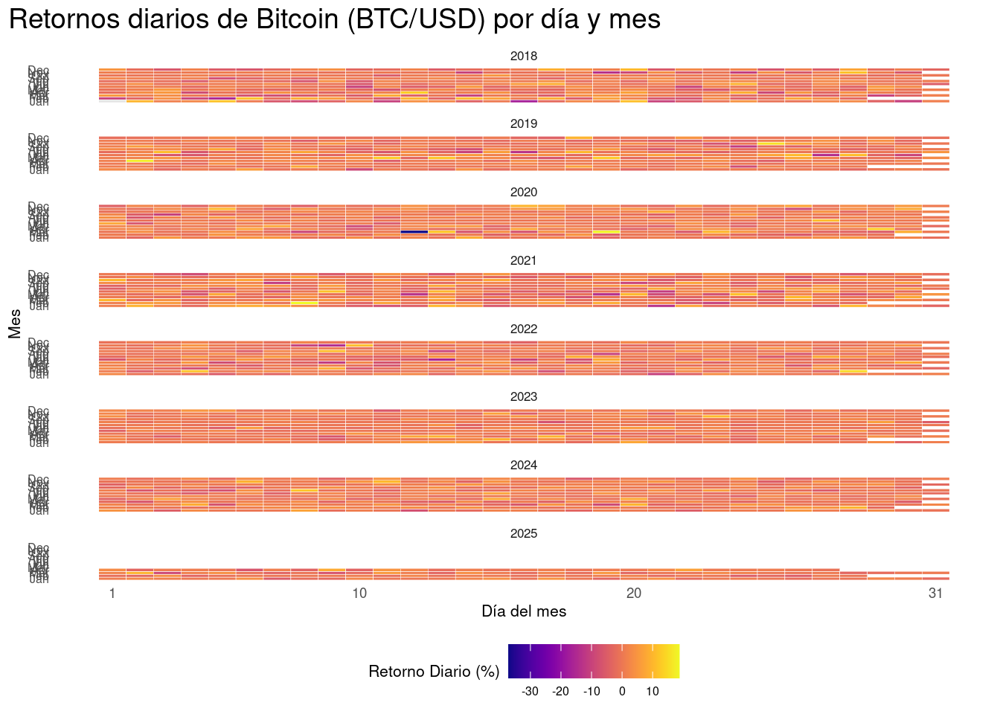


