# MODELADO

## Modelo de Holt Winters

La metodología de Holt-Winters, también conocida como suavizamiento exponencial triple, es una técnica ampliamente utilizada en el análisis de series temporales para realizar pronósticos que presentan patrones de tendencia y estacionalidad. Esta metodología extiende el suavizamiento exponencial simple incorporando componentes adicionales que permiten capturar dinámicamente la evolución de la tendencia y la estacionalidad a lo largo del tiempo. Holt-Winters se presenta en dos variantes principales: aditiva y multiplicativa, dependiendo de la naturaleza del componente estacional. Es particularmente útil en contextos donde los datos muestran fluctuaciones regulares en intervalos específicos (como días, semanas o meses), y permite generar predicciones a corto y mediano plazo con un alto grado de precisión. Su implementación práctica ha demostrado ser eficaz en áreas como la economía, la meteorología, la gestión de inventarios y el consumo de recursos, como agua o energía(Hurtado Garzón 2013).

Teniendo en cuenta la fase de preprocesamiento, se observa que la serie transformada por el logaritmo (es decir no se uso la serie diferenciada que es estacionaria) presenta una estacionalidad visible, así como una tendencia definida, caracterizada por un comportamiento que decrece, se estabiliza y vuelve a decrecer. Esto indica que cumple con los criterios visuales necesarios para aplicar la metodología en cuestión. Además, el patrón estacional parece ser claro y repetitivo, lo cual sugiere la presencia de una estacionalidad aditiva. No obstante, al implementar el modelo, es importante considerar los residuos, ya que se identifican picos que podrían estar asociados a eventos atípicos o posibles errores de medición.

Cabe resaltar que esta metodología no requiere que la serie sea estacionaria. En cambio, se enfoca en identificar una tendencia y una estacionalidad bien definidas, ya que el pronóstico se basa en estos dos componentes junto con la media de la serie.

A continuación, se procede a aplicar el método de Holt Winter a los precios de cierre diarios del Bitcoin, dentro de la aplicación de este modelo se asume una estacionalidad aditiva.

``` r
#install.packages("quantmod")
```

``` r
library(quantmod)
```

```
## Loading required package: xts
```

```
## Loading required package: zoo
```

```
## 
## Attaching package: 'zoo'
```

```
## The following objects are masked from 'package:base':
## 
##     as.Date, as.Date.numeric
```

```
## Loading required package: TTR
```

```
## Registered S3 method overwritten by 'quantmod':
##   method            from
##   as.zoo.data.frame zoo
```

``` r
library(zoo)
library(forecast)
library(ggplot2)
```

 ```{r cargar-librerias, message=FALSE, warning=FALSE} library(quantmod) # <- Esta línea es clave library(zoo) # (si vas a usar as.zoo) ``


``` r
# Descargar datos de Yahoo Finance
getSymbols("BTC-USD",
           src = "yahoo",
           from = "2018-01-01",
           to = "2025-04-27",#Sys.Date(),
           periodicity = "daily")
```

```
## [1] "BTC-USD"
```

``` r
# Convertir el objeto descargado a 'zoo'
btc_zoo <- as.zoo(`BTC-USD`)

# Ver las primeras filas
tail(btc_zoo)
```

```
##            BTC-USD.Open BTC-USD.High BTC-USD.Low BTC-USD.Close BTC-USD.Volume
## 2025-04-22     87521.88     93817.38    87084.53      93441.89    55899038456
## 2025-04-23     93427.59     94535.73    91962.96      93699.11    41719568821
## 2025-04-24     93692.40     94016.20    91696.71      93943.80    31483175315
## 2025-04-25     93954.25     95768.39    92898.59      94720.50    40915232364
## 2025-04-26     94714.65     95251.36    93927.25      94646.93    17612825123
## 2025-04-27     94660.91     95301.20    93665.40      93754.84    18090367764
##            BTC-USD.Adjusted
## 2025-04-22         93441.89
## 2025-04-23         93699.11
## 2025-04-24         93943.80
## 2025-04-25         94720.50
## 2025-04-26         94646.93
## 2025-04-27         93754.84
```


``` r
library(zoo)
btc_close <- as.zoo(btc_zoo$`BTC-USD.Close`)
btc_ts <- ts(coredata(btc_close), frequency = 365, start = c(2018, 1))
```

se procede a realizar la división de datos de entrenamiento y de test

``` r
# Porcentaje de división
train_ratio <- 0.9
n <- length(btc_ts)

n_train <- floor(n * train_ratio)
n_test <- n - n_train

# Crear subconjuntos de entrenamiento y prueba
btc_train <- window(btc_ts, end = time(btc_ts)[n_train])
btc_test <- window(btc_ts, start = time(btc_ts)[n_train + 1])
```


a continuación se procede a entrenar el modelo.

``` r
modelo_hw <- HoltWinters(btc_train)
```


``` r
summary(modelo_hw)
```

```
##              Length Class  Mode     
## fitted       8164   mts    numeric  
## x            2406   ts     numeric  
## alpha           1   -none- numeric  
## beta            1   -none- numeric  
## gamma           1   -none- numeric  
## coefficients  367   -none- numeric  
## seasonal        1   -none- character
## SSE             1   -none- numeric  
## call            2   -none- call
```
Como siguiente paso se procede a realizar la predicción sobre el horizonte de prueba


``` r
# Pronóstico sobre los datos de test
forecast_hw <- forecast(modelo_hw, h = n_test)
autoplot(forecast_hw) +
  ggtitle("Pronóstico de BTC/USD con Holt-Winters") +
  ylab("Precio de Cierre") +
  xlab("Fecha")
```

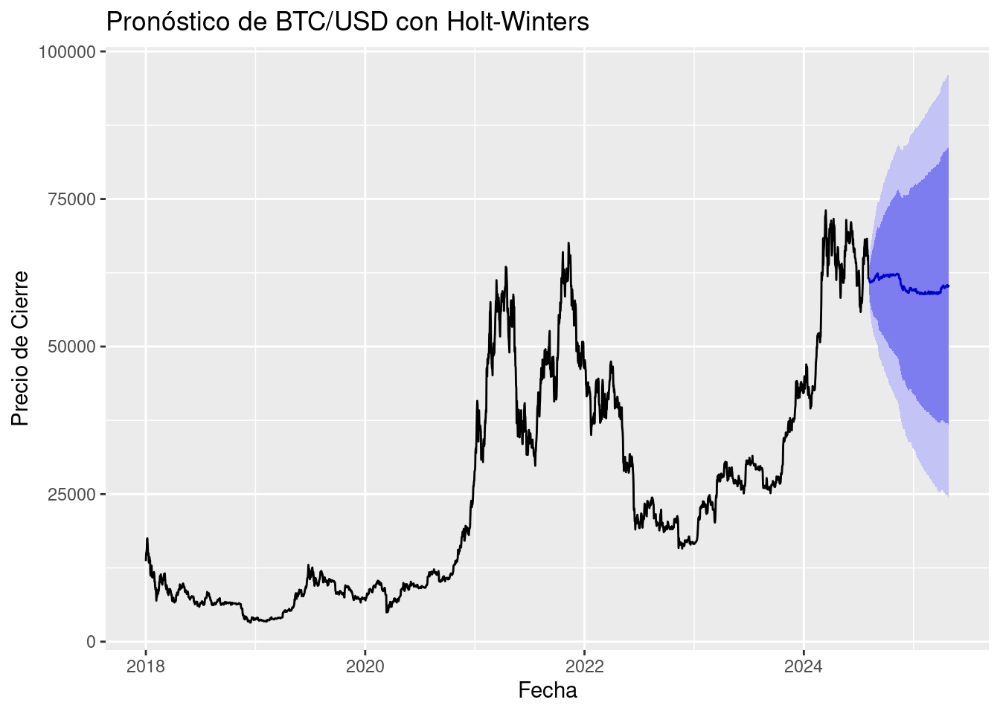


``` r
# Graficar
plot(forecast_hw, main = "Holt-Winters - Predicción vs Real")
lines(btc_test, col = "red", lwd = 2)  # Observado en rojo
legend("topleft", legend = c("Predicción", "Real"), col = c("blue", "red"), lty = 1)
```

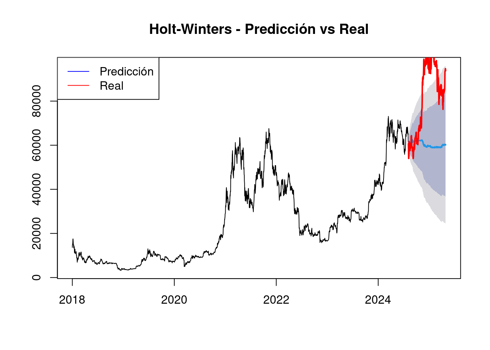


``` r
library(Metrics)
```

```
## 
## Attaching package: 'Metrics'
```

```
## The following object is masked from 'package:forecast':
## 
##     accuracy
```

``` r
# Extraer valores
predicted <- forecast_hw$mean
actual <- btc_test

# Métricas
rmse_val <- rmse(actual, predicted)
mae_val <- mae(actual, predicted)
mape_val <- mape(actual, predicted)

cat("📊 RMSE:", rmse_val, "\n")
```

```
## 📊 RMSE: 27326.58
```

``` r
cat("📊 MAE :", mae_val, "\n")
```

```
## 📊 MAE : 22457.13
```

``` r
cat("📊 MAPE:", round(mape_val * 100, 2), "%\n")
```

```
## 📊 MAPE: 24.56 %
```

## EXpanding windows Holt winter


``` r
expanding_holt_winters <- function(serie_ts, initial_train_ratio = 0.8) {
  library(forecast)
  library(Metrics)

  n <- length(serie_ts)
  n_train <- floor(n * initial_train_ratio)

  errores <- c()
  reales <- c()
  predichos <- c()

  for (i in n_train:(n - 1)) {
    # Expanding window hasta el tiempo i
    ts_train <- window(serie_ts, end = time(serie_ts)[i])
    
    # Ajustar modelo Holt-Winters
    modelo <- HoltWinters(ts_train)

    # Predecir 1 paso adelante
    pred <- forecast(modelo, h = 1)$mean[1]
    
    # Valor real del siguiente punto
    real <- serie_ts[i + 1]

    # Guardar valores
    errores <- c(errores, real - pred)
    reales <- c(reales, real)
    predichos <- c(predichos, pred)
  }

  # Evaluar métricas
  rmse_val <- rmse(reales, predichos)
  mae_val <- mae(reales, predichos)
  mape_val <- mape(reales, predichos)

  cat("📊 Expanding Window - Holt-Winters\n")
  cat("RMSE:", round(rmse_val, 2), "\n")
  cat("MAE :", round(mae_val, 2), "\n")
  cat("MAPE:", round(mape_val * 100, 2), "%\n")

  # Gráfico comparativo
  ts_reales <- ts(reales, start = time(serie_ts)[n_train + 1], frequency = frequency(serie_ts))
  ts_predichos <- ts(predichos, start = time(serie_ts)[n_train + 1], frequency = frequency(serie_ts))

  plot(ts_reales, type = "l", col = "red", lwd = 2,
       main = "Expanding Window: Real vs Predicción (Holt-Winters)",
       ylab = "Precio BTC")
  lines(ts_predichos, col = "blue", lwd = 2)
  legend("topleft", legend = c("Real", "Predicción"), col = c("red", "blue"), lty = 1)
}
```


``` r
resultado_hw<-expanding_holt_winters(btc_ts, initial_train_ratio = 0.9)
```

```
## Warning in HoltWinters(ts_train): optimization difficulties: ERROR:
## ABNORMAL_TERMINATION_IN_LNSRCH
## Warning in HoltWinters(ts_train): optimization difficulties: ERROR:
## ABNORMAL_TERMINATION_IN_LNSRCH
## Warning in HoltWinters(ts_train): optimization difficulties: ERROR:
## ABNORMAL_TERMINATION_IN_LNSRCH
## Warning in HoltWinters(ts_train): optimization difficulties: ERROR:
## ABNORMAL_TERMINATION_IN_LNSRCH
## Warning in HoltWinters(ts_train): optimization difficulties: ERROR:
## ABNORMAL_TERMINATION_IN_LNSRCH
## Warning in HoltWinters(ts_train): optimization difficulties: ERROR:
## ABNORMAL_TERMINATION_IN_LNSRCH
## Warning in HoltWinters(ts_train): optimization difficulties: ERROR:
## ABNORMAL_TERMINATION_IN_LNSRCH
## Warning in HoltWinters(ts_train): optimization difficulties: ERROR:
## ABNORMAL_TERMINATION_IN_LNSRCH
## Warning in HoltWinters(ts_train): optimization difficulties: ERROR:
## ABNORMAL_TERMINATION_IN_LNSRCH
## Warning in HoltWinters(ts_train): optimization difficulties: ERROR:
## ABNORMAL_TERMINATION_IN_LNSRCH
## Warning in HoltWinters(ts_train): optimization difficulties: ERROR:
## ABNORMAL_TERMINATION_IN_LNSRCH
## Warning in HoltWinters(ts_train): optimization difficulties: ERROR:
## ABNORMAL_TERMINATION_IN_LNSRCH
## Warning in HoltWinters(ts_train): optimization difficulties: ERROR:
## ABNORMAL_TERMINATION_IN_LNSRCH
## Warning in HoltWinters(ts_train): optimization difficulties: ERROR:
## ABNORMAL_TERMINATION_IN_LNSRCH
## Warning in HoltWinters(ts_train): optimization difficulties: ERROR:
## ABNORMAL_TERMINATION_IN_LNSRCH
```

```
## 📊 Expanding Window - Holt-Winters
## RMSE: 2255.36 
## MAE : 1608.23 
## MAPE: 1.98 %
```

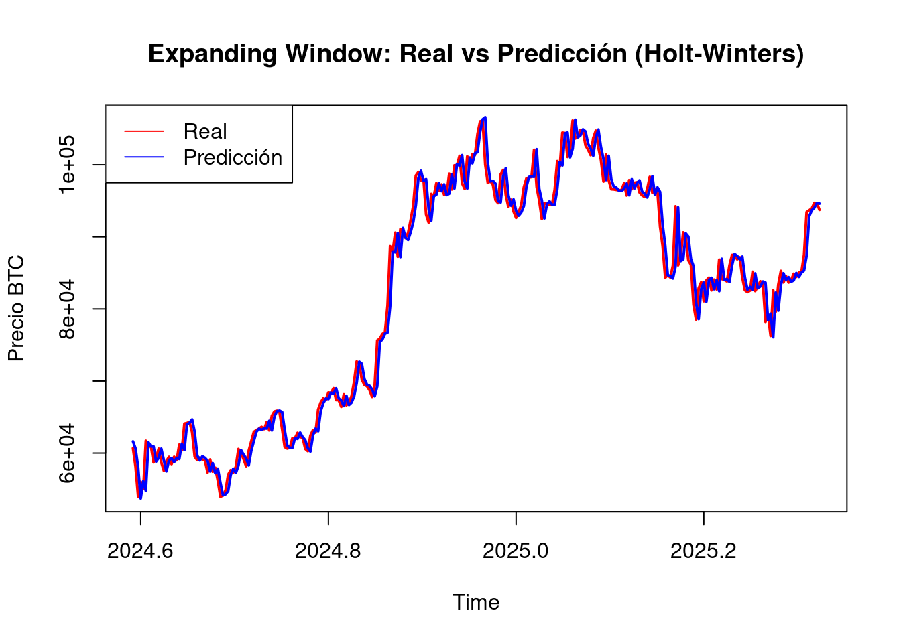


## Metodología Box-Jenkins
La metodología Box-Jenkins es un enfoque sistemático que permite identificar, estimar y validar modelos ARMA o ARIMA que se ajusten adecuadamente a una serie de tiempo. Esta metodología consta de cuatro etapas principales:

Identificación del modelo En esta etapa se analiza si la serie es estacionaria. Si no lo es, se aplican transformaciones (como la diferenciación) para lograr la estacionariedad. A continuación, se identifican los posibles valores de los parámetros del modelo ARIMA(p, d, q), con base en el análisis gráfico y estadístico.
Actividades comunes:

Análisis gráfico: para detectar tendencia, estacionalidad o cambios en la media.

Prueba de estacionariedad: como la prueba de Dickey-Fuller, que evalúa si la serie tiene raíz unitaria.

Diferenciación: si la serie no es estacionaria, se aplica una o más veces para lograr la estacionariedad y determinar el parámetro d.

Revisión de ACF y PACF:

ACF (autocorrelación): ayuda a identificar el orden q (media móvil).

PACF (autocorrelación parcial): permite sugerir el orden p (autorregresivo).

Estimación de parámetros Una vez identificado el modelo, se ajusta a los datos para estimar sus parámetros.

Actividades:

Estimar los coeficientes mediante métodos como máxima verosimilitud.

Evaluar la significancia estadística de los parámetros.

Comparar modelos alternativos utilizando criterios como:

AIC (Criterio de Información de Akaike)

BIC (Criterio de Información Bayesiano)

RMSE (Raíz del error cuadrático medio)

Verificación del modelo Se valida que los residuos del modelo se comporten como ruido blanco, es decir, que no presenten autocorrelación y tengan media cero y varianza constante.
Actividades:

Analizar los residuos en el tiempo.

Revisar los gráficos de ACF y PACF de los residuos.

Verificar la normalidad mediante histogramas o pruebas como Shapiro-Wilk.

Verificar independencia mediante pruebas como Ljung-Box.

Si los supuestos no se cumplen, se debe reconsiderar el modelo y repetir las etapas anteriores.

Pronóstico Una vez validado el modelo, se procede a generar pronósticos a corto, mediano o largo plazo.
Actividades:

Generar predicciones con intervalos de confianza.

Comparar los pronósticos con datos reales (si están disponibles).

Evaluar la precisión del modelo predictivo.

Cabe resaltar que actualmente se dispone de la librería forecast en R, la cual incluye la función auto.arima, que permite seleccionar automáticamente los parámetros del modelo ARIMA de forma eficiente. Este procedimiento se basa en criterios estadísticos como AIC o BIC para identificar la combinación óptima de parámetros (p,d,q).

Gracias a esta automatización, se simplifican varios pasos tradicionales del proceso de modelado, como la inspección visual de los gráficos ACF y PACF, la identificación manual del grado de diferenciación d, y la evaluación de múltiples combinaciones de parámetros para encontrar el mejor modelo.

Por tanto, en esta etapa nos enfocaremos únicamente en la validación de los supuestos del modelo sobre los residuos y en la evaluación del desempeño de los pronósticos (Hurtado Garzón 2013).

## Modelo Arima

Los modelos autorregresivos integrados de media móvil (ARIMA, por sus siglas en inglés: AutoRegressive Integrated Moving Average) combinan tres componentes:

AR (Autorregresivo): la serie se explica por sus propios valores pasados.

I (Integrado): se aplican diferenciaciones a la serie para hacerla estacionaria.

MA (Media móvil): se modela el error como una combinación lineal de errores pasados.

Un modelo ARIMA se denota como ARIMA(p, d, q), donde:

p: número de términos autorregresivos (AR).

d: número de diferenciaciones necesarias para hacer la serie estacionaria.

q: número de términos de medias móviles (MA).

Estos modelos permiten describir y pronosticar el comportamiento de una serie de tiempo a partir de sus valores y errores pasados (Hurtado Garzón 2013).


###  Transformación serie de tiempo a estacionaria.


``` r
library(tseries)
adf.test(btc_ts,, alternative = c("stationary", "explosive"))
```

```
## 
## 	Augmented Dickey-Fuller Test
## 
## data:  btc_ts
## Dickey-Fuller = -1.9006, Lag order = 13, p-value = 0.6204
## alternative hypothesis: stationary
```


De acuerdo a la prueba Dickey Fuller se concluye que la serie de tiempo no es estacionaria dado que el Valor P esta por encima 0.05 , tal como se esperaba de acuerdo a su naturaleza de mercado financiero.

Por lo tanto a continuación se procede a realizar la diferenciación de la serie de tiempo.


``` r
ndiffs(btc_ts)
```

```
## [1] 1
```

``` r
## [1] 1
#nos indica que 1 así que diferenciamos una vez y la llamamos dif.Indice.ts
dif.btc.ts<-diff(btc_ts)
#la graficamos
plot(dif.btc.ts, main=" ", ylab="valor", col="deepskyblue", xlab="Años")
title(main="DIF Precios diarios BTC")
```


Ahora se procede a confirmar nuevamente con la prueba Dickey Fuller que la serie diferenciada si sea estacionaria.


``` r
adf.test(dif.btc.ts,, alternative = c("stationary", "explosive"))
```

```
## Warning in adf.test(dif.btc.ts, , alternative = c("stationary", "explosive")):
## p-value smaller than printed p-value
```

```
## 
## 	Augmented Dickey-Fuller Test
## 
## data:  dif.btc.ts
## Dickey-Fuller = -12.708, Lag order = 13, p-value = 0.01
## alternative hypothesis: stationary
```
De acuerdo al resultado de la prueba, se puede afirmar que la serie diferenciada es estacionaria

### Funciones de ACF y PACT

Continuando con la metodología Box-Jenkins, ahora se define y genera las funciones ACF y PACT

En análisis de series de tiempo, la ACF (Función de Autocorrelación) y la PACF (Función de Autocorrelación Parcial) son herramientas visuales que ayudan a identificar la estructura de dependencia dentro de una serie temporal. La ACF muestra la correlación de una serie consigo misma a diferentes rezagos, mientras que la PACF controla la correlación de los rezagos anteriores al evaluar la correlación en un rezago específico. 

ACF (Función de Autocorrelación)
La ACF grafica la correlación entre una variable y sus valores rezagados en diferentes rezagos (diferencia de tiempo entre una observación y otra). 
Ayuda a identificar patrones como estacionalidad, tendencias y persistencia en la serie. 

Se utiliza para determinar el orden del modelo AR (Autorregresivo) y MA (Promedio Móvil). 

PACF (Función de Autocorrelación Parcial)
La PACF muestra la correlación entre una variable y sus valores rezagados, después de haber eliminado el efecto de los rezagos intermedios. 
Ayuda a identificar el rezago exacto después del cual las autocorrelaciones cesan, lo cual es crucial para determinar el orden del modelo AR. 

Se utiliza para identificar la presencia de patrones estacionales en la serie. 
Diferencias clave:
La ACF considera todas las correlaciones, mientras que la PACF solo considera las correlaciones directas, eliminando las indirectas.
La ACF es útil para identificar la estructura general de correlación, mientras que la PACF ayuda a identificar la estructura de dependencia más precisa. 
Interpretación:

Un corte abrupto en el gráfico ACF en un rezago específico sugiere que un modelo de series temporales con ese número de rezagos podría ser apropiado.
Un gráfico ACF que decae lentamente puede indicar una tendencia en los datos.
Un corte brusco en el gráfico PACF puede indicar la presencia de estacionalidad.


``` r
ACF<-acf(dif.btc.ts)
```

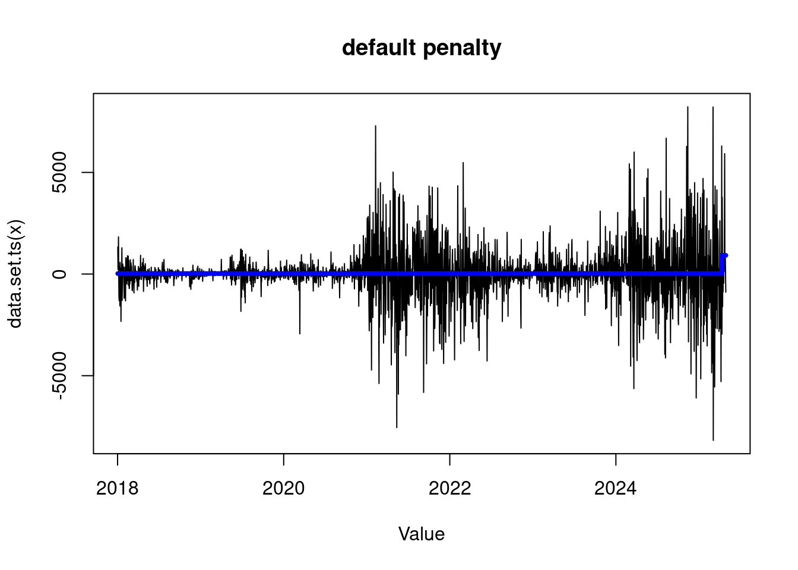

``` r
PACF<-pacf(dif.btc.ts)
```


A continuación se procede a dividir la serie de tiempo diferenciada para la fasde de entrenamiento y de test

``` r
# Parámetros de división
train_ratio <- 0.9
n <- length(dif.btc.ts)

n_train <- floor(n * train_ratio)
n_test <- n - n_train

# Dividir en train y test
dif_train <- window(dif.btc.ts, end = time(dif.btc.ts)[n_train])
dif_test <- window(dif.btc.ts, start = time(dif.btc.ts)[n_train + 1])
```

### Modelado Autoarima


``` r
modelo <- auto.arima(dif_train)
modelo
```

```
## Series: dif_train 
## ARIMA(1,0,0) with zero mean 
## 
## Coefficients:
##           ar1
##       -0.0533
## s.e.   0.0204
## 
## sigma^2 = 1100170:  log likelihood = -20140
## AIC=40283.99   AICc=40284   BIC=40295.56
```


``` r
pred_arima <- forecast(modelo, h = n_test)
```


``` r
d <- ndiffs(btc_ts)
last_value <- btc_ts[n_train + d]  # valor original antes del primer test
predicted <- cumsum(pred_arima$mean) + last_value


# Valores reales correspondientes a la serie original
actual <- window(btc_ts, start = time(btc_ts)[n_train + d + 1])
```


``` r
summary(actual)
```

```
##    Min. 1st Qu.  Median    Mean 3rd Qu.    Max. 
##   53949   64326   84623   81836   96457  106146
```

``` r
summary(predicted)
```

```
##    Min. 1st Qu.  Median    Mean 3rd Qu.    Max. 
##   61614   61615   61615   61615   61615   61625
```


``` r
rmse_val <- rmse(actual, predicted)
mae_val <- mae(actual, predicted)
mape_val <- mape(actual, predicted)

cat("📊 RMSE:", rmse_val, "\n")
```

```
## 📊 RMSE: 25727.04
```

``` r
cat("📊 MAE :", mae_val, "\n")
```

```
## 📊 MAE : 21253.18
```

``` r
cat("📊 MAPE:", round(mape_val * 100, 2), "%\n")
```

```
## 📊 MAPE: 23.31 %
```

``` r
predicted_ts <- ts(predicted, start = start(actual), frequency = frequency(btc_ts))
plot(actual, type = "l", col = "red", lwd = 2,
     main = "Predicción vs Real (ARIMA)",
     ylab = "Precio",
     ylim = range(c(actual, predicted_ts)) * c(0.9, 1.05))  # más margen abajo
lines(predicted_ts, col = "blue", lwd = 2)
```

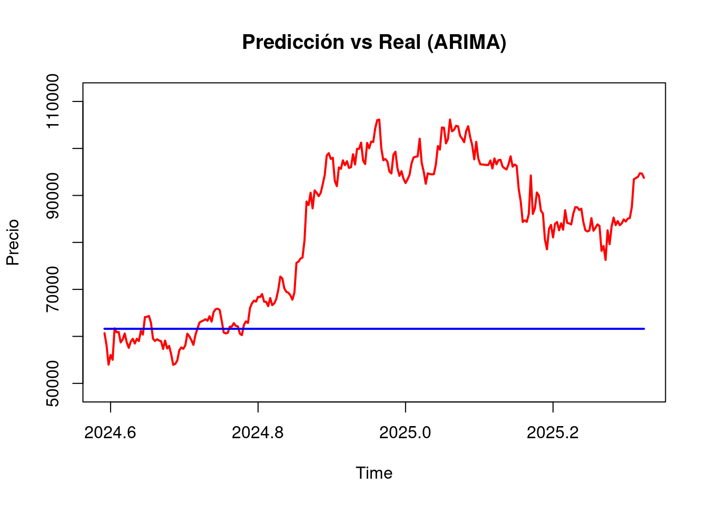

## Expanding window Arima


``` r
expanding_arima_forecast <- function(serie_ts, initial_train_ratio = 0.9) {
  library(forecast)
  library(Metrics)

  n <- length(serie_ts)
  n_train <- floor(n * initial_train_ratio)

  reales <- c()
  predichos <- c()

  for (i in n_train:(n - 1)) {
    # 1. Ventana de entrenamiento hasta el tiempo i
    ts_train <- window(serie_ts, end = time(serie_ts)[i])
    
    # 2. Ajustar modelo ARIMA automáticamente
    modelo <- auto.arima(ts_train)
    
    # 3. Predecir un paso adelante
    pred <- forecast(modelo, h = 1)$mean[1]
    
    # 4. Obtener valor real siguiente (para evaluación)
    real <- serie_ts[i + 1]
    
    # 5. Guardar resultados
    reales <- c(reales, real)
    predichos <- c(predichos, pred)
  }

  # Convertir a ts para graficar alineado
  ts_reales <- ts(reales, start = time(serie_ts)[n_train + 1], frequency = frequency(serie_ts))
  ts_predichos <- ts(predichos, start = time(serie_ts)[n_train + 1], frequency = frequency(serie_ts))

  # Evaluar métricas
  rmse_val <- rmse(ts_reales, ts_predichos)
  mae_val <- mae(ts_reales, ts_predichos)
  mape_val <- mape(ts_reales, ts_predichos)

  cat("📊 Expanding Window - ARIMA\n")
  cat("RMSE:", round(rmse_val, 2), "\n")
  cat("MAE :", round(mae_val, 2), "\n")
  cat("MAPE:", round(mape_val * 100, 2), "%\n")

  # Gráfico
  plot(ts_reales, type = "l", col = "red", lwd = 2,
       main = "Expanding Window: Real vs Predicción (ARIMA)",
       ylab = "Precio BTC")
  lines(ts_predichos, col = "blue", lwd = 2)
  legend("topleft", legend = c("Real", "Predicción"), col = c("red", "blue"), lty = 1)

  return(list(real = ts_reales, pred = ts_predichos,
              rmse = rmse_val, mae = mae_val, mape = mape_val))
}
```


``` r
#resultado_arima <- expanding_arima_forecast(btc_ts, initial_train_ratio = 0.9)
```


## Regresión de una serie de tiempo y Algoritmo Facebook´s Prophet

### Regresión de una serie

El proceso de transformar una serie en una regresión consiste en usar sus valores pasados(lags) para predecir valores futuros, esto se logra mediante la creación de variables yt−1yt−1, yt−2yt−2, en general yt−kyt−k para algun k entero y un tiempo t de manera que lo valores ytyt se puedan estimar mediante el modelo:

yt=β0+β1yt−1+...+βkyt−k+ϵt

esta es la forma de una regresión lineal autoregresiva AR(p)(Hamilton 1994).Ademas de esta forma se pueden agregar un conjunto de variables externas XtXt, de forma que el modelo se convierte en:yt=β0+β1yt−1+...+βkyt−k+βk+1Xt+ϵtyt=β0+β1yt−1+...+βkyt−k+βk+1Xt+ϵt denominado modelo ARX (Ljung 1999)


``` r
# 1. Crear variable de tiempo
tiempo <- 1:length(btc_ts)
df_lm <- data.frame(
  tiempo = tiempo,
  precio = as.numeric(btc_ts)
)
```


``` r
# 2. Particionar por proporción
train_ratio <- 0.8
n <- nrow(df_lm)
n_train <- floor(train_ratio * n)

# Conjuntos de entrenamiento y prueba
train_df <- df_lm[1:n_train, ]
test_df  <- df_lm[(n_train + 1):n, ]
```


``` r
modelo_lm <- lm(precio ~ tiempo, data = train_df)
summary(modelo_lm)
```

```
## 
## Call:
## lm(formula = precio ~ tiempo, data = train_df)
## 
## Residuals:
##    Min     1Q Median     3Q    Max 
## -16646  -8470  -5232   5103  41008 
## 
## Coefficients:
##              Estimate Std. Error t value Pr(>|t|)    
## (Intercept) 4677.2955   550.0311   8.504   <2e-16 ***
## tiempo        15.5408     0.4452  34.905   <2e-16 ***
## ---
## Signif. codes:  0 '***' 0.001 '**' 0.01 '*' 0.05 '.' 0.1 ' ' 1
## 
## Residual standard error: 12710 on 2137 degrees of freedom
## Multiple R-squared:  0.3631,	Adjusted R-squared:  0.3628 
## F-statistic:  1218 on 1 and 2137 DF,  p-value: < 2.2e-16
```

``` r
pred_test <- predict(modelo_lm, newdata = test_df)
actual_test <- test_df$precio
```


``` r
rmse_val <- rmse(actual_test, pred_test)
mae_val <- mae(actual_test, pred_test)
mape_val <- mape(actual_test, pred_test)

cat("📊 RMSE:", round(rmse_val, 2), "\n")
```

```
## 📊 RMSE: 31857.51
```

``` r
cat("📊 MAE :", round(mae_val, 2), "\n")
```

```
## 📊 MAE : 27069.4
```

``` r
cat("📊 MAPE:", round(mape_val * 100, 2), "%\n")
```

```
## 📊 MAPE: 35.12 %
```

``` r
plot(test_df$tiempo, actual_test, type = "l", col = "red", lwd = 2,
     main = "Regresión Lineal: Predicción vs Real",
     xlab = "Tiempo", ylab = "Precio BTC")
lines(test_df$tiempo, pred_test, col = "blue", lwd = 2)
legend("topleft", legend = c("Real", "Predicción"),
       col = c("red", "blue"), lty = 1, lwd = 2)
```

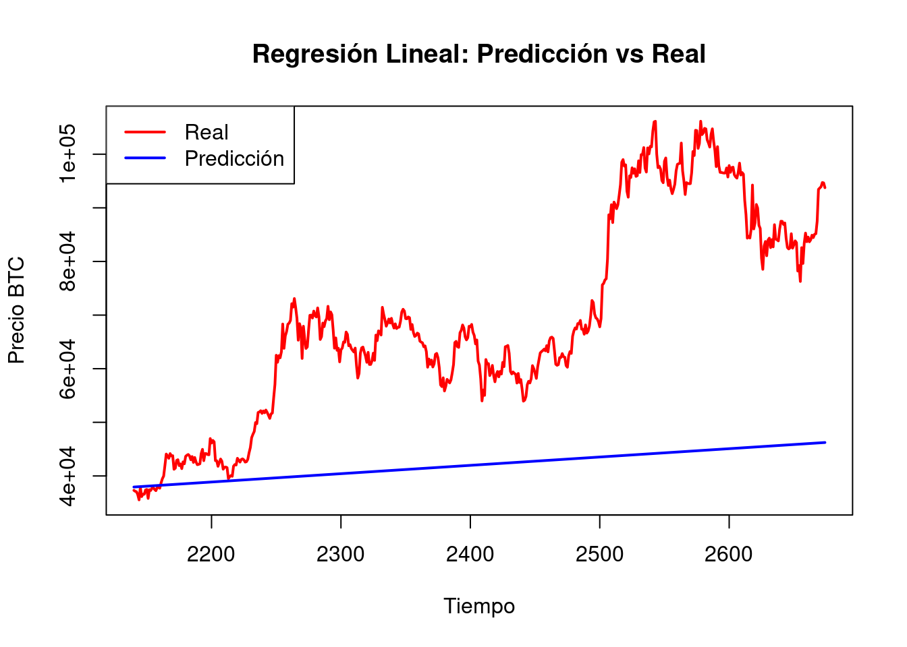
## Expanding Window Arima


``` r
expanding_linear_forecast <- function(serie_ts, initial_train_ratio = 0.9) {
  library(Metrics)

  n <- length(serie_ts)
  n_train <- floor(n * initial_train_ratio)

  reales <- c()
  predichos <- c()

  for (i in n_train:(n - 1)) {
    # Construir datos de entrenamiento hasta el tiempo i
    ts_train <- serie_ts[1:i]
    tiempo_train <- 1:i
    df_train <- data.frame(
      tiempo = tiempo_train,
      precio = as.numeric(ts_train)
    )

    # Ajustar modelo lineal
    modelo <- lm(precio ~ tiempo, data = df_train)

    # Predecir el siguiente punto (tiempo i+1)
    nuevo <- data.frame(tiempo = i + 1)
    pred <- predict(modelo, newdata = nuevo)

    # Valor real en t = i + 1
    real <- as.numeric(serie_ts[i + 1])

    # Guardar resultados
    reales <- c(reales, real)
    predichos <- c(predichos, pred)
  }

  # Convertir a ts para alinear
  ts_reales <- ts(reales, start = time(serie_ts)[n_train + 1], frequency = frequency(serie_ts))
  ts_predichos <- ts(predichos, start = time(serie_ts)[n_train + 1], frequency = frequency(serie_ts))

  # Evaluar métricas
  rmse_val <- rmse(ts_reales, ts_predichos)
  mae_val <- mae(ts_reales, ts_predichos)
  mape_val <- mape(ts_reales, ts_predichos)

  cat("📊 Expanding Window - Regresión Lineal\n")
  cat("RMSE:", round(rmse_val, 2), "\n")
  cat("MAE :", round(mae_val, 2), "\n")
  cat("MAPE:", round(mape_val * 100, 2), "%\n")

  # Gráfico
  plot(ts_reales, type = "l", col = "red", lwd = 2,
       main = "Expanding Window: Real vs Predicción (Regresión Lineal)",
       ylab = "Precio BTC")
  lines(ts_predichos, col = "blue", lwd = 2)
  legend("topleft", legend = c("Real", "Predicción"), col = c("red", "blue"), lty = 1)

  return(list(real = ts_reales, pred = ts_predichos,
              rmse = rmse_val, mae = mae_val, mape = mape_val))
}
```


``` r
resultado_lm <- expanding_linear_forecast(btc_ts, initial_train_ratio = 0.9)
```

```
## 📊 Expanding Window - Regresión Lineal
## RMSE: 28586.75 
## MAE : 25435.98 
## MAPE: 29.17 %
```

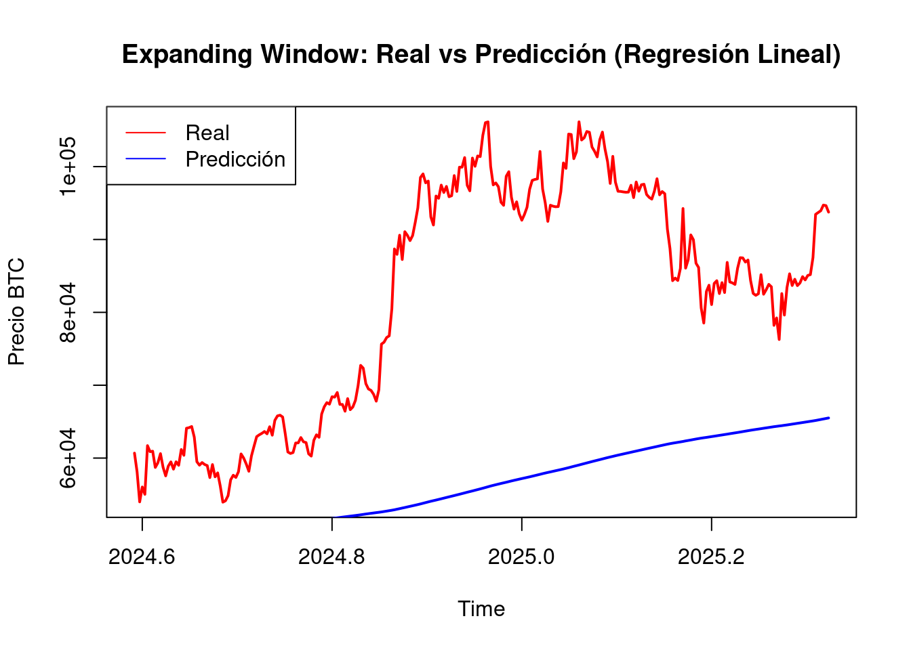


### Algoritmo Facebook´s Prophet

Prophet es un algoritmo desarrollado por el equipo de investigación de facebook para el pronostico de series de tiempo, su finalidad es la robustez frente a datos faltantes, cambios en la tendencia y múltiples estacionalidades. El modelo Prophet no es una regresión como tal, mas bien es una descomposición de forma aditiva, ya que se asume una descomposición de la serie de la siguiente forma:
y(t)=g(t)+s(t)+h(t)+ϵty(t)=g(t)+s(t)+h(t)+ϵt donde:
g(t):tendencia 
s(t):estacionalidad
g(t):efecto de dias festivos
ϵt:error(ruido blanco)
dado que este metodo solo busca pronosticar valores futuros, no es necesario validar supuestos de normalidad en los errores, sin embargo si se debe verificar como una buena practica, que estos no estén correlacionados y que tengan media cero y varianza constante(Facebook Core Data Science Team 2023).


``` r
library(prophet)
```

```
## Loading required package: Rcpp
```

```
## Loading required package: rlang
```

```
## 
## Attaching package: 'rlang'
```

```
## The following object is masked from 'package:Metrics':
## 
##     ll
```

``` r
start_date <- as.Date("2018-01-01")  
btc_df <- data.frame(
  ds = seq(start_date, by = "day", length.out = length(btc_ts)),
  y = as.numeric(btc_ts)
)
```


``` r
n <- nrow(btc_df)
n_train <- floor(n * 0.8)

df_train <- btc_df[1:n_train, ]
df_test <- btc_df[(n_train + 1):n, ]
```


``` r
modelo <- prophet(df_train)
```

```
## Disabling daily seasonality. Run prophet with daily.seasonality=TRUE to override this.
```


``` r
# 4. Crear dataframe futuro para predecir el mismo horizonte de test
future <- make_future_dataframe(modelo, periods = n - n_train)

# 5. Predecir
forecast <- predict(modelo, future)
# 6. Extraer solo predicciones del período de prueba
pred_test <- forecast[(n_train + 1):n, ]
```


``` r
rmse_val <- rmse(df_test$y, pred_test$yhat)
mae_val  <- mae(df_test$y, pred_test$yhat)
mape_val <- mape(df_test$y, pred_test$yhat)

cat("📊 Prophet con división 80/20:\n")
```

```
## 📊 Prophet con división 80/20:
```

``` r
cat("RMSE:", round(rmse_val, 2), "\n")
```

```
## RMSE: 33526.99
```

``` r
cat("MAE :", round(mae_val, 2), "\n")
```

```
## MAE : 29892.62
```

``` r
cat("MAPE:", round(mape_val * 100, 2), "%\n")
```

```
## MAPE: 40.53 %
```

``` r
# 8. Gráfico
plot(df_test$ds, df_test$y, type = "l", col = "red", lwd = 2,
     main = "Predicción Prophet vs Real (80/20)",
     ylab = "Precio BTC", xlab = "Fecha")
lines(pred_test$ds, pred_test$yhat, col = "blue", lwd = 2)
legend("topleft", legend = c("Real", "Predicción"), col = c("red", "blue"), lty = 1)
```

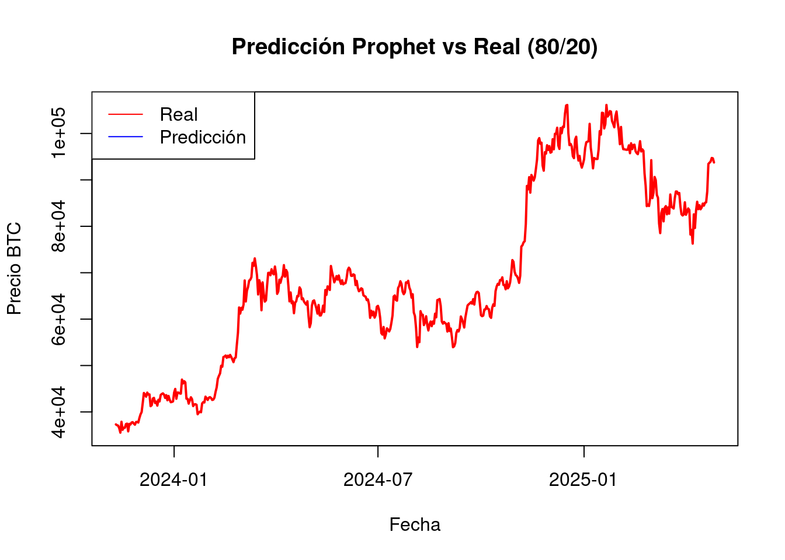
## Expading Window Prophet


``` r
expanding_prophet_forecast <- function(btc_ts, initial_train_ratio = 0.9) {
  library(prophet)
  library(Metrics)

  # 1. Preparar datos con fecha y valor
  btc_df <- data.frame(
    ds = seq.Date(from = as.Date("2018-01-01"), by = "day", length.out = length(btc_ts)),
    y = as.numeric(btc_ts)
  )

  n <- nrow(btc_df)
  n_train <- floor(n * initial_train_ratio)

  reales <- c()
  predichos <- c()
  fechas <- c()

  for (i in n_train:(n - 1)) {
    # Subconjunto hasta t = i
    df_train <- btc_df[1:i, ]

    # Entrenar modelo Prophet
    modelo <- prophet(df_train, verbose = FALSE, daily.seasonality = FALSE)

    # Crear data.frame para predecir t = i + 1
    fecha_pred <- btc_df$ds[i + 1]
    future <- data.frame(ds = fecha_pred)

    # Predecir
    forecast <- predict(modelo, future)

    # Guardar resultados
    reales <- c(reales, btc_df$y[i + 1])
    predichos <- c(predichos, forecast$yhat[1])
    fechas <- c(fechas, as.character(fecha_pred))
  }

  # Convertir a serie de tiempo
  ts_reales <- ts(reales, start = n_train + 1, frequency = 1)
  ts_predichos <- ts(predichos, start = n_train + 1, frequency = 1)

  # Métricas
  rmse_val <- rmse(ts_reales, ts_predichos)
  mae_val  <- mae(ts_reales, ts_predichos)
  mape_val <- mape(ts_reales, ts_predichos)

  cat("📊 Expanding Window - Prophet\n")
  cat("RMSE:", round(rmse_val, 2), "\n")
  cat("MAE :", round(mae_val, 2), "\n")
  cat("MAPE:", round(mape_val * 100, 2), "%\n")

  # Gráfico
  fechas_ts <- as.Date(fechas)
  plot(fechas_ts, ts_reales, type = "l", col = "red", lwd = 2,
       main = "Expanding Window: Real vs Predicción (Prophet)",
       ylab = "Precio BTC", xlab = "Fecha")
  lines(fechas_ts, ts_predichos, col = "blue", lwd = 2)
  legend("topleft", legend = c("Real", "Predicción"), col = c("red", "blue"), lty = 1)

  return(data.frame(
    fecha = fechas_ts,
    real = ts_reales,
    pred = ts_predichos
  ))
}
```


``` r
resultado_prophet <- expanding_prophet_forecast(btc_ts, initial_train_ratio = 0.9)
```

```
## 📊 Expanding Window - Prophet
## RMSE: 11777.56 
## MAE : 10131.19 
## MAPE: 12.34 %
```

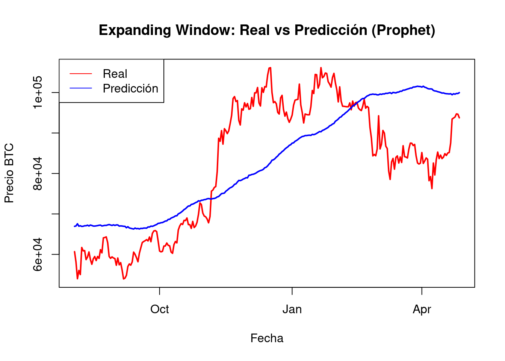

## Red Neuronal Elman


``` r
install.packages("RSNNS")
```

```
## Installing package into '/cloud/lib/x86_64-pc-linux-gnu-library/4.4'
## (as 'lib' is unspecified)
```


``` r
library(RSNNS)

# Normalizar serie
btc_norm <- (btc_ts - min(btc_ts)) / (max(btc_ts) - min(btc_ts))

# Parámetros
n_lags <- 7
n <- length(btc_norm)
n_train <- floor(n * 0.9)

# Crear matriz de entrada y salida
crear_dataset <- function(serie, n_lags) {
  X <- embed(serie, n_lags + 1)
  y <- X[, 1]
  X <- X[, -1]
  return(list(X = X, y = y))
}

datos <- crear_dataset(btc_norm, n_lags)

X <- datos$X
y <- datos$y

# División train/test
X_train <- X[1:(n_train - n_lags), ]
y_train <- y[1:(n_train - n_lags)]

X_test <- X[(n_train - n_lags + 1):(n - n_lags), ]
y_test <- y[(n_train - n_lags + 1):(n - n_lags)]
```


``` r
# Ajustar red Elman
modelo_elman <- elman(X_train, y_train,
                      size = 10,
                      learnFuncParams = c(0.1), maxit = 100,
                      linOut = TRUE)

# Predicción
pred_norm <- predict(modelo_elman, X_test)

# Desnormalizar
min_y <- min(btc_ts)
max_y <- max(btc_ts)
pred <- pred_norm * (max_y - min_y) + min_y
real <- y_test * (max_y - min_y) + min_y
```


``` r
library(Metrics)
cat("📊 Elman Neural Net:\n")
```

```
## 📊 Elman Neural Net:
```

``` r
cat("RMSE:", round(rmse(real, pred), 2), "\n")
```

```
## RMSE: 15327.92
```

``` r
cat("MAE :", round(mae(real, pred), 2), "\n")
```

```
## MAE : 12516.27
```

``` r
cat("MAPE:", round(mape(real, pred) * 100, 2), "%\n")
```

```
## MAPE: 13.7 %
```

``` r
# Gráfico
plot(real, type = "l", col = "red", lwd = 2, ylab = "Precio BTC", main = "Red Elman")
lines(pred, col = "blue", lwd = 2)
legend("topleft", legend = c("Real", "Predicho"), col = c("red", "blue"), lty = 1)
```

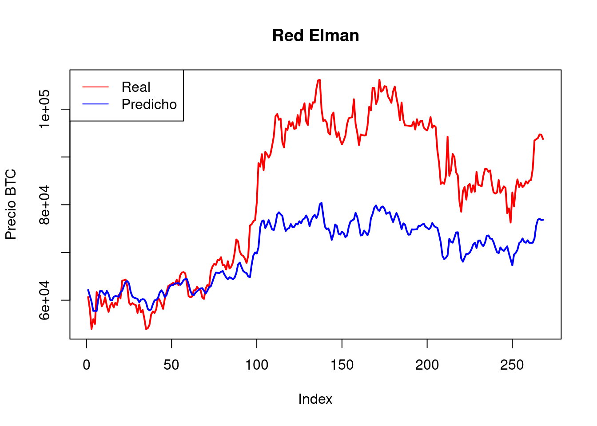

## Red Neuronal Elman con Expanding window


``` r
expanding_elman_forecast <- function(btc_ts, n_lags = 5, size = 10, initial_train_ratio = 0.8, maxit = 100) {
  library(RSNNS)
  library(Metrics)

  # Normalizar la serie
  btc_norm <- (btc_ts - min(btc_ts)) / (max(btc_ts) - min(btc_ts))
  min_val <- min(btc_ts)
  max_val <- max(btc_ts)

  # Preparar función para ventana deslizante
  crear_dataset <- function(serie, n_lags) {
    X <- embed(serie, n_lags + 1)
    y <- X[, 1]
    X <- X[, -1]
    return(list(X = X, y = y))
  }

  datos <- crear_dataset(btc_norm, n_lags)
  X_all <- datos$X
  y_all <- datos$y
  total <- nrow(X_all)

  # Punto inicial para expanding window
  start <- floor(total * initial_train_ratio)

  pred <- c()
  real <- c()

  for (i in start:(total - 1)) {
    X_train <- X_all[1:i, ]
    y_train <- y_all[1:i]
    X_next  <- matrix(X_all[i + 1, ], nrow = 1)

    # Ajustar red Elman
    modelo <- elman(X_train, y_train,
                    size = size,
                    learnFuncParams = c(0.1),
                    maxit = maxit,
                    linOut = TRUE)

    pred_i <- predict(modelo, X_next)
    pred <- c(pred, pred_i)
    real <- c(real, y_all[i + 1])
  }

  # Desnormalizar
  pred_desnorm <- pred * (max_val - min_val) + min_val
  real_desnorm <- real * (max_val - min_val) + min_val

  # Métricas
  rmse_val <- rmse(real_desnorm, pred_desnorm)
  mae_val  <- mae(real_desnorm, pred_desnorm)
  mape_val <- mape(real_desnorm, pred_desnorm)

  cat("📊 Expanding Window - Red Elman\n")
  cat("RMSE:", round(rmse_val, 2), "\n")
  cat("MAE :", round(mae_val, 2), "\n")
  cat("MAPE:", round(mape_val * 100, 2), "%\n")

  # Gráfico
  plot(real_desnorm, type = "l", col = "red", lwd = 2, ylab = "Precio BTC", main = "Red Elman - Expanding Window")
  lines(pred_desnorm, col = "blue", lwd = 2)
  legend("topleft", legend = c("Real", "Predicho"), col = c("red", "blue"), lty = 1)

  return(data.frame(real = real_desnorm, pred = pred_desnorm))
}
```


``` r
resultado_elman <- expanding_elman_forecast(btc_ts, n_lags = 7, size = 10)
```

```
## 📊 Expanding Window - Red Elman
## RMSE: 2137.92 
## MAE : 1542.39 
## MAPE: 2.24 %
```

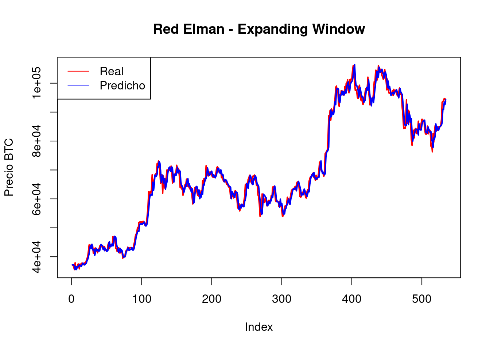

## Red neuronal Jordan


``` r
expanding_jordan_forecast <- function(btc_ts, n_lags = 7, size = 10, initial_train_ratio = 0.9, maxit = 100) {
  library(RSNNS)
  library(Metrics)

  # 1. Normalizar serie
  btc_norm <- (btc_ts - min(btc_ts)) / (max(btc_ts) - min(btc_ts))
  min_val <- min(btc_ts)
  max_val <- max(btc_ts)

  # 2. Crear dataset con ventanas
  crear_dataset <- function(serie, n_lags) {
    X <- embed(serie, n_lags + 1)
    y <- X[, 1]
    X <- X[, -1]
    return(list(X = X, y = y))
  }

  datos <- crear_dataset(btc_norm, n_lags)
  X_all <- datos$X
  y_all <- datos$y
  total <- nrow(X_all)

  # 3. División inicial
  start <- floor(total * initial_train_ratio)

  pred <- c()
  real <- c()

  for (i in start:(total - 1)) {
    X_train <- X_all[1:i, ]
    y_train <- y_all[1:i]
    X_next  <- matrix(X_all[i + 1, ], nrow = 1)

    # 4. Ajustar modelo Jordan
    modelo <- jordan(X_train, y_train,
                     size = size,
                     learnFuncParams = c(0.1),
                     maxit = maxit,
                     linOut = TRUE)

    pred_i <- predict(modelo, X_next)
    pred <- c(pred, pred_i)
    real <- c(real, y_all[i + 1])
  }

  # 5. Desnormalizar
  pred_desnorm <- pred * (max_val - min_val) + min_val
  real_desnorm <- real * (max_val - min_val) + min_val

  # 6. Métricas
  rmse_val <- rmse(real_desnorm, pred_desnorm)
  mae_val  <- mae(real_desnorm, pred_desnorm)
  mape_val <- mape(real_desnorm, pred_desnorm)

  cat("📊 Expanding Window - Red Jordan\n")
  cat("RMSE:", round(rmse_val, 2), "\n")
  cat("MAE :", round(mae_val, 2), "\n")
  cat("MAPE:", round(mape_val * 100, 2), "%\n")

  # 7. Gráfico
  plot(real_desnorm, type = "l", col = "red", lwd = 2, ylab = "Precio BTC", main = "Red Jordan - Expanding Window")
  lines(pred_desnorm, col = "blue", lwd = 2)
  legend("topleft", legend = c("Real", "Predicho"), col = c("red", "blue"), lty = 1)

  return(data.frame(real = real_desnorm, pred = pred_desnorm))
}
```


``` r
resultado_jordan <- expanding_jordan_forecast(btc_ts, n_lags = 7, size = 10)
```

```
## 📊 Expanding Window - Red Jordan
## RMSE: 2350.64 
## MAE : 1756.91 
## MAPE: 2.16 %
```

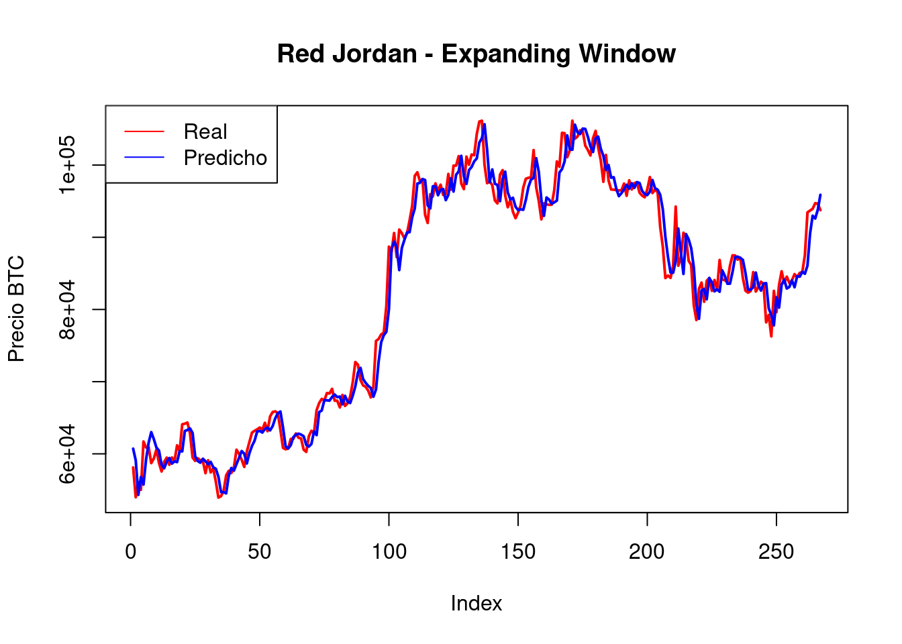


